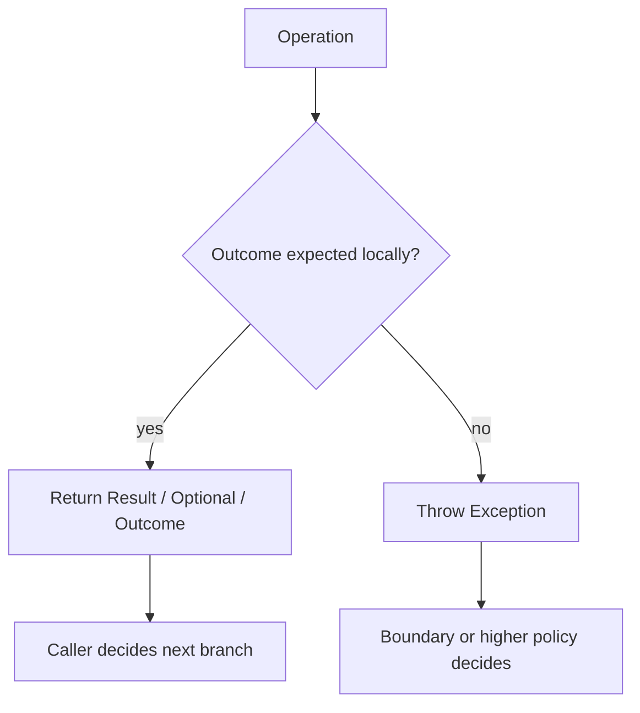
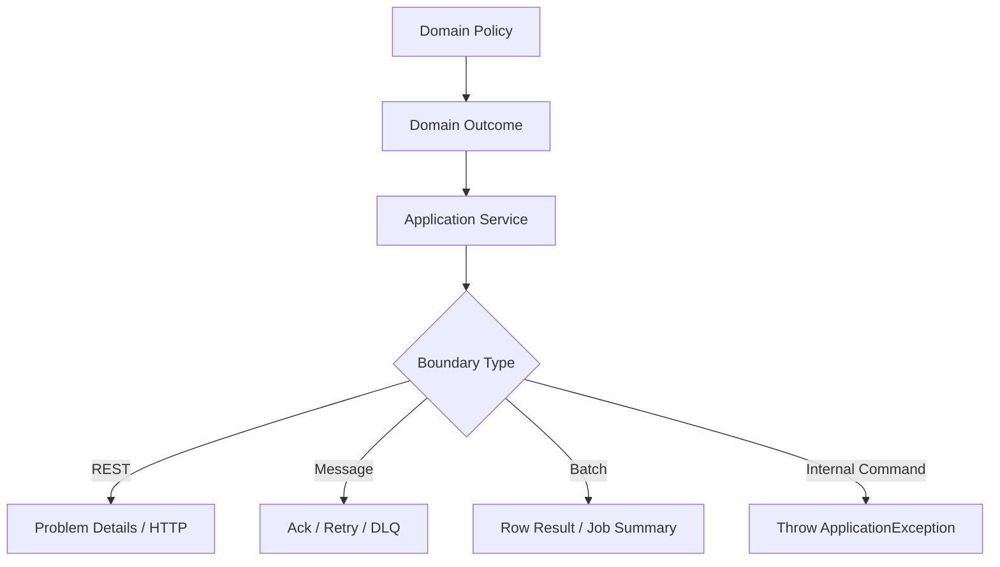
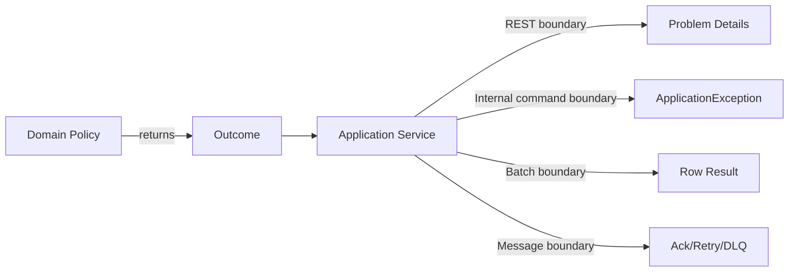
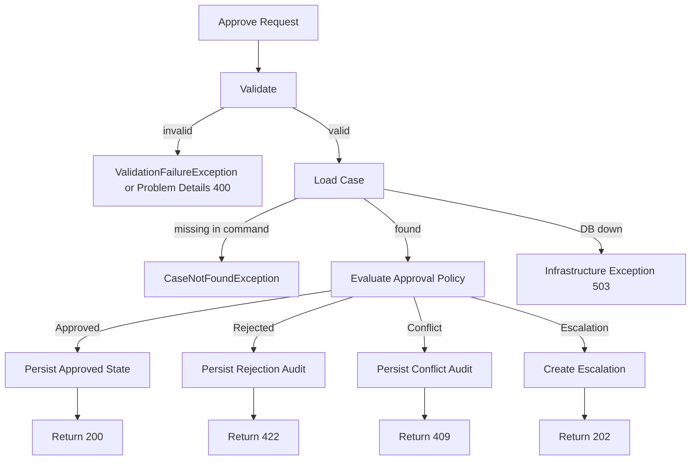

# Part 010 — Result Types & Explicit Errors

Part sebelumnya membahas exception hierarchy. Part ini membahas pertanyaan yang lebih tajam:

> Haruskah failure ini dilempar sebagai exception, atau dikembalikan sebagai value?

Engineer senior tidak menjawab dengan dogma “exception buruk” atau “result type ribet”. Mereka melihat sifat failure:

- Apakah expected dalam alur normal?
- Apakah caller punya keputusan lokal yang masuk akal?
- Apakah failure perlu non-local control transfer?
- Apakah failure perlu menghentikan transaksi?
- Apakah API akan dipakai lintas boundary async/reactive?
- Apakah failure butuh exhaustiveness dan compiler assistance?
- Apakah observability harus mencatatnya sebagai error, rejection, atau normal outcome?

Java tidak punya built-in `Result<T, E>` seperti beberapa bahasa lain. Namun Java punya beberapa alat:

- exception,
- `Optional<T>`,
- sealed interfaces,
- records,
- enums,
- pattern matching/switch pada versi modern,
- third-party libraries jika tim memilihnya,
- domain-specific outcome objects.

Part ini mengajarkan kapan memakai masing-masing.

---

## 1. Target Skill Berdasarkan Kaufman

Setelah part ini, Anda harus bisa:

1. Membedakan exceptional failure dan expected negative outcome.
2. Menggunakan `Optional` hanya untuk “no result”, bukan generic error handling.
3. Mendesain `Result<T, E>` sederhana untuk domain/application layer.
4. Mendesain sealed outcome untuk state-machine dan workflow decision.
5. Menentukan boundary tempat result dikonversi menjadi exception atau Problem Details.
6. Menghindari “exception-driven flow” pada domain path yang sering terjadi.
7. Menghindari result type yang membuat caller mengabaikan error.
8. Menghubungkan explicit errors ke logging, metrics, trace, audit, dan retry policy.

Kaufman decomposition:

| Sub-skill | Latihan |
|---|---|
| Failure classification | Pisahkan expected outcome vs exceptional failure |
| Optional discipline | Gunakan Optional untuk absence saja |
| Result modelling | Buat success/failure value yang typed |
| Sealed outcome | Model closed-set domain decision |
| Boundary conversion | Convert result ke response/exception di edge |
| Observability mapping | Catat failure value tanpa stack trace palsu |

---

## 2. Mental Model: Exception adalah Control Transfer, Result adalah Decision Value

Exception berarti:

> “Saya tidak bisa melanjutkan alur ini secara lokal; serahkan ke handler di atas.”

Result berarti:

> “Saya bisa menyelesaikan operasi ini sebagai value; caller harus memilih cabang berikutnya.”



Contoh expected outcome:

```java
EligibilityResult result = policy.checkEligibility(caseId, actor);

if (result instanceof EligibilityResult.Denied denied) {
    return Decision.rejected(denied.reason());
}
```

Contoh exceptional failure:

```java
try {
    EligibilityResult result = policy.checkEligibility(caseId, actor);
} catch (PolicyEngineTimeoutException e) {
    throw new CaseApprovalUnavailableException(caseId, e);
}
```

Denied adalah keputusan domain. Timeout adalah uncertainty/failure dependency.

---

## 3. Kapan Throw Exception?

Gunakan exception ketika:

1. Caller lokal tidak punya recovery meaningful.
2. Failure harus memotong flow normal.
3. Failure menandakan contract violation atau programmer error.
4. Failure berasal dari dependency/infrastructure dan butuh boundary policy.
5. Anda perlu cause chain dan stack trace untuk debugging.
6. Anda sedang melewati framework boundary yang memang berbasis exception.
7. Operasi harus rollback transaksi secara natural.

Contoh:

```java
public CaseRecord getRequired(CaseId caseId) {
    return repository.findById(caseId)
        .orElseThrow(() -> new CaseNotFoundException(caseId.value()));
}
```

Dalam command, aggregate tidak ada mungkin harus menghentikan use case. Exception masuk akal.

---

## 4. Kapan Return Result?

Gunakan result/outcome ketika:

1. Negative outcome adalah bagian normal dari domain.
2. Caller memang harus memilih cabang bisnis.
3. Anda ingin exhaustiveness pada closed-set outcome.
4. Failure sering terjadi dan stack trace akan noisy/mahal.
5. Anda tidak ingin mencampur domain rejection dengan system failure.
6. Workflow/state-machine butuh audit reason sebagai value.
7. Operation bukan “gagal teknis”, tetapi “keputusan tidak mengizinkan”.

Contoh:

```java
public sealed interface ApprovalDecision
        permits ApprovalDecision.Approved,
                ApprovalDecision.Rejected,
                ApprovalDecision.RequiresEscalation {

    record Approved(String caseId, String approvedBy) implements ApprovalDecision {}

    record Rejected(String caseId, String reasonCode, String reason) implements ApprovalDecision {}

    record RequiresEscalation(String caseId, String escalationReason) implements ApprovalDecision {}
}
```

Caller:

```java
ApprovalDecision decision = approvalPolicy.evaluate(caseRecord, actor);

switch (decision) {
    case ApprovalDecision.Approved approved -> applyApproval(approved);
    case ApprovalDecision.Rejected rejected -> recordRejection(rejected);
    case ApprovalDecision.RequiresEscalation escalation -> escalate(escalation);
}
```

Ini bukan error handling. Ini domain branching.

---

## 5. `Optional<T>`: Absence, Bukan Error

Java `Optional` dirancang terutama sebagai return type ketika ada kebutuhan jelas untuk merepresentasikan “no result” dan penggunaan `null` rawan error.

Cocok:

```java
public Optional<CaseView> findCaseView(CaseId caseId) {
    return repository.findById(caseId).map(mapper::toView);
}
```

Tidak cocok:

```java
public Optional<CaseView> findCaseView(CaseId caseId) {
    try {
        return repository.findById(caseId).map(mapper::toView);
    } catch (SQLException e) {
        return Optional.empty(); // fatal ambiguity
    }
}
```

Masalahnya: caller tidak bisa membedakan:

- case tidak ada,
- database down,
- query timeout,
- mapping gagal,
- permission denied,
- data corrupt.

`Optional.empty()` bukan tempat sampah error.

---

## 6. Optional Misuse Patterns

### 6.1 Optional Parameter

Buruk:

```java
public void search(Optional<String> status, Optional<String> owner) {
    // awkward API
}
```

Lebih baik:

```java
public record CaseSearchCriteria(
    String status,
    String owner
) {}
```

Atau gunakan builder/query object.

### 6.2 Optional Field di Entity

Buruk:

```java
public class CaseEntity {
    private Optional<String> assignedTo;
}
```

Lebih baik:

```java
public class CaseEntity {
    private String assignedTo; // nullable internally if ORM requires it

    public Optional<String> assignedTo() {
        return Optional.ofNullable(assignedTo);
    }
}
```

### 6.3 Optional untuk Validation

Buruk:

```java
Optional<User> validate(CreateUserRequest request)
```

Tidak jelas kenapa empty. Lebih baik:

```java
ValidationResult validate(CreateUserRequest request)
```

atau throw `ValidationFailureException` di boundary command.

---

## 7. Minimal Result Type di Java

Java tidak punya built-in `Result`. Anda bisa membuat minimal sealed interface.

```java
public sealed interface Result<T, E>
        permits Result.Success, Result.Failure {

    record Success<T, E>(T value) implements Result<T, E> {}

    record Failure<T, E>(E error) implements Result<T, E> {}

    static <T, E> Result<T, E> success(T value) {
        return new Success<>(value);
    }

    static <T, E> Result<T, E> failure(E error) {
        return new Failure<>(error);
    }
}
```

Usage:

```java
Result<CaseRecord, CaseFailure> result = caseService.loadCase(caseId);

switch (result) {
    case Result.Success<CaseRecord, CaseFailure> success -> handle(success.value());
    case Result.Failure<CaseRecord, CaseFailure> failure -> handleFailure(failure.error());
}
```

Namun generic result type punya trade-off:

- Java syntax bisa verbose,
- nested generics berat dibaca,
- tanpa discipline, caller bisa mengabaikan failure,
- mapping ke observability harus didesain,
- framework tidak selalu natural dengan result type.

Untuk domain penting, sering lebih baik membuat outcome-specific type.

---

## 8. Domain-Specific Outcome Lebih Jelas daripada Generic Result

Generic:

```java
Result<Approval, ApprovalFailure> approve(CaseRecord caseRecord, Actor actor)
```

Domain-specific:

```java
ApprovalOutcome approve(CaseRecord caseRecord, Actor actor)
```

```java
public sealed interface ApprovalOutcome
        permits ApprovalOutcome.Approved,
                ApprovalOutcome.Rejected,
                ApprovalOutcome.Conflict,
                ApprovalOutcome.RequiresEscalation {

    String caseId();

    record Approved(String caseId, String approvalId) implements ApprovalOutcome {}

    record Rejected(String caseId, String reasonCode, String reason) implements ApprovalOutcome {}

    record Conflict(String caseId, String currentState, String attemptedAction) implements ApprovalOutcome {}

    record RequiresEscalation(String caseId, String reason) implements ApprovalOutcome {}
}
```

Caller lebih ekspresif:

```java
ApprovalOutcome outcome = approvalService.approve(caseRecord, actor);

switch (outcome) {
    case ApprovalOutcome.Approved approved -> publishApproved(approved);
    case ApprovalOutcome.Rejected rejected -> publishRejected(rejected);
    case ApprovalOutcome.Conflict conflict -> returnConflict(conflict);
    case ApprovalOutcome.RequiresEscalation escalation -> createEscalation(escalation);
}
```

Ini cocok untuk workflow, BPMN-like orchestration, regulatory lifecycle, dan state-machine domain.

---

## 9. Result Type Tidak Mengganti Exception untuk Infrastructure Failure

Jangan mengubah semua failure menjadi result.

Buruk:

```java
Result<CaseRecord, String> loadCase(String caseId) {
    try {
        return Result.success(repository.get(caseId));
    } catch (SQLException e) {
        return Result.failure("db failed");
    }
}
```

Masalah:

- cause chain hilang,
- stack trace hilang atau tidak jelas,
- retryability tidak eksplisit,
- transaction rollback bisa tidak terjadi,
- caller mungkin lupa handle,
- system failure terlihat seperti domain outcome.

Lebih baik:

```java
public Optional<CaseRecord> findById(CaseId caseId) {
    try {
        return jdbcFind(caseId);
    } catch (SQLException e) {
        throw new CaseRepositoryUnavailableException(e);
    }
}
```

Lalu domain service memutuskan:

```java
public LoadCaseOutcome loadForReview(CaseId caseId) {
    return repository.findById(caseId)
        .<LoadCaseOutcome>map(LoadCaseOutcome.Found::new)
        .orElseGet(() -> new LoadCaseOutcome.NotFound(caseId.value()));
}
```

Infrastructure failure tetap exception. Absence jadi value.

---

## 10. Explicit Failure Model

Buat failure sebagai type jika failure itu bagian dari domain conversation.

```java
public sealed interface CaseFailure
        permits CaseFailure.NotFound,
                CaseFailure.StateConflict,
                CaseFailure.PolicyDenied,
                CaseFailure.ValidationFailed {

    ErrorCode errorCode();

    record NotFound(String caseId) implements CaseFailure {
        @Override
        public ErrorCode errorCode() {
            return ErrorCode.CASE_NOT_FOUND;
        }
    }

    record StateConflict(
        String caseId,
        String currentState,
        String attemptedAction
    ) implements CaseFailure {
        @Override
        public ErrorCode errorCode() {
            return ErrorCode.CASE_TRANSITION_NOT_ALLOWED;
        }
    }

    record PolicyDenied(
        String caseId,
        String policyCode
    ) implements CaseFailure {
        @Override
        public ErrorCode errorCode() {
            return ErrorCode.CASE_POLICY_DENIED;
        }
    }

    record ValidationFailed(List<FieldViolation> violations) implements CaseFailure {
        @Override
        public ErrorCode errorCode() {
            return ErrorCode.VALIDATION_FAILED;
        }
    }
}
```

Keuntungan:

- error shape eksplisit,
- audit reason bisa disimpan,
- compiler membantu mapping,
- tidak perlu stack trace untuk expected rejection,
- logs/metrics bisa lebih bersih,
- business workflow lebih mudah dibaca.

---

## 11. Boundary Conversion: Result ke Exception atau Response

Jangan biarkan result type bocor ke semua layer tanpa aturan.



Contoh REST mapper:

```java
public ResponseEntity<?> approve(String caseId, Actor actor) {
    ApprovalOutcome outcome = service.approve(caseId, actor);

    return switch (outcome) {
        case ApprovalOutcome.Approved approved -> ResponseEntity.ok(toDto(approved));
        case ApprovalOutcome.Rejected rejected -> ResponseEntity.unprocessableEntity()
            .body(problemMapper.fromRejected(rejected));
        case ApprovalOutcome.Conflict conflict -> ResponseEntity.status(409)
            .body(problemMapper.fromConflict(conflict));
        case ApprovalOutcome.RequiresEscalation escalation -> ResponseEntity.accepted()
            .body(toDto(escalation));
    };
}
```

Contoh internal command yang memilih exception:

```java
public void approveOrThrow(String caseId, Actor actor) {
    ApprovalOutcome outcome = service.approve(caseId, actor);

    switch (outcome) {
        case ApprovalOutcome.Approved ignored -> {
            return;
        }
        case ApprovalOutcome.Rejected rejected -> throw new CaseRejectedException(rejected);
        case ApprovalOutcome.Conflict conflict -> throw new CaseStateConflictException(
            conflict.caseId(),
            conflict.currentState(),
            conflict.attemptedAction(),
            ErrorCode.CASE_TRANSITION_NOT_ALLOWED
        );
        case ApprovalOutcome.RequiresEscalation escalation -> throw new CaseRequiresEscalationException(escalation);
    }
}
```

Boundary decides representation.

---

## 12. Transaction Boundary Consideration

Framework transaction management sering rollback berdasarkan exception. Jika Anda memakai result type, pastikan failure tetap mengatur transaction outcome dengan sadar.

Contoh salah:

```java
@Transactional
public Result<Approval, ApprovalFailure> approve(CaseId caseId) {
    CaseRecord record = repository.getRequired(caseId);

    if (record.isClosed()) {
        auditRepository.save(rejectedAudit(record));
        return Result.failure(new ApprovalFailure.Conflict(caseId.value()));
    }

    repository.save(record.approve());
    return Result.success(new Approval(record.id().value()));
}
```

Ini mungkin benar jika audit rejection memang harus committed. Tetapi salah jika caller menganggap failure akan rollback semua perubahan.

Rule:

| Outcome | Transaction Behavior |
|---|---|
| Domain rejection with audit | Commit audit, return rejection |
| Validation failure before mutation | No mutation, return/throw |
| Infrastructure failure | Throw, rollback |
| Conflict after mutation detected | Throw or explicit compensating path |
| Partial success batch | Commit per item atau save job summary, jangan ambigu |

Result type membuat transaction semantics harus eksplisit.

---

## 13. Batch Processing: Result Sering Lebih Baik

Dalam batch, per-item failure sering bukan alasan menghentikan seluruh job.

```java
public record RowResult(
    int rowNumber,
    String externalId,
    RowStatus status,
    String errorCode,
    String message
) {}
```

```java
public List<RowResult> importCases(List<CaseImportRow> rows) {
    List<RowResult> results = new ArrayList<>();

    for (int i = 0; i < rows.size(); i++) {
        CaseImportRow row = rows.get(i);
        try {
            CaseImportOutcome outcome = importOne(row);
            results.add(RowResultMapper.from(i + 1, row, outcome));
        } catch (InfrastructureException e) {
            throw e; // stop job; system failure
        }
    }

    return results;
}
```

Per-item validation/domain rejection menjadi row result. Database down tetap exception.

---

## 14. Message Processing: Result vs Exception Menentukan Ack/Nack

Dalam consumer message:

- domain duplicate mungkin ack,
- validation poison message mungkin DLQ,
- dependency timeout mungkin retry,
- programmer bug mungkin DLQ + alert,
- unknown outcome mungkin idempotency check.

```java
public MessageHandlingResult handle(CommandMessage message) {
    try {
        CommandOutcome outcome = commandService.handle(message);
        return switch (outcome) {
            case CommandOutcome.Applied applied -> MessageHandlingResult.ack();
            case CommandOutcome.Duplicate duplicate -> MessageHandlingResult.ack();
            case CommandOutcome.Rejected rejected -> MessageHandlingResult.deadLetter(rejected.errorCode());
        };
    } catch (DependencyTimeoutException e) {
        return MessageHandlingResult.retryLater(e.retryability());
    } catch (ApplicationException e) {
        return MessageHandlingResult.deadLetter(e.errorCode());
    }
}
```

Jangan menjadikan semua negative outcome exception karena message infrastructure akan salah menafsirkan policy retry.

---

## 15. Async APIs dan CompletableFuture

`CompletableFuture<T>` membawa failure lewat exceptional completion.

```java
CompletableFuture<CaseView> future = service.loadCaseAsync(caseId);

future.exceptionally(ex -> fallbackCaseView());
```

Masalah: exception dalam async flow sering dibungkus `CompletionException`.

```java
public static Throwable unwrapCompletion(Throwable throwable) {
    if (throwable instanceof CompletionException || throwable instanceof ExecutionException) {
        return throwable.getCause() == null ? throwable : throwable.getCause();
    }
    return throwable;
}
```

Untuk expected domain outcome, result bisa membuat flow lebih jelas:

```java
CompletableFuture<ApprovalOutcome> future = service.approveAsync(caseId, actor);
```

Lalu exceptional completion hanya untuk system failure.

Rule:

| Async Outcome | Representation |
|---|---|
| Approved/rejected/escalated | `CompletableFuture<ApprovalOutcome>` successful completion |
| Dependency timeout | exceptional completion |
| Programmer bug | exceptional completion |
| Cancellation | cancellation/exceptional completion |

---

## 16. Reactive Flow

Dalam reactive programming, error channel biasanya terminal. Jika domain rejection adalah normal branch, jangan kirim ke error channel.

Conceptual example:

```java
Mono<ApprovalOutcome> approve(CaseId caseId, Actor actor)
```

Lebih baik daripada:

```java
Mono<Approval> approve(CaseId caseId, Actor actor)
// emits error for normal rejection
```

Jika rejection masuk error channel:

- stream berhenti,
- retry operator bisa salah aktif,
- metrics error rate naik palsu,
- handler membedakan domain vs system dengan susah.

Gunakan error channel untuk system failure, cancellation, invalid technical state, atau dependency failure.

---

## 17. Observability untuk Result Type

Jika result tidak throw exception, instrumentation harus tetap mencatat outcome penting.

```java
public ApprovalOutcome approve(CaseId caseId, Actor actor) {
    ApprovalOutcome outcome = approvalPolicy.evaluate(caseId, actor);

    switch (outcome) {
        case ApprovalOutcome.Approved ignored -> metrics.increment("approval.outcome", "result", "approved");
        case ApprovalOutcome.Rejected rejected -> metrics.increment(
            "approval.outcome",
            "result", "rejected",
            "reason", rejected.reasonCode()
        );
        case ApprovalOutcome.Conflict conflict -> metrics.increment(
            "approval.outcome",
            "result", "conflict",
            "state", conflict.currentState()
        );
        case ApprovalOutcome.RequiresEscalation ignored -> metrics.increment("approval.outcome", "result", "escalation");
    }

    return outcome;
}
```

Hati-hati cardinality:

- `reasonCode` aman jika finite,
- `caseId` tidak aman sebagai metric label,
- `message` tidak aman sebagai metric label,
- user-provided text tidak aman.

Trace event:

```java
span.addEvent("approval.outcome", Attributes.of(
    stringKey("approval.result"), "rejected",
    stringKey("approval.reason_code"), rejected.reasonCode()
));
```

Log:

```java
log.info(
    "approval_rejected caseId={} reasonCode={}",
    rejected.caseId(),
    rejected.reasonCode()
);
```

Tidak semua rejection butuh stack trace.

---

## 18. Result Type dan Audit Trail

Untuk regulatory systems, explicit outcome sering lebih kuat daripada exception karena outcome adalah domain evidence.

```java
public record DecisionAuditEntry(
    String caseId,
    String actorId,
    String decision,
    String reasonCode,
    Instant decidedAt
) {}
```

```java
public void recordDecision(ApprovalOutcome outcome, Actor actor) {
    DecisionAuditEntry entry = switch (outcome) {
        case ApprovalOutcome.Approved approved -> new DecisionAuditEntry(
            approved.caseId(), actor.id(), "APPROVED", null, clock.instant()
        );
        case ApprovalOutcome.Rejected rejected -> new DecisionAuditEntry(
            rejected.caseId(), actor.id(), "REJECTED", rejected.reasonCode(), clock.instant()
        );
        case ApprovalOutcome.Conflict conflict -> new DecisionAuditEntry(
            conflict.caseId(), actor.id(), "CONFLICT", "STATE_CONFLICT", clock.instant()
        );
        case ApprovalOutcome.RequiresEscalation escalation -> new DecisionAuditEntry(
            escalation.caseId(), actor.id(), "ESCALATED", "REQUIRES_ESCALATION", clock.instant()
        );
    };

    auditRepository.save(entry);
}
```

Exception stack trace bukan audit trail. Audit trail harus menjelaskan decision, actor, time, rule/reason, and resulting state.

---

## 19. Hybrid Pattern: Result Internally, Exception at Command Boundary

Dalam banyak codebase, pola terbaik adalah hybrid.



Domain pure function:

```java
public ApprovalOutcome evaluate(CaseRecord record, Actor actor) {
    if (!actor.canApprove(record)) {
        return new ApprovalOutcome.Rejected(
            record.id().value(),
            "ACTOR_NOT_ALLOWED",
            "Actor is not allowed to approve this case"
        );
    }

    if (record.isClosed()) {
        return new ApprovalOutcome.Conflict(
            record.id().value(),
            record.status().name(),
            "APPROVE"
        );
    }

    return new ApprovalOutcome.Approved(record.id().value(), UUID.randomUUID().toString());
}
```

Application command:

```java
@Transactional
public ApprovalOutcome approve(String caseId, Actor actor) {
    CaseRecord record = repository.getRequired(new CaseId(caseId));
    ApprovalOutcome outcome = policy.evaluate(record, actor);

    switch (outcome) {
        case ApprovalOutcome.Approved approved -> repository.save(record.approve(approved.approvalId()));
        case ApprovalOutcome.Rejected rejected -> auditRepository.save(rejectionAudit(rejected, actor));
        case ApprovalOutcome.Conflict conflict -> auditRepository.save(conflictAudit(conflict, actor));
        case ApprovalOutcome.RequiresEscalation escalation -> escalationRepository.create(escalation);
    }

    return outcome;
}
```

Boundary decides external shape.

---

## 20. Do Not Make Caller Ignore Failure

Result type di Java tidak otomatis memaksa caller handle failure. Caller bisa melakukan ini:

```java
Result<CaseRecord, CaseFailure> result = service.loadCase(caseId);
// ignored
```

Mitigation:

1. Gunakan domain-specific outcome dengan nama jelas.
2. Hindari method yang return result tetapi caller tidak memakai return value.
3. Tambahkan tests pada use case boundary.
4. Gunakan static analysis jika tersedia.
5. Jangan return `Result<Void, E>` sembarangan untuk command penting; pertimbangkan outcome type.
6. Buat method terminal eksplisit: `orElseThrow`, `fold`, `mapFailure` jika memakai Result helper.

Minimal helper:

```java
public sealed interface Result<T, E> permits Result.Success, Result.Failure {
    record Success<T, E>(T value) implements Result<T, E> {}
    record Failure<T, E>(E error) implements Result<T, E> {}

    default <R> R fold(Function<T, R> onSuccess, Function<E, R> onFailure) {
        return switch (this) {
            case Success<T, E> success -> onSuccess.apply(success.value());
            case Failure<T, E> failure -> onFailure.apply(failure.error());
        };
    }
}
```

Usage:

```java
return service.loadCase(caseId).fold(
    ResponseEntity::ok,
    failure -> ResponseEntity.status(404).body(problemMapper.from(failure))
);
```

---

## 21. Result Type vs Validation Accumulation

Validation sering butuh accumulate multiple errors, bukan fail-fast exception.

```java
public record ValidationResult(List<FieldViolation> violations) {
    public boolean isValid() {
        return violations.isEmpty();
    }

    public static ValidationResult valid() {
        return new ValidationResult(List.of());
    }

    public static ValidationResult invalid(List<FieldViolation> violations) {
        return new ValidationResult(List.copyOf(violations));
    }
}
```

```java
public ValidationResult validate(CreateCaseRequest request) {
    List<FieldViolation> violations = new ArrayList<>();

    if (request.title() == null || request.title().isBlank()) {
        violations.add(new FieldViolation("title", "REQUIRED", "Title is required"));
    }

    if (request.priority() == null) {
        violations.add(new FieldViolation("priority", "REQUIRED", "Priority is required"));
    }

    return violations.isEmpty()
        ? ValidationResult.valid()
        : ValidationResult.invalid(violations);
}
```

At boundary:

```java
ValidationResult validation = validator.validate(request);
if (!validation.isValid()) {
    throw new ValidationFailureException(validation.violations());
}
```

Hybrid: validation engine returns value; API boundary throws/maps exception.

---

## 22. Result Type and Retry Semantics

Result failure harus punya retry semantics jika caller bisa retry.

```java
public sealed interface SubmissionFailure
        permits SubmissionFailure.Invalid,
                SubmissionFailure.Duplicate,
                SubmissionFailure.TemporarilyUnavailable {

    ErrorCode errorCode();
    Retryability retryability();

    record Invalid(List<FieldViolation> violations) implements SubmissionFailure {
        @Override public ErrorCode errorCode() { return ErrorCode.VALIDATION_FAILED; }
        @Override public Retryability retryability() { return Retryability.NEVER; }
    }

    record Duplicate(String idempotencyKey) implements SubmissionFailure {
        @Override public ErrorCode errorCode() { return ErrorCode.DUPLICATE_REQUEST; }
        @Override public Retryability retryability() { return Retryability.NEVER; }
    }

    record TemporarilyUnavailable(String dependency) implements SubmissionFailure {
        @Override public ErrorCode errorCode() { return ErrorCode.DEPENDENCY_TIMEOUT; }
        @Override public Retryability retryability() { return Retryability.SAFE_AFTER_DELAY; }
    }
}
```

Namun perhatikan: `TemporarilyUnavailable` yang berasal dari actual timeout sering lebih tepat sebagai exception agar cause chain dan stack trace terjaga. Gunakan result failure untuk temporary business condition, bukan technical exception yang butuh debugging.

---

## 23. Result Type and Idempotency

Explicit outcome sangat membantu idempotency.

```java
public sealed interface CommandOutcome
        permits CommandOutcome.Applied,
                CommandOutcome.AlreadyApplied,
                CommandOutcome.Rejected {

    record Applied(String commandId, String aggregateId) implements CommandOutcome {}

    record AlreadyApplied(String commandId, String aggregateId) implements CommandOutcome {}

    record Rejected(String commandId, ErrorCode errorCode, String reason) implements CommandOutcome {}
}
```

`AlreadyApplied` bukan error. Ini outcome valid untuk retry duplicate.

```java
CommandOutcome outcome = commandHandler.handle(command);

switch (outcome) {
    case CommandOutcome.Applied applied -> return ok(applied);
    case CommandOutcome.AlreadyApplied already -> return ok(already);
    case CommandOutcome.Rejected rejected -> return unprocessable(rejected);
}
```

Ini lebih robust daripada melempar `DuplicateCommandException` lalu berharap semua boundary menafsirkannya dengan benar.

---

## 24. Performance Consideration

Exception membawa cost karena stack trace capture dan control transfer. Tetapi performance bukan alasan utama memilih result.

Alasan utama adalah semantics.

Gunakan result jika outcome adalah bagian normal dari domain. Gunakan exception jika failure butuh non-local failure handling.

Jangan optimasi prematur dengan mengganti semua exception menjadi error code integer. Itu membuat debugging dan correctness lebih buruk.

Jika ada hot path yang sering membuat exception untuk kontrol normal, itu smell.

Buruk:

```java
for (String id : ids) {
    try {
        CaseRecord record = repository.getRequired(id);
        process(record);
    } catch (CaseNotFoundException ignored) {
        // expected for many ids
    }
}
```

Lebih baik:

```java
for (String id : ids) {
    repository.findById(new CaseId(id)).ifPresent(this::process);
}
```

---

## 25. API Design Matrix

Gunakan matriks ini.

| Situation | Recommended Representation |
|---|---|
| Query may not find entity | `Optional<T>` |
| Command target missing | Exception or domain outcome depending boundary |
| Validation multiple errors | `ValidationResult`, then exception/Problem Details at boundary |
| Business rule denies action | Domain outcome or domain exception |
| State-machine transition not allowed | Domain outcome if expected, exception if command boundary |
| Database unavailable | Exception |
| External timeout | Exception, with retryability/idempotency metadata |
| Duplicate idempotent command | Explicit outcome |
| Batch row invalid | Row result |
| Batch infrastructure down | Exception stop job |
| Message poison payload | Handling result: DLQ/reject |
| Programmer contract violation | `IllegalArgumentException` / `IllegalStateException` |
| No value because optional relation absent | `Optional<T>` |
| Security access denied | Exception at boundary, generic public response |

---

## 26. Pattern: `find`, `getRequired`, `loadForCommand`

A clean repository/application API often separates intent by method name.

```java
public interface CaseRepository {
    Optional<CaseRecord> findById(CaseId caseId);

    default CaseRecord getRequired(CaseId caseId) {
        return findById(caseId)
            .orElseThrow(() -> new CaseNotFoundException(caseId.value()));
    }
}
```

Application service:

```java
public Optional<CaseView> findView(String caseId) {
    return repository.findById(new CaseId(caseId)).map(mapper::toView);
}

public ApprovalOutcome approve(String caseId, Actor actor) {
    CaseRecord record = repository.getRequired(new CaseId(caseId));
    return approvalService.approve(record, actor);
}
```

Method name communicates error semantics.

---

## 27. Pattern: `tryX` for Non-Throwing Domain Attempt

```java
public ApprovalOutcome tryApprove(CaseRecord record, Actor actor) {
    if (!actor.canApprove(record)) {
        return new ApprovalOutcome.Rejected(
            record.id().value(),
            "ACTOR_NOT_ALLOWED",
            "Actor cannot approve this case"
        );
    }

    if (!record.canTransitionTo(CaseStatus.APPROVED)) {
        return new ApprovalOutcome.Conflict(
            record.id().value(),
            record.status().name(),
            "APPROVE"
        );
    }

    return new ApprovalOutcome.Approved(record.id().value(), newApprovalId());
}
```

Naming convention:

| Prefix | Semantics |
|---|---|
| `find` | may return empty |
| `getRequired` | throws if absent |
| `try` | returns outcome/result, expected failure not thrown |
| `require` | throws on contract violation |
| `validate` | returns validation result or throws depending layer |
| `execute` / `handle` | boundary policy applies |

---

## 28. Anti-Patterns

### 28.1 Returning Null as Error

```java
return null;
```

Caller loses reason and compiler help.

### 28.2 Optional Empty for Any Failure

```java
catch (Exception e) {
    return Optional.empty();
}
```

This destroys observability.

### 28.3 Result with String Error

```java
Result<Case, String>
```

String is not a failure model. Use typed failure.

### 28.4 Throwing for Normal Branch

```java
try {
    approve(caseId);
} catch (CaseAlreadyClosedException e) {
    showClosedMessage();
}
```

If closed state is common branch, return outcome.

### 28.5 Result Everywhere

If every method returns `Result<Result<Result<T>>>`, code becomes unreadable and infrastructure failure loses stack context.

### 28.6 Ignored Result

```java
service.approve(caseId, actor); // returns outcome, ignored
```

For command methods, avoid return types that are easy to ignore unless tests/static analysis enforce usage.

---

## 29. Testing Explicit Errors

### 29.1 Exhaustive Outcome Test

```java
@Test
void closedCaseReturnsConflictOutcome() {
    CaseRecord closed = CaseRecord.closed("CASE-1");

    ApprovalOutcome outcome = policy.tryApprove(closed, supervisor());

    assertInstanceOf(ApprovalOutcome.Conflict.class, outcome);
}
```

### 29.2 Boundary Mapping Test

```java
@Test
void conflictOutcomeMapsToProblemDetails409() {
    var outcome = new ApprovalOutcome.Conflict("CASE-1", "CLOSED", "APPROVE");

    var response = controller.map(outcome);

    assertEquals(409, response.statusCode().value());
}
```

### 29.3 Infrastructure Still Throws

```java
@Test
void repositoryFailureIsNotConvertedToEmptyOptional() {
    repository.stubFailure(new SQLException("connection refused"));

    assertThrows(
        CaseRepositoryUnavailableException.class,
        () -> service.findView("CASE-1")
    );
}
```

### 29.4 Audit Recorded for Rejection

```java
@Test
void rejectionOutcomeCreatesAuditEntry() {
    ApprovalOutcome outcome = service.approve("CASE-1", unauthorizedActor());

    assertInstanceOf(ApprovalOutcome.Rejected.class, outcome);
    assertTrue(auditRepository.existsFor("CASE-1", "REJECTED"));
}
```

---

## 30. Mini Capstone: Approval Flow

Design:

```text
Input request
  -> validate request: ValidationResult
  -> load aggregate: Optional or exception depending use case
  -> evaluate policy: ApprovalOutcome
  -> persist state/audit based on outcome
  -> boundary maps outcome to HTTP/message/job result
  -> infrastructure failure remains exception
```

Mermaid:



Key insight: not all non-success outcomes are exceptions. Not all failures are safe values.

---

## 31. Deliberate Practice

### Exercise 1 — Classify 20 Failures

Ambil 20 failure dari service Anda. Label masing-masing:

```text
Failure | Expected? | Caller can decide? | Needs stack trace? | Needs audit? | Suggested representation
```

### Exercise 2 — Replace Exception-Driven Domain Flow

Cari satu flow yang memakai exception untuk state conflict yang expected. Refactor menjadi sealed outcome.

### Exercise 3 — Protect Infrastructure Failure

Cari method yang mengubah exception menjadi `Optional.empty()`, `false`, atau `null`. Refactor agar system failure tetap exception.

### Exercise 4 — Add Boundary Mapper

Buat mapper dari outcome ke:

- HTTP response,
- message ack/retry/DLQ,
- batch row result.

### Exercise 5 — Add Observability

Untuk outcome utama, tambahkan:

- metric low-cardinality,
- log event tanpa stack trace palsu,
- trace event dengan reason code,
- audit entry jika domain significant.

---

## 32. Review Checklist

- [ ] `Optional` hanya dipakai untuk absence, bukan generic failure.
- [ ] Expected domain rejection tidak selalu dilempar sebagai exception.
- [ ] Infrastructure/dependency failure tidak disembunyikan sebagai empty result.
- [ ] Result failure typed, bukan string bebas.
- [ ] Outcome sealed jika closed-set dan compiler assistance berguna.
- [ ] Boundary conversion jelas.
- [ ] Transaction semantics jelas untuk failure value.
- [ ] Batch per-item failures tidak menghentikan job kecuali system failure.
- [ ] Message ack/retry/DLQ policy tidak bergantung pada exception generik.
- [ ] Observability tetap mencatat important negative outcome.
- [ ] Metric labels low-cardinality.
- [ ] Audit trail mencatat domain decision, bukan stack trace.

---

## 33. Key Takeaways

1. Exception adalah non-local control transfer; result adalah decision value.
2. `Optional` cocok untuk absence, bukan error handling umum.
3. Domain rejection yang expected sering lebih baik sebagai explicit outcome.
4. Infrastructure failure tetap exception agar cause chain, rollback, retry, dan observability tidak rusak.
5. Sealed interfaces + records memberi cara modern untuk typed domain outcomes di Java.
6. Result type membutuhkan boundary policy, transaction policy, dan observability policy.
7. Jangan mengganti semua exception dengan result; pilih berdasarkan semantics.
8. Workflow, regulatory lifecycle, batch, idempotency, dan state-machine sering sangat diuntungkan oleh explicit outcome.

---

## 34. References

- Java SE 25 API — `Optional`: https://docs.oracle.com/en/java/javase/25/docs/api/java.base/java/util/Optional.html
- Java SE 25 API — `Throwable`: https://docs.oracle.com/en/java/javase/25/docs/api/java.base/java/lang/Throwable.html
- Java SE 25 API — `RuntimeException`: https://docs.oracle.com/en/java/javase/25/docs/api/java.base/java/lang/RuntimeException.html
- Java Language Specification Java SE 25 — Chapter 11 Exceptions: https://docs.oracle.com/javase/specs/jls/se25/html/jls-11.html
- Oracle Java Language Guide — Sealed Classes and Interfaces: https://docs.oracle.com/en/java/javase/17/language/sealed-classes-and-interfaces.html
