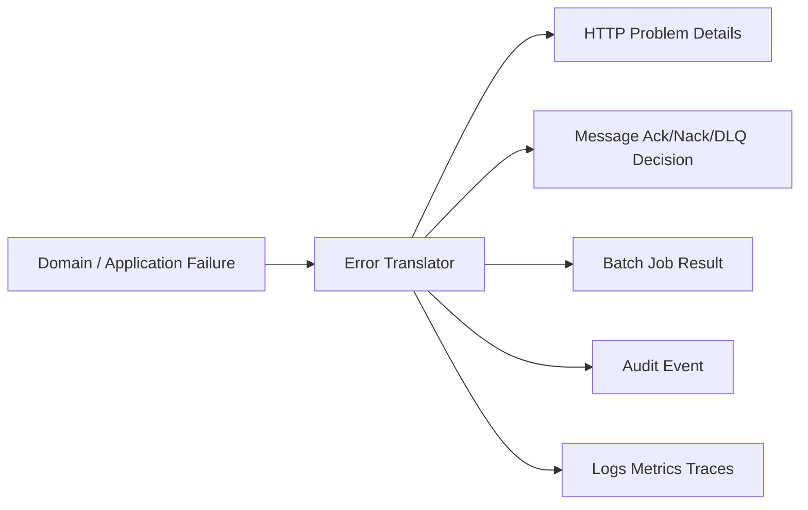
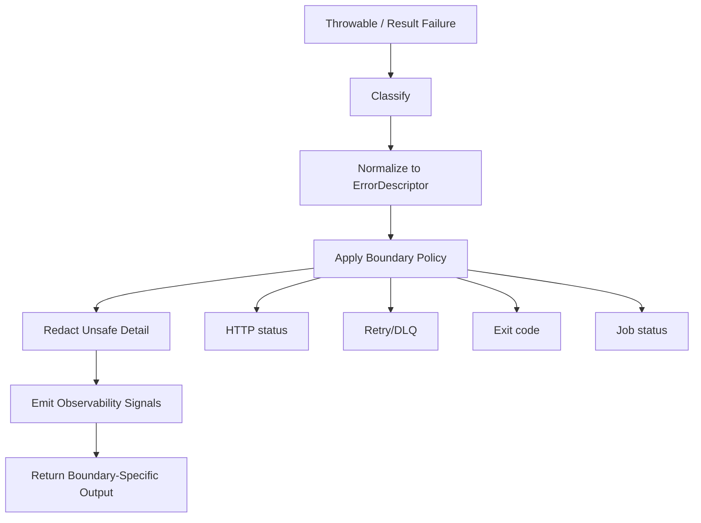
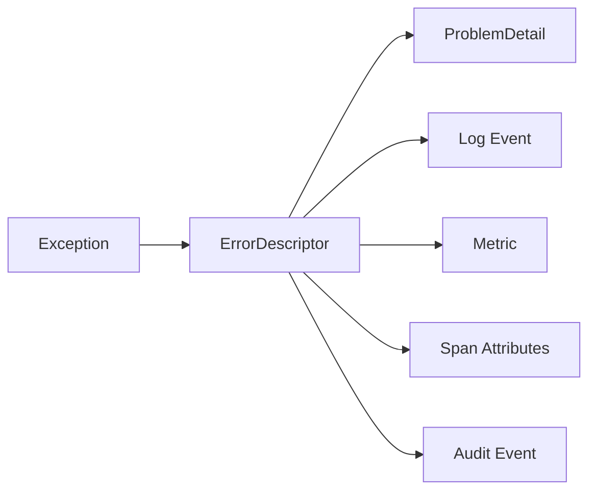
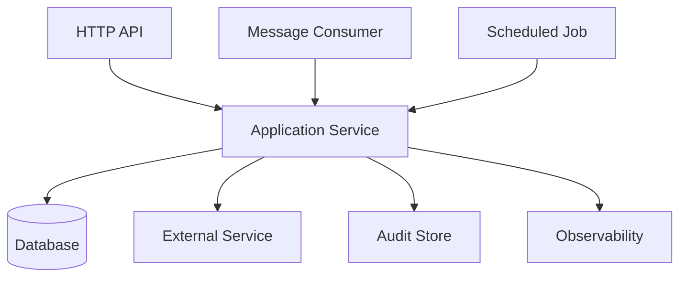

# Part 011 — Boundary Error Translation

Part sebelumnya membahas kapan failure dikembalikan sebagai value dan kapan dilempar sebagai exception. Part ini membahas pertanyaan berikutnya:

> Setelah failure terjadi di dalam sistem, bagaimana failure tersebut diterjemahkan saat melewati boundary?

Boundary adalah tempat error berubah bentuk. Di domain layer, failure mungkin berbentuk `CaseCannotBeEscalated`. Di HTTP boundary, failure itu menjadi `409 Conflict` atau `422 Unprocessable Content` dengan Problem Details. Di message boundary, failure itu mungkin menjadi `ack`, `nack`, retry, dead-letter, atau manual review. Di job boundary, failure itu mungkin menjadi `FAILED`, `PARTIAL_SUCCESS`, atau `RETRY_SCHEDULED`.

Engineer yang kuat tidak membiarkan exception internal bocor begitu saja ke client, log, dashboard, atau queue. Mereka membuat translation layer yang eksplisit, stabil, aman, dan observable.

---

## 1. Target Skill Berdasarkan Kaufman

Setelah part ini, Anda harus bisa:

1. Mengidentifikasi boundary utama dalam aplikasi Java produksi.
2. Memisahkan internal failure model dari external error contract.
3. Mendesain translator error per boundary: HTTP, messaging, job, persistence, integration, CLI.
4. Menjaga stable error code walaupun implementation berubah.
5. Menghindari leak stack trace, SQL detail, dependency detail, dan security-sensitive data.
6. Menentukan status HTTP, retry instruction, severity, audit event, metric, dan trace attribute dari satu failure.
7. Mendesain fallback translation untuk unknown exception.
8. Membuat error translation yang testable dan defensible.

Kaufman decomposition:

| Sub-skill | Latihan |
|---|---|
| Boundary identification | Gambar semua tempat error keluar dari layer asalnya |
| Contract mapping | Map domain/infrastructure failure ke external representation |
| Safety filtering | Hapus detail internal dari response/client-visible payload |
| Policy decision | Tentukan retryable, user-fixable, support-actionable, alertable |
| Observability mapping | Hubungkan error code ke log, metric, trace, audit |
| Regression testing | Lock mapping agar tidak berubah tanpa sadar |

---

## 2. Mental Model: Boundary adalah Anti-Corruption Layer untuk Failure

Dalam domain-driven design, anti-corruption layer mencegah model eksternal mengotori model internal. Prinsip yang sama berlaku untuk error.

Internal error menjawab:

> “Apa yang gagal menurut model sistem kita?”

External error menjawab:

> “Apa yang perlu diketahui consumer untuk mengambil langkah berikutnya secara aman?”

Dua pertanyaan ini tidak sama.

Contoh internal:

```java
throw new CaseStateConflictException(
    ErrorCode.CASE_ESCALATION_INVALID_STATE,
    caseId,
    CaseStatus.CLOSED,
    "Only OPEN or UNDER_REVIEW cases can be escalated"
);
```

Contoh external:

```json
{
  "type": "https://errors.example.com/case-escalation-invalid-state",
  "title": "Case cannot be escalated",
  "status": 409,
  "detail": "The case is not in a state that allows escalation.",
  "instance": "/cases/C-2026-00091/escalations/request-7f2e",
  "code": "CASE_ESCALATION_INVALID_STATE",
  "correlationId": "01JZ...",
  "retryable": false
}
```

Perhatikan beda fokusnya:

| Internal | External |
|---|---|
| Bisa menyimpan enum state sebenarnya | Tidak selalu perlu membuka state internal |
| Bisa menyimpan cause chain | Tidak menampilkan stack trace |
| Bisa menyimpan diagnostic attributes | Hanya expose safe attributes |
| Bisa mengarah ke remediation internal | Mengarah ke tindakan caller/user |
| Bisa berubah saat refactor | Harus relatif stabil |

Boundary translation adalah proses mengubah failure dari bentuk internal menjadi bentuk yang tepat untuk audience boundary.



---

## 3. Apa Itu Boundary?

Boundary bukan hanya REST controller.

Boundary adalah semua titik di mana error:

- keluar dari layer asalnya,
- melewati trust boundary,
- melewati process boundary,
- berubah audience,
- berubah semantic,
- mengubah reliability policy.

Boundary umum di aplikasi Java:

| Boundary | Internal Input | External Output |
|---|---|---|
| HTTP API | exception/result | HTTP status + Problem Details |
| GraphQL | exception/result | GraphQL errors extension |
| gRPC | exception/result | status code + metadata |
| Messaging consumer | exception/result | ack/nack/retry/DLQ |
| Messaging producer | broker exception | publish result/retry/outbox status |
| Persistence | SQL/driver exception | domain/application failure |
| External API client | HTTP/network failure | dependency failure model |
| Batch job | per-item failure | job summary, partial result, retry plan |
| Scheduler | task exception | next run decision, alert, dead task |
| CLI/admin command | domain failure | exit code + human-readable output |
| UI/backend-for-frontend | domain/API failure | localized user-facing error |
| Observability | all failures | log event, metric, span status, audit trail |

Dalam sistem besar, satu internal error bisa melewati beberapa boundary sekaligus.

Contoh:

1. `SQLException` terjadi saat menyimpan enforcement action.
2. Persistence adapter menerjemahkan menjadi `RepositoryUnavailableException`.
3. Application service menerjemahkan menjadi `CASE_UPDATE_TEMPORARILY_UNAVAILABLE`.
4. HTTP handler menerjemahkan menjadi `503 Service Unavailable` Problem Details.
5. Observability mapper mencatat metric `case.update.failure{code="CASE_UPDATE_TEMPORARILY_UNAVAILABLE"}`.
6. Trace span diberi status error.
7. Audit trail mencatat update gagal tanpa expose SQL detail.

Jika translation tidak eksplisit, error akan menyebar sebagai noise.

---

## 4. Prinsip Boundary Error Translation

### 4.1 Jangan Bocorkan Implementation Detail

Client tidak perlu tahu:

- nama class internal,
- stack trace,
- SQL query,
- table name,
- host dependency,
- credential hint,
- internal topology,
- enum internal yang belum menjadi kontrak,
- library exception seperti `DataIntegrityViolationException`, `SQLTransientConnectionException`, atau `WebClientRequestException`.

Yang client butuh tahu:

- apakah request berhasil,
- apa jenis kegagalannya,
- apakah bisa diperbaiki oleh caller,
- apakah bisa retry,
- field mana yang salah jika validation,
- correlation ID untuk support,
- error code stabil.

Buruk:

```json
{
  "error": "org.postgresql.util.PSQLException: duplicate key value violates unique constraint case_ref_idx"
}
```

Baik:

```json
{
  "type": "https://errors.example.com/case-reference-already-exists",
  "title": "Case reference already exists",
  "status": 409,
  "code": "CASE_REFERENCE_ALREADY_EXISTS",
  "detail": "A case with the same reference already exists.",
  "correlationId": "01JZ..."
}
```

### 4.2 Stable Contract, Flexible Implementation

Internal exception boleh berubah saat refactor. External error code tidak boleh berubah sembarangan.

Contoh stabil:

```java
public enum ErrorCode {
    CASE_REFERENCE_ALREADY_EXISTS,
    CASE_ESCALATION_INVALID_STATE,
    CASE_UPDATE_TEMPORARILY_UNAVAILABLE,
    DEPENDENCY_TIMEOUT,
    INTERNAL_ERROR
}
```

Hari ini `CASE_REFERENCE_ALREADY_EXISTS` berasal dari database unique constraint. Besok mungkin berasal dari distributed reservation service. Client tidak perlu tahu.

### 4.3 Translation Dilakukan di Boundary, Bukan di Semua Tempat

Jangan menyebarkan mapping HTTP status ke domain layer.

Buruk:

```java
public final class CaseCannotBeEscalatedException extends RuntimeException {
    public int httpStatus() {
        return 409;
    }
}
```

Lebih baik:

```java
public final class CaseCannotBeEscalatedException extends DomainException {
    public CaseCannotBeEscalatedException(CaseId caseId, CaseStatus status) {
        super(ErrorCode.CASE_ESCALATION_INVALID_STATE,
              Map.of("caseId", caseId.value(), "status", status.name()));
    }
}
```

HTTP mapping ditempatkan di adapter:

```java
public final class HttpErrorMapper {
    public ProblemDetail toProblem(Throwable error, URI instance) {
        ErrorDescriptor descriptor = ErrorCatalog.describe(error);

        ProblemDetail problem = ProblemDetail.forStatusAndDetail(
            descriptor.httpStatus(),
            descriptor.safeDetail()
        );

        problem.setType(descriptor.typeUri());
        problem.setTitle(descriptor.title());
        problem.setInstance(instance);
        problem.setProperty("code", descriptor.code().name());
        problem.setProperty("retryable", descriptor.retryable());
        problem.setProperty("correlationId", Correlation.currentId());
        return problem;
    }
}
```

### 4.4 Unknown Failure Harus Aman secara Default

Unknown exception tidak boleh menghasilkan response detail mentah.

Default aman:

- HTTP: `500 Internal Server Error`
- code: `INTERNAL_ERROR`
- detail: “An unexpected error occurred.”
- retryable: mungkin `false` atau `unknown`, tergantung policy
- log: error dengan stack trace
- metric: increment internal error
- trace: span error
- alert: hanya jika rate/impact melewati threshold

```java
catch (Throwable throwable) {
    ErrorDescriptor descriptor = ErrorDescriptor.internalError();
    logger.error("Unhandled request failure code={} correlationId={}",
        descriptor.code(), Correlation.currentId(), throwable);
    return toProblem(descriptor);
}
```

Catatan penting: jangan menangkap `Throwable` secara sembarangan di semua layer. Menangkap `Throwable` biasanya hanya masuk akal di top-level boundary, framework hook, thread boundary, atau safety net. Di business code, tangkap exception yang Anda tahu bisa ditangani.

---

## 5. Error Translation Pipeline

Boundary translation yang matang biasanya punya pipeline:



Tahapan:

1. **Classify**: domain, validation, conflict, dependency, infrastructure, internal bug.
2. **Normalize**: ubah menjadi descriptor standar.
3. **Apply policy**: status, retryable, severity, supportability.
4. **Redact**: buang data sensitif dan implementation detail.
5. **Emit signals**: log, metric, trace, audit.
6. **Return output**: Problem Details, ack/nack, job result, exit code.

Descriptor internal:

```java
public record ErrorDescriptor(
    ErrorCode code,
    String title,
    String safeDetail,
    int httpStatus,
    boolean retryable,
    Severity severity,
    ErrorAudience audience,
    Map<String, Object> safeAttributes
) {
    public URI typeUri() {
        return URI.create("https://errors.example.com/" + code.name().toLowerCase().replace('_', '-'));
    }
}
```

Descriptor bukan response. Descriptor adalah representation antara yang bisa dipakai banyak boundary.

---

## 6. HTTP Boundary Translation

HTTP boundary paling sering dibahas, tapi sering salah karena engineer langsung melempar exception ke response.

### 6.1 Mapping Dasar

| Internal Failure | HTTP Status | Retryable | Catatan |
|---|---:|---:|---|
| malformed JSON | 400 | false | Request tidak valid secara sintaks |
| validation failure | 400 / 422 | false | Pilih konsisten di organisasi |
| authentication missing/invalid | 401 | false | Jangan expose detail credential |
| authorization denied | 403 | false | Jangan leak resource existence jika sensitif |
| not found | 404 | false | Bisa juga dipakai untuk menyembunyikan resource |
| state conflict | 409 | false | Contoh invalid transition/concurrent update |
| duplicate idempotency key conflict | 409 | false | Client perlu ubah request atau key |
| rate limited | 429 | true | Sertakan retry hint jika aman |
| dependency timeout | 504 | true | Jika gateway/proxy semantics sesuai |
| service overload | 503 | true | Bisa sertakan `Retry-After` |
| internal bug | 500 | maybe | Jangan expose detail |

Tidak semua organisasi membedakan `400` dan `422`. Yang penting adalah konsistensi dan dokumentasi.

### 6.2 Problem Details sebagai Shape Standar

RFC 9457 mendefinisikan Problem Details untuk membawa detail error machine-readable dalam HTTP API. Shape dasarnya:

```json
{
  "type": "https://errors.example.com/case-escalation-invalid-state",
  "title": "Case cannot be escalated",
  "status": 409,
  "detail": "The case is not in a state that allows escalation.",
  "instance": "/cases/C-123/escalations/REQ-9"
}
```

Extension properties boleh ditambahkan:

```json
{
  "type": "https://errors.example.com/validation-failed",
  "title": "Validation failed",
  "status": 400,
  "detail": "One or more fields are invalid.",
  "code": "VALIDATION_FAILED",
  "correlationId": "01JZ7X0K...",
  "violations": [
    {
      "field": "effectiveDate",
      "code": "MUST_BE_FUTURE_DATE",
      "message": "Effective date must be in the future."
    }
  ]
}
```

Prinsip extension:

- `code` harus stabil.
- `correlationId` wajib untuk support.
- `violations` hanya untuk field/request validation.
- `retryable` boleh dipakai jika client automated.
- Jangan masukkan `exceptionClass`, `stackTrace`, `sqlState`, atau internal hostname.

### 6.3 Spring MVC Translation Pattern

Dalam Spring, centralize HTTP translation dengan `@ControllerAdvice`.

```java
@RestControllerAdvice
public final class ApiExceptionHandler {

    private final ErrorCatalog errorCatalog;
    private final HttpErrorMapper httpErrorMapper;
    private final ErrorTelemetry telemetry;

    public ApiExceptionHandler(
        ErrorCatalog errorCatalog,
        HttpErrorMapper httpErrorMapper,
        ErrorTelemetry telemetry
    ) {
        this.errorCatalog = errorCatalog;
        this.httpErrorMapper = httpErrorMapper;
        this.telemetry = telemetry;
    }

    @ExceptionHandler(DomainException.class)
    public ResponseEntity<ProblemDetail> handleDomain(
        DomainException exception,
        HttpServletRequest request
    ) {
        ErrorDescriptor descriptor = errorCatalog.describe(exception);
        telemetry.record(exception, descriptor);
        ProblemDetail problem = httpErrorMapper.toProblem(descriptor, request.getRequestURI());
        return ResponseEntity.status(descriptor.httpStatus()).body(problem);
    }

    @ExceptionHandler(Throwable.class)
    public ResponseEntity<ProblemDetail> handleUnknown(
        Throwable exception,
        HttpServletRequest request
    ) {
        ErrorDescriptor descriptor = ErrorDescriptor.internalError();
        telemetry.record(exception, descriptor);
        ProblemDetail problem = httpErrorMapper.toProblem(descriptor, request.getRequestURI());
        return ResponseEntity.status(500).body(problem);
    }
}
```

Spring Framework juga menyediakan dukungan `ProblemDetail`, `ErrorResponse`, dan `ResponseEntityExceptionHandler`. Namun mental model-nya tetap sama: framework membantu output HTTP, bukan menggantikan desain error catalog.

### 6.4 Jangan Campur Controller dengan Business Error Policy

Buruk:

```java
@PostMapping("/cases/{id}/escalations")
public ResponseEntity<?> escalate(@PathVariable String id) {
    try {
        service.escalate(id);
        return ResponseEntity.noContent().build();
    } catch (CaseAlreadyClosedException e) {
        return ResponseEntity.status(409).body(Map.of("error", e.getMessage()));
    } catch (SQLException e) {
        return ResponseEntity.status(500).body(Map.of("error", e.getMessage()));
    }
}
```

Masalah:

- mapping tersebar,
- raw message leak,
- sulit dites konsisten,
- controller tahu SQL,
- tidak ada telemetry policy terpusat,
- response shape tidak stabil.

Lebih baik:

```java
@PostMapping("/cases/{id}/escalations")
@ResponseStatus(HttpStatus.NO_CONTENT)
public void escalate(@PathVariable CaseId id, @RequestBody EscalationRequest request) {
    escalationService.escalate(id, request.toCommand());
}
```

Error mapping ditangani oleh advice.

---

## 7. Persistence Boundary Translation

Persistence exception biasanya terlalu teknis untuk domain/application layer.

Contoh raw failure:

- connection timeout,
- deadlock,
- unique constraint violation,
- foreign key violation,
- optimistic locking conflict,
- serialization failure,
- query timeout,
- data truncation,
- unavailable replica.

Domain/application layer tidak boleh harus memahami semua detail driver database.

### 7.1 Mapping Persistence ke Application Failure

| Persistence Failure | Application Failure | External Meaning |
|---|---|---|
| unique constraint violation | duplicate domain resource | `409 Conflict` |
| optimistic lock failure | concurrent modification | `409 Conflict` |
| deadlock / serialization failure | transient persistence conflict | retry internal atau `503/409` |
| connection pool exhausted | repository unavailable | `503` |
| query timeout | repository timeout | `503/504` |
| data integrity violation | invariant breach atau bad request | depends |
| migration/schema mismatch | internal/platform error | `500` + alert |

Adapter pattern:

```java
public final class JdbcCaseRepository implements CaseRepository {

    private final JdbcTemplate jdbc;

    @Override
    public void save(Case aggregate) {
        try {
            // insert/update omitted
        } catch (DuplicateKeyException ex) {
            throw new CaseReferenceAlreadyExistsException(aggregate.reference(), ex);
        } catch (CannotAcquireLockException ex) {
            throw new CasePersistenceConflictException(aggregate.id(), ex);
        } catch (QueryTimeoutException ex) {
            throw new RepositoryTimeoutException("case", ex);
        } catch (DataAccessResourceFailureException ex) {
            throw new RepositoryUnavailableException("case", ex);
        } catch (DataAccessException ex) {
            throw new RepositoryFailureException("case", ex);
        }
    }
}
```

Domain service tidak melihat `DuplicateKeyException`.

### 7.2 Constraint Name Mapping

Dalam aplikasi regulated, unique constraint sering perlu diterjemahkan ke error code spesifik.

Contoh:

```java
public final class ConstraintErrorTranslator {

    public DomainException translate(DataIntegrityViolationException ex) {
        String constraint = extractConstraintName(ex);

        return switch (constraint) {
            case "uk_case_reference" -> new CaseReferenceAlreadyExistsException(ex);
            case "fk_case_subject" -> new InvalidCaseSubjectReferenceException(ex);
            default -> new DataIntegrityFailureException(ex);
        };
    }
}
```

Namun hati-hati:

- constraint name adalah implementation detail database,
- jangan expose constraint name ke client,
- mapping harus dites,
- perubahan migration harus mempertimbangkan error mapping.

### 7.3 Optimistic Lock Conflict

Optimistic lock bukan internal server error. Itu biasanya conflict antara state yang client lihat dan state terbaru.

```java
catch (OptimisticLockingFailureException ex) {
    throw new CaseConcurrentModificationException(caseId, ex);
}
```

HTTP output:

```json
{
  "code": "CASE_CONCURRENT_MODIFICATION",
  "title": "Case was modified by another process",
  "status": 409,
  "detail": "Reload the case and apply the change again.",
  "retryable": false
}
```

Retry otomatis bisa berbahaya jika command tidak idempotent atau membutuhkan user intent terbaru.

---

## 8. External Service Boundary Translation

Saat aplikasi Java memanggil service lain, jangan biarkan HTTP status dependency bocor langsung ke domain.

Dependency error perlu diterjemahkan berdasarkan:

- siapa dependency-nya,
- operasi apa yang gagal,
- apakah timeout,
- apakah remote rejection,
- apakah remote conflict,
- apakah remote unavailable,
- apakah response corrupt,
- apakah retry aman,
- apakah fallback tersedia.

### 8.1 Dependency Failure Model

```java
public sealed class DependencyException extends RuntimeException
    permits DependencyTimeoutException,
            DependencyUnavailableException,
            DependencyRejectedRequestException,
            DependencyInvalidResponseException {

    private final String dependency;
    private final String operation;
    private final boolean retryable;

    protected DependencyException(
        String dependency,
        String operation,
        boolean retryable,
        String message,
        Throwable cause
    ) {
        super(message, cause);
        this.dependency = dependency;
        this.operation = operation;
        this.retryable = retryable;
    }
}
```

Client adapter:

```java
public final class SanctionRegistryClient {

    public SanctionCheckResult check(PersonIdentity identity) {
        try {
            return http.post()
                .uri("/sanctions/check")
                .bodyValue(toRequest(identity))
                .retrieve()
                .body(SanctionCheckResponse.class)
                .toDomainResult();
        } catch (HttpClientTimeoutException ex) {
            throw new DependencyTimeoutException("sanction-registry", "check", ex);
        } catch (HttpServerErrorException ex) {
            throw new DependencyUnavailableException("sanction-registry", "check", ex);
        } catch (HttpClientErrorException ex) {
            throw new DependencyRejectedRequestException("sanction-registry", "check", ex);
        } catch (JsonProcessingException ex) {
            throw new DependencyInvalidResponseException("sanction-registry", "check", ex);
        }
    }
}
```

### 8.2 Remote 404 Bukan Selalu Local 404

Jika dependency mengembalikan `404`, local API belum tentu mengembalikan `404`.

Contoh:

- Local API: `GET /cases/{caseId}/risk-profile`
- Dependency: risk engine mengembalikan `404 profile not found`

Local semantics bisa jadi:

- `404` jika risk profile adalah resource lokal yang diekspos,
- `409` jika case belum siap dinilai,
- `502` jika dependency contract broken,
- fallback dengan risk score `UNKNOWN`,
- domain result `RiskProfileUnavailable`.

Jangan melakukan status forwarding buta:

```java
// anti-pattern
return ResponseEntity.status(remoteStatus).body(remoteBody);
```

Boundary local harus punya semantic sendiri.

### 8.3 Dependency Error dan Observability

Untuk dependency failure, catat setidaknya:

- dependency name,
- operation,
- local error code,
- remote status jika aman,
- timeout/circuit breaker state,
- retry attempt,
- correlation/trace ID,
- latency,
- fallback used.

Jangan menjadikan semua dependency `4xx` sebagai error aplikasi. Kadang remote `409` adalah expected business rejection.

---

## 9. Messaging Boundary Translation

Pada message consumer, error translation lebih berbahaya daripada HTTP karena keputusan salah bisa menyebabkan:

- infinite retry,
- message poison loop,
- duplicate side effect,
- lost message,
- DLQ flood,
- ordering block,
- consumer lag,
- downstream overload.

### 9.1 Consumer Failure Decisions

Saat consume message gagal, boundary harus memutuskan:

| Failure | Decision | Reason |
|---|---|---|
| malformed message | reject/DLQ | retry tidak akan memperbaiki payload |
| schema version unsupported | DLQ/manual review | perlu compatibility handling |
| transient DB timeout | retry | mungkin pulih |
| dependency timeout | retry/backoff | jika idempotent |
| domain rejection expected | ack + audit rejection | bukan technical failure |
| duplicate message | ack | idempotency berhasil |
| unknown bug | retry terbatas lalu DLQ | jangan poison loop |

### 9.2 Message Error Translator

```java
public enum MessageFailureAction {
    ACK,
    RETRY,
    DEAD_LETTER,
    PARK,
    ESCALATE
}

public record MessageFailureDecision(
    MessageFailureAction action,
    ErrorCode code,
    boolean retryable,
    String reason,
    Map<String, Object> safeAttributes
) {}
```

Translator:

```java
public final class MessageFailureTranslator {

    public MessageFailureDecision decide(Throwable error, ConsumedMessage message) {
        if (error instanceof MalformedMessageException ex) {
            return new MessageFailureDecision(
                MessageFailureAction.DEAD_LETTER,
                ErrorCode.MESSAGE_MALFORMED,
                false,
                "Message payload is malformed",
                Map.of("messageType", message.type())
            );
        }

        if (error instanceof DuplicateMessageException ex) {
            return new MessageFailureDecision(
                MessageFailureAction.ACK,
                ErrorCode.MESSAGE_DUPLICATE,
                false,
                "Message already processed",
                Map.of("messageId", message.id())
            );
        }

        if (error instanceof DependencyTimeoutException ex && message.isIdempotent()) {
            return new MessageFailureDecision(
                MessageFailureAction.RETRY,
                ex.code(),
                true,
                "Transient dependency timeout",
                Map.of("dependency", ex.dependency())
            );
        }

        return new MessageFailureDecision(
            MessageFailureAction.DEAD_LETTER,
            ErrorCode.MESSAGE_PROCESSING_FAILED,
            false,
            "Message processing failed",
            Map.of("messageType", message.type())
        );
    }
}
```

### 9.3 Domain Rejection di Consumer Tidak Selalu DLQ

Misalnya message `EscalationRequested` datang untuk case yang sudah `CLOSED`.

Jika ini event dari sistem lain dan rule bisnis mengatakan escalation tidak valid, maka ini bisa menjadi:

- ack message,
- simpan audit rejection,
- publish `EscalationRejected`,
- metric rejection,
- tidak retry.

```java
try {
    escalationService.handle(command);
    ack();
} catch (CaseCannotBeEscalatedException ex) {
    audit.recordRejection(command, ex.errorCode());
    publisher.publish(new EscalationRejected(command.caseId(), ex.errorCode()));
    ack();
}
```

Jika Anda DLQ semua domain rejection, DLQ berubah menjadi tempat sampah business-as-usual.

---

## 10. Batch and Job Boundary Translation

Batch/job boundary berbeda dari request-response.

Job bisa punya:

- total failure,
- partial success,
- per-item failure,
- skipped record,
- retry scheduled,
- manual review,
- checkpoint resume,
- compensating action.

### 10.1 Job Result Shape

```java
public record JobResult(
    JobStatus status,
    int totalItems,
    int succeeded,
    int failed,
    int skipped,
    List<ItemFailure> failures,
    Instant startedAt,
    Instant finishedAt
) {}

public record ItemFailure(
    String itemId,
    ErrorCode code,
    String safeReason,
    boolean retryable
) {}
```

Job boundary harus menjawab:

- apakah scheduler harus menjalankan ulang job,
- apakah operator harus melihat report,
- apakah sebagian output boleh dipakai,
- apakah downstream event boleh dipublish,
- apakah checkpoint sudah aman,
- apakah failure perlu alert.

### 10.2 Per-Item Failure vs Job Failure

Tidak semua item failure harus membuat job gagal.

Contoh import 100.000 enforcement records:

- 20 record invalid format → item rejected, job tetap `COMPLETED_WITH_REJECTIONS`.
- database unavailable → job `FAILED_RETRYABLE`.
- schema mismatch → job `FAILED_NON_RETRYABLE` + alert.
- duplicate record → skipped/idempotent success.

```java
for (ImportedRecord record : records) {
    try {
        importer.importOne(record);
        summary.succeeded(record.id());
    } catch (ValidationFailureException ex) {
        summary.rejected(record.id(), ex.errorCode());
    } catch (DuplicateRecordException ex) {
        summary.skipped(record.id(), ErrorCode.RECORD_ALREADY_IMPORTED);
    } catch (RepositoryUnavailableException ex) {
        throw new RetryableJobFailureException(summary.snapshot(), ex);
    }
}
```

### 10.3 Job Failure Translation

```java
public final class JobFailureTranslator {

    public JobExitStatus translate(Throwable error, JobSummary summary) {
        if (error instanceof RetryableJobFailureException) {
            return JobExitStatus.retryScheduled(summary);
        }

        if (error instanceof DataContractException) {
            return JobExitStatus.failedNonRetryable(summary, ErrorCode.INPUT_CONTRACT_BROKEN);
        }

        return JobExitStatus.failedUnknown(summary, ErrorCode.JOB_INTERNAL_ERROR);
    }
}
```

Exit status bukan hanya boolean.

---

## 11. CLI and Admin Command Boundary

CLI/admin command sering dipakai operator internal. Error translation-nya harus human-actionable.

Contoh:

```bash
case-admin escalate --case-id C-2026-001 --reason urgent
```

Output buruk:

```txt
Exception in thread "main" CaseStateConflictException: CLOSED
```

Output baik:

```txt
ERROR CASE_ESCALATION_INVALID_STATE
Case cannot be escalated because it is not in an eligible state.

caseId: C-2026-001
correlationId: 01JZ7X0K...
next step: Reopen the case or create a new follow-up case.
```

Exit code mapping:

| Failure | Exit Code |
|---|---:|
| success | 0 |
| validation/usage error | 2 |
| domain rejection | 3 |
| dependency unavailable | 10 |
| internal error | 70 |

Jangan expose stack trace default kecuali mode debug:

```java
if (options.debug()) {
    exception.printStackTrace(System.err);
}
```

---

## 12. Audit Boundary Translation

Untuk sistem enforcement/regulatory, audit trail bukan log biasa.

Audit event harus menjawab:

- siapa melakukan apa,
- terhadap entity apa,
- kapan,
- dari channel mana,
- decision apa,
- input penting apa,
- outcome apa,
- error/rejection apa,
- apakah state berubah,
- correlation/case/action ID.

Namun audit tidak boleh menyimpan semua raw exception.

Contoh audit event:

```json
{
  "eventType": "CASE_ESCALATION_REJECTED",
  "caseId": "C-2026-00091",
  "actorId": "U-102",
  "channel": "API",
  "outcome": "REJECTED",
  "errorCode": "CASE_ESCALATION_INVALID_STATE",
  "stateBefore": "CLOSED",
  "stateAfter": "CLOSED",
  "correlationId": "01JZ7X0K...",
  "occurredAt": "2026-06-28T08:10:11Z"
}
```

Audit translation berbeda dari API translation:

| API Error | Audit Event |
|---|---|
| client-facing | regulator/operator-facing |
| safe detail only | decision evidence |
| short-lived support | long-lived record |
| request boundary | lifecycle boundary |
| problem response | immutable event |

Audit event harus stabil, queryable, dan tidak bergantung pada wording exception.

---

## 13. Observability Boundary Translation

Error translation juga harus menghasilkan telemetry.

Satu failure sebaiknya punya mapping ke:

- log event,
- metric increment,
- trace status/attributes,
- audit event jika relevant.



### 13.1 Log Mapping

Log harus menjawab diagnostic question.

```java
logger.warn(
    "Request rejected code={} status={} retryable={} correlationId={} path={}",
    descriptor.code(),
    descriptor.httpStatus(),
    descriptor.retryable(),
    correlationId,
    requestPath
);
```

Kapan stack trace?

| Failure | Stack Trace? |
|---|---|
| validation failure | no |
| expected domain rejection | usually no |
| authorization denial | no, unless suspicious pattern |
| dependency timeout | maybe at debug, summary at warn |
| unknown exception | yes |
| platform bug | yes |

### 13.2 Metric Mapping

Metric cardinality harus dijaga.

Baik:

```txt
app_errors_total{code="CASE_ESCALATION_INVALID_STATE",boundary="http"}
```

Buruk:

```txt
app_errors_total{message="Case C-2026-00091 cannot be escalated by user U-102 because..."}
```

Tags aman:

- error code,
- boundary,
- operation,
- category,
- retryable,
- status family.

Tags berbahaya:

- user ID,
- case ID,
- raw path dengan ID,
- exception message,
- SQL query,
- stack frame,
- request body.

### 13.3 Trace Mapping

Trace harus membantu melihat causal path.

```java
Span current = Span.current();
current.setAttribute("error.code", descriptor.code().name());
current.setAttribute("error.category", descriptor.category().name());
current.setAttribute("error.retryable", descriptor.retryable());
current.setStatus(StatusCode.ERROR, descriptor.title());
```

Namun jangan set semua domain rejection sebagai trace `ERROR` jika rejection adalah expected business outcome. Untuk rejection normal, gunakan span attribute dan metric business rejection, bukan technical error.

---

## 14. Error Catalog sebagai Pusat Translation

Aplikasi besar butuh error catalog.

Error catalog menjawab:

- code apa yang valid,
- title public,
- default detail,
- status HTTP,
- retryable,
- severity,
- category,
- owner,
- remediation,
- safe attributes,
- logging policy,
- metric policy,
- audit mapping.

Contoh sederhana:

```java
public enum ErrorCode {
    VALIDATION_FAILED,
    CASE_NOT_FOUND,
    CASE_ESCALATION_INVALID_STATE,
    CASE_REFERENCE_ALREADY_EXISTS,
    CASE_CONCURRENT_MODIFICATION,
    DEPENDENCY_TIMEOUT,
    DEPENDENCY_UNAVAILABLE,
    INTERNAL_ERROR
}
```

```java
public final class ErrorCatalog {

    public ErrorDescriptor describe(Throwable error) {
        if (error instanceof DomainException ex) {
            return describeDomain(ex);
        }
        if (error instanceof ValidationFailureException ex) {
            return validation(ex);
        }
        if (error instanceof DependencyTimeoutException ex) {
            return dependencyTimeout(ex);
        }
        return internalError();
    }

    private ErrorDescriptor describeDomain(DomainException ex) {
        return switch (ex.code()) {
            case CASE_ESCALATION_INVALID_STATE -> new ErrorDescriptor(
                ex.code(),
                "Case cannot be escalated",
                "The case is not in a state that allows escalation.",
                409,
                false,
                Severity.INFO,
                ErrorAudience.CALLER,
                ex.safeAttributes()
            );
            case CASE_REFERENCE_ALREADY_EXISTS -> new ErrorDescriptor(
                ex.code(),
                "Case reference already exists",
                "A case with the same reference already exists.",
                409,
                false,
                Severity.INFO,
                ErrorAudience.CALLER,
                ex.safeAttributes()
            );
            default -> internalError();
        };
    }
}
```

Untuk production, catalog bisa berupa:

- enum + code,
- YAML/JSON config,
- database registry,
- generated documentation,
- OpenAPI extension,
- test fixture.

Yang penting: perubahan catalog harus reviewable.

---

## 15. Boundary Translation Testing

Error translation harus dites seperti API contract.

### 15.1 Unit Test Error Catalog

```java
@Test
void mapsInvalidEscalationToConflict() {
    var exception = new CaseCannotBeEscalatedException(
        new CaseId("C-1"), CaseStatus.CLOSED
    );

    ErrorDescriptor descriptor = catalog.describe(exception);

    assertEquals(ErrorCode.CASE_ESCALATION_INVALID_STATE, descriptor.code());
    assertEquals(409, descriptor.httpStatus());
    assertFalse(descriptor.retryable());
    assertEquals("Case cannot be escalated", descriptor.title());
}
```

### 15.2 Contract Test HTTP Error

```java
@Test
void invalidEscalationReturnsProblemDetails() throws Exception {
    mockMvc.perform(post("/cases/C-1/escalations")
            .contentType(MediaType.APPLICATION_JSON)
            .content("{\"reason\":\"urgent\"}"))
        .andExpect(status().isConflict())
        .andExpect(jsonPath("$.code").value("CASE_ESCALATION_INVALID_STATE"))
        .andExpect(jsonPath("$.title").value("Case cannot be escalated"))
        .andExpect(jsonPath("$.correlationId").exists())
        .andExpect(jsonPath("$.stackTrace").doesNotExist())
        .andExpect(jsonPath("$.exceptionClass").doesNotExist());
}
```

### 15.3 Unknown Exception Safety Test

```java
@Test
void unknownExceptionDoesNotLeakMessage() throws Exception {
    given(service.getCase("C-1"))
        .willThrow(new NullPointerException("secret internal detail"));

    mockMvc.perform(get("/cases/C-1"))
        .andExpect(status().isInternalServerError())
        .andExpect(jsonPath("$.code").value("INTERNAL_ERROR"))
        .andExpect(jsonPath("$.detail").value("An unexpected error occurred."))
        .andExpect(content().string(not(containsString("secret internal detail"))));
}
```

### 15.4 Message Decision Test

```java
@Test
void malformedMessageGoesToDlq() {
    MessageFailureDecision decision = translator.decide(
        new MalformedMessageException("bad json"),
        message("CaseUpdated")
    );

    assertEquals(MessageFailureAction.DEAD_LETTER, decision.action());
    assertEquals(ErrorCode.MESSAGE_MALFORMED, decision.code());
    assertFalse(decision.retryable());
}
```

---

## 16. Anti-Patterns

### 16.1 Raw Exception Forwarding

```java
return ResponseEntity.status(500).body(exception.toString());
```

Masalah:

- data leak,
- unstable contract,
- membuat client bergantung pada implementation,
- buruk untuk security,
- buruk untuk support.

### 16.2 HTTP Status di Domain Exception

```java
class CaseClosedException extends RuntimeException {
    int status = 409;
}
```

Masalah:

- domain layer tahu HTTP,
- sulit dipakai di message/job/CLI boundary,
- coupling adapter ke core.

### 16.3 Semua Exception Jadi 500

```java
@ExceptionHandler(Exception.class)
@ResponseStatus(INTERNAL_SERVER_ERROR)
```

Masalah:

- domain rejection terlihat seperti bug,
- validation terlihat seperti outage,
- alert noise,
- client tidak tahu tindakan.

### 16.4 Semua Error Dianggap Retryable

Retry atas validation/domain rejection membuat load sia-sia.

### 16.5 Log dan Response Tidak Sinkron

Response code `CASE_ESCALATION_INVALID_STATE`, tetapi log hanya “Bad request”. Support tidak bisa join evidence.

### 16.6 Error Code Berisi Detail Dinamis

Buruk:

```txt
CASE_C-123_CANNOT_ESCALATE_FROM_CLOSED
```

Error code harus low-cardinality dan stabil:

```txt
CASE_ESCALATION_INVALID_STATE
```

---

## 17. Production Checklist

Gunakan checklist ini saat meninjau boundary error design.

### Contract

- Apakah setiap external error punya stable code?
- Apakah error shape konsisten?
- Apakah response memakai Problem Details atau shape standar organisasi?
- Apakah field validation punya struktur machine-readable?
- Apakah retryability jelas?

### Safety

- Apakah stack trace tidak pernah keluar ke client?
- Apakah SQL/internal host/library exception tidak bocor?
- Apakah security-related error tidak leak existence/resource policy?
- Apakah unsafe attributes difilter?

### Architecture

- Apakah domain bebas dari HTTP-specific concern?
- Apakah persistence exception diterjemahkan di adapter?
- Apakah dependency exception dinormalisasi?
- Apakah message retry/DLQ decision eksplisit?
- Apakah job partial failure punya model sendiri?

### Observability

- Apakah code yang sama muncul di response, log, metric, trace, audit?
- Apakah metric tag low-cardinality?
- Apakah expected rejection tidak menghasilkan alert noise?
- Apakah unknown exception tetap tercatat dengan stack trace internal?

### Testing

- Apakah mapping utama punya unit test?
- Apakah unknown exception safety dites?
- Apakah error contract dites di API layer?
- Apakah DLQ/retry decision dites?
- Apakah catalog changes reviewable?

---

## 18. Latihan 20 Jam — Boundary Translation

### Latihan 1 — Gambar Boundary Map

Ambil satu service produksi atau service latihan. Gambar boundary:



Tulis semua exception/result yang bisa melewati setiap boundary.

### Latihan 2 — Buat Error Catalog Minimal

Buat minimal 12 error code:

- 3 validation,
- 3 domain rejection,
- 2 conflict,
- 2 dependency,
- 1 unauthorized/forbidden,
- 1 internal.

Untuk setiap code, tentukan:

- category,
- HTTP status,
- retryable,
- severity,
- safe detail,
- log level,
- metric tag,
- audit event optional.

### Latihan 3 — Implement HTTP Translator

Buat `@ControllerAdvice` atau equivalent handler yang:

- menerima `DomainException`,
- menerima validation exception,
- menerima dependency exception,
- menerima unknown exception,
- menghasilkan Problem Details,
- tidak leak detail internal.

### Latihan 4 — Implement Message Decision Translator

Buat translator untuk:

- malformed message,
- duplicate message,
- domain rejection,
- dependency timeout,
- unknown exception.

Pastikan action-nya bukan selalu retry.

### Latihan 5 — Contract Test

Tulis test yang memastikan:

- `CASE_ESCALATION_INVALID_STATE` selalu `409`,
- `VALIDATION_FAILED` selalu punya `violations`,
- unknown exception tidak expose message,
- correlation ID selalu ada,
- metric tag tidak mengandung ID dinamis.

---

## 19. Ringkasan

Boundary error translation adalah skill inti production engineering.

Intinya:

1. Internal failure model dan external error contract tidak sama.
2. Boundary adalah tempat error berubah audience, semantic, dan policy.
3. Jangan leak implementation detail.
4. Gunakan stable error code.
5. Translation harus terpusat, testable, dan observable.
6. HTTP, messaging, job, persistence, dependency, CLI, audit, dan telemetry punya kebutuhan berbeda.
7. Unknown exception harus aman secara default.
8. Error code yang sama harus bisa menghubungkan response, log, metric, trace, dan audit.

Part berikutnya membahas validation dan rejection pattern secara lebih dalam: kapan fail-fast, kapan accumulate, kapan reject, kapan defer, dan bagaimana membuat validation yang defensible untuk sistem enterprise/regulatory.

---

## Referensi

- RFC 9457 — Problem Details for HTTP APIs: https://www.rfc-editor.org/rfc/rfc9457.html
- Spring Framework — Error Responses and ProblemDetail: https://docs.spring.io/spring-framework/reference/web/webmvc/mvc-ann-rest-exceptions.html
- Java Language Specification SE 25 — Exceptions: https://docs.oracle.com/javase/specs/jls/se25/html/jls-11.html
- Java SE 25 API — `java.lang.Throwable`: https://docs.oracle.com/en/java/javase/25/docs/api/java.base/java/lang/Throwable.html
