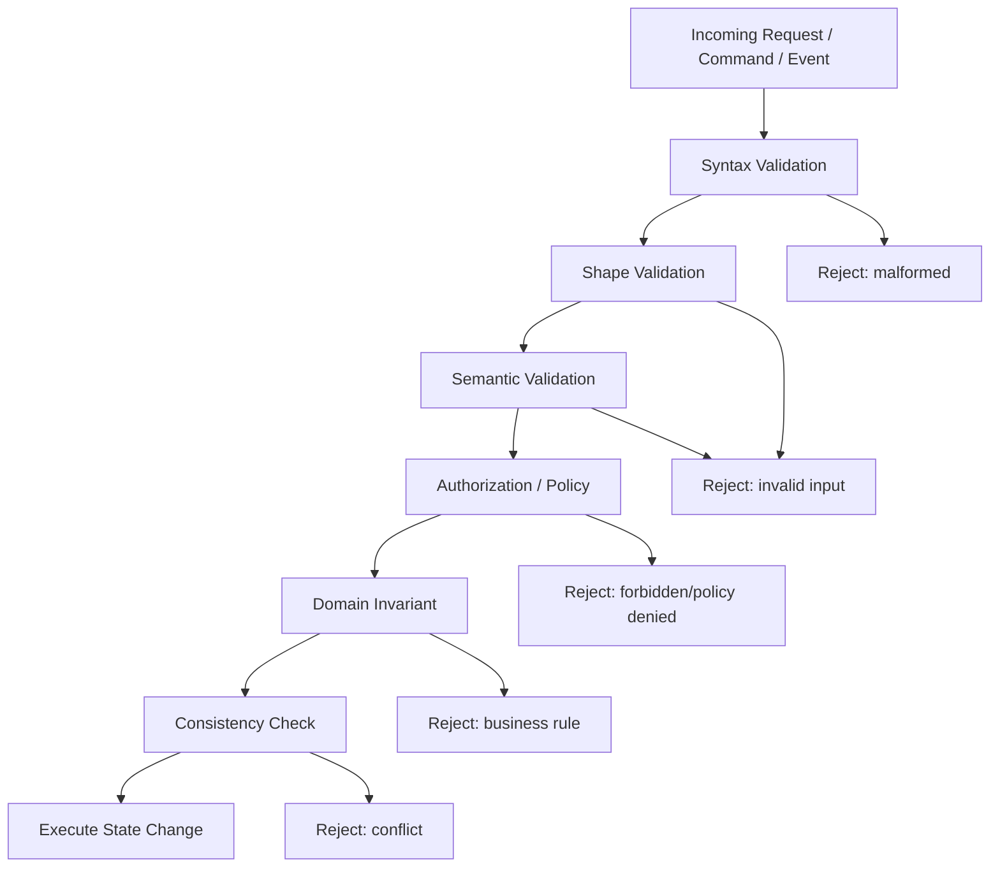
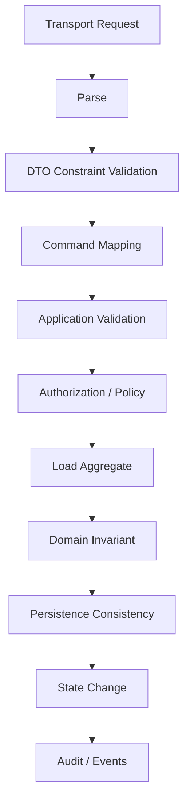

# Part 012 — Validation & Rejection Patterns

Part sebelumnya membahas boundary error translation. Part ini memperdalam satu jenis failure yang sangat sering muncul tetapi sering didesain buruk:

> Request, command, event, atau state ditolak karena tidak memenuhi kontrak, aturan, atau kebijakan.

Validasi bukan sekadar `@NotNull`. Dalam sistem produksi, terutama sistem enforcement, compliance, financial, insurance, healthcare, dan case management, validasi adalah bagian dari decision model.

Validation dan rejection harus menjawab:

- apa yang salah,
- siapa yang bisa memperbaiki,
- apakah request boleh diulang,
- apakah rejection harus diaudit,
- apakah state berubah,
- apakah downstream perlu diberi tahu,
- apakah ini bug, bad input, business rule, policy denial, atau race condition.

Engineer top-tier tidak mencampur semua ini menjadi `IllegalArgumentException` dengan message random.

---

## 1. Target Skill Berdasarkan Kaufman

Setelah part ini, Anda harus bisa:

1. Membedakan input validation, domain invariant, business rule, policy rule, authorization rule, consistency rule, dan temporal rule.
2. Menentukan kapan fail-fast dan kapan accumulate errors.
3. Mendesain validation result yang machine-readable.
4. Membedakan validation failure dan business rejection.
5. Menentukan apakah rejection harus throw exception, return result, atau publish event.
6. Menghasilkan Problem Details `violations` yang stabil.
7. Menghubungkan validation/rejection ke audit, metrics, logs, dan traces tanpa noise.
8. Membuat validation yang defensible untuk sistem regulatory.

Kaufman decomposition:

| Sub-skill | Latihan |
|---|---|
| Rule classification | Klasifikasikan rule berdasarkan layer dan owner |
| Fail-fast decision | Putuskan kapan stop di error pertama |
| Accumulation design | Kumpulkan banyak field errors dengan shape stabil |
| Domain rejection | Model negative decision sebagai outcome yang bisa diaudit |
| Boundary mapping | Translate validation/rejection ke HTTP/message/job result |
| Evidence design | Simpan alasan rejection tanpa leak detail internal |

---

## 2. Mental Model: Validation Bukan Satu Hal

Banyak codebase memakai kata “validation” untuk semua hal. Itu membuat error handling kabur.

Pisahkan minimal enam kategori:

| Category | Pertanyaan | Contoh | Layer Umum |
|---|---|---|---|
| Syntax validation | Apakah request bisa dibaca? | malformed JSON, invalid date format | transport |
| Shape validation | Apakah field wajib ada dan tipenya benar? | `caseId` missing, `amount` negative | DTO/input |
| Semantic validation | Apakah nilai masuk akal? | `startDate <= endDate` | application |
| Domain invariant | Apakah aggregate tetap valid? | closed case tidak punya open escalation | domain |
| Business rule | Apakah aksi boleh menurut policy bisnis? | only supervisor can approve | domain/application |
| Authorization rule | Apakah actor boleh melakukan aksi? | user lacks permission | security/application |
| Temporal rule | Apakah aksi valid pada waktu ini? | deadline passed | domain/application |
| Consistency rule | Apakah state terbaru masih cocok? | version mismatch | persistence/application |

Semua bisa menghasilkan “request ditolak”, tetapi semantics-nya berbeda.



Tujuan desain bukan membuat semua reject terlihat sama. Tujuannya membuat caller, operator, dan sistem tahu tindakan yang benar.

---

## 3. Validation Failure vs Business Rejection

Ini perbedaan paling penting.

### 3.1 Validation Failure

Validation failure berarti input tidak memenuhi kontrak yang diharapkan sistem.

Contoh:

- field wajib kosong,
- format email salah,
- date range invalid,
- enum value tidak dikenal,
- amount negatif,
- payload terlalu besar,
- record CSV tidak sesuai schema.

Caller bisa memperbaiki input tanpa memahami state internal yang kompleks.

Biasanya:

- HTTP `400` atau `422`,
- no retry tanpa perubahan input,
- tidak perlu stack trace,
- bisa accumulate multiple violations,
- audit optional tergantung domain,
- metric sebagai `validation_failed`, bukan `server_error`.

### 3.2 Business Rejection

Business rejection berarti input mungkin valid secara bentuk, tetapi aksi tidak diizinkan berdasarkan state, rule, atau policy.

Contoh:

- case sudah closed,
- enforcement action melewati deadline,
- approval threshold tidak terpenuhi,
- actor bukan assigned reviewer,
- duplicate escalation active,
- entity sedang under legal hold.

Biasanya:

- HTTP `409`, `403`, atau domain-specific `422`,
- retry tanpa perubahan state/input tidak berguna,
- audit sering penting,
- bisa publish rejection event,
- no stack trace,
- harus punya error code spesifik.

### 3.3 Kenapa Perbedaan Ini Penting?

Jika business rejection dilaporkan sebagai validation error:

- client mengira payload salah,
- audit kehilangan decision evidence,
- domain policy tidak terlihat,
- metrics tidak membedakan bad request vs rule denial.

Jika validation failure dilaporkan sebagai domain rejection:

- domain layer kotor oleh DTO concern,
- audit penuh noise,
- caller bingung karena input sederhana dianggap business decision.

---

## 4. Rule Ownership: Siapa Pemilik Validasi?

Pertanyaan penting:

> Rule ini milik transport, application, domain, security, persistence, atau external policy?

| Rule | Owner | Jangan Ditaruh di |
|---|---|---|
| JSON parseable | HTTP framework | domain |
| required DTO field | API contract | aggregate |
| `startDate <= endDate` | application/domain depending semantic | controller-only jika dipakai banyak channel |
| case cannot reopen after archive | domain | controller |
| user can approve above limit | policy/application | DTO validator |
| unique reference | persistence/domain policy | only database without translation |
| version must match | application/persistence | domain-only tanpa version concept |

Rule ownership menentukan:

- exception/result type,
- error code,
- test level,
- audit requirement,
- translation boundary.

Jika rule dipakai oleh HTTP, messaging, dan job, jangan taruh hanya di controller annotation. Letakkan rule di application/domain validation sehingga semua channel konsisten.

---

## 5. Fail-Fast vs Accumulate Errors

### 5.1 Fail-Fast

Fail-fast berhenti di error pertama.

Cocok untuk:

- precondition teknis,
- security/authentication,
- expensive validation,
- rule yang membuat validasi berikutnya tidak aman,
- internal programmer error,
- dependency unavailable,
- parsing failure,
- authorization denial.

Contoh:

```java
public Case getCaseOrThrow(CaseId id) {
    return repository.findById(id)
        .orElseThrow(() -> new CaseNotFoundException(id));
}
```

Authorization biasanya fail-fast:

```java
if (!permissions.canEscalate(actor, caseId)) {
    throw new AccessDeniedException(ErrorCode.CASE_ESCALATION_FORBIDDEN);
}
```

Jangan accumulate detail authorization karena bisa leak policy/resource existence.

### 5.2 Accumulate Errors

Accumulate mengumpulkan banyak violation sekaligus.

Cocok untuk:

- form validation,
- request DTO validation,
- CSV/import record validation,
- batch item validation,
- command semantic validation,
- user-correctable input.

Contoh:

```java
public ValidationResult validate(CreateCaseCommand command) {
    ValidationResult result = ValidationResult.ok();

    if (command.subjectId() == null) {
        result = result.add("subjectId", "REQUIRED", "Subject is required.");
    }

    if (command.receivedAt() != null && command.receivedAt().isAfter(clock.instant())) {
        result = result.add("receivedAt", "MUST_NOT_BE_FUTURE", "Received time cannot be in the future.");
    }

    if (command.priority() == Priority.HIGH && command.reason().isBlank()) {
        result = result.add("reason", "REQUIRED_FOR_HIGH_PRIORITY", "Reason is required for high priority cases.");
    }

    return result;
}
```

### 5.3 Decision Table

| Situation | Strategy | Reason |
|---|---|---|
| malformed JSON | fail-fast | tidak ada object valid untuk dicek |
| missing fields in form | accumulate | user bisa memperbaiki sekaligus |
| unauthorized actor | fail-fast | jangan leak rule detail |
| invalid state transition | fail-fast atau domain result | satu decision utama |
| batch import row validation | accumulate per row | report actionable |
| database unavailable | fail-fast | validation berikutnya tidak meaningful |
| duplicate found after uniqueness check | fail-fast conflict | state sudah menentukan outcome |

---

## 6. Designing ValidationResult

Validation result harus machine-readable, bukan hanya list string.

```java
public record Violation(
    String path,
    String code,
    String message,
    Map<String, Object> attributes
) {}

public final class ValidationResult {

    private final List<Violation> violations;

    private ValidationResult(List<Violation> violations) {
        this.violations = List.copyOf(violations);
    }

    public static ValidationResult ok() {
        return new ValidationResult(List.of());
    }

    public ValidationResult add(String path, String code, String message) {
        List<Violation> next = new ArrayList<>(violations);
        next.add(new Violation(path, code, message, Map.of()));
        return new ValidationResult(next);
    }

    public boolean isValid() {
        return violations.isEmpty();
    }

    public List<Violation> violations() {
        return violations;
    }

    public void throwIfInvalid() {
        if (!isValid()) {
            throw new ValidationFailureException(violations);
        }
    }
}
```

Properties penting:

| Field | Tujuan |
|---|---|
| `path` | lokasi field/entity/item |
| `code` | machine-readable violation code |
| `message` | human-readable safe message |
| `attributes` | optional safe parameters seperti min/max |

Contoh:

```json
{
  "path": "items[3].effectiveDate",
  "code": "MUST_BE_AFTER_RECEIVED_DATE",
  "message": "Effective date must be after received date.",
  "attributes": {
    "receivedDate": "2026-06-10"
  }
}
```

Jangan gunakan message sebagai contract. Message bisa berubah, diterjemahkan, atau disesuaikan untuk UI. Code harus stabil.

---

## 7. Jakarta Validation: Useful, But Not Enough

Jakarta Validation sangat berguna untuk constraint deklaratif seperti:

```java
public record CreateCaseRequest(
    @NotBlank String reference,
    @NotNull String subjectId,
    @Size(max = 2000) String description
) {}
```

Namun annotation validation bukan pengganti domain validation.

Cocok untuk:

- required field,
- size,
- pattern,
- numeric min/max,
- simple nested validation,
- DTO/input contract.

Kurang cocok untuk:

- state transition,
- cross-aggregate policy,
- permission rule,
- temporal rule kompleks,
- dependency-backed rule,
- audit-worthy business decision,
- rule yang berbeda per channel/context.

Contoh buruk:

```java
public record EscalateCaseRequest(
    @CaseMustBeOpen String caseId
) {}
```

Masalah:

- validator DTO perlu load aggregate,
- error category campur input vs domain,
- sulit mengontrol transaction,
- sulit audit decision,
- sulit dipakai di message/job command.

Lebih baik:

```java
public void escalate(EscalateCaseCommand command) {
    requestValidator.validate(command).throwIfInvalid();

    Case aggregate = caseRepository.get(command.caseId());
    escalationPolicy.ensureAllowed(command.actor(), aggregate);

    aggregate.escalate(command.reason(), command.now());
    caseRepository.save(aggregate);
}
```

---

## 8. Domain Invariants

Invariant adalah kondisi yang harus selalu benar agar model domain valid.

Contoh:

- closed case tidak boleh punya active escalation baru,
- enforcement action harus punya legal basis,
- deadline extension tidak boleh melewati maximum allowed period,
- approval tidak boleh dilakukan oleh submitter yang sama,
- sanction cannot be applied before due process completed.

Invariant harus dijaga dekat dengan aggregate/domain model.

```java
public final class Case {

    private CaseStatus status;
    private final List<Escalation> escalations;

    public void escalate(EscalationReason reason, Actor actor, Instant now) {
        if (!status.allowsEscalation()) {
            throw new CaseCannotBeEscalatedException(id, status);
        }

        if (hasActiveEscalation()) {
            throw new ActiveEscalationAlreadyExistsException(id);
        }

        escalations.add(Escalation.open(id, reason, actor, now));
    }
}
```

Domain invariant tidak boleh hanya ada di UI atau controller.

### 8.1 Invariant Exception vs Outcome

Gunakan exception jika:

- command tidak bisa dilanjutkan,
- violation bukan bagian dari branch normal caller,
- boundary handler akan menerjemahkan ke rejection,
- stack trace berguna untuk menemukan caller path.

Gunakan outcome jika:

- rejection adalah branch normal,
- caller harus memilih action berikutnya,
- workflow engine butuh route eksplisit,
- batch perlu mencatat per-item result.

Contoh outcome:

```java
public sealed interface EscalationDecision
    permits EscalationDecision.Accepted,
            EscalationDecision.Rejected {

    record Accepted(Escalation escalation) implements EscalationDecision {}

    record Rejected(ErrorCode code, String reason) implements EscalationDecision {}
}
```

---

## 9. Policy Rules

Policy rule sering berbeda dari invariant.

Invariant menjaga model tetap valid. Policy rule menentukan apakah actor/context boleh melakukan aksi.

Contoh:

```java
public final class EscalationPolicy {

    public void ensureAllowed(Actor actor, Case aggregate, Instant now) {
        if (!actor.hasRole(Role.SUPERVISOR)) {
            throw new PolicyDeniedException(ErrorCode.ESCALATION_REQUIRES_SUPERVISOR);
        }

        if (aggregate.isClosed()) {
            throw new CaseCannotBeEscalatedException(aggregate.id(), aggregate.status());
        }

        if (aggregate.deadline().isBefore(now)) {
            throw new PolicyDeniedException(ErrorCode.ESCALATION_DEADLINE_PASSED);
        }
    }
}
```

Policy denial bisa menjadi:

- `403` jika actor tidak punya authority,
- `409` jika state konflik,
- `422` jika business policy menolak command,
- `ack + rejected event` di message boundary,
- audit event di enforcement system.

### 9.1 Policy Evaluation Harus Explainable

Dalam regulatory system, policy rule harus bisa dijelaskan.

Jangan:

```java
throw new RuntimeException("not allowed");
```

Lebih baik:

```java
throw new PolicyDeniedException(
    ErrorCode.ESCALATION_DEADLINE_PASSED,
    Map.of(
        "caseId", caseId.value(),
        "deadline", deadline.toString(),
        "attemptedAt", now.toString()
    )
);
```

Safe attributes bisa masuk audit/internal log. Tidak semua harus masuk client response.

---

## 10. Rejection as First-Class Domain Event

Tidak semua rejection hanya response error.

Dalam workflow, rejection bisa menjadi event bisnis:

- `CaseEscalationRejected`,
- `ApprovalRequestRejected`,
- `ImportRecordRejected`,
- `SanctionApplicationRejected`,
- `EvidenceSubmissionRejected`.

Kapan rejection event perlu?

| Condition | Event Needed? |
|---|---|
| user typo di form | biasanya tidak |
| domain decision penting | ya |
| regulatory audit required | ya |
| asynchronous workflow branch | ya |
| downstream perlu tahu outcome | ya |
| security probing | mungkin security event, bukan domain event |

Contoh:

```java
public void handle(EscalationRequested event) {
    EscalationDecision decision = escalationService.decide(event.toCommand());

    switch (decision) {
        case EscalationDecision.Accepted accepted -> {
            repository.save(accepted.escalation());
            publisher.publish(new CaseEscalated(event.caseId()));
        }
        case EscalationDecision.Rejected rejected -> {
            audit.recordRejection(event, rejected.code(), rejected.reason());
            publisher.publish(new CaseEscalationRejected(event.caseId(), rejected.code()));
        }
    }
}
```

Rejection event harus punya stable reason code.

---

## 11. HTTP Shape untuk Validation

Problem Details bisa membawa validation violations sebagai extension.

```json
{
  "type": "https://errors.example.com/validation-failed",
  "title": "Validation failed",
  "status": 400,
  "detail": "One or more fields are invalid.",
  "code": "VALIDATION_FAILED",
  "correlationId": "01JZ7X0K...",
  "violations": [
    {
      "path": "subjectId",
      "code": "REQUIRED",
      "message": "Subject is required."
    },
    {
      "path": "effectiveDate",
      "code": "MUST_NOT_BE_PAST",
      "message": "Effective date must not be in the past."
    }
  ]
}
```

Prinsip:

- top-level `code` tetap `VALIDATION_FAILED`,
- tiap violation punya code sendiri,
- jangan gunakan localized message sebagai machine contract,
- jangan expose rejected raw value jika sensitif,
- gunakan path yang stabil terhadap API contract.

### 11.1 Path Design

Path baik:

```txt
subjectId
items[2].amount
effectivePeriod.start
```

Path buruk:

```txt
createCaseRequest.caseDTO.v2payload.theSubjectUUID
```

Path adalah contract. Jangan mencerminkan nama class internal.

---

## 12. Validation di Batch Import

Batch import perlu validation yang lebih kaya daripada API request tunggal.

Contoh result:

```json
{
  "jobId": "JOB-2026-0007",
  "status": "COMPLETED_WITH_REJECTIONS",
  "total": 10000,
  "accepted": 9980,
  "rejected": 20,
  "violations": [
    {
      "row": 37,
      "field": "caseReference",
      "code": "DUPLICATE_REFERENCE",
      "message": "Case reference already exists."
    }
  ]
}
```

Batch validation considerations:

- Jangan stop seluruh file untuk satu row invalid jika business memperbolehkan partial success.
- Batasi jumlah violation yang dikembalikan agar tidak membuat response/report terlalu besar.
- Simpan full report di object storage atau audit store jika perlu.
- Gunakan stable code agar importer client bisa memperbaiki data otomatis.
- Bedakan rejected row dan failed job.

```java
public ImportSummary importFile(ImportedFile file) {
    ImportSummary summary = ImportSummary.start(file.id());

    for (ImportedRow row : file.rows()) {
        ValidationResult validation = rowValidator.validate(row);
        if (!validation.isValid()) {
            summary.reject(row.number(), validation.violations());
            continue;
        }

        try {
            importOne(row);
            summary.accept(row.number());
        } catch (DuplicateCaseReferenceException ex) {
            summary.reject(row.number(), ex.errorCode());
        }
    }

    return summary.finish();
}
```

---

## 13. Validation and Transactions

Validation timing mempengaruhi transaksi.

### 13.1 Pre-Transaction Validation

Cocok untuk:

- DTO shape,
- simple semantic rules,
- required fields,
- format,
- obvious rejection.

Benefit:

- murah,
- tidak membuka transaction terlalu cepat,
- failure tidak rollback.

### 13.2 In-Transaction Validation

Cocok untuk:

- state check yang harus konsisten dengan update,
- optimistic locking,
- uniqueness check,
- invariant yang bergantung aggregate terbaru,
- policy yang perlu read model transactional.

Contoh:

```java
@Transactional
public void approve(ApproveActionCommand command) {
    basicValidator.validate(command).throwIfInvalid();

    EnforcementAction action = repository.getForUpdate(command.actionId());
    approvalPolicy.ensureCanApprove(command.actor(), action);
    action.approve(command.actor(), command.reason(), command.now());

    repository.save(action);
}
```

Jangan validasi state jauh sebelum transaksi lalu menganggap masih benar. State bisa berubah.

### 13.3 Post-Commit Validation?

Biasanya istilah ini salah. Setelah commit, Anda tidak lagi “validating” untuk mencegah perubahan. Anda melakukan:

- consistency monitoring,
- reconciliation,
- downstream validation,
- compensation,
- audit verification.

---

## 14. Temporal Validation

Temporal rules sering menjadi sumber bug.

Contoh:

- deadline berdasarkan timezone tertentu,
- business day vs calendar day,
- grace period,
- retrospective rule,
- effective date,
- legal holiday,
- daylight saving time,
- clock skew.

Prinsip:

1. Inject `Clock`, jangan panggil `Instant.now()` sembarangan.
2. Simpan timestamp evidence yang dipakai decision.
3. Bedakan `Instant`, `LocalDate`, dan timezone bisnis.
4. Tulis violation code spesifik.
5. Audit attempted time dan rule time.

```java
public final class DeadlinePolicy {

    private final Clock clock;

    public void ensureBeforeDeadline(Case aggregate) {
        Instant now = clock.instant();
        Instant deadline = aggregate.escalationDeadline();

        if (now.isAfter(deadline)) {
            throw new PolicyDeniedException(
                ErrorCode.ESCALATION_DEADLINE_PASSED,
                Map.of(
                    "deadline", deadline.toString(),
                    "attemptedAt", now.toString()
                )
            );
        }
    }
}
```

---

## 15. Cross-Field and Cross-Entity Validation

### 15.1 Cross-Field

Contoh:

- start date must be before end date,
- either email or phone required,
- high priority requires reason,
- amount requires currency.

```java
if (command.startDate().isAfter(command.endDate())) {
    result = result.add(
        "period",
        "START_AFTER_END",
        "Start date must be before end date."
    );
}
```

Gunakan path logical seperti `period`, bukan salah satu field saja jika violation melibatkan banyak field.

### 15.2 Cross-Entity

Contoh:

- subject must exist,
- case must belong to organization,
- reviewer must be assigned to region,
- sanction rule must match case type.

Cross-entity validation sering butuh repository/dependency. Jangan sembunyikan dependency berat di annotation sederhana.

```java
public void validateReferences(CreateCaseCommand command) {
    if (!subjectRepository.exists(command.subjectId())) {
        throw new ReferencedEntityNotFoundException(
            ErrorCode.SUBJECT_NOT_FOUND,
            command.subjectId()
        );
    }
}
```

---

## 16. Idempotency and Duplicate Rejection

Duplicate request bisa berarti beberapa hal:

| Situation | Meaning | Response |
|---|---|---|
| same idempotency key, same payload, already succeeded | idempotent replay | return previous success |
| same idempotency key, different payload | conflict | `409` |
| unique reference already exists | duplicate domain resource | `409` |
| message already processed | duplicate delivery | ack |
| same command while previous in progress | active operation conflict | `409` or accepted existing operation |

Jangan menganggap semua duplicate sebagai validation failure.

```java
if (idempotencyStore.isReplay(command.key(), command.fingerprint())) {
    return idempotencyStore.previousResponse(command.key());
}

if (idempotencyStore.isConflict(command.key(), command.fingerprint())) {
    throw new IdempotencyConflictException(command.key());
}
```

Duplicate semantics adalah reliability concern, bukan sekadar input validation.

---

## 17. Rejection Observability

Validation dan rejection biasanya bukan technical error. Jika Anda log semuanya sebagai `ERROR`, dashboard akan penuh noise.

### 17.1 Logging Policy

| Failure | Log Level | Stack Trace |
|---|---|---|
| malformed request | DEBUG/INFO depending volume | no |
| validation failure | INFO or no log if metrics enough | no |
| expected domain rejection | INFO | no |
| policy denial | INFO/WARN depending sensitivity | no |
| suspicious auth pattern | WARN/security event | no/limited |
| unknown validation bug | ERROR | yes |

Contoh:

```java
logger.info(
    "Command rejected code={} operation={} actorType={} correlationId={}",
    rejection.code(),
    operation,
    actor.type(),
    correlationId
);
```

Jangan log raw payload penuh.

### 17.2 Metrics

Useful metrics:

```txt
validation_failures_total{operation="create_case",code="VALIDATION_FAILED"}
validation_violations_total{operation="create_case",violation="REQUIRED"}
domain_rejections_total{operation="escalate_case",code="CASE_ESCALATION_INVALID_STATE"}
policy_denials_total{operation="approve_action",code="APPROVAL_REQUIRES_SUPERVISOR"}
```

Jaga cardinality.

### 17.3 Traces

Trace rejection bisa diberi attribute:

```java
span.setAttribute("app.outcome", "rejected");
span.setAttribute("app.error_code", rejection.code().name());
span.setAttribute("app.retryable", false);
```

Jangan selalu `setStatus(ERROR)` untuk expected rejection. Gunakan status error untuk technical failure atau unexpected exception.

### 17.4 Audit

Audit untuk rejection penting jika rejection adalah decision business/regulatory.

```java
audit.record(new AuditEvent(
    "CASE_ESCALATION_REJECTED",
    actor.id(),
    caseId.value(),
    rejection.code().name(),
    clock.instant(),
    correlationId
));
```

---

## 18. Security and Privacy in Validation Errors

Validation error bisa leak data.

Contoh leak:

```json
{
  "code": "USER_EMAIL_ALREADY_EXISTS",
  "detail": "john@example.com already exists"
}
```

Untuk public signup, ini bisa menjadi user enumeration.

Lebih aman:

```json
{
  "code": "SIGNUP_REQUEST_CANNOT_BE_PROCESSED",
  "detail": "The request cannot be processed."
}
```

Security-sensitive validation:

- login failure,
- password reset,
- invitation code,
- account existence,
- authorization denial,
- confidential case IDs,
- legal hold status,
- sanctions/watchlist match.

Prinsip:

1. Jangan expose apakah resource rahasia ada.
2. Jangan expose exact policy threshold jika bisa disalahgunakan.
3. Jangan echo raw secret/token.
4. Jangan masukkan PII ke metric tags.
5. Simpan detail internal hanya di audit/security log yang aksesnya terbatas.

---

## 19. Pattern: Layered Validation Pipeline

Desain umum:



Contoh implementation skeleton:

```java
public void createCase(CreateCaseRequest request, Actor actor) {
    CreateCaseCommand command = mapper.toCommand(request, actor);

    commandValidator.validate(command).throwIfInvalid();
    permissionPolicy.ensureCanCreateCase(actor, command.organizationId());

    Case aggregate = Case.open(
        command.reference(),
        command.subjectId(),
        command.receivedAt(),
        command.now()
    );

    caseRepository.save(aggregate);
    audit.recordCaseCreated(actor, aggregate);
}
```

Controller tidak menjalankan domain rule. Domain tidak menjalankan JSON parsing. Application layer mengorkestrasi.

---

## 20. Pattern: Specification for Complex Rules

Untuk rule kompleks yang ingin reusable dan testable, gunakan specification-like object.

```java
public interface Rule<T> {
    Optional<Violation> evaluate(T target);
}
```

```java
public final class HighPriorityRequiresReasonRule implements Rule<CreateCaseCommand> {

    @Override
    public Optional<Violation> evaluate(CreateCaseCommand command) {
        if (command.priority() == Priority.HIGH && command.reason().isBlank()) {
            return Optional.of(new Violation(
                "reason",
                "REQUIRED_FOR_HIGH_PRIORITY",
                "Reason is required for high priority cases.",
                Map.of()
            ));
        }
        return Optional.empty();
    }
}
```

Aggregator:

```java
public final class CommandValidator<T> {

    private final List<Rule<T>> rules;

    public ValidationResult validate(T target) {
        ValidationResult result = ValidationResult.ok();
        for (Rule<T> rule : rules) {
            Optional<Violation> violation = rule.evaluate(target);
            if (violation.isPresent()) {
                result = result.add(violation.get());
            }
        }
        return result;
    }
}
```

Cocok untuk:

- banyak rule,
- rule bisa diaktifkan per context,
- test per rule,
- generate documentation,
- explainability.

Jangan over-engineer untuk tiga field sederhana.

---

## 21. Pattern: Guard Methods in Aggregate

Untuk invariant lokal aggregate, guard method sederhana sering cukup.

```java
private void requireOpenForUpdate() {
    if (status != CaseStatus.OPEN) {
        throw new CaseStateConflictException(
            ErrorCode.CASE_UPDATE_INVALID_STATE,
            id,
            status
        );
    }
}

public void updateDescription(String description, Actor actor, Instant now) {
    requireOpenForUpdate();
    this.description = CaseDescription.of(description);
    this.updatedBy = actor.id();
    this.updatedAt = now;
}
```

Guard method baik jika:

- rule dekat dengan state aggregate,
- tidak butuh dependency eksternal,
- violation adalah invariant breach,
- message/error code stabil.

---

## 22. Anti-Patterns

### 22.1 Semua Pakai `IllegalArgumentException`

```java
throw new IllegalArgumentException("Invalid case");
```

Masalah:

- tidak ada error code,
- tidak tahu category,
- tidak tahu retryable,
- sulit map ke HTTP/message/job,
- audit lemah.

### 22.2 Validasi Hanya di UI

UI validation bagus untuk UX, tetapi tidak menjaga system invariant. API, message, job, dan admin command bisa bypass UI.

### 22.3 Annotation Validation Mengakses Database Diam-Diam

Custom annotation yang query database bisa menyebabkan:

- hidden latency,
- transaction ambiguity,
- test sulit,
- coupling DTO ke persistence,
- observability buruk.

### 22.4 Semua Rejection Dianggap Exception Error

Expected rejection bukan outage. Jangan alert untuk setiap invalid user input.

### 22.5 Accumulate Semua Error Termasuk Security

Jangan beri daftar lengkap alasan authorization gagal. Itu bisa membantu attacker.

### 22.6 Message Tidak Punya Violation Code

```json
{
  "message": "date bad"
}
```

Client tidak bisa automate.

### 22.7 Rejection Tanpa Evidence

Regulatory system butuh alasan decision. `false` saja tidak cukup.

---

## 23. Testing Strategy

### 23.1 Unit Test Rule

```java
@Test
void highPriorityRequiresReason() {
    CreateCaseCommand command = commandBuilder()
        .priority(Priority.HIGH)
        .reason("")
        .build();

    ValidationResult result = validator.validate(command);

    assertThat(result.violations())
        .extracting(Violation::code)
        .contains("REQUIRED_FOR_HIGH_PRIORITY");
}
```

### 23.2 Domain Invariant Test

```java
@Test
void closedCaseCannotBeEscalated() {
    Case aggregate = CaseFixture.closedCase();

    assertThatThrownBy(() -> aggregate.escalate(reason, actor, now))
        .isInstanceOf(CaseCannotBeEscalatedException.class)
        .extracting("code")
        .isEqualTo(ErrorCode.CASE_ESCALATION_INVALID_STATE);
}
```

### 23.3 Contract Test Validation Response

```java
@Test
void invalidCreateCaseReturnsViolations() throws Exception {
    mockMvc.perform(post("/cases")
            .contentType(MediaType.APPLICATION_JSON)
            .content("{}"))
        .andExpect(status().isBadRequest())
        .andExpect(jsonPath("$.code").value("VALIDATION_FAILED"))
        .andExpect(jsonPath("$.violations").isArray())
        .andExpect(jsonPath("$.violations[0].code").exists())
        .andExpect(jsonPath("$.correlationId").exists());
}
```

### 23.4 Audit Test

```java
@Test
void rejectedEscalationWritesAuditEvent() {
    escalationService.tryEscalate(commandForClosedCase());

    assertThat(audit.events())
        .anySatisfy(event -> {
            assertThat(event.type()).isEqualTo("CASE_ESCALATION_REJECTED");
            assertThat(event.errorCode()).isEqualTo("CASE_ESCALATION_INVALID_STATE");
        });
}
```

### 23.5 Observability Test

Untuk critical systems, test bahwa metric/log attributes tidak memakai dynamic high-cardinality values.

```java
@Test
void rejectionMetricUsesStableTags() {
    service.escalate(commandForClosedCase());

    meterRegistry.counter(
        "domain_rejections_total",
        "operation", "escalate_case",
        "code", "CASE_ESCALATION_INVALID_STATE"
    ).count();
}
```

---

## 24. Production Checklist

### Classification

- Apakah rule diklasifikasikan sebagai syntax, shape, semantic, invariant, policy, auth, temporal, atau consistency?
- Apakah validation failure dibedakan dari business rejection?
- Apakah duplicate dibedakan dari idempotent replay?

### Design

- Apakah violation punya stable code?
- Apakah field path stabil dan tidak mencerminkan class internal?
- Apakah fail-fast vs accumulate dipilih sadar?
- Apakah domain invariant dijaga di domain, bukan hanya UI/controller?
- Apakah policy denial explainable?

### Boundary

- Apakah validation response punya Problem Details shape?
- Apakah message rejection tidak selalu DLQ?
- Apakah batch row rejection tidak selalu fail seluruh job?
- Apakah CLI/admin output actionable?

### Safety

- Apakah validation error tidak leak PII/secret?
- Apakah auth failure tidak leak resource existence?
- Apakah raw rejected value tidak masuk metric tag?
- Apakah raw payload tidak dilog tanpa redaction?

### Observability

- Apakah validation/rejection punya metric terpisah dari server error?
- Apakah expected rejection tidak alert sebagai outage?
- Apakah audit event dibuat untuk decision penting?
- Apakah correlation ID tersedia?

### Testing

- Apakah setiap rule penting punya test?
- Apakah response contract dites?
- Apakah audit event dites untuk regulatory rejection?
- Apakah temporal rule dites dengan injected `Clock`?
- Apakah consistency conflict dites?

---

## 25. Latihan 20 Jam — Validation & Rejection

### Latihan 1 — Rule Inventory

Ambil satu use case, misalnya `EscalateCase`, lalu tulis semua rule:

| Rule | Category | Owner | Fail-fast/Accumulate | Error Code | Audit? |
|---|---|---|---|---|---|
| reason required | shape/semantic | application | accumulate | REASON_REQUIRED | no |
| actor must be supervisor | policy/auth | application | fail-fast | ESCALATION_REQUIRES_SUPERVISOR | yes |
| case must be open | invariant/state | domain | fail-fast | CASE_ESCALATION_INVALID_STATE | yes |
| no active escalation | invariant | domain | fail-fast | ACTIVE_ESCALATION_ALREADY_EXISTS | yes |

### Latihan 2 — Build ValidationResult

Implementasikan:

- `Violation`,
- `ValidationResult`,
- `ValidationFailureException`,
- mapper ke Problem Details.

Pastikan message tidak menjadi contract utama.

### Latihan 3 — Refactor `IllegalArgumentException`

Cari 10 `IllegalArgumentException` di codebase latihan. Klasifikasikan:

- programmer precondition,
- input validation,
- domain rejection,
- policy denial,
- internal bug.

Refactor minimal 5 menjadi error model yang lebih tepat.

### Latihan 4 — Design Rejection Event

Untuk satu business rejection penting, desain event:

```json
{
  "eventType": "..._REJECTED",
  "entityId": "...",
  "actorId": "...",
  "errorCode": "...",
  "reason": "...",
  "occurredAt": "...",
  "correlationId": "..."
}
```

Tentukan mana field yang boleh masuk event publik dan mana yang hanya internal audit.

### Latihan 5 — Temporal Rule Tests

Buat rule deadline dengan injected `Clock`. Test:

- before deadline,
- exactly at deadline,
- after deadline,
- timezone bisnis,
- edge case date boundary.

---

## 26. Ringkasan

Validation dan rejection bukan hanya “input salah”.

Intinya:

1. Pisahkan syntax, shape, semantic, invariant, policy, authorization, temporal, dan consistency rule.
2. Validation failure berbeda dari business rejection.
3. Fail-fast cocok untuk security, parsing, dependency, dan invariant utama.
4. Accumulate cocok untuk user-correctable input dan batch report.
5. Violation harus machine-readable dengan stable code.
6. Jakarta Validation berguna untuk DTO constraint, tetapi bukan pengganti domain policy.
7. Rejection penting bisa menjadi domain event dan audit evidence.
8. Expected rejection bukan technical outage.
9. Error response, logs, metrics, traces, dan audit harus saling terhubung melalui error code.

Part berikutnya masuk ke reliability control: retry, timeout, dan idempotency. Di sana kita akan melihat bagaimana validation/rejection mencegah retry yang salah, duplicate side effect, dan failure amplification.

---

## Referensi

- Jakarta Validation 3.1 Specification: https://jakarta.ee/specifications/bean-validation/3.1/jakarta-validation-spec-3.1.html
- Hibernate Validator Reference Guide: https://docs.hibernate.org/validator/8.0/reference/en-US/html_single/
- RFC 9457 — Problem Details for HTTP APIs: https://www.rfc-editor.org/rfc/rfc9457.html
- Java Language Specification SE 25 — Exceptions: https://docs.oracle.com/javase/specs/jls/se25/html/jls-11.html
