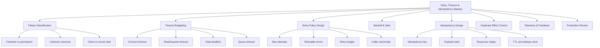
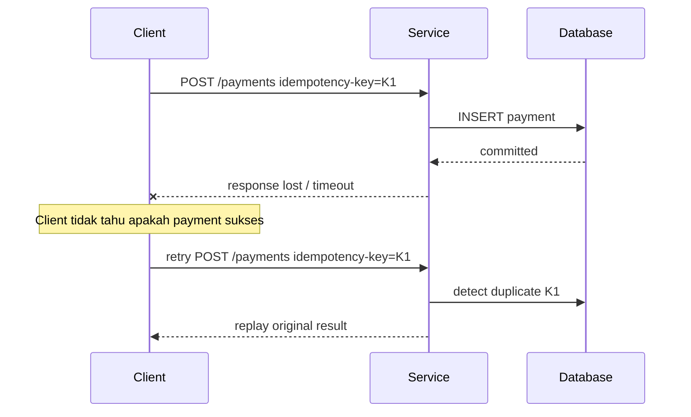
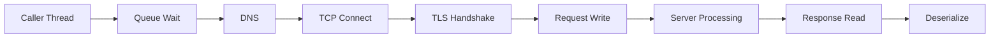
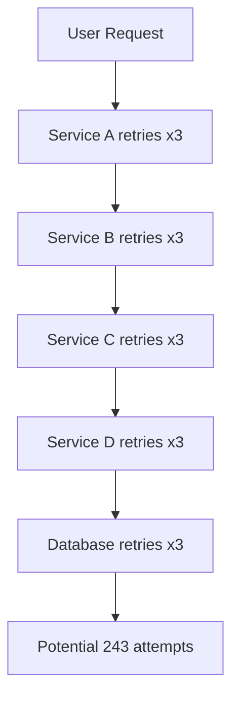
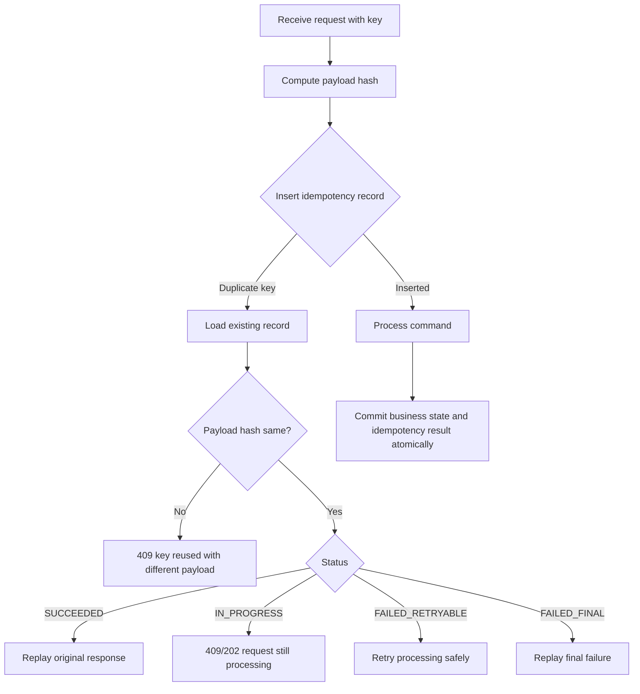
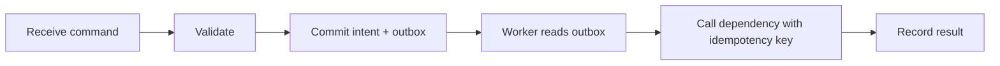

------
title: Learn Java Error, Reliability & Observability Engineering - Part 013
description: Retry, timeout, idempotency, backoff, jitter, deadline propagation, retry safety, and duplicate-effect control for production Java systems.
series: learn-java-error-reliability-observability
seriesTitle: Learn Java Error, Reliability & Observability Engineering
order: 13
partTitle: Retry, Timeout & Idempotency
tags:
- java
- reliability
- error-handling
- retry
- timeout
- idempotency
- observability
- distributed-systems
date: 2026-06-28
---

# Part 013 — Retry, Timeout & Idempotency

## Target Pembelajaran

Setelah part ini, kamu harus bisa menjawab pertanyaan produksi berikut dengan presisi:

1. **Apakah operasi ini boleh di-retry?**
2. **Retry dilakukan oleh siapa: client, gateway, worker, message broker, atau scheduler?**
3. **Apa yang terjadi kalau request pertama sebenarnya sukses, tetapi response hilang?**
4. **Timeout mana yang aktif: connect timeout, read timeout, request timeout, total deadline, queue timeout, atau transaction timeout?**
5. **Apakah retry memperbaiki reliability, atau justru menciptakan retry storm?**
6. **Bagaimana membuktikan secara telemetry bahwa retry membantu, bukan memperburuk?**

Topik ini bukan sekadar library configuration. Ini adalah desain **failure control loop**.

Retry adalah mekanisme optimisme. Timeout adalah mekanisme batas waktu. Idempotency adalah mekanisme keselamatan efek samping. Tanpa ketiganya, distributed system mudah berubah menjadi mesin pengganda kerusakan.

---

## 1. Kaufman Skill Deconstruction

Berdasarkan pendekatan Josh Kaufman, skill besar dipecah menjadi sub-skill kecil yang bisa dilatih cepat.



### 20-Hour Practice Breakdown

| Jam | Fokus | Output |
|---:|---|---|
| 1-2 | Failure classification | Matrix error retryable/non-retryable |
| 3-4 | Timeout taxonomy | Diagram timeout end-to-end |
| 5-7 | Retry policy | Implement retry wrapper dengan classification |
| 8-10 | Backoff & jitter | Simulasi retry storm vs jitter |
| 11-13 | Idempotency key | Implement dedupe table |
| 14-16 | Duplicate effect control | Simulasi lost response dan duplicate request |
| 17-18 | Observability | Metrics/logs/traces untuk retry |
| 19-20 | Review produksi | Checklist, failure injection, postmortem mini |

---

## 2. Mental Model: Distributed Operation Selalu Punya Outcome yang Tidak Pasti

Dalam single-process Java, method call biasanya punya outcome jelas:

```java
Order order = orderService.create(command);
```

Entah return sukses atau throw exception.

Dalam distributed system, call ke dependency punya empat kemungkinan:

| Client Melihat | Server Sebenarnya | Makna |
|---|---|---|
| Success response | Success committed | Aman |
| Error response | Failure before commit | Biasanya aman untuk retry jika transient |
| Timeout/no response | Unknown | Bahaya: mungkin gagal, mungkin sukses |
| Connection reset | Unknown | Bahaya: commit state bisa sudah terjadi |

Yang paling berbahaya bukan failure eksplisit. Yang paling berbahaya adalah **unknown outcome**.



Tanpa idempotency, retry bisa membuat pembayaran, pengiriman notifikasi, pembuatan case, atau mutasi status terjadi dua kali.

---

## 3. Istilah Dasar yang Harus Presisi

| Istilah | Makna |
|---|---|
| Attempt | Satu percobaan call |
| Initial attempt | Percobaan pertama sebelum retry |
| Retry | Percobaan ulang setelah failure/timeout |
| Max attempts | Total attempts, biasanya termasuk initial attempt |
| Backoff | Waktu tunggu sebelum retry |
| Jitter | Randomisasi backoff agar retry tidak sinkron |
| Timeout | Batas waktu lokal untuk menunggu operasi |
| Deadline | Batas waktu total yang diwariskan sepanjang call chain |
| Retry budget | Batas maksimum retry agar tidak mengamplifikasi overload |
| Idempotency | Properti bahwa repeated request dengan maksud sama tidak mengubah hasil lebih dari sekali |
| Dedupe store | Penyimpanan untuk mengenali request duplikat |
| Unknown outcome | Caller tidak tahu apakah side effect sudah commit |

Perhatikan beda **timeout** dan **deadline**:

```txt
timeout  = batas waktu untuk satu operasi lokal
deadline = batas waktu total untuk seluruh workflow/request
```

Contoh buruk:

```txt
User request deadline: 2s
Service A timeout ke B: 2s
Service B timeout ke C: 2s
Service C timeout ke D: 2s
```

Secara teori chain bisa memakan 6s+ walaupun user sudah menyerah.

Contoh benar:

```txt
Request deadline: now + 2s
A menerima deadline
A memberi B sisa budget: 1.7s
B memberi C sisa budget: 1.1s
C memberi D sisa budget: 500ms
```

---

## 4. Retry Bukan Error Handling Universal

Retry hanya masuk akal jika failure bersifat:

1. **Transient** — overload sementara, network blip, leader election, throttling sementara.
2. **Safe to repeat** — tidak menggandakan efek samping.
3. **Bounded** — dibatasi jumlah, waktu, dan budget.
4. **Observable** — ada metrics untuk mengetahui apakah retry berhasil.
5. **Coordinated** — tidak dilakukan di banyak layer tanpa kontrol.

### Jangan Retry

| Failure | Alasan |
|---|---|
| Validation error | Input salah tidak akan benar dengan retry |
| Business rejection | Rule/domain state menolak operasi |
| Authorization failure | Retry bisa menjadi brute-force/noise |
| Deterministic 404 untuk resource yang memang tidak ada | Tidak transient |
| Duplicate key karena request berbeda | Harus conflict handling, bukan retry |
| Programming bug | Retry hanya mengulang bug |
| Permanent config error | Harus fail fast dan alert |
| Payload too large | Tidak transient |
| Unsupported operation | Tidak transient |

### Mungkin Retry

| Failure | Syarat |
|---|---|
| 408 Request Timeout | Cek idempotency dan client/server semantics |
| 429 Too Many Requests | Hormati rate limit dan `Retry-After` jika ada |
| 500 Internal Server Error | Hanya jika operasi idempotent atau deduped |
| 502 Bad Gateway | Biasanya transient |
| 503 Service Unavailable | Biasanya transient, tapi perhatikan overload |
| 504 Gateway Timeout | Unknown outcome; butuh idempotency |
| Connection reset | Unknown outcome |
| Socket timeout | Unknown outcome |
| Optimistic lock conflict | Bisa retry jika command masih valid |
| Deadlock/serialization failure | Bisa retry transaction dengan batas ketat |

---

## 5. Timeout Taxonomy

Banyak bug produksi terjadi karena engineer berkata “sudah ada timeout”, padahal timeout yang ada hanya salah satu dari banyak jenis timeout.



| Timeout | Melindungi dari |
|---|---|
| Queue timeout | Menunggu terlalu lama sebelum request mulai |
| DNS timeout | Resolusi DNS macet |
| Connect timeout | TCP connection tidak terbentuk |
| TLS handshake timeout | Handshake lambat/macet |
| Write timeout | Request body tidak terkirim |
| Read/socket timeout | Response tidak diterima |
| Request timeout | Keseluruhan HTTP call |
| Transaction timeout | DB transaction terlalu lama |
| Lock timeout | Menunggu lock terlalu lama |
| Executor timeout | Task menunggu/mengerjakan terlalu lama |
| Total deadline | Seluruh user/business operation terlalu lama |

### Design Rule

Setiap external call harus memiliki:

1. **Single-attempt timeout**
2. **Total retry deadline**
3. **Cancellation propagation**
4. **Observable timeout reason**
5. **Fallback atau failure mapping**

Bukan cukup hanya `maxAttempts=3`.

---

## 6. Timeout Budgeting

Misal SLO API adalah p95 latency 800ms. Request path:

```txt
API Gateway -> Order Service -> Payment Service -> Fraud Service -> DB
```

Budget kasar:

| Segment | Budget |
|---|---:|
| Gateway overhead | 50ms |
| Order validation | 50ms |
| Payment call total | 350ms |
| Fraud call total | 200ms |
| DB write | 100ms |
| Serialization/response | 50ms |

Jika Payment Service retry 3 kali dengan timeout 350ms per attempt, budget langsung rusak:

```txt
3 attempts * 350ms = 1050ms
```

Maka retry harus memakai **total deadline**, bukan timeout per attempt yang berdiri sendiri.

### Deadline-Aware Retry

```java
public final class Deadline {
    private final long deadlineNanos;

    private Deadline(long deadlineNanos) {
        this.deadlineNanos = deadlineNanos;
    }

    public static Deadline after(Duration duration) {
        return new Deadline(System.nanoTime() + duration.toNanos());
    }

    public Duration remaining() {
        long remaining = deadlineNanos - System.nanoTime();
        return remaining <= 0 ? Duration.ZERO : Duration.ofNanos(remaining);
    }

    public boolean expired() {
        return remaining().isZero();
    }
}
```

Retry loop:

```java
public <T> T executeWithDeadline(
        Supplier<T> operation,
        Deadline deadline,
        RetryPolicy policy
) {
    int attempt = 1;
    Throwable lastFailure = null;

    while (!deadline.expired() && attempt <= policy.maxAttempts()) {
        try {
            return operation.get();
        } catch (Throwable failure) {
            lastFailure = failure;

            if (!policy.isRetryable(failure)) {
                throw failure;
            }

            Duration delay = policy.nextDelay(attempt);

            if (delay.compareTo(deadline.remaining()) >= 0) {
                break;
            }

            sleepInterruptibly(delay);
            attempt++;
        }
    }

    throw new DependencyTimeoutException(
            "Operation did not complete within deadline",
            lastFailure
    );
}
```

Catatan penting: contoh ini ilustratif. Di production, jangan `catch Throwable` sembarangan kecuali kamu benar-benar punya alasan untuk membiarkan `Error` lewat atau menanganinya secara khusus. Biasanya gunakan `Exception` atau failure type yang lebih sempit.

---

## 7. Retry Amplification

Retry memperbesar traffic.

Jika ada 5 layer dan masing-masing retry 3 kali:

```txt
3^5 = 243 attempts
```

Satu user request bisa menjadi 243 dependency calls.



### Rule: Retry Ownership Harus Jelas

Untuk setiap dependency, tentukan:

| Pertanyaan | Keputusan |
|---|---|
| Layer mana yang boleh retry? | Biasanya client paling dekat dengan user intent atau library boundary yang distandarkan |
| Apakah gateway boleh retry? | Hanya untuk safe/idempotent operation |
| Apakah worker boleh retry? | Ya, jika message idempotent dan DLQ policy jelas |
| Apakah DB driver boleh retry? | Hati-hati, transaction semantics harus jelas |
| Apakah service mesh boleh retry? | Bahaya jika aplikasi tidak tahu duplicate effect |

---

## 8. Backoff & Jitter

Retry langsung sering buruk:

```txt
t=0ms failure
t=1ms retry
t=2ms retry
t=3ms retry
```

Ketika ribuan client melakukan itu bersamaan, dependency yang sedang sakit justru dihantam lebih keras.

### Exponential Backoff

```txt
delay = min(base * 2^(attempt - 1), maxDelay)
```

Contoh:

| Attempt | Delay |
|---:|---:|
| 1 | 100ms |
| 2 | 200ms |
| 3 | 400ms |
| 4 | 800ms |
| 5 | 1000ms cap |

### Full Jitter

```txt
delay = random(0, cappedExponentialDelay)
```

Contoh Java:

```java
public final class Backoff {
    private final Duration base;
    private final Duration max;

    public Backoff(Duration base, Duration max) {
        this.base = base;
        this.max = max;
    }

    public Duration fullJitterDelay(int attempt) {
        long exponential = base.toMillis() * (1L << Math.max(0, attempt - 1));
        long capped = Math.min(exponential, max.toMillis());
        long jittered = ThreadLocalRandom.current().nextLong(capped + 1);
        return Duration.ofMillis(jittered);
    }
}
```

### Anti-Pattern: Fixed Retry Delay

```java
// Bad: all clients retry at the same rhythm
Thread.sleep(100);
```

### Better

```java
Duration delay = backoff.fullJitterDelay(attempt);
sleepInterruptibly(delay);
```

---

## 9. Retry Classification

Retry policy harus berbasis classification, bukan sekadar “catch exception lalu ulang”.

```java
public enum FailureKind {
    TRANSIENT,
    THROTTLED,
    TIMEOUT_UNKNOWN_OUTCOME,
    PERMANENT,
    DOMAIN_REJECTION,
    PROGRAMMER_ERROR
}

public record ClassifiedFailure(
        FailureKind kind,
        boolean retryable,
        boolean requiresIdempotency,
        String reason
) {}
```

Classifier:

```java
public final class DependencyFailureClassifier {

    public ClassifiedFailure classify(Throwable failure) {
        if (failure instanceof java.net.SocketTimeoutException) {
            return new ClassifiedFailure(
                    FailureKind.TIMEOUT_UNKNOWN_OUTCOME,
                    true,
                    true,
                    "socket timeout; server outcome unknown"
            );
        }

        if (failure instanceof java.net.ConnectException) {
            return new ClassifiedFailure(
                    FailureKind.TRANSIENT,
                    true,
                    false,
                    "connection could not be established"
            );
        }

        if (failure instanceof IllegalArgumentException) {
            return new ClassifiedFailure(
                    FailureKind.PROGRAMMER_ERROR,
                    false,
                    false,
                    "invalid caller argument"
            );
        }

        return new ClassifiedFailure(
                FailureKind.PERMANENT,
                false,
                false,
                "unclassified failure is not retryable by default"
        );
    }
}
```

Default yang aman:

```txt
unknown failure => not retryable
unknown outcome => retry only with idempotency
```

---

## 10. HTTP Status Mapping untuk Retry

| Status | Retry? | Catatan |
|---:|---|---|
| 400 | No | Bad request |
| 401 | No | Auth challenge mungkin butuh token refresh, bukan blind retry |
| 403 | No | Forbidden |
| 404 | Usually no | Kecuali eventual consistency atau async provisioning |
| 409 | Maybe | Conflict bisa retry jika optimistic concurrency dan command masih valid |
| 408 | Maybe | Unknown outcome |
| 425 | Maybe later | Too early; butuh protocol-specific handling |
| 429 | Yes with backoff | Hormati throttling |
| 500 | Maybe | Hanya transient/idempotent |
| 502 | Maybe | Upstream gateway issue |
| 503 | Maybe | Service unavailable; perhatikan overload |
| 504 | Maybe | Unknown outcome |

Jangan samakan HTTP idempotent method dengan business idempotency. `PUT` dan `DELETE` didefinisikan sebagai idempotent secara HTTP semantics, tetapi operasi bisnis tetap bisa punya efek samping tambahan jika implementasi buruk, misalnya mengirim email setiap kali `PUT` dipanggil.

---

## 11. Idempotency: Safety Net untuk Unknown Outcome

Idempotency bukan berarti “response selalu sama”. Idempotency berarti **efek state utama tidak terjadi lebih dari sekali untuk intent yang sama**.

### Idempotency Key

Client mengirim key stabil:

```http
POST /payments
Idempotency-Key: 01J2A4P9Y6W7K3C8K9M4Q6R2ZS
Content-Type: application/json

{
  "invoiceId": "INV-2026-0001",
  "amount": 100000,
  "currency": "IDR"
}
```

Server menyimpan:

| Field | Tujuan |
|---|---|
| key | Identitas intent |
| actor/client | Scope key agar tidak collision antar tenant |
| payload_hash | Deteksi key reuse dengan payload berbeda |
| status | IN_PROGRESS, SUCCEEDED, FAILED_RETRYABLE, FAILED_FINAL |
| response_snapshot | Replay hasil sukses |
| resource_id | Link ke entity yang dibuat |
| created_at | TTL cleanup |
| expires_at | Dedupe window |
| locked_until | Menghindari concurrent duplicate processing |

### Dedupe Table

```sql
CREATE TABLE idempotency_record (
    scope              VARCHAR(128) NOT NULL,
    idempotency_key    VARCHAR(128) NOT NULL,
    payload_hash       VARCHAR(128) NOT NULL,
    status             VARCHAR(32)  NOT NULL,
    resource_type      VARCHAR(64),
    resource_id        VARCHAR(128),
    response_status    INTEGER,
    response_body      TEXT,
    created_at         TIMESTAMP NOT NULL,
    updated_at         TIMESTAMP NOT NULL,
    expires_at         TIMESTAMP NOT NULL,
    PRIMARY KEY (scope, idempotency_key)
);
```

### Processing Flow



---

## 12. Atomicity: Business State dan Idempotency Record Harus Konsisten

Bug umum:

```txt
1. create payment committed
2. application crashes before saving idempotency result
3. client retries
4. second payment created
```

Solusi: simpan idempotency record dan business effect dalam transaction yang sama jika memungkinkan.

```java
@Transactional
public PaymentResponse createPayment(CreatePaymentCommand command, IdempotencyKey key) {
    IdempotencyRecord record = idempotencyRepository.tryStart(
            command.scope(),
            key.value(),
            command.payloadHash()
    );

    if (record.isReplayable()) {
        return record.replayAs(PaymentResponse.class);
    }

    if (record.isPayloadMismatch()) {
        throw new IdempotencyConflictException("Idempotency key reused with different payload");
    }

    Payment payment = paymentRepository.save(Payment.create(command));

    PaymentResponse response = PaymentResponse.from(payment);

    idempotencyRepository.markSucceeded(
            command.scope(),
            key.value(),
            payment.id(),
            response
    );

    return response;
}
```

### Invariant

```txt
For one idempotency scope + key + payload hash,
there must be at most one committed business effect.
```

Jika database yang sama tidak bisa dipakai untuk keduanya, desain menjadi lebih sulit. Kamu perlu outbox, saga, dedupe downstream, atau compensating action.

---

## 13. Idempotency Scope

Key global jarang ideal. Gunakan scope.

| Scope | Contoh |
|---|---|
| Tenant | `tenant-123` |
| Actor | `user-456` |
| Client application | `mobile-app` |
| Business aggregate | `invoice-789` |
| Operation | `payment:create` |

Contoh composite scope:

```txt
tenantId + clientId + operationName
```

Kenapa penting?

```txt
User A dan User B bisa sama-sama generate UUID yang sama walau probabilitas kecil.
Client internal dan external tidak boleh saling overwrite.
Operation create-payment dan create-refund tidak boleh berbagi key namespace.
```

---

## 14. Payload Hash

Idempotency key tidak boleh dipakai untuk payload berbeda.

```java
public final class PayloadHasher {

    public String sha256CanonicalJson(String canonicalJson) {
        try {
            MessageDigest digest = MessageDigest.getInstance("SHA-256");
            byte[] hash = digest.digest(canonicalJson.getBytes(StandardCharsets.UTF_8));
            return HexFormat.of().formatHex(hash);
        } catch (NoSuchAlgorithmException e) {
            throw new IllegalStateException("SHA-256 not available", e);
        }
    }
}
```

Canonicalization penting. JSON berikut secara semantik sama, tetapi string berbeda:

```json
{"amount":100000,"currency":"IDR"}
```

```json
{"currency":"IDR","amount":100000}
```

Untuk production, jangan hash raw JSON tanpa canonicalization jika client bisa mengubah order field.

---

## 15. Retry dalam Transaction

Hati-hati dengan retry di dalam transaction.

### Buruk

```java
@Transactional
public void process() {
    retry.execute(() -> {
        repository.updateSomething();
        externalClient.call();
        return null;
    });
}
```

Masalah:

1. Transaction terbuka saat external call.
2. Lock DB ditahan selama retry.
3. Kalau external call sukses lalu transaction rollback, external side effect sudah terjadi.
4. Retry bisa menggandakan side effect.

### Lebih Aman

Pisahkan:

1. Validate command.
2. Commit intent/outbox.
3. Worker memproses side effect idempotently.
4. Update state berdasarkan result.



---

## 16. Retry untuk Optimistic Locking

Optimistic locking conflict bisa retry, tetapi tidak selalu.

Boleh retry jika:

1. Operation pure terhadap state terbaru.
2. Command masih valid setelah reload.
3. Tidak ada external side effect sebelum commit.
4. Retry count rendah.
5. Conflict memang transient.

Contoh:

```java
public Case assignInvestigator(CaseId caseId, InvestigatorId investigatorId) {
    return retryOptimisticLock(() -> {
        Case caze = caseRepository.findById(caseId);
        caze.assignInvestigator(investigatorId);
        return caseRepository.save(caze);
    });
}
```

Tidak boleh blind retry jika command bergantung pada state lama:

```txt
"Approve if amount <= previous balance"
```

State berubah berarti keputusan domain harus dihitung ulang, bukan sekadar ulang write.

---

## 17. Retry untuk Message Processing

Dalam messaging, retry sering dilakukan oleh broker atau consumer framework.

| Failure | Action |
|---|---|
| Transient dependency failure | Retry with backoff |
| Invalid message schema | Reject/DLQ |
| Business rejection final | Ack + record rejected outcome |
| Unknown processing outcome | Idempotency/dedupe required |
| Poison message | DLQ after bounded attempts |
| Downstream overloaded | Pause consumer / backpressure |

Consumer harus idempotent karena broker umumnya memberi at-least-once delivery.

```java
public void handle(MessageEnvelope envelope) {
    if (processedMessageRepository.exists(envelope.messageId())) {
        return;
    }

    processBusinessCommand(envelope);

    processedMessageRepository.markProcessed(envelope.messageId());
}
```

Dalam production, marking processed dan business effect harus atomic, atau minimal punya reconciliation path.

---

## 18. Retry Budget

Retry budget membatasi retry sebagai persentase dari traffic normal.

Contoh:

```txt
Normal requests per minute: 10,000
Retry budget: 10%
Max retry attempts per minute: 1,000
```

Jika retry sudah melebihi budget, sistem harus stop retry dan fail fast.

```java
public final class RetryBudget {
    private final AtomicLong primaryCalls = new AtomicLong();
    private final AtomicLong retryCalls = new AtomicLong();

    public void recordPrimary() {
        primaryCalls.incrementAndGet();
    }

    public boolean tryAcquireRetry() {
        long primary = Math.max(1, primaryCalls.get());
        long retry = retryCalls.get();

        if (retry * 10 >= primary) {
            return false;
        }

        retryCalls.incrementAndGet();
        return true;
    }
}
```

Ini contoh sederhana. Production implementation harus windowed, thread-safe, dan terintegrasi metrics.

---

## 19. Observability untuk Retry/Timeout/Idempotency

Tanpa telemetry, retry policy hanya tebakan.

### Metrics Minimal

| Metric | Type | Tags |
|---|---|---|
| `dependency.calls` | counter | dependency, operation, outcome |
| `dependency.attempts` | counter | dependency, operation, attempt_number |
| `dependency.retries` | counter | dependency, reason |
| `dependency.timeouts` | counter | dependency, timeout_type |
| `dependency.latency` | histogram/timer | dependency, operation |
| `idempotency.records` | counter | operation, status |
| `idempotency.duplicates` | counter | operation, outcome |
| `retry.budget.remaining` | gauge | dependency |
| `retry.exhausted` | counter | dependency, operation |

### Logs

Good log:

```json
{
  "event": "dependency_retry_scheduled",
  "dependency": "payment-service",
  "operation": "createPayment",
  "attempt": 2,
  "maxAttempts": 3,
  "delayMs": 180,
  "failureKind": "TIMEOUT_UNKNOWN_OUTCOME",
  "idempotencyKeyPresent": true,
  "correlationId": "corr-123",
  "traceId": "trace-abc"
}
```

Bad log:

```txt
Retrying...
```

### Trace

Setiap retry attempt sebaiknya terlihat sebagai span event atau child span.

```txt
Span: POST /orders
  Event: dependency.attempt attempt=1
  Event: dependency.timeout timeout_type=request
  Event: dependency.retry_scheduled delay_ms=180
  Event: dependency.attempt attempt=2
  Event: dependency.success
```

### Invariant Telemetry

Kamu harus bisa menjawab:

```txt
Dari semua request yang semula gagal, berapa persen diselamatkan retry?
Berapa latency tambahan karena retry?
Berapa duplicate request yang ditahan idempotency?
Berapa retry yang memperburuk overload?
```

---

## 20. Java HTTP Client Example dengan Timeout

Contoh menggunakan `java.net.http.HttpClient`.

```java
HttpClient client = HttpClient.newBuilder()
        .connectTimeout(Duration.ofMillis(200))
        .build();

HttpRequest request = HttpRequest.newBuilder()
        .uri(URI.create("https://payment.example.internal/payments"))
        .timeout(Duration.ofMillis(500))
        .header("Idempotency-Key", idempotencyKey)
        .POST(HttpRequest.BodyPublishers.ofString(payload))
        .build();

HttpResponse<String> response = client.send(
        request,
        HttpResponse.BodyHandlers.ofString()
);
```

Hal yang perlu diperhatikan:

1. `connectTimeout` hanya untuk membangun koneksi.
2. `request.timeout` membatasi request.
3. Total retry deadline tetap harus kamu desain.
4. HTTP status perlu diklasifikasikan.
5. Timeout pada client tidak otomatis membatalkan side effect di server.

---

## 21. Policy Object

Daripada konfigurasi tersebar, buat policy eksplisit.

```java
public record DependencyRetryPolicy(
        String dependencyName,
        int maxAttempts,
        Duration baseDelay,
        Duration maxDelay,
        Duration totalDeadline,
        boolean requiresIdempotencyForUnknownOutcome
) {
    public void validate() {
        if (maxAttempts < 1) {
            throw new IllegalArgumentException("maxAttempts must be >= 1");
        }
        if (baseDelay.isNegative() || baseDelay.isZero()) {
            throw new IllegalArgumentException("baseDelay must be positive");
        }
        if (maxDelay.compareTo(baseDelay) < 0) {
            throw new IllegalArgumentException("maxDelay must be >= baseDelay");
        }
    }
}
```

Policy harus reviewable seperti API contract.

---

## 22. Failure Matrix

| Failure Kind | Retry | Idempotency Required | User Response |
|---|---|---|---|
| Validation error | No | No | 400/problem detail |
| Domain rejection | No | No | 409/422/problem detail |
| Connect timeout before request sent | Maybe | Usually no | Retry/backoff |
| Read timeout after request sent | Maybe | Yes | Retry with key or return unknown |
| 429 throttled | Yes | Depends | Backoff, honor retry-after |
| 503 overload | Maybe | Depends | Backoff, maybe shed |
| Duplicate request same key | No processing | Yes | Replay |
| Duplicate key different payload | No | Yes | 409 conflict |
| Serialization bug | No | No | Alert/fail fast |
| DB deadlock | Maybe | No external side effect | Retry transaction |

---

## 23. Common Anti-Patterns

### 23.1 Retry Everything

```java
catch (Exception e) {
    return retry();
}
```

Masalah:

- Retry validation error.
- Retry programmer bug.
- Retry authorization failure.
- Menyembunyikan root cause.
- Memperburuk overload.

### 23.2 Timeout Tanpa Cancellation

Caller timeout, tetapi background task tetap berjalan.

```txt
Client gives up at 500ms
Server continues processing for 30s
Retry arrives
Duplicate processing starts
```

### 23.3 Retry Tanpa Jitter

Semua instance retry bersamaan.

### 23.4 Retry di Banyak Layer

Gateway retry + service retry + SDK retry + DB retry = amplification.

### 23.5 Idempotency Key Disimpan Setelah Side Effect

Crash window menciptakan duplicate effect.

### 23.6 Idempotency Key Tanpa Payload Hash

Client bisa reuse key untuk request berbeda.

### 23.7 Retry Menggunakan Thread Sleep di Event Loop

Di reactive/event-loop architecture, blocking sleep bisa menghancurkan throughput.

---

## 24. Review Checklist

Sebelum merge feature yang memanggil dependency eksternal:

```txt
[ ] Apakah semua call punya timeout?
[ ] Apakah timeout dibedakan antara connect, request, dan total deadline?
[ ] Apakah retryable failure sudah diklasifikasikan?
[ ] Apakah non-retryable failure tidak diulang?
[ ] Apakah retry memakai capped exponential backoff + jitter?
[ ] Apakah max attempts jelas?
[ ] Apakah ada retry budget?
[ ] Apakah unknown outcome dilindungi idempotency?
[ ] Apakah idempotency key punya scope?
[ ] Apakah payload hash dicek?
[ ] Apakah response sukses bisa di-replay?
[ ] Apakah duplicate in-progress ditangani?
[ ] Apakah business effect dan idempotency record atomic?
[ ] Apakah logs/metrics/traces menampilkan attempts?
[ ] Apakah alert bisa mendeteksi retry storm?
```

---

## 25. Latihan Praktik

### Latihan 1 — Failure Classification

Ambil satu service yang kamu miliki. Buat table:

```txt
dependency | operation | failure | retry? | timeout? | idempotency? | fallback?
```

Minimal 20 failure cases.

### Latihan 2 — Simulasi Unknown Outcome

Implement endpoint `POST /cases` dengan idempotency key.

Simulasikan:

1. Request sukses tetapi response dibuang.
2. Client retry dengan key sama.
3. Server replay response.
4. Client retry dengan key sama tetapi payload berbeda.
5. Server return conflict.

### Latihan 3 — Retry Storm

Buat simulasi 1000 client yang retry tanpa jitter dan dengan jitter. Bandingkan distribusi attempts per second.

### Latihan 4 — Telemetry

Tambahkan metrics:

```txt
case_create_attempts_total
case_create_retries_total
case_create_idempotency_duplicate_total
case_create_timeout_total
```

Buat dashboard sederhana yang menjawab:

```txt
Apakah retry meningkatkan success rate?
Berapa latency cost retry?
```

---

## 26. Top 1% Mental Model

Engineer biasa bertanya:

```txt
"Berapa kali retry?"
```

Engineer kuat bertanya:

```txt
"Failure mana yang retryable?"
"Apakah outcome unknown?"
"Apakah operation idempotent?"
"Siapa owner retry?"
"Apakah retry punya deadline?"
"Apakah retry memperburuk overload?"
"Bagaimana telemetry membuktikan policy ini benar?"
```

Reliability bukan menambahkan retry. Reliability adalah mengontrol feedback loop agar sistem tetap stabil ketika sebagian sistem gagal.

---

## References

- AWS Builders Library — Timeouts, retries, and backoff with jitter
- AWS Builders Library — Making retries safe with idempotent APIs
- AWS Well-Architected Reliability Pillar — Control and limit retry calls
- Google SRE Book — Addressing Cascading Failures
- RFC 9110 — HTTP Semantics
- Resilience4j Documentation — Retry and TimeLimiter
