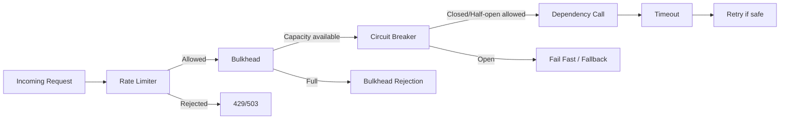
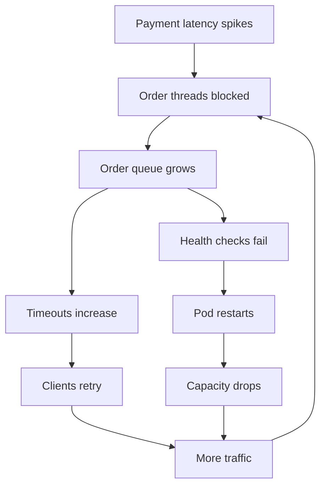
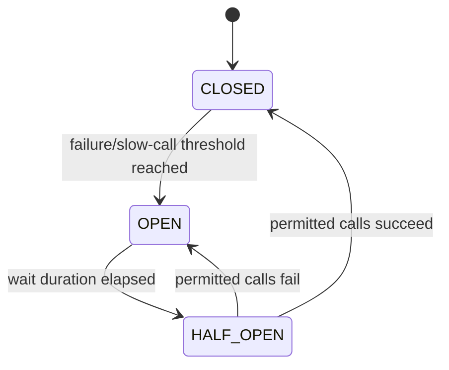
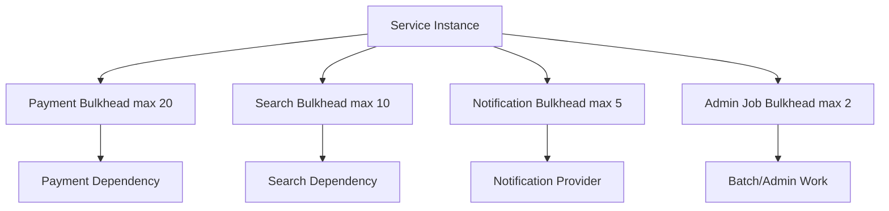
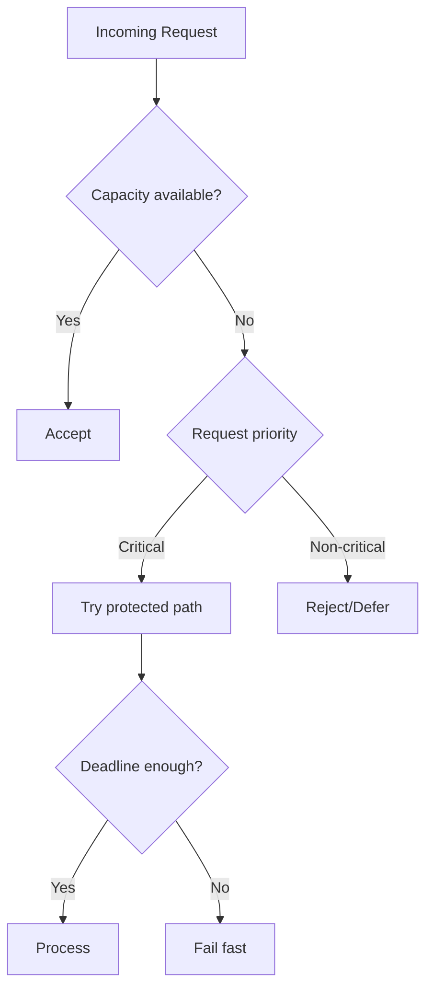

------
title: Learn Java Error, Reliability & Observability Engineering - Part 014
description: Circuit breaker, bulkhead, rate limiter, load shedding, failure isolation, and resilience policy design for production Java services.
series: learn-java-error-reliability-observability
seriesTitle: Learn Java Error, Reliability & Observability Engineering
order: 14
partTitle: Circuit Breaker, Bulkhead & Rate Limit
tags:
- java
- reliability
- resilience
- circuit-breaker
- bulkhead
- rate-limit
- resilience4j
- observability
date: 2026-06-28
---

# Part 014 — Circuit Breaker, Bulkhead & Rate Limit

## Target Pembelajaran

Setelah part ini, kamu harus bisa mendesain protection layer untuk Java service:

1. **Circuit breaker** untuk menghentikan call ke dependency yang sedang gagal atau lambat.
2. **Bulkhead** untuk mencegah satu dependency menghabiskan semua thread/connection/resource.
3. **Rate limiter** untuk mengontrol admission rate agar service tidak overload.
4. **Load shedding** untuk menolak sebagian traffic secara sengaja ketika kapasitas tidak cukup.
5. **Telemetry** untuk membuktikan protection layer bekerja.

Part sebelumnya membahas retry, timeout, dan idempotency. Part ini membahas pertanyaan berikut:

```txt
Kalau dependency sedang rusak, kapan kita berhenti mencoba?
Kalau satu dependency lambat, bagaimana mencegah seluruh service ikut macet?
Kalau traffic melebihi kapasitas, siapa yang harus ditolak dulu?
```

---

## 1. Mental Model: Reliability Control sebagai Governor

Retry mencoba memperbaiki kegagalan sementara. Tetapi retry tanpa governor bisa memperbesar kegagalan.

Circuit breaker, bulkhead, dan rate limiter adalah **governor**:

| Pattern | Pertanyaan yang dijawab |
|---|---|
| Circuit breaker | Haruskah kita terus memanggil dependency ini? |
| Bulkhead | Berapa banyak resource yang boleh dipakai dependency ini? |
| Rate limiter | Berapa banyak request yang boleh masuk per unit waktu? |
| Load shedding | Request mana yang harus ditolak ketika kapasitas tidak cukup? |



Urutan ini bukan hukum universal, tetapi mental model yang aman:

1. Batasi admission.
2. Batasi concurrency.
3. Cek health dependency.
4. Terapkan timeout.
5. Retry hanya jika aman.

---

## 2. Problem: Cascading Failure

Cascading failure terjadi ketika failure pada satu bagian menaikkan tekanan pada bagian lain, sehingga failure menyebar.

Contoh:

```txt
Payment Service lambat
Order Service thread menunggu Payment
Thread pool Order habis
Order tidak bisa menjawab health check
Kubernetes restart Order
Traffic berpindah ke pod tersisa
Pod tersisa overload
Seluruh checkout down
```



Resilience pattern bertujuan memutus positive feedback loop ini.

---

## 3. Circuit Breaker

Circuit breaker mencegah sistem terus memanggil dependency yang kemungkinan besar gagal.

### State



| State | Makna |
|---|---|
| CLOSED | Call normal, metrics dikumpulkan |
| OPEN | Call ditolak cepat tanpa memanggil dependency |
| HALF_OPEN | Sebagian kecil call diuji untuk melihat recovery |

### Circuit Breaker Bukan Timeout

Timeout menjawab:

```txt
Berapa lama satu call boleh menunggu?
```

Circuit breaker menjawab:

```txt
Apakah call berikutnya layak dilakukan?
```

### Circuit Breaker Bukan Retry

Retry menambah attempt. Circuit breaker mengurangi attempt.

Gabungan yang salah bisa berbahaya:

```txt
Circuit breaker open, tetapi retry tetap mencoba berkali-kali
```

Gabungan yang benar:

```txt
Jika breaker open, fail fast.
Retry hanya untuk failure yang melewati breaker dan aman diulang.
```

---

## 4. Circuit Breaker Metrics

Breaker biasanya memakai sliding window.

| Metric | Makna |
|---|---|
| Failure rate | Persentase call gagal |
| Slow call rate | Persentase call yang lebih lambat dari threshold |
| Minimum calls | Jumlah minimum call sebelum rate dihitung |
| Sliding window | Window count/time untuk menghitung rate |
| Open duration | Berapa lama breaker tetap open |
| Permitted half-open calls | Jumlah probe saat recovery |

### Contoh Policy

```txt
dependency: payment-service
minimumCalls: 50
slidingWindow: 60s
failureRateThreshold: 50%
slowCallDurationThreshold: 500ms
slowCallRateThreshold: 60%
openStateDuration: 30s
halfOpenPermittedCalls: 5
```

Interpretasi:

```txt
Jika minimal ada 50 call, dan lebih dari 50% gagal,
atau lebih dari 60% call lebih lambat dari 500ms,
breaker open selama 30s.
Setelah itu, 5 call probe menentukan recovery.
```

---

## 5. Circuit Breaker Classification

Tidak semua exception harus dihitung sebagai breaker failure.

| Failure | Count as failure? | Alasan |
|---|---|---|
| Connect timeout | Yes | Dependency unreachable |
| Read timeout | Yes | Dependency too slow/unknown |
| 500/502/503/504 | Usually yes | Upstream failure |
| 429 | Maybe separate | Throttling, bukan selalu health failure |
| 400 validation | No | Caller error |
| 401/403 | No or security metric | Auth/config issue |
| 404 domain not found | No | Normal business outcome |
| Domain rejection | No | Bukan dependency failure |
| Circuit open rejection | No as dependency failure | Ini local protection outcome |

Jika business rejection dihitung sebagai failure, breaker bisa open karena traffic valid yang ditolak domain. Itu salah.

---

## 6. Resilience4j Circuit Breaker Example

Resilience4j menyediakan decorator untuk Circuit Breaker, Retry, RateLimiter, Bulkhead, dan lain-lain.

```java
CircuitBreakerConfig config = CircuitBreakerConfig.custom()
        .slidingWindowType(CircuitBreakerConfig.SlidingWindowType.TIME_BASED)
        .slidingWindowSize(60)
        .minimumNumberOfCalls(50)
        .failureRateThreshold(50.0f)
        .slowCallDurationThreshold(Duration.ofMillis(500))
        .slowCallRateThreshold(60.0f)
        .waitDurationInOpenState(Duration.ofSeconds(30))
        .permittedNumberOfCallsInHalfOpenState(5)
        .recordException(this::shouldRecordAsDependencyFailure)
        .build();

CircuitBreaker breaker = CircuitBreaker.of("payment-service", config);

Supplier<PaymentResponse> protectedCall = CircuitBreaker
        .decorateSupplier(breaker, () -> paymentClient.createPayment(command));

PaymentResponse response = protectedCall.get();
```

Classifier:

```java
private boolean shouldRecordAsDependencyFailure(Throwable failure) {
    if (failure instanceof DomainRejectionException) {
        return false;
    }
    if (failure instanceof ValidationException) {
        return false;
    }
    if (failure instanceof DependencyTimeoutException) {
        return true;
    }
    if (failure instanceof DependencyUnavailableException) {
        return true;
    }
    return true;
}
```

Default production stance:

```txt
Record infrastructure/dependency failure.
Ignore expected domain/client failures.
```

---

## 7. Fallback

Fallback bukan default kosong asal jalan. Fallback adalah business decision.

| Scenario | Possible fallback |
|---|---|
| Recommendation service down | Return popular items |
| Fraud scoring unavailable | Queue for manual review or block high-risk operation |
| Price service unavailable | Use cached price if freshness acceptable |
| Notification service down | Persist outbox for later |
| Payment provider down | Offer retry later |
| Identity provider unavailable | Fail closed for privileged action |

### Fallback Risk

Fallback bisa melanggar invariant.

Contoh buruk:

```java
catch (Exception e) {
    return FraudDecision.APPROVED;
}
```

Jika fraud service gagal, approve semua transaksi adalah failure policy yang berbahaya.

Contoh lebih baik:

```java
catch (CallNotPermittedException e) {
    return FraudDecision.manualReview("fraud service circuit open");
}
```

---

## 8. Bulkhead

Bulkhead membatasi resource yang bisa dikonsumsi satu dependency atau satu workload class.

Analogi kapal: sekat mencegah satu ruang bocor menenggelamkan seluruh kapal.



Tanpa bulkhead, dependency lambat bisa menghabiskan semua thread.

### Bulkhead Types

| Type | Makna | Cocok untuk |
|---|---|---|
| Semaphore bulkhead | Membatasi concurrent calls | Virtual threads, non-blocking-ish calls, simple isolation |
| Thread-pool bulkhead | Dedicated thread pool + queue | Blocking dependency, legacy client |
| Connection pool limit | Membatasi koneksi | DB/HTTP clients |
| Queue limit | Membatasi backlog | Worker/job processing |
| Tenant bulkhead | Membatasi per tenant | Multi-tenant platform |
| Priority bulkhead | Pisahkan critical vs background | Reliability under load |

---

## 9. Bulkhead dan Virtual Threads

Virtual threads mengurangi cost blocking thread, tetapi tidak menghilangkan kebutuhan bulkhead.

Tanpa bulkhead, virtual threads bisa membuat sistem membuat sangat banyak concurrent call ke dependency sampai dependency collapse.

```txt
Virtual threads solve thread scarcity.
They do not solve downstream capacity.
```

Tetap batasi:

1. Concurrent calls ke dependency.
2. DB connections.
3. HTTP connections.
4. In-flight requests per tenant.
5. Queue depth.
6. Memory usage.

---

## 10. Resilience4j Bulkhead Example

Semaphore bulkhead:

```java
BulkheadConfig config = BulkheadConfig.custom()
        .maxConcurrentCalls(20)
        .maxWaitDuration(Duration.ofMillis(50))
        .build();

Bulkhead bulkhead = Bulkhead.of("payment-service", config);

Supplier<PaymentResponse> protectedCall = Bulkhead.decorateSupplier(
        bulkhead,
        () -> paymentClient.createPayment(command)
);

PaymentResponse response = protectedCall.get();
```

Interpretasi:

```txt
Maksimal 20 concurrent calls.
Jika penuh, tunggu maksimal 50ms.
Jika tetap penuh, reject cepat.
```

### Reject Cepat Lebih Baik daripada Queue Tak Terbatas

Queue panjang sering membuat latency makin buruk.

```txt
Queue is not capacity.
Queue is delayed pain.
```

Gunakan queue hanya jika:

1. Workload bisa menunggu.
2. Ada deadline.
3. Ada max queue size.
4. Ada observability.
5. Ada cancellation/drop policy.

---

## 11. Bulkhead Sizing

Salah satu cara sizing awal:

```txt
maxConcurrentCalls = dependency_capacity_per_instance * safe_fraction
```

Atau gunakan Little's Law secara kasar:

```txt
concurrency = throughput * latency
```

Jika target call Payment:

```txt
throughput: 100 req/s
p95 latency: 100ms = 0.1s
needed concurrency: 100 * 0.1 = 10
```

Tambahkan buffer:

```txt
bulkhead = 15-20
```

Jika latency spike ke 1s:

```txt
100 * 1 = 100 concurrent calls
```

Tanpa bulkhead, thread/connections akan naik drastis. Dengan bulkhead 20, sisanya ditolak cepat sehingga service tetap hidup.

---

## 12. Rate Limiter

Rate limiter mengontrol jumlah request per waktu.

| Pattern | Mental model |
|---|---|
| Fixed window | N request per window |
| Sliding window | Window bergerak lebih halus |
| Token bucket | Token refill periodik; burst terbatas |
| Leaky bucket | Output rate stabil |
| Concurrency limiter | Batasi in-flight, bukan request/sec |

Rate limiter bisa diterapkan di:

1. API gateway.
2. Service instance.
3. Client SDK.
4. Worker consumer.
5. Per tenant.
6. Per user.
7. Per dependency.

### Local vs Distributed Rate Limit

| Type | Kelebihan | Risiko |
|---|---|---|
| Local per instance | Cepat, simple | Total limit berubah saat scale out |
| Distributed | Global fairness | Latency/availability dependency baru |
| Gateway-level | Centralized | Tidak tahu semua business context |
| Application-level | Context-aware | Harus konsisten antar service |

---

## 13. Rate Limiter Example

```java
RateLimiterConfig config = RateLimiterConfig.custom()
        .limitForPeriod(100)
        .limitRefreshPeriod(Duration.ofSeconds(1))
        .timeoutDuration(Duration.ofMillis(20))
        .build();

RateLimiter limiter = RateLimiter.of("case-create", config);

Supplier<CreateCaseResponse> limited = RateLimiter.decorateSupplier(
        limiter,
        () -> caseService.create(command)
);

CreateCaseResponse response = limited.get();
```

Interpretasi:

```txt
100 permission per second.
Jika tidak tersedia, tunggu maksimal 20ms.
Jika tetap tidak tersedia, reject.
```

Mapping response:

| Context | Response |
|---|---|
| Public API per-user limit | 429 Too Many Requests |
| Internal dependency protection | 503 Service Unavailable atau domain-specific failure |
| Background job | Requeue with delay |
| Batch import | Mark row as deferred |
| Admin operation | Explain capacity constraint |

---

## 14. Load Shedding

Rate limiting sering statis. Load shedding lebih dinamis: sistem menolak traffic ketika kapasitas aktual tidak cukup.

Sinyal load shedding:

1. CPU terlalu tinggi.
2. Heap pressure.
3. GC pause tinggi.
4. Queue depth tinggi.
5. Thread pool saturated.
6. DB pool exhausted.
7. Downstream latency tinggi.
8. Error budget burn tinggi.
9. Kubernetes pod terminating.
10. Deadline request terlalu dekat.



### Priority Classes

| Priority | Example |
|---|---|
| P0 | Health/safety/regulatory critical write |
| P1 | User-facing core flow |
| P2 | User-facing non-critical enrichment |
| P3 | Background sync |
| P4 | Analytics/recommendation |

Top 1% engineer tidak menolak traffic secara random. Mereka mendesain **policy fairness dan priority**.

---

## 15. Composition: Retry, Timeout, Circuit Breaker, Bulkhead, Rate Limiter

Pattern bisa saling mengganggu jika urutannya salah.

### Recommended Conceptual Order

```txt
RateLimiter -> Bulkhead -> CircuitBreaker -> TimeLimiter/Timeout -> Retry-aware call
```

Tetapi detail tergantung library dan semantics.

Pertanyaan desain:

| Pertanyaan | Implikasi |
|---|---|
| Apakah retry harus mengakuisisi bulkhead permit per attempt? | Biasanya ya, agar retry tidak bypass concurrency control |
| Apakah circuit breaker melihat setiap attempt atau whole operation? | Untuk dependency health, breaker biasanya melihat attempt/call ke dependency |
| Apakah rate limiter menghitung retry? | Ya, retry tetap traffic |
| Apakah timeout per attempt atau total? | Butuh keduanya |
| Apakah fallback dipanggil saat breaker open? | Bisa, jika fallback aman |
| Apakah bulkhead rejection di-retry? | Biasanya tidak langsung; itu tanda local saturation |

### Dangerous Composition

```txt
Retry outside everything with maxAttempts=5
Each retry bypasses rate limiter
No total deadline
```

Hasil:

```txt
Local overload + retry storm.
```

### Safer Composition

```txt
Total deadline wraps operation
Each attempt:
  acquire rate permission
  acquire bulkhead permit
  check circuit breaker
  call with timeout
Retry only if classifier says safe and budget remains
```

---

## 16. Resilience Decorator Example

```java
Supplier<PaymentResponse> supplier = () -> paymentClient.createPayment(command);

Supplier<PaymentResponse> decorated =
        Decorators.ofSupplier(supplier)
                .withBulkhead(paymentBulkhead)
                .withCircuitBreaker(paymentCircuitBreaker)
                .withRetry(paymentRetry)
                .decorate();

PaymentResponse response = decorated.get();
```

Dalam production, jangan hanya copy order decorator. Verifikasi:

1. Exception mana yang dilihat retry.
2. Exception mana yang dihitung breaker.
3. Apakah bulkhead permit dipegang selama retry atau per attempt.
4. Apakah timeout diterapkan per attempt.
5. Apakah metrics sesuai yang kamu harapkan.

Testing terhadap composition lebih penting daripada asumsi.

---

## 17. Policy Registry

Untuk sistem besar, jangan biarkan setiap team membuat angka sendiri tanpa review.

```java
public record ResiliencePolicy(
        String dependency,
        Duration totalDeadline,
        int maxAttempts,
        Duration attemptTimeout,
        int maxConcurrentCalls,
        int rateLimitPerSecond,
        float failureRateThreshold,
        Duration slowCallThreshold
) {}
```

Contoh registry:

```yaml
dependencies:
  payment-service:
    totalDeadline: 800ms
    attemptTimeout: 250ms
    maxAttempts: 2
    maxConcurrentCalls: 20
    rateLimitPerSecond: 100
    failureRateThreshold: 50
    slowCallThreshold: 500ms

  notification-service:
    totalDeadline: 300ms
    attemptTimeout: 150ms
    maxAttempts: 1
    maxConcurrentCalls: 10
    rateLimitPerSecond: 50
    failureRateThreshold: 60
    slowCallThreshold: 250ms
```

Policy registry membantu:

1. Review architecture.
2. Audit.
3. Incident analysis.
4. Consistency.
5. Prevent config drift.

---

## 18. Observability untuk Protection Layer

### Metrics

| Metric | Type | Meaning |
|---|---|---|
| `circuit_breaker_state` | gauge | closed/open/half-open |
| `circuit_breaker_calls_total` | counter | successful, failed, ignored, not_permitted |
| `bulkhead_available_concurrent_calls` | gauge | remaining capacity |
| `bulkhead_rejections_total` | counter | local saturation |
| `rate_limiter_permissions_total` | counter | allowed/denied |
| `dependency_slow_calls_total` | counter | calls exceeding threshold |
| `fallback_invocations_total` | counter | fallback path used |
| `load_shed_total` | counter | intentionally rejected |
| `retry_after_circuit_open_total` | counter | should usually be zero |

### Logs

Circuit breaker open event:

```json
{
  "event": "circuit_breaker_opened",
  "dependency": "payment-service",
  "failureRate": 64.0,
  "slowCallRate": 72.0,
  "minimumCalls": 50,
  "window": "60s",
  "correlationId": "corr-123"
}
```

Bulkhead rejection:

```json
{
  "event": "bulkhead_rejected",
  "dependency": "payment-service",
  "maxConcurrentCalls": 20,
  "availableConcurrentCalls": 0,
  "operation": "createPayment"
}
```

Rate limit rejection:

```json
{
  "event": "rate_limited",
  "limitName": "case-create",
  "limitForPeriod": 100,
  "refreshPeriodMs": 1000,
  "actor": "tenant-123"
}
```

### Trace

Trace harus menunjukkan apakah request gagal karena:

1. Dependency real failure.
2. Circuit breaker open.
3. Bulkhead full.
4. Rate limit exceeded.
5. Fallback applied.
6. Deadline exceeded.

Itu semua outcome yang berbeda, bukan “500”.

---

## 19. Alerting

Alert buruk:

```txt
Circuit breaker opened once.
```

Breaker open bisa berarti protection bekerja.

Alert lebih baik:

```txt
Payment circuit breaker open for > 5 minutes AND checkout success rate below SLO.
```

Atau:

```txt
Bulkhead rejection > 5% for core operation for 10 minutes.
```

Atau:

```txt
Rate limit denial for P0 traffic > 0.
```

### Alert Classes

| Alert | Severity |
|---|---|
| Breaker open for optional dependency | Low/medium |
| Breaker open for critical dependency with user impact | High |
| Bulkhead rejection for background job | Low |
| Bulkhead rejection for core API | High |
| Rate limiting abusive tenant | Informational/security |
| Rate limiting all tenants | Capacity incident |
| Fallback invoked for safe stale cache | Medium |
| Fallback fail-open for security decision | Critical |

---

## 20. Testing Strategy

### Unit Test

Test classifier:

```java
@Test
void validationExceptionShouldNotTripBreaker() {
    assertFalse(classifier.shouldRecordAsDependencyFailure(
            new ValidationException("bad input")
    ));
}

@Test
void dependencyTimeoutShouldTripBreaker() {
    assertTrue(classifier.shouldRecordAsDependencyFailure(
            new DependencyTimeoutException("timeout")
    ));
}
```

### Integration Test

Simulate dependency returning 503:

```txt
Given dependency returns 503 for 50 calls
When client calls operation
Then circuit breaker opens
And subsequent calls fail fast
And dependency receives no call while open
```

### Load Test

Validate:

1. Bulkhead caps concurrency.
2. Queue does not grow unbounded.
3. Rate limiter rejects beyond configured rate.
4. Breaker opens under dependency failure.
5. Retry does not bypass rate limit.
6. Fallback does not violate domain invariant.

### Chaos Test

Inject:

1. 2s latency spike.
2. 50% 500 response.
3. Connection refused.
4. Partial timeout.
5. Slow success.
6. Dependency recovery after 30s.

Observe if system recovers without restart.

---

## 21. Regulatory/Case Management Angle

Untuk enforcement lifecycle atau complex case management platform, resilience policy bukan cuma uptime. Ia mempengaruhi defensibility.

Contoh:

| Operation | Failure policy |
|---|---|
| Create enforcement case | Prefer durable intent + idempotency; do not silently drop |
| Assign investigator | Retry optimistic conflict if command still valid |
| Notify regulated party | Outbox + retry + audit trail |
| Check sanctions/risk list | Fail closed or manual review depending policy |
| Generate audit report | Defer if dependency unavailable |
| Save decision | Must not fallback to default approval |
| Publish enforcement action | Idempotent publication key and audit evidence |

Protection layer harus menyimpan evidence:

```txt
why rejected?
why deferred?
why manual review?
which dependency failed?
which retry attempts happened?
was decision automatic or fallback?
```

---

## 22. Common Anti-Patterns

### 22.1 Circuit Breaker sebagai Pengganti Timeout

Breaker tidak akan menyelamatkan call pertama yang menggantung tanpa timeout.

### 22.2 Breaker Menghitung Business Rejection

Domain rejection bukan bukti dependency rusak.

### 22.3 Bulkhead Terlalu Besar

Bulkhead yang sama besar dengan total thread pool tidak mengisolasi apa pun.

### 22.4 Queue Tak Terbatas

Queue tak terbatas membuat latency tak terbatas dan memory pressure.

### 22.5 Fallback Melanggar Domain

Fallback yang membuat keputusan bisnis tanpa evidence bisa lebih buruk daripada failure.

### 22.6 Rate Limit Tanpa Fairness

Tenant besar bisa menghabiskan kapasitas dan membuat tenant kecil ikut gagal.

### 22.7 Alert Setiap Breaker Open

Ini menciptakan alert fatigue. Alert harus berbasis user impact dan durasi.

### 22.8 Retry Saat Circuit Open

Jika breaker open, dependency sedang dilindungi. Retry lokal hanya membuat noise.

---

## 23. Design Checklist

```txt
[ ] Apakah setiap dependency punya circuit breaker?
[ ] Apakah failure classifier membedakan technical failure dan domain rejection?
[ ] Apakah slow call ikut dihitung?
[ ] Apakah threshold berdasarkan latency/SLO, bukan angka asal?
[ ] Apakah half-open probe dibatasi?
[ ] Apakah fallback aman secara domain?
[ ] Apakah setiap dependency punya bulkhead/concurrency limit?
[ ] Apakah queue bounded?
[ ] Apakah rate limiter punya scope: user, tenant, operation, dependency?
[ ] Apakah retry dihitung dalam rate limit?
[ ] Apakah bulkhead rejection tidak di-retry secara membabi buta?
[ ] Apakah load shedding mempertimbangkan priority?
[ ] Apakah metrics breaker/bulkhead/rate-limit tersedia?
[ ] Apakah dashboard membedakan fail-fast dan dependency failure?
[ ] Apakah alert berbasis impact?
[ ] Apakah policy terdokumentasi dan direview?
```

---

## 24. Latihan Praktik

### Latihan 1 — Dependency Protection Map

Pilih satu service. Buat table:

```txt
dependency | criticality | timeout | retry | breaker | bulkhead | rate limit | fallback
```

Minimal 10 dependency/operation.

### Latihan 2 — Circuit Breaker Drill

Buat fake dependency:

1. 100% sukses.
2. 70% gagal.
3. 100% lambat.
4. Recover setelah 30 detik.

Pastikan breaker:

1. Closed saat sehat.
2. Open saat threshold lewat.
3. Half-open setelah wait duration.
4. Closed kembali setelah probe sukses.

### Latihan 3 — Bulkhead Saturation

Simulasikan 100 concurrent call ke dependency lambat dengan bulkhead 10.

Pastikan:

1. Hanya 10 concurrent call masuk.
2. Sisanya reject cepat atau wait sesuai max wait.
3. Service endpoint lain tetap responsif.

### Latihan 4 — Rate Limit Fairness

Implement per-tenant rate limit:

```txt
tenant A: 100 req/s
tenant B: 10 req/s
tenant C: 10 req/s
```

Simulasikan tenant A flood. Pastikan B dan C tetap mendapat kapasitas.

### Latihan 5 — Observability Review

Buat dashboard yang menampilkan:

```txt
breaker state
not permitted calls
bulkhead rejection
rate limit denial
fallback invocation
dependency latency
user-visible failure
```

Tugas: dari dashboard saja, jelaskan apakah sistem sedang rusak, dilindungi, atau salah konfigurasi.

---

## 25. Top 1% Mental Model

Engineer biasa berkata:

```txt
"Tambahkan circuit breaker."
```

Engineer kuat bertanya:

```txt
"Failure apa yang dihitung breaker?"
"Apakah slow call lebih berbahaya daripada error?"
"Apakah fallback aman secara domain?"
"Apakah bulkhead benar-benar mengisolasi resource?"
"Apakah retry bypass rate limiter?"
"Apakah breaker open adalah masalah atau justru perlindungan?"
"Bagaimana user impact dibedakan dari protection event?"
```

Circuit breaker, bulkhead, dan rate limiter bukan dekorator library. Mereka adalah policy eksplisit tentang bagaimana sistem mempertahankan stabilitas ketika dependency, traffic, dan kapasitas tidak lagi ideal.

---

## References

- Resilience4j Documentation — CircuitBreaker, Bulkhead, RateLimiter, Retry, TimeLimiter
- Google SRE Book — Addressing Cascading Failures
- Google SRE Book — Production Services Best Practices
- AWS Well-Architected Reliability Pillar — Control and limit retry calls
- AWS Builders Library — Timeouts, retries, and backoff with jitter
