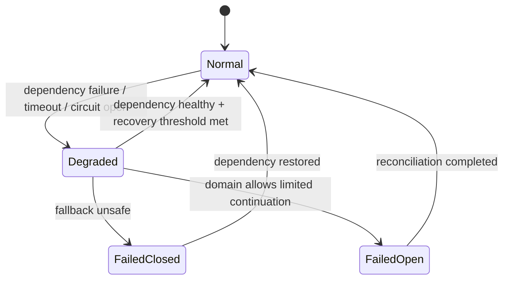
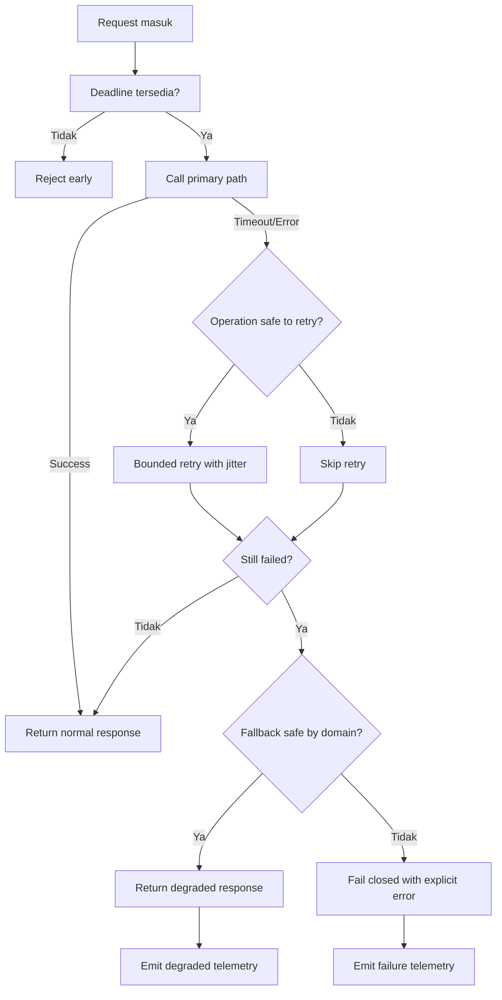
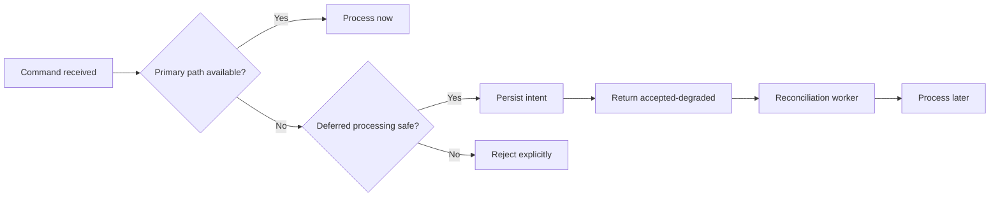

# Part 015 — Fallback & Graceful Degradation

## 1. Inti Pembelajaran

Fallback dan graceful degradation sering dipahami terlalu dangkal sebagai:

> “Kalau dependency gagal, kasih default value.”

Itu berbahaya.

Dalam sistem produksi, terutama sistem regulatori, enforcement lifecycle, case management, finance, identity, risk, policy, atau workflow kritikal, fallback bukan sekadar nilai pengganti. Fallback adalah **mode operasi alternatif** yang sengaja dirancang ketika sistem tidak dapat memenuhi jalur utama secara penuh.

Definisi kerja:

> **Fallback** adalah keputusan eksplisit untuk mengembalikan hasil alternatif saat jalur utama gagal, dengan batasan domain, observability, dan konsekuensi bisnis yang jelas.

> **Graceful degradation** adalah kemampuan sistem untuk mengurangi fungsi, kualitas, cakupan, kesegaran data, atau otomatisasi tanpa berubah menjadi salah, tidak aman, tidak dapat diaudit, atau tidak dapat dipulihkan.

Target part ini bukan membuat aplikasi “selalu sukses”. Targetnya adalah membuat aplikasi:

1. tetap aman saat dependency gagal,
2. jujur terhadap caller bahwa respons terdegradasi,
3. tidak menyembunyikan kerusakan sistem,
4. tidak menciptakan data palsu,
5. tidak memperbesar blast radius,
6. tetap observable,
7. tetap bisa dipertanggungjawabkan setelah incident.

---

## 2. Kaufman Skill Deconstruction

Mengikuti pendekatan Josh Kaufman, skill “fallback & degradation” kita pecah menjadi sub-skill kecil yang bisa dilatih.

| Sub-skill | Kemampuan yang Harus Dikuasai | Output Praktis |
|---|---|---|
| Failure classification | Membedakan transient, persistent, partial, overload, stale, dan unknown failure | Failure policy matrix |
| Domain impact analysis | Menentukan apakah hasil fallback aman secara domain | Fallback decision record |
| Degradation design | Mendesain partial capability, cached response, read-only mode, queue-later mode | Degradation mode catalog |
| Error honesty | Menyampaikan degraded state ke caller tanpa membocorkan detail internal | API response contract |
| Observability | Mengukur kapan fallback terjadi, kenapa, berapa lama, dan siapa terdampak | Logs, metrics, traces |
| Recovery thinking | Merancang bagaimana sistem kembali ke normal mode | Recovery invariant |
| Testing | Membuktikan fallback tidak merusak invariant | Failure injection test |

Prinsip Kaufman di sini:

> Jangan belajar fallback sebagai pattern. Belajar fallback sebagai **decision discipline**.

---

## 3. Mental Model: Fallback Adalah State, Bukan Catch Block

Anti-pattern umum:

```java
try {
    return recommendationClient.getRecommendations(userId);
} catch (Exception e) {
    return List.of();
}
```

Secara sintaksis ini terlihat aman. Secara sistemik bisa berbahaya.

Pertanyaan yang tidak terjawab:

1. Apakah empty list berarti benar-benar tidak ada rekomendasi?
2. Apakah caller tahu dependency gagal?
3. Apakah metric mencatat fallback?
4. Apakah user experience berbeda?
5. Apakah retry akan terjadi di layer atas?
6. Apakah keputusan bisnis berubah karena data kosong palsu?
7. Apakah tim operasi tahu service downstream sedang rusak?

Fallback yang benar harus diperlakukan sebagai state eksplisit:



Jika fallback tidak punya state, maka fallback hanya “exception swallowing with better branding”.

---

## 4. Perbedaan Fallback, Retry, Timeout, Circuit Breaker, dan Degradation

Part sebelumnya membahas retry, timeout, circuit breaker, bulkhead, dan rate limit. Fallback tidak menggantikan semua itu.

| Mekanisme | Pertanyaan yang Dijawab | Contoh |
|---|---|---|
| Timeout | “Berapa lama kita mau menunggu?” | Stop call setelah 500ms |
| Retry | “Apakah operasi aman diulang?” | Retry 2x dengan jitter |
| Circuit breaker | “Apakah dependency harus dihentikan sementara?” | Open circuit setelah error rate tinggi |
| Bulkhead | “Bagaimana membatasi kerusakan?” | Pool terpisah untuk dependency lambat |
| Rate limiter | “Apakah traffic boleh masuk?” | Batasi request per tenant |
| Fallback | “Apa respons aman jika jalur utama tidak tersedia?” | Return stale cached profile dengan flag degraded |
| Degradation | “Kapabilitas mana yang dikurangi?” | Read-only mode, manual review, partial response |

Urutan desain yang sehat:



---

## 5. Prinsip Utama Fallback Produksi

### 5.1 Fallback Harus Aman, Bukan Sekadar Tersedia

Sistem yang selalu memberi respons belum tentu reliable.

Contoh berbahaya:

```java
public RiskDecision assessRisk(Transaction tx) {
    try {
        return riskEngine.assess(tx);
    } catch (Exception e) {
        return RiskDecision.APPROVE;
    }
}
```

Ini meningkatkan availability palsu, tetapi menghancurkan risk invariant.

Fallback yang lebih aman:

```java
public RiskDecision assessRisk(Transaction tx) {
    try {
        return riskEngine.assess(tx);
    } catch (RiskEngineUnavailableException e) {
        return RiskDecision.manualReview(
                tx.id(),
                "RISK_ENGINE_UNAVAILABLE",
                "Risk decision deferred to manual review"
        );
    }
}
```

Perbedaannya:

1. sistem tidak pura-pura berhasil,
2. risiko tidak otomatis disetujui,
3. ada alasan eksplisit,
4. ada jalur operasional berikutnya,
5. hasil tetap bisa diaudit.

### 5.2 Fallback Harus Dibedakan dari Normal Result

Jika caller tidak bisa membedakan normal dan fallback, maka fallback mencemari domain semantics.

Buruk:

```java
record CustomerProfile(String id, String name, String segment) {}
```

Lebih baik:

```java
record CustomerProfileResponse(
        CustomerProfile profile,
        ResponseMode mode,
        String degradationReason,
        Instant dataFreshness
) {}

enum ResponseMode {
    NORMAL,
    DEGRADED_CACHE,
    DEGRADED_PARTIAL,
    DEGRADED_MANUAL_REVIEW,
    FAILED_CLOSED
}
```

Dengan ini, caller bisa membuat keputusan:

1. apakah boleh menampilkan data,
2. apakah boleh melakukan action,
3. apakah perlu banner “data may be stale”,
4. apakah perlu audit event,
5. apakah perlu retry later.

### 5.3 Fallback Harus Bounded

Fallback yang tidak dibatasi bisa menjadi silent outage.

Contoh batasan:

| Batasan | Contoh |
|---|---|
| Waktu | Cache fallback hanya boleh 15 menit |
| Scope | Hanya untuk read API, bukan write API |
| Tenant | Hanya tenant low-risk atau sandbox |
| Operation | Hanya inquiry, bukan approval |
| Volume | Maksimum 5% request boleh fallback |
| Business state | Tidak boleh fallback untuk case dalam escalation |
| Data class | Tidak boleh fallback untuk PII sensitif |

Invariant:

> Semakin besar konsekuensi bisnis, semakin sempit ruang fallback.

### 5.4 Fallback Harus Observable

Fallback yang tidak terlihat adalah outage yang tertunda.

Minimum telemetry:

| Signal | Data yang Dicatat |
|---|---|
| Log | reason, dependency, operation, correlationId, tenantId, fallbackMode |
| Metric | fallback count/rate by operation and reason |
| Trace | span event `fallback.selected` |
| Alert | fallback rate melewati threshold |
| Audit | untuk domain-regulated decision |

Contoh structured log:

```java
logger.warn("fallback_selected operation={} mode={} reason={} dependency={} correlationId={}",
        operation,
        fallbackMode,
        reasonCode,
        dependencyName,
        correlationId);
```

---

## 6. Taxonomy Fallback

### 6.1 Default Value Fallback

Mengembalikan nilai default.

Contoh:

```java
return UserPreferences.defaultPreferences(userId);
```

Cocok untuk:

1. preference UI,
2. non-critical personalization,
3. optional metadata,
4. low-risk enrichment.

Tidak cocok untuk:

1. risk score,
2. authorization,
3. payment limit,
4. regulatory status,
5. ownership status,
6. fraud decision.

Rule:

> Default value hanya aman jika default tersebut merupakan keputusan domain yang valid, bukan tebakan teknis.

### 6.2 Cached/Stale Data Fallback

Menggunakan data lama saat sumber utama tidak tersedia.

```java
public CustomerProfileResponse getProfile(CustomerId customerId) {
    try {
        CustomerProfile fresh = profileClient.fetch(customerId);
        cache.put(customerId, fresh);
        return CustomerProfileResponse.normal(fresh);
    } catch (ProfileServiceUnavailableException e) {
        return cache.find(customerId)
                .filter(cached -> cached.age().compareTo(Duration.ofMinutes(15)) <= 0)
                .map(CustomerProfileResponse::degradedCache)
                .orElseThrow(() -> new ProfileUnavailableException(customerId, e));
    }
}
```

Pertanyaan desain:

1. Seberapa stale data yang masih aman?
2. Apakah caller harus tahu data stale?
3. Apakah data stale boleh dipakai untuk decision atau hanya display?
4. Apakah cache harus invalidated setelah event tertentu?
5. Apakah cache mengandung PII?
6. Apakah cache konsisten lintas tenant?

### 6.3 Partial Response Fallback

Mengembalikan sebagian data ketika dependency enrichment gagal.

```java
record CaseOverview(
        String caseId,
        String status,
        Optional<RiskSummary> riskSummary,
        Optional<AssignmentInfo> assignment,
        ResponseMode mode
) {}
```

Cocok untuk:

1. dashboard,
2. search result,
3. non-critical enrichment,
4. read-only screen.

Risiko:

1. UI salah menginterpretasikan field kosong,
2. user mengambil keputusan dari data tidak lengkap,
3. field optional dipakai sebagai domain signal,
4. missing data dianggap “tidak ada masalah”.

Rule:

> Partial response harus menandai field yang unavailable, bukan menyamarkannya sebagai empty atau null normal.

### 6.4 Read-Only Mode

Sistem menolak mutasi tetapi tetap melayani baca.

Cocok ketika:

1. database primary write bermasalah,
2. downstream decision service tidak tersedia,
3. regulatory audit writer gagal,
4. event bus tidak bisa menjamin publish,
5. consistency invariant tidak bisa dijaga.

Contoh policy:

```java
public void updateCaseStatus(UpdateCaseStatusCommand command) {
    if (systemMode.isReadOnly()) {
        throw new SystemDegradedException(
                "CASE_WRITE_DISABLED",
                "Case status update is temporarily disabled because audit writer is unavailable"
        );
    }

    caseWorkflow.updateStatus(command);
}
```

Read-only mode sering lebih baik daripada “best effort write” yang kehilangan audit trail.

### 6.5 Queue-for-Later Fallback

Jika operasi tidak bisa diproses sekarang, simpan intent untuk diproses nanti.

Cocok untuk:

1. notification,
2. non-urgent synchronization,
3. reconciliation job,
4. external reporting,
5. asynchronous enrichment.

Tidak cocok jika:

1. caller butuh immediate decision,
2. operation tidak idempotent,
3. order sangat kritikal dan tidak terjamin,
4. delayed processing mengubah outcome hukum/bisnis,
5. tidak ada reconciliation process.

Pattern:



### 6.6 Manual Review Fallback

Untuk domain high-risk, fallback terbaik sering bukan default, melainkan human/manual decision.

Contoh:

```java
public EnforcementDecision decide(CaseFile file) {
    try {
        return decisionEngine.decide(file);
    } catch (DecisionEngineUnavailableException e) {
        manualReviewQueue.enqueue(file.id(), "DECISION_ENGINE_UNAVAILABLE");
        return EnforcementDecision.pendingManualReview(file.id());
    }
}
```

Cocok untuk:

1. enforcement action,
2. fraud decision,
3. account restriction,
4. licensing approval,
5. sanctions/policy-sensitive workflow.

Kelemahan:

1. operational backlog,
2. human inconsistency,
3. SLA impact,
4. escalation burden.

Tetapi secara defensibility, ini sering jauh lebih baik daripada keputusan otomatis yang tidak punya data cukup.

### 6.7 Feature Disablement

Menonaktifkan fitur non-critical untuk menjaga core journey tetap berjalan.

Contoh:

1. disable recommendation,
2. disable analytics enrichment,
3. disable preview generation,
4. disable export besar,
5. disable auto-assignment,
6. disable background indexing.

Prinsip:

> Degrade optional capability first. Protect core invariant last.

---

## 7. Fail Open, Fail Closed, Fail Soft, Fail Hard

### 7.1 Fail Closed

Fail closed berarti sistem menolak operasi saat tidak bisa memastikan keamanan/kebenaran.

Contoh:

```java
if (!authorizationService.canVerify(user, action)) {
    throw new AccessDecisionUnavailableException("AUTHZ_DECISION_UNAVAILABLE");
}
```

Cocok untuk:

1. authorization,
2. identity proofing,
3. payment approval,
4. risk approval,
5. enforcement escalation,
6. legal/regulatory irreversible action.

### 7.2 Fail Open

Fail open berarti sistem mengizinkan operasi walau sebagian pemeriksaan gagal.

Cocok hanya jika:

1. dampak risiko rendah,
2. consequence reversible,
3. decision bisa direkonsiliasi,
4. user impact fail-closed lebih buruk,
5. ada audit trail,
6. policy menyetujui.

Contoh relatif aman:

```java
public boolean shouldShowWelcomeBanner(UserId userId) {
    try {
        return personalizationClient.shouldShowBanner(userId);
    } catch (Exception e) {
        return false;
    }
}
```

### 7.3 Fail Soft

Fail soft berarti sistem tetap berjalan dengan kapabilitas terbatas.

Contoh:

1. dashboard tampil tanpa risk summary,
2. export berjalan tanpa enrichment optional,
3. search berjalan tanpa sorting personalization,
4. create case diterima tetapi auto-assignment ditunda.

### 7.4 Fail Hard

Fail hard berarti operasi dihentikan eksplisit.

Contoh:

1. audit write tidak tersedia untuk mutasi regulated,
2. idempotency store tidak tersedia untuk payment-like command,
3. authorization decision unavailable,
4. state transition guard tidak bisa dievaluasi.

Decision table:

| Scenario | Recommended Mode | Alasan |
|---|---|---|
| Authorization service down | Fail closed | Tidak boleh memberi akses tanpa keputusan |
| Recommendation service down | Fail soft | Non-critical enrichment |
| Audit writer down for regulated mutation | Fail hard/read-only | Mutasi tanpa audit tidak defensible |
| Notification service down | Queue for later | Side effect bisa delayed |
| Risk engine down for approval | Manual review | Decision high-risk |
| Profile service down for display | Stale cache with marker | Read-only dan bounded |
| Idempotency store down | Fail hard | Duplicate side effect risk |

---

## 8. Java Design Pattern: Degraded Result

Buat degraded state sebagai tipe eksplisit.

```java
public sealed interface ServiceResult<T>
        permits ServiceResult.Success, ServiceResult.Degraded, ServiceResult.Failure {

    record Success<T>(T value) implements ServiceResult<T> {}

    record Degraded<T>(
            T value,
            DegradationMode mode,
            String reasonCode,
            Instant observedAt
    ) implements ServiceResult<T> {}

    record Failure<T>(
            String errorCode,
            String message
    ) implements ServiceResult<T> {}
}

public enum DegradationMode {
    STALE_CACHE,
    PARTIAL_RESPONSE,
    MANUAL_REVIEW,
    READ_ONLY,
    QUEUED_FOR_LATER,
    FEATURE_DISABLED
}
```

Pemakaian:

```java
public ServiceResult<CaseOverview> getCaseOverview(CaseId caseId) {
    CaseSummary summary = caseRepository.findSummary(caseId)
            .orElseThrow(() -> new CaseNotFoundException(caseId));

    try {
        RiskSummary risk = riskClient.getRiskSummary(caseId);
        return new ServiceResult.Success<>(CaseOverview.withRisk(summary, risk));
    } catch (RiskServiceUnavailableException e) {
        return new ServiceResult.Degraded<>(
                CaseOverview.withoutRisk(summary),
                DegradationMode.PARTIAL_RESPONSE,
                "RISK_SUMMARY_UNAVAILABLE",
                Instant.now()
        );
    }
}
```

Boundary mapper:

```java
public ResponseEntity<CaseOverviewResponse> toHttp(ServiceResult<CaseOverview> result) {
    return switch (result) {
        case ServiceResult.Success<CaseOverview> success ->
                ResponseEntity.ok(CaseOverviewResponse.normal(success.value()));

        case ServiceResult.Degraded<CaseOverview> degraded ->
                ResponseEntity.ok()
                        .header("X-Response-Mode", "degraded")
                        .header("X-Degradation-Reason", degraded.reasonCode())
                        .body(CaseOverviewResponse.degraded(
                                degraded.value(),
                                degraded.mode(),
                                degraded.reasonCode()
                        ));

        case ServiceResult.Failure<CaseOverview> failure ->
                ResponseEntity.status(HttpStatus.SERVICE_UNAVAILABLE)
                        .body(CaseOverviewResponse.failed(failure.errorCode()));
    };
}
```

Catatan:

1. Tidak semua API harus expose header seperti ini.
2. Untuk public API, gunakan kontrak formal seperti Problem Details atau response metadata.
3. Untuk internal API, header dapat membantu debugging dan routing.
4. Jangan expose dependency internal jika itu informasi sensitif.

---

## 9. Java Design Pattern: Fallback Policy Object

Jangan sebarkan keputusan fallback di banyak `catch` block.

Buruk:

```java
try {
    return client.call();
} catch (TimeoutException e) {
    return cache.get();
} catch (IOException e) {
    return cache.get();
} catch (RuntimeException e) {
    return defaultValue();
}
```

Lebih baik:

```java
public final class FallbackPolicy {

    public FallbackDecision decide(FailureContext context) {
        if (context.operation().isWrite()) {
            return FallbackDecision.failClosed("WRITE_FALLBACK_NOT_ALLOWED");
        }

        if (context.failureType() == FailureType.AUTHORIZATION_UNAVAILABLE) {
            return FallbackDecision.failClosed("AUTHZ_UNAVAILABLE_FAIL_CLOSED");
        }

        if (context.failureType() == FailureType.READ_DEPENDENCY_TIMEOUT
                && context.cacheAge().compareTo(Duration.ofMinutes(15)) <= 0) {
            return FallbackDecision.useStaleCache("STALE_CACHE_ALLOWED");
        }

        if (context.operation().isNonCriticalEnrichment()) {
            return FallbackDecision.partialResponse("OPTIONAL_ENRICHMENT_SKIPPED");
        }

        return FallbackDecision.failClosed("NO_SAFE_FALLBACK");
    }
}
```

Supporting types:

```java
public record FailureContext(
        Operation operation,
        FailureType failureType,
        Duration cacheAge,
        String dependency,
        String tenantId,
        String correlationId
) {}

public record FallbackDecision(
        FallbackAction action,
        String reasonCode
) {
    static FallbackDecision failClosed(String reasonCode) {
        return new FallbackDecision(FallbackAction.FAIL_CLOSED, reasonCode);
    }

    static FallbackDecision useStaleCache(String reasonCode) {
        return new FallbackDecision(FallbackAction.USE_STALE_CACHE, reasonCode);
    }

    static FallbackDecision partialResponse(String reasonCode) {
        return new FallbackDecision(FallbackAction.PARTIAL_RESPONSE, reasonCode);
    }
}

enum FallbackAction {
    FAIL_CLOSED,
    USE_STALE_CACHE,
    PARTIAL_RESPONSE,
    QUEUE_FOR_LATER,
    MANUAL_REVIEW
}
```

Manfaat:

1. fallback rule bisa diuji terpisah,
2. policy review lebih mudah,
3. domain owner bisa memahami konsekuensi,
4. audit lebih jelas,
5. tidak ada fallback liar di catch block.

---

## 10. Fallback dan Domain Invariant

Sebelum mendesain fallback, tulis invariant.

Contoh case management:

| Invariant | Fallback yang Dilarang | Fallback yang Mungkin Aman |
|---|---|---|
| Case status transition harus valid | Update status walau rule engine down | Queue/manual review |
| Mutasi regulated harus punya audit event | Commit DB tanpa audit | Read-only/fail hard |
| Assignment tidak boleh ke officer tanpa permission | Default assign ke siapa saja | Pending assignment |
| Enforcement action butuh risk decision | Auto-approve | Manual review |
| User tidak boleh melihat restricted case | Fail open authz | Fail closed |
| UI dashboard boleh incomplete | Hard fail seluruh dashboard | Partial response |

Template invariant:

```mdx
### Fallback Decision Record

Operation: <operation name>
Primary dependency: <dependency>
Failure modes: <timeout, 5xx, unavailable, stale, unknown>
Business consequence: <low/medium/high/critical>
Allowed fallback modes: <list>
Forbidden fallback modes: <list>
Maximum degradation duration: <duration>
Caller visibility: <explicit/hidden/internal>
Audit required: <yes/no>
Metrics required: <yes/no>
Recovery process: <manual/automatic/reconciliation>
Owner approval: <team/domain owner>
```

Top 1% engineer tidak hanya bertanya “bisa fallback apa?” Mereka bertanya:

> “Fallback ini menjaga invariant apa, dan invariant apa yang dikorbankan?”

---

## 11. Fallback dan Data Freshness

Stale data bukan masalah teknis semata. Stale data adalah masalah domain.

Contoh:

| Data | Stale 5 menit | Stale 1 jam | Stale 1 hari |
|---|---:|---:|---:|
| UI theme | Aman | Aman | Aman |
| Product catalog | Mungkin aman | Tergantung | Tergantung |
| Customer profile display | Mungkin aman | Perlu marker | Berisiko |
| Risk score | Berisiko | Tidak aman | Tidak aman |
| Authorization decision | Tidak aman | Tidak aman | Tidak aman |
| Regulatory case status | Tergantung state | Berisiko | Tidak aman |

Representasikan freshness:

```java
public record CachedValue<T>(
        T value,
        Instant loadedAt,
        Duration maxAge
) {
    public boolean isFreshAt(Instant now) {
        return Duration.between(loadedAt, now).compareTo(maxAge) <= 0;
    }

    public Duration ageAt(Instant now) {
        return Duration.between(loadedAt, now);
    }
}
```

Jangan hanya cache value. Cache juga metadata:

1. loadedAt,
2. source version,
3. source system,
4. tenant,
5. invalidation reason,
6. maximum allowed age,
7. classification/sensitivity.

---

## 12. Fallback dan Consistency

Fallback bisa mengubah consistency model tanpa disadari.

Contoh:

1. normal mode membaca data fresh dari primary service,
2. fallback mode membaca cache lokal 10 menit,
3. caller melakukan action berdasarkan data stale,
4. action menyebabkan state transition yang tidak lagi valid.

Mitigasi:

1. bedakan data untuk display vs decision,
2. jangan gunakan fallback read untuk critical write decision,
3. mark stale data explicitly,
4. require revalidation before mutation,
5. gunakan version/ETag/stateVersion,
6. gunakan optimistic concurrency check.

Contoh:

```java
public void approveCase(ApproveCaseCommand command) {
    CaseSnapshot snapshot = caseRepository.get(command.caseId());

    if (!snapshot.version().equals(command.expectedVersion())) {
        throw new CaseConflictException(
                command.caseId(),
                "CASE_VERSION_CHANGED",
                "Case changed after the user viewed it"
        );
    }

    approvalPolicy.ensureCanApprove(snapshot);
    caseRepository.approve(command.caseId());
}
```

Degraded read boleh terjadi, tetapi write harus revalidate.

---

## 13. Observability untuk Fallback

### 13.1 Logging

Log fallback sebagai event, bukan stack trace spam.

```java
logger.warn(
        "fallback_selected operation={} dependency={} mode={} reason={} tenant={} correlationId={}",
        operation,
        dependency,
        mode,
        reason,
        tenantId,
        correlationId
);
```

Jangan log seluruh exception setiap request jika downstream outage menghasilkan ribuan fallback per detik. Gunakan sampling, rate limiting, atau aggregate telemetry.

### 13.2 Metrics

Minimum metric:

```txt
fallback_total{operation,dependency,mode,reason}
fallback_ratio{operation,dependency}
fallback_duration_seconds{mode}
degraded_response_total{api,mode}
stale_cache_age_seconds{operation,dependency}
```

Cardinality warning:

Jangan masukkan `caseId`, `userId`, `correlationId`, atau raw error message sebagai metric tag.

### 13.3 Tracing

Span event:

```java
Span.current().addEvent("fallback.selected", Attributes.of(
        stringKey("app.operation"), operation,
        stringKey("fallback.mode"), mode.name(),
        stringKey("fallback.reason"), reason,
        stringKey("dependency.name"), dependency
));
```

Jika menggunakan OpenTelemetry, fallback sebaiknya tampak sebagai event atau attribute di span yang relevan, bukan trace terpisah tanpa hubungan kausal.

### 13.4 Alerting

Alert yang baik:

1. fallback ratio > baseline,
2. fallback duration terlalu lama,
3. fallback mode critical aktif,
4. stale cache age mendekati batas,
5. manual review backlog naik,
6. read-only mode aktif untuk domain kritikal.

Alert yang buruk:

1. alert setiap fallback tunggal,
2. alert berdasarkan log message string,
3. alert tanpa service owner,
4. alert tanpa runbook,
5. alert untuk fallback yang expected dan low-risk.

---

## 14. Fallback dan User Experience

Fallback yang baik tidak selalu harus terlihat ke end user, tetapi harus terlihat ke caller/operator.

| Scenario | User Visibility | Operator Visibility |
|---|---|---|
| Optional recommendation gagal | Bisa disembunyikan | Metric/log tetap ada |
| Dashboard partial | Tampilkan marker bagian unavailable | Metric/log/trace |
| Data stale | Tampilkan freshness jika relevan | Metric stale age |
| Write disabled | Tampilkan pesan eksplisit | Alert |
| Manual review fallback | Tampilkan status pending/manual review | Audit + queue metric |

Contoh API response:

```json
{
  "caseId": "CASE-123",
  "status": "UNDER_REVIEW",
  "riskSummary": null,
  "meta": {
    "responseMode": "DEGRADED_PARTIAL",
    "degradationReason": "RISK_SUMMARY_UNAVAILABLE",
    "safeForDecision": false
  }
}
```

Field penting: `safeForDecision`.

Dalam sistem kompleks, response boleh cukup untuk display tetapi tidak cukup untuk decision.

---

## 15. Fallback dan Security

Fallback sering membuka celah security.

Anti-pattern:

```java
try {
    return permissionClient.canAccess(user, resource);
} catch (Exception e) {
    return true;
}
```

Aturan keras:

1. Authorization failure harus fail closed.
2. Authentication uncertainty harus fail closed.
3. Policy decision unavailable harus fail closed kecuali ada policy formal yang menyatakan sebaliknya.
4. Fallback tidak boleh melewati audit/security hook.
5. Fallback tidak boleh expose data sensitif karena masking service gagal.
6. Fallback cache untuk data sensitif harus punya TTL dan encryption policy.

Security fallback yang sehat:

```java
public AccessDecision canAccess(User user, Resource resource) {
    try {
        return policyDecisionPoint.evaluate(user, resource);
    } catch (PolicyUnavailableException e) {
        throw new AccessUnavailableException(
                "ACCESS_DECISION_UNAVAILABLE",
                "Access cannot be evaluated at this time",
                e
        );
    }
}
```

---

## 16. Fallback dan Regulatory Defensibility

Dalam domain regulatori, pertanyaan setelah incident bukan hanya:

> “Apakah sistem tetap online?”

Tetapi:

1. keputusan apa yang dibuat saat informasi tidak lengkap?
2. siapa/apa yang menyetujui fallback policy?
3. apakah user/caller tahu bahwa response degraded?
4. apakah mutasi tetap punya audit trail?
5. apakah ada reconciliation?
6. apakah ada bukti bahwa fallback bounded?
7. apakah fallback pernah diuji?
8. apakah data stale dipakai untuk keputusan yang tidak semestinya?

Untuk operasi regulated, buat fallback record:

```java
public record FallbackAuditEvent(
        String operation,
        String entityId,
        String fallbackMode,
        String reasonCode,
        Instant occurredAt,
        String correlationId,
        String actorId,
        boolean decisionDeferred,
        boolean mutationPerformed
) {}
```

Audit event tidak perlu untuk semua fallback low-risk, tetapi wajib untuk fallback yang mempengaruhi keputusan domain.

---

## 17. Testing Fallback

Fallback harus diuji sebagai first-class behavior.

### 17.1 Unit Test Policy

```java
@Test
void shouldFailClosedWhenAuthorizationUnavailable() {
    FallbackPolicy policy = new FallbackPolicy();

    FallbackDecision decision = policy.decide(new FailureContext(
            Operation.write("approve-case"),
            FailureType.AUTHORIZATION_UNAVAILABLE,
            Duration.ZERO,
            "authz-service",
            "tenant-a",
            "corr-1"
    ));

    assertThat(decision.action()).isEqualTo(FallbackAction.FAIL_CLOSED);
}
```

### 17.2 Integration Test Dependency Failure

```java
@Test
void shouldReturnPartialResponseWhenRiskSummaryUnavailable() {
    riskService.stubTimeout();

    ResponseEntity<CaseOverviewResponse> response = restTemplate.getForEntity(
            "/cases/CASE-123/overview",
            CaseOverviewResponse.class
    );

    assertThat(response.getStatusCode()).isEqualTo(HttpStatus.OK);
    assertThat(response.getBody().meta().responseMode()).isEqualTo("DEGRADED_PARTIAL");
    assertThat(response.getBody().meta().safeForDecision()).isFalse();
}
```

### 17.3 Chaos/Failure Injection Test

Simulasikan:

1. timeout dependency,
2. 5xx dependency,
3. slow response,
4. stale cache,
5. missing cache,
6. partial dependency failure,
7. circuit open,
8. audit writer unavailable,
9. queue unavailable,
10. recovery after outage.

### 17.4 Observability Test

Verifikasi:

1. metric fallback bertambah,
2. log structured berisi reason code,
3. trace punya event fallback,
4. alert threshold masuk akal,
5. no high-cardinality metric tag,
6. audit event tercatat jika required.

---

## 18. Common Anti-Patterns

### 18.1 Catch-All Fallback

```java
catch (Exception e) {
    return defaultValue;
}
```

Masalah:

1. menyembunyikan bug,
2. menyamakan semua failure,
3. tidak observable,
4. bisa mengubah semantics,
5. sulit debug.

### 18.2 Fallback yang Tidak Pernah Diuji

Fallback code sering hanya jalan saat incident. Jika tidak diuji, fallback bisa lebih rusak daripada primary path.

### 18.3 Fallback dengan Dependency yang Sama

```java
try {
    return primaryClient.call();
} catch (Exception e) {
    return fallbackClient.call(); // ternyata host/database/network sama
}
```

Fallback harus independen secara failure domain, atau setidaknya paham shared dependency.

### 18.4 Fallback yang Memicu Overload

Contoh:

1. primary cache gagal,
2. fallback hit database langsung,
3. database overload,
4. semua request makin lambat,
5. retry meningkat,
6. cascading failure.

### 18.5 Silent Degradation

Sistem degraded selama berhari-hari karena semua response 200 OK dan tidak ada alert.

### 18.6 Fallback Mengubah Authorization

Tidak boleh.

### 18.7 Empty Collection sebagai Error

```java
return List.of();
```

Kadang empty berarti “tidak ada data”. Kadang berarti “gagal mengambil data”. Jangan campur.

---

## 19. Production Checklist

Sebelum menambahkan fallback, jawab:

1. Apa primary operation?
2. Failure apa yang ingin ditangani?
3. Apakah operation read atau write?
4. Apakah fallback aman secara domain?
5. Apakah fallback mengubah consistency?
6. Apakah fallback boleh memakai stale data?
7. Berapa batas usia data?
8. Apakah caller tahu response degraded?
9. Apakah fallback memerlukan audit event?
10. Apakah fallback punya metric?
11. Apakah fallback punya trace event?
12. Apakah fallback punya alert threshold?
13. Apakah fallback punya recovery path?
14. Apakah fallback diuji?
15. Apakah fallback punya owner?
16. Apakah fallback bisa memperbesar overload?
17. Apakah fallback memiliki dependency yang sama dengan primary path?
18. Apakah fallback membuka risiko security?
19. Apakah fallback bisa menyebabkan keputusan irreversible?
20. Apakah fallback dapat dimatikan dengan feature flag/config?

---

## 20. Latihan 20 Jam — Fallback & Degradation

### Jam 1–3: Inventory

Ambil satu service Java. Buat daftar:

1. dependency eksternal,
2. dependency internal,
3. operasi read,
4. operasi write,
5. enrichment optional,
6. decision critical,
7. side effect async.

### Jam 4–6: Failure Matrix

Untuk tiap dependency, tulis:

1. timeout,
2. 5xx,
3. connection refused,
4. stale response,
5. partial response,
6. invalid response,
7. unknown outcome.

### Jam 7–10: Fallback Decision Record

Pilih lima operasi dan buat decision record.

### Jam 11–14: Implement Explicit Degraded Result

Refactor satu endpoint agar tidak menyamarkan fallback sebagai normal response.

### Jam 15–17: Instrumentation

Tambahkan:

1. structured log,
2. fallback metric,
3. trace event,
4. alert candidate.

### Jam 18–20: Failure Injection

Matikan dependency, jalankan test, dan verifikasi:

1. response benar,
2. invariant tidak rusak,
3. telemetry muncul,
4. caller tahu degraded state,
5. recovery berjalan.

---

## 21. Ringkasan

Fallback yang baik bukan trik availability. Fallback yang baik adalah kontrak produksi.

Mental model utama:

1. Fallback adalah state, bukan catch block.
2. Degradation adalah mode operasi, bukan bug yang disembunyikan.
3. Default value hanya aman jika valid secara domain.
4. Data stale harus punya freshness dan batas pemakaian.
5. Authorization dan policy critical umumnya fail closed.
6. Write critical sering lebih baik fail hard/read-only daripada best effort.
7. Partial response harus eksplisit.
8. Manual review adalah fallback sah untuk domain high-risk.
9. Fallback harus observable.
10. Fallback harus diuji sebelum incident.

Dalam part berikutnya, kita masuk ke fondasi lifecycle yang membuat fallback, shutdown, async flow, dan cleanup bisa benar: **cancellation, interruption, dan cleanup**.

