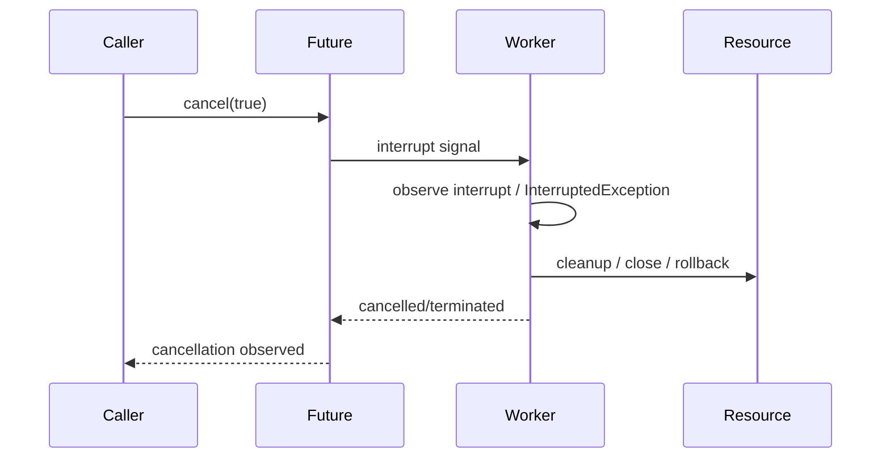
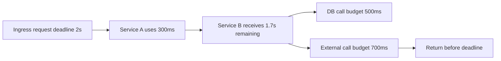

# Part 016 — Cancellation, Interruption & Cleanup

## 1. Inti Pembelajaran

Banyak bug produksi Java bukan berasal dari algoritma yang salah, tetapi dari lifecycle yang tidak selesai dengan benar:

1. request sudah timeout, tetapi worker masih berjalan,
2. job dibatalkan, tetapi tetap menulis side effect,
3. shutdown dimulai, tetapi executor tidak drain,
4. thread di-interrupt, tetapi status interrupt ditelan,
5. resource gagal ditutup, tetapi exception utama hilang,
6. cleanup tidak idempotent,
7. cancellation tidak dipropagasikan ke child task,
8. timeout hanya terjadi di HTTP layer, bukan di operasi internal.

Target part ini:

> Memahami cancellation, interruption, dan cleanup sebagai satu sistem lifecycle yang menjaga service tetap bisa berhenti, pulih, dan tidak meninggalkan kerja liar.

Definisi kerja:

| Konsep | Definisi |
|---|---|
| Cancellation | Permintaan agar pekerjaan berhenti sebelum selesai normal |
| Interruption | Mekanisme kooperatif Java untuk memberi sinyal ke thread agar berhenti/keluar dari blocking operation tertentu |
| Cleanup | Pelepasan resource dan penutupan side effect secara aman setelah success, failure, cancellation, atau shutdown |
| Deadline | Batas waktu absolut kapan pekerjaan tidak lagi berguna |
| Timeout | Mekanisme lokal untuk berhenti menunggu setelah durasi tertentu |
| Drain | Membiarkan pekerjaan yang sudah diterima selesai dalam batas waktu tertentu |
| Abort | Menghentikan atau menolak pekerjaan karena tidak aman/terlambat |

---

## 2. Kaufman Skill Deconstruction

Skill besar ini dipecah menjadi sub-skill praktis:

| Sub-skill | Kemampuan | Output Praktis |
|---|---|---|
| Interruption semantics | Paham interrupt sebagai signal, bukan force kill | Correct catch policy |
| Cancellation propagation | Membawa cancel/deadline dari caller ke child work | Cancellation-aware service |
| Blocking awareness | Tahu call mana yang interruptible dan mana yang tidak | Blocking operation inventory |
| Executor lifecycle | Shutdown, shutdownNow, awaitTermination, reject policy | Graceful executor helper |
| Cleanup discipline | Resource close, rollback, unlock, delete temp, release permit | Cleanup checklist |
| Idempotent cleanup | Aman jika cleanup dipanggil lebih dari sekali | Safe close pattern |
| Observability | Membedakan failure, timeout, cancellation, shutdown | Lifecycle telemetry |
| Testing | Membuktikan job berhenti saat diminta | Cancellation tests |

Prinsip Kaufman:

> Jangan menghafal `InterruptedException`. Latih kemampuan menjawab: “apa yang harus berhenti, kapan, bagaimana, dan bukti apa yang menunjukkan sudah berhenti?”

---

## 3. Mental Model: Cancellation Adalah Kontrak Kooperatif

Java tidak menyediakan cara aman untuk membunuh thread secara paksa dalam aplikasi normal. Interruption adalah mekanisme kooperatif: satu thread mengirim sinyal, thread lain harus memeriksa atau merespons sinyal tersebut.



Kontraknya:

1. caller boleh meminta pembatalan,
2. worker harus punya titik observasi cancellation,
3. blocking operation harus diberi timeout/interrupt support,
4. cleanup harus tetap berjalan,
5. side effect harus tidak setengah-commit,
6. telemetry harus membedakan cancellation dari error biasa.

Jika worker tidak kooperatif, cancellation hanya menjadi flag yang tidak berpengaruh.

---

## 4. Interruption di Java

### 4.1 Apa Itu Interrupt?

Interrupt adalah sinyal yang disimpan sebagai status pada thread.

Operasi tertentu seperti `Thread.sleep`, `Object.wait`, `Thread.join`, `BlockingQueue.take`, dan banyak API blocking lain dapat merespons interrupt dengan melempar `InterruptedException`.

Penting:

> `InterruptedException` bukan “error bisnis”. Itu sinyal lifecycle.

### 4.2 Interrupt Bukan Force Stop

Buruk mental model:

> “Kalau thread di-interrupt, thread otomatis mati.”

Benar:

> “Kalau thread di-interrupt, thread diberi kesempatan untuk berhenti di titik yang mendukung interruption atau saat ia memeriksa status interrupt.”

Contoh cooperative loop:

```java
public final class Worker implements Runnable {
    private final BlockingQueue<Job> queue;

    public Worker(BlockingQueue<Job> queue) {
        this.queue = queue;
    }

    @Override
    public void run() {
        while (!Thread.currentThread().isInterrupted()) {
            try {
                Job job = queue.take();
                process(job);
            } catch (InterruptedException e) {
                Thread.currentThread().interrupt();
                break;
            }
        }

        cleanup();
    }

    private void process(Job job) {
        // process one bounded unit of work
    }

    private void cleanup() {
        // release resources, flush buffers, close handles
    }
}
```

Aturan penting:

1. tangkap `InterruptedException`,
2. restore interrupt status jika tidak langsung throw,
3. keluar dari loop atau propagate cancellation,
4. jangan lanjut seperti tidak terjadi apa-apa.

### 4.3 Kenapa Restore Interrupt Status?

Saat banyak method blocking melempar `InterruptedException`, status interrupt thread bisa dibersihkan. Jika layer saat ini tidak bisa melempar `InterruptedException` ke caller, ia harus restore status:

```java
catch (InterruptedException e) {
    Thread.currentThread().interrupt();
    throw new OperationCancelledException("Operation was interrupted", e);
}
```

Tanpa restore, layer atas tidak tahu bahwa cancellation/shutdown sedang terjadi.

---

## 5. Policy untuk `InterruptedException`

Ada tiga respons valid.

### 5.1 Propagate

Jika method bisa deklarasi checked exception:

```java
public Job takeNextJob() throws InterruptedException {
    return queue.take();
}
```

Cocok untuk lower-level blocking abstraction.

### 5.2 Restore and Return/Exit

Jika berada di `Runnable.run()` yang tidak bisa throw checked exception:

```java
@Override
public void run() {
    try {
        performLoop();
    } catch (InterruptedException e) {
        Thread.currentThread().interrupt();
    } finally {
        cleanup();
    }
}
```

### 5.3 Restore and Translate

Jika API domain tidak ingin expose `InterruptedException`:

```java
public CaseExportResult export(CaseExportCommand command) {
    try {
        return exporter.export(command);
    } catch (InterruptedException e) {
        Thread.currentThread().interrupt();
        throw new OperationCancelledException(
                "CASE_EXPORT_INTERRUPTED",
                "Case export was cancelled or service is shutting down",
                e
        );
    }
}
```

Terjemahkan ke exception domain/lifecycle, bukan `RuntimeException` generik.

---

## 6. Anti-Pattern Interruption

### 6.1 Swallow Interrupt

```java
try {
    Thread.sleep(1000);
} catch (InterruptedException ignored) {
}
```

Masalah:

1. shutdown melambat,
2. cancellation hilang,
3. executor tidak terminate,
4. service tampak hang,
5. caller timeout tetapi pekerjaan masih jalan.

### 6.2 Wrap Tanpa Restore

```java
catch (InterruptedException e) {
    throw new RuntimeException(e);
}
```

Masalah:

Interrupt status hilang. Layer atas tidak bisa mendeteksi cancellation.

### 6.3 Continue After Interrupt

```java
catch (InterruptedException e) {
    logger.warn("interrupted", e);
}
// lanjut proses mutasi
repository.save(entity);
```

Jika interrupt berarti shutdown/deadline exceeded, melanjutkan mutasi bisa berbahaya.

### 6.4 Treat Cancellation as System Error

Cancellation bukan selalu error. Kadang itu expected:

1. client disconnect,
2. request deadline expired,
3. shutdown drain finished,
4. job explicitly cancelled,
5. circuit/bulkhead rejecting work.

Jangan jadikan semua cancellation sebagai error alert.

---

## 7. Cancellation vs Timeout vs Deadline

### 7.1 Timeout

Timeout adalah durasi lokal.

```java
client.callWithTimeout(Duration.ofMillis(500));
```

### 7.2 Deadline

Deadline adalah waktu absolut.

```java
public record Deadline(Instant expiresAt) {
    public Duration remaining(Clock clock) {
        Duration remaining = Duration.between(clock.instant(), expiresAt);
        return remaining.isNegative() ? Duration.ZERO : remaining;
    }

    public boolean expired(Clock clock) {
        return !clock.instant().isBefore(expiresAt);
    }
}
```

Deadline lebih baik untuk call chain panjang karena setiap layer tahu sisa waktu.



### 7.3 Cancellation

Cancellation adalah intent untuk menghentikan pekerjaan.

Bisa disebabkan oleh:

1. timeout,
2. explicit user cancel,
3. shutdown,
4. parent task failure,
5. quota/budget exhausted,
6. circuit open,
7. client disconnected.

---

## 8. Cancellation Token Pattern

Java interruption berguna, tetapi tidak semua API memeriksa interrupt. Untuk domain workflow, token eksplisit sering membantu.

```java
public final class CancellationToken {
    private final AtomicBoolean cancelled = new AtomicBoolean(false);
    private final AtomicReference<String> reason = new AtomicReference<>();

    public void cancel(String reasonCode) {
        this.reason.compareAndSet(null, reasonCode);
        this.cancelled.set(true);
    }

    public boolean isCancelled() {
        return cancelled.get() || Thread.currentThread().isInterrupted();
    }

    public void throwIfCancelled() {
        if (isCancelled()) {
            throw new OperationCancelledException(
                    reason.get() == null ? "INTERRUPTED" : reason.get(),
                    "Operation was cancelled"
            );
        }
    }
}
```

Pemakaian:

```java
public void exportCases(ExportCommand command, CancellationToken token) {
    for (CaseId caseId : command.caseIds()) {
        token.throwIfCancelled();
        exportOneCase(caseId, token);
    }
}
```

Manfaat:

1. bisa dipakai di loop CPU-bound,
2. bisa membawa reason code,
3. bisa dites tanpa thread interrupt,
4. bisa dikombinasikan dengan deadline,
5. bisa dipropagasikan ke child operation.

Risiko:

1. jika terlalu custom, tidak terintegrasi dengan blocking API,
2. bisa lupa dicek,
3. bisa berbeda semantics antar tim,
4. tetap perlu interrupt handling untuk blocking call.

---

## 9. Cancellation Checkpoints

Task panjang harus punya checkpoint.

Buruk:

```java
public void processLargeFile(Path file) {
    List<Row> rows = parseEntireFile(file);
    validateAll(rows);
    writeAll(rows);
}
```

Lebih baik:

```java
public void processLargeFile(Path file, CancellationToken token) {
    try (Stream<String> lines = Files.lines(file)) {
        Iterator<String> iterator = lines.iterator();
        while (iterator.hasNext()) {
            token.throwIfCancelled();
            Row row = parse(iterator.next());
            validate(row);
            write(row);
        }
    } catch (IOException e) {
        throw new FileProcessingException("FILE_PROCESSING_FAILED", e);
    }
}
```

Checkpoint ideal berada:

1. sebelum expensive operation,
2. setelah blocking wait,
3. antar batch,
4. sebelum side effect,
5. sebelum commit,
6. sebelum publish event,
7. setelah retry loop,
8. sebelum mengambil resource baru.

---

## 10. Cancellation dan Side Effect

Pertanyaan paling penting:

> Jika cancellation terjadi di tengah operasi, state apa yang sudah berubah?

Contoh bahaya:

```java
public void approveCase(CaseId caseId) {
    caseRepository.markApproved(caseId);
    notificationClient.sendApprovalNotification(caseId);
    auditClient.writeApprovalAudit(caseId);
}
```

Jika cancellation terjadi setelah `markApproved` tetapi sebelum audit, invariant rusak.

Solusi bukan sekadar catch exception. Solusi adalah desain side effect:

1. transaction boundary jelas,
2. outbox untuk event/audit,
3. idempotency key,
4. compensation jika perlu,
5. reconciliation job,
6. before-commit cancellation check,
7. no cancellation inside critical section tertentu.

Contoh critical section:

```java
@Transactional
public void approveCase(ApproveCaseCommand command, CancellationToken token) {
    token.throwIfCancelled();

    CaseFile file = caseRepository.lock(command.caseId());
    approvalPolicy.ensureCanApprove(file);

    token.throwIfCancelled();

    file.approve(command.actorId());
    caseRepository.save(file);
    outboxRepository.append(AuditEvent.caseApproved(file.id(), command.actorId()));

    // Setelah titik ini, cancellation tidak boleh membatalkan commit sebagian.
}
```

Catatan:

Cancellation harus dicek sebelum commit point. Setelah commit point, gunakan reconciliation/idempotent continuation, bukan rollback imajiner.

---

## 11. ExecutorService Lifecycle

`ExecutorService` adalah sumber utama lifecycle bugs.

Java menyediakan dua metode utama:

| Method | Makna |
|---|---|
| `shutdown()` | Tidak menerima task baru, task yang sudah submitted boleh selesai |
| `shutdownNow()` | Mencoba menghentikan task aktif dan mengembalikan task yang belum mulai |
| `awaitTermination()` | Menunggu executor terminate sampai timeout |

Helper produksi:

```java
public final class ExecutorShutdown {

    private ExecutorShutdown() {}

    public static void shutdownGracefully(
            ExecutorService executor,
            Duration quietPeriod,
            Duration forcePeriod,
            Logger logger
    ) {
        executor.shutdown();

        try {
            if (!executor.awaitTermination(quietPeriod.toMillis(), TimeUnit.MILLISECONDS)) {
                List<Runnable> dropped = executor.shutdownNow();
                logger.warn("executor_force_shutdown droppedTasks={}", dropped.size());

                if (!executor.awaitTermination(forcePeriod.toMillis(), TimeUnit.MILLISECONDS)) {
                    logger.error("executor_did_not_terminate");
                }
            }
        } catch (InterruptedException e) {
            List<Runnable> dropped = executor.shutdownNow();
            logger.warn("executor_shutdown_interrupted droppedTasks={}", dropped.size());
            Thread.currentThread().interrupt();
        }
    }
}
```

Prinsip:

1. stop accepting new work,
2. wait bounded time,
3. request cancellation,
4. wait bounded time again,
5. restore interrupt if interrupted,
6. log dropped tasks,
7. expose metric termination failure.

---

## 12. Future Cancellation

`Future.cancel(true)` meminta cancellation dan dapat mengirim interrupt jika task sudah berjalan.

```java
ExecutorService executor = Executors.newFixedThreadPool(4);
Future<?> future = executor.submit(() -> runLongTask());

boolean cancelled = future.cancel(true);
```

Tetapi task harus kooperatif:

```java
private void runLongTask() {
    while (!Thread.currentThread().isInterrupted()) {
        doOneSmallUnit();
    }
    cleanup();
}
```

Jika task CPU-bound tidak pernah memeriksa interrupt, cancellation tidak efektif.

---

## 13. CompletableFuture Cancellation Caveat

`CompletableFuture` memudahkan async composition, tetapi cancellation semantics sering disalahpahami.

Contoh:

```java
CompletableFuture<String> future = CompletableFuture.supplyAsync(() -> expensiveCall());
future.cancel(true);
```

Jangan berasumsi semua underlying work otomatis berhenti dengan cara yang sama seperti task interruptible tradisional. Desain async work tetap perlu:

1. timeout eksplisit,
2. cancellation token,
3. executor yang dikelola,
4. bounded queue,
5. cooperative check,
6. cleanup,
7. observability.

Pattern yang lebih eksplisit:

```java
public CompletableFuture<Report> generateReportAsync(
        ReportCommand command,
        CancellationToken token,
        Executor executor
) {
    return CompletableFuture.supplyAsync(() -> {
        token.throwIfCancelled();
        return reportGenerator.generate(command, token);
    }, executor);
}
```

---

## 14. Cleanup Discipline

Cleanup harus terjadi untuk semua exit path:

1. success,
2. exception,
3. cancellation,
4. timeout,
5. shutdown,
6. partial initialization failure.

Gunakan `try/finally` atau try-with-resources.

```java
public void writeExport(Path target, List<Row> rows) {
    Path temp = target.resolveSibling(target.getFileName() + ".tmp");

    try {
        writeRows(temp, rows);
        Files.move(temp, target, StandardCopyOption.ATOMIC_MOVE);
    } catch (IOException e) {
        throw new ExportFailedException("EXPORT_WRITE_FAILED", e);
    } finally {
        deleteIfExists(temp);
    }
}
```

Cleanup juga bisa gagal. Jangan biarkan cleanup failure menutupi primary failure tanpa sengaja.

---

## 15. Try-With-Resources dan AutoCloseable

Untuk resource yang mengimplementasikan `AutoCloseable`, gunakan try-with-resources.

```java
try (InputStream in = Files.newInputStream(input);
     OutputStream out = Files.newOutputStream(output)) {
    in.transferTo(out);
}
```

Manfaat:

1. close otomatis,
2. close order terbalik dari deklarasi,
3. suppressed exception dipertahankan,
4. code lebih pendek,
5. failure path lebih aman.

Jika exception terjadi di body dan `close()` juga gagal, exception dari close menjadi suppressed exception.

Observability helper:

```java
public static void logSuppressed(Throwable throwable, Logger logger) {
    for (Throwable suppressed : throwable.getSuppressed()) {
        logger.warn("suppressed_exception type={} message={}",
                suppressed.getClass().getName(),
                suppressed.getMessage());
    }
}
```

Jangan abaikan suppressed exceptions saat debugging resource leak atau close failure.

---

## 16. Cleanup Harus Idempotent

Dalam sistem distributed, cleanup bisa dipanggil lebih dari sekali:

1. normal finally,
2. timeout handler,
3. shutdown hook,
4. retry compensation,
5. manual operator action.

Pattern:

```java
public final class SafeResource implements AutoCloseable {
    private final AtomicBoolean closed = new AtomicBoolean(false);

    @Override
    public void close() {
        if (closed.compareAndSet(false, true)) {
            release();
        }
    }

    private void release() {
        // actual release logic
    }
}
```

Idempotent cleanup mengurangi risiko:

1. double release,
2. double refund,
3. double unlock,
4. double event publish,
5. double delete.

Tetapi jangan gunakan idempotency untuk menyembunyikan lifecycle yang tidak jelas. Tetap desain ownership resource.

---

## 17. Resource Ownership

Pertanyaan penting:

> Siapa yang bertanggung jawab menutup resource?

Anti-pattern:

```java
public void process(InputStream input) {
    try (input) { // menutup resource yang mungkin dimiliki caller
        // process
    } catch (IOException e) {
        throw new ProcessingException(e);
    }
}
```

Ini hanya benar jika kontrak method menyatakan method mengambil ownership.

Lebih eksplisit:

```java
/**
 * Reads all bytes from the given stream. This method does not close the stream.
 */
public byte[] readPayload(InputStream input) throws IOException {
    return input.readAllBytes();
}

/**
 * Opens and owns the stream lifecycle.
 */
public byte[] readPayload(Path path) {
    try (InputStream input = Files.newInputStream(path)) {
        return input.readAllBytes();
    } catch (IOException e) {
        throw new PayloadReadException("PAYLOAD_READ_FAILED", e);
    }
}
```

Rule:

1. pembuka resource biasanya penutup resource,
2. transfer ownership harus eksplisit,
3. jangan tutup resource yang masih dipakai caller,
4. jangan biarkan resource tanpa owner.

---

## 18. Locks, Semaphores, dan Permits

Cleanup bukan hanya file/socket. Lock dan permit juga resource.

```java
Semaphore semaphore = new Semaphore(10);

public void callDependency() {
    boolean acquired = false;
    try {
        semaphore.acquire();
        acquired = true;
        dependency.call();
    } catch (InterruptedException e) {
        Thread.currentThread().interrupt();
        throw new OperationCancelledException("DEPENDENCY_CALL_INTERRUPTED", e);
    } finally {
        if (acquired) {
            semaphore.release();
        }
    }
}
```

Dengan `Lock`:

```java
lock.lock();
try {
    updateSharedState();
} finally {
    lock.unlock();
}
```

Jika lock acquisition interruptible:

```java
try {
    lock.lockInterruptibly();
    try {
        updateSharedState();
    } finally {
        lock.unlock();
    }
} catch (InterruptedException e) {
    Thread.currentThread().interrupt();
    throw new OperationCancelledException("LOCK_ACQUIRE_INTERRUPTED", e);
}
```

---

## 19. Shutdown Hooks dan Cancellation

Shutdown hook bukan tempat untuk pekerjaan panjang tanpa batas.

Buruk:

```java
Runtime.getRuntime().addShutdownHook(new Thread(() -> {
    flushEverything();
    callExternalServices();
    waitForever();
}));
```

Lebih baik:

```java
Runtime.getRuntime().addShutdownHook(new Thread(() -> {
    logger.info("shutdown_hook_started");
    ExecutorShutdown.shutdownGracefully(
            workerPool,
            Duration.ofSeconds(20),
            Duration.ofSeconds(5),
            logger
    );
    logger.info("shutdown_hook_completed");
}));
```

Prinsip:

1. bounded,
2. idempotent,
3. tidak menerima work baru,
4. drain in-flight work,
5. stop background workers,
6. flush telemetry/logs jika aman,
7. jangan bergantung pada dependency eksternal yang mungkin sudah mati,
8. jangan deadlock.

---

## 20. Observability untuk Cancellation dan Cleanup

### 20.1 Logs

Gunakan event lifecycle:

```java
logger.info("operation_cancelled operation={} reason={} correlationId={}",
        operation,
        reasonCode,
        correlationId);

logger.warn("cleanup_failed resource={} operation={} correlationId={}",
        resourceName,
        operation,
        correlationId,
        exception);
```

Bedakan:

1. cancelled_by_client,
2. deadline_exceeded,
3. shutdown_requested,
4. interrupted,
5. cleanup_failed,
6. executor_force_shutdown,
7. dropped_task.

### 20.2 Metrics

```txt
operation_cancelled_total{operation,reason}
operation_timeout_total{operation}
executor_shutdown_duration_seconds{executor}
executor_force_shutdown_total{executor}
cleanup_failed_total{resource,type}
interrupted_total{operation}
dropped_task_total{executor}
```

Jangan gunakan correlationId sebagai tag.

### 20.3 Traces

Span event:

```java
Span.current().addEvent("operation.cancelled", Attributes.of(
        stringKey("cancellation.reason"), reasonCode,
        stringKey("app.operation"), operation
));
```

Untuk cleanup failure:

```java
Span.current().addEvent("cleanup.failed", Attributes.of(
        stringKey("resource.name"), resourceName,
        stringKey("exception.type"), exception.getClass().getName()
));
```

---

## 21. Cancellation Testing

### 21.1 Test Interrupt Handling

```java
@Test
void workerShouldStopWhenInterrupted() throws Exception {
    BlockingQueue<Job> queue = new LinkedBlockingQueue<>();
    Thread worker = new Thread(new Worker(queue));

    worker.start();
    worker.interrupt();
    worker.join(Duration.ofSeconds(2).toMillis());

    assertThat(worker.isAlive()).isFalse();
}
```

### 21.2 Test Restore Interrupt

```java
@Test
void shouldRestoreInterruptStatusWhenInterrupted() {
    Thread.currentThread().interrupt();

    try {
        assertThatThrownBy(() -> service.blockingOperation())
                .isInstanceOf(OperationCancelledException.class);
        assertThat(Thread.currentThread().isInterrupted()).isTrue();
    } finally {
        Thread.interrupted(); // clear for test runner
    }
}
```

### 21.3 Test Cleanup on Failure

```java
@Test
void shouldCloseResourceWhenProcessingFails() {
    FakeResource resource = new FakeResource();

    assertThatThrownBy(() -> processor.process(resource, failingInput()))
            .isInstanceOf(ProcessingException.class);

    assertThat(resource.isClosed()).isTrue();
}
```

### 21.4 Test Executor Shutdown

```java
@Test
void shouldTerminateExecutorOnShutdown() {
    ExecutorService executor = Executors.newSingleThreadExecutor();

    executor.submit(() -> {
        while (!Thread.currentThread().isInterrupted()) {
            // simulate work
        }
    });

    ExecutorShutdown.shutdownGracefully(
            executor,
            Duration.ofMillis(100),
            Duration.ofMillis(100),
            logger
    );

    assertThat(executor.isTerminated()).isTrue();
}
```

---

## 22. Decision Matrix

| Situation | Recommended Action |
|---|---|
| Method declares `throws InterruptedException` | Propagate |
| `Runnable.run()` catches `InterruptedException` | Restore interrupt and exit |
| Domain API does not expose checked exception | Restore and translate to cancellation exception |
| CPU-bound loop | Check interrupt/token periodically |
| Blocking IO | Use timeout and close resource if interrupt not enough |
| Executor shutdown | `shutdown`, `awaitTermination`, `shutdownNow`, restore interrupt |
| Critical commit section | Check cancellation before commit; after commit use reconciliation |
| Cleanup fails after primary failure | Preserve primary, inspect/log suppressed/cleanup failure |
| Client disconnect | Stop useless work if safe |
| Background job cancellation | Mark job cancelled, cleanup, no partial success |

---

## 23. Production Checklist

Untuk setiap long-running operation:

1. Apakah punya deadline?
2. Apakah deadline dipropagasikan ke dependency?
3. Apakah operation bisa dibatalkan?
4. Apakah ada cancellation checkpoint?
5. Apakah blocking call interruptible?
6. Apakah blocking call punya timeout?
7. Apakah `InterruptedException` dipropagasikan atau status interrupt direstore?
8. Apakah cleanup selalu terjadi?
9. Apakah cleanup idempotent?
10. Siapa owner resource?
11. Apakah side effect aman jika cancellation terjadi di tengah?
12. Apakah commit point jelas?
13. Apakah executor bisa shutdown gracefully?
14. Apakah dropped task dicatat?
15. Apakah cancellation dibedakan dari failure?
16. Apakah cleanup failure observable?
17. Apakah test membuktikan task berhenti?
18. Apakah shutdown hook bounded?
19. Apakah retry loop menghormati cancellation?
20. Apakah manual operator bisa melihat status cancelled/degraded?

---

## 24. Latihan 20 Jam — Cancellation, Interruption & Cleanup

### Jam 1–3: Inventory Blocking Operation

Cari di service:

1. `Thread.sleep`,
2. `BlockingQueue.take`,
3. `Future.get`,
4. DB call,
5. HTTP call,
6. file IO,
7. lock/semaphore,
8. scheduler/background job.

Tandai mana yang interruptible dan mana yang hanya timeout-based.

### Jam 4–6: Interrupt Policy Review

Cari semua `catch (InterruptedException)`.

Klasifikasikan:

1. propagate,
2. restore and exit,
3. restore and translate,
4. broken/swallowed.

Refactor yang broken.

### Jam 7–10: Add Cancellation Checkpoints

Ambil satu batch/job panjang. Tambahkan checkpoint:

1. antar item,
2. antar batch,
3. sebelum external call,
4. sebelum commit,
5. sebelum publish event.

### Jam 11–13: Executor Shutdown Helper

Buat helper `shutdownGracefully` dan gunakan di satu background worker.

### Jam 14–16: Cleanup Test

Buat test untuk:

1. resource close saat success,
2. resource close saat failure,
3. resource close saat cancellation,
4. cleanup idempotent.

### Jam 17–18: Observability

Tambahkan metric/log untuk:

1. cancellation,
2. timeout,
3. cleanup failure,
4. dropped task,
5. executor force shutdown.

### Jam 19–20: Failure Injection

Simulasikan shutdown saat:

1. worker idle,
2. worker sedang blocking,
3. worker sedang memproses batch,
4. worker tepat sebelum commit,
5. cleanup gagal.

Buktikan service berhenti dalam batas waktu.

---

## 25. Ringkasan

Cancellation, interruption, dan cleanup adalah fondasi reliability lifecycle.

Mental model utama:

1. Interruption adalah signal kooperatif, bukan force kill.
2. `InterruptedException` adalah sinyal lifecycle, bukan sekadar exception teknis.
3. Jangan swallow interrupt.
4. Restore interrupt jika tidak propagate.
5. Cancellation harus punya checkpoint.
6. Deadline lebih kuat daripada timeout lokal untuk call chain panjang.
7. Cleanup harus berjalan di success, failure, cancellation, dan shutdown.
8. Cleanup harus idempotent.
9. Resource ownership harus eksplisit.
10. Executor shutdown harus bounded.
11. Side effect harus punya commit point yang jelas.
12. Cancellation harus observable dan tidak disamakan dengan error biasa.

Part berikutnya akan membahas error flow pada async dan reactive programming: bagaimana exception, cancellation, context, dan telemetry berubah ketika eksekusi tidak lagi linear di satu thread.

