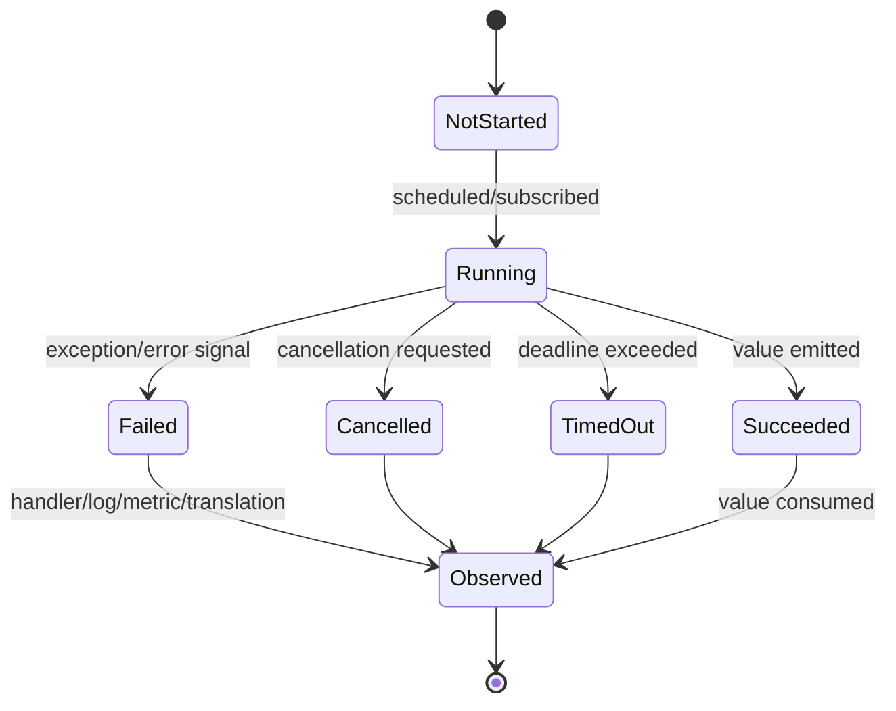

# Part 017 — Async & Reactive Error Flow

> Target part ini: kamu tidak hanya bisa memakai `CompletableFuture`, Reactor, atau async API, tetapi mampu mendesain **alur error** yang tetap jelas ketika eksekusi tidak lagi linear, stack trace tidak lagi cukup, dan failure bisa muncul di thread, stage, subscription, atau callback yang berbeda.

Part ini tidak mengulang dasar concurrency, thread pool, atau reactive programming. Fokusnya adalah satu hal: **apa yang terjadi pada error ketika control flow dipisahkan dari call stack normal**.

---

## 1. Problem Utama: Error Tidak Lagi Berjalan di Call Stack yang Sama

Pada kode sinkron, model mental error relatif langsung:

```java
try {
    PaymentResult result = paymentService.charge(command);
    return toResponse(result);
} catch (PaymentRejectedException ex) {
    return problem(422, ex.errorCode(), ex.safeMessage());
} catch (PaymentGatewayException ex) {
    return problem(503, "PAYMENT_GATEWAY_UNAVAILABLE", "Payment provider unavailable");
}
```

Caller memanggil callee. Callee melempar exception. Stack unwinding membawa exception naik ke caller. Boundary handler menerjemahkan exception menjadi response.

Di async/reactive, control flow berubah:

```java
CompletableFuture<PaymentResult> future = paymentClient.chargeAsync(command);

future.thenApply(this::toResponse);
```

Masalahnya: exception mungkin terjadi **setelah method caller sudah return**. Artinya:

- `try/catch` biasa di sekitar pemanggilan async sering tidak menangkap error di dalam async task.
- stack trace sering menunjukkan worker thread, bukan request path penuh.
- MDC/log context bisa hilang saat pindah thread.
- cancellation dan timeout bisa menjadi error berbeda dari business failure.
- failure bisa tertahan di future/publisher jika tidak di-observe.
- error bisa muncul sebagai terminal signal, bukan thrown exception biasa.

Mental model yang benar:

```txt
sync call stack:
caller -> callee -> throw -> caller catch

async pipeline:
caller -> schedule work -> return handle
                  later: worker/subscriber emits result or error
```

---

## 2. Async Error Flow sebagai State Machine

Jangan melihat async sebagai “method yang return nanti”. Lihat sebagai state machine.



Invariant penting:

1. Setiap async operation harus punya **owner**.
2. Setiap async error harus punya **observer**.
3. Setiap async branch harus punya **termination semantics**.
4. Setiap timeout/cancellation harus punya **business meaning**.
5. Setiap async boundary harus mempertahankan **context yang diperlukan untuk diagnosis**.

Kalau salah satu hilang, kamu akan melihat bug produksi seperti:

- request dianggap berhasil padahal background task gagal;
- error hanya muncul di log worker tanpa request ID;
- retry berjalan setelah caller sudah timeout;
- transaction sudah commit tetapi async side effect gagal;
- future gagal tetapi tidak pernah di-join, sehingga error tidak terlihat;
- reactive stream berhenti karena error terminal, tetapi downstream tidak memiliki fallback atau translation.

---

## 3. Kategori Async Failure

Async failure harus diklasifikasi lebih detail daripada sekadar “exception”.

| Failure | Arti | Contoh | Design Response |
|---|---|---|---|
| Scheduling failure | Task gagal dijadwalkan | executor rejected | fail fast, capacity signal |
| Execution failure | Task mulai, lalu gagal | NPE, gateway error | complete exceptionally / emit error |
| Timeout | Operation melebihi budget | dependency lambat | cancel or ignore result, map to timeout error |
| Cancellation | Owner tidak lagi membutuhkan hasil | client disconnect, parent cancelled | cooperative stop, cleanup |
| Context loss | Error ada, tapi tidak bisa dikorelasikan | missing trace/request ID | propagate context explicitly |
| Orphan failure | Task gagal tanpa observer | fire-and-forget | structured ownership, handler wajib |
| Partial composition failure | Salah satu cabang gagal | `allOf`, `zip`, fan-out | define fail-fast or partial result |
| Backpressure failure | Consumer tidak mampu menerima | queue overflow | shed load, rate limit, fail explicitly |

---

## 4. `CompletableFuture`: Bukan Sekadar Future yang Modern

`CompletableFuture` merepresentasikan hasil yang bisa selesai normal atau exceptional. Dokumentasi Java menjelaskan banyak stage menjalankan action ketika stage sebelumnya selesai normal, dan merujuk pada aturan exceptional completion di `CompletionStage`.

Model minimal:

```java
CompletableFuture<T>
    -> completed normally with T
    -> completed exceptionally with Throwable
    -> cancelled
```

Yang sering keliru: developer menulis `try/catch` di luar `supplyAsync`.

```java
try {
    CompletableFuture<Payment> f = CompletableFuture.supplyAsync(() -> {
        return gateway.charge(command); // exception terjadi di worker thread
    });
} catch (GatewayException ex) {
    // Hampir pasti tidak menangkap exception dari worker.
}
```

Yang benar: tangani error di pipeline atau saat boundary join/get.

```java
CompletableFuture<PaymentResponse> response = CompletableFuture
    .supplyAsync(() -> gateway.charge(command), paymentExecutor)
    .thenApply(this::toResponse)
    .exceptionally(ex -> toFailureResponse(unwrapCompletion(ex)));
```

---

## 5. `CompletionException`: Wrapper yang Harus Di-unpack di Boundary

Banyak exception dari `CompletableFuture` dibungkus sebagai `CompletionException` atau `ExecutionException`, tergantung API yang dipakai.

```java
static Throwable unwrapCompletion(Throwable throwable) {
    if (throwable instanceof java.util.concurrent.CompletionException && throwable.getCause() != null) {
        return throwable.getCause();
    }
    if (throwable instanceof java.util.concurrent.ExecutionException && throwable.getCause() != null) {
        return throwable.getCause();
    }
    return throwable;
}
```

Gunakan unwrapping di boundary translation, bukan di semua tempat.

```java
CompletableFuture<ApiResponse> response = service.callAsync(command)
    .thenApply(ApiMapper::ok)
    .exceptionally(ex -> {
        Throwable root = unwrapCompletion(ex);
        return errorTranslator.toApiResponse(root);
    });
```

Anti-pattern:

```java
.exceptionally(ex -> {
    log.error("Async failed", ex);
    throw new RuntimeException(ex);
});
```

Ini sering hanya mengganti wrapper dengan wrapper baru dan membuat cause chain lebih bising.

Pattern yang lebih baik:

```java
.exceptionally(ex -> {
    Throwable root = unwrapCompletion(ex);
    throw new PaymentPipelineException("Payment async pipeline failed", root);
});
```

Atau, jika boundary-nya memang response:

```java
.exceptionally(ex -> errorTranslator.toResponse(unwrapCompletion(ex)));
```

---

## 6. `handle`, `exceptionally`, dan `whenComplete`

Tiga method ini sering dipakai sembarangan. Bedakan semantik mereka.

| Method | Input | Mengubah hasil? | Use Case |
|---|---|---:|---|
| `exceptionally` | exception saja | Ya, recover ke value | fallback sederhana |
| `handle` | value atau exception | Ya | translate success/failure menjadi satu outcome |
| `whenComplete` | value atau exception | Tidak idealnya | side effect observability/cleanup |

### 6.1 `exceptionally`: Recover dari Failure

```java
CompletableFuture<Price> price = pricingClient.getPriceAsync(sku)
    .exceptionally(ex -> Price.unavailable(sku));
```

Gunakan jika fallback benar-benar valid secara domain.

Jangan gunakan untuk menutupi error tanpa signal:

```java
.exceptionally(ex -> null); // buruk: mengubah failure menjadi NPE tertunda
```

### 6.2 `handle`: Membuat Outcome Eksplisit

```java
CompletableFuture<PaymentOutcome> outcome = paymentClient.chargeAsync(command)
    .handle((payment, ex) -> {
        if (ex == null) {
            return PaymentOutcome.approved(payment.id());
        }
        return PaymentOutcome.failed(errorClassifier.classify(unwrapCompletion(ex)));
    });
```

`handle` cocok jika downstream ingin satu tipe outcome, bukan exception lagi.

### 6.3 `whenComplete`: Observability Side Effect

```java
CompletableFuture<Payment> payment = paymentClient.chargeAsync(command)
    .whenComplete((result, ex) -> {
        if (ex == null) {
            metrics.counter("payment.async.completed", "outcome", "success").increment();
        } else {
            metrics.counter("payment.async.completed", "outcome", "failure").increment();
            log.warn("Payment async failed", unwrapCompletion(ex));
        }
    });
```

`whenComplete` sebaiknya tidak menjadi tempat recovery utama. Ia cocok untuk log, metrics, trace event, dan cleanup ringan.

---

## 7. Rule: Jangan Fire-and-Forget Tanpa Owner

Fire-and-forget adalah sumber orphan failure.

```java
void submitReport(ReportCommand command) {
    CompletableFuture.runAsync(() -> reportService.generate(command));
    // method return, tidak ada owner, tidak ada error observer
}
```

Problem:

- caller tidak tahu task gagal;
- shutdown tidak tahu harus menunggu task ini;
- context request bisa hilang;
- retry policy tidak jelas;
- audit trail bisa tidak lengkap.

Minimal, bungkus sebagai managed async operation:

```java
public CompletionStage<ReportSubmission> submitReport(ReportCommand command) {
    return CompletableFuture
        .supplyAsync(() -> reportService.generate(command), reportExecutor)
        .thenApply(report -> ReportSubmission.accepted(report.id()))
        .exceptionally(ex -> {
            Throwable root = unwrapCompletion(ex);
            log.error("Report generation failed", root);
            return ReportSubmission.failed(command.requestId(), errorClassifier.classify(root));
        });
}
```

Jika harus benar-benar background, jadikan job eksplisit:

```java
public ReportJobAccepted submitReport(ReportCommand command) {
    ReportJob job = jobRepository.createPending(command);
    outbox.enqueue(new GenerateReportJob(job.id()));
    return new ReportJobAccepted(job.id());
}
```

Ini lebih kuat karena failure pindah ke job lifecycle, bukan hilang di thread pool.

---

## 8. Composition: `allOf`, `anyOf`, dan Partial Failure

Fan-out/fan-in sering menjadi titik error yang ambigu.

```java
CompletableFuture<Customer> customer = customerClient.getCustomer(id);
CompletableFuture<List<Order>> orders = orderClient.getOrders(id);
CompletableFuture<RiskScore> risk = riskClient.score(id);

CompletableFuture<Void> all = CompletableFuture.allOf(customer, orders, risk);
```

Pertanyaan desain:

1. Kalau `risk` gagal, apakah seluruh response gagal?
2. Kalau `orders` timeout, apakah boleh partial response?
3. Kalau salah satu dependency gagal karena 404, apakah itu domain not found atau dependency failure?
4. Apakah task lain harus dibatalkan saat satu task gagal?
5. Bagaimana metrics mencatat kegagalan masing-masing cabang?

Pattern fail-fast:

```java
CompletableFuture<CustomerProfile> profile = CompletableFuture
    .allOf(customer, orders, risk)
    .thenApply(ignored -> new CustomerProfile(
        customer.join(),
        orders.join(),
        risk.join()
    ))
    .exceptionally(ex -> {
        Throwable root = unwrapCompletion(ex);
        throw new ProfileCompositionException("Failed to compose customer profile", root);
    });
```

Pattern partial result:

```java
record BranchResult<T>(String branch, T value, FailureInfo failure) {
    static <T> BranchResult<T> success(String branch, T value) {
        return new BranchResult<>(branch, value, null);
    }

    static <T> BranchResult<T> failure(String branch, Throwable ex) {
        return new BranchResult<>(branch, null, FailureInfo.from(ex));
    }
}

static <T> CompletableFuture<BranchResult<T>> observeBranch(
    String branch,
    CompletableFuture<T> future
) {
    return future.handle((value, ex) ->
        ex == null
            ? BranchResult.success(branch, value)
            : BranchResult.failure(branch, unwrapCompletion(ex))
    );
}
```

Lalu:

```java
CompletableFuture<CustomerProfileView> view = CompletableFuture
    .allOf(
        observeBranch("customer", customer),
        observeBranch("orders", orders),
        observeBranch("risk", risk)
    )
    .thenApply(ignored -> profileAssembler.assemblePartial(
        observeBranch("customer", customer).join(),
        observeBranch("orders", orders).join(),
        observeBranch("risk", risk).join()
    ));
```

Catatan: jangan membuat future wrapper dua kali seperti contoh di atas pada produksi; simpan hasil wrapper di variabel agar setiap branch tidak dievaluasi ulang.

Versi lebih rapi:

```java
CompletableFuture<BranchResult<Customer>> customerResult = observeBranch("customer", customer);
CompletableFuture<BranchResult<List<Order>>> orderResult = observeBranch("orders", orders);
CompletableFuture<BranchResult<RiskScore>> riskResult = observeBranch("risk", risk);

CompletableFuture<CustomerProfileView> view = CompletableFuture
    .allOf(customerResult, orderResult, riskResult)
    .thenApply(ignored -> profileAssembler.assemblePartial(
        customerResult.join(),
        orderResult.join(),
        riskResult.join()
    ));
```

---

## 9. Timeout: Timeout Bukan Sekadar Exception

Timeout adalah keputusan ownership: owner tidak lagi bersedia menunggu.

```java
CompletableFuture<Price> price = pricingClient.getPriceAsync(sku)
    .orTimeout(300, TimeUnit.MILLISECONDS);
```

Pertanyaan penting:

- Apakah task downstream benar-benar dibatalkan?
- Apakah request dependency masih berjalan setelah caller timeout?
- Apakah timeout dicatat sebagai dependency latency, caller timeout, atau cancellation?
- Apakah result yang datang terlambat harus diabaikan, disimpan, atau dipakai untuk cache?

Pattern deadline:

```java
record Deadline(Instant expiresAt) {
    Duration remaining() {
        return Duration.between(Instant.now(), expiresAt);
    }

    boolean expired() {
        return !remaining().isPositive();
    }
}
```

Gunakan budget yang diteruskan, bukan timeout acak per layer.

```java
CompletionStage<Decision> decide(Command command, Deadline deadline) {
    if (deadline.expired()) {
        return CompletableFuture.failedFuture(new DeadlineExceededException(command.id()));
    }

    long millis = Math.max(1, deadline.remaining().toMillis());

    return riskClient.scoreAsync(command, deadline)
        .orTimeout(millis, TimeUnit.MILLISECONDS)
        .thenApply(score -> decisionEngine.decide(command, score));
}
```

---

## 10. Cancellation: Jangan Samakan dengan Failure Biasa

Cancellation biasanya berarti owner tidak lagi membutuhkan hasil, bukan domain failure.

```java
CompletableFuture<Report> future = reportService.generateAsync(command);
boolean cancelled = future.cancel(true);
```

Pada produksi, cancellation harus punya policy:

| Pertanyaan | Contoh Keputusan |
|---|---|
| Apakah cancellation boleh menghentikan side effect? | boleh untuk read, hati-hati untuk write |
| Apakah cancellation harus menghapus resource sementara? | ya untuk temp file/session |
| Apakah cancellation dicatat sebagai error? | biasanya bukan error severity tinggi |
| Apakah cancellation memicu retry? | umumnya tidak |
| Apakah cancellation harus masuk audit? | ya jika domain/regulatory relevant |

Jangan menulis handler yang memperlakukan semua exception sebagai retryable:

```java
.exceptionally(ex -> retry(command)); // buruk jika ex adalah cancellation
```

Gunakan classifier:

```java
.exceptionally(ex -> {
    Throwable root = unwrapCompletion(ex);
    FailureKind kind = failureClassifier.kindOf(root);

    return switch (kind) {
        case CANCELLED -> Outcome.cancelled(command.id());
        case TIMEOUT -> Outcome.timedOut(command.id());
        case RETRYABLE_DEPENDENCY -> retryLater(command);
        case DOMAIN_REJECTION -> Outcome.rejected(toDomainError(root));
        case BUG -> throw new CompletionException(root);
    };
});
```

---

## 11. Context Loss di Async Boundary

Banyak sistem Java menggunakan context berbasis `ThreadLocal`: MDC logging, security context, tenant context, request context, trace context.

Masalah: async execution bisa pindah thread.

```java
MDC.put("requestId", requestId);
CompletableFuture.runAsync(() -> {
    log.info("Processing payment"); // requestId belum tentu ada
});
```

Pattern wrapper sederhana:

```java
final class ContextAwareExecutor implements Executor {
    private final Executor delegate;

    ContextAwareExecutor(Executor delegate) {
        this.delegate = delegate;
    }

    @Override
    public void execute(Runnable command) {
        Map<String, String> contextMap = MDC.getCopyOfContextMap();
        delegate.execute(() -> {
            Map<String, String> previous = MDC.getCopyOfContextMap();
            try {
                if (contextMap != null) {
                    MDC.setContextMap(contextMap);
                } else {
                    MDC.clear();
                }
                command.run();
            } finally {
                if (previous != null) {
                    MDC.setContextMap(previous);
                } else {
                    MDC.clear();
                }
            }
        });
    }
}
```

Catatan penting:

- Context propagation harus deliberate, bukan kebetulan.
- Jangan propagasikan data sensitif sembarangan.
- Jangan memasukkan object besar ke context.
- Jangan jadikan context sebagai pengganti parameter domain penting.
- Untuk OpenTelemetry, gunakan context API/instrumentation yang sesuai daripada membuat trace context sendiri.

---

## 12. Reactive Streams: Error adalah Terminal Event

Di Project Reactor, error dalam stream adalah terminal event. Ketika error terjadi, sequence berhenti dan error dipropagasikan ke subscriber `onError`.

Mental model:

```mermaid
sequenceDiagram
    participant Source
    participant OperatorA
    participant OperatorB
    participant Subscriber

    Source->>OperatorA: onNext(value1)
    OperatorA->>OperatorB: onNext(mapped1)
    OperatorB->>Subscriber: onNext(result1)
    Source->>OperatorA: onError(ex)
    OperatorA->>OperatorB: onError(ex)
    OperatorB->>Subscriber: onError(ex)
    Note over Source,Subscriber: stream terminated; no more onNext
```

Implikasi:

- `onErrorResume` tidak melanjutkan stream lama; ia mengganti dengan publisher baru.
- `onErrorReturn` mengubah error menjadi fallback value dan complete.
- `onErrorMap` menerjemahkan error.
- `doOnError` hanya side effect, bukan recovery.
- `doFinally` cocok untuk cleanup signal-agnostic.

---

## 13. Reactor Error Operators

### 13.1 `onErrorMap`: Translate Error

```java
Mono<Payment> payment = gateway.charge(command)
    .onErrorMap(WebClientResponseException.class, ex ->
        new PaymentGatewayException("Payment provider failed", ex)
    );
```

Gunakan untuk boundary translation internal.

### 13.2 `onErrorResume`: Fallback Publisher

```java
Mono<Price> price = pricingClient.currentPrice(sku)
    .onErrorResume(TimeoutException.class, ex -> cache.lastKnownPrice(sku));
```

Gunakan jika fallback memang valid.

### 13.3 `onErrorReturn`: Fallback Konstan

```java
Mono<RiskLevel> risk = riskClient.score(customerId)
    .onErrorReturn(RiskLevel.UNKNOWN);
```

Hati-hati: fallback konstan bisa menyembunyikan outage.

### 13.4 `doOnError`: Observability

```java
Mono<Payment> payment = gateway.charge(command)
    .doOnError(ex -> metrics.counter(
        "payment.gateway.failure",
        "kind", classifier.kindOf(ex).name()
    ).increment());
```

Jangan melakukan recovery di `doOnError`.

### 13.5 `doFinally`: Cleanup

```java
Mono<Report> report = acquirePermit()
    .flatMap(permit -> generateReport(command)
        .doFinally(signal -> permit.release()));
```

`doFinally` menerima signal seperti complete, error, atau cancel.

---

## 14. Reactive Error Translation at Boundary

Contoh WebFlux-style conceptual flow:

```java
public Mono<ServerResponse> createCase(ServerRequest request) {
    return request.bodyToMono(CreateCaseRequest.class)
        .flatMap(this::validate)
        .flatMap(caseService::createCase)
        .flatMap(created -> ServerResponse.ok().bodyValue(created))
        .onErrorResume(DomainRejectionException.class, ex ->
            problem(422, ex.errorCode(), ex.safeMessage())
        )
        .onErrorResume(DependencyUnavailableException.class, ex ->
            problem(503, "DEPENDENCY_UNAVAILABLE", "A required dependency is unavailable")
        )
        .onErrorResume(ex ->
            problem(500, "INTERNAL_ERROR", "Unexpected error")
        );
}
```

Ordering penting. Handler spesifik harus lebih dulu daripada handler umum.

---

## 15. Jangan Campur Blocking Call Tanpa Policy

Di reactive pipeline, blocking call tanpa isolation bisa merusak latency dan backpressure.

```java
Mono<Decision> decision = Mono.fromCallable(() -> legacyClient.call(command));
```

Kalau harus blocking, isolasi scheduler-nya:

```java
Mono<Decision> decision = Mono.fromCallable(() -> legacyClient.call(command))
    .subscribeOn(Schedulers.boundedElastic())
    .timeout(Duration.ofMillis(500))
    .onErrorMap(TimeoutException.class, ex -> new DependencyTimeoutException("legacy", ex));
```

Policy yang harus tertulis:

- scheduler mana untuk blocking work;
- timeout berapa;
- fallback apa;
- metric apa;
- apakah cancellation menghentikan work;
- apakah call idempotent;
- apakah context trace/log ikut terbawa.

---

## 16. Debuggability: Assembly Trace dan Checkpoint

Reactive stack trace sering sulit karena operator chain tidak sama dengan call stack runtime. Reactor menyediakan mekanisme seperti `checkpoint` untuk memberi marker yang muncul dalam traceback ketika terjadi error upstream.

```java
Mono<CaseDecision> decision = caseRepository.find(caseId)
    .switchIfEmpty(Mono.error(new CaseNotFoundException(caseId)))
    .flatMap(policyEngine::evaluate)
    .checkpoint("case-decision-policy-evaluation")
    .flatMap(decisionRepository::save);
```

Gunakan checkpoint pada boundary penting:

- setelah parsing request;
- sebelum/after dependency critical;
- sebelum policy evaluation;
- sebelum persistence side effect;
- sebelum response translation.

Jangan beri checkpoint di setiap operator tanpa alasan; itu menambah noise.

---

## 17. Error Flow dan Transaction Boundary

Async error sering berbahaya saat melewati transaction boundary.

Anti-pattern:

```java
@Transactional
public void approveCase(CaseId id) {
    Case c = repository.get(id);
    c.approve();
    notificationClient.sendAsync(c.ownerEmail());
}
```

Problem:

- transaction commit meskipun notification gagal;
- async task bisa membaca state sebelum commit terlihat;
- rollback tidak membatalkan async side effect;
- error notification tidak masuk result approve.

Pattern lebih baik: outbox/job.

```java
@Transactional
public ApprovalResult approveCase(CaseId id) {
    Case c = repository.get(id);
    c.approve();
    outbox.add(NotificationRequested.caseApproved(c.id(), c.ownerEmail()));
    return ApprovalResult.approved(c.id());
}
```

Async worker memproses outbox dengan retry, DLQ, metrics, dan audit trail.

---

## 18. Error Flow dan Idempotency

Async retry tanpa idempotency adalah generator duplicate side effect.

```java
CompletableFuture<Void> f = paymentClient.chargeAsync(command)
    .orTimeout(500, TimeUnit.MILLISECONDS)
    .exceptionallyCompose(ex -> paymentClient.chargeAsync(command)); // berbahaya
```

Kalau call pertama sebenarnya sukses tetapi response timeout, retry bisa double charge.

Pattern:

```java
PaymentCommand command = new PaymentCommand(
    paymentId,
    amount,
    customerId,
    idempotencyKey
);
```

Async error policy harus tahu:

- operation idempotent atau tidak;
- unknown outcome atau known failure;
- duplicate detection di mana;
- retry max berapa;
- apakah late success perlu reconcile.

---

## 19. Observability untuk Async Pipeline

Minimal telemetry untuk async operation:

| Signal | Wajib Ada |
|---|---|
| Logs | operation, correlation ID, branch, failure kind, safe error code |
| Metrics | started, completed, failed, cancelled, timed out, duration |
| Traces | span per dependency/branch, error status, attributes aman |
| Events | significant domain state change, retry scheduled, fallback used |

Contoh metric wrapper:

```java
<T> CompletableFuture<T> observeFuture(
    String operation,
    Supplier<CompletableFuture<T>> supplier
) {
    Timer.Sample sample = Timer.start(meterRegistry);
    metrics.counter(operation + ".started").increment();

    try {
        return supplier.get().whenComplete((result, ex) -> {
            sample.stop(meterRegistry.timer(operation + ".duration"));
            if (ex == null) {
                metrics.counter(operation + ".completed", "outcome", "success").increment();
            } else {
                Throwable root = unwrapCompletion(ex);
                metrics.counter(
                    operation + ".completed",
                    "outcome", "failure",
                    "kind", classifier.kindOf(root).name()
                ).increment();
            }
        });
    } catch (RuntimeException ex) {
        sample.stop(meterRegistry.timer(operation + ".duration"));
        metrics.counter(operation + ".completed", "outcome", "scheduling_failure").increment();
        throw ex;
    }
}
```

Perhatikan perbedaan scheduling failure dan execution failure.

---

## 20. Trace Span untuk Async Branch

Pseudocode manual instrumentation:

```java
Span span = tracer.spanBuilder("payment.authorize")
    .setAttribute("payment.method", command.method())
    .startSpan();

Context context = Context.current().with(span);

CompletableFuture<Authorization> future = context.wrap(() ->
    paymentClient.authorize(command)
).get();

future.whenComplete((result, ex) -> {
    try (Scope scope = span.makeCurrent()) {
        if (ex == null) {
            span.setStatus(StatusCode.OK);
        } else {
            Throwable root = unwrapCompletion(ex);
            span.recordException(root);
            span.setStatus(StatusCode.ERROR, root.getClass().getSimpleName());
        }
    } finally {
        span.end();
    }
});
```

Konsepnya:

- span harus dimulai saat operation mulai;
- span harus diakhiri saat async operation benar-benar selesai;
- error harus dicatat pada span yang relevan;
- context harus dipropagasikan ke callback/worker.

API detail bisa berbeda tergantung instrumentation dan framework, tetapi invariant-nya sama.

---

## 21. Anti-Pattern Async Error Handling

### 21.1 Swallowing Exception

```java
future.exceptionally(ex -> null);
```

Akibat: failure berubah menjadi nilai ambigu.

### 21.2 Logging tanpa Propagation

```java
.exceptionally(ex -> {
    log.error("Failed", ex);
    return null;
});
```

Akibat: caller melihat success/null, bukan failure.

### 21.3 Retry Semua Error

```java
.exceptionallyCompose(ex -> retry());
```

Akibat: domain rejection, cancellation, validation failure, dan bug ikut di-retry.

### 21.4 Fire-and-Forget dari Transaction

```java
@Transactional
void update() {
    repository.save(entity);
    CompletableFuture.runAsync(() -> externalClient.notify(entity));
}
```

Akibat: side effect tidak konsisten dengan commit/rollback.

### 21.5 Context Mengandalkan ThreadLocal Otomatis

```java
CompletableFuture.runAsync(() -> log.info("done"));
```

Akibat: missing request ID/trace ID.

### 21.6 Reactive `onErrorResume` Terlalu Umum

```java
.onErrorResume(ex -> Mono.just(defaultValue));
```

Akibat: semua failure menjadi fallback, termasuk bug.

---

## 22. Design Checklist

Sebelum menerima async/reactive flow dalam review, jawab ini:

- Siapa owner operation ini?
- Apa success state-nya?
- Apa failure categories-nya?
- Apa cancellation semantics-nya?
- Apa timeout budget-nya?
- Apakah retry aman?
- Apakah operation idempotent?
- Apakah partial failure diperbolehkan?
- Apakah error di setiap branch di-observe?
- Apakah context log/trace/tenant/request dipropagasikan?
- Apakah boundary menerjemahkan wrapper seperti `CompletionException`?
- Apakah shutdown tahu ada operation ini?
- Apakah telemetry membedakan success, failure, timeout, cancellation?
- Apakah fallback valid secara domain?
- Apakah exception tidak tertelan menjadi `null`?

---

## 23. Practice 20 Jam — Async Error Flow

### Jam 1–3: Audit Existing Async Code

Cari semua:

```txt
CompletableFuture.runAsync
CompletableFuture.supplyAsync
@Async
thenApply
thenCompose
exceptionally
handle
whenComplete
Mono
Flux
onErrorResume
onErrorMap
subscribe
```

Klasifikasikan:

- owner jelas / tidak;
- handler ada / tidak;
- context propagation ada / tidak;
- timeout ada / tidak;
- cancellation jelas / tidak.

### Jam 4–6: Refactor Fire-and-Forget

Ambil satu fire-and-forget flow. Ubah menjadi salah satu:

- return `CompletionStage`;
- outbox/job;
- managed background service dengan lifecycle;
- explicit event handler dengan DLQ.

### Jam 7–9: Build Error Classifier

Buat classifier:

```java
enum FailureKind {
    DOMAIN_REJECTION,
    VALIDATION,
    TIMEOUT,
    CANCELLED,
    RETRYABLE_DEPENDENCY,
    NON_RETRYABLE_DEPENDENCY,
    BUG,
    UNKNOWN
}
```

Gunakan di future dan reactive flow.

### Jam 10–12: Add Telemetry

Tambahkan:

- metric started/completed;
- duration timer;
- failure kind tag;
- log dengan correlation ID;
- trace span pada dependency branch.

### Jam 13–15: Simulate Failure

Simulasikan:

- dependency timeout;
- executor rejection;
- cancellation;
- partial fan-out failure;
- missing context;
- fallback invalid.

### Jam 16–18: Reactive Error Lab

Buat pipeline Reactor kecil:

- parse command;
- validate;
- call dependency;
- save;
- publish event;
- translate error ke Problem Details.

Tambahkan `onErrorMap`, `onErrorResume`, `doOnError`, `doFinally`, dan `checkpoint` secara tepat.

### Jam 19–20: Review & Checklist

Review hasil dengan checklist Part 017. Tujuan akhirnya bukan “kode async jalan”, tetapi “kode async gagal dengan cara yang bisa dipahami, dikendalikan, dan diobservasi”.

---

## 24. Ringkasan

Async dan reactive programming mengubah bentuk error flow. Error tidak selalu berjalan melalui call stack caller. Ia bisa muncul sebagai exceptional completion, terminal signal, cancellation, timeout, scheduling rejection, atau orphan background failure.

Engineer level tinggi mendesain async flow dengan ownership yang eksplisit:

- every async operation has an owner;
- every async error has an observer;
- every branch has timeout/cancellation semantics;
- every fallback is domain-approved;
- every error is classifiable;
- every async boundary preserves diagnostic context;
- every production failure leaves evidence.

Kalau Part 016 mengajarkan cancellation dan cleanup sebagai lifecycle discipline, Part 017 menempatkan disiplin itu di dunia async/reactive yang lebih sulit. Part berikutnya akan masuk ke virtual threads: bagaimana Java modern membuat blocking-style code kembali menarik, tetapi tetap membutuhkan error semantics dan observability yang matang.

---

## References

- Oracle Java SE 25 API — `CompletableFuture` and `CompletionStage` exceptional completion semantics.
- Oracle Java SE 25 API — `Thread`, `Future`, and executor lifecycle documentation.
- Project Reactor Reference Guide — error handling operators and terminal error semantics.
- Project Reactor API — `Mono.checkpoint` for traceback/assembly marker.
- OpenTelemetry Java API — context and propagation concepts.
