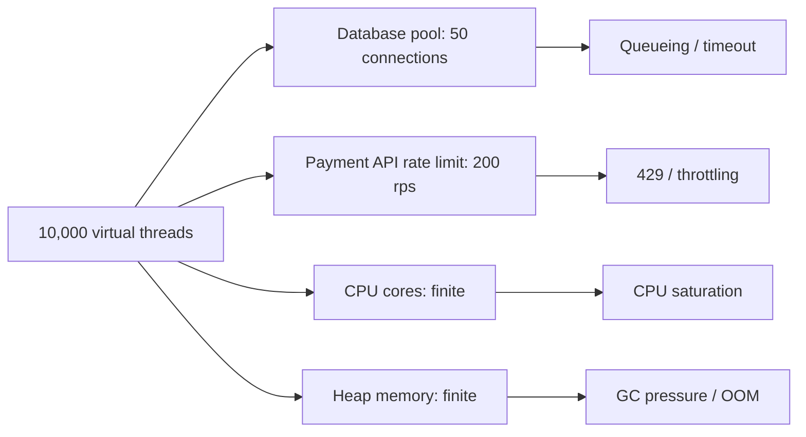
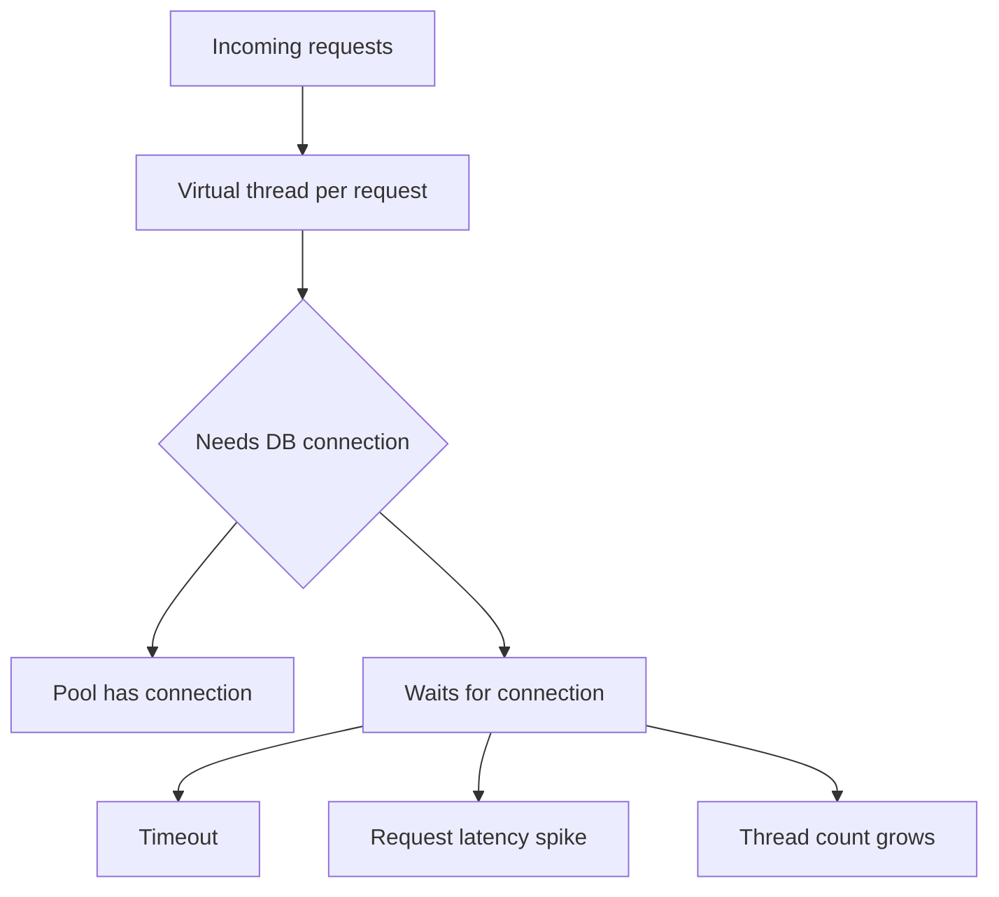
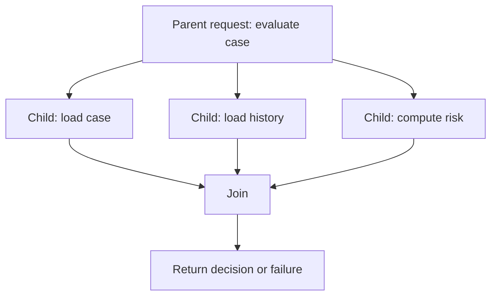

# Part 018 — Virtual Threads Error Observability

> Target part ini: kamu mampu menggunakan virtual threads bukan hanya sebagai “cara membuat thread murah”, tetapi sebagai model eksekusi produksi yang tetap punya failure ownership, shutdown semantics, context propagation, telemetry, dan diagnosis yang kuat.

Virtual threads membuat Java kembali nyaman untuk gaya blocking-per-request. Tetapi “lebih mudah menulis concurrency” tidak otomatis berarti “lebih mudah mengelola failure”. Justru karena jumlah concurrent task bisa sangat besar, observability dan error discipline menjadi lebih penting.

---

## 1. Apa yang Berubah dengan Virtual Threads?

Virtual thread adalah thread ringan yang dijadwalkan oleh JVM, bukan satu-per-satu sebagai OS thread tradisional. Dokumentasi Java SE 25 menyatakan virtual threads cocok untuk task yang banyak waktunya blocked, terutama menunggu I/O, dan tidak ditujukan untuk long-running CPU-intensive operations.

Mental model sederhana:

```txt
platform thread:
request -> OS thread -> blocking I/O keeps OS thread occupied

virtual thread:
request -> virtual thread -> blocking I/O parks virtual thread
                         -> carrier platform thread can run other virtual threads
```

Manfaatnya:

- kode blocking bisa tetap mudah dibaca;
- throughput I/O-bound bisa meningkat tanpa reactive rewrite;
- stack trace kembali lebih natural daripada callback chain;
- per-request concurrency lebih murah;
- debugging sequential flow bisa lebih mudah.

Namun risiko tetap ada:

- dependency tetap bisa lambat atau gagal;
- database connection tetap terbatas;
- external API tetap punya rate limit;
- memory tetap terbatas;
- context propagation tetap harus benar;
- executor lifecycle tetap harus ditutup;
- error tetap harus ditangkap di boundary;
- observability cardinality bisa meledak jika setiap virtual thread diberi label unik.

Virtual threads bukan reliability pattern. Ia adalah execution primitive.

---

## 2. Virtual Threads Tidak Menghapus Backpressure

Kesalahan umum: karena virtual thread murah, kita boleh membuat sebanyak mungkin operation.

Salah.

Virtual threads mengurangi biaya thread, bukan biaya dependency.



Virtual thread membuat waiting lebih murah, tetapi tidak membuat resource downstream menjadi tak terbatas.

Invariant:

> Use virtual threads to simplify concurrent waiting, but still use bulkheads, semaphores, connection pools, rate limits, timeouts, and deadlines to protect finite resources.

---

## 3. Error Model Virtual Thread Tetap Error Model Java

Virtual thread tetap `Thread`. Exception yang tidak ditangkap tetap menjadi uncaught exception pada thread tersebut. Perbedaan utamanya adalah skala dan ownership.

Anti-pattern:

```java
Thread.startVirtualThread(() -> {
    paymentClient.charge(command); // exception tidak dikembalikan ke caller
});
```

Kalau thread ini gagal:

- siapa caller yang menerima failure?
- apakah log punya request ID?
- apakah shutdown menunggu task ini?
- apakah retry dilakukan?
- apakah payment outcome diketahui?

Virtual thread tanpa owner sama berbahayanya dengan `CompletableFuture.runAsync` tanpa handler.

Pattern lebih baik:

```java
try (ExecutorService executor = Executors.newVirtualThreadPerTaskExecutor()) {
    Future<PaymentResult> future = executor.submit(() -> paymentClient.charge(command));
    PaymentResult result = future.get(500, TimeUnit.MILLISECONDS);
    return toResponse(result);
}
```

Pada contoh ini, failure kembali ke owner melalui `Future.get()`.

---

## 4. Virtual Thread Ownership Pattern

Virtual thread harus punya ownership model.

| Model | Cocok untuk | Error Handling |
|---|---|---|
| request-scoped task | fan-out kecil dalam request | join/get sebelum response |
| service-scoped executor | background worker managed | lifecycle + central handler |
| job-scoped task | batch/report/reconciliation | job status + retry + audit |
| structured scope | parent-child task tree | fail/cancel/join as group |
| fire-and-forget | sangat jarang | harus diganti outbox/job/queue |

Rule:

```txt
No virtual thread should be started without a known owner, lifecycle, and error observer.
```

---

## 5. Request-Scoped Fan-Out dengan Virtual Threads

Virtual threads membuat fan-out blocking-style lebih sederhana.

```java
record CustomerProfile(Customer customer, List<Order> orders, RiskScore risk) {}

CustomerProfile loadProfile(CustomerId id) throws Exception {
    try (ExecutorService executor = Executors.newVirtualThreadPerTaskExecutor()) {
        Future<Customer> customer = executor.submit(() -> customerClient.get(id));
        Future<List<Order>> orders = executor.submit(() -> orderClient.listByCustomer(id));
        Future<RiskScore> risk = executor.submit(() -> riskClient.score(id));

        return new CustomerProfile(
            customer.get(),
            orders.get(),
            risk.get()
        );
    }
}
```

Tetapi produksi butuh lebih dari itu:

- deadline bersama;
- failure classifier;
- cancellation cabang lain saat fail-fast;
- metrics per branch;
- trace span per branch;
- fallback/partial response policy;
- context propagation;
- cleanup executor.

Versi lebih production-aware:

```java
CustomerProfile loadProfile(CustomerId id, Deadline deadline) {
    try (ExecutorService executor = Executors.newVirtualThreadPerTaskExecutor()) {
        Future<Customer> customer = executor.submit(observed("customer", () ->
            customerClient.get(id, deadline)
        ));
        Future<List<Order>> orders = executor.submit(observed("orders", () ->
            orderClient.listByCustomer(id, deadline)
        ));
        Future<RiskScore> risk = executor.submit(observed("risk", () ->
            riskClient.score(id, deadline)
        ));

        return new CustomerProfile(
            getWithinDeadline("customer", customer, deadline),
            getWithinDeadline("orders", orders, deadline),
            getWithinDeadline("risk", risk, deadline)
        );
    }
}
```

Helper:

```java
<T> T getWithinDeadline(String branch, Future<T> future, Deadline deadline) {
    try {
        return future.get(deadline.remaining().toMillis(), TimeUnit.MILLISECONDS);
    } catch (TimeoutException ex) {
        future.cancel(true);
        throw new DependencyTimeoutException(branch, ex);
    } catch (ExecutionException ex) {
        throw translateBranchFailure(branch, ex.getCause());
    } catch (InterruptedException ex) {
        Thread.currentThread().interrupt();
        throw new OperationInterruptedException(branch, ex);
    }
}
```

---

## 6. Deadline Tetap Lebih Baik daripada Timeout Lokal

Dengan virtual threads, mudah menulis blocking call berlapis-lapis. Tanpa deadline, setiap layer bisa memberi timeout sendiri dan total latency melewati budget request.

Buruk:

```java
customerClient.get(id); // timeout internal 1s
orderClient.list(id);   // timeout internal 1s
riskClient.score(id);   // timeout internal 1s
```

Jika dipanggil sequential, total bisa 3 detik. Jika parallel, tetap tidak jelas kapan parent harus menyerah.

Lebih baik:

```java
Decision decide(Command command) {
    Deadline deadline = Deadline.after(Duration.ofMillis(800));
    return decisionService.decide(command, deadline);
}
```

Lalu setiap dependency menghormati remaining budget.

```java
RiskScore score(CustomerId id, Deadline deadline) {
    if (deadline.expired()) {
        throw new DeadlineExceededException("risk-score");
    }
    return httpClient.get(id, deadline.remaining());
}
```

---

## 7. Thread Naming: Jangan Andalkan Thread ID sebagai Domain Context

Virtual threads bisa sangat banyak. Thread name tetap berguna, tetapi bukan pengganti trace ID/request ID.

```java
ThreadFactory factory = Thread.ofVirtual()
    .name("case-eval-vt-", 0)
    .factory();

try (ExecutorService executor = Executors.newThreadPerTaskExecutor(factory)) {
    executor.submit(() -> caseEvaluator.evaluate(command));
}
```

Thread name membantu saat thread dump atau log teknis. Namun domain context harus tetap ada di log fields:

- `trace_id`
- `span_id`
- `request_id`
- `case_id`
- `tenant_id`
- `operation`
- `failure_kind`

Jangan membuat metric tag dari thread name atau thread ID. Cardinality-nya bisa meledak.

---

## 8. Thread Dumps dan Virtual Thread Diagnosis

Virtual threads membuat stack trace blocking code lebih natural, tetapi jumlah thread bisa besar. Diagnosis harus berbasis filter.

Yang perlu dicari:

- banyak virtual thread blocked di dependency yang sama;
- banyak virtual thread menunggu connection pool;
- stack yang menunjukkan lock contention;
- carrier thread saturation;
- repeated failure pada operation tertentu;
- shutdown stuck karena task tidak cooperative terhadap interrupt.

Log tanpa correlation ID tidak cukup. Thread dump tanpa telemetry juga tidak cukup.

Gunakan kombinasi:

```txt
metric spike -> trace sample -> log correlation -> thread dump -> dependency health
```

---

## 9. Pinning: Kenapa Tetap Perlu Dipahami

Virtual threads bisa dipark saat blocking I/O sehingga carrier thread bebas menjalankan virtual thread lain. Namun ada kondisi tertentu yang dapat membuat virtual thread “pin” carrier thread. Java terus memperbaiki area ini, tetapi prinsip desain tetap penting: jangan menyembunyikan blocking/locking buruk di balik virtual thread.

Hal yang perlu diaudit:

- blocking call di dalam critical section;
- synchronized region yang memanggil dependency lambat;
- native call/JNI yang lama;
- lock yang dipegang saat I/O;
- monitor contention di shared object;
- CPU-heavy work di virtual thread pool besar.

Anti-pattern:

```java
synchronized (account) {
    account.reserve(amount);
    paymentGateway.charge(account.paymentMethod(), amount); // remote I/O while locked
    account.markCharged(amount);
}
```

Pattern lebih aman:

```java
PaymentReservation reservation;

synchronized (account) {
    reservation = account.reserve(amount);
}

PaymentReceipt receipt = paymentGateway.charge(reservation.paymentMethod(), amount);

synchronized (account) {
    account.markCharged(reservation.id(), receipt.id());
}
```

Lebih baik lagi, gunakan state transition dan idempotency/outbox jika side effect eksternal terlibat.

---

## 10. Virtual Threads dan Connection Pool

Banyak virtual thread bisa menunggu connection pool yang kecil. Ini bukan bug virtual thread; ini resource contention.



Policy:

- pool size harus sesuai database capacity;
- waiting timeout harus eksplisit;
- metric pool utilization wajib ada;
- endpoint harus punya load shedding;
- jangan menaikkan virtual thread count untuk menyelesaikan bottleneck DB;
- gunakan semaphore/bulkhead untuk dependency yang lebih kecil dari request concurrency.

Contoh bulkhead sederhana:

```java
final class BlockingDependencyGuard {
    private final Semaphore permits;

    BlockingDependencyGuard(int maxConcurrent) {
        this.permits = new Semaphore(maxConcurrent);
    }

    <T> T call(String dependency, Callable<T> callable) {
        boolean acquired = permits.tryAcquire();
        if (!acquired) {
            throw new DependencyBulkheadFullException(dependency);
        }

        try {
            return callable.call();
        } catch (Exception ex) {
            throw translateDependencyFailure(dependency, ex);
        } finally {
            permits.release();
        }
    }
}
```

---

## 11. Context Propagation dengan Virtual Threads

Virtual threads tetap thread. Tetapi context tetap perlu dipahami secara eksplisit.

Beberapa context menggunakan `ThreadLocal`:

- MDC logging;
- security context;
- tenant context;
- tracing context;
- locale/request metadata.

Virtual thread baru tidak otomatis berarti semua context parent aman tersedia sesuai harapan framework-mu. Gunakan instrumentation atau wrapper yang jelas.

Pattern executor context wrapper:

```java
final class ContextSnapshot {
    private final Map<String, String> mdc;

    private ContextSnapshot(Map<String, String> mdc) {
        this.mdc = mdc;
    }

    static ContextSnapshot capture() {
        return new ContextSnapshot(MDC.getCopyOfContextMap());
    }

    void run(Runnable runnable) {
        Map<String, String> previous = MDC.getCopyOfContextMap();
        try {
            if (mdc != null) {
                MDC.setContextMap(mdc);
            } else {
                MDC.clear();
            }
            runnable.run();
        } finally {
            if (previous != null) {
                MDC.setContextMap(previous);
            } else {
                MDC.clear();
            }
        }
    }
}
```

Usage:

```java
ContextSnapshot snapshot = ContextSnapshot.capture();
executor.submit(() -> snapshot.run(() -> service.call(command)));
```

Untuk OpenTelemetry, gunakan mekanisme `Context`, `Scope`, dan instrumentation resmi. Jangan membuat trace propagation sendiri kecuali benar-benar perlu dan diuji.

---

## 12. Observability Span per Virtual Thread Task

Virtual thread membuat “satu task satu stack” terasa natural. Jadikan itu juga natural di tracing.

Pseudocode:

```java
<T> Callable<T> observed(String operation, Callable<T> task) {
    Context parent = Context.current();

    return () -> {
        Span span = tracer.spanBuilder(operation)
            .setParent(parent)
            .startSpan();

        try (Scope scope = span.makeCurrent()) {
            T result = task.call();
            span.setStatus(StatusCode.OK);
            return result;
        } catch (Throwable ex) {
            span.recordException(ex);
            span.setStatus(StatusCode.ERROR, ex.getClass().getSimpleName());
            throw ex;
        } finally {
            span.end();
        }
    };
}
```

Invariant:

- span dibuat untuk operation, bukan untuk “thread”.
- trace context parent-child harus benar.
- error dicatat pada span yang paling dekat dengan failure.
- attributes tidak boleh mengandung PII/secret.
- operation name harus low-cardinality.

Buruk:

```java
span.setAttribute("thread.name", Thread.currentThread().getName()); // boleh untuk debugging terbatas, jangan tag metric high cardinality
span.setAttribute("payload", requestBody); // buruk: sensitive + high cardinality
```

Lebih baik:

```java
span.setAttribute("operation", "risk.score");
span.setAttribute("dependency", "risk-service");
span.setAttribute("failure.kind", "timeout");
```

---

## 13. Metrics untuk Virtual Threads

Metric yang berguna:

| Metric | Tipe | Tujuan |
|---|---|---|
| `operation.started` | counter | demand masuk |
| `operation.completed` | counter | outcome success/failure/timeout/cancelled |
| `operation.duration` | timer/histogram | latency distribution |
| `dependency.inflight` | gauge | concurrency aktif |
| `dependency.bulkhead.rejected` | counter | load shedding |
| `executor.tasks.submitted` | counter | scheduling pressure |
| `executor.tasks.failed` | counter | task failure |
| `shutdown.tasks.remaining` | gauge | drain progress |

Jangan membuat metric tag:

- thread ID;
- unique request ID;
- exception message mentah;
- user ID;
- case ID;
- payload hash unik.

Gunakan tag stabil:

- operation;
- dependency;
- outcome;
- failure kind;
- error code stabil;
- retryable true/false;
- fallback used true/false.

---

## 14. Logging untuk Virtual Threads

Log harus event-based, bukan thread-based.

```java
log.info("Risk score completed",
    kv("operation", "risk.score"),
    kv("caseId", safeCaseId),
    kv("outcome", "success"),
    kv("durationMs", duration.toMillis())
);
```

Untuk failure:

```java
log.warn("Dependency timeout",
    kv("operation", "risk.score"),
    kv("dependency", "risk-service"),
    kv("failureKind", "TIMEOUT"),
    kv("retryable", true),
    ex
);
```

Gunakan log level dengan disiplin:

| Level | Gunakan untuk |
|---|---|
| DEBUG | diagnosis lokal, bukan default produksi |
| INFO | lifecycle event penting dan state transition normal |
| WARN | expected failure yang butuh perhatian tapi tidak selalu incident |
| ERROR | unexpected failure, data risk, user impact, invariant break |

Virtual thread count tinggi dapat membuat log storm. Sampling atau aggregation mungkin diperlukan untuk expected high-volume failures.

---

## 15. Error Boundary di Server dengan Virtual Threads

Jika server menggunakan virtual-thread-per-request, boundary handler tetap wajib.

```java
public Response handle(Request request) {
    try {
        Command command = parser.parse(request);
        Result result = applicationService.execute(command);
        return Response.ok(result);
    } catch (DomainRejectionException ex) {
        return problem(422, ex.errorCode(), ex.safeMessage());
    } catch (DependencyTimeoutException ex) {
        return problem(504, "DEPENDENCY_TIMEOUT", "A required dependency timed out");
    } catch (InterruptedException ex) {
        Thread.currentThread().interrupt();
        return problem(503, "REQUEST_INTERRUPTED", "Request processing was interrupted");
    } catch (Throwable ex) {
        log.error("Unexpected request failure", ex);
        return problem(500, "INTERNAL_ERROR", "Unexpected error");
    }
}
```

Catatan:

- Jangan catch `Throwable` sembarangan di layer dalam.
- Boundary boleh punya catch-all untuk translation dan evidence.
- `InterruptedException` harus restore interrupt status.
- `Error` serius tetap perlu diperlakukan hati-hati; jangan “recovery palsu” dari JVM-level error.

---

## 16. Graceful Shutdown dengan Virtual Threads

Virtual threads memperbanyak jumlah task yang mungkin sedang berjalan saat shutdown.

Shutdown harus menjawab:

- stop menerima request baru kapan?
- readiness berubah kapan?
- task in-flight diberi waktu berapa lama?
- task mana boleh selesai, mana harus dibatalkan?
- bagaimana interrupt dipropagasikan?
- bagaimana outstanding task dilaporkan?
- apa yang terjadi pada job background?

Pattern:

```java
final class ManagedVirtualThreadExecutor implements AutoCloseable {
    private final ExecutorService executor = Executors.newVirtualThreadPerTaskExecutor();

    <T> Future<T> submit(Callable<T> task) {
        return executor.submit(task);
    }

    @Override
    public void close() {
        executor.shutdown();
        try {
            if (!executor.awaitTermination(20, TimeUnit.SECONDS)) {
                List<Runnable> dropped = executor.shutdownNow();
                log.warn("Forced virtual executor shutdown; droppedTasks={}", dropped.size());
            }
        } catch (InterruptedException ex) {
            Thread.currentThread().interrupt();
            executor.shutdownNow();
        }
    }
}
```

Penting: shutdown hanya efektif jika task cooperative terhadap interrupt dan dependency call punya timeout.

---

## 17. Structured Concurrency: Mental Model Parent-Child

Structured concurrency adalah ide bahwa task concurrent memiliki struktur lexical/ownership yang jelas. Walaupun detail API Java bisa berubah antar versi/preview, mental model-nya stabil:

```txt
parent operation starts child tasks
parent waits/joins child tasks
if one fails, policy decides cancel others or collect partials
parent returns only after children are resolved
```

Diagram:



Kenapa ini penting untuk error handling:

- child failure tidak orphan;
- cancellation bisa dipropagasikan dari parent;
- shutdown lebih mudah;
- observability tree mengikuti execution tree;
- partial failure policy lebih eksplisit.

Tanpa structured ownership:

```java
Thread.startVirtualThread(taskA);
Thread.startVirtualThread(taskB);
return response; // child masih berjalan tanpa parent ownership
```

Dengan ownership:

```java
try (ExecutorService executor = Executors.newVirtualThreadPerTaskExecutor()) {
    Future<A> a = executor.submit(taskA);
    Future<B> b = executor.submit(taskB);
    return combine(a.get(), b.get());
}
```

---

## 18. Virtual Threads vs Reactive: Pilih Berdasarkan Failure Model, Bukan Hype

Virtual threads dan reactive bukan musuh. Keduanya punya tempat.

| Kriteria | Virtual Threads | Reactive |
|---|---|---|
| Mental model | blocking sequential | stream/event pipeline |
| Stack trace | lebih natural | butuh assembly/debug support |
| Backpressure | manual/resource controls | bagian dari model streams |
| Blocking I/O | cocok | harus diisolasi |
| High fan-out I/O | cocok dengan guard | cocok juga |
| Streaming data | kurang natural | sangat cocok |
| Cancellation | interrupt/deadline | signal cancellation |
| Context propagation | thread/context wrapper | reactor context/instrumentation |
| Error flow | thrown/get/join | terminal error signal |

Keputusan yang matang:

- gunakan virtual threads untuk request/response I/O-bound blocking workflows yang ingin tetap imperative;
- gunakan reactive untuk streaming, backpressure-rich pipelines, dan ecosystem yang sudah reactive;
- jangan mencampur keduanya tanpa boundary yang jelas;
- jangan blocking sembarangan di reactive scheduler;
- jangan mengabaikan backpressure saat memakai virtual threads.

---

## 19. Migration Checklist ke Virtual Threads

Sebelum migrasi service ke virtual threads:

### 19.1 Inventory Blocking Points

Catat:

- DB calls;
- HTTP clients;
- file I/O;
- message broker calls;
- cache calls;
- locks;
- synchronized sections;
- CPU-heavy tasks.

### 19.2 Resource Capacity

Untuk setiap dependency:

- max concurrency;
- timeout;
- connection pool;
- rate limit;
- retry policy;
- fallback policy;
- bulkhead policy.

### 19.3 Error Semantics

Pastikan:

- exception boundary tetap ada;
- `InterruptedException` policy jelas;
- `ExecutionException` di-unwrap di boundary;
- timeout dibedakan dari cancellation;
- retry hanya untuk failure yang aman;
- idempotency tersedia untuk side effect.

### 19.4 Observability

Pastikan:

- trace context benar;
- MDC/request context benar;
- metrics tidak high-cardinality;
- thread dumps bisa dianalisis;
- dependency metrics tersedia;
- shutdown metrics tersedia.

### 19.5 Load Test

Uji:

- dependency slow;
- dependency down;
- DB pool exhausted;
- rate limit external API;
- mass cancellation;
- shutdown with in-flight requests;
- log/metric cardinality;
- memory/GC pressure.

---

## 20. Testing Virtual Thread Failure

### 20.1 Test Exception Propagation

```java
@Test
void propagatesChildFailureToOwner() {
    try (ExecutorService executor = Executors.newVirtualThreadPerTaskExecutor()) {
        Future<String> future = executor.submit(() -> {
            throw new DependencyUnavailableException("risk-service");
        });

        ExecutionException ex = assertThrows(ExecutionException.class, future::get);
        assertInstanceOf(DependencyUnavailableException.class, ex.getCause());
    }
}
```

### 20.2 Test Interrupt Restore

```java
@Test
void restoresInterruptStatus() {
    Thread.currentThread().interrupt();

    try {
        service.handleInterruptedOperation();
    } catch (OperationInterruptedException expected) {
        assertTrue(Thread.currentThread().isInterrupted());
    } finally {
        Thread.interrupted(); // clear for test runner
    }
}
```

### 20.3 Test Bulkhead Rejection

```java
@Test
void rejectsWhenDependencyBulkheadFull() throws Exception {
    BlockingDependencyGuard guard = new BlockingDependencyGuard(1);
    CountDownLatch entered = new CountDownLatch(1);
    CountDownLatch release = new CountDownLatch(1);

    Thread first = Thread.startVirtualThread(() -> guard.call("risk", () -> {
        entered.countDown();
        release.await();
        return "ok";
    }));

    entered.await();

    assertThrows(DependencyBulkheadFullException.class,
        () -> guard.call("risk", () -> "second")
    );

    release.countDown();
    first.join();
}
```

---

## 21. Anti-Pattern Virtual Threads

### 21.1 Treat Virtual Threads as Infinite Capacity

```java
for (Command command : commands) {
    Thread.startVirtualThread(() -> dependency.call(command));
}
```

Tanpa limit, ini bisa menghancurkan dependency.

### 21.2 No Owner / No Join

```java
Thread.startVirtualThread(() -> service.process(command));
return Accepted.ok();
```

Jika ini job, buat job record. Jika request-scoped, join. Jika event, gunakan queue/outbox.

### 21.3 Blocking Remote Call While Holding Lock

```java
synchronized (state) {
    external.call();
}
```

Lock + I/O adalah sumber contention dan pinning risk.

### 21.4 Metrics per Thread

```java
metrics.counter("task.failed", "thread", Thread.currentThread().getName()).increment();
```

High cardinality. Gunakan operation/dependency/failure kind.

### 21.5 Missing Interrupt Policy

```java
catch (InterruptedException ex) {
    log.warn("ignored", ex);
}
```

Harus restore interrupt atau translate dengan benar.

### 21.6 CPU-Heavy Work Dilempar ke Virtual Threads Tanpa Control

Virtual threads bukan pengganti CPU pool sizing.

---

## 22. Review Checklist

Gunakan checklist ini saat review PR virtual threads:

- Apakah setiap virtual thread punya owner?
- Apakah parent menunggu child atau job lifecycle eksplisit?
- Apakah error child dipropagasikan atau dicatat sebagai job failure?
- Apakah timeout/deadline tersedia?
- Apakah interrupt diperlakukan benar?
- Apakah dependency concurrency dibatasi?
- Apakah connection pool/rate limit diperhitungkan?
- Apakah lock tidak memegang remote I/O?
- Apakah context log/trace dipropagasikan?
- Apakah metric tags low-cardinality?
- Apakah shutdown menunggu/drain/cancel dengan policy?
- Apakah load test mencakup dependency slow/down?
- Apakah thread dumps masih bisa dianalisis?
- Apakah fallback/retry/idempotency tetap benar?

---

## 23. Practice 20 Jam — Virtual Thread Observability

### Jam 1–3: Convert Small Blocking Flow

Ambil satu flow blocking I/O-bound. Jalankan dengan virtual-thread-per-task executor. Jangan ubah semantics dulu.

### Jam 4–6: Add Ownership

Pastikan semua child task:

- disimpan sebagai `Future`;
- di-join/get;
- punya timeout;
- error di-unwrap;
- cancellation jelas.

### Jam 7–9: Add Dependency Guards

Tambahkan semaphore/bulkhead untuk dependency paling mahal. Uji saat permit habis.

### Jam 10–12: Add Telemetry

Tambahkan:

- span per branch;
- metric per outcome;
- log structured dengan request/correlation ID;
- failure kind.

### Jam 13–15: Simulate Failure

Simulasikan:

- dependency timeout;
- DB pool full;
- external rate limit;
- interrupted task;
- shutdown while in-flight;
- context missing.

### Jam 16–18: Thread Dump Lab

Buat beban tinggi. Ambil thread dump. Identifikasi:

- common blocked stack;
- dependency bottleneck;
- lock contention;
- thread naming usefulness;
- correlation dengan metrics.

### Jam 19–20: Migration Decision Memo

Tulis memo singkat:

```txt
Flow: <nama flow>
Current model: platform thread / async / reactive
Proposed model: virtual threads
Expected benefit:
Resource constraints:
Failure policy:
Timeout/deadline:
Bulkhead:
Observability changes:
Rollback plan:
```

---

## 24. Ringkasan

Virtual threads membantu Java menulis concurrency I/O-bound dengan gaya yang lebih sederhana. Tetapi mereka tidak menghapus failure, backpressure, dependency limits, timeout, cancellation, context propagation, atau shutdown complexity.

Engineer kuat tidak bertanya “apakah virtual threads lebih cepat?”, tetapi:

- apakah ownership error lebih jelas?
- apakah stack dan trace lebih mudah dipahami?
- apakah dependency finite tetap terlindungi?
- apakah timeout/deadline lebih konsisten?
- apakah cancellation/shutdown lebih aman?
- apakah telemetry tetap low-cardinality dan actionable?

Virtual threads adalah alat eksekusi. Reliability tetap lahir dari desain failure semantics, resource control, dan observability yang disiplin.

---

## References

- Oracle Java SE 25 Documentation — Virtual Threads.
- Oracle Java SE 25 API — `Thread`, virtual thread behavior, and suitability for I/O-bound tasks.
- Oracle Java SE 25 API — `ExecutorService`, `Future`, `ExecutionException`, `InterruptedException`.
- OpenTelemetry Java API — context, scope, span, and cross-thread propagation concepts.
- Google SRE and general reliability practice — cascading failure, overload, and resource protection mental models.
