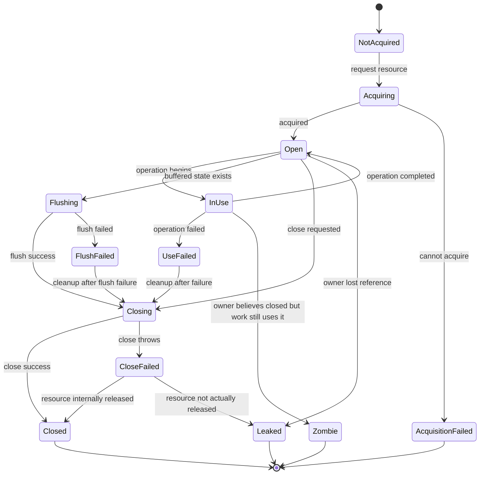
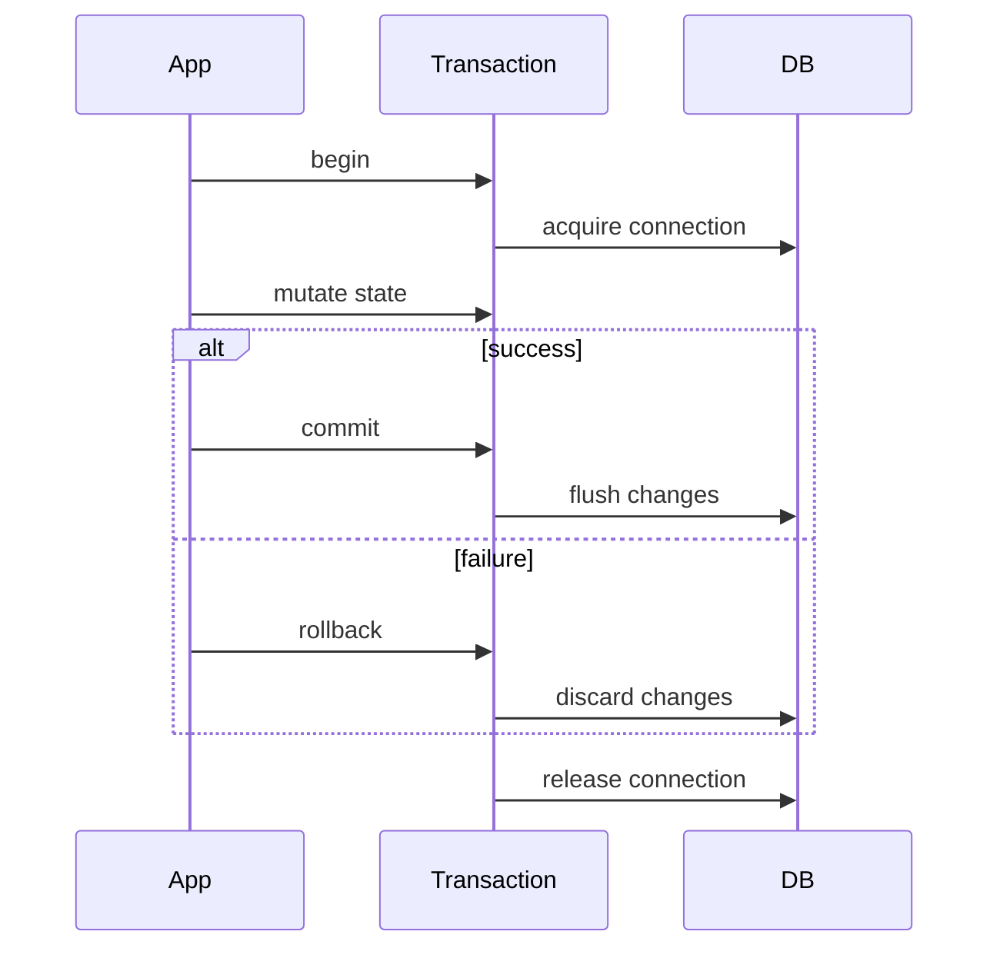

# Part 019 — Resource Lifecycle Failure

> Target part ini: kamu tidak hanya tahu bahwa resource harus di-`close`.
> Kamu mampu mendesain ownership, scope, cleanup ordering, leak detection, dan evidence trail saat resource gagal dibuka, gagal dipakai, gagal di-flush, atau gagal ditutup.

Materi ini berada setelah async/reactive/virtual threads karena semakin banyak concurrency, semakin mahal konsekuensi resource leak. Pada sistem produksi, banyak incident bukan dimulai dari exception yang spektakuler, tetapi dari resource lifecycle yang salah kecil-kecil: connection tidak dikembalikan ke pool, file descriptor bocor, span tidak diakhiri, lock tidak dilepas, MDC tidak dibersihkan, atau executor tidak pernah di-shutdown.

Java sudah menyediakan fondasi penting: `AutoCloseable`, `Closeable`, try-with-resources, suppressed exception, dan API resource di banyak library. Namun fondasi itu tidak otomatis membuat desain resource kamu benar. Top 1% engineer membedakan antara "resource object" dan "resource ownership".

---

## 1. Kaufman Skill Deconstruction

Menurut pendekatan Josh Kaufman, skill besar harus dipecah menjadi subskill kecil yang bisa dilatih dan dikoreksi. Untuk resource lifecycle failure, subskill-nya adalah:

| Subskill | Kemampuan yang harus terlihat |
|---|---|
| Resource identification | Mampu mengenali resource yang tidak jelas sebagai resource: `MDC`, span, lock, semaphore permit, transaction, temp file, thread pool |
| Ownership modelling | Mampu menjawab siapa yang wajib menutup resource dan kapan |
| Scope design | Mampu membatasi umur resource sekecil mungkin tanpa merusak workflow |
| Failure sequencing | Mampu menjelaskan apa yang terjadi jika acquisition/use/flush/close gagal |
| Cleanup ordering | Mampu menutup resource dalam urutan yang aman |
| Suppressed exception inspection | Mampu menemukan close failure yang tersembunyi |
| Leak prevention | Mampu mencegah leak melalui API shape, bukan hanya discipline |
| Observability | Mampu membuat lifecycle resource terlihat di log, metric, trace |
| Shutdown integration | Mampu mengintegrasikan resource cleanup dengan graceful shutdown |

### Desired performance

Setelah part ini, kamu harus bisa mereview kode seperti ini:

```java
Connection connection = dataSource.getConnection();
PreparedStatement statement = connection.prepareStatement(sql);
ResultSet resultSet = statement.executeQuery();

while (resultSet.next()) {
    process(resultSet);
}
```

dan langsung melihat bahwa masalahnya bukan hanya "belum close", tetapi:

1. ownership `Connection`, `PreparedStatement`, dan `ResultSet` tidak eksplisit;
2. close ordering tidak dijamin;
3. exception saat `process` bisa membuat semua resource bocor;
4. exception saat `close` bisa menutupi primary failure jika ditulis manual dengan `finally`;
5. observability tidak bisa membedakan acquisition failure, query failure, processing failure, dan close failure;
6. transaction boundary tidak terlihat;
7. cancellation/shutdown behavior tidak terlihat.

---

## 2. Mental Model: Resource adalah Borrowed Capability

Resource bukan sekadar object. Resource adalah **kemampuan terbatas yang dipinjam dari sistem lain**.

Contoh:

| Resource | Kemampuan yang dipinjam | Pemilik asli |
|---|---|---|
| `FileInputStream` | akses file descriptor | OS |
| JDBC `Connection` | slot koneksi database | connection pool / DB |
| Socket | channel komunikasi jaringan | OS / remote peer |
| Lock | hak eksklusif masuk critical section | concurrency protocol |
| Semaphore permit | hak menggunakan kapasitas terbatas | local capacity controller |
| Transaction | hak mengubah state secara atomik | DB / transaction manager |
| Span | hak menulis telemetry operation | tracer/exporter |
| MDC scope | hak menambahkan context pada log thread saat ini | logging context |
| ExecutorService | kapasitas scheduling task | JVM process |
| Native memory / direct buffer | memory di luar heap | OS / JVM native memory |

Resource memiliki tiga sifat:

1. **Scarce** — jumlahnya terbatas.
2. **Stateful** — statusnya berubah: open, used, closed, failed.
3. **Obligatory** — ada kewajiban melepasnya.

Jika kewajiban ini tidak dipenuhi, masalahnya bisa muncul jauh dari lokasi bug. Inilah sebabnya resource leak sering menjadi incident lambat: latency naik, pool exhausted, GC pressure meningkat, file descriptor habis, lalu aplikasi terlihat "randomly failing".

---

## 3. State Machine Resource Lifecycle

Resource harus dipikirkan sebagai state machine.



State yang paling berbahaya:

| State | Kenapa berbahaya |
|---|---|
| `Leaked` | aplikasi kehilangan handle, tetapi OS/pool masih menganggap resource dipakai |
| `Zombie` | resource dianggap selesai oleh owner, tetapi masih dipakai task lain |
| `CloseFailed` | engineer sering mengabaikan, padahal close bisa berarti flush/commit/return-to-pool |
| `AcquisitionFailed` | sering salah diklasifikasikan sebagai business failure |
| `FlushFailed` | data mungkin belum benar-benar durable |

---

## 4. Taxonomy Resource di Java Production System

### 4.1 Memory resource

Heap object biasanya dikelola GC. Namun tidak semua memory aman diabaikan.

- object besar yang menahan graph besar;
- cache tanpa eviction;
- `ThreadLocal` yang tidak dibersihkan;
- buffer besar;
- classloader leak;
- listener/subscriber leak;
- static registry yang terus tumbuh.

Failure mode:

```text
memory retention -> GC pressure -> latency spike -> timeout -> retry storm -> overload
```

### 4.2 Non-heap / OS resource

Contoh:

- file descriptor;
- socket;
- process handle;
- native memory;
- direct buffer;
- mmap file;
- DNS resolver socket;
- TLS context.

Failure mode:

```text
forgotten close -> fd exhaustion -> cannot open file/socket -> unrelated requests fail
```

### 4.3 Pooled resource

Contoh:

- JDBC connection;
- HTTP client connection;
- Redis connection;
- object pool;
- thread pool;
- worker permits.

Pooled resource berbeda dari resource biasa: `close()` sering tidak benar-benar menutup resource fisik, tetapi **mengembalikan resource ke pool**. Karena itu connection leak bisa membuat database sehat, aplikasi sehat, tetapi pool exhausted.

### 4.4 Logical resource

Contoh:

- transaction;
- lock;
- semaphore permit;
- lease;
- distributed lock;
- feature flag override;
- audit session;
- MDC context;
- tracing span;
- security context.

Logical resource tidak selalu terlihat sebagai `AutoCloseable`, padahal lifecycle-nya sama penting.

Contoh buruk:

```java
MDC.put("caseId", caseId);
service.process(caseId);
// MDC tidak dibersihkan, request berikutnya di thread yang sama bisa membawa caseId salah.
```

Contoh lebih aman:

```java
try (MdcScope ignored = MdcScope.put("caseId", caseId)) {
    service.process(caseId);
}
```

---

## 5. Failure Modes pada Setiap Tahap

### 5.1 Acquisition failure

Resource gagal didapat.

Contoh:

```java
try (Connection connection = dataSource.getConnection()) {
    // ...
}
```

`getConnection()` bisa gagal karena:

- pool exhausted;
- database down;
- credential invalid;
- network partition;
- timeout;
- application sedang shutdown;
- tenant quota exceeded.

Jangan langsung mengubah semua acquisition failure menjadi `InternalServerError`. Pertanyaan desainnya:

| Pertanyaan | Implikasi |
|---|---|
| Apakah caller bisa retry? | tambahkan retryability metadata |
| Apakah failure karena kapasitas lokal? | metric pool saturation |
| Apakah failure karena dependency? | circuit breaker/dependency health |
| Apakah failure karena policy? | mungkin 429/403/domain rejection |
| Apakah operation aman diulang? | idempotency diperlukan |

### 5.2 Partial acquisition

Ini sangat sering terjadi pada multi-resource operation.

```java
Connection c = dataSource.getConnection();
PreparedStatement ps = c.prepareStatement(sql);
ResultSet rs = ps.executeQuery();
```

Jika `prepareStatement` gagal, `Connection` harus tetap ditutup. Jika `executeQuery` gagal, `PreparedStatement` dan `Connection` harus ditutup. Try-with-resources membuat ini lebih aman.

```java
try (Connection c = dataSource.getConnection();
     PreparedStatement ps = c.prepareStatement(sql);
     ResultSet rs = ps.executeQuery()) {

    while (rs.next()) {
        processRow(rs);
    }
}
```

Resource ditutup dalam urutan kebalikan dari deklarasi: `ResultSet`, lalu `PreparedStatement`, lalu `Connection`.

### 5.3 Use failure

Resource berhasil dibuka, tetapi operasi gagal.

```java
try (var stream = Files.newInputStream(path)) {
    return parser.parse(stream);
}
```

`parse` bisa gagal. Dalam kasus ini cleanup tetap wajib. Jangan membuat cleanup bergantung pada success path.

Anti-pattern:

```java
InputStream stream = Files.newInputStream(path);
Parsed parsed = parser.parse(stream);
stream.close(); // tidak jalan jika parser.parse throw
return parsed;
```

### 5.4 Flush failure

Banyak resource buffered. `close()` bisa memicu flush.

Contoh:

```java
try (BufferedWriter writer = Files.newBufferedWriter(path)) {
    writer.write(payload);
}
```

Jika `write` berhasil tetapi flush saat close gagal, maka secara bisnis "write succeeded" belum tentu benar. Untuk operation yang butuh durability, close/flush failure harus terlihat sebagai failure operation.

Mental model:

```text
write accepted by buffer != data durable
close success != always irrelevant
```

### 5.5 Close failure

Close bisa gagal karena:

- flush gagal;
- network error saat protocol close;
- DB rollback/return-to-pool error;
- file system error;
- remote peer reset;
- resource sudah corrupted.

Close failure sering dianggap "tidak penting". Itu salah. Close failure kadang membawa bukti bahwa side effect belum selesai.

### 5.6 Double close

`Closeable.close()` di Java diharapkan idempotent, tetapi `AutoCloseable.close()` tidak wajib idempotent. Implementer tetap dianjurkan membuat `close` idempotent, tetapi caller tidak boleh mengandalkan semua resource custom aman di-close berkali-kali.

Desain resource internal sebaiknya idempotent:

```java
public final class CaseLease implements AutoCloseable {
    private final AtomicBoolean closed = new AtomicBoolean(false);
    private final LeaseClient client;
    private final String leaseId;

    public CaseLease(LeaseClient client, String leaseId) {
        this.client = client;
        this.leaseId = leaseId;
    }

    @Override
    public void close() {
        if (closed.compareAndSet(false, true)) {
            client.release(leaseId);
        }
    }
}
```

### 5.7 Ownership ambiguity

Bug resource paling banyak muncul ketika ownership tidak jelas.

Contoh buruk:

```java
void process(InputStream input) {
    // Apakah method ini boleh close input?
}
```

Buat contract eksplisit:

```java
// Caller owns the stream. This method will not close it.
Parsed parse(InputStream input);

// Method owns the path and creates/closes its own stream.
Parsed parseFile(Path path) throws IOException;
```

Aturan praktis:

| API shape | Ownership yang disarankan |
|---|---|
| menerima `InputStream` | caller tetap owner kecuali dokumentasi menyatakan sebaliknya |
| menerima `Path` lalu membuka stream sendiri | method menjadi owner |
| return `Stream<T>` dari resource I/O | caller wajib close stream |
| return materialized `List<T>` | method wajib close resource sebelum return |
| menerima `Connection` | caller/transaction manager biasanya owner |
| membuat `Connection` sendiri | method wajib close/return ke pool |

---

## 6. Try-With-Resources: Bukan Syntax Sugar Biasa

Try-with-resources bukan sekadar mengganti `finally`. Ia memberi tiga keuntungan:

1. close otomatis;
2. close ordering benar;
3. primary exception tidak tertutup oleh close exception.

### 6.1 Manual finally yang berbahaya

```java
BufferedReader reader = null;

try {
    reader = Files.newBufferedReader(path);
    return reader.readLine();
} finally {
    if (reader != null) {
        reader.close();
    }
}
```

Jika `readLine()` throw dan `close()` juga throw, exception dari `close()` bisa menutupi failure utama pada pola manual tertentu. Try-with-resources menyimpan close exception sebagai suppressed exception.

### 6.2 Inspect suppressed exception

```java
try {
    service.importFile(path);
} catch (ImportFailedException e) {
    log.error("import failed, suppressedCount={}", e.getSuppressed().length, e);

    for (Throwable suppressed : e.getSuppressed()) {
        log.warn("suppressed failure during cleanup: {}", suppressed.toString(), suppressed);
    }

    throw e;
}
```

Suppressed exception penting ketika:

- close melakukan flush;
- cleanup gagal menghapus temp file;
- rollback gagal;
- return-to-pool gagal;
- telemetry exporter gagal flush;
- lock release gagal.

### 6.3 Resource declaration ordering

Urutan deklarasi harus mengikuti dependency.

```java
try (Connection c = dataSource.getConnection();
     PreparedStatement ps = c.prepareStatement(sql);
     ResultSet rs = ps.executeQuery()) {
    // use rs
}
```

Karena close terjadi kebalikan dari deklarasi:

```text
ResultSet closes first
PreparedStatement closes second
Connection closes last
```

Ini benar karena `ResultSet` bergantung pada `PreparedStatement`, dan `PreparedStatement` bergantung pada `Connection`.

---

## 7. Desain `AutoCloseable` yang Production-Grade

### 7.1 Minimal safe pattern

```java
public final class ResourceScope implements AutoCloseable {
    private final AtomicBoolean closed = new AtomicBoolean(false);
    private final ResourceClient client;
    private final String resourceId;

    public ResourceScope(ResourceClient client, String resourceId) {
        this.client = Objects.requireNonNull(client);
        this.resourceId = Objects.requireNonNull(resourceId);
    }

    @Override
    public void close() {
        if (!closed.compareAndSet(false, true)) {
            return;
        }

        client.release(resourceId);
    }
}
```

Design notes:

- `close()` idempotent;
- state marked closed sebelum release untuk mencegah double-release loop;
- exception boleh dilempar jika release failure harus terlihat;
- jangan throw `InterruptedException` dari `close()`;
- jangan blocking tanpa timeout jika `close()` dipakai saat shutdown.

### 7.2 Close failure harus punya policy

Ada tiga policy umum:

| Policy | Kapan dipakai |
|---|---|
| Throw close failure | close failure menentukan correctness operation |
| Log close failure | cleanup best-effort, primary result tetap valid |
| Accumulate close failure | multi-resource cleanup, butuh full evidence |

Contoh accumulating cleanup:

```java
public final class CleanupErrors extends RuntimeException {
    public CleanupErrors(String message) {
        super(message);
    }

    public void add(Throwable error) {
        addSuppressed(error);
    }
}

public final class ResourceGroup implements AutoCloseable {
    private final Deque<AutoCloseable> resources = new ArrayDeque<>();

    public <T extends AutoCloseable> T add(T resource) {
        resources.push(resource);
        return resource;
    }

    @Override
    public void close() {
        CleanupErrors errors = new CleanupErrors("one or more resources failed to close");

        while (!resources.isEmpty()) {
            try {
                resources.pop().close();
            } catch (Exception e) {
                errors.add(e);
            }
        }

        if (errors.getSuppressed().length > 0) {
            throw errors;
        }
    }
}
```

### 7.3 Jangan membuat `close()` sebagai tempat business logic tersembunyi

Buruk:

```java
try (CaseSession session = caseService.open(caseId)) {
    session.addFinding(finding);
} // close otomatis submit keputusan final
```

Masalah:

- side effect penting tersembunyi di close;
- close failure sulit dipahami;
- rollback/commit semantics kabur;
- reviewer tidak melihat business transition.

Lebih baik:

```java
try (CaseSession session = caseService.open(caseId)) {
    session.addFinding(finding);
    session.submitDecision();
}
```

`close()` hanya cleanup session/lease/context.

---

## 8. Scope Resource: Semakin Kecil Semakin Aman

### 8.1 Jangan membuka resource terlalu awal

Buruk:

```java
try (Connection c = dataSource.getConnection()) {
    validate(input);              // tidak butuh DB
    callExternalService(input);    // menahan connection saat network call
    repository.save(c, input);
}
```

Lebih baik:

```java
validate(input);
ExternalResult result = callExternalService(input);

try (Connection c = dataSource.getConnection()) {
    repository.save(c, input, result);
}
```

Connection pool adalah resource mahal. Jangan tahan connection saat melakukan operasi yang tidak membutuhkan connection.

### 8.2 Jangan mengembalikan lazy object yang memegang resource tanpa kontrak close

Buruk:

```java
Stream<CaseRecord> findCases() {
    return jdbcTemplate.queryForStream("select * from cases", mapper);
}
```

Jika caller lupa close stream, resource DB bisa leak.

Lebih aman untuk kebanyakan use case:

```java
List<CaseRecord> findCases() {
    return jdbcTemplate.query("select * from cases", mapper);
}
```

Jika harus return stream, naming dan dokumentasi harus eksplisit:

```java
/**
 * Returns a stream backed by a database cursor.
 * Caller must close the stream.
 */
Stream<CaseRecord> streamCases();
```

Caller:

```java
try (Stream<CaseRecord> cases = repository.streamCases()) {
    cases.forEach(this::process);
}
```

### 8.3 Hindari resource scope melintasi async boundary

Buruk:

```java
try (Connection c = dataSource.getConnection()) {
    return CompletableFuture.supplyAsync(() -> repository.loadUsing(c, id));
}
```

Saat async task berjalan, `Connection` mungkin sudah ditutup. Atau sebaliknya, future menahan connection terlalu lama.

Lebih aman:

```java
return CompletableFuture.supplyAsync(() -> {
    try (Connection c = dataSource.getConnection()) {
        return repository.loadUsing(c, id);
    } catch (SQLException e) {
        throw new CompletionException(e);
    }
});
```

Owner resource harus berada di execution context yang benar-benar memakai resource itu.

---

## 9. Resource Lifecycle pada Transaction

Transaction adalah resource logical. Ia punya acquisition, use, commit/rollback, close.



Failure cases:

| Tahap | Contoh failure | Implikasi |
|---|---|---|
| begin | cannot acquire connection | operation tidak mulai |
| mutate | constraint violation | rollback diperlukan |
| commit | DB timeout | outcome mungkin unknown |
| rollback | network failure | data mungkin inconsistent/unknown |
| release | pool return failure | resource pressure |

Prinsip:

1. commit failure tidak selalu berarti "tidak committed";
2. rollback failure tidak selalu berarti "rollback tidak terjadi";
3. unknown outcome harus diperlakukan berbeda dari clean failure;
4. audit event harus bisa menunjukkan outcome `SUCCESS`, `REJECTED`, `FAILED`, atau `UNKNOWN`.

---

## 10. Locks, Semaphores, dan Permits sebagai Resource

### 10.1 Lock

```java
lock.lock();
try {
    criticalSection();
} finally {
    lock.unlock();
}
```

Jika kamu sering memakai lock, buat scope helper agar tidak lupa unlock:

```java
public final class LockScope implements AutoCloseable {
    private final Lock lock;

    private LockScope(Lock lock) {
        this.lock = lock;
        this.lock.lock();
    }

    public static LockScope acquire(Lock lock) {
        return new LockScope(lock);
    }

    @Override
    public void close() {
        lock.unlock();
    }
}
```

Pemakaian:

```java
try (LockScope ignored = LockScope.acquire(lock)) {
    criticalSection();
}
```

### 10.2 Semaphore permit

```java
if (!semaphore.tryAcquire(50, TimeUnit.MILLISECONDS)) {
    throw new CapacityExceededException("worker_capacity_exhausted");
}

try {
    process();
} finally {
    semaphore.release();
}
```

Permit leak menyebabkan sistem terlihat "tidak punya kapasitas" padahal worker idle.

### 10.3 Distributed lock / lease

Distributed lock lebih rumit:

- lease bisa expire sebelum kerja selesai;
- release bisa gagal;
- owner bisa kehilangan session;
- clock/network partition bisa menciptakan false ownership;
- cleanup tidak selalu menjamin lock benar-benar dilepas.

Jangan pakai distributed lock untuk correctness tanpa fencing token atau desain idempotent.

---

## 11. MDC, Security Context, dan Trace Scope sebagai Resource

Thread-local context adalah resource. Ia tidak menghabiskan file descriptor, tetapi bisa membocorkan identitas dan correlation.

### 11.1 MDC scope

```java
public final class MdcScope implements AutoCloseable {
    private final String key;
    private final String previous;

    private MdcScope(String key, String value) {
        this.key = key;
        this.previous = org.slf4j.MDC.get(key);
        org.slf4j.MDC.put(key, value);
    }

    public static MdcScope put(String key, String value) {
        return new MdcScope(key, value);
    }

    @Override
    public void close() {
        if (previous == null) {
            org.slf4j.MDC.remove(key);
        } else {
            org.slf4j.MDC.put(key, previous);
        }
    }
}
```

Pemakaian:

```java
try (MdcScope ignored = MdcScope.put("caseId", caseId)) {
    processCase(caseId);
}
```

### 11.2 Nested context

Scope harus restore previous value, bukan sekadar remove.

```text
outer caseId=A
  inner caseId=B
inner close -> restore A
outer close -> remove A
```

### 11.3 Async caveat

MDC berbasis thread-local tidak otomatis pindah ke thread lain. Jika task async butuh context, capture dan restore secara eksplisit, atau gunakan instrumentation yang mendukung context propagation.

---

## 12. Resource Leak Detection

Leak detection tidak boleh menunggu production incident.

### 12.1 Static detection

Checklist review:

- Apakah semua `AutoCloseable` dipakai dalam try-with-resources?
- Apakah `Stream` dari I/O ditutup?
- Apakah `ExecutorService` dibuat lokal tanpa shutdown?
- Apakah `ThreadLocal` di-remove?
- Apakah lock/semaphore permit dilepas dalam `finally`?
- Apakah temp file dihapus?
- Apakah listener/subscriber di-unregister?
- Apakah callback registration menghasilkan handle untuk unregister?

### 12.2 Runtime metric

Metric yang berguna:

| Metric | Makna |
|---|---|
| active DB connections | connection sedang dipinjam |
| idle DB connections | kapasitas tersisa |
| connection acquisition latency | sinyal pool saturation |
| pending executor tasks | backlog |
| active executor threads | workload |
| open file descriptors | OS pressure |
| active spans/scopes | instrumentation issue |
| lock wait duration | contention |
| semaphore available permits | capacity pressure |
| cleanup failure count | cleanup reliability |

### 12.3 Log event

Log lifecycle resource jangan spam. Log event penting:

- acquisition timeout;
- resource held too long;
- close failure;
- leak detected;
- forced cleanup;
- shutdown cleanup timeout;
- resource pool exhausted.

Contoh structured log:

```java
log.warn("resource.close.failed resourceType={} resourceId={} owner={} durationMs={} errorClass={}",
        "case-lease",
        leaseId,
        owner,
        duration.toMillis(),
        e.getClass().getName(),
        e);
```

### 12.4 Trace span

Untuk resource yang mahal, span bisa menunjukkan bottleneck:

```text
case.process
  db.connection.acquire
  db.query
  external.call
  case.lease.release
```

Jika `db.connection.acquire` dominan, masalahnya bukan query lambat, tetapi pool contention.

---

## 13. Production Pattern: Resource Boundary Object

Daripada menyebar `try/finally`, bungkus lifecycle ke boundary object.

```java
public final class CaseProcessingScope implements AutoCloseable {
    private final MdcScope mdcScope;
    private final CaseLease lease;
    private final ObservationScope observationScope;

    private CaseProcessingScope(
            MdcScope mdcScope,
            CaseLease lease,
            ObservationScope observationScope
    ) {
        this.mdcScope = mdcScope;
        this.lease = lease;
        this.observationScope = observationScope;
    }

    public static CaseProcessingScope open(
            String caseId,
            CaseLeaseService leaseService,
            ObservationService observationService
    ) {
        var observation = observationService.open("case.processing", "caseId", caseId);
        var mdc = MdcScope.put("caseId", caseId);
        var lease = leaseService.acquire(caseId);

        return new CaseProcessingScope(mdc, lease, observation);
    }

    @Override
    public void close() {
        RuntimeException cleanupFailure = null;

        cleanupFailure = closeOne(cleanupFailure, lease);
        cleanupFailure = closeOne(cleanupFailure, mdcScope);
        cleanupFailure = closeOne(cleanupFailure, observationScope);

        if (cleanupFailure != null) {
            throw cleanupFailure;
        }
    }

    private static RuntimeException closeOne(RuntimeException aggregate, AutoCloseable closeable) {
        try {
            closeable.close();
            return aggregate;
        } catch (Exception e) {
            if (aggregate == null) {
                aggregate = new RuntimeException("case processing scope cleanup failed");
            }
            aggregate.addSuppressed(e);
            return aggregate;
        }
    }
}
```

Catatan penting: urutan close harus diputuskan sadar. Kadang observability scope perlu ditutup terakhir agar close failure resource lain tercatat dalam span. Kadang lease harus dilepas terakhir agar operasi cleanup masih dianggap berada dalam ownership lease.

---

## 14. Anti-Patterns

### 14.1 Rely on finalization

Finalization tidak reliable untuk cleanup. Untuk resource non-heap, gunakan explicit close, try-with-resources, `Cleaner`/`PhantomReference` untuk safety net, bukan primary lifecycle.

### 14.2 Close di tempat yang bukan owner

```java
void parse(InputStream input) {
    try (input) {
        // caller mungkin masih membutuhkan input
    }
}
```

Ini merusak ownership contract.

### 14.3 Swallow close exception tanpa metric

```java
try {
    resource.close();
} catch (Exception ignored) {
}
```

Jika close bisa gagal, failure harus minimal muncul sebagai metric/log debug/warn sesuai severity.

### 14.4 Holding resource during remote call

Menahan DB transaction sambil memanggil service eksternal adalah sumber deadlock, lock contention, pool starvation, dan long rollback.

### 14.5 Returning lazy resource accidentally

Return `Stream<T>` dari DB tanpa dokumentasi close adalah leak trap.

### 14.6 Starting executor without lifecycle owner

```java
ExecutorService executor = Executors.newFixedThreadPool(10);
```

Jika dibuat dalam service, harus ada shutdown owner. Jika dibuat per request, biasanya salah.

### 14.7 Cleanup with unbounded blocking

`close()` yang bisa block selamanya akan menghancurkan graceful shutdown.

---

## 15. Review Heuristics

Saat review kode, tanyakan:

1. Resource apa yang di-acquire?
2. Siapa owner-nya?
3. Apa scope minimalnya?
4. Apa yang terjadi jika acquisition gagal?
5. Apa yang terjadi jika use gagal?
6. Apa yang terjadi jika flush gagal?
7. Apa yang terjadi jika close gagal?
8. Apakah close idempotent?
9. Apakah close bisa block?
10. Apakah resource melintasi async boundary?
11. Apakah resource ditutup dalam urutan dependency yang benar?
12. Apakah close failure observable?
13. Apakah leak bisa terdeteksi sebelum outage?
14. Apakah shutdown bisa menyelesaikan lifecycle ini secara bounded?

---

## 16. Mini Lab

### Lab 1 — Refactor manual lifecycle

Ubah kode berikut menjadi lifecycle-safe:

```java
public List<CaseRecord> loadCases(DataSource ds) throws SQLException {
    Connection c = ds.getConnection();
    PreparedStatement ps = c.prepareStatement("select id, status from cases");
    ResultSet rs = ps.executeQuery();

    List<CaseRecord> result = new ArrayList<>();
    while (rs.next()) {
        result.add(new CaseRecord(rs.getString("id"), rs.getString("status")));
    }

    rs.close();
    ps.close();
    c.close();

    return result;
}
```

Expected answer:

```java
public List<CaseRecord> loadCases(DataSource ds) throws SQLException {
    try (Connection c = ds.getConnection();
         PreparedStatement ps = c.prepareStatement("select id, status from cases");
         ResultSet rs = ps.executeQuery()) {

        List<CaseRecord> result = new ArrayList<>();
        while (rs.next()) {
            result.add(new CaseRecord(rs.getString("id"), rs.getString("status")));
        }
        return result;
    }
}
```

### Lab 2 — Design ownership

Buat dua API:

1. `parse(InputStream input)` yang tidak menutup input.
2. `parseFile(Path path)` yang membuka dan menutup resource sendiri.

```java
public ParsedCase parse(InputStream input) {
    return parser.parse(input);
}

public ParsedCase parseFile(Path path) throws IOException {
    try (InputStream input = Files.newInputStream(path)) {
        return parse(input);
    }
}
```

### Lab 3 — Capture close failure

Buat test yang membuktikan suppressed exception muncul saat body dan close sama-sama gagal.

```java
final class FailingResource implements AutoCloseable {
    @Override
    public void close() {
        throw new IllegalStateException("close failed");
    }
}

@Test
void closeFailureIsSuppressedWhenBodyFails() {
    RuntimeException thrown = assertThrows(RuntimeException.class, () -> {
        try (FailingResource ignored = new FailingResource()) {
            throw new RuntimeException("body failed");
        }
    });

    assertEquals("body failed", thrown.getMessage());
    assertEquals(1, thrown.getSuppressed().length);
    assertEquals("close failed", thrown.getSuppressed()[0].getMessage());
}
```

---

## 17. Production Checklist

Sebelum merge kode yang mengelola resource:

- [ ] Semua `AutoCloseable` punya owner jelas.
- [ ] Semua resource ditutup dengan try-with-resources atau `finally`.
- [ ] Close ordering mengikuti dependency.
- [ ] Resource tidak dibuka lebih awal dari perlu.
- [ ] Resource tidak ditahan saat remote call kecuali sengaja dan dibatasi timeout.
- [ ] Lazy resource (`Stream`, cursor, subscription) punya close contract eksplisit.
- [ ] `close()` custom idempotent atau documented non-idempotent.
- [ ] `close()` tidak throw `InterruptedException`.
- [ ] Close failure tidak diswallow tanpa evidence.
- [ ] Resource tidak melintasi async boundary tanpa ownership jelas.
- [ ] Thread-local context di-restore.
- [ ] Executor/pool punya lifecycle owner.
- [ ] Leak metric tersedia untuk resource kritis.
- [ ] Shutdown path menutup resource secara bounded.
- [ ] Test mencakup acquisition failure, use failure, close failure.

---

## 18. Key Takeaways

1. Resource adalah borrowed capability, bukan sekadar object.
2. Ownership lebih penting daripada syntax `close()`.
3. Try-with-resources menjaga close ordering dan suppressed exception.
4. Close failure bisa membawa informasi correctness, terutama untuk buffered/durable operation.
5. Resource scope harus sekecil mungkin.
6. Thread-local context, span, lock, semaphore, dan transaction juga resource.
7. Leak prevention harus didesain lewat API shape, bukan hanya discipline.
8. Resource lifecycle harus observable melalui metric, log, dan trace.
9. Shutdown hanya aman jika resource lifecycle sudah punya owner dan batas waktu.

---

## References

- Java SE 25 `AutoCloseable`: https://docs.oracle.com/en/java/javase/25/docs/api/java.base/java/lang/AutoCloseable.html
- Oracle Java Tutorial, try-with-resources and suppressed exceptions: https://docs.oracle.com/javase/tutorial/essential/exceptions/tryResourceClose.html
- Java SE 25 Deprecated List, finalization alternatives: https://docs.oracle.com/en/java/javase/25/docs/api/deprecated-list.html
- Java SE 25 `ExecutorService`: https://docs.oracle.com/en/java/javase/25/docs/api/java.base/java/util/concurrent/ExecutorService.html
