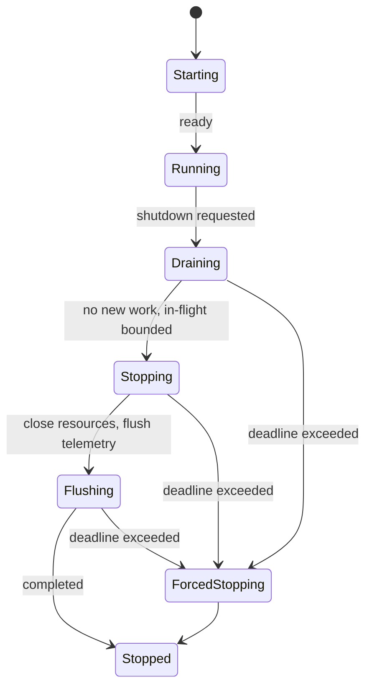
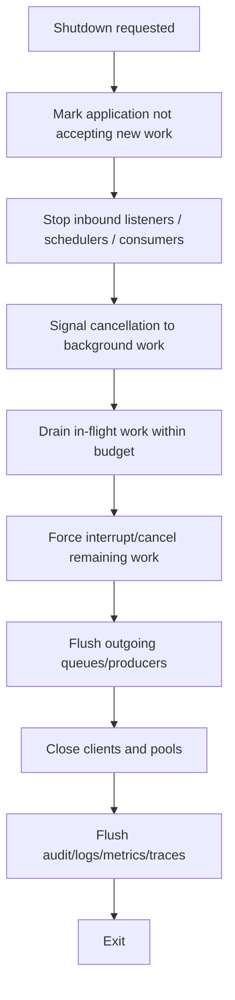

# Part 020 — Graceful Shutdown in JVM

> Target part ini: kamu mampu mendesain shutdown JVM yang tidak sekadar "punya shutdown hook", tetapi benar-benar bisa berhenti menerima kerja baru, menyelesaikan kerja yang aman diselesaikan, membatalkan kerja yang tidak aman ditunggu, flush telemetry, menutup resource, dan keluar dalam batas waktu.

Graceful shutdown adalah salah satu area yang terlihat sederhana, tetapi penuh hidden hazard. Banyak aplikasi Java "baik-baik saja" saat start, tetapi gagal saat stop: duplicate processing, lost events, incomplete audit trail, request terputus tanpa status final, task async tertinggal, connection pool tidak ditutup, span tidak terkirim, atau process tidak pernah exit sehingga orchestrator memaksa kill.

Shutdown harus dipikirkan sebagai workflow reliability, bukan event handler kecil.

---

## 1. Mental Model: Shutdown adalah Mode Operasi

Aplikasi produksi tidak hanya punya state `running` dan `stopped`. Ia minimal punya state berikut:



Graceful shutdown berarti:

1. **Stop accepting new work**.
2. **Signal existing work** that shutdown has started.
3. **Drain safe in-flight work** within budget.
4. **Cancel/interrupt work that cannot finish in time**.
5. **Commit/rollback/mark unknown outcome**.
6. **Flush logs/metrics/traces/audit**.
7. **Close resources in correct order**.
8. **Exit predictably**.

Yang sering salah: aplikasi langsung lompat dari `Running` ke `close resources`. Itu membuat in-flight work gagal secara acak.

---

## 2. JVM Shutdown Sequence

JVM memulai shutdown sequence dalam beberapa kondisi:

- jumlah live non-daemon thread turun menjadi nol;
- `Runtime.exit` atau `System.exit` dipanggil;
- external event terjadi, misalnya interrupt atau signal dari operating system.

Saat shutdown sequence dimulai, JVM menjalankan registered shutdown hooks dalam urutan yang tidak ditentukan. Hooks berjalan concurrent dengan thread lain yang masih alive saat shutdown dimulai.

Implikasi penting:

| Fakta JVM | Konsekuensi desain |
|---|---|
| shutdown hook order unspecified | jangan bergantung pada urutan hook milik library lain |
| hooks run concurrently | hook harus thread-safe |
| hook bisa deadlock | jangan ambil lock yang mungkin dipegang worker |
| hook bisa tidak selesai | shutdown sequence bisa tidak pernah selesai |
| `System.exit` di hook bisa membuat hook tidak terminate | jangan panggil `System.exit` dari hook |
| `Runtime.halt` bypass shutdown sequence | cleanup/finally/hook bisa tidak jalan |
| JVM termination mencegah thread menjalankan Java code lagi | jangan berasumsi `finally` selalu jalan saat termination paksa |

Mental model:

```text
shutdown hook is not a magic cleanup guarantee.
shutdown hook is a last coordination callback under unstable runtime conditions.
```

---

## 3. Shutdown Bukan Error Handling Biasa

Exception handling menjawab:

```text
Apa yang kita lakukan ketika operation gagal?
```

Shutdown handling menjawab:

```text
Bagaimana seluruh process berhenti tanpa membuat state eksternal menjadi salah?
```

Perbedaannya:

| Dimensi | Error handling | Shutdown |
|---|---|---|
| Scope | satu operation | seluruh process |
| Trigger | exception/failure | lifecycle event |
| Goal | recover/reject/fail | stop safely |
| Time budget | operation timeout | global termination budget |
| Ownership | local caller | application lifecycle owner |
| Main risk | wrong response | lost work, duplicate work, corrupted state |
| Observability | error log/span | shutdown timeline, drain metrics |

---

## 4. Empat Prinsip Shutdown Production-Grade

### 4.1 Bounded

Shutdown harus punya deadline.

```text
graceful != wait forever
```

Jika tidak bounded, orchestrator atau operator akan memaksa kill, dan kamu kehilangan kontrol.

### 4.2 Ordered

Resource ditutup dalam urutan dependency.

Contoh:

```text
stop intake -> drain worker -> flush producer -> close DB/HTTP client -> flush telemetry
```

Bukan:

```text
close DB -> worker masih proses -> worker gagal acak
```

### 4.3 Observable

Shutdown harus punya timeline.

Minimal log:

```text
shutdown.requested
shutdown.intake_stopped
shutdown.drain_started
shutdown.drain_completed
shutdown.force_cancel_started
shutdown.resources_closed
shutdown.telemetry_flushed
shutdown.completed
```

### 4.4 Idempotent

Shutdown bisa dipicu lebih dari sekali:

- SIGTERM;
- admin endpoint;
- `System.exit`;
- test teardown;
- framework lifecycle.

Coordinator shutdown harus aman dipanggil berkali-kali.

---

## 5. Basic Shutdown Hook: Cukup untuk Demo, Tidak Cukup untuk Produksi

Contoh dasar:

```java
Runtime.getRuntime().addShutdownHook(new Thread(() -> {
    System.out.println("shutting down");
}));
```

Masalah:

- tidak ada ordering;
- tidak ada timeout;
- tidak ada metric;
- tidak ada drain;
- tidak ada cancellation;
- tidak ada error aggregation;
- bisa deadlock;
- bisa block selamanya.

Shutdown hook produksi sebaiknya hanya memanggil coordinator yang sudah dirancang.

```java
public final class Application {
    public static void main(String[] args) {
        ShutdownCoordinator shutdown = new ShutdownCoordinator(Duration.ofSeconds(25));

        Runtime.getRuntime().addShutdownHook(new Thread(
                shutdown::shutdown,
                "app-shutdown-hook"
        ));

        app.start();
    }
}
```

---

## 6. Shutdown Coordinator

Buat satu owner untuk shutdown workflow.

```java
public final class ShutdownCoordinator {
    private static final Logger log = LoggerFactory.getLogger(ShutdownCoordinator.class);

    private final AtomicBoolean started = new AtomicBoolean(false);
    private final Duration budget;
    private final List<ShutdownStep> steps = new CopyOnWriteArrayList<>();

    public ShutdownCoordinator(Duration budget) {
        this.budget = Objects.requireNonNull(budget);
    }

    public void register(ShutdownStep step) {
        if (started.get()) {
            throw new IllegalStateException("shutdown already started");
        }
        steps.add(Objects.requireNonNull(step));
    }

    public void shutdown() {
        if (!started.compareAndSet(false, true)) {
            log.info("shutdown.already_started");
            return;
        }

        Instant deadline = Instant.now().plus(budget);
        log.info("shutdown.started budgetMs={}", budget.toMillis());

        for (ShutdownStep step : steps) {
            Duration remaining = Duration.between(Instant.now(), deadline);
            if (remaining.isNegative() || remaining.isZero()) {
                log.warn("shutdown.budget_exhausted beforeStep={}", step.name());
                break;
            }

            runStep(step, remaining);
        }

        log.info("shutdown.finished");
    }

    private void runStep(ShutdownStep step, Duration remaining) {
        long startedAt = System.nanoTime();

        try {
            log.info("shutdown.step.started name={} remainingMs={}", step.name(), remaining.toMillis());
            step.stop(remaining);
            log.info("shutdown.step.completed name={} durationMs={}",
                    step.name(),
                    Duration.ofNanos(System.nanoTime() - startedAt).toMillis());
        } catch (Exception e) {
            log.error("shutdown.step.failed name={} durationMs={}",
                    step.name(),
                    Duration.ofNanos(System.nanoTime() - startedAt).toMillis(),
                    e);
        }
    }
}
```

Step interface:

```java
public interface ShutdownStep {
    String name();

    void stop(Duration remainingBudget) throws Exception;
}
```

Catatan:

- `register` ditolak setelah shutdown dimulai agar lifecycle tidak berubah saat proses stop.
- Semua step mendapat remaining budget.
- Step failure tidak otomatis menghentikan semua step, kecuali kamu mendesain dependency hard-fail.
- Logging harus structured agar incident timeline bisa dibaca.

---

## 7. Canonical Shutdown Order

Untuk service Java umum:



### 7.1 Stop accepting new work

Examples:

- HTTP server stops accepting new connections;
- queue consumer stops polling;
- scheduler stops triggering;
- batch launcher refuses new jobs;
- admin command returns `503 shutting_down`.

Pada pure JVM service tanpa framework, kamu butuh `AtomicBoolean accepting`.

```java
public final class IntakeGate {
    private final AtomicBoolean accepting = new AtomicBoolean(true);

    public boolean isAccepting() {
        return accepting.get();
    }

    public void stopAccepting() {
        accepting.set(false);
    }

    public void rejectIfStopping() {
        if (!accepting.get()) {
            throw new ServiceStoppingException("service is shutting down");
        }
    }
}
```

### 7.2 Drain in-flight work

Track in-flight work dengan counter/scope.

```java
public final class InFlightTracker {
    private final AtomicInteger count = new AtomicInteger();
    private final Object monitor = new Object();
    private volatile boolean accepting = true;

    public WorkScope start() {
        synchronized (monitor) {
            if (!accepting) {
                throw new ServiceStoppingException("not accepting new work");
            }
            count.incrementAndGet();
            return new WorkScope(this);
        }
    }

    public void stopAccepting() {
        synchronized (monitor) {
            accepting = false;
            monitor.notifyAll();
        }
    }

    private void finish() {
        synchronized (monitor) {
            int remaining = count.decrementAndGet();
            if (remaining == 0) {
                monitor.notifyAll();
            }
        }
    }

    public boolean awaitZero(Duration timeout) throws InterruptedException {
        long deadline = System.nanoTime() + timeout.toNanos();

        synchronized (monitor) {
            while (count.get() > 0) {
                long remaining = deadline - System.nanoTime();
                if (remaining <= 0) {
                    return false;
                }
                TimeUnit.NANOSECONDS.timedWait(monitor, remaining);
            }
            return true;
        }
    }

    public int current() {
        return count.get();
    }

    public static final class WorkScope implements AutoCloseable {
        private final InFlightTracker tracker;
        private final AtomicBoolean closed = new AtomicBoolean(false);

        private WorkScope(InFlightTracker tracker) {
            this.tracker = tracker;
        }

        @Override
        public void close() {
            if (closed.compareAndSet(false, true)) {
                tracker.finish();
            }
        }
    }
}
```

Usage:

```java
public Response handle(Request request) {
    try (var ignored = inFlight.start()) {
        return service.process(request);
    }
}
```

Shutdown step:

```java
public final class DrainInFlightStep implements ShutdownStep {
    private final InFlightTracker tracker;

    public DrainInFlightStep(InFlightTracker tracker) {
        this.tracker = tracker;
    }

    @Override
    public String name() {
        return "drain-in-flight";
    }

    @Override
    public void stop(Duration remainingBudget) throws InterruptedException {
        tracker.stopAccepting();

        boolean drained = tracker.awaitZero(remainingBudget);
        if (!drained) {
            throw new TimeoutException("in-flight work did not drain, remaining=" + tracker.current());
        }
    }
}
```

Karena `TimeoutException` checked, code di atas perlu wrap atau deklarasi `throws Exception` pada interface step seperti sebelumnya.

---

## 8. ExecutorService Shutdown

`ExecutorService` punya dua mode:

| Method | Makna |
|---|---|
| `shutdown()` | orderly shutdown: task yang sudah submit tetap dieksekusi, task baru ditolak |
| `shutdownNow()` | best-effort cancel: task menunggu tidak dijalankan, task aktif dicoba dihentikan biasanya via interrupt |
| `awaitTermination()` | menunggu setelah shutdown request sampai complete/timeout/interrupted |

Pattern dua fase:

```java
public static void shutdownAndAwaitTermination(
        ExecutorService pool,
        Duration graceful,
        Duration forced
) {
    pool.shutdown();

    try {
        if (!pool.awaitTermination(graceful.toMillis(), TimeUnit.MILLISECONDS)) {
            List<Runnable> dropped = pool.shutdownNow();

            log.warn("executor.force_shutdown queuedTasksDropped={}", dropped.size());

            if (!pool.awaitTermination(forced.toMillis(), TimeUnit.MILLISECONDS)) {
                log.error("executor.did_not_terminate");
            }
        }
    } catch (InterruptedException e) {
        pool.shutdownNow();
        Thread.currentThread().interrupt();
    }
}
```

Important nuance:

- `shutdownNow()` bukan guarantee. Task yang tidak responsif terhadap interrupt bisa tetap berjalan.
- Task harus punya cancellation checkpoint.
- Blocking I/O harus punya timeout.
- Lock acquisition harus bounded.
- Loop harus check interrupt atau cancellation token.

Task yang baik:

```java
public void run() {
    while (!Thread.currentThread().isInterrupted()) {
        WorkItem item = queue.poll(250, TimeUnit.MILLISECONDS);
        if (item == null) {
            continue;
        }
        process(item);
    }
}
```

Task yang buruk:

```java
public void run() {
    while (true) {
        process(queue.take());
    }
}
```

Jika interrupted saat `take`, task harus keluar atau restore status sesuai policy.

---

## 9. In-Flight Work: Complete, Cancel, atau Mark Unknown

Tidak semua work harus diselesaikan saat shutdown.

| Work type | Shutdown policy |
|---|---|
| read-only request singkat | drain within small budget |
| idempotent command | cancel and retry elsewhere |
| non-idempotent command after side effect | finish or mark unknown |
| batch item | checkpoint and resume |
| message consumer | stop polling, finish current message or nack |
| audit writer | flush best effort, fallback to durable buffer |
| scheduled job | stop scheduling, let current job decide |
| external call in progress | bounded timeout, mark unknown if side effect uncertain |

Untuk workflow regulatory/case management, shutdown policy harus eksplisit:

```java
enum ShutdownOutcome {
    COMPLETED_BEFORE_SHUTDOWN,
    REJECTED_DUE_TO_SHUTDOWN,
    CANCELLED_BEFORE_SIDE_EFFECT,
    UNKNOWN_AFTER_EXTERNAL_SIDE_EFFECT,
    FAILED_DURING_SHUTDOWN_CLEANUP
}
```

Unknown outcome bukan failure biasa. Ia butuh reconciliation.

---

## 10. Avoid New Work During Shutdown

Setelah shutdown dimulai, sistem harus mencegah sumber kerja baru:

- HTTP handler check intake gate;
- scheduler disabled;
- queue consumer stopped;
- retry worker stopped;
- async submission rejected;
- event listener unregistered;
- admin command restricted.

Executor rejection harus diperlakukan sebagai lifecycle state, bukan error random.

```java
try {
    executor.submit(task);
} catch (RejectedExecutionException e) {
    if (shutdownState.isStopping()) {
        throw new ServiceStoppingException("task rejected because service is stopping", e);
    }
    throw e;
}
```

---

## 11. Shutdown Hooks: Dos and Don'ts

### Do

- Buat hook kecil.
- Delegasikan ke shutdown coordinator.
- Beri nama thread hook.
- Gunakan timeout.
- Hindari dependency ke service yang mungkin sudah shutdown.
- Catat timeline.
- Tangani exception.

```java
Thread hook = Thread.ofPlatform()
        .name("case-service-shutdown-hook")
        .unstarted(() -> {
            try {
                shutdownCoordinator.shutdown();
            } catch (Throwable t) {
                log.error("shutdown.unhandled_failure", t);
            }
        });

Runtime.getRuntime().addShutdownHook(hook);
```

### Don't

- Jangan panggil `System.exit()` dari shutdown hook.
- Jangan block tanpa timeout.
- Jangan menunggu user input.
- Jangan start workflow baru.
- Jangan melakukan remote call panjang tanpa timeout.
- Jangan bergantung pada urutan hook antar library.
- Jangan menutup resource yang masih dipakai worker karena belum drain.
- Jangan pakai lock yang bisa dipegang task yang sedang kamu tunggu.

---

## 12. Ordering Hazards

### 12.1 Close DB before workers finish

```text
shutdown hook closes DataSource
worker still processing request
worker tries to commit
SQLException
audit incomplete
```

Correct order:

```text
stop intake -> wait in-flight -> close DataSource
```

### 12.2 Flush telemetry too early

```text
flush tracer
worker logs final failure
span/log lost
```

Correct order:

```text
stop work -> resource cleanup -> final shutdown logs/spans -> flush telemetry
```

### 12.3 Stop scheduler but not running jobs

Scheduler shutdown often stops future triggers, not current jobs. Running jobs still need cancellation/drain policy.

### 12.4 Stop consumer but ack incorrectly

Message consumer shutdown hazard:

| Situation | Wrong behavior | Correct behavior |
|---|---|---|
| message received but not processed | ack on shutdown | do not ack / requeue |
| side effect done but ack not sent | blindly reprocess | idempotency/reconciliation |
| processing in transaction | close transaction early | commit/rollback explicitly |

### 12.5 Deadlock in hook

A shutdown hook waits for worker. Worker waits for a resource lock. Hook holds the lock while waiting. Deadlock.

Rule:

```text
Do not hold locks while waiting for shutdown completion.
```

---

## 13. Signal Semantics: Practical View

Dalam deployment modern, shutdown sering datang sebagai signal dari OS/orchestrator. Dari sisi Java, yang penting:

- normal exit dan `System.exit` memulai shutdown sequence;
- external interrupt/signal juga bisa memulai shutdown sequence;
- shutdown hook tidak guaranteed jika process dihentikan secara immediate/forceful;
- application harus menyelesaikan shutdown sebelum external grace period habis.

Jangan desain hanya untuk local Ctrl+C. Desain untuk:

```text
operator stop
container stop
deployment rolling update
node drain
autoscaling down
health-check failure restart
system shutdown
```

Part berikutnya akan membahas Spring dan Kubernetes secara khusus. Part ini fokus di JVM-level primitive.

---

## 14. Observability During Shutdown

Shutdown harus meninggalkan evidence. Minimal:

### 14.1 Logs

```text
shutdown.started reason=SIGTERM budgetMs=25000
shutdown.intake.stopped
shutdown.drain.started inFlight=17
shutdown.drain.completed durationMs=8421
shutdown.executor.shutdown.started name=worker-pool
shutdown.executor.shutdown.completed name=worker-pool durationMs=103
shutdown.resource.close.started type=datasource
shutdown.resource.close.completed type=datasource durationMs=55
shutdown.telemetry.flush.started
shutdown.completed durationMs=9730
```

### 14.2 Metrics

| Metric | Type |
|---|---|
| `app_shutdown_started_total` | counter |
| `app_shutdown_duration_seconds` | histogram/timer |
| `app_shutdown_inflight_remaining` | gauge |
| `app_shutdown_step_duration_seconds` | timer |
| `app_shutdown_step_failures_total` | counter |
| `executor_shutdown_forced_total` | counter |
| `shutdown_rejected_work_total` | counter |

### 14.3 Traces

Trace shutdown carefully. Jangan over-instrument sehingga shutdown bergantung pada tracer yang sedang ditutup. Biasanya shutdown span cukup untuk local evidence, lalu flush exporter sebagai last step.

Pseudo:

```java
try (Observation.Scope scope = observation.openScope()) {
    shutdownCoordinator.shutdown();
} finally {
    telemetry.flush(Duration.ofSeconds(2));
}
```

### 14.4 Audit

Untuk regulated workflow, audit shutdown bukan optional.

Audit event examples:

```json
{
  "eventType": "CASE_PROCESSING_REJECTED_DUE_TO_SHUTDOWN",
  "caseId": "CASE-123",
  "requestId": "req-abc",
  "timestamp": "2026-06-28T14:00:00Z",
  "reason": "SERVICE_DRAINING"
}
```

For in-flight unknown outcome:

```json
{
  "eventType": "CASE_PROCESSING_OUTCOME_UNKNOWN",
  "caseId": "CASE-456",
  "operationId": "op-789",
  "phase": "EXTERNAL_ENFORCEMENT_SUBMISSION",
  "reconciliationRequired": true
}
```

---

## 15. Testing Graceful Shutdown

Shutdown harus dites sebagai behavior, bukan hanya "hook exists".

### 15.1 Unit test coordinator idempotency

```java
@Test
void shutdownRunsOnlyOnce() {
    AtomicInteger count = new AtomicInteger();
    ShutdownCoordinator coordinator = new ShutdownCoordinator(Duration.ofSeconds(1));

    coordinator.register(new ShutdownStep() {
        @Override public String name() { return "count"; }
        @Override public void stop(Duration remainingBudget) {
            count.incrementAndGet();
        }
    });

    coordinator.shutdown();
    coordinator.shutdown();

    assertEquals(1, count.get());
}
```

### 15.2 Test drain rejects new work

```java
@Test
void trackerRejectsAfterStopAccepting() {
    InFlightTracker tracker = new InFlightTracker();

    tracker.stopAccepting();

    assertThrows(ServiceStoppingException.class, tracker::start);
}
```

### 15.3 Test timeout path

```java
@Test
void executorForcedWhenTaskDoesNotStop() {
    ExecutorService executor = Executors.newSingleThreadExecutor();

    executor.submit(() -> {
        while (true) {
            // bad task; intentionally ignores interrupt for test
        }
    });

    shutdownAndAwaitTermination(
            executor,
            Duration.ofMillis(10),
            Duration.ofMillis(10)
    );

    assertTrue(executor.isShutdown());
}
```

Catatan: Jangan biarkan test infinite loop mengganggu test suite nyata. Gunakan controlled latch/fake executor untuk production test.

### 15.4 Integration test

Test scenario:

1. start app;
2. send long-running request;
3. trigger shutdown;
4. verify new request rejected;
5. verify existing request completes/cancels according to policy;
6. verify audit event;
7. verify executor terminated;
8. verify resource close called;
9. verify shutdown completes before budget.

---

## 16. Failure Policy Matrix

| Failure during shutdown | Recommended handling |
|---|---|
| stop intake fails | log error, continue drain if possible |
| drain timeout | cancel/interrupt, mark remaining unknown |
| executor does not terminate | log critical, continue resource cleanup carefully |
| resource close fails | aggregate suppressed errors, continue other close |
| telemetry flush fails | log to stderr/fallback if possible, do not wait forever |
| audit flush fails | use durable local fallback if required |
| shutdown hook throws | catch `Throwable`, log, avoid crashing hook silently |
| hook deadlocks | design timeout outside lock; test with blocked workers |
| second shutdown request | idempotent no-op or escalate to force stop |

---

## 17. Production Checklist

Before calling shutdown design production-ready:

- [ ] One application-level shutdown coordinator exists.
- [ ] Shutdown is idempotent.
- [ ] Shutdown has total budget.
- [ ] Every step receives remaining budget.
- [ ] Intake stops before resource close.
- [ ] Schedulers/consumers stop before worker drain.
- [ ] In-flight work is tracked.
- [ ] New work is rejected with explicit lifecycle error.
- [ ] Executors use two-phase shutdown.
- [ ] Tasks respond to interrupt/cancellation.
- [ ] Blocking I/O has timeout.
- [ ] Resource close ordering follows dependency.
- [ ] Telemetry flush happens late, but bounded.
- [ ] Shutdown events are logged as structured events.
- [ ] Metrics include duration, failure, remaining in-flight.
- [ ] Domain/audit unknown outcomes are represented.
- [ ] Tests cover normal shutdown, timeout shutdown, repeated shutdown, and stuck worker.

---

## 18. Common Anti-Patterns

### 18.1 "Just add shutdown hook"

Hook without coordinator is fragile. It does not solve ordering, drain, timeout, or observability.

### 18.2 Waiting forever

Graceful shutdown with no deadline becomes ungraceful kill.

### 18.3 Closing dependencies before users

If worker uses DB, don't close DB before worker stopped.

### 18.4 Treating rejection during shutdown as 500

`SERVICE_STOPPING` is a lifecycle condition. It should be mapped intentionally, often to retryable/rejected semantics.

### 18.5 Ignoring unknown outcome

If shutdown interrupts after external side effect but before local commit/audit, you need reconciliation state.

### 18.6 Blocking shutdown on telemetry indefinitely

Telemetry is important, but it cannot hold process hostage forever.

### 18.7 Depending on shutdown hook order

Different libraries may register hooks. JVM does not promise the order you want.

---

## 19. Practical Template

Use this shutdown order as a starting point:

```java
ShutdownCoordinator coordinator = new ShutdownCoordinator(Duration.ofSeconds(25));

coordinator.register(new ShutdownStep() {
    public String name() { return "stop-intake"; }
    public void stop(Duration remaining) {
        intakeGate.stopAccepting();
    }
});

coordinator.register(new ShutdownStep() {
    public String name() { return "stop-schedulers"; }
    public void stop(Duration remaining) {
        scheduler.shutdown();
    }
});

coordinator.register(new ShutdownStep() {
    public String name() { return "drain-in-flight"; }
    public void stop(Duration remaining) throws Exception {
        if (!inFlight.awaitZero(remaining.dividedBy(2))) {
            throw new TimeoutException("in-flight drain timeout");
        }
    }
});

coordinator.register(new ShutdownStep() {
    public String name() { return "shutdown-worker-executor"; }
    public void stop(Duration remaining) {
        Shutdowns.shutdownAndAwaitTermination(
                workerExecutor,
                remaining.dividedBy(2),
                remaining.dividedBy(2)
        );
    }
});

coordinator.register(new ShutdownStep() {
    public String name() { return "close-resources"; }
    public void stop(Duration remaining) throws Exception {
        resourceGroup.close();
    }
});

coordinator.register(new ShutdownStep() {
    public String name() { return "flush-telemetry"; }
    public void stop(Duration remaining) {
        telemetry.flush(min(remaining, Duration.ofSeconds(2)));
    }
});

Runtime.getRuntime().addShutdownHook(
        Thread.ofPlatform()
                .name("app-shutdown-hook")
                .unstarted(coordinator::shutdown)
);
```

Helper:

```java
static Duration min(Duration a, Duration b) {
    return a.compareTo(b) <= 0 ? a : b;
}
```

---

## 20. Key Takeaways

1. Graceful shutdown adalah mode operasi, bukan cleanup callback.
2. Shutdown hook hanya trigger; coordinator yang menentukan correctness.
3. Stop intake sebelum drain; drain sebelum close dependencies.
4. Semua wait harus bounded.
5. Executor shutdown butuh dua fase: orderly lalu forced.
6. `shutdownNow()` hanya best-effort; task harus kooperatif terhadap interrupt.
7. Unknown outcome harus menjadi state eksplisit, terutama untuk workflow regulated.
8. Shutdown harus observable melalui logs, metrics, traces, dan audit.
9. Jangan bergantung pada urutan shutdown hook.
10. Test shutdown seperti production behavior.

---

## References

- Java SE 25 `Runtime` shutdown sequence and shutdown hooks: https://docs.oracle.com/en/java/javase/25/docs/api/java.base/java/lang/Runtime.html
- Java SE 25 `ExecutorService`: https://docs.oracle.com/en/java/javase/25/docs/api/java.base/java/util/concurrent/ExecutorService.html
- Java SE 25 `Thread`: https://docs.oracle.com/en/java/javase/25/docs/api/java.base/java/lang/Thread.html
- Java SE 25 `AutoCloseable`: https://docs.oracle.com/en/java/javase/25/docs/api/java.base/java/lang/AutoCloseable.html
