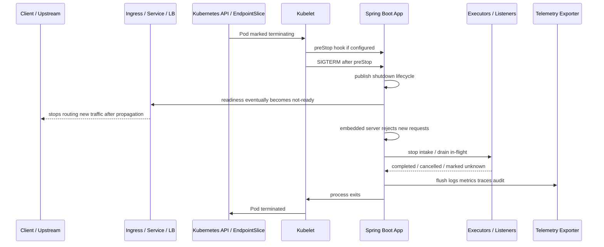
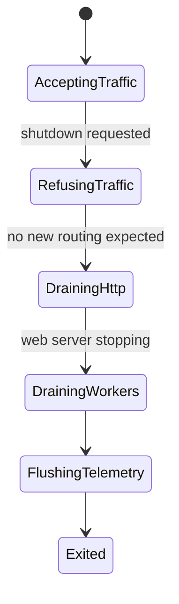
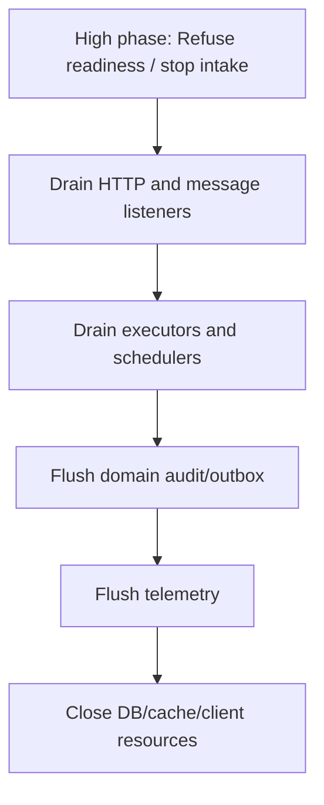
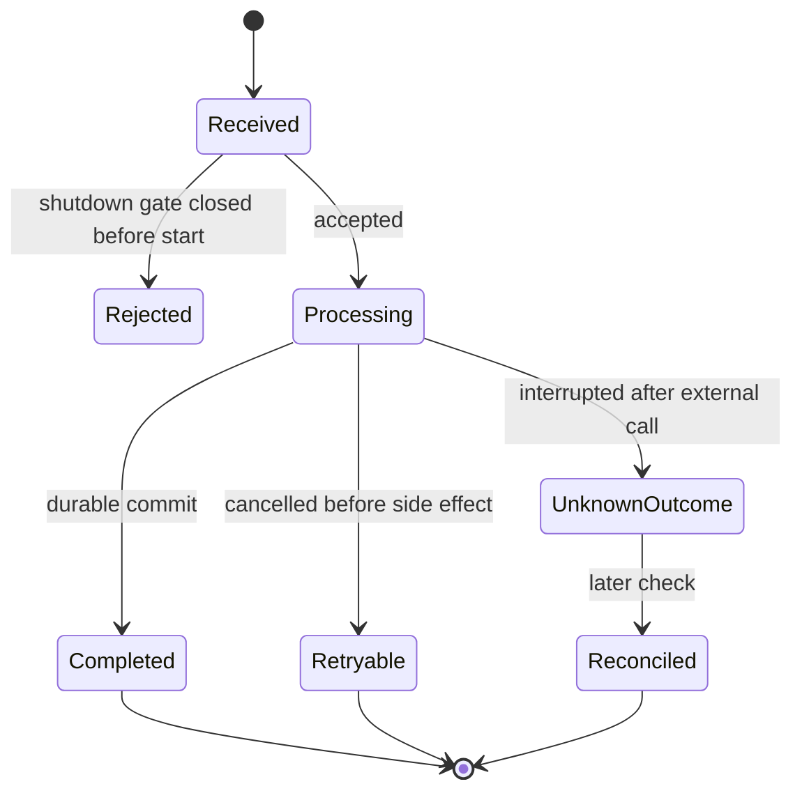

# Part 021 — Graceful Shutdown in Spring & Kubernetes

> Target part ini: kamu mampu mendesain shutdown service Java/Spring Boot di Kubernetes yang tidak hanya “berhenti dengan SIGTERM”, tetapi benar-benar melakukan traffic drain, menghentikan intake, menyelesaikan in-flight work secara bounded, menjaga audit trail, flush telemetry, dan keluar sebelum `terminationGracePeriodSeconds` habis.

Di Part 020 kita membahas graceful shutdown pada level JVM: shutdown hook, executor drain, cancellation, telemetry flush, dan ordering hazard. Part ini naik satu level: **Spring Boot application lifecycle + Kubernetes pod termination lifecycle**.

Di production, shutdown bukan urusan satu process saja. Ia adalah protokol antara:

- Kubernetes control plane;
- kubelet;
- container runtime;
- Service / EndpointSlice / ingress / load balancer;
- Spring Boot application context;
- embedded web server;
- executor/task scheduler/message listener;
- database/queue/cache/client pool;
- telemetry exporter;
- audit/reconciliation layer.

Kesalahan umum: developer mengira `server.shutdown=graceful` sudah cukup. Itu hanya satu bagian dari workflow. Tanpa readiness drain, bounded executor shutdown, dependency close ordering, dan telemetry evidence, sistem masih bisa kehilangan request, menduplikasi command, atau meninggalkan unknown outcome tanpa jejak.

---

## 1. Core Mental Model: Shutdown adalah Distributed State Transition

Untuk aplikasi yang berjalan di Kubernetes, shutdown bukan satu event, melainkan state transition lintas beberapa komponen.



A safe shutdown design must answer these questions:

| Pertanyaan | Kalau tidak dijawab |
|---|---|
| Kapan instance keluar dari load balancer? | traffic baru masih masuk saat app sudah closing |
| Apakah app berhenti menerima kerja baru? | queue/task/listener tetap intake saat shutdown |
| Berapa lama in-flight request boleh berjalan? | shutdown menggantung atau dipaksa kill |
| Apa yang terjadi pada command yang outcome-nya tidak diketahui? | duplicate effect atau audit gap |
| Resource mana yang ditutup duluan? | worker masih butuh DB, tetapi pool sudah close |
| Bagaimana telemetry dikirim sebelum process mati? | postmortem kehilangan bukti |
| Apakah sidecar masih hidup saat app flush? | trace/log exporter mati sebelum app selesai |

Rule utama:

```text
Kubernetes gives you a termination budget.
Spring gives you lifecycle callbacks.
Your application must define the safety policy.
```

---

## 2. Kubernetes Termination: Apa yang Sebenarnya Terjadi

Saat pod dihapus, direstart, dieviction, atau diganti deployment rollout, Kubernetes memulai graceful termination. Secara default, pod punya `terminationGracePeriodSeconds` 30 detik jika tidak dikonfigurasi.

Urutan konseptual:

1. Pod ditandai `Terminating`.
2. Endpoint untuk pod mulai di-update agar traffic tidak lagi diarahkan ke pod tersebut.
3. Jika container punya `preStop`, kubelet menjalankannya.
4. Setelah `preStop`, kubelet mengirim stop signal, biasanya `SIGTERM`, ke process utama container.
5. Process diberi waktu sampai grace period habis.
6. Jika masih berjalan setelah grace period, kubelet/container runtime mengirim `SIGKILL`.

Yang penting: **grace period adalah budget total**, bukan budget setelah `preStop` selesai. Jika `preStop` menghabiskan hampir seluruh waktu, aplikasi tidak punya cukup waktu untuk shutdown.

```mermaid
gantt
    title Pod Termination Budget
    dateFormat  X
    axisFormat %s
    section Total terminationGracePeriodSeconds
    Grace period        :0, 30
    section preStop
    Optional preStop    :0, 5
    section App
    SIGTERM handling    :5, 25
    Telemetry flush     :25, 28
    Safety margin       :28, 30
```



Anti-pattern:

```yaml
lifecycle:
  preStop:
    exec:
      command: ["/bin/sh", "-c", "sleep 25"]
terminationGracePeriodSeconds: 30
```

Ini terlihat seperti memberi waktu load balancer untuk drain, tetapi sebenarnya menghabiskan budget shutdown. Jika aplikasi butuh 10 detik untuk menyelesaikan request dan flush telemetry, ia akan terkena `SIGKILL`.

Better:

- readiness dibuat `REFUSING_TRAFFIC` atau endpoint readiness gagal secepat mungkin;
- `preStop` hanya ringan dan idempotent;
- termination grace period dihitung dari p99 in-flight duration + cleanup + telemetry + margin;
- app sendiri menghentikan intake dan drain worker.

---

## 3. Spring Boot Graceful Shutdown: Apa yang Dijamin dan Tidak Dijamin

Spring Boot menyediakan graceful shutdown untuk embedded web server. Pada versi modern, graceful shutdown aktif secara default untuk embedded Jetty, Reactor Netty, dan Tomcat, baik servlet maupun reactive. Proses ini terjadi sebagai bagian dari closing application context dan dilakukan pada fase awal penghentian `SmartLifecycle` beans.

Spring Boot behavior penting:

- existing requests diberi kesempatan selesai dalam grace period;
- new requests tidak diizinkan;
- timeout dikontrol oleh `spring.lifecycle.timeout-per-shutdown-phase`;
- cara request baru ditolak bergantung web server;
- Jetty, Reactor Netty, dan Tomcat menghentikan penerimaan request baru pada network layer.

Konfigurasi eksplisit yang disarankan:

```yaml
server:
  shutdown: graceful

spring:
  lifecycle:
    timeout-per-shutdown-phase: 30s
```

Catatan:

- `server.shutdown=graceful` mengatur web server behavior.
- `spring.lifecycle.timeout-per-shutdown-phase` mengatur timeout per fase lifecycle Spring.
- Ini tidak otomatis menghentikan semua executor custom, scheduler, message listener, batch worker, atau background thread yang kamu buat sendiri kecuali lifecycle-nya terintegrasi dengan benar.

Mental model:

```text
Spring Boot graceful shutdown protects HTTP request lifecycle.
It does not magically make all application work safely drainable.
```

---

## 4. Availability: Liveness Bukan Readiness

Banyak sistem rusak karena salah memakai liveness dan readiness.

| Probe | Pertanyaan | Efek Kubernetes | Jangan digunakan untuk |
|---|---|---|---|
| Liveness | Apakah process internal masih valid? | restart container jika gagal | dependency outage biasa |
| Readiness | Apakah instance siap menerima traffic? | keluarkan dari load balancing | membuktikan app harus direstart |
| Startup | Apakah app masih startup? | menunda liveness kill saat startup panjang | runtime health normal |

Rule produksi:

```text
Liveness should be conservative.
Readiness should be operational.
```

Jika database shared down lalu liveness gagal di semua pod, Kubernetes bisa merestart seluruh fleet. Itu memperparah outage. Biasanya external dependency tidak boleh langsung membuat liveness gagal.

Spring Boot Actuator menyediakan health group untuk liveness dan readiness:

```yaml
management:
  endpoint:
    health:
      probes:
        enabled: true
      group:
        readiness:
          include: readinessState
        liveness:
          include: livenessState
  endpoints:
    web:
      exposure:
        include: health,info,metrics,prometheus
```

Kubernetes probe:

```yaml
livenessProbe:
  httpGet:
    path: /actuator/health/liveness
    port: 8080
  initialDelaySeconds: 30
  periodSeconds: 10
  failureThreshold: 3

readinessProbe:
  httpGet:
    path: /actuator/health/readiness
    port: 8080
  initialDelaySeconds: 5
  periodSeconds: 5
  failureThreshold: 1
```

Jika actuator berjalan di management port terpisah, hati-hati: probe bisa sukses meskipun main web server tidak bisa menerima koneksi. Untuk platform kritis, expose path tambahan di main server port:

```yaml
management:
  endpoint:
    health:
      probes:
        add-additional-paths: true
```

Dengan ini Spring Boot dapat menyediakan `/livez` dan `/readyz` di main server port.

---

## 5. Readiness Drain Saat Shutdown

Saat shutdown dimulai, aplikasi perlu berhenti menerima traffic baru. Ada dua lapis:

1. **Kubernetes readiness**: agar pod dikeluarkan dari routing.
2. **Spring web server graceful shutdown**: agar request baru ditolak oleh instance.

Idealnya readiness berubah sebelum resource internal mulai ditutup.



Di Spring Boot, kamu bisa publish availability state:

```java
import org.springframework.boot.availability.AvailabilityChangeEvent;
import org.springframework.boot.availability.ReadinessState;
import org.springframework.context.ApplicationEventPublisher;
import org.springframework.stereotype.Component;

@Component
public class TrafficDrainController {
    private final ApplicationEventPublisher events;

    public TrafficDrainController(ApplicationEventPublisher events) {
        this.events = events;
    }

    public void refuseTraffic(Object source) {
        AvailabilityChangeEvent.publish(events, source, ReadinessState.REFUSING_TRAFFIC);
    }

    public void acceptTraffic(Object source) {
        AvailabilityChangeEvent.publish(events, source, ReadinessState.ACCEPTING_TRAFFIC);
    }
}
```

Namun saat SIGTERM datang, kamu perlu lifecycle integration. Salah satu pendekatan adalah `SmartLifecycle`.

```java
import java.time.Duration;
import java.util.concurrent.atomic.AtomicBoolean;
import org.slf4j.Logger;
import org.slf4j.LoggerFactory;
import org.springframework.boot.availability.AvailabilityChangeEvent;
import org.springframework.boot.availability.ReadinessState;
import org.springframework.context.ApplicationEventPublisher;
import org.springframework.context.SmartLifecycle;
import org.springframework.stereotype.Component;

@Component
public class ShutdownReadinessLifecycle implements SmartLifecycle {
    private static final Logger log = LoggerFactory.getLogger(ShutdownReadinessLifecycle.class);

    private final ApplicationEventPublisher events;
    private final AtomicBoolean running = new AtomicBoolean(false);

    public ShutdownReadinessLifecycle(ApplicationEventPublisher events) {
        this.events = events;
    }

    @Override
    public void start() {
        running.set(true);
    }

    @Override
    public void stop() {
        stop(() -> { });
    }

    @Override
    public void stop(Runnable callback) {
        try {
            log.info("shutdown.readiness.refusing_traffic");
            AvailabilityChangeEvent.publish(events, this, ReadinessState.REFUSING_TRAFFIC);
        } finally {
            running.set(false);
            callback.run();
        }
    }

    @Override
    public boolean isRunning() {
        return running.get();
    }

    /**
     * Lower phase stops later, higher phase stops earlier.
     * Make readiness refusal happen early in shutdown.
     */
    @Override
    public int getPhase() {
        return Integer.MAX_VALUE;
    }
}
```

Catatan desain:

- readiness refusal harus terjadi sebelum executor dan connection pool ditutup;
- jika ada load balancer propagation delay, kamu mungkin butuh drain delay kecil;
- delay itu harus masuk budget termination;
- jangan sleep panjang tanpa alasan dan observability.

---

## 6. Menghitung Termination Budget

Grace period harus dihitung, bukan ditebak.

Formula praktis:

```text
terminationGracePeriodSeconds >=
    endpoint propagation delay
  + max accepted in-flight duration
  + worker drain budget
  + resource close budget
  + telemetry flush budget
  + safety margin
```

Contoh:

| Komponen | Budget |
|---|---:|
| Endpoint/load balancer propagation | 5s |
| HTTP p99 request allowed to finish | 20s |
| async worker drain | 15s |
| DB/client close | 3s |
| telemetry flush | 5s |
| safety margin | 7s |
| Total | 55s |

Maka:

```yaml
terminationGracePeriodSeconds: 60
```

Spring:

```yaml
spring:
  lifecycle:
    timeout-per-shutdown-phase: 45s
```

Jangan samakan semua timeout. Termination budget Kubernetes harus lebih besar dari budget internal Spring agar JVM punya waktu flush telemetry dan exit sebelum `SIGKILL`.

```text
Kubernetes grace period > Spring lifecycle timeout > request timeout > dependency timeout
```

Jika dependency timeout lebih besar dari shutdown budget, shutdown tidak akan graceful.

---

## 7. Stop Intake: HTTP Saja Tidak Cukup

Service modern tidak hanya menerima HTTP. Ia juga menerima kerja dari:

- Kafka/RabbitMQ/Pulsar listener;
- scheduled task;
- Quartz job;
- Spring Batch job;
- async executor;
- webhook callback;
- gRPC stream;
- SSE/WebSocket;
- file watcher;
- leader election loop;
- outbox dispatcher;
- retry worker.

Setiap intake harus punya shutdown policy.

| Intake source | Shutdown action |
|---|---|
| HTTP server | graceful stop, reject new request |
| Kafka listener | pause/stop container, commit/rollback policy |
| Scheduler | stop scheduling new job |
| Executor | reject new task, drain existing task |
| Outbox dispatcher | stop claiming new rows, finish claimed batch |
| Batch job | finish chunk or mark stoppable state |
| WebSocket/SSE | close with explicit reason |
| Leader loop | release leadership/lease if applicable |

Pattern umum:

```java
public interface IntakeGate {
    boolean isAcceptingNewWork();
    void stopAcceptingNewWork(String reason);
}
```

Implementasi sederhana:

```java
import java.util.concurrent.atomic.AtomicBoolean;
import org.springframework.stereotype.Component;

@Component
public class ShutdownGate implements IntakeGate {
    private final AtomicBoolean accepting = new AtomicBoolean(true);

    @Override
    public boolean isAcceptingNewWork() {
        return accepting.get();
    }

    @Override
    public void stopAcceptingNewWork(String reason) {
        accepting.set(false);
    }
}
```

Di boundary command:

```java
public void submitCommand(Command command) {
    if (!shutdownGate.isAcceptingNewWork()) {
        throw new ServiceDrainingException("SERVICE_DRAINING", "Instance is shutting down");
    }
    commandExecutor.submit(command);
}
```

Mapping HTTP:

```text
SERVICE_DRAINING -> 503 Service Unavailable
Retry-After: small bounded value if retry is safe
```

Untuk internal task, jangan lempar generic `RejectedExecutionException` langsung ke domain. Translate menjadi explicit draining outcome.

---

## 8. Drain In-Flight Work dengan Outcome Policy

Tidak semua kerja boleh dipaksa selesai. Tidak semua kerja boleh dibatalkan. Desain shutdown butuh outcome policy.

| Work type | Safe shutdown policy |
|---|---|
| pure read request | allow finish until request budget |
| validation request | allow finish, cheap |
| command before side effect | cancel and return retryable |
| command after side effect before confirmation | mark unknown outcome |
| message before ack | do not ack, allow redelivery |
| message after external side effect | dedupe/idempotency required |
| batch chunk | finish current chunk or rollback chunk |
| audit write | prioritize flush if regulatory-critical |

Mental model:

```text
Shutdown safety is not "finish everything".
Shutdown safety is "each work item reaches a known, recoverable, or explicitly unknown state".
```

Contoh shutdown-aware worker:

```java
import java.time.Duration;
import java.util.concurrent.ExecutorService;
import java.util.concurrent.TimeUnit;
import org.slf4j.Logger;
import org.slf4j.LoggerFactory;
import org.springframework.context.SmartLifecycle;

public class ManagedExecutorLifecycle implements SmartLifecycle {
    private static final Logger log = LoggerFactory.getLogger(ManagedExecutorLifecycle.class);

    private final ExecutorService executor;
    private final Duration drainTimeout;
    private volatile boolean running;

    public ManagedExecutorLifecycle(ExecutorService executor, Duration drainTimeout) {
        this.executor = executor;
        this.drainTimeout = drainTimeout;
    }

    @Override
    public void start() {
        running = true;
    }

    @Override
    public void stop(Runnable callback) {
        try {
            log.info("executor.shutdown.start timeoutMs={}", drainTimeout.toMillis());
            executor.shutdown();
            boolean completed = executor.awaitTermination(drainTimeout.toMillis(), TimeUnit.MILLISECONDS);
            if (!completed) {
                log.warn("executor.shutdown.timeout action=shutdownNow");
                var dropped = executor.shutdownNow();
                log.warn("executor.shutdown.forced droppedTasks={}", dropped.size());
            }
        } catch (InterruptedException e) {
            Thread.currentThread().interrupt();
            log.warn("executor.shutdown.interrupted action=shutdownNow", e);
            executor.shutdownNow();
        } finally {
            running = false;
            callback.run();
        }
    }

    @Override
    public void stop() {
        stop(() -> { });
    }

    @Override
    public boolean isRunning() {
        return running;
    }

    @Override
    public int getPhase() {
        // Stop after intake gates, before resource pools are closed.
        return 1000;
    }
}
```

Phase ordering harus eksplisit.

---

## 9. Spring Lifecycle Phase Ordering

Spring `SmartLifecycle` menggunakan phase untuk start/stop order.

- Saat start: phase rendah start lebih dulu.
- Saat stop: phase tinggi stop lebih dulu.

Gunakan ini untuk membuat shutdown ordering:



Contoh phase policy:

| Component | Phase | Stop order |
|---|---:|---:|
| readiness/refuse traffic | 10000 | 1 |
| external listener intake | 9000 | 2 |
| web server graceful shutdown | framework-managed | early |
| command executor drain | 5000 | 3 |
| outbox/audit flusher | 1000 | 4 |
| telemetry flusher | 0 | 5 |
| connection pools | low / bean destroy | last |

Jangan terlalu percaya default order. Untuk komponen yang memegang state penting, buat lifecycle eksplisit.

---

## 10. Kubernetes Manifest: Baseline Production Template

Contoh minimal yang lebih aman:

```yaml
apiVersion: apps/v1
kind: Deployment
metadata:
  name: case-service
spec:
  replicas: 3
  strategy:
    type: RollingUpdate
    rollingUpdate:
      maxUnavailable: 0
      maxSurge: 1
  template:
    spec:
      terminationGracePeriodSeconds: 60
      containers:
        - name: app
          image: example/case-service:1.0.0
          ports:
            - containerPort: 8080
          lifecycle:
            preStop:
              httpGet:
                path: /internal/lifecycle/pre-stop
                port: 8080
          readinessProbe:
            httpGet:
              path: /actuator/health/readiness
              port: 8080
            periodSeconds: 5
            timeoutSeconds: 2
            failureThreshold: 1
          livenessProbe:
            httpGet:
              path: /actuator/health/liveness
              port: 8080
            periodSeconds: 10
            timeoutSeconds: 2
            failureThreshold: 3
          startupProbe:
            httpGet:
              path: /actuator/health/liveness
              port: 8080
            periodSeconds: 5
            failureThreshold: 24
```

`preStop` endpoint harus ringan dan idempotent:

```java
import org.springframework.http.ResponseEntity;
import org.springframework.web.bind.annotation.PostMapping;
import org.springframework.web.bind.annotation.RestController;

@RestController
class LifecycleController {
    private final TrafficDrainController trafficDrain;
    private final ShutdownGate shutdownGate;

    LifecycleController(TrafficDrainController trafficDrain, ShutdownGate shutdownGate) {
        this.trafficDrain = trafficDrain;
        this.shutdownGate = shutdownGate;
    }

    @PostMapping("/internal/lifecycle/pre-stop")
    ResponseEntity<Void> preStop() {
        shutdownGate.stopAcceptingNewWork("kubernetes-pre-stop");
        trafficDrain.refuseTraffic(this);
        return ResponseEntity.noContent().build();
    }
}
```

Catatan penting:

- Kubernetes HTTP lifecycle hook menggunakan HTTP request sesuai konfigurasi hook. Pastikan method/path sesuai kemampuan platform dan security policy.
- Endpoint ini harus internal-only, bukan public ingress.
- Jangan taruh cleanup panjang di endpoint ini.
- Jangan sleep panjang tanpa observability.
- Tetap handle SIGTERM karena `preStop` tidak boleh menjadi satu-satunya shutdown path.

---

## 11. PreStop: Kapan Dipakai dan Kapan Tidak

`preStop` berguna untuk memberi sinyal awal kepada aplikasi sebelum SIGTERM. Tetapi ia berbahaya jika dipakai sebagai tempat shutdown utama.

Gunakan `preStop` untuk:

- mengubah readiness menjadi refusing traffic;
- menghentikan intake cepat;
- memberi short drain delay yang terukur;
- mem-publish lifecycle event internal;
- mencatat event `shutdown.initiated`.

Jangan gunakan `preStop` untuk:

- menunggu semua request selesai;
- flush telemetry besar;
- export report;
- migrasi data;
- memanggil dependency lambat;
- sleep mendekati `terminationGracePeriodSeconds`;
- logic non-idempotent.

Kubernetes menyatakan hook delivery bersifat at-least-once; hook bisa dipanggil lebih dari sekali dalam kasus tertentu. Maka handler harus idempotent.

```java
import java.util.concurrent.atomic.AtomicBoolean;

public final class IdempotentShutdownSignal {
    private final AtomicBoolean signaled = new AtomicBoolean(false);

    public boolean signalOnce() {
        return signaled.compareAndSet(false, true);
    }
}
```

---

## 12. Sidecar dan Telemetry Collector

Banyak cluster memakai sidecar untuk service mesh, log forwarder, atau telemetry collector. Shutdown ordering menjadi penting:

- app masih perlu mengirim trace/log/metric;
- sidecar/collector harus masih hidup saat app flush;
- jika sidecar mati lebih dulu, telemetry hilang;
- jika app menunggu sidecar yang sudah menolak traffic, flush bisa timeout.

Kubernetes sidecar container semantics modern memberi ordering tertentu untuk sidecar containers yang didefinisikan sebagai init containers dengan restart policy `Always`. Namun tidak semua deployment memakai model sidecar terbaru. Jika ordering penting, jangan asumsikan; uji di cluster target.

Production checks:

| Check | Reason |
|---|---|
| telemetry exporter timeout kecil | jangan membuat shutdown menggantung |
| batch span processor flush budget jelas | trace terakhir tidak hilang |
| logs ke stdout lebih aman daripada network sync logger | container runtime mengambil stdout/stderr |
| audit event tidak hanya bergantung pada async telemetry | audit adalah data domain, bukan observability signal biasa |
| sidecar shutdown tested | mencegah evidence loss |

---

## 13. Long-Running Requests, Streams, dan WebSocket

Graceful shutdown HTTP biasa cocok untuk request-response. Tetapi streaming punya masalah berbeda.

| Workload | Shutdown behavior yang disarankan |
|---|---|
| REST read short | allow complete |
| REST command | complete if within budget, otherwise return unknown/retryable if possible |
| file upload | reject new upload; existing upload bounded |
| SSE | send close event then close connection |
| WebSocket | close with reason `SERVICE_RESTARTING` |
| gRPC stream | send status unavailable/deadline exceeded according to contract |
| long polling | shorten poll timeout during draining |

Jangan biarkan long-lived connection mencegah pod berhenti. Saat instance masuk draining, semua stream harus punya bounded close policy.

Contoh semantic close message:

```json
{
  "type": "service.lifecycle",
  "state": "draining",
  "reason": "instance_shutdown",
  "retryAfterSeconds": 5
}
```

---

## 14. Message Listener dan Queue Consumer

HTTP drain belum cukup untuk event-driven service. Consumer harus berhenti claim message baru sebelum resource ditutup.

General policy:

1. Pause/stop listener container.
2. Finish current message if safe.
3. Commit/ack only after durable side effect complete.
4. If interrupted before durable outcome, do not ack.
5. If outcome unknown, rely on idempotency/reconciliation.

Anti-pattern:

```text
SIGTERM -> close database -> message listener still processing -> exception -> message retry storm
```

Better ordering:

```text
SIGTERM -> stop listener intake -> drain current messages -> commit/rollback -> close database
```

Application-level message processing result:

```java
public sealed interface MessageShutdownOutcome {
    record Completed(String messageId) implements MessageShutdownOutcome {}
    record RetryLater(String messageId, String reason) implements MessageShutdownOutcome {}
    record Unknown(String messageId, String correlationId) implements MessageShutdownOutcome {}
}
```

Unknown outcome harus masuk audit/reconciliation, bukan hanya log.

---

## 15. Database, Transaction, dan Shutdown

Shutdown sering memotong transaction boundary.

Safe rules:

- jangan mulai transaction baru setelah shutdown gate tertutup;
- jangan close connection pool sebelum worker selesai;
- setiap command harus punya idempotency key atau business key;
- transaction timeout harus lebih kecil dari shutdown budget;
- jika external side effect terjadi di luar DB transaction, butuh outbox/reconciliation;
- audit event critical harus durable sebelum response final.

State-machine command example:



Top 1% engineer tidak hanya bertanya “apakah exception tertangkap?”, tetapi “apakah state eksternal bisa dipulihkan jika process mati di titik ini?”.

---

## 16. Observability Selama Shutdown

Shutdown tanpa telemetry adalah blind spot. Kamu butuh timeline.

Minimum logs:

```text
shutdown.initiated reason=kubernetes-sigterm pod=... phase=...
shutdown.readiness.refusing_traffic
shutdown.intake.stopped source=http|kafka|scheduler
shutdown.drain.started inFlight=N budgetMs=...
shutdown.drain.completed completed=N cancelled=N unknown=N durationMs=...
shutdown.telemetry.flush.started
shutdown.telemetry.flush.completed durationMs=...
shutdown.exit code=0
```

Minimum metrics:

| Metric | Type | Tags |
|---|---|---|
| `app_shutdown_total` | counter | reason, result |
| `app_shutdown_duration_seconds` | histogram/timer | result |
| `app_shutdown_inflight_work` | gauge | source |
| `app_shutdown_cancelled_total` | counter | source, reason |
| `app_shutdown_unknown_outcome_total` | counter | source |
| `app_readiness_state` | gauge | state |

Trace model:

```text
span: app.shutdown
  attributes:
    shutdown.reason=kubernetes_sigterm
    pod.name=...
    drain.inflight.initial=...
    drain.completed=...
    drain.cancelled=...
    drain.unknown=...
```

Jangan hanya log exception. Shutdown yang sukses juga perlu bukti.

---

## 17. Shutdown Controller Pattern

Untuk aplikasi besar, jangan biarkan setiap component shutdown sendiri-sendiri tanpa orchestration. Buat `ShutdownCoordinator`.

```java
import java.time.Duration;
import java.util.List;
import org.slf4j.Logger;
import org.slf4j.LoggerFactory;
import org.springframework.stereotype.Component;

@Component
public class ShutdownCoordinator {
    private static final Logger log = LoggerFactory.getLogger(ShutdownCoordinator.class);

    private final ShutdownGate gate;
    private final List<DrainableComponent> drainables;

    public ShutdownCoordinator(ShutdownGate gate, List<DrainableComponent> drainables) {
        this.gate = gate;
        this.drainables = drainables;
    }

    public ShutdownReport drain(Duration budget) {
        long started = System.nanoTime();
        gate.stopAcceptingNewWork("shutdown-coordinator");

        int completed = 0;
        int failed = 0;
        int unknown = 0;

        for (DrainableComponent component : drainables) {
            try {
                DrainResult result = component.drain(budget);
                completed += result.completed();
                failed += result.failed();
                unknown += result.unknown();
            } catch (Exception e) {
                failed++;
                log.error("shutdown.component_drain_failed component={}", component.name(), e);
            }
        }

        long durationMs = (System.nanoTime() - started) / 1_000_000;
        return new ShutdownReport(completed, failed, unknown, durationMs);
    }
}
```

Interfaces:

```java
import java.time.Duration;

public interface DrainableComponent {
    String name();
    DrainResult drain(Duration budget);
}

public record DrainResult(int completed, int failed, int unknown) {}
public record ShutdownReport(int completed, int failed, int unknown, long durationMs) {}
```

Keuntungan:

- shutdown policy terlihat di satu tempat;
- test lebih mudah;
- metrics konsisten;
- audit unknown outcome bisa distandardisasi;
- ownership component jelas.

---

## 18. Rolling Deployment Failure Modes

Graceful shutdown sering diuji hanya dengan `kubectl delete pod`. Itu belum cukup. Uji juga rolling deployment.

Failure modes:

| Scenario | Risiko |
|---|---|
| `maxUnavailable` terlalu tinggi | capacity drop saat rollout |
| readiness delay salah | pod baru menerima traffic sebelum warm |
| pod lama masih menerima traffic saat closing | request gagal acak |
| HPA scale down agresif | queue backlog naik |
| PDB tidak ada | terlalu banyak pod terminate bersamaan |
| startup lambat tanpa startupProbe | liveness membunuh pod saat masih booting |
| all pods unready karena dependency shared | service outage total |

Baseline:

```yaml
strategy:
  type: RollingUpdate
  rollingUpdate:
    maxUnavailable: 0
    maxSurge: 1
```

PodDisruptionBudget:

```yaml
apiVersion: policy/v1
kind: PodDisruptionBudget
metadata:
  name: case-service-pdb
spec:
  minAvailable: 2
  selector:
    matchLabels:
      app: case-service
```

PDB bukan pengganti graceful shutdown. Ia hanya membatasi voluntary disruption.

---

## 19. Testing Shutdown

Shutdown wajib diuji dengan failure injection.

### 19.1 Local Test

```bash
java -jar app.jar
kill -TERM <pid>
```

Expected:

- readiness berubah refusing;
- request baru ditolak;
- in-flight selesai/cancelled sesuai policy;
- logs menampilkan shutdown timeline;
- process exit sebelum budget.

### 19.2 Kubernetes Test

```bash
kubectl rollout restart deployment/case-service
kubectl get pods -w
```

Test sambil load:

```bash
while true; do curl -s -o /dev/null -w "%{http_code}\n" https://example.com/api/cases; done
```

Metrics yang dicek:

- error rate saat rollout;
- p99 latency saat rollout;
- request cancelled;
- unknown outcome;
- pod termination duration;
- readiness transition timing.

### 19.3 Forced Kill Test

```bash
kubectl delete pod <pod> --grace-period=0 --force
```

Expected:

- beberapa cleanup memang tidak jalan;
- sistem tetap recover melalui idempotency/reconciliation;
- audit tidak bergantung penuh pada shutdown hook;
- tidak ada corruption.

Graceful shutdown adalah best effort. Reliability sejati tetap harus aman saat forced kill.

---

## 20. Production Checklist

Sebelum service dianggap production-ready:

- [ ] `server.shutdown=graceful` eksplisit.
- [ ] `spring.lifecycle.timeout-per-shutdown-phase` dihitung.
- [ ] `terminationGracePeriodSeconds` lebih besar dari internal shutdown budget.
- [ ] readiness/liveness endpoint benar.
- [ ] liveness tidak bergantung pada shared external dependency.
- [ ] readiness tidak terlalu agresif sehingga semua pod keluar bersamaan.
- [ ] startupProbe ada jika startup lama.
- [ ] preStop ringan dan idempotent.
- [ ] shutdown gate mencegah kerja baru.
- [ ] semua executor custom punya lifecycle drain.
- [ ] semua listener/consumer punya stop intake policy.
- [ ] long-lived streams punya close policy.
- [ ] resource close order benar.
- [ ] telemetry flush bounded.
- [ ] unknown outcome masuk audit/reconciliation.
- [ ] rolling deployment diuji di bawah traffic.
- [ ] forced kill diuji.

---

## 21. Common Anti-Patterns

| Anti-pattern | Dampak |
|---|---|
| Mengandalkan `server.shutdown=graceful` saja | worker/listener masih bermasalah |
| `preStop: sleep 30` | budget habis sebelum app cleanup |
| Liveness cek database shared | cascading restart saat DB outage |
| Readiness selalu UP sampai process mati | traffic masuk ke app yang closing |
| Menutup DB pool sebelum executor drain | in-flight task gagal acak |
| Shutdown hook melakukan network call tanpa timeout | process menggantung |
| Telemetry async tanpa flush | evidence terakhir hilang |
| Tidak ada unknown outcome model | duplicate/invalid state sulit diselidiki |
| Menguji hanya happy path | forced kill tetap merusak state |

---

## 22. Latihan 20 Jam ala Kaufman

Gunakan deliberate practice berikut.

### Jam 1–3: Baseline Observability

Tambahkan log dan metric shutdown ke service kecil:

- `shutdown.initiated`;
- `shutdown.readiness.refusing_traffic`;
- `shutdown.drain.completed`;
- `shutdown.exit`.

### Jam 4–6: Readiness Drain

Implementasikan endpoint `preStop` idempotent dan readiness refusal. Uji dengan `kubectl delete pod`.

### Jam 7–10: Executor Drain

Buat executor custom yang:

- stop menerima task baru;
- menunggu in-flight task;
- membatalkan task lewat interrupt jika timeout;
- mencatat cancelled/unknown outcome.

### Jam 11–14: HTTP + Async Combined Shutdown

Buat request HTTP yang men-trigger async work. Uji saat pod dimatikan di tengah proses.

Expected:

- command tidak hilang;
- response jelas;
- audit mencatat status akhir/unknown.

### Jam 15–17: Kubernetes Rollout Test

Jalankan rolling restart dengan traffic konstan. Ukur error rate dan latency.

### Jam 18–20: Forced Kill Recovery

Paksa kill pod. Pastikan idempotency/reconciliation memperbaiki unknown outcome.

---

## 23. Summary

Graceful shutdown di Spring + Kubernetes bukan sekadar konfigurasi. Ia adalah kontrak lifecycle lintas infrastructure, framework, dan domain.

Prinsip utama:

1. Kubernetes memberi termination budget, bukan cleanup guarantee.
2. Spring Boot graceful shutdown membantu HTTP lifecycle, bukan semua work lifecycle.
3. Readiness drain harus terjadi sebelum resource ditutup.
4. `preStop` harus ringan, idempotent, dan masuk budget.
5. Liveness dan readiness punya makna berbeda.
6. Semua intake source harus punya stop policy.
7. Semua in-flight work harus punya known/retryable/unknown outcome.
8. Telemetry shutdown adalah evidence, bukan aksesoris.
9. Forced kill tetap harus aman melalui idempotency dan reconciliation.

Jika kamu bisa mendesain ini dengan benar, kamu mulai berpikir seperti reliability engineer, bukan hanya application developer.

---

## References

- Spring Boot Reference — Graceful Shutdown: https://docs.spring.io/spring-boot/reference/web/graceful-shutdown.html
- Spring Boot Reference — Actuator Endpoints and Kubernetes Probes: https://docs.spring.io/spring-boot/reference/actuator/endpoints.html
- Spring Boot Reference — Application Availability: https://docs.spring.io/spring-boot/reference/features/spring-application.html
- Kubernetes Documentation — Pod Lifecycle and Termination: https://kubernetes.io/docs/concepts/workloads/pods/pod-lifecycle/
- Kubernetes Documentation — Container Lifecycle Hooks: https://kubernetes.io/docs/concepts/containers/container-lifecycle-hooks/
