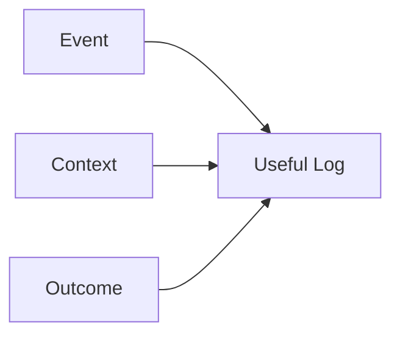
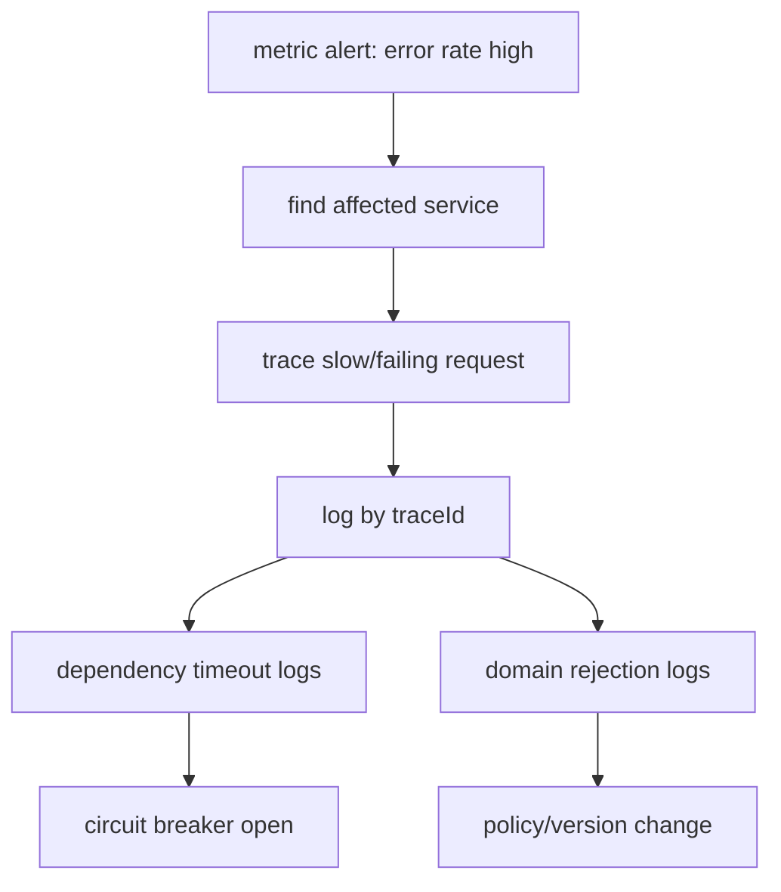

# Part 022 — Logging Mental Model

> Target part ini: kamu mampu melihat log bukan sebagai `println` versi enterprise, tetapi sebagai **evidence stream** yang membantu sistem, manusia, dan mesin menjawab “apa yang terjadi, pada siapa, kapan, kenapa, seberapa parah, dan apa konsekuensinya?”.

Logging sering diajarkan terlalu dangkal: pilih framework, pakai `logger.info`, jangan log password. Untuk engineer senior, itu belum cukup. Di production, log adalah bagian dari reliability architecture.

Log yang baik bisa mempercepat incident response. Log yang buruk bisa memperlambat debugging, membocorkan data, menaikkan biaya observability, menyebabkan alert fatigue, bahkan menutupi akar masalah karena noise.

Part ini membangun mental model logging sebelum kita masuk ke Part 023 tentang structured logging dengan SLF4J/Logback/Log4j.

---

## 1. Logging Bukan Output, Logging adalah Evidence

Definisi operasional:

```text
A log is a timestamped event record emitted by software to preserve evidence about a meaningful runtime occurrence.
```

Log yang baik menjawab:

- event apa yang terjadi;
- entity mana yang terdampak;
- request/command/message mana yang menjadi konteks;
- keputusan apa yang diambil sistem;
- dependency mana yang terlibat;
- outcome-nya apa;
- apakah user/client perlu retry;
- apakah operator perlu bertindak;
- bagaimana menghubungkan log ini ke metric dan trace.

Log yang buruk hanya berkata:

```text
Error occurred
Something went wrong
Failed
Exception
```

Tanpa konteks, log seperti itu hampir tidak bernilai.

---

## 2. Mental Model: Event, Context, Outcome

Setiap log penting minimal punya tiga elemen:



| Elemen | Pertanyaan | Contoh |
|---|---|---|
| Event | Apa yang terjadi? | `case.escalation.rejected` |
| Context | Dalam operasi/entity mana? | `caseId`, `tenantId`, `correlationId` |
| Outcome | Akibatnya apa? | rejected, retryable, ignored, completed |

Contoh buruk:

```java
log.warn("Validation failed");
```

Contoh lebih baik:

```java
log.warn("case.escalation.rejected caseId={} tenantId={} rule={} reasonCode={}",
        caseId, tenantId, "SUPERVISOR_REQUIRED", "MISSING_APPROVAL");
```

Contoh structured style yang lebih baik lagi akan dibahas detail di Part 023:

```java
log.atWarn()
   .setMessage("case.escalation.rejected")
   .addKeyValue("caseId", caseId)
   .addKeyValue("tenantId", tenantId)
   .addKeyValue("rule", "SUPERVISOR_REQUIRED")
   .addKeyValue("reasonCode", "MISSING_APPROVAL")
   .log();
```

---

## 3. Apa yang Layak Dilog?

Jangan log semua hal. Log harus dipilih berdasarkan nilai investigasi.

Log jika event:

- mengubah state penting;
- menolak command/user action;
- memanggil dependency penting;
- menerima response dependency yang abnormal;
- melakukan retry/fallback/degradation;
- masuk/keluar lifecycle penting;
- menyebabkan security/audit consequence;
- menghasilkan unknown outcome;
- menandai boundary antar sistem;
- membantu menjelaskan metric atau trace abnormal.

Jangan log jika event:

- sangat sering dan tidak actionable;
- sudah terekam sebagai metric dengan cukup;
- hanya noise debugging sementara;
- mengandung data sensitif tanpa redaction;
- tidak punya konteks;
- membuat high-cardinality explosion;
- menyalin payload besar tanpa alasan.

Rule praktis:

```text
Log decisions and outcomes, not every line of execution.
```

---

## 4. Level Log: Semantics, Bukan Selera

Level log harus punya makna operasional. Jangan pilih level karena “terlihat cocok”.

| Level | Makna produksi | Contoh |
|---|---|---|
| TRACE | detail sangat granular, biasanya off | parser state, protocol frame internal |
| DEBUG | diagnostic developer, off di production normal | selected branch, calculated policy detail |
| INFO | event normal yang penting secara operasional | service started, command accepted, shutdown completed |
| WARN | abnormal tetapi sistem masih mengontrol outcome | retry scheduled, fallback used, validation rejected at boundary |
| ERROR | operation gagal atau invariant penting rusak | command failed, dependency exhausted, unknown outcome |
| FATAL | process/service tidak bisa lanjut | startup impossible, unrecoverable corruption |

OpenTelemetry logs data model juga membedakan severity text dan severity number, dengan rentang severity yang menormalisasi TRACE, DEBUG, INFO, WARN, ERROR, dan FATAL. Ini penting karena backend observability sering melakukan mapping lintas format.

Anti-pattern:

```java
log.error("User entered invalid email");
```

Ini biasanya bukan `ERROR`. Ini bisa `INFO` atau `WARN` tergantung konteks:

- field validation biasa: mungkin tidak perlu log per request;
- suspicious repeated invalid attempt: `WARN` dengan rate limiting;
- impossible internal state menghasilkan invalid email: `ERROR`.

Level ditentukan oleh **konsekuensi**, bukan jenis exception.

---

## 5. Log dan Error Handling

Exception tidak otomatis harus dilog di semua catch block.

Golden rule:

```text
Log where you handle, translate, or make an operational decision.
Do not log repeatedly while merely propagating.
```

Buruk:

```java
try {
    service.execute(command);
} catch (Exception e) {
    log.error("failed", e);
    throw e;
}
```

Jika layer atas juga log, kamu mendapat duplicate stack trace.

Lebih baik:

```java
try {
    service.execute(command);
} catch (PolicyViolationException e) {
    log.info("command.rejected code={} commandId={} caseId={}",
            e.errorCode(), command.id(), command.caseId());
    throw e;
} catch (DependencyTimeoutException e) {
    log.warn("command.dependency_timeout commandId={} dependency={} retryable={}",
            command.id(), e.dependencyName(), true, e);
    throw e;
}
```

Log saat:

- exception diterjemahkan menjadi response;
- retry/fallback dipilih;
- outcome diubah menjadi rejected/unknown;
- error diserap/diabaikan secara sengaja;
- boundary external dipanggil;
- audit/security consequence terjadi.

Jangan log saat:

- hanya wrap dan rethrow tanpa keputusan;
- exception akan ditangani global handler dengan context lebih lengkap;
- event terlalu sering dan sudah diukur metric.

---

## 6. Log sebagai Boundary Evidence

Boundary adalah titik penting untuk logging:

- HTTP ingress;
- message consumer;
- scheduled job;
- external API client;
- DB transaction boundary;
- command handler;
- workflow/state transition;
- lifecycle start/stop;
- security/authz decision.

Boundary log sebaiknya mengikuti pola:

```text
<domain>.<operation>.<event>
```

Contoh:

```text
case.create.accepted
case.create.completed
case.create.rejected
case.escalation.started
case.escalation.completed
case.escalation.rejected
case.escalation.unknown_outcome
external.identity.lookup.timeout
shutdown.drain.completed
```

Konsistensi nama event jauh lebih penting daripada kalimat indah.

Bad:

```text
Escalating case...
Escalation done!
Cannot escalate this one
```

Good:

```text
case.escalation.started
case.escalation.completed
case.escalation.rejected
```

Format stabil membuat query mudah:

```text
eventName="case.escalation.rejected" AND reasonCode="MISSING_APPROVAL"
```

---

## 7. Context: Correlation, Entity, Actor, Tenant

Log tanpa context tidak bisa dihubungkan.

Minimum context untuk service request:

| Field | Tujuan |
|---|---|
| `traceId` | hubungkan log dengan distributed trace |
| `spanId` | hubungkan log dengan operation spesifik |
| `correlationId` | hubungkan flow bisnis/request lintas boundary |
| `requestId` | identitas request ingress |
| `tenantId` | multi-tenant isolation/debugging |
| `userId`/`actorId` | actor, jika aman dilog |
| `caseId`/domain id | entity utama |
| `operation` | command/use case |
| `errorCode` | machine-readable failure |
| `outcome` | accepted/rejected/completed/retryable/unknown |

Namun context harus aman. Jangan log:

- password;
- token;
- session secret;
- full Authorization header;
- private key;
- OTP;
- raw personal data tanpa kebutuhan legal/operasional;
- full document payload;
- PII yang tidak perlu.

Rule:

```text
Log identifiers and decisions. Avoid logging secrets and raw content.
```

---

## 8. Message Template vs Structured Attributes

Traditional logging sering memakai message template:

```java
log.info("case {} escalated by {}", caseId, userId);
```

Ini bagus untuk manusia, tetapi kurang ideal untuk mesin. Structured logging memisahkan event name dan attributes:

```java
log.atInfo()
   .setMessage("case.escalation.completed")
   .addKeyValue("caseId", caseId)
   .addKeyValue("actorId", actorId)
   .addKeyValue("previousState", previousState)
   .addKeyValue("newState", newState)
   .log();
```

SLF4J 2.x menyediakan fluent logging API, termasuk key-value pairs. Logging backend dapat memanfaatkan key-value ini untuk format JSON atau analisis log.

Mental model:

```text
Message is for humans.
Attributes are for machines.
Event name is for both.
```

---

## 9. Log Granularity

Terlalu sedikit log membuat debugging buta. Terlalu banyak log membuat noise dan biaya tinggi.

Gunakan tier:

### Tier 1 — Always useful operational event

Aktif di production normal.

- service start/stop;
- command accepted/completed/rejected;
- external dependency timeout/fallback;
- state transition penting;
- unknown outcome;
- security denial penting;
- graceful shutdown timeline.

### Tier 2 — Diagnostic event

Aktif saat troubleshooting.

- selected branch;
- retry attempt detail;
- cache decision;
- policy evaluation detail.

### Tier 3 — Deep trace/debug

Aktif sangat selektif.

- payload shape;
- loop details;
- serializer internals;
- protocol frame.

Rule:

```text
Production INFO/WARN/ERROR should explain the system story.
DEBUG/TRACE should explain the implementation story.
```

---

## 10. Logging Cost Model

Log tidak gratis.

Cost dimensions:

| Cost | Contoh |
|---|---|
| CPU | formatting, JSON serialization, stack trace creation |
| allocation | string interpolation, exception stack traces |
| I/O | stdout, file, network agent |
| storage | retention cost |
| indexing | high-cardinality fields mahal |
| query | noisy logs memperlambat investigation |
| security | sensitive data exposure |
| reliability | blocking app thread saat logging sink lambat |

Kesalahan umum:

```java
log.debug("payload=" + expensiveJson(payload));
```

Walaupun DEBUG off, string sudah dibuat.

Lebih baik:

```java
log.debug("payload={}", () -> expensiveJson(payload)); // jika backend/API mendukung supplier
```

Atau guard:

```java
if (log.isDebugEnabled()) {
    log.debug("payload={}", expensiveJson(payload));
}
```

Dengan SLF4J fluent API, supplier dapat dipakai untuk beberapa argumen.

---

## 11. Cardinality Discipline

Cardinality adalah jumlah nilai unik dalam field. Ini sangat penting untuk log indexing dan metrics.

High-cardinality examples:

- `userId`;
- `caseId`;
- `requestId`;
- `traceId`;
- raw URL dengan ID;
- raw exception message berisi value dinamis.

Apakah high-cardinality selalu buruk? Tidak. Untuk logs, high-cardinality sering dibutuhkan untuk investigation. Tetapi jangan gunakan sembarangan sebagai indexed facet mahal atau metric label.

Guideline:

| Field | Log attribute | Metric tag |
|---|---|---|
| `errorCode` | yes | yes |
| `dependency` | yes | yes |
| `tenantTier` | yes | yes if bounded |
| `tenantId` | yes with care | usually no |
| `caseId` | yes | no |
| `traceId` | yes | no |
| raw URL | normalize | no |
| exception message | maybe body | no |

Log field boleh lebih kaya daripada metric tag, tetapi tetap harus dikelola.

---

## 12. Stack Trace: Kapan Perlu?

Stack trace mahal dan noisy, tetapi sangat bernilai untuk unexpected failure.

Log stack trace jika:

- unexpected exception;
- programmer error;
- invariant violation;
- unknown outcome;
- failure butuh code-level diagnosis;
- exception tidak punya error code/domain detail cukup.

Jangan log full stack trace jika:

- validation rejection normal;
- domain rule rejection expected;
- dependency timeout yang sangat sering dan sudah jelas;
- retry attempt biasa;
- client disconnect normal;
- exception sudah dilog di global handler.

Pattern:

```java
// Expected business rejection
log.info("case.escalation.rejected caseId={} code={}", caseId, e.errorCode());

// Abnormal infrastructure issue
log.warn("identity.lookup.timeout dependency={} retryable={} correlationId={}",
        "identity-service", true, correlationId, e);

// Unexpected bug
log.error("case.escalation.failed.unexpected caseId={} correlationId={}",
        caseId, correlationId, e);
```

---

## 13. Log Sampling dan Rate Limiting

Beberapa event bisa meledak saat incident:

- dependency timeout;
- validation spam;
- auth failure attack;
- retry storm;
- consumer poison message;
- circuit breaker open.

Jika semua dilog penuh, log backend bisa overload dan biaya melonjak.

Gunakan:

- sampling;
- rate-limited logging;
- aggregation;
- metric counter untuk frekuensi;
- representative log dengan example IDs;
- alert berbasis metric, bukan log line individu.

Pattern konseptual:

```java
if (rateLimiter.tryAcquire()) {
    log.warn("dependency.timeout.sampled dependency={} errorCode={} suppressedCount={}",
            dependency, errorCode, suppressedSinceLastLog.getAndSet(0));
} else {
    suppressedSinceLastLog.incrementAndGet();
}
```

Jangan sampling event audit/security critical tanpa desain khusus. Untuk compliance-grade audit, gunakan audit store, bukan log sampling biasa.

---

## 14. Log vs Metric vs Trace

Tiga signal menjawab pertanyaan berbeda.

| Signal | Pertanyaan | Contoh |
|---|---|---|
| Logs | Apa yang terjadi pada event tertentu? | command rejected with reason |
| Metrics | Seberapa sering/seberapa lama? | error rate, latency p99 |
| Traces | Di mana waktu habis dan dependency mana terlibat? | span chain request |

Jangan memaksa log menjadi metric.

Buruk:

```text
grep logs to calculate error rate manually
```

Lebih baik:

- metric `case_escalation_rejected_total{reasonCode=...}`;
- log event `case.escalation.rejected` untuk sample detail;
- trace span status/attributes untuk causal chain.

Mental model:

```text
Metrics detect.
Traces localize.
Logs explain.
```

---

## 15. Logging Domain Decisions

Untuk regulatory/case-management system, domain decisions harus punya evidence.

Contoh decision event:

```java
log.atInfo()
   .setMessage("enforcement.action.rejected")
   .addKeyValue("caseId", caseId)
   .addKeyValue("actorId", actorId)
   .addKeyValue("action", "ESCALATE")
   .addKeyValue("currentState", currentState)
   .addKeyValue("requiredState", "SUPERVISOR_REVIEW")
   .addKeyValue("reasonCode", "INVALID_STATE_TRANSITION")
   .addKeyValue("policyVersion", policyVersion)
   .log();
```

Tetapi jangan salah: log bukan audit ledger yang reliable secara hukum jika:

- bisa hilang saat crash;
- sampling aktif;
- retention pendek;
- tidak immutable;
- tidak ada integrity control;
- tidak terhubung ke transaction domain.

Untuk event regulatory-critical, gunakan audit table/event store. Log adalah operational evidence, bukan selalu source of truth.

---

## 16. Logging Security & Privacy

Logging sering menjadi data leak terbesar.

Checklist redaction:

- [ ] Authorization header tidak pernah dilog utuh.
- [ ] Token disimpan hanya sebagai hash/fingerprint jika perlu.
- [ ] Password/secret/private key tidak pernah masuk log.
- [ ] PII dipseudonymize jika tidak perlu raw.
- [ ] Payload besar tidak dilog default.
- [ ] Exception message dari dependency tidak langsung dipercaya.
- [ ] Query string disanitasi.
- [ ] Log access control sesuai sensitivity.
- [ ] Retention sesuai kebijakan data.
- [ ] Debug logging tidak bisa aktif permanen tanpa approval.

Bad:

```java
log.info("login request={}", request);
```

Better:

```java
log.info("login.attempt usernameHash={} tenantId={} outcome={}",
        hash(username), tenantId, outcome);
```

Rule:

```text
If you would not show it in an incident bridge with external participants, think twice before logging it.
```

---

## 17. Logging in Multi-Tenant Systems

Untuk multi-tenant platform, logs harus mendukung isolation.

Fields penting:

- `tenantId` atau tenant alias aman;
- `tenantTier`;
- `region`;
- `dataResidencyRegion` jika relevan;
- `requestOrigin`;
- `actorType`;
- `serviceName`;
- `deploymentEnvironment`.

Namun `tenantId` bisa high-cardinality dan sensitive. Pastikan:

- access log backend dibatasi;
- query tenant tidak membuka data tenant lain;
- retention sesuai kontrak;
- incident export tidak membocorkan tenant lain;
- logs tidak berisi cross-tenant payload.

---

## 18. Logging Lifecycle Events

Setiap service production harus mencatat lifecycle:

```text
app.starting
app.started
app.ready
app.not_ready
app.shutdown.initiated
app.shutdown.draining
app.shutdown.completed
app.shutdown.forced
```

Event startup:

```java
log.atInfo()
   .setMessage("app.started")
   .addKeyValue("service", serviceName)
   .addKeyValue("version", version)
   .addKeyValue("commit", gitCommit)
   .addKeyValue("javaVersion", Runtime.version().toString())
   .addKeyValue("profile", activeProfiles)
   .log();
```

Event shutdown:

```java
log.atInfo()
   .setMessage("app.shutdown.completed")
   .addKeyValue("durationMs", durationMs)
   .addKeyValue("completedWork", completed)
   .addKeyValue("cancelledWork", cancelled)
   .addKeyValue("unknownOutcome", unknown)
   .log();
```

Lifecycle logs sangat berguna saat rollout, autoscaling, dan incident “pod restarted but why?”.

---

## 19. Logging External Dependency Calls

Jangan log setiap dependency call di INFO jika traffic tinggi. Tapi log boundary abnormal dan selected lifecycle.

Untuk dependency error:

```java
log.atWarn()
   .setMessage("external.identity.lookup.timeout")
   .addKeyValue("dependency", "identity-service")
   .addKeyValue("operation", "lookupUser")
   .addKeyValue("timeoutMs", timeoutMs)
   .addKeyValue("retryable", true)
   .addKeyValue("attempt", attempt)
   .addKeyValue("correlationId", correlationId)
   .setCause(e)
   .log();
```

Attributes penting:

- dependency name;
- operation;
- timeout/deadline;
- attempt;
- retryable;
- fallback used;
- circuit breaker state;
- error code/status;
- latency;
- trace context.

Jangan log:

- full response body default;
- raw token/header;
- full URL dengan query sensitive;
- stack trace untuk setiap expected 404.

---

## 20. Logging Validation dan Rejection

Validation error bisa sangat noisy. Jangan log setiap field-level validation di WARN/ERROR.

| Scenario | Logging recommendation |
|---|---|
| user typo normal | no log or DEBUG sample |
| API client sends invalid contract repeatedly | WARN sampled by client/errorCode |
| domain command rejected | INFO with reasonCode |
| impossible internal invalid command | ERROR |
| policy/security rejection | INFO/WARN depending severity |

Contoh:

```java
log.atInfo()
   .setMessage("case.assignment.rejected")
   .addKeyValue("caseId", caseId)
   .addKeyValue("actorId", actorId)
   .addKeyValue("reasonCode", "ASSIGNEE_NOT_AUTHORIZED")
   .addKeyValue("policyVersion", policyVersion)
   .log();
```

Reason code lebih penting daripada kalimat panjang.

---

## 21. Log Schema Design

Untuk sistem besar, gunakan log schema. Jangan biarkan setiap tim menciptakan field sendiri.

Baseline schema:

```json
{
  "timestamp": "2026-06-28T10:15:30.123Z",
  "severity": "INFO",
  "service.name": "case-service",
  "service.version": "1.42.0",
  "deployment.environment": "prod",
  "event.name": "case.escalation.completed",
  "trace_id": "...",
  "span_id": "...",
  "correlation_id": "...",
  "tenant_id": "...",
  "case_id": "...",
  "actor_id": "...",
  "error_code": null,
  "outcome": "completed",
  "message": "case.escalation.completed"
}
```

Naming convention:

| Prefer | Avoid |
|---|---|
| `event.name` | `event`, `msgType`, `type` mixed randomly |
| `correlation_id` | `corr`, `cid`, `correlationId` mixed |
| `error_code` | `err`, `error`, `code` ambiguous |
| `tenant_id` | `customer`, `client`, `org` mixed |
| `duration_ms` | `time`, `latency`, `elapsed` mixed |

Jika menggunakan OpenTelemetry, align dengan semantic conventions dan log data model sebisa mungkin.

---

## 22. Logs as Investigation Graph

Incident investigation bukan membaca log satu per satu. Kita membangun causal graph.



Agar graph ini bisa dibangun, log harus punya join keys:

- `traceId`;
- `correlationId`;
- `requestId`;
- `messageId`;
- `caseId`;
- `errorCode`;
- `dependency`;
- `operation`.

Tanpa join key, log hanya teks terpisah.

---

## 23. Common Logging Anti-Patterns

| Anti-pattern | Kenapa buruk | Alternatif |
|---|---|---|
| `log.info("here")` | tidak ada evidence | event name + context |
| log full payload default | privacy/cost | selective safe fields |
| log and rethrow everywhere | duplicate stack trace | log at decision boundary |
| invalid user input as ERROR | false alarm | INFO/WARN sesuai consequence |
| no correlation ID | tidak bisa trace | propagate context |
| dynamic event messages | susah query | stable event name |
| metric via logs only | slow/noisy | emit metrics |
| high-cardinality metric tag copied from log | backend explosion | bounded tags |
| stack trace for expected rejection | noise | code + reason |
| swallowing exception with debug log | hidden failure | explicit outcome |
| log secrets accidentally through `toString()` | data leak | safe DTO/redaction |

---

## 24. Baeldung-Style Example: From Bad to Production-Grade

### 24.1 Bad Version

```java
public void escalate(String caseId) {
    try {
        service.escalate(caseId);
        log.info("done");
    } catch (Exception e) {
        log.error("failed", e);
        throw e;
    }
}
```

Problems:

- event name tidak jelas;
- tidak ada tenant/correlation/actor;
- semua failure jadi ERROR;
- expected rejection dan bug dicampur;
- tidak ada reason code;
- tidak ada outcome.

### 24.2 Better Version

```java
public void escalate(EscalateCaseCommand command) {
    try {
        service.escalate(command);
        log.atInfo()
           .setMessage("case.escalation.completed")
           .addKeyValue("caseId", command.caseId())
           .addKeyValue("tenantId", command.tenantId())
           .addKeyValue("actorId", command.actorId())
           .addKeyValue("correlationId", command.correlationId())
           .addKeyValue("outcome", "completed")
           .log();
    } catch (DomainRejectionException e) {
        log.atInfo()
           .setMessage("case.escalation.rejected")
           .addKeyValue("caseId", command.caseId())
           .addKeyValue("tenantId", command.tenantId())
           .addKeyValue("actorId", command.actorId())
           .addKeyValue("correlationId", command.correlationId())
           .addKeyValue("errorCode", e.errorCode())
           .addKeyValue("outcome", "rejected")
           .log();
        throw e;
    } catch (DependencyTimeoutException e) {
        log.atWarn()
           .setMessage("case.escalation.dependency_timeout")
           .addKeyValue("caseId", command.caseId())
           .addKeyValue("tenantId", command.tenantId())
           .addKeyValue("correlationId", command.correlationId())
           .addKeyValue("dependency", e.dependencyName())
           .addKeyValue("retryable", true)
           .addKeyValue("outcome", "retryable_failure")
           .setCause(e)
           .log();
        throw e;
    } catch (Exception e) {
        log.atError()
           .setMessage("case.escalation.failed_unexpected")
           .addKeyValue("caseId", command.caseId())
           .addKeyValue("tenantId", command.tenantId())
           .addKeyValue("correlationId", command.correlationId())
           .addKeyValue("outcome", "failed")
           .setCause(e)
           .log();
        throw e;
    }
}
```

Ini belum sempurna, tetapi jauh lebih investigable.

---

## 25. Production Checklist

Sebelum logging dianggap mature:

- [ ] Setiap log penting punya stable event name.
- [ ] Error log punya error code atau exception cause yang jelas.
- [ ] Domain rejection tidak selalu ERROR.
- [ ] Expected vs unexpected failure dibedakan.
- [ ] Boundary logs punya correlation/trace context.
- [ ] Sensitive data direduksi/redacted.
- [ ] Log schema konsisten lintas service.
- [ ] High-cardinality fields dikelola.
- [ ] Stack trace hanya untuk kasus yang butuh.
- [ ] Duplicate logging dihindari.
- [ ] Retry/fallback/degradation punya log event.
- [ ] Shutdown lifecycle punya log timeline.
- [ ] Logs bisa dikaitkan dengan metrics dan traces.
- [ ] Retention dan access control jelas.
- [ ] Sampling/rate limit ada untuk event bising.

---

## 26. Latihan 20 Jam ala Kaufman

### Jam 1–3: Log Inventory

Ambil satu service. Klasifikasikan semua log:

- event penting;
- noise;
- duplicate;
- sensitive risk;
- missing context.

### Jam 4–6: Event Naming

Ubah log text bebas menjadi stable event names:

```text
<domain>.<operation>.<outcome>
```

### Jam 7–9: Context Enrichment

Tambahkan:

- `correlationId`;
- `tenantId`;
- domain entity id;
- `errorCode`;
- `outcome`.

### Jam 10–12: Level Correction

Audit semua WARN/ERROR. Turunkan expected rejection dari ERROR. Naikkan invariant violation ke ERROR.

### Jam 13–15: Redaction

Cari log payload/header/request. Hilangkan secret dan data sensitif.

### Jam 16–18: Incident Query Drill

Simulasikan incident:

```text
case escalation error rate naik 5x setelah deployment
```

Jawab dengan query log:

- affected version;
- affected tenant;
- dominant error code;
- dependency involved;
- sample trace ID.

### Jam 19–20: Logging Policy Document

Tulis mini policy untuk tim:

- event naming;
- required fields;
- level semantics;
- sensitive data;
- stack trace policy;
- sampling policy.

---

## 27. Summary

Logging matang bukan soal banyak log. Logging matang adalah kemampuan membuat runtime system meninggalkan evidence yang cukup, aman, hemat, dan bisa dikorelasikan.

Prinsip utama:

1. Log adalah evidence stream.
2. Log decisions and outcomes, not every implementation step.
3. Stable event name lebih berguna daripada kalimat bebas.
4. Level log harus berdasarkan konsekuensi operasional.
5. Context membuat log bisa dihubungkan.
6. Stack trace hanya bernilai jika digunakan pada tempat yang tepat.
7. Logs, metrics, dan traces saling melengkapi.
8. Privacy dan cost adalah bagian dari desain logging, bukan urusan belakangan.
9. Untuk audit regulatory-critical, log bukan pengganti durable audit store.

Part berikutnya akan masuk ke implementasi teknis: **structured logging dengan SLF4J, Logback, Log4j, MDC, JSON layout, dan log correlation**.

---

## References

- SLF4J Manual — Fluent Logging API and Key-Value Pairs: https://www.slf4j.org/manual.html
- OpenTelemetry Specification — Logs Data Model: https://opentelemetry.io/docs/specs/otel/logs/data-model/
- OpenTelemetry Specification — Logs: https://opentelemetry.io/docs/specs/otel/logs/
- Spring Boot Reference — Logging: https://docs.spring.io/spring-boot/reference/features/logging.html
