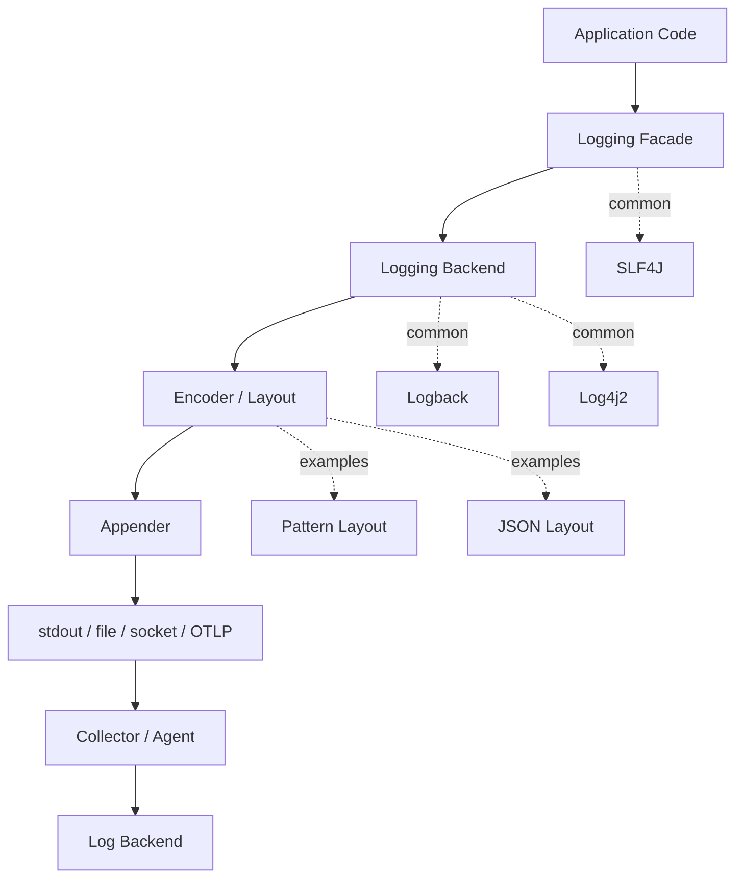
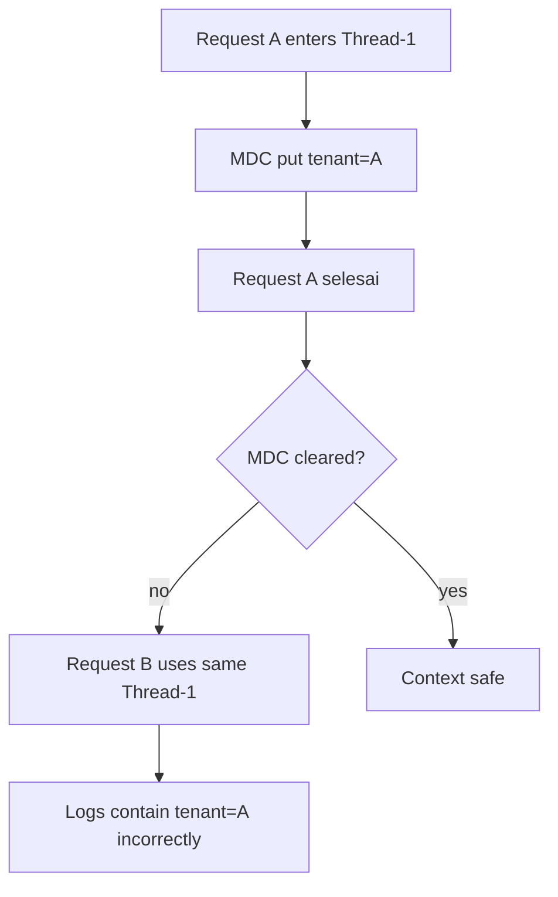
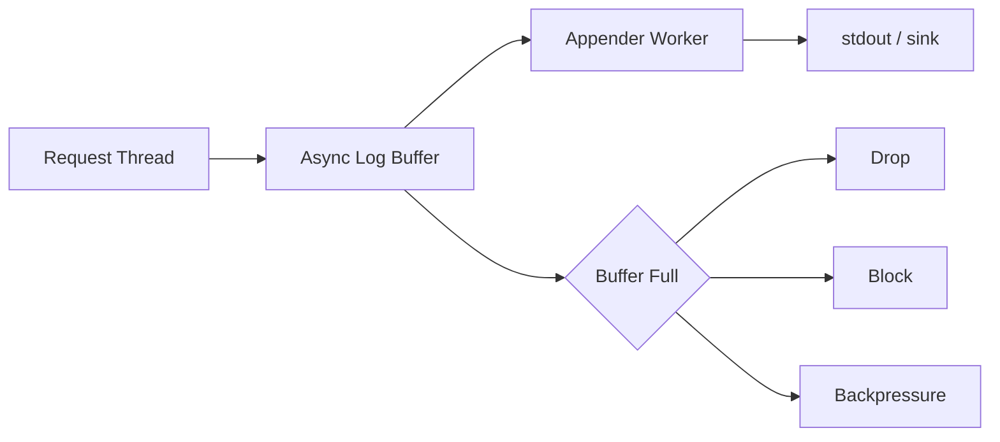
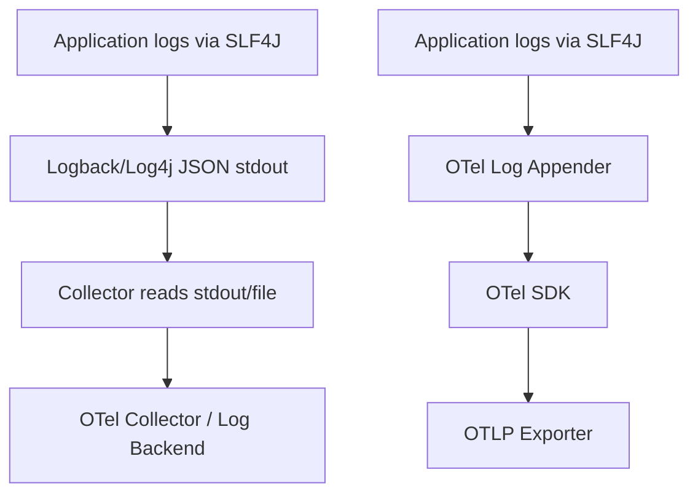

# Part 023 — Structured Logging with SLF4J, Logback, and Log4j

> Target part ini: kamu mampu mendesain logging Java yang **machine-readable, queryable, korelatif, aman, murah, dan konsisten** lintas service. Fokusnya bukan sekadar “ubah log jadi JSON”, melainkan membuat log menjadi event telemetry yang bisa dipakai saat incident, audit, debugging, SLO analysis, dan support.

Di Part 022 kita membangun mental model logging: log adalah evidence stream. Sekarang kita masuk ke implementasi Java: SLF4J sebagai facade, Logback atau Log4j2 sebagai backend, structured key-value logging, MDC/ThreadContext, JSON layout, log schema, dan guardrail produksi.

Structured logging bukan kosmetik. JSON log yang field-nya buruk tetap buruk. Log yang field-nya stabil, punya correlation, punya error semantics, dan konsisten dengan metric/trace bisa menjadi salah satu sumber bukti paling kuat di production.

---

## 1. Skill Deconstruction Berdasarkan Kaufman

Untuk menguasai structured logging, pecah skill menjadi beberapa sub-skill:

| Sub-skill | Yang Harus Bisa | Output Nyata |
|---|---|---|
| Event design | Menentukan event name, outcome, actor, entity, operation | Log event konsisten |
| Field design | Memilih key yang stabil dan queryable | Log schema |
| Framework usage | SLF4J fluent API, Logback encoder, Log4j2 layout | Konfigurasi runtime |
| Context propagation | MDC/ThreadContext, request context, trace context | Correlated logs |
| Error logging | Cause chain, stack trace, safe message, error code | Diagnosable failure |
| Cost control | Level, sampling, cardinality, payload size | Log tidak meledak biaya |
| Security/privacy | Redaction, safe fields, no secrets | Compliance-safe log |
| Operational usage | Query patterns, dashboards, incident reconstruction | Faster debugging |

Kaufman-style learning target:

```text
Dalam 20 jam latihan, kamu harus bisa mengambil service Java biasa,
mengubah logging-nya menjadi structured evidence stream,
dan membuktikan bahwa satu failed request bisa ditelusuri lewat log, metric, dan trace.
```

---

## 2. Logging Stack Mental Model

Java logging stack sering membingungkan karena ada banyak nama: JUL, Commons Logging, SLF4J, Logback, Log4j, bridges, appenders, layouts, encoders.

Model sederhananya:



Prinsip desain:

- application code sebaiknya bergantung ke **SLF4J API**, bukan langsung ke Logback/Log4j2;
- backend dipilih di runtime/dependency layer;
- structured output harus ditentukan di encoder/layout;
- collector/log backend bukan tempat memperbaiki log yang tidak punya semantic field;
- jangan mencampur banyak backend tanpa sengaja;
- jangan membiarkan library membawa binding logging yang konflik.

---

## 3. Structured Logging: Definisi Operasional

Structured logging adalah praktik memancarkan log sebagai event dengan field bernama, bukan string bebas.

Unstructured:

```text
Order 123 failed for user 456 because payment timeout
```

Structured:

```json
{
  "timestamp": "2026-06-28T15:10:12.120Z",
  "level": "WARN",
  "event": "payment.authorization.failed",
  "orderId": "ord_123",
  "userId": "usr_456",
  "dependency": "payment-gateway",
  "errorCode": "PAYMENT_TIMEOUT",
  "retryable": true,
  "durationMs": 1500,
  "traceId": "...",
  "spanId": "..."
}
```

Perbedaan utamanya:

| Aspek | String Log | Structured Log |
|---|---|---|
| Query | regex fragile | field query |
| Aggregasi | sulit | mudah |
| Correlation | manual | trace/request fields |
| Schema | implisit | eksplisit |
| Machine processing | mahal | natural |
| Audit | lemah | bisa defensible |

Structured logging tidak berarti semua field harus selalu ada. Namun field yang ada harus stabil dan punya arti yang jelas.

---

## 4. SLF4J sebagai Facade

SLF4J adalah facade logging. Artinya, application code memanggil API SLF4J, lalu binding/backend menangani output aktual.

Pattern dasar:

```java
import org.slf4j.Logger;
import org.slf4j.LoggerFactory;

class CaseEscalationService {
    private static final Logger log = LoggerFactory.getLogger(CaseEscalationService.class);

    void escalate(String caseId) {
        log.info("case escalation requested: caseId={}", caseId);
    }
}
```

Untuk logging lama, placeholder `{}` masih berguna. Namun untuk structured logging modern, SLF4J 2.x fluent API lebih cocok karena mendukung key-value pair.

```java
log.atInfo()
   .setMessage("case escalation requested")
   .addKeyValue("event", "case.escalation.requested")
   .addKeyValue("caseId", caseId)
   .addKeyValue("tenantId", tenantId)
   .addKeyValue("actorId", actorId)
   .log();
```

Keunggulan fluent key-value:

- field tidak perlu diparse dari message;
- message tetap human-readable;
- key-value bisa diambil encoder/layout;
- event semantic lebih stabil;
- lebih mudah konsisten lintas service.

Rule penting:

```text
Message is for humans. Key-value fields are for machines.
```

Jangan taruh data penting hanya di message.

---

## 5. Canonical Event Shape

Untuk seri ini, gunakan canonical log event shape berikut sebagai baseline:

```json
{
  "timestamp": "...",
  "level": "INFO|WARN|ERROR",
  "logger": "...",
  "thread": "...",
  "service.name": "case-service",
  "service.version": "1.4.2",
  "environment": "prod",
  "event": "case.escalation.rejected",
  "operation": "case.escalate",
  "outcome": "rejected",
  "reason": "state_conflict",
  "error.code": "CASE_NOT_ESCALATABLE",
  "trace_id": "...",
  "span_id": "...",
  "correlationId": "...",
  "tenantId": "...",
  "caseId": "...",
  "actorId": "...",
  "durationMs": 42,
  "message": "case escalation rejected"
}
```

Minimal fields untuk production:

| Field | Fungsi |
|---|---|
| `timestamp` | ordering temporal |
| `level` | severity filter |
| `service.name` | source system |
| `event` | stable event name |
| `operation` | use-case/action |
| `outcome` | result: success, rejected, failed, ignored |
| `trace_id`/`span_id` | trace correlation |
| `correlationId` | business/request correlation |
| domain ID | entity affected |
| `error.code` | machine-readable failure |
| `durationMs` | latency evidence |

Untuk sistem enforcement/regulatory, tambahkan field seperti:

- `caseId`;
- `workflowInstanceId`;
- `decisionId`;
- `ruleId`;
- `policyVersion`;
- `actorRole`;
- `jurisdiction`;
- `evidenceId`;
- `auditEventId`.

Namun jangan masukkan PII mentah tanpa kebijakan eksplisit.

---

## 6. Event Naming Convention

Event name harus stabil, queryable, dan domain-oriented.

Gunakan format:

```text
<noun-domain>.<subdomain>.<action>.<outcome?>
```

Contoh:

```text
case.escalation.requested
case.escalation.accepted
case.escalation.rejected
case.assignment.failed
payment.authorization.timeout
identity.token.validation.failed
message.consumer.retry.scheduled
```

Hindari:

```text
error
failed
exception
process
service log
something went wrong
```

Event name bukan kalimat. Event name adalah identifier stabil.

| Buruk | Lebih Baik |
|---|---|
| `failed` | `case.escalation.rejected` |
| `db error` | `case.repository.save.failed` |
| `timeout` | `payment.gateway.authorization.timeout` |
| `validation` | `case.submission.validation.failed` |

---

## 7. Field Naming Convention

Konsistensi field lebih penting daripada preferensi individual.

Pilih satu style dan gunakan lintas service:

| Style | Contoh | Catatan |
|---|---|---|
| camelCase | `caseId`, `tenantId` | umum di Java/domain |
| dot notation | `service.name`, `error.code` | umum di telemetry schema |
| snake_case | `trace_id`, `span_id` | umum di OpenTelemetry/log backends |

Dalam praktik, kamu mungkin akan memakai campuran karena standar external memakai dot/snake. Yang penting: jangan punya tiga nama untuk konsep yang sama.

Buruk:

```text
traceId
trace_id
traceID
xTraceId
otelTraceId
```

Pilih canonical mapping:

```text
trace_id      -> tracing identifier
span_id       -> span identifier
correlationId -> business/request correlation
caseId        -> domain aggregate identifier
error.code    -> stable application error code
```

---

## 8. Log Level Semantics untuk Structured Logging

Level bukan dekorasi. Level adalah routing signal.

| Level | Makna Produksi | Contoh |
|---|---|---|
| TRACE | sangat detail, local/debug only | payload parser step |
| DEBUG | diagnostic detail non-prod atau sampled prod | cache lookup detail |
| INFO | business/operational milestone normal | case accepted |
| WARN | degraded/rejected/retryable/attention-worthy | dependency timeout recovered |
| ERROR | operation gagal dan butuh investigasi/alert candidate | irreversible failure |

Rule praktis:

```text
ERROR means the system failed to complete an operation it was responsible for.
WARN means something abnormal happened, but the system still handled it or produced an expected rejection/degradation.
INFO means normal but meaningful lifecycle event.
DEBUG/TRACE should not be needed for routine production forensics.
```

Jangan log domain rejection sebagai ERROR jika itu expected business outcome.

Contoh salah:

```java
log.error("Case cannot be escalated");
```

Lebih tepat:

```java
log.atInfo()
   .setMessage("case escalation rejected")
   .addKeyValue("event", "case.escalation.rejected")
   .addKeyValue("outcome", "rejected")
   .addKeyValue("reason", "state_conflict")
   .addKeyValue("error.code", "CASE_NOT_ESCALATABLE")
   .addKeyValue("caseId", caseId)
   .log();
```

Jika rejection rate tiba-tiba naik, metric/alert yang mendeteksi, bukan level ERROR palsu.

---

## 9. SLF4J Fluent API Pattern

Gunakan helper kecil agar event shape konsisten.

```java
public final class LogFields {
    public static final String EVENT = "event";
    public static final String OPERATION = "operation";
    public static final String OUTCOME = "outcome";
    public static final String ERROR_CODE = "error.code";
    public static final String RETRYABLE = "retryable";
    public static final String CASE_ID = "caseId";
    public static final String TENANT_ID = "tenantId";

    private LogFields() {}
}
```

Contoh penggunaan:

```java
log.atWarn()
   .setMessage("dependency call failed but fallback succeeded")
   .addKeyValue(LogFields.EVENT, "dependency.call.degraded")
   .addKeyValue(LogFields.OPERATION, "risk.score.lookup")
   .addKeyValue(LogFields.OUTCOME, "degraded")
   .addKeyValue("dependency", "risk-service")
   .addKeyValue(LogFields.RETRYABLE, true)
   .addKeyValue("fallback", "cached_score")
   .addKeyValue("durationMs", duration.toMillis())
   .log();
```

Untuk error:

```java
try {
    gateway.authorize(command);
} catch (PaymentGatewayTimeoutException ex) {
    log.atWarn()
       .setMessage("payment authorization timed out")
       .addKeyValue("event", "payment.authorization.timeout")
       .addKeyValue("operation", "payment.authorize")
       .addKeyValue("outcome", "failed")
       .addKeyValue("dependency", "payment-gateway")
       .addKeyValue("error.code", "PAYMENT_GATEWAY_TIMEOUT")
       .addKeyValue("retryable", true)
       .addKeyValue("orderId", command.orderId())
       .setCause(ex)
       .log();

    throw ex;
}
```

Catatan penting:

- gunakan `setCause(ex)` atau overload logger yang benar agar stack trace tidak hilang;
- jangan stringify exception sendiri;
- jangan menaruh exception message dari dependency ke field client-facing tanpa sanitasi;
- jangan log stack trace berkali-kali di tiap layer.

---

## 10. Logback Structured Output

Logback umum dipakai sebagai backend default di banyak aplikasi Spring Boot.

Konfigurasi sederhana dengan pattern masih bisa memasukkan MDC:

```xml
<configuration>
  <appender name="CONSOLE" class="ch.qos.logback.core.ConsoleAppender">
    <encoder>
      <pattern>%d{yyyy-MM-dd'T'HH:mm:ss.SSSXXX} %-5level [%thread] %logger{36} trace_id=%X{trace_id} span_id=%X{span_id} correlationId=%X{correlationId} - %msg%n</pattern>
    </encoder>
  </appender>

  <root level="INFO">
    <appender-ref ref="CONSOLE" />
  </root>
</configuration>
```

Namun untuk structured logging, prefer JSON encoder/layout jika log backend mendukung ingestion JSON.

Contoh dengan Logback `JsonEncoder`:

```xml
<configuration>
  <appender name="JSON_CONSOLE" class="ch.qos.logback.core.ConsoleAppender">
    <encoder class="ch.qos.logback.classic.encoder.JsonEncoder" />
  </appender>

  <root level="INFO">
    <appender-ref ref="JSON_CONSOLE" />
  </root>
</configuration>
```

Dalam banyak production stack, tim memakai encoder seperti `logstash-logback-encoder` karena field customization lebih luas. Prinsipnya tetap sama: jadikan field terstruktur, bukan parsing message.

Contoh konseptual:

```xml
<configuration>
  <appender name="JSON" class="ch.qos.logback.core.ConsoleAppender">
    <encoder class="net.logstash.logback.encoder.LogstashEncoder">
      <customFields>{"service.name":"case-service","environment":"prod"}</customFields>
    </encoder>
  </appender>

  <root level="INFO">
    <appender-ref ref="JSON" />
  </root>
</configuration>
```

Checklist Logback:

- output ke stdout untuk container;
- gunakan JSON di production jika log aggregator siap;
- gunakan human-readable pattern untuk local dev jika perlu;
- pastikan `trace_id`, `span_id`, `correlationId`, dan domain IDs muncul sebagai field;
- jangan membuat appender sinkron berat di request thread;
- jangan menulis file lokal di container kecuali platform memang mengharuskan;
- pastikan rolling policy tidak menjadi bottleneck jika file logging dipakai.

---

## 11. Log4j2 Structured Output

Log4j2 menyediakan `ThreadContext` untuk context map/stack dan berbagai layout termasuk JSON-oriented layout.

Pattern dengan ThreadContext:

```xml
<Configuration status="WARN">
  <Appenders>
    <Console name="Console" target="SYSTEM_OUT">
      <PatternLayout pattern="%d %-5p [%t] %c trace_id=%X{trace_id} span_id=%X{span_id} correlationId=%X{correlationId} - %m%n" />
    </Console>
  </Appenders>
  <Loggers>
    <Root level="info">
      <AppenderRef ref="Console" />
    </Root>
  </Loggers>
</Configuration>
```

JSON Template Layout memberikan kontrol struktur JSON:

```xml
<Configuration status="WARN">
  <Appenders>
    <Console name="Console" target="SYSTEM_OUT">
      <JsonTemplateLayout eventTemplateUri="classpath:LogstashJsonEventLayoutV1.json" />
    </Console>
  </Appenders>
  <Loggers>
    <Root level="info">
      <AppenderRef ref="Console" />
    </Root>
  </Loggers>
</Configuration>
```

Contoh ThreadContext:

```java
import org.apache.logging.log4j.ThreadContext;

try {
    ThreadContext.put("correlationId", correlationId);
    ThreadContext.put("tenantId", tenantId);
    service.handle(command);
} finally {
    ThreadContext.clearMap();
}
```

Jika memakai SLF4J API di application code dan Log4j2 sebagai backend, tetap pahami bahwa MDC SLF4J akan dipetakan ke context mekanisme backend.

---

## 12. MDC dan ThreadContext: Kuat tapi Berbahaya

MDC/ThreadContext menyimpan contextual field per thread.

Contoh SLF4J MDC:

```java
import org.slf4j.MDC;

public void handle(HttpServletRequest request) {
    try {
        MDC.put("correlationId", getOrCreateCorrelationId(request));
        MDC.put("tenantId", resolveTenant(request));
        MDC.put("requestPath", request.getRequestURI());

        chain.doFilter(request, response);
    } finally {
        MDC.clear();
    }
}
```

MDC cocok untuk:

- `correlationId`;
- `trace_id` dan `span_id` jika diisi otomatis/manual;
- `tenantId`;
- `requestId`;
- `operation`;
- low-cardinality routing context.

MDC tidak cocok untuk:

- seluruh payload request;
- daftar item batch besar;
- token/secret;
- mutable business state yang berubah-ubah;
- field cardinality tinggi yang tidak perlu muncul di semua log.

Hazard utama:



Selalu clear context di `finally`.

Untuk temporary field, gunakan closeable scope:

```java
try (MDC.MDCCloseable ignored = MDC.putCloseable("caseId", caseId)) {
    log.info("case processing started");
    process(caseId);
}
```

Jika backend/API tidak menyediakan closeable helper, buat abstraction sendiri.

---

## 13. Structured Logging di Boundary

Logging harus dilakukan di boundary yang tepat. Jangan log hal yang sama di semua layer.

| Boundary | Event yang Perlu Dilog |
|---|---|
| HTTP ingress | request accepted/completed/failed, sanitized |
| Command handler | domain command outcome |
| External dependency client | dependency failed/degraded |
| Message consumer | consumed/processed/retried/dead-lettered |
| Batch job | job started/completed/partial failed |
| Scheduler | trigger skipped/acquired/executed |
| Shutdown | intake stopped/drain completed/forced cancellation |
| Security/policy | access denied/policy rejected, without secret leakage |

Contoh HTTP boundary:

```java
log.atInfo()
   .setMessage("http request completed")
   .addKeyValue("event", "http.server.request.completed")
   .addKeyValue("method", request.getMethod())
   .addKeyValue("route", routePattern)
   .addKeyValue("status", response.getStatus())
   .addKeyValue("durationMs", durationMs)
   .addKeyValue("outcome", response.getStatus() >= 500 ? "failed" : "completed")
   .log();
```

Gunakan `route` template, bukan raw path jika path mengandung ID:

```text
GOOD: /cases/{caseId}/escalations
BAD : /cases/CASE-2026-00000001/escalations
```

Ini mengurangi cardinality dan risiko data leakage.

---

## 14. Error Logging Policy

Error logging paling sering rusak karena dua ekstrem:

1. exception ditelan tanpa log;
2. exception dilog berkali-kali di setiap layer.

Gunakan policy:

```text
Log an exception once at the boundary that owns the outcome.
Lower layers may add context by wrapping exception, not by logging repeatedly.
```

Contoh lower layer:

```java
try {
    jdbcTemplate.update(sql, params);
} catch (DataAccessException ex) {
    throw new CasePersistenceException(
        "Failed to persist case state",
        ErrorCode.CASE_PERSISTENCE_FAILED,
        ex
    );
}
```

Boundary layer:

```java
catch (CasePersistenceException ex) {
    log.atError()
       .setMessage("case command failed")
       .addKeyValue("event", "case.command.failed")
       .addKeyValue("operation", "case.submit")
       .addKeyValue("outcome", "failed")
       .addKeyValue("error.code", ex.errorCode().name())
       .addKeyValue("retryable", ex.retryable())
       .addKeyValue("caseId", command.caseId())
       .setCause(ex)
       .log();

    throw ex;
}
```

Perhatikan:

- lower layer tidak log stack trace;
- boundary log punya domain context;
- cause chain tetap dipertahankan;
- error code muncul sebagai field;
- retryability terlihat.

---

## 15. Stack Trace Policy

Stack trace mahal secara ukuran dan noise. Namun stack trace sangat bernilai untuk unexpected failure.

Policy yang masuk akal:

| Failure | Stack Trace? | Level |
|---|---:|---|
| Expected validation rejection | Tidak | INFO/WARN |
| Domain rejection normal | Tidak | INFO |
| Dependency timeout recovered by fallback | Opsional/sampled | WARN |
| Unexpected runtime exception | Ya | ERROR |
| Startup failure | Ya | ERROR |
| Shutdown cancellation expected | Tidak, kecuali forced | INFO/WARN |
| Security denial normal | Tidak | WARN/INFO sesuai policy |

Jangan lakukan:

```java
log.error("Failed: " + ex.getMessage()); // stack trace hilang
```

Gunakan:

```java
log.error("case command failed", ex);
```

Atau fluent:

```java
log.atError()
   .setMessage("case command failed")
   .addKeyValue("event", "case.command.failed")
   .addKeyValue("error.code", "CASE_COMMAND_FAILED")
   .setCause(ex)
   .log();
```

Jika exception message mengandung secret dari dependency, jangan jadikan message langsung sebagai public field. Simpan di stack trace internal hanya jika log sink aman, atau sanitize.

---

## 16. Log Schema Registry

Service besar membutuhkan registry field dan event, bukan kebebasan ad hoc.

Contoh registry minimal:

```yaml
fields:
  event:
    type: string
    required: true
    description: Stable event name.
  operation:
    type: string
    required: recommended
    description: Application operation or use-case.
  outcome:
    type: enum
    values: [accepted, completed, rejected, failed, degraded, ignored, retried]
  error.code:
    type: string
    description: Stable application error code.
  retryable:
    type: boolean
  trace_id:
    type: string
  span_id:
    type: string
  correlationId:
    type: string
  tenantId:
    type: string
    classification: internal
  caseId:
    type: string
    classification: domain-id
```

Event registry:

```yaml
events:
  case.escalation.requested:
    level: INFO
    owner: case-platform
    requiredFields: [event, operation, outcome, caseId, tenantId, actorId]
  case.escalation.rejected:
    level: INFO
    owner: case-platform
    requiredFields: [event, operation, outcome, reason, error.code, caseId]
  dependency.call.degraded:
    level: WARN
    owner: platform
    requiredFields: [event, dependency, fallback, durationMs, retryable]
```

Manfaat registry:

- query lintas service konsisten;
- dashboard bisa reusable;
- log contract bisa dites;
- onboarding engineer lebih cepat;
- audit tidak tergantung interpretasi bebas.

---

## 17. Privacy dan Redaction

Structured logs membuat leakage lebih mudah dicari, tetapi juga lebih mudah terjadi secara sistematis jika salah field.

Larangan umum:

- password;
- token;
- session cookie;
- authorization header;
- private key;
- full personal identity data;
- raw document content;
- unrestricted request/response body;
- full card/account number;
- biometric data;
- secret config.

Gunakan klasifikasi field:

| Classification | Contoh | Boleh Log? |
|---|---|---|
| public operational | service, route, status | Ya |
| internal operational | host, pod, version | Ya |
| domain identifier | caseId, orderId | Ya, sesuai policy |
| pseudonymous user ID | userId hash | Biasanya ya |
| direct PII | email, phone, address | Sangat dibatasi |
| secret | token, password | Tidak |
| payload | request body | Tidak secara default |

Buat helper redaction:

```java
public final class SafeLogValue {
    public static String token(String ignored) {
        return "<redacted>";
    }

    public static String last4(String value) {
        if (value == null || value.length() < 4) return "<redacted>";
        return "***" + value.substring(value.length() - 4);
    }

    public static String bounded(String value, int max) {
        if (value == null) return null;
        return value.length() <= max ? value : value.substring(0, max) + "...";
    }
}
```

Jangan mengandalkan manusia mengingat redaction. Jadikan redaction bagian dari API logging atau DTO safe-to-log.

---

## 18. Cardinality dan Cost Control

Structured logging membuat banyak field bisa di-index. Itu bisa mahal.

High-cardinality field:

- `userId`;
- `caseId`;
- `requestId`;
- `trace_id`;
- raw URL;
- exception message;
- free-text reason;
- payload hash jika terlalu unik.

High-cardinality bukan berarti dilarang. Tapi harus tahu field mana yang di-index, disimpan, atau hanya searchable raw.

Rule:

```text
Use high-cardinality fields for targeted investigation, not for broad aggregation dashboards.
```

Untuk aggregation, gunakan low-cardinality fields:

- `event`;
- `operation`;
- `outcome`;
- `error.code`;
- `dependency`;
- `route` template;
- `status` bucket;
- `environment`;
- `service.name`.

Anti-pattern:

```java
.addKeyValue("error.message", ex.getMessage()) // can explode cardinality
.addKeyValue("rawPath", request.getRequestURI()) // contains IDs
.addKeyValue("query", request.getQueryString()) // may leak data
```

Lebih aman:

```java
.addKeyValue("error.code", errorCode)
.addKeyValue("route", routePattern)
.addKeyValue("status", status)
```

---

## 19. Asynchronous Logging: Throughput vs Durability

Async logging bisa mengurangi latency request thread, tetapi punya trade-off.

| Mode | Kelebihan | Risiko |
|---|---|---|
| Sync logging | sederhana, lebih predictable | bisa lambat/blocking |
| Async appender | request lebih cepat | buffer drop/loss saat crash |
| External agent stdout | container-native | tergantung platform collector |
| Direct network appender | langsung ke sink | bisa coupling app ke log backend |

Prinsip:

- aplikasi container biasanya log ke stdout/stderr;
- collector/agent bertanggung jawab mengirim ke backend;
- hindari request thread bergantung pada remote log backend;
- jika memakai async appender, tentukan policy saat buffer penuh;
- saat shutdown, flush log secara bounded, jangan indefinite.

Failure mode:



Tidak ada pilihan sempurna. Pilihan harus sesuai requirement.

Untuk audit-critical event, jangan hanya bergantung pada normal application logs. Gunakan audit trail yang transactional jika perlu.

---

## 20. Spring Boot Structured Logging

Di Spring Boot modern, structured logging bisa dikonfigurasi lebih langsung jika versi mendukung format structured bawaan.

Contoh properti konseptual:

```properties
logging.structured.format.console=ecs
logging.structured.format.file=logstash
```

Tetap validasi output aktual di environment kamu. Structured logging framework-level tidak otomatis membuat event semantic bagus. Kamu tetap harus:

- menentukan event name;
- memasukkan error code;
- membawa correlation context;
- menghindari secret;
- mengatur stack trace policy;
- membuat query/runbook.

Spring Boot bisa membantu format. Engineering discipline tetap harus datang dari desain aplikasi.

---

## 21. OpenTelemetry Log Integration

OpenTelemetry memperlakukan log sebagai salah satu signal observability, bersama metric dan trace.

Ada dua pola integrasi umum:



Pola stdout/file umum di Kubernetes karena sederhana dan platform-native.

Pola OTel appender berguna ketika ingin mengirim log melalui OpenTelemetry SDK/exporter.

Yang paling penting untuk correlation:

- log punya `trace_id`;
- log punya `span_id`;
- trace backend bisa menemukan log terkait;
- log backend bisa link ke trace.

Tanpa trace/log correlation, engineer harus menebak-nebak hubungan antar signal.

---

## 22. Production Log Query Examples

Contoh query konseptual:

```text
service.name="case-service" AND event="case.escalation.rejected" AND tenantId="t-001"
```

```text
service.name="case-service" AND error.code="CASE_PERSISTENCE_FAILED" AND environment="prod"
```

```text
trace_id="4bf92f3577b34da6a3ce929d0e0e4736"
```

```text
event="dependency.call.degraded" AND dependency="risk-service" AND fallback="cached_score"
```

```text
operation="case.submit" AND outcome="failed" AND durationMs > 3000
```

Desain field log harus dimulai dari query yang ingin dijawab.

---

## 23. Testing Structured Logs

Log contract bisa dites. Jangan hanya tes business output.

Contoh dengan Logback `ListAppender`:

```java
@Test
void logsDomainRejectionWithStableErrorCode() {
    Logger logger = (Logger) LoggerFactory.getLogger(CaseEscalationService.class);
    ListAppender<ILoggingEvent> appender = new ListAppender<>();
    appender.start();
    logger.addAppender(appender);

    service.escalate(nonEscalatableCase());

    assertThat(appender.list)
        .anySatisfy(event -> {
            assertThat(event.getFormattedMessage()).contains("case escalation rejected");
            assertThat(event.getLevel()).isEqualTo(Level.INFO);
        });
}
```

Untuk structured field, gunakan encoder output test atau logging abstraction test agar key-value bisa divalidasi.

Test yang penting:

- event name benar;
- error code benar;
- expected rejection tidak ERROR;
- unexpected failure ERROR dengan cause;
- PII tidak muncul;
- MDC dibersihkan setelah request;
- trace/correlation ID masuk log;
- log schema compatible dengan parser backend.

---

## 24. Anti-Patterns

### 24.1 Log Everything

Lebih banyak log tidak berarti lebih observable.

Dampak:

- biaya naik;
- query lambat;
- incident engineer tenggelam noise;
- alert sulit disetel;
- risiko data leakage naik.

### 24.2 Log Nothing Until Error

Jika hanya log ERROR, kamu kehilangan lifecycle evidence.

Kamu perlu milestone log untuk:

- command accepted;
- domain rejected;
- fallback activated;
- retry scheduled;
- shutdown drain started/completed;
- DLQ decision.

### 24.3 Stringly Structured Logs

```java
log.info("event=case.failed caseId={} errorCode={}", caseId, errorCode);
```

Ini terlihat structured, tapi sebenarnya masih string parsing.

Gunakan key-value field asli jika stack mendukung.

### 24.4 Logging and Throwing Everywhere

```java
catch (Exception ex) {
    log.error("failed", ex);
    throw ex;
}
```

Jika setiap layer melakukan ini, satu failure menghasilkan banyak stack trace identik.

### 24.5 Raw Payload Logging

Raw payload sangat menggoda saat debugging. Di production, ini sering menjadi privacy incident.

Solusi:

- log schema/metadata;
- payload hash;
- safe excerpt bounded;
- audit store terkontrol jika benar-benar perlu.

### 24.6 Dynamic Field Names

Buruk:

```json
{
  "error.CASE_NOT_FOUND": true,
  "tenant.t-001": "active"
}
```

Field name harus stabil. Nilai boleh dinamis, field name jangan.

---

## 25. Internal Engineering Checklist

Sebelum service dianggap production-ready:

- [ ] Semua important event punya `event` field.
- [ ] Error punya `error.code` stabil.
- [ ] Domain rejection tidak dilog sebagai ERROR palsu.
- [ ] Unexpected failure punya cause/stack trace.
- [ ] Log punya `service.name`, environment, dan version/build metadata.
- [ ] Log punya trace/log correlation.
- [ ] MDC/ThreadContext selalu dibersihkan.
- [ ] Raw payload tidak dilog default.
- [ ] Token/header rahasia tidak muncul.
- [ ] Route template dipakai, bukan raw high-cardinality path.
- [ ] Async logging/drop policy dipahami.
- [ ] JSON output tervalidasi oleh log backend.
- [ ] Query incident utama sudah diuji.
- [ ] Audit-critical event tidak hanya bergantung pada best-effort logs.

---

## 26. Latihan 20 Jam — Structured Logging Track

| Jam | Latihan | Output |
|---:|---|---|
| 1-2 | Audit log service lama | daftar log buruk |
| 3-4 | Definisikan event registry | YAML event catalog |
| 5-6 | Tambahkan SLF4J fluent key-value | structured event logs |
| 7-8 | Konfigurasi JSON output | stdout JSON valid |
| 9-10 | Tambahkan MDC correlation | request logs correlated |
| 11-12 | Redaction dan safe DTO | no secret logs |
| 13-14 | Error logging policy | single stack trace boundary |
| 15-16 | Test log contract | unit/integration test |
| 17-18 | Query incident scenario | runbook query |
| 19-20 | Review cost/cardinality | field budget |

---

## 27. Ringkasan

Structured logging yang baik punya beberapa invariant:

```text
1. Message is for humans; fields are for machines.
2. Event names are stable identifiers, not prose.
3. Error code is more important than exception message for operations.
4. Log exception once at the boundary that owns the outcome.
5. Context must be propagated and cleaned.
6. Logs must be safe by design, not by memory.
7. Structured logging is only useful if queries and runbooks can use it.
```

Part berikutnya akan membahas korelasi dan context lebih dalam: bagaimana `correlationId`, `requestId`, `trace_id`, `span_id`, tenant context, user context, MDC, Reactor context, executor boundary, dan virtual thread boundary bekerja bersama tanpa mencemari log atau kehilangan causal chain.

