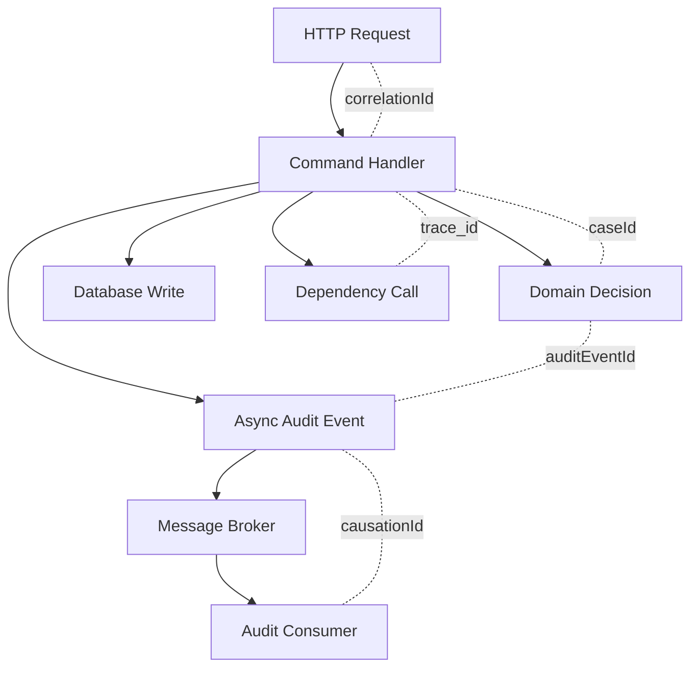
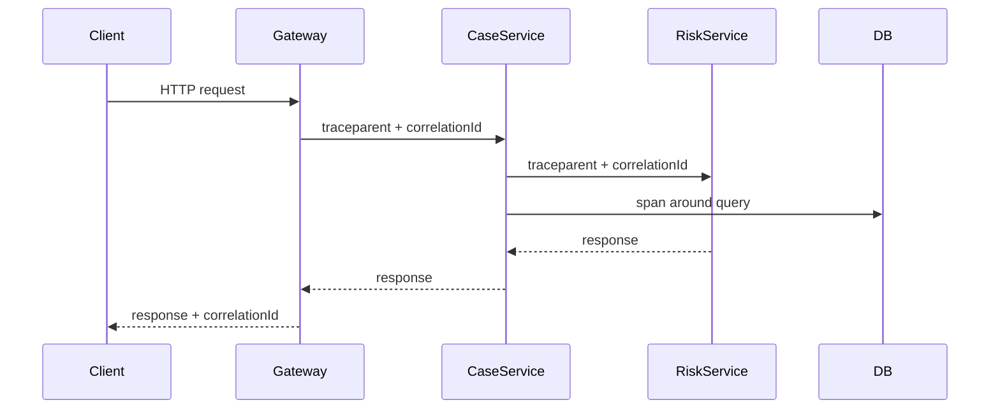
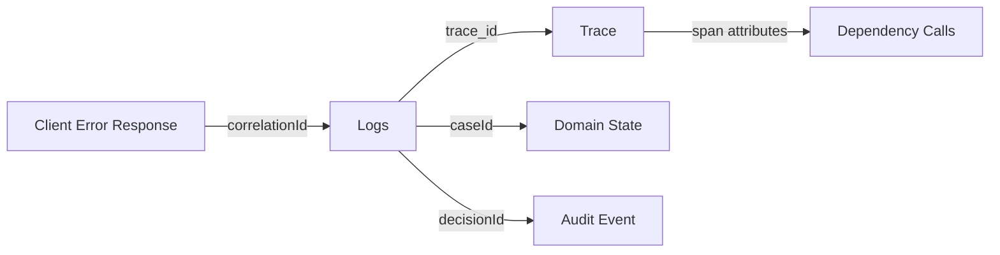

# Part 024 — Log Correlation and Context

> Target part ini: kamu mampu mendesain dan mengimplementasikan **context propagation** yang membuat semua log, metric, trace, audit event, dan error response dari satu operasi bisa dihubungkan tanpa menebak-nebak. Fokusnya adalah causal chain: request mana, user/tenant mana, aggregate mana, span mana, dependency mana, dan outcome mana.

Part 023 membahas structured logging. Namun log yang structured belum tentu correlated. Kamu bisa punya JSON log rapi tetapi tetap sulit menjawab:

```text
Log mana saja yang berasal dari satu request gagal?
Dependency call mana yang menyebabkan timeout?
Command mana yang menghasilkan audit rejection ini?
Trace mana yang berkaitan dengan error response client?
Tenant mana yang terdampak?
```

Correlation adalah kemampuan menghubungkan evidence lintas layer.

---

## 1. Kaufman Skill Deconstruction

Sub-skill yang perlu dikuasai:

| Sub-skill | Pertanyaan Kunci | Output |
|---|---|---|
| Correlation model | ID apa yang mewakili causal chain? | ID taxonomy |
| Request context | Bagaimana context dibuat saat ingress? | filter/interceptor |
| Propagation | Bagaimana context lewat thread/async/message? | context wrapper |
| Trace integration | Bagaimana trace/span link ke log? | `trace_id`, `span_id` di log |
| Domain context | Entity dan tenant mana yang terdampak? | domain fields |
| Cleanup | Bagaimana mencegah context leak? | scoped lifecycle |
| Testing | Bagaimana membuktikan context tidak hilang? | propagation tests |
| Governance | Field mana yang aman dan wajib? | context policy |

Learning target:

```text
Dalam 20 jam latihan, kamu harus bisa mengambil satu request end-to-end,
melacaknya dari HTTP ingress, service method, repository/dependency call,
async task, log event, trace span, error response, dan audit event.
```

---

## 2. Correlation vs Context

Dua istilah ini sering dicampur.

```text
Correlation = kemampuan menghubungkan beberapa evidence sebagai bagian dari operasi yang sama.
Context = data runtime yang dibawa selama operasi agar correlation dan decision bisa dilakukan.
```

Correlation ID adalah salah satu context field.

Context bisa mencakup:

- `correlationId`;
- `requestId`;
- `trace_id`;
- `span_id`;
- `tenantId`;
- `actorId`;
- `caseId`;
- `operation`;
- `policyVersion`;
- `deadline`;
- `locale`;
- `authSubject`;
- `auditSessionId`.

Tidak semua context boleh masuk log. Ada context untuk routing/decision, ada context untuk evidence, ada context yang harus tetap internal.

---

## 3. ID Taxonomy

Sistem produksi butuh ID taxonomy yang eksplisit.

| ID | Scope | Dibuat Oleh | Fungsi |
|---|---|---|---|
| `trace_id` | distributed trace | tracing system | menghubungkan spans |
| `span_id` | single span | tracing system | unit kerja dalam trace |
| `correlationId` | business/request chain | ingress atau upstream | log/error/audit correlation |
| `requestId` | single inbound request | gateway/service | request instance |
| `messageId` | message instance | broker/producer | message tracking |
| `causationId` | event caused by event | domain/event system | causal relation antar event |
| `idempotencyKey` | duplicate effect control | client/service | dedupe side effect |
| `caseId` | domain aggregate | domain system | impacted entity |
| `tenantId` | tenant boundary | identity/tenant resolver | isolation/context |
| `auditEventId` | audit record | audit system | immutable evidence record |

Jangan memaksa satu ID melakukan semua tugas.

Misalnya:

- `trace_id` bagus untuk distributed tracing, tetapi tidak selalu stabil sebagai business correlation untuk support ticket;
- `requestId` bagus untuk satu HTTP request, tetapi tidak cukup untuk workflow multi-step;
- `caseId` bagus untuk aggregate, tetapi satu case bisa punya banyak request dan trace;
- `idempotencyKey` bagus untuk duplicate prevention, bukan observability umum.

---

## 4. Correlation Graph Mental Model

Dalam sistem nyata, correlation bukan garis lurus. Bentuknya graph.



Satu operation bisa memiliki beberapa axis correlation:

- technical axis: trace/span/request;
- business axis: case/order/account;
- tenant/security axis: tenant/actor/role;
- workflow axis: process/workflow/task;
- audit axis: decision/evidence/audit record;
- reliability axis: retry/idempotency/dependency.

Engineer top-tier tidak mencari satu “magic ID”. Mereka mendesain correlation graph yang cukup untuk investigasi.

---

## 5. Ingress Context: Tempat Semuanya Dimulai

Untuk HTTP service, context biasanya dibuat di filter/interceptor.

Contoh Spring `OncePerRequestFilter`:

```java
@Component
public final class RequestContextFilter extends OncePerRequestFilter {
    private static final String CORRELATION_HEADER = "X-Correlation-Id";

    @Override
    protected void doFilterInternal(
            HttpServletRequest request,
            HttpServletResponse response,
            FilterChain chain
    ) throws ServletException, IOException {
        String correlationId = resolveOrCreateCorrelationId(request);
        String requestId = UUID.randomUUID().toString();
        String tenantId = resolveTenantIdSafely(request);

        try {
            MDC.put("correlationId", correlationId);
            MDC.put("requestId", requestId);
            MDC.put("tenantId", tenantId);
            MDC.put("http.method", request.getMethod());
            MDC.put("http.route", resolveRoutePattern(request));

            response.setHeader(CORRELATION_HEADER, correlationId);
            chain.doFilter(request, response);
        } finally {
            MDC.clear();
        }
    }

    private String resolveOrCreateCorrelationId(HttpServletRequest request) {
        String incoming = request.getHeader(CORRELATION_HEADER);
        if (incoming == null || incoming.isBlank() || incoming.length() > 128) {
            return UUID.randomUUID().toString();
        }
        return incoming;
    }

    private String resolveTenantIdSafely(HttpServletRequest request) {
        // Resolve from authenticated principal/tenant resolver, not from arbitrary user input.
        return "unknown";
    }
}
```

Important design points:

- terima correlation ID dari upstream jika valid;
- buat baru jika tidak ada;
- kembalikan correlation ID di response;
- jangan percaya tenant/user dari header arbitrary;
- clear MDC di `finally`;
- jangan simpan raw path/query string jika mengandung data sensitif.

---

## 6. Correlation ID dalam Error Response

Client-facing error response harus membawa correlation/reference ID agar support bisa mencari evidence.

Contoh Problem Details:

```json
{
  "type": "https://errors.example.com/case/CASE_NOT_ESCALATABLE",
  "title": "Case cannot be escalated",
  "status": 409,
  "detail": "The case is not in a state that allows escalation.",
  "instance": "/cases/CASE-123/escalations/requests/REQ-789",
  "errorCode": "CASE_NOT_ESCALATABLE",
  "correlationId": "c-2026-06-28-abc123"
}
```

Server log:

```java
log.atInfo()
   .setMessage("case escalation rejected")
   .addKeyValue("event", "case.escalation.rejected")
   .addKeyValue("error.code", "CASE_NOT_ESCALATABLE")
   .addKeyValue("correlationId", correlationId)
   .addKeyValue("caseId", caseId)
   .addKeyValue("outcome", "rejected")
   .log();
```

Support flow:

```text
Client reports correlationId -> search logs -> inspect trace -> inspect audit event -> explain outcome.
```

Tanpa correlation ID di error response, support sering bergantung pada timestamp kasar, user, dan dugaan.

---

## 7. Trace ID vs Correlation ID

Trace ID dan correlation ID mirip tetapi tidak identik.

| Aspek | Trace ID | Correlation ID |
|---|---|---|
| Owner | tracing system | application/platform |
| Scope | distributed trace | business/request chain |
| Format | W3C trace context/vendor | bebas tapi stabil |
| Primary use | performance/causal spans | support/audit/log lookup |
| Lifetime | satu trace | bisa lintas workflow |
| User-facing? | biasanya tidak | sering ya |

Rule praktis:

```text
Use trace_id for telemetry correlation.
Use correlationId for operational/business support correlation.
Carry both when possible.
```

Jika platform kamu sudah memakai W3C trace context end-to-end, trace ID bisa membantu banyak. Namun tetap pertimbangkan correlation ID yang boleh diberikan ke client/support tanpa mengikat internal tracing implementation.

---

## 8. W3C Trace Context Mental Model

Distributed tracing modern umumnya membawa context melalui HTTP headers seperti `traceparent` dan `tracestate`.

Simplified flow:



Logs di tiap service harus memiliki:

```json
{
  "trace_id": "same-trace",
  "span_id": "current-span",
  "correlationId": "same-correlation",
  "service.name": "case-service"
}
```

Dengan begitu:

- dari trace bisa lompat ke log;
- dari log bisa lompat ke trace;
- dari client error bisa cari correlation ID;
- dari audit bisa link ke decision/request.

---

## 9. OpenTelemetry dan MDC

Dalam aplikasi Java modern, OpenTelemetry Java agent/instrumentation dapat menginjeksikan trace context ke MDC sehingga log framework bisa mencetak `trace_id` dan `span_id`.

Conceptual pattern:

```text
Active Span -> OpenTelemetry Context -> MDC copy -> Log Event -> JSON field
```

Log pattern/JSON encoder harus memasukkan field tersebut.

Contoh pattern:

```properties
logging.pattern.level=trace_id=%mdc{trace_id} span_id=%mdc{span_id} trace_flags=%mdc{trace_flags} %5p
```

Untuk JSON structured logging, pastikan MDC map/context data ikut diekspor sebagai attributes atau fields.

Caveat:

- MDC hanya valid saat span aktif;
- async boundary bisa kehilangan context jika tidak dipropagasi;
- tidak semua appender/layout otomatis memasukkan MDC;
- context injection oleh agent bergantung konfigurasi dan library support;
- jangan membaca `trace_id` dari MDC sebagai business logic dependency.

MDC adalah transport untuk logging, bukan domain model.

---

## 10. Context Object di Application Layer

Selain MDC, aplikasi sering butuh context object eksplisit.

```java
public record OperationContext(
    String correlationId,
    String requestId,
    String tenantId,
    String actorId,
    String operation,
    Instant deadline
) {
    public Map<String, String> logFields() {
        return Map.of(
            "correlationId", correlationId,
            "requestId", requestId,
            "tenantId", tenantId,
            "actorId", actorId,
            "operation", operation
        );
    }
}
```

Keunggulan explicit context:

- lebih testable;
- tidak bergantung ThreadLocal;
- bisa masuk command/message;
- jelas di method signature;
- cocok untuk domain/audit decision;
- aman untuk async jika dikirim eksplisit.

Kelemahannya:

- bisa membuat signature panjang;
- perlu disiplin propagation;
- tidak otomatis masuk logging framework.

Pattern hybrid:

```text
OperationContext is explicit for business/domain decisions.
MDC is derived from OperationContext for logging.
OpenTelemetry Context is used for trace propagation.
```

Jangan jadikan MDC sebagai sumber kebenaran domain.

---

## 11. Scoped Context Helper

Untuk mencegah leak, buat scope helper.

```java
public final class LoggingContextScope implements AutoCloseable {
    private final Map<String, String> previous = new HashMap<>();
    private final Set<String> keys;

    private LoggingContextScope(Map<String, String> fields) {
        this.keys = Set.copyOf(fields.keySet());
        for (var entry : fields.entrySet()) {
            previous.put(entry.getKey(), MDC.get(entry.getKey()));
            MDC.put(entry.getKey(), entry.getValue());
        }
    }

    public static LoggingContextScope with(Map<String, String> fields) {
        return new LoggingContextScope(fields);
    }

    @Override
    public void close() {
        for (String key : keys) {
            String old = previous.get(key);
            if (old == null) {
                MDC.remove(key);
            } else {
                MDC.put(key, old);
            }
        }
    }
}
```

Usage:

```java
try (var ignored = LoggingContextScope.with(context.logFields())) {
    log.info("case command started");
    handler.handle(command, context);
}
```

Keuntungan dibanding `MDC.clear()` di semua tempat:

- nested context aman;
- hanya field yang ditambahkan yang dikembalikan;
- bisa dipakai untuk sub-operation sementara;
- cocok untuk library internal.

---

## 12. Context Propagation Across Executor Boundary

MDC berbasis thread. Jika task pindah thread, context bisa hilang.

Contoh bug:

```java
MDC.put("correlationId", correlationId);
executor.submit(() -> {
    log.info("async audit event published"); // correlationId mungkin tidak ada
});
```

Solusi: capture dan restore.

```java
public final class ContextAwareExecutor implements Executor {
    private final Executor delegate;

    public ContextAwareExecutor(Executor delegate) {
        this.delegate = delegate;
    }

    @Override
    public void execute(Runnable command) {
        Map<String, String> captured = MDC.getCopyOfContextMap();
        delegate.execute(() -> {
            Map<String, String> previous = MDC.getCopyOfContextMap();
            try {
                if (captured == null) {
                    MDC.clear();
                } else {
                    MDC.setContextMap(captured);
                }
                command.run();
            } finally {
                if (previous == null) {
                    MDC.clear();
                } else {
                    MDC.setContextMap(previous);
                }
            }
        });
    }
}
```

Namun hati-hati:

- jangan capture context terlalu besar;
- jangan membawa security context ke task yang tidak berhak;
- jangan membawa deadline yang sudah expired tanpa dicek;
- jangan menyembunyikan ownership task.

Untuk OpenTelemetry, gunakan context propagation utility yang sesuai agar span context juga ikut, bukan hanya MDC.

---

## 13. CompletableFuture Context Loss

`CompletableFuture` sering menjalankan stage di executor lain.

Bug umum:

```java
return CompletableFuture.supplyAsync(() -> riskClient.score(caseId))
    .thenApply(score -> decision(score));
```

Jika tidak ada context propagation:

- log di `riskClient` bisa kehilangan correlation ID;
- span bisa tidak menjadi child span yang benar;
- error log tidak bisa dihubungkan ke request;
- debugging fan-out menjadi sulit.

Pattern:

```java
Executor contextAwareExecutor = new ContextAwareExecutor(baseExecutor);

return CompletableFuture
    .supplyAsync(() -> riskClient.score(caseId), contextAwareExecutor)
    .thenApplyAsync(score -> decision(score), contextAwareExecutor);
```

Namun jangan hanya membungkus executor lalu merasa selesai. Pastikan trace context juga dipropagasi jika memakai OpenTelemetry.

---

## 14. Reactor Context vs MDC

Reactive pipeline tidak selalu berjalan pada satu thread. Karena itu, MDC ThreadLocal tidak cukup.

Mental model:

```text
MDC = thread-local diagnostic context.
Reactor Context = subscriber-context propagated through reactive chain.
OpenTelemetry Context = tracing context propagated through instrumentation.
```

Dalam Reactor, context harus ikut chain:

```java
Mono.deferContextual(ctx -> {
        String correlationId = ctx.get("correlationId");
        return service.process(correlationId);
    })
    .contextWrite(ctx -> ctx.put("correlationId", correlationId));
```

Untuk logging di reactive flow, perlu bridge dari Reactor Context ke MDC pada saat log event dibuat, atau gunakan instrumentation/library yang sudah menangani.

Anti-pattern:

```java
MDC.put("correlationId", correlationId);
return mono.flatMap(...); // context mungkin tidak valid saat dieksekusi
```

Reactive context harus diperlakukan sebagai bagian dari pipeline, bukan side-effect global.

---

## 15. Virtual Threads dan Context

Virtual threads membuat blocking-style concurrency jauh lebih murah, tetapi context discipline tetap penting.

MDC berbasis ThreadLocal biasanya terlihat lebih natural karena satu task bisa punya satu virtual thread. Namun tetap ada risiko:

- task fan-out membuat banyak virtual thread dengan context berbeda;
- inherited context yang tidak disengaja bisa bocor;
- carrier thread bukan tempat menyimpan business context;
- thread names bisa terlalu generik;
- pool/resource pressure tetap ada walau thread murah.

Pattern:

```java
try (var executor = Executors.newVirtualThreadPerTaskExecutor()) {
    Map<String, String> captured = MDC.getCopyOfContextMap();

    Future<RiskScore> future = executor.submit(() -> {
        try {
            if (captured != null) MDC.setContextMap(captured);
            return riskClient.score(caseId);
        } finally {
            MDC.clear();
        }
    });

    return future.get();
}
```

Dalam production, prefer abstraction daripada copy-paste.

---

## 16. Tenant Context

Tenant context adalah security boundary, bukan hanya log field.

Aturan:

- resolve tenant dari authenticated principal atau trusted gateway;
- jangan percaya `X-Tenant-Id` dari client publik tanpa validasi;
- masukkan `tenantId` ke log jika policy mengizinkan;
- gunakan `tenantId` untuk filter investigasi;
- jangan sampai MDC tenant bocor antar request;
- validate tenant consistency dengan domain entity.

Contoh consistency guard:

```java
if (!caseRecord.tenantId().equals(context.tenantId())) {
    log.atWarn()
       .setMessage("tenant context mismatch")
       .addKeyValue("event", "security.tenant.mismatch")
       .addKeyValue("outcome", "rejected")
       .addKeyValue("tenantId", context.tenantId())
       .addKeyValue("caseId", caseRecord.caseId())
       .addKeyValue("error.code", "TENANT_CONTEXT_MISMATCH")
       .log();

    throw new AccessDeniedException("Tenant mismatch");
}
```

Jangan log tenant mismatch sebagai detail berlebihan yang membantu attacker. Cukup field aman untuk investigasi internal.

---

## 17. Actor/User Context

Actor context sering sensitif.

Field yang mungkin aman:

- `actorId` internal opaque ID;
- `actorType`: user/system/service;
- `actorRole`;
- `authClientId`;
- `delegationId`;
- `impersonation`: true/false.

Field yang harus hati-hati:

- email;
- phone;
- full name;
- raw JWT claims;
- permissions list besar;
- authentication token.

Untuk audit, mungkin perlu data lebih lengkap. Namun audit store dan operational logs tidak harus sama.

```text
Operational log: enough to investigate.
Audit record: enough to prove decision.
Security log: enough to detect abuse.
```

Pisahkan kebutuhan ini secara sadar.

---

## 18. Domain Context

Domain context menjawab “entity mana yang terdampak?”.

Untuk regulatory/case system:

| Context | Field |
|---|---|
| Case | `caseId`, `caseType`, `caseStatus` |
| Workflow | `workflowInstanceId`, `taskId`, `stage` |
| Decision | `decisionId`, `decisionType`, `decisionOutcome` |
| Policy | `ruleId`, `policyVersion`, `jurisdiction` |
| Evidence | `evidenceId`, `documentId` |
| Escalation | `escalationId`, `escalationLevel` |

Namun masukkan domain context secara bertahap. Jangan semua field muncul di semua log.

Pattern:

```java
log.atInfo()
   .setMessage("case decision recorded")
   .addKeyValue("event", "case.decision.recorded")
   .addKeyValue("caseId", caseId)
   .addKeyValue("decisionId", decisionId)
   .addKeyValue("decisionType", decisionType)
   .addKeyValue("decisionOutcome", outcome)
   .addKeyValue("policyVersion", policyVersion)
   .log();
```

Event-specific fields lebih baik daripada global MDC yang terlalu gemuk.

---

## 19. Messaging Context

Message-driven systems memutus HTTP request boundary. Correlation harus masuk message metadata/header.

Producer:

```java
MessageHeaders headers = MessageHeaders.builder()
    .put("correlationId", context.correlationId())
    .put("causationId", command.commandId())
    .put("tenantId", context.tenantId())
    .put("traceparent", currentTraceParent())
    .build();

publisher.publish(event, headers);
```

Consumer:

```java
public void consume(Message<CaseEscalated> message) {
    OperationContext context = contextFromHeaders(message.headers());

    try (var ignored = LoggingContextScope.with(context.logFields())) {
        log.atInfo()
           .setMessage("case escalated event consumed")
           .addKeyValue("event", "message.case_escalated.consumed")
           .addKeyValue("messageId", message.id())
           .addKeyValue("causationId", message.header("causationId"))
           .log();

        handler.handle(message.payload(), context);
    }
}
```

Header propagation policy:

- propagate `correlationId`;
- propagate trace context using standard propagation if supported;
- propagate `tenantId` only if trusted and validated;
- propagate `causationId` for event chains;
- do not propagate tokens/secrets unnecessarily.

---

## 20. Batch and Scheduled Job Context

Batch jobs tidak punya client request. Tetap butuh correlation.

Buat job execution context:

```java
public record JobContext(
    String jobName,
    String jobRunId,
    Instant startedAt,
    String triggerType
) {}
```

Logs:

```java
log.atInfo()
   .setMessage("job started")
   .addKeyValue("event", "job.started")
   .addKeyValue("jobName", job.jobName())
   .addKeyValue("jobRunId", job.jobRunId())
   .addKeyValue("triggerType", job.triggerType())
   .log();
```

For each item:

```java
log.atWarn()
   .setMessage("job item rejected")
   .addKeyValue("event", "job.item.rejected")
   .addKeyValue("jobRunId", jobRunId)
   .addKeyValue("itemId", item.id())
   .addKeyValue("error.code", "ITEM_INVALID_STATE")
   .log();
```

Aggregation:

```java
log.atInfo()
   .setMessage("job completed")
   .addKeyValue("event", "job.completed")
   .addKeyValue("jobRunId", jobRunId)
   .addKeyValue("processed", processed)
   .addKeyValue("rejected", rejected)
   .addKeyValue("failed", failed)
   .addKeyValue("durationMs", durationMs)
   .log();
```

Jangan hanya log item failure tanpa `jobRunId`. Saat batch besar gagal sebagian, job-level correlation penting.

---

## 21. Correlation in Metrics

Metric tidak boleh memakai high-cardinality ID seperti `correlationId` atau `caseId` sebagai tag.

Buruk:

```java
registry.counter("case.command.failed", "caseId", caseId).increment();
```

Baik:

```java
registry.counter(
    "case.command.failed",
    "operation", "case.submit",
    "error.code", "CASE_PERSISTENCE_FAILED",
    "tenant.tier", tenantTier
).increment();
```

Correlation ID cocok untuk log/trace lookup, bukan metric dimensionality.

Mental model:

```text
Metrics answer: how many/how often/how slow?
Logs answer: what happened in this instance?
Traces answer: where time/failure flowed?
```

Gunakan field rendah cardinality untuk metrics, field instance-level untuk logs/traces.

---

## 22. Correlation in Traces

Span harus diberi attribute yang membantu link ke domain, tetapi jangan berlebihan.

Contoh:

```java
Span.current()
    .setAttribute("app.operation", "case.escalate")
    .setAttribute("app.case.type", caseType)
    .setAttribute("app.error.code", errorCode)
    .setAttribute("app.outcome", "rejected");
```

Hati-hati dengan high-cardinality domain IDs. Tergantung backend dan sampling policy, `caseId` sebagai span attribute mungkin boleh atau tidak. Untuk regulated debugging, kamu mungkin butuh link. Untuk high-volume public endpoint, bisa mahal.

Policy:

| Field | Logs | Metrics | Traces |
|---|---:|---:|---:|
| `trace_id` | Ya | Tidak | Native |
| `correlationId` | Ya | Tidak | Kadang |
| `caseId` | Ya sesuai policy | Tidak | Kadang |
| `error.code` | Ya | Ya | Ya |
| `operation` | Ya | Ya | Ya |
| `tenantId` | Ya sesuai policy | Hindari high cardinality | Kadang |
| `route` | Ya | Ya | Ya |

---

## 23. Context Cleanup and Leak Detection

Context leak adalah bug serius karena bisa menghasilkan bukti palsu.

Contoh leak:

```text
Request A tenant=t-001 selesai tanpa MDC.clear()
Thread dipakai Request B tenant=t-002
Log Request B berisi tenant=t-001
Incident investigation salah tenant
```

Test sederhana:

```java
@Test
void clearsMdcAfterRequest() throws Exception {
    filter.doFilterInternal(request, response, chain);
    assertThat(MDC.getCopyOfContextMap()).isNullOrEmpty();
}
```

Untuk executor:

```java
@Test
void restoresPreviousMdcAfterAsyncTask() {
    MDC.put("correlationId", "outer");

    executor.execute(() -> {
        assertThat(MDC.get("correlationId")).isEqualTo("outer");
        MDC.put("caseId", "CASE-1");
    });

    assertThat(MDC.get("caseId")).isNull();
    assertThat(MDC.get("correlationId")).isEqualTo("outer");
}
```

Tambahkan after-each guard di test suite:

```java
@AfterEach
void noMdcLeak() {
    assertThat(MDC.getCopyOfContextMap()).isNullOrEmpty();
}
```

---

## 24. Correlation Failure Modes

| Failure Mode | Gejala | Dampak | Pencegahan |
|---|---|---|---|
| Missing correlation ID | log tidak bisa dikelompokkan | investigasi lambat | ingress filter |
| Context leak | wrong tenant/request | false evidence | scoped cleanup |
| Async context loss | child task log orphan | trace/log gap | context-aware executor |
| Trace/log mismatch | trace ID berbeda | debugging sulit | standard propagation |
| High-cardinality metric tag | metric backend mahal/lambat | cost incident | tag governance |
| Untrusted header | spoofed tenant/user | security issue | trusted resolver |
| Raw payload context | data leakage | compliance issue | safe context DTO |
| Overloaded MDC | semua log terlalu besar | cost/noise | event-specific fields |

---

## 25. Incident Investigation Walkthrough

Scenario: client melaporkan error `CASE_NOT_ESCALATABLE` dengan `correlationId=c-123`.

Langkah investigasi:

1. Cari log by `correlationId=c-123`.
2. Temukan `http.server.request.completed` dengan status 409.
3. Temukan `case.escalation.rejected` dengan `error.code=CASE_NOT_ESCALATABLE`.
4. Ambil `caseId`, `actorId`, `tenantId`, `policyVersion`.
5. Lompat ke trace via `trace_id`.
6. Verifikasi tidak ada dependency failure.
7. Cari audit event via `auditEventId` atau `decisionId`.
8. Jelaskan outcome: rejection valid karena state conflict.

Ideal evidence chain:



Jika salah satu link hilang, itulah observability gap.

---

## 26. Context Governance

Untuk organisasi besar, buat context policy.

Contoh:

```yaml
required_context:
  http:
    - correlationId
    - requestId
    - trace_id
    - span_id
    - route
    - method
  domain_command:
    - correlationId
    - tenantId
    - actorId
    - operation
  case_operation:
    - caseId
    - caseType
    - operation
  async_message:
    - correlationId
    - messageId
    - causationId
    - tenantId

forbidden_context:
  - authorization
  - cookie
  - password
  - access_token
  - refresh_token
  - raw_jwt
  - raw_request_body
```

Review context policy seperti API contract. Perubahan field correlation bisa mematahkan dashboards, runbooks, dan support workflow.

---

## 27. Practice: Build a Correlated Request

Latihan minimal:

1. Buat endpoint `POST /cases/{caseId}/escalations`.
2. Tambahkan `RequestContextFilter`.
3. Tambahkan `correlationId` ke response header.
4. Tambahkan structured log di ingress, domain decision, dependency client, dan error handler.
5. Tambahkan OpenTelemetry trace/log correlation.
6. Tambahkan async audit publish via executor.
7. Pastikan async log tetap punya `correlationId`.
8. Buat test bahwa MDC clear setelah request.
9. Buat test bahwa error response dan log punya correlation ID sama.
10. Buat runbook query dari `correlationId` ke `trace_id` ke `auditEventId`.

Acceptance criteria:

```text
Given one failed request,
when given only the client-facing correlationId,
then engineer can find all relevant logs, trace, domain ID, error code, and audit event within minutes.
```

---

## 28. Internal Checklist

- [ ] Setiap ingress membuat atau menerima correlation ID.
- [ ] Correlation ID dikembalikan ke client.
- [ ] Trace ID dan span ID muncul di log saat span aktif.
- [ ] Domain logs memiliki relevant domain IDs.
- [ ] Tenant context berasal dari trusted source.
- [ ] MDC/ThreadContext dibersihkan di `finally`.
- [ ] Executor/async boundary punya context propagation policy.
- [ ] Message metadata membawa correlation/causation ID.
- [ ] Metric tags tidak memakai high-cardinality correlation IDs.
- [ ] Error response, logs, traces, dan audit bisa dihubungkan.
- [ ] Context field punya privacy classification.
- [ ] Context propagation punya unit/integration tests.

---

## 29. Ringkasan

Correlation yang kuat punya invariant berikut:

```text
1. Every externally visible failure must have a supportable reference ID.
2. Every important log must be linkable to request/trace/domain context.
3. Trace ID is not the same as business correlation ID.
4. MDC is a logging transport, not a domain context model.
5. Context must be propagated intentionally across async boundaries.
6. Context must be cleaned deterministically.
7. High-cardinality correlation belongs in logs/traces, not metrics tags.
8. Tenant and actor context are security-sensitive.
```

Part berikutnya akan bergeser ke metrics mental model: bagaimana counters, gauges, timers, histograms, cardinality, RED/USE, SLI/SLO, dan alerting foundation dirancang agar tidak hanya “banyak angka”, tetapi menjadi control system untuk reliability.

