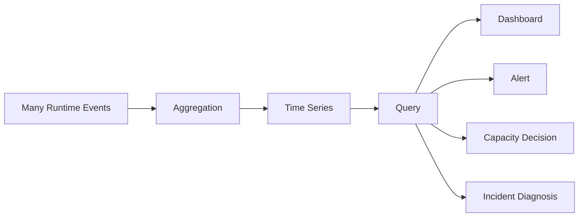
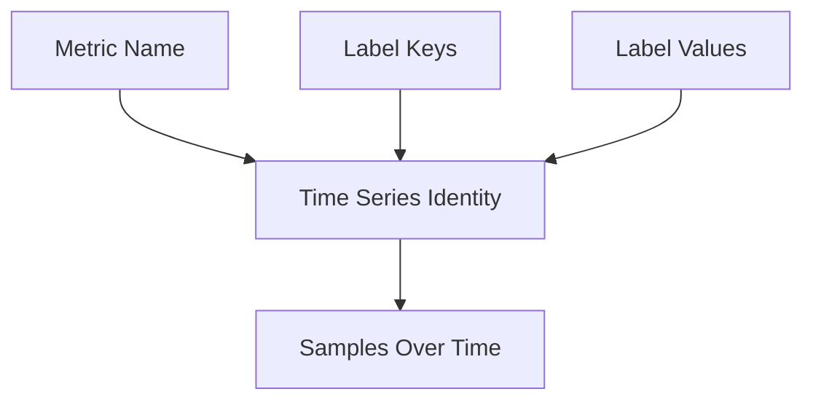
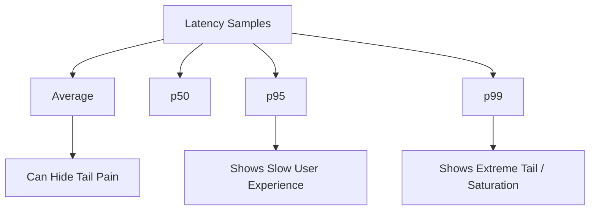
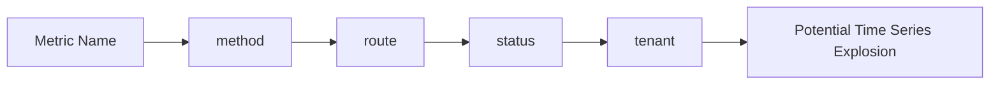
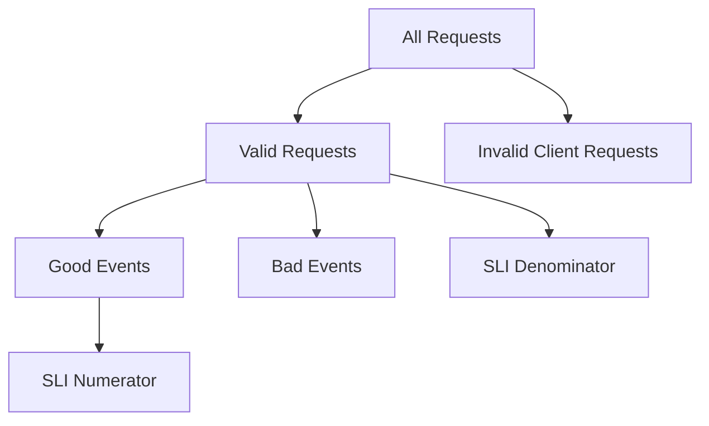
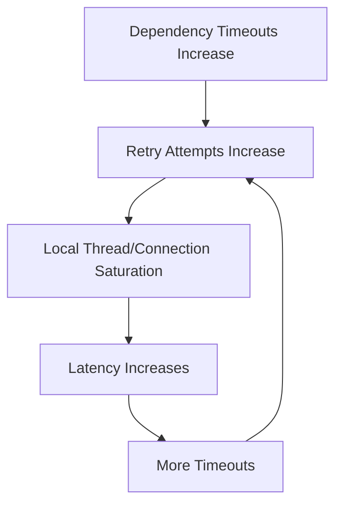
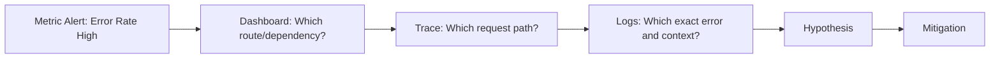
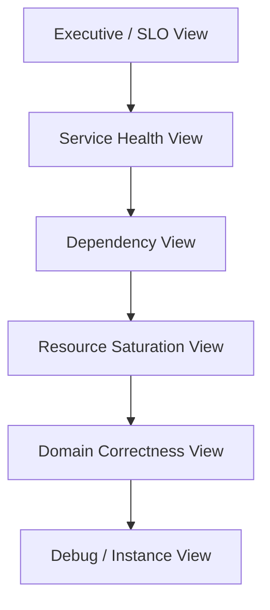

# Part 025 — Metrics Mental Model

Metrics adalah sinyal numerik yang menjawab pertanyaan operasional:

> “Apakah sistem sedang sehat, memburuk, overload, salah, lambat, atau berisiko melanggar janji layanan?”

Logging menjelaskan **apa yang terjadi pada event tertentu**. Tracing menjelaskan **jalur request tertentu**. Metrics menjelaskan **pola agregat sistem dari waktu ke waktu**.

Di sistem produksi, metrics bukan dekorasi dashboard. Metrics adalah mekanisme kontrol. Tanpa metrics yang benar, kita tidak tahu kapan harus scale, kapan harus rollback, kapan harus stop retry, kapan circuit breaker harus buka, kapan backlog sudah berbahaya, atau kapan customer impact sudah melewati batas.

Part ini membangun mental model metrics sebelum masuk ke Micrometer, Prometheus, dan Spring Boot Actuator pada Part 026.

---

## 1. Kaufman Deconstruction

Skill besar “menguasai metrics” dipecah menjadi sub-skill berikut:

| Sub-skill | Target kemampuan |
|---|---|
| Signal modelling | Memilih angka yang benar-benar merepresentasikan health dan failure |
| Instrument selection | Memilih counter, gauge, histogram, timer, long-task timer, atau derived metric |
| Label design | Mendesain dimensi metric tanpa meledakkan cardinality |
| SLI/SLO design | Mengubah metric menjadi indikator layanan yang bermakna |
| Failure diagnosis | Menggunakan metric untuk melihat overload, dependency degradation, retry storm, dan queue buildup |
| Alert design | Membuat alert berdasarkan symptom dan customer impact, bukan noise |
| Cost control | Menjaga volume time series, scrape size, retention, dan query cost |
| Operational feedback | Menghubungkan metric dengan runbook, rollback, capacity, dan reliability review |

Goal 20 jam pertama bukan “bisa bikin dashboard cantik”. Goal-nya:

> Mampu mendesain metric yang membuat failure terlihat sebelum menjadi incident besar.

---

## 2. Metrics as State Compression

Metric adalah kompresi dari banyak event menjadi time series.

Misalnya 1 juta request HTTP dalam 5 menit tidak mungkin dibaca satu per satu. Kita kompres menjadi:

- request rate
- error rate
- latency distribution
- active request count
- queue depth
- dependency timeout rate
- retry count
- rejection count



Kompresi selalu kehilangan detail. Karena itu metric harus dirancang untuk menjawab pertanyaan yang tepat.

Bad metric:

```txt
application.error.count
```

Better metric:

```txt
http.server.requests{method="POST", route="/cases/{id}/approve", status="500", outcome="SERVER_ERROR"}
```

Tetapi label yang terlalu detail juga berbahaya:

```txt
http.server.requests{user_id="u-923842", case_id="case-123", exception_message="Timeout after 3421ms"}
```

Itu akan membuat cardinality meledak.

---

## 3. The Production Question Model

Metrics yang baik berangkat dari pertanyaan produksi, bukan dari “apa yang mudah diukur”.

| Pertanyaan produksi | Metric family |
|---|---|
| Apakah user terkena error? | request error rate, failed operation count |
| Apakah sistem lambat? | latency histogram/timer |
| Apakah dependency rusak? | dependency error rate, timeout rate, circuit breaker state |
| Apakah sistem overload? | CPU, queue depth, active request, thread/connection pool saturation |
| Apakah retry memperparah load? | retry attempts, retry exhaustion, duplicate suppression |
| Apakah backlog tumbuh? | queue depth, consumer lag, oldest message age |
| Apakah shutdown aman? | in-flight work, drain duration, forced termination count |
| Apakah data integrity berisiko? | rejected transitions, compensation count, inconsistent state detection |
| Apakah SLO dilanggar? | good/bad event ratio, error budget burn |

Rule praktis:

> Jangan mulai dari “metric apa yang tersedia?”. Mulai dari “kegagalan apa yang harus terlihat?”.

---

## 4. Event, Measurement, Time Series

Tiga konsep harus dibedakan.

### 4.1 Event

Event adalah kejadian spesifik.

```txt
case approval request failed due to dependency timeout
```

### 4.2 Measurement

Measurement adalah angka dari event atau state.

```txt
latency = 2450 ms
status = failure
retry_attempt = 2
```

### 4.3 Time Series

Time series adalah measurement yang dikumpulkan berdasarkan nama metric + label set.

```txt
case_approval_duration_seconds_bucket{outcome="timeout", le="2.5"}
case_approval_attempts_total{outcome="failure", reason="dependency_timeout"}
```

Metric backend tidak menyimpan “metric name” saja. Ia menyimpan kombinasi nama + label.



Konsekuensi: setiap label value baru dapat membuat time series baru.

---

## 5. The Four Basic Metric Shapes

Secara operasional, engineer harus menguasai empat bentuk utama:

1. counter
2. gauge
3. histogram
4. summary/timer-like distribution

Dalam Micrometer, kita juga memakai:

- `Timer`
- `DistributionSummary`
- `LongTaskTimer`
- `FunctionCounter`
- `FunctionTimer`
- `TimeGauge`

Tetapi mental model dasarnya tetap sama.

---

## 6. Counter

Counter adalah angka kumulatif yang hanya naik, lalu reset ketika process restart.

Contoh:

- total request
- total failed request
- total retry attempt
- total rejected command
- total message consumed
- total circuit breaker transition
- total compensation executed

Counter cocok untuk event yang terjadi berkali-kali.

```java
Counter.builder("case.approval.attempts")
    .description("Total case approval attempts")
    .tag("outcome", "accepted")
    .register(registry)
    .increment();
```

### 6.1 Counter Is Usually Queried as Rate

Nilai mentah counter jarang berguna:

```txt
case_approval_attempts_total = 923847
```

Yang berguna adalah laju per waktu:

```promql
rate(case_approval_attempts_total[5m])
```

Atau rasio:

```promql
sum(rate(case_approval_attempts_total{outcome="failure"}[5m]))
/
sum(rate(case_approval_attempts_total[5m]))
```

### 6.2 Counter Anti-Patterns

Jangan gunakan counter untuk nilai yang bisa turun.

Bad:

```txt
active_users_total
```

Better:

```txt
active_users
```

`active_users` adalah gauge karena bisa naik dan turun.

Jangan tambahkan timestamp sebagai label.

Bad:

```txt
job_failures_total{timestamp="2026-06-28T10:15:20Z"}
```

Timestamp sudah bagian dari sample time.

---

## 7. Gauge

Gauge adalah nilai saat ini. Ia bisa naik dan turun.

Contoh:

- active request
- queue depth
- connection pool active count
- thread pool queue size
- cache size
- current backlog
- open circuit breaker count
- in-flight shutdown tasks

```java
AtomicInteger inFlightApprovals = new AtomicInteger();

Gauge.builder("case.approval.in_flight", inFlightApprovals, AtomicInteger::get)
    .description("Current number of in-flight case approval operations")
    .register(registry);
```

### 7.1 Gauge Is State, Not History

Gauge tidak menyimpan berapa kali nilai berubah. Ia hanya menunjukkan nilai saat scrape.

Kalau queue depth naik ke 1000 lalu turun ke 10 sebelum scrape, backend mungkin hanya melihat 10.

Karena itu untuk event penting, gunakan counter. Untuk state saat ini, gunakan gauge.

### 7.2 Gauge Failure Modes

| Failure | Dampak |
|---|---|
| Gauge object di-GC | Metric hilang atau jadi stale |
| Gauge dipakai untuk count event | Event hilang di antara scrape |
| Gauge label terlalu detail | Cardinality meledak |
| Gauge tanpa bound | Sulit menentukan threshold |
| Gauge tidak punya owner | Tidak jelas siapa harus bertindak |

---

## 8. Histogram

Histogram merekam distribusi nilai ke bucket.

Contoh:

- request latency
- dependency latency
- payload size
- batch size
- queue wait time
- lock wait time
- workflow transition duration

Histogram menjawab pertanyaan:

> “Berapa banyak event yang berada di bawah/di atas batas tertentu?”

Contoh bucket latency:

```txt
<= 50ms
<= 100ms
<= 250ms
<= 500ms
<= 1s
<= 2.5s
<= 5s
+Inf
```

Histogram memungkinkan estimasi percentile di backend seperti Prometheus.

```promql
histogram_quantile(
  0.95,
  sum(rate(http_server_request_duration_seconds_bucket[5m])) by (le, route)
)
```

### 8.1 Why Average Lies

Average latency bisa terlihat baik walaupun tail latency buruk.

Misal 100 request:

- 95 request selesai dalam 50ms
- 5 request selesai dalam 10s

Average sekitar 547ms. Tetapi bagi 5% user, sistem terasa rusak.

Untuk sistem interaktif, p95/p99 biasanya lebih berguna daripada average.



### 8.2 Bucket Design

Bucket harus mencerminkan SLO dan realitas domain.

Jika SLO approval API adalah 500ms, bucket harus punya batas dekat 500ms.

Bad bucket:

```txt
1s, 5s, 30s
```

Better bucket:

```txt
50ms, 100ms, 250ms, 500ms, 750ms, 1s, 2.5s, 5s
```

Jika bucket terlalu kasar, kita tidak bisa melihat threshold penting.

Jika bucket terlalu banyak, time series cost naik.

---

## 9. Timer

Timer adalah histogram/distribution khusus untuk durasi.

Di Micrometer, `Timer` mengukur:

- count event
- total time
- max/percentile/histogram, tergantung backend dan konfigurasi

```java
Timer.Sample sample = Timer.start(registry);
try {
    approveCase(command);
    sample.stop(Timer.builder("case.approval.duration")
        .tag("outcome", "success")
        .register(registry));
} catch (DomainRejectionException ex) {
    sample.stop(Timer.builder("case.approval.duration")
        .tag("outcome", "rejected")
        .tag("reason", ex.errorCode())
        .register(registry));
    throw ex;
} catch (Exception ex) {
    sample.stop(Timer.builder("case.approval.duration")
        .tag("outcome", "failure")
        .tag("reason", "unexpected")
        .register(registry));
    throw ex;
}
```

Timer harus digunakan untuk durasi pendek yang selesai. Untuk operasi yang masih berjalan lama, gunakan long-task timer atau gauge in-flight + histogram completion duration.

---

## 10. Distribution Summary

Distribution summary mengukur distribusi nilai non-waktu.

Contoh:

- payload size
- number of validation errors per request
- batch item count
- number of affected entities
- retry attempts per command
- search result count

```java
DistributionSummary.builder("case.validation.errors")
    .description("Number of validation errors per rejected request")
    .baseUnit("errors")
    .register(registry)
    .record(errors.size());
```

Gunakan distribution summary ketika pertanyaannya:

> “Seberapa besar nilai ini biasanya, dan bagaimana ekornya?”

---

## 11. Long Task Timer

Long-task timer mengukur operasi yang sedang berjalan.

Contoh:

- batch settlement
- migration job
- reconciliation process
- regulatory export
- report generation
- asynchronous workflow repair

Metric penting:

- active task count
- active task duration
- max active duration

Mental model:

> Timer menjawab “berapa lama operasi yang selesai?” Long-task timer menjawab “berapa lama operasi yang belum selesai sudah berjalan?”

---

## 12. Labels / Tags

Labels/tags memberi dimensi analisis.

Contoh:

```txt
http.server.requests{method="POST", route="/cases/{id}/approve", status="500"}
```

Label baik:

- bounded
- low cardinality
- meaningful for action
- stable
- non-sensitive
- joinable with logs/traces conceptually

Label buruk:

- user id
- request id
- case id
- full URL with ID
- exception message
- stack trace hash tanpa kontrol
- timestamp
- random UUID
- raw SQL
- raw tenant when tenant count huge and unbounded

### 12.1 Cardinality Formula

Jika metric punya label:

```txt
method = 5 values
route = 100 values
status = 10 values
tenant = 1000 values
```

Maka worst-case time series:

```txt
5 * 100 * 10 * 1000 = 5,000,000 series
```

Itu hanya untuk satu metric.



### 12.2 The Label Decision Test

Tambahkan label hanya jika jawabannya “ya” untuk sebagian besar pertanyaan berikut:

1. Apakah label ini punya jumlah nilai terbatas?
2. Apakah label ini membantu routing action?
3. Apakah label ini aman secara privacy/security?
4. Apakah label ini stabil lintas release?
5. Apakah label ini dibutuhkan untuk SLI/SLO atau diagnosis?
6. Apakah dashboard/alert akan menggunakan label ini?
7. Apakah cost time series masih masuk budget?

Jika tidak, masukkan detail itu ke log atau trace attribute, bukan metric label.

---

## 13. Metrics Naming

Metric name harus menjelaskan resource/operation + measurement.

Good:

```txt
case_approval_attempts_total
case_approval_duration_seconds
case_approval_rejections_total
case_approval_in_flight
case_approval_retry_attempts_total
case_approval_dependency_timeouts_total
```

Bad:

```txt
counter1
error
latency
business_metric
process_count
```

Naming guideline:

| Rule | Example |
|---|---|
| Gunakan domain/operation prefix | `case_approval_...` |
| Unit eksplisit | `_seconds`, `_bytes`, `_total` |
| Counter pakai total convention di Prometheus | `..._total` |
| Jangan pakai label sebagai nama | `case_approval_success_total`, bukan `success_case_approval` |
| Hindari nama terlalu generik | `errors_total` terlalu global |

---

## 14. RED Metrics

RED cocok untuk request-driven service.

| Signal | Meaning |
|---|---|
| Rate | Berapa banyak request per detik? |
| Errors | Berapa banyak request gagal? |
| Duration | Berapa lama request selesai? |

Untuk Java API service:

```txt
http_server_requests_seconds_count
http_server_requests_seconds_sum
http_server_requests_seconds_bucket
```

Derived:

```promql
# request rate
sum(rate(http_server_requests_seconds_count[5m])) by (route)

# error rate
sum(rate(http_server_requests_seconds_count{status=~"5.."}[5m])) by (route)
/
sum(rate(http_server_requests_seconds_count[5m])) by (route)

# p95 latency
histogram_quantile(
  0.95,
  sum(rate(http_server_requests_seconds_bucket[5m])) by (le, route)
)
```

RED menjawab customer-facing symptom.

---

## 15. USE Metrics

USE cocok untuk resource.

| Signal | Meaning |
|---|---|
| Utilization | Seberapa sibuk resource? |
| Saturation | Berapa banyak work menunggu resource? |
| Errors | Berapa banyak operation gagal karena resource? |

Contoh thread pool:

| Signal | Metric |
|---|---|
| Utilization | active threads / max threads |
| Saturation | queue depth |
| Errors | rejected task count |

Contoh connection pool:

| Signal | Metric |
|---|---|
| Utilization | active connections / max connections |
| Saturation | pending acquisition count |
| Errors | timeout acquiring connection |

USE menjawab “apakah resource sedang menjadi bottleneck?”.

---

## 16. Four Golden Signals

Untuk service reliability, empat sinyal yang sering dipakai:

1. latency
2. traffic
3. errors
4. saturation

Mapping ke Java service:

| Golden signal | Java metric example |
|---|---|
| Latency | HTTP timer, dependency timer, DB query timer |
| Traffic | request count/rate, message consumption rate |
| Errors | 5xx, domain rejection, timeout, DLQ, retry exhaustion |
| Saturation | executor queue, connection pool, heap pressure, CPU, backlog |

Kelebihan model ini: sederhana dan customer-impact oriented.

Kekurangannya: belum cukup untuk domain correctness. Untuk sistem regulatori/case management, tambahkan domain health metrics.

---

## 17. Domain Health Metrics

Engineering top 1% tidak hanya mengukur CPU dan HTTP 500. Mereka mengukur apakah domain system tetap benar.

Contoh untuk enforcement/case lifecycle:

```txt
case_transition_attempts_total{from="UNDER_REVIEW", to="APPROVED", outcome="success"}
case_transition_rejections_total{reason="MISSING_APPROVAL_AUTHORITY"}
case_policy_evaluations_total{policy="dual_control", outcome="deny"}
case_state_conflicts_total{aggregate="case", reason="version_conflict"}
case_repair_jobs_total{outcome="success"}
case_manual_review_queue_depth
case_outbox_lag_seconds
```

Domain metrics membantu melihat:

- policy terlalu sering menolak
- state machine punya edge case rusak
- manual review queue membesar
- kompensasi meningkat
- data repair menjadi normalisasi kegagalan
- integrasi menghasilkan unknown outcome

---

## 18. SLI, SLO, SLA

### 18.1 SLI

Service Level Indicator adalah measurement.

Contoh:

```txt
% approval API requests completed successfully under 500ms
```

### 18.2 SLO

Service Level Objective adalah target internal.

```txt
99.5% approval API requests complete successfully under 500ms over 30 days
```

### 18.3 SLA

Service Level Agreement adalah kontrak eksternal, sering punya konsekuensi bisnis/legal.

### 18.4 Good Event / Bad Event Model

SLO paling stabil dirancang sebagai rasio good event terhadap total event.

```txt
good = successful approval requests under 500ms
total = all valid approval requests
SLI = good / total
```

Jangan mencampur request invalid dari client ke availability SLO jika itu memang bukan failure sistem.



---

## 19. Error Budget

Jika SLO 99.9%, maka allowed bad events adalah 0.1%.

Untuk 10 juta request per bulan:

```txt
allowed bad events = 10,000,000 * 0.001 = 10,000
```

Error budget membuat reliability menjadi keputusan eksplisit.

Jika budget terbakar cepat:

- hentikan risky deploy
- rollback
- reduce feature rollout
- disable fallback unsafe
- prioritaskan reliability work

Jika budget masih aman:

- boleh ambil risiko lebih besar
- boleh ship perubahan lebih agresif

---

## 20. Burn Rate

Burn rate menjawab:

> “Seberapa cepat error budget sedang habis?”

Contoh:

```txt
burn rate = current bad event rate / allowed bad event rate
```

Jika burn rate 10x, maka service sedang menghabiskan budget 10 kali lebih cepat dari seharusnya.

Alert yang baik sering memakai multi-window burn-rate:

- short window untuk incident cepat
- long window untuk mengurangi noise

Contoh mental model:

| Window | Purpose |
|---|---|
| 5m | deteksi spike besar |
| 1h | konfirmasi dampak berlanjut |
| 6h | slow burn |
| 3d | chronic degradation |

---

## 21. Metrics for Error Handling

Setiap error handling policy penting harus punya metric.

| Policy | Metric |
|---|---|
| Retry | retry attempts, retry exhaustion |
| Timeout | timeout count, timeout ratio |
| Circuit breaker | state transition, call not permitted |
| Bulkhead | rejected task, active permits |
| Rate limit | accepted/rejected request |
| Fallback | fallback used, fallback failed |
| Degradation | degraded response count |
| Idempotency | duplicate suppressed, conflict detected |
| DLQ | message sent to DLQ, DLQ depth |
| Compensation | compensation started/succeeded/failed |
| Shutdown | drain duration, forced termination |

Tanpa metric, policy tersebut tidak bisa dioperasikan.

---

## 22. Metrics for Exception Strategy

Exception hierarchy dari part sebelumnya bisa dipetakan ke metric.

Contoh:

```java
public enum ErrorCategory {
    DOMAIN_REJECTION,
    VALIDATION,
    DEPENDENCY_TIMEOUT,
    DEPENDENCY_UNAVAILABLE,
    CONCURRENCY_CONFLICT,
    SECURITY_DENIAL,
    PLATFORM_FAILURE,
    UNEXPECTED
}
```

Metric:

```txt
application_errors_total{category="DEPENDENCY_TIMEOUT", operation="caseApproval"}
```

Namun hati-hati. Jangan masukkan exception class detail yang tak bounded.

Bad:

```txt
application_errors_total{exception="java.sql.SQLTransientConnectionException"}
```

Maybe acceptable jika class list bounded dan controlled, tetapi biasanya category lebih baik.

Better:

```txt
application_errors_total{category="DB_CONNECTION_TIMEOUT"}
```

---

## 23. Metrics and Retry Storms

Retry storm terlihat dari pola:

- request rate naik
- dependency error naik
- retry attempts naik
- latency naik
- circuit breaker buka
- saturation naik
- success rate tidak membaik

Metric minimum:

```txt
dependency_calls_total{dependency="risk-service", outcome="timeout"}
dependency_call_duration_seconds_bucket{dependency="risk-service"}
retry_attempts_total{dependency="risk-service"}
retry_exhausted_total{dependency="risk-service"}
circuit_breaker_state{dependency="risk-service", state="open"}
bulkhead_rejections_total{dependency="risk-service"}
```

Diagnosis:



Metrics harus menunjukkan feedback loop seperti ini.

---

## 24. Metrics and Queue-Based Systems

Untuk queue/stream consumer, request metrics saja tidak cukup.

Tambahkan:

- consumption rate
- processing latency
- handler error rate
- retry count
- DLQ count
- queue depth
- consumer lag
- oldest message age
- poison message count
- idempotency duplicate count

Paling penting: **age of oldest unprocessed item** sering lebih actionable daripada queue depth.

Queue depth 10.000 bisa normal jika consumer cepat. Queue depth 50 bisa kritis jika oldest item sudah 3 jam.

---

## 25. Metrics and Graceful Shutdown

Shutdown harus terlihat sebagai state.

Metric:

```txt
application_shutdown_started_total
application_shutdown_phase_duration_seconds{phase="stop_intake"}
application_shutdown_in_flight_tasks
application_shutdown_forced_total
application_shutdown_dropped_tasks_total
application_shutdown_telemetry_flush_failures_total
```

Tanpa metric, shutdown bug hanya muncul sebagai customer complaint atau inconsistent state.

---

## 26. Metrics and Observability Triangulation

Metrics memberi “where and how much”. Logs memberi “what exactly”. Traces memberi “path and causality”.



Metric label harus cukup untuk menemukan area. Detail investigasi masuk ke trace/log.

---

## 27. Cardinality Budget

Cardinality bukan detail kecil. Ini salah satu sumber cost dan outage observability terbesar.

### 27.1 Cardinality Risk Table

| Candidate label | Risk | Recommendation |
|---|---:|---|
| HTTP method | Low | OK |
| HTTP route template | Medium | OK jika templated |
| HTTP raw path | High | Avoid |
| status code | Low | OK |
| outcome | Low | OK |
| exception category | Medium | OK jika controlled |
| exception message | Extreme | Never |
| user id | Extreme | Never for common metrics |
| tenant id | High | Only with strict bound/budget |
| case id | Extreme | Never |
| region | Low | OK |
| pod name | Medium | Often OK for infra metric, avoid for SLO aggregation |

### 27.2 Cardinality Review Checklist

Sebelum merge metric baru:

- [ ] Nama metric jelas dan punya unit
- [ ] Label list bounded
- [ ] Tidak ada PII/secrets
- [ ] Tidak ada raw ID ber-cardinality tinggi
- [ ] Ada owner
- [ ] Ada dashboard atau query target
- [ ] Ada alert/runbook jika metric critical
- [ ] Ada test atau manual verification
- [ ] Ada dokumentasi expected value

---

## 28. Alerting From Metrics

Alert bukan “metric melewati threshold”. Alert adalah:

> Kondisi yang membutuhkan aksi manusia atau automation.

Bad alert:

```txt
CPU > 80% for 5 minutes
```

Kadang CPU 90% normal dan service sehat.

Better alert:

```txt
SLO burn rate high: checkout API bad events burning 14x budget over 5m and 6x over 1h
```

Bad alert:

```txt
error_count > 100
```

Better:

```txt
5xx ratio > 2% for route group payment over 10m and request rate > minimum traffic threshold
```

Alert harus punya:

- severity
- owner
- symptom
- impact
- likely causes
- first mitigation
- dashboard link
- log/trace query hint
- rollback instruction if applicable

---

## 29. Metrics in Regulatory / Case Management Systems

Untuk sistem case management, metrics harus membantu menjawab pertanyaan defensibility:

- Apakah keputusan gagal karena input, policy, dependency, atau bug?
- Apakah rejection meningkat setelah rule release?
- Apakah ada queue yang membuat SLA enforcement terlewat?
- Apakah manual override meningkat?
- Apakah retry menyebabkan duplicate decision?
- Apakah state machine conflict meningkat?
- Apakah audit event gagal ditulis?
- Apakah shutdown menyebabkan in-flight case transition unknown?

Contoh metric:

```txt
regulatory_decision_attempts_total{decision_type="sanction", outcome="approved"}
regulatory_decision_rejections_total{rule="dual_control", reason="missing_second_approver"}
regulatory_audit_write_failures_total{operation="case_transition"}
regulatory_case_transition_conflicts_total{aggregate="case"}
regulatory_manual_override_total{reason="dependency_unavailable"}
regulatory_due_date_breach_total{case_type="appeal"}
regulatory_queue_oldest_item_age_seconds{queue="manual_review"}
```

Key insight:

> Dalam domain regulatori, “availability” saja tidak cukup. Correctness, timeliness, explainability, dan audit completeness juga harus dimetric-kan.

---

## 30. Dashboard Layers

Dashboard yang baik berlapis.



### 30.1 SLO View

Untuk on-call dan stakeholder:

- availability SLI
- latency SLI
- error budget remaining
- burn rate
- top impacted endpoints

### 30.2 Service Health View

Untuk service owner:

- RED metrics
- top error categories
- dependency health
- deployment version
- traffic split

### 30.3 Resource View

Untuk bottleneck:

- CPU
- memory
- GC
- executor queues
- connection pools
- disk/network

### 30.4 Domain View

Untuk business/system correctness:

- transition attempts/rejections
- policy denials
- queue age
- audit write health
- manual repair/override count

---

## 31. Metrics Testing

Metrics perlu dites seperti API contract.

### 31.1 Unit-Level Metric Test

```java
@Test
void recordsApprovalSuccessMetric() {
    SimpleMeterRegistry registry = new SimpleMeterRegistry();
    CaseApprovalMetrics metrics = new CaseApprovalMetrics(registry);

    metrics.recordAttempt("success");

    Counter counter = registry.find("case.approval.attempts")
        .tag("outcome", "success")
        .counter();

    assertThat(counter).isNotNull();
    assertThat(counter.count()).isEqualTo(1.0);
}
```

### 31.2 Integration Metric Test

Test bahwa endpoint penting menghasilkan metric dengan label yang benar.

```java
mockMvc.perform(post("/cases/{id}/approve", caseId))
    .andExpect(status().isOk());

Timer timer = registry.find("case.approval.duration")
    .tag("outcome", "success")
    .timer();

assertThat(timer.count()).isEqualTo(1);
```

### 31.3 Cardinality Test

Pastikan raw ID tidak masuk tag.

```java
assertThat(registry.getMeters())
    .noneSatisfy(meter -> meter.getId().getTags().forEach(tag -> {
        assertThat(tag.getValue()).doesNotContain("case-123");
    }));
```

---

## 32. Anti-Patterns

### 32.1 Metric Everything

Terlalu banyak metric membuat sistem observability mahal dan noisy.

Better:

- metric untuk aggregate control
- logs untuk event detail
- traces untuk causal path

### 32.2 High-Cardinality Labels

Raw user/case/request ID sebagai label bisa menghancurkan backend metrics.

### 32.3 Alert on Cause, Not Symptom

Alert “CPU high” sering noisy. Alert “SLO burn high” lebih customer-oriented.

### 32.4 Average Latency Dashboard

Average menyembunyikan tail. Gunakan histogram/p95/p99.

### 32.5 Counter Without Rate

Counter mentah jarang actionable. Gunakan rate/increase.

### 32.6 Metrics Without Owner

Metric tanpa owner akan menjadi sampah dashboard.

### 32.7 Metrics Without Runbook

Alert tanpa runbook adalah noise yang dibungkus urgency.

---

## 33. Engineering Checklist

Untuk setiap fitur/error policy baru, tanyakan:

- [ ] Apa failure mode yang harus terlihat?
- [ ] Apa user/domain impact-nya?
- [ ] Apa metric utama untuk melihat failure itu?
- [ ] Apakah metric ini counter/gauge/timer/histogram/distribution summary?
- [ ] Apa label minimal yang dibutuhkan?
- [ ] Apakah label bounded?
- [ ] Apakah ada SLI/SLO yang memakai metric ini?
- [ ] Apakah alert perlu dibuat?
- [ ] Apakah alert punya runbook?
- [ ] Apakah logs/traces bisa dikorelasikan saat metric abnormal?
- [ ] Apakah metric diuji?
- [ ] Apakah dashboard punya owner?

---

## 34. 20-Hour Practice Block

### Hour 1-2 — Inventory

Ambil satu Java service. List semua existing metrics.

Klasifikasi:

- counter
- gauge
- timer/histogram
- domain metric
- resource metric
- unknown/no owner

### Hour 3-4 — Failure Mapping

Ambil 10 failure mode dari service:

- dependency timeout
- validation rejection
- duplicate command
- DB connection exhaustion
- queue backlog
- shutdown forced kill
- circuit breaker open
- retry exhaustion
- audit write failure
- domain transition conflict

Map ke metric.

### Hour 5-7 — SLI Draft

Definisikan 3 SLI:

1. availability
2. latency
3. domain correctness/timeliness

### Hour 8-10 — Instrumentation Design

Buat metric naming dan label schema.

Review cardinality.

### Hour 11-13 — Dashboard Sketch

Buat dashboard layout:

- SLO
- RED
- USE
- dependency
- domain health

### Hour 14-16 — Alert Design

Buat 3 alert:

- fast burn
- slow burn
- resource saturation with customer impact

### Hour 17-18 — Test Metrics

Tambahkan unit/integration test untuk custom metric.

### Hour 19-20 — Incident Drill

Simulasikan dependency timeout dan lihat apakah metrics menunjukkan:

- timeout naik
- retry naik
- latency naik
- error rate naik
- circuit breaker state berubah
- fallback/degradation count naik

---

## 35. Summary

Metrics adalah bahasa numerik reliability.

Engineer yang kuat tidak hanya menambahkan metric. Ia mendesain measurement yang:

- merepresentasikan health dan failure
- menjaga cardinality
- dapat dipakai untuk SLI/SLO
- membantu diagnosis incident
- menghubungkan error handling policy dengan operational evidence
- punya owner, dashboard, alert, dan runbook

Mental model paling penting:

> Metrics bukan tujuan. Metrics adalah feedback loop untuk mengendalikan sistem produksi.

Part berikutnya akan menerapkan mental model ini ke Java stack konkret: Micrometer, Prometheus, dan Spring Boot Actuator.

---

## References

- OpenTelemetry Metrics Data Model: https://opentelemetry.io/docs/specs/otel/metrics/data-model/
- Micrometer Reference Documentation: https://docs.micrometer.io/micrometer/reference/index.html
- Micrometer Timers: https://docs.micrometer.io/micrometer/reference/concepts/timers.html
- Micrometer Gauges: https://docs.micrometer.io/micrometer/reference/concepts/gauges.html
- Prometheus Metric Types: https://prometheus.io/docs/concepts/metric_types/
- Spring Boot Actuator Metrics: https://docs.spring.io/spring-boot/reference/actuator/metrics.html
