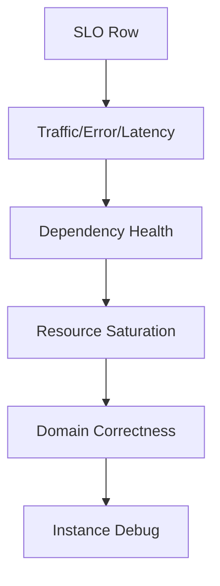

# Part 026 — Micrometer, Prometheus & Actuator

Part sebelumnya membangun mental model metrics. Sekarang kita masuk ke implementasi Java production-grade menggunakan:

- **Micrometer** sebagai instrumentation facade
- **Spring Boot Actuator** sebagai endpoint observability aplikasi
- **Prometheus** sebagai scraper dan time-series backend
- **Grafana** atau tool sejenis sebagai dashboard layer

Target part ini bukan sekadar “menampilkan `/actuator/prometheus`”. Targetnya adalah mampu mendesain metrics yang benar, aman, stabil, rendah cardinality, dan berguna saat incident.

---

## 1. Architecture Overview

```mermaid
flowchart LR
    A[Java Application] --> B[Micrometer MeterRegistry]
    B --> C[Spring Boot Actuator]
    C --> D[/actuator/prometheus]
    D --> E[Prometheus Scrape]
    E --> F[PromQL]
    F --> G[Grafana Dashboard]
    F --> H[Alertmanager]
```

Micrometer memberi abstraction layer. Aplikasi Java merekam metric ke `MeterRegistry`. Spring Boot mengintegrasikan Micrometer dengan Actuator. Prometheus melakukan scrape endpoint `/actuator/prometheus`.

Important boundary:

> Aplikasi tidak “push dashboard”. Aplikasi mengekspos time series. Monitoring backend yang scrape, query, aggregate, alert.

---

## 2. Dependency Setup

Contoh Maven untuk Spring Boot service:

```xml
<dependencies>
    <dependency>
        <groupId>org.springframework.boot</groupId>
        <artifactId>spring-boot-starter-actuator</artifactId>
    </dependency>

    <dependency>
        <groupId>io.micrometer</groupId>
        <artifactId>micrometer-registry-prometheus</artifactId>
    </dependency>
</dependencies>
```

Untuk Gradle:

```kotlin
dependencies {
    implementation("org.springframework.boot:spring-boot-starter-actuator")
    implementation("io.micrometer:micrometer-registry-prometheus")
}
```

Spring Boot akan auto-configure registry Prometheus jika dependency registry tersedia.

---

## 3. Minimal Actuator Configuration

```yaml
management:
  endpoints:
    web:
      exposure:
        include: health,info,metrics,prometheus
  endpoint:
    health:
      probes:
        enabled: true
  metrics:
    tags:
      application: case-service
      environment: prod
```

Catatan penting:

- `/actuator/metrics` untuk diagnosis metric yang terdaftar, bukan production scrape backend.
- `/actuator/prometheus` untuk Prometheus scrape.
- Jangan expose semua actuator endpoint sembarangan di internet.
- Tambahkan security/network policy untuk management endpoints.

---

## 4. What Spring Boot Gives You by Default

Dengan Actuator + Micrometer, Spring Boot biasanya menyediakan metric seperti:

- HTTP server requests
- JVM memory
- JVM GC
- JVM threads
- process CPU
- system CPU
- logback events
- executor metrics jika instrumented
- data source / connection pool metrics jika applicable
- cache metrics jika configured

Contoh endpoint:

```txt
GET /actuator/metrics
GET /actuator/metrics/http.server.requests
GET /actuator/prometheus
```

Namun default metric tidak cukup untuk domain reliability. Kita tetap perlu custom metrics untuk domain failure, retry, fallback, audit, dan business correctness.

---

## 5. MeterRegistry

`MeterRegistry` adalah pusat registrasi metric.

```java
@Component
public class CaseApprovalMetrics {

    private final MeterRegistry registry;

    public CaseApprovalMetrics(MeterRegistry registry) {
        this.registry = registry;
    }
}
```

Jangan membuat global static registry kecuali ada alasan kuat. Dependency injection membuat metrics lebih mudah diuji.

---

## 6. Counter

Gunakan counter untuk event kumulatif.

```java
@Component
public class CaseApprovalMetrics {

    private final Counter approvalSuccess;
    private final Counter approvalRejected;
    private final Counter approvalFailed;

    public CaseApprovalMetrics(MeterRegistry registry) {
        this.approvalSuccess = Counter.builder("case.approval.attempts")
            .description("Total case approval attempts")
            .tag("outcome", "success")
            .register(registry);

        this.approvalRejected = Counter.builder("case.approval.attempts")
            .description("Total case approval attempts")
            .tag("outcome", "rejected")
            .register(registry);

        this.approvalFailed = Counter.builder("case.approval.attempts")
            .description("Total case approval attempts")
            .tag("outcome", "failure")
            .register(registry);
    }

    public void recordSuccess() {
        approvalSuccess.increment();
    }

    public void recordRejected() {
        approvalRejected.increment();
    }

    public void recordFailure() {
        approvalFailed.increment();
    }
}
```

Prometheus output akan mengikuti naming convention registry. Counter biasanya terekspos dengan suffix `_total`.

PromQL:

```promql
sum(rate(case_approval_attempts_total[5m])) by (outcome)
```

---

## 7. Dynamic Tags: Use Carefully

Kadang kita ingin tag berdasarkan reason.

```java
public void recordRejection(String reason) {
    Counter.builder("case.approval.rejections")
        .tag("reason", reason)
        .register(registry)
        .increment();
}
```

Ini aman hanya jika `reason` berasal dari enum/registry yang bounded.

Good:

```java
public enum RejectionReason {
    MISSING_APPROVAL_AUTHORITY,
    CASE_ALREADY_CLOSED,
    POLICY_DENIED,
    VERSION_CONFLICT
}
```

Bad:

```java
recordRejection(exception.getMessage());
recordRejection(command.caseId());
recordRejection(userId);
```

Better implementation:

```java
public void recordRejection(RejectionReason reason) {
    Counter.builder("case.approval.rejections")
        .tag("reason", reason.name())
        .register(registry)
        .increment();
}
```

---

## 8. Gauge

Gauge merepresentasikan nilai saat ini.

```java
@Component
public class CaseQueueMetrics {

    private final ManualReviewQueue queue;

    public CaseQueueMetrics(MeterRegistry registry, ManualReviewQueue queue) {
        this.queue = queue;

        Gauge.builder("case.manual_review.queue.depth", queue, ManualReviewQueue::depth)
            .description("Current number of cases waiting for manual review")
            .baseUnit("cases")
            .register(registry);
    }
}
```

Important:

- Gauge membaca value saat scrape.
- Jangan increment/decrement gauge seperti counter kecuali backed by controlled state object.
- Pastikan object yang di-gauge tidak hilang dari memory jika registry menggunakan weak reference behavior.

Untuk value internal:

```java
@Component
public class InFlightMetrics {

    private final AtomicInteger inFlight = new AtomicInteger();

    public InFlightMetrics(MeterRegistry registry) {
        Gauge.builder("case.approval.in_flight", inFlight, AtomicInteger::get)
            .description("Current in-flight case approval operations")
            .register(registry);
    }

    public void started() {
        inFlight.incrementAndGet();
    }

    public void finished() {
        inFlight.decrementAndGet();
    }
}
```

Pastikan decrement ada di `finally`.

```java
metrics.started();
try {
    approve(command);
} finally {
    metrics.finished();
}
```

---

## 9. Timer

Timer adalah metric utama untuk latency.

```java
@Component
public class CaseApprovalMetrics {

    private final MeterRegistry registry;

    public CaseApprovalMetrics(MeterRegistry registry) {
        this.registry = registry;
    }

    public Timer timer(String outcome) {
        return Timer.builder("case.approval.duration")
            .description("Case approval processing duration")
            .tag("outcome", outcome)
            .publishPercentileHistogram()
            .serviceLevelObjectives(
                Duration.ofMillis(100),
                Duration.ofMillis(250),
                Duration.ofMillis(500),
                Duration.ofSeconds(1),
                Duration.ofSeconds(2)
            )
            .register(registry);
    }
}
```

Usage:

```java
public ApprovalResult approve(ApproveCaseCommand command) {
    Timer.Sample sample = Timer.start(registry);
    try {
        ApprovalResult result = approvalService.approve(command);
        sample.stop(metrics.timer("success"));
        return result;
    } catch (DomainRejectionException ex) {
        sample.stop(metrics.timer("rejected"));
        throw ex;
    } catch (Exception ex) {
        sample.stop(metrics.timer("failure"));
        throw ex;
    }
}
```

### 9.1 Avoid Timer Tag Explosion

Bad:

```java
.tag("caseId", command.caseId())
.tag("userId", command.userId())
.tag("exception", ex.getMessage())
```

Good:

```java
.tag("operation", "approve")
.tag("outcome", "failure")
.tag("reason", "dependency_timeout")
```

---

## 10. Timer With `recordCallable`

Untuk kode sederhana:

```java
ApprovalResult result = Timer.builder("case.approval.duration")
    .tag("outcome", "success")
    .register(registry)
    .recordCallable(() -> approvalService.approve(command));
```

Namun hati-hati: jika outcome tergantung exception, `Timer.Sample` sering lebih fleksibel karena kita bisa memilih tag setelah tahu outcome.

---

## 11. DistributionSummary

Gunakan `DistributionSummary` untuk ukuran non-durasi.

```java
@Component
public class ValidationMetrics {

    private final DistributionSummary validationErrorCount;

    public ValidationMetrics(MeterRegistry registry) {
        this.validationErrorCount = DistributionSummary.builder("case.validation.error.count")
            .description("Number of validation errors per rejected request")
            .baseUnit("errors")
            .publishPercentileHistogram()
            .serviceLevelObjectives(1, 2, 5, 10, 20)
            .register(registry);
    }

    public void recordValidationErrors(int count) {
        validationErrorCount.record(count);
    }
}
```

Use cases:

- validation errors per request
- payload size
- batch item count
- affected entity count
- retry attempts per completed operation

---

## 12. LongTaskTimer

Gunakan `LongTaskTimer` untuk task yang sedang berjalan lama.

```java
@Component
public class ReconciliationService {

    private final LongTaskTimer reconciliationTimer;

    public ReconciliationService(MeterRegistry registry) {
        this.reconciliationTimer = LongTaskTimer.builder("case.reconciliation.active")
            .description("Active reconciliation job duration")
            .register(registry);
    }

    public void reconcile() {
        LongTaskTimer.Sample sample = reconciliationTimer.start();
        try {
            runReconciliation();
        } finally {
            sample.stop();
        }
    }
}
```

Alert example:

```promql
case_reconciliation_active_duration_seconds_max > 3600
```

---

## 13. FunctionCounter and FunctionTimer

Gunakan function-based meters ketika source sudah punya cumulative value.

```java
FunctionCounter.builder("case.processed.total", processor, CaseProcessor::processedCount)
    .description("Total processed cases")
    .register(registry);
```

Gunakan dengan hati-hati:

- value harus monotonik untuk counter
- source object lifecycle harus stabil
- backend harus dapat menangani reset/restart

---

## 14. Central Metrics Facade

Jangan sebarkan metric builder acak di seluruh codebase.

Better:

```java
@Component
public class CaseMetrics {

    private final MeterRegistry registry;

    public CaseMetrics(MeterRegistry registry) {
        this.registry = registry;
    }

    public void recordTransition(String from, String to, TransitionOutcome outcome) {
        Counter.builder("case.transition.attempts")
            .tag("from", from)
            .tag("to", to)
            .tag("outcome", outcome.metricValue())
            .register(registry)
            .increment();
    }

    public Timer transitionTimer(String transition, String outcome) {
        return Timer.builder("case.transition.duration")
            .tag("transition", transition)
            .tag("outcome", outcome)
            .publishPercentileHistogram()
            .register(registry);
    }
}
```

Tetapi jangan buat satu “God Metrics Class” untuk seluruh aplikasi. Gunakan facade per bounded context/module.

---

## 15. Naming and Tag Conventions

Gunakan convention konsisten.

```txt
<domain>.<operation>.<measurement>
```

Examples:

```txt
case.approval.attempts
case.approval.duration
case.approval.rejections
case.transition.conflicts
case.audit.write.failures
case.manual_review.queue.depth
case.outbox.lag
```

Prometheus biasanya mengekspos dot sebagai underscore:

```txt
case_approval_attempts_total
case_approval_duration_seconds
case_manual_review_queue_depth
```

### 15.1 Tag Convention

Common tags:

| Tag | Values | Notes |
|---|---|---|
| `outcome` | `success`, `failure`, `rejected`, `timeout` | bounded |
| `reason` | enum code | bounded |
| `operation` | stable operation name | bounded |
| `dependency` | stable service/db name | bounded |
| `route` | route template | bounded-ish |
| `method` | HTTP method | bounded |
| `status` | HTTP status | bounded |
| `exception` | avoid or controlled category | risky |
| `tenant` | avoid unless controlled | high risk |

---

## 16. MeterFilter

`MeterFilter` dapat dipakai untuk:

- rename metric
- deny metric
- cap tags
- add common tags
- configure distribution statistics

Example common tags:

```java
@Configuration
public class MetricsConfig {

    @Bean
    MeterRegistryCustomizer<MeterRegistry> commonTags() {
        return registry -> registry.config().commonTags(
            "application", "case-service",
            "runtime", "java"
        );
    }
}
```

Example deny high-cardinality metric:

```java
@Bean
MeterFilter denyRawUriMetrics() {
    return MeterFilter.deny(id ->
        id.getName().equals("http.server.requests") &&
        id.getTag("uri") != null &&
        id.getTag("uri").matches(".*[0-9a-fA-F-]{8,}.*")
    );
}
```

Better solution: fix route templating at source. Filter is safety net, not primary design.

---

## 17. Distribution Configuration

Untuk Prometheus percentile query, gunakan histogram buckets.

```yaml
management:
  metrics:
    distribution:
      percentiles-histogram:
        http.server.requests: true
        case.approval.duration: true
      slo:
        http.server.requests: 50ms,100ms,250ms,500ms,1s,2s,5s
        case.approval.duration: 100ms,250ms,500ms,1s,2s
```

Atau programmatically:

```java
@Bean
MeterFilter caseApprovalHistogramConfig() {
    return MeterFilter.maximumAllowableTags(
        "case.approval.duration",
        "reason",
        20,
        MeterFilter.deny()
    );
}
```

Be careful:

- histograms multiply time series by bucket count
- each tag combination multiplies bucket series
- enable histograms intentionally

---

## 18. HTTP Server Metrics

Spring Boot automatically instruments HTTP server requests.

Common dimensions include:

- method
- uri/route
- status
- outcome
- exception

Important:

- `uri` should be route template like `/cases/{id}`, not raw `/cases/123`.
- High-cardinality URL tags are dangerous.
- Keep endpoint grouping meaningful.

Example PromQL request rate:

```promql
sum(rate(http_server_requests_seconds_count[5m])) by (uri, method)
```

Error ratio:

```promql
sum(rate(http_server_requests_seconds_count{status=~"5.."}[5m])) by (uri)
/
sum(rate(http_server_requests_seconds_count[5m])) by (uri)
```

p95 latency:

```promql
histogram_quantile(
  0.95,
  sum(rate(http_server_requests_seconds_bucket[5m])) by (le, uri)
)
```

---

## 19. Dependency Metrics

Instrument dependency calls explicitly.

```java
public RiskScore getRiskScore(CaseId caseId) {
    Timer.Sample sample = Timer.start(registry);
    String outcome = "success";

    try {
        return riskClient.getRiskScore(caseId);
    } catch (TimeoutException ex) {
        outcome = "timeout";
        throw ex;
    } catch (Exception ex) {
        outcome = "failure";
        throw ex;
    } finally {
        sample.stop(Timer.builder("dependency.call.duration")
            .tag("dependency", "risk-service")
            .tag("operation", "getRiskScore")
            .tag("outcome", outcome)
            .publishPercentileHistogram()
            .register(registry));
    }
}
```

Counter for calls:

```java
Counter.builder("dependency.call.attempts")
    .tag("dependency", "risk-service")
    .tag("operation", "getRiskScore")
    .tag("outcome", outcome)
    .register(registry)
    .increment();
```

Metrics to add:

- call rate
- error/timeout rate
- latency histogram
- retry attempts
- circuit breaker state
- bulkhead rejection
- fallback usage

---

## 20. Retry Metrics

```java
@Component
public class RetryMetrics {

    private final MeterRegistry registry;

    public RetryMetrics(MeterRegistry registry) {
        this.registry = registry;
    }

    public void recordAttempt(String dependency, int attempt, String reason) {
        Counter.builder("retry.attempts")
            .tag("dependency", dependency)
            .tag("attempt", attempt <= 3 ? String.valueOf(attempt) : "gt3")
            .tag("reason", reason)
            .register(registry)
            .increment();
    }

    public void recordExhausted(String dependency, String reason) {
        Counter.builder("retry.exhausted")
            .tag("dependency", dependency)
            .tag("reason", reason)
            .register(registry)
            .increment();
    }
}
```

Note the bounded attempt tag. Never tag with dynamic request ID.

---

## 21. Circuit Breaker Metrics

If using Resilience4j, Micrometer integration can publish circuit breaker metrics. Even without framework integration, the concepts should be visible:

```txt
circuit_breaker_calls_total{dependency="risk-service", outcome="success"}
circuit_breaker_calls_total{dependency="risk-service", outcome="error"}
circuit_breaker_state{dependency="risk-service", state="open"}
circuit_breaker_not_permitted_calls_total{dependency="risk-service"}
```

Dashboard should show:

- dependency error rate
- dependency latency
- retry attempts
- circuit breaker state
- fallback usage
- user-facing error rate

Without this chain, on-call sees only “API 500 high” but not why.

---

## 22. Queue Metrics

For queue/message systems:

```txt
message.consumed.total
message.processing.duration
message.processing.failures.total
message.retry.attempts.total
message.dlq.total
message.consumer.lag
message.oldest.age.seconds
```

Example:

```java
Gauge.builder("case.manual_review.queue.depth", queue, ManualReviewQueue::depth)
    .register(registry);

Gauge.builder("case.manual_review.queue.oldest_age", queue, ManualReviewQueue::oldestAgeSeconds)
    .baseUnit("seconds")
    .register(registry);
```

`oldest_age` often matters more than raw queue depth.

---

## 23. Domain Metrics Example: Case Approval

```java
@Service
public class CaseApprovalService {

    private final MeterRegistry registry;
    private final CaseRepository repository;
    private final PolicyEngine policyEngine;

    public CaseApprovalService(
        MeterRegistry registry,
        CaseRepository repository,
        PolicyEngine policyEngine
    ) {
        this.registry = registry;
        this.repository = repository;
        this.policyEngine = policyEngine;
    }

    public ApprovalResult approve(ApproveCaseCommand command) {
        Timer.Sample sample = Timer.start(registry);
        String outcome = "success";
        String reason = "none";

        try {
            CaseAggregate aggregate = repository.get(command.caseId());
            PolicyDecision decision = policyEngine.evaluate(command, aggregate);

            if (decision.denied()) {
                outcome = "rejected";
                reason = decision.reason().name();
                incrementApproval(outcome, reason);
                throw new DomainRejectionException(decision.reason());
            }

            aggregate.approve(command.actor());
            repository.save(aggregate);
            incrementApproval(outcome, reason);
            return ApprovalResult.approved(command.caseId());
        } catch (OptimisticLockingFailureException ex) {
            outcome = "conflict";
            reason = "VERSION_CONFLICT";
            incrementApproval(outcome, reason);
            throw ex;
        } catch (Exception ex) {
            outcome = "failure";
            reason = "UNEXPECTED";
            incrementApproval(outcome, reason);
            throw ex;
        } finally {
            sample.stop(Timer.builder("case.approval.duration")
                .tag("outcome", outcome)
                .tag("reason", reason)
                .publishPercentileHistogram()
                .register(registry));
        }
    }

    private void incrementApproval(String outcome, String reason) {
        Counter.builder("case.approval.attempts")
            .tag("outcome", outcome)
            .tag("reason", reason)
            .register(registry)
            .increment();
    }
}
```

Review:

- `reason` must be bounded.
- `caseId` is not a tag.
- Duration is recorded in `finally`.
- Domain rejection is separate from unexpected failure.
- Conflict is visible separately.

---

## 24. Avoid Duplicate Registration Hot Path Cost

Calling builder/register repeatedly can be acceptable for low volume and bounded tags, but for hot paths we often pre-register common meters.

Example:

```java
@Component
public class ApprovalMeters {

    private final Map<String, Counter> counters;

    public ApprovalMeters(MeterRegistry registry) {
        this.counters = Map.of(
            "success:none", counter(registry, "success", "none"),
            "rejected:MISSING_APPROVAL_AUTHORITY", counter(registry, "rejected", "MISSING_APPROVAL_AUTHORITY"),
            "conflict:VERSION_CONFLICT", counter(registry, "conflict", "VERSION_CONFLICT"),
            "failure:UNEXPECTED", counter(registry, "failure", "UNEXPECTED")
        );
    }

    public void increment(String outcome, String reason) {
        counters.getOrDefault(outcome + ":" + reason, counters.get("failure:UNEXPECTED"))
            .increment();
    }

    private Counter counter(MeterRegistry registry, String outcome, String reason) {
        return Counter.builder("case.approval.attempts")
            .tag("outcome", outcome)
            .tag("reason", reason)
            .register(registry);
    }
}
```

This makes allowed combinations explicit.

---

## 25. Prometheus Scrape Configuration

Minimal `prometheus.yml`:

```yaml
global:
  scrape_interval: 15s
  evaluation_interval: 15s

scrape_configs:
  - job_name: case-service
    metrics_path: /actuator/prometheus
    static_configs:
      - targets:
          - case-service:8080
```

In Kubernetes, service discovery usually replaces static targets.

Key choices:

| Setting | Impact |
|---|---|
| `scrape_interval` | freshness vs cost |
| `metrics_path` | endpoint path |
| target labels | service/cluster/namespace identification |
| relabeling | normalize/drop labels |
| retention | storage cost |

---

## 26. PromQL Basics for Java Services

### 26.1 Request Rate

```promql
sum(rate(http_server_requests_seconds_count[5m])) by (uri)
```

### 26.2 5xx Ratio

```promql
sum(rate(http_server_requests_seconds_count{status=~"5.."}[5m])) by (uri)
/
sum(rate(http_server_requests_seconds_count[5m])) by (uri)
```

### 26.3 p95 Latency

```promql
histogram_quantile(
  0.95,
  sum(rate(http_server_requests_seconds_bucket[5m])) by (le, uri)
)
```

### 26.4 Dependency Timeout Rate

```promql
sum(rate(dependency_call_attempts_total{outcome="timeout"}[5m])) by (dependency)
```

### 26.5 Retry Exhaustion

```promql
sum(rate(retry_exhausted_total[5m])) by (dependency, reason)
```

### 26.6 Queue Age

```promql
max(case_manual_review_queue_oldest_age_seconds) by (queue)
```

---

## 27. Dashboard Design

A production dashboard should answer in order:

1. Is user/domain impact happening?
2. Which operation is impacted?
3. Is it latency, error, or saturation?
4. Which dependency/resource correlates?
5. What changed recently?
6. Which mitigation is safe?



### 27.1 SLO Row

- availability SLI
- latency SLI
- error budget remaining
- burn rate

### 27.2 Service Row

- request rate
- error ratio
- p50/p95/p99 latency
- top routes by error

### 27.3 Dependency Row

- dependency call rate
- dependency timeout rate
- dependency p95 latency
- circuit breaker open state

### 27.4 Resource Row

- CPU
- heap
- GC pause
- executor queue
- DB pool active/pending

### 27.5 Domain Row

- transition rejection rate
- policy denial rate
- audit write failure
- manual review queue age
- conflict rate

---

## 28. Alert Rules

### 28.1 Fast Burn Availability Alert

```yaml
groups:
  - name: case-service-slo
    rules:
      - alert: CaseServiceFastBurn
        expr: |
          (
            sum(rate(http_server_requests_seconds_count{status=~"5.."}[5m]))
            /
            sum(rate(http_server_requests_seconds_count[5m]))
          ) > 0.02
        for: 10m
        labels:
          severity: page
          service: case-service
        annotations:
          summary: "case-service has high 5xx ratio"
          runbook: "Check deploys, dependency health, DB pool, retry storm, and circuit breaker state."
```

This is simplified. Mature SLO burn alerting should compare against the allowed error budget and use multi-window logic.

### 28.2 Queue Age Alert

```yaml
- alert: ManualReviewQueueTooOld
  expr: max(case_manual_review_queue_oldest_age_seconds{queue="manual_review"}) > 1800
  for: 15m
  labels:
    severity: ticket
    service: case-service
  annotations:
    summary: "Manual review queue oldest item is older than 30 minutes"
```

### 28.3 Audit Write Failure Alert

```yaml
- alert: AuditWriteFailures
  expr: sum(rate(case_audit_write_failures_total[5m])) > 0
  for: 5m
  labels:
    severity: page
    service: case-service
  annotations:
    summary: "Audit writes are failing"
```

For regulatory systems, audit failure may be page-worthy even at low volume.

---

## 29. Metrics and Logs/Traces Correlation

Micrometer metrics do not replace logs/traces.

Design correlation:

| Metric label | Log field | Trace attribute |
|---|---|---|
| `operation` | `operation` | `operation.name` |
| `outcome` | `outcome` | `app.outcome` |
| `reason` | `error.code` | `error.code` |
| `dependency` | `dependency` | `peer.service` |
| `route` | `http.route` | `http.route` |

When alert fires:

1. dashboard shows high `reason=DEPENDENCY_TIMEOUT`
2. trace query filters span attribute `error.code=DEPENDENCY_TIMEOUT`
3. logs filter `error.code=DEPENDENCY_TIMEOUT` and `trace_id=<trace>`

---

## 30. Testing Metrics

### 30.1 Unit Test With `SimpleMeterRegistry`

```java
class CaseApprovalMetricsTest {

    @Test
    void incrementsSuccessCounter() {
        SimpleMeterRegistry registry = new SimpleMeterRegistry();
        CaseApprovalMetrics metrics = new CaseApprovalMetrics(registry);

        metrics.recordSuccess();

        Counter counter = registry.find("case.approval.attempts")
            .tag("outcome", "success")
            .counter();

        assertThat(counter).isNotNull();
        assertThat(counter.count()).isEqualTo(1.0);
    }
}
```

### 30.2 Timer Test

```java
@Test
void recordsApprovalDuration() {
    SimpleMeterRegistry registry = new SimpleMeterRegistry();
    CaseApprovalMetrics metrics = new CaseApprovalMetrics(registry);

    Timer.Sample sample = Timer.start(registry);
    sample.stop(metrics.timer("success"));

    Timer timer = registry.find("case.approval.duration")
        .tag("outcome", "success")
        .timer();

    assertThat(timer).isNotNull();
    assertThat(timer.count()).isEqualTo(1);
}
```

### 30.3 Actuator Endpoint Test

```java
@SpringBootTest(webEnvironment = SpringBootTest.WebEnvironment.RANDOM_PORT)
class PrometheusEndpointTest {

    @Autowired
    TestRestTemplate rest;

    @Test
    void exposesPrometheusEndpoint() {
        ResponseEntity<String> response = rest.getForEntity(
            "/actuator/prometheus",
            String.class
        );

        assertThat(response.getStatusCode()).isEqualTo(HttpStatus.OK);
        assertThat(response.getBody()).contains("jvm_memory_used_bytes");
    }
}
```

### 30.4 Cardinality Regression Test

```java
@Test
void doesNotTagMetricsWithCaseId() {
    SimpleMeterRegistry registry = new SimpleMeterRegistry();

    service.approve(new ApproveCaseCommand("case-123", "actor-1"));

    assertThat(registry.getMeters())
        .flatExtracting(meter -> meter.getId().getTags())
        .noneMatch(tag -> tag.getValue().equals("case-123"));
}
```

---

## 31. Security and Exposure

Actuator endpoints can reveal sensitive operational details.

Minimum rules:

- expose only needed endpoints
- protect management port/path
- restrict network access
- avoid exposing env/config endpoints publicly
- do not include secrets in metric tags
- do not tag with PII
- ensure scrape endpoint is only accessible to monitoring infrastructure

Example separate management port:

```yaml
management:
  server:
    port: 9090
  endpoints:
    web:
      exposure:
        include: health,info,prometheus
```

Then restrict port 9090 at network/Kubernetes policy.

---

## 32. Production Pitfalls

### 32.1 Raw URL Cardinality

Symptom:

```txt
uri="/cases/123"
uri="/cases/124"
uri="/cases/125"
```

Fix:

```txt
uri="/cases/{id}"
```

### 32.2 Exception Message as Tag

Bad:

```txt
reason="Timeout after 2851ms calling risk-service instance 10.2.1.9"
```

Fix:

```txt
reason="DEPENDENCY_TIMEOUT"
```

### 32.3 Per-Tenant Metrics Without Budget

Tenant metrics can be useful but risky. If tenant count is high, prefer:

- aggregate metric
- logs/traces with tenant ID
- sampled per-tenant analytics pipeline
- top-N offline analysis
- dedicated metrics only for small bounded tenant set

### 32.4 Histogram Everywhere

Histograms are powerful but costly. Enable for:

- request latency
- dependency latency
- critical domain operation duration
- payload/batch distribution where needed

Do not enable for every timer blindly.

### 32.5 Metrics Without SLO

A dashboard with 200 panels and no SLO is not observability. It is visual noise.

### 32.6 No Metric Ownership

Every custom metric should have:

- owning team
- purpose
- expected range
- related dashboard
- related alert, if critical
- retirement condition

---

## 33. Implementation Checklist

Before merging metrics instrumentation:

- [ ] Metric has clear purpose
- [ ] Name follows convention
- [ ] Unit is clear
- [ ] Counter/gauge/timer/summary choice is correct
- [ ] Tags are bounded
- [ ] No PII/secrets/raw IDs
- [ ] Histograms are enabled only when needed
- [ ] SLO/dashboard/query exists or is planned
- [ ] Alert exists for critical failure modes
- [ ] Logs/traces have matching fields
- [ ] Unit/integration test verifies metric
- [ ] Actuator exposure is secured
- [ ] Prometheus scrape config is validated

---

## 34. Capstone Exercise

Build metrics for a `CaseApprovalService` with these requirements:

1. Count approval attempts by `outcome` and bounded `reason`.
2. Measure approval duration with buckets around 100ms, 250ms, 500ms, 1s, 2s.
3. Count dependency timeout to `risk-service`.
4. Count retry attempts and retry exhaustion.
5. Gauge manual review queue depth.
6. Gauge oldest manual review age.
7. Count audit write failures.
8. Expose `/actuator/prometheus`.
9. Write PromQL for:
   - approval rate
   - rejection ratio
   - p95 approval duration
   - audit failure alert
   - queue oldest age alert
10. Write tests ensuring no `caseId` appears as metric tag.

Expected result:

> A service owner can detect user impact, dependency failure, domain rejection surge, backlog growth, audit failure, and metric cardinality regression before customer support escalates.

---

## 35. Summary

Micrometer + Spring Boot Actuator + Prometheus gives Java teams a strong metrics foundation, but the framework does not design reliability for us.

The production-grade skill is knowing:

- what to measure
- which meter type to use
- which labels are safe
- how to keep cardinality bounded
- how to map metrics to SLI/SLO
- how to alert on customer/domain impact
- how to test metrics as operational contracts

A mature Java service should expose not only JVM and HTTP metrics, but also domain failure, dependency degradation, retry/fallback behavior, queue health, shutdown safety, and audit integrity.

Part berikutnya akan membahas tracing mental model: trace, span, parent-child relationship, causal path, critical path, sampling, and why tracing is the missing middle between metrics and logs.

---

## References

- Micrometer Reference Documentation: https://docs.micrometer.io/micrometer/reference/index.html
- Micrometer Meters: https://docs.micrometer.io/micrometer/reference/concepts/meters.html
- Micrometer Timers: https://docs.micrometer.io/micrometer/reference/concepts/timers.html
- Micrometer Gauges: https://docs.micrometer.io/micrometer/reference/concepts/gauges.html
- Micrometer Distribution Summaries: https://docs.micrometer.io/micrometer/reference/concepts/distribution-summaries.html
- Spring Boot Actuator Metrics: https://docs.spring.io/spring-boot/reference/actuator/metrics.html
- Spring Boot Actuator Prometheus Endpoint: https://docs.spring.io/spring-boot/api/rest/actuator/prometheus.html
- Prometheus Metric Types: https://prometheus.io/docs/concepts/metric_types/
