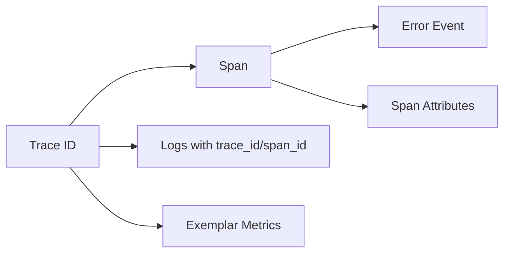
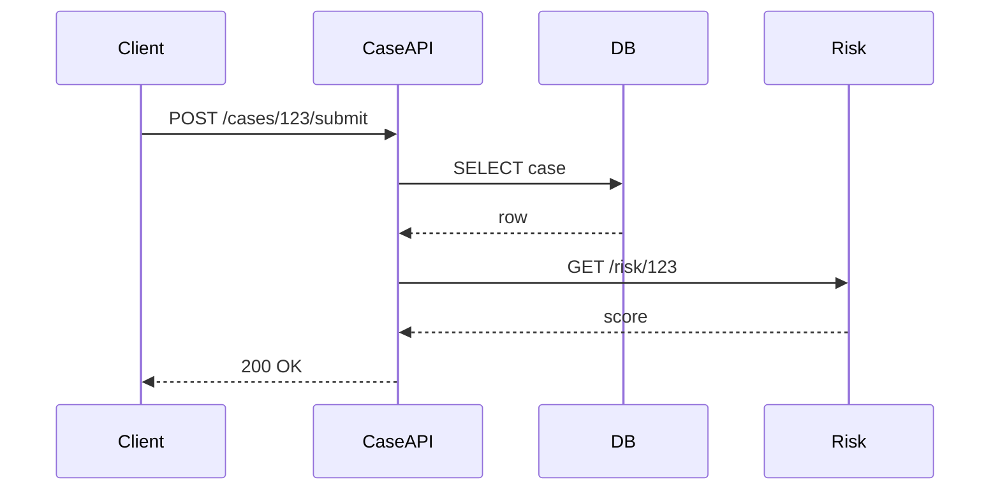
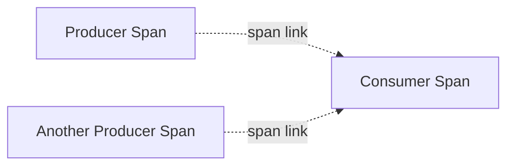
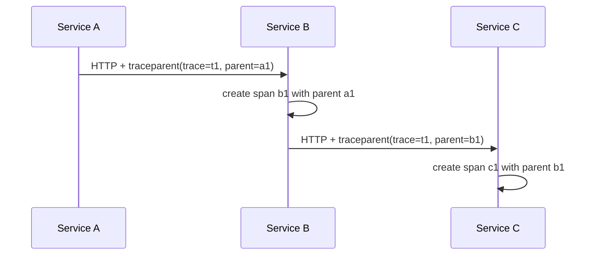
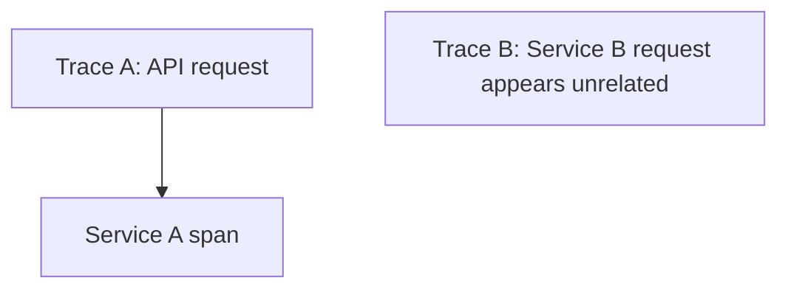
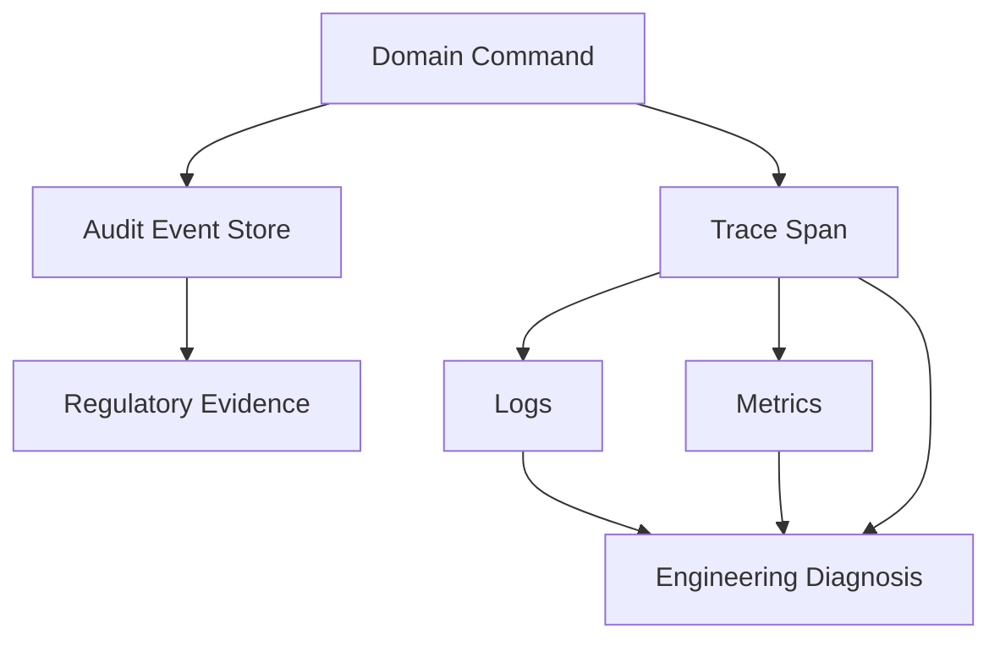

# Part 027 — Distributed Tracing Mental Model

Metrics menjawab: **berapa sering, seberapa lambat, seberapa rusak**.
Logs menjawab: **apa yang terjadi pada titik tertentu**.
Tracing menjawab: **bagaimana satu pekerjaan bergerak melalui sistem dan di mana causal chain-nya rusak**.

Distributed tracing bukan fitur dashboard. Ia adalah model bukti untuk menjawab pertanyaan seperti:

- request ini mulai dari mana?
- service mana yang memanggil service mana?
- operasi mana yang paling mahal?
- error ini berasal dari dependency, policy, data, atau bug lokal?
- apakah timeout di caller menyebabkan cancellation di callee?
- apakah retry membuat multiple attempt atau hanya satu attempt panjang?
- apakah log, metric, dan error dapat dikaitkan ke unit pekerjaan yang sama?

Part ini membangun mental model tracing sebelum masuk ke OpenTelemetry Java di Part 028.

---

## 1. Skill Target

Setelah menyelesaikan part ini, kamu harus mampu:

1. Menjelaskan perbedaan **trace**, **span**, **event**, **link**, **attribute**, **status**, **resource**, dan **baggage**.
2. Mendesain span boundary yang berguna, bukan sekadar banyak span.
3. Membaca trace sebagai **causal graph**, bukan timeline cantik.
4. Mengidentifikasi critical path dan bottleneck.
5. Membedakan latency lokal, dependency latency, queue latency, retry latency, dan client wait time.
6. Menentukan kapan membuat span baru, kapan menambahkan event, dan kapan cukup menambahkan attribute.
7. Menghindari trace cardinality leak, privacy leak, dan span explosion.
8. Menggunakan trace untuk debugging error, timeout, retry, fallback, shutdown, dan partial failure.

---

## 2. Mental Model: Trace as Evidence of Work

Satu **trace** merepresentasikan satu unit pekerjaan end-to-end.

Contoh unit pekerjaan:

- HTTP request `POST /cases/{id}/submit`
- message handling `CaseSubmitted`
- scheduled job `RecomputeRiskScores`
- batch chunk processing `import-line[10000..10999]`
- workflow step `ApplySanctionDecision`
- async fan-out operation `FetchCustomerProfile + FetchRiskScore + FetchAuditTrail`

Satu trace terdiri dari banyak **span**. Span merepresentasikan satu operasi terukur dalam unit pekerjaan itu.

```mermaid
flowchart TD
    A[Trace: Submit Case] --> B[Span: HTTP POST /cases/{id}/submit]
    B --> C[Span: validate request]
    B --> D[Span: load case]
    B --> E[Span: evaluate policy]
    E --> F[Span: call risk service]
    E --> G[Span: call sanctions service]
    B --> H[Span: persist transition]
    B --> I[Span: publish CaseSubmitted]
```

Trace bukan hanya tree. Dalam sistem modern, trace bisa menjadi graph:

- parent-child untuk synchronous causal chain
- span link untuk async/messaging/batch fan-out
- remote parent untuk context dari service lain
- separate trace untuk long-running workflows yang dihubungkan dengan domain correlation ID

Prinsip utama:

> Trace harus menjelaskan perjalanan pekerjaan, bukan struktur kode.

---

## 3. Trace vs Span vs Log vs Metric

| Signal | Unit | Pertanyaan Utama | Kekuatan | Kelemahan |
|---|---|---|---|---|
| Metric | Time series aggregate | “Apakah sistem sehat?” | Murah, agregat, alertable | Kehilangan detail per request |
| Log | Event record | “Apa yang terjadi?” | Detail tekstual/event | Sulit melihat causal chain |
| Trace | Causal path | “Di mana request ini menghabiskan waktu/gagal?” | End-to-end path | Sampling, storage cost, instrumentation gap |

Trace bukan pengganti log atau metric.

Trace yang baik biasanya menghubungkan ketiganya:



Dalam incident, pola investigasi ideal:

1. metric menunjukkan gejala agregat
2. alert membuka dashboard
3. dashboard menunjuk trace sample/exemplar
4. trace menunjukkan service/span yang bermasalah
5. logs pada `trace_id` menjelaskan detail lokal
6. code/config menjelaskan root cause

---

## 4. Core Terms

### 4.1 Trace

Trace adalah keseluruhan causal path dari satu pekerjaan.

Trace memiliki `trace_id` yang sama di seluruh span dalam path tersebut.

Contoh:

```text
trace_id = 0af7651916cd43dd8448eb211c80319c
```

Trace bukan request ID. Request ID bisa bersifat lokal gateway; trace ID harus dipropagasikan lintas service dan operation boundary.

### 4.2 Span

Span merepresentasikan operasi dengan start time, end time, parent, attributes, status, dan events.

Minimal span yang berguna punya:

```text
name        = POST /cases/{caseId}/submit
kind        = SERVER
start/end   = timestamp
status      = OK | ERROR | UNSET
attributes  = http.method, http.route, domain.operation, error.code
parent      = previous span context
```

Span adalah measurement + context.

### 4.3 Parent-Child

Parent-child menyatakan causal dependency:

```text
A started B
A waits for B or depends on B's outcome
```

Contoh:



Trace tree:

```text
POST /cases/{id}/submit
├── db.query case
└── GET risk-service /risk/{id}
```

### 4.4 Span Kind

Common span kind:

| Kind | Meaning | Example |
|---|---|---|
| `SERVER` | menerima request remote | HTTP controller menerima request |
| `CLIENT` | membuat request remote | HTTP client call, DB client call |
| `PRODUCER` | mengirim message | publish Kafka/Rabbit/SQS message |
| `CONSUMER` | menerima/memproses message | message listener |
| `INTERNAL` | operasi internal process | validation, policy evaluation |

Rule of thumb:

> Jika operasi melewati network/process boundary, kind biasanya bukan `INTERNAL`.

### 4.5 Attribute

Attribute adalah key-value metadata pada span.

Contoh:

```text
service.name = case-command-service
http.route = /cases/{caseId}/submit
case.state.from = DRAFT
case.state.to = SUBMITTED
error.code = CASE_STATE_CONFLICT
retry.attempt = 2
```

Attribute harus searchable dan low-cardinality bila digunakan untuk agregasi.

Jangan masukkan:

- raw payload
- token
- password
- full user input
- full SQL with sensitive literal
- unbounded exception message sebagai dimension
- customer name, email, phone, address

### 4.6 Event

Span event adalah point-in-time marker dalam span.

Gunakan event untuk kejadian penting di dalam operasi:

```text
event: validation.failed
attributes:
  validation.error_count = 3
  error.code = CASE_REQUIRED_FIELD_MISSING
```

Event cocok untuk:

- exception event
- fallback activated
- retry attempt
- state transition accepted/rejected
- lock acquired/released
- degraded mode selected
- message ack/nack decision

### 4.7 Status

Span status menjelaskan outcome telemetry-level:

- `OK`: operasi sukses secara observability
- `ERROR`: operasi gagal
- `UNSET`: default, sering dipakai ketika status tidak eksplisit

Jangan samakan HTTP status dengan span status secara buta.

Contoh:

| HTTP Status | Domain Meaning | Span Status |
|---|---|---|
| 200 | success | OK |
| 400 | expected client validation rejection | bisa OK atau ERROR tergantung policy observability |
| 404 | expected “not found” lookup | sering OK untuk lookup biasa |
| 409 | domain state conflict | biasanya ERROR jika operasi command gagal |
| 500 | server failure | ERROR |
| 503 | dependency unavailable | ERROR |

Untuk platform reliability, command rejection yang normal tapi penting biasanya dicatat sebagai domain outcome metric/log, bukan selalu sebagai infrastructure error.

### 4.8 Link

Span link menghubungkan span yang tidak punya parent-child direct relationship.

Gunakan link untuk:

- message consumer span yang terkait producer span
- batch job yang memproses banyak input trace
- fan-in dari banyak parent
- async handoff yang tidak mempertahankan parent lifecycle



Parent-child berarti “dijalankan dalam causal execution tree”. Link berarti “terkait secara kausal, tetapi bukan child langsung”.

### 4.9 Resource

Resource menggambarkan entitas yang menghasilkan telemetry.

Contoh:

```text
service.name = case-command-service
service.version = 2026.06.28.1
deployment.environment = prod
cloud.region = ap-southeast-3
k8s.namespace.name = enforcement
k8s.pod.name = case-command-7fdc...
```

Resource attribute harus membantu menjawab:

- service mana?
- versi mana?
- environment mana?
- region/zone mana?
- pod/container mana?

### 4.10 Baggage

Baggage adalah context key-value yang dipropagasikan lintas service.

Penting:

> Baggage bukan attribute otomatis yang aman. Ia dapat ikut keluar ke downstream request, termasuk third-party, sehingga harus sangat dibatasi.

Gunakan baggage hanya untuk data yang:

- tidak sensitif
- ber-cardinality terkendali
- memang perlu tersedia lintas service
- aman jika terlihat oleh service downstream yang tidak sepenuhnya kamu kontrol

Contoh aman relatif:

```text
business_unit = enforcement
channel = backoffice
```

Contoh berbahaya:

```text
user_email
customer_id mentah
jwt
case narrative
investigation note
```

---

## 5. W3C Trace Context Mental Model

Agar trace tidak pecah lintas vendor/tool/service, distributed tracing membutuhkan format propagasi standar.

HTTP biasanya memakai header:

```http
traceparent: 00-0af7651916cd43dd8448eb211c80319c-b7ad6b7169203331-01
tracestate: vendor-specific-data
```

`traceparent` membawa:

```text
version-trace_id-parent_id-flags
```

Interpretasi:

```text
00                                version
0af7651916cd43dd8448eb211c80319c  trace_id
b7ad6b7169203331                  parent/span id
01                                sampled flag, etc.
```

Mental model:



Jika context tidak dipropagasikan:



Gejala trace context broken:

- setiap service punya trace baru
- logs punya correlation ID tapi no trace ID
- root span muncul di service tengah
- client span tidak punya matching server span
- message consumer trace tidak terhubung ke producer
- dashboard dependency map tampak terputus

---

## 6. Trace as Causal Graph, Not Stack Trace

Stack trace menunjukkan call stack lokal saat error.

Distributed trace menunjukkan causal path lintas service dan time.

Contoh stack trace:

```text
CaseService.submit
PolicyEvaluator.evaluate
RiskClient.getRisk
HttpClient.send
```

Contoh trace:

```text
POST /cases/{id}/submit  1400ms ERROR
├── validate request       8ms OK
├── db.select case         24ms OK
├── evaluate policy        1170ms ERROR
│   ├── GET /risk          1000ms ERROR timeout
│   └── fallback stale     80ms OK
└── persist audit          50ms OK
```

Trace menjawab:

- latency terjadi di risk service, bukan DB
- fallback aktif tapi command tetap gagal
- audit tetap ditulis walau command gagal
- caller menunggu 1.4 detik
- error code domain mungkin berasal dari dependency timeout

---

## 7. Critical Path

Critical path adalah jalur span yang menentukan total latency.

Contoh fan-out:

```text
POST /cases/{id}/review  900ms
├── load case             40ms
├── parallel checks       700ms
│   ├── sanctions check   120ms
│   ├── risk check        700ms
│   └── duplicate check   200ms
└── persist decision      80ms
```

Total bukan `40 + 120 + 700 + 200 + 80`. Karena checks parallel, critical path adalah:

```text
load case + max(checks) + persist decision
= 40 + 700 + 80
= 820ms plus overhead
```

Dalam trace UI, jangan hanya cari span terpanjang. Cari span yang berada di critical path.

Non-critical long span bisa terjadi karena:

- background task detached
- async operation not awaited
- telemetry span lifetime salah
- queue wait time disatukan dengan processing time

---

## 8. Span Design Principles

### 8.1 Span harus merepresentasikan operation boundary

Span baik:

```text
POST /cases/{caseId}/submit
policy.evaluate.submit_case
db.case.select_by_id
risk-service GET /risk/{subjectId}
case.transition.persist
```

Span buruk:

```text
methodA
line 48
loop iteration 923
process
execute
```

Nama span harus stabil dan tidak mengandung high-cardinality value.

Baik:

```text
POST /cases/{caseId}/submit
```

Buruk:

```text
POST /cases/CASE-2026-000000123/submit
```

### 8.2 Satu span bukan satu method

Jangan instrument setiap method.

Instrumentasikan:

- API boundary
- dependency call
- expensive domain operation
- state transition
- queue wait/processing
- retry attempt
- fallback decision
- transaction boundary
- external side effect

Tidak perlu span untuk:

- getter/setter
- pure helper trivial
- string formatting
- mapping object kecil
- setiap predicate

### 8.3 Span duration harus jelas

Sebelum membuat span, jawab:

> Apa yang dimulai saat span start, dan apa yang selesai saat span end?

Contoh ambiguity:

```text
span: publish CaseSubmitted
```

Apakah durasinya:

- serialize event?
- send ke broker?
- wait broker ack?
- schedule async publish?
- include retry?

Tulis span boundary dengan jelas:

```text
message.serialize CaseSubmitted
kafka.produce case-events
```

### 8.4 Attribute harus menjelaskan diagnosis

Span tanpa attribute sering kurang berguna.

Minimal untuk domain operation:

```text
operation.name = submit_case
case.type = enforcement
case.state.from = DRAFT
case.state.to = SUBMITTED
outcome = rejected
error.code = CASE_STATE_CONFLICT
retryable = false
```

Minimal untuk dependency call:

```text
peer.service = risk-service
http.method = GET
http.route = /risk/{subjectId}
http.response.status_code = 503
retry.attempt = 2
timeout.ms = 800
```

---

## 9. Span Boundary Catalog for Java Services

### 9.1 HTTP Server Boundary

Root-ish span per incoming request:

```text
SERVER POST /cases/{caseId}/submit
```

Attributes:

```text
http.request.method = POST
url.path = /cases/123/submit
http.route = /cases/{caseId}/submit
http.response.status_code = 409
user_agent.original = ... if safe
client.address = ... if policy allows
```

Avoid:

```text
http.route = /cases/123/submit
request.body = {...}
```

### 9.2 Domain Command Boundary

Untuk command penting:

```text
INTERNAL case.submit
```

Attributes:

```text
domain.entity = case
domain.operation = submit
case.state.from = DRAFT
case.state.to = SUBMITTED
rule_set.version = 2026-06-01
```

### 9.3 Policy Evaluation Boundary

```text
INTERNAL policy.evaluate submit_case
```

Attributes:

```text
policy.name = submit_case_eligibility
policy.version = 2026.06
policy.outcome = reject
policy.reason_code = MISSING_APPROVAL
```

Jangan memasukkan detail narasi sensitif. Simpan detail lengkap di audit store dengan access control, bukan di telemetry.

### 9.4 Persistence Boundary

Auto-instrumentation biasanya membuat DB spans.

Pastikan:

- query span tidak mengandung raw PII
- parameter sensitif tidak muncul
- slow query terlihat
- connection pool metrics tersedia di metrics, bukan hanya trace

Span:

```text
CLIENT SELECT enforcement.case
```

Attributes:

```text
db.system = postgresql
db.operation.name = SELECT
db.collection.name = enforcement_case
```

### 9.5 Messaging Boundary

Producer:

```text
PRODUCER case-events publish CaseSubmitted
```

Consumer:

```text
CONSUMER case-events process CaseSubmitted
```

Important attributes:

```text
messaging.system = kafka
messaging.destination.name = case-events
messaging.operation.name = process
message.type = CaseSubmitted
message.id = stable message id if safe
```

For async systems, span link may be more accurate than parent-child depending on instrumentation model.

### 9.6 Batch Boundary

Batch trace design must avoid one giant unhelpful span.

Better:

```text
job.import_cases
├── chunk.read[0]
├── chunk.validate[0]
├── chunk.persist[0]
├── chunk.read[1]
├── chunk.validate[1]
└── chunk.persist[1]
```

Attributes:

```text
job.name = import_cases
chunk.size = 1000
chunk.index = 12
records.success = 982
records.failed = 18
```

Avoid span per row unless debugging special sampling mode.

---

## 10. Error Representation in Traces

When an operation fails, trace should show:

1. where the failure happened
2. what kind of failure it was
3. whether it was expected or unexpected
4. whether it was retryable
5. whether fallback/degradation happened
6. what external effect already happened
7. final caller-visible outcome

Example:

```text
POST /cases/{id}/submit ERROR 409
├── case.load OK
├── policy.evaluate ERROR
│   └── event: exception
│       exception.type = CaseStateConflictException
│       exception.message = safe summary only
│       error.code = CASE_STATE_CONFLICT
│       retryable = false
└── audit.record OK
```

Do not mark all client errors as span error without thinking.

A validation failure may be:

- normal product behavior
- not an availability error
- still a domain rejection metric
- still important for UX/support

Recommended distinction:

| Failure | Span Status | Metric | Log |
|---|---|---|---|
| Validation rejection | OK/ERROR by policy | `request_rejected_total{reason}` | INFO/WARN structured |
| Domain conflict | ERROR for command span | `domain_rejection_total` | INFO/WARN with code |
| Dependency timeout | ERROR | `dependency_timeout_total` | WARN/ERROR |
| Bug/null pointer | ERROR | `application_exception_total` | ERROR with stack |
| Security denial | OK or ERROR by policy | `security_denial_total` | WARN/security audit |

The key is consistency.

---

## 11. Trace Sampling

Tracing every request can be expensive.

Sampling decides which traces are retained/exported.

Common strategies:

| Strategy | Meaning | Use Case |
|---|---|---|
| Head sampling | decision near trace start | simple, cheap |
| Tail sampling | decision after seeing full trace | keep errors/slow traces |
| Probabilistic sampling | percentage-based | high-volume endpoints |
| Rules-based sampling | endpoint/error/tenant-aware | production control |
| Always sample | retain everything | local/dev/test/low volume critical ops |

Important mental model:

> Sampling is not just cost optimization. It shapes what failures you can see.

Bad sampling policy:

```text
sample 1% of all traffic, regardless of status
```

Problem:

- rare error may disappear
- slow traces may not be retained
- VIP tenant issue may be invisible
- async failure trace may be dropped

Better policy:

```text
retain:
- all ERROR traces
- traces above latency threshold
- all critical command operations
- small percentage of normal traffic
- selected tenant/case under investigation
```

Tail sampling is powerful but requires collector/backend support and buffering.

---

## 12. Trace Cardinality and Cost

High cardinality in traces is less destructive than high cardinality in metrics, but still dangerous.

Bad attribute examples:

```text
case.id = CASE-2026-0000000123
user.email = person@example.com
sql.full_statement = SELECT ... literal PII ...
exception.message = "Case 123 owned by John..."
```

Safer alternatives:

```text
case.type = enforcement
case.state = SUBMITTED
user.role = supervisor
error.code = CASE_STATE_CONFLICT
sql.operation = SELECT
```

For debugging a specific entity, use:

- secure audit store
- support tooling
- searchable domain event store
- temporary controlled diagnostic mode
- hash/tokenized identifier if approved by policy

Do not turn observability backend into an unauthorized data lake.

---

## 13. Tracing Failure Patterns

### 13.1 Broken Context Propagation

Symptoms:

```text
Service A trace: POST /submit -> HTTP client risk-service
Service B trace: GET /risk appears as independent root trace
```

Likely causes:

- custom HTTP client not instrumented
- manual thread/executor context lost
- message headers dropped
- gateway/proxy strips headers
- non-W3C propagator mismatch
- async callback starts with empty context

### 13.2 Span Explosion

Symptoms:

- trace has thousands of spans
- UI slow/unusable
- cost spikes
- important spans hidden

Causes:

- instrument every method
- span per item in large batch
- span per loop iteration
- high-volume internal cache lookup spans

Fix:

- aggregate small operations
- use events/counters instead of spans
- sample detail mode only when diagnosing

### 13.3 Missing Error Cause

Symptoms:

- root span ERROR
- dependency span OK
- no exception event
- logs have stack trace but no trace ID

Causes:

- catch and wrap without recording cause
- error swallowed and converted to generic response
- trace status only set at outer boundary
- logger not correlated

Fix:

- record exception on the span where it occurs
- set error code attribute
- keep cause chain
- correlate logs with trace/span id

### 13.4 Misleading Span Duration

Symptoms:

- span shows 20s duration but actual network call was 200ms
- span includes queue wait and processing without distinction
- span starts before task is scheduled, ends after callback cleanup

Fix:

- separate `queue.wait` and `task.process`
- define span lifetime precisely
- avoid starting span too early

### 13.5 Trace Without Domain Meaning

Symptoms:

```text
Controller.process
Service.execute
Repository.find
HttpClient.send
```

This is technically traced but not operationally useful.

Fix:

- use route names
- use domain operation names
- add stable error code
- add policy/rule version
- add outcome attributes

---

## 14. Reading a Trace During Incident

Use this order:

### Step 1: Identify the root span outcome

Ask:

- status code?
- error code?
- user-visible result?
- total duration?
- route/operation?

### Step 2: Find the critical path

Ask:

- which child span dominates latency?
- are spans sequential or parallel?
- is there queue time?
- is caller waiting on callee?

### Step 3: Locate first meaningful failure

Do not stop at outermost error.

Find:

- first exception event
- first dependency timeout
- first non-2xx/5xx dependency result
- first cancellation
- first fallback activation
- first retry attempt

### Step 4: Compare retries and attempts

Ask:

- how many attempts?
- were they serialized or parallel?
- did retry exceed deadline?
- did attempts hit same dependency?
- did error change between attempts?

### Step 5: Correlate logs

Use `trace_id` and `span_id`.

Look for:

- stack trace
- boundary translation
- safe attributes
- audit decision
- cancellation reason
- shutdown marker

### Step 6: Confirm aggregate impact

Trace shows one request. Metrics show population.

Ask:

- is this isolated?
- is error rate elevated?
- is latency p95/p99 elevated?
- is one tenant/region/version affected?
- is one dependency failing globally?

---

## 15. Tracing Retry, Timeout, and Fallback

Bad trace:

```text
POST /submit 3000ms ERROR timeout
└── GET /risk 3000ms ERROR
```

Better trace:

```text
POST /submit 3000ms ERROR RISK_TIMEOUT
└── risk.lookup 3000ms ERROR
    ├── attempt 1 GET /risk 800ms ERROR timeout
    ├── event retry.scheduled backoff_ms=100
    ├── attempt 2 GET /risk 800ms ERROR timeout
    ├── event retry.scheduled backoff_ms=200
    ├── attempt 3 GET /risk 800ms ERROR timeout
    └── fallback.stale-risk 100ms OK stale_age_ms=60000
```

This trace answers:

- timeout budget used by retries
- fallback activated
- stale data age
- final result still failed or degraded
- retry count visible

Important attributes:

```text
retry.attempt
retry.max_attempts
retry.backoff.ms
timeout.ms
deadline.remaining.ms
fallback.name
fallback.outcome
fallback.data_staleness.ms
```

---

## 16. Tracing Shutdown and Cancellation

During shutdown, traces can show incomplete work.

Recommended events:

```text
event: shutdown.received
attributes:
  signal = SIGTERM
  grace_period_ms = 30000

event: intake.stopped

event: inflight.drain.started
attributes:
  inflight.count = 42

event: task.cancelled
attributes:
  reason = shutdown_deadline
```

For request traces:

```text
POST /cases/{id}/submit ERROR
├── event cancellation.requested reason=shutdown
├── db.write UNKNOWN
└── audit.unknown_outcome_recorded OK
```

Operational rule:

> If shutdown can interrupt side effects, the trace must help classify final outcome as success, failure, cancelled, or unknown.

---

## 17. Trace and Regulatory Defensibility

For regulatory systems, tracing helps with engineering diagnosis, but it is not always the system of record.

Use trace for:

- execution path
- latency source
- technical failure cause
- dependency behavior
- retry/fallback/cancellation evidence

Use audit/event store for:

- official decision history
- actor identity
- legal basis
- before/after state
- immutable business record
- user-visible explanation

Never rely on sampled traces as sole audit record.

Recommended relationship:



A trace can reference audit event ID only if policy allows and cardinality/cost are acceptable. Often safer:

```text
audit.event.type = CASE_SUBMISSION_REJECTED
audit.recorded = true
```

Not:

```text
audit.event.id = AUDIT-2026-000000123456789
```

Unless you deliberately need it and the backend is access-controlled.

---

## 18. Good Trace Example

```text
Trace: POST /cases/{caseId}/submit
trace_id=0af765...

SERVER POST /cases/{caseId}/submit 942ms ERROR
attributes:
  http.route=/cases/{caseId}/submit
  http.response.status_code=409
  error.code=CASE_STATE_CONFLICT
  domain.operation=submit_case

├── INTERNAL case.submit 870ms ERROR
│   attributes:
│     case.state.from=UNDER_REVIEW
│     case.state.to=SUBMITTED
│     retryable=false
│
│   ├── INTERNAL validation.request 8ms OK
│   │   attributes:
│   │     validation.error_count=0
│   │
│   ├── CLIENT db.case.select_by_id 25ms OK
│   │
│   ├── INTERNAL policy.evaluate submit_case 80ms ERROR
│   │   event exception
│   │   attributes:
│   │     policy.name=submit_case_state_policy
│   │     policy.version=2026.06
│   │     error.code=CASE_STATE_CONFLICT
│   │
│   └── CLIENT audit.record 45ms OK
│
└── INTERNAL response.problem_details 5ms OK
```

Why this is good:

- stable route name
- clear domain operation
- failure cause visible near policy span
- outer HTTP response mapped to problem details
- audit recording visible
- no sensitive payload
- no raw case ID in span name

---

## 19. Bad Trace Example

```text
Trace: /cases/CASE-123/submit

Controller.submit 1000ms ERROR
├── method1 2ms
├── method2 3ms
├── method3 4ms
├── method4 5ms
├── execute 900ms ERROR
└── toString 1ms
```

Problems:

- route contains concrete ID
- method names expose code structure, not operation meaning
- no error code
- no policy version
- no dependency spans
- no outcome classification
- too many low-value spans
- no correlation with audit/domain state

---

## 20. Trace Design Checklist

For each new service/feature, define:

```text
Root operation:
- What is the main unit of work?
- What is the stable span name?
- What route/message/job name identifies it?

Important child operations:
- Which dependency calls matter?
- Which domain decisions matter?
- Which side effects matter?
- Which expensive computations matter?

Attributes:
- What low-cardinality attributes help diagnosis?
- What error code identifies failure?
- What outcome field supports filtering?
- What data must never be recorded?

Context propagation:
- Which HTTP headers are propagated?
- Which message headers carry trace context?
- Which executor/reactive boundaries preserve context?

Sampling:
- Are errors retained?
- Are slow traces retained?
- Are critical commands retained?

Correlation:
- Do logs contain trace_id/span_id?
- Are metrics linked through exemplars if supported?
```

---

## 21. Practice Lab

### Lab 1 — Trace Design for Command API

Design spans for:

```text
POST /cases/{caseId}/escalate
```

Requirements:

- validate request
- load case
- check state transition
- evaluate policy
- persist transition
- publish event
- record audit
- return Problem Details on rejection

Produce:

1. span tree
2. attributes per important span
3. error mapping
4. log correlation fields
5. metrics that complement the trace

### Lab 2 — Debug Broken Trace

Given:

```text
Trace A:
POST /submit
└── HTTP client GET risk-service

Trace B:
GET /risk
└── DB query
```

Find likely causes and fixes.

Expected answers:

- outgoing HTTP instrumentation missing
- gateway strips `traceparent`
- risk service not extracting W3C context
- propagation library mismatch
- custom client not instrumented

### Lab 3 — Retry Trace

Design trace for:

```text
Risk service timeout after 3 attempts, stale fallback succeeds, command returns 202 Accepted with degraded flag.
```

Include:

- attempt spans
- retry events
- fallback span
- final status
- attributes
- logs

---

## 22. Common Anti-Patterns

### 22.1 “Trace Everything”

More spans do not equal more observability.

Trace everything often creates:

- high cost
- unreadable trace
- noisy UI
- low signal
- performance overhead

### 22.2 “Trace Nothing Internal”

Only auto-instrumented HTTP/DB spans often miss domain causes.

Add manual spans for:

- policy decision
- state transition
- fallback decision
- validation aggregate
- queue wait
- retry orchestration

### 22.3 Sensitive Attributes

Telemetry has broad operational access. Do not put confidential case data into traces.

### 22.4 Misusing Baggage

Do not put everything into baggage because it “follows the request”. That is exactly why it is dangerous.

### 22.5 Exception Only at Root

If only the root span has error, the trace does not show failure origin.

Record exception near source.

### 22.6 No Sampling Policy for Errors

Sampling that drops rare errors defeats tracing during incident.

---

## 23. Production Readiness Checklist

A service is tracing-ready when:

- [ ] inbound HTTP/server spans are created
- [ ] outbound HTTP/client spans are created
- [ ] DB/cache/broker spans are created or intentionally omitted
- [ ] important domain operations have manual spans
- [ ] span names use stable low-cardinality templates
- [ ] attributes follow semantic conventions where applicable
- [ ] error spans include safe error code and exception type
- [ ] logs contain trace ID and span ID
- [ ] message headers propagate trace context
- [ ] executor/reactive/virtual-thread context propagation is tested
- [ ] sampling retains errors and slow traces
- [ ] baggage is restricted and reviewed
- [ ] sensitive data redaction is tested
- [ ] dashboard supports trace-to-log and metric-to-trace navigation

---

## 24. Key Takeaways

1. A trace is evidence of one unit of work moving through a system.
2. A span is an operation boundary with timing, status, attributes, events, and parent context.
3. Trace value comes from causal structure, not from span count.
4. Good traces use stable names, safe attributes, and domain outcome fields.
5. Context propagation is the backbone of distributed tracing.
6. Sampling policy determines which failures remain visible.
7. In regulatory systems, traces support diagnosis but do not replace audit records.

---

## 25. References

- OpenTelemetry — Context Propagation: https://opentelemetry.io/docs/concepts/context-propagation/
- OpenTelemetry — Semantic Conventions: https://opentelemetry.io/docs/concepts/semantic-conventions/
- OpenTelemetry — Trace Semantic Conventions: https://opentelemetry.io/docs/specs/semconv/general/trace/
- OpenTelemetry — Baggage: https://opentelemetry.io/docs/concepts/signals/baggage/
- W3C Trace Context: https://www.w3.org/TR/trace-context/
