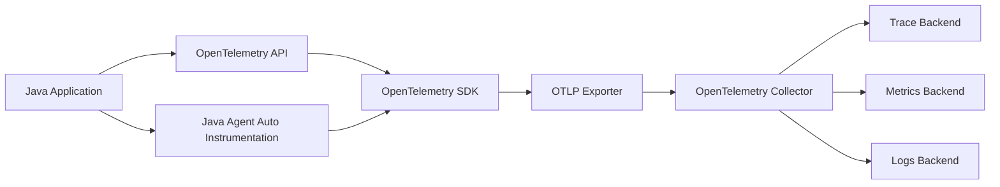
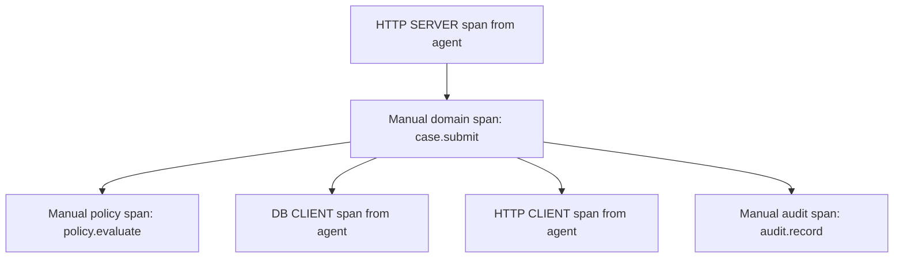
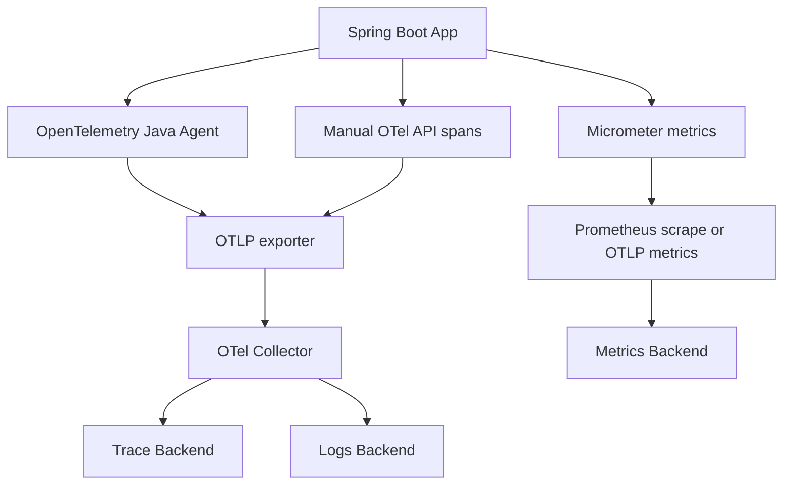
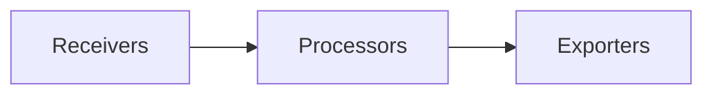
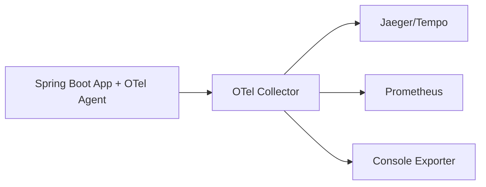

# Part 028 — OpenTelemetry Java

Part sebelumnya membangun mental model distributed tracing. Sekarang kita masuk ke praktik Java dengan OpenTelemetry.

OpenTelemetry Java dapat dipakai dalam tiga lapisan:

1. **Zero-code instrumentation** dengan Java agent.
2. **Manual instrumentation** dengan OpenTelemetry API untuk domain-specific span, metric, log enrichment.
3. **SDK/Collector configuration** untuk export, sampling, resource attributes, processors, dan vendor/backend integration.

Tujuan part ini bukan hanya “trace muncul di Jaeger/Tempo/vendor APM”. Tujuan sebenarnya:

> Aplikasi Java menghasilkan telemetry yang benar secara causal, aman secara data, stabil secara schema, dan berguna saat debugging production failure.

---

## 1. OpenTelemetry Architecture



Responsibilities:

| Component | Responsibility |
|---|---|
| API | Code-level interface untuk membuat span/metric/log tanpa mengikat vendor |
| SDK | Implementasi runtime: sampler, processor, exporter, resource |
| Java Agent | Bytecode instrumentation untuk framework/library populer |
| Exporter | Mengirim telemetry keluar, umumnya OTLP |
| Collector | Menerima, memproses, batch, sample, transform, route telemetry |
| Backend | Storage, query, visualization, alerting |

Important boundary:

> Business code sebaiknya bergantung pada OpenTelemetry API, bukan langsung pada vendor APM.

---

## 2. Auto Instrumentation vs Manual Instrumentation

### 2.1 Auto Instrumentation

Java agent cocok untuk edge spans:

- inbound HTTP server
- outbound HTTP client
- JDBC/database client
- messaging clients
- common frameworks
- logs MDC correlation depending on configuration
- runtime/JVM metrics depending on setup

Kelebihan:

- cepat aktif
- coverage luas
- sedikit perubahan code
- bagus untuk dependency map

Keterbatasan:

- tidak tahu domain operation kamu
- tidak tahu regulatory decision semantics
- tidak tahu state transition
- tidak tahu fallback policy khusus
- tidak tahu business error code kamu

### 2.2 Manual Instrumentation

Manual instrumentation cocok untuk:

- domain command
- policy evaluation
- validation aggregate
- state transition
- retry orchestration
- fallback selection
- audit recording
- idempotency decision
- batch chunk processing
- feature degradation

Rule:

> Pakai agent untuk technical boundary. Pakai manual span untuk domain boundary.



---

## 3. Running the Java Agent

Common launch:

```bash
java \
  -javaagent:/opt/opentelemetry-javaagent.jar \
  -Dotel.service.name=case-command-service \
  -Dotel.resource.attributes=deployment.environment=prod,service.version=2026.06.28.1 \
  -Dotel.exporter.otlp.endpoint=http://otel-collector:4318 \
  -Dotel.traces.exporter=otlp \
  -Dotel.metrics.exporter=otlp \
  -Dotel.logs.exporter=otlp \
  -jar app.jar
```

Equivalent environment style:

```bash
export JAVA_TOOL_OPTIONS="-javaagent:/opt/opentelemetry-javaagent.jar"
export OTEL_SERVICE_NAME="case-command-service"
export OTEL_RESOURCE_ATTRIBUTES="deployment.environment=prod,service.version=2026.06.28.1"
export OTEL_EXPORTER_OTLP_ENDPOINT="http://otel-collector:4318"
export OTEL_TRACES_EXPORTER="otlp"
export OTEL_METRICS_EXPORTER="otlp"
export OTEL_LOGS_EXPORTER="otlp"

java -jar app.jar
```

For Kubernetes, prefer environment variables and mounted agent jar image/layer.

Example container command concept:

```yaml
containers:
  - name: app
    image: registry.example.com/case-command-service:2026.06.28.1
    env:
      - name: JAVA_TOOL_OPTIONS
        value: "-javaagent:/otel/opentelemetry-javaagent.jar"
      - name: OTEL_SERVICE_NAME
        value: "case-command-service"
      - name: OTEL_RESOURCE_ATTRIBUTES
        value: "deployment.environment=prod,service.version=2026.06.28.1"
      - name: OTEL_EXPORTER_OTLP_ENDPOINT
        value: "http://otel-collector.observability:4318"
```

---

## 4. Resource Attributes

Resource attributes identify the producer of telemetry.

Minimal production fields:

```text
service.name=case-command-service
service.version=2026.06.28.1
deployment.environment=prod
service.namespace=enforcement
```

Useful platform fields:

```text
k8s.namespace.name=enforcement
k8s.pod.name=case-command-7fdc...
k8s.container.name=app
cloud.region=ap-southeast-3
```

Do not put per-request/user/case data in resource attributes. Resource describes service instance, not business entity.

Bad:

```text
case.id=CASE-123
user.id=U-999
```

---

## 5. Maven Dependencies for Manual Instrumentation

For application code that creates spans manually:

```xml
<dependencies>
    <dependency>
        <groupId>io.opentelemetry</groupId>
        <artifactId>opentelemetry-api</artifactId>
    </dependency>

    <dependency>
        <groupId>io.opentelemetry</groupId>
        <artifactId>opentelemetry-context</artifactId>
    </dependency>
</dependencies>
```

If you configure SDK in application code, add SDK/exporter dependencies. In many production setups with Java agent, application code only needs API dependency. The agent supplies SDK runtime and bridges instrumentation.

---

## 6. Creating a Manual Span

Example domain command instrumentation:

```java
package com.example.casecmd.telemetry;

import io.opentelemetry.api.GlobalOpenTelemetry;
import io.opentelemetry.api.trace.Span;
import io.opentelemetry.api.trace.StatusCode;
import io.opentelemetry.api.trace.Tracer;
import io.opentelemetry.context.Scope;

public final class CaseCommandTelemetry {

    private static final Tracer tracer = GlobalOpenTelemetry.getTracer(
            "com.example.casecmd",
            "1.0.0"
    );

    private final CaseService caseService;

    public CaseCommandTelemetry(CaseService caseService) {
        this.caseService = caseService;
    }

    public SubmitResult submit(SubmitCaseCommand command) {
        Span span = tracer.spanBuilder("case.submit")
                .setAttribute("domain.entity", "case")
                .setAttribute("domain.operation", "submit")
                .setAttribute("case.state.target", "SUBMITTED")
                .startSpan();

        try (Scope ignored = span.makeCurrent()) {
            SubmitResult result = caseService.submit(command);

            span.setAttribute("outcome", result.outcome().name());
            span.setAttribute("retryable", result.retryable());

            if (result.rejected()) {
                span.setAttribute("error.code", result.errorCode());
                span.setStatus(StatusCode.ERROR, result.errorCode());
            }

            return result;
        } catch (DomainException ex) {
            span.recordException(ex);
            span.setAttribute("error.code", ex.errorCode());
            span.setAttribute("retryable", ex.retryable());
            span.setStatus(StatusCode.ERROR, ex.errorCode());
            throw ex;
        } catch (RuntimeException ex) {
            span.recordException(ex);
            span.setStatus(StatusCode.ERROR, ex.getClass().getSimpleName());
            throw ex;
        } finally {
            span.end();
        }
    }
}
```

Important points:

- `span.makeCurrent()` makes this span parent for downstream spans created in the same context.
- `recordException(ex)` records exception event on the span.
- `setStatus(ERROR, ...)` classifies failure.
- `span.end()` must happen exactly once.
- The span name is stable: `case.submit`, not `case.submit.CASE-123`.

---

## 7. Utility Wrapper to Avoid Span Leaks

Manual span code can become repetitive. Encapsulate carefully.

```java
package com.example.telemetry;

import io.opentelemetry.api.trace.Span;
import io.opentelemetry.api.trace.StatusCode;
import io.opentelemetry.api.trace.Tracer;
import io.opentelemetry.context.Scope;

import java.util.function.Supplier;

public final class TracingSupport {

    private final Tracer tracer;

    public TracingSupport(Tracer tracer) {
        this.tracer = tracer;
    }

    public <T> T inSpan(String spanName, Supplier<T> action) {
        Span span = tracer.spanBuilder(spanName).startSpan();
        try (Scope ignored = span.makeCurrent()) {
            return action.get();
        } catch (RuntimeException ex) {
            span.recordException(ex);
            span.setStatus(StatusCode.ERROR, ex.getClass().getSimpleName());
            throw ex;
        } finally {
            span.end();
        }
    }
}
```

Domain-aware wrapper:

```java
public <T> T inDomainSpan(
        String spanName,
        String operation,
        Supplier<T> action
) {
    Span span = tracer.spanBuilder(spanName)
            .setAttribute("domain.operation", operation)
            .startSpan();

    try (Scope ignored = span.makeCurrent()) {
        return action.get();
    } catch (DomainException ex) {
        span.recordException(ex);
        span.setAttribute("error.code", ex.errorCode());
        span.setAttribute("retryable", ex.retryable());
        span.setStatus(StatusCode.ERROR, ex.errorCode());
        throw ex;
    } catch (RuntimeException ex) {
        span.recordException(ex);
        span.setStatus(StatusCode.ERROR, ex.getClass().getSimpleName());
        throw ex;
    } finally {
        span.end();
    }
}
```

Do not hide all tracing behind magic annotations if developers lose understanding of span lifetime.

---

## 8. Adding Span Events

Events are useful for state changes inside a longer span.

```java
Span current = Span.current();

current.addEvent("validation.completed", Attributes.builder()
        .put("validation.error_count", errors.size())
        .put("validation.mode", "accumulate")
        .build());
```

Example fallback event:

```java
current.addEvent("fallback.selected", Attributes.builder()
        .put("fallback.name", "stale-risk-score")
        .put("fallback.reason", "risk-service-timeout")
        .put("fallback.data_staleness_ms", staleAge.toMillis())
        .build());
```

Use events when:

- event is meaningful but not long enough for span
- you need point-in-time evidence
- you need to mark phase transition

Use span when:

- operation has duration
- operation can fail independently
- operation has child operations
- operation crosses boundary

---

## 9. Exception Recording Policy

A good exception trace includes:

```text
exception.type
exception.message, if safe
exception.stacktrace, if configured/allowed
error.code
retryable
outcome
```

Manual pattern:

```java
try {
    return action.get();
} catch (DomainException ex) {
    span.recordException(ex);
    span.setAttribute("error.code", ex.errorCode());
    span.setAttribute("error.category", "domain");
    span.setAttribute("retryable", ex.retryable());
    span.setStatus(StatusCode.ERROR, ex.errorCode());
    throw ex;
}
```

For infrastructure failure:

```java
catch (ExternalDependencyException ex) {
    span.recordException(ex);
    span.setAttribute("error.category", "dependency");
    span.setAttribute("peer.service", ex.peerService());
    span.setAttribute("retryable", ex.retryable());
    span.setStatus(StatusCode.ERROR, ex.errorCode());
    throw ex;
}
```

Avoid:

```java
span.setAttribute("exception.message", ex.getMessage()); // if message may contain PII
span.setAttribute("payload", command.toString());         // dangerous
```

---

## 10. Context Propagation in Java

### 10.1 Current Context

OpenTelemetry context is attached to execution flow.

```java
Span parent = tracer.spanBuilder("parent").startSpan();
try (Scope ignored = parent.makeCurrent()) {
    doWork(); // child spans created here see parent
} finally {
    parent.end();
}
```

Inside `doWork()`:

```java
Span child = tracer.spanBuilder("child").startSpan();
try (Scope ignored = child.makeCurrent()) {
    // child is current
} finally {
    child.end();
}
```

### 10.2 Executor Boundary

Thread boundaries can lose context if not instrumented.

Problem:

```java
executor.submit(() -> {
    Span child = tracer.spanBuilder("async-work").startSpan();
    // may not have correct parent if context not propagated
});
```

Safer explicit pattern:

```java
import io.opentelemetry.context.Context;

Context parentContext = Context.current();

executor.submit(parentContext.wrap(() -> {
    Span span = tracer.spanBuilder("async-work").startSpan();
    try (Scope ignored = span.makeCurrent()) {
        performAsyncWork();
    } catch (RuntimeException ex) {
        span.recordException(ex);
        span.setStatus(StatusCode.ERROR);
        throw ex;
    } finally {
        span.end();
    }
}));
```

### 10.3 CompletableFuture Boundary

```java
Context context = Context.current();

CompletableFuture<Result> future = CompletableFuture.supplyAsync(
        context.wrapSupplier(() -> {
            Span span = tracer.spanBuilder("risk.lookup.async").startSpan();
            try (Scope ignored = span.makeCurrent()) {
                return riskClient.lookup();
            } catch (RuntimeException ex) {
                span.recordException(ex);
                span.setStatus(StatusCode.ERROR);
                throw ex;
            } finally {
                span.end();
            }
        }),
        executor
);
```

If using agent, many common executors/frameworks may already be instrumented. Still test your actual async path.

### 10.4 Reactor Boundary

Reactive pipelines have their own context mechanics. Do not assume ThreadLocal/MDC works the same as blocking request-per-thread code.

Conceptual pattern:

```java
Mono.deferContextual(ctx -> {
    Span span = tracer.spanBuilder("case.submit.reactive").startSpan();
    return Mono.fromCallable(() -> {
                try (Scope ignored = span.makeCurrent()) {
                    return service.submit(command);
                }
            })
            .doOnError(ex -> {
                span.recordException(ex);
                span.setStatus(StatusCode.ERROR);
            })
            .doFinally(signal -> span.end());
});
```

Prefer framework-supported instrumentation where available, then add manual spans around domain operations.

---

## 11. Propagating Context Over HTTP Manually

Most production systems should let instrumentation libraries handle HTTP propagation. But knowing the model helps when debugging custom clients.

Conceptual injection:

```java
TextMapSetter<HttpRequestBuilder> setter =
        (carrier, key, value) -> carrier.header(key, value);

Context current = Context.current();
openTelemetry.getPropagators()
        .getTextMapPropagator()
        .inject(current, requestBuilder, setter);
```

Conceptual extraction:

```java
TextMapGetter<HttpServletRequest> getter = new TextMapGetter<>() {
    @Override
    public Iterable<String> keys(HttpServletRequest request) {
        return Collections.list(request.getHeaderNames());
    }

    @Override
    public String get(HttpServletRequest request, String key) {
        return request.getHeader(key);
    }
};

Context extracted = openTelemetry.getPropagators()
        .getTextMapPropagator()
        .extract(Context.current(), request, getter);
```

Do this manually only when needed. Most frameworks should be instrumented by agent/library.

---

## 12. Messaging Context Propagation

For message producers:

```text
current trace context -> message headers
```

For consumers:

```text
message headers -> extracted context -> consumer span
```

Conceptual Kafka header injection:

```java
TextMapSetter<ProducerRecord<String, byte[]>> setter = (record, key, value) ->
        record.headers().add(key, value.getBytes(StandardCharsets.UTF_8));

openTelemetry.getPropagators()
        .getTextMapPropagator()
        .inject(Context.current(), record, setter);
```

Consumer extraction concept:

```java
TextMapGetter<ConsumerRecord<String, byte[]>> getter = new TextMapGetter<>() {
    @Override
    public Iterable<String> keys(ConsumerRecord<String, byte[]> record) {
        List<String> keys = new ArrayList<>();
        record.headers().forEach(header -> keys.add(header.key()));
        return keys;
    }

    @Override
    public String get(ConsumerRecord<String, byte[]> record, String key) {
        Header header = record.headers().lastHeader(key);
        if (header == null) {
            return null;
        }
        return new String(header.value(), StandardCharsets.UTF_8);
    }
};

Context parent = openTelemetry.getPropagators()
        .getTextMapPropagator()
        .extract(Context.current(), record, getter);
```

For message systems, decide whether consumer span should be:

- child of producer span
- linked to producer span
- new trace with domain correlation ID

The answer depends on semantics:

| Scenario | Recommended Relationship |
|---|---|
| immediate async processing | child or linked consumer span |
| durable queue with delayed processing | often link is more accurate |
| batch consumes many messages | links to multiple source contexts |
| long-running workflow | separate trace + domain correlation |

---

## 13. Span Links in Java

Conceptual usage:

```java
SpanContext producerContext = extractedSpanContext;

Span consumerSpan = tracer.spanBuilder("case-events process CaseSubmitted")
        .addLink(producerContext)
        .setSpanKind(SpanKind.CONSUMER)
        .startSpan();
```

Use links when parent-child would lie about lifecycle ownership.

Example:

- Message produced at 10:00
- Consumer processes at 10:30
- Producer request long finished

Making consumer a direct child may imply a misleading continuous execution chain. Link preserves relation without pretending the producer is still active.

---

## 14. Semantic Conventions

Semantic conventions provide common attribute names for operations.

Use them whenever applicable:

- HTTP server/client
- database call
- messaging
- RPC
- exceptions
- resources
- logs
- metrics

Why it matters:

- dashboards can aggregate consistently
- backend understands common fields
- polyglot systems correlate better
- future tools work without custom mapping

Domain-specific attributes are still allowed, but prefix/structure them deliberately.

Example:

```text
http.request.method = POST
http.route = /cases/{caseId}/submit
http.response.status_code = 409

error.code = CASE_STATE_CONFLICT
domain.operation = submit_case
case.state.from = UNDER_REVIEW
case.state.to = SUBMITTED
```

Avoid inventing custom fields for standard concepts:

```text
method=POST
url_template=/cases/{id}
status=409
```

Use standard keys where standard keys exist.

---

## 15. Spring Boot Integration Model

In Spring Boot services, a common production setup:



Design choice:

- Use Micrometer for application metrics if already standardized in Spring Boot.
- Use OpenTelemetry for traces and context propagation.
- Bridge/align logs with `trace_id` and `span_id`.
- Avoid duplicating same metric in both Micrometer and manual OTel unless intentionally harmonized.

---

## 16. Logs Correlation

Goal:

```json
{
  "timestamp": "2026-06-28T10:15:30Z",
  "level": "WARN",
  "message": "Case submission rejected",
  "trace_id": "0af7651916cd43dd8448eb211c80319c",
  "span_id": "b7ad6b7169203331",
  "error.code": "CASE_STATE_CONFLICT",
  "domain.operation": "submit_case"
}
```

With Java agent and logging instrumentation, trace/span IDs can be injected into MDC/log context depending on setup.

But verify:

- logs contain `trace_id`
- logs contain `span_id`
- async logs still carry context
- Reactor logs still carry context
- virtual thread logs still carry context
- scheduled job logs carry trace when a job span is created

Do not assume. Test by triggering one request and checking trace-to-log navigation.

---

## 17. Collector Configuration Mental Model

OpenTelemetry Collector typically does:



Example conceptual config:

```yaml
receivers:
  otlp:
    protocols:
      grpc:
      http:

processors:
  batch:
  memory_limiter:
    check_interval: 1s
    limit_mib: 512
  resource:
    attributes:
      - key: deployment.environment
        value: prod
        action: upsert

exporters:
  otlp/traces:
    endpoint: trace-backend:4317
  prometheusremotewrite:
    endpoint: http://prometheus-remote-write/api/v1/write
  otlp/logs:
    endpoint: logs-backend:4317

service:
  pipelines:
    traces:
      receivers: [otlp]
      processors: [memory_limiter, resource, batch]
      exporters: [otlp/traces]
    metrics:
      receivers: [otlp]
      processors: [memory_limiter, resource, batch]
      exporters: [prometheusremotewrite]
    logs:
      receivers: [otlp]
      processors: [memory_limiter, resource, batch]
      exporters: [otlp/logs]
```

Production collector concerns:

- backpressure
- queue size
- batch size
- retry policy
- memory limit
- tail sampling
- data redaction
- multi-tenant routing
- environment routing
- failure mode when backend unavailable

Telemetry pipeline itself must be reliable enough not to take down the application.

---

## 18. Sampling Configuration

### 18.1 Parent-Based Trace ID Ratio

Common app-side sampling:

```bash
export OTEL_TRACES_SAMPLER="parentbased_traceidratio"
export OTEL_TRACES_SAMPLER_ARG="0.10"
```

Meaning:

- respect upstream sampling decision
- start new traces with 10% probability

### 18.2 Error Retention

If you sample head-side at 10%, you may drop rare errors.

Better production model:

- app/head sampling for cost guard
- collector tail sampling to retain errors/slow traces
- always sample selected critical operations if volume allows

Example conceptual tail sampling rules:

```yaml
processors:
  tail_sampling:
    decision_wait: 10s
    policies:
      - name: errors
        type: status_code
        status_code:
          status_codes: [ERROR]
      - name: slow
        type: latency
        latency:
          threshold_ms: 1000
      - name: probabilistic-normal
        type: probabilistic
        probabilistic:
          sampling_percentage: 5
```

Tail sampling requires collector/backend capacity and buffering. It is not free.

---

## 19. Instrumenting Retry and Fallback

Manual tracing adds business semantics around auto-instrumented HTTP spans.

```java
public RiskScore lookupRisk(SubjectId subjectId) {
    Span span = tracer.spanBuilder("risk.lookup")
            .setAttribute("peer.service", "risk-service")
            .startSpan();

    try (Scope ignored = span.makeCurrent()) {
        for (int attempt = 1; attempt <= 3; attempt++) {
            span.addEvent("retry.attempt.started", Attributes.builder()
                    .put("retry.attempt", attempt)
                    .build());

            try {
                RiskScore score = riskClient.fetch(subjectId); // agent creates HTTP client span
                span.setAttribute("retry.attempts.used", attempt);
                span.setStatus(StatusCode.OK);
                return score;
            } catch (TimeoutException ex) {
                span.addEvent("retry.attempt.failed", Attributes.builder()
                        .put("retry.attempt", attempt)
                        .put("error.category", "timeout")
                        .build());

                if (attempt == 3) {
                    span.recordException(ex);
                    span.setAttribute("error.code", "RISK_TIMEOUT");
                    span.setStatus(StatusCode.ERROR, "RISK_TIMEOUT");
                    return fallbackRisk(subjectId, span);
                }
            }
        }

        throw new IllegalStateException("unreachable");
    } finally {
        span.end();
    }
}

private RiskScore fallbackRisk(SubjectId subjectId, Span parentSpan) {
    parentSpan.addEvent("fallback.selected", Attributes.builder()
            .put("fallback.name", "stale-risk-score")
            .put("fallback.reason", "risk-timeout")
            .build());

    Span fallbackSpan = tracer.spanBuilder("risk.lookup.fallback.stale")
            .startSpan();
    try (Scope ignored = fallbackSpan.makeCurrent()) {
        RiskScore score = staleRiskRepository.find(subjectId);
        fallbackSpan.setAttribute("fallback.outcome", "used_stale_value");
        fallbackSpan.setAttribute("fallback.data_staleness_ms", score.ageMillis());
        return score;
    } finally {
        fallbackSpan.end();
    }
}
```

Notes:

- Auto instrumentation captures HTTP client calls.
- Manual parent span captures retry orchestration.
- Fallback is explicit and visible.
- Error code is stable.

---

## 20. Instrumenting Validation and Rejection

```java
public ValidationResult validate(SubmitCaseCommand command) {
    Span span = tracer.spanBuilder("case.submit.validation")
            .setAttribute("validation.mode", "accumulate")
            .startSpan();

    try (Scope ignored = span.makeCurrent()) {
        ValidationResult result = validator.validate(command);

        span.setAttribute("validation.error_count", result.errors().size());
        span.setAttribute("validation.outcome", result.valid() ? "accepted" : "rejected");

        if (!result.valid()) {
            span.addEvent("validation.rejected", Attributes.builder()
                    .put("error.code", result.primaryErrorCode())
                    .put("validation.error_count", result.errors().size())
                    .build());
        }

        return result;
    } finally {
        span.end();
    }
}
```

Do not attach raw invalid field values.

Better:

```text
validation.field = address.postal_code
validation.rule = required
```

Dangerous:

```text
validation.value = full user-provided address
```

---

## 21. Instrumenting State Transitions

For regulatory lifecycle systems, state transition spans are highly valuable.

```java
Span span = tracer.spanBuilder("case.transition")
        .setAttribute("domain.entity", "case")
        .setAttribute("transition.name", "submit")
        .setAttribute("case.state.from", fromState.name())
        .setAttribute("case.state.to", toState.name())
        .startSpan();

try (Scope ignored = span.makeCurrent()) {
    transitionService.apply(command);
    span.setAttribute("transition.outcome", "applied");
    span.setStatus(StatusCode.OK);
} catch (InvalidTransitionException ex) {
    span.recordException(ex);
    span.setAttribute("transition.outcome", "rejected");
    span.setAttribute("error.code", ex.errorCode());
    span.setStatus(StatusCode.ERROR, ex.errorCode());
    throw ex;
} finally {
    span.end();
}
```

Trace answers operational questions:

- which transition was attempted?
- from which state to which state?
- was rejection domain-valid?
- which rule blocked it?
- was audit recorded?

Audit store still remains the official evidence.

---

## 22. Instrumenting Batch Jobs

Avoid span per row for large batch.

Good structure:

```text
job.import_cases
├── chunk.read
├── chunk.validate
├── chunk.persist
└── chunk.publish_summary
```

Example:

```java
Span jobSpan = tracer.spanBuilder("job.import_cases").startSpan();
try (Scope jobScope = jobSpan.makeCurrent()) {
    for (int chunkIndex = 0; chunkIndex < chunks.size(); chunkIndex++) {
        processChunk(chunks.get(chunkIndex), chunkIndex);
    }
} finally {
    jobSpan.end();
}
```

Chunk span:

```java
private void processChunk(List<Record> records, int chunkIndex) {
    Span span = tracer.spanBuilder("job.import_cases.chunk")
            .setAttribute("chunk.index", chunkIndex)
            .setAttribute("chunk.size", records.size())
            .startSpan();

    try (Scope ignored = span.makeCurrent()) {
        ChunkResult result = importer.process(records);
        span.setAttribute("records.success", result.successCount());
        span.setAttribute("records.failed", result.failedCount());
    } catch (RuntimeException ex) {
        span.recordException(ex);
        span.setStatus(StatusCode.ERROR);
        throw ex;
    } finally {
        span.end();
    }
}
```

If row-level debugging is needed, enable temporary diagnostic sampling for selected batch/job only.

---

## 23. Instrumenting Shutdown

On shutdown, create a lifecycle span or structured events if the telemetry pipeline still has time to flush.

```java
public void shutdown() {
    Span span = tracer.spanBuilder("service.shutdown")
            .setAttribute("shutdown.reason", "SIGTERM")
            .startSpan();

    try (Scope ignored = span.makeCurrent()) {
        span.addEvent("intake.stopped");
        intake.stop();

        span.addEvent("executor.drain.started", Attributes.builder()
                .put("inflight.count", executor.inflightCount())
                .build());

        executor.drain(Duration.ofSeconds(20));

        span.addEvent("telemetry.flush.started");
        telemetry.flush(Duration.ofSeconds(3));
    } catch (RuntimeException ex) {
        span.recordException(ex);
        span.setStatus(StatusCode.ERROR);
        throw ex;
    } finally {
        span.end();
    }
}
```

Be careful:

- Shutdown spans may be lost if exporter/collector is already unavailable.
- Logs may be more reliable at the final moments.
- Metrics can expose shutdown counters before termination.
- Kubernetes grace period limits all of this.

---

## 24. Data Safety and Redaction

OpenTelemetry makes it easy to ship data. That is both useful and dangerous.

Never include:

- credentials
- tokens
- raw request/response body
- full SQL with sensitive literal
- customer name/email/phone/address
- case narrative
- investigation notes
- unredacted exception messages if they may contain PII

Prefer:

```text
error.code = CASE_STATE_CONFLICT
case.type = enforcement
case.state.from = UNDER_REVIEW
policy.name = submit_case_policy
policy.version = 2026.06
```

For special debugging, use controlled diagnostic tooling with:

- access control
- time limit
- sampling limit
- approval
- audit trail
- redaction

---

## 25. Debugging Trace Gaps

### 25.1 No traces at all

Check:

```text
- Java agent actually loaded?
- OTEL_SERVICE_NAME set?
- exporter endpoint reachable?
- collector receiver enabled?
- backend ingest healthy?
- sampling set to always_off accidentally?
- firewall/network policy blocking port?
```

Useful startup check:

```bash
java -javaagent:/otel/opentelemetry-javaagent.jar -jar app.jar
```

Look for agent startup logs.

### 25.2 Server spans exist, client spans missing

Check:

```text
- HTTP client library supported?
- custom client wrapper bypasses instrumentation?
- instrumentation disabled?
- request executed in uninstrumented native code?
```

### 25.3 Client span exists, downstream server trace is new root

Check:

```text
- traceparent header sent?
- proxy strips headers?
- downstream extracts W3C context?
- different propagation config?
- message headers dropped?
```

### 25.4 Logs have no trace ID

Check:

```text
- logging instrumentation enabled?
- MDC fields included in log pattern/JSON layout?
- async appender preserves MDC?
- Reactor/CompletableFuture/Executor context propagated?
```

### 25.5 Error trace has no exception

Check:

```text
- exception swallowed?
- boundary converts to response without recordException?
- span status set only at outer handler?
- domain result returned instead of thrown without error attributes?
```

### 25.6 Too many spans

Check:

```text
- custom instrumentation per method/loop?
- batch row-level spans?
- debug instrumentation enabled in prod?
- library instrumentation too verbose?
```

---

## 26. Local Development Setup

A simple local loop:



For learning, start with console/log exporter or local collector. Confirm:

1. root HTTP span appears
2. DB/client spans appear
3. manual domain span appears
4. logs contain trace ID
5. error spans show exception event
6. context survives async call

---

## 27. Testing Telemetry

Telemetry should be tested because instrumentation breaks silently.

Test categories:

| Test | Purpose |
|---|---|
| Unit test manual span wrapper | `span.end()` always called, exceptions recorded |
| Integration test HTTP trace | inbound + outbound spans connected |
| Async context test | executor/future/reactor path keeps parent context |
| Error mapping test | domain exception sets `error.code` |
| Redaction test | sensitive data not emitted |
| Sampling test | errors retained in staging collector |
| Shutdown test | drain events/logs emitted before termination |

Example design:

```text
Given POST /cases/{id}/submit rejects with CASE_STATE_CONFLICT
Then trace contains span case.submit
And span has error.code=CASE_STATE_CONFLICT
And logs contain same trace_id
And no raw case narrative appears in span attributes/logs
```

---

## 28. Production Rollout Plan

### Phase 1 — Agent only

- enable Java agent in staging
- set service/resource attributes
- export traces to collector
- verify inbound/outbound/db spans
- verify cost/volume

### Phase 2 — Logs correlation

- include trace/span IDs in JSON logs
- verify async boundaries
- verify trace-to-log navigation

### Phase 3 — Manual domain spans

Add spans for:

- critical commands
- policy evaluation
- state transition
- fallback/retry orchestration
- audit boundary

### Phase 4 — Sampling and governance

- retain errors
- retain slow traces
- sample normal traffic
- redact sensitive data
- define telemetry schema review

### Phase 5 — Incident workflow

- dashboards link metrics → traces → logs
- runbooks include trace reading procedure
- on-call knows error code catalog
- postmortems include instrumentation gaps

---

## 29. OpenTelemetry Java Anti-Patterns

### 29.1 Agent Installed, Problem Solved

Agent gives technical spans, not domain understanding.

### 29.2 Manual Spans Around Every Method

This creates cost and noise. Instrument operation boundaries.

### 29.3 No Stable Service Name

If `service.name` changes per pod/build randomly, dashboards fragment.

### 29.4 High-Cardinality Span Names

Bad:

```text
GET /cases/CASE-123
```

Good:

```text
GET /cases/{caseId}
```

### 29.5 Sensitive Baggage

Baggage propagates. Treat it like outbound header data.

### 29.6 Forgetting `span.end()`

Leaked spans distort duration and may never export.

### 29.7 Status Without Error Code

`ERROR` alone is not enough. Add stable error code/category.

### 29.8 Telemetry Backend as Audit Store

Traces are sampled, mutable by retention policy, and operational. They do not replace official audit evidence.

---

## 30. Reference Implementation Sketch

```java
public final class CaseSubmitHandler {

    private final Tracer tracer;
    private final CaseApplicationService service;

    public CaseSubmitHandler(OpenTelemetry openTelemetry, CaseApplicationService service) {
        this.tracer = openTelemetry.getTracer("case-command-service");
        this.service = service;
    }

    public ProblemOr<SubmitResponse> submit(SubmitCaseCommand command) {
        Span span = tracer.spanBuilder("case.submit")
                .setAttribute("domain.operation", "submit_case")
                .setAttribute("domain.entity", "case")
                .startSpan();

        try (Scope ignored = span.makeCurrent()) {
            SubmitOutcome outcome = service.submit(command);

            if (outcome.accepted()) {
                span.setAttribute("outcome", "accepted");
                span.setStatus(StatusCode.OK);
                return ProblemOr.success(new SubmitResponse(outcome.caseVersion()));
            }

            span.setAttribute("outcome", "rejected");
            span.setAttribute("error.code", outcome.errorCode());
            span.setAttribute("retryable", outcome.retryable());
            span.setStatus(StatusCode.ERROR, outcome.errorCode());

            return ProblemOr.problem(ProblemDetails.from(outcome));
        } catch (DomainException ex) {
            span.recordException(ex);
            span.setAttribute("error.category", "domain");
            span.setAttribute("error.code", ex.errorCode());
            span.setAttribute("retryable", ex.retryable());
            span.setStatus(StatusCode.ERROR, ex.errorCode());
            throw ex;
        } catch (RuntimeException ex) {
            span.recordException(ex);
            span.setAttribute("error.category", "unexpected");
            span.setStatus(StatusCode.ERROR, ex.getClass().getSimpleName());
            throw ex;
        } finally {
            span.end();
        }
    }
}
```

This gives:

- stable span name
- domain operation attribute
- error code
- retryability
- consistent status
- exception recording
- context propagation to downstream auto-instrumented spans

---

## 31. Capstone Exercise

Instrument a Java/Spring service operation:

```text
POST /cases/{caseId}/submit
```

Requirements:

1. Enable OpenTelemetry Java agent.
2. Set `service.name`, `service.version`, `deployment.environment`.
3. Create manual span `case.submit`.
4. Add child span/event for validation result.
5. Add span/event for policy evaluation.
6. Record domain rejection with `error.code`.
7. Record dependency timeout and retry attempts.
8. Emit fallback selected event.
9. Ensure logs include `trace_id` and `span_id`.
10. Verify no sensitive payload in telemetry.
11. Verify trace survives `CompletableFuture` or executor boundary.
12. Verify trace-to-log navigation during a controlled failure.

Expected trace:

```text
SERVER POST /cases/{caseId}/submit
└── INTERNAL case.submit
    ├── INTERNAL case.submit.validation
    ├── INTERNAL policy.evaluate submit_case
    ├── CLIENT db.case.select_by_id
    ├── INTERNAL risk.lookup
    │   ├── CLIENT GET /risk/{subjectId}
    │   ├── event retry.attempt.failed
    │   └── INTERNAL risk.lookup.fallback.stale
    ├── CLIENT db.case.transition_update
    └── PRODUCER case-events publish CaseSubmitted
```

---

## 32. Production Readiness Checklist

- [ ] Java agent enabled consistently across environments
- [ ] `service.name` stable and meaningful
- [ ] `service.version` set from build/release
- [ ] `deployment.environment` set
- [ ] OTLP endpoint points to collector, not random backend from app code
- [ ] inbound HTTP spans created
- [ ] outbound HTTP spans created
- [ ] DB/broker spans visible where required
- [ ] manual domain spans added for critical operations
- [ ] exceptions recorded near source
- [ ] stable `error.code` added
- [ ] logs include trace/span IDs
- [ ] async context propagation tested
- [ ] message context propagation tested
- [ ] sampling keeps errors/slow traces
- [ ] sensitive data redaction tested
- [ ] collector resource/memory/batch policy configured
- [ ] telemetry failure does not break business traffic

---

## 33. Key Takeaways

1. OpenTelemetry Java works best as a combination of agent + manual domain instrumentation.
2. Auto instrumentation sees frameworks; manual instrumentation explains business causality.
3. `Context` propagation is what keeps distributed traces connected.
4. Span names must be stable and low-cardinality.
5. Exception recording must include safe stable error code, not just stack trace.
6. Baggage is powerful but risky because it propagates across boundaries.
7. Collector configuration is part of production architecture, not an afterthought.
8. Telemetry must be tested like other production behavior.

---

## 34. References

- OpenTelemetry Java: https://opentelemetry.io/docs/languages/java/
- OpenTelemetry Java Agent: https://opentelemetry.io/docs/zero-code/java/agent/
- OpenTelemetry Context Propagation: https://opentelemetry.io/docs/concepts/context-propagation/
- OpenTelemetry Semantic Conventions: https://opentelemetry.io/docs/concepts/semantic-conventions/
- OpenTelemetry Trace Semantic Conventions: https://opentelemetry.io/docs/specs/semconv/general/trace/
- OpenTelemetry Baggage: https://opentelemetry.io/docs/concepts/signals/baggage/
- W3C Trace Context: https://www.w3.org/TR/trace-context/
