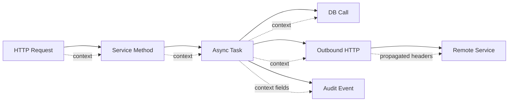
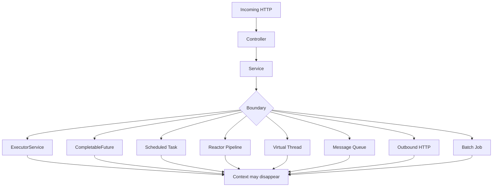
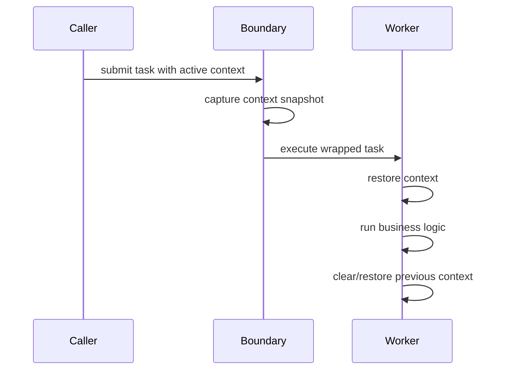
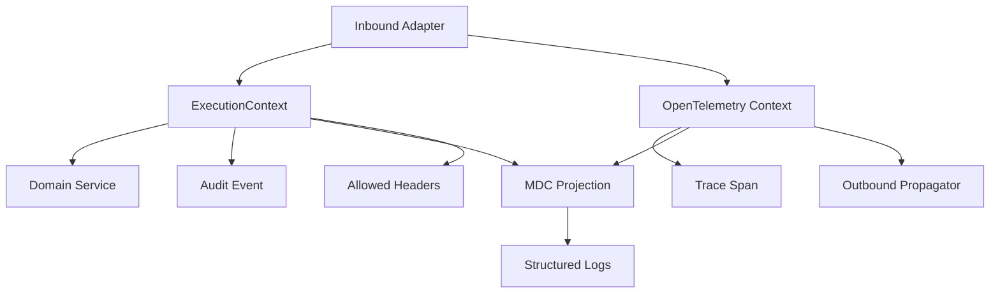

# Part 029 — Context Propagation

> Target skill: mampu mendesain, mengimplementasikan, dan mengaudit propagation of execution context di Java service agar logs, traces, metrics, audit events, authorization decision, retry, dan incident investigation tetap konsisten meskipun execution berpindah thread, service, queue, scheduler, atau reactive pipeline.

Context propagation adalah salah satu penyebab paling umum observability terlihat “ada”, tetapi tidak berguna saat incident. Trace ada, log ada, metric ada, tetapi tidak bisa dirangkai menjadi satu cerita kausal karena `trace_id`, `correlation_id`, tenant, actor, request metadata, atau domain case id hilang di boundary tertentu.

Dalam sistem enterprise/regulatory, context bukan sekadar tracing metadata. Context sering menjadi dasar:

- audit trail,
- authorization decision,
- tenant isolation,
- privacy redaction,
- rate limiting,
- idempotency,
- case lifecycle evidence,
- domain event attribution,
- incident reconstruction.

Kesalahan context propagation bisa membuat sistem tidak hanya sulit di-debug, tetapi juga sulit dipertanggungjawabkan.

---

## 1. Kaufman Deconstruction

Kita pecah skill ini menjadi sub-skill kecil:

| Sub-skill | Outcome |
|---|---|
| Membedakan jenis context | Tidak mencampur trace context, security context, request context, domain context, dan telemetry baggage |
| Mendesain context contract | Tahu field mana mandatory, optional, internal-only, external-propagated, dan audit-grade |
| Memahami propagation boundary | Bisa menemukan tempat context hilang: executor, future, scheduler, virtual thread, Reactor, HTTP client, message queue, batch |
| Menggunakan MDC dengan benar | Log correlation konsisten tanpa memory leak dan tanpa cross-request contamination |
| Menggunakan OpenTelemetry Context | Trace/span tetap terhubung lintas thread dan service |
| Mengendalikan baggage | Metadata lintas service tidak menjadi security leak atau cardinality bomb |
| Testing propagation | Bisa membuat test yang membuktikan context tidak hilang di path penting |

Mental model Kaufman: jangan mulai dari library. Mulai dari **apa yang harus tetap benar saat execution berpindah boundary**.

---

## 2. Core Mental Model: Context Is Causal Glue

Context adalah data kecil yang menjawab:

1. **Who** melakukan operasi?
2. **For whom / tenant mana** operasi dilakukan?
3. **Why** operasi terjadi?
4. **Which request / trace / case / workflow** operasi ini bagian darinya?
5. **What policy** berlaku saat operasi dieksekusi?
6. **What evidence** diperlukan jika operasi gagal?

Tanpa context, event observability hanya menjadi fragmen.



Context propagation memastikan semua node dalam graph di atas tetap bisa ditelusuri sebagai satu unit kerja.

---

## 3. Jangan Campur Semua Menjadi Satu “Context”

Kesalahan desain umum adalah membuat satu class `RequestContext` yang berisi semua hal:

```java
public record RequestContext(
    String correlationId,
    String traceId,
    String tenantId,
    String userId,
    String role,
    String locale,
    String ipAddress,
    String accessToken,
    String caseId,
    String workflowId
) {}
```

Ini terlihat praktis, tetapi berbahaya karena tidak semua field memiliki propagation policy yang sama.

| Context Type | Contoh | Boleh lintas service? | Masuk log? | Masuk metric tag? | Risiko |
|---|---|---:|---:|---:|---|
| Trace context | `trace_id`, `span_id` | Ya | Ya | Biasanya tidak | Trace break |
| Correlation context | `correlation_id`, `request_id` | Ya, terbatas | Ya | Tidak untuk high-cardinality | Investigasi gagal |
| Tenant context | `tenant_id` | Kadang | Ya jika aman | Hati-hati | Data isolation leak/cardinality |
| Actor context | `user_id`, `service_account` | Kadang | Mask/hash | Tidak | Privacy leak |
| Security context | JWT, credentials, authorities | Tidak mentah | Tidak | Tidak | Credential leak |
| Domain context | `case_id`, `claim_id`, `workflow_id` | Kadang | Ya jika non-sensitive | Tidak kecuali bounded | Cardinality/audit leak |
| Baggage | key-value lintas service | Ya, sangat selektif | Hati-hati | Hati-hati | Propagation leak |
| Locale/preference | `locale`, timezone | Kadang | Tidak penting | Tidak | Behavior mismatch |

Rule penting:

> Context harus punya **classification**, bukan hanya field.

---

## 4. Context Contract

Sebelum coding, desain contract seperti ini:

```java
public enum PropagationPolicy {
    LOCAL_ONLY,
    IN_PROCESS_ONLY,
    INTERNAL_SERVICE_BOUNDARY,
    EXTERNAL_SERVICE_BOUNDARY,
    AUDIT_ONLY
}

public enum Sensitivity {
    PUBLIC,
    INTERNAL,
    CONFIDENTIAL,
    SECRET
}

public record ContextFieldSpec(
    String name,
    boolean required,
    PropagationPolicy propagation,
    Sensitivity sensitivity,
    boolean loggable,
    boolean metricTagAllowed,
    String owner
) {}
```

Contoh registry:

| Field | Required | Propagation | Sensitivity | Loggable | Metric Tag | Owner |
|---|---:|---|---|---:|---:|---|
| `trace_id` | Yes | external boundary | internal | yes | no | platform |
| `span_id` | Yes | external boundary | internal | yes | no | platform |
| `correlation_id` | Yes | internal/external | internal | yes | no | platform |
| `tenant_id` | Yes multi-tenant | internal | confidential | yes, masked if needed | bounded only | platform/security |
| `actor_id` | Usually | internal | confidential | hash/mask | no | identity |
| `case_id` | domain path | internal | confidential | yes if allowed | no | domain |
| `idempotency_key` | command path | internal | confidential | hash | no | platform/domain |
| `access_token` | no | local only | secret | no | no | security |

Context contract harus eksplisit karena default propagation biasanya salah.

---

## 5. Java Mechanisms

Java memiliki beberapa mekanisme context, masing-masing dengan trade-off.

### 5.1 Method Parameter

Paling eksplisit:

```java
public Decision evaluatePolicy(PolicyInput input, ExecutionContext context) {
    return rules.evaluate(input, context);
}
```

Kelebihan:

- mudah dites,
- tidak magic,
- tidak rawan cross-thread contamination,
- cocok untuk domain logic.

Kekurangan:

- verbose,
- banyak signature berubah,
- sering tidak cocok untuk framework callbacks.

Gunakan untuk domain-critical context seperti `tenantId`, `caseId`, `actor`, dan policy basis.

### 5.2 ThreadLocal

```java
public final class RequestContextHolder {
    private static final ThreadLocal<RequestContext> CURRENT = new ThreadLocal<>();

    public static void set(RequestContext context) {
        CURRENT.set(context);
    }

    public static RequestContext getRequired() {
        RequestContext context = CURRENT.get();
        if (context == null) {
            throw new IllegalStateException("Missing request context");
        }
        return context;
    }

    public static void clear() {
        CURRENT.remove();
    }
}
```

ThreadLocal cocok untuk framework integration, tetapi rawan:

- context hilang saat pindah thread,
- context bocor di thread pool jika tidak `remove()`,
- test pollution,
- behavior tersembunyi,
- sulit dipakai di reactive pipeline.

Pattern aman:

```java
public <T> T withContext(RequestContext context, Supplier<T> supplier) {
    RequestContextHolder.set(context);
    try {
        return supplier.get();
    } finally {
        RequestContextHolder.clear();
    }
}
```

Never set without clear.

### 5.3 MDC / ThreadContext

MDC digunakan untuk logging correlation.

```java
try (MDC.MDCCloseable ignored = MDC.putCloseable("correlation_id", correlationId)) {
    log.info("case processing started");
}
```

Atau wrapper manual:

```java
public static void withMdc(Map<String, String> fields, Runnable action) {
    Map<String, String> previous = MDC.getCopyOfContextMap();
    try {
        MDC.setContextMap(fields);
        action.run();
    } finally {
        if (previous == null) {
            MDC.clear();
        } else {
            MDC.setContextMap(previous);
        }
    }
}
```

MDC bukan security context. MDC bukan domain source of truth. MDC hanyalah projection untuk log.

### 5.4 OpenTelemetry Context

OpenTelemetry Context membawa execution-scoped values seperti active span. Context bersifat immutable secara konsep dan digunakan untuk mengaitkan work unit yang logis.

```java
Span span = tracer.spanBuilder("case.evaluate").startSpan();
try (Scope scope = span.makeCurrent()) {
    evaluateCase(command);
} catch (Exception ex) {
    span.recordException(ex);
    span.setStatus(StatusCode.ERROR);
    throw ex;
} finally {
    span.end();
}
```

OpenTelemetry `Context` berbeda dari MDC:

| Aspect | MDC | OpenTelemetry Context |
|---|---|---|
| Tujuan utama | Logging fields | Trace/span/baggage propagation |
| Visibility | Logger-specific | OTel API/SDK/instrumentation |
| Mutability model | Map per thread | Immutable context model |
| Cross-service | Tidak otomatis | Via propagators/header injection |
| Risk | log contamination | broken trace/incorrect parent |

---

## 6. Boundary Where Context Dies

Context biasanya hilang di boundary berikut:



Top 1% engineer tidak bertanya “kenapa trace hilang?” secara umum. Mereka bertanya:

> Boundary mana yang tidak melakukan capture, transfer, restore, atau inject context?

---

## 7. Capture → Transfer → Restore → Clear

Pattern universal context propagation:



Implementasi sederhana untuk MDC:

```java
public final class ContextAwareRunnable implements Runnable {
    private final Runnable delegate;
    private final Map<String, String> capturedMdc;

    public ContextAwareRunnable(Runnable delegate) {
        this.delegate = delegate;
        this.capturedMdc = MDC.getCopyOfContextMap();
    }

    @Override
    public void run() {
        Map<String, String> previous = MDC.getCopyOfContextMap();
        try {
            if (capturedMdc == null) {
                MDC.clear();
            } else {
                MDC.setContextMap(capturedMdc);
            }
            delegate.run();
        } finally {
            if (previous == null) {
                MDC.clear();
            } else {
                MDC.setContextMap(previous);
            }
        }
    }
}
```

Executor wrapper:

```java
public final class ContextAwareExecutor implements Executor {
    private final Executor delegate;

    public ContextAwareExecutor(Executor delegate) {
        this.delegate = delegate;
    }

    @Override
    public void execute(Runnable command) {
        delegate.execute(new ContextAwareRunnable(command));
    }
}
```

Catatan: untuk OpenTelemetry, gunakan instrumentation atau context-aware executor yang membawa OTel `Context`, bukan hanya MDC.

---

## 8. CompletableFuture Pitfall

`CompletableFuture` sering memutus MDC dan trace karena stage berjalan di thread berbeda.

Bad:

```java
CompletableFuture.supplyAsync(() -> {
    log.info("loading eligibility"); // correlation_id may be missing
    return eligibilityClient.load(caseId);
});
```

Better:

```java
Executor contextAwareExecutor = new ContextAwareExecutor(ioExecutor);

CompletableFuture.supplyAsync(() -> {
    log.info("loading eligibility");
    return eligibilityClient.load(caseId);
}, contextAwareExecutor);
```

Untuk OpenTelemetry manual:

```java
Context parent = Context.current();

CompletableFuture.supplyAsync(() -> {
    try (Scope scope = parent.makeCurrent()) {
        Span span = tracer.spanBuilder("eligibility.load").startSpan();
        try (Scope child = span.makeCurrent()) {
            return eligibilityClient.load(caseId);
        } catch (Exception ex) {
            span.recordException(ex);
            span.setStatus(StatusCode.ERROR);
            throw ex;
        } finally {
            span.end();
        }
    }
}, executor);
```

Decision rule:

- Untuk aplikasi biasa, prefer OTel Java agent/instrumentation untuk capture context otomatis.
- Untuk boundary custom, explicit wrapper tetap diperlukan.
- Untuk domain context, jangan mengandalkan OTel context saja; buat domain context eksplisit.

---

## 9. Reactor Context

Reactive pipeline tidak selalu berjalan di thread yang sama. ThreadLocal dan MDC bukan source of truth yang reliable.

Bad mental model:

> “MDC sudah diset di controller, jadi semua log di reactive chain pasti punya correlation id.”

Correct mental model:

> Reactive chain punya context model sendiri. Context harus dibawa dalam pipeline, lalu diproyeksikan ke MDC saat logging jika diperlukan.

Contoh konseptual:

```java
Mono.deferContextual(ctx -> {
    String correlationId = ctx.get("correlation_id");
    return service.process(command)
        .doOnEach(signal -> {
            if (signal.isOnNext()) {
                logWithCorrelation(correlationId, "processed item");
            }
        });
}).contextWrite(ctx -> ctx.put("correlation_id", correlationId));
```

Untuk Reactor + OpenTelemetry, gunakan instrumentation resmi jika memungkinkan. Manual bridging mudah salah karena signal bisa berpindah thread dan lifecycle berbeda dari imperative try/finally.

---

## 10. Virtual Threads

Virtual threads membuat model “one thread per request/task” kembali lebih natural untuk blocking-style code. Tetapi ada caveat:

- ThreadLocal bisa digunakan, tetapi tetap harus dibersihkan.
- Jumlah virtual thread bisa sangat banyak; ThreadLocal berukuran besar menjadi overhead.
- Context yang tidak dibatasi bisa membuat memory pressure.
- Thread naming harus dipikirkan agar dump dan log bisa dibaca.
- Jangan menyimpan object domain besar di context.

Pattern:

```java
try (var executor = Executors.newVirtualThreadPerTaskExecutor()) {
    Context parent = Context.current();

    Future<Decision> future = executor.submit(() -> {
        try (Scope scope = parent.makeCurrent()) {
            return policyClient.evaluate(input);
        }
    });

    return future.get();
}
```

Virtual thread tidak menghapus kebutuhan propagation. Ia hanya mengurangi beberapa pain dari thread pool reuse.

---

## 11. HTTP Propagation

Inbound HTTP harus melakukan:

1. extract trace context dari header,
2. create/continue span,
3. derive correlation id jika belum ada,
4. validate tenant/actor context,
5. put safe fields into MDC,
6. execute handler,
7. clear context.

Outbound HTTP harus melakukan:

1. inject trace context,
2. propagate allowed correlation fields,
3. avoid credentials leak,
4. map retry/fallback attempt to span/log/metric,
5. preserve idempotency key only when semantically valid.

Contoh header policy:

| Header | Direction | Rule |
|---|---|---|
| `traceparent` | inbound/outbound | W3C trace context |
| `tracestate` | inbound/outbound | propagate per trust policy |
| `baggage` | inbound/outbound | allowlist only |
| `x-correlation-id` | inbound/outbound | generate if absent, validate length/charset |
| `x-request-id` | inbound only or internal | do not confuse with trace id |
| `authorization` | inbound/outbound | never log, propagate only when explicitly intended |
| `idempotency-key` | command boundary | hash in logs, do not metric tag |

---

## 12. Messaging Propagation

Message queue breaks request-response assumptions.

Producer side:

```java
public void publishCaseSubmitted(CaseSubmitted event) {
    Message message = Message.builder()
        .header("traceparent", currentTraceParent())
        .header("x-correlation-id", currentCorrelationId())
        .header("x-tenant-id", currentTenantId())
        .header("event_id", event.eventId())
        .body(event)
        .build();

    broker.publish(message);
}
```

Consumer side:

```java
public void consume(Message message) {
    ExtractedContext context = contextExtractor.extract(message.headers());

    withExecutionContext(context, () -> {
        try {
            handle(message.body());
            ack(message);
        } catch (RetryableException ex) {
            log.warn("message processing retryable failure", ex);
            nackForRetry(message);
        } catch (NonRetryableException ex) {
            log.error("message processing rejected to dlq", ex);
            sendToDlq(message, ex);
            ack(message);
        }
    });
}
```

Key distinction:

- `trace_id` connects the asynchronous flow.
- `event_id` identifies the message/event.
- `correlation_id` groups business operation or user request.
- `causation_id` points to the event that caused this event.
- `case_id` identifies domain aggregate/process.

Do not overload one id for all roles.

---

## 13. Batch and Scheduled Jobs

Scheduled jobs do not have inbound request context. They need synthetic context.

```java
ExecutionContext context = ExecutionContext.systemJob(
    "daily-case-escalation",
    UUID.randomUUID().toString(),
    Clock.systemUTC().instant()
);

contextRunner.run(context, () -> escalationJob.execute());
```

Recommended fields:

| Field | Example |
|---|---|
| `job_name` | `daily-case-escalation` |
| `job_run_id` | UUID |
| `scheduler_fire_time` | timestamp |
| `trigger_type` | cron/manual/retry/backfill |
| `operator_id` | if manually triggered |
| `tenant_id` | if tenant-scoped |
| `batch_id` | if processing batch chunks |

For regulatory systems, job context is critical because many consequential actions are automated.

---

## 14. Baggage: Powerful but Dangerous

Baggage is propagated key-value metadata. It is tempting to put useful attributes there:

```text
baggage: tenant.id=acme,case.id=C-123,plan=premium
```

Use extreme restraint.

Good baggage candidates:

- low-cardinality routing hints,
- non-sensitive tenant tier,
- experiment cohort if bounded,
- internal classification needed by multiple services.

Bad baggage candidates:

- access token,
- email,
- user full name,
- full case id if sensitive,
- large payload,
- high-cardinality unique IDs unless explicitly accepted,
- anything client-controlled without validation.

Baggage propagates beyond the local service. Treat it as externally visible unless proven otherwise.

---

## 15. Context and Metrics Cardinality

A field can be good for logs but terrible for metrics.

| Field | Log | Trace attribute | Metric tag |
|---|---:|---:|---:|
| `trace_id` | yes | inherent | no |
| `span_id` | yes | inherent | no |
| `correlation_id` | yes | maybe | no |
| `tenant_id` | maybe | maybe | only if bounded/approved |
| `case_id` | maybe | maybe | no |
| `error_code` | yes | yes | yes |
| `operation` | yes | yes | yes |
| `dependency` | yes | yes | yes |
| `retryable` | yes | yes | yes |
| `http.status_code` | yes | yes | yes |

Metric tags must be bounded. Logs can tolerate higher cardinality depending on cost/privacy. Traces sit in the middle.

---

## 16. Context Redaction

Context fields need redaction at projection points.

```java
public final class SafeLogContext {
    public static Map<String, String> from(ExecutionContext ctx) {
        Map<String, String> fields = new LinkedHashMap<>();
        fields.put("correlation_id", ctx.correlationId());
        fields.put("tenant_id", maskTenant(ctx.tenantId()));
        fields.put("actor_hash", hash(ctx.actorId()));
        fields.put("case_id", ctx.caseId().map(SafeLogContext::maskCaseId).orElse("none"));
        return fields;
    }
}
```

Never let every caller decide redaction ad hoc. Redaction is a platform concern.

---

## 17. Context Loss Failure Modes

| Failure Mode | Symptom | Root Cause | Fix |
|---|---|---|---|
| Missing trace child span | Trace has disconnected root spans | Async boundary not instrumented | capture/restore OTel context |
| Logs missing correlation id | Some logs cannot be searched by incident id | MDC not propagated | context-aware executor/filter |
| Wrong user id in logs | One request inherits previous request field | ThreadLocal/MDC not cleared | `try/finally`, remove/restore |
| Metric explosion | backend cost spike | high-cardinality context tag | tag allowlist, views/filter |
| Audit event missing actor | async job emitted event without context | domain context not explicit | pass audit context as value |
| Cross-tenant leak | tenant from previous work reused | pooled thread ThreadLocal leak | clear after every request/task |
| Baggage leak | sensitive field sent downstream | no baggage allowlist | sanitize propagators |
| Retry trace confusion | attempts appear as separate operations | no retry attempt attribute/link | span attributes/events |

---

## 18. Production Context Architecture

A robust architecture separates:



Rules:

1. Domain code receives explicit `ExecutionContext` when the context affects behavior or audit.
2. OpenTelemetry Context owns trace/span propagation.
3. MDC is a derived projection, not authoritative storage.
4. Baggage is allowlisted and minimal.
5. Metrics use only bounded context fields.
6. Every async boundary has a propagation strategy.

---

## 19. Reference Implementation: ExecutionContext

```java
public record ExecutionContext(
    String correlationId,
    String tenantId,
    ActorRef actor,
    Optional<String> caseId,
    Optional<String> workflowId,
    Instant startedAt,
    Trigger trigger
) {
    public static ExecutionContext systemJob(String jobName, String runId, Instant startedAt) {
        return new ExecutionContext(
            runId,
            "system",
            ActorRef.system(jobName),
            Optional.empty(),
            Optional.of(runId),
            startedAt,
            Trigger.job(jobName)
        );
    }
}

public record ActorRef(String type, String id) {
    public static ActorRef system(String name) {
        return new ActorRef("system", name);
    }
}

public record Trigger(String type, String name) {
    public static Trigger job(String name) {
        return new Trigger("job", name);
    }
}
```

This context should not contain credentials, request body, raw PII, or mutable state.

---

## 20. Reference Implementation: Context Runner

```java
public final class ExecutionContextRunner {
    private final ThreadLocal<ExecutionContext> current = new ThreadLocal<>();

    public <T> T call(ExecutionContext context, Callable<T> callable) throws Exception {
        ExecutionContext previous = current.get();
        Map<String, String> previousMdc = MDC.getCopyOfContextMap();

        try {
            current.set(context);
            MDC.setContextMap(SafeLogContext.from(context));
            return callable.call();
        } finally {
            if (previous == null) {
                current.remove();
            } else {
                current.set(previous);
            }

            if (previousMdc == null) {
                MDC.clear();
            } else {
                MDC.setContextMap(previousMdc);
            }
        }
    }

    public ExecutionContext getRequired() {
        ExecutionContext context = current.get();
        if (context == null) {
            throw new IllegalStateException("Missing ExecutionContext");
        }
        return context;
    }
}
```

Important: this handles local `ThreadLocal`/MDC. It does not replace OpenTelemetry propagation.

---

## 21. Testing Context Propagation

Test context at boundaries, not only unit methods.

### Executor test

```java
@Test
void propagatesMdcIntoExecutorTask() throws Exception {
    ExecutorService delegate = Executors.newSingleThreadExecutor();
    Executor executor = new ContextAwareExecutor(delegate);

    try {
        MDC.put("correlation_id", "corr-123");

        CompletableFuture<String> result = new CompletableFuture<>();
        executor.execute(() -> result.complete(MDC.get("correlation_id")));

        assertEquals("corr-123", result.get(1, TimeUnit.SECONDS));
    } finally {
        MDC.clear();
        delegate.shutdownNow();
    }
}
```

### Leak test

```java
@Test
void doesNotLeakMdcBetweenTasks() throws Exception {
    ExecutorService executor = Executors.newSingleThreadExecutor();

    try {
        executor.submit(() -> MDC.put("tenant_id", "tenant-a")).get();
        String value = executor.submit(() -> MDC.get("tenant_id")).get();

        assertNull(value, "MDC leaked across tasks");
    } finally {
        executor.shutdownNow();
    }
}
```

This test will fail if tasks set MDC and never clear it.

---

## 22. Context Propagation Checklist

Use this checklist for production services:

- [ ] Every incoming request gets or validates `correlation_id`.
- [ ] `traceparent`/`tracestate` are extracted and injected by instrumentation or propagator.
- [ ] Domain-affecting context is explicit, not hidden only in MDC.
- [ ] MDC is cleared/restored after every request/task.
- [ ] Executor boundaries use context-aware wrapper or OTel instrumentation.
- [ ] `CompletableFuture` uses explicit executor, not accidental common pool for business-critical work.
- [ ] Reactor context strategy is defined if using reactive pipeline.
- [ ] Virtual thread usage avoids large ThreadLocal payloads.
- [ ] Message producer injects trace/correlation headers.
- [ ] Message consumer extracts and restores context before handling.
- [ ] Batch/scheduled jobs create synthetic execution context.
- [ ] Baggage uses allowlist and redaction.
- [ ] Metrics only use bounded tags.
- [ ] Logs include correlation/trace fields but exclude secrets.
- [ ] Tests prove context propagation and non-leakage.

---

## 23. Engineering Heuristics

1. **If context affects behavior, pass it explicitly.**
2. **If context affects observability, project it into logs/traces/metrics deliberately.**
3. **If context crosses service boundary, classify it as potentially exposed.**
4. **If context is high-cardinality, keep it out of metric tags.**
5. **If context is stored in ThreadLocal, prove cleanup.**
6. **If context crosses async boundary, test it.**
7. **If context is sensitive, redaction belongs to platform code, not caller discipline.**

---

## 24. Deliberate Practice

### Exercise 1 — Context Map

Ambil satu service existing dan buat table:

| Field | Source | Used For | Propagation Boundary | Sensitivity | Failure If Missing |
|---|---|---|---|---|---|

Isi minimal 15 fields yang dipakai di log, trace, audit, metric, security, atau domain behavior.

### Exercise 2 — Async Gap

Buat endpoint yang:

1. menerima request,
2. memanggil `CompletableFuture.supplyAsync`,
3. menulis log di dalam future,
4. memanggil outbound client.

Buktikan correlation id hilang, lalu perbaiki dengan context-aware executor.

### Exercise 3 — Message Propagation

Buat producer/consumer sederhana. Producer mengirim `traceparent`, `correlation_id`, `event_id`, `causation_id`. Consumer menulis log dan span. Verifikasi satu business flow bisa dibaca dari producer sampai consumer.

### Exercise 4 — Leak Hunt

Buat test yang menggunakan single-thread executor. Jalankan dua task dengan context berbeda. Pastikan task kedua tidak melihat context task pertama.

---

## 25. Summary

Context propagation adalah discipline untuk menjaga causal chain tetap utuh saat execution berpindah boundary. Dalam Java production systems, tidak cukup hanya memakai MDC atau OpenTelemetry agent. Engineer harus memahami jenis context, propagation policy, sensitivity, async boundary, redaction, cardinality, dan testing.

Prinsip akhirnya sederhana:

> Observability hanya berguna jika event yang benar dapat dikaitkan dengan operasi yang benar, aktor yang benar, tenant yang benar, dan failure yang benar.

Jika context salah, sistem bisa tampak observable tetapi tidak investigable.

---

## References

- OpenTelemetry Context Propagation: https://opentelemetry.io/docs/concepts/context-propagation/
- OpenTelemetry Context Specification: https://opentelemetry.io/docs/specs/otel/context/
- OpenTelemetry Baggage: https://opentelemetry.io/docs/concepts/signals/baggage/
- OpenTelemetry Java: https://opentelemetry.io/docs/languages/java/
- OpenTelemetry Handling Sensitive Data: https://opentelemetry.io/docs/security/handling-sensitive-data/
- W3C Trace Context: https://www.w3.org/TR/trace-context/
