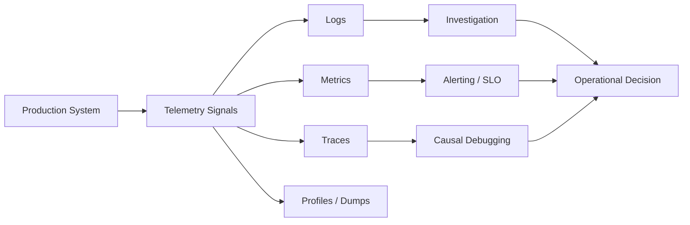
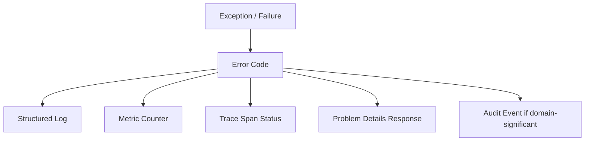

# Part 030 — Telemetry Quality Engineering

> Target skill: mampu menilai dan meningkatkan kualitas telemetry sebagai engineering system, bukan hanya menambahkan logs, metrics, dan traces. Setelah part ini, kamu harus bisa mendesain telemetry yang berguna saat incident, murah secara operasional, aman secara data, stabil untuk dashboard/alert, dan cukup presisi untuk debugging maupun audit.

Telemetry yang buruk lebih berbahaya daripada tidak ada telemetry. Ia memberi ilusi bahwa sistem observable, padahal saat incident semua sinyal terlalu noisy, terlalu mahal, tidak konsisten, terlalu high-cardinality, tidak punya context, atau tidak menjawab pertanyaan operasional.

Top 1% engineer tidak bertanya:

> “Apakah service ini sudah punya logs, metrics, traces?”

Mereka bertanya:

> “Apakah telemetry ini bisa mempercepat diagnosis, membuktikan impact, mengurangi ambiguity, dan tetap aman/cost-effective pada traffic produksi?”

---

## 1. Kaufman Deconstruction

Telemetry quality terdiri dari sub-skill berikut:

| Sub-skill | Outcome |
|---|---|
| Signal design | Tahu pertanyaan operasional yang harus dijawab oleh telemetry |
| Signal-to-noise control | Mengurangi log spam, metric noise, trace overload |
| Cardinality budgeting | Mencegah cost spike dan backend collapse akibat label/attribute unik |
| Semantic consistency | Nama metric/span/log field konsisten lintas service |
| Sampling strategy | Mengendalikan volume tanpa kehilangan insight penting |
| Privacy/security control | Menjaga telemetry tidak membawa secret/PII/raw payload |
| Telemetry testing | Memastikan telemetry contract tidak rusak saat refactor |
| Feedback loop | Menggunakan incident/postmortem untuk memperbaiki telemetry |

---

## 2. Mental Model: Telemetry Is an Operational Interface

Telemetry adalah API antara production system dan operator manusia/mesin.



Seperti API, telemetry harus punya:

- contract,
- naming convention,
- versioning discipline,
- backward compatibility,
- security policy,
- cost model,
- ownership.

Jika telemetry berubah sembarangan, dashboard, alert, runbook, dan incident muscle memory akan rusak.

---

## 3. Telemetry Quality Attributes

Gunakan 12 atribut kualitas berikut.

| Attribute | Pertanyaan |
|---|---|
| Relevance | Apakah sinyal menjawab pertanyaan operasional penting? |
| Accuracy | Apakah sinyal merepresentasikan realitas sistem? |
| Timeliness | Apakah sinyal muncul cukup cepat untuk response? |
| Correlatability | Bisa dikaitkan dengan trace/request/case/tenant/dependency? |
| Bounded cardinality | Apakah label/attribute tidak meledak? |
| Consistency | Apakah nama/semantik stabil lintas service? |
| Actionability | Apakah operator tahu apa yang dilakukan setelah melihat sinyal? |
| Safety | Apakah tidak membocorkan secret/PII/data sensitif? |
| Cost efficiency | Apakah volume dan retention masuk akal? |
| Completeness | Apakah critical path punya sinyal cukup? |
| Low noise | Apakah tidak terlalu banyak false positive/log spam? |
| Testability | Apakah sinyal penting bisa diuji otomatis? |

Telemetry yang bagus tidak harus banyak. Ia harus menjawab pertanyaan yang tepat.

---

## 4. Start From Operational Questions

Jangan mulai dari “tambahkan metric”. Mulai dari pertanyaan:

### Service health

- Apakah service menerima traffic?
- Apakah request berhasil?
- Berapa latency p50/p95/p99?
- Apakah error rate naik?
- Apakah queue backlog naik?
- Apakah thread/connection pool saturated?

### Dependency health

- Dependency mana yang lambat?
- Apakah timeout/retry/circuit breaker meningkat?
- Apakah fallback aktif?
- Apakah failure isolated atau cascading?

### Domain health

- Berapa case/review/transaction yang berhasil?
- Berapa yang rejected karena rule?
- Berapa yang stuck di state tertentu?
- Apakah escalation melebihi SLA?
- Apakah automated decision berubah drastis?

### Incident investigation

- Request mana yang gagal?
- Error code mana yang dominan?
- Tenant/user segment mana terdampak?
- Release/config change mana yang berkorelasi?
- Critical path span mana yang paling lambat?

### Regulatory/audit

- Siapa melakukan apa?
- Atas dasar policy/rule apa?
- Outcome-nya apa?
- Evidence apa yang tersimpan?
- Apakah failure menghasilkan unknown outcome?

Telemetry quality berarti setiap sinyal punya alasan eksistensi.

---

## 5. Logs, Metrics, Traces: Quality Criteria Berbeda

| Signal | Best For | Quality Risk | Quality Rule |
|---|---|---|---|
| Logs | Event detail, forensic evidence, rare error | spam, missing context, secret leak | structured, correlated, sampled if needed |
| Metrics | Trend, alert, SLO, capacity | cardinality explosion, wrong aggregation | bounded labels, stable names |
| Traces | Causal path, latency breakdown, dependency chain | oversampling/undersampling, missing spans | propagate context, meaningful spans |
| Audit events | Compliance evidence | incomplete actor/reason/outcome | immutable, domain-specific, safe |

Jangan memaksa satu signal mengerjakan semua tugas.

Bad:

- semua investigasi bergantung pada log free-text,
- semua business evidence hanya metric counter,
- semua alert berdasarkan log pattern,
- semua debug bergantung pada trace tetapi sampling terlalu rendah.

---

## 6. Signal-to-Noise Ratio

Signal-to-noise ratio adalah rasio informasi berguna dibanding noise operasional.

Noise muncul dari:

- logging setiap loop item,
- stack trace untuk error expected,
- metric untuk event yang tidak actionable,
- trace span terlalu granular,
- alert untuk symptom yang sudah covered alert lain,
- duplicate telemetry dari framework + manual instrumentation,
- debug logs aktif di production.

### Log level quality

| Level | Use For | Bad Use |
|---|---|---|
| ERROR | user-visible/system-impacting failure requiring attention | expected validation rejection |
| WARN | degraded mode, retry exhausted, fallback activated, suspicious but handled | every retry attempt at scale |
| INFO | lifecycle/business milestone | every internal branch |
| DEBUG | diagnostic detail disabled by default | production steady-state flow |
| TRACE | deep local debugging | distributed production telemetry |

Quality rule:

> A log event should either help reconstruct an important event, explain a decision, or diagnose a failure. Otherwise it is noise.

---

## 7. Cardinality Budget

Cardinality adalah jumlah kombinasi unik label/attribute. High cardinality adalah salah satu penyebab utama telemetry cost dan backend instability.

Metric cardinality contoh:

```text
http.server.requests{method="GET",status="200",route="/cases/{id}"}
```

Ini bounded.

Bad:

```text
http.server.requests{method="GET",status="200",path="/cases/C-827361923"}
```

Jika `path` memakai actual ID, cardinality bisa meledak.

### Cardinality classification

| Field | Cardinality | Metric Tag? | Trace Attribute? | Log Field? |
|---|---:|---:|---:|---:|
| `http.method` | low | yes | yes | yes |
| `http.status_code` | low | yes | yes | yes |
| `error_code` | low/medium | yes | yes | yes |
| `exception.type` | medium | yes if bounded | yes | yes |
| `tenant_tier` | low | yes | yes | yes |
| `tenant_id` | high | rarely | maybe | maybe |
| `user_id` | very high | no | maybe hashed | maybe hashed |
| `case_id` | very high | no | maybe | yes if allowed |
| `trace_id` | very high | no | inherent | yes |
| `request_path_raw` | very high | no | no | rarely |

### Cardinality budget policy

```yaml
telemetry:
  metric_tags:
    allowed:
      - service.name
      - operation
      - error.code
      - dependency.name
      - http.route
      - http.method
      - http.status_code
      - outcome
      - retryable
    forbidden:
      - user.id
      - case.id
      - trace.id
      - correlation.id
      - raw.path
      - email
      - access.token
```

A mature platform treats tag approval like API design.

---

## 8. Semantic Consistency

Semantic inconsistency destroys cross-service analysis.

Bad:

```text
service A: case_error_total{code="RULE_DENIED"}
service B: errors_count{errorCode="rule_denied"}
service C: failed_cases{reason="POLICY_DENIAL"}
```

Better:

```text
case_decision_total{outcome="rejected", error_code="POLICY_DENIED"}
```

Create naming rules:

| Concept | Rule | Example |
|---|---|---|
| Metric names | lowercase, dot or underscore style consistently | `case.decision.total` or `case_decision_total` |
| Error code | uppercase stable domain code | `CASE_STATE_CONFLICT` |
| Outcome | small enum | `success`, `error`, `rejected`, `degraded` |
| Retryability | boolean or enum | `retryable=true` |
| Dependency | stable logical name | `identity-service` |
| Operation | business operation | `case.submit` |
| Route | templated route | `/cases/{caseId}` |

Follow existing semantic conventions where available, and define local conventions for domain-specific telemetry.

---

## 9. Telemetry Schema Governance

Telemetry schema needs governance because dashboards and alerts depend on it.

Create a registry:

```yaml
metrics:
  - name: case.decision.total
    type: counter
    owner: case-platform
    description: Number of case decisions by outcome and error code.
    tags:
      - name: outcome
        values: [approved, rejected, error]
      - name: error_code
        bounded: true
      - name: policy_version
        bounded: true
    stability: stable

logs:
  - event: case.decision.completed
    owner: case-platform
    required_fields:
      - correlation_id
      - trace_id
      - tenant_id
      - case_id
      - outcome
      - decision_id
      - policy_version
    forbidden_fields:
      - access_token
      - raw_payload

spans:
  - name: case.policy.evaluate
    owner: policy-engine
    required_attributes:
      - case.type
      - policy.version
      - decision.outcome
```

This prevents “observability drift”.

---

## 10. Sampling Strategy

Sampling reduces telemetry volume. Bad sampling hides failures.

Types:

| Sampling Type | Where | Strength | Risk |
|---|---|---|---|
| Head sampling | before/when trace starts | cheap | cannot know future error/latency |
| Tail sampling | after observing trace | can retain errors/slow traces | requires collector/backend support |
| Log sampling | logger/appender/platform | reduces spam | may lose rare detail |
| Metric aggregation | SDK/backend | efficient trend | loses individual events |

Trace sampling policy examples:

```yaml
sampling:
  traces:
    always_keep:
      - status: ERROR
      - latency_ms_gt: 2000
      - error_code_prefix: PAYMENT_
      - operation: case.escalate
    probabilistic:
      default: 0.05
      high_volume_healthcheck: 0.001
```

Important: if using head sampling only, you may not retain all error traces unless the sampler or backend policy supports that behavior.

---

## 11. Error Telemetry Quality

Every meaningful error should produce coordinated signals.



For example:

```java
catch (CaseStateConflictException ex) {
    log.warn("case command rejected",
        kv("event", "case.command.rejected"),
        kv("error_code", ex.errorCode()),
        kv("case_id", safeCaseId(ex.caseId())),
        kv("expected_state", ex.expectedState()),
        kv("actual_state", ex.actualState()));

    Metrics.counter("case.command.total",
        "operation", "submit",
        "outcome", "rejected",
        "error_code", ex.errorCode()).increment();

    Span.current().setStatus(StatusCode.ERROR);
    Span.current().setAttribute("error.code", ex.errorCode());
    Span.current().recordException(ex);

    throw ex;
}
```

Quality issue: this example may be too verbose or too high-cardinality depending on fields. The design question is which fields belong to which signal.

Recommended mapping:

| Error Data | Log | Metric | Trace | Response | Audit |
|---|---:|---:|---:|---:|---:|
| error code | yes | yes | yes | yes | yes |
| exception type | yes | bounded | yes | no/internal | maybe |
| stack trace | unexpected only | no | exception event | no | no |
| domain entity id | yes if allowed | no | maybe | maybe | yes |
| user message | maybe | no | no | yes | maybe |
| retryable | yes | yes | yes | maybe | no |
| dependency name | yes | yes | yes | maybe | no |
| raw payload | no | no | no | no | no |

---

## 12. Telemetry for Reliability Controls

Reliability controls without telemetry become invisible behavior changes.

### Retry

Required signals:

- attempt count,
- final outcome,
- retry reason,
- backoff duration,
- retry exhausted,
- idempotency key hash if needed,
- dependency name.

Avoid logging every retry attempt at `WARN` on high-volume paths. Prefer metric + trace event; log only final exhaustion or unusual behavior.

### Circuit breaker

Required signals:

- state transition: closed/open/half-open,
- rejected call count,
- failure rate,
- slow call rate,
- dependency name,
- fallback activation.

Circuit state transition should be loggable event and metric dimension, because it changes behavior.

### Fallback/degradation

Required signals:

- fallback type,
- degraded outcome,
- user impact,
- freshness/staleness,
- policy reason,
- duration.

Fallback must not look like success in telemetry. Use `outcome="degraded"`, not only `success`.

### Shutdown

Required signals:

- shutdown received,
- intake stopped,
- in-flight count,
- drain duration,
- forced cancellation count,
- telemetry flush result,
- unknown outcome count.

---

## 13. Telemetry and Privacy

Telemetry often accidentally becomes the largest uncontrolled data exhaust in the company.

Forbidden by default:

- passwords,
- tokens,
- authorization headers,
- session ids,
- raw request/response body,
- full names,
- email addresses,
- national identifiers,
- payment identifiers,
- unredacted documents,
- arbitrary exception messages from external systems.

Pattern:

```java
public final class TelemetrySanitizer {
    private static final Set<String> FORBIDDEN_KEYS = Set.of(
        "password", "token", "authorization", "cookie", "ssn", "email"
    );

    public static String safeAttribute(String key, String value) {
        if (value == null) return "null";
        if (FORBIDDEN_KEYS.contains(key.toLowerCase(Locale.ROOT))) {
            return "[REDACTED]";
        }
        if (value.length() > 256) {
            return value.substring(0, 256) + "...[TRUNCATED]";
        }
        return value;
    }
}
```

Better: avoid collecting sensitive data at source rather than redacting later.

---

## 14. Telemetry Testing

Telemetry that is not tested will rot.

### Unit-level metric test

```java
@Test
void recordsRejectedCaseMetric() {
    SimpleMeterRegistry registry = new SimpleMeterRegistry();
    CaseMetrics metrics = new CaseMetrics(registry);

    metrics.recordRejected("CASE_STATE_CONFLICT");

    Counter counter = registry.find("case.command.total")
        .tag("outcome", "rejected")
        .tag("error_code", "CASE_STATE_CONFLICT")
        .counter();

    assertNotNull(counter);
    assertEquals(1.0, counter.count());
}
```

### Log field contract test

```java
@Test
void rejectionLogContainsRequiredFields() {
    LogEvent event = captureLog(() -> service.reject(command));

    assertThat(event.field("event")).isEqualTo("case.command.rejected");
    assertThat(event.field("correlation_id")).isNotBlank();
    assertThat(event.field("error_code")).isEqualTo("CASE_STATE_CONFLICT");
    assertThat(event.fields()).doesNotContainKeys("authorization", "access_token");
}
```

### Trace contract test

```java
@Test
void spanContainsDomainOutcome() {
    InMemorySpanExporter exporter = InMemorySpanExporter.create();

    service.evaluate(command);

    List<SpanData> spans = exporter.getFinishedSpanItems();
    assertThat(spans).anySatisfy(span -> {
        assertThat(span.getName()).isEqualTo("case.policy.evaluate");
        assertThat(span.getAttributes().get(AttributeKey.stringKey("decision.outcome")))
            .isEqualTo("rejected");
    });
}
```

Testing does not need to assert every telemetry detail. Test critical contract fields.

---

## 15. Telemetry Review Checklist

Before adding a new metric/log/span, answer:

- [ ] What operational question does it answer?
- [ ] Who owns it?
- [ ] What action follows when it changes?
- [ ] Is the name aligned with convention?
- [ ] Are labels/attributes bounded?
- [ ] Does it include required context?
- [ ] Does it exclude secrets/PII?
- [ ] Is it emitted once per meaningful event, not inside noisy loops?
- [ ] Does it duplicate existing signal?
- [ ] Is retention cost acceptable?
- [ ] Is it documented in telemetry registry?
- [ ] Is critical behavior covered by test?

---

## 16. Dashboard Quality

A dashboard is not a collection of charts. It is a decision surface.

Good dashboard layers:

### Layer 1 — Executive health

- request rate,
- error rate,
- latency p95/p99,
- saturation,
- SLO/error budget.

### Layer 2 — Dependency impact

- dependency latency,
- dependency error rate,
- retry count,
- circuit breaker state,
- fallback activation.

### Layer 3 — Domain impact

- cases submitted/approved/rejected,
- stuck state count,
- SLA breach risk,
- backlog age,
- automated/manual decision ratio.

### Layer 4 — Debug drill-down

- top error codes,
- top slow operations,
- trace exemplars,
- recent deploy/config changes,
- log query links.

Bad dashboard:

- 60 charts with no hierarchy,
- average latency only,
- no error budget,
- no domain impact,
- no dependency breakdown,
- high-cardinality filters that break under load.

---

## 17. Alert Quality

An alert should mean action.

Bad alerts:

- “CPU > 80% for 5 minutes” without service impact,
- “any ERROR log exists”,
- “one request failed”,
- duplicate symptom alerts from every layer,
- alerts that always self-heal before response.

Better alerts:

- SLO burn rate,
- high user-visible error rate,
- elevated p99 latency on critical endpoint,
- queue age exceeding SLA,
- circuit breaker open for critical dependency,
- fallback active beyond allowed duration,
- domain backlog threatening regulatory deadline.

Alert should include:

- symptom,
- scope,
- impact,
- likely dashboards,
- runbook,
- owner,
- escalation path.

---

## 18. Anti-Patterns

### 18.1 Log Everything

More logs do not mean better observability. High volume often hides signal and increases cost.

### 18.2 Metric Everything With IDs

Metrics with `user_id`, `case_id`, `trace_id`, or raw path become cardinality bombs.

### 18.3 Trace Every Tiny Method

Tracing internal helper methods creates noise. Trace meaningful operations and boundary calls.

### 18.4 Expected Errors as ERROR

Validation failure and business rejection are not always `ERROR`. Incorrect level creates alert fatigue.

### 18.5 Success Masking Degradation

Fallback response counted as success hides user impact. Use `outcome=degraded`.

### 18.6 No Telemetry Ownership

If nobody owns a metric/log/span, nobody will maintain it when semantics drift.

### 18.7 Secret in Exception Message

External libraries may include sensitive detail in exception messages. Do not blindly expose or index them.

---

## 19. Telemetry Quality Maturity Model

| Level | Description |
|---:|---|
| 0 | Ad hoc print/log, no consistent correlation |
| 1 | Basic logs/metrics/traces exist but inconsistent |
| 2 | Standard fields, correlation IDs, core RED/USE metrics |
| 3 | SLO dashboards, bounded cardinality, context propagation tests |
| 4 | Telemetry registry, schema governance, cost/privacy controls |
| 5 | Incident feedback loop continuously improves telemetry quality |

Top-tier engineering teams live around Level 4–5 for critical systems, not necessarily every toy service.

---

## 20. Production Implementation Pattern

Create a telemetry facade for domain/platform events.

```java
public final class CaseTelemetry {
    private final MeterRegistry registry;
    private final Tracer tracer;
    private final Logger log = LoggerFactory.getLogger(CaseTelemetry.class);

    public CaseTelemetry(MeterRegistry registry, Tracer tracer) {
        this.registry = registry;
        this.tracer = tracer;
    }

    public void decisionCompleted(CaseDecision decision, ExecutionContext ctx) {
        String outcome = decision.outcome().name().toLowerCase(Locale.ROOT);
        String errorCode = decision.errorCode().orElse("none");

        log.info("case decision completed",
            kv("event", "case.decision.completed"),
            kv("correlation_id", ctx.correlationId()),
            kv("tenant_id", safeTenant(ctx.tenantId())),
            kv("case_id", safeCase(decision.caseId())),
            kv("outcome", outcome),
            kv("error_code", errorCode));

        registry.counter("case.decision.total",
            "outcome", outcome,
            "error_code", errorCode
        ).increment();

        Span span = Span.current();
        span.setAttribute("case.decision.outcome", outcome);
        span.setAttribute("error.code", errorCode);
    }
}
```

Why facade?

- keeps telemetry consistent,
- centralizes redaction,
- avoids tag drift,
- simplifies tests,
- gives ownership.

---

## 21. Cost Model

Telemetry cost roughly follows:

```text
cost = volume × cardinality × retention × query/index cost × replication/export factor
```

Cost control levers:

| Lever | Example |
|---|---|
| Reduce volume | sample debug logs, avoid loop logs |
| Reduce cardinality | remove user/case/request IDs from metric tags |
| Reduce retention | keep verbose logs shorter |
| Reduce indexing | index only key fields |
| Aggregate earlier | metrics instead of event logs for high-volume counters |
| Tail sample traces | keep errors/slow traces, drop normal high-volume traces |
| Route by importance | critical audit logs retained longer |

Cost control is not anti-observability. It protects observability from becoming unsustainable.

---

## 22. Incident Feedback Loop

After every incident, ask:

1. Which signal detected the incident?
2. Which signal should have detected it but did not?
3. Which dashboard answered impact fastest?
4. Which log/trace/metric was misleading?
5. Which context was missing?
6. Which alert was noisy or duplicate?
7. Which telemetry field would have reduced diagnosis time?
8. Which signal should be removed?
9. Which runbook should link to which dashboard/query?

Postmortem action items should include telemetry fixes, not only code fixes.

---

## 23. Practical Telemetry Quality Scorecard

Score each critical service 0–2:

| Category | 0 | 1 | 2 |
|---|---|---|---|
| Correlation | missing | partial | complete logs/traces/requests |
| Metrics | ad hoc | RED/USE only | RED/USE + domain + dependency |
| Logs | free-text | structured partial | structured, safe, event-based |
| Traces | missing | auto only | auto + critical manual spans |
| Cardinality | unknown | some guardrails | budget + enforcement |
| Privacy | ad hoc | redaction partial | source controls + tests |
| Alerts | noisy | basic symptom | SLO/actionable |
| Dashboards | scattered | service view | layered decision surface |
| Tests | none | limited | contract tests |
| Ownership | unclear | team-owned | registry + review process |

Max score: 20. Critical production systems should target 16+.

---

## 24. Deliberate Practice

### Exercise 1 — Telemetry Audit

Pick one Java service. Build inventory:

| Signal | Name/Event | Owner | Operational Question | Cardinality Risk | Privacy Risk | Action |
|---|---|---|---|---|---|---|

Delete or redesign at least 5 weak signals.

### Exercise 2 — Cardinality Attack

Add a metric tag with `case_id` in local environment and simulate 10,000 case IDs. Observe series count. Then replace it with bounded `case_type` or `outcome`.

### Exercise 3 — Error Code Dashboard

Build dashboard panel:

- error rate by `error_code`,
- top dependency failures,
- rejected vs failed domain outcomes,
- fallback activation count,
- retry exhausted count.

Ensure no panel depends on raw exception message.

### Exercise 4 — Telemetry Contract Test

Write tests that prove:

- critical error emits stable error code,
- metric has bounded tags,
- log has correlation id,
- log excludes forbidden fields,
- span records exception for unexpected failure.

### Exercise 5 — Incident Replay

Take one past incident. Reconstruct timeline using only existing telemetry. Mark every place where you had to guess. Turn each guess into telemetry improvement.

---

## 25. Summary

Telemetry quality engineering is the discipline of making observability reliable, useful, safe, and sustainable. It requires more than adding logs, metrics, and traces. It requires operational questions, schema governance, cardinality discipline, sampling strategy, privacy control, testing, dashboards, alerts, and incident feedback loops.

A high-quality telemetry system has these properties:

- it detects user-visible impact,
- it supports fast diagnosis,
- it correlates logs/metrics/traces/audit events,
- it avoids high-cardinality explosions,
- it protects sensitive data,
- it keeps cost under control,
- it evolves through incident learning.

The core principle:

> Telemetry is production evidence. Design it with the same care as public APIs and domain state transitions.

---

## References

- OpenTelemetry Metrics Data Model: https://opentelemetry.io/docs/specs/otel/metrics/data-model/
- OpenTelemetry Metrics SDK Cardinality Limits: https://opentelemetry.io/docs/specs/otel/metrics/sdk/#cardinality-limits
- OpenTelemetry Tracing SDK Sampling: https://opentelemetry.io/docs/specs/otel/trace/sdk/#sampling
- OpenTelemetry Semantic Conventions: https://opentelemetry.io/docs/concepts/semantic-conventions/
- OpenTelemetry Handling Sensitive Data: https://opentelemetry.io/docs/security/handling-sensitive-data/
- OpenTelemetry Java SDK: https://opentelemetry.io/docs/languages/java/sdk/
