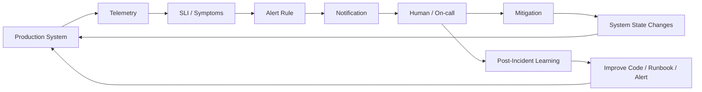
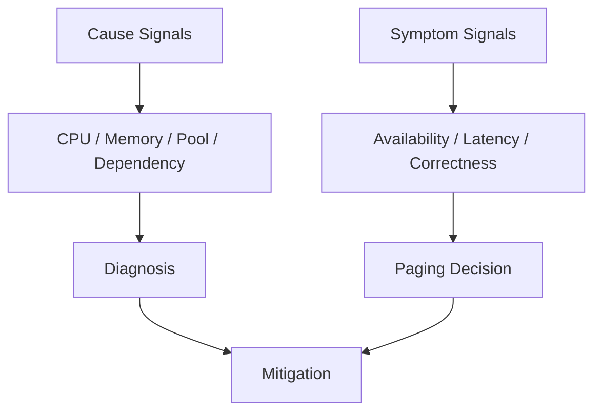
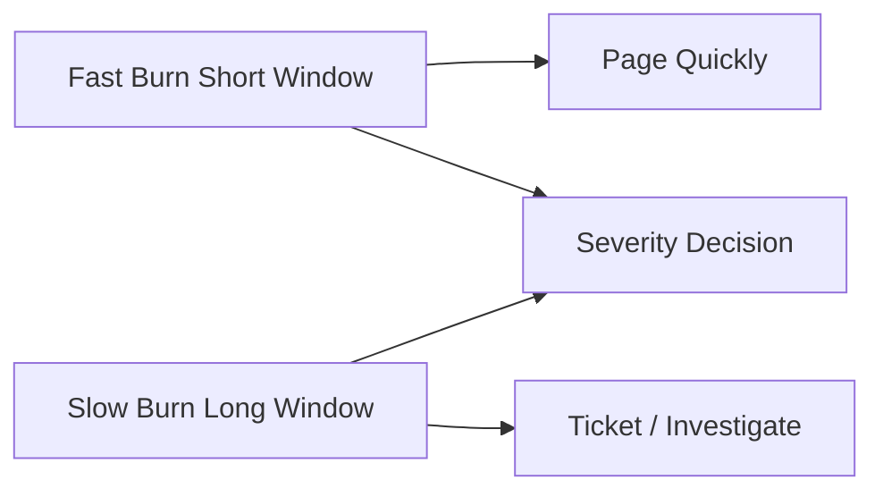
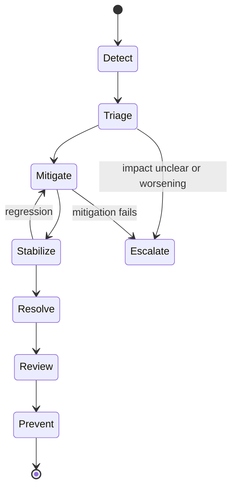

# Part 031 — Alerting & Incident Response

> Target skill: mampu mendesain alerting dan incident response untuk Java production systems sehingga alert benar-benar actionable, berbasis user impact, punya ownership jelas, tidak menghasilkan alert fatigue, dan mempercepat pemulihan saat failure terjadi.

Alerting bukan tujuan observability. Alerting adalah mekanisme untuk memanggil manusia ketika sistem membutuhkan keputusan atau tindakan manusia.

Engineer yang kuat tidak mengukur kualitas alert dari jumlah alert yang dibuat. Mereka mengukurnya dari pertanyaan berikut:

> “Apakah alert ini membangunkan orang yang tepat, pada waktu yang tepat, dengan konteks yang cukup, untuk mengambil tindakan yang jelas?”

Jika jawabannya tidak, alert tersebut adalah noise, bukan safety mechanism.

---

## 1. Kaufman Deconstruction

Untuk menguasai alerting dan incident response, pecah skill menjadi sub-skill berikut:

| Sub-skill | Outcome |
|---|---|
| SLI/SLO thinking | Tahu apa yang benar-benar merepresentasikan reliability dari perspektif user |
| Alert design | Membuat alert yang actionable, stable, dan minim noise |
| Burn-rate reasoning | Menghubungkan error budget consumption dengan urgency |
| Severity classification | Menentukan seberapa cepat incident perlu direspons |
| Routing and ownership | Alert masuk ke tim yang punya control terhadap perbaikan |
| Runbook design | Alert membawa langkah diagnosis dan mitigasi yang repeatable |
| Incident command | Menjaga koordinasi saat tekanan tinggi |
| Communication | Memberikan update yang jelas tanpa spekulasi |
| Post-incident learning | Mengubah incident menjadi perbaikan sistem, bukan blame |

Learning goal part ini bukan “bisa menulis rule Prometheus”, tetapi bisa mendesain **human-in-the-loop reliability control system**.

---

## 2. Mental Model: Alerting Is a Control Loop

Alerting adalah control loop antara production system dan operator.



Control loop yang buruk punya ciri:

- signal tidak merepresentasikan user impact,
- threshold terlalu sensitif,
- alert tidak punya owner,
- runbook tidak jelas,
- action tidak diketahui,
- alert terus berbunyi meski tidak ada tindakan yang perlu dilakukan,
- incident selesai tanpa memperbaiki sistem.

Control loop yang baik punya ciri:

- alert berbasis symptom yang dirasakan user,
- cause alert dipakai untuk diagnosis, bukan paging utama,
- severity sebanding dengan error budget burn,
- penerima alert bisa melakukan mitigasi,
- runbook memberi jalur investigasi,
- postmortem menghasilkan perubahan konkret.

---

## 3. Alerting Rule: From “Something Happened” to “Action Required”

Tidak semua event abnormal layak menjadi alert.

### 3.1 Event, Signal, Alert, Incident

| Concept | Meaning | Example |
|---|---|---|
| Event | Sesuatu terjadi | Satu request timeout |
| Signal | Event diukur sebagai time series/log/trace | `http.server.requests` latency naik |
| Alert | Signal melewati kondisi yang perlu perhatian | Error rate > SLO threshold selama 10 menit |
| Incident | Degradasi nyata yang perlu koordinasi | Payment authorization gagal untuk 20% user |

Kesalahan umum: mengubah terlalu banyak event menjadi alert.

Alert harus memenuhi minimal tiga syarat:

1. **User or business impact exists or is imminent.**
2. **A human action is needed.**
3. **The notified owner can influence the outcome.**

Jika tidak, lebih cocok menjadi dashboard, log, metric, ticket, atau report berkala.

---

## 4. Symptom Alert vs Cause Alert

### 4.1 Symptom alert

Symptom alert menunjukkan dampak yang terlihat oleh user atau consumer.

Contoh:

- checkout success rate turun,
- API availability di bawah SLO,
- p95 latency melewati objective,
- queue age membuat SLA processing terancam,
- regulatory case assignment terlambat melewati deadline.

Symptom alert cocok untuk paging.

### 4.2 Cause alert

Cause alert menunjukkan kondisi internal yang mungkin menjadi penyebab.

Contoh:

- CPU tinggi,
- heap usage tinggi,
- thread pool penuh,
- connection pool exhausted,
- circuit breaker open,
- dependency timeout naik,
- Kafka consumer lag naik.

Cause alert berguna, tetapi tidak selalu cocok untuk membangunkan orang.



Rule praktis:

> Page on symptoms. Investigate with causes.

Ada pengecualian: cause alert boleh paging jika dampaknya hampir pasti dan time-to-impact sangat pendek, misalnya disk full 98% pada database primary atau certificate expired dalam beberapa jam.

---

## 5. SLI, SLO, SLA, and Error Budget

### 5.1 SLI

Service Level Indicator adalah metric yang merepresentasikan kualitas layanan.

Contoh SLI:

| Capability | Good SLI |
|---|---|
| HTTP API | Proporsi request sukses dan cepat |
| Payment authorization | Proporsi authorization berhasil tanpa duplicate charge |
| Case assignment | Proporsi case assigned sebelum deadline |
| Message processing | Proporsi message processed tanpa retry/DLQ dalam waktu target |
| Search endpoint | Proporsi query dengan response relevan dan latency acceptable |

SLI harus dekat dengan user-visible behavior, bukan hanya machine health.

### 5.2 SLO

Service Level Objective adalah target reliability untuk SLI.

Contoh:

```txt
99.9% of POST /authorizations requests complete successfully within 800 ms over 30 days.
```

SLO yang baik punya:

- user journey atau operation yang jelas,
- success definition,
- latency/correctness boundary,
- measurement window,
- exclusion policy,
- owner,
- dashboard,
- alerting rule.

### 5.3 SLA

Service Level Agreement adalah komitmen eksternal/kontraktual. Tidak semua SLO menjadi SLA.

### 5.4 Error budget

Error budget adalah allowance untuk unreliability.

Jika SLO 99.9%, error budget adalah 0.1% bad events dalam window.

Mental model:

```txt
error budget = allowed unreliability before objective is violated
```

Engineering implication:

- Jika budget sehat, tim bisa mengambil risiko lebih besar.
- Jika budget terbakar cepat, fokus bergeser ke stabilization.
- Jika budget habis, release risky harus ditahan atau diberi mitigation kuat.

---

## 6. Burn-Rate Alerting

Burn rate mengukur seberapa cepat service menghabiskan error budget dibanding kecepatan normal yang diizinkan oleh SLO.

Contoh sederhana:

```txt
SLO: 99.9%
Allowed bad rate: 0.1%
Observed bad rate: 1.0%
Burn rate: 1.0 / 0.1 = 10x
```

Artinya sistem sedang menghabiskan error budget 10 kali lebih cepat dari yang diizinkan.

### 6.1 Why burn rate is better than raw threshold

Raw threshold seperti “error rate > 5%” tidak mempertimbangkan SLO.

Untuk service dengan SLO 99.99%, error rate 0.5% sudah sangat parah. Untuk batch internal dengan SLO 95%, angka yang sama mungkin tidak urgent.

Burn rate menghubungkan alert dengan reliability promise.

### 6.2 Multi-window alerting

Satu window sering salah:

- window pendek cepat mendeteksi tetapi noisy,
- window panjang stabil tetapi lambat.

Gabungkan short window dan long window.



Contoh intent:

| Alert | Window | Meaning | Response |
|---|---:|---|---|
| Fast burn | 5m + 1h | Budget terbakar cepat | Page |
| Medium burn | 30m + 6h | Degradasi signifikan | Page/business-hours depending impact |
| Slow burn | 2h + 24h | Trend memburuk | Ticket / investigate |

---

## 7. Prometheus Alert Rule Pattern

Prometheus alerting rule terdiri dari expression, duration, labels, dan annotations.

Contoh conceptual rule untuk availability SLO:

```yaml
# alert-rules.yml
groups:
  - name: checkout-slo-alerts
    rules:
      - alert: CheckoutApiFastBurn
        expr: |
          (
            sum(rate(http_server_requests_seconds_count{service="checkout", outcome="error"}[5m]))
            /
            sum(rate(http_server_requests_seconds_count{service="checkout"}[5m]))
          ) > 0.01
        for: 5m
        labels:
          severity: page
          service: checkout
          team: payments-platform
          slo: checkout-availability
        annotations:
          summary: "Checkout API error rate is burning error budget quickly"
          impact: "Users may fail to complete checkout"
          runbook: "https://runbooks.example.com/checkout-fast-burn"
          dashboard: "https://grafana.example.com/d/checkout-slo"
```

Rule ini masih simplified. Production rule biasanya memakai recording rules agar query lebih murah dan konsisten.

### 7.1 Recording rule pattern

```yaml
groups:
  - name: checkout-slo-recording-rules
    rules:
      - record: service:http_requests:rate5m
        expr: |
          sum by (service) (rate(http_server_requests_seconds_count[5m]))

      - record: service:http_errors:rate5m
        expr: |
          sum by (service) (rate(http_server_requests_seconds_count{outcome="error"}[5m]))

      - record: service:http_error_ratio:rate5m
        expr: |
          service:http_errors:rate5m / service:http_requests:rate5m
```

Recording rules membantu:

- mengurangi query cost,
- menyamakan definisi SLI,
- membuat dashboard dan alert memakai definisi yang sama,
- mengurangi copy-paste PromQL yang rawan drift.

---

## 8. Java Service Alert Catalog

Berikut catalog alert yang umum untuk Java service production-grade.

### 8.1 User-impact alerts

| Alert | Signal | Page? | Notes |
|---|---|---|---|
| Availability SLO burn | request success ratio | Yes | Primary paging signal |
| Latency SLO burn | p95/p99 latency good event ratio | Yes/Maybe | Page jika user journey critical |
| Correctness failure | duplicate charge, inconsistent state | Yes | Jangan hanya pakai 5xx |
| Deadline breach | case SLA/processing deadline | Yes/Maybe | Penting untuk regulatory systems |
| Queue age SLO burn | oldest message age | Yes/Maybe | Lebih user-impact daripada raw queue length |

### 8.2 Dependency alerts

| Alert | Signal | Page? | Notes |
|---|---|---|---|
| Dependency error ratio | external call failure | Maybe | Page jika berdampak pada SLO |
| Circuit breaker open | breaker state | Maybe | Usually cause signal |
| Retry storm | retry attempt rate | Maybe | Bisa menjadi early warning cascading failure |
| Timeout ratio | client timeout | Maybe | Correlate with latency/SLO |

### 8.3 JVM/runtime alerts

| Alert | Signal | Page? | Notes |
|---|---|---|---|
| JVM OOM crash loop | restart count + exit reason | Yes | User impact likely high |
| GC pause SLO impact | GC pause + latency | Maybe | Cause diagnosis |
| Thread pool saturation | active/max + queue age | Maybe | Page if service cannot process work |
| Connection pool exhaustion | pending acquisition high | Maybe | Strong cause signal |
| Deadlock detected | JVM thread state/deadlock detector | Yes/Maybe | Depends impact |

### 8.4 Telemetry pipeline alerts

| Alert | Signal | Page? | Notes |
|---|---|---|---|
| Metrics missing | scrape absent | Maybe | Page only if blind production risk |
| Log ingestion down | ingestion drop | Usually no | Notify observability owner |
| Trace exporter failing | export failure rate | Usually no | Ticket unless incident debugging impaired |

Telemetry pipeline alert penting, tetapi jangan sampai observability system membuat alert storm yang mengalahkan service alert.

---

## 9. Severity Model

Severity harus berbasis impact dan urgency, bukan emosi.

| Severity | Meaning | Response |
|---|---|---|
| SEV1 | Major user/business/regulatory impact, active or imminent | Immediate incident command, paging, broad comms |
| SEV2 | Significant degradation, workaround possible or limited scope | Page owner, focused incident |
| SEV3 | Partial degradation, low urgency, no major breach yet | Business-hours response or ticket |
| SEV4 | Minor issue, no current impact | Backlog/improvement |

Untuk regulatory/case management systems, severity juga harus mempertimbangkan:

- statutory deadline,
- audit evidence loss,
- incorrect enforcement action,
- unauthorized disclosure,
- irreversible state transition,
- inability to prove decision path.

Contoh:

> Latency tinggi pada dashboard internal mungkin SEV3. Tetapi latency yang membuat enforcement deadline terlewat bisa naik menjadi SEV1/SEV2.

---

## 10. Routing and Ownership

Alert yang tidak punya owner adalah future incident.

Setiap alert harus punya:

- owning team,
- service owner,
- escalation path,
- runbook,
- dashboard,
- service catalog entry,
- expected response time,
- deprecation policy.

### 10.1 Bad routing pattern

```txt
All alerts -> #general-oncall
```

Dampaknya:

- alert ignored,
- diffusion of responsibility,
- slow diagnosis,
- repeated escalation.

### 10.2 Better routing pattern

```txt
SLO alert for checkout -> payments-platform primary on-call
Database capacity alert -> database platform on-call
Telemetry ingestion alert -> observability platform on-call
Security signal -> security response on-call
```

Ownership harus mengikuti **control**, bukan hanya visibility.

Jika tim A menerima alert tetapi hanya tim B yang bisa memperbaiki, routing salah.

---

## 11. Runbook Design

Runbook bukan dokumentasi panjang. Runbook adalah **decision aid under stress**.

### 11.1 Runbook template

```md
# Runbook: CheckoutApiFastBurn

## What this alert means
Checkout API is consuming availability error budget faster than allowed.

## User impact
Users may fail to complete checkout or experience duplicate attempts.

## First 5 minutes
1. Open SLO dashboard.
2. Confirm affected region/tenant/version.
3. Check recent deployments and feature flags.
4. Check dependency panel: payment gateway, pricing, inventory.
5. Check error code distribution.

## Immediate mitigations
- Disable risky feature flag: `new-pricing-flow`.
- Shift traffic away from affected region if regional.
- Increase timeout only if dependency is healthy and latency budget allows it.
- Do not enable blind retries.

## Escalation
- Payment gateway owner if dependency error ratio > 20%.
- Database owner if connection acquisition p95 > 500 ms.
- Incident commander if impact > 10% for 15 minutes.

## Evidence to preserve
- Trace samples for failed checkout.
- Logs for error codes CHK-*.
- Deployment hash.
- Feature flag state.
```

### 11.2 Good runbook properties

| Property | Meaning |
|---|---|
| Fast start | Bisa dipakai dalam 5 menit pertama |
| Decision-oriented | Tidak hanya link dashboard |
| Safe mitigations | Menyebut apa yang boleh/tidak boleh dilakukan |
| Escalation clarity | Tahu kapan memanggil siapa |
| Evidence preservation | Membantu postmortem dan audit |

---

## 12. Incident Lifecycle

Incident response adalah proses mengubah ambiguity menjadi keputusan.



### 12.1 Detect

Pertanyaan utama:

- Apa signal yang firing?
- Apakah ada user impact?
- Apakah scope regional, tenant-specific, version-specific, atau global?

### 12.2 Triage

Pertanyaan utama:

- Apa yang berubah?
- Apakah ini regression, dependency issue, capacity issue, data issue, atau traffic anomaly?
- Apakah ada safe mitigation?

### 12.3 Mitigate

Mitigation bertujuan mengurangi impact, bukan menemukan root cause sempurna.

Contoh mitigation:

- rollback,
- disable feature flag,
- scale out,
- reduce traffic,
- switch to degraded mode,
- pause consumer,
- drain bad pod,
- block harmful retry,
- route to manual review.

### 12.4 Stabilize

Setelah mitigation:

- pastikan alert berhenti karena service membaik, bukan karena telemetry mati,
- monitor SLO recovery,
- cek backlog/queue catch-up,
- cek duplicate/partial side effects,
- preserve evidence.

### 12.5 Resolve

Incident resolve jika:

- user impact berhenti,
- service stabil selama agreed observation window,
- no active retry/backlog threat,
- owner menyetujui close,
- follow-up captured.

### 12.6 Review

Post-incident review bertujuan memperbaiki system of work.

Bukan mencari siapa yang salah.

---

## 13. Incident Roles

Untuk incident besar, role eksplisit lebih baik daripada semua orang debug bersamaan.

| Role | Responsibility |
|---|---|
| Incident Commander | Koordinasi, keputusan, priority, escalation |
| Technical Lead | Diagnosis teknis dan mitigation plan |
| Communications Lead | Update stakeholder/status page/internal channel |
| Scribe | Timeline, decisions, evidence |
| Subject Matter Expert | Deep expertise pada component tertentu |

Role bisa dirangkap pada incident kecil. Pada incident besar, jangan biarkan technical lead juga menjadi comms lead jika beban diagnosis tinggi.

---

## 14. Communication Pattern

Update incident harus jelas, faktual, dan tidak spekulatif.

### 14.1 Bad update

```txt
Looks like database is broken. We are checking.
```

Masalah:

- menyalahkan dependency tanpa bukti,
- tidak menyebut impact,
- tidak menyebut next update,
- tidak membantu stakeholder.

### 14.2 Better update

```txt
10:15 UTC — We are investigating elevated checkout failures affecting approximately 18% of requests in ap-southeast-1 since 10:07 UTC. Current evidence shows increased timeout when calling payment authorization. We have disabled the new routing flag and are monitoring recovery. Next update in 15 minutes or earlier if impact changes.
```

Pola update:

```txt
Time — Impact. Scope. Current evidence. Action taken. Next step. Next update.
```

Untuk regulatory systems, tambahkan:

- apakah statutory deadline terdampak,
- apakah decision/audit trail terdampak,
- apakah manual workaround aktif,
- apakah ada data correction follow-up.

---

## 15. Alert Quality Review

Setiap alert perlu dievaluasi berkala.

Gunakan checklist:

| Question | Good answer |
|---|---|
| Apakah alert pernah firing? | Ya, dan signal/action valid |
| Apakah alert actionable? | Ada action yang jelas |
| Apakah owner tepat? | Penerima punya control |
| Apakah severity tepat? | Sesuai impact/urgency |
| Apakah runbook dipakai? | Ya, saat incident |
| Apakah false positive tinggi? | Tidak |
| Apakah false negative terjadi? | Tidak untuk impact besar |
| Apakah alert punya expiry/review date? | Ya |

Alert yang tidak pernah dievaluasi akan membusuk.

---

## 16. Anti-Patterns

### 16.1 Alert on every exception

Exception count naik belum tentu user impact. Sebagian exception adalah expected rejection.

Better:

- alert pada SLO burn,
- dashboard exception distribution,
- ticket untuk unknown error code baru,
- log sampling untuk repeated known error.

### 16.2 Alert on CPU alone

CPU tinggi bisa normal jika service melakukan useful work.

Better:

- alert jika CPU tinggi + latency/error impact,
- alert jika CPU saturation menyebabkan queue age naik,
- gunakan CPU sebagai cause panel.

### 16.3 No runbook

Alert tanpa runbook berarti setiap incident dimulai dari nol.

### 16.4 Runbook as encyclopedia

Runbook yang terlalu panjang tidak usable saat stress.

### 16.5 No ownership

Alert yang dikirim ke banyak orang sering tidak ditangani siapa pun.

### 16.6 Paging on low-priority symptoms

Jika alert membangunkan orang untuk issue yang bisa menunggu business hours, sistem on-call akan kehilangan trust.

### 16.7 Suppressing without fixing

Alert suppression boleh untuk incident aktif, maintenance, atau known temporary condition. Tetapi suppression permanen tanpa root fix adalah reliability debt.

---

## 17. Java-Specific Incident Signals

### 17.1 Exception storm

Signal:

- log volume spike,
- same error code repeated,
- allocation rate naik karena stack trace creation,
- p99 latency naik,
- CPU naik karena logging/serialization.

Mitigation:

- rate-limit logs,
- fix retry loop,
- disable noisy feature,
- reduce stack trace logging for known expected failures,
- add guard to stop invalid repeated work.

### 17.2 Thread pool saturation

Signal:

- active threads near max,
- queue depth/age naik,
- task rejection,
- latency naik,
- dependency wait time naik.

Mitigation:

- stop intake,
- increase pool only if downstream and CPU allow,
- reduce retry/concurrency,
- isolate slow dependency,
- shed load.

### 17.3 Connection pool exhaustion

Signal:

- pending acquisition count naik,
- acquisition timeout,
- DB CPU/lock wait maybe naik,
- request latency meningkat.

Mitigation:

- identify leaked connections,
- reduce request concurrency,
- fix slow query/transaction,
- increase pool cautiously,
- rollback long-running transaction regression.

### 17.4 GC pause impact

Signal:

- latency spike aligned with GC pause,
- allocation rate naik,
- old generation pressure,
- container memory close to limit.

Mitigation:

- rollback allocation-heavy change,
- scale out,
- adjust heap/container memory after evidence,
- capture heap/JFR for analysis.

---

## 18. Incident Response for Error Management Architecture

Untuk sistem dengan error code dan Problem Details, incident response bisa lebih deterministic.

Tambahkan dashboard:

- top error codes by rate,
- unknown error codes,
- retryable vs non-retryable failures,
- domain rejections vs technical failures,
- boundary translation failures,
- validation rejection reason distribution,
- DLQ by failure class,
- fallback/degradation mode active.

Alert example:

```yaml
- alert: UnknownErrorCodeSpike
  expr: |
    sum(rate(application_errors_total{error_code="UNKNOWN"}[10m])) by (service) > 1
  for: 10m
  labels:
    severity: ticket
  annotations:
    summary: "Unknown error code emitted by {{ $labels.service }}"
    impact: "Error taxonomy may be incomplete or boundary translation may be leaking technical failures"
```

Unknown error code tidak selalu page-worthy, tetapi penting untuk quality control.

---

## 19. Post-Incident Review

Post-incident review harus menghasilkan pembelajaran sistemik.

Template:

```md
# Post-Incident Review

## Summary
What happened in plain language.

## Impact
- User/business impact
- Time range
- Scope
- Regulatory/audit impact

## Timeline
- Detection
- Triage
- Mitigation
- Stabilization
- Resolution

## What went well
Signals, automation, ownership, mitigations.

## What went poorly
Detection gaps, unclear ownership, unsafe fallback, missing runbook.

## Root causes and contributing factors
Avoid single-root-cause simplification.

## Corrective actions
| Action | Owner | Due date | Verification |
|---|---|---|---|

## Alert and telemetry changes
Which alerts/logs/metrics/traces need improvement.

## Prevention
Code, process, capacity, architecture, test, runbook.
```

Good corrective action:

```txt
Add idempotency-key dedupe table for payment retry path and contract test duplicate authorization behavior.
```

Bad corrective action:

```txt
Be more careful during deployment.
```

---

## 20. Deliberate Practice

### Exercise 1 — Turn noisy alert into SLO alert

Given:

```txt
Alert: CPU > 80% for 5 minutes
```

Rewrite as:

- user-impact SLI,
- SLO objective,
- burn-rate alert,
- cause dashboard panels,
- runbook first 5 minutes.

### Exercise 2 — Build Java service alert catalog

For a service you own, define:

- 3 symptom alerts,
- 5 cause signals,
- 2 business/domain signals,
- 1 telemetry health signal,
- owner and severity for each.

### Exercise 3 — Write a runbook

Pick one alert and write:

- what it means,
- impact,
- first 5 minutes,
- safe mitigations,
- unsafe mitigations,
- escalation,
- evidence to preserve.

### Exercise 4 — Postmortem action quality

Convert these weak actions into strong actions:

```txt
- Improve monitoring.
- Add more logs.
- Be careful with retries.
- Investigate DB performance.
```

---

## 21. Production Checklist

Before making an alert page someone:

- [ ] It represents user/business/regulatory impact or imminent impact.
- [ ] It has an owner with control.
- [ ] It has a runbook.
- [ ] It has severity and routing labels.
- [ ] It has dashboard links.
- [ ] It avoids high-cardinality labels.
- [ ] It has a sane `for` duration.
- [ ] It has suppression/maintenance policy.
- [ ] It was tested or reviewed against historical incidents.
- [ ] It has a review date.

---

## 22. Key Takeaways

- Alerting is a human control loop, not a metric query contest.
- Page on symptoms; diagnose with causes.
- SLO and error budget connect technical signals to reliability promises.
- Burn-rate alerting captures urgency better than static raw thresholds.
- Every alert needs owner, action, runbook, and review.
- Incident response is ambiguity reduction under pressure.
- Post-incident review must improve systems, not blame individuals.

---

## 23. References

- Google SRE Workbook — Alerting on SLOs: https://sre.google/workbook/alerting-on-slos/
- Prometheus — Alerting Rules: https://prometheus.io/docs/prometheus/latest/configuration/alerting_rules/
- Prometheus — Recording Rules: https://prometheus.io/docs/prometheus/latest/configuration/recording_rules/
- Google Cloud Observability — Alerting on burn rate: https://docs.cloud.google.com/stackdriver/docs/solutions/slo-monitoring/alerting-on-budget-burn-rate
- OpenTelemetry — Signals: https://opentelemetry.io/docs/concepts/signals/

---

## 24. What Comes Next

Part 032 akan membahas debugging production failures: bagaimana menggabungkan logs, metrics, traces, dumps, JFR, deployment timeline, dan hypothesis loop untuk menemukan penyebab failure tanpa spekulasi.
