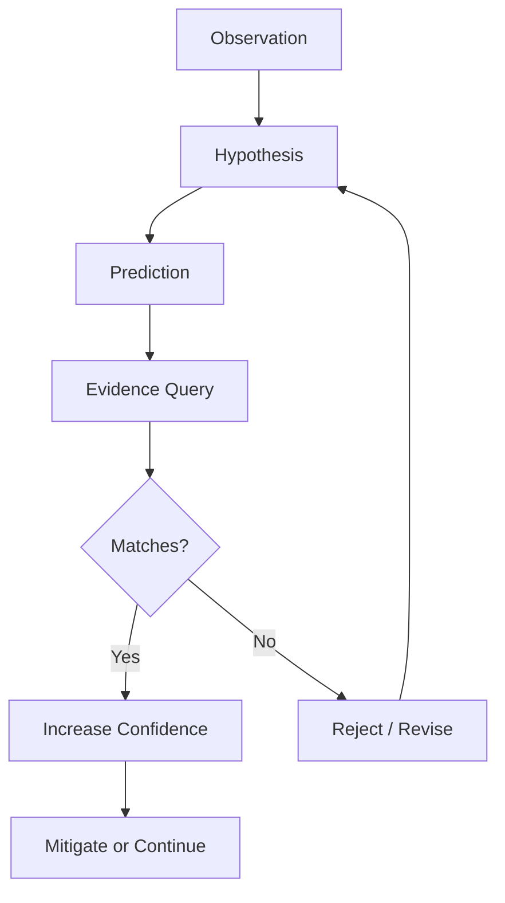
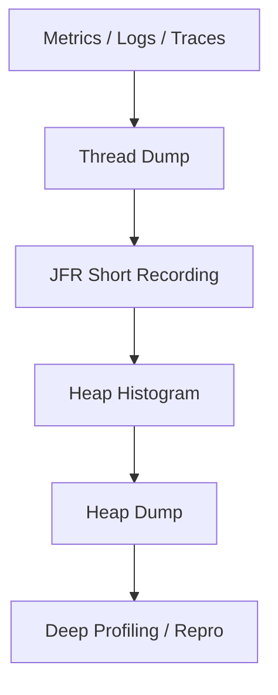

# Part 032 — Debugging Production Failures

> Target skill: mampu mendiagnosis production failure secara sistematis, evidence-driven, dan aman. Setelah part ini, kamu harus bisa membangun timeline, membaca korelasi logs-metrics-traces, mengambil thread dump/JFR/heap evidence dengan hati-hati, membedakan cause vs symptom, dan memilih mitigasi tanpa memperparah kondisi sistem.

Production debugging berbeda dari local debugging.

Di local, kamu sering punya debugger, controllable input, dan waktu. Di production, kamu punya:

- partial visibility,
- pressure dari user/business,
- data sensitif,
- distributed causality,
- state yang sedang berubah,
- risiko tindakan diagnosis memperburuk sistem,
- kebutuhan mitigasi sebelum root cause sempurna ditemukan.

Top engineer tidak “menebak penyebab”. Mereka membangun **evidence chain**.

---

## 1. Kaufman Deconstruction

Production debugging terdiri dari sub-skill berikut:

| Sub-skill | Outcome |
|---|---|
| Impact scoping | Menentukan siapa/apa yang terdampak dan seberapa parah |
| Timeline construction | Menyusun urutan signal, change, dan symptom |
| Hypothesis loop | Membuat, menguji, dan membuang hipotesis berdasarkan evidence |
| Signal correlation | Menggabungkan logs, metrics, traces, events, dumps, dan deployment data |
| JVM diagnostics | Menggunakan thread dump, heap dump, GC data, JFR, dan jcmd secara aman |
| Distributed debugging | Menelusuri failure lintas service, queue, DB, cache, dan external dependency |
| Mitigation reasoning | Memilih aksi yang menurunkan impact tanpa menambah risiko |
| Evidence preservation | Menyimpan data penting untuk postmortem, audit, dan prevention |

Debugging produksi bukan hanya menemukan bug. Tujuannya adalah memulihkan service, memahami failure mode, dan mencegah recurrence.

---

## 2. Mental Model: Evidence Chain

Evidence chain adalah rangkaian bukti yang menghubungkan symptom ke contributing factors.

```mermaid
flowchart LR
    A[User Impact] --> B[Symptom Metrics]
    B --> C[Trace Samples]
    C --> D[Logs / Error Codes]
    D --> E[JVM / Runtime Signals]
    E --> F[Dependency / Infra Signals]
    F --> G[Recent Changes]
    G --> H[Hypothesis]
    H --> I[Test / Disprove]
    I --> J[Mitigation]
    J --> K[Post-Incident Prevention]
```



Kunci:

- Mulai dari impact, bukan dari komponen favorit.
- Jangan loncat dari correlation ke causation.
- Setiap hipotesis harus punya expected evidence.
- Jika evidence tidak cocok, buang atau revisi hipotesis.

---

## 3. First 10 Minutes: Production Triage Algorithm

Saat alert firing, gunakan urutan ini.

### 3.1 Confirm impact

Tanya:

- Apakah user benar-benar terdampak?
- Operation apa yang gagal?
- Availability, latency, correctness, freshness, atau deadline?
- Berapa persentase request/job/case terdampak?
- Region/tenant/version mana?

### 3.2 Establish timeline

Cari:

- kapan symptom mulai,
- kapan alert firing,
- deployment terakhir,
- config/feature flag change,
- traffic spike,
- dependency incident,
- infrastructure event,
- schema/data migration.

### 3.3 Identify blast radius

Segmentasi dengan dimensi aman:

- service,
- endpoint/operation,
- region/zone,
- tenant tier, bukan tenant ID high-cardinality di metric,
- app version,
- dependency,
- message topic/consumer group,
- business capability.

### 3.4 Choose mitigation path

Pilih mitigation yang paling aman:

- rollback jika deployment correlated dan reversible,
- disable feature flag,
- route to fallback/degraded mode,
- stop harmful retry,
- shed load,
- pause consumer untuk mencegah damage,
- isolate bad pod,
- scale out jika bottleneck adalah capacity dan downstream sehat.

### 3.5 Preserve evidence

Sebelum restart/rollback jika memungkinkan:

- sample traces,
- representative logs,
- thread dump,
- heap/JFR jika relevant dan safe,
- deployment hash,
- config/flag state,
- DB/session evidence,
- message IDs for failed sample.

---

## 4. Hypothesis Loop

Gunakan loop ini agar debugging tidak berubah menjadi spekulasi.



Template hipotesis:

```txt
Hypothesis:
  Recent deployment v2026.06.28.3 introduced a blocking call inside the request path.

Predictions:
  - Latency increase starts after deployment time.
  - Only pods on new version are affected.
  - Traces show time spent in dependency X or thread pool Y.
  - Rollback or traffic shift reduces latency.

Evidence to check:
  - request latency by version
  - deployment events
  - trace critical path
  - thread dump blocked/waiting states
```

Jika prediction tidak muncul, hipotesis lemah.

---

## 5. Logs, Metrics, Traces: How to Use Each

### 5.1 Metrics answer “how much” and “when”

Metrics cocok untuk:

- impact size,
- start time,
- trend,
- rate,
- saturation,
- error budget burn,
- recovery confirmation.

Contoh questions:

```txt
When did error ratio increase?
Which operation has the highest bad-event ratio?
Is latency high for all versions or only new deployment?
Is queue age rising or draining?
```

### 5.2 Logs answer “what happened here”

Logs cocok untuk:

- error code distribution,
- exception cause chain,
- domain rejection reason,
- request lifecycle events,
- audit events,
- deployment/config decisions,
- sample-level investigation.

Jangan mulai dari full-text log search tanpa scope. Mulai dari metric/trace, lalu ambil sample log berdasarkan correlation ID/trace ID/error code.

### 5.3 Traces answer “where time/failure flowed”

Traces cocok untuk:

- critical path,
- dependency latency,
- retry/fallback behavior,
- fan-out/fan-in,
- context propagation gap,
- cross-service causal chain.

Trace yang baik harus bisa menjawab:

```txt
Which span consumed the latency budget?
Which dependency returned error?
Was fallback used?
How many retry attempts happened?
Where did context disappear?
```

---

## 6. Debugging by Failure Shape

### 6.1 Availability drop

Symptoms:

- 5xx naik,
- timeout naik,
- circuit breaker open,
- pod restart,
- rejected task.

Check:

- error ratio by operation/version,
- top error codes,
- dependency failure ratio,
- recent deployment,
- pod status/restart reason,
- thread pool and connection pool metrics.

Likely failure modes:

- bad deploy,
- dependency outage,
- connection pool exhaustion,
- thread pool saturation,
- retry storm,
- schema mismatch,
- config error.

### 6.2 Latency spike

Symptoms:

- p95/p99 naik,
- timeout mulai muncul,
- queue age naik,
- request concurrency naik.

Check:

- trace critical path,
- dependency latency,
- DB query duration,
- GC pause,
- lock contention,
- pool acquisition time,
- CPU throttling/container limits.

Likely failure modes:

- slow dependency,
- DB lock/query regression,
- blocking call in event loop,
- pool starvation,
- GC pressure,
- noisy neighbor/container throttling.

### 6.3 Correctness failure

Symptoms:

- duplicate side effects,
- wrong state transition,
- inconsistent read/write,
- audit mismatch,
- support tickets despite green metrics.

Check:

- domain event timeline,
- idempotency table,
- transaction boundaries,
- state transition logs,
- message redelivery,
- retry behavior,
- compensation events.

Likely failure modes:

- non-idempotent retry,
- race condition,
- stale read,
- missing invariant check,
- partial commit,
- out-of-order event.

### 6.4 Freshness/backlog failure

Symptoms:

- queue lag/age naik,
- batch job misses deadline,
- stale cache,
- delayed projection.

Check:

- producer rate vs consumer rate,
- consumer error/retry/DLQ,
- oldest message age,
- partition skew,
- downstream bottleneck,
- poison messages.

Likely failure modes:

- consumer capacity insufficient,
- poison message retry loop,
- downstream timeout,
- partition hot spot,
- batch window too short,
- schema evolution issue.

---

## 7. JVM Diagnostics: Production-Safe Ladder

JVM diagnostics harus dilakukan bertahap. Mulai dari yang paling murah dan aman.



Semakin bawah, semakin besar overhead, risk, dan sensitivity.

---

## 8. Thread Dump

Thread dump menunjukkan apa yang sedang dilakukan thread pada saat tertentu.

Cocok untuk:

- deadlock,
- lock contention,
- thread pool starvation,
- blocked I/O,
- runaway thread,
- virtual thread diagnosis,
- stuck shutdown.

Command examples:

```bash
jcmd <pid> Thread.print > thread-dump-$(date +%s).txt
```

Atau:

```bash
jstack <pid> > thread-dump-$(date +%s).txt
```

Ambil beberapa dump dengan interval:

```bash
for i in 1 2 3; do
  jcmd <pid> Thread.print > thread-dump-$i.txt
  sleep 10
done
```

Satu dump hanya snapshot. Tiga dump membantu melihat apakah thread stuck atau bergerak.

### 8.1 What to look for

| Pattern | Meaning |
|---|---|
| Many threads BLOCKED on same monitor | Lock contention |
| Many threads WAITING on pool acquisition | Connection/thread pool starvation |
| Same stack across dumps | Stuck work |
| Deadlock section present | JVM detected monitor deadlock |
| Many threads logging | Logging bottleneck |
| Many virtual threads parked on I/O | May be normal; check downstream latency |

---

## 9. Java Flight Recorder

Java Flight Recorder adalah diagnostic/profiling facility di JDK yang dapat merekam event runtime seperti allocation, CPU, lock, GC, thread, I/O, dan exception dengan overhead yang relatif rendah jika dikonfigurasi benar.

Cocok untuk:

- CPU hot path,
- allocation pressure,
- lock contention,
- GC behavior,
- exception storm,
- file/socket I/O,
- thread scheduling,
- virtual thread pinning investigation.

Command examples:

```bash
jcmd <pid> JFR.start name=incident settings=profile duration=120s filename=/tmp/incident.jfr
```

Jika recording sudah berjalan:

```bash
jcmd <pid> JFR.check
jcmd <pid> JFR.dump name=incident filename=/tmp/incident-dump.jfr
jcmd <pid> JFR.stop name=incident
```

Production caution:

- Jangan merekam terlalu lama tanpa alasan.
- Simpan file di lokasi dengan space cukup.
- Perlakukan JFR sebagai potentially sensitive artifact.
- Jangan mengaktifkan konfigurasi yang terlalu verbose tanpa memahami overhead.

---

## 10. Heap Diagnostics

### 10.1 Heap histogram

Heap histogram lebih ringan daripada heap dump.

```bash
jcmd <pid> GC.class_histogram > class-histogram.txt
```

Gunakan untuk melihat class mana yang dominan.

Useful questions:

```txt
Apakah ada object type yang tumbuh cepat?
Apakah buffer/string/byte[] mendominasi?
Apakah cache/map tidak terkendali?
```

### 10.2 Heap dump

Heap dump bisa sangat besar, mengandung data sensitif, dan dapat memberi tekanan ke disk/CPU.

```bash
jcmd <pid> GC.heap_dump /tmp/heap-$(date +%s).hprof
```

Gunakan jika:

- OOM/leak kuat dicurigai,
- histogram tidak cukup,
- instance retention perlu dianalisis,
- ada approval/security handling.

Jangan otomatis heap dump semua incident.

---

## 11. GC and Memory Failure Debugging

### 11.1 Symptoms

- latency spikes aligned with GC pauses,
- high allocation rate,
- old generation grows and does not drop,
- container OOMKilled,
- `OutOfMemoryError`,
- restart loop.

### 11.2 Evidence

Check:

- GC logs,
- heap usage after GC,
- allocation rate,
- native memory if relevant,
- container memory limit,
- heap dump/histogram,
- JFR allocation events,
- recent deployment allocation changes.

### 11.3 Common root patterns

| Pattern | Evidence |
|---|---|
| Java heap leak | Old gen grows across full GC, retained objects grow |
| Allocation storm | High allocation rate, frequent young GC, CPU pressure |
| Native memory pressure | RSS grows beyond heap, direct buffers/metaspace/thread stacks |
| Container limit mismatch | JVM heap + native > cgroup memory |
| Large response buffering | byte[]/String/object graph spike |

Command examples:

```bash
jcmd <pid> GC.heap_info
jcmd <pid> VM.native_memory summary
```

`VM.native_memory` needs Native Memory Tracking enabled to be useful.

---

## 12. Thread Pool and Connection Pool Debugging

Thread pool and connection pool failures often present as latency or timeout.

### 12.1 Thread pool evidence

Metrics to collect:

- active threads,
- pool size,
- queue size,
- queue age,
- completed task rate,
- rejected task count,
- task duration.

Thread dump evidence:

- workers blocked on dependency,
- workers waiting on DB connection,
- workers stuck in synchronized block,
- logging appender blocking,
- too many tasks in same path.

### 12.2 Connection pool evidence

Metrics:

- active connections,
- idle connections,
- pending acquisition,
- acquisition duration,
- timeout count,
- query duration,
- transaction duration.

Common mistakes:

- increasing pool size without DB capacity,
- increasing timeout without deadline budget,
- ignoring leaked connections,
- ignoring long transactions,
- retrying when pool is already exhausted.

---

## 13. Distributed Failure Debugging

Distributed systems fail partially.

### 13.1 Use trace to identify boundary

In trace view, inspect:

- root span duration,
- slow child span,
- failed child span,
- retries,
- fallback span,
- queue publish/consume link,
- missing parent context.

### 13.2 Use logs to explain local decision

For failed sample, correlate by:

- trace ID,
- correlation ID,
- request ID,
- error code,
- idempotency key hash,
- message ID,
- job execution ID.

### 13.3 Use metrics to measure scale

After understanding one failed example, measure:

- how many requests share that error code,
- how many tenants/regions/versions affected,
- whether rate is increasing,
- whether mitigation works.

One sample explains behavior. Metrics prove magnitude.

---

## 14. Change Correlation

Most production incidents are triggered by change, but not all changes are deployments.

Check:

- application deployment,
- dependency deployment,
- feature flag change,
- config change,
- secret/certificate rotation,
- schema migration,
- data backfill,
- traffic/routing change,
- autoscaling event,
- infrastructure/node upgrade,
- library version change,
- observability agent change.

Timeline example:

```txt
10:00 deployment v42 begins
10:04 first pod v42 ready
10:06 p99 latency starts increasing for v42 only
10:08 retry rate increases
10:10 checkout SLO fast-burn alert fires
10:12 rollback begins
10:18 error ratio returns to baseline
```

This is strong evidence for deployment-related regression, but still not root cause. Root cause may be blocking call, config mismatch, query regression, or dependency behavior triggered by the new version.

---

## 15. Kubernetes and Runtime Context

For Java services in Kubernetes, include platform evidence.

Check:

```bash
kubectl get pods -n <namespace>
kubectl describe pod <pod> -n <namespace>
kubectl logs <pod> -n <namespace> --previous
kubectl get events -n <namespace> --sort-by=.lastTimestamp
kubectl top pod -n <namespace>
```

Look for:

- restarts,
- OOMKilled,
- CrashLoopBackOff,
- readiness/liveness probe failures,
- CPU throttling,
- node pressure,
- image pull issues,
- rollout stuck,
- termination grace exceeded,
- sidecar issues.

For graceful shutdown debugging, correlate:

- SIGTERM time,
- readiness change,
- request drain,
- executor shutdown logs,
- queue listener stop,
- telemetry flush,
- KILL time.

---

## 16. Debugging Error Code Spikes

If your architecture has error codes, debugging becomes faster.

Process:

1. Identify top error codes by rate.
2. Split by endpoint/operation/version.
3. Pick representative trace/log sample for each.
4. Map error code to owner and domain meaning.
5. Distinguish expected rejection vs unexpected failure.
6. Check whether retryable errors are actually retried safely.
7. Check whether unknown error code is boundary translation failure.

Example query intent:

```txt
Show rate of application_errors_total by error_code for service=case-decision in last 30m.
```

Investigation questions:

- Is this a business rejection spike?
- Is validation rejecting a new client payload?
- Is dependency failure being translated correctly?
- Is error code stable or newly introduced?
- Is client behavior changed?

---

## 17. Production-Safe Debugging Rules

### 17.1 Do not make state-changing experiments blindly

Bad:

```txt
Let's retry all failed messages immediately.
```

Risk:

- duplicate side effects,
- retry storm,
- downstream overload,
- corrupted state.

Better:

- sample a small batch,
- verify idempotency,
- use rate limit,
- monitor downstream,
- record replay decision.

### 17.2 Do not increase timeouts as default mitigation

Increasing timeout can:

- hold threads longer,
- exhaust pools,
- increase queue age,
- worsen user latency,
- amplify cascading failure.

Only increase timeout if:

- downstream is healthy but legitimately slower,
- caller deadline allows it,
- concurrency/pool capacity is safe,
- SLO impact improves.

### 17.3 Do not restart before preserving evidence

Restart may remove:

- thread state,
- heap state,
- JFR context,
- logs in ephemeral storage,
- in-memory queue/cache evidence.

If impact is severe, mitigation may outweigh evidence preservation. But make that trade-off explicit.

### 17.4 Do not expose sensitive artifacts

Thread dump, heap dump, logs, and JFR may contain:

- PII,
- secrets,
- tokens,
- payload data,
- tenant identifiers,
- business-sensitive decisions.

Handle with restricted access and retention policy.

---

## 18. Debugging Playbooks by Symptom

### 18.1 High 5xx

```txt
1. Check error ratio by endpoint/version/region.
2. Check top error codes and exception classes.
3. Check recent deployment/config/flag changes.
4. Sample traces for failed requests.
5. Check dependency error ratio.
6. Check pod restarts and OOM.
7. Mitigate: rollback, flag off, fallback, isolate dependency, shed load.
```

### 18.2 High latency

```txt
1. Check p95/p99 by endpoint/version/region.
2. Compare app latency vs dependency latency.
3. Inspect slow trace critical path.
4. Check pool acquisition time.
5. Check GC pause and CPU throttling.
6. Take thread dump if saturation/stuck suspected.
7. Mitigate: rollback, reduce concurrency, shed load, scale if safe.
```

### 18.3 Consumer lag/backlog

```txt
1. Check oldest message age and consumer throughput.
2. Check error/retry/DLQ rate.
3. Identify poison message pattern.
4. Check downstream latency/error.
5. Check partition skew.
6. Pause harmful consumer if repeated side effects risk exists.
7. Mitigate: isolate poison messages, scale consumers if downstream allows, fix retry policy.
```

### 18.4 Memory pressure/OOM

```txt
1. Check restart reason and memory graph.
2. Check heap vs RSS.
3. Capture histogram/JFR/heap dump if safe.
4. Check recent deployment and traffic/payload change.
5. Look for cache/map/buffer growth.
6. Mitigate: rollback, reduce load, scale out, disable memory-heavy feature.
```

### 18.5 Stuck shutdown

```txt
1. Check SIGTERM and readiness transition logs.
2. Check in-flight request drain.
3. Check executor shutdown logs.
4. Take thread dump before KILL if possible.
5. Identify blocking tasks and non-daemon threads.
6. Check telemetry flush and message ack behavior.
7. Fix lifecycle ordering and deadlines.
```

---

## 19. Debugging Checklist

During incident:

- [ ] Impact confirmed.
- [ ] Scope segmented.
- [ ] Timeline started.
- [ ] Recent changes listed.
- [ ] Symptom metrics checked.
- [ ] Representative trace samples opened.
- [ ] Error codes/log samples correlated.
- [ ] Runtime/JVM health checked.
- [ ] Dependency health checked.
- [ ] Mitigation options evaluated.
- [ ] Evidence preserved where safe.
- [ ] Communication update sent.

After mitigation:

- [ ] SLO recovery confirmed.
- [ ] Backlog/drain state checked.
- [ ] Duplicate/partial side effects checked.
- [ ] Unknown outcomes captured.
- [ ] Root/contributing factors investigated.
- [ ] Telemetry gaps documented.
- [ ] Preventive actions assigned.

---

## 20. Practice Lab

### Lab 1 — Build a timeline

Given logs, deployment events, and SLO graph, build:

- start time,
- first bad event,
- detection time,
- mitigation time,
- recovery time,
- suspected trigger,
- evidence strength.

### Lab 2 — Debug latency spike

Simulate:

- one endpoint p99 latency spike,
- dependency call slow,
- retry count rising,
- thread pool queue growing.

Produce:

- hypothesis,
- evidence query,
- mitigation,
- postmortem action.

### Lab 3 — Thread dump reading

Take three thread dumps from a test service with an intentionally blocked pool.

Identify:

- blocked threads,
- waiting threads,
- repeated stack,
- owner code path,
- mitigation.

### Lab 4 — JFR incident recording

Run a Java app with artificial allocation pressure.

Capture:

- JFR recording,
- allocation hotspot,
- GC behavior,
- code path causing pressure.

---

## 21. Anti-Patterns

| Anti-pattern | Why it fails |
|---|---|
| Debugging from favorite subsystem | Bias hides actual cause |
| Starting from logs without scope | Too much noise |
| Treating correlation as causation | Wrong fix risk |
| Restarting everything | Removes evidence, may amplify issue |
| Increasing timeout blindly | Can worsen saturation |
| Retrying failed jobs blindly | Can duplicate side effects |
| Ignoring correctness failures | Green availability can hide bad outcomes |
| No timeline | Team argues from memory |
| No evidence preservation | Postmortem becomes speculation |

---

## 22. Key Takeaways

- Production debugging is evidence-driven impact reduction.
- Start from user impact and symptom metrics, not from implementation guesses.
- Use traces for causal path, logs for local facts, metrics for scale and trend.
- JVM diagnostics are powerful but must be used with production safety.
- Thread dumps are cheap and useful for stuck/saturation problems.
- JFR is valuable for CPU, allocation, lock, GC, and runtime event analysis.
- Heap dumps can expose sensitive data and should be deliberate.
- The strongest debugging artifact is a clear timeline with evidence.

---

## 23. References

- OpenTelemetry — Observability Primer: https://opentelemetry.io/docs/concepts/observability-primer/
- OpenTelemetry — Logs specification and correlation model: https://opentelemetry.io/docs/specs/otel/logs/
- Java SE 25 — jdk.jfr package: https://docs.oracle.com/en/java/javase/25/docs/api/jdk.jfr/jdk/jfr/package-summary.html
- Java SE 25 — JFR Recording API: https://docs.oracle.com/en/java/javase/25/docs/api/jdk.jfr/jdk/jfr/Recording.html
- Oracle — Flight Recorder API Programmer's Guide: https://docs.oracle.com/en/java/javase/25/jfapi/flight-recorder-api-programmers-guide.pdf
- Prometheus — Alerting Rules: https://prometheus.io/docs/prometheus/latest/configuration/alerting_rules/

---

## 24. What Comes Next

Part 033 akan membahas error management architecture: bagaimana menyatukan exception hierarchy, error code registry, Problem Details, logging, metrics, traces, audit, retry policy, dan boundary translation menjadi satu architecture yang defensible.
