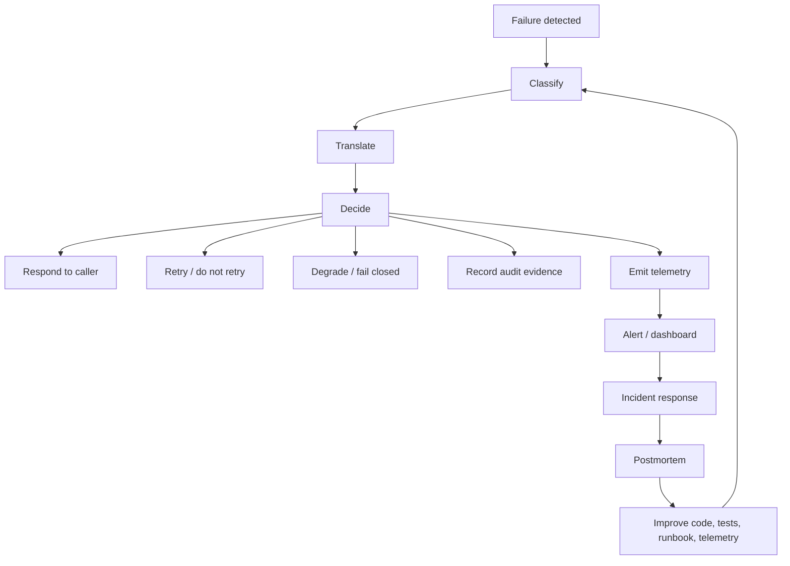
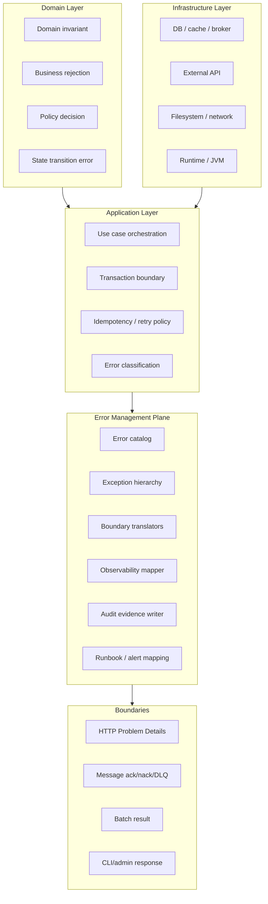
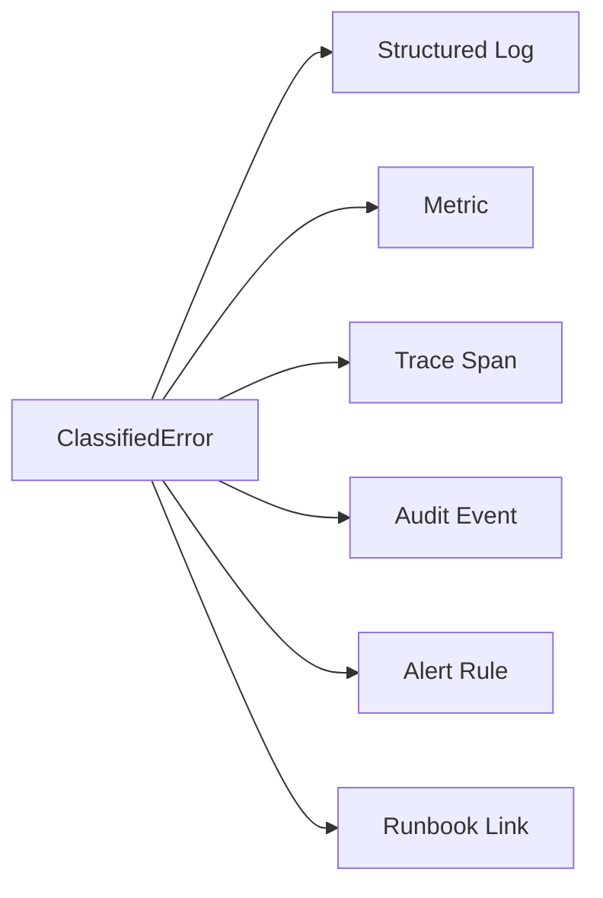
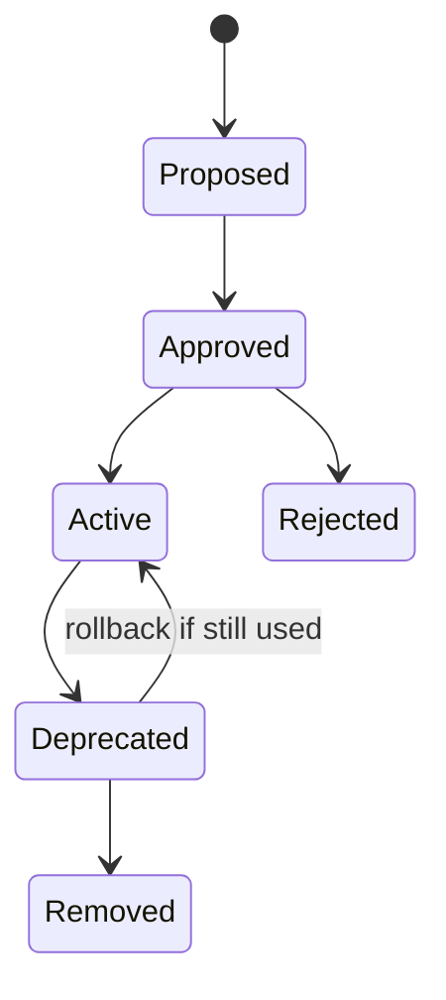
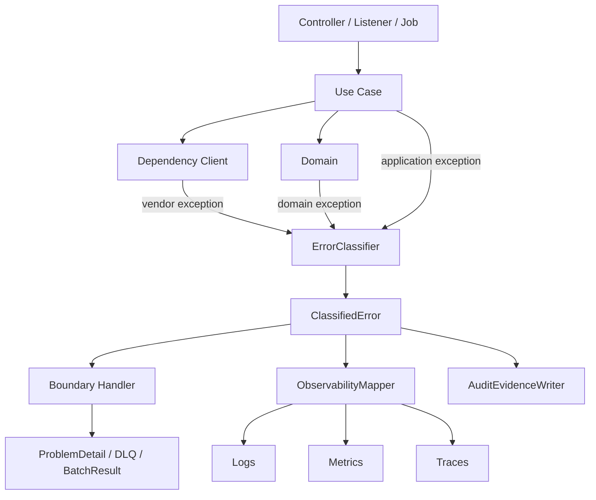
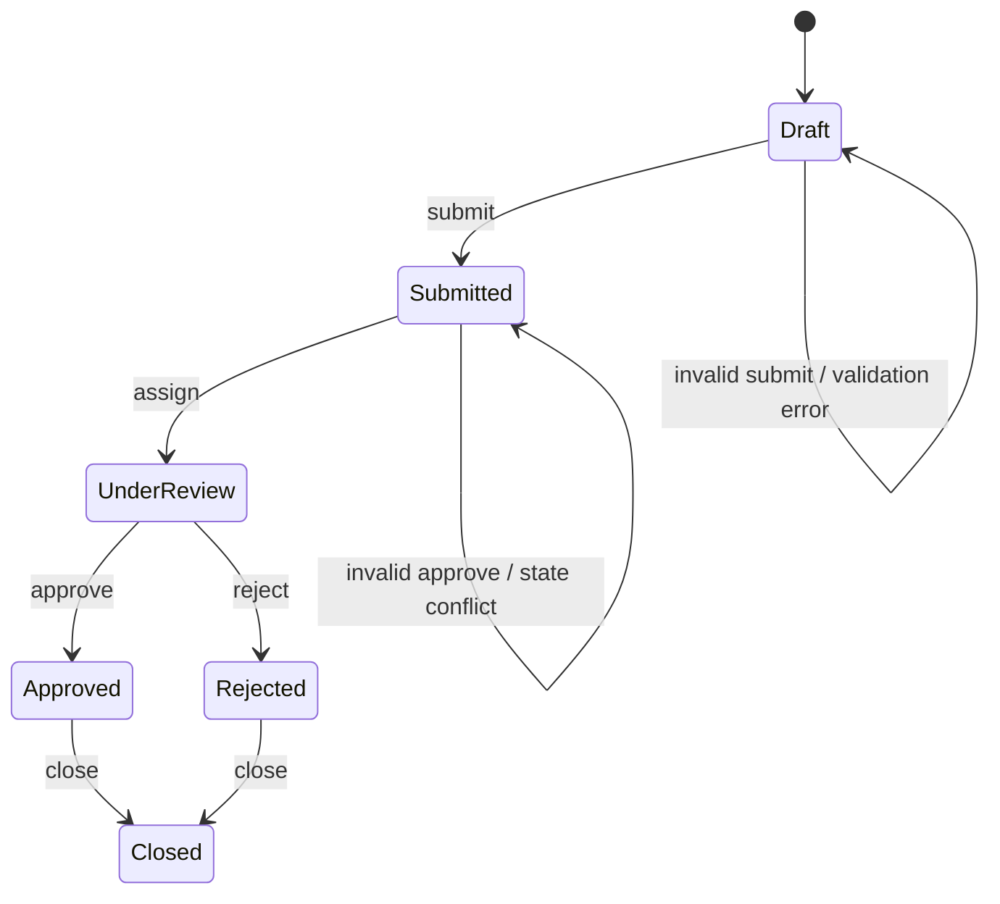

# Part 033 — Error Management Architecture

Di part sebelumnya kita sudah membahas exception semantics, error contract, retry, timeout, fallback, shutdown, logging, metrics, tracing, telemetry quality, alerting, dan debugging produksi. Sekarang kita naik satu level: **bagaimana semua itu disusun menjadi architecture yang konsisten**.

Di sistem kecil, error handling sering cukup dengan `try/catch` dan global exception handler. Di sistem production-grade, apalagi sistem case management, regulatory, payment, banking, enforcement, identity, atau workflow-heavy platform, pendekatan itu cepat runtuh. Error tidak hanya perlu “ditangani”; error perlu **diklasifikasi, diterjemahkan, diobservasi, diaudit, dipakai untuk keputusan retry/degradation, dan dimasukkan kembali ke proses perbaikan sistem**.

Tujuan part ini: membangun mental model dan blueprint **Error Management Architecture** untuk sistem Java modern.

---

## 1. Kaufman Skill Slice

Berdasarkan pendekatan Josh Kaufman, skill besar ini dipecah menjadi sub-skill kecil yang bisa dilatih secara deliberate.

| Sub-skill | Target kemampuan |
|---|---|
| Failure classification | Mampu membedakan domain rejection, validation error, dependency failure, platform failure, programmer defect, dan unknown outcome |
| Error contract design | Mampu membuat error code, Problem Details, retryability, severity, dan safe message yang stabil |
| Exception architecture | Mampu membuat hierarchy yang tidak meledak dan tidak terlalu generik |
| Boundary translation | Mampu menerjemahkan error internal ke HTTP, messaging, batch, CLI, audit, dan telemetry |
| Observability mapping | Mampu menghasilkan log, metric, trace, event, dan alert yang konsisten dari satu error model |
| Governance | Mampu menjaga error catalog tetap valid, tidak redundant, tidak bocor data sensitif, dan tidak menjadi sampah operasional |
| Feedback loop | Mampu menghubungkan incident, postmortem, runbook, telemetry, dan code change |

Ukuran keberhasilan bukan “tidak ada exception”. Ukuran keberhasilan adalah:

1. failure bisa diklasifikasi dengan cepat;
2. caller tahu apakah bisa retry, fix input, escalate, atau stop;
3. operator bisa menemukan evidence tanpa menebak;
4. sistem tidak memperparah kondisi failure;
5. domain/audit record tetap defensible;
6. incident menghasilkan perbaikan desain, bukan hanya patch.

---

## 2. Masalah yang Diselesaikan Error Management Architecture

Tanpa arsitektur error, organisasi biasanya mengalami gejala berikut:

| Gejala | Akar masalah |
|---|---|
| Banyak `RuntimeException("failed")` | Tidak ada failure taxonomy dan error catalog |
| Client melihat error message teknis | Boundary translation lemah |
| Support tidak tahu arti error code | Error code tidak punya registry dan owner |
| Alert noisy | Error tidak punya severity dan retryability yang konsisten |
| Retry memperparah outage | Error tidak dibedakan transient/permanent/unknown |
| Log tidak bisa dikorelasikan dengan trace | Context propagation dan log schema tidak distandarkan |
| Incident sulit direkonstruksi | Error tidak menghasilkan evidence event dan audit trail |
| Exception hierarchy terlalu banyak | Class digunakan untuk semua metadata, bukan error descriptor |
| Semua error jadi HTTP 500 | Domain, validation, conflict, policy, dan dependency error tidak diterjemahkan |
| Postmortem hanya menyalahkan orang | Tidak ada feedback loop ke invariant, test, telemetry, dan runbook |

Arsitektur error yang baik membuat error menjadi **first-class operational object**, bukan efek samping dari stack trace.

---

## 3. Mental Model: Error sebagai Control Signal

Error bukan hanya “kejadian buruk”. Dalam sistem produksi, error adalah **control signal** yang mengarahkan keputusan berikut:



Kesalahan umum adalah memperlakukan error sebagai “output terakhir”. Padahal error justru memicu banyak downstream decision.

Contoh:

```text
payment.dependency.timeout
```

Satu error code ini harus menjawab:

- Apakah caller boleh retry?
- Apakah operasi mungkin sudah berhasil tapi response hilang?
- Apakah user boleh melihat pesan ini?
- Apakah error ini masuk SLO?
- Apakah alert harus firing?
- Apakah event audit perlu dibuat?
- Apakah fallback boleh dilakukan?
- Apakah message harus masuk DLQ?
- Apakah support bisa meminta user mencoba ulang?

Kalau error hanya berupa `TimeoutException`, terlalu banyak keputusan penting menjadi implicit.

---

## 4. Layer Arsitektur

Error management architecture bisa dilihat sebagai beberapa layer.



Prinsipnya: **domain boleh mendefinisikan failure meaning, tetapi boundary yang menentukan bentuk response**.

Domain tidak seharusnya tahu HTTP status. Persistence layer tidak seharusnya tahu Problem Details. Global exception handler tidak seharusnya mengarang error code sendiri.

---

## 5. Core Components

### 5.1 Error Catalog

Error catalog adalah registry resmi untuk error yang dapat dikenali sistem.

Contoh minimal field:

| Field | Makna |
|---|---|
| `code` | Stable machine-readable code |
| `category` | Domain, validation, dependency, platform, security, unknown |
| `severity` | Info, warning, error, critical |
| `retryable` | Apakah retry aman secara prinsip |
| `httpStatus` | Mapping default untuk HTTP boundary |
| `safeMessage` | Pesan aman untuk client/operator |
| `owner` | Tim/service owner |
| `sloImpact` | Apakah error ini memengaruhi SLO tertentu |
| `auditRequired` | Apakah harus menjadi audit evidence |
| `runbook` | Link/identifier runbook |
| `deprecated` | Status lifecycle error code |

Contoh Java:

```java
public enum ErrorCategory {
    VALIDATION,
    DOMAIN_REJECTION,
    STATE_CONFLICT,
    POLICY_DENIAL,
    DEPENDENCY_FAILURE,
    INFRASTRUCTURE_FAILURE,
    PLATFORM_FAILURE,
    PROGRAMMER_DEFECT,
    UNKNOWN
}

public enum ErrorSeverity {
    INFO,
    WARNING,
    ERROR,
    CRITICAL
}

public record ErrorDescriptor(
        String code,
        ErrorCategory category,
        ErrorSeverity severity,
        boolean retryable,
        boolean auditRequired,
        boolean userCorrectable,
        int defaultHttpStatus,
        String safeMessage,
        String owner,
        String runbookId
) {}
```

Contoh catalog:

```java
public final class ErrorCatalog {
    public static final ErrorDescriptor CASE_STATE_CONFLICT = new ErrorDescriptor(
            "case.state.conflict",
            ErrorCategory.STATE_CONFLICT,
            ErrorSeverity.WARNING,
            false,
            true,
            false,
            409,
            "The case is not in a state that allows this operation.",
            "case-platform",
            "RB-CASE-409"
    );

    public static final ErrorDescriptor PAYMENT_TIMEOUT = new ErrorDescriptor(
            "payment.dependency.timeout",
            ErrorCategory.DEPENDENCY_FAILURE,
            ErrorSeverity.ERROR,
            true,
            true,
            false,
            504,
            "The payment provider did not respond in time.",
            "payment-integration",
            "RB-PAYMENT-TIMEOUT"
    );

    private ErrorCatalog() {}
}
```

Error catalog tidak harus selalu `enum`. Untuk organisasi besar, catalog sering lebih tepat sebagai YAML/JSON/DB-backed registry yang di-generate menjadi Java constants, dokumentasi API, dashboard labels, dan runbook index.

---

### 5.2 Application Exception

Exception hierarchy sebaiknya membawa `ErrorDescriptor` dan metadata aman, bukan seluruh detail internal.

```java
public abstract class ApplicationException extends RuntimeException {
    private final ErrorDescriptor descriptor;
    private final Map<String, String> safeAttributes;

    protected ApplicationException(
            ErrorDescriptor descriptor,
            String internalMessage,
            Throwable cause,
            Map<String, String> safeAttributes
    ) {
        super(internalMessage, cause);
        this.descriptor = Objects.requireNonNull(descriptor);
        this.safeAttributes = Map.copyOf(safeAttributes);
    }

    public ErrorDescriptor descriptor() {
        return descriptor;
    }

    public Map<String, String> safeAttributes() {
        return safeAttributes;
    }
}
```

Subclass bisa tetap sedikit:

```java
public final class DomainRejectionException extends ApplicationException {
    public DomainRejectionException(
            ErrorDescriptor descriptor,
            String internalMessage,
            Map<String, String> safeAttributes
    ) {
        super(descriptor, internalMessage, null, safeAttributes);
    }
}

public final class DependencyFailureException extends ApplicationException {
    public DependencyFailureException(
            ErrorDescriptor descriptor,
            String internalMessage,
            Throwable cause,
            Map<String, String> safeAttributes
    ) {
        super(descriptor, internalMessage, cause, safeAttributes);
    }
}
```

Prinsip penting:

- Class menjelaskan **jenis mekanisme failure**.
- Descriptor menjelaskan **kontrak operasional failure**.
- Safe attributes menjelaskan **context yang boleh keluar**.
- Cause chain menyimpan **evidence teknis internal**.

Jangan membuat satu class untuk setiap error code kecuali domain benar-benar membutuhkannya sebagai type-level distinction.

---

### 5.3 Error Classification Service

Tidak semua exception lahir sebagai `ApplicationException`. Banyak failure berasal dari library/framework: JDBC, HTTP client, broker client, JSON parser, validation framework, crypto provider, filesystem, JVM, dan sebagainya.

Maka perlu classifier:

```java
public final class ErrorClassifier {

    public ClassifiedError classify(Throwable throwable) {
        if (throwable instanceof ApplicationException app) {
            return ClassifiedError.from(app.descriptor(), app.safeAttributes(), app);
        }

        if (isTimeout(throwable)) {
            return ClassifiedError.from(
                    ErrorCatalog.PAYMENT_TIMEOUT,
                    Map.of("dependency", "payment-provider"),
                    throwable
            );
        }

        if (isOptimisticLockConflict(throwable)) {
            return ClassifiedError.from(
                    ErrorCatalog.CASE_STATE_CONFLICT,
                    Map.of(),
                    throwable
            );
        }

        return ClassifiedError.from(
                SystemErrors.UNKNOWN_INTERNAL_ERROR,
                Map.of(),
                throwable
        );
    }

    private boolean isTimeout(Throwable throwable) {
        return findCause(throwable, java.net.SocketTimeoutException.class).isPresent()
                || findCause(throwable, java.util.concurrent.TimeoutException.class).isPresent();
    }

    private boolean isOptimisticLockConflict(Throwable throwable) {
        return throwable.getClass().getName().contains("OptimisticLock");
    }

    private static <T extends Throwable> Optional<T> findCause(Throwable throwable, Class<T> type) {
        Throwable current = throwable;
        while (current != null) {
            if (type.isInstance(current)) {
                return Optional.of(type.cast(current));
            }
            current = current.getCause();
        }
        return Optional.empty();
    }
}
```

Classifier harus deterministic. Jangan membuat mapping berdasarkan fragile string message kecuali tidak ada pilihan lain dan sudah dilindungi test.

---

### 5.4 Boundary Translator

Setelah error diklasifikasi, bentuk response tergantung boundary.

#### HTTP boundary

```java
public ProblemDetail toProblemDetail(ClassifiedError error, URI instance) {
    ErrorDescriptor d = error.descriptor();

    ProblemDetail problem = ProblemDetail.forStatus(d.defaultHttpStatus());
    problem.setTitle(d.safeMessage());
    problem.setType(URI.create("https://errors.example.com/" + d.code()));
    problem.setInstance(instance);
    problem.setProperty("code", d.code());
    problem.setProperty("retryable", d.retryable());
    problem.setProperty("category", d.category().name());

    error.safeAttributes().forEach(problem::setProperty);
    return problem;
}
```

HTTP boundary harus menghindari:

- raw exception message untuk client;
- stack trace di response;
- vendor-specific DB/HTTP/broker details;
- error code yang berubah karena refactor internal;
- penggunaan status 500 untuk semua hal.

#### Messaging boundary

```java
public MessageFailureDecision decide(ClassifiedError error) {
    ErrorDescriptor d = error.descriptor();

    return switch (d.category()) {
        case VALIDATION, DOMAIN_REJECTION, POLICY_DENIAL -> MessageFailureDecision.rejectToDlq(d.code());
        case DEPENDENCY_FAILURE, INFRASTRUCTURE_FAILURE ->
                d.retryable()
                        ? MessageFailureDecision.retryLater(d.code())
                        : MessageFailureDecision.rejectToDlq(d.code());
        case PROGRAMMER_DEFECT, PLATFORM_FAILURE, UNKNOWN ->
                MessageFailureDecision.stopConsumerAndPage(d.code());
        default -> MessageFailureDecision.rejectToDlq(d.code());
    };
}
```

Messaging boundary harus menjawab:

- ack?
- nack?
- retry?
- delay?
- DLQ?
- poison message?
- stop consumer?
- create audit event?

#### Batch/job boundary

Batch tidak boleh hanya “failed”. Batch perlu outcome detail:

```java
public record BatchFailure(
        String itemId,
        String errorCode,
        boolean retryable,
        String safeMessage,
        Map<String, String> attributes
) {}

public record BatchRunResult(
        String runId,
        int total,
        int succeeded,
        int failed,
        List<BatchFailure> failures
) {}
```

Batch boundary penting karena partial failure adalah normal, bukan exception khusus.

---

### 5.5 Observability Mapper

Satu classified error harus menghasilkan telemetry yang konsisten.



Contoh log:

```java
log.atWarn()
        .setMessage("Case transition rejected")
        .addKeyValue("error.code", error.descriptor().code())
        .addKeyValue("error.category", error.descriptor().category())
        .addKeyValue("case.id", caseId)
        .addKeyValue("from.state", fromState)
        .addKeyValue("requested.event", event)
        .log();
```

Contoh metric:

```java
Counter.builder("application_errors_total")
        .tag("error_code", error.descriptor().code())
        .tag("category", error.descriptor().category().name())
        .tag("retryable", Boolean.toString(error.descriptor().retryable()))
        .register(meterRegistry)
        .increment();
```

Contoh tracing:

```java
Span span = Span.current();
span.setAttribute("error.code", error.descriptor().code());
span.setAttribute("error.category", error.descriptor().category().name());
span.setAttribute("error.retryable", error.descriptor().retryable());
span.recordException(error.throwable());
span.setStatus(StatusCode.ERROR, error.descriptor().safeMessage());
```

Catatan penting: `error_code` biasanya boleh menjadi metric tag jika registry-nya bounded. Jangan menjadikan `message`, `userId`, `caseId`, `requestId`, `stackTraceHash` sebagai high-cardinality metric tag.

---

### 5.6 Audit Evidence Writer

Untuk sistem regulatory, audit evidence bukan log biasa. Log dapat di-retain pendek, disampling, dipindah, atau tidak dirancang sebagai record hukum. Audit evidence harus punya schema, lifecycle, integrity, retention, dan access policy sendiri.

Contoh audit event:

```java
public record ErrorAuditEvent(
        String eventId,
        Instant occurredAt,
        String actorId,
        String tenantId,
        String aggregateType,
        String aggregateId,
        String operation,
        String errorCode,
        String decision,
        Map<String, String> safeFacts,
        String traceId
) {}
```

Kapan audit event dibuat?

| Failure | Audit? | Alasan |
|---|---:|---|
| Validation typo pada field opsional | Tidak selalu | Bisa terlalu noisy |
| Business rejection pada state transition | Ya | Menjelaskan kenapa aksi ditolak |
| Policy denial | Ya | Security/compliance decision |
| Payment timeout unknown outcome | Ya | Perlu rekonsiliasi |
| Internal NullPointerException | Tergantung | Biasanya incident evidence, bukan domain audit |
| Manual override gagal | Ya | High accountability action |

Audit evidence harus menjawab “apa yang diketahui sistem saat itu”, bukan “apa yang kita simpulkan belakangan”.

---

## 6. Error Lifecycle

Error code perlu lifecycle. Tanpa lifecycle, error catalog berubah menjadi tempat sampah.



### Proposed

Error baru diajukan saat ada failure meaning baru yang tidak bisa diwakili existing code.

Pertanyaan review:

- Apakah ini benar-benar error baru atau variasi attribute?
- Siapa owner-nya?
- Boundary mana yang terkena?
- Apakah safe message sudah aman?
- Apakah retryable?
- Apakah audit required?
- Apakah masuk SLO?

### Approved

Descriptor sudah disetujui dan bisa dipakai di code.

### Active

Error muncul di production dan dipantau.

### Deprecated

Error tidak boleh dipakai untuk flow baru, tetapi masih dikenali untuk backward compatibility.

### Removed

Error tidak lagi diproduksi dan tidak lagi menjadi contract aktif. Untuk public API, removal biasanya butuh major version atau periode sunset.

---

## 7. Reference Architecture di Spring Boot

Berikut blueprint sederhana.



### Controller advice

```java
@RestControllerAdvice
public class ApiErrorHandler {
    private final ErrorClassifier classifier;
    private final HttpErrorTranslator translator;
    private final ErrorObservability observability;
    private final ErrorAuditWriter auditWriter;

    @ExceptionHandler(Throwable.class)
    public ResponseEntity<ProblemDetail> handle(Throwable throwable, HttpServletRequest request) {
        ClassifiedError error = classifier.classify(throwable);

        observability.record(error);
        auditWriter.recordIfRequired(error);

        ProblemDetail problem = translator.toProblemDetail(
                error,
                URI.create(request.getRequestURI())
        );

        return ResponseEntity
                .status(error.descriptor().defaultHttpStatus())
                .body(problem);
    }
}
```

Caveat: `@ExceptionHandler(Throwable.class)` harus menjadi last resort. Handler yang lebih spesifik tetap bisa ada untuk validation framework, authentication framework, dan binding errors, tetapi semuanya harus berakhir pada `ClassifiedError`.

---

## 8. Error Management untuk Domain Workflow

Untuk workflow/case management, error management harus selaras dengan state machine.

Contoh state transition:



Error domain tidak boleh hanya berkata “invalid operation”. Ia harus menjelaskan invariant yang gagal.

```java
public final class CaseTransitionGuard {
    public void requireTransitionAllowed(CaseStatus from, CaseEvent event) {
        boolean allowed = switch (from) {
            case DRAFT -> event == CaseEvent.SUBMIT;
            case SUBMITTED -> event == CaseEvent.ASSIGN;
            case UNDER_REVIEW -> event == CaseEvent.APPROVE || event == CaseEvent.REJECT;
            case APPROVED, REJECTED -> event == CaseEvent.CLOSE;
            case CLOSED -> false;
        };

        if (!allowed) {
            throw new DomainRejectionException(
                    ErrorCatalog.CASE_STATE_CONFLICT,
                    "Transition not allowed: from=%s event=%s".formatted(from, event),
                    Map.of(
                            "fromState", from.name(),
                            "event", event.name()
                    )
            );
        }
    }
}
```

Manfaat architecture:

- API mendapat 409 dengan error code stabil;
- log punya `fromState` dan `event`;
- audit event mencatat rejection;
- metric `application_errors_total{error_code="case.state.conflict"}` naik;
- trace menunjukkan span state transition gagal;
- runbook/support tahu ini bukan outage dependency.

---

## 9. Cross-Service Error Contract

Dalam microservices, error dari service A sering menjadi dependency failure di service B. Jangan bocorkan internal code sembarangan.

Misalnya `case.state.conflict` dari Case Service dipanggil oleh Orchestration Service.

Di Orchestration Service:

| Upstream response | Local classification |
|---|---|
| 400 validation | Caller/input contract failure |
| 401/403 | Policy/auth propagation failure |
| 404 | Missing referenced entity atau stale command |
| 409 domain conflict | Business conflict atau state race |
| 429 | Dependency throttling |
| 5xx | Dependency failure |
| timeout | Unknown outcome if side effect possible |

Error code upstream bisa disimpan sebagai attribute:

```java
throw new DependencyFailureException(
        ErrorCatalog.CASE_SERVICE_CONFLICT,
        "Case service rejected transition",
        cause,
        Map.of(
                "dependency", "case-service",
                "upstream.error_code", upstreamCode,
                "case.id", caseId
        )
);
```

Jangan otomatis menjadikan upstream error code sebagai public error code service kita. Service boundary tetap punya ownership contract sendiri.

---

## 10. Error Policy Matrix

Architecture harus punya policy matrix yang disepakati.

| Category | HTTP | Messaging | Retry | Audit | Alert |
|---|---:|---|---|---|---|
| Validation | 400/422 | DLQ/reject | No | Sometimes | No |
| Domain rejection | 409/422 | DLQ/reject | No | Often | No |
| Policy denial | 403 | DLQ/reject | No | Yes | Security-dependent |
| Dependency timeout | 504 | Retry/delay | Yes if idempotent | Sometimes | If SLO impact |
| Dependency 429 | 429/503 | Retry with backoff | Yes | No | If sustained |
| DB unavailable | 503 | Retry/stop | Yes | No | Yes |
| Serialization poison message | 400/DLQ | DLQ | No | Sometimes | Yes if spike |
| Programmer defect | 500 | Stop/DLQ | No | Incident evidence | Yes |
| Unknown | 500 | Stop/DLQ | Conservative | Maybe | Yes |

Policy matrix mencegah setiap engineer membuat keputusan sendiri di setiap handler.

---

## 11. Governance: Menjaga Error Catalog Tetap Bersih

Error catalog yang buruk bisa sama berbahayanya dengan tidak punya catalog.

### 11.1 Naming convention

Gunakan format stabil:

```text
<domain>.<capability>.<failure>
```

Contoh:

```text
case.transition.not_allowed
case.assignment.assignee_unavailable
payment.provider.timeout
identity.token.expired
document.rendering.template_missing
```

Hindari:

```text
ERROR_001
BAD_REQUEST
PAYMENT_FAILED
INTERNAL_ERROR_NEW
DB_ERROR_2
```

### 11.2 Jangan encode detail dinamis ke code

Buruk:

```text
case.transition.from_draft_to_approved_not_allowed
```

Lebih baik:

```text
case.transition.not_allowed
```

Dengan attributes:

```json
{
  "fromState": "DRAFT",
  "event": "APPROVE"
}
```

### 11.3 Review checklist untuk error baru

Sebelum menambahkan error code baru:

- Apakah existing code cukup?
- Apakah failure meaning berbeda atau hanya context berbeda?
- Apakah message aman untuk external client?
- Apakah category benar?
- Apakah retryable benar?
- Apakah status HTTP benar?
- Apakah audit required?
- Apakah owner jelas?
- Apakah runbook diperlukan?
- Apakah metric cardinality tetap bounded?
- Apakah ada test translator?

---

## 12. Testing Strategy

Error management architecture harus dites seperti business logic.

### 12.1 Unit test classifier

```java
@Test
void classifiesTimeoutAsDependencyTimeout() {
    Throwable throwable = new RuntimeException(new SocketTimeoutException("read timed out"));

    ClassifiedError error = classifier.classify(throwable);

    assertThat(error.descriptor().code()).isEqualTo("payment.dependency.timeout");
    assertThat(error.descriptor().retryable()).isTrue();
}
```

### 12.2 Contract test HTTP error

```java
@Test
void returnsProblemDetailForStateConflict() throws Exception {
    mockMvc.perform(post("/cases/C-123/approve"))
            .andExpect(status().isConflict())
            .andExpect(jsonPath("$.code").value("case.state.conflict"))
            .andExpect(jsonPath("$.retryable").value(false))
            .andExpect(jsonPath("$.title").exists())
            .andExpect(jsonPath("$.stackTrace").doesNotExist());
}
```

### 12.3 Telemetry test

Gunakan fake registry/exporter untuk memastikan error menghasilkan metric dan span attribute yang benar.

```java
@Test
void recordsErrorMetricWithBoundedTags() {
    errorObservability.record(classifiedError);

    Counter counter = registry.find("application_errors_total")
            .tag("error_code", "case.state.conflict")
            .counter();

    assertThat(counter.count()).isEqualTo(1.0);
}
```

### 12.4 Catalog validation test

```java
@Test
void allErrorDescriptorsHaveRequiredFields() {
    for (ErrorDescriptor descriptor : ErrorCatalogRegistry.all()) {
        assertThat(descriptor.code()).matches("[a-z][a-z0-9_]*(\\.[a-z][a-z0-9_]*)+");
        assertThat(descriptor.safeMessage()).isNotBlank();
        assertThat(descriptor.owner()).isNotBlank();
        assertThat(descriptor.defaultHttpStatus()).isBetween(400, 599);
    }
}
```

---

## 13. Migration Strategy dari Sistem Legacy

Jangan migrasi error handling dengan big bang. Gunakan strangler approach.

### Step 1 — Inventory

Kumpulkan:

- global exception handler;
- custom exceptions;
- repeated error strings;
- HTTP status mapping;
- DLQ reason;
- top production errors;
- support tickets;
- alert names;
- runbooks.

### Step 2 — Buat minimum catalog

Mulai dari 20–50 error paling penting, bukan seluruh kemungkinan.

### Step 3 — Pasang classifier

Mapping legacy exception ke `ClassifiedError` tanpa mengubah semua domain code.

### Step 4 — Pasang boundary translator

Mulai dari HTTP dan messaging boundary.

### Step 5 — Tambahkan observability mapper

Pastikan `error.code` muncul di logs, metrics, dan traces.

### Step 6 — Refactor domain secara bertahap

Ganti throw generik dengan domain/application exception.

### Step 7 — Governance

Tambahkan review, test, owner, lifecycle.

---

## 14. Production Checklist

Gunakan checklist ini saat review service Java.

### Error catalog

- [ ] Semua public error punya stable code.
- [ ] Error code punya owner.
- [ ] Error code punya category.
- [ ] Error code punya retryability.
- [ ] Error code punya safe message.
- [ ] Error code punya HTTP/default boundary mapping.
- [ ] Error code high-impact punya runbook.

### Exception design

- [ ] Cause chain tidak hilang.
- [ ] Stack trace tidak dibuang tanpa alasan.
- [ ] Exception hierarchy tidak terlalu generik.
- [ ] Exception hierarchy tidak terlalu granular.
- [ ] Domain rejection tidak dicampur dengan infrastructure failure.

### Boundary translation

- [ ] HTTP response tidak membocorkan internal message.
- [ ] Messaging boundary punya ack/nack/DLQ policy.
- [ ] Batch boundary mendukung partial failure.
- [ ] Unknown outcome ditandai eksplisit.

### Observability

- [ ] Log punya `error.code`.
- [ ] Metric punya bounded labels.
- [ ] Trace merekam exception dan status.
- [ ] Audit event dibuat untuk decision penting.
- [ ] Alert mengarah ke symptom/SLO, bukan semua exception.

### Governance

- [ ] Error catalog diuji otomatis.
- [ ] Error baru direview.
- [ ] Deprecated code punya migration plan.
- [ ] Postmortem bisa menghasilkan perubahan catalog/runbook/telemetry.

---

## 15. Anti-Decision: Hal yang Tidak Perlu Diarsitekturkan Berlebihan

Tidak semua aplikasi butuh full error management plane. Hindari overengineering jika:

- service internal kecil tanpa external contract;
- failure tidak punya dampak audit/compliance;
- tim sangat kecil dan masih eksploratif;
- error code belum dipakai oleh client/ops/support;
- deployment masih single service sederhana.

Namun tetap perlu minimal:

- preserve cause;
- structured logs;
- safe client message;
- correct status;
- timeout/retry policy;
- bounded metrics;
- clear ownership.

Architecture harus tumbuh mengikuti risk, bukan mengikuti template.

---

## 16. Deliberate Practice

### Latihan 1 — Bangun error catalog mini

Ambil satu service yang kamu kenal. Buat 15 error descriptor:

- 5 domain/validation;
- 5 dependency/infrastructure;
- 3 security/policy;
- 2 unknown/platform.

Untuk tiap descriptor, isi:

- code;
- category;
- retryable;
- HTTP status;
- safe message;
- owner;
- audit required;
- runbook id.

### Latihan 2 — Refactor global exception handler

Ubah global exception handler dari langsung mapping exception ke response menjadi:

```text
Throwable -> ClassifiedError -> ProblemDetail + telemetry + audit
```

### Latihan 3 — Review metric cardinality

Pastikan semua metric error hanya memakai bounded tags.

Buruk:

```text
error_message="case C-991 transition from DRAFT to APPROVE failed for user U-123"
```

Baik:

```text
error_code="case.transition.not_allowed"
category="state_conflict"
```

### Latihan 4 — Buat incident reconstruction

Ambil satu error code. Pastikan dari error code itu kamu bisa menemukan:

- log event;
- trace span;
- metric graph;
- alert;
- runbook;
- audit evidence;
- owner.

Jika tidak bisa, architecture belum lengkap.

---

## 17. Ringkasan

Error management architecture adalah cara menjadikan failure sebagai objek operasional yang konsisten.

Intinya:

- error harus diklasifikasi;
- classification harus menghasilkan decision;
- decision harus diterjemahkan sesuai boundary;
- telemetry harus konsisten;
- audit evidence harus terpisah dari log biasa;
- error code harus punya lifecycle dan owner;
- incident harus memperbaiki catalog, test, telemetry, dan runbook.

Arsitektur ini bukan dekorasi. Ia adalah mekanisme untuk mengurangi waktu diagnosis, mencegah cascading failure, menjaga kontrak API, mendukung support, dan membuat keputusan sistem defensible.

---

## 18. Referensi Primer

- Java SE 25 API — `Throwable` sebagai superclass semua error dan exception di Java.
- Java Language Specification Java SE 25 — exception semantics dan checked/unchecked exception.
- RFC 9457 — Problem Details for HTTP APIs.
- OpenTelemetry Documentation — observability framework untuk logs, metrics, dan traces.
- Google SRE Workbook — postmortem culture dan incident learning loop.
