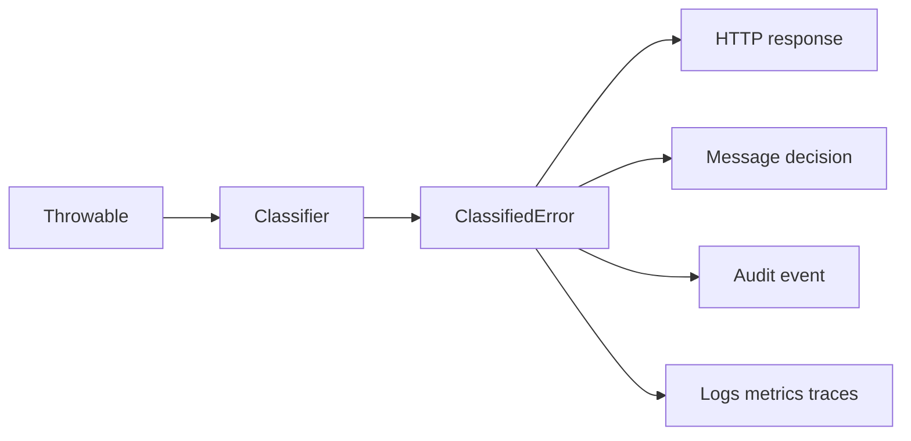
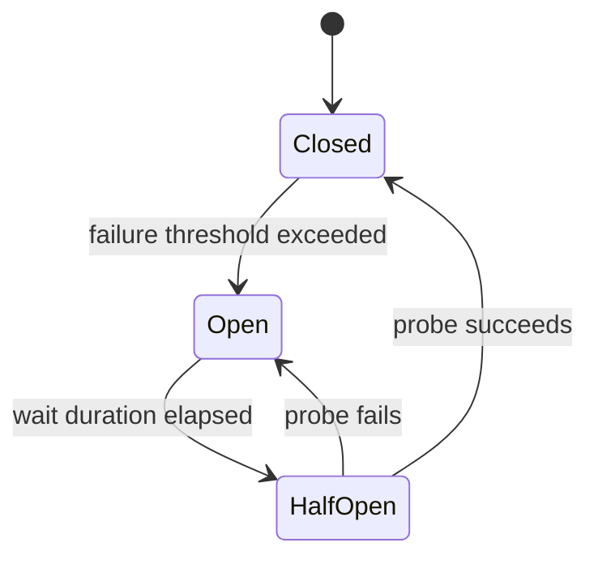
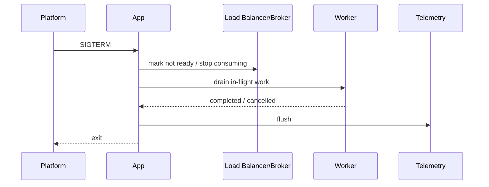
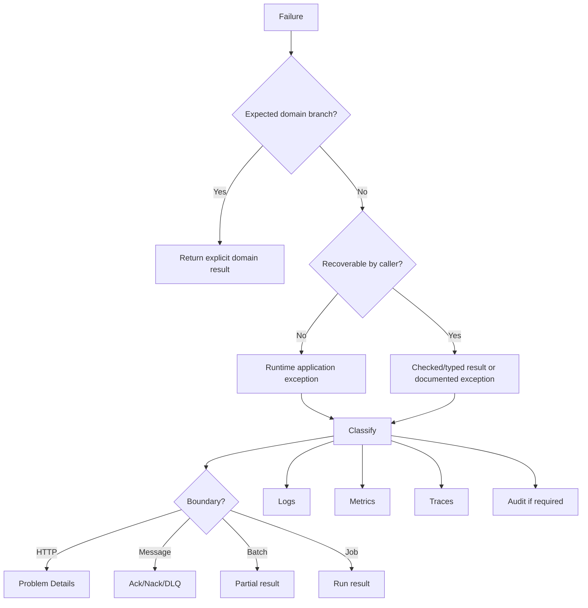

# Part 034 — Patterns & Anti-Patterns

Part ini adalah katalog praktis. Tujuannya bukan menghafal pattern, tetapi membangun kemampuan mengenali bentuk failure dan memperbaiki desain sebelum menjadi incident.

Error handling yang buruk jarang terlihat buruk di unit test. Ia terlihat buruk saat:

- traffic tinggi;
- dependency lambat;
- retry menumpuk;
- context hilang di async boundary;
- shutdown terjadi saat message sedang diproses;
- log terlalu noisy;
- metric cardinality meledak;
- trace tidak tersambung;
- client bergantung pada error message yang tidak stabil;
- support tidak tahu apa yang harus dilakukan;
- incident terjadi ulang karena action item tidak mengubah sistem.

Part ini menyatukan pola yang seharusnya dipakai dan anti-pattern yang harus dideteksi dalam review code/architecture.

---

## 1. Cara Membaca Katalog Ini

Setiap pattern dinilai dengan empat pertanyaan:

1. **Apa invariant yang dijaga?**
2. **Apa boundary yang terkena?**
3. **Apa observability yang dihasilkan?**
4. **Apa failure mode jika diterapkan salah?**

Untuk engineer senior, pattern bukan template. Pattern adalah **jawaban terhadap tekanan sistem tertentu**.

---

# A. Core Error Handling Patterns

## 2. Pattern: Classify Before Responding

### Masalah

Exception mentah tidak cukup untuk menentukan response, retry, audit, alert, atau DLQ.

### Pattern

Ubah semua `Throwable` menjadi `ClassifiedError` sebelum keputusan boundary.



### Contoh

```java
try {
    useCase.execute(command);
} catch (Throwable throwable) {
    ClassifiedError error = classifier.classify(throwable);
    observability.record(error);
    throw boundaryTranslator.toHttpException(error);
}
```

### Invariant

Boundary decision tidak boleh dibuat dari exception type mentah saja.

### Salah jika

Classifier hanya mengubah semua hal menjadi `INTERNAL_ERROR`.

---

## 3. Pattern: Preserve Cause Chain

### Masalah

Wrapping exception sering menghilangkan root cause.

### Pattern

Selalu preserve cause saat melakukan translation.

```java
throw new DependencyFailureException(
        ErrorCatalog.PAYMENT_TIMEOUT,
        "Payment provider timed out while authorizing transaction",
        originalException,
        Map.of("provider", "acme-pay")
);
```

### Invariant

Operator harus bisa menelusuri failure dari domain-level symptom ke technical cause.

### Observability

Log dan trace boleh menampilkan stack trace internal, tetapi response client tidak boleh.

---

## 4. Pattern: Stable Error Code, Dynamic Attributes

### Masalah

Error code yang terlalu spesifik menghasilkan catalog explosion.

### Pattern

Gunakan code stabil untuk meaning, dan attributes untuk context.

Baik:

```json
{
  "code": "case.transition.not_allowed",
  "fromState": "DRAFT",
  "event": "APPROVE"
}
```

Buruk:

```json
{
  "code": "case.transition.draft_to_approve_not_allowed"
}
```

### Invariant

Error code adalah kontrak, bukan format string.

---

## 5. Pattern: Translate at Boundary

### Masalah

Domain layer mengetahui HTTP status, message broker DLQ, atau gRPC status.

### Pattern

Internal layer melempar domain/application error. Boundary adapter menerjemahkan.

```java
// Domain
throw new DomainRejectionException(ErrorCatalog.CASE_STATE_CONFLICT, ...);

// HTTP boundary
return ResponseEntity.status(409).body(problemDetail);

// Messaging boundary
return MessageDecision.rejectToDlq("case.state.conflict");
```

### Invariant

Domain meaning sama; boundary representation berbeda.

---

## 6. Pattern: Fail Fast for Programmer Defects

### Masalah

Programmer defect seperti impossible state, null invariant, atau illegal branch diperlakukan sebagai business error.

### Pattern

Fail fast dan observasi sebagai defect.

```java
return switch (status) {
    case DRAFT -> handleDraft();
    case SUBMITTED -> handleSubmitted();
    case CLOSED -> handleClosed();
    default -> throw new IllegalStateException("Unhandled status: " + status);
};
```

### Invariant

Bug internal tidak boleh disamarkan sebagai recoverable domain failure.

### Caveat

Untuk public boundary, tetap translate menjadi safe 500 response.

---

## 7. Pattern: Explicit Unknown Outcome

### Masalah

Timeout setelah side effect mungkin berarti operasi gagal, berhasil, atau status tidak diketahui.

### Pattern

Modelkan unknown outcome secara eksplisit.

```java
public sealed interface PaymentOutcome {
    record Authorized(String authorizationId) implements PaymentOutcome {}
    record Rejected(String reasonCode) implements PaymentOutcome {}
    record Unknown(String correlationId, String reason) implements PaymentOutcome {}
}
```

### Invariant

Jangan mengubah `timeout` menjadi `failed` jika side effect mungkin sudah terjadi.

### Observability

Unknown outcome harus memiliki reconciliation metric dan audit evidence.

---

## 8. Pattern: Error Policy Matrix

### Masalah

Setiap handler membuat keputusan retry/DLQ/alert sendiri.

### Pattern

Gunakan matrix berbasis category.

| Category | Retry | HTTP | Messaging | Alert |
|---|---:|---:|---|---|
| Validation | No | 400/422 | reject/DLQ | No |
| Domain conflict | No | 409 | reject/DLQ | No |
| Dependency timeout | Conditional | 504 | retry/delay | If sustained |
| Platform failure | Usually no immediate retry | 500/503 | stop/page | Yes |
| Unknown | Conservative | 500 | stop/DLQ | Yes |

### Invariant

Keputusan operasional berasal dari policy, bukan improvisasi lokal.

---

# B. Reliability Patterns

## 9. Pattern: Timeout Every Remote Call

### Masalah

Remote call tanpa timeout bisa menggantung thread, connection pool, request, job, atau shutdown.

### Pattern

Setiap dependency call punya connect timeout, read/request timeout, dan total deadline.

```java
HttpClient client = HttpClient.newBuilder()
        .connectTimeout(Duration.ofSeconds(2))
        .build();

HttpRequest request = HttpRequest.newBuilder(uri)
        .timeout(Duration.ofSeconds(3))
        .GET()
        .build();
```

### Invariant

Caller harus punya batas waktu lebih pendek daripada total request budget.

### Anti-failure

Timeout tanpa idempotency dan retry policy hanya memindahkan masalah.

---

## 10. Pattern: Retry Only Safe Failures

### Masalah

Retry digunakan sebagai obat universal.

### Pattern

Retry hanya untuk failure transient dan operation yang aman diulang.

```java
boolean retryable = error.descriptor().retryable()
        && command.isIdempotent()
        && deadline.hasTimeLeft()
        && retryBudget.tryAcquire();
```

### Invariant

Retry tidak boleh membuat duplicate side effect atau memperparah overload.

---

## 11. Pattern: Backoff with Jitter

### Masalah

Banyak client retry bersamaan dan membentuk retry storm.

### Pattern

Gunakan exponential backoff dengan jitter.

```java
long baseMillis = 100;
long maxMillis = 2_000;
long exponential = Math.min(maxMillis, baseMillis * (1L << attempt));
long sleepMillis = ThreadLocalRandom.current().nextLong(0, exponential + 1);
```

### Invariant

Retry harus menyebar dalam waktu, bukan sinkron.

---

## 12. Pattern: Idempotency Key for Side Effects

### Masalah

Client retry command yang menciptakan side effect baru.

### Pattern

Gunakan idempotency key dan payload hash.

```java
public record IdempotencyRecord(
        String key,
        String payloadHash,
        String status,
        String responseReference,
        Instant createdAt
) {}
```

### Invariant

Retry command yang sama menghasilkan efek yang sama, bukan efek tambahan.

---

## 13. Pattern: Circuit Breaker Around Fragile Dependencies

### Masalah

Dependency lambat/down membuat semua request menunggu dan menguras resource.

### Pattern

Gunakan circuit breaker untuk menghentikan call sementara saat failure rate tinggi.



### Invariant

Service melindungi dirinya sendiri dan dependency dari traffic yang tidak produktif.

---

## 14. Pattern: Bulkhead by Dependency or Workload

### Masalah

Satu dependency lambat menghabiskan semua worker thread/connection.

### Pattern

Pisahkan pool atau concurrency limit per dependency/workload.

```text
public API workers       -> bounded
payment client workers   -> bounded
report generation        -> bounded
notification dispatch    -> bounded
```

### Invariant

Failure satu area tidak boleh menghabiskan semua capacity.

---

## 15. Pattern: Graceful Degradation as Explicit Mode

### Masalah

Fallback mengembalikan data palsu atau menyembunyikan failure.

### Pattern

Nyatakan degradation mode.

```java
public record RecommendationResponse(
        List<Item> items,
        boolean degraded,
        String degradationReason
) {}
```

### Invariant

Fallback tidak boleh melanggar domain safety atau membuat caller percaya data lengkap.

---

## 16. Pattern: Quarantine Poison Messages

### Masalah

Message yang selalu gagal terus di-retry dan memblokir progress.

### Pattern

Pisahkan retryable transient failure dari poison message.

```java
if (error.category() == ErrorCategory.VALIDATION || attempts >= maxAttempts) {
    return MessageDecision.deadLetter(error.code());
}
return MessageDecision.retryLater(error.code());
```

### Invariant

Satu bad input tidak boleh menghentikan seluruh stream.

---

# C. Lifecycle and Shutdown Patterns

## 17. Pattern: Stop Intake Before Drain

### Masalah

Shutdown dimulai, tetapi service masih menerima request/message baru.

### Pattern

Shutdown sequence:



### Invariant

Tidak ada work baru setelah drain dimulai.

---

## 18. Pattern: Two-Phase Executor Shutdown

### Masalah

Executor langsung di-`shutdownNow()` dan meninggalkan work setengah jalan.

### Pattern

```java
public static void shutdownGracefully(ExecutorService executor, Duration grace) {
    executor.shutdown();
    try {
        if (!executor.awaitTermination(grace.toMillis(), TimeUnit.MILLISECONDS)) {
            List<Runnable> cancelled = executor.shutdownNow();
            // record cancelled.size()
        }
    } catch (InterruptedException interrupted) {
        executor.shutdownNow();
        Thread.currentThread().interrupt();
    }
}
```

### Invariant

Beri kesempatan selesai, tetapi tetap punya batas waktu.

---

## 19. Pattern: Restore Interrupt Status

### Masalah

`InterruptedException` ditangkap dan diabaikan.

### Pattern

```java
try {
    queue.take();
} catch (InterruptedException e) {
    Thread.currentThread().interrupt();
    throw new CancellationException("Worker interrupted");
}
```

### Invariant

Interrupt adalah sinyal kontrol, bukan error biasa yang boleh dihapus.

---

## 20. Pattern: Resource Ownership Boundaries

### Masalah

Object menutup resource yang bukan miliknya atau tidak menutup resource yang dimilikinya.

### Pattern

Tentukan owner eksplisit.

```java
try (Connection connection = dataSource.getConnection();
     PreparedStatement statement = connection.prepareStatement(sql)) {
    // use resources
}
```

### Invariant

Yang acquire resource bertanggung jawab release, kecuali ownership ditransfer eksplisit.

---

# D. Observability Patterns

## 21. Pattern: Structured Log Event

### Masalah

Log berupa kalimat bebas sulit dicari dan dianalisis.

### Pattern

```java
log.atWarn()
        .setMessage("Payment authorization failed")
        .addKeyValue("event", "payment.authorization.failed")
        .addKeyValue("error.code", errorCode)
        .addKeyValue("payment.id", paymentId)
        .addKeyValue("provider", provider)
        .addKeyValue("retryable", retryable)
        .log();
```

### Invariant

Log penting harus bisa difilter, diaggregate, dan dikorelasikan.

---

## 22. Pattern: Log Once at Ownership Boundary

### Masalah

Exception yang sama dilog berkali-kali di setiap layer.

### Pattern

Log di boundary yang memiliki context dan responsibility.

```text
Repository throws -> Service translates -> Controller advice logs once
```

### Invariant

Satu failure menghasilkan satu event log utama yang kaya context, bukan lima stack trace duplikat.

---

## 23. Pattern: Bounded Metric Labels

### Masalah

Metric tag memakai user id, case id, request id, atau exception message.

### Pattern

Gunakan bounded labels.

```text
application_errors_total{
  error_code="payment.dependency.timeout",
  category="dependency_failure",
  retryable="true"
}
```

### Invariant

Metric harus dapat diagregasi dan tidak membuat time series explosion.

---

## 24. Pattern: Trace Critical Path

### Masalah

Trace terlalu banyak span kecil tapi tidak menunjukkan bottleneck/failure path.

### Pattern

Span untuk unit kerja meaningful:

- incoming request;
- use case;
- dependency call;
- database operation penting;
- message publish;
- retry attempt;
- fallback decision;
- state transition.

### Invariant

Trace harus membantu menjawab: “waktu habis di mana dan failure mulai di mana?”

---

## 25. Pattern: Context Capture-Transfer-Restore-Clear

### Masalah

MDC/security/trace context bocor antar task atau hilang di async boundary.

### Pattern

```java
public final class ContextAwareRunnable implements Runnable {
    private final Map<String, String> capturedMdc;
    private final Runnable delegate;

    public ContextAwareRunnable(Runnable delegate) {
        this.capturedMdc = MDC.getCopyOfContextMap();
        this.delegate = delegate;
    }

    @Override
    public void run() {
        Map<String, String> previous = MDC.getCopyOfContextMap();
        try {
            if (capturedMdc != null) MDC.setContextMap(capturedMdc);
            delegate.run();
        } finally {
            if (previous != null) MDC.setContextMap(previous);
            else MDC.clear();
        }
    }
}
```

### Invariant

Context harus ikut work unit, bukan ikut thread secara buta.

---

# E. Incident and Governance Patterns

## 26. Pattern: Runbook per High-Impact Error

### Masalah

Alert firing tetapi engineer tidak tahu diagnosis awal.

### Pattern

High-impact error code harus punya runbook:

```text
error_code: payment.dependency.timeout
symptom: payment authorization timeout rate high
first checks:
  - provider latency dashboard
  - circuit breaker state
  - retry volume
  - queue lag
  - recent deployment
safe mitigations:
  - reduce traffic
  - disable non-critical payment feature
  - switch provider if approved
escalation:
  - payment integration owner
  - vendor support
```

### Invariant

Alert harus mengurangi waktu diagnosis, bukan hanya memberi tahu ada masalah.

---

## 27. Pattern: Postmortem Action Changes the System

### Masalah

Postmortem menghasilkan action item seperti “be more careful”.

### Pattern

Action item harus mengubah salah satu:

- invariant;
- test;
- timeout;
- retry budget;
- alert;
- dashboard;
- runbook;
- deployment guard;
- error catalog;
- operational ownership.

### Invariant

Incident learning harus menjadi perubahan sistem, bukan perubahan mood.

---

# F. Anti-Patterns

## 28. Anti-Pattern: Catch and Ignore

```java
try {
    publishAuditEvent(event);
} catch (Exception ignored) {
}
```

### Kenapa buruk

- Failure hilang.
- Audit gap tidak diketahui.
- Caller percaya operasi lengkap.
- Incident sulit direkonstruksi.

### Perbaikan

```java
try {
    publishAuditEvent(event);
} catch (Exception e) {
    log.atError()
            .setMessage("Failed to publish audit event")
            .addKeyValue("event", "audit.publish.failed")
            .addKeyValue("aggregate.id", event.aggregateId())
            .setCause(e)
            .log();
    throw new DependencyFailureException(
            ErrorCatalog.AUDIT_PUBLISH_FAILED,
            "Audit event publish failed",
            e,
            Map.of("aggregate.id", event.aggregateId())
    );
}
```

---

## 29. Anti-Pattern: Log and Throw Everywhere

```java
catch (Exception e) {
    log.error("failed", e);
    throw e;
}
```

### Kenapa buruk

- Stack trace duplikat.
- Noise tinggi.
- Root event sulit ditemukan.
- Biaya logging naik.

### Perbaikan

Log sekali di ownership boundary. Layer bawah boleh menambah context dengan wrapping.

```java
catch (SQLException e) {
    throw new DependencyFailureException(
            ErrorCatalog.DB_QUERY_FAILED,
            "Failed to load case",
            e,
            Map.of("operation", "case.load")
    );
}
```

---

## 30. Anti-Pattern: Catch Throwable

```java
try {
    process();
} catch (Throwable t) {
    log.error("failed", t);
}
```

### Kenapa buruk

`Throwable` mencakup `Error` seperti `OutOfMemoryError` dan `StackOverflowError`. Banyak `Error` menandakan kondisi JVM/runtime yang tidak aman untuk dilanjutkan.

### Perbaikan

- Di boundary sangat luar, boleh catch `Throwable` untuk observability dan controlled response.
- Jangan swallow.
- Re-throw atau terminate sesuai policy.

```java
catch (Throwable t) {
    classifiedErrorRecorder.record(t);
    throw t;
}
```

---

## 31. Anti-Pattern: Throw RuntimeException Without Context

```java
throw new RuntimeException("failed");
```

### Kenapa buruk

Tidak ada code, category, retryability, safe message, owner, atau cause.

### Perbaikan

```java
throw new DomainRejectionException(
        ErrorCatalog.CASE_STATE_CONFLICT,
        "Cannot approve case while status is DRAFT",
        Map.of("fromState", "DRAFT", "event", "APPROVE")
);
```

---

## 32. Anti-Pattern: Returning Null for Failure

```java
User user = userRepository.find(id);
if (user == null) {
    // maybe not found, maybe DB failed, maybe bug
}
```

### Kenapa buruk

Absence dan failure bercampur.

### Perbaikan

- `Optional<T>` untuk absence yang normal.
- Exception/result untuk failure.

```java
Optional<User> user = userRepository.findById(id);
```

---

## 33. Anti-Pattern: Optional as Error Container

```java
Optional<PaymentResult> result = paymentClient.authorize(command);
```

### Kenapa buruk

`Optional.empty()` tidak menjelaskan rejected, timeout, unknown outcome, invalid request, atau provider unavailable.

### Perbaikan

```java
sealed interface PaymentAuthorizationResult {
    record Authorized(String authorizationId) implements PaymentAuthorizationResult {}
    record Rejected(String reasonCode) implements PaymentAuthorizationResult {}
    record Failed(String errorCode, boolean retryable) implements PaymentAuthorizationResult {}
    record Unknown(String correlationId) implements PaymentAuthorizationResult {}
}
```

---

## 34. Anti-Pattern: Exception-Driven Normal Domain Flow

```java
try {
    approveCase(caseId);
} catch (CaseNotReadyException e) {
    showPendingMessage();
}
```

### Kenapa buruk

Jika “not ready” adalah expected branch, exception mengaburkan domain model.

### Perbaikan

```java
ApprovalDecision decision = approvalService.evaluate(caseId);

switch (decision) {
    case Approved approved -> apply(approved);
    case NotReady notReady -> showPendingMessage(notReady.reason());
    case Rejected rejected -> showRejection(rejected.reason());
}
```

Gunakan exception untuk invariant breach atau non-local failure, bukan setiap cabang normal.

---

## 35. Anti-Pattern: Retry Everything

```java
retry(() -> paymentClient.charge(card, amount));
```

### Kenapa buruk

- Duplicate charge.
- Retry storm.
- Dependency overload.
- Unknown outcome disamarkan.

### Perbaikan

Retry hanya jika:

- error transient;
- operation idempotent;
- deadline masih cukup;
- retry budget tersedia;
- backoff+jitter diterapkan;
- outcome ambiguous direkonsiliasi.

---

## 36. Anti-Pattern: Timeout Without Cancellation

```java
future.get(1, TimeUnit.SECONDS);
```

Lalu task aslinya tetap berjalan.

### Kenapa buruk

Caller menyerah, tetapi worker masih memakai resource dan mungkin melakukan side effect.

### Perbaikan

```java
try {
    return future.get(1, TimeUnit.SECONDS);
} catch (TimeoutException e) {
    future.cancel(true);
    throw e;
}
```

Caveat: cancellation harus kooperatif. Task harus merespons interrupt/cancellation signal.

---

## 37. Anti-Pattern: Fallback Lies

```java
catch (Exception e) {
    return AccountBalance.zero();
}
```

### Kenapa buruk

Caller percaya data valid padahal fallback palsu.

### Perbaikan

```java
return new AccountBalanceView(
        staleBalance,
        true,
        "balance_service_unavailable",
        staleBalanceAsOf
);
```

Fallback harus eksplisit dan domain-safe.

---

## 38. Anti-Pattern: High-Cardinality Metrics

```java
Counter.builder("errors")
        .tag("userId", userId)
        .tag("message", exception.getMessage())
        .register(registry)
        .increment();
```

### Kenapa buruk

Time series meledak dan backend metrics mahal/tidak stabil.

### Perbaikan

```java
Counter.builder("application_errors_total")
        .tag("error_code", errorCode)
        .tag("category", category)
        .register(registry)
        .increment();
```

Detail dinamis masuk log/trace, bukan metric labels.

---

## 39. Anti-Pattern: MDC Leak

```java
MDC.put("tenantId", tenantId);
handler.handle();
```

Tanpa `clear`.

### Kenapa buruk

Thread pool reuse bisa membuat request berikutnya memakai context lama.

### Perbaikan

```java
try {
    MDC.put("tenantId", tenantId);
    handler.handle();
} finally {
    MDC.clear();
}
```

Atau restore previous context, bukan clear total, jika nested scope.

---

## 40. Anti-Pattern: Fire-and-Forget Without Owner

```java
CompletableFuture.runAsync(() -> sendEmail(email));
return ResponseEntity.accepted().build();
```

### Kenapa buruk

- Exception hilang.
- Shutdown tidak menunggu.
- Retry tidak jelas.
- Audit tidak jelas.
- Caller tidak punya tracking id.

### Perbaikan

Gunakan job record, outbox, queue, atau managed executor dengan observability.

```java
String jobId = emailJobService.enqueue(emailCommand);
return ResponseEntity.accepted().body(Map.of("jobId", jobId));
```

---

## 41. Anti-Pattern: Shutdown Hook as Application Orchestrator

```java
Runtime.getRuntime().addShutdownHook(new Thread(() -> {
    // close db, call remote service, flush audit, wait for jobs, publish messages...
}));
```

### Kenapa buruk

Shutdown hooks berjalan concurrent dengan urutan tidak dijamin. Waktu shutdown terbatas. Dependency mungkin sudah mati.

### Perbaikan

Gunakan lifecycle manager aplikasi:

- stop intake;
- drain worker;
- close resources in order;
- flush telemetry;
- shutdown hook hanya trigger/last resort.

---

## 42. Anti-Pattern: Global Handler Converts Everything to 200

```json
{
  "success": false,
  "error": "Invalid request"
}
```

Dengan HTTP 200.

### Kenapa buruk

- Client/cache/proxy tidak bisa membedakan success/failure.
- Monitoring HTTP status rusak.
- Retry policy client salah.
- SLO berbasis status tidak valid.

### Perbaikan

Gunakan HTTP status yang benar dan body Problem Details.

---

## 43. Anti-Pattern: Public Error Depends on Java Class Name

```json
{
  "error": "com.example.payment.PaymentProviderTimeoutException"
}
```

### Kenapa buruk

Refactor internal menjadi breaking API change.

### Perbaikan

```json
{
  "code": "payment.provider.timeout",
  "retryable": true
}
```

---

## 44. Anti-Pattern: Alert on Every Exception

### Kenapa buruk

- Alert fatigue.
- Domain rejection normal menjadi page.
- Engineer mengabaikan alert.
- Symptom penting tenggelam.

### Perbaikan

Alert pada SLO symptom, burn rate, sustained dependency failure, queue lag, availability, latency, error budget consumption, atau high-severity error code.

---

## 45. Anti-Pattern: Postmortem Without System Change

### Kenapa buruk

Incident akan berulang.

### Perbaikan

Action item harus spesifik dan mengubah sistem.

Buruk:

```text
Engineer should be more careful.
```

Baik:

```text
Add contract test ensuring payment timeout maps to unknown outcome and reconciliation job.
```

---

# G. Review Checklist

## 46. Code Review Checklist

Saat review PR Java yang menyentuh error/reliability/observability, cek:

- [ ] Apakah exception cause dipreserve?
- [ ] Apakah error diklasifikasi dengan code stabil?
- [ ] Apakah domain rejection dibedakan dari technical failure?
- [ ] Apakah client response aman?
- [ ] Apakah retry hanya untuk operation idempotent/transient?
- [ ] Apakah timeout punya cancellation/deadline?
- [ ] Apakah fallback eksplisit dan domain-safe?
- [ ] Apakah log structured dan tidak duplikat?
- [ ] Apakah metric labels bounded?
- [ ] Apakah trace merekam failure yang meaningful?
- [ ] Apakah MDC/context dibersihkan?
- [ ] Apakah async work punya owner?
- [ ] Apakah shutdown behavior aman?
- [ ] Apakah high-impact error punya runbook?
- [ ] Apakah test mencakup failure path?

---

## 47. Architecture Review Checklist

Untuk service/platform:

- [ ] Ada error taxonomy.
- [ ] Ada error catalog.
- [ ] Ada boundary translator.
- [ ] Ada observability mapper.
- [ ] Ada audit evidence policy.
- [ ] Ada retry/idempotency policy.
- [ ] Ada graceful degradation policy.
- [ ] Ada shutdown lifecycle.
- [ ] Ada alerting strategy berbasis SLO/symptom.
- [ ] Ada incident feedback loop.
- [ ] Ada ownership untuk error high-impact.
- [ ] Ada governance untuk deprecating error code.

---

# H. Decision Matrix Cepat

## 48. Throw, Return Result, atau Optional?

| Situation | Pilihan |
|---|---|
| Entity tidak ditemukan dan itu expected | `Optional<T>` |
| Validasi banyak field | `ValidationResult` |
| Domain decision normal | Explicit result/sealed type |
| Invariant breach | Exception |
| Dependency timeout | Exception atau explicit unknown outcome di boundary use case |
| Batch item partial failure | Item-level result |
| Programmer bug | Fail-fast exception |
| Remote command side effect ambiguous | Explicit unknown outcome + reconciliation |

---

## 49. Log, Metric, Trace, atau Audit?

| Need | Signal |
|---|---|
| Investigate one occurrence | Log + trace |
| Count/rate/trend | Metric |
| Understand distributed path | Trace |
| Prove business/security decision | Audit event |
| Page engineer | Alert derived from metric/SLO |
| Explain to client | Problem Details/error contract |

---

## 50. Final Mental Model



Pattern yang benar menjaga meaning tetap utuh dari domain ke operasi. Anti-pattern biasanya memutus salah satu rantai ini:

- meaning hilang;
- cause hilang;
- context hilang;
- retry salah;
- telemetry noisy;
- client contract rapuh;
- audit gap;
- incident tidak menghasilkan learning.

---

## 51. Deliberate Practice

### Latihan 1 — Anti-pattern scan

Ambil satu codebase/service. Cari:

```text
catch (Exception ignored)
catch (Throwable
new RuntimeException(
log.error(...); throw
Optional<...> untuk failure
Future.get(timeout) tanpa cancel
MDC.put tanpa finally
Counter tag userId/requestId/message
CompletableFuture.runAsync tanpa handler
```

Buat daftar temuan dan klasifikasikan risiko.

### Latihan 2 — Ubah 3 anti-pattern menjadi pattern

Pilih tiga temuan paling berbahaya dan refactor:

1. preserve cause;
2. stable error code;
3. structured log;
4. bounded metric;
5. test failure path.

### Latihan 3 — Simulasikan incident

Pilih satu error code. Jawab dalam 15 menit:

- siapa impacted user?
- kapan mulai?
- service mana yang failure?
- apakah retry memperparah?
- apakah fallback aktif?
- apakah error masuk SLO?
- apa mitigation aman?
- runbook mana yang dipakai?

Jika sulit dijawab, telemetry/pattern belum cukup.

---

## 52. Ringkasan

Pattern yang baik membuat failure dapat dikendalikan. Anti-pattern membuat failure berubah menjadi ambiguity.

Prinsip utama:

- classify before responding;
- preserve cause;
- stable code + dynamic attributes;
- translate at boundary;
- retry only safe failures;
- model unknown outcome;
- log once with structure;
- use bounded metric labels;
- trace meaningful critical path;
- propagate and clear context;
- stop intake before drain;
- postmortem must change the system.

Part berikutnya adalah capstone: kita akan menyusun **production handbook end-to-end** untuk satu Java service, dari error model sampai observability, shutdown, incident response, dan self-assessment.

---

## 53. Referensi Primer

- Java SE 25 API — `Throwable`, `InterruptedException`, `ExecutorService`, `AutoCloseable`.
- Java Language Specification Java SE 25 — exception semantics.
- RFC 9457 — Problem Details for HTTP APIs.
- OpenTelemetry Documentation — logs, metrics, traces, context propagation, semantic conventions.
- Google SRE Book/Workbook — postmortem culture, alerting, incident learning loop.
- Prometheus Documentation — metric model dan alerting rules.
- Micrometer Documentation — meter types dan instrumentation model untuk Java.
