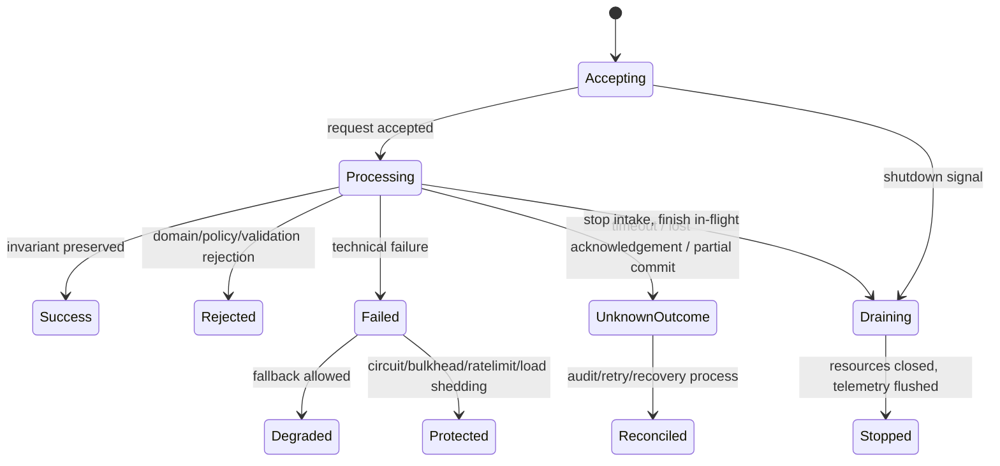
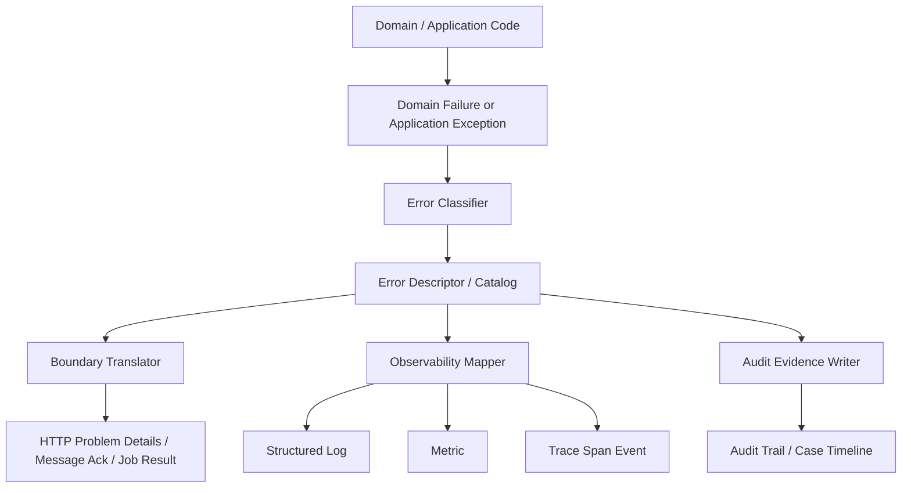
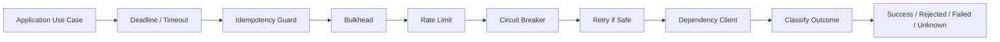
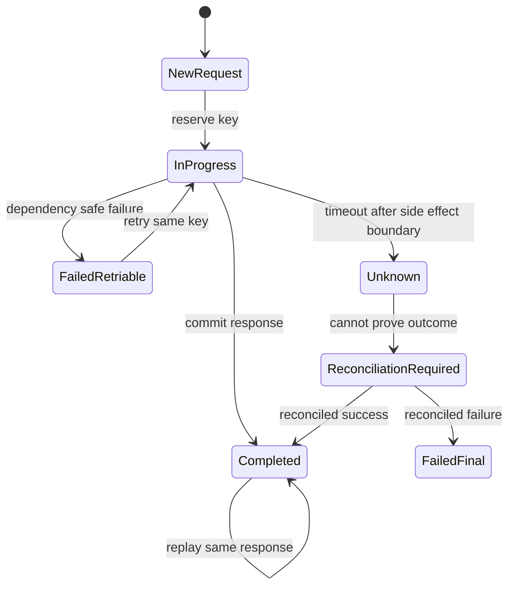
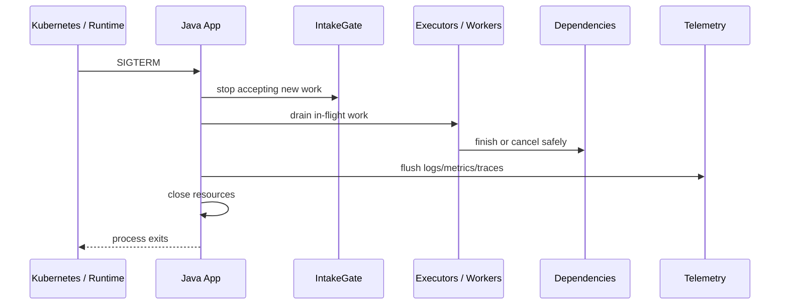
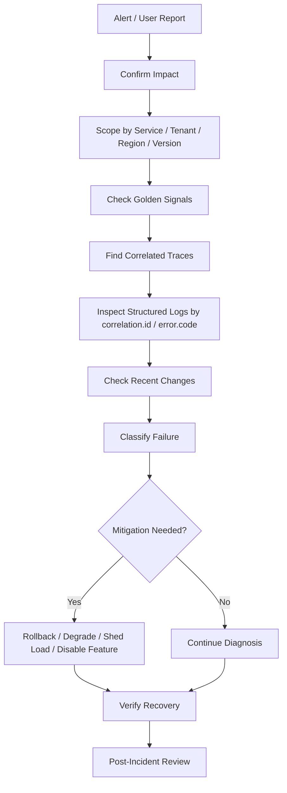

# Part 035 — Capstone Production Handbook

Part ini adalah penutup seri. Tujuannya bukan menambah konsep baru, tetapi menyatukan seluruh konsep sebelumnya menjadi **handbook implementasi produksi**.

Setelah 34 part sebelumnya, kita sudah punya fondasi:

- failure mental model;
- Java exception semantics;
- domain error design;
- error code dan Problem Details;
- exception hierarchy;
- result type;
- boundary translation;
- validation dan rejection;
- retry, timeout, idempotency;
- circuit breaker, bulkhead, rate limit;
- fallback dan degradation;
- cancellation, interruption, cleanup;
- async/reactive error flow;
- virtual thread observability;
- resource lifecycle;
- graceful shutdown JVM, Spring, Kubernetes;
- structured logging;
- log correlation dan context propagation;
- metrics;
- tracing;
- OpenTelemetry;
- telemetry quality;
- alerting;
- incident response;
- production debugging;
- error management architecture;
- pattern dan anti-pattern.

Sekarang kita bentuk semuanya menjadi satu model engineering yang bisa dipakai untuk membangun service Java yang defensible, diagnosable, resilient, dan operable.

---

## 1. Target Skill

Target seri ini bukan sekadar “bisa handle exception”. Targetnya adalah kemampuan berikut:

> Mendesain service Java yang failure-aware dari domain sampai runtime, memiliki kontrak error yang stabil, melindungi dependency, shutdown dengan benar, menghasilkan telemetry yang bisa dipakai saat incident, dan memiliki feedback loop operasional yang memperbaiki sistem setelah failure terjadi.

Skill ini berada di antara beberapa disiplin:

| Disiplin | Pertanyaan Inti |
|---|---|
| Java language semantics | Apa sebenarnya yang terjadi ketika exception dilempar, ditangkap, dibungkus, atau diabaikan? |
| API design | Failure apa yang harus terlihat oleh caller? |
| Domain modelling | Failure mana yang merupakan business rejection, bukan technical error? |
| Distributed systems | Apa yang terjadi ketika dependency lambat, partial, duplicate, atau unknown? |
| Reliability engineering | Bagaimana sistem membatasi blast radius? |
| Observability | Bukti apa yang tersedia ketika failure terjadi? |
| Operations | Siapa yang menerima alert, bagaimana diagnosis dilakukan, dan bagaimana sistem diperbaiki? |
| Governance | Bagaimana error contract tetap konsisten lintas tim dan versi? |

Top engineer tidak melihat error handling sebagai `try/catch`. Mereka melihatnya sebagai **control system**.

---

## 2. Final Mental Model

Service produksi harus dipahami sebagai mesin yang selalu berada di salah satu dari beberapa kondisi:



Dari model ini, setiap error harus menjawab tujuh pertanyaan:

1. **Apa yang gagal?** Domain rule, input, dependency, platform, resource, atau bug?
2. **Di mana boundary-nya?** Internal method, service boundary, HTTP, message, batch, transaction, atau shutdown?
3. **Apakah outcome diketahui?** Sukses, gagal, ditolak, partial, atau unknown?
4. **Apakah aman untuk retry?** Aman, tidak aman, butuh idempotency key, atau butuh reconciliation?
5. **Apa efek terhadap invariant?** Tidak ada perubahan, perubahan rollback, perubahan committed, atau tidak pasti?
6. **Apa sinyal observability-nya?** Log, metric, trace, span event, audit event, alert?
7. **Apa respons operasionalnya?** Ignore, warn, alert, degrade, shed load, rollback, page on-call, atau manual review?

Kalau sistem tidak bisa menjawab pertanyaan ini secara konsisten, maka error management-nya belum matang.

---

## 3. Production Error Architecture

Arsitektur final yang disarankan adalah **centralized policy, decentralized capture**.

Artinya:

- error bisa terjadi di mana saja;
- error boleh ditangkap dekat sumbernya jika ada context lokal yang penting;
- tetapi klasifikasi, mapping, logging, metric, trace, dan client response harus mengikuti policy terpusat.



### 3.1 Core Components

| Component | Responsibility | Should Not Do |
|---|---|---|
| `ErrorCode` | Stable identifier untuk machine/client/operator | Menyimpan stack trace |
| `ErrorDescriptor` | Metadata policy: status, retryable, severity, category | Menjalankan business logic |
| `ApplicationException` | Technical wrapper dengan cause chain dan descriptor | Menjadi domain model utama |
| `DomainFailure` | Explicit business rejection/value failure | Bergantung pada HTTP atau database |
| `ErrorClassifier` | Mengubah raw exception menjadi known category | Menelan exception |
| `BoundaryTranslator` | Mengubah internal failure menjadi response boundary | Logging detail rahasia ke client |
| `ObservabilityMapper` | Menentukan log level, metric tag, span status | Membuat label dengan cardinality tinggi |
| `AuditEvidenceWriter` | Menulis event audit defensible | Mengganti log teknis |
| `ReliabilityPolicy` | Timeout, retry, circuit, bulkhead, rate limit | Memutuskan domain rule |
| `ShutdownCoordinator` | Stop intake, drain, close, flush | Memaksa kill tanpa audit |

---

## 4. Reference Package Layout

Package layout yang baik membuat error policy mudah ditemukan.

```txt
com.example.caseplatform
├── api
│   ├── CaseController.java
│   ├── ProblemDetailsAdvice.java
│   └── dto
├── application
│   ├── OpenCaseCommandHandler.java
│   ├── AssignCaseCommandHandler.java
│   └── ports
├── domain
│   ├── Case.java
│   ├── CaseState.java
│   ├── CaseFailure.java
│   └── CasePolicy.java
├── error
│   ├── ErrorCode.java
│   ├── ErrorCategory.java
│   ├── ErrorDescriptor.java
│   ├── ErrorCatalog.java
│   ├── ApplicationException.java
│   ├── ErrorClassifier.java
│   └── ErrorTelemetry.java
├── reliability
│   ├── RetryPolicyFactory.java
│   ├── TimeoutPolicy.java
│   ├── IdempotencyService.java
│   └── DependencyGuard.java
├── observability
│   ├── CorrelationContext.java
│   ├── TelemetryAttributes.java
│   ├── LoggingSupport.java
│   ├── MetricsSupport.java
│   └── TracingSupport.java
├── shutdown
│   ├── IntakeGate.java
│   ├── ShutdownCoordinator.java
│   └── DrainableComponent.java
└── infrastructure
    ├── persistence
    ├── clients
    └── messaging
```

Prinsipnya sederhana:

- domain tidak tahu HTTP;
- domain tidak tahu Prometheus;
- application layer tahu use case;
- boundary layer tahu response contract;
- error package tahu classification dan policy;
- observability package tahu signal mapping;
- reliability package tahu dependency protection;
- shutdown package tahu lifecycle.

---

## 5. Error Contract Skeleton

### 5.1 Error Category

```java
public enum ErrorCategory {
    VALIDATION,
    DOMAIN_REJECTION,
    STATE_CONFLICT,
    AUTHORIZATION,
    DEPENDENCY,
    INFRASTRUCTURE,
    PLATFORM,
    BUG,
    UNKNOWN_OUTCOME
}
```

Category adalah **diagnostic grouping**. Category bukan error code. Banyak error code bisa berada di satu category.

### 5.2 Error Code

```java
public enum ErrorCode {
    CASE_INVALID_REQUEST,
    CASE_STATE_CONFLICT,
    CASE_POLICY_REJECTED,
    CASE_ASSIGNMENT_UNAVAILABLE,
    DEPENDENCY_TIMEOUT,
    DEPENDENCY_REJECTED,
    IDEMPOTENCY_CONFLICT,
    UNKNOWN_OUTCOME,
    INTERNAL_UNEXPECTED_ERROR
}
```

`ErrorCode` harus stabil. Jangan ubah meaning error code tanpa versioning.

Rule:

- nama code tidak boleh mengandung detail internal seperti nama class DAO;
- code harus cukup spesifik untuk client/support/operator;
- code harus memiliki owner;
- code harus memiliki test;
- code harus ada di registry/catalog.

### 5.3 Descriptor

```java
public record ErrorDescriptor(
        ErrorCode code,
        ErrorCategory category,
        int httpStatus,
        boolean retryable,
        boolean userCorrectable,
        boolean alertable,
        String safeTitle,
        String operatorHint
) {}
```

Descriptor adalah policy. Di production, descriptor bisa berkembang menjadi registry YAML/JSON internal, tetapi enum/static registry cukup untuk service kecil-menengah.

### 5.4 Catalog

```java
import java.util.EnumMap;
import java.util.Map;

public final class ErrorCatalog {

    private static final Map<ErrorCode, ErrorDescriptor> CATALOG = new EnumMap<>(ErrorCode.class);

    static {
        register(new ErrorDescriptor(
                ErrorCode.CASE_INVALID_REQUEST,
                ErrorCategory.VALIDATION,
                400,
                false,
                true,
                false,
                "Invalid case request",
                "Client submitted invalid command payload"
        ));

        register(new ErrorDescriptor(
                ErrorCode.CASE_STATE_CONFLICT,
                ErrorCategory.STATE_CONFLICT,
                409,
                false,
                true,
                false,
                "Case state conflict",
                "Requested transition is not allowed from current state"
        ));

        register(new ErrorDescriptor(
                ErrorCode.DEPENDENCY_TIMEOUT,
                ErrorCategory.DEPENDENCY,
                503,
                true,
                false,
                true,
                "Dependency timeout",
                "Downstream dependency did not respond within budget"
        ));

        register(new ErrorDescriptor(
                ErrorCode.UNKNOWN_OUTCOME,
                ErrorCategory.UNKNOWN_OUTCOME,
                202,
                false,
                false,
                true,
                "Outcome is being reconciled",
                "Operation outcome is unknown; reconciliation required"
        ));

        register(new ErrorDescriptor(
                ErrorCode.INTERNAL_UNEXPECTED_ERROR,
                ErrorCategory.BUG,
                500,
                false,
                false,
                true,
                "Unexpected internal error",
                "Unhandled application exception"
        ));
    }

    private static void register(ErrorDescriptor descriptor) {
        CATALOG.put(descriptor.code(), descriptor);
    }

    public static ErrorDescriptor get(ErrorCode code) {
        ErrorDescriptor descriptor = CATALOG.get(code);
        if (descriptor == null) {
            throw new IllegalArgumentException("Unknown error code: " + code);
        }
        return descriptor;
    }

    private ErrorCatalog() {}
}
```

Catalog harus gagal saat code tidak dikenal. Silent fallback membuat governance lemah.

---

## 6. Exception and Failure Model

### 6.1 Application Exception

```java
public class ApplicationException extends RuntimeException {

    private final ErrorCode errorCode;
    private final Map<String, String> safeAttributes;

    public ApplicationException(
            ErrorCode errorCode,
            String message,
            Throwable cause,
            Map<String, String> safeAttributes
    ) {
        super(message, cause);
        this.errorCode = Objects.requireNonNull(errorCode, "errorCode");
        this.safeAttributes = Map.copyOf(safeAttributes);
    }

    public ErrorCode errorCode() {
        return errorCode;
    }

    public ErrorDescriptor descriptor() {
        return ErrorCatalog.get(errorCode);
    }

    public Map<String, String> safeAttributes() {
        return safeAttributes;
    }
}
```

Application exception boleh membawa:

- error code;
- cause chain;
- safe attributes;
- message untuk operator/developer.

Application exception tidak boleh membawa:

- password/token;
- raw request payload sensitif;
- PII tanpa policy;
- SQL query lengkap dengan data user;
- access control secret;
- data yang membuat metric/log cardinality meledak.

### 6.2 Domain Failure as Value

```java
public sealed interface CaseFailure permits CaseFailure.InvalidTransition, CaseFailure.PolicyRejected {

    ErrorCode code();

    record InvalidTransition(String currentState, String requestedAction) implements CaseFailure {
        @Override
        public ErrorCode code() {
            return ErrorCode.CASE_STATE_CONFLICT;
        }
    }

    record PolicyRejected(String policyCode) implements CaseFailure {
        @Override
        public ErrorCode code() {
            return ErrorCode.CASE_POLICY_REJECTED;
        }
    }
}
```

Domain failure sebagai value berguna ketika failure adalah expected branch:

- validation;
- state transition rejection;
- policy denial;
- insufficient evidence;
- duplicate command;
- user-correctable issue.

Exception lebih tepat untuk:

- infrastructure failure;
- unexpected bug;
- corrupt state;
- dependency failure;
- programming invariant break;
- execution path yang tidak bisa lanjut secara lokal.

---

## 7. Boundary Translation

Boundary translator adalah tempat internal semantics diterjemahkan menjadi external contract.

```java
@RestControllerAdvice
public class ProblemDetailsAdvice {

    private final ErrorTelemetry telemetry;

    public ProblemDetailsAdvice(ErrorTelemetry telemetry) {
        this.telemetry = telemetry;
    }

    @ExceptionHandler(ApplicationException.class)
    ResponseEntity<ProblemDetail> handleApplicationException(
            ApplicationException exception,
            HttpServletRequest request
    ) {
        ErrorDescriptor descriptor = exception.descriptor();

        telemetry.record(exception, request.getRequestURI());

        ProblemDetail problem = ProblemDetail.forStatus(descriptor.httpStatus());
        problem.setTitle(descriptor.safeTitle());
        problem.setDetail(toSafeDetail(exception));
        problem.setProperty("code", descriptor.code().name());
        problem.setProperty("category", descriptor.category().name());
        problem.setProperty("retryable", descriptor.retryable());
        problem.setProperty("correlationId", CorrelationContext.currentCorrelationId());

        exception.safeAttributes().forEach((key, value) -> {
            if (isAllowedClientAttribute(key)) {
                problem.setProperty(key, value);
            }
        });

        return ResponseEntity.status(descriptor.httpStatus()).body(problem);
    }

    @ExceptionHandler(Exception.class)
    ResponseEntity<ProblemDetail> handleUnexpected(Exception exception, HttpServletRequest request) {
        ApplicationException wrapped = new ApplicationException(
                ErrorCode.INTERNAL_UNEXPECTED_ERROR,
                "Unhandled exception at API boundary",
                exception,
                Map.of("path", request.getRequestURI())
        );
        return handleApplicationException(wrapped, request);
    }

    private String toSafeDetail(ApplicationException exception) {
        return exception.descriptor().userCorrectable()
                ? exception.getMessage()
                : "Contact support with the correlation id.";
    }

    private boolean isAllowedClientAttribute(String key) {
        return Set.of("field", "reason", "state", "action").contains(key);
    }
}
```

Boundary handler rule:

- translate once at boundary;
- log/metric/trace via shared telemetry component;
- preserve cause chain internally;
- expose only safe detail externally;
- always include correlation id;
- never leak stack trace to client;
- never return arbitrary exception messages from infrastructure exceptions.

---

## 8. Observability Mapper

### 8.1 Structured Log

```java
public final class ErrorTelemetry {

    private static final Logger log = LoggerFactory.getLogger(ErrorTelemetry.class);

    private final MeterRegistry meterRegistry;
    private final Tracer tracer;

    public ErrorTelemetry(MeterRegistry meterRegistry, Tracer tracer) {
        this.meterRegistry = meterRegistry;
        this.tracer = tracer;
    }

    public void record(ApplicationException exception, String boundary) {
        ErrorDescriptor descriptor = exception.descriptor();

        log.atLevel(toLevel(descriptor))
                .setMessage("application.error")
                .addKeyValue("error.code", descriptor.code().name())
                .addKeyValue("error.category", descriptor.category().name())
                .addKeyValue("retryable", descriptor.retryable())
                .addKeyValue("boundary", boundary)
                .addKeyValue("correlation.id", CorrelationContext.currentCorrelationId())
                .setCause(shouldLogStackTrace(descriptor) ? exception : null)
                .log();

        Counter.builder("application_errors_total")
                .tag("error_code", descriptor.code().name())
                .tag("category", descriptor.category().name())
                .tag("retryable", Boolean.toString(descriptor.retryable()))
                .register(meterRegistry)
                .increment();

        Span span = Span.current();
        if (span.getSpanContext().isValid()) {
            span.addEvent("application.error", Attributes.builder()
                    .put("error.code", descriptor.code().name())
                    .put("error.category", descriptor.category().name())
                    .put("retryable", descriptor.retryable())
                    .build());
            if (descriptor.httpStatus() >= 500) {
                span.setStatus(StatusCode.ERROR, descriptor.safeTitle());
            }
        }
    }

    private Level toLevel(ErrorDescriptor descriptor) {
        if (descriptor.category() == ErrorCategory.VALIDATION ||
            descriptor.category() == ErrorCategory.DOMAIN_REJECTION) {
            return Level.INFO;
        }
        if (descriptor.alertable()) {
            return Level.ERROR;
        }
        return Level.WARN;
    }

    private boolean shouldLogStackTrace(ErrorDescriptor descriptor) {
        return descriptor.category() == ErrorCategory.BUG ||
               descriptor.category() == ErrorCategory.INFRASTRUCTURE ||
               descriptor.category() == ErrorCategory.PLATFORM;
    }
}
```

### 8.2 Signal Mapping Table

| Error Type | Log Level | Metric | Span Status | Alert? | Client Exposure |
|---|---:|---|---|---|---|
| Validation | INFO | count by code | unset | no | field-level detail allowed |
| Domain rejection | INFO | count by code/policy | unset | no, unless spike | safe reason |
| State conflict | INFO/WARN | count by code/state | unset | no, unless spike | current/allowed state if safe |
| Dependency timeout | WARN/ERROR | latency, timeout count | ERROR | yes if SLO impact | generic retryable error |
| Circuit open | WARN | circuit state/count | ERROR or unset | yes if sustained | degraded/unavailable |
| Unknown outcome | ERROR | unknown outcome count | ERROR | yes | reconciliation message |
| Bug | ERROR | internal error count | ERROR | yes | generic internal error |
| Platform failure | ERROR | JVM/container signal | ERROR | yes | generic unavailable |

The key is consistency. Jika setiap team memilih mapping sendiri, incident response akan kacau.

---

## 9. Reliability Control Layer

Production service harus punya reliability policy di dekat dependency boundary.



Order bisa berbeda tergantung library dan use case, tetapi prinsipnya:

- deadline global harus diketahui sebelum panggilan dependency;
- retry hanya untuk failure yang aman;
- idempotency harus ada sebelum side effect berisiko duplicate;
- bulkhead melindungi thread/connection pool;
- circuit breaker mencegah dependency yang sakit diserang terus;
- rate limiter dan load shedding melindungi service sendiri;
- outcome classifier harus membedakan failed dan unknown.

### 9.1 Dependency Outcome

```java
public sealed interface DependencyOutcome<T>
        permits DependencyOutcome.Success,
                DependencyOutcome.Rejected,
                DependencyOutcome.Failed,
                DependencyOutcome.Unknown {

    record Success<T>(T value) implements DependencyOutcome<T> {}

    record Rejected<T>(ErrorCode code, String safeReason) implements DependencyOutcome<T> {}

    record Failed<T>(ErrorCode code, Throwable cause) implements DependencyOutcome<T> {}

    record Unknown<T>(String operationId, Throwable cause) implements DependencyOutcome<T> {}
}
```

Unknown outcome harus diperlakukan serius. Timeout setelah request dikirim ke dependency tidak selalu berarti dependency gagal melakukan side effect.

---

## 10. Idempotency Handbook

Idempotency bukan hanya header. Idempotency adalah **state machine**.



Checklist idempotency:

- idempotency key scoped by actor/tenant/operation type;
- payload hash disimpan untuk mendeteksi key reuse dengan payload berbeda;
- in-progress state punya expiry;
- completed response bisa direplay;
- unknown outcome tidak boleh dianggap failed;
- reconciliation process jelas;
- metric `idempotency_conflicts_total` tersedia;
- audit event tersedia untuk duplicate/unknown/replay;
- client contract terdokumentasi.

---

## 11. Graceful Shutdown Handbook

Shutdown produksi bukan event tunggal. Shutdown adalah fase.



### 11.1 Shutdown Coordinator

```java
public interface DrainableComponent {
    String name();
    void stopAccepting();
    boolean drain(Duration timeout) throws InterruptedException;
    void forceStop();
}
```

```java
public final class ShutdownCoordinator {

    private static final Logger log = LoggerFactory.getLogger(ShutdownCoordinator.class);

    private final List<DrainableComponent> components;

    public ShutdownCoordinator(List<DrainableComponent> components) {
        this.components = List.copyOf(components);
    }

    public void shutdown(Duration totalBudget) {
        Instant deadline = Instant.now().plus(totalBudget);

        log.info("shutdown.started component_count={} budget_ms={}",
                components.size(), totalBudget.toMillis());

        for (DrainableComponent component : components) {
            try {
                component.stopAccepting();
            } catch (RuntimeException e) {
                log.warn("shutdown.stop_accepting_failed component={}", component.name(), e);
            }
        }

        for (DrainableComponent component : components) {
            Duration remaining = Duration.between(Instant.now(), deadline);
            if (remaining.isNegative() || remaining.isZero()) {
                component.forceStop();
                continue;
            }

            try {
                boolean drained = component.drain(remaining);
                if (!drained) {
                    log.warn("shutdown.drain_timeout component={}", component.name());
                    component.forceStop();
                }
            } catch (InterruptedException e) {
                Thread.currentThread().interrupt();
                log.warn("shutdown.interrupted component={}", component.name(), e);
                component.forceStop();
                break;
            }
        }

        log.info("shutdown.completed");
    }
}
```

Shutdown rules:

- stop intake before draining;
- drain in-flight work with deadline;
- cancel work cooperatively;
- close resources in ownership order;
- flush telemetry;
- preserve interrupt status;
- record unknown outcome for interrupted side effects;
- do not start new long-running work inside shutdown hook;
- test shutdown under traffic.

---

## 12. Telemetry Contract

Telemetry harus punya contract seperti API.

### 12.1 Required Log Fields

| Field | Description | Cardinality |
|---|---|---:|
| `timestamp` | Event time | high but controlled by backend |
| `severity` | Log level | low |
| `service.name` | Service identity | low |
| `service.version` | Build/release | medium |
| `environment` | prod/staging/dev | low |
| `correlation.id` | Business/request correlation | high, log only |
| `trace_id` | Trace correlation | high, log only |
| `span_id` | Span correlation | high, log only |
| `tenant.id` | Tenant boundary | medium/high, avoid metrics unless approved |
| `error.code` | Stable code | low/medium |
| `error.category` | Category | low |
| `operation` | Use case/action | low/medium |
| `outcome` | success/rejected/failed/unknown | low |

### 12.2 Required Metrics

| Metric | Type | Labels | Purpose |
|---|---|---|---|
| `http_server_requests_seconds` | histogram/timer | route, method, status | API latency and error SLI |
| `application_errors_total` | counter | error_code, category | error trend |
| `domain_rejections_total` | counter | code, operation | business rejection visibility |
| `dependency_requests_seconds` | timer | dependency, operation, outcome | dependency SLI |
| `dependency_timeouts_total` | counter | dependency | timeout pressure |
| `retries_total` | counter | dependency, reason | retry amplification |
| `circuit_breaker_state` | gauge | dependency, state | dependency protection |
| `bulkhead_rejections_total` | counter | dependency | saturation signal |
| `idempotency_conflicts_total` | counter | operation | duplicate/key misuse |
| `unknown_outcomes_total` | counter | operation, dependency | reconciliation risk |
| `shutdown_duration_seconds` | timer | phase | shutdown correctness |
| `inflight_work` | gauge | component | drain readiness |

### 12.3 Required Trace Attributes

| Attribute | Where | Purpose |
|---|---|---|
| `service.name` | resource | service identity |
| `service.version` | resource | deployment correlation |
| `deployment.environment.name` | resource | env separation |
| `error.code` | error span/event | error contract correlation |
| `operation.name` | application span | use case tracking |
| `case.id` | only if safe | investigation |
| `tenant.id` | only if policy allows | blast radius analysis |
| `retry.attempt` | dependency span | retry diagnosis |
| `idempotency.key_hash` | safe hash only | duplicate diagnosis |
| `outcome` | span/event | success/rejected/failed/unknown |

Telemetry quality rule:

> Logs may carry high-cardinality identifiers. Metrics should not. Traces may carry identifiers if privacy policy allows and sampling/cost is understood.

---

## 13. Alerting Handbook

Alerts should represent user-impacting symptoms or urgent risk, not every exception.

### 13.1 Alert Classes

| Alert Class | Example | Page? |
|---|---|---|
| SLO burn | 5xx/latency burn rate too high | yes |
| Dependency outage | critical dependency timeout/circuit sustained | yes if user impact |
| Unknown outcome spike | side effect uncertainty rising | yes |
| Queue backlog | processing delay threatens SLA | yes if sustained |
| Telemetry missing | no metrics/traces from prod service | yes if blind |
| Error spike | internal unexpected error above threshold | maybe |
| Validation spike | client bug or attack | no/page only if severe |
| Domain rejection spike | business/process change | usually ticket/dashboard |

### 13.2 Alert Template

```yaml
alert: HighUnknownOutcomeRate
expr: rate(unknown_outcomes_total[5m]) > 0.1
for: 10m
labels:
  severity: page
  service: case-platform
annotations:
  summary: Unknown outcomes are increasing
  description: |
    The service cannot prove success/failure for side-effecting operations.
    Check dependency latency, timeout budget, idempotency table, and reconciliation job.
  runbook: https://internal/runbooks/case-platform/unknown-outcome
```

A good alert must include:

- what is broken;
- why it matters;
- likely blast radius;
- first diagnostic query;
- rollback/mitigation option;
- owner;
- runbook.

---

## 14. Incident Debugging Flow

When production fails, do not start from code. Start from evidence.



### 14.1 Evidence Order

1. **Impact:** affected users, operations, tenants, regions, endpoints.
2. **Time window:** when started, when peaked, whether still ongoing.
3. **Change correlation:** deployments, config, schema, dependency, traffic pattern.
4. **Metrics:** request rate, error rate, latency, saturation, queue, pool.
5. **Traces:** critical path, slow spans, failed dependency, context gap.
6. **Logs:** error codes, correlation id, cause chain, structured fields.
7. **Runtime:** thread dump, heap, GC, CPU, file descriptor, connection pool.
8. **Domain state:** incomplete commands, unknown outcomes, audit timeline.
9. **Mitigation:** rollback, circuit open, feature flag, rate limit, manual mode.
10. **Learning:** test, alert, runbook, code fix, policy update.

---

## 15. Production Readiness Checklist

### 15.1 Error Contract

- [ ] Every client-visible error has stable `error.code`.
- [ ] Every error code has owner and descriptor.
- [ ] Every boundary has one translation policy.
- [ ] No stack trace leaks to client.
- [ ] Infrastructure exception messages are redacted.
- [ ] Validation errors are machine-readable.
- [ ] Domain rejections are distinguishable from technical failures.
- [ ] Unknown outcomes are modelled explicitly.
- [ ] Error contract has tests.
- [ ] Deprecated error codes are versioned, not silently reused.

### 15.2 Java Exception Hygiene

- [ ] Cause chain is preserved.
- [ ] Exceptions are not swallowed.
- [ ] No broad `catch (Exception)` without classification.
- [ ] No `catch (Throwable)` except extremely controlled runtime boundary.
- [ ] `InterruptedException` restores interrupt status or propagates.
- [ ] try-with-resources is used for owned resources.
- [ ] Suppressed exceptions are inspectable in logs when relevant.
- [ ] Exception hierarchy is small and policy-oriented.
- [ ] Expected domain outcomes are not modelled as noisy stack traces.

### 15.3 Reliability

- [ ] Every external dependency call has timeout.
- [ ] Timeout budget is smaller than caller deadline.
- [ ] Retry is only enabled for safe/retryable failure.
- [ ] Retry uses backoff and jitter.
- [ ] Idempotency exists for side-effecting retry.
- [ ] Circuit breaker protects unhealthy dependencies.
- [ ] Bulkhead protects thread/connection pools.
- [ ] Rate limiter or load shedding exists for overload scenarios.
- [ ] Fallback is safe, explicit, and observable.
- [ ] Degradation mode has domain approval.

### 15.4 Observability

- [ ] Logs are structured.
- [ ] Logs include correlation id and trace id when available.
- [ ] Error logs include `error.code` and `error.category`.
- [ ] Metrics have bounded labels.
- [ ] Dashboards show request, dependency, error, saturation, and domain health.
- [ ] Traces cover critical paths.
- [ ] Manual spans exist for important domain/use-case boundaries.
- [ ] Sampling policy is understood.
- [ ] Telemetry redaction is enforced.
- [ ] Telemetry is tested in staging.

### 15.5 Shutdown

- [ ] SIGTERM behavior is tested.
- [ ] Readiness is removed before shutdown drain.
- [ ] New intake stops before resource close.
- [ ] In-flight work drains with deadline.
- [ ] Workers support cooperative cancellation.
- [ ] Executor shutdown is two-phase.
- [ ] Message listeners stop safely.
- [ ] Unknown side-effect outcomes are recorded.
- [ ] Telemetry flush is part of shutdown budget.
- [ ] Forced kill scenario is tested.

### 15.6 Operations

- [ ] SLOs are defined.
- [ ] Alerts are symptom-based.
- [ ] Alert has runbook.
- [ ] On-call knows error code catalog.
- [ ] Incident roles are defined.
- [ ] Post-incident review is blameless and action-oriented.
- [ ] Error catalog is updated after incidents.
- [ ] Dashboards support diagnosis, not just vanity graphs.

---

## 16. Code Review Rubric

Use this rubric when reviewing Java code involving error/reliability/observability.

| Question | Bad Sign | Good Sign |
|---|---|---|
| What can fail here? | Only happy path discussed | Failure modes listed explicitly |
| Who sees the error? | Raw exception leaks | Boundary translation exists |
| Is retry safe? | Retry added blindly | Retry tied to idempotency/outcome classification |
| Is timeout defined? | Default library timeout | Deadline budget documented |
| Is error observable? | Only message string | code/category/correlation/span/metric |
| Is cardinality controlled? | User id as metric tag | bounded labels only |
| Is cleanup guaranteed? | Manual close in multiple branches | try-with-resources/finally with ownership clarity |
| Is interruption respected? | `InterruptedException` swallowed | interrupt status restored/propagated |
| Is shutdown safe? | no lifecycle plan | stop intake, drain, close, flush |
| Is domain failure distinct? | everything is 500 | rejection/conflict/validation separated |

---

## 17. Testing Strategy

### 17.1 Unit Tests

- error descriptor exists for every error code;
- application exception preserves cause;
- boundary mapper redacts sensitive fields;
- validation returns accumulated field errors;
- domain rejection returns expected code;
- classifier maps dependency timeout correctly;
- retry policy does not retry non-idempotent operation;
- MDC/context is cleared after request;
- interrupted status is restored.

### 17.2 Contract Tests

- Problem Details schema remains stable;
- error codes do not disappear without versioning;
- validation response shape is compatible;
- retryable flag matches policy;
- correlation id is present;
- unknown outcome response is distinct from failure.

### 17.3 Integration Tests

- dependency timeout produces correct code, metric, span status;
- circuit breaker open response is consistent;
- duplicate idempotency key replays response;
- same idempotency key with different payload is rejected;
- message processing sends invalid messages to correct path;
- transaction rollback does not leave partial state;
- telemetry appears in collector/backend.

### 17.4 Fault Injection Tests

Inject:

- slow dependency;
- dependency 500;
- connection reset;
- timeout after side effect;
- database deadlock;
- exhausted connection pool;
- full queue;
- executor rejection;
- stuck thread;
- missing telemetry backend;
- SIGTERM during in-flight work.

Success criteria:

- system fails within designed mode;
- no silent data corruption;
- no retry storm;
- no unbounded queue growth;
- no loss of correlation;
- no false success;
- alert/runbook are useful.

---

## 18. 20-Hour Capstone Practice Plan

This is the Kaufman-style deliberate practice plan for the whole series.

### Hour 1–2: Baseline Service

Build a small Spring Boot service with:

- create case;
- assign case;
- approve/reject case;
- call one fake external dependency;
- store state in a local database or in-memory repository.

Do not optimize. Establish baseline.

### Hour 3–4: Error Catalog and Boundary Mapping

Add:

- `ErrorCode`;
- `ErrorDescriptor`;
- `ApplicationException`;
- `ProblemDetailsAdvice`;
- contract tests for error response.

Goal: every external failure has stable machine-readable response.

### Hour 5–6: Domain Rejection Model

Add:

- state transition guard;
- policy rejection;
- validation accumulation;
- audit event for rejection.

Goal: expected domain failure is not logged as technical incident.

### Hour 7–8: Dependency Reliability

Add:

- timeout;
- retry with backoff/jitter;
- idempotency key;
- dependency outcome classifier;
- unknown outcome state.

Goal: retry does not create duplicate side effects.

### Hour 9–10: Circuit, Bulkhead, Rate Limit

Add dependency guard:

- circuit breaker;
- bulkhead;
- rate limiter;
- fallback/degradation path.

Goal: one dependency cannot consume the entire service.

### Hour 11–12: Structured Logging and Context

Add:

- request correlation id;
- trace id in logs;
- error code fields;
- MDC cleanup;
- async context propagation.

Goal: one production failure can be followed across code path.

### Hour 13–14: Metrics

Add:

- request latency/error metric;
- dependency latency/outcome metric;
- retry/circuit/bulkhead metrics;
- domain rejection metric;
- unknown outcome metric.

Goal: dashboard shows service health without reading logs.

### Hour 15–16: Tracing

Add:

- OpenTelemetry Java agent;
- manual spans for command handlers;
- dependency spans;
- span events for domain rejection and unknown outcome.

Goal: critical path is visible.

### Hour 17: Graceful Shutdown

Add:

- stop intake;
- drain in-flight work;
- executor shutdown;
- telemetry flush;
- SIGTERM test.

Goal: shutdown does not corrupt state or lose evidence.

### Hour 18: Fault Injection

Run tests with:

- dependency timeout;
- duplicate requests;
- slow database;
- SIGTERM during command;
- telemetry backend unavailable.

Goal: failure modes are designed, not accidental.

### Hour 19: Alert and Runbook

Create:

- SLO;
- alert rules;
- runbook for dependency outage;
- runbook for unknown outcomes;
- dashboard review.

Goal: operator can act without reading source code first.

### Hour 20: Post-Incident Simulation

Simulate incident:

- deploy bad version;
- observe alert;
- diagnose via metrics/traces/logs;
- mitigate;
- write post-incident review;
- add one missing test and one missing telemetry field.

Goal: complete learning loop.

---

## 19. Final Capstone Scenario

Implement this scenario as the final exercise.

### Business Context

A regulatory case platform receives enforcement case submissions. A case can be opened, assigned, escalated, paused for evidence, approved, rejected, or closed. The platform calls an external risk scoring service and writes audit events.

### Required Failure Modes

| Failure | Expected System Behavior |
|---|---|
| Invalid request | 400 Problem Details with field errors |
| Illegal state transition | 409 Problem Details with domain error code |
| Risk service timeout before side effect | retry if safe, then 503 if exhausted |
| Risk service timeout after request sent | mark unknown outcome and reconcile |
| Duplicate create request | replay idempotent response |
| Same idempotency key different payload | 409 idempotency conflict |
| Audit writer unavailable | fail closed for regulatory operation |
| Metrics backend unavailable | do not fail business request |
| SIGTERM during assignment | stop intake, drain or mark unknown |
| Circuit breaker open | degrade only if approved by policy |
| Unexpected bug | 500 generic response, full internal evidence |

### Required Deliverables

- source code;
- error catalog;
- Problem Details examples;
- metrics dashboard screenshot/export;
- trace examples;
- runbook;
- fault injection test report;
- post-incident review sample.

---

## 20. Final Self-Assessment

Rate yourself 1–5.

| Capability | 1 | 3 | 5 |
|---|---|---|---|
| Exception semantics | Knows try/catch | Understands cause/suppressed/interruption | Designs boundary-safe exception strategy |
| Domain error modelling | Throws generic errors | Separates validation/domain/technical | Designs audit-ready rejection model |
| Error contract | Ad hoc messages | Stable codes | Governed registry with tests/versioning |
| Reliability | Adds retry | Uses timeout/retry/circuit | Models unknown outcome and blast radius |
| Shutdown | Relies on defaults | Has graceful shutdown config | Tests drain/cancel/flush under traffic |
| Logging | String logs | Structured logs | Evidence-grade logs with correlation and redaction |
| Metrics | Basic counters | RED/USE dashboard | SLO/error-budget-driven telemetry |
| Tracing | Uses agent | Adds manual spans | Uses traces to debug critical path and async gaps |
| Incident response | Reacts manually | Uses alerts/runbook | Runs learning loop into architecture improvements |

You are operating near advanced production level when most answers are 4–5 and you can explain the trade-off behind each design.

---

## 21. Common Final Mistakes

### 21.1 Treating Observability as a Library Installation

Adding OpenTelemetry agent, Prometheus, or JSON logs is not enough.

Observability requires:

- correct semantic attributes;
- bounded cardinality;
- correlation across signals;
- useful dashboards;
- alert policy;
- runbooks;
- incident learning.

### 21.2 Treating Error Codes as Cosmetic Strings

An error code is a contract. Once exposed, it becomes part of client behavior, support workflow, dashboard, alert query, and audit evidence.

### 21.3 Retrying Without Owning Side Effects

Retry is only safe when outcome and idempotency are controlled. Timeout is not proof of failure.

### 21.4 Logging Too Much and Knowing Too Little

Log volume is not observability. Evidence must be structured, correlated, safe, and queryable.

### 21.5 Handling Shutdown Only in Framework Config

Framework graceful shutdown helps, but application work still needs ownership:

- workers;
- queues;
- external calls;
- transactions;
- audit writes;
- telemetry flush;
- reconciliation.

---

## 22. Final Engineering Principles

1. **Every failure has a category.**
2. **Every external error has a stable code.**
3. **Every side effect has an outcome model.**
4. **Every retry has an idempotency story.**
5. **Every dependency has a timeout.**
6. **Every overload has a protection mechanism.**
7. **Every fallback has domain approval.**
8. **Every shutdown has a drain plan.**
9. **Every incident has evidence.**
10. **Every alert has an action.**
11. **Every telemetry field has a purpose.**
12. **Every production lesson updates the system.**

---

## 23. Series Completion

This is the final part of the series.

```txt
series: learn-java-error-reliability-observability
lastPart: 035
status: completed
```

You now have a complete advanced track for Java error, reliability, and observability engineering.

The next natural learning tracks are:

- Java performance engineering and profiling;
- JVM internals and GC production tuning;
- distributed transaction, saga, and consistency engineering;
- platform engineering for Java services on Kubernetes;
- compliance-grade audit/event sourcing for regulated systems;
- production incident simulation and chaos engineering for Java microservices.

---

## References

- Java SE API Documentation — `Throwable`, `Exception`, `RuntimeException`, `Error`, `AutoCloseable`, `ExecutorService`.
- Java Language Specification — Exceptions and execution semantics.
- RFC 9457 — Problem Details for HTTP APIs.
- OpenTelemetry Documentation — Java, traces, metrics, logs, context, baggage, semantic conventions.
- Micrometer Documentation — meters, registries, timers, counters, gauges, histograms.
- Spring Boot Reference Documentation — Actuator metrics, graceful shutdown, ProblemDetail support.
- Kubernetes Documentation — Pod lifecycle, termination grace period, probes.
- Prometheus Documentation — metrics model, alerting rules, PromQL.
- Google SRE Workbook — alerting on SLOs, burn rate, incident practices.
- AWS Builders Library — timeouts, retries, backoff, jitter, idempotent APIs, fallback considerations.
