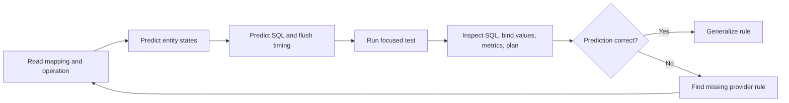
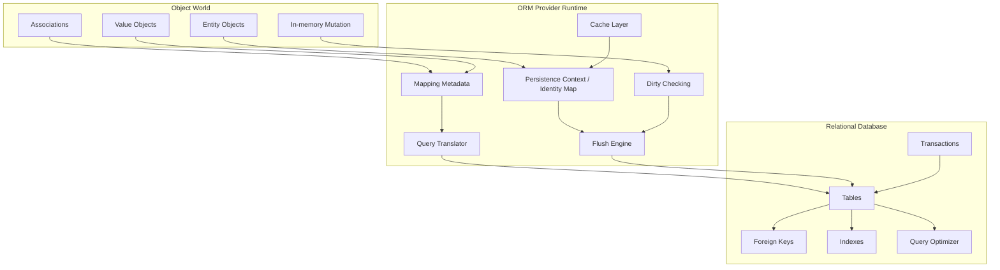
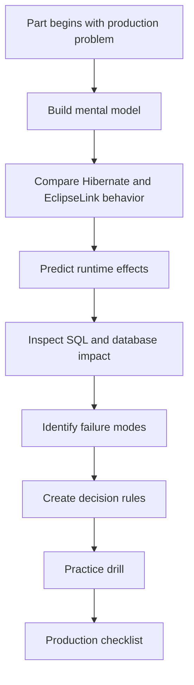
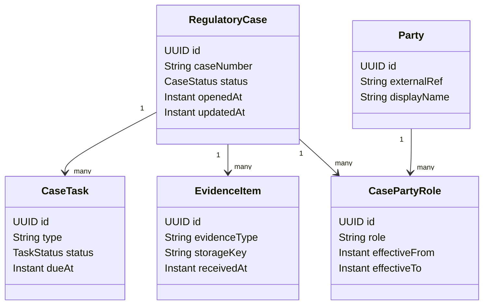

# Part 001 — Kaufman Skill Map: ORM Provider Mastery

> Target seri ini bukan sekadar “bisa memakai JPA annotation”. Targetnya adalah mampu **mengendalikan provider ORM**: memprediksi SQL, memahami lifecycle entity, mengelola flush, memilih fetch plan, mengukur biaya object hydration, menjaga cache correctness, dan membuat keputusan provider-specific secara defensible.

Seri ini memakai pendekatan dari *The First 20 Hours* karya Josh Kaufman sebagai kerangka belajar: pecah skill menjadi sub-skill, pelajari cukup untuk bisa mengoreksi diri, hilangkan hambatan praktik, lalu lakukan latihan terarah. Dalam konteks Hibernate ORM dan EclipseLink, “praktik” bukan hanya menulis entity dan repository, tetapi membangun kemampuan observasi: melihat mapping, memprediksi efek runtime, menjalankan eksperimen, membaca SQL/log/plan, lalu memperbaiki mental model.

Baseline teknis seri:

- **Jakarta Persistence 3.2** sebagai baseline kontrak standar.
- **Hibernate ORM 7.4.x** sebagai baseline Hibernate modern.
- **EclipseLink 5.0.x** sebagai baseline EclipseLink modern.
- Java 17+ diasumsikan, karena ecosystem Jakarta EE 11 dan EclipseLink 5 bergerak di baseline modern.
- Framework integration seperti Spring Boot akan dibahas dari sisi boundary dan failure mode, bukan sebagai tutorial CRUD.

---

## 1. Kenapa ORM Provider Mastery Berbeda dari JPA Basic

JPA basic biasanya menjawab pertanyaan seperti:

- annotation apa untuk membuat relasi?
- bagaimana membuat repository?
- bagaimana menjalankan query?
- bagaimana menyimpan entity?

Provider mastery menjawab pertanyaan yang lebih sulit:

- SQL apa yang akan muncul dari operasi ini?
- kapan perubahan field benar-benar dikirim ke database?
- apakah association ini akan menyebabkan N+1, cartesian explosion, atau write amplification?
- apakah second-level cache aman untuk data ini?
- apakah bulk update membuat persistence context menjadi stale?
- apakah mapping ini portable antara Hibernate dan EclipseLink?
- apakah provider-specific extension layak dipakai atau harus diisolasi?
- apakah bottleneck ada di database, ORM hydration, flush, dirty checking, network round-trip, cache miss, atau transaksi?

Engineer tingkat lanjut tidak memperlakukan ORM sebagai magic. ORM adalah **stateful translation engine** antara object graph dan relational database. Karena stateful, kesalahan kecil di boundary sering menjadi bug yang mahal: stale data, lost update, query berlebihan, memory pressure, constraint violation saat flush, hingga audit yang tidak lengkap.

---

## 2. Skill Definition: “Mahir Hibernate ORM dan EclipseLink” Itu Apa?

Skill ini dapat didefinisikan sebagai kemampuan untuk:

1. Mendesain mapping entity yang benar secara domain, relasional, dan operasional.
2. Menjelaskan state setiap entity di dalam persistence context.
3. Memprediksi SQL dari operasi entity/query sebelum melihat log.
4. Memilih fetch strategy berdasarkan use case, bukan berdasarkan kebiasaan.
5. Mengelola transaksi, flush, locking, dan isolation agar konsisten.
6. Memakai cache hanya ketika invariants-nya jelas.
7. Mengobservasi provider dengan log, metrics, statistics, profiler, dan execution plan.
8. Mengetahui perbedaan Hibernate dan EclipseLink saat spec tidak cukup detail.
9. Mengisolasi provider-specific features agar architecture tetap bisa dirawat.
10. Membuat trade-off eksplisit antara portability, performance, correctness, dan developer productivity.

Skill ini bukan hafalan annotation. Skill ini adalah **operational reasoning**.

---

## 3. Kaufman Framework untuk Seri Ini

Kaufman-style learning dapat diterjemahkan ke ORM mastery menjadi empat langkah kerja.

### 3.1 Deconstruct the Skill

ORM provider mastery dipecah menjadi sub-skill kecil yang dapat dilatih secara terpisah:

| Sub-skill | Pertanyaan inti | Output yang harus bisa dibuat |
|---|---|---|
| Entity state reasoning | Entity ini transient, managed, detached, removed, proxy, atau read-only? | State diagram operasi |
| Mapping correctness | Apakah object model dan relational model selaras? | Mapping decision record |
| SQL prediction | SQL apa yang muncul saat operasi dijalankan? | Prediksi SQL + actual SQL diff |
| Flush reasoning | Kapan write-behind queue dikirim? | Flush trigger map |
| Dirty checking | Field mana yang dianggap berubah? | Dirty-check explanation |
| Fetch planning | Data apa yang harus di-load untuk use case ini? | Fetch plan per endpoint/use case |
| Cache correctness | Data ini aman di-cache atau tidak? | Cache invariants |
| Locking consistency | Risiko lost update/phantom/stale read apa? | Transaction + lock strategy |
| Provider extension | Fitur provider apa yang justified? | Portability impact analysis |
| Diagnostics | Bagaimana membuktikan bottleneck? | Repro + metric + plan |

### 3.2 Learn Enough to Self-Correct

Belajar ORM tidak perlu dimulai dengan membaca semua source code provider. Yang penting adalah tahu cukup banyak untuk mendeteksi ketika mental model salah.

Self-correction loop:



Dalam setiap part, latihan akan diarahkan agar pembaca tidak hanya membaca konsep, tetapi juga membangun kemampuan prediksi.

### 3.3 Remove Barriers to Practice

Hambatan terbesar belajar ORM adalah terlalu banyak framework noise. Karena itu, latihan ideal menggunakan setup minimal:

- satu database nyata via Testcontainers, bukan hanya H2;
- SQL logging aktif;
- query count atau statistics aktif;
- schema kecil tetapi cukup kaya: `Case`, `Party`, `Evidence`, `Task`, `Escalation`, `AuditRecord`;
- test yang memisahkan operasi kecil: persist, load, mutate, query, flush, detach, merge, delete;
- satu variasi provider per eksperimen.

Kita akan memakai prinsip: **small schema, deep observation**.

### 3.4 Practice Deliberately for 20 Hours

20 jam pertama tidak akan membuat seseorang menjadi “top 1%”. Namun 20 jam dapat membuat fondasi yang cukup kuat untuk tidak lagi tertipu oleh ORM sebagai black box.

Pembagian 20 jam awal:

| Jam | Fokus | Praktik utama |
|---:|---|---|
| 1–2 | Mental model provider | Gambar lapisan spec-provider-runtime-database |
| 3–4 | Entity lifecycle | Simulasi persist/merge/detach/remove |
| 5–6 | Flush dan dirty checking | Prediksi SQL update/insert/delete |
| 7–8 | Identifier dan association | Uji ID generator dan relasi |
| 9–10 | Fetch planning | Reproduksi N+1 dan cartesian explosion |
| 11–12 | Query engine | JPQL/HQL/Criteria/native SQL comparison |
| 13–14 | Locking dan transaction | Lost update simulation |
| 15–16 | Caching | First-level vs second-level/shared cache |
| 17–18 | Batch dan bulk operation | Import job simulation |
| 19–20 | Diagnostics | Incident-style investigation |

Setelah 20 jam, jalur lanjutannya adalah mastery: membaca provider docs, source-level behavior, benchmarking, migration drills, dan production incident playbook.

---

## 4. Peta Kompetensi Top Engineer

Top engineer di area ORM biasanya bukan orang yang paling banyak tahu annotation. Mereka adalah orang yang paling jarang membuat asumsi salah tentang runtime behavior.

### 4.1 Level 1 — User of ORM

Ciri:

- bisa membuat entity dan relasi sederhana;
- memakai repository atau `EntityManager`;
- tahu `@OneToMany`, `@ManyToOne`, `@Transactional`;
- menganggap lazy/eager sebagai setting sederhana.

Risiko:

- tidak sadar query count;
- tidak tahu flush terjadi kapan;
- sering memakai cascade sebagai shortcut;
- expose entity langsung ke API;
- bingung saat `LazyInitializationException` atau stale data.

### 4.2 Level 2 — Conscious ORM User

Ciri:

- membaca SQL log;
- tahu N+1;
- tahu persistence context;
- mulai memisahkan entity dan DTO;
- paham bahwa `merge` bukan sekadar update.

Risiko:

- memperbaiki N+1 dengan join fetch berlebihan;
- salah memakai second-level cache;
- mengandalkan H2 untuk validasi behavior;
- tidak punya strategi untuk bulk update.

### 4.3 Level 3 — Provider-Aware Engineer

Ciri:

- memahami perbedaan Hibernate dan EclipseLink;
- memprediksi flush dan SQL ordering;
- memilih ID strategy berdasarkan throughput;
- memahami enhancement/weaving/proxy;
- punya regression test untuk query count dan mapping;
- menggunakan provider extension secara sadar.

Risiko:

- provider-specific code menyebar ke seluruh application layer;
- terlalu mengoptimasi sebelum bottleneck terbukti;
- memakai internal API tanpa isolation boundary.

### 4.4 Level 4 — Production ORM Architect

Ciri:

- mendesain persistence boundary untuk sistem besar;
- menyelaraskan aggregate, transaction, locking, audit, dan schema evolution;
- tahu kapan ORM cocok dan kapan native SQL/read model lebih tepat;
- mampu melakukan incident triage berbasis evidence;
- membuat ADR untuk provider choice, cache policy, fetch strategy, migration path;
- melindungi sistem dari failure mode lintas boundary: API serialization, messaging, batch job, audit, dan reporting.

Inilah target seri ini.

---

## 5. Mental Model Inti: ORM sebagai Stateful Translation Engine

ORM provider menghubungkan dua dunia dengan aturan yang berbeda:

| Object world | Relational world |
|---|---|
| identity by reference | identity by key |
| graph navigation | joins and predicates |
| mutation in memory | SQL write operations |
| lifecycle via object reachability | constraints and transactions |
| inheritance/composition | tables, columns, constraints |
| lazy association | deferred SELECT |
| dirty object | UPDATE statement |
| collection mutation | join table / FK operations |

Karena dua dunia ini tidak isomorphic, ORM selalu melakukan kompromi. Kesalahan muncul saat engineer mengira object graph dapat dipersist tanpa memahami biaya relasionalnya.

Diagram mental:



Prinsip utama: **setiap operasi object harus diterjemahkan menjadi operasi relational yang valid, efisien, dan konsisten.**

---

## 6. Skill Units Seri Ini

### 6.1 Mapping Correctness

Mapping benar bukan berarti aplikasi bisa start. Mapping benar berarti:

- cardinality domain sesuai dengan constraint database;
- ownership association jelas;
- cascade hanya mengikuti lifecycle ownership yang benar;
- nullable dan optional sesuai business invariant;
- collection mapping tidak menyebabkan write amplification besar;
- inheritance strategy tidak menghancurkan query performance;
- embeddable/value type tidak bocor menjadi primitive soup;
- identifier strategy cocok dengan database dan write pattern.

Checklist awal:

```txt
For every entity:
1. What is its lifecycle owner?
2. Who creates it?
3. Who mutates it?
4. Who deletes it?
5. Can it exist without its parent?
6. Is its identity technical, natural, composite, or derived?
7. Is it frequently queried alone or only through aggregate root?
8. Does the database schema enforce the same rule as the domain?
```

### 6.2 Persistence Context Reasoning

Persistence context adalah identity map plus change tracking boundary. Dalam satu persistence context, provider berusaha menjaga satu managed instance per database identity.

Skill yang harus dikuasai:

- mengetahui entity mana managed;
- tahu efek `find`, query, reference/proxy, `persist`, `merge`, `remove`, `detach`, `clear`;
- memahami bahwa managed mutation bisa menjadi SQL saat flush;
- memahami bahwa detached mutation tidak otomatis tersimpan;
- memahami first-level cache dapat menyembunyikan perubahan database eksternal.

Pertanyaan wajib saat debugging:

```txt
1. Apakah object ini managed atau detached?
2. Apakah perubahan terjadi di dalam transaction?
3. Apakah flush sudah terjadi?
4. Apakah query membaca dari persistence context, database, cache, atau kombinasi?
5. Apakah object yang terlihat stale sebenarnya berasal dari first-level cache?
```

### 6.3 SQL Prediction

SQL prediction adalah skill paling penting untuk keluar dari “ORM magic”.

Untuk setiap operasi, engineer harus bisa memperkirakan:

- jumlah query;
- jenis query: SELECT/INSERT/UPDATE/DELETE;
- kapan query dieksekusi;
- apakah ada join;
- apakah ada lazy load;
- apakah ada update yang tidak diharapkan;
- apakah ada delete + insert pada collection;
- apakah batching terjadi atau gagal;
- apakah query menggunakan index yang tepat.

Format latihan:

```md
## Operation
Load Case by ID, access parties, add evidence, commit.

## Prediction
- SELECT case by id
- SELECT parties lazily when accessed
- INSERT evidence on flush
- Maybe UPDATE case if bidirectional helper mutates parent metadata

## Actual
Paste SQL log.

## Delta
Explain why prediction differs.
```

### 6.4 Fetch Planning

Fetch planning bukan memilih antara lazy dan eager. Fetch planning adalah mendesain data shape untuk use case.

Empat failure mode utama:

1. **N+1** — terlalu banyak round-trip kecil.
2. **Cartesian explosion** — join fetch terlalu banyak collection.
3. **Overhydration** — entity graph terlalu besar untuk kebutuhan read model.
4. **Boundary leak** — lazy loading terjadi di serialization/API layer.

Mental model:

```txt
Use case -> required data shape -> acceptable query count -> fetch strategy -> verification
```

### 6.5 Transaction and Locking Reasoning

ORM membuat mutation terlihat lokal, tetapi consistency ditentukan oleh transaksi database.

Skill penting:

- optimistic locking untuk lost update;
- pessimistic locking untuk serialisasi critical section;
- isolation level impact;
- stale managed entity;
- transaction propagation;
- rollback effect on persistence context;
- flush before query;
- deadlock investigation.

### 6.6 Cache Correctness

Cache bukan “performance button”. Cache adalah replicated memory dengan invalidation problem.

Pertanyaan sebelum caching:

```txt
1. Apakah data immutable atau rarely changed?
2. Siapa saja writer-nya?
3. Apakah ada writer di luar ORM?
4. Apakah cluster node harus konsisten?
5. Apakah stale read bisa diterima?
6. Apakah bulk update/native SQL akan melewati cache awareness?
7. Bagaimana invalidation diuji?
```

### 6.7 Provider-Specific Reasoning

Hibernate dan EclipseLink sama-sama implementasi Jakarta Persistence, tetapi provider behavior dapat berbeda di area:

- bytecode enhancement vs weaving;
- lazy loading implementation;
- change tracking strategy;
- cache architecture;
- query hints;
- fetch extensions;
- custom type/converter support;
- multi-tenancy support;
- batch writing/fetching;
- event/listener APIs;
- schema generation;
- logging/profiling.

Portability bukan tujuan absolut. Prinsipnya:

> Gunakan portable API sebagai default. Pakai provider-specific extension saat ada kebutuhan nyata, lalu isolasi dampaknya.

---

## 7. Anti-Goals Seri Ini

Seri ini sengaja tidak mengulang materi berikut secara mendalam:

- Java basic, collection, stream, generics;
- SQL basic;
- JDBC basic;
- JPA introduction;
- Bean Validation;
- JSON/XML serialization;
- REST API basics;
- general design patterns;
- general persistence architecture yang sudah dibahas di seri sebelumnya.

Topik tersebut hanya akan muncul bila diperlukan untuk menjelaskan provider behavior.

---

## 8. Learning Architecture Seri

Setiap part idealnya memiliki pola:

1. **Problem framing** — masalah nyata yang sering terjadi.
2. **Mental model** — cara berpikir yang tepat.
3. **Provider behavior** — Hibernate vs EclipseLink.
4. **SQL/runtime impact** — efek ke database dan memory.
5. **Failure modes** — bug yang biasa muncul.
6. **Decision rules** — kapan memilih opsi tertentu.
7. **Practice drill** — latihan kecil untuk memperkuat intuisi.
8. **Production checklist** — hal yang harus diverifikasi sebelum masuk production.

Diagram alur belajar:



---

## 9. Practice Environment yang Direkomendasikan

Untuk belajar efektif, gunakan satu repository latihan kecil dengan dua profile provider.

Struktur minimal:

```txt
orm-provider-lab/
  build.gradle.kts
  src/test/java/
    lab/hibernate/
    lab/eclipselink/
    lab/shared/model/
    lab/shared/scenario/
  src/test/resources/
    META-INF/persistence.xml
    logback-test.xml
  docker/
    postgres/
```

Gunakan database nyata seperti PostgreSQL melalui Testcontainers. Hindari menjadikan H2 sebagai satu-satunya sumber kebenaran karena H2 tidak merepresentasikan semua behavior PostgreSQL, MySQL, Oracle, atau SQL Server.

Observability minimal:

- SQL statements aktif;
- bind parameters terlihat;
- query count bisa diukur;
- transaction boundary jelas di test;
- schema migration eksplisit;
- database execution plan bisa diambil;
- provider statistics/profiler aktif saat diperlukan.

---

## 10. Domain Latihan Seri: Regulatory Case Lifecycle

Agar latihan tidak terlalu toy-like, seri ini akan sering memakai domain regulatory/case management:

- `RegulatoryCase`
- `Party`
- `CasePartyRole`
- `EvidenceItem`
- `CaseTask`
- `Escalation`
- `CaseStatusHistory`
- `AuditRecord`
- `DocumentReference`
- `Decision`

Kenapa domain ini bagus untuk ORM mastery?

- punya lifecycle dan state machine;
- punya audit dan temporal history;
- punya banyak relasi;
- punya volume read/write berbeda;
- punya consistency requirement tinggi;
- punya access boundary;
- punya reporting/read model;
- punya batch reconciliation;
- punya kebutuhan traceability.

Contoh aggregate boundary awal:



Kita tidak akan langsung menganggap semua relasi harus `@OneToMany`. Justru salah satu latihan utama adalah menentukan kapan object reference layak dipakai dan kapan ID reference lebih sehat secara operasional.

---

## 11. Core Invariants yang Akan Dipakai Sepanjang Seri

### Invariant 1 — Persistence Context Identity

Dalam satu persistence context, satu database identity idealnya direpresentasikan oleh satu managed object instance. Jika ada dua instance berbeda untuk identity yang sama, provider harus menyelesaikan konflik atau melempar exception tergantung operasi.

### Invariant 2 — Flush Is the Database Synchronization Point

Perubahan managed entity tidak langsung menjadi SQL. Perubahan dikumpulkan dan dikirim saat flush. Commit biasanya memicu flush, tetapi query juga dapat memicu flush tergantung flush mode dan provider behavior.

### Invariant 3 — Lazy Loading Is a Runtime Side Effect

Mengakses property/association dapat menyebabkan SQL. Itu berarti getter tidak selalu cheap. Ini penting di API serialization, logging, equality, debugging, dan template rendering.

### Invariant 4 — Entity Graph Is Not Query Plan

Object graph menggambarkan navigasi domain, bukan otomatis query plan yang optimal. Query plan harus didesain per use case.

### Invariant 5 — Cache Must Respect Write Paths

Cache aman hanya jika semua write path, invalidation, dan staleness tolerance dipahami. Cache yang salah lebih buruk daripada tidak ada cache.

### Invariant 6 — Provider Extensions Are Architecture Decisions

Provider extension bukan dosa, tetapi harus diperlakukan sebagai keputusan arsitektur: ada alasan, boundary, test, dan migration story.

---

## 12. Evaluation Rubric

Gunakan rubric ini untuk menilai perkembangan.

| Capability | Beginner signal | Advanced signal |
|---|---|---|
| Mapping | Bisa membuat relasi | Bisa menjelaskan SQL mutation cost dari relasi |
| Fetch | Mengubah lazy/eager | Mendesain fetch plan per use case |
| Flush | Tahu commit menyimpan data | Tahu query dapat trigger flush dan kenapa |
| Dirty checking | Tahu entity berubah akan update | Tahu kapan perubahan tidak terdeteksi atau false dirty |
| Cache | Mengaktifkan cache | Mendesain invalidation dan staleness policy |
| Locking | Menambah `@Version` | Mensimulasikan lost update dan deadlock |
| Provider | Memakai default provider | Membandingkan behavior Hibernate dan EclipseLink |
| Diagnostics | Membaca log | Menghubungkan log, statistics, execution plan, dan code path |
| Architecture | Repository CRUD | Persistence boundary dengan read/write model dan audit |

---

## 13. The 20-Hour Practice Plan in Detail

### Hour 1–2 — Provider Map

Deliverable:

- gambar architecture map untuk Hibernate;
- gambar architecture map untuk EclipseLink;
- daftar “spec behavior” vs “provider behavior”.

Drill:

```txt
Ambil satu entity sederhana. Tulis perjalanan dari entity class sampai SQL:
Class -> metadata -> persistence context -> dirty checking -> flush -> JDBC -> database.
```

### Hour 3–4 — Entity Lifecycle

Deliverable:

- state transition diagram;
- test untuk `persist`, `find`, `getReference`, `detach`, `merge`, `remove`.

Drill:

```txt
Mutate managed entity, detached entity, removed entity.
Prediksi mana yang menghasilkan SQL.
```

### Hour 5–6 — Flush and Dirty Checking

Deliverable:

- daftar flush trigger;
- SQL diff sebelum/sesudah query;
- contoh unexpected update.

Drill:

```txt
Dalam satu transaction:
1. load entity
2. mutate field
3. run JPQL query
4. inspect apakah update terjadi sebelum query
```

### Hour 7–8 — Identifier and Association

Deliverable:

- comparison identity vs sequence;
- association ownership table;
- cascade decision matrix.

Drill:

```txt
Persist parent with children under different cascade settings.
Catat SQL dan error yang muncul.
```

### Hour 9–10 — Fetch Planning

Deliverable:

- satu skenario N+1;
- satu skenario cartesian explosion;
- satu fetch strategy decision tree.

Drill:

```txt
Endpoint: list 20 cases with current task count and primary party.
Bandingkan entity loading, join fetch, batch fetch, dan DTO projection.
```

### Hour 11–12 — Query Engine

Deliverable:

- JPQL/HQL/Criteria/native SQL comparison;
- implicit join examples;
- bulk update safety note.

Drill:

```txt
Tulis query yang sama dalam JPQL, Criteria, dan native SQL.
Bandingkan readability, SQL output, dan portability.
```

### Hour 13–14 — Transaction and Locking

Deliverable:

- optimistic locking conflict test;
- pessimistic lock timeout test;
- transaction boundary diagram.

Drill:

```txt
Simulasikan dua transaction mengubah case status yang sama.
Buktikan lost update dicegah oleh version field.
```

### Hour 15–16 — Cache

Deliverable:

- first-level cache demonstration;
- second-level/shared cache demonstration;
- stale read scenario.

Drill:

```txt
Load reference data di dua transaction.
Update lewat native SQL.
Amati cache behavior.
```

### Hour 17–18 — Batch and Bulk

Deliverable:

- import 10.000 rows with chunked flush/clear;
- compare ID strategies;
- bulk update with context cleanup.

Drill:

```txt
Update due tasks in bulk.
Lalu baca managed entity yang sudah ada sebelum bulk.
Jelaskan stale behavior.
```

### Hour 19–20 — Diagnostics

Deliverable:

- mini incident report;
- root cause analysis;
- fix + regression test.

Drill:

```txt
Buat hidden N+1 di service.
Deteksi dengan query count.
Perbaiki dengan fetch plan yang tepat.
```

---

## 14. Decision Records yang Harus Dibiasakan

Untuk setiap keputusan ORM penting, tulis ADR singkat.

Template:

```md
# ADR: [Decision]

## Context
What domain/runtime/database constraint forces this decision?

## Options
1. Portable Jakarta Persistence mapping
2. Hibernate-specific extension
3. EclipseLink-specific extension
4. Native SQL/read model

## Decision
Chosen option and why.

## Consequences
- Correctness impact
- Performance impact
- Portability impact
- Testing requirement
- Migration story
```

Contoh keputusan:

- memakai sequence pooled optimizer;
- memakai Hibernate batch fetching;
- memakai EclipseLink descriptor customizer;
- memakai DTO projection untuk read endpoint;
- mematikan Open Session in View;
- memakai optimistic lock untuk case state transition;
- tidak memakai second-level cache untuk mutable workflow data.

---

## 15. Common Misconceptions yang Akan Dibongkar

### Misconception 1 — “Entity adalah model API”

Entity adalah persistence model dengan lifecycle, identity, lazy loading, dan provider hooks. Mengekspos entity langsung ke API membuat persistence boundary bocor.

### Misconception 2 — “Lazy selalu lebih baik dari eager”

Lazy menghindari overfetching default, tetapi tetap harus ada fetch plan eksplisit. Lazy tanpa fetch planning menghasilkan N+1.

### Misconception 3 — “Cascade memudahkan save graph”

Cascade harus mengikuti lifecycle ownership. Cascade yang salah dapat menyimpan, menghapus, atau me-merge graph terlalu besar.

### Misconception 4 — “Merge adalah update”

`merge` menyalin state detached object ke managed instance. Ini berbeda dari update langsung dan dapat menyebabkan overwrite tidak sengaja.

### Misconception 5 — “Flush sama dengan commit”

Flush mengirim SQL ke database dalam transaction. Commit menyelesaikan transaction. SQL bisa gagal saat flush sebelum commit.

### Misconception 6 — “Second-level cache tinggal dinyalakan”

Cache butuh policy. Tanpa invalidation dan staleness model, cache dapat mengembalikan data salah.

### Misconception 7 — “Provider bisa diganti kapan saja karena sama-sama JPA”

Spec memberi kontrak penting, tetapi provider extension, lazy mechanics, weaving/enhancement, query behavior, cache, dan tuning dapat berbeda. Portability harus dirancang, bukan diasumsikan.

---

## 16. Production Checklist Awal

Sebelum sistem ORM dianggap production-ready, minimal pastikan:

- setiap endpoint penting punya query count expectation;
- setiap aggregate mutation punya transaction boundary eksplisit;
- setiap association cascade punya alasan lifecycle;
- setiap collection besar tidak dimuat penuh tanpa alasan;
- setiap bulk update membersihkan/sinkronisasi persistence context;
- setiap cache region punya staleness dan invalidation policy;
- setiap provider-specific feature punya ADR;
- setiap lock strategy punya conflict test;
- setiap schema migration diuji dengan versi aplikasi lama dan baru bila zero-downtime dibutuhkan;
- SQL log dapat diaktifkan saat incident tanpa redeploy besar;
- metrics/statistics ORM tersedia di environment non-production dan production-safe mode.

---

## 17. Mini Capstone untuk Part 001

Ambil satu use case:

> Officer membuka daftar 20 regulatory cases yang sedang aktif, menampilkan nomor kasus, status, primary party, jumlah task overdue, dan tanggal escalation terakhir.

Jangan langsung menulis repository. Jawab dulu:

1. Apakah ini entity use case atau read model use case?
2. Data apa yang benar-benar dibutuhkan?
3. Berapa query yang acceptable?
4. Apakah association perlu diload sebagai entity?
5. Apakah DTO projection lebih tepat?
6. Apakah primary party dan task count harus join, subquery, view, atau denormalized read model?
7. Apakah cache aman?
8. Apakah pagination stabil?
9. Bagaimana membuktikan tidak ada N+1?
10. Bagaimana query ini berubah bila provider diganti?

Jawaban ideal kemungkinan: ini lebih cocok sebagai read model/DTO projection, bukan full aggregate loading. Tetapi keputusan final harus dibuktikan lewat query shape, execution plan, dan use case mutation requirement.

---

## 18. Ringkasan

ORM provider mastery adalah kemampuan menghubungkan empat hal sekaligus:

1. domain object model;
2. provider runtime behavior;
3. SQL/database execution;
4. production correctness.

Kaufman framework membantu kita belajar secara efektif: pecah skill, pelajari cukup untuk self-correction, hilangkan hambatan praktik, dan lakukan latihan terarah. Untuk Hibernate ORM dan EclipseLink, latihan terbaik adalah memprediksi runtime behavior lalu membuktikannya dengan SQL, metrics, dan database plan.

Part berikutnya membangun fondasi mental model: bagaimana Jakarta Persistence sebagai spec, Hibernate/EclipseLink sebagai provider, persistence context sebagai runtime state, dan database sebagai execution authority saling berinteraksi.

---

## References

- Hibernate ORM Documentation: https://hibernate.org/orm/documentation/
- Hibernate ORM 7.4 Releases: https://hibernate.org/orm/releases/7.4/
- Hibernate ORM User Guide 7.4.x: https://docs.hibernate.org/stable/orm/userguide/html_single/
- EclipseLink 5.0 Release Notes: https://eclipse.dev/eclipselink/releases/5.0.html
- EclipseLink Project Release 5.0.0: https://projects.eclipse.org/projects/ee4j.eclipselink/releases/5.0.0
- Jakarta Persistence 3.2 Specification: https://jakarta.ee/specifications/persistence/3.2/
- Josh Kaufman, The First 20 Hours: How to Learn Anything ... Fast
