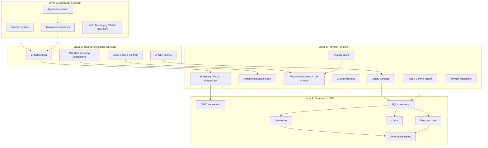
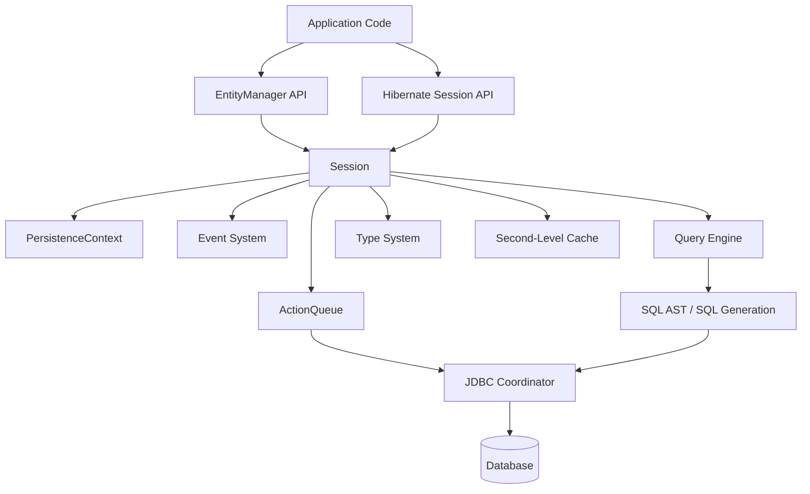
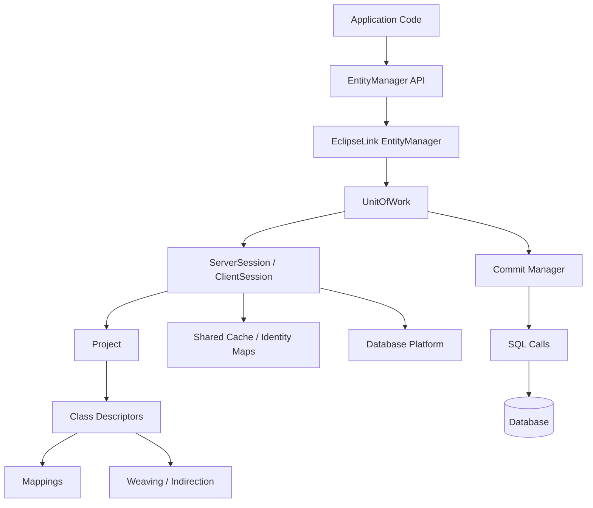
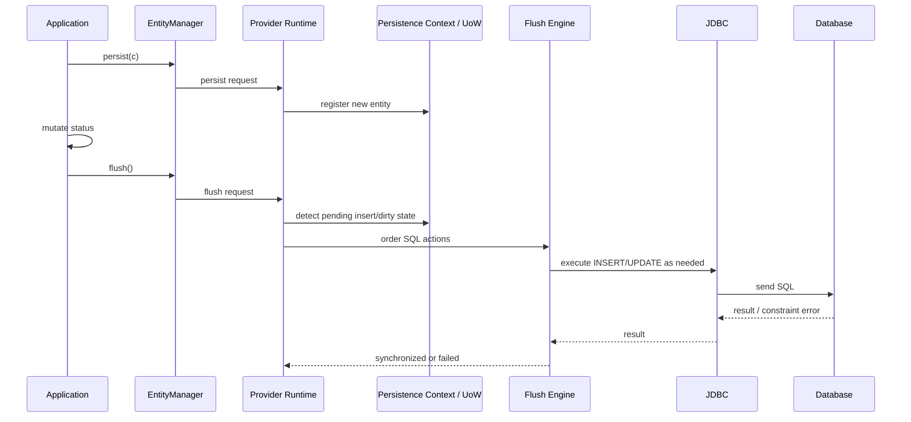
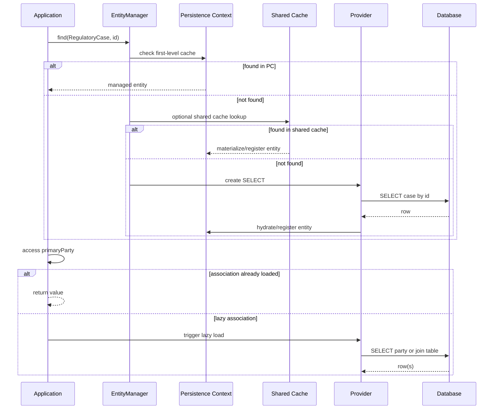
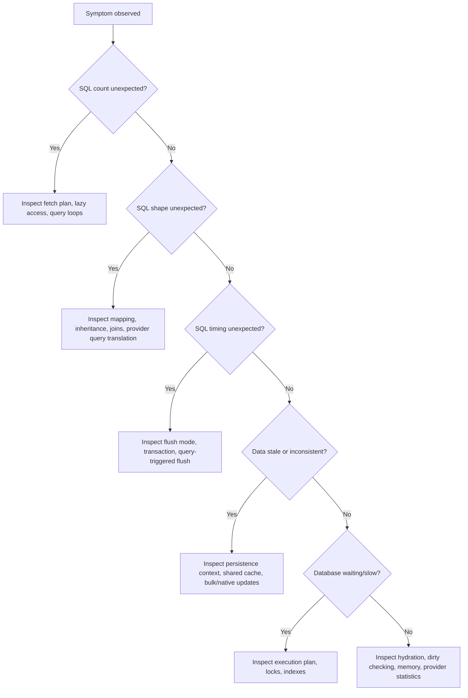
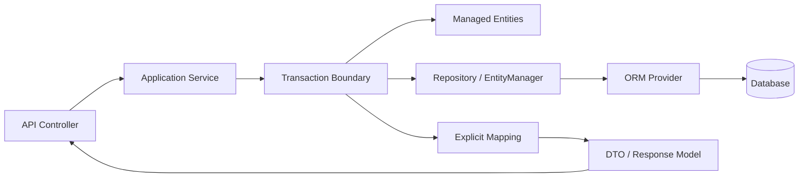

# Part 002 — ORM Provider Mental Model: Spec, Provider, Runtime, Database

> Jika Part 001 adalah peta belajar, Part 002 adalah peta mesin. Kita akan melihat ORM bukan sebagai annotation framework, tetapi sebagai runtime engine yang menyimpan state, menerjemahkan query, melacak perubahan, mengatur flush, memanfaatkan cache, dan akhirnya tunduk pada database.

Hibernate ORM dan EclipseLink sama-sama implementasi Jakarta Persistence. Tetapi “implementasi spec” bukan berarti behavior identik di semua area. Spec mendefinisikan kontrak utama. Provider mengisi detail runtime: metadata model, lazy loading mechanics, dirty checking, flush ordering, cache architecture, query optimization, weaving/enhancement, dan extension APIs.

Mental model yang benar:

```txt
Jakarta Persistence gives the contract.
Hibernate/EclipseLink execute the contract.
The persistence context holds runtime identity and state.
The database enforces final truth through constraints, locks, transactions, and query plans.
```

---

## 1. Four-Layer Model

Untuk menganalisis masalah ORM, gunakan empat lapisan berikut.



Setiap bug ORM bisa dipetakan ke salah satu lapisan ini. Jangan langsung menyalahkan provider. Sering kali masalah berasal dari boundary yang kabur, mapping yang tidak merepresentasikan invariant, query shape yang salah, atau database constraint yang berbeda dari asumsi object model.

---

## 2. Jakarta Persistence sebagai Contract

Jakarta Persistence mendefinisikan standar untuk object/relational mapping dan persistence management di Java. Standar ini penting karena memberikan vocabulary bersama:

- entity;
- persistence unit;
- entity manager;
- persistence context;
- lifecycle state;
- mapping annotation;
- JPQL;
- Criteria API;
- transaction interaction;
- lock modes;
- cache API;
- lifecycle callback.

Namun spec sengaja tidak mengatur semua detail internal provider. Misalnya, spec tidak memaksa provider memakai algoritma dirty checking yang sama, cache implementation yang sama, lazy loading mechanism yang sama, atau SQL generation strategy yang identik.

Akibatnya, engineer perlu membedakan dua kategori pengetahuan:

| Kategori | Contoh | Dampak |
|---|---|---|
| Spec-level knowledge | entity lifecycle, `EntityManager`, JPQL, lock mode, mapping standar | Relatif portable |
| Provider-level knowledge | Hibernate `Session`, ActionQueue, bytecode enhancement, EclipseLink weaving, descriptor customizer, query hints | Powerful tetapi perlu isolation |

Rule:

> Saat menjelaskan behavior, selalu tandai apakah itu berasal dari spec, provider, framework integration, atau database.

---

## 3. Provider sebagai Execution Engine

Provider ORM memiliki beberapa tanggung jawab utama.

### 3.1 Metadata Interpretation

Provider membaca entity class dan mapping metadata, lalu membangun model internal:

- class mana entity;
- field/property mana persistent;
- table dan column mapping;
- identifier strategy;
- association ownership;
- inheritance strategy;
- converter/type mapping;
- cascade rule;
- fetch rule;
- lifecycle callback;
- cache policy;
- provider-specific annotation/hint.

Metadata bukan hanya konfigurasi pasif. Metadata menentukan bagaimana provider membuat SQL, mengelola lifecycle, melakukan dirty checking, dan menyusun flush order.

### 3.2 Identity Management

Dalam persistence context, provider menjaga hubungan antara database identity dan object instance.

Contoh invariant:

```txt
Within one persistence context:
Database row case(id = 100) -> one managed RegulatoryCase instance
```

Jika aplikasi mencoba memasukkan object lain dengan ID yang sama, provider harus menangani konflik. Di Hibernate, konflik ini sering terlihat sebagai exception seputar duplicate representation atau non-unique object tergantung operasi. Di EclipseLink, UnitOfWork dan identity map memiliki model clone/registration yang perlu dipahami.

### 3.3 Change Tracking

Provider menentukan apakah managed entity berubah. Strateginya dapat berupa:

- snapshot comparison;
- field interception;
- bytecode enhancement;
- weaving;
- attribute-level tracking;
- collection wrapper tracking.

Dirty checking adalah jembatan antara mutation object dan SQL `UPDATE`.

### 3.4 Query Translation

JPQL/HQL/Criteria bukan SQL. Provider menerjemahkannya ke SQL berdasarkan:

- dialect/platform database;
- mapping metadata;
- join path;
- fetch plan;
- parameter binding;
- pagination;
- lock mode;
- query hints;
- inheritance strategy;
- discriminator;
- filters/additional criteria;
- cache setting.

SQL yang dihasilkan bukan hanya fungsi dari query string. SQL juga fungsi dari metadata dan provider behavior.

### 3.5 Flush and Commit Coordination

Provider mengumpulkan perubahan di memory. Saat flush, provider mengubah perubahan menjadi SQL:

- insert entity baru;
- update entity dirty;
- delete entity removed;
- update FK;
- insert/delete join table row;
- maintain collection table;
- execute version update;
- enforce ordering agar constraints tidak gagal sejauh mungkin.

Commit adalah tanggung jawab transaksi database. Flush dapat terjadi sebelum commit.

### 3.6 Cache Coordination

Provider dapat memiliki beberapa lapisan cache:

- first-level cache/persistence context;
- second-level cache/shared cache;
- query cache/result cache;
- natural ID cache atau provider-specific cache;
- coordination/invalidation mechanism.

Cache harus dipikirkan sebagai consistency mechanism, bukan sekadar optimization.

---

## 4. Hibernate ORM Mental Model

Hibernate historically memiliki native API sendiri (`Session`, `SessionFactory`) dan juga implementasi Jakarta Persistence (`EntityManager`, `EntityManagerFactory`). Dalam praktik modern, banyak aplikasi memakai JPA API di atas Hibernate provider, tetapi behavior penting tetap berasal dari Hibernate internals.

High-level architecture:



### 4.1 Important Hibernate Concepts

| Concept | Mental model |
|---|---|
| `SessionFactory` | Immutable-ish heavyweight runtime factory built from metadata and services |
| `Session` | Unit of work / persistence context boundary, usually transaction-scoped |
| PersistenceContext | First-level cache and managed entity registry |
| ActionQueue | Ordered queue of pending inserts, updates, deletes, collection actions |
| Type system | Mapping between Java values and JDBC/database representation |
| Dialect | Database-specific SQL capability abstraction |
| Event system | Hooks for load, persist, flush, delete, dirty checking, etc. |
| Bytecode enhancement | Optional/required feature for advanced lazy loading and dirty tracking scenarios |
| Second-level cache | Shared cache outside a single session, configured by region/strategy |

### 4.2 Hibernate Biases

Hibernate is powerful and extension-rich. It often gives more knobs than the spec:

- custom types;
- filters;
- formulas;
- batch fetching;
- subselect fetching;
- fetch profiles;
- interceptors and event listeners;
- natural ID support;
- stateless session;
- second-level cache regions;
- bytecode enhancement;
- Hibernate-specific query features.

Engineering implication:

> Hibernate can solve many advanced problems elegantly, but uncontrolled Hibernate-specific usage can create migration friction and hidden coupling.

### 4.3 Hibernate Debugging Questions

When debugging Hibernate behavior, ask:

```txt
1. Which Session owns this entity?
2. Is the entity managed, detached, removed, or proxy?
3. Is there an ActionQueue entry pending?
4. Did a query trigger auto-flush?
5. Is dirty checking snapshot-based or enhanced?
6. Did lazy loading happen through proxy or enhanced field interception?
7. Did second-level cache participate?
8. Which dialect generated this SQL?
9. Did batching actually occur?
10. Is behavior from JPA API or Hibernate extension?
```

---

## 5. EclipseLink Mental Model

EclipseLink is also a Jakarta Persistence provider, but its architecture vocabulary differs. It has deep concepts around sessions, projects, descriptors, weaving, indirection, identity maps, and UnitOfWork.

High-level architecture:



### 5.1 Important EclipseLink Concepts

| Concept | Mental model |
|---|---|
| ServerSession | Shared session representing database login, descriptors, platform, cache |
| ClientSession | Session view often associated with client/unit of work usage |
| UnitOfWork | Tracks clones/changes before commit |
| Descriptor | Runtime metadata for persistent class |
| Mapping | Attribute/relationship mapping inside descriptor |
| Weaving | Bytecode modification for lazy loading, change tracking, fetch groups, etc. |
| Indirection | Lazy reference/collection mechanism |
| Identity Map | Shared cache identity structure |
| DatabasePlatform | Database-specific SQL and capability abstraction |
| DescriptorCustomizer / SessionCustomizer | Extension points for runtime customization |

### 5.2 EclipseLink Biases

EclipseLink has strong provider-level features around:

- weaving;
- indirection;
- shared cache and identity maps;
- descriptor/session customization;
- batch reading;
- fetch groups;
- multitenancy support;
- additional criteria;
- converters and transformation mappings;
- database platform customization.

Engineering implication:

> EclipseLink rewards understanding descriptors, weaving, and UnitOfWork. If you only bring a Hibernate mental model, you may misread EclipseLink behavior.

### 5.3 EclipseLink Debugging Questions

```txt
1. Is weaving active?
2. Is this object a clone in UnitOfWork or shared cached object?
3. Which descriptor mapping controls this attribute?
4. Is indirection/lazy loading active for this relationship?
5. Is shared cache returning stale data?
6. Is batch reading configured?
7. Did additional criteria affect the query?
8. Which DatabasePlatform generated SQL?
9. Did a descriptor/session customizer alter default behavior?
10. Is behavior from Jakarta Persistence or EclipseLink extension?
```

---

## 6. Persistence Context vs Unit of Work

JPA uses the term persistence context. Hibernate commonly maps this to `Session` internals. EclipseLink often exposes the UnitOfWork concept in its architecture.

The shared idea:

```txt
A runtime scope tracks objects loaded from or scheduled for persistence to the database.
```

But the internal implementation can differ.

| Concern | Hibernate leaning | EclipseLink leaning |
|---|---|---|
| Runtime scope | Session / persistence context | EntityManager backed by UnitOfWork/session |
| Identity tracking | PersistenceContext identity map | UnitOfWork clones + identity maps |
| Change tracking | snapshots/enhancement/collection wrappers | deferred change detection/weaving/change tracking policies |
| Lazy mechanism | proxies/enhancement/collections | indirection/weaving/fetch groups |
| Extension point | event listeners, interceptors, services, types | descriptors, customizers, session events |
| Cache vocabulary | first-level/second-level/query cache | identity map/shared cache/query results depending config |

Do not force one provider’s vocabulary onto the other. Translate concepts carefully.

---

## 7. Lifecycle of a Simple Write

Consider:

```java
RegulatoryCase c = new RegulatoryCase("CASE-2026-0001");
entityManager.persist(c);
c.changeStatus(CaseStatus.OPEN);
entityManager.flush();
```

Provider-level flow:



Important observations:

- `persist` does not necessarily execute SQL immediately.
- ID strategy can force earlier SQL in some cases.
- Field mutation after `persist` but before flush can be included in insert.
- Constraint errors may appear at flush time, not at `persist` call.
- Provider determines SQL ordering.

---

## 8. Lifecycle of a Simple Read

Consider:

```java
RegulatoryCase c = entityManager.find(RegulatoryCase.class, id);
String name = c.getPrimaryParty().getDisplayName();
```

Possible runtime flow:



Read operation can involve:

- first-level cache;
- shared/second-level cache;
- SQL select;
- lazy load later;
- proxy initialization;
- weaving/indirection;
- hydration;
- entity registration;
- implicit flush before query depending context.

A getter may therefore become a database operation.

---

## 9. Where Assumptions Commonly Fail

### 9.1 “I called save, so SQL happened”

Wrong mental model. ORM often delays SQL until flush. Some ID strategies or provider operations may force earlier SQL, but you should not assume every save call hits the database immediately.

### 9.2 “I queried, so I read the database truth”

Maybe. Query may return managed instances already present in persistence context. Even if SQL runs, provider can reconcile rows with existing managed objects. First-level cache can preserve stale in-memory state within a transaction.

### 9.3 “The entity is detached, but changing it should update later”

Detached object mutation is not tracked. A later `merge` copies state into a managed instance, which has different semantics and risks.

### 9.4 “Lazy means no query unless I explicitly query”

Accessing a lazy property/association can trigger SQL implicitly.

### 9.5 “If it works in Hibernate, it is portable to EclipseLink”

Not necessarily. Standard mappings are portable in intent, but provider details can differ in lazy loading, enhancement/weaving, query hints, cache, extension annotations, and edge behavior.

---

## 10. Spec vs Provider vs Database: Diagnostic Classification

Saat incident terjadi, klasifikasikan masalah.

| Symptom | Likely layer | Example diagnosis |
|---|---|---|
| `LazyInitializationException` / lazy access failure | Boundary/provider | Entity escaped persistence context |
| Duplicate entity identity error | Persistence context | Two detached/new instances with same ID |
| Constraint violation during commit | Flush/database | SQL order or invalid object graph |
| N+1 query | Fetch plan/provider runtime | Lazy association accessed in loop |
| Deadlock | Transaction/database | Inconsistent update order or lock strategy |
| Stale data after bulk update | Persistence context/cache | Bulk SQL bypassed managed state/cache |
| Query slow despite few SQL statements | Database/query shape | Missing index, bad join, overhydration |
| Memory spike | Provider runtime | Large persistence context or huge hydration |
| Different behavior across providers | Provider-specific | Extension, weaving, cache, query hint difference |

Decision tree:



---

## 11. Provider Portability Model

Portability is not binary. Use a spectrum.

```txt
Fully portable          Mostly portable            Provider-bound
JPA annotations  ->     Standard + hints      ->    Native provider APIs/extensions
JPQL standard           Minor behavior diff         Custom types/events/descriptors
```

### 11.1 Portable Zone

Examples:

- standard entity annotation;
- standard associations;
- standard lifecycle callbacks;
- JPQL subset;
- standard lock modes;
- standard `EntityGraph` API;
- standard `AttributeConverter`.

Even here, SQL shape may vary.

### 11.2 Mostly Portable Zone

Examples:

- query hints with provider-specific interpretation;
- fetch graph/load graph behavior in edge cases;
- schema generation settings;
- cache settings;
- lazy to-one behavior depending enhancement/weaving;
- Criteria API features whose SQL rendering differs.

### 11.3 Provider-Bound Zone

Examples:

- Hibernate custom types, filters, formulas, event listeners, stateless session;
- EclipseLink descriptors, customizers, additional criteria, transformation mapping;
- provider-specific batch/fetch annotations;
- provider-specific cache coordination;
- provider-specific multi-tenancy configuration.

Rule:

> Provider-bound features are acceptable when they buy measurable correctness, performance, or maintainability. They must be isolated and tested.

---

## 12. Database Is the Final Authority

ORM does not eliminate database reality.

The database still owns:

- unique constraints;
- foreign keys;
- check constraints;
- transaction isolation;
- locks;
- indexes;
- execution plans;
- row visibility;
- deadlock detection;
- storage layout;
- network round-trip cost;
- write-ahead logging cost;
- replication lag;
- trigger behavior;
- generated columns;
- sequence allocation.

If object model says a relationship is optional but database says NOT NULL, database wins. If ORM generates a query that cannot use an index, optimizer behavior wins. If two transactions lock rows in opposite order, database deadlock detection wins.

Architecture principle:

> The ORM model should express domain intent, but the database schema must enforce non-negotiable invariants.

---

## 13. The Runtime Cost Model

Every ORM operation has costs.

| Cost type | Example | How to observe |
|---|---|---|
| SQL round trip | N+1 lazy loads | SQL count/log/statistics |
| Rows scanned | missing index | execution plan |
| Rows returned | overbroad join fetch | result size/log/plan |
| Object hydration | loading full aggregate for list page | allocation profiler/statistics |
| Dirty checking | huge persistence context | flush time/profile |
| Collection diff | large `@OneToMany` mutation | SQL log/flush metrics |
| Cache lookup | second-level cache overhead | cache hit/miss metrics |
| Lock wait | pessimistic lock/deadlock | DB lock view/logs |
| Batch failure | identity generation or flush ordering | JDBC batch logs/statistics |

Performance engineering starts by identifying which cost dominates.

Bad diagnosis examples:

- Fixing N+1 by adding cache when the real issue is fetch planning.
- Adding indexes when the real issue is overhydration.
- Increasing connection pool when the real issue is lock wait.
- Using native SQL when the real issue is wrong transaction boundary.
- Enabling second-level cache for mutable workflow data without invalidation.

---

## 14. Boundary Model: Where Entities Must Not Leak

Entity objects are stateful persistence objects. They should not leak carelessly across boundaries.

Dangerous boundaries:

- REST response serialization;
- GraphQL resolver without fetch planning;
- async job queue payload;
- Kafka/event message;
- cache outside ORM;
- UI session;
- audit snapshot without explicit copy;
- equals/hashCode in collection after ID mutation;
- logging that accesses lazy associations;
- validation that traverses lazy graph unexpectedly.

Safer boundary pattern:



The key is explicit translation. Entity stays inside transaction/persistence boundary. DTO/read model crosses external boundary.

---

## 15. A Practical Classification of ORM Use Cases

Not every persistence use case should be solved with entity loading.

| Use case | Preferred pattern | Reason |
|---|---|---|
| Mutate aggregate with invariants | Managed entity aggregate | Need lifecycle, dirty checking, optimistic lock |
| Simple lookup by ID | Entity or DTO depending boundary | Entity if mutation follows; DTO if read-only external response |
| List/search page | DTO projection/read model | Avoid overhydration and N+1 |
| Reporting | Native SQL/view/materialized read model | SQL shape matters more than entity lifecycle |
| High-volume import | Batch ORM with flush/clear or native bulk | Control memory and batching |
| Mass update | JPQL/native bulk + context cleanup | Avoid hydrating every row |
| Reference data | Entity + cache if immutable/rarely changed | Cache may be justified |
| Audit history | Append-only table/entity or Envers-like tool | Immutable/event-like semantics |
| Cross-service integration | DTO/event schema, not entity | Avoid persistence leakage |

Rule:

> ORM entity loading is best when object lifecycle and invariants matter. Projection/native/read model is often better when data shape and query performance dominate.

---

## 16. Hibernate vs EclipseLink: First Decision Matrix

This is not a winner-takes-all comparison. Both are mature providers. The right question is: which provider aligns with the system constraints?

| Dimension | Hibernate ORM | EclipseLink |
|---|---|---|
| Ecosystem usage | Very common in Spring-centric stacks | Strong Jakarta EE / Eclipse ecosystem heritage |
| Extension richness | Very broad Hibernate-specific feature set | Strong descriptor/session/weaving/customizer model |
| Mental model vocabulary | Session, ActionQueue, Type system, events | Session, Descriptor, UnitOfWork, weaving, identity map |
| Lazy mechanism emphasis | proxies + enhancement | indirection + weaving |
| Change tracking | snapshots + enhancement options | deferred/change tracking policies + weaving |
| Cache model | second-level cache regions and strategies | shared cache/identity maps and coordination features |
| Query extension | HQL and Hibernate query features | EclipseLink query hints/features |
| Migration risk | Hibernate-specific annotations/APIs can lock in | EclipseLink-specific descriptors/customizers can lock in |
| Best learning approach | Understand Session/flush/type/query engine | Understand UnitOfWork/descriptors/weaving/cache |

Do not choose provider only by popularity. Choose based on stack integration, operational familiarity, required extension points, migration constraints, team expertise, and performance/correctness requirements.

---

## 17. How to Read ORM Documentation Efficiently

A common mistake is reading docs linearly. Better approach:

1. Start with lifecycle and persistence context.
2. Learn mapping only when tied to SQL effect.
3. Learn query language with generated SQL inspection.
4. Learn fetch strategies after reproducing N+1.
5. Learn cache only after understanding transaction/write paths.
6. Learn provider extensions after knowing portable baseline.
7. Learn internals only where they explain observable behavior.

Reading checklist:

```txt
For every documented feature:
1. What problem does it solve?
2. Is it spec-level or provider-specific?
3. What SQL/runtime behavior changes?
4. What failure mode does it prevent?
5. What new failure mode can it introduce?
6. How do I test it?
7. How would migration to another provider be affected?
```

---

## 18. Practice Drill: Classify the Source of Behavior

For each statement, classify as spec, provider, database, or framework integration.

1. `EntityManager.find()` returns a managed entity if found.
2. Hibernate can use an ActionQueue to order pending SQL actions.
3. EclipseLink can use weaving for lazy loading and change tracking.
4. PostgreSQL enforces unique constraints.
5. Spring `@Transactional` defines application transaction boundary.
6. JPQL bulk update bypasses already-managed object state unless synchronized manually.
7. A lazy association access may fail after the persistence context is closed.
8. A provider-specific query hint changes SQL generation.
9. A database deadlock occurs because two transactions lock rows in different order.
10. A DTO projection avoids entity hydration.

Expected classification:

| # | Classification |
|---:|---|
| 1 | Spec-level concept |
| 2 | Hibernate provider-level |
| 3 | EclipseLink provider-level |
| 4 | Database-level |
| 5 | Framework integration |
| 6 | Spec/provider/runtime interaction |
| 7 | Provider/runtime boundary |
| 8 | Provider-level |
| 9 | Database/transaction-level |
| 10 | Application/query-shape design |

The point is not memorizing labels. The point is debugging with the correct mental layer.

---

## 19. Practice Drill: Predict the Runtime Path

Scenario:

```java
@Transactional
public CaseSummary openCase(UUID caseId) {
    RegulatoryCase c = em.find(RegulatoryCase.class, caseId);
    c.markViewedBy(currentOfficerId);
    return new CaseSummary(
        c.getCaseNumber(),
        c.getStatus(),
        c.getPrimaryParty().getDisplayName(),
        c.getTasks().stream().filter(CaseTask::isOpen).count()
    );
}
```

Before running, predict:

1. Is `c` managed?
2. Does `markViewedBy` cause dirty state?
3. When will SQL update happen?
4. Does `getPrimaryParty()` trigger SQL?
5. Does `getTasks()` trigger SQL?
6. Is this endpoint at risk of N+1 if used in a list?
7. Should this be entity-based or projection-based?
8. What happens if transaction is read-only?
9. Would Hibernate and EclipseLink produce identical SQL?
10. What test would prove the query count?

Likely answer:

- `c` is managed if found.
- `markViewedBy` probably causes dirty state unless field is transient/read-only/no-op.
- SQL update may happen at flush/commit or before a later query depending flush mode.
- `primaryParty` may lazy load.
- `tasks` may lazy load and hydrate entire collection just to count open tasks.
- In a list, this is a strong N+1 risk.
- For read-only summary, DTO projection or read model is likely better.
- Read-only transaction behavior depends on framework/provider hints and should not be treated as a universal guarantee without verification.
- SQL may differ by provider.
- Query count regression test should assert expected statements.

---

## 20. Production Mental Model Summary

When looking at ORM code, always run this internal pipeline:

```txt
1. What is the use case? Read, write, batch, report, audit, integration?
2. What is the transaction boundary?
3. Which objects are managed?
4. Which associations can lazy load?
5. What changes are dirty?
6. When will flush happen?
7. What SQL should appear?
8. How many rows will be scanned/returned/hydrated?
9. Which cache layers may participate?
10. What database constraints/locks can fail?
11. Which behavior is provider-specific?
12. How do we verify with logs, metrics, and tests?
```

This is the operational lens used throughout the rest of the series.

---

## 21. Key Takeaways

- Jakarta Persistence gives a standard contract, not identical provider internals.
- Hibernate and EclipseLink must be understood through their own vocabulary.
- Persistence context/UnitOfWork is the runtime center of ORM behavior.
- Flush timing, dirty checking, fetch planning, and cache are stateful concerns.
- Database constraints, locks, and execution plans remain final authority.
- Provider-specific features are useful but must be isolated and justified.
- Debugging ORM requires classifying symptoms into application, spec, provider, framework, and database layers.

Part 003 will go deeper into bootstrapping: persistence units, metadata construction, service/session factory concepts, EclipseLink project/descriptors, configuration surfaces, and bytecode enhancement/weaving.

---

## References

- Hibernate ORM Documentation: https://hibernate.org/orm/documentation/
- Hibernate ORM 7.4 Releases: https://hibernate.org/orm/releases/7.4/
- Hibernate ORM User Guide 7.4.x: https://docs.hibernate.org/stable/orm/userguide/html_single/
- EclipseLink 5.0 Release Notes: https://eclipse.dev/eclipselink/releases/5.0.html
- EclipseLink Project Release 5.0.0: https://projects.eclipse.org/projects/ee4j.eclipselink/releases/5.0.0
- Jakarta Persistence 3.2 Specification: https://jakarta.ee/specifications/persistence/3.2/
