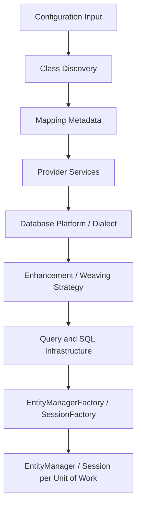
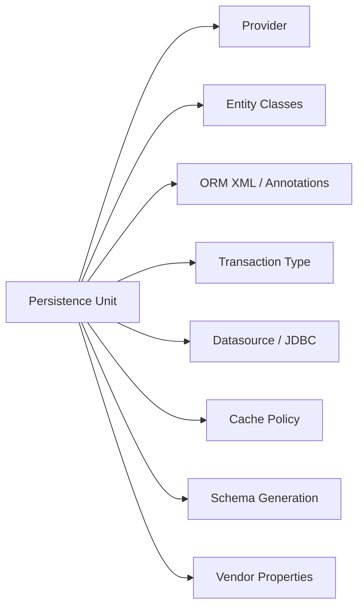
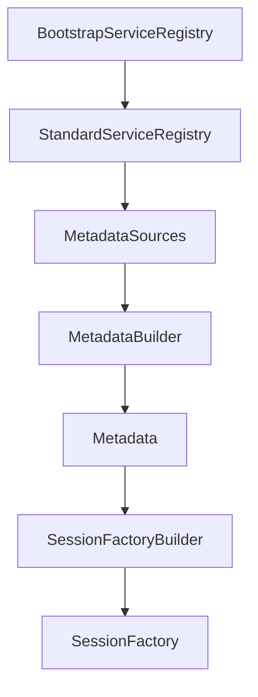
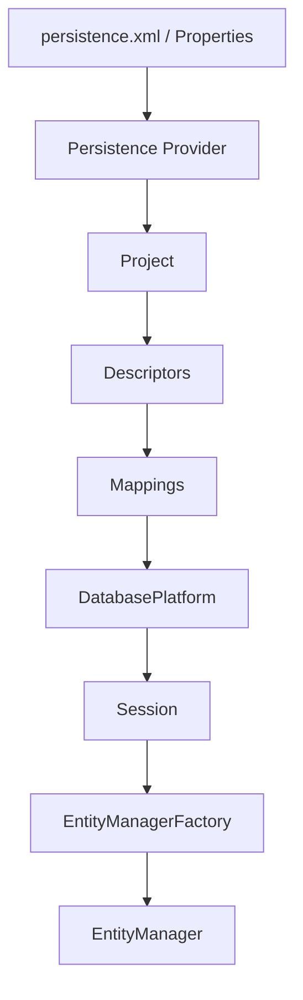
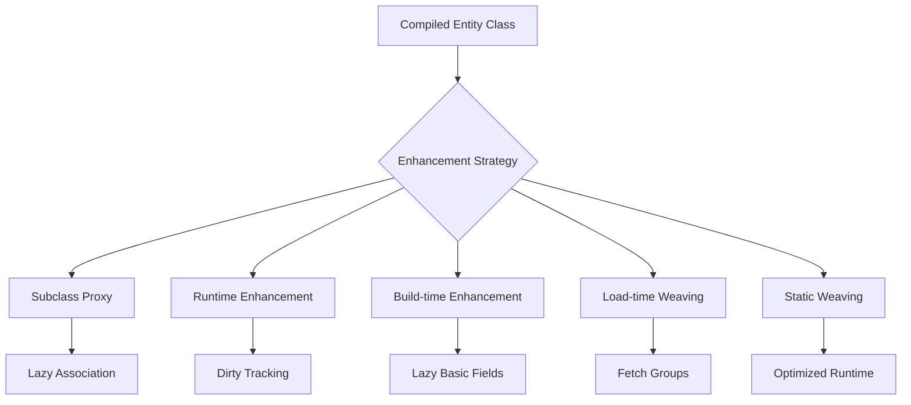

# Part 003 — Bootstrapping Deep Dive: Configuration, Metadata, Enhancement

> Target bagian ini: setelah melihat konfigurasi ORM, kamu harus bisa menjelaskan **runtime apa yang sebenarnya dibangun**, metadata apa yang dikompilasi, extension point mana yang bekerja sebelum `EntityManagerFactory`/`SessionFactory` siap, dan mengapa enhancement/weaving bisa mengubah perilaku lazy loading, dirty checking, dan performance.

Pada level basic, bootstrap ORM sering terlihat seperti detail framework:

```java
EntityManagerFactory emf = Persistence.createEntityManagerFactory("appPU");
```

atau di Spring Boot:

```properties
spring.jpa.hibernate.ddl-auto=validate
spring.jpa.show-sql=true
```

Di level provider engineering, bootstrap adalah fase kritikal. Pada fase ini provider:

1. membaca konfigurasi;
2. menemukan entity class;
3. membangun metadata mapping;
4. memilih database platform/dialect;
5. menyiapkan service runtime;
6. memvalidasi mapping;
7. menyiapkan SQL/query infrastructure;
8. menyiapkan enhancement/weaving/proxy strategy;
9. membuat factory yang akan dipakai sepanjang umur aplikasi.

Kesalahan pada fase bootstrap sering tidak terlihat sebagai error konfigurasi. Ia muncul belakangan sebagai:

- lazy loading gagal;
- entity tidak terdeteksi;
- generated SQL berbeda dari asumsi;
- DDL tidak sesuai migration;
- provider extension tidak aktif;
- classloader error di container;
- weaving tidak berjalan;
- cache aktif tanpa sadar;
- transaction integration tidak sinkron;
- memory leak saat redeploy;
- query plan cache tidak stabil karena factory dibuat ulang.

---

## 1. Mental Model: Bootstrap Bukan Membuka Koneksi Database

Bootstrap ORM bukan sekadar “connect to database”. Bootstrap adalah proses membangun **compiled persistence runtime**.



Factory yang dihasilkan bersifat mahal dan seharusnya dibuat sedikit, biasanya satu per persistence unit per aplikasi.

Secara praktis:

- `EntityManagerFactory` / `SessionFactory` adalah **runtime container** ORM.
- `EntityManager` / `Session` adalah **unit of work handle** untuk operasi aplikasi.
- Metadata mapping adalah **compiled contract** antara class Java dan schema relational.
- Enhancement/weaving adalah **modifikasi perilaku class** agar provider dapat melakukan lazy loading, change tracking, dan optimisasi lain.

Kesalahan umum engineer menengah adalah berpikir bahwa konfigurasi ORM dapat diperlakukan seperti konfigurasi library stateless. ORM tidak stateless. Ia membangun runtime state besar yang mempengaruhi seluruh lifecycle aplikasi.

---

## 2. Bootstrap Modes: Standard Jakarta vs Native Provider

Ada dua jalur besar bootstrap:

1. **Standard Jakarta Persistence bootstrap**
2. **Native provider bootstrap**

### 2.1 Standard Jakarta Persistence Bootstrap

Jalur standar memakai API Jakarta Persistence:

```java
EntityManagerFactory emf = Persistence.createEntityManagerFactory("caseManagementPU");
EntityManager em = emf.createEntityManager();
```

Input utamanya biasanya `META-INF/persistence.xml`.

Contoh sederhana:

```xml
<persistence xmlns="https://jakarta.ee/xml/ns/persistence"
             version="3.2">
    <persistence-unit name="caseManagementPU" transaction-type="RESOURCE_LOCAL">
        <provider>org.hibernate.jpa.HibernatePersistenceProvider</provider>

        <class>com.example.casework.CaseFile</class>
        <class>com.example.casework.CaseParty</class>

        <properties>
            <property name="jakarta.persistence.jdbc.url" value="jdbc:postgresql://localhost:5432/cases"/>
            <property name="jakarta.persistence.jdbc.user" value="app"/>
            <property name="jakarta.persistence.jdbc.password" value="secret"/>
            <property name="jakarta.persistence.schema-generation.database.action" value="none"/>
        </properties>
    </persistence-unit>
</persistence>
```

Karakteristik jalur standar:

- portable;
- cocok untuk aplikasi Jakarta EE;
- cocok untuk framework yang ingin menyembunyikan provider;
- extension tetap bisa dipakai lewat property vendor-specific;
- tidak semua extension point provider tersedia secara ergonomis.

### 2.2 Native Hibernate Bootstrap

Hibernate memiliki native bootstrap yang lebih eksplisit:

```java
StandardServiceRegistry registry = new StandardServiceRegistryBuilder()
        .applySetting("hibernate.connection.url", "jdbc:postgresql://localhost:5432/cases")
        .applySetting("hibernate.connection.username", "app")
        .applySetting("hibernate.connection.password", "secret")
        .applySetting("hibernate.dialect", "org.hibernate.dialect.PostgreSQLDialect")
        .build();

Metadata metadata = new MetadataSources(registry)
        .addAnnotatedClass(CaseFile.class)
        .addAnnotatedClass(CaseParty.class)
        .buildMetadata();

SessionFactory sessionFactory = metadata.buildSessionFactory();
```

Jalur ini berguna ketika kamu butuh kontrol lebih terhadap:

- service registry;
- integrator;
- type contributor;
- naming strategy;
- metadata contributor;
- interceptor;
- event listener;
- custom bootstrap logic;
- non-JPA use case.

### 2.3 Native EclipseLink Concepts

EclipseLink sering dipakai melalui Jakarta Persistence, tetapi di bawahnya ia memiliki konsep runtime sendiri:

- `Session`
- `ServerSession`
- `ClientSession`
- `UnitOfWork`
- `Project`
- `ClassDescriptor`
- `DatabasePlatform`
- `SessionCustomizer`
- `DescriptorCustomizer`

Dalam penggunaan JPA, kamu biasanya melihat `EntityManagerFactory`, tetapi EclipseLink menerjemahkannya ke session infrastructure internal.

Contoh property customizer:

```xml
<property name="eclipselink.session.customizer"
          value="com.example.persistence.CaseSessionCustomizer"/>
```

Contoh `SessionCustomizer`:

```java
public final class CaseSessionCustomizer implements SessionCustomizer {
    @Override
    public void customize(Session session) {
        session.getLogin().setShouldBindAllParameters(true);
    }
}
```

### 2.4 Rule of Thumb

Gunakan standard Jakarta bootstrap ketika:

- portability penting;
- aplikasi berjalan di Jakarta EE container;
- framework seperti Spring Boot sudah mengelola lifecycle factory;
- kamu tidak butuh extension point mendalam.

Gunakan provider-native bootstrap atau customization ketika:

- kamu membangun framework internal;
- kamu butuh instrumentation mendalam;
- kamu butuh custom type/mapping/query behavior;
- kamu harus mengontrol metadata build;
- kamu membuat test harness provider-level.

---

## 3. Anatomy of a Persistence Unit

Persistence unit adalah boundary konfigurasi ORM. Ia mendefinisikan satu dunia persistence:

- provider;
- entity set;
- datasource / connection;
- transaction strategy;
- mapping files;
- shared cache behavior;
- validation strategy;
- schema generation behavior;
- vendor-specific properties.



Aplikasi sederhana sering hanya punya satu persistence unit. Sistem enterprise bisa punya lebih dari satu, misalnya:

- operational database;
- audit database;
- reporting database;
- legacy schema;
- tenant-specific schema;
- read replica dengan mapping terbatas.

Namun banyak persistence unit bukan solusi gratis. Setiap factory punya metadata, cache, query plan, connection integration, dan lifecycle sendiri.

### 3.1 Persistence Unit Boundary Invariants

Sebuah entity class sebaiknya tidak sembarangan dipakai lintas persistence unit.

Invariants yang harus dijaga:

1. Satu entity instance managed hanya oleh satu persistence context pada satu waktu.
2. Mapping entity harus konsisten dengan schema target persistence unit.
3. Cache provider tidak boleh mencampur data dari boundary berbeda.
4. Transaction manager harus sesuai dengan datasource yang dipakai.
5. Entity graph tidak boleh diam-diam menyeberang database boundary.

### 3.2 Kapan Multiple Persistence Units Masuk Akal

Multiple persistence units masuk akal ketika ada boundary teknis nyata:

- database berbeda;
- provider berbeda;
- schema legacy berbeda;
- cache isolation wajib;
- transaction manager berbeda;
- lifecycle deployment berbeda;
- read model sengaja dipisahkan dari write model.

Multiple persistence units tidak otomatis masuk akal hanya karena:

- package entity berbeda;
- domain module berbeda;
- ingin “lebih rapi”;
- ingin menghindari desain aggregate yang jelas.

Untuk modular monolith, sering lebih baik memakai satu persistence unit dengan package/module boundary yang disiplin, lalu mengontrol akses lewat repository/service layer.

---

## 4. Hibernate Bootstrap Internals

Hibernate native bootstrap dapat dilihat sebagai pipeline:



### 4.1 BootstrapServiceRegistry

`BootstrapServiceRegistry` berisi service yang dibutuhkan sejak awal bootstrap, seperti:

- class loading;
- integrator discovery;
- strategy selection.

Pada kebanyakan aplikasi, kamu tidak menyentuhnya langsung. Tetapi pada framework internal atau integrasi advanced, ini relevan.

Contoh konseptual:

```java
BootstrapServiceRegistry bootstrapRegistry = new BootstrapServiceRegistryBuilder()
        .applyIntegrator(new CaseAuditIntegrator())
        .build();
```

### 4.2 StandardServiceRegistry

`StandardServiceRegistry` adalah registry utama untuk service Hibernate.

Ia memegang konfigurasi seperti:

- connection provider;
- transaction coordinator;
- JDBC services;
- dialect;
- type configuration;
- cache service;
- schema management;
- SQL function registry;
- strategy selectors.

Contoh:

```java
StandardServiceRegistry registry = new StandardServiceRegistryBuilder()
        .applySetting("hibernate.connection.provider_class", HikariConnectionProvider.class.getName())
        .applySetting("hibernate.dialect", "org.hibernate.dialect.PostgreSQLDialect")
        .applySetting("hibernate.jdbc.batch_size", "50")
        .applySetting("hibernate.order_inserts", "true")
        .applySetting("hibernate.order_updates", "true")
        .build();
```

Poin penting: service registry adalah tempat banyak keputusan runtime dikunci. Mengubah property setelah `SessionFactory` dibuat tidak otomatis mengubah runtime.

### 4.3 MetadataSources

`MetadataSources` adalah daftar input mapping:

- annotated class;
- package;
- mapping XML;
- resource;
- jar;
- hbm.xml legacy mapping.

Contoh:

```java
MetadataSources sources = new MetadataSources(registry)
        .addAnnotatedClass(CaseFile.class)
        .addAnnotatedClass(EvidenceDocument.class)
        .addResource("orm/case-legacy-mapping.hbm.xml");
```

### 4.4 MetadataBuilder

`MetadataBuilder` memungkinkan konfigurasi sebelum metadata final dibangun:

- implicit naming strategy;
- physical naming strategy;
- basic type registration;
- SQL function registration;
- identifier generator strategy;
- attribute converter behavior.

Contoh:

```java
Metadata metadata = sources.getMetadataBuilder()
        .applyImplicitNamingStrategy(ImplicitNamingStrategyJpaCompliantImpl.INSTANCE)
        .applyPhysicalNamingStrategy(new CasePhysicalNamingStrategy())
        .build();
```

### 4.5 Metadata

`Metadata` adalah compiled mapping model. Ia memahami:

- entity persister;
- collection persister;
- table mapping;
- column mapping;
- identifier mapping;
- inheritance strategy;
- discriminator;
- association ownership;
- cascade;
- fetch defaults;
- type mapping;
- named queries.

Setelah metadata dibangun, provider sudah punya peta object-relational lengkap.

### 4.6 SessionFactory

`SessionFactory` adalah runtime heavyweight object.

Ia menyimpan:

- metadata final;
- service registry;
- query plan cache;
- second-level cache integration;
- statistics infrastructure;
- event listener registry;
- type system;
- SQL generation infrastructure.

Prinsip production:

- buat sekali saat startup;
- tutup saat shutdown;
- jangan buat per request;
- jangan buat per test method kecuali memang test bootstrap;
- jangan buat ulang untuk mengganti property runtime yang seharusnya externalized.

---

## 5. EclipseLink Bootstrap Internals

EclipseLink memiliki vocabulary berbeda. Untuk menguasainya, jangan paksa semua konsep ke istilah Hibernate.



### 5.1 Project

`Project` adalah representasi metadata aplikasi. Ia memuat descriptor untuk class-class persistent.

Dalam JPA normal, kamu jarang membangun `Project` manual. Tetapi memahami konsep ini penting karena banyak extension EclipseLink bekerja pada descriptor/project level.

### 5.2 Descriptor

`ClassDescriptor` menjelaskan bagaimana satu class dipetakan.

Descriptor dapat berisi:

- table mapping;
- primary key mapping;
- inheritance policy;
- relationship mapping;
- cache policy;
- change tracking policy;
- query keys;
- event manager;
- additional criteria;
- fetch group behavior.

Jika Hibernate sering terasa seperti “persister + event + type system”, EclipseLink sering terasa seperti “descriptor + session + UnitOfWork”.

### 5.3 Session

EclipseLink `Session` adalah akses utama ke runtime EclipseLink.

Jenis penting:

- `DatabaseSession`
- `ServerSession`
- `ClientSession`
- `UnitOfWork`

Dalam penggunaan JPA, detail ini disembunyikan oleh `EntityManager`, tetapi error dan tuning advanced sering tetap memakai terminology session.

### 5.4 UnitOfWork

`UnitOfWork` adalah pola utama EclipseLink untuk tracking perubahan. JPA `EntityManager` di atas EclipseLink akan memakai model UnitOfWork internal.

Konsep penting:

- object yang dibaca dapat berupa clone dari shared cache;
- perubahan dikumpulkan dalam UnitOfWork;
- commit UnitOfWork menulis perubahan;
- cache behavior sangat dipengaruhi identity map dan isolation setting.

Ini berbeda rasa dengan Hibernate yang sering dijelaskan sebagai persistence context + snapshots + action queue.

### 5.5 Customizers

EclipseLink menyediakan dua customizer penting:

#### SessionCustomizer

Dipakai untuk mengubah session-level configuration.

```java
public final class CaseSessionCustomizer implements SessionCustomizer {
    @Override
    public void customize(Session session) {
        session.getLogin().setShouldBindAllParameters(true);
    }
}
```

#### DescriptorCustomizer

Dipakai untuk mengubah descriptor class tertentu.

```java
public final class CaseFileDescriptorCustomizer implements DescriptorCustomizer {
    @Override
    public void customize(ClassDescriptor descriptor) {
        descriptor.setAlias("CaseFile");
    }
}
```

Lalu dipasang:

```java
@Entity
@Customizer(CaseFileDescriptorCustomizer.class)
public class CaseFile {
    @Id
    private UUID id;
}
```

Customizer adalah extension point kuat. Tetapi ia juga menambah provider lock-in. Gunakan ketika mapping standard tidak cukup, bukan sebagai shortcut untuk menghindari desain yang jelas.

---

## 6. Configuration Sources and Precedence

Dalam aplikasi modern, konfigurasi ORM bisa datang dari banyak tempat:

- `persistence.xml`;
- `orm.xml`;
- annotation;
- environment variable;
- system property;
- framework config;
- programmatic config;
- provider defaults;
- database metadata;
- container datasource;
- build plugin enhancement config.

Masalah production sering muncul karena engineer tidak tahu property mana yang menang.

### 6.1 Configuration Precedence Principle

Prinsip aman:

1. Buat daftar eksplisit property yang dianggap contract.
2. Jangan mengandalkan default provider untuk hal critical.
3. Jangan duplikasi property di banyak layer.
4. Untuk Spring Boot, pahami mapping dari `spring.jpa.*` ke property provider.
5. Untuk Jakarta EE, pahami mana yang dikelola container dan mana yang dikelola aplikasi.

Contoh masalah:

```properties
spring.jpa.hibernate.ddl-auto=update
jakarta.persistence.schema-generation.database.action=none
```

Dua property ini berbicara tentang schema generation dari sudut berbeda. Pada real project, konfigurasi semacam ini harus dilarang lewat review/checkstyle/testing, karena membuat intent tidak jelas.

### 6.2 Recommended Configuration Style

Untuk production:

```properties
# Schema must be owned by migration tooling, not ORM auto-update.
spring.jpa.hibernate.ddl-auto=validate

# SQL logging disabled by default; use structured logging/observability in controlled environment.
spring.jpa.show-sql=false

# Hibernate provider properties.
spring.jpa.properties.hibernate.format_sql=false
spring.jpa.properties.hibernate.generate_statistics=false
spring.jpa.properties.hibernate.jdbc.batch_size=50
spring.jpa.properties.hibernate.order_inserts=true
spring.jpa.properties.hibernate.order_updates=true
```

Untuk investigation environment:

```properties
spring.jpa.properties.hibernate.generate_statistics=true
spring.jpa.properties.hibernate.session.events.log.LOG_QUERIES_SLOWER_THAN_MS=100
spring.jpa.properties.hibernate.use_sql_comments=true
```

Untuk EclipseLink:

```properties
eclipselink.logging.level=INFO
eclipselink.logging.level.sql=FINE
eclipselink.logging.parameters=true
eclipselink.ddl-generation=none
eclipselink.weaving=true
```

Catatan: property detail dapat berubah antar versi provider. Treat property sebagai API konfigurasi yang harus diverifikasi saat upgrade.

---

## 7. Annotation, XML, and Programmatic Mapping

ORM metadata dapat didefinisikan lewat:

1. annotation;
2. XML mapping;
3. programmatic customization;
4. provider extension.

### 7.1 Annotation Mapping

Annotation mapping paling umum:

```java
@Entity
@Table(name = "case_file")
public class CaseFile {
    @Id
    @Column(name = "case_id")
    private UUID id;

    @Column(name = "case_number", nullable = false, unique = true)
    private String caseNumber;
}
```

Kelebihan:

- dekat dengan domain type;
- mudah dibaca;
- IDE-friendly;
- refactoring-friendly.

Kekurangan:

- domain class terikat ke persistence annotation;
- variasi mapping per deployment sulit;
- provider-specific annotation dapat mencemari model;
- class bisa menjadi terlalu penuh metadata.

### 7.2 XML Mapping

XML mapping cocok untuk:

- legacy schema;
- externalized mapping;
- shared domain model;
- override annotation;
- provider migration experiments;
- mapping yang tidak ingin mengubah source entity.

Contoh `orm.xml`:

```xml
<entity-mappings xmlns="https://jakarta.ee/xml/ns/persistence/orm"
                 version="3.2">
    <entity class="com.example.casework.CaseFile" access="FIELD">
        <table name="case_file"/>
        <attributes>
            <id name="id">
                <column name="case_id"/>
            </id>
            <basic name="caseNumber">
                <column name="case_number" nullable="false" unique="true"/>
            </basic>
        </attributes>
    </entity>
</entity-mappings>
```

Kelemahan XML adalah drift: source code dan mapping bisa berubah tidak sinkron. Jika memakai XML, wajib ada test mapping yang kuat.

### 7.3 Programmatic Customization

Programmatic customization cocok untuk kasus khusus:

- dynamic naming;
- type contributor;
- SQL function registration;
- session/descriptor customization;
- provider event listener;
- multi-tenant infrastructure;
- instrumentation.

Namun jangan menjadikan programmatic customization sebagai tempat business rule. Ia berada di lifecycle bootstrap, bukan application workflow.

---

## 8. Class Discovery and Managed Types

Provider harus mengetahui class apa saja yang managed.

Cara discovery:

- eksplisit melalui `<class>`;
- scanning archive;
- framework scanning;
- package registration;
- native bootstrap `addAnnotatedClass`;
- generated metamodel;
- module configuration.

### 8.1 Explicit Class Registration

```xml
<persistence-unit name="casePU">
    <class>com.example.casework.CaseFile</class>
    <class>com.example.casework.CaseParty</class>
</persistence-unit>
```

Kelebihan:

- deterministic;
- cepat;
- bagus untuk aplikasi besar;
- menghindari entity tidak sengaja ikut terdaftar.

Kekurangan:

- perlu maintenance saat menambah entity.

### 8.2 Scanning

Scanning lebih convenient, terutama dengan Spring Boot.

Masalah scanning:

- entity test ikut terbaca;
- package boundary terlalu luas;
- startup lambat;
- classloader/module issue;
- entity lama tetap terdeteksi setelah refactor;
- provider-specific class tidak tersedia di environment tertentu.

### 8.3 Production Rule

Untuk sistem besar, jangan biarkan scanning menjadi black box. Minimal:

- definisikan root package yang sempit;
- validasi jumlah managed entity saat startup;
- log daftar managed entity pada debug build;
- test bahwa entity penting benar-benar managed;
- test bahwa package yang tidak boleh masuk memang tidak masuk.

Contoh diagnostic:

```java
Metamodel metamodel = entityManagerFactory.getMetamodel();
for (EntityType<?> entity : metamodel.getEntities()) {
    log.info("Managed entity: {}", entity.getJavaType().getName());
}
```

---

## 9. Naming Strategy: Logical Names vs Physical Names

Naming adalah salah satu sumber bug paling sering saat ORM bertemu schema enterprise.

Ada dua konsep:

1. **logical name** — nama konseptual dari mapping;
2. **physical name** — nama aktual di database.

Hibernate membedakan implicit naming dan physical naming.

### 9.1 Implicit Naming

Implicit naming menentukan nama ketika annotation tidak eksplisit.

```java
@Entity
public class CaseFile {
    @ManyToOne
    private RegulatoryOffice assignedOffice;
}
```

Provider harus menentukan nama join column default. Default ini bisa berbeda atau berubah antar strategi.

### 9.2 Physical Naming

Physical naming mengubah logical name menjadi nama database aktual.

Misalnya:

```txt
CaseFile        -> case_file
assignedOffice  -> assigned_office
caseNumber      -> case_number
```

### 9.3 Rule for Enterprise Systems

Untuk schema penting, jangan bergantung penuh pada implicit naming.

Gunakan eksplisit untuk:

- table name;
- primary key column;
- foreign key column;
- join table;
- unique constraint;
- index;
- discriminator column;
- sequence name;
- version column.

Contoh:

```java
@Entity
@Table(
    name = "case_file",
    uniqueConstraints = @UniqueConstraint(
        name = "uk_case_file_case_number",
        columnNames = "case_number"
    )
)
public class CaseFile {
    @Id
    @Column(name = "case_id", nullable = false)
    private UUID id;

    @Column(name = "case_number", nullable = false, length = 64)
    private String caseNumber;
}
```

Implicit naming masih berguna untuk prototype atau internal tools, tetapi production schema adalah contract. Contract sebaiknya eksplisit.

---

## 10. Database Platform, Dialect, and SQL Capability Model

ORM tidak menghasilkan SQL generik. ORM menghasilkan SQL berdasarkan database platform/dialect.

Dialect/platform mempengaruhi:

- pagination syntax;
- sequence support;
- identity column support;
- locking syntax;
- boolean mapping;
- timestamp precision;
- generated columns;
- JSON support;
- array support;
- CTE support;
- function rendering;
- limit/offset;
- batch behavior;
- DDL generation.

### 10.1 Hibernate Dialect

Hibernate memakai dialect untuk memilih SQL rendering dan capability.

Contoh eksplisit:

```properties
hibernate.dialect=org.hibernate.dialect.PostgreSQLDialect
```

Banyak setup modern bisa melakukan dialect detection dari JDBC metadata. Tetapi untuk sistem production, explicitness sering lebih defensible, terutama ketika:

- database berada di balik proxy;
- JDBC metadata tidak akurat;
- cloud vendor punya compatibility mode;
- integration test memakai database berbeda;
- upgrade provider mengubah auto-detection.

### 10.2 EclipseLink DatabasePlatform

EclipseLink memakai `DatabasePlatform`.

Contoh property:

```properties
eclipselink.target-database=PostgreSQL
```

Atau provider dapat mendeteksi platform.

### 10.3 Capability Model

Engineer top-level tidak bertanya “apakah ORM bisa?”. Ia bertanya:

- capability database apa yang tersedia?
- apakah provider tahu capability itu?
- apakah mapping/query memakai capability tersebut secara aman?
- apakah fallback provider akan mengubah performance?
- apakah test environment punya capability sama?

Contoh: pagination query pada PostgreSQL, Oracle, SQL Server, dan DB2 bisa berbeda. Jika test hanya memakai H2, behavior production tidak tervalidasi.

---

## 11. Transaction Integration at Bootstrap

Transaction strategy ditentukan saat bootstrap.

Ada dua model besar:

1. `RESOURCE_LOCAL`
2. `JTA`

### 11.1 RESOURCE_LOCAL

Aplikasi mengelola transaksi sendiri:

```java
EntityTransaction tx = em.getTransaction();
tx.begin();
try {
    em.persist(caseFile);
    tx.commit();
} catch (RuntimeException e) {
    tx.rollback();
    throw e;
}
```

Cocok untuk:

- aplikasi Java SE;
- simple service;
- test harness;
- non-container runtime;
- tool/migration utility.

### 11.2 JTA

Container/framework mengelola transaksi:

```java
@Transactional
public void submitCase(UUID caseId) {
    CaseFile caseFile = caseRepository.getReference(caseId);
    caseFile.submit();
}
```

Cocok untuk:

- Jakarta EE;
- Spring transaction management;
- distributed transaction scenario terbatas;
- datasource dikelola container.

### 11.3 Bootstrap Risk

Kesalahan transaction integration dapat menghasilkan:

- entity manager tidak bound ke transaction;
- flush tidak terjadi saat diharapkan;
- lazy loading terjadi di luar transaction;
- connection leak;
- nested transaction salah paham;
- rollback tidak membersihkan persistence context sesuai ekspektasi;
- read-only transaction tetap melakukan dirty checking.

Rule: transaction boundary adalah bagian dari ORM design, bukan hanya annotation service layer.

---

## 12. Bytecode Enhancement and Weaving: Why It Exists

ORM perlu menambahkan perilaku ke class entity tanpa kamu menulisnya manual.

Kebutuhan provider:

- lazy loading association;
- lazy loading basic field;
- dirty tracking;
- bidirectional association management;
- fetch group;
- change tracking;
- proxy/interception;
- internal optimization.

Ada beberapa teknik:

1. subclass proxy;
2. runtime bytecode enhancement;
3. build-time bytecode enhancement;
4. load-time weaving;
5. static weaving.



### 12.1 Proxy-Based Lazy Loading

Classic lazy loading sering memakai proxy subclass.

Misalnya:

```java
CaseFile caseFile = em.getReference(CaseFile.class, caseId);
```

Object yang dikembalikan bisa bukan instance concrete biasa, melainkan proxy yang mewakili entity sampai state dibutuhkan.

Masalah proxy:

- `getClass()` bisa mengejutkan;
- `equals`/`hashCode` bisa rusak;
- final class/method bermasalah;
- serialization boundary bermasalah;
- akses di luar persistence context gagal;
- debugging membingungkan.

### 12.2 Field Interception

Provider dapat mengintercept akses field untuk lazy basic attribute atau dirty tracking.

Contoh kasus:

```java
@Basic(fetch = FetchType.LAZY)
@Column(name = "large_payload")
private String largePayload;
```

Tanpa enhancement/weaving, lazy basic sering tidak efektif atau tidak didukung sesuai harapan. Provider perlu mekanisme untuk mengetahui kapan field diakses.

### 12.3 Dirty Tracking Enhancement

Tanpa enhancement, provider biasanya membandingkan snapshot lama dan state baru saat flush.

Dengan dirty tracking enhancement, entity bisa menandai field yang berubah saat setter dipanggil atau field diubah.

Trade-off:

| Approach | Kelebihan | Risiko |
|---|---|---|
| Snapshot dirty checking | Simpler, tidak perlu enhancement | Mahal untuk banyak entity/field |
| Enhanced dirty tracking | Lebih presisi dan cepat | Build/runtime config harus benar |
| EclipseLink attribute change tracking | Efisien bila weaving aktif | Weaving failure bisa mengubah behavior |

---

## 13. Hibernate Bytecode Enhancement

Hibernate mendukung bytecode enhancement untuk beberapa kemampuan:

- lazy attribute loading;
- dirty tracking;
- association management;
- optimized persistence context behavior.

### 13.1 Build-Time Enhancement

Build-time enhancement dilakukan saat build Maven/Gradle.

Contoh konseptual Maven:

```xml
<plugin>
    <groupId>org.hibernate.orm.tooling</groupId>
    <artifactId>hibernate-enhance-maven-plugin</artifactId>
    <version>${hibernate.version}</version>
    <executions>
        <execution>
            <configuration>
                <enableLazyInitialization>true</enableLazyInitialization>
                <enableDirtyTracking>true</enableDirtyTracking>
                <enableAssociationManagement>true</enableAssociationManagement>
            </configuration>
            <goals>
                <goal>enhance</goal>
            </goals>
        </execution>
    </executions>
</plugin>
```

### 13.2 Runtime Enhancement

Runtime enhancement lebih fleksibel tetapi bergantung classloading/instrumentation. Dalam container modern, build-time enhancement sering lebih deterministic.

### 13.3 Hibernate Enhancement Checklist

Gunakan checklist ini:

1. Apakah entity class final?
2. Apakah getter/setter final?
3. Apakah build plugin berjalan di CI?
4. Apakah test menjalankan class hasil enhancement yang sama dengan production artifact?
5. Apakah lazy basic field benar-benar lazy di SQL log?
6. Apakah dirty tracking metrics berubah sesuai ekspektasi?
7. Apakah framework seperti Lombok/records/Kotlin mengganggu proxy/enhancement?
8. Apakah native image/AOT environment mendukung mekanisme ini?

### 13.4 Failure Mode

Jika enhancement tidak aktif, aplikasi belum tentu gagal startup. Yang berubah bisa subtle:

- field lazy dimuat eagerly;
- dirty checking lebih mahal;
- association management otomatis tidak bekerja;
- performance turun tanpa error eksplisit;
- query count berubah;
- memory pressure meningkat.

Karena itu enhancement harus diuji sebagai behavior, bukan diasumsikan aktif.

---

## 14. EclipseLink Weaving

EclipseLink memakai istilah **weaving**.

Weaving dapat mendukung:

- lazy loading;
- change tracking;
- fetch groups;
- internal optimization;
- indirection;
- relationship maintenance.

Mode weaving:

1. dynamic weaving;
2. static weaving;
3. disabled weaving.

### 14.1 Dynamic Weaving

Dynamic weaving terjadi saat class dimuat, biasanya memakai Java agent atau container support.

Property umum:

```properties
eclipselink.weaving=true
```

Masalah dynamic weaving:

- tidak selalu tersedia di Java SE tanpa agent;
- class sudah ter-load sebelum weaving;
- module path/classloader membatasi instrumentation;
- container config berbeda antara local dan production.

### 14.2 Static Weaving

Static weaving dilakukan saat build. Ini lebih deterministic untuk deployment yang classloading-nya ketat.

Static weaving cocok jika:

- runtime instrumentation sulit;
- startup determinism penting;
- container tidak memberikan weaving;
- ingin mengurangi kejutan deployment.

### 14.3 EclipseLink Change Tracking Policies

EclipseLink memiliki beberapa strategi change tracking, seperti:

- deferred change detection;
- object change tracking;
- attribute change tracking.

Weaving sangat relevan untuk tracking yang efisien.

### 14.4 EclipseLink Weaving Checklist

1. Apakah weaving benar-benar aktif di environment target?
2. Apakah log startup menunjukkan weaving status?
3. Apakah lazy relationship bekerja sesuai ekspektasi?
4. Apakah change tracking policy sesuai volume data?
5. Apakah class sudah dimuat sebelum weaving?
6. Apakah static weaving masuk ke artifact final?
7. Apakah test artifact sama dengan production artifact?
8. Apakah provider-specific annotation butuh weaving?

---

## 15. Spring Boot Integration: Useful Abstraction, Dangerous Blind Spot

Spring Boot mempermudah bootstrap JPA, tetapi juga bisa menyembunyikan detail yang harus dipahami.

Spring Boot biasanya membangun:

- datasource;
- vendor adapter;
- `LocalContainerEntityManagerFactoryBean`;
- transaction manager;
- repository proxy;
- exception translation;
- Open EntityManager in View behavior jika aktif.

### 15.1 What Spring Boot Does Not Remove

Spring Boot tidak menghapus kebutuhan memahami:

- persistence context;
- flush;
- lazy loading;
- transaction boundary;
- generated SQL;
- mapping correctness;
- provider-specific configuration;
- cache invalidation;
- bytecode enhancement/weaving.

Spring Boot hanya mengelola wiring.

### 15.2 Dangerous Defaults

Yang wajib dicek di project production:

```properties
spring.jpa.open-in-view=false
spring.jpa.hibernate.ddl-auto=validate
spring.jpa.show-sql=false
```

`open-in-view=true` sering membuat lazy loading tampak “berhasil”, tetapi sebenarnya memindahkan query ke serialization/view boundary. Ini membuat query count sulit dikontrol dan transaction semantics kabur.

### 15.3 Recommended Startup Diagnostics

Tambahkan startup diagnostic non-invasive:

```java
@Component
class JpaStartupDiagnostics implements ApplicationRunner {
    private final EntityManagerFactory emf;

    JpaStartupDiagnostics(EntityManagerFactory emf) {
        this.emf = emf;
    }

    @Override
    public void run(ApplicationArguments args) {
        Metamodel metamodel = emf.getMetamodel();
        log.info("JPA managed entities: {}", metamodel.getEntities().size());
    }
}
```

Pada environment non-production, kamu bisa log entity names dan provider properties yang penting.

---

## 16. ClassLoader, Module Path, and Container Boundaries

ORM provider sangat sensitif terhadap classloading.

Masalah umum:

- entity class ada di module yang tidak dibuka untuk reflection;
- provider tidak bisa membuat proxy karena visibility;
- weaving gagal karena class sudah dimuat;
- multiple provider versions ada di classpath;
- Jakarta namespace conflict dengan legacy `javax.persistence`;
- application server menyediakan provider berbeda dari dependency aplikasi;
- test runtime berbeda dengan production runtime.

### 16.1 JPMS and Reflection

Jika memakai Java Platform Module System, entity package mungkin perlu `opens`:

```java
module com.example.casework {
    requires jakarta.persistence;
    requires org.hibernate.orm.core;

    opens com.example.casework.domain to org.hibernate.orm.core;
}
```

Tanpa `opens`, provider bisa gagal mengakses field/constructor secara reflective.

### 16.2 Jakarta vs Javax Namespace

Jakarta Persistence modern memakai `jakarta.persistence.*`, bukan `javax.persistence.*`.

Mixing keduanya adalah sumber error migrasi:

```java
import jakarta.persistence.Entity; // modern
```

bukan:

```java
import javax.persistence.Entity; // legacy
```

Jika class memakai annotation legacy tetapi provider modern membaca Jakarta annotation, entity bisa tidak terdeteksi.

---

## 17. Schema Generation at Bootstrap

ORM bisa menghasilkan atau memvalidasi schema. Tetapi production-grade system biasanya memakai migration tool seperti Flyway/Liquibase untuk perubahan schema.

Mode umum:

- none;
- validate;
- create;
- drop-and-create;
- update/provider-specific.

### 17.1 Production Rule

Untuk production:

```properties
hibernate.hbm2ddl.auto=validate
```

atau property Jakarta schema generation yang setara untuk validasi/none.

Hindari `update` di production karena:

- tidak cukup aman untuk rename;
- tidak memahami intent migration;
- tidak membuat backfill data;
- tidak mengelola zero-downtime deployment;
- bisa membuat schema drift;
- provider behavior bisa berubah saat upgrade.

### 17.2 Validation Is Not Full Compatibility Proof

`validate` membantu memastikan table/column dasar ada dan type relatif sesuai, tetapi tidak membuktikan:

- index cukup;
- constraint lengkap;
- trigger benar;
- partitioning benar;
- grants benar;
- collation benar;
- execution plan aman;
- production data distribution cocok.

Jadi schema validation adalah guardrail, bukan bukti readiness.

---

## 18. Provider Extension Points During Bootstrap

### 18.1 Hibernate Extension Points

Penting untuk diketahui:

| Extension Point | Waktu | Fungsi |
|---|---:|---|
| `Integrator` | Bootstrap | Registrasi event listener/service integration |
| `TypeContributor` | Metadata build | Tambah custom type |
| `MetadataBuilderContributor` | Metadata build | Ubah metadata builder, function, type |
| `PhysicalNamingStrategy` | Metadata build | Nama fisik database |
| `ImplicitNamingStrategy` | Metadata build | Nama default logical |
| `StatementInspector` | Runtime SQL | Inspect/modify SQL statement |
| Event listeners | Runtime | Intercept persist/update/delete/load lifecycle |

Contoh `MetadataBuilderContributor`:

```java
public final class CaseMetadataContributor implements MetadataBuilderContributor {
    @Override
    public void contribute(MetadataBuilder metadataBuilder) {
        metadataBuilder.applySqlFunction(
                "case_normalize",
                new StandardSQLFunction("case_normalize", StandardBasicTypes.STRING)
        );
    }
}
```

### 18.2 EclipseLink Extension Points

| Extension Point | Waktu | Fungsi |
|---|---:|---|
| `SessionCustomizer` | Session creation | Ubah session/login/platform behavior |
| `DescriptorCustomizer` | Descriptor build | Ubah mapping/cache/query descriptor |
| Session event listener | Runtime | Observe session events |
| Descriptor event listener | Runtime | Observe object lifecycle |
| Converter | Mapping | Custom conversion |
| DatabasePlatform customization | Bootstrap/runtime | SQL/platform-specific behavior |

Contoh descriptor customizer cocok untuk mapping yang tidak bisa diekspresikan dengan annotation standar.

### 18.3 Rule: Extension Point Should Have Ownership

Setiap extension point harus punya:

- alasan bisnis/teknis;
- owner;
- test;
- dokumentasi ADR;
- migration risk note;
- fallback plan.

Provider extension tanpa ownership akan menjadi technical debt yang sangat mahal saat upgrade.

---

## 19. Bootstrap Validation Checklist

Gunakan checklist ini di project serius.

### 19.1 Entity Discovery

- Apakah semua entity penting terdaftar?
- Apakah tidak ada entity dari package test/legacy yang ikut?
- Apakah annotation memakai `jakarta.persistence`, bukan legacy `javax.persistence`?
- Apakah entity punya no-arg constructor yang valid untuk provider?
- Apakah visibility class/field cocok dengan reflection/proxy?

### 19.2 Mapping Metadata

- Apakah table/column eksplisit untuk contract penting?
- Apakah FK/unique/index name eksplisit?
- Apakah sequence/generator name eksplisit?
- Apakah enum mapping aman terhadap rename/reorder?
- Apakah inheritance strategy disengaja?
- Apakah association ownership benar?

### 19.3 Provider Configuration

- Apakah dialect/platform eksplisit atau auto-detection tervalidasi?
- Apakah DDL auto-update dimatikan?
- Apakah batch size disengaja?
- Apakah second-level/shared cache disengaja?
- Apakah SQL logging sesuai environment?
- Apakah statistics/profiler hanya aktif bila dibutuhkan?

### 19.4 Enhancement/Weaving

- Apakah enhancement/weaving aktif sesuai desain?
- Apakah artifact test dan production sama-sama enhanced/woven?
- Apakah lazy basic field benar-benar lazy?
- Apakah dirty tracking behavior tervalidasi?
- Apakah classloader/module setting mendukung?

### 19.5 Transaction Integration

- Apakah transaction type sesuai runtime?
- Apakah transaction manager benar?
- Apakah datasource benar?
- Apakah read-only transaction behavior dipahami?
- Apakah rollback semantics diuji?

---

## 20. Bootstrap Failure Modes

### 20.1 Entity Not Managed

Gejala:

```txt
Not an entity: com.example.CaseFile
```

Penyebab:

- package tidak discan;
- annotation salah namespace;
- class tidak masuk artifact;
- module tidak terbuka;
- persistence unit salah;
- provider berbeda.

Fix:

- verifikasi managed types;
- periksa import annotation;
- buat mapping discovery test;
- explicit class registration untuk area kritikal.

### 20.2 Wrong Dialect or Platform

Gejala:

- SQL invalid;
- pagination salah;
- sequence error;
- lock syntax error;
- type mapping aneh.

Penyebab:

- auto-detection salah;
- database compatibility mode;
- test DB berbeda;
- dependency JDBC driver salah.

Fix:

- set dialect/platform eksplisit;
- gunakan Testcontainers database yang sama;
- test query kritikal.

### 20.3 Weaving/Enhancement Not Active

Gejala:

- lazy basic tidak lazy;
- change tracking mahal;
- provider warning;
- performance berubah antara local dan production.

Fix:

- aktifkan build-time enhancement/static weaving;
- cek log startup;
- buat behavior test untuk lazy field;
- pastikan CI memakai artifact final.

### 20.4 Conflicting Providers

Gejala:

- property Hibernate tidak bekerja;
- annotation extension diabaikan;
- provider class mismatch;
- behavior berbeda di server.

Penyebab:

- application server menyediakan provider default;
- dependency membawa provider transitive;
- `persistence.xml` tidak menentukan provider;
- Spring Boot auto-configuration memilih provider lain.

Fix:

- deklarasikan provider eksplisit;
- audit dependency tree;
- log provider name/version saat startup.

Contoh diagnostic:

```java
Map<String, Object> properties = emf.getProperties();
properties.forEach((key, value) -> {
    if (key.toLowerCase(Locale.ROOT).contains("hibernate")
            || key.toLowerCase(Locale.ROOT).contains("eclipselink")) {
        log.debug("JPA property {}={}", key, value);
    }
});
```

---

## 21. Test Harness for Bootstrap Correctness

Jangan tunggu production untuk tahu bootstrap salah.

### 21.1 Minimal Bootstrap Test

```java
@Test
void shouldBootstrapPersistenceUnit() {
    EntityManagerFactory emf = Persistence.createEntityManagerFactory("caseManagementPU");
    assertNotNull(emf);
    emf.close();
}
```

Ini terlalu minimal, tetapi masih berguna untuk mendeteksi error fatal.

### 21.2 Managed Entity Test

```java
@Test
void shouldRegisterExpectedEntities() {
    Set<Class<?>> entities = emf.getMetamodel().getEntities().stream()
            .map(EntityType::getJavaType)
            .collect(Collectors.toSet());

    assertTrue(entities.contains(CaseFile.class));
    assertTrue(entities.contains(CaseParty.class));
    assertFalse(entities.contains(TestOnlyEntity.class));
}
```

### 21.3 Schema Validation Test

Jalankan provider terhadap database nyata via Testcontainers:

```java
@Testcontainers
class JpaSchemaValidationTest {
    @Container
    static PostgreSQLContainer<?> postgres = new PostgreSQLContainer<>("postgres:16");

    @Test
    void shouldValidateMappingsAgainstMigratedSchema() {
        runFlywayMigrations(postgres);
        EntityManagerFactory emf = createEntityManagerFactoryWithValidate(postgres);
        emf.close();
    }
}
```

### 21.4 Enhancement Behavior Test

Contoh ide test:

1. load entity tanpa field besar;
2. pastikan SQL tidak mengambil column besar jika lazy basic didukung;
3. akses field;
4. pastikan SQL tambahan muncul;
5. jika SQL awal sudah mengambil field, enhancement/lazy basic tidak bekerja seperti asumsi.

---

## 22. Production Startup Observability

Startup ORM harus observable.

Log minimal yang berguna:

- provider name/version;
- persistence unit name;
- database product/version;
- dialect/platform;
- managed entity count;
- DDL mode;
- batch size;
- cache enabled/disabled;
- enhancement/weaving status jika tersedia;
- transaction integration;
- slow query/logging setting.

Contoh structured log:

```json
{
  "event": "orm_startup",
  "provider": "Hibernate ORM",
  "persistenceUnit": "caseManagementPU",
  "database": "PostgreSQL",
  "managedEntityCount": 42,
  "ddlMode": "validate",
  "batchSize": 50,
  "secondLevelCache": false
}
```

Tujuannya bukan membocorkan secret, tetapi membuat runtime contract terlihat.

---

## 23. Practical Exercise: Predict the Bootstrap Runtime

Ambil konfigurasi berikut:

```properties
spring.jpa.hibernate.ddl-auto=validate
spring.jpa.properties.hibernate.jdbc.batch_size=50
spring.jpa.properties.hibernate.order_inserts=true
spring.jpa.properties.hibernate.default_batch_fetch_size=32
spring.jpa.open-in-view=true
```

Pertanyaan:

1. Siapa yang membangun `EntityManagerFactory`?
2. Provider apa yang dipakai?
3. Apakah schema akan dibuat otomatis?
4. Apakah batching insert selalu aktif?
5. Apa risiko `open-in-view=true`?
6. Apakah `default_batch_fetch_size` menyelesaikan semua N+1?
7. Apakah setting ini cukup untuk menjamin SQL optimal?

Jawaban yang diharapkan:

1. Spring Boot melalui auto-configuration dan factory bean.
2. Bergantung dependency/provider; biasanya Hibernate jika dependency Spring Data JPA default.
3. Tidak, mode `validate` hanya validasi.
4. Tidak selalu; identity generator, flush pattern, dan SQL shape bisa membatasi batching.
5. Lazy loading bisa terjadi di web/serialization boundary, query count sulit dikendalikan.
6. Tidak; ia mitigasi pola tertentu, bukan pengganti fetch plan eksplisit.
7. Tidak; perlu mapping, transaction, fetch plan, query shape, index, dan execution plan.

---

## 24. Mental Compression

Ingat model ringkas ini:

```txt
Configuration is input.
Metadata is compiled mapping.
Factory is provider runtime.
EntityManager/Session is unit-of-work handle.
Enhancement/weaving changes entity behavior.
Bootstrap mistakes become runtime mysteries.
```

Atau dalam bentuk pipeline:

```txt
persistence.xml/properties/annotations
        ↓
provider bootstrap
        ↓
metadata + services + platform
        ↓
enhancement/weaving/proxy strategy
        ↓
EntityManagerFactory / SessionFactory
        ↓
per-transaction EntityManager / Session
```

---

## 25. What Good Looks Like

Dalam sistem enterprise yang sehat:

- provider dipilih eksplisit;
- versi provider diketahui;
- persistence unit boundary jelas;
- entity discovery deterministic;
- schema generation production tidak destructive;
- dialect/platform sesuai database nyata;
- enhancement/weaving diuji;
- transaction integration jelas;
- provider extension terdokumentasi;
- startup diagnostics tersedia;
- bootstrap test berjalan di CI;
- migration tool, ORM validation, dan runtime database selaras.

Engineer yang kuat tidak hanya bertanya “aplikasi jalan atau tidak”. Ia bertanya:

> Runtime persistence seperti apa yang baru saja kita bangun, dan invariants apa yang sekarang harus benar selama aplikasi hidup?

---

## References

- Hibernate ORM Documentation: https://hibernate.org/orm/documentation/
- Hibernate ORM User Guide: https://docs.hibernate.org/stable/orm/userguide/html_single/
- Jakarta Persistence 3.2 Specification: https://jakarta.ee/specifications/persistence/3.2/jakarta-persistence-spec-3.2
- Jakarta Persistence 3.2 API: https://jakarta.ee/specifications/persistence/3.2/apidocs/
- EclipseLink Documentation: https://eclipse.dev/eclipselink/documentation/
- EclipseLink JPA Extensions: https://eclipse.dev/eclipselink/documentation/4.0/jpa/extensions/jpa-extensions.html
- EclipseLink Weaving Concepts: https://docs.oracle.com/middleware/12213/toplink/concepts/app_dev.htm
