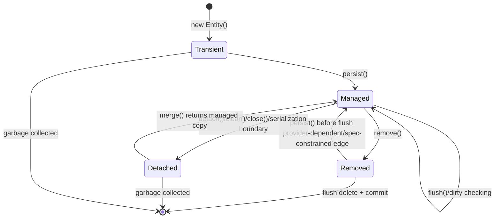
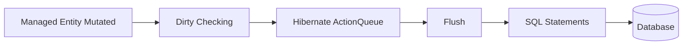
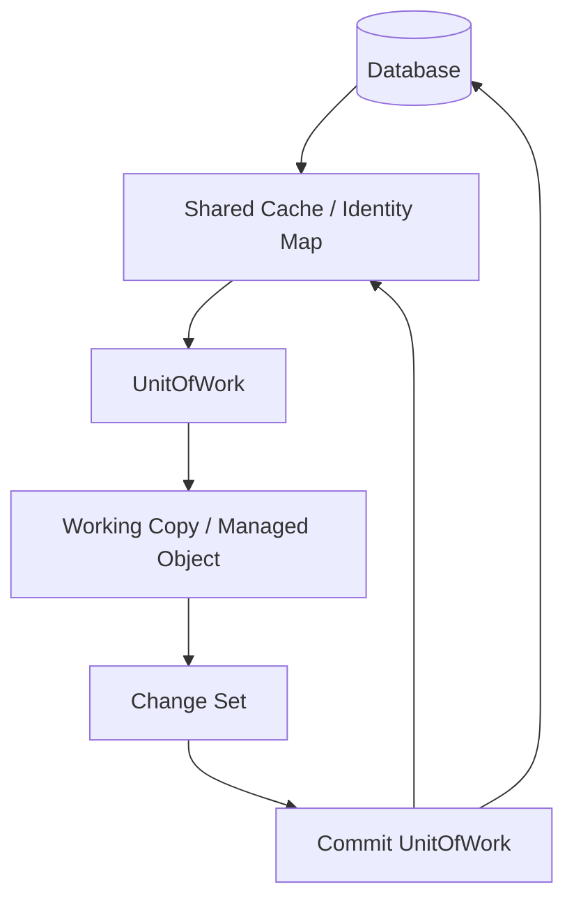
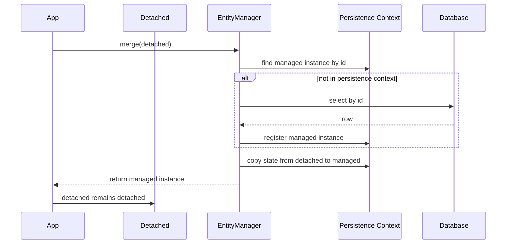
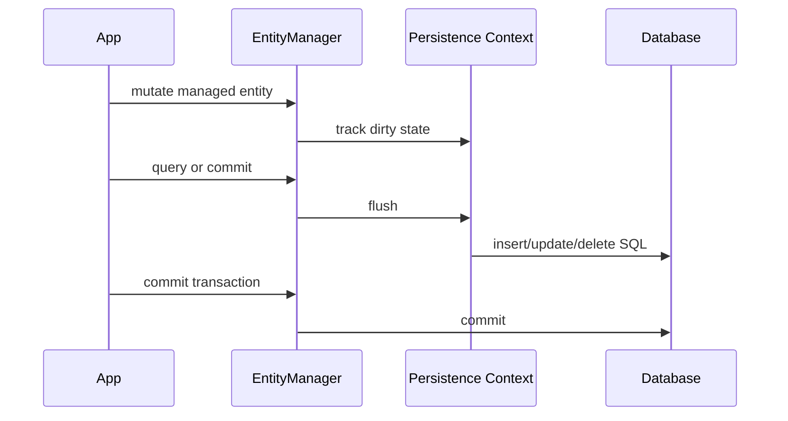
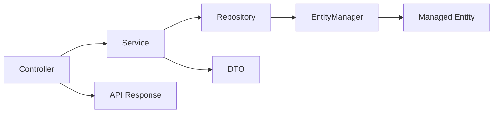

# Part 004 — Entity State Machine Beyond Basics

> Target bagian ini: kamu harus bisa melihat sebuah object Java dan menjawab: **apakah ia transient, managed, detached, removed, proxy, read-only, atau clone UnitOfWork; persistence context mana yang memilikinya; operasi apa yang legal; SQL apa yang mungkin muncul saat flush; dan bug apa yang akan terjadi jika state-nya salah dipahami.**

Entity lifecycle adalah inti ORM. Banyak bug Hibernate/EclipseLink bukan karena annotation salah, tetapi karena engineer salah membaca state object.

Contoh sederhana:

```java
CaseFile caseFile = repository.findById(id).orElseThrow();
caseFile.submit();
```

Pertanyaan yang harus bisa dijawab:

- Apakah `caseFile` managed?
- Transaction mana yang aktif?
- Apakah perubahan `submit()` akan otomatis di-flush?
- Apakah object ini proxy?
- Apakah field lazy sudah initialized?
- Apakah object ini berasal dari persistence context yang masih hidup?
- Apa yang terjadi jika object ini dikirim ke layer lain dan diubah di luar transaction?
- Apa bedanya jika ini Hibernate vs EclipseLink?

Kalau pertanyaan ini tidak jelas, aplikasi akan mudah terkena bug seperti:

- update tidak tersimpan;
- update tersimpan tanpa explicit save;
- `LazyInitializationException`;
- stale data;
- duplicate identity;
- optimistic lock conflict;
- delete tidak terjadi;
- merge menimpa data baru;
- JSON serialization memicu query;
- equals/hashCode rusak karena proxy.

---

## 1. Core Model: Entity State Is Relative to a Persistence Context

State entity tidak melekat absolut pada object. State entity selalu relatif terhadap persistence context tertentu.

Object yang sama bisa:

- managed di persistence context A;
- detached dari perspective persistence context B;
- transient jika belum pernah punya identity persistent;
- removed di context yang sama;
- stale dibanding database;
- proxy yang belum initialized;
- read-only menurut provider/session;
- clone UnitOfWork dalam EclipseLink.

Mental model:

```txt
Java object + persistence context + provider runtime + transaction boundary = effective entity state
```

Jangan bertanya hanya:

> Entity ini sudah disimpan belum?

Tanya:

> Entity instance ini sedang dimiliki persistence context mana, pada transaction apa, dengan identity apa, dan provider akan melakukan apa saat flush?

---

## 2. Canonical Jakarta Persistence States

Jakarta Persistence mengenal state utama:

1. **new/transient**
2. **managed/persistent**
3. **detached**
4. **removed**



Namun provider-level reality menambah kategori operasional:

- proxy reference;
- enhanced entity;
- read-only entity;
- deleted scheduled entity;
- stale managed entity;
- partially loaded entity;
- EclipseLink clone;
- Hibernate bytecode-intercepted entity;
- entity loaded in extended persistence context;
- entity associated with closed session.

---

## 3. Transient State

Transient entity adalah object Java biasa yang belum associated dengan persistence context dan belum punya persistent identity yang diakui provider.

Contoh:

```java
CaseFile caseFile = new CaseFile();
caseFile.assignCaseNumber("CASE-2026-0001");
```

Pada titik ini:

- tidak ada row database;
- tidak ada dirty checking;
- tidak ada first-level cache identity;
- tidak ada flush behavior;
- provider tidak tahu object ini ada;
- perubahan field hanya perubahan Java object biasa.

### 3.1 Transient with Assigned ID

Jika ID diisi manual:

```java
CaseFile caseFile = new CaseFile();
caseFile.setId(existingId);
```

Object ini belum otomatis managed. Memiliki ID bukan berarti managed.

Kesalahan umum:

```java
CaseFile caseFile = new CaseFile();
caseFile.setId(id);
caseFile.submit();
// Tidak ada SQL update hanya karena id diisi.
```

Untuk membuat provider melacaknya, harus ada operasi seperti:

- `persist` untuk entity baru;
- `merge` untuk detached graph;
- `find` lalu mutate managed instance;
- `getReference` lalu mutate reference managed/proxy.

### 3.2 Persisting Transient Entity

```java
em.persist(caseFile);
```

Setelah `persist`:

- entity menjadi managed;
- insert dijadwalkan;
- SQL belum tentu langsung dieksekusi;
- identifier bisa tersedia langsung atau setelah insert tergantung strategy;
- cascade persist dapat menjangkau graph.

Important: `persist` bukan “insert sekarang”. `persist` adalah “jadikan managed dan jadwalkan insert sesuai flush semantics”.

---

## 4. Managed State

Managed entity adalah entity yang berada di dalam persistence context.

Karakteristik:

- provider menjaga identity map;
- perubahan field dapat dideteksi;
- flush akan menyinkronkan perubahan ke database;
- association lazy dapat di-load selama context valid;
- lifecycle callback dapat dijalankan;
- optimistic version dapat dicek saat flush/commit;
- entity bisa stale terhadap database jika data berubah di luar context.

Contoh:

```java
@Transactional
public void assignOfficer(UUID caseId, UUID officerId) {
    CaseFile caseFile = em.find(CaseFile.class, caseId);
    Officer officer = em.getReference(Officer.class, officerId);

    caseFile.assignTo(officer);
}
```

Tidak ada `save` eksplisit. Jika `caseFile` managed dan transaction commit, provider akan flush perubahan.

### 4.1 Managed Does Not Mean Fresh

Managed berarti dilacak persistence context, bukan selalu fresh dari database.

Contoh:

```java
CaseFile caseFile = em.find(CaseFile.class, id);
externalSystemUpdatesSameRow(id);
caseFile.getStatus(); // bisa stale
```

Persistence context memberi repeatable object identity, bukan automatic database refresh setiap akses.

Jika perlu sinkronisasi:

```java
em.refresh(caseFile);
```

Tetapi `refresh` punya konsekuensi: perubahan lokal yang belum flush bisa hilang atau overwritten sesuai provider/operation semantics.

### 4.2 Managed Does Not Mean Transactionally Safe Forever

Managed entity tanpa transaction aktif bisa berbahaya.

Misalnya extended persistence context atau Open Session in View dapat membuat entity masih associated, tetapi mutation timing dan flush boundary menjadi kabur.

Rule:

> Mutasi entity yang bermakna bisnis harus terjadi di transaction boundary yang eksplisit.

---

## 5. Detached State

Detached entity adalah entity yang pernah persistent/managed, tetapi tidak lagi associated dengan persistence context aktif.

Penyebab:

- `em.detach(entity)`;
- `em.clear()`;
- `em.close()`;
- transaction/request selesai pada transaction-scoped context;
- serialization/deserialization;
- entity dikirim ke client;
- mapping ke DTO lalu balik menjadi entity-like object;
- cache/application memory menyimpan entity.

Contoh:

```java
CaseFile caseFile;

try (EntityManager em = emf.createEntityManager()) {
    caseFile = em.find(CaseFile.class, id);
}

caseFile.submit(); // Detached mutation. Provider tidak tahu.
```

Perubahan detached tidak otomatis disimpan.

### 5.1 Detached Graph Hazard

Detached graph sering terlihat convenient:

```java
CaseFile detached = apiRequest.toEntity();
em.merge(detached);
```

Tetapi ini berbahaya karena:

- graph mungkin partial;
- null field bisa menimpa data;
- collection replacement bisa memicu delete/insert besar;
- stale version bisa conflict;
- lazy field tidak initialized;
- association identity bisa ambigu;
- client dapat mengubah field yang tidak seharusnya.

### 5.2 Recommended Pattern

Untuk command/update workflow, lebih aman:

```java
@Transactional
public void submitCase(SubmitCaseCommand command) {
    CaseFile caseFile = em.find(CaseFile.class, command.caseId());
    caseFile.submit(command.reason(), command.submittedBy());
}
```

Bukan:

```java
@Transactional
public void submitCase(CaseFile detachedFromRequest) {
    em.merge(detachedFromRequest);
}
```

Pattern pertama menjaga invariants domain pada managed aggregate. Pattern kedua menyerahkan reconciliation graph ke ORM.

---

## 6. Removed State

Removed entity adalah managed entity yang ditandai untuk delete.

```java
CaseFile caseFile = em.find(CaseFile.class, id);
em.remove(caseFile);
```

Setelah `remove`:

- entity masih bisa berada di persistence context;
- delete dijadwalkan;
- SQL delete belum tentu langsung dieksekusi;
- cascade remove/orphan removal dapat menjangkau association;
- flush akan menjalankan delete;
- commit membuat delete durable;
- rollback membatalkan database delete, tetapi object state dalam memory perlu dipahami hati-hati.

### 6.1 Remove Is Not Delete Now

Seperti `persist`, `remove` mengikuti flush.

```java
em.remove(caseFile);
// row mungkin masih ada sampai flush/commit
```

Query sebelum flush dapat memicu flush otomatis, sehingga delete bisa terjadi lebih awal dari yang kamu kira.

### 6.2 Remove and Associations

Remove sering gagal karena FK constraint:

```txt
ERROR: update or delete on table "case_file" violates foreign key constraint
```

Penyebab umum:

- child masih mereferensikan parent;
- cascade remove tidak sesuai;
- orphan removal tidak diaktifkan;
- delete ordering tidak cukup karena relationship tidak dimodelkan;
- database constraint tidak match mapping;
- bulk delete melewati persistence context.

Untuk aggregate, delete harus didesain sebagai lifecycle operation, bukan dipanggil sembarangan.

---

## 7. Proxy State

Proxy adalah object representasi entity yang belum tentu ter-load penuh.

Contoh:

```java
Officer officer = em.getReference(Officer.class, officerId);
caseFile.assignTo(officer);
```

Provider dapat memakai proxy agar tidak perlu query `Officer` langsung. Untuk membuat FK, provider cukup tahu identifier.

### 7.1 Proxy Is Not Just an Implementation Detail

Proxy mempengaruhi:

- `equals`;
- `hashCode`;
- `getClass`;
- serialization;
- logging;
- JSON mapping;
- debugging;
- lazy loading boundary;
- exception timing.

Contoh bug:

```java
if (officer.getClass() == SeniorOfficer.class) {
    // Bisa salah jika officer adalah proxy subclass.
}
```

Lebih aman:

```java
if (officer instanceof SeniorOfficer) {
    // Masih perlu hati-hati dalam inheritance/proxy scenario.
}
```

### 7.2 Proxy Initialization

Akses property non-ID biasanya memicu initialization:

```java
Officer officer = em.getReference(Officer.class, officerId);
String name = officer.getName(); // query dapat terjadi di sini
```

Jika persistence context sudah tertutup:

```txt
LazyInitializationException // Hibernate
```

EclipseLink juga dapat gagal saat indirection/lazy relation diakses di luar context/session yang valid, walau exception type dan behavior bisa berbeda.

### 7.3 Proxy-Safe Design

Untuk entity:

- hindari `equals` berbasis `getClass()` tanpa memahami proxy;
- hindari `toString()` yang mengakses lazy association;
- hindari logging entity penuh;
- jangan serialize entity langsung ke API response;
- jangan jadikan entity sebagai cache DTO;
- jangan akses lazy association di template/view layer.

---

## 8. Read-Only Entity State

Read-only adalah state operasional provider, bukan state standar utama JPA.

Hibernate memungkinkan entity/query/session diperlakukan read-only dalam beberapa cara. Tujuannya mengurangi dirty checking dan mencegah flush perubahan tertentu.

Contoh Hibernate-style concept:

```java
Session session = em.unwrap(Session.class);
session.setDefaultReadOnly(true);

CaseFile caseFile = session.find(CaseFile.class, id);
```

Atau query hint:

```java
List<CaseSummary> results = em.createQuery(query)
        .setHint("org.hibernate.readOnly", true)
        .getResultList();
```

EclipseLink juga memiliki read-only/query/cache-related hints dan konsep read-only descriptor/object dalam beberapa konfigurasi.

### 8.1 Read-Only Is a Performance and Safety Tool

Gunakan read-only untuk:

- reference data;
- reporting flow;
- large read transaction;
- query yang tidak akan mutate entity;
- mengurangi dirty checking.

Jangan gunakan read-only sebagai security control utama. Read-only provider state bukan authorization model.

### 8.2 Read-Only Failure Mode

Jika engineer mengubah object yang dianggap read-only:

```java
caseFile.setStatus(CLOSED);
```

Hasilnya bisa mengejutkan:

- perubahan tidak di-flush;
- perubahan hanya ada di memory;
- object lain melihat state memory yang sudah berubah;
- test tanpa flush tidak menangkap bug;
- provider behavior berbeda tergantung hint/session/entity state.

Rule:

> Object read-only sebaiknya tidak diekspos ke kode yang bisa melakukan mutation.

---

## 9. Hibernate State Model

Hibernate secara native memakai `Session` sebagai persistence context handle.

State penting:

- transient;
- persistent/managed;
- detached;
- removed/deleted;
- proxy/uninitialized;
- read-only;
- enhanced/intercepted;
- loading;
- saving/updating scheduled in action queue.

### 9.1 Hibernate Session Identity Map

Dalam satu session:

```java
CaseFile a = session.find(CaseFile.class, id);
CaseFile b = session.find(CaseFile.class, id);

assertSame(a, b);
```

Hibernate menjaga satu Java instance per database identity dalam persistence context.

### 9.2 NonUniqueObjectException

Masalah muncul jika dua instance berbeda dengan identity sama dicoba diasosiasikan ke session yang sama.

```java
CaseFile managed = em.find(CaseFile.class, id);
CaseFile detached = new CaseFile();
detached.setId(id);

session.update(detached); // Native Hibernate style can fail if managed exists
```

Dalam JPA, `merge` menghindari ini dengan menyalin state detached ke managed instance, tetapi itu membawa risiko lain.

### 9.3 Action Queue

Hibernate tidak langsung mengeksekusi semua SQL. Ia menjadwalkan aksi:

- insert;
- update;
- delete;
- collection recreate;
- collection remove;
- collection update.

State entity dan action queue harus dipahami bersama.



Managed entity yang berubah belum berarti database berubah. Database berubah saat flush/commit menjalankan SQL.

---

## 10. EclipseLink State Model

EclipseLink sering dijelaskan melalui `UnitOfWork`, identity map, clone, dan change set.

Dalam JPA, kamu tetap memakai `EntityManager`, tetapi internal model EclipseLink berbeda.

### 10.1 Shared Cache and Working Copies

EclipseLink dapat memakai shared cache/identity map. Dalam UnitOfWork, object yang dimodifikasi dapat berupa working copy/clone.

Konsep sederhana:



Implikasi:

- object identity dan cache isolation harus dipahami;
- perubahan dikumpulkan dalam UnitOfWork;
- commit menyinkronkan ke database dan cache sesuai policy;
- cache setting dapat mengubah stale data behavior.

### 10.2 EclipseLink Indirection

EclipseLink memakai indirection untuk lazy relationship. Collection/relationship bisa berupa wrapper/indirection object yang memuat data saat dibutuhkan.

Seperti proxy di Hibernate, indirection bukan sekadar detail. Ia mempengaruhi:

- kapan query terjadi;
- apakah relationship sudah loaded;
- serialization;
- detached behavior;
- change tracking;
- fetch group.

### 10.3 Change Tracking

EclipseLink dapat memakai deferred change detection atau change tracking yang lebih aktif jika weaving tersedia.

State entity bukan hanya “managed atau tidak”. Pertanyaan yang lebih akurat:

- apakah object berada dalam UnitOfWork?
- apakah ini clone/working copy?
- apakah change tracking aktif?
- apakah object berasal dari shared cache?
- apakah cache isolation sesuai?

---

## 11. Operation Semantics: `persist`

`persist` digunakan untuk entity baru.

```java
CaseFile caseFile = new CaseFile(caseNumber);
em.persist(caseFile);
```

Efek:

- transient menjadi managed;
- insert dijadwalkan;
- cascade persist berjalan ke association yang dikonfigurasi;
- ID generation diproses sesuai strategy;
- entity lifecycle callback `@PrePersist` dapat berjalan;
- SQL insert muncul saat flush atau lebih awal tergantung generator.

### 11.1 Persist with Existing Row

Jika row dengan ID yang sama sudah ada, error bisa muncul:

- saat `persist`;
- saat flush;
- saat commit;
- sebagai constraint violation;
- sebagai provider-specific entity exists exception.

Jangan memakai `persist` sebagai “upsert”. ORM persist bukan database upsert.

### 11.2 Persist and Cascade

```java
@OneToMany(mappedBy = "caseFile", cascade = CascadeType.PERSIST)
private List<EvidenceDocument> evidenceDocuments = new ArrayList<>();
```

Cascade persist berarti saat parent dipersist, child transient ikut dipersist. Ini cocok jika child lifecycle benar-benar dimiliki parent.

Tidak cocok untuk reference data seperti:

- country;
- office;
- role;
- product type;
- regulatory category.

Mencascade persist ke reference data dapat menghasilkan insert tidak sengaja.

---

## 12. Operation Semantics: `find`

`find` mengembalikan managed entity atau `null` jika tidak ada.

```java
CaseFile caseFile = em.find(CaseFile.class, id);
```

Provider akan:

1. cek persistence context;
2. mungkin cek second-level/shared cache;
3. query database jika perlu;
4. register entity sebagai managed;
5. return managed instance.

### 12.1 Find Identity Guarantee

Dalam persistence context yang sama:

```java
CaseFile a = em.find(CaseFile.class, id);
CaseFile b = em.find(CaseFile.class, id);
assertSame(a, b);
```

Ini penting untuk consistency object graph.

### 12.2 Find Does Not Mean Lock

`find` biasa tidak mencegah row diubah transaction lain.

Jika perlu lock:

```java
CaseFile caseFile = em.find(
        CaseFile.class,
        id,
        LockModeType.OPTIMISTIC
);
```

atau pessimistic:

```java
CaseFile caseFile = em.find(
        CaseFile.class,
        id,
        LockModeType.PESSIMISTIC_WRITE
);
```

Locking akan dibahas khusus di part transaksi. Di sini yang penting: managed state bukan locking guarantee.

---

## 13. Operation Semantics: `getReference`

`getReference` mengembalikan reference lazily initialized.

```java
CaseFile caseFile = em.getReference(CaseFile.class, id);
```

Gunakan ketika:

- kamu hanya butuh FK reference;
- tidak perlu membaca state entity;
- ingin menghindari select;
- tahu entity seharusnya ada;
- akan attach association.

Contoh:

```java
Officer officer = em.getReference(Officer.class, command.officerId());
caseFile.assignTo(officer);
```

Provider bisa membuat update FK tanpa select `Officer`.

### 13.1 Entity Does Not Exist

Jika ID tidak ada di database, error bisa muncul saat:

- proxy diakses;
- flush FK constraint gagal;
- provider mencoba initialize;
- transaction commit.

Jangan menganggap `getReference` memvalidasi existence.

### 13.2 Reference as Intent

`find` berarti:

> Saya perlu state entity.

`getReference` berarti:

> Saya hanya perlu identity/reference untuk relationship atau delete/update tertentu.

Membedakan keduanya membuat query count lebih predictable.

---

## 14. Operation Semantics: `merge`

`merge` adalah operasi paling sering disalahpahami.

`merge` tidak “reattach object ini” secara sederhana. `merge` meng-copy state dari entity detached/transient ke managed instance dan mengembalikan managed instance.

```java
CaseFile managed = em.merge(detached);
```

Object `detached` tetap detached. Object yang harus dipakai setelah merge adalah return value.

### 14.1 Merge Diagram



### 14.2 Merge Hazards

Merge berbahaya jika:

- detached object partial;
- null berarti “tidak dikirim” di API, tapi ORM menganggap null sebagai state;
- collection diganti total;
- association detached tidak valid;
- stale version;
- optimistic locking tidak dipahami;
- field immutable ikut tertimpa;
- client bisa mengirim field yang tidak boleh diubah.

Contoh buruk:

```java
@PutMapping("/cases/{id}")
@Transactional
public CaseFile update(@RequestBody CaseFile requestBody) {
    return em.merge(requestBody);
}
```

Ini membuka terlalu banyak surface area.

Contoh lebih aman:

```java
@Transactional
public void updateCaseTitle(UpdateCaseTitleCommand command) {
    CaseFile caseFile = em.find(CaseFile.class, command.caseId());
    caseFile.rename(command.newTitle(), command.reason());
}
```

### 14.3 When Merge Is Acceptable

`merge` bisa masuk akal untuk:

- admin tooling internal dengan graph lengkap;
- synchronization job dengan ownership jelas;
- import process yang memang melakukan graph reconciliation;
- legacy architecture yang sadar risiko;
- detached object dari trusted boundary.

Tetap harus ada test untuk partial graph dan collection behavior.

---

## 15. Operation Semantics: `remove`

`remove` membutuhkan managed entity atau reference yang dapat dikelola provider.

```java
CaseFile caseFile = em.find(CaseFile.class, id);
em.remove(caseFile);
```

Jika object detached:

```java
em.remove(detachedCaseFile); // IllegalArgumentException / provider-specific behavior
```

Pattern:

```java
CaseFile reference = em.getReference(CaseFile.class, id);
em.remove(reference);
```

Ini bisa menghindari select, tetapi tetap bergantung constraint dan provider behavior.

### 15.1 Remove vs Soft Delete

Untuk banyak enterprise system, terutama audit/regulatory domain, physical delete jarang tepat.

Soft delete model:

```java
caseFile.markDeleted(deletedBy, reason);
```

bukan:

```java
em.remove(caseFile);
```

Physical remove cocok untuk:

- temporary data;
- child private aggregate;
- cleanup table;
- token/session;
- staging import rows;
- data yang lifecycle-nya benar-benar disposable.

---

## 16. Operation Semantics: `detach`, `clear`, `close`

### 16.1 detach

```java
em.detach(caseFile);
```

Satu entity dikeluarkan dari persistence context.

Gunakan untuk:

- mencegah dirty checking;
- mengurangi memory;
- mengisolasi object read;
- test state transition.

Risiko:

- lazy association tidak bisa diakses;
- perubahan setelah detach tidak tersimpan;
- object terlihat seperti entity biasa tapi tidak tracked.

### 16.2 clear

```java
em.clear();
```

Semua managed entity dikeluarkan.

Berguna untuk batch processing:

```java
for (int i = 0; i < rows.size(); i++) {
    process(rows.get(i));

    if (i % 100 == 0) {
        em.flush();
        em.clear();
    }
}
```

Tanpa `clear`, persistence context bisa tumbuh besar dan dirty checking makin mahal.

### 16.3 close

```java
em.close();
```

Menutup entity manager. Semua entity managed menjadi detached secara efektif.

Dalam Spring/Jakarta container, kamu jarang memanggil `close` manual untuk container-managed entity manager.

---

## 17. Operation Semantics: `refresh`

`refresh` memuat ulang state entity dari database.

```java
em.refresh(caseFile);
```

Gunakan ketika:

- database trigger mengubah nilai;
- stored procedure mengubah row;
- butuh discard local changes;
- perlu sync setelah external update;
- ingin force reload.

### 17.1 Refresh Hazard

Jika entity punya perubahan lokal belum flush:

```java
caseFile.rename("New Title");
em.refresh(caseFile);
```

Perubahan lokal dapat hilang karena state diganti dari database.

### 17.2 Refresh and Associations

Refresh behavior terhadap association dapat bergantung cascade refresh dan provider behavior.

Jangan memakai refresh sebagai cara umum “pastikan semua fresh”. Itu bisa mahal dan tetap tidak menggantikan transaction isolation/locking yang benar.

---

## 18. Flush, Commit, and State Transitions

Flush menyinkronkan persistence context ke database. Commit menyelesaikan transaction.



### 18.1 Flush Can Happen Before Commit

Flush dapat terjadi:

- sebelum commit;
- sebelum query tertentu;
- saat manual `em.flush()`;
- karena provider perlu menjaga query consistency.

Artinya constraint violation bisa muncul di tengah method, bukan hanya saat commit.

### 18.2 State After Rollback

Rollback membatalkan database transaction, tetapi object Java di memory tidak otomatis kembali ke state sebelum transaction.

Contoh:

```java
CaseFile caseFile = em.find(CaseFile.class, id);
caseFile.submit();
tx.rollback();

caseFile.getStatus(); // object memory bisa tetap SUBMITTED
```

Setelah rollback, persistence context sering harus dianggap tidak sehat untuk business continuation. Dalam banyak pola, entity manager ditutup/dibuang.

Rule:

> Setelah rollback, jangan lanjut memakai entity managed seolah-olah state memory pasti sinkron dengan database.

---

## 19. Extended Persistence Context

Persistence context biasanya transaction-scoped dalam aplikasi service biasa. Tetapi ada juga extended persistence context, terutama di stateful component model.

Extended persistence context hidup melewati beberapa transaction.

Kelebihan:

- conversation state lebih mudah;
- entity tetap managed antar step;
- cocok untuk beberapa workflow UI/stateful lama.

Risiko:

- stale data;
- memory growth;
- conflict terlambat;
- flush boundary membingungkan;
- concurrency hazard;
- sulit di-scale secara stateless.

Untuk microservice/stateless web service modern, extended persistence context jarang menjadi pilihan utama. Lebih sering command DTO + transaction-scoped persistence context lebih mudah dikontrol.

---

## 20. Entity State Across Layers

State entity sering rusak karena entity keluar dari persistence boundary.



Boundary sehat:

- controller menerima command DTO;
- service membuka transaction;
- repository/entity manager mengambil managed aggregate;
- domain method melakukan mutation;
- service mengembalikan DTO/read model;
- entity tidak bocor ke serialization boundary.

Boundary berbahaya:

```java
@GetMapping("/cases/{id}")
public CaseFile getCase(@PathVariable UUID id) {
    return repository.findById(id).orElseThrow();
}
```

Risiko:

- lazy loading saat JSON serialization;
- recursive association;
- field internal bocor;
- query count tidak terkendali;
- transaction boundary kabur;
- detached object dikirim ke client lalu di-merge kembali.

---

## 21. Equals and HashCode Under Entity State Changes

Entity equality adalah topik kecil yang bisa merusak seluruh object graph.

Masalah:

- transient entity belum punya generated ID;
- proxy class berbeda dari concrete class;
- detached entity dibanding managed entity;
- mutable business key berubah setelah masuk `HashSet`;
- inheritance membuat equality ambigu.

### 21.1 Bad Example: Generated ID Only with Null Problem

```java
@Override
public boolean equals(Object o) {
    if (this == o) return true;
    if (!(o instanceof CaseFile other)) return false;
    return Objects.equals(id, other.id);
}

@Override
public int hashCode() {
    return Objects.hash(id);
}
```

Jika `id == null`, dua transient entity bisa dianggap sama atau hash berubah setelah persist.

### 21.2 Better Pattern Depends on Domain

Untuk entity dengan stable natural key:

```java
@Override
public boolean equals(Object o) {
    if (this == o) return true;
    if (!(o instanceof CaseFile other)) return false;
    return caseNumber != null && caseNumber.equals(other.caseNumber);
}

@Override
public int hashCode() {
    return getClass().hashCode();
}
```

Tetapi `getClass()` perlu proxy awareness. Dalam Hibernate, sering perlu pendekatan yang proxy-safe, misalnya memakai helper provider atau memilih pattern yang tidak bergantung pada exact runtime class.

### 21.3 Practical Rule

- Jangan masukkan entity transient dengan generated ID ke `HashSet` lalu persist.
- Hindari mutable field sebagai hash basis.
- Hati-hati dengan Lombok `@Data` pada entity.
- Jangan include lazy association di `equals`, `hashCode`, atau `toString`.
- Untuk aggregate, sering equality by identity cukup, tetapi implementasinya harus lifecycle-aware.

---

## 22. Lifecycle Callbacks and State

Entity callbacks:

- `@PrePersist`
- `@PostPersist`
- `@PreUpdate`
- `@PostUpdate`
- `@PreRemove`
- `@PostRemove`
- `@PostLoad`

Contoh:

```java
@PrePersist
void prePersist() {
    this.createdAt = Instant.now();
}

@PreUpdate
void preUpdate() {
    this.updatedAt = Instant.now();
}
```

### 22.1 Callback Timing

Callback timing terkait state dan flush.

`@PreUpdate` tidak selalu terjadi saat setter dipanggil. Ia terjadi saat provider mendeteksi update sebelum SQL.

### 22.2 Callback Anti-Pattern

Jangan taruh business workflow berat di callback:

```java
@PostPersist
void sendNotification() {
    emailClient.send(...); // buruk
}
```

Masalah:

- transaction belum tentu commit;
- retry behavior kacau;
- side effect tidak transactional;
- testing sulit;
- provider timing bisa mengejutkan.

Gunakan domain event/outbox untuk side effect penting.

---

## 23. State Machine Scenarios

### 23.1 Scenario A: Update Managed Entity

```java
@Transactional
public void closeCase(UUID caseId) {
    CaseFile caseFile = em.find(CaseFile.class, caseId);
    caseFile.close();
}
```

State flow:

```txt
DB row -> managed entity -> dirty -> flush update -> commit
```

SQL shape:

```sql
select ... from case_file where case_id = ?
update case_file set status = ?, version = ? where case_id = ? and version = ?
```

### 23.2 Scenario B: Mutate Detached Entity

```java
CaseFile caseFile = service.getCase(id); // transaction ended
caseFile.close();
```

State flow:

```txt
managed -> detached -> mutated outside PC -> no automatic SQL
```

Unless merged later, no update.

### 23.3 Scenario C: Merge Partial DTO-Mapped Entity

```java
CaseFile partial = new CaseFile();
partial.setId(id);
partial.setTitle("New Title");
em.merge(partial);
```

Risk:

```txt
null fields in partial may overwrite existing fields depending mapping/state
```

Better:

```java
CaseFile managed = em.find(CaseFile.class, id);
managed.rename("New Title");
```

### 23.4 Scenario D: Remove by Reference

```java
CaseFile ref = em.getReference(CaseFile.class, id);
em.remove(ref);
```

Possible SQL:

```sql
delete from case_file where case_id = ? and version = ?
```

But provider may need select depending versioning, cascades, and mapping.

### 23.5 Scenario E: Lazy Access After Close

```java
CaseFile caseFile = em.find(CaseFile.class, id);
em.close();
caseFile.getEvidenceDocuments().size();
```

Risk:

```txt
Lazy loading failure because persistence context is closed.
```

Solution is not “make everything EAGER”. Solution is explicit fetch plan/DTO boundary.

---

## 24. State Reasoning Checklist

Untuk setiap entity instance, tanyakan:

1. Dari mana object ini berasal?
2. Persistence context mana yang memilikinya?
3. Apakah persistence context masih terbuka?
4. Apakah transaction aktif?
5. Apakah entity managed, detached, transient, removed, proxy, atau read-only?
6. Apakah association yang akan diakses sudah loaded?
7. Apakah mutation akan dideteksi dirty checking?
8. Kapan flush terjadi?
9. Apakah optimistic version akan dicek?
10. Apakah object ini boleh keluar dari service boundary?
11. Apakah provider-specific behavior relevan?
12. Apakah cache dapat membuat data stale?

Jika tidak bisa menjawab, jangan ubah entity itu dulu.

---

## 25. Practice Drill: Classify the State

### Case 1

```java
CaseFile c = new CaseFile();
c.setCaseNumber("CASE-1");
```

State: transient.

### Case 2

```java
em.persist(c);
c.setTitle("Investigation");
```

State: managed, insert scheduled, state included in insert/update depending timing and provider dirty handling.

### Case 3

```java
CaseFile c = em.find(CaseFile.class, id);
em.clear();
c.setTitle("Changed");
```

State: detached, mutation not tracked.

### Case 4

```java
CaseFile c = em.getReference(CaseFile.class, id);
```

State: managed reference/proxy, may be uninitialized.

### Case 5

```java
CaseFile managed = em.merge(detached);
detached.setTitle("Another Change");
```

State: `managed` is managed; `detached` remains detached. Mutation to `detached` after merge is not tracked unless merged again.

### Case 6

```java
em.remove(managed);
managed.setTitle("Changed after remove");
```

State: removed/scheduled delete. Mutation after remove is logically invalid/confusing; provider behavior should not be relied on for business logic.

---

## 26. Production Design Rules

1. Do not expose entities directly over external APIs.
2. Do not use `merge` as generic update mechanism for untrusted input.
3. Keep mutation inside explicit transaction boundaries.
4. Treat `getReference` as identity reference, not existence validation.
5. Treat detached entities as snapshots, not live domain objects.
6. Do not rely on Open Session in View to fix lazy loading.
7. Avoid `EAGER` as default fix.
8. Do not put lazy associations in `equals`, `hashCode`, or `toString`.
9. After rollback, discard persistence context for business continuation.
10. For batch work, manage `flush` and `clear` intentionally.
11. For read-only flows, prefer DTO projections or read-only hints with clear boundary.
12. For regulatory/audit-heavy systems, prefer explicit lifecycle transitions over physical remove.

---

## 27. Hibernate vs EclipseLink: State Behavior Comparison

| Concern | Hibernate | EclipseLink |
|---|---|---|
| Main native handle | `Session` | `Session` / `UnitOfWork` |
| Persistence context mental model | Identity map + snapshots + action queue | UnitOfWork + clones/change sets + identity maps |
| Lazy relationship mechanism | Proxies/enhancement/collections | Indirection/weaving/fetch groups |
| Dirty/change tracking | Snapshot and enhanced dirty tracking | Deferred/object/attribute change tracking |
| Write scheduling | ActionQueue | UnitOfWork commit/change set processing |
| Read-only controls | Session/query/entity-level options | Query/descriptor/cache-related options |
| Common failure vocabulary | `LazyInitializationException`, `NonUniqueObjectException`, action queue issues | indirection/weaving/cache/UnitOfWork clone issues |

The deeper lesson: do not memorize exception names only. Understand the state model that creates those exceptions.

---

## 28. Mental Compression

Entity state can be compressed into this model:

```txt
Transient  = Java object not known by provider.
Managed    = provider owns identity and tracks changes.
Detached   = used to be persistent, but no active context owns this instance.
Removed    = managed but scheduled for deletion.
Proxy      = identity placeholder, may not have loaded state.
Read-only  = provider may skip or ignore mutation tracking.
Stale      = memory state differs from database reality.
```

And the most important rule:

```txt
Only managed state inside the right transaction boundary is automatically synchronized.
```

---

## 29. What Good Looks Like

A mature codebase makes entity state obvious:

- service methods define transaction boundary;
- repository methods do not leak uncontrolled entities;
- update use cases load managed aggregate then call domain method;
- API uses DTO/read model;
- fetch plans are explicit;
- merge is rare and justified;
- detached objects are treated as snapshots;
- rollback path discards context;
- batch code controls flush/clear;
- tests assert query count and state transition behavior;
- provider-specific state behavior is isolated and documented.

When reviewing ORM code, ask:

> At this line, what state is this entity in, who owns it, and what exactly will happen at flush?

If the code does not make that answer clear, the code is fragile.

---

## References

- Jakarta Persistence 3.2 Specification: https://jakarta.ee/specifications/persistence/3.2/jakarta-persistence-spec-3.2
- Jakarta Persistence EntityManager API: https://jakarta.ee/specifications/persistence/3.2/apidocs/jakarta.persistence/jakarta/persistence/entitymanager
- Hibernate ORM Documentation: https://hibernate.org/orm/documentation/
- Hibernate ORM User Guide: https://docs.hibernate.org/stable/orm/userguide/html_single/
- EclipseLink Documentation: https://eclipse.dev/eclipselink/documentation/
- EclipseLink JPA Extensions: https://eclipse.dev/eclipselink/documentation/4.0/jpa/extensions/jpa-extensions.html
- EclipseLink Session Concepts: https://wiki.eclipse.org/Introduction_to_EclipseLink_Sessions_%28ELUG%29
