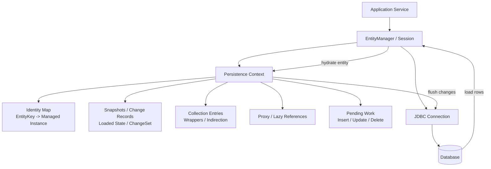
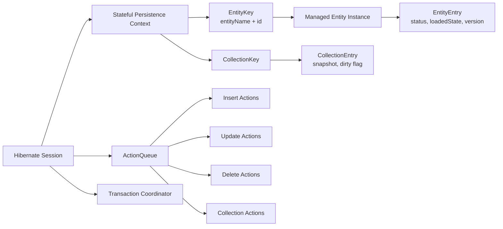
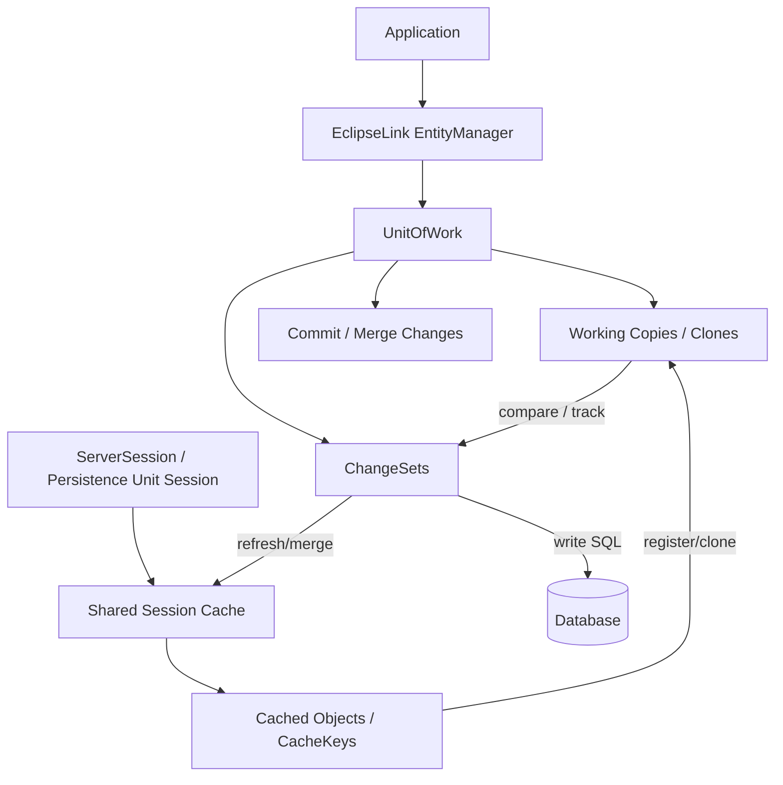
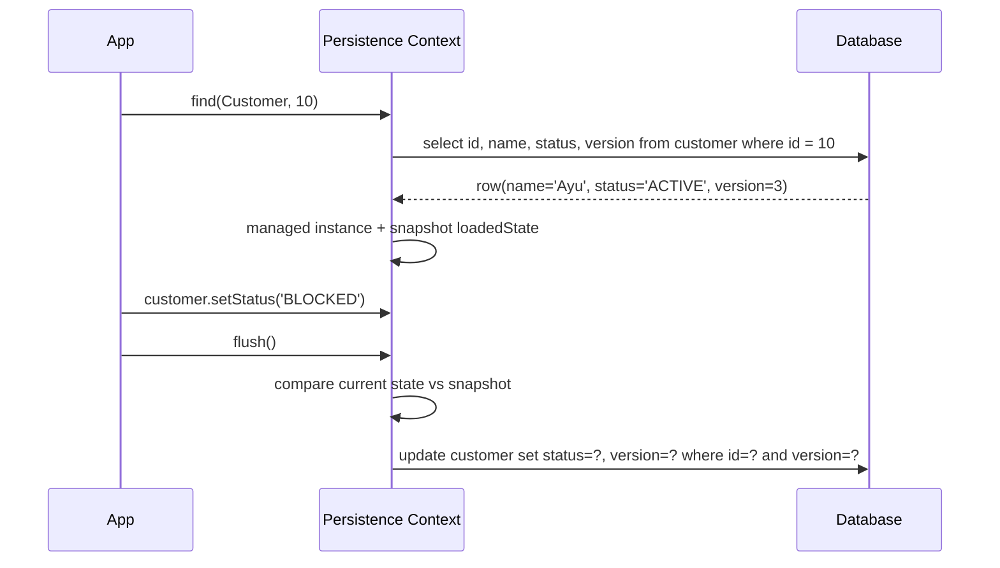
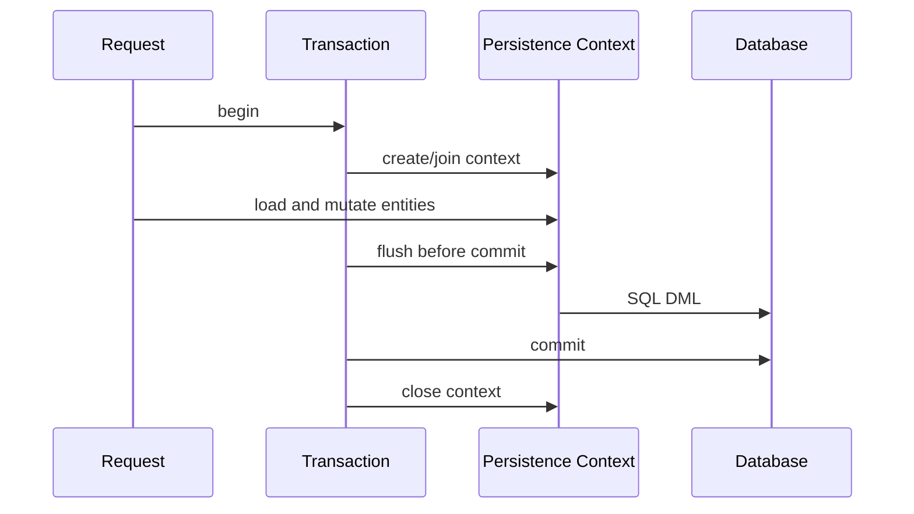

# Part 005 — Persistence Context Internals: Identity, Snapshot, Unit of Work

> Target bagian ini: setelah membaca mapping dan kode service, kita bisa menjawab: **object mana yang managed, identity apa yang dijaga, baseline perubahan apa yang disimpan, kapan provider membaca ulang database, kapan perubahan hanya hidup di memory, dan kapan perubahan akan masuk ke flush pipeline.**

Pada level basic, persistence context sering disebut sebagai *first-level cache*. Itu benar, tetapi terlalu dangkal. Dalam sistem produksi, persistence context lebih tepat dipahami sebagai:

1. **identity map** — menjaga satu instance Java per identity entity dalam satu boundary;
2. **change-tracking boundary** — menyimpan baseline untuk mendeteksi perubahan;
3. **unit of work** — mengumpulkan perubahan sampai flush/commit;
4. **association coordinator** — melacak collection wrapper, proxy, lazy reference, dan cascade traversal;
5. **consistency illusion** — memberi kesan repeatable object read di dalam satu context, walaupun database bisa berubah di luar context.

Kalau kita hanya menganggapnya sebagai cache, kita akan gagal memahami kenapa `find()` tidak selalu query database, kenapa update bisa muncul tanpa memanggil `save()`, kenapa bulk update membuat entity stale, kenapa long-running transaction boros memory, dan kenapa `clear()` bisa menyelamatkan batch job tetapi juga bisa menghilangkan perubahan yang belum di-flush.

---

## 1. Kaufman Deconstruction: Skill yang Harus Dikuasai

Dengan pendekatan *The First 20 Hours*, kita pecah kemampuan “menguasai persistence context” menjadi sub-skill kecil yang bisa dilatih cepat:

| Sub-skill | Pertanyaan yang harus bisa dijawab | Latihan cepat |
|---|---|---|
| Identity reasoning | Apakah dua reference menunjuk entity identity yang sama dalam context yang sama? | `find()` entity yang sama dua kali, bandingkan `==` |
| State detection | Object ini transient, managed, detached, removed, proxy, atau read-only? | Tambahkan log `contains()`, `detach()`, `clear()` |
| Snapshot reasoning | Baseline perubahan apa yang disimpan provider? | Ubah field, flush, cek SQL |
| Flush boundary | Apakah perubahan sudah masuk database atau masih di memory? | `persist`, query, `flush`, `rollback` |
| Stale read detection | Apakah data yang dibaca fresh dari DB atau dari context/cache? | Update via JDBC/native, lalu `find()` ulang |
| Memory control | Kenapa batch job makin lambat/boros memory? | Insert ribuan entity tanpa `clear()`, lalu dengan `flush/clear` |
| Provider comparison | Hibernate dan EclipseLink menyimpan/membandingkan perubahan dengan cara apa? | Jalankan test sama di dua provider |

Tujuan praktik bukan sekadar “kode jalan”, melainkan melatih kemampuan prediksi: **sebelum menjalankan test, tulis dulu apa yang akan terjadi pada object, SQL, cache, dan transaction.**

---

## 2. Mental Model Utama

Persistence context adalah boundary runtime tempat provider mengatakan:

> “Untuk entity type X dan primary key Y, selama context ini hidup, saya akan mengelola satu representasi object yang dianggap authoritative untuk operasi aplikasi di boundary ini.”

Diagram konseptual:



Beberapa konsekuensi penting:

- `EntityManager.find(Order.class, id)` boleh mengembalikan object dari persistence context tanpa query baru.
- Jika field object managed diubah, provider bisa mendeteksinya saat flush tanpa method `update()` eksplisit.
- Jika database berubah di luar context, context belum tentu tahu.
- Jika object detached diubah, provider tidak otomatis tahu.
- Jika context terlalu panjang, jumlah managed object dan snapshot bisa membesar.
- Jika context di-clear sebelum flush, perubahan yang belum disinkronkan bisa hilang dari tracking.

---

## 3. Baseline Spesifikasi: Apa yang Dijamin Jakarta Persistence

Jakarta Persistence mendefinisikan `EntityManager` sebagai API untuk operasi yang memengaruhi state persistence context dan lifecycle entity. Dalam satu persistence context, untuk satu persistent identity, hanya ada satu instance entity yang dikelola.

Inilah invariant dasar:

```java
var a = em.find(Customer.class, customerId);
var b = em.find(Customer.class, customerId);

assert a == b; // true dalam persistence context yang sama
```

Namun invariant ini **tidak berlaku lintas persistence context**:

```java
var em1 = emf.createEntityManager();
var em2 = emf.createEntityManager();

var a = em1.find(Customer.class, customerId);
var b = em2.find(Customer.class, customerId);

assert a != b; // instance Java berbeda
assert Objects.equals(a.getId(), b.getId()); // persistent identity sama
```

Jadi ada tiga identity yang harus dibedakan:

| Jenis identity | Contoh | Scope |
|---|---|---|
| JVM object identity | `a == b` | memory/process |
| Persistent identity | `(entityName, primaryKey)` | database/persistence unit |
| Business identity | `customerNumber`, `caseNumber`, `accountNo` | domain |

Bug serius sering muncul saat tiga identity ini dicampur. Misalnya `equals()` entity memakai mutable business field, collection hash rusak setelah field berubah, atau DTO dianggap entity karena punya ID yang sama.

---

## 4. Persistence Context Bukan Global Cache

Persistence context biasanya hidup selama transaction-scoped `EntityManager`. Ia bukan cache global. Ia tidak dirancang untuk dibagi antar thread. Ia bukan tempat menyimpan object sepanjang request asynchronous atau websocket session.

Perbedaan penting:

| Konsep | Scope | Tujuan |
|---|---:|---|
| Persistence context / first-level cache | `EntityManager` / `Session` | identity, lifecycle, change tracking |
| Hibernate second-level cache | `SessionFactory` | reuse data antar session |
| EclipseLink shared cache / session cache | persistence unit/session | shared identity/cache behavior |
| Application cache | aplikasi | use-case specific caching |
| Database buffer cache | database engine | page/block cache |

Kesalahan umum: menganggap karena object pernah dibaca, maka database tidak perlu dipikirkan. Dalam ORM, cache correctness bergantung pada boundary. Persistence context memberi konsistensi lokal, bukan kebenaran global.

---

## 5. Hibernate View: Session sebagai Stateful Unit of Work

Dalam Hibernate, `Session` adalah representasi native yang sepadan dengan `EntityManager` di Jakarta Persistence. `Session` bersifat stateful, short-lived, dan memodelkan Unit of Work.

Secara konseptual, Hibernate `Session` menyimpan:

- **persistence context**: managed entities dan collections;
- **entity entries**: metadata runtime per entity instance;
- **loaded state**: snapshot field saat entity diload atau setelah flush;
- **collection entries**: snapshot collection untuk mendeteksi perubahan relasi;
- **proxy references**: lazy reference yang belum tentu terinisialisasi;
- **action queue**: pekerjaan insert/update/delete/collection yang akan dieksekusi saat flush.

Simplifikasi struktur:



Kita tidak perlu menghafal class internalnya untuk memakai Hibernate dengan baik. Tetapi kita perlu mental model-nya:

- entity managed berada dalam map identity;
- Hibernate tahu status entity melalui entry metadata;
- perubahan field dibandingkan terhadap snapshot atau dilacak via enhancement;
- SQL tidak selalu dibuat saat field berubah;
- SQL dibuat/dieksekusi saat flush pipeline berjalan;
- ordering SQL diatur oleh queue/flush engine.

---

## 6. EclipseLink View: Session Cache, UnitOfWork, Clone, ChangeSet

EclipseLink memiliki akar desain dari TopLink dan sangat eksplisit memakai pola **Unit of Work**. Secara konseptual, ia membedakan:

- **ServerSession / persistence unit session**: session-level infrastructure dan shared cache;
- **ClientSession / EntityManager context**: session client yang digunakan oleh aplikasi;
- **UnitOfWork**: boundary perubahan;
- **identity map**: menjaga object identity dan cache behavior;
- **clone/working copy**: object yang dimodifikasi dalam UnitOfWork;
- **change set**: representasi perubahan yang akan dikomit.

Model sederhana:



Implikasinya:

- EclipseLink sering berpikir dalam istilah **shared object cache + UnitOfWork working copies**.
- Perubahan tidak sekadar “field berubah”, tetapi menjadi change set yang akan dikomit.
- Weaving dan indirection berperan besar dalam lazy loading dan change tracking.
- Cache isolation policy memengaruhi apakah object dibaca dari shared cache, isolated cache, atau database.

Bagi engineer, poin pentingnya bukan nama internal class, tetapi konsekuensi operasional: **object yang Anda pegang bisa merupakan working copy dalam UnitOfWork, sementara shared cache punya representasi lain.**

---

## 7. Identity Map: Invariant yang Harus Dijaga

Identity map menjamin satu managed instance per persistent identity dalam context.

Contoh:

```java
@Transactional
public void demo(Long id) {
    Customer c1 = em.find(Customer.class, id);
    Customer c2 = em.createQuery("select c from Customer c where c.id = :id", Customer.class)
            .setParameter("id", id)
            .getSingleResult();

    assert c1 == c2;
}
```

Walaupun query kedua mengambil row yang sama, provider harus mengembalikan instance managed yang sama dalam context. Jika query menghasilkan data lebih baru dari database, provider tidak bebas mengganti instance seenaknya karena itu akan mematahkan object graph yang sudah dipegang aplikasi.

### 7.1 Konsekuensi untuk Stale Data

Misalnya:

```java
@Transactional
public Customer readAfterExternalUpdate(Long id) {
    Customer c = em.find(Customer.class, id);

    jdbcTemplate.update(
        "update customer set status = 'BLOCKED' where id = ?",
        id
    );

    return em.find(Customer.class, id);
}
```

`find()` kedua dapat mengembalikan instance yang sama dengan status lama, karena persistence context sudah punya `Customer#id`.

Solusi tergantung intent:

```java
em.refresh(c);       // reload state entity dari database
// atau
em.clear();          // detach semua, find berikutnya load ulang
// atau
em.detach(c);        // detach satu entity
```

Namun `refresh()` juga punya konsekuensi: perubahan lokal yang belum di-flush pada entity itu bisa tertimpa. Jadi jangan jadikan `refresh()` sebagai obat generik.

---

## 8. Snapshot: Baseline Perubahan

Pada mode umum, saat provider meload entity, ia menyimpan representasi nilai awal. Saat flush, nilai saat ini dibandingkan dengan baseline tersebut.

Contoh entity:

```java
@Entity
@Table(name = "customer")
public class Customer {
    @Id
    private Long id;

    private String name;
    private String status;

    @Version
    private long version;
}
```

Flow:



Snapshot bukan hanya untuk update. Ia juga membantu provider memahami:

- apakah entity dirty;
- field mana yang berubah;
- version check apa yang dibutuhkan;
- apakah collection berubah;
- apakah update SQL perlu dikirim;
- apakah lifecycle callback perlu dipanggil.

### 8.1 Biaya Snapshot

Snapshot berarti memory. Untuk 10 entity kecil, tidak masalah. Untuk 500.000 entity dalam batch import, persistence context bisa menjadi masalah besar.

Pseudo-problem:

```java
@Transactional
public void importRows(List<CustomerRow> rows) {
    for (CustomerRow row : rows) {
        Customer c = mapper.toEntity(row);
        em.persist(c);
    }
}
```

Masalah:

- semua entity tetap managed sampai transaction selesai;
- provider menyimpan metadata/snapshot/collection state;
- flush di akhir sangat besar;
- memory pressure naik;
- dirty checking makin mahal;
- SQL batch bisa tidak optimal;
- error constraint muncul terlambat.

Pattern yang lebih aman:

```java
@Transactional
public void importRows(List<CustomerRow> rows) {
    int batchSize = 500;

    for (int i = 0; i < rows.size(); i++) {
        em.persist(mapper.toEntity(rows.get(i)));

        if (i > 0 && i % batchSize == 0) {
            em.flush();
            em.clear();
        }
    }
}
```

Tetapi pattern ini hanya aman jika setelah `clear()` kita tidak lagi butuh managed references lama. Jika masih ada object graph yang perlu disambungkan, kita harus mendesain ulang flow.

---

## 9. Managed vs Detached: Perubahan yang Terlihat dan Tidak Terlihat

Perubahan hanya otomatis dilacak pada managed entity.

```java
@Transactional
public void managedChange(Long id) {
    Customer c = em.find(Customer.class, id); // managed
    c.changeStatus(Status.BLOCKED);           // dirty
} // flush/commit -> update
```

Berbeda dengan:

```java
public void detachedChange(Customer c) {
    c.changeStatus(Status.BLOCKED); // detached, tidak ada provider yang melacak
}
```

Agar perubahan detached masuk, harus ada operasi seperti `merge()` atau load managed entity lalu apply perubahan.

### 9.1 Kenapa `merge()` Sering Salah Dipakai

`merge(detached)` tidak “menjadikan object detached itu managed”. Ia menyalin state dari detached object ke managed copy dan mengembalikan managed instance.

```java
Customer detached = loadFromPreviousRequest();
detached.changeName("New Name");

Customer managed = em.merge(detached);

assert managed != detached;
```

Bug umum:

```java
em.merge(detached);
detached.changeStatus(Status.BLOCKED); // perubahan ini tidak dilacak
```

Yang benar:

```java
Customer managed = em.merge(detached);
managed.changeStatus(Status.BLOCKED);
```

Atau lebih eksplisit untuk command handling:

```java
@Transactional
public void changeCustomerName(Long id, ChangeCustomerName command) {
    Customer managed = em.find(Customer.class, id);
    managed.rename(command.name());
}
```

Pattern kedua lebih mudah diaudit, lebih jelas optimistic locking-nya, dan lebih aman dari overposting.

---

## 10. Persistence Context dan Transaction Boundary

Persistence context dan transaction sering berjalan bersama, tetapi konsepnya berbeda.

| Konsep | Fungsi |
|---|---|
| Transaction | atomicity, isolation, commit/rollback database work |
| Persistence context | identity, lifecycle, change tracking, write-behind |

Dalam transaction-scoped context, persistence context biasanya dibuka/dihubungkan ke transaction dan ditutup setelah transaction selesai. Dalam extended context, persistence context bisa hidup melewati beberapa transaction, misalnya pada stateful component atau conversational workflow.

### 10.1 Transaction-Scoped Context



Ini default paling aman untuk service-oriented systems.

### 10.2 Extended Context

Extended persistence context bisa berguna untuk conversation panjang, tetapi di backend modern sering berisiko:

- data stale lebih lama;
- memory footprint lebih besar;
- conflict muncul terlambat;
- hidden coupling dengan UI/session;
- sulit dipakai pada horizontal scaling;
- tidak cocok untuk stateless API biasa.

Jangan memakai extended context hanya untuk “menghindari LazyInitializationException”. Itu menyembunyikan boundary yang seharusnya eksplisit.

---

## 11. Read-Only Entities dan Snapshot Optimization

Tidak semua read harus menjadi calon update. Hibernate, misalnya, memiliki konsep read-only entity/session yang dapat mengurangi snapshot/dirty checking cost pada use case tertentu.

Contoh dengan Hibernate native API:

```java
Session session = em.unwrap(Session.class);
session.setDefaultReadOnly(true);

Customer c = session.find(Customer.class, id);
c.changeStatus(Status.BLOCKED);

// Pada mode read-only Hibernate, perubahan ini tidak diperlakukan sebagai update otomatis.
```

Catatan penting:

- `@Transactional(readOnly = true)` di Spring bukan jaminan universal bahwa provider tidak melakukan dirty checking atau database tidak berubah. Behavior bergantung integrasi dan provider.
- Read-only mode harus dipakai sebagai optimization dengan pemahaman jelas, bukan security boundary.
- Untuk read path besar, DTO projection sering lebih baik daripada entity read-only karena tidak perlu hydration penuh.

---

## 12. Collection State: Bagian yang Sering Mahal

Collection mapping (`@OneToMany`, `@ManyToMany`, `@ElementCollection`) bukan sekadar field Java. Provider sering menggantinya dengan wrapper/indirection object untuk melacak perubahan.

Contoh:

```java
@Entity
public class CaseFile {
    @OneToMany(mappedBy = "caseFile", cascade = CascadeType.ALL, orphanRemoval = true)
    private List<Evidence> evidences = new ArrayList<>();

    public void addEvidence(Evidence evidence) {
        evidences.add(evidence);
        evidence.attachTo(this);
    }
}
```

Saat collection diload, provider perlu tahu:

- collection sudah initialized atau belum;
- elemen awal apa saja;
- elemen apa yang ditambah/dihapus;
- apakah urutan berubah;
- apakah orphan removal perlu delete;
- apakah join table perlu insert/delete;
- apakah cascade harus traversal ke child.

### 12.1 Collection Replacement Hazard

Bug umum:

```java
caseFile.setEvidences(new ArrayList<>(incomingEvidences));
```

Jika field collection sebelumnya adalah provider wrapper, menggantinya dengan collection biasa bisa menimbulkan efek yang tidak diinginkan: provider harus menafsirkan seluruh collection sebagai diganti, orphan removal bisa agresif, ordering bisa berubah, dan SQL bisa menjadi delete-all-insert-all.

Lebih aman:

```java
public void replaceEvidences(List<Evidence> newEvidences) {
    this.evidences.clear();
    for (Evidence evidence : newEvidences) {
        addEvidence(evidence);
    }
}
```

Tetapi untuk collection besar, ini juga bisa mahal. Di production, large child collection sering lebih baik dikelola lewat repository/query khusus berdasarkan parent ID, bukan selalu dimuat sebagai object graph besar.

---

## 13. Persistence Context dan Lazy Proxy

Lazy association sering direpresentasikan sebagai proxy atau indirection. Dalam Hibernate, to-one lazy sering memakai proxy atau bytecode enhancement. Dalam EclipseLink, indirection dan weaving sangat penting.

Yang perlu dipahami:

```java
Order order = em.find(Order.class, orderId);
Customer customer = order.getCustomer();
```

`customer` belum tentu fully initialized. Ia bisa berupa:

- proxy object;
- enhanced entity dengan lazy field interceptor;
- EclipseLink indirection value holder;
- managed instance yang sudah ada di context;
- entity yang langsung diload karena provider/fetch plan memutuskan demikian.

### 13.1 Lazy Reference dan Identity Map

Jika proxy `Customer#10` ada, lalu kita memanggil:

```java
Customer c = em.find(Customer.class, 10L);
```

Provider harus menjaga identity consistency. Ia tidak boleh membuat dua managed representasi berbeda untuk identity yang sama. Dalam praktiknya, proxy bisa diinisialisasi atau resolved ke managed instance sesuai mekanisme provider.

---

## 14. Clear, Detach, Refresh, Evict: Operational Controls

Persistence context punya operasi kontrol yang perlu dipahami sebagai alat, bukan ritual.

### 14.1 `clear()`

```java
em.clear();
```

Efek:

- semua managed entity menjadi detached;
- persistence context kosong;
- perubahan belum di-flush tidak lagi dilacak;
- find/query berikutnya harus load ulang atau memakai shared/second-level cache.

Gunakan untuk:

- batch processing;
- menghindari stale context setelah bulk SQL;
- mengurangi memory;
- test yang perlu boundary baru.

Jangan gunakan kalau:

- masih ada perubahan penting belum di-flush;
- object graph masih akan dimutasi dengan asumsi managed;
- service boundary menjadi tidak jelas.

### 14.2 `detach(entity)`

```java
em.detach(customer);
```

Efek hanya pada entity tertentu. Namun hati-hati: relasi lain bisa tetap managed. Detach tidak selalu membuat seluruh graph detached kecuali cascade detach dikonfigurasi dan provider menjalankannya sesuai aturan.

### 14.3 `refresh(entity)`

```java
em.refresh(customer);
```

Memuat ulang state dari database dan menimpa state entity managed. Berguna untuk reload setelah trigger/database-side update, tetapi berbahaya jika ada perubahan lokal yang belum disimpan.

### 14.4 Hibernate `evict()`

Hibernate native `Session` memiliki `evict()` yang mirip detach satu object.

```java
Session session = em.unwrap(Session.class);
session.evict(customer);
```

Gunakan hanya jika memang sengaja masuk ke Hibernate-specific API.

---

## 15. Stale Context Setelah Bulk Update

Bulk JPQL/native update melewati normal dirty checking per entity. Akibatnya, managed entity di persistence context bisa stale.

Contoh:

```java
@Transactional
public void blockDormantCustomers() {
    Customer c = em.find(Customer.class, 10L);

    em.createQuery("""
        update Customer c
        set c.status = :blocked
        where c.lastLoginAt < :threshold
    """)
    .setParameter("blocked", Status.BLOCKED)
    .setParameter("threshold", Instant.now().minus(365, ChronoUnit.DAYS))
    .executeUpdate();

    // c mungkin masih punya status lama di persistence context
}
```

Pattern aman:

```java
int updated = em.createQuery("""
    update Customer c
    set c.status = :blocked
    where c.lastLoginAt < :threshold
""")
.setParameter("blocked", Status.BLOCKED)
.setParameter("threshold", threshold)
.executeUpdate();

em.clear();
```

Namun lebih baik desain service agar bulk update berada di transaction/boundary sendiri, sehingga tidak bercampur dengan entity managed yang sama.

---

## 16. Persistence Context Memory Model

Setiap managed entity membawa overhead:

- object entity itu sendiri;
- entry metadata;
- snapshot/loaded state;
- collection wrappers;
- proxy/initializer metadata;
- references ke entity lain;
- pending action jika ada perubahan.

Estimasi kasar:

```text
Managed object count x (entity object + metadata + snapshot + association overhead)
```

Masalah memory bukan hanya heap. Persistence context besar juga memperlambat:

- dirty checking;
- flush planning;
- cascade traversal;
- collection synchronization;
- garbage collection;
- error recovery.

### 16.1 Smell: Repository Mengembalikan Terlalu Banyak Entity

```java
List<Customer> customers = em.createQuery(
    "select c from Customer c", Customer.class
).getResultList();
```

Jika tabel besar, ini bukan hanya query besar. Ini juga memanaged semua entity yang dihydrate.

Untuk read-only export/report:

- gunakan pagination/chunking;
- gunakan DTO projection;
- gunakan streaming dengan hati-hati;
- clear context per chunk;
- pertimbangkan native SQL/JDBC untuk path ekstrem;
- jangan hydrate aggregate besar kalau hanya butuh 5 kolom.

---

## 17. Equals dan HashCode di Dalam Persistence Context

Persistence context menjaga identity berdasarkan entity key internal, bukan `equals()` Java. Namun aplikasi kita memakai `equals()` untuk collection, map, set, dan domain comparison.

Problem klasik:

```java
@Entity
public class Customer {
    @Id
    @GeneratedValue
    private Long id;

    private String email;

    @Override
    public boolean equals(Object o) {
        return o instanceof Customer c && Objects.equals(email, c.email);
    }

    @Override
    public int hashCode() {
        return Objects.hash(email);
    }
}
```

Jika `email` berubah saat object berada dalam `HashSet`, set bisa korup secara logis.

Untuk entity mutable, aturan aman:

- jangan pakai mutable field untuk hashCode;
- hati-hati memakai generated ID karena sebelum persist ID bisa null;
- natural ID boleh dipakai jika benar-benar immutable;
- untuk aggregate child, kadang identity berbasis parent + stable local key lebih masuk akal;
- hindari memasukkan managed entity mutable ke hash-based collection lintas lifecycle yang panjang.

---

## 18. Persistence Context dalam Architecture Boundary

Dalam sistem enterprise, persistence context sebaiknya tidak bocor melewati service boundary.

Anti-pattern:

```java
@RestController
class CustomerController {
    @GetMapping("/customers/{id}")
    Customer get(@PathVariable Long id) {
        return customerService.get(id); // entity keluar ke JSON serializer
    }
}
```

Masalah:

- serializer bisa trigger lazy loading;
- field internal persistence bocor;
- entity lifecycle bercampur dengan API contract;
- bidirectional association bisa loop;
- transaction sudah selesai saat lazy field diakses;
- client bisa bergantung pada shape entity.

Pattern lebih aman:

```java
public record CustomerDetailResponse(
    Long id,
    String name,
    String status
) {}

@Transactional(readOnly = true)
public CustomerDetailResponse getCustomer(Long id) {
    Customer c = em.find(Customer.class, id);
    return new CustomerDetailResponse(
        c.getId(),
        c.getName(),
        c.getStatus().name()
    );
}
```

Atau gunakan DTO projection langsung jika tidak butuh behavior entity.

---

## 19. Debugging Persistence Context

Checklist saat ada perilaku aneh:

1. Apakah object ini managed?

```java
em.contains(entity)
```

2. Apakah ada transaction aktif?
3. Apakah persistence context sama atau berbeda?
4. Apakah entity sudah ada di context sebelum query?
5. Apakah data berubah via native SQL/JDBC/bulk update?
6. Apakah `flush()` sudah terjadi?
7. Apakah `clear()` atau `detach()` terjadi sebelum perubahan?
8. Apakah entity read-only?
9. Apakah ada cascade yang membawa graph tak terduga?
10. Apakah collection wrapper diganti?
11. Apakah query mengambil entity atau DTO?
12. Apakah provider memakai second-level/shared cache?

Hibernate-specific observability:

```properties
hibernate.show_sql=false
hibernate.format_sql=true
hibernate.highlight_sql=true
hibernate.generate_statistics=true
```

Lebih baik gunakan logger kategori SQL/bind parameter daripada `show_sql` untuk production-like debugging.

EclipseLink-specific observability:

```properties
eclipselink.logging.level=FINE
eclipselink.logging.parameters=true
eclipselink.logging.thread=true
eclipselink.logging.session=true
```

Aktifkan sesuai kebutuhan dan jangan bocorkan parameter sensitif di log produksi.

---

## 20. Practice Lab: Prediksi Persistence Context

Gunakan entity sederhana:

```java
@Entity
class Account {
    @Id
    private Long id;

    private String number;
    private BigDecimal balance;

    @Version
    private long version;

    public void debit(BigDecimal amount) {
        if (balance.compareTo(amount) < 0) {
            throw new IllegalStateException("insufficient balance");
        }
        balance = balance.subtract(amount);
    }
}
```

### Lab 1 — Same Context Identity

```java
@Transactional
void lab1(Long id) {
    Account a = em.find(Account.class, id);
    Account b = em.find(Account.class, id);
    System.out.println(a == b);
}
```

Prediksi:

- SQL pertama: `select ... where id=?` jika belum ada di context/cache.
- SQL kedua: tidak perlu query database dalam context yang sama.
- Output: `true`.

### Lab 2 — Dirty Managed Entity

```java
@Transactional
void lab2(Long id) {
    Account a = em.find(Account.class, id);
    a.debit(new BigDecimal("100.00"));
}
```

Prediksi:

- `select` saat find;
- tidak ada SQL update saat setter/debit;
- `update` saat flush/commit jika balance berubah;
- version ikut dicek/ditambah jika memakai optimistic locking.

### Lab 3 — Clear Before Flush

```java
@Transactional
void lab3(Long id) {
    Account a = em.find(Account.class, id);
    a.debit(new BigDecimal("100.00"));
    em.clear();
}
```

Prediksi:

- Jika belum flush sebelum clear, perubahan tidak lagi dilacak.
- Commit tidak mengirim update untuk perubahan itu.
- Ini berbahaya kecuali memang disengaja.

### Lab 4 — Flush Then Clear

```java
@Transactional
void lab4(Long id) {
    Account a = em.find(Account.class, id);
    a.debit(new BigDecimal("100.00"));
    em.flush();
    em.clear();
}
```

Prediksi:

- `flush()` mengirim update ke database dalam transaction.
- `clear()` detach semua entity.
- Jika transaction rollback, update tetap dibatalkan.
- Flush bukan commit.

### Lab 5 — Bulk Update Stale Entity

```java
@Transactional
void lab5(Long id) {
    Account a = em.find(Account.class, id);

    em.createQuery("update Account a set a.balance = 0 where a.id = :id")
      .setParameter("id", id)
      .executeUpdate();

    System.out.println(a.getBalance());
}
```

Prediksi:

- Bulk update menyentuh database.
- Managed `a` bisa tetap punya balance lama.
- Perlu `clear()` atau `refresh(a)` jika ingin state context sinkron.

---

## 21. Failure Modes Catalog

| Failure mode | Root cause | Prevention |
|---|---|---|
| Entity berubah tanpa `save()` tapi database ikut berubah | Managed entity dirty checking | Pahami managed boundary; gunakan DTO untuk read path |
| Entity diubah tapi database tidak berubah | Entity detached/read-only/cleared | Cek `em.contains()` dan transaction boundary |
| Data tidak fresh setelah update eksternal | Identity map mengembalikan managed instance lama | `refresh`, `clear`, boundary transaction baru |
| Batch import OOM | Persistence context tumbuh tanpa clear | Flush/clear chunking, DTO/JDBC path |
| Massive delete/insert collection | Collection wrapper diganti atau orphan removal salah | Mutator domain eksplisit, diff collection |
| Lazy loading saat JSON serialization | Entity bocor keluar transaction | DTO/API boundary |
| Merge overwrite field | Detached object membawa partial/stale state | Load managed + apply command |
| Bulk update inconsistent | Bulk melewati managed state | Clear context, boundary terpisah |
| Equality bug di Set | Mutable equals/hashCode | Stable identity strategy |
| Cache confusion | Menggabungkan PC, L2 cache, shared cache | Pisahkan mental model cache |

---

## 22. Provider Comparison Ringkas

| Area | Hibernate ORM | EclipseLink |
|---|---|---|
| Native unit of work abstraction | `Session` | `UnitOfWork` sangat eksplisit |
| First-level identity | Persistence context di `Session` | UnitOfWork/persistence context dengan identity map/working copies |
| Change tracking | snapshot dirty checking, bytecode enhancement, collection wrappers | deferred change detection, attribute/object change tracking, weaving/change sets |
| Lazy mechanism | proxies, bytecode enhancement | indirection, weaving |
| Shared cache | optional second-level cache via provider integration | shared session cache adalah bagian penting desain |
| Mental model utama | managed instance + snapshot + action queue | shared cache + working copy + change set commit |

Perbedaan ini akan makin penting saat membahas dirty checking, caching, fetch planning, dan provider migration.

---

## 23. Production Heuristics

Gunakan heuristic berikut:

1. **Satu service transaction, satu persistence context pendek** untuk command biasa.
2. **Jangan bocorkan entity ke API response**.
3. **Jangan memakai `merge()` sebagai default update strategy**.
4. **Untuk read-heavy projection, jangan hydrate entity penuh**.
5. **Untuk batch besar, lakukan chunking dengan `flush/clear`**.
6. **Setelah bulk update/native SQL, jangan percaya managed state lama**.
7. **Jaga collection mutator di aggregate root**.
8. **Log SQL dan hitung query, bukan hanya merasa performa cukup**.
9. **Gunakan provider-specific API hanya jika trade-off eksplisit**.
10. **Jangan perpanjang persistence context untuk menutupi boundary design yang buruk**.

---

## 24. Checklist Review Desain

Sebelum menyetujui PR yang menyentuh ORM boundary, tanyakan:

- Apakah entity keluar dari service boundary?
- Apakah method ini membaca terlalu banyak entity?
- Apakah update dilakukan pada managed entity atau detached graph?
- Apakah ada bulk update/delete bercampur dengan managed entity?
- Apakah collection besar dimuat penuh?
- Apakah `clear()` dipakai sebelum flush?
- Apakah lazy association akan disentuh setelah transaction selesai?
- Apakah cache provider memengaruhi freshness?
- Apakah equality entity aman?
- Apakah test membuktikan SQL/query count yang diharapkan?

---

## 25. Ringkasan

Persistence context adalah jantung runtime ORM. Ia bukan hanya cache, tetapi **identity map + change tracking + unit of work + association coordinator**.

Jika kita menguasai bagian ini, banyak perilaku ORM yang sebelumnya tampak magic menjadi dapat diprediksi:

- kenapa entity yang sama selalu object yang sama dalam context;
- kenapa perubahan managed entity otomatis masuk database saat flush;
- kenapa detached entity tidak dilacak;
- kenapa bulk update membuat context stale;
- kenapa batch job butuh flush/clear;
- kenapa collection mapping bisa mahal;
- kenapa provider Hibernate dan EclipseLink punya rasa runtime yang berbeda.

Pada part berikutnya, kita akan membedah **flush mechanics**: bagaimana perubahan yang sudah terkumpul di persistence context diubah menjadi SQL DML, diurutkan, dibatch, dan disinkronkan dengan constraint database.

---

## Rujukan Resmi

- Hibernate ORM User Guide — https://docs.hibernate.org/stable/orm/userguide/html_single/
- Hibernate ORM Documentation — https://hibernate.org/orm/documentation/
- Jakarta Persistence 3.2 Specification — https://jakarta.ee/specifications/persistence/3.2/jakarta-persistence-spec-3.2
- Jakarta Persistence 3.2 EntityManager API — https://jakarta.ee/specifications/persistence/3.2/apidocs/jakarta.persistence/jakarta/persistence/entitymanager
- EclipseLink Concepts — https://eclipse.dev/eclipselink/documentation/4.0/concepts/concepts.html
- EclipseLink JPA Extensions Reference — https://eclipse.dev/eclipselink/documentation/4.0/jpa/extensions/jpa-extensions.html
