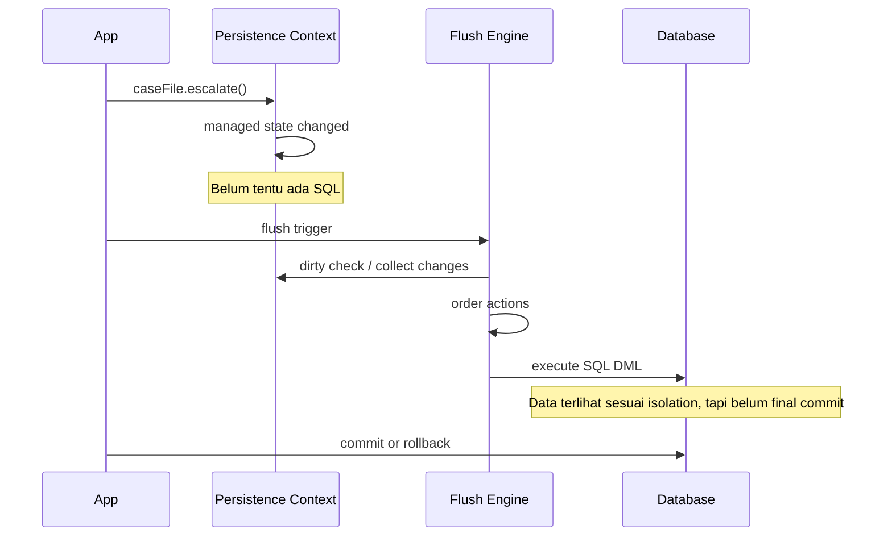
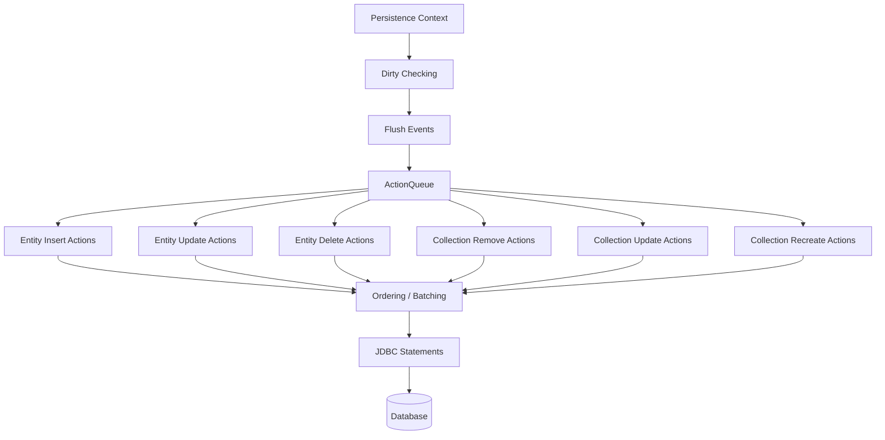
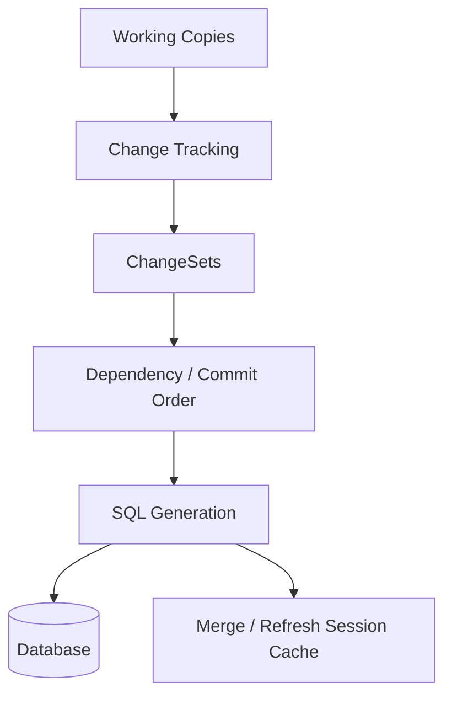

# Part 006 — Flush Mechanics: Write-Behind, Ordering, and Constraint Survival

> Target bagian ini: kita bisa membedakan **mutasi object**, **dirty state**, **flush**, **SQL execution**, dan **commit**. Kita juga bisa menjelaskan kenapa constraint violation sering muncul “terlambat”, kenapa query bisa memicu flush, kenapa insert/update/delete diurutkan provider, dan kenapa flush bukan solusi transaksi jika desain aggregate/constraint salah.

Flush adalah proses sinkronisasi state persistence context ke database melalui SQL DML. Pada level basic, orang sering bilang “flush menyimpan data”. Pernyataan itu rawan menyesatkan. Flush mengirim perubahan ke database **dalam transaction aktif**, tetapi belum tentu commit. Jika transaction rollback, efek flush ikut dibatalkan.

Kalimat yang lebih akurat:

> **Flush adalah proses menerjemahkan perubahan managed state menjadi SQL dan mengeksekusinya dalam transaction saat ini, tanpa menyelesaikan transaction tersebut.**

---

## 1. Kenapa Flush Harus Dipahami Secara Serius

Banyak bug produksi ORM bukan terjadi saat `persist()` atau setter dipanggil. Bug muncul saat flush:

- foreign key violation;
- unique constraint violation;
- optimistic locking exception;
- insert order salah karena mapping ownership salah;
- delete order gagal karena child masih mereferensikan parent;
- query tiba-tiba lambat karena memicu flush besar;
- batch job OOM karena flush terlambat;
- update tidak terduga karena dirty checking menemukan perubahan lama;
- SQL muncul di tempat yang tidak terlihat dari kode business.

Flush adalah tempat semua ilusi object graph bertemu realitas relational database.

---

## 2. Kaufman Skill Decomposition

Untuk menguasai flush, pecah skill menjadi unit berikut:

| Sub-skill | Pertanyaan inti | Latihan |
|---|---|---|
| Write-behind reasoning | Apakah SQL dikirim sekarang atau nanti? | `persist`, cek log SQL sebelum/after `flush()` |
| Flush trigger reasoning | Operasi apa yang memicu flush? | Jalankan query setelah mutate entity |
| Ordering reasoning | SQL mana dulu: insert parent, insert child, update FK, delete orphan? | Mapping parent-child dengan FK |
| Constraint reasoning | Constraint apa yang baru divalidasi saat flush? | Unique/FK/not-null violation test |
| Flush mode control | Kapan `AUTO` vs `COMMIT` aman? | Query sebelum commit dengan flush mode berbeda |
| Batch control | Bagaimana membuat flush kecil dan stabil? | `flush/clear` per N rows |
| Provider diagnostics | Bagaimana melihat flush count/action? | Hibernate statistics, EclipseLink logging |

Kunci latihan: tulis prediksi sebelum menjalankan test:

```text
Expected:
1. persist parent -> no SQL yet
2. persist child -> no SQL yet
3. query parent count -> flush triggered
4. SQL order: insert parent, insert child
5. commit -> no extra DML if already flushed
```

---

## 3. Mutasi, Dirty, Flush, Commit: Empat Hal Berbeda

Perhatikan contoh:

```java
@Transactional
public void changeStatus(Long id) {
    CaseFile caseFile = em.find(CaseFile.class, id);
    caseFile.escalate();
}
```

Yang terjadi:

1. `find()` memuat entity dan snapshot.
2. `escalate()` mengubah field Java object.
3. Entity menjadi dirty menurut provider.
4. Saat flush, provider membandingkan state/snapshot atau membaca change record.
5. Provider membuat SQL `update`.
6. Database mengeksekusi SQL dalam transaction.
7. Saat commit, database menyelesaikan transaction.

Diagram:



Jadi jangan samakan:

| Operasi | Arti |
|---|---|
| Setter/domain method | Mengubah object memory |
| Dirty state | Provider mendeteksi ada potensi perubahan |
| Flush | SQL DML dieksekusi dalam transaction |
| Commit | Transaction sukses permanen |
| Rollback | Efek SQL dalam transaction dibatalkan |

---

## 4. Write-Behind: Kenapa SQL Tidak Langsung Dikirim

ORM memakai write-behind agar provider bisa:

- menggabungkan perubahan;
- menghindari update jika state akhir sama dengan snapshot;
- mengurutkan SQL sesuai dependency;
- melakukan JDBC batching;
- menjalankan cascade traversal;
- melakukan optimistic version handling;
- menjaga persistence context tetap konsisten selama unit of work.

Contoh:

```java
@Transactional
public void renameTwice(Long id) {
    Customer c = em.find(Customer.class, id);
    c.rename("Name A");
    c.rename("Name B");
}
```

SQL yang ideal:

```sql
update customer
set name = ?, version = ?
where id = ? and version = ?
```

Satu update dengan nilai akhir `Name B`, bukan dua update. Tanpa write-behind, ORM akan lebih chatty dan sulit mengoptimalkan batch/order.

---

## 5. Flush Trigger

Flush bisa terjadi karena beberapa trigger.

### 5.1 Transaction Commit

Trigger paling umum:

```java
@Transactional
public void updateCustomer(Long id) {
    Customer c = em.find(Customer.class, id);
    c.rename("Ayu");
} // commit triggers flush
```

Pada commit, provider perlu menyinkronkan perubahan agar database transaction berisi state terbaru.

### 5.2 Explicit Flush

```java
em.flush();
```

Gunakan ketika:

- ingin mendeteksi constraint violation lebih awal;
- ingin membatasi ukuran batch;
- ingin memastikan SQL sudah dieksekusi sebelum operasi berikutnya dalam transaction;
- ingin memaksa database trigger/default/check berjalan sebelum membaca efeknya.

Jangan gunakan sebagai ritual setelah setiap `persist()`. Itu menghilangkan manfaat write-behind dan batching.

### 5.3 Query Execution pada Flush Mode AUTO

Pada flush mode default `AUTO`, provider dapat flush sebelum query agar query melihat perubahan yang relevan dari persistence context.

Contoh:

```java
@Transactional
public long countBlockedCustomers(Long id) {
    Customer c = em.find(Customer.class, id);
    c.block();

    return em.createQuery("""
        select count(c)
        from Customer c
        where c.status = :status
    """, Long.class)
    .setParameter("status", Status.BLOCKED)
    .getSingleResult();
}
```

Jika query dijalankan tanpa flush, database belum tahu bahwa `c.status` berubah. Maka provider bisa flush sebelum query.

### 5.4 Native Query dan Provider Behavior

Native query membuat provider lebih sulit memahami query space. Hibernate dan EclipseLink dapat berbeda dalam kapan flush dilakukan. Jika native query membaca tabel yang mungkin dipengaruhi perubahan managed state, lebih aman eksplisit:

```java
em.flush();
var rows = em.createNativeQuery("select ... from customer ...").getResultList();
```

Namun ini trade-off: explicit flush membuat constraint bisa muncul lebih awal dan batch lebih kecil.

---

## 6. Flush Mode: AUTO vs COMMIT

Jakarta Persistence menyediakan dua flush mode utama:

| Flush mode | Intuisi | Risiko |
|---|---|---|
| `AUTO` | Provider boleh flush sebelum query agar query konsisten dengan perubahan context | Query bisa memicu flush besar/tidak terduga |
| `COMMIT` | Flush terutama saat commit | Query sebelum commit bisa melihat state database lama |

Contoh `COMMIT`:

```java
@Transactional
public long countWithCommitFlushMode(Long id) {
    em.setFlushMode(FlushModeType.COMMIT);

    Customer c = em.find(Customer.class, id);
    c.block();

    return em.createQuery("""
        select count(c)
        from Customer c
        where c.status = :status
    """, Long.class)
    .setParameter("status", Status.BLOCKED)
    .getSingleResult();
}
```

Dengan `COMMIT`, hasil query bisa tidak memperhitungkan perubahan `c.block()` yang belum di-flush. Ini tidak selalu bug; bisa jadi optimization untuk command flow yang tidak membutuhkan read-your-writes via query.

### 6.1 Heuristic Flush Mode

Gunakan `AUTO` sebagai default aman.

Pertimbangkan `COMMIT` hanya jika:

- service command tidak menjalankan query yang bergantung pada perubahan sebelumnya;
- Anda ingin mencegah flush sebelum query tertentu;
- query adalah read-only lookup yang tidak perlu state terbaru dari context;
- test membuktikan behavior yang diinginkan.

Jangan memakai `COMMIT` untuk “memperbaiki performa” tanpa memahami consistency effect.

---

## 7. Hibernate Flush Pipeline: ActionQueue Mental Model

Hibernate mengumpulkan pekerjaan dalam queue. Detail internal bisa berubah antar versi, tetapi mental model-nya stabil:



Yang perlu diingat:

- `persist()` biasanya mendaftarkan entity baru untuk insert, tetapi insert bisa ditunda;
- update action muncul setelah dirty check;
- delete action muncul dari `remove()` atau orphan removal;
- collection actions bisa berbeda dari entity actions;
- ordering mencoba menghormati FK dan batching, tetapi mapping tetap menentukan banyak hal.

### 7.1 SQL Bukan Urutan Kode Java

Kode:

```java
em.persist(child);
em.persist(parent);
```

SQL belum tentu child dulu. Provider bisa mengurutkan insert parent sebelum child jika mapping dependency jelas.

Tetapi jangan bergantung buta pada provider untuk menyelamatkan model buruk. Jika ownership/FK tidak jelas, constraint bisa gagal.

---

## 8. EclipseLink Flush/Commit Mental Model

EclipseLink memakai UnitOfWork dan change set. Saat flush/commit, ia:

1. mendeteksi/mengumpulkan perubahan pada working copies;
2. membangun change sets;
3. menghitung dependency dan commit order;
4. mengeksekusi SQL;
5. menggabungkan perubahan kembali ke shared cache/session cache sesuai policy.

Diagram:



EclipseLink juga memiliki konsep batch writing, cache coordination, indirection, dan descriptor-level behavior yang memengaruhi flush. Untuk engineer, pertanyaan praktisnya:

- perubahan field dilacak sebagai apa?
- object mana yang working copy?
- apakah query membaca dari UnitOfWork, shared cache, atau database?
- apakah flush/commit menulis SQL sekarang atau ditunda?
- apakah shared cache menjadi stale/fresh setelah commit?

---

## 9. Insert Ordering dan Foreign Key

Mapping:

```java
@Entity
class CaseFile {
    @Id
    @GeneratedValue(strategy = GenerationType.SEQUENCE)
    private Long id;

    @OneToMany(mappedBy = "caseFile", cascade = CascadeType.ALL, orphanRemoval = true)
    private List<Evidence> evidences = new ArrayList<>();

    public void addEvidence(Evidence evidence) {
        evidences.add(evidence);
        evidence.attachTo(this);
    }
}

@Entity
class Evidence {
    @Id
    @GeneratedValue(strategy = GenerationType.SEQUENCE)
    private Long id;

    @ManyToOne(optional = false)
    @JoinColumn(name = "case_file_id", nullable = false)
    private CaseFile caseFile;

    public void attachTo(CaseFile caseFile) {
        this.caseFile = caseFile;
    }
}
```

Command:

```java
@Transactional
public Long createCaseWithEvidence() {
    CaseFile c = new CaseFile();
    c.addEvidence(new Evidence());
    em.persist(c);
    return c.getId();
}
```

Expected SQL order:

```sql
insert into case_file (...) values (...);
insert into evidence (case_file_id, ...) values (?, ...);
```

Kenapa parent dulu? Karena child punya FK non-null ke parent.

### 9.1 IDENTITY Generator Complication

Jika memakai identity column, provider mungkin harus melakukan insert lebih awal untuk mendapatkan ID dari database. Ini bisa mengganggu batching dan membuat SQL muncul lebih cepat daripada sequence strategy.

Heuristic:

- Untuk high-volume insert, sequence dengan allocation/pooled optimizer biasanya lebih batch-friendly daripada identity.
- Jangan memilih ID strategy hanya karena “paling gampang”. Pilihan ID memengaruhi flush dan batching.

---

## 10. Update Ordering dan Unique Constraint

Unique constraint dapat mematahkan asumsi bahwa provider bisa mengurutkan semuanya aman.

Contoh: menukar nomor urut dua item dalam scope yang punya unique `(case_id, position)`.

```text
Before:
A position=1
B position=2

After:
A position=2
B position=1
```

Naif update:

```sql
update item set position = 2 where id = A; -- gagal, B masih position=2
update item set position = 1 where id = B;
```

Solusi bisa berupa:

- gunakan temporary neutral position;
- gunakan deferrable constraint jika database mendukung dan policy memperbolehkan;
- delete/insert ulang dengan hati-hati;
- gunakan ordering model yang tidak membutuhkan dense integer swap;
- lakukan explicit flush step dengan intermediate state.

Contoh intermediate state:

```java
@Transactional
public void swapPositions(Long aId, Long bId) {
    Item a = em.find(Item.class, aId);
    Item b = em.find(Item.class, bId);

    int aPos = a.getPosition();
    int bPos = b.getPosition();

    a.moveTo(-1);
    em.flush();

    b.moveTo(aPos);
    a.moveTo(bPos);
}
```

Ini bukan pattern universal. Ini contoh bahwa kadang constraint relational membutuhkan choreography eksplisit.

---

## 11. Delete Ordering, Orphan Removal, dan FK Survival

Delete sering lebih sulit daripada insert.

Mapping parent-child:

```java
@OneToMany(mappedBy = "caseFile", cascade = CascadeType.ALL, orphanRemoval = true)
private List<Evidence> evidences = new ArrayList<>();
```

Jika parent dihapus:

```java
em.remove(caseFile);
```

Provider harus memastikan child dihapus sebelum parent jika FK child mengarah ke parent dan tidak ada database cascade.

Expected:

```sql
delete from evidence where case_file_id = ?;
delete from case_file where id = ?;
```

Jika FK memakai `ON DELETE CASCADE`, provider behavior dan cache consistency harus dipikirkan. Database bisa menghapus child tanpa provider menyadari semua instance child yang sedang managed. Ini bisa menjadi stale context problem.

Heuristic:

- ORM cascade dan database cascade jangan digabung sembarangan.
- Jika memakai database cascade untuk performa, isolate transaction boundary dan clear/avoid managed child state.
- Pastikan audit requirement tidak hilang karena delete terjadi di database tanpa ORM callback.

---

## 12. Orphan Removal vs Cascade Remove

Dua konsep ini sering tertukar.

| Konsep | Trigger | Efek |
|---|---|---|
| `CascadeType.REMOVE` | parent di-remove | child ikut di-remove |
| `orphanRemoval = true` | child dilepas dari parent collection/reference | child dianggap orphan dan di-remove |

Contoh orphan:

```java
caseFile.removeEvidence(evidence);
```

Jika `orphanRemoval = true`, flush dapat menghasilkan:

```sql
delete from evidence where id = ?;
```

Jika tidak, provider mungkin hanya mencoba null FK:

```sql
update evidence set case_file_id = null where id = ?;
```

Jika FK `nullable=false`, update ini gagal.

Desain mutator harus menjaga dua sisi association:

```java
public void removeEvidence(Evidence evidence) {
    evidences.remove(evidence);
    evidence.detachFromCase();
}
```

Namun jika orphan removal aktif dan `detachFromCase()` mengubah FK ke null sebelum delete, provider biasanya tetap bisa menghapus pada flush, tetapi behavior detail bisa dipengaruhi provider/mapping. Test SQL untuk mapping penting.

---

## 13. Flush dan Constraint Timing

Constraint database biasanya divalidasi saat SQL dieksekusi, yaitu saat flush, bukan saat field Java diubah.

Contoh:

```java
@Transactional
public void createDuplicateEmail() {
    Customer c = new Customer("same@example.com");
    em.persist(c);

    // Tidak selalu error di sini.

    em.flush();
    // Unique constraint violation bisa muncul di sini.
}
```

Jenis error yang sering muncul saat flush:

- `ConstraintViolationException` dari database/JDBC/provider;
- optimistic lock exception;
- not-null constraint violation;
- FK violation;
- duplicate key;
- data truncation;
- check constraint violation;
- trigger-raised exception.

Catatan: Bean Validation bisa berjalan sebelum database SQL dan menangkap beberapa masalah lebih awal, tetapi tidak menggantikan database constraints.

---

## 14. Flush Before External Side Effect

Satu aturan enterprise penting:

> Jangan melakukan irreversible external side effect sebelum yakin perubahan database yang menjadi dasar side effect bisa di-flush dengan benar.

Anti-pattern:

```java
@Transactional
public void submitCase(Long id) {
    CaseFile c = em.find(CaseFile.class, id);
    c.submit();

    emailGateway.sendSubmissionEmail(c.getApplicantEmail());
}
```

Jika `c.submit()` menyebabkan constraint violation saat commit, email sudah terlanjur terkirim.

Lebih aman:

```java
@Transactional
public void submitCase(Long id) {
    CaseFile c = em.find(CaseFile.class, id);
    c.submit();

    em.flush(); // detect DB failure before creating outbox/event

    outboxRepository.append(CaseSubmittedEvent.from(c));
}
```

Lebih production-grade lagi: gunakan **transactional outbox**. Email dikirim oleh worker setelah transaction commit, bukan langsung dari service transaction.

---

## 15. Flush dan Optimistic Locking

Dengan `@Version`, update biasanya membawa predicate version:

```sql
update case_file
set status = ?, version = ?
where id = ? and version = ?
```

Jika row count `0`, provider tahu ada conflict dan melempar optimistic lock exception.

Kapan conflict muncul? Saat update SQL dieksekusi, yaitu saat flush/commit.

Contoh:

```java
@Transactional
public void approve(Long id) {
    CaseFile c = em.find(CaseFile.class, id);
    c.approve();

    // conflict belum tentu muncul di sini
    em.flush(); // conflict muncul di sini jika version sudah berubah
}
```

Jika service perlu mengubah flow setelah conflict, explicit flush memberi titik kontrol lebih awal. Namun jangan terlalu sering flush karena bisa merusak batching.

---

## 16. Flush dan Query Consistency

Perhatikan:

```java
@Transactional
public boolean hasOpenEscalation(Long caseId) {
    CaseFile c = em.find(CaseFile.class, caseId);
    c.escalate();

    return em.createQuery("""
        select count(e) > 0
        from Escalation e
        where e.caseFile.id = :caseId
          and e.status = :status
    """, Boolean.class)
    .setParameter("caseId", caseId)
    .setParameter("status", EscalationStatus.OPEN)
    .getSingleResult();
}
```

Jika `c.escalate()` membuat `Escalation` baru via cascade, query harus melihat escalation itu agar hasil benar. Dengan `AUTO`, provider dapat flush sebelum query.

Tetapi query-triggered flush bisa mengejutkan:

```java
@Transactional
public void commandWithValidationQuery() {
    // ribuan entity dirty
    prepareHugeGraph();

    // query kecil ini bisa memicu flush besar
    boolean exists = em.createQuery(...).getSingleResult();
}
```

Heuristic:

- Jangan campur graph mutation besar dan validation query tanpa memikirkan flush timing.
- Jalankan validation read sebelum mutation jika bisa.
- Gunakan query di transaction terpisah jika tidak perlu read-your-writes.
- Gunakan flush mode per query hanya dengan test.

---

## 17. Manual Flush Pattern untuk Batch Write

Batch import aman biasanya memakai chunking:

```java
@Transactional
public void importCases(List<CaseRow> rows) {
    int batchSize = 500;

    for (int i = 0; i < rows.size(); i++) {
        em.persist(mapper.toCaseFile(rows.get(i)));

        if (i > 0 && i % batchSize == 0) {
            em.flush();
            em.clear();
        }
    }
}
```

Kenapa `flush()` lalu `clear()`?

- `flush()` mengirim perubahan batch ke database dalam transaction.
- `clear()` melepas managed entities agar memory tidak tumbuh.

Kenapa bukan `clear()` lalu `flush()`? Karena setelah `clear()`, perubahan yang belum di-flush bisa hilang dari tracking.

### 17.1 Chunk Size Tidak Universal

`500` bukan angka sakral. Ukur berdasarkan:

- jumlah kolom;
- jumlah association;
- ukuran object;
- ukuran JDBC batch;
- database log/redo pressure;
- latency network;
- constraint/index cost;
- memory heap;
- failure recovery model.

---

## 18. Flush dan JDBC Batching

JDBC batching efektif jika provider bisa mengumpulkan SQL sejenis.

Hibernate properties yang sering relevan:

```properties
hibernate.jdbc.batch_size=50
hibernate.order_inserts=true
hibernate.order_updates=true
```

Catatan:

- `order_inserts`/`order_updates` dapat membantu grouping statement.
- Identity generator bisa membatasi insert batching.
- Versioned update batching butuh perhatian provider/version settings.
- Batch size terlalu besar bisa meningkatkan memory dan lock duration.

EclipseLink batch writing juga memiliki konfigurasi tersendiri, misalnya batch writing JDBC. Prinsipnya sama: batching bukan sekadar menyalakan property, tetapi memastikan mapping, ID strategy, dan flush boundary mendukungnya.

---

## 19. Flush dan Database Trigger/Generated Column

Jika database mengisi kolom lewat trigger/default/generated column, provider belum tentu otomatis tahu nilainya setelah flush.

Contoh:

```sql
alter table case_file add column case_number text default generate_case_number();
```

Setelah:

```java
em.persist(caseFile);
em.flush();
```

`caseFile.getCaseNumber()` belum tentu terisi di object, kecuali mapping/provider dikonfigurasi untuk membaca generated value atau kita melakukan refresh.

Pattern:

```java
em.persist(caseFile);
em.flush();
em.refresh(caseFile);
```

Namun refresh mahal dan bisa menimpa state. Lebih baik desain generated value strategy dengan provider support eksplisit.

---

## 20. Flush dan Exception Handling

Setelah flush gagal, persistence context sering berada dalam kondisi tidak aman untuk dilanjutkan. Jangan coba “menangkap error lalu lanjut memakai EntityManager yang sama” kecuali framework/provider jelas mendukung recovery untuk kasus tertentu.

Anti-pattern:

```java
try {
    em.flush();
} catch (RuntimeException e) {
    // log and continue mutation
    entity.fixSomething();
}
```

Lebih aman:

- biarkan transaction rollback;
- mulai transaction baru;
- buat command idempotent;
- validasi constraint lebih awal jika bisa;
- gunakan database constraint sebagai final guard, bukan satu-satunya business validation.

Dalam Spring, banyak persistence exception akan menandai transaction rollback-only. Lanjut menulis dalam transaction itu bisa berakhir dengan `UnexpectedRollbackException` atau failure lain di commit.

---

## 21. Flush dan Read-Only Transaction

Read-only transaction bukan berarti flush mustahil di semua kondisi. Behavior bisa dipengaruhi framework/provider.

Anti-pattern:

```java
@Transactional(readOnly = true)
public CustomerResponse getAndTouch(Long id) {
    Customer c = em.find(Customer.class, id);
    c.markViewed(); // mutation dalam read-only flow
    return mapper.toResponse(c);
}
```

Masalah:

- di beberapa konfigurasi, update bisa tidak terkirim;
- di konfigurasi lain, dirty state tetap ada;
- pembaca kode tidak mengharapkan side effect;
- metric/audit bisa hilang.

Heuristic:

- read-only method tidak boleh mutate entity;
- gunakan DTO projection untuk read-only path;
- pisahkan “mark viewed” sebagai command eksplisit jika memang perlu.

---

## 22. Flush dan Cascading

Cascade menentukan graph mana yang ikut masuk flush pipeline.

```java
@OneToMany(mappedBy = "caseFile", cascade = CascadeType.ALL)
private List<Task> tasks;
```

Jika `CaseFile` dipersist, task baru bisa ikut persist. Jika `CaseFile` di-merge, task bisa ikut merge. Jika `CaseFile` di-remove, task bisa ikut remove.

Bahaya cascade terlalu luas:

```java
@ManyToOne(cascade = CascadeType.ALL)
private Customer customer;
```

Pada many-to-one ke aggregate lain, cascade all biasanya berbahaya. Menghapus Order bisa tidak sengaja menghapus Customer. Merge detached Order bisa menyalin state Customer stale.

Rule of thumb:

- cascade dari aggregate root ke owned child;
- jangan cascade ke shared reference/aggregate lain;
- cascade bukan cara menghindari repository call;
- cascade harus merepresentasikan lifecycle ownership.

---

## 23. Constraint Survival Playbook

Saat flush gagal karena constraint, jangan hanya tambahkan `cascade = ALL`. Gunakan playbook:

1. **Identifikasi SQL yang gagal.** Lihat statement dan bind parameter.
2. **Identifikasi constraint.** FK, unique, not-null, check, version?
3. **Trace object graph.** Entity mana yang menghasilkan SQL itu?
4. **Cek ownership mapping.** Apakah FK ada di owning side yang benar?
5. **Cek cascade.** Apakah child masuk persist/remove sesuai lifecycle?
6. **Cek ordering.** Apakah operasi butuh intermediate flush/state?
7. **Cek database rule.** Apakah constraint seharusnya deferrable/cascade/restrict?
8. **Cek transaction boundary.** Apakah terlalu banyak operasi digabung?
9. **Tulis regression test.** Assert SQL/log/exception.

---

## 24. Practice Lab: Flush Prediction

Entity:

```java
@Entity
class Department {
    @Id
    @GeneratedValue(strategy = GenerationType.SEQUENCE)
    private Long id;

    @OneToMany(mappedBy = "department", cascade = CascadeType.ALL, orphanRemoval = true)
    private List<Employee> employees = new ArrayList<>();

    void hire(Employee employee) {
        employees.add(employee);
        employee.department = this;
    }
}

@Entity
class Employee {
    @Id
    @GeneratedValue(strategy = GenerationType.SEQUENCE)
    private Long id;

    @ManyToOne(optional = false)
    private Department department;

    private String email;
}
```

### Lab 1 — Persist Graph

```java
@Transactional
void lab1() {
    Department d = new Department();
    d.hire(new Employee("a@example.com"));
    em.persist(d);
}
```

Prediksi:

- SQL mungkin tidak muncul sampai flush/commit.
- Insert department sebelum employee.
- Employee FK mengarah ke department ID.

### Lab 2 — Query Trigger

```java
@Transactional
long lab2() {
    Department d = new Department();
    d.hire(new Employee("a@example.com"));
    em.persist(d);

    return em.createQuery("select count(e) from Employee e", Long.class)
            .getSingleResult();
}
```

Prediksi:

- Dengan `AUTO`, query dapat memicu flush.
- Count bisa menyertakan employee baru.

### Lab 3 — Clear Before Flush

```java
@Transactional
void lab3() {
    Department d = new Department();
    d.hire(new Employee("a@example.com"));
    em.persist(d);
    em.clear();
}
```

Prediksi:

- Jika belum flush, insert bisa hilang dari tracking.
- Commit tidak menyimpan graph.

### Lab 4 — Orphan Removal

```java
@Transactional
void lab4(Long departmentId, Long employeeId) {
    Department d = em.find(Department.class, departmentId);
    Employee e = d.findEmployee(employeeId);
    d.removeEmployee(e);
}
```

Prediksi:

- Jika orphan removal true, flush menghapus employee.
- Jika tidak, provider mungkin update FK ke null dan gagal jika FK non-null.

### Lab 5 — Unique Constraint Swap

```java
@Transactional
void lab5(Long aId, Long bId) {
    Employee a = em.find(Employee.class, aId);
    Employee b = em.find(Employee.class, bId);

    String aEmail = a.getEmail();
    a.changeEmail(b.getEmail());
    b.changeEmail(aEmail);
}
```

Prediksi:

- Jika email unique, flush bisa gagal tergantung update order.
- Butuh intermediate value atau strategi lain.

---

## 25. Flush Observability

### 25.1 Hibernate

Useful settings untuk development/test:

```properties
hibernate.format_sql=true
hibernate.highlight_sql=true
hibernate.generate_statistics=true
hibernate.session.events.log.LOG_QUERIES_SLOWER_THAN_MS=50
```

Logging kategori biasanya lebih baik:

```properties
org.hibernate.SQL=DEBUG
org.hibernate.orm.jdbc.bind=TRACE
org.hibernate.stat=DEBUG
```

Yang dicari:

- flush count;
- entity insert/update/delete count;
- collection update/remove/recreate count;
- prepared statement count;
- batch execution;
- optimistic failure;
- query before flush.

### 25.2 EclipseLink

Useful settings:

```properties
eclipselink.logging.level=FINE
eclipselink.logging.parameters=true
eclipselink.logging.thread=true
eclipselink.logging.session=true
```

Yang dicari:

- SQL statement;
- parameter values;
- transaction begin/commit;
- UnitOfWork commit;
- cache hit/miss jika logging/profiling diaktifkan;
- batch writing behavior.

### 25.3 Test Query Count

Untuk sistem serius, beberapa test harus gagal jika query/flush count berubah drastis. Ini mencegah N+1 dan unexpected flush regression.

Pseudo-assertion:

```java
assertThat(sqlRecorder.countUpdates("customer")).isEqualTo(1);
assertThat(sqlRecorder.countSelects("evidence")).isLessThanOrEqualTo(2);
```

---

## 26. Common Anti-Patterns

### 26.1 Flush Setelah Setiap Persist

```java
for (Row row : rows) {
    em.persist(map(row));
    em.flush();
}
```

Ini membunuh batching dan meningkatkan round-trip. Gunakan chunking.

### 26.2 Menganggap Flush Sama dengan Commit

```java
em.flush();
externalApi.call();
// transaction later rolls back
```

Flush tidak menjamin commit. External side effect harus dikelola dengan outbox atau after-commit mechanism.

### 26.3 Menghindari Constraint dengan Menghapus Constraint

Jika flush gagal karena FK/unique, solusi bukan langsung melemahkan database. Database constraint adalah guardrail correctness.

### 26.4 Cascade sebagai Obat Semua

Tambahkan cascade hanya jika lifecycle ownership benar. Cascade yang salah membuat flush pipeline membawa graph yang tidak diharapkan.

### 26.5 Query Kecil di Tengah Dirty Graph Besar

Query kecil bisa memicu flush besar. Desain ulang urutan operasi.

### 26.6 Bulk Update Tanpa Clear

Bulk update/delete melewati managed state. Clear atau pisahkan boundary.

---

## 27. Review Checklist untuk PR

Saat review kode ORM write path, cek:

- Apakah method mengandalkan flush implicit atau perlu explicit flush?
- Apakah ada query setelah mutation yang bisa memicu flush besar?
- Apakah flush mode diubah? Apa konsekuensi consistency-nya?
- Apakah ID generator mendukung batching?
- Apakah cascade sesuai lifecycle ownership?
- Apakah delete parent aman terhadap FK child?
- Apakah orphan removal benar?
- Apakah unique constraint bisa gagal karena update ordering?
- Apakah bulk update diikuti `clear()` atau boundary baru?
- Apakah external side effect terjadi sebelum DB change tervalidasi?
- Apakah test memverifikasi generated SQL atau minimal query count?

---

## 28. Design Heuristics

1. **Flush is a synchronization point, not a business operation.** Jangan jadikan flush sebagai domain concept.
2. **Flush early to detect database failure before irreversible side effects.** Tetapi jangan flush terlalu sering.
3. **Flush/clear for large batch.** Jangan biarkan context tumbuh tanpa batas.
4. **Query after mutation means think about flush.** Terutama pada `AUTO`.
5. **Constraint failure is design feedback.** Jangan langsung disable constraint.
6. **Cascade models ownership.** Bukan convenience.
7. **SQL order follows dependency, not source code order.** Tapi provider tidak bisa memperbaiki semua model buruk.
8. **Generated IDs influence flush timing.** Identity generator sering mengurangi batching.
9. **Bulk operations bypass entity state.** Clear or isolate.
10. **After flush failure, rollback.** Jangan lanjutkan context seolah aman.

---

## 29. Ringkasan

Flush adalah jembatan antara object world dan relational world. Persistence context boleh menyimpan perubahan dalam memory, tetapi database hanya melihat SQL saat flush. Commit kemudian menentukan apakah SQL itu menjadi permanen.

Yang harus melekat:

- `persist()`/setter tidak selalu langsung SQL;
- flush bukan commit;
- query bisa memicu flush pada mode `AUTO`;
- flush adalah saat constraint database, optimistic locking, dan ordering benar-benar diuji;
- provider mengurutkan action, tetapi mapping dan constraint tetap menentukan survival;
- batch write butuh flush/clear terkontrol;
- bulk update/delete membuat managed state berpotensi stale;
- external side effect harus menunggu transaction commit atau memakai outbox.

Pada part berikutnya, kita akan membahas **dirty checking dan change tracking algorithms**: bagaimana provider tahu entity berubah, apa biaya snapshot comparison, bagaimana bytecode enhancement/weaving membantu, dan kapan dirty checking menjadi bottleneck.

---

## Rujukan Resmi

- Hibernate ORM User Guide — https://docs.hibernate.org/stable/orm/userguide/html_single/
- Hibernate ORM Documentation — https://hibernate.org/orm/documentation/
- Jakarta Persistence 3.2 Specification — https://jakarta.ee/specifications/persistence/3.2/jakarta-persistence-spec-3.2
- Jakarta Persistence 3.2 EntityManager API — https://jakarta.ee/specifications/persistence/3.2/apidocs/jakarta.persistence/jakarta/persistence/entitymanager
- EclipseLink Concepts — https://eclipse.dev/eclipselink/documentation/4.0/concepts/concepts.html
- EclipseLink JPA Extensions Reference — https://eclipse.dev/eclipselink/documentation/4.0/jpa/extensions/jpa-extensions.html
