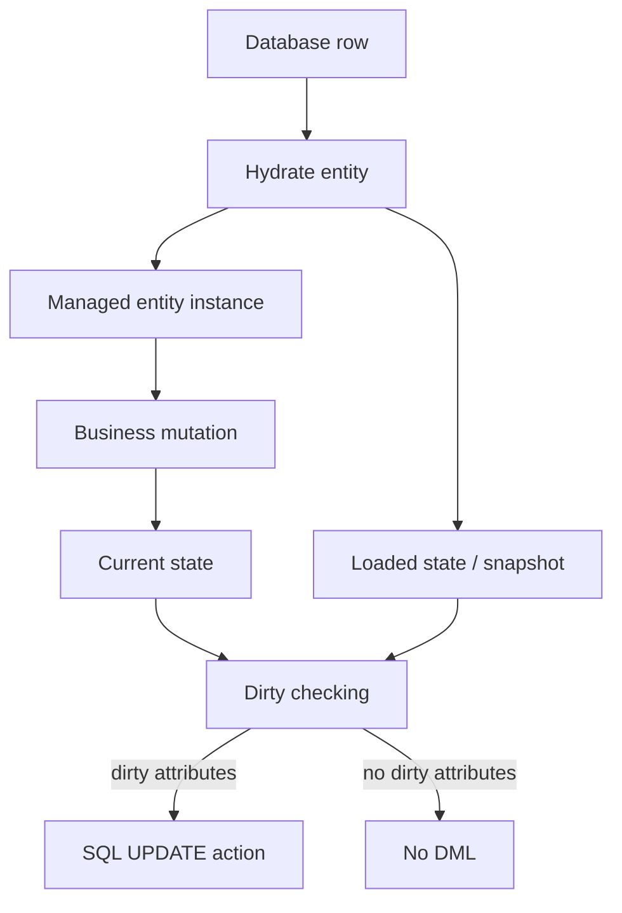
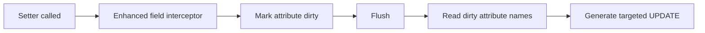

# Part 007 — Dirty Checking and Change Tracking Algorithms

> Target bagian ini: kita bisa menjelaskan **kapan provider menganggap entity berubah**, bagaimana perubahan itu ditemukan, kenapa update SQL bisa muncul walau kita tidak memanggil `save`, kenapa update bisa tidak muncul walau object terlihat berubah, dan bagaimana memilih strategi tracking yang benar untuk correctness dan performance.

Dirty checking adalah proses ORM untuk menentukan apakah managed entity sudah berubah sejak baseline terakhir yang diketahui provider. Pada level pemakaian, dirty checking terasa seperti magic:

```java
@Transactional
public void changeStatus(Long id) {
    CaseFile caseFile = entityManager.find(CaseFile.class, id);
    caseFile.escalate("SLA breached");
    // tidak ada repository.save(caseFile)
}
```

Namun pada flush, provider bisa menghasilkan:

```sql
update case_file
set status = ?, escalation_reason = ?, version = ?
where id = ? and version = ?
```

Mental model yang benar:

> **Setter tidak menyimpan data. Setter hanya mengubah object. Dirty checking menentukan apakah perubahan object tersebut harus diterjemahkan menjadi SQL saat flush.**

---

## 1. Kenapa Dirty Checking Penting di Level Top Engineer

Dirty checking memengaruhi correctness dan biaya runtime:

| Area | Dampak dirty checking |
|---|---|
| Correctness | menentukan perubahan mana yang benar-benar masuk database |
| Transaction safety | menentukan update yang ikut flush pada boundary transaction |
| Performance | menentukan biaya scan entity, snapshot compare, dan jumlah SQL update |
| Locking | menentukan kolom yang ikut optimistic locking dirty/all mode |
| Audit | menentukan apakah audit melihat perubahan yang benar |
| Caching | menentukan invalidation entity/collection cache |
| Domain model | menentukan apakah setter, collection mutation, dan mutable values aman |

Jika dirty checking dipahami dangkal, bug yang muncul sering terlihat seperti:

- `UPDATE` muncul padahal business code tidak eksplisit menyimpan;
- `UPDATE` tidak muncul karena object berubah di luar tracking path;
- seluruh kolom ikut di-update walau hanya satu field berubah;
- mutable `Date`, array, JSON-like object, atau embeddable menyebabkan false positive/false negative;
- collection update menghasilkan delete-insert besar;
- detached object dimodifikasi lalu perubahan hilang;
- read-only query tetap object-nya diubah di memory dan menyesatkan developer;
- long persistence context menjadi lambat karena terlalu banyak managed entity harus diperiksa.

---

## 2. Kaufman Skill Decomposition

Untuk menguasai dirty checking, pecah skill menjadi unit yang bisa dilatih cepat:

| Sub-skill | Pertanyaan inti | Latihan |
|---|---|---|
| Baseline reasoning | Baseline perubahan disimpan kapan? | load entity, mutate, flush, inspect SQL |
| Managed-state reasoning | Apakah object ini managed, detached, proxy, read-only, atau clone? | cek `contains`, clear, merge, detach |
| Attribute-level reasoning | Field mana yang dianggap berubah? | ubah satu field, bandingkan SQL |
| Mutable-value reasoning | Apakah perubahan internal value terdeteksi? | mutate `Date`, array, JSON holder |
| Collection tracking | Mutasi collection apa yang dianggap dirty? | add/remove/replace list/set/map |
| Enhancement/weaving reasoning | Apakah provider memakai snapshot scan atau self tracking? | aktifkan enhancement/weaving lalu ukur flush |
| Provider comparison | Hibernate dan EclipseLink mendeteksi perubahan dengan cara apa? | jalankan test yang sama pada dua provider |
| Failure diagnosis | Kenapa SQL update muncul/hilang? | baca SQL, statistics, debug flush |

Praktik terbaik: sebelum menjalankan test, tulis prediksi:

```text
Given:
- entity CaseFile(id=10, status=OPEN, priority=NORMAL)
- managed inside transaction
When:
- setPriority(HIGH)
- no explicit save
Then expected at flush:
- one UPDATE for case_file
- changed columns: priority and version
- no SQL for notes collection
```

Jika prediksi dan SQL aktual berbeda, berarti mental model kita belum presisi.

---

## 3. Dirty Checking sebagai State Comparison Problem

Secara konsep, dirty checking punya tiga elemen:

1. **Current state**: nilai field entity saat ini di memory.
2. **Loaded state / snapshot**: nilai field ketika entity dimuat, dipersist, atau terakhir disinkronkan.
3. **Change policy**: algoritma provider untuk membandingkan atau melacak perubahan.

Diagramnya:



Entity disebut **dirty** jika provider menyimpulkan bahwa current state berbeda dari baseline yang seharusnya masih mewakili database.

---

## 4. Empat Level Perubahan yang Harus Dibedakan

Tidak semua perubahan object sama. Untuk ORM, perubahan bisa terjadi di level berikut:

| Level | Contoh | Risiko |
|---|---|---|
| Scalar attribute | `caseFile.setStatus(CLOSED)` | biasanya mudah dilacak |
| Embedded value | `caseFile.getPeriod().setEndDate(now)` | tergantung mutability dan tracking |
| Association reference | `task.setAssignee(user)` | mengubah FK owning side |
| Collection membership | `caseFile.getTasks().add(task)` | bisa memicu join table/FK/collection table update |

Banyak developer hanya memikirkan scalar attribute. Di produksi, biaya dan bug terbesar sering datang dari embeddable dan collection.

---

## 5. Hibernate Default: Diff-Based Dirty Checking

Secara historis, Hibernate menggunakan pendekatan diff-based:

1. Saat entity menjadi managed, Hibernate menyimpan loaded state.
2. Saat flush, Hibernate mengunjungi managed entities.
3. Hibernate mengambil current state property entity.
4. Current state dibandingkan dengan loaded state menggunakan type-specific equality.
5. Jika ada perbedaan, Hibernate membentuk update action.

Pseudo-code mental model:

```java
for (EntityEntry entry : persistenceContext.managedEntityEntries()) {
    Object entity = entry.getEntity();
    Object[] loaded = entry.getLoadedState();
    Object[] current = persister.getPropertyValues(entity);

    int[] dirtyProperties = persister.findDirty(current, loaded, entity, session);

    if (dirtyProperties.length > 0) {
        actionQueue.add(new EntityUpdateAction(entity, dirtyProperties));
    }
}
```

Ini bukan source code literal, tetapi model yang cukup akurat untuk reasoning.

### 5.1 Kelebihan Diff-Based Checking

| Kelebihan | Kenapa penting |
|---|---|
| Thorough | bisa mendeteksi perubahan internal pada tipe mutable tertentu jika type mapping mendukungnya |
| Tidak butuh instrumentation | entity bisa POJO biasa |
| Robust untuk legacy model | cocok untuk domain model yang belum disiplin mutability |
| Provider controlled | equality dan mutability bisa dikendalikan type system |

### 5.2 Kelemahan Diff-Based Checking

| Kelemahan | Dampak |
|---|---|
| Flush cost naik dengan jumlah managed entity | long persistence context lambat |
| Butuh snapshot memory | memory pressure pada graph besar |
| Membandingkan banyak property | mahal untuk entity besar |
| Mutable custom type tricky | perlu `MutabilityPlan`/custom type yang benar |

Cost model sederhana:

```text
flush_dirty_check_cost ≈ managed_entities × persistent_attributes × comparison_cost
```

Jika persistence context berisi 20.000 entity, bahkan tanpa perubahan, flush masih bisa mahal jika provider harus scan snapshot banyak entity.

---

## 6. Hibernate Bytecode Enhancement: In-Line Dirty Tracking

Hibernate juga mendukung bytecode enhancement. Dengan enhancement, bytecode entity dimodifikasi agar entity bisa mencatat atribut mana yang berubah.

Modelnya:



Contoh konseptual hasil enhancement:

```java
public void setStatus(CaseStatus status) {
    if (!Objects.equals(this.status, status)) {
        this.$$_hibernate_trackChange("status");
    }
    this.status = status;
}
```

Kode di atas bukan kode yang kita tulis manual. Itu mental model dari entity yang sudah di-enhance.

### 6.1 Build-Time Enhancement Maven

```xml
<plugin>
    <groupId>org.hibernate.orm.tooling</groupId>
    <artifactId>hibernate-enhance-maven-plugin</artifactId>
    <version>${hibernate.version}</version>
    <executions>
        <execution>
            <configuration>
                <enableLazyInitialization>true</enableLazyInitialization>
                <enableDirtyTracking>true</enableDirtyTracking>
                <enableAssociationManagement>true</enableAssociationManagement>
            </configuration>
            <goals>
                <goal>enhance</goal>
            </goals>
        </execution>
    </executions>
</plugin>
```

### 6.2 Build-Time Enhancement Gradle

```kotlin
plugins {
    id("org.hibernate.orm") version "7.4.0.Final"
}

hibernate {
    enhancement {
        enableLazyInitialization = true
        enableDirtyTracking = true
        enableAssociationManagement = true
    }
}
```

Versi plugin harus mengikuti versi Hibernate yang digunakan project.

### 6.3 Kapan Enhancement Menguntungkan

Enhancement berguna saat:

- persistence context besar;
- entity punya banyak field;
- flush sering terjadi;
- entity umumnya immutable-ish atau perubahan dilakukan lewat setter/field interception yang diketahui provider;
- kita ingin lazy basic attribute;
- kita ingin association management tambahan.

Enhancement bukan pengganti desain persistence context yang baik. Jika transaction memuat 100.000 entity karena query salah, enhancement hanya mengurangi gejala, bukan akar masalah.

### 6.4 Risiko Enhancement

| Risiko | Penjelasan |
|---|---|
| Tooling mismatch | bytecode hasil build/test/prod harus konsisten |
| Reflection mutation | perubahan via reflection/unsafe path bisa melewati tracking tertentu |
| Mutable internals | object mutable bisa berubah tanpa setter entity dipanggil |
| Debug surprise | class runtime tidak persis seperti source |
| Library conflict | instrumentation lain bisa berinteraksi buruk |

Prinsipnya:

> Jika perubahan tidak melewati jalur yang diketahui enhancement, provider mungkin tidak tahu perubahan terjadi.

---

## 7. EclipseLink Change Tracking: Deferred, Attribute, Object, Auto

EclipseLink memiliki konsep change policy pada descriptor/entity. Mode yang umum:

| Mode | Mental model | Butuh weaving? | Karakteristik |
|---|---:|---:|---|
| `DEFERRED` | bandingkan semua managed object dengan backup copy saat commit/flush | tidak wajib | paling mirip snapshot diff |
| `ATTRIBUTE` | setter di-weave untuk mencatat attribute berubah | ya | paling granular |
| `OBJECT` | setter di-weave untuk menandai object dirty, lalu dibandingkan dengan backup | ya | kompromi antara marking dan comparison |
| `AUTO` | EclipseLink menentukan policy runtime | tergantung | default provider-driven |

Contoh penggunaan:

```java
import org.eclipse.persistence.annotations.ChangeTracking;
import org.eclipse.persistence.annotations.ChangeTrackingType;

@Entity
@ChangeTracking(ChangeTrackingType.DEFERRED)
public class CaseFile {
    @Id
    private Long id;

    private String status;
}
```

Atau via `eclipselink-orm.xml`:

```xml
<entity class="com.acme.casefile.CaseFile">
    <change-tracking type="DEFERRED"/>
</entity>
```

### 7.1 EclipseLink Deferred Change Tracking

Deferred berarti semua object yang relevan dibandingkan dengan backup saat flush/commit.

Kelebihan:

- tidak bergantung penuh pada setter weaving;
- lebih aman untuk beberapa perubahan via reflection;
- cocok untuk model legacy;
- behavior lebih mudah dipahami.

Kekurangan:

- cost naik dengan jumlah object;
- backup copy butuh memory;
- tidak segranular attribute tracking.

### 7.2 EclipseLink Attribute Change Tracking

Attribute tracking menandai attribute ketika setter dipanggil. Ini biasanya lebih cepat untuk entity besar dengan sedikit perubahan.

Kelebihan:

- commit/flush bisa lebih murah;
- change set lebih presisi;
- bagus jika model disiplin setter.

Kekurangan:

- butuh weaving;
- perubahan field langsung/reflection dapat tidak terdeteksi;
- collection relationship punya requirement/weaving detail yang harus diuji.

### 7.3 EclipseLink Object Change Tracking

Object tracking menandai object sebagai dirty saat setter dipanggil. Saat flush, object dirty dibandingkan dengan backup untuk menentukan detail perubahan.

Ini berguna ketika:

- object besar tetapi tidak semua object berubah;
- kita ingin menghindari scan semua object;
- attribute-level tracking terlalu sensitif/kompleks.

---

## 8. Hibernate vs EclipseLink: Mental Model Perbandingan

| Topik | Hibernate | EclipseLink |
|---|---|---|
| Default mental model | loaded snapshot + dirty diff | UnitOfWork clone/backup + change set |
| Enhancement/weaving | bytecode enhancement | static/dynamic weaving |
| Attribute tracking | enhanced dirty tracking | `ATTRIBUTE` change tracking |
| Object dirty marker | enhanced/self dirty tracking path | `OBJECT` change tracking |
| Collection tracking | persistent collection wrappers | indirection/collection tracking/weaving |
| Read-only optimization | read-only session/query/entity patterns | `@ReadOnly`, query hint, shared read-only behavior |
| Diagnostic style | SQL logs, statistics, event listeners | logging categories, profiler/session events |

Jangan menyamakan istilah secara literal. Hibernate berbicara dengan istilah `Session`, `PersistenceContext`, `EntityEntry`, `ActionQueue`; EclipseLink berbicara dengan istilah `Session`, `UnitOfWork`, `Descriptor`, `ChangeSet`. Yang sama adalah problem-nya: **menentukan delta dari object graph ke database row/relationship state**.

---

## 9. Dirty Checking dan Access Strategy

JPA mapping menentukan apakah provider mengakses state via field atau property. Penempatan `@Id` biasanya menentukan access strategy default.

Field access:

```java
@Entity
public class CaseFile {
    @Id
    private Long id;

    private String status;

    public void close() {
        this.status = "CLOSED";
    }
}
```

Property access:

```java
@Entity
public class CaseFile {
    private Long id;
    private String status;

    @Id
    public Long getId() {
        return id;
    }

    public String getStatus() {
        return status;
    }

    public void setStatus(String status) {
        this.status = status;
    }
}
```

Dirty checking harus dilihat bersama access strategy:

| Pertanyaan | Kenapa penting |
|---|---|
| Provider membaca field atau getter? | getter dengan logic bisa berbahaya |
| Setter dipakai atau field interception? | enhancement/weaving bisa berbeda |
| Business method mutate field langsung? | aman untuk field access, tetapi cek enhancement detail |
| Ada Lombok-generated setter? | setter bisa terlalu luas dan merusak invariant |

Untuk domain model enterprise, lebih aman memakai business method eksplisit daripada setter publik bebas:

```java
public void escalate(String reason, Clock clock) {
    if (this.status == CaseStatus.CLOSED) {
        throw new IllegalStateException("Closed case cannot be escalated");
    }
    this.status = CaseStatus.ESCALATED;
    this.escalationReason = reason;
    this.escalatedAt = Instant.now(clock);
}
```

Dirty checking akan menangkap hasil mutation, tetapi invariant tetap dikendalikan domain method.

---

## 10. Mutable Values: Sumber Bug yang Diremehkan

Dirty checking scalar immutable relatif mudah. Masalah muncul saat attribute bertipe mutable:

- `java.util.Date`;
- `Calendar`;
- byte array;
- custom mutable value object;
- JSON holder object;
- embeddable mutable;
- collection inside value object;
- object hasil converter.

Contoh rawan:

```java
CaseFile caseFile = em.find(CaseFile.class, id);
caseFile.getDeadlineDate().setTime(newTime); // tidak memanggil setter entity
```

Provider harus bisa mendeteksi bahwa internal state `Date` berubah. Snapshot diff bisa menangkap jika type mapping membuat deep copy dan equality benar. Attribute-level self tracking bisa tidak tahu jika setter entity tidak dipanggil, kecuali provider/type handling tetap melakukan check yang relevan.

Better model:

```java
public void reschedule(LocalDate newDeadline) {
    this.deadline = Objects.requireNonNull(newDeadline);
}
```

Gunakan tipe immutable:

- `LocalDate`;
- `Instant`;
- `OffsetDateTime` dengan kebijakan zona yang jelas;
- value object immutable;
- enum yang stabil;
- record embeddable jika provider/version mendukung dan cocok dengan model.

---

## 11. Embeddable Dirty Checking

Embeddable bukan entity. Ia tidak punya identity sendiri. Perubahannya dianggap bagian dari owning entity.

```java
@Embeddable
public class EscalationInfo {
    private String reason;
    private Instant escalatedAt;
}

@Entity
public class CaseFile {
    @Embedded
    private EscalationInfo escalationInfo;
}
```

Jika `escalationInfo.reason` berubah, yang dirty adalah `CaseFile`, bukan `EscalationInfo` sebagai row terpisah.

Praktik aman:

```java
@Embeddable
public record EscalationInfo(
    String reason,
    Instant escalatedAt
) {}

public void escalate(String reason, Clock clock) {
    this.escalationInfo = new EscalationInfo(reason, Instant.now(clock));
    this.status = CaseStatus.ESCALATED;
}
```

Mengganti embeddable immutable sebagai whole value biasanya lebih mudah diprediksi daripada mutate internal embeddable mutable.

---

## 12. Collection Dirty Checking

Collection adalah area yang berbeda dari scalar dirty checking. Provider biasanya mengganti collection biasa dengan wrapper/indirection collection.

Contoh:

```java
@OneToMany(mappedBy = "caseFile", cascade = CascadeType.ALL, orphanRemoval = true)
private List<Task> tasks = new ArrayList<>();
```

Setelah entity managed, `tasks` bisa bukan `ArrayList` polos. Hibernate bisa memakai persistent collection wrapper. EclipseLink bisa memakai indirection/weaving behavior.

### 12.1 Mutate Collection vs Replace Collection

Aman:

```java
public void addTask(Task task) {
    tasks.add(task);
    task.assignToCase(this);
}

public void removeTask(Task task) {
    tasks.remove(task);
    task.assignToCase(null);
}
```

Rawan:

```java
public void replaceTasks(List<Task> newTasks) {
    this.tasks = newTasks; // bisa mengganti provider-managed collection wrapper
}
```

Mengganti collection reference dapat menyebabkan provider kehilangan wrapper/tracking atau menganggap seluruh collection berubah. Untuk collection besar, ini bisa menjadi delete-insert storm.

### 12.2 List vs Set Dirty Semantics

| Collection | Risiko |
|---|---|
| `List` dengan `@OrderColumn` | perubahan posisi bisa menghasilkan banyak update index |
| `Set` | butuh `equals/hashCode` stabil; id-generated entity bisa tricky |
| `Map` | perubahan key berbeda dari perubahan value |
| Bag collection | duplicate element dan delete strategy bisa mahal |

Rule praktis:

> Jangan memilih collection Java hanya karena nyaman di domain. Pilih berdasarkan SQL mutation yang akan dihasilkan provider.

---

## 13. Dynamic Update dan Column-Level SQL

Secara default, provider bisa meng-update semua mapped columns atau hanya changed columns tergantung provider dan konfigurasi.

Hibernate menyediakan `@DynamicUpdate`:

```java
@Entity
@org.hibernate.annotations.DynamicUpdate
public class CaseFile {
    @Id
    private Long id;

    @Version
    private long version;

    private String status;
    private String priority;
    private String summary;
}
```

Dengan dynamic update, SQL bisa menjadi lebih sempit:

```sql
update case_file
set priority = ?, version = ?
where id = ? and version = ?
```

Tanpa dynamic update, provider bisa menghasilkan update yang mencakup lebih banyak kolom.

### 13.1 Kapan Dynamic Update Berguna

- tabel sangat lebar;
- update sparse;
- banyak kolom besar nullable;
- optimistic locking dirty-column strategy;
- trigger database sensitif terhadap kolom yang di-update.

### 13.2 Kapan Dynamic Update Tidak Otomatis Lebih Baik

- SQL statement shape menjadi lebih variatif;
- statement cache reuse bisa turun;
- database plan cache bisa lebih banyak variasi;
- overhead menentukan kolom dirty tetap ada;
- untuk tabel kecil, manfaatnya mungkin kecil.

Decision rule:

```text
Use dynamic update only when measured benefit > SQL-shape/cache complexity.
```

---

## 14. Read-Only Entity dan Dirty Checking Avoidance

Tidak semua loaded entity perlu dirty checked. Untuk read-heavy path, kita bisa memakai read-only mode.

Hibernate contoh:

```java
Session session = entityManager.unwrap(Session.class);
session.setDefaultReadOnly(true);

CaseFile view = session.find(CaseFile.class, id);
```

Query-level:

```java
List<CaseFile> cases = entityManager
    .createQuery("select c from CaseFile c where c.status = :status", CaseFile.class)
    .setParameter("status", CaseStatus.CLOSED)
    .setHint("org.hibernate.readOnly", true)
    .getResultList();
```

EclipseLink memiliki `@ReadOnly` dan query hint read-only. Namun read-only object tidak boleh dimodifikasi sebagai domain object aktif. Itu bukan “entity normal tapi tidak auto-save”; itu harus diperlakukan sebagai read model.

Bahaya:

```java
CaseFile readOnlyCase = queryReturningReadOnlyObject();
readOnlyCase.escalate("bad"); // mutation in memory, not persisted as expected
```

Jika object read-only dishare dari cache, memodifikasinya bisa merusak asumsi cache/provider. Anggap read-only entity sebagai immutable dari sisi aplikasi.

---

## 15. Detached Object: Dirty Checking Tidak Berlaku

Dirty checking hanya berlaku untuk managed object dalam persistence context.

```java
CaseFile caseFile = em.find(CaseFile.class, id);
em.detach(caseFile);

caseFile.escalate("outside context");

// Tidak ada dirty checking otomatis untuk object detached ini.
```

Jika memakai `merge`:

```java
CaseFile merged = em.merge(caseFile);
```

Yang managed adalah return value `merged`, bukan instance detached asal. Kesalahan umum:

```java
CaseFile detached = loadDetached();
CaseFile merged = em.merge(detached);

detached.setStatus(CLOSED); // salah target; dirty checking tidak tracking detached
```

Benar:

```java
CaseFile merged = em.merge(detached);
merged.close(clock);
```

Namun untuk update API enterprise, pattern yang lebih defensible biasanya:

```java
@Transactional
public void closeCase(CloseCaseCommand command) {
    CaseFile caseFile = em.find(CaseFile.class, command.caseId(), LockModeType.OPTIMISTIC);
    caseFile.close(command.reason(), clock);
}
```

Load managed entity, jalankan domain mutation, biarkan dirty checking bekerja.

---

## 16. Direct Field Mutation, Reflection, and Frameworks

Framework mapping, JSON binding, reflection utilities, dan test helper dapat mengubah field tanpa melewati setter/business method.

Contoh rawan:

```java
ReflectionTestUtils.setField(caseFile, "status", CaseStatus.CLOSED);
```

Dalam Hibernate diff-based snapshot, perubahan field masih mungkin terlihat pada flush karena current state dibandingkan dengan loaded state. Dalam tracking berbasis setter/weaving tertentu, perubahan semacam ini bisa tidak tercatat seperti yang diharapkan.

Dalam EclipseLink `ATTRIBUTE` atau `OBJECT`, perubahan field melalui reflection dapat melewati event setter yang dipakai tracking. `DEFERRED` lebih toleran karena membandingkan state saat flush.

Rule praktis:

> Semakin agresif tracking optimization, semakin penting disiplin mutation path.

Untuk domain enterprise, mutation harus lewat method yang menjaga invariant, bukan reflection/DTO mapper langsung ke entity managed.

---

## 17. Dirty Checking dan `equals/hashCode`

Dirty checking scalar tidak sama dengan `equals/hashCode` entity. Namun collection berbasis `Set` dan `Map` sangat dipengaruhi oleh equality.

Bahaya entity dengan generated id:

```java
@Override
public boolean equals(Object other) {
    if (!(other instanceof Task task)) return false;
    return Objects.equals(id, task.id);
}

@Override
public int hashCode() {
    return Objects.hash(id);
}
```

Jika entity baru dimasukkan ke `HashSet` sebelum id digenerate, lalu id berubah setelah persist, hash code berubah. Set bisa rusak secara logical.

Untuk collection dirty checking, ini bisa menyebabkan:

- remove gagal;
- duplicate tampak muncul;
- provider melihat collection berubah aneh;
- orphan removal tidak sesuai prediksi.

Praktik aman tergantung domain:

- gunakan immutable natural key jika benar-benar stabil;
- gunakan constant hash code pattern untuk generated id entity;
- hindari `Set` untuk entity dengan identity belum stabil jika tidak perlu;
- jangan memasukkan mutable field ke `hashCode`.

---

## 18. False Positive dan False Negative

Dirty checking idealnya mendeteksi perubahan nyata. Namun dua error class tetap mungkin.

### 18.1 False Positive

Provider menganggap dirty padahal secara bisnis tidak berubah.

Contoh penyebab:

- setter dipanggil dengan value sama tetapi tracking menandai dirty;
- custom type equality salah;
- array dibandingkan by reference;
- BigDecimal scale berbeda padahal business equal;
- converter menghasilkan representasi berbeda;
- entity listener mengubah timestamp setiap flush.

Dampak:

- update SQL tidak perlu;
- version increment tidak perlu;
- optimistic lock conflict palsu;
- audit noise;
- cache invalidation berlebihan.

### 18.2 False Negative

Provider tidak menganggap dirty padahal bisnis berubah.

Contoh penyebab:

- mutable object berubah tanpa deep copy/snapshot tepat;
- reflection melewati attribute tracking;
- collection wrapper diganti;
- custom type menyatakan immutable padahal mutable;
- converter object internal berubah tetapi serialized value dianggap sama;
- detached object dimodifikasi tanpa merge/load ulang.

Dampak:

- update hilang;
- audit tidak lengkap;
- business invariant tampak sukses di memory tapi hilang setelah reload;
- regulatory trace rusak.

---

## 19. Custom Type dan Mutability Contract

Ketika memakai custom mapping type, JSON type, array type, atau converter, pertanyaan utama:

1. Apakah value immutable?
2. Jika mutable, bagaimana deep copy dibuat?
3. Bagaimana equality ditentukan?
4. Bagaimana value disassemble/assemble untuk cache?
5. Bagaimana provider tahu field dirty?

Contoh value object immutable:

```java
public record Money(BigDecimal amount, Currency currency) {
    public Money {
        Objects.requireNonNull(amount);
        Objects.requireNonNull(currency);
        amount = amount.setScale(currency.getDefaultFractionDigits(), RoundingMode.UNNECESSARY);
    }
}
```

Dengan immutable value, dirty checking lebih sederhana: jika reference diganti ke value yang tidak equal, field dirty. Jika tidak diganti, tidak ada internal mutation tersembunyi.

Untuk JSON:

```java
public record CaseMetadata(
    String sourceSystem,
    Map<String, String> labels
) {
    public CaseMetadata {
        labels = Map.copyOf(labels);
    }
}
```

Jangan simpan mutable `HashMap` langsung sebagai JSON attribute jika business path dapat mengubahnya in-place.

---

## 20. Entity Listener dan Dirty Checking

Entity listeners dapat mengubah entity tepat sebelum persist/update:

```java
@PreUpdate
public void touch() {
    this.updatedAt = Instant.now();
}
```

Ini terlihat praktis, tetapi ada trade-off:

| Benefit | Risiko |
|---|---|
| timestamp otomatis | setiap update mengubah kolom audit teknis |
| common behavior terpusat | listener bisa menyembunyikan mutation |
| mudah diterapkan | debugging dirty state lebih sulit |

Pertanyaan penting:

- Apakah `updatedAt` menyebabkan version increment? Biasanya iya karena update terjadi.
- Apakah listener dipanggil jika provider tidak mendeteksi dirty property lain? Tergantung event lifecycle dan provider path.
- Apakah bulk update memanggil listener? JPQL bulk update tidak memperlakukan entity instance satu per satu.

Untuk audit yang regulatif, jangan hanya mengandalkan entity callback. Gunakan audit table/outbox/envers-like mechanism yang diuji terhadap bulk path.

---

## 21. Dirty Checking dan Optimistic Locking

Dengan `@Version`, dirty update biasanya menaikkan version:

```java
@Entity
public class CaseFile {
    @Id
    private Long id;

    @Version
    private long version;

    private CaseStatus status;
}
```

SQL umum:

```sql
update case_file
set status = ?, version = ?
where id = ? and version = ?
```

Jika provider menghasilkan false positive update, version dapat naik tanpa perubahan bisnis. Jika provider miss dirty change, version tidak naik dan perubahan hilang.

Hibernate memiliki opsi optimisitic locking yang lebih spesifik seperti dirty/all pada mode tertentu, tetapi itu harus dipilih dengan pemahaman SQL predicate dan dynamic update. Jangan gunakan mode advanced hanya karena ingin “lebih aman”. Uji conflict behavior.

---

## 22. Performance Model Dirty Checking

Model biaya:

```text
Total flush cost = dirty_detection_cost + SQL_generation_cost + JDBC_execution_cost + cache_invalidation_cost
```

Dirty detection cost dipengaruhi oleh:

- jumlah managed entities;
- jumlah persistent attributes;
- jumlah collections;
- mode enhancement/weaving;
- mutability type;
- read-only flags;
- flush frequency;
- persistence context lifetime.

Contoh anti-pattern:

```java
@Transactional
public void processAll() {
    List<CaseFile> cases = em.createQuery(
        "select c from CaseFile c", CaseFile.class
    ).getResultList();

    for (CaseFile c : cases) {
        if (shouldNotify(c)) {
            notificationClient.send(c);
        }
    }
}
```

Jika hanya membaca untuk notification, entity managed ribuan object akan ikut persistence context dan dirty checking. Lebih baik projection/read-only/streaming dengan boundary jelas.

---

## 23. Flush Chunking untuk Batch Mutation

Untuk batch update entity-managed:

```java
@Transactional
public void expireOldCases(List<Long> ids) {
    int i = 0;
    for (Long id : ids) {
        CaseFile caseFile = em.find(CaseFile.class, id);
        caseFile.expire(clock);

        if (++i % 50 == 0) {
            em.flush();
            em.clear();
        }
    }
}
```

Tujuan:

- membatasi jumlah managed entities;
- membatasi snapshot memory;
- membuat dirty checking per chunk;
- membuat SQL failure lebih dekat dengan item penyebab;
- mengurangi memory pressure.

Risiko:

- setelah `clear`, semua entity detached;
- jangan memegang reference entity untuk dipakai setelah clear;
- domain event yang butuh entity managed harus dikumpulkan sebelum clear;
- error handling harus tahu chunk yang gagal.

---

## 24. Provider-Specific Diagnostics

### 24.1 Hibernate

Aktifkan SQL dan statistik:

```properties
hibernate.show_sql=false
hibernate.format_sql=true
hibernate.generate_statistics=true
hibernate.session.events.log.LOG_QUERIES_SLOWER_THAN_MS=50
```

Logging kategori umum:

```properties
org.hibernate.SQL=DEBUG
org.hibernate.orm.jdbc.bind=TRACE
org.hibernate.stat=DEBUG
```

Hal yang diamati:

- entity update count;
- flush count;
- dirty checking spikes;
- collection recreate/update/remove count;
- SQL shape;
- parameter values;
- version update.

### 24.2 EclipseLink

Contoh properties:

```xml
<property name="eclipselink.logging.level" value="FINE"/>
<property name="eclipselink.logging.parameters" value="true"/>
<property name="eclipselink.profiler" value="PerformanceProfiler"/>
```

Hal yang diamati:

- UnitOfWork commit logs;
- change set behavior;
- SQL generated;
- bind parameters;
- cache hits/misses;
- weaving status.

---

## 25. Testing Dirty Checking

Test harus membuktikan behavior, bukan hanya repository method return value.

### 25.1 Test: Managed Mutation Produces Update

```java
@Test
void managedMutationProducesUpdate() {
    tx(() -> {
        CaseFile c = em.find(CaseFile.class, caseId);
        c.escalate("SLA breached", clock);
    });

    tx(() -> {
        CaseFile reloaded = em.find(CaseFile.class, caseId);
        assertThat(reloaded.getStatus()).isEqualTo(CaseStatus.ESCALATED);
    });
}
```

### 25.2 Test: Detached Mutation Does Not Auto Persist

```java
@Test
void detachedMutationIsNotTracked() {
    CaseFile detached = txReturn(() -> em.find(CaseFile.class, caseId));

    detached.escalate("outside context", clock);

    tx(() -> {
        // no merge, no managed mutation
    });

    tx(() -> {
        CaseFile reloaded = em.find(CaseFile.class, caseId);
        assertThat(reloaded.getStatus()).isNotEqualTo(CaseStatus.ESCALATED);
    });
}
```

### 25.3 Test: SQL Count / Update Count

Untuk top-level regression, gunakan query counter atau provider statistics agar N+1/update storm terdeteksi.

```text
Expected update count: 1
Expected collection recreate count: 0
Expected select count: <= 2
```

Test seperti ini menangkap regression yang unit test biasa lewatkan.

---

## 26. Dirty Checking Checklist

Gunakan checklist ini saat review entity/model:

- Apakah entity mutable hanya melalui business method?
- Apakah field mutable internal dihindari?
- Apakah embeddable immutable jika memungkinkan?
- Apakah collection tidak pernah diganti reference-nya secara sembarang?
- Apakah `Set` memakai equality stabil?
- Apakah read-only query tidak dipakai untuk mutation?
- Apakah detached object tidak dijadikan update API utama?
- Apakah custom type/converter punya mutability/equality yang benar?
- Apakah batch job melakukan `flush/clear` per chunk?
- Apakah dynamic update digunakan hanya setelah ada alasan konkret?
- Apakah provider enhancement/weaving konsisten di build, test, dan production?
- Apakah SQL update count diuji untuk path penting?

---

## 27. Production Failure Playbook

### Kasus A — Update muncul tanpa `save`

Kemungkinan:

- entity managed dimutasi dalam transaction;
- mapper mengisi DTO ke entity managed;
- entity listener mengubah field;
- collection wrapper berubah;
- setter dipanggil walau value sama dan tracking menandai dirty.

Investigasi:

1. Cari transaction boundary.
2. Cari semua mutation path entity.
3. Aktifkan SQL bind log.
4. Cek update columns.
5. Cek listener/interceptor.
6. Cek mapper framework.

### Kasus B — Update tidak muncul

Kemungkinan:

- object detached;
- transaction tidak aktif;
- mutation terjadi setelah `clear`;
- field mutable berubah tanpa tracking;
- read-only mode;
- provider tracking mode melewati reflection/direct field change;
- custom type salah mutability.

Investigasi:

1. Cek `em.contains(entity)`.
2. Cek flush/commit benar-benar terjadi.
3. Reload dari database di transaction baru.
4. Cek read-only hint/session.
5. Cek enhancement/weaving.
6. Cek type/converter equality.

### Kasus C — Banyak update tidak perlu

Kemungkinan:

- mapper menulis semua field;
- `updatedAt` selalu berubah;
- dynamic update tidak aktif pada tabel lebar;
- custom type false positive;
- collection replacement;
- merge detached graph besar.

Investigasi:

1. Bandingkan DTO patch vs full replace.
2. Cek columns yang di-update.
3. Cek version increments.
4. Cek collection SQL.
5. Ganti pattern ke load-and-mutate explicit.

---

## 28. Latihan 20 Jam: Dirty Checking Mastery

### Drill 1 — Predict Scalar Update

- Load entity.
- Ubah satu field.
- Prediksi SQL.
- Jalankan.
- Jelaskan update columns dan version.

### Drill 2 — Mutable Value Trap

- Mapping `Date` atau mutable custom object.
- Mutate internal state tanpa setter.
- Bandingkan Hibernate default vs enhanced, EclipseLink deferred vs attribute jika memungkinkan.

### Drill 3 — Collection Replacement

- Buat parent-child `@OneToMany`.
- Mutate via add/remove helper.
- Lalu replace whole collection.
- Bandingkan SQL.

### Drill 4 — Detached Merge Trap

- Load entity lalu detach.
- Mutate detached.
- Panggil `merge` tetapi lanjut mutate object lama.
- Buktikan perubahan mana yang persist.

### Drill 5 — Read-Only Path

- Query read-only.
- Mutate object.
- Flush.
- Reload.
- Dokumentasikan provider behavior dan risiko.

---

## 29. Mental Model Final

Dirty checking bukan fitur convenience. Dirty checking adalah **delta detection engine** antara object graph dan relational state.

Rumus berpikir:

```text
Will SQL UPDATE happen?
= entity is managed
+ transaction/flush happens
+ provider detects meaningful state delta
+ entity/attribute is not read-only/non-updatable
+ mutation is not bypassing tracking path
```

Jika salah satu komponen false, update bisa tidak terjadi.

Jika semua true, update bisa terjadi bahkan tanpa `save()` eksplisit.

---

## 30. Ringkasan

- Dirty checking hanya berlaku untuk managed entity.
- Hibernate default menggunakan snapshot diff; enhancement dapat membuat entity melakukan self dirty tracking.
- EclipseLink menyediakan change tracking policy seperti deferred, attribute, object, dan auto.
- Mutable values dan collection adalah sumber bug dirty checking paling umum.
- Read-only optimization harus diperlakukan sebagai read model, bukan entity normal.
- Detached object tidak otomatis dirty checked.
- Dynamic update adalah tuning tool, bukan default universal.
- Provider optimization mengharuskan mutation path lebih disiplin.
- Test harus memverifikasi SQL/update count, bukan hanya object state in-memory.

Part berikutnya membahas identifier generation: bagaimana ID dipilih, kapan ID tersedia, kenapa `IDENTITY` bisa merusak insert batching, bagaimana sequence allocation bekerja, dan bagaimana memilih ID strategy yang benar untuk throughput serta integritas data.

---

## Rujukan Resmi

- Hibernate ORM User Guide — Bytecode enhancement, in-line dirty tracking, identifiers, optimizers: https://docs.hibernate.org/stable/orm/userguide/html_single/
- EclipseLink JPA Extensions — `@ChangeTracking`: https://eclipse.dev/eclipselink/documentation/4.0/jpa/extensions/jpa-extensions.html
- EclipseLink Concepts — persistence context reference mode, read-only entities, UnitOfWork behavior: https://eclipse.dev/eclipselink/documentation/4.0/concepts/concepts.html
- Jakarta Persistence 3.2 Specification: https://jakarta.ee/specifications/persistence/3.2/jakarta-persistence-spec-3.2
