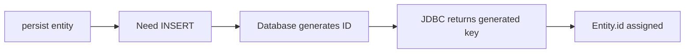
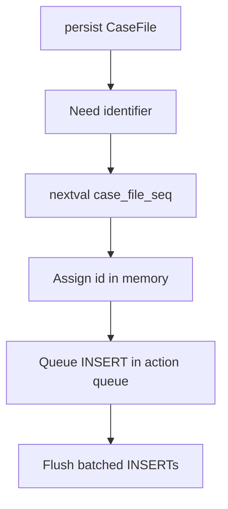
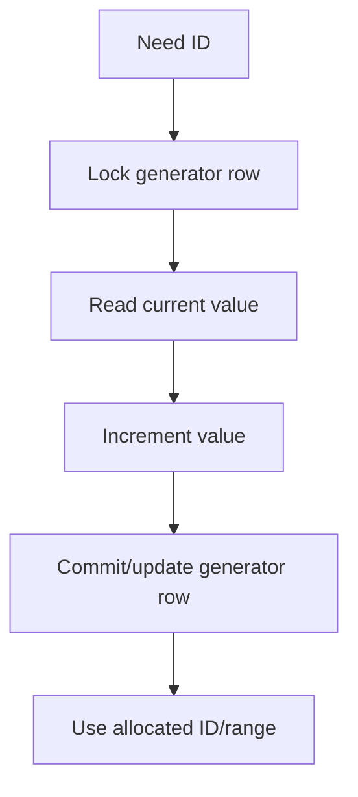

# Part 008 — Identifier Generation: Correctness, Throughput, and Database Semantics

> Target bagian ini: kita bisa memilih identifier strategy secara defensible berdasarkan correctness, insert throughput, database capability, batching, migration, sharding, observability, dan interoperability dengan sistem lain. Kita tidak hanya tahu `@GeneratedValue`, tetapi bisa menjelaskan konsekuensi SQL dan operational-nya.

Identifier bukan detail kosmetik. Identifier menentukan:

- kapan entity dianggap punya identity;
- kapan row bisa diinsert;
- apakah insert bisa dibatch;
- apakah ID bisa dipakai sebelum flush;
- apakah external system bisa membuat row;
- apakah migration aman;
- apakah index locality bagus;
- apakah identifier leak informasi bisnis;
- bagaimana cache key dan association key dibentuk.

Kalimat inti:

> **ID strategy adalah kontrak antara object lifecycle, ORM flush engine, database generator, dan operational topology.**

---

## 1. Kenapa Identifier Generation Harus Dipahami Serius

Banyak desain persistence terlihat benar di development tetapi gagal di production karena ID strategy salah:

- insert batching mati karena `IDENTITY`;
- sequence allocation mismatch menghasilkan gap besar atau duplicate risk setelah manual reset;
- TABLE generator menjadi bottleneck karena row lock;
- UUID random membuat index bloat dan poor locality;
- composite key membuat mapping association sulit;
- natural key berubah karena business rule berubah;
- ID tersedia terlalu terlambat untuk outbox/event correlation;
- multi-tenant system bocor karena ID tidak scoped;
- migration dari Hibernate ke EclipseLink mengubah default generator behavior.

Top engineer tidak bertanya “pakai Long atau UUID?”. Pertanyaan yang benar:

```text
Who generates the identifier?
When is it generated?
Is it globally unique or database-local?
Does it preserve insert batching?
Can other systems generate compatible IDs?
What happens during rollback?
What happens during migration/reset/import?
What index shape does it create?
What semantics does the ID expose?
```

---

## 2. Kaufman Skill Decomposition

| Sub-skill | Pertanyaan inti | Latihan |
|---|---|---|
| Lifecycle timing | ID tersedia saat `persist`, flush, atau commit? | log ID sebelum/after persist/flush |
| Strategy semantics | `IDENTITY`, `SEQUENCE`, `TABLE`, `UUID` berbeda apa? | inspect SQL per strategy |
| Batching reasoning | Strategy mana yang mematikan insert batching? | insert 100 rows, hitung statement batch |
| Allocation reasoning | Apa arti `allocationSize`? | sequence increment 1 vs 50 vs pooled |
| Provider reasoning | Hibernate dan EclipseLink memilih default apa? | jalankan mapping sama di dua provider |
| Database reasoning | PostgreSQL/Oracle/MySQL beda apa? | compare DDL dan generated SQL |
| Migration safety | Bagaimana reset sequence tanpa duplicate? | simulate import + sequence repair |
| Key modeling | Kapan natural/composite/surrogate key tepat? | desain aggregate dengan external reference |

Latihan utama: buat matriks 4 strategi dan catat:

```text
strategy | ID before insert? | extra select? | batching? | DB dependency? | rollback gap? | external insert safe?
```

---

## 3. Identifier Lifecycle Mental Model

Identifier generation terjadi di antara object creation dan row persistence.

```mermaid
graph TD
    A[new Entity()] --> B[persist(entity)]
    B --> C{ID generated now?}
    C -->|UUID/sequence pre-allocation| D[Entity has ID before INSERT]
    C -->|IDENTITY| E[INSERT needed to get ID]
    D --> F[Flush]
    E --> F
    F --> G[SQL INSERT]
    G --> H[Database row]
    H --> I[Commit or rollback]
```

Hal yang harus dibedakan:

| Event | Artinya |
|---|---|
| Java object created | belum punya persistence identity |
| `persist` called | entity menjadi managed/new |
| ID assigned | entity punya primary key value di memory |
| INSERT executed | row dikirim ke database transaction |
| commit | row menjadi durable untuk transaction lain |
| rollback | row/insert batal, tapi ID value/gap mungkin tetap ada |

ID yang sudah dialokasikan tidak selalu berarti row sudah commit.

---

## 4. Jakarta Persistence Generation Strategies

Jakarta Persistence menyediakan `GenerationType` utama:

```java
public enum GenerationType {
    TABLE,
    SEQUENCE,
    IDENTITY,
    UUID,
    AUTO
}
```

Mapping umum:

```java
@Entity
public class CaseFile {
    @Id
    @GeneratedValue(strategy = GenerationType.SEQUENCE, generator = "case_file_seq")
    @SequenceGenerator(
        name = "case_file_seq",
        sequenceName = "case_file_seq",
        allocationSize = 50
    )
    private Long id;
}
```

Penting:

- `@GeneratedValue` portable hanya untuk simple primary key;
- composite/derived ID tidak portably didukung untuk generated value;
- `AUTO` memberi provider kebebasan memilih;
- generator name punya scope global dalam persistence unit;
- `allocationSize` default spec adalah 50 untuk sequence/table generator;
- Jakarta Persistence 3.1 menambahkan support UUID generation di spec.

---

## 5. Assigned Identifier

Assigned ID berarti aplikasi mengisi ID sendiri:

```java
@Entity
public class ExternalCaseReference {
    @Id
    private String externalReference;
}
```

Kapan tepat:

- ID memang berasal dari upstream authoritative system;
- natural identifier benar-benar immutable;
- data import/reconciliation harus preserve ID;
- aggregate tidak dibuat jika ID tidak diketahui;
- event correlation memakai external business reference.

Risiko:

- aplikasi harus menjamin uniqueness;
- collision jadi application bug;
- tidak ada database generator membantu;
- key terlalu panjang bisa memperbesar index dan FK;
- business key bisa berubah karena regulasi/proses.

Rule:

> Assigned ID cocok jika identifier adalah bagian dari domain contract yang stabil, bukan sekadar database identity.

---

## 6. IDENTITY Strategy

Mapping:

```java
@Entity
public class AuditEvent {
    @Id
    @GeneratedValue(strategy = GenerationType.IDENTITY)
    private Long id;
}
```

Database contoh:

```sql
create table audit_event (
    id bigint generated by default as identity primary key,
    event_type varchar(100) not null
);
```

### 6.1 Mental Model

Dengan `IDENTITY`, database menghasilkan ID saat `INSERT`.



Konsekuensi:

- provider sering harus mengeksekusi insert lebih awal agar ID diketahui;
- insert batching biasanya tidak bisa dilakukan secara optimal untuk entity tersebut;
- ID tidak tersedia sebelum insert;
- cocok untuk database tanpa sequence tradisional;
- sederhana tetapi membatasi write-behind batching.

### 6.2 Kapan IDENTITY Masuk Akal

- database utama MySQL versi/konfigurasi yang tidak memakai sequence;
- write volume rendah/moderat;
- simplicity lebih penting daripada batching;
- entity jarang diinsert massal;
- tidak butuh ID sebelum insert untuk child/outbox dalam memory.

### 6.3 Kapan Hindari IDENTITY

- high-volume insert;
- batch import;
- aggregate membuat banyak child dalam satu transaction;
- butuh insert ordering fleksibel;
- butuh ID sebelum flush;
- ingin memaksimalkan JDBC batching.

Contoh masalah:

```java
for (int i = 0; i < 10_000; i++) {
    em.persist(new AuditEvent("CASE_UPDATED"));
}
```

Dengan IDENTITY, provider cenderung harus insert satu per satu untuk memperoleh generated key. Dengan sequence pooled, provider dapat preallocate ID lalu batch insert.

---

## 7. SEQUENCE Strategy

Mapping:

```java
@Entity
public class CaseFile {
    @Id
    @GeneratedValue(strategy = GenerationType.SEQUENCE, generator = "case_file_seq")
    @SequenceGenerator(
        name = "case_file_seq",
        sequenceName = "case_file_seq",
        allocationSize = 50
    )
    private Long id;
}
```

Database:

```sql
create sequence case_file_seq start with 1 increment by 50;
```

### 7.1 Mental Model

Sequence menghasilkan ID sebelum insert:



Konsekuensi positif:

- ID tersedia sebelum INSERT;
- provider bisa queue insert;
- JDBC insert batching lebih mudah;
- cocok untuk high-throughput writes;
- database sequence concurrency biasanya baik.

### 7.2 Sequence Gap Bukan Bug

Sequence gap bisa muncul karena:

- transaction rollback;
- sequence cache database;
- ORM allocation pool;
- application restart;
- failed insert setelah ID dialokasikan.

Jangan mendesain business rule yang mengharuskan primary key sequence gapless. Jika perlu nomor dokumen gapless, itu bukan primary key generator biasa. Itu domain numbering problem dengan lock/audit/regulatory policy tersendiri.

---

## 8. Allocation Size dan Optimizer

`allocationSize` menentukan berapa banyak identifier yang dialokasikan per round trip generator.

```java
@SequenceGenerator(
    name = "case_file_seq",
    sequenceName = "case_file_seq",
    allocationSize = 50
)
```

Jika provider memakai pooled optimizer, satu call ke sequence bisa memberi range 50 ID.

```text
next sequence value = 1
usable IDs = 1..50

next sequence value = 51
usable IDs = 51..100
```

### 8.1 Kenapa Allocation Size Penting

| allocationSize | Efek |
|---:|---|
| 1 | simple, tetapi banyak round trip ke sequence |
| 10 | kompromi kecil |
| 50 | default spec dan umum untuk throughput |
| 1000 | throughput tinggi, gap lebih besar saat crash/restart |

Trade-off:

```text
larger allocationSize
= fewer sequence round trips
+ better insert throughput
- larger possible gaps
- more care during manual sequence repair/import
```

### 8.2 Database Sequence Increment Harus Selaras

Untuk pooled optimizer yang mengasumsikan increment di database, sequence increment harus cocok dengan allocation size.

Misalignment contoh:

```java
@SequenceGenerator(allocationSize = 50)
```

Tetapi database:

```sql
create sequence case_file_seq increment by 1;
```

Konsekuensi tergantung provider/version/config. Bisa muncul warning, exception, wasted values, atau duplicate risk dalam skenario tertentu. Jangan biarkan schema migration dan annotation drift.

Rule:

> Treat sequence configuration as schema contract, not ORM decoration.

---

## 9. Hibernate Enhanced Generators dan Optimizers

Hibernate memiliki enhanced generators seperti `SequenceStyleGenerator` dan optimizer seperti:

| Optimizer | Mental model |
|---|---|
| `none` | call database setiap butuh ID |
| `pooled-lo` | database value adalah low boundary pool |
| `pooled` | database value adalah high boundary pool |
| `hilo`/legacy | legacy pool algorithm, tidak direkomendasikan untuk desain baru |

### 9.1 `pooled-lo` Mental Model

Jika sequence:

```sql
create sequence case_file_seq start with 1 increment by 20;
```

Lalu next value pertama adalah `1`, pooled-lo menganggap pool valid:

```text
1..20
```

Next value `21`:

```text
21..40
```

Database value adalah batas bawah pool.

### 9.2 `pooled` Mental Model

Dengan pooled, database value ditafsirkan sebagai batas atas pool.

Jika database value `20`, pool bisa:

```text
1..20
```

Jika database value `40`:

```text
21..40
```

Ini bisa mengejutkan saat manual reset sequence. Karena itu, operational runbook harus menyebut optimizer yang dipakai.

### 9.3 Hibernate Recommendation Praktis

Untuk database yang mendukung sequence:

```java
@Id
@GeneratedValue(strategy = GenerationType.SEQUENCE, generator = "case_file_seq")
@SequenceGenerator(
    name = "case_file_seq",
    sequenceName = "case_file_seq",
    allocationSize = 50
)
private Long id;
```

Pastikan migration DDL:

```sql
create sequence case_file_seq start with 1 increment by 50;
```

Lalu uji:

- insert batching aktif;
- sequence call count rendah;
- restart aplikasi tidak duplicate;
- manual import + repair aman.

---

## 10. EclipseLink Sequencing

EclipseLink memakai istilah sequencing. Ia mendukung strategi standar JPA dan extension sequencing. Hal yang perlu diperhatikan:

- native sequencing menggunakan mekanisme native database jika tersedia;
- table sequencing memakai table untuk menyimpan nilai sequence;
- table sequencing dapat butuh sequence connection pool pada external transaction/JTA tertentu untuk menghindari deadlock;
- UnitOfWork memerlukan ID untuk membangun identity/reference graph;
- descriptor/session configuration dapat memengaruhi sequencing.

Contoh standar:

```java
@Entity
public class CaseFile {
    @Id
    @GeneratedValue(strategy = GenerationType.SEQUENCE, generator = "case_file_seq")
    @SequenceGenerator(
        name = "case_file_seq",
        sequenceName = "case_file_seq",
        allocationSize = 50
    )
    private Long id;
}
```

Jika memakai TABLE sequencing dengan JTA dan muncul contention/deadlock, evaluasi property sequence connection pool:

```xml
<property name="eclipselink.connection-pool.sequence" value="true"/>
```

Gunakan hanya jika relevan untuk TABLE sequencing; native database sequence biasanya tidak memerlukan ini.

---

## 11. TABLE Generator

Mapping:

```java
@Entity
public class LegacyCase {
    @Id
    @GeneratedValue(strategy = GenerationType.TABLE, generator = "id_table")
    @TableGenerator(
        name = "id_table",
        table = "id_generator",
        pkColumnName = "gen_name",
        valueColumnName = "gen_value",
        pkColumnValue = "legacy_case",
        allocationSize = 50
    )
    private Long id;
}
```

Table:

```sql
create table id_generator (
    gen_name varchar(100) primary key,
    gen_value bigint not null
);
```

### 11.1 Mental Model

TABLE generator mengemulasi sequence menggunakan row table.



### 11.2 Kenapa TABLE Generator Sering Buruk

- butuh row lock;
- bisa jadi bottleneck global;
- butuh transaction khusus/separate connection pada beberapa kondisi;
- lebih lambat dari native sequence;
- lebih kompleks saat failover;
- portability-nya dibayar dengan performance.

Gunakan hanya jika:

- database benar-benar tidak punya sequence/identity yang cocok;
- legacy schema memaksa;
- write volume rendah;
- sudah diuji contention.

Untuk sistem enterprise baru, biasanya pilih sequence atau UUID/time-ordered ID sesuai topology.

---

## 12. UUID Strategy

Jakarta Persistence mendukung `GenerationType.UUID` untuk generated UUID.

```java
@Entity
public class EvidenceBlob {
    @Id
    @GeneratedValue(strategy = GenerationType.UUID)
    private UUID id;
}
```

Hibernate juga menyediakan `@UuidGenerator`:

```java
@Entity
public class EvidenceBlob {
    @Id
    @GeneratedValue
    @org.hibernate.annotations.UuidGenerator(style = org.hibernate.annotations.UuidGenerator.Style.TIME)
    private UUID id;
}
```

### 12.1 UUID Kelebihan

| Kelebihan | Kenapa berguna |
|---|---|
| application-side generation | tidak perlu round trip generator |
| globally unique | cocok distributed/multi-region |
| ID tersedia sebelum persist | mudah untuk correlation/outbox |
| hard to enumerate | lebih aman untuk public identifier, walau tetap butuh authorization |
| database-independent | lebih portable |

### 12.2 UUID Kekurangan

| Kekurangan | Dampak |
|---|---|
| random UUID poor locality | index fragmentation/bloat |
| lebih besar dari bigint | FK/index/cache key lebih mahal |
| readability rendah | debugging manual lebih sulit |
| string UUID lebih mahal | hindari `varchar(36)` jika DB punya UUID/native binary type |

### 12.3 UUID v4 vs Time-Ordered UUID

| Jenis | Karakteristik |
|---|---|
| UUID v4 random | distribusi random, unik, index locality buruk |
| UUID v1/time style | lebih time-related, locality lebih baik, ada privacy/implementation considerations |
| UUID v7 | time-ordered modern, bagus untuk index locality, tergantung provider/library support |

Jika provider belum mendukung UUID v7 secara native, kita bisa generate di aplikasi dengan library yang benar dan memakai assigned UUID.

```java
@Entity
public class PublicCaseId {
    @Id
    private UUID id;

    public static PublicCaseId create(UuidGenerator generator) {
        PublicCaseId entity = new PublicCaseId();
        entity.id = generator.nextUuidV7();
        return entity;
    }
}
```

Rule:

> UUID bukan otomatis lebih scalable. UUID random memindahkan bottleneck dari generator ke index locality dan storage cost.

---

## 13. Long/BIGINT vs UUID Decision Matrix

| Criterion | BIGINT sequence | UUID random | UUID time-ordered |
|---|---|---|---|
| Storage | kecil | besar | besar |
| FK/index size | kecil | besar | besar |
| Insert locality | sangat baik | buruk | baik |
| Global uniqueness | per database/sequence | global probabilistic | global probabilistic |
| ID before insert | ya dengan sequence | ya | ya |
| Batching | baik | baik | baik |
| External generation | perlu koordinasi | mudah | mudah |
| Human debugging | mudah | sedang/sulit | sedang/sulit |
| Enumeration risk | tinggi jika public | rendah | rendah |

Praktik umum enterprise:

- internal relational PK: `BIGINT` sequence jika single database/service boundary;
- public API ID: UUID/opaque external ID terpisah;
- distributed/offline creation: UUID/time-ordered ID sebagai PK atau external ID;
- high-volume append: sequence atau time-ordered UUID, bukan random UUID string.

---

## 14. Natural Key vs Surrogate Key

Natural key adalah key dari domain:

```java
@Entity
public class Country {
    @Id
    private String isoCode;
}
```

Surrogate key adalah key teknis:

```java
@Entity
public class CaseFile {
    @Id
    @GeneratedValue(strategy = GenerationType.SEQUENCE)
    private Long id;

    @NaturalId // Hibernate-specific
    private String caseNumber;
}
```

### 14.1 Kapan Natural Key Cocok sebagai Primary Key

- kecil;
- immutable secara legal/business;
- tidak ada privacy issue;
- dipakai luas sebagai reference;
- cardinality dan format stabil.

Contoh: ISO country code bisa cocok.

### 14.2 Kapan Jangan Jadikan Natural Key sebagai PK

- format bisa berubah;
- bisa reissued;
- ada typo correction;
- mengandung informasi sensitif;
- panjang;
- dipakai sebagai external display number;
- punya lifecycle sendiri.

Contoh `caseNumber` mungkin terlihat natural, tetapi dalam sistem regulatif bisa berubah karena migration, consolidation, correction, atau jurisdiction prefix. Lebih aman:

```text
id bigint primary key
case_number varchar unique not null
```

Primary key stabil. Business key diberi unique constraint dan audit rule.

---

## 15. Composite IDs

JPA menyediakan dua pattern:

- `@EmbeddedId`
- `@IdClass`

Contoh `@EmbeddedId`:

```java
@Embeddable
public record CasePartyId(
    Long caseId,
    Long partyId
) implements Serializable {}

@Entity
public class CaseParty {
    @EmbeddedId
    private CasePartyId id;

    @ManyToOne(fetch = FetchType.LAZY)
    @MapsId("caseId")
    private CaseFile caseFile;

    @ManyToOne(fetch = FetchType.LAZY)
    @MapsId("partyId")
    private Party party;
}
```

Composite ID cocok untuk join entity yang identity-nya memang gabungan parent references.

### 15.1 Composite ID Trade-Off

| Benefit | Cost |
|---|---|
| domain identity eksplisit | mapping lebih kompleks |
| no surrogate join id needed | FK ke entity ini lebih lebar |
| prevents duplicate association naturally | equals/hashCode harus presisi |
| good for association entity | refactoring lebih mahal |

Jangan memakai composite ID untuk semua entity “agar natural”. Gunakan ketika composite identity benar-benar bagian dari invariant.

---

## 16. Derived Identity dengan `@MapsId`

Derived identity berarti child ID bergantung pada parent ID.

Contoh one-to-one detail:

```java
@Entity
public class CaseFile {
    @Id
    @GeneratedValue(strategy = GenerationType.SEQUENCE)
    private Long id;

    @OneToOne(mappedBy = "caseFile", cascade = CascadeType.ALL, orphanRemoval = true)
    private CaseAssessment assessment;
}

@Entity
public class CaseAssessment {
    @Id
    private Long id;

    @MapsId
    @OneToOne(fetch = FetchType.LAZY)
    @JoinColumn(name = "id")
    private CaseFile caseFile;
}
```

`CaseAssessment.id` sama dengan `CaseFile.id`.

Kapan cocok:

- child tidak punya lifecycle tanpa parent;
- one-to-one composition kuat;
- ingin PK sekaligus FK;
- constraint database merepresentasikan aggregate boundary.

Risiko:

- insert ordering harus benar;
- parent ID harus tersedia;
- IDENTITY parent bisa memaksa insert lebih awal;
- detached graph merge lebih kompleks.

---

## 17. ID Timing dan Aggregate Creation

Misal aggregate:

```java
CaseFile caseFile = CaseFile.open(command);
caseFile.addTask(Task.initialReview());
caseFile.recordEvent(CaseOpenedEvent.from(caseFile));
em.persist(caseFile);
```

Pertanyaan:

- Apakah `caseFile.id` sudah tersedia saat event dibuat?
- Apakah child FK butuh parent ID sebelum insert?
- Apakah outbox event harus menyimpan aggregate ID?

Dengan sequence/UUID, ID bisa tersedia sebelum insert. Dengan IDENTITY, ID mungkin baru tersedia setelah insert/flush.

Pattern aman:

```java
CaseFile caseFile = CaseFile.open(command);
em.persist(caseFile);
em.flush(); // only if IDENTITY forces ID need; use carefully
outbox.add(CaseOpenedEvent.from(caseFile));
```

Namun explicit flush di tengah transaction bisa membawa constraint failure lebih awal dan memecah write-behind assumptions. Lebih baik pilih ID strategy yang sesuai jika event/outbox butuh ID early.

---

## 18. Insert Batching Implications

JDBC batching butuh provider bisa menunda insert dan mengirim banyak statement sejenis bersama.

Sequence/UUID:

```text
allocate ids -> queue inserts -> batch execute inserts
```

IDENTITY:

```text
insert row -> get generated key -> insert next row -> get generated key
```

Hibernate performance guidance secara umum: jika database mendukung sequence, sequence lebih baik untuk insert batching; IDENTITY membatasi batching untuk insert.

Contoh Hibernate properties:

```properties
hibernate.jdbc.batch_size=50
hibernate.order_inserts=true
hibernate.order_updates=true
```

Tetapi properties ini tidak menyelamatkan strategy yang membutuhkan immediate insert per entity.

### 18.1 Batch Test

```java
@Test
void insertBatchingShouldWork() {
    tx(() -> {
        for (int i = 0; i < 100; i++) {
            em.persist(CaseFile.open("case-" + i));
        }
    });

    assertThat(sqlCounter.insertCount("case_file")).isEqualTo(100);
    assertThat(sqlCounter.sequenceCallCount("case_file_seq")).isLessThanOrEqualTo(2);
    assertThat(batchMetrics.batchExecutionCount()).isLessThan(100);
}
```

Ini bukan unit test portability murni; ini performance contract test.

---

## 19. Rollback, Gaps, and Regulatory Numbering

Primary key generator tidak menjamin gapless numbering.

```text
T1 obtains id 100
T1 rollback
T2 obtains id 101
Visible rows: 101
Gap: 100
```

Ini normal.

Jika domain butuh nomor perkara/dokumen yang gapless atau auditable, buat model terpisah:

```text
case_file.id              -> technical primary key, may have gaps
case_file.case_number     -> business number, generated under stricter policy
case_number_allocation    -> audit allocation table
```

Regulatory numbering perlu jawaban terhadap:

- apakah nomor boleh gap karena rollback?
- apakah voided number harus tercatat?
- apakah nomor dibuat saat draft atau submit?
- apakah nomor scoped per office/year/type?
- siapa boleh reserve/cancel?
- bagaimana audit trail-nya?

Jangan memaksakan primary key sequence menjadi business numbering engine.

---

## 20. Sequence Repair After Import/Migration

Setelah import manual:

```sql
insert into case_file(id, status) values (100000, 'OPEN');
```

Sequence harus direpair:

PostgreSQL contoh:

```sql
select setval('case_file_seq', (select max(id) from case_file) + 50);
```

Namun nilai repair bergantung optimizer.

Untuk pooled-lo, lebih natural set ke next low boundary yang aman:

```text
next sequence value >= max(id) + 1
and aligned to allocationSize boundary if required by runbook
```

Untuk pooled high-boundary, repair bisa butuh `max(id) + allocationSize` agar pool berikut tidak overlap.

Operational runbook harus mencatat:

- provider;
- optimizer;
- allocation size;
- database sequence increment;
- repair formula;
- validation query;
- rollback plan.

Validation:

```sql
select max(id) from case_file;
select last_value from case_file_seq;
```

Lalu lakukan test insert melalui aplikasi sebelum membuka traffic normal.

---

## 21. Multi-Tenancy and Identifier Scope

Multi-tenant system punya beberapa pilihan:

### 21.1 Global ID

```text
id bigint primary key globally unique across tenants
```

Benefit:

- simple FK;
- cache key sederhana;
- trace/log mudah;
- cross-tenant admin tooling mudah.

Risk:

- ID sequence global dapat mengindikasikan total volume;
- tenant data harus tetap difilter oleh tenant_id/security boundary.

### 21.2 Tenant-Scoped Composite Key

```text
tenant_id + local_id as primary key
```

Benefit:

- local ID per tenant;
- natural sharding key;
- mencegah beberapa class cross-tenant FK bug.

Cost:

- semua FK lebih lebar;
- mapping lebih kompleks;
- cache key lebih kompleks;
- query harus selalu membawa tenant_id.

### 21.3 Global Surrogate + Tenant Unique Constraint

```sql
id bigint primary key,
tenant_id varchar not null,
case_number varchar not null,
unique (tenant_id, case_number)
```

Ini sering menjadi kompromi yang baik.

Rule:

> Tenant isolation tidak boleh bergantung pada ID opacity. Authorization dan query predicate tetap wajib benar.

---

## 22. Public ID vs Internal PK

Jangan selalu expose database PK ke API publik.

```java
@Entity
public class CaseFile {
    @Id
    @GeneratedValue(strategy = GenerationType.SEQUENCE)
    private Long id; // internal PK

    @Column(nullable = false, unique = true, updatable = false)
    private UUID publicId; // external reference
}
```

Creation:

```java
public static CaseFile open(OpenCaseCommand command, UuidGenerator uuidGenerator) {
    CaseFile c = new CaseFile();
    c.publicId = uuidGenerator.nextUuidV7();
    c.status = CaseStatus.OPEN;
    return c;
}
```

Benefit:

- internal FK tetap compact;
- public API tidak expose sequential IDs;
- migration internal lebih mudah;
- public references stabil.

Cost:

- unique index tambahan;
- mapping lookup by publicId;
- perlu enforce immutability.

---

## 23. Provider Portability Hazards

Mapping yang terlihat portable bisa berbeda behavior:

```java
@Id
@GeneratedValue
private Long id;
```

Dengan `AUTO`, provider/database bebas memilih strategy. Hibernate dan EclipseLink bisa memilih berbeda tergantung dialect/platform dan versi.

Untuk production, hindari implicit generator pada aggregate penting. Lebih baik eksplisit:

```java
@Id
@GeneratedValue(strategy = GenerationType.SEQUENCE, generator = "case_file_seq")
@SequenceGenerator(
    name = "case_file_seq",
    sequenceName = "case_file_seq",
    allocationSize = 50
)
private Long id;
```

Dan schema migration eksplisit:

```sql
create sequence case_file_seq start with 1 increment by 50;
```

Portability bukan berarti membiarkan provider memilih. Portability berarti contract jelas dan diuji di provider target.

---

## 24. Identifier and `equals/hashCode`

ID generation strategy memengaruhi equality.

Jika generated ID baru tersedia setelah persist, equality berbasis ID sebelum persist rawan.

Bad:

```java
@Override
public int hashCode() {
    return Objects.hash(id); // id null lalu berubah
}
```

Safer pattern untuk generated ID entity:

```java
@Override
public boolean equals(Object o) {
    if (this == o) return true;
    if (o == null || Hibernate.getClass(this) != Hibernate.getClass(o)) return false;
    CaseFile that = (CaseFile) o;
    return id != null && Objects.equals(id, that.id);
}

@Override
public int hashCode() {
    return getClass().hashCode();
}
```

Untuk provider-neutral code, hindari `Hibernate.getClass` jika ingin portability; namun proxy class handling tetap harus dipikirkan.

Alternative:

- gunakan business key immutable untuk equality jika benar-benar stabil;
- hindari entity di `HashSet` sebelum persisted;
- gunakan List untuk child collection jika set semantics tidak wajib;
- gunakan explicit duplicate check query/constraint.

---

## 25. Identifier and Outbox/Event Design

Outbox event sering butuh aggregate ID:

```java
CaseFile c = CaseFile.open(command);
em.persist(c);
outbox.persist(CaseOpened.of(c.getId(), c.getPublicId()));
```

Jika `c.getId()` null karena IDENTITY belum insert, ada tiga pilihan:

1. Gunakan sequence/UUID agar ID available before insert.
2. Flush setelah persist sebelum outbox creation.
3. Gunakan public ID generated by application sebagai event aggregate reference.

Pilihan 1 atau 3 biasanya lebih bersih daripada flush tengah transaction.

Event contract sebaiknya tidak tergantung pada database PK jika event dikonsumsi lintas bounded context. Gunakan stable external aggregate reference.

---

## 26. Database-Specific Notes

### 26.1 PostgreSQL

- sequence sangat natural;
- identity column tersedia;
- native UUID type tersedia;
- random UUID sebagai clustered/indexed PK dapat memperburuk locality;
- `bigserial`/identity mudah, tetapi sequence eksplisit lebih jelas untuk ORM allocation.

### 26.2 Oracle

- sequence sangat umum;
- identity tersedia di versi modern;
- sequence + allocation cocok untuk high throughput;
- perhatikan sequence cache dan RAC/topology jika relevan.

### 26.3 MySQL

- auto increment identity tradisional;
- sequence support tergantung versi/flavor;
- UUID string PK bisa mahal;
- pertimbangkan binary UUID/time-ordered UUID jika butuh distributed ID.

### 26.4 SQL Server

- identity dan sequence tersedia;
- sequence dapat dipakai untuk preallocation;
- uniqueidentifier tersedia tetapi random GUID clustered index bisa buruk.

Rule:

> ID strategy harus dipilih bersama database engine, bukan hanya dari annotation.

---

## 27. Recommended Strategy by Scenario

| Scenario | Recommended default | Reason |
|---|---|---|
| Java service + PostgreSQL/Oracle + high write | BIGINT `SEQUENCE` allocation 50/100 | batching, compact FK, good locality |
| MySQL low/moderate write | `IDENTITY` | simple and native |
| Distributed/offline creation | UUID/time-ordered assigned/generated | no central generator needed |
| Public API identifier | separate UUID public ID | avoid exposing internal sequence |
| Join entity identity | composite `@EmbeddedId` with `@MapsId` | natural association uniqueness |
| Reference data | assigned natural key | stable known code |
| Regulatory document number | separate numbering aggregate/table | audit/gap policy, not PK |
| Legacy no sequence DB | TABLE only if forced | portable but bottleneck risk |

---

## 28. Anti-Patterns

### 28.1 `AUTO` Everywhere

```java
@GeneratedValue
private Long id;
```

Problem:

- provider chooses strategy;
- migration changes behavior;
- batching expectation unclear;
- schema generation surprises.

### 28.2 TABLE Generator for High Throughput

Problem:

- row lock bottleneck;
- deadlock/connection complexity;
- poor scalability.

### 28.3 Random UUID String as Clustered PK

Problem:

- large index;
- fragmentation;
- poor locality;
- storage overhead in every FK.

### 28.4 Business Number as Primary Key

Problem:

- correction/migration difficult;
- reformatting impossible without FK cascade;
- privacy/exposure risk.

### 28.5 Sequence Reset Without Optimizer Awareness

Problem:

- duplicate IDs;
- negative/old pool range;
- production outage after import.

### 28.6 Composite Key by Default

Problem:

- mapping complexity;
- wide FK;
- difficult refactoring;
- awkward APIs.

---

## 29. Identifier Design Checklist

Use this during architecture review:

- Is the identifier technical or business semantic?
- Is the key immutable for the full lifetime of the row?
- Does the strategy preserve insert batching?
- Is ID needed before flush?
- Can rollback produce gaps, and is that acceptable?
- Is the database sequence increment aligned with ORM allocation size?
- Does the strategy work with provider migration?
- Is the ID exposed externally?
- Does ID reveal volume or ordering information?
- Is the index locality acceptable?
- Are FK sizes acceptable?
- Is sequence repair documented?
- Can external systems insert rows safely?
- Is equality/hashCode compatible with generated ID timing?
- Is multi-tenant scope explicit?

---

## 30. Testing Identifier Strategy

### 30.1 ID Timing Test

```java
@Test
void idTimingShouldBeKnown() {
    tx(() -> {
        CaseFile c = CaseFile.open("A");
        assertThat(c.getId()).isNull();

        em.persist(c);

        // expected depends on strategy
        assertThat(c.getId()).isNotNull(); // true for sequence/UUID, often false before insert for identity
    });
}
```

Write assertion according to chosen strategy, not generic expectation.

### 30.2 Batching Test

```java
@Test
void sequenceShouldAllowBatchInserts() {
    tx(() -> {
        for (int i = 0; i < 120; i++) {
            em.persist(CaseFile.open("case-" + i));
        }
    });

    assertThat(metrics.sequenceCalls("case_file_seq")).isLessThanOrEqualTo(3);
    assertThat(metrics.insertStatements("case_file")).isEqualTo(120);
    assertThat(metrics.jdbcBatchExecutions()).isLessThan(120);
}
```

### 30.3 Sequence Alignment Test

At startup or migration validation:

```sql
select increment_by
from information_schema.sequences
where sequence_name = 'case_file_seq';
```

Compare with expected allocation size from app config/mapping.

### 30.4 Collision/Uniqueness Test for Application UUID

```java
@Test
void publicIdShouldBeUnique() {
    Set<UUID> ids = IntStream.range(0, 1_000_000)
        .mapToObj(i -> uuidGenerator.next())
        .collect(Collectors.toSet());

    assertThat(ids).hasSize(1_000_000);
}
```

This is not a proof of mathematical uniqueness, but it catches broken generator implementation/configuration.

---

## 31. Production Runbook: Sequence Incident

### Symptom

Production error:

```text
duplicate key value violates unique constraint case_file_pkey
```

### Likely Causes

- manual import inserted high IDs;
- sequence not advanced;
- allocation/optimizer mismatch;
- restored database backup but app sequence cache stale;
- multi-node custom generator bug;
- database sequence recreated with wrong increment.

### Triage Steps

1. Stop writes to affected table if duplicate risk continues.
2. Check max ID:

```sql
select max(id) from case_file;
```

3. Check sequence state and increment.
4. Check ORM allocation size and optimizer.
5. Compute safe next value.
6. Advance sequence.
7. Run single insert through app.
8. Verify no overlap.
9. Add migration validation to prevent recurrence.

### Prevention

- never import rows without sequence repair step;
- explicit migration test for sequence increment;
- startup health check for sequence below max ID;
- runbook includes provider optimizer semantics;
- do not manually reset production sequence casually.

---

## 32. Production Runbook: Insert Throughput Regression

### Symptom

After migration/provider change, insert throughput drops.

### Possible Causes

- strategy changed from sequence to identity;
- `allocationSize` changed to 1;
- database sequence increment mismatch disabled optimizer;
- JDBC batch disabled;
- batch size property missing;
- entity has identity generator in aggregate graph;
- SQL statement shape fragmented.

### Triage

1. Count sequence calls per inserted row.
2. Count JDBC batches.
3. Inspect SQL ordering.
4. Check ID assignment timing.
5. Verify provider dialect/platform.
6. Compare generated DDL with migration DDL.
7. Run microbenchmark with same database.

---

## 33. Applied Architecture Decision Record

Template ADR:

```md
# ADR: Identifier Strategy for CaseFile

## Context
CaseFile is high-write aggregate on PostgreSQL. Inserts may include child Tasks and OutboxEvents in the same transaction. Public API must not expose sequential internal IDs.

## Decision
Use internal BIGINT primary key generated by database sequence with allocationSize=50 and database sequence increment=50. Add immutable publicId UUIDv7 with unique constraint for API/event reference.

## Consequences
- Insert batching remains available.
- ID is available before INSERT.
- Primary/FK indexes remain compact.
- Public API uses non-enumerable ID.
- Sequence gaps are accepted for technical PK.
- Case numbering is handled by separate regulatory numbering component.

## Validation
- Test ID assigned after persist.
- Test sequence call count for 120 inserts <= 3.
- Startup check verifies sequence increment=50.
- Migration runbook repairs sequence after imports.
```

This is the level of decision defensibility expected in serious engineering systems.

---

## 34. Mental Model Final

Identifier strategy can be summarized as:

```text
Good ID strategy
= correct identity semantics
+ predictable lifecycle timing
+ efficient insert path
+ compatible database generator
+ safe migration/runbook
+ stable external contract
+ acceptable index/storage profile
```

The default for many enterprise Java systems on sequence-capable databases:

```text
Internal PK: BIGINT sequence with pooled allocation
External/public reference: UUID/time-ordered UUID
Business number: separate audited domain number
```

This split prevents a common mistake: forcing one identifier to satisfy database identity, public API safety, regulatory numbering, and distributed correlation at the same time.

---

## 35. Ringkasan

- `IDENTITY` simple, tetapi sering menghambat insert batching.
- `SEQUENCE` dengan allocation/optimizer tepat adalah default kuat untuk sequence-capable databases.
- `TABLE` generator portable tetapi sering menjadi bottleneck.
- UUID cocok untuk distributed/public identifiers, tetapi random UUID punya cost index/storage.
- `AUTO` terlalu implisit untuk sistem production penting.
- `allocationSize` adalah performance contract dan harus selaras dengan schema.
- Sequence gap normal; gapless business numbering harus dimodelkan terpisah.
- Composite ID cocok untuk association identity yang benar-benar composite, bukan default universal.
- Public ID sebaiknya dipisah dari internal PK untuk API-facing systems.
- Sequence repair/import runbook wajib ada.

Part berikutnya akan membahas mapping aggregate boundaries dengan realitas ORM: ownership, cascade, orphan removal, bidirectional invariant, dan bagaimana menghindari accidental full-graph persistence.

---

## Rujukan Resmi

- Jakarta Persistence 3.2 Specification — `@GeneratedValue`, `@SequenceGenerator`, `@TableGenerator`, UUID support: https://jakarta.ee/specifications/persistence/3.2/jakarta-persistence-spec-3.2
- Hibernate ORM User Guide — identifiers, generated values, UUID generation, optimizers, batching considerations: https://docs.hibernate.org/stable/orm/userguide/html_single/
- EclipseLink Concepts — sequencing and sequence connection pools: https://eclipse.dev/eclipselink/documentation/4.0/concepts/concepts.html
- EclipseLink JPA Extensions Reference: https://eclipse.dev/eclipselink/documentation/4.0/jpa/extensions/jpa-extensions.html
