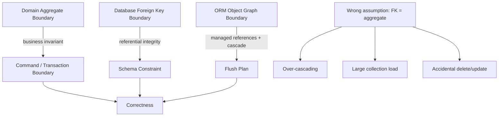
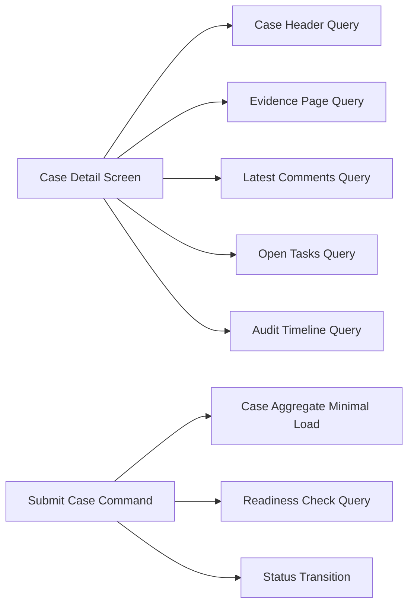

# Part 009 — Mapping Aggregate Boundaries with ORM Reality

> Target bagian ini: kita bisa memetakan aggregate boundary secara realistis di ORM. Bukan sekadar “DDD aggregate = entity graph”, tetapi memahami kapan object reference cocok, kapan ID reference lebih aman, kapan cascade benar, kapan `orphanRemoval` berbahaya, dan bagaimana mencegah accidental full-graph persistence.

Di seri JPA/persistence sebelumnya, kita sudah membahas konsep entity, relationship, transaction, dan repository. Bagian ini tidak mengulang itu. Fokusnya adalah **boundary design**: bagaimana bentuk domain object kita memengaruhi SQL, flush, consistency, performance, dan incident production.

Kalimat inti:

> **ORM tidak menyimpan aggregate. ORM menyimpan perubahan pada object graph yang sedang managed. Aggregate boundary adalah desain domain; persistence context hanya melihat reachable managed objects, ownership mapping, cascade, dirty state, dan flush ordering.**

---

## 1. Masalah yang Sering Tersembunyi

Developer sering membuat model seperti ini:

```java
@Entity
class CaseFile {
    @Id
    private Long id;

    @OneToMany(mappedBy = "caseFile", cascade = CascadeType.ALL, orphanRemoval = true)
    private List<Evidence> evidences = new ArrayList<>();

    @OneToMany(mappedBy = "caseFile", cascade = CascadeType.ALL, orphanRemoval = true)
    private List<Task> tasks = new ArrayList<>();

    @OneToMany(mappedBy = "caseFile", cascade = CascadeType.ALL, orphanRemoval = true)
    private List<Comment> comments = new ArrayList<>();
}
```

Secara domain terlihat natural: `CaseFile` punya evidence, task, comment. Tetapi secara ORM, desain ini berarti:

- `CaseFile` menjadi pintu mutasi untuk banyak collection;
- cascade dapat menyebarkan persist/merge/remove ke graph besar;
- `orphanRemoval` membuat operasi remove dari collection berubah menjadi delete row;
- load aggregate dapat memicu banyak lazy access;
- merge detached graph dapat meng-update atau menghapus data yang tidak disengaja;
- replacing collection dapat menghasilkan delete/insert atau exception;
- satu transaksi dapat membawa terlalu banyak state dalam persistence context;
- concurrency conflict menjadi lebih kasar dari kebutuhan bisnis.

Top engineer tidak hanya bertanya “relasinya apa?”. Pertanyaannya:

```text
Apakah child benar-benar hidup-mati bersama parent?
Apakah child boleh dimodifikasi tanpa parent?
Apakah collection bisa tumbuh ribuan item?
Apakah semua child perlu konsisten atomik dalam satu transaksi?
Apakah delete child harus terjadi saat parent kehilangan reference?
Apakah mutasi child harus melewati invariant parent?
Apakah read path perlu seluruh graph atau hanya sebagian kecil?
Apakah external workflow memegang reference ke child sebagai resource sendiri?
```

---

## 2. Kaufman Skill Decomposition

Untuk menguasai aggregate mapping di ORM, pecah skill menjadi unit kecil berikut.

| Sub-skill | Pertanyaan inti | Latihan cepat |
|---|---|---|
| Lifecycle ownership | Siapa yang mengendalikan create/update/delete child? | Hapus child dari collection dan prediksi SQL |
| Reference strategy | Object reference atau ID reference? | Bandingkan lazy load, FK integrity, dan service boundary |
| Cascade reasoning | Operasi apa yang boleh menyebar? | Uji `persist`, `merge`, `remove` terpisah |
| Orphan semantics | Hilang dari collection berarti delete row? | Remove dari collection lalu flush |
| Collection scale | Collection bisa berapa besar? | Simulasi 10, 1.000, 100.000 child |
| Mutation API | Invariant diletakkan di parent, child, atau service? | Tulis method intention-revealing |
| Fetch boundary | Apa yang perlu diload untuk use case tertentu? | Uji query count per command |
| Concurrency boundary | Versioning di parent saja atau child juga? | Simulasi dua transaksi paralel |
| Provider behavior | Hibernate/EclipseLink memperlakukan collection bagaimana? | Inspect SQL dan dirty state |

Kaufman-style practice loop:

```text
1. Ambil satu use case mutasi aggregate.
2. Gambar object graph minimal.
3. Tentukan lifecycle owner.
4. Tulis mapping paling kecil.
5. Prediksi SQL untuk create/update/delete.
6. Jalankan test dengan SQL logging.
7. Ukur query count, row count, dan dirty entity count.
8. Perbaiki boundary, bukan hanya tambah annotation.
```

---

## 3. Aggregate Boundary Bukan Sama dengan Foreign Key Boundary

Relational database melihat relationship melalui foreign key. Domain melihat relationship melalui business invariant. ORM melihat relationship melalui mapping metadata dan object references.

Ketiganya tidak selalu sama.



Contoh:

- `Order` dan `OrderLine` sering satu aggregate karena line hidup-mati bersama order dan invariant total order bergantung pada line.
- `Customer` dan `Order` biasanya bukan satu aggregate meskipun `Order` punya FK ke `Customer`.
- `CaseFile` dan `Evidence` mungkin satu lifecycle boundary untuk draft evidence, tetapi evidence yang sudah admitted/submitted bisa menjadi resource sendiri.
- `Account` dan `Transaction` di banking hampir tidak boleh dimodelkan sebagai mutable child collection biasa, karena transaction adalah ledger fact yang skalanya besar dan immutability-nya ketat.

Rule awal:

> **Foreign key menunjukkan referential dependency. Aggregate boundary menunjukkan mutation authority. Jangan menyamakan keduanya.**

---

## 4. Tiga Jenis Relationship yang Harus Dibedakan

### 4.1 Ownership Relationship

Child tidak bermakna tanpa parent dan lifecycle-nya dikontrol parent.

Contoh:

```text
Order -> OrderLine
Invoice -> InvoiceLine
PolicyDraft -> CoverageDraft
CaseDraft -> DraftAttachment
```

Mapping yang sering cocok:

```java
@OneToMany(mappedBy = "order", cascade = CascadeType.ALL, orphanRemoval = true)
private List<OrderLine> lines = new ArrayList<>();
```

Dengan helper method:

```java
public void addLine(ProductId productId, int quantity, Money price) {
    OrderLine line = new OrderLine(this, productId, quantity, price);
    lines.add(line);
    recalculateTotal();
}

public void removeLine(OrderLineId lineId) {
    OrderLine line = findLine(lineId);
    lines.remove(line);
    line.detachFromOrder();
    recalculateTotal();
}
```

Kriteria ownership yang kuat:

- child dibuat melalui parent;
- child dihapus melalui parent;
- child tidak dipakai oleh aggregate lain;
- child tidak punya workflow independen;
- child count relatif kecil atau bounded;
- invariant parent membutuhkan semua/sekumpulan child.

### 4.2 Reference Relationship

Entity A hanya mereferensikan entity B. Lifecycle B tidak dikontrol A.

Contoh:

```text
Order -> Customer
Payment -> Account
CaseFile -> Officer
Task -> Assignee
```

Mapping yang sering cocok:

```java
@ManyToOne(fetch = FetchType.LAZY, optional = false)
@JoinColumn(name = "customer_id", nullable = false)
private Customer customer;
```

Tetapi untuk boundary microservice/modular yang lebih ketat, bisa pakai ID reference:

```java
@Column(name = "customer_id", nullable = false)
private Long customerId;
```

Kriteria reference:

- referenced entity hidup independen;
- referenced entity dimodifikasi melalui flow lain;
- parent tidak boleh cascade remove ke referenced entity;
- read path sering hanya butuh ID/name snapshot;
- consistency cukup melalui FK atau application check.

### 4.3 Association/Link Relationship

Relationship itu sendiri punya state atau lifecycle.

Contoh:

```text
UserMembership(user, group, role, joinedAt, status)
CaseAssignment(case, officer, assignedAt, reason, status)
AccountPartyRole(account, party, roleType, effectiveFrom, effectiveTo)
```

Jangan cepat memakai `@ManyToMany`. Jadikan link sebagai entity.

```java
@Entity
class CaseAssignment {
    @Id
    private Long id;

    @ManyToOne(fetch = FetchType.LAZY, optional = false)
    private CaseFile caseFile;

    @ManyToOne(fetch = FetchType.LAZY, optional = false)
    private Officer officer;

    @Enumerated(EnumType.STRING)
    private AssignmentStatus status;

    private Instant assignedAt;
}
```

Rule:

> **Jika relationship punya attribute, history, status, audit, effective date, atau approval, relationship itu adalah entity, bukan collection convenience.**

---

## 5. Object Reference vs ID Reference

ORM mendorong object reference. Enterprise system sering perlu ID reference. Keduanya valid dalam konteks berbeda.

### 5.1 Object Reference

```java
@ManyToOne(fetch = FetchType.LAZY)
private Customer customer;
```

Keunggulan:

- FK mapping natural;
- navigasi domain mudah;
- provider dapat manage association;
- join/fetch graph lebih ekspresif;
- referential integrity lebih eksplisit di model.

Risiko:

- lazy load tidak sengaja;
- serialization boundary bocor;
- aggregate terlihat lebih besar dari seharusnya;
- detached object graph makin kompleks;
- `equals/hashCode` dan proxy awareness perlu hati-hati.

Cocok untuk:

- monolith/modular monolith dengan bounded context sama;
- strong transactional relationship;
- use case sering membutuhkan referenced object;
- model tidak diekspos langsung ke API.

### 5.2 ID Reference

```java
@Column(name = "customer_id", nullable = false)
private Long customerId;
```

Keunggulan:

- boundary lebih eksplisit;
- tidak ada lazy load accidental;
- DTO/event boundary lebih natural;
- lebih mudah untuk cross-service reference;
- mengurangi graph explosion.

Risiko:

- provider tidak tahu association;
- join query perlu manual;
- FK constraint harus tetap dijaga di schema bila satu database;
- application harus handle referential existence;
- lebih sedikit navigability.

Cocok untuk:

- cross-bounded-context reference;
- high-volume write path;
- audit/event model;
- read model/projection;
- reference yang jarang dinavigasi.

### 5.3 Decision Matrix

| Pertanyaan | Object reference | ID reference |
|---|---:|---:|
| Satu bounded context? | kuat | cukup |
| Butuh FK dan navigasi intensif? | kuat | lemah |
| Referenced entity lifecycle independen? | hati-hati | kuat |
| Cross-service boundary? | lemah | kuat |
| Risiko lazy load harus rendah? | lemah | kuat |
| Butuh JPQL join natural? | kuat | lemah |
| Butuh serialization aman? | hati-hati | kuat |
| Butuh provider cascade? | kuat | tidak |

Prinsip praktis:

```text
Use object reference for local consistency and frequent navigation.
Use ID reference for boundary clarity, scale, and cross-context decoupling.
```

---

## 6. Cascade sebagai Lifecycle Propagation, Bukan Shortcut

Cascade sering disalahgunakan karena terasa nyaman:

```java
@OneToMany(cascade = CascadeType.ALL)
```

Tetapi cascade bukan “save child automatically”. Cascade adalah instruksi agar operasi persistence pada parent disebarkan ke child.

Jenis cascade penting:

| Cascade | Makna | Risiko |
|---|---|---|
| `PERSIST` | persist parent juga persist child baru | accidental persist graph besar |
| `MERGE` | merge detached parent juga merge child | overwrite data dengan stale detached graph |
| `REMOVE` | remove parent juga remove child | delete tidak disengaja |
| `REFRESH` | refresh parent juga refresh child | discard local change |
| `DETACH` | detach parent juga detach child | boundary sulit diprediksi |
| `ALL` | semua di atas | sering terlalu luas |

### 6.1 Cascade yang Biasanya Aman

Untuk true composition:

```java
@OneToMany(mappedBy = "invoice", cascade = { CascadeType.PERSIST }, orphanRemoval = true)
private List<InvoiceLine> lines = new ArrayList<>();
```

Kadang `PERSIST` saja lebih aman daripada `ALL`, terutama jika update child dilakukan melalui managed state biasa, bukan `merge` detached graph.

### 6.2 Cascade yang Sering Berbahaya

Jangan cascade remove ke reference independen:

```java
// Dangerous
@ManyToOne(cascade = CascadeType.REMOVE)
private Customer customer;
```

Menghapus order lalu customer ikut terhapus adalah bug fatal.

Jangan cascade merge ke graph besar tanpa alasan:

```java
@OneToMany(mappedBy = "caseFile", cascade = CascadeType.MERGE)
private List<Comment> comments;
```

Jika client mengirim detached graph lama, merge dapat menganggap graph itulah source of truth. Ini sering menyebabkan:

- child hilang;
- stale value overwrite;
- collection diff mahal;
- update tidak perlu;
- optimistic locking conflict tidak terduga.

Rule:

> **Cascade harus mencerminkan lifecycle ownership. Jika hanya ingin convenience save, desain API persistence-nya yang salah, bukan annotation-nya yang kurang.**

---

## 7. Orphan Removal: Powerful tetapi Tajam

`orphanRemoval = true` berarti child yang tidak lagi direferensikan oleh parent collection dianggap orphan dan akan dihapus.

```java
@OneToMany(mappedBy = "order", cascade = CascadeType.ALL, orphanRemoval = true)
private List<OrderLine> lines = new ArrayList<>();
```

Operation:

```java
order.getLines().remove(line);
```

Efek flush:

```sql
DELETE FROM order_line WHERE id = ?
```

Bukan:

```sql
UPDATE order_line SET order_id = NULL WHERE id = ?
```

Itu benar jika child memang tidak boleh hidup tanpa parent.

### 7.1 Kapan Orphan Removal Cocok

- composition murni;
- child tidak punya identity bermakna di luar parent;
- remove dari collection secara domain berarti delete;
- child tidak direferensikan aggregate lain;
- audit/history delete sudah ditangani.

Contoh baik:

```text
InvoiceLine removed from draft invoice -> delete line
OrderLine removed before order submitted -> delete line
DraftAttachment removed from draft case -> delete attachment metadata
```

### 7.2 Kapan Orphan Removal Salah

- child punya lifecycle sendiri;
- child perlu soft delete;
- child punya audit/history;
- child direferensikan workflow lain;
- remove dari parent hanya berarti unassign, bukan delete;
- collection sangat besar dan sering direkonsiliasi dari request DTO.

Contoh buruk:

```text
CaseFile.evidences.remove(evidence) -> DELETE evidence
Account.transactions.remove(transaction) -> DELETE transaction
Customer.orders.remove(order) -> DELETE order
```

Untuk unassign, pakai state transition:

```java
public void unassignOfficer(OfficerId officerId, String reason) {
    CaseAssignment assignment = findActiveAssignment(officerId);
    assignment.revoke(reason, Instant.now());
}
```

Bukan langsung remove collection jika business semantics-nya bukan delete.

---

## 8. Bidirectional Association Invariants

Dalam bidirectional mapping, database FK biasanya berada di owning side. Tetapi object graph punya dua sisi yang harus sinkron.

```java
@Entity
class Order {
    @OneToMany(mappedBy = "order", cascade = CascadeType.PERSIST, orphanRemoval = true)
    private List<OrderLine> lines = new ArrayList<>();

    public void addLine(OrderLine line) {
        lines.add(line);
        line.setOrder(this);
    }

    public void removeLine(OrderLine line) {
        lines.remove(line);
        line.setOrder(null);
    }
}

@Entity
class OrderLine {
    @ManyToOne(fetch = FetchType.LAZY, optional = false)
    @JoinColumn(name = "order_id", nullable = false)
    private Order order;
}
```

Jika hanya melakukan:

```java
order.getLines().add(line);
```

namun `line.order` tidak diset, provider dapat melihat owning side masih null. SQL FK bisa null atau insert gagal.

Jika hanya melakukan:

```java
line.setOrder(order);
```

namun `order.lines` tidak ditambah, object graph di memory tidak konsisten. Query ulang mungkin benar, tetapi invariant runtime salah.

Rule:

> **Jangan expose mutable collection mentah untuk bidirectional relationship. Expose method yang menjaga dua sisi.**

Lebih baik:

```java
public List<OrderLine> getLines() {
    return Collections.unmodifiableList(lines);
}
```

Dan mutasi lewat method intention-revealing.

---

## 9. Large Collection Anti-Pattern

ORM collection terlihat seperti Java collection, tetapi secara runtime dapat menjadi query, dirty tracking, diffing, dan SQL operation.

```java
@OneToMany(mappedBy = "account")
private List<AccountTransaction> transactions = new ArrayList<>();
```

Jika account punya jutaan transaction, ini bukan collection domain biasa. Ini queryable dataset.

Masalah:

- lazy initialization dapat load banyak row;
- `size()` bisa memicu query/load tergantung provider/mapping;
- dirty checking collection mahal;
- remove by object mungkin butuh load collection;
- pagination sulit jika lewat collection;
- memory pressure tinggi;
- optimistic lock pada parent bisa terlalu kasar;
- serialization fatal.

### 9.1 Cara Berpikir yang Benar

Jika child count unbounded, jangan modelkan sebagai aggregate collection yang sering diload.

Gunakan repository/query boundary:

```java
public interface TransactionRepository {
    Page<AccountTransaction> findByAccountId(AccountId accountId, PageRequest pageRequest);
    Money sumPostedAmount(AccountId accountId, Period period);
}
```

Entity parent cukup menyimpan identity/reference:

```java
@Entity
class Account {
    @Id
    private Long id;

    @Version
    private long version;

    private Money balance;

    public void post(TransactionPosting posting) {
        // mutate balance or append via domain service, not load all transactions
    }
}
```

Transaction fact diinsert langsung:

```java
@Entity
class AccountTransaction {
    @ManyToOne(fetch = FetchType.LAZY, optional = false)
    @JoinColumn(name = "account_id", nullable = false)
    private Account account;

    private Money amount;
    private Instant postedAt;
}
```

Atau ID reference untuk write-heavy path:

```java
@Column(name = "account_id", nullable = false)
private Long accountId;
```

Rule:

> **Unbounded relationship adalah query boundary, bukan in-memory collection boundary.**

---

## 10. Aggregate Mutation Patterns

### 10.1 Command Loads Minimal Aggregate

Command:

```text
Submit case for review
```

Butuh:

- case header;
- current status;
- required evidence count/status;
- actor permission;
- maybe open tasks.

Tidak harus load:

- semua comments;
- semua historical assignments;
- semua attachments metadata;
- semua audit logs.

Pattern:

```java
@Transactional
public void submitCase(SubmitCaseCommand command) {
    CaseFile caseFile = caseRepository.findForSubmission(command.caseId())
            .orElseThrow(CaseNotFoundException::new);

    SubmissionReadiness readiness = evidenceRepository.checkReadiness(command.caseId());

    caseFile.submit(readiness, command.actorId(), clock.instant());
}
```

`findForSubmission` dapat memakai fetch plan spesifik, bukan `findById` generic.

### 10.2 Child Command Without Parent Graph Explosion

Command:

```text
Add comment to case
```

Buruk:

```java
CaseFile caseFile = em.find(CaseFile.class, caseId);
caseFile.addComment(text, actorId);
```

Jika `comments` collection besar atau tidak perlu diload, lebih baik:

```java
CaseFile caseRef = em.getReference(CaseFile.class, caseId);
Comment comment = Comment.create(caseRef, actorId, text, clock.instant());
em.persist(comment);
```

Atau ID reference:

```java
Comment comment = Comment.create(caseId, actorId, text, clock.instant());
em.persist(comment);
```

Tetap validasi case exist/status melalui query minimal:

```java
CaseStatus status = caseRepository.getStatus(caseId);
if (!status.allowsComment()) {
    throw new InvalidCaseStateException();
}
```

### 10.3 Reconciliation Pattern untuk Child Collection Kecil

Untuk collection kecil dan bounded, update dari DTO bisa direkonsiliasi:

```java
public void replaceLines(List<LineCommand> commands) {
    Map<Long, OrderLine> existingById = lines.stream()
            .filter(line -> line.getId() != null)
            .collect(Collectors.toMap(OrderLine::getId, Function.identity()));

    List<OrderLine> next = new ArrayList<>();

    for (LineCommand command : commands) {
        OrderLine line = command.id() == null
                ? OrderLine.newLine(this, command.productId())
                : existingById.remove(command.id());

        line.changeQuantity(command.quantity());
        next.add(line);
    }

    for (OrderLine removed : existingById.values()) {
        removeLine(removed);
    }

    lines.clear();
    for (OrderLine line : next) {
        addLine(line);
    }
}
```

Tetapi hati-hati: mengganti collection wrapper langsung bisa bermasalah.

Jangan:

```java
this.lines = new ArrayList<>(newLines);
```

Terutama pada Hibernate collection wrapper dengan orphan removal. Provider melacak wrapper collection yang managed. Replacing reference dapat membuat provider kehilangan tracking atau menganggap semua item berubah.

Lebih aman:

```java
this.lines.clear();
newLines.forEach(this::addLine);
```

Tetapi ini juga bisa menghasilkan delete/insert besar jika collection tidak didiff dengan benar. Untuk collection besar, gunakan command per child atau bulk strategy.

---

## 11. Hibernate View: Persistent Collection Wrappers

Hibernate mengganti collection field dengan wrapper seperti `PersistentBag`, `PersistentSet`, atau wrapper internal lain ketika entity managed.

Konsekuensi:

- wrapper menyimpan snapshot collection;
- mutation pada wrapper dapat dideteksi;
- replacing collection reference dapat mengacaukan orphan tracking;
- `List` tanpa order column sering berperilaku sebagai bag;
- `Set` bergantung pada `equals/hashCode` yang benar;
- lazy collection bisa punya state uninitialized, initialized, dirty.

Contoh failure umum:

```java
public void setLines(List<OrderLine> lines) {
    this.lines = lines; // dangerous with managed entity + orphanRemoval
}
```

Lebih baik tidak menyediakan setter collection.

```java
public void addLine(OrderLine line) { ... }
public void removeLine(OrderLine line) { ... }
public void replaceLinesSafely(List<LineCommand> commands) { ... }
```

### 11.1 Bag vs Set vs List di Hibernate

- `List` tanpa `@OrderColumn`: biasanya bag semantics, tidak ada persistent index.
- `List` dengan `@OrderColumn`: order disimpan di DB, reorder bisa menghasilkan banyak update.
- `Set`: uniqueness di memory berdasarkan `equals/hashCode`; hash berubah setelah persist bisa fatal.
- `Map`: key semantics harus dipilih jelas, apakah key column, key entity, atau property target.

Rule:

> **Collection type adalah bagian dari persistence contract, bukan hanya API taste.**

---

## 12. EclipseLink View: Indirection, Weaving, and UnitOfWork Clones

EclipseLink menggunakan konsep indirection/lazy reference dan UnitOfWork clone. Dalam banyak konfigurasi, weaving memungkinkan provider memasukkan lazy-loading dan change-tracking behavior ke entity.

Konsekuensi desain:

- relationship collection bisa berupa indirection collection;
- UnitOfWork bekerja dengan clone object lalu commit changes;
- change tracking bisa berbasis attribute/object/deferred tergantung konfigurasi;
- collection replacement tetap harus hati-hati karena provider perlu mendeteksi perubahan relationship;
- descriptor customization dapat mengubah mapping behavior.

EclipseLink sering lebih eksplisit dalam konsep session, descriptor, UnitOfWork, dan cache. Tetapi prinsip domain tetap sama:

```text
Do not expose uncontrolled collection mutation.
Do not cascade beyond lifecycle ownership.
Do not model unbounded datasets as aggregate collection.
```

---

## 13. Mapping Pattern: Small Owned Collection

Cocok untuk line items, draft sections, small child records.

```java
@Entity
@Table(name = "invoice")
class Invoice {
    @Id
    @GeneratedValue(strategy = GenerationType.SEQUENCE, generator = "invoice_seq")
    private Long id;

    @Version
    private long version;

    @OneToMany(mappedBy = "invoice", cascade = CascadeType.PERSIST, orphanRemoval = true)
    private List<InvoiceLine> lines = new ArrayList<>();

    protected Invoice() {}

    public void addLine(String description, BigDecimal amount) {
        InvoiceLine line = new InvoiceLine(this, description, amount);
        lines.add(line);
    }

    public void removeLine(Long lineId) {
        InvoiceLine line = lines.stream()
                .filter(l -> Objects.equals(l.getId(), lineId))
                .findFirst()
                .orElseThrow();
        lines.remove(line);
        line.clearInvoice();
    }
}

@Entity
@Table(name = "invoice_line")
class InvoiceLine {
    @Id
    @GeneratedValue(strategy = GenerationType.SEQUENCE, generator = "invoice_line_seq")
    private Long id;

    @ManyToOne(fetch = FetchType.LAZY, optional = false)
    @JoinColumn(name = "invoice_id", nullable = false)
    private Invoice invoice;

    private String description;
    private BigDecimal amount;

    protected InvoiceLine() {}

    InvoiceLine(Invoice invoice, String description, BigDecimal amount) {
        this.invoice = invoice;
        this.description = description;
        this.amount = amount;
    }

    void clearInvoice() {
        this.invoice = null;
    }
}
```

Catatan:

- `cascade = PERSIST` cukup jika child update terjadi saat managed;
- `orphanRemoval = true` benar karena line tidak bermakna tanpa invoice;
- collection tidak expose setter;
- mutasi lewat method domain;
- count line harus bounded oleh business rule.

Tambahkan invariant:

```java
private static final int MAX_LINES = 200;

public void addLine(String description, BigDecimal amount) {
    if (lines.size() >= MAX_LINES) {
        throw new TooManyInvoiceLinesException();
    }
    InvoiceLine line = new InvoiceLine(this, description, amount);
    lines.add(line);
}
```

Bounded collection bukan hanya performance optimization; itu domain contract.

---

## 14. Mapping Pattern: Independent Child with Parent Reference

Cocok untuk comment, event, attachment metadata, case note, history row.

```java
@Entity
@Table(name = "case_comment")
class CaseComment {
    @Id
    @GeneratedValue(strategy = GenerationType.SEQUENCE, generator = "case_comment_seq")
    private Long id;

    @ManyToOne(fetch = FetchType.LAZY, optional = false)
    @JoinColumn(name = "case_id", nullable = false)
    private CaseFile caseFile;

    @Column(nullable = false)
    private Long authorId;

    @Column(nullable = false, length = 4000)
    private String body;

    @Column(nullable = false)
    private Instant createdAt;
}
```

Pada `CaseFile`, tidak perlu selalu punya:

```java
@OneToMany(mappedBy = "caseFile")
private List<CaseComment> comments;
```

Jika jarang digunakan, hilangkan collection dari parent. Query via repository:

```java
List<CaseComment> findLatestComments(Long caseId, int limit);
```

Keuntungan:

- parent tidak tampak memiliki collection besar;
- add comment tidak perlu load parent graph;
- read comments bisa dipagination;
- lifecycle comment lebih eksplisit;
- audit/history lebih aman.

---

## 15. Mapping Pattern: Link Entity untuk Relationship Bermakna

Daripada:

```java
@ManyToMany
private Set<Officer> assignedOfficers;
```

Gunakan:

```java
@Entity
@Table(name = "case_assignment")
class CaseAssignment {
    @Id
    @GeneratedValue(strategy = GenerationType.SEQUENCE, generator = "case_assignment_seq")
    private Long id;

    @ManyToOne(fetch = FetchType.LAZY, optional = false)
    @JoinColumn(name = "case_id", nullable = false)
    private CaseFile caseFile;

    @ManyToOne(fetch = FetchType.LAZY, optional = false)
    @JoinColumn(name = "officer_id", nullable = false)
    private Officer officer;

    @Enumerated(EnumType.STRING)
    @Column(nullable = false)
    private AssignmentStatus status;

    @Column(nullable = false)
    private Instant assignedAt;

    private Instant revokedAt;

    public void revoke(Instant now) {
        if (status != AssignmentStatus.ACTIVE) {
            throw new InvalidAssignmentStateException();
        }
        status = AssignmentStatus.REVOKED;
        revokedAt = now;
    }
}
```

Schema constraint:

```sql
CREATE UNIQUE INDEX uq_case_active_assignment
ON case_assignment(case_id, officer_id)
WHERE status = 'ACTIVE';
```

Jika database tidak mendukung partial index, gunakan alternative constraint strategy.

Benefit:

- relationship punya audit trail;
- status transition eksplisit;
- no accidental delete;
- query lebih natural;
- future requirement lebih mudah.

---

## 16. Aggregate Versioning Strategy

Pertanyaan penting: apakah update child harus mengubah version parent?

Contoh:

```java
@Entity
class Order {
    @Version
    private long version;

    @OneToMany(mappedBy = "order", cascade = CascadeType.ALL, orphanRemoval = true)
    private List<OrderLine> lines;
}
```

Jika dua user mengedit dua line berbeda:

- apakah boleh paralel?
- apakah harus conflict di parent?
- apakah line punya version sendiri?
- apakah total order harus recalculated atomik?

Strategi:

### 16.1 Parent Version Only

Cocok jika semua child mutation harus serialized oleh parent invariant.

```text
Order total depends on all lines -> parent version conflict acceptable
```

### 16.2 Child Version Too

Cocok jika child bisa dimutasi independen.

```java
@Entity
class CaseTask {
    @Version
    private long version;
}
```

### 16.3 Append-Only Child

Cocok untuk event/comment/history.

```text
No update to parent version unless derived counter/status changes
```

Rule:

> **Version boundary harus mengikuti conflict boundary, bukan sekadar table boundary.**

---

## 17. Aggregate Boundary and Transaction Boundary

Aggregate mutation biasanya satu transaction. Tetapi tidak semua relationship dalam aggregate-like UI harus satu aggregate.

Contoh UI “Case Detail” menampilkan:

- case header;
- current assignments;
- evidence list;
- latest comments;
- audit timeline;
- open tasks;
- SLA timers.

Itu adalah **screen composition**, bukan aggregate boundary.



Jangan modelkan semua yang tampil di screen sebagai collection pada satu root. Screen composition dapat memakai read model/projection.

---

## 18. Accidental Full-Graph Persistence

Terjadi ketika request DTO dikonversi menjadi detached entity graph lalu `merge` dipanggil.

```java
@Transactional
public CaseFile updateCase(CaseUpdateRequest request) {
    CaseFile detached = mapper.toEntity(request);
    return entityManager.merge(detached);
}
```

Risiko:

- field yang tidak ada di request menjadi null;
- collection yang tidak dikirim dianggap kosong;
- child lama hilang;
- stale value overwrite;
- cascade merge menyebar;
- lazy reference diganti detached shell;
- security boundary dilanggar karena client menentukan graph.

Better pattern:

```java
@Transactional
public void updateCase(CaseUpdateRequest request) {
    CaseFile caseFile = caseRepository.findForUpdate(request.caseId())
            .orElseThrow(CaseNotFoundException::new);

    caseFile.changePriority(request.priority(), actorContext.actorId());
    caseFile.changeSummary(request.summary());
}
```

Map command ke method, bukan DTO ke entity.

Rule:

> **For commands, load managed aggregate and apply intent. Do not merge client-shaped graphs as truth.**

---

## 19. Soft Delete dan Aggregate Boundary

Jika child harus soft delete, `orphanRemoval` biasanya salah.

Buruk:

```java
@OneToMany(mappedBy = "caseFile", orphanRemoval = true)
private List<Evidence> evidences;
```

Jika remove berarti `status = REMOVED`, gunakan method:

```java
public void removeEvidence(Long evidenceId, String reason, Instant now) {
    Evidence evidence = findEvidence(evidenceId);
    evidence.markRemoved(reason, now);
}
```

Child tetap ada di DB:

```java
@Entity
class Evidence {
    @Enumerated(EnumType.STRING)
    private EvidenceStatus status;

    private Instant removedAt;
    private String removalReason;
}
```

Query aktif:

```java
select e
from Evidence e
where e.caseFile.id = :caseId
  and e.status <> 'REMOVED'
```

Hibernate punya extension seperti filters/soft delete support pada versi modern; EclipseLink punya konsep additional criteria/descriptors. Tetapi desain utamanya tetap: **delete semantics harus business-explicit**.

---

## 20. SQL Consequences by Operation

### 20.1 Add Child to Owned Collection

Java:

```java
order.addLine(productId, 2, price);
```

Expected SQL:

```sql
INSERT INTO order_line (order_id, product_id, quantity, price, id)
VALUES (?, ?, ?, ?, ?);
```

Potential extra SQL:

- select sequence;
- select product if object reference loaded;
- update order total/version;
- select collection if collection initialized or diff needed.

### 20.2 Remove Orphan

Java:

```java
order.removeLine(lineId);
```

Expected SQL:

```sql
DELETE FROM order_line WHERE id = ?;
```

Potential extra SQL:

- select lines if not loaded and remove by object requires search;
- update order version;
- update order total.

### 20.3 Replace Large Collection

Java:

```java
order.setLines(newLines);
```

Potential SQL:

```sql
DELETE FROM order_line WHERE order_id = ?;
INSERT INTO order_line ...;
INSERT INTO order_line ...;
-- repeated
```

Atau provider exception / unexpected diff.

### 20.4 Add Independent Child

Java:

```java
Comment comment = Comment.create(caseRef, actorId, body);
em.persist(comment);
```

Expected SQL:

```sql
INSERT INTO case_comment (case_id, author_id, body, created_at, id)
VALUES (?, ?, ?, ?, ?);
```

No need to load `case.comments`.

---

## 21. Hibernate vs EclipseLink Practical Differences to Watch

| Area | Hibernate | EclipseLink | Design implication |
|---|---|---|---|
| Collection tracking | Persistent collection wrappers and snapshots | Indirection/change tracking/UnitOfWork clones | Avoid replacing managed collections |
| Lazy to-one | Proxy/enhancement dependent | Weaving/indirection dependent | Keep boundaries explicit |
| Cascade merge | Can deeply traverse detached graph | UnitOfWork merge behavior also graph-sensitive | Avoid client-shaped merge |
| Orphan detection | Strongly tied to managed collection state | Relationship private ownership semantics available | Test SQL, not assumptions |
| Custom mapping extension | Rich annotations/types/events | Descriptors/customizers/converters | Encapsulate provider-specific mapping |

Provider differences matter, but they do not rescue poor aggregate boundaries.

---

## 22. Mapping Decision Checklist

Untuk setiap relationship, jawab:

```text
1. Apa business name relationship ini?
2. Apakah child bisa hidup tanpa parent?
3. Apakah parent mengontrol create child?
4. Apakah parent mengontrol delete child?
5. Apakah remove dari collection berarti delete, unassign, revoke, expire, atau hide?
6. Apakah child count bounded?
7. Apakah child sering diload bersama parent?
8. Apakah child punya workflow/status sendiri?
9. Apakah child punya audit/history sendiri?
10. Apakah child direferensikan aggregate lain?
11. Apakah update child harus conflict dengan update parent?
12. Apakah cascade persist/merge/remove benar secara lifecycle?
13. Apakah UI screen composition membuat kita salah mendesain aggregate?
14. Apa SQL untuk add/remove/update child?
15. Apa failure mode jika DTO client tidak mengirim seluruh collection?
```

Jika jawaban tidak jelas, jangan tambahkan annotation. Perjelas boundary dulu.

---

## 23. Exercise: Regulatory Case Aggregate

Misal domain:

```text
CaseFile
- Evidence
- Comment
- Task
- Assignment
- AuditEvent
- Party
```

Klasifikasi awal:

| Relationship | Candidate mapping | Alasan |
|---|---|---|
| CaseFile -> DraftEvidence | owned collection, maybe orphanRemoval | draft evidence hidup dalam case draft |
| CaseFile -> SubmittedEvidence | independent entity with FK | evidence punya workflow/audit |
| CaseFile -> Comment | independent child, query by caseId | append-only, bisa besar |
| CaseFile -> Task | independent child or separate aggregate | task punya assignee/status/SLA |
| CaseFile -> Assignment | link entity | relationship punya status/history |
| CaseFile -> AuditEvent | append-only fact, no collection on parent | unbounded immutable history |
| CaseFile -> Party | likely link entity CasePartyRole | role/effective date/status |

Command design:

```text
SubmitCaseCommand:
- load CaseFile minimal
- check required evidence via query
- transition status
- append AuditEvent

AddCommentCommand:
- validate case status via scalar query
- insert CaseComment
- append AuditEvent maybe

AssignOfficerCommand:
- validate active case
- close previous active assignment if rule requires
- insert CaseAssignment
```

This is more production-safe than one giant `CaseFile` graph.

---

## 24. Common Smells

### Smell 1 — Every Relationship Is Bidirectional

Jika semua entity punya collection balik, model menjadi graph raksasa. Navigability harus dibayar dengan complexity.

Correction:

```text
Add reverse collection only when there is a real aggregate/use-case need.
```

### Smell 2 — `CascadeType.ALL` Everywhere

Cascade ALL biasanya berarti lifecycle belum dipikirkan.

Correction:

```text
Choose cascade operation one by one.
```

### Smell 3 — Parent Has Ten `@OneToMany` Collections

Bisa jadi parent dipakai sebagai screen DTO.

Correction:

```text
Separate command aggregate from read composition.
```

### Smell 4 — `@ManyToMany` with Business Meaning

Relationship akan segera butuh status/audit/date.

Correction:

```text
Promote join table into link entity.
```

### Smell 5 — Entity Setter Accepts Full Collection

Client bisa replace whole relationship accidentally.

Correction:

```text
Use add/remove/reconcile methods with invariants.
```

### Smell 6 — Deleting by Removing from Collection

Remove operation tidak menyebut semantic delete/revoke/expire.

Correction:

```text
Name the business transition explicitly.
```

---

## 25. Provider-Agnostic Design Rules

1. **Do not model screen shape as entity graph.**
2. **Do not cascade beyond lifecycle ownership.**
3. **Do not use orphan removal unless orphan means delete.**
4. **Do not expose mutable collections directly.**
5. **Do not use `merge` as a generic update endpoint.**
6. **Do not model unbounded relationships as aggregate collections.**
7. **Prefer link entity over `@ManyToMany` when relationship has meaning.**
8. **Keep bidirectional relationships synchronized through methods.**
9. **Use ID reference when boundary clarity beats navigability.**
10. **Predict SQL before committing to mapping.**

---

## 26. Mini Lab

### Lab A — Predict Owned Child SQL

Model `Invoice` and `InvoiceLine` with `orphanRemoval = true`.

Operations:

```java
invoice.addLine("A", BigDecimal.TEN);
invoice.addLine("B", BigDecimal.ONE);
invoice.removeLine(lineAId);
```

Predict:

- sequence calls;
- inserts;
- deletes;
- parent updates;
- collection selects.

Then verify with SQL logging.

### Lab B — Replace Collection Failure

Create a setter:

```java
public void setLines(List<InvoiceLine> lines) {
    this.lines = lines;
}
```

Use managed entity and orphan removal. Observe provider behavior.

Then replace with:

```java
public void replaceLines(List<LineCommand> commands) { ... }
```

Compare SQL.

### Lab C — Large Collection Alternative

Create `CaseFile` with 10.000 comments.

Compare:

```java
caseFile.getComments().size();
```

vs

```java
select count(c) from CaseComment c where c.caseFile.id = :caseId
```

Observe memory and SQL behavior.

---

## 27. Summary

Aggregate mapping yang baik bukan soal membuat relationship sebanyak mungkin. Mapping yang baik menjaga kesesuaian antara:

- lifecycle ownership;
- transaction boundary;
- business invariant;
- collection scale;
- provider change tracking;
- SQL shape;
- concurrency boundary;
- audit and history semantics.

Kesimpulan utama:

> **Gunakan ORM untuk memetakan model yang sudah dipikirkan. Jangan biarkan annotation membentuk model secara kebetulan.**

Di part berikutnya, kita masuk lebih detail ke association mapping lanjutan: owning side, join table, `@ElementCollection`, ordered collection, `Map`, collection replacement hazards, dan bagaimana operasi collection berubah menjadi SQL.

---

## References

- Hibernate ORM User Guide 7.4 — Associations, collections, cascading, fetching, and entity state behavior.
- Jakarta Persistence 3.2 Specification — Relationship mapping, cascade operations, orphan removal, collection mapping, and entity lifecycle semantics.
- EclipseLink Documentation — Mapping concepts, indirection/lazy loading, UnitOfWork, descriptors, and relationship mapping behavior.
