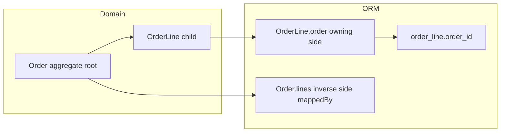
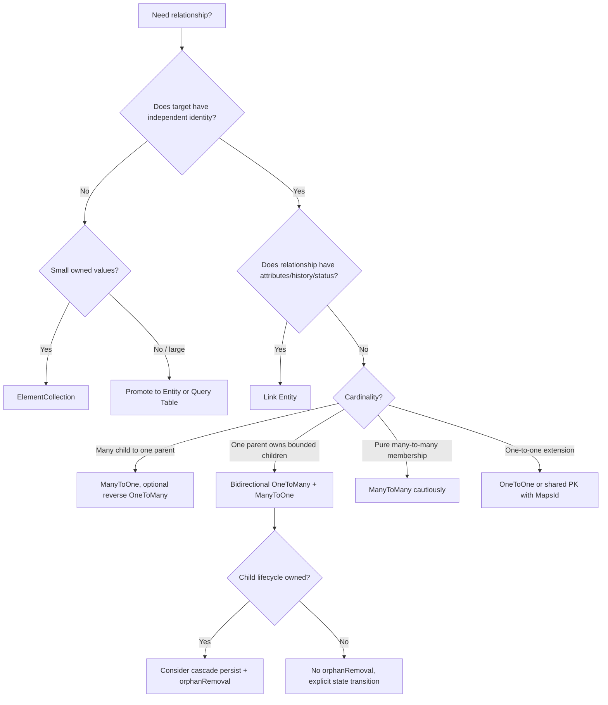

# Part 010 — Advanced Association Mapping: Ownership, Join Tables, Maps, and Ordered Collections

> Target bagian ini: kita bisa memilih dan mengoperasikan mapping association lanjutan secara sadar. Kita akan membaca relationship bukan sebagai annotation, tetapi sebagai kontrak antara object graph, foreign key, join table, collection semantics, dirty tracking, dan SQL write amplification.

Pada part sebelumnya, kita membahas aggregate boundary. Sekarang kita turun satu level: **bagaimana relationship tersebut benar-benar dimapping**.

Kalimat inti:

> **Association mapping adalah keputusan tentang siapa menyimpan foreign key, siapa dianggap owning side oleh ORM, bagaimana collection didiff, dan SQL apa yang muncul saat collection berubah.**

---

## 1. Ownership: Domain Owner vs ORM Owning Side

Istilah “owner” sering membingungkan karena ada beberapa jenis owner:

| Owner type | Makna | Contoh |
|---|---|---|
| Domain owner | Pihak yang mengontrol invariant/lifecycle | `Order` owns `OrderLine` |
| Database owner | Table yang menyimpan FK | `order_line.order_id` |
| ORM owning side | Side yang perubahan relationship-nya dipakai provider untuk update FK/join table | `OrderLine.order` pada bidirectional `@OneToMany` |
| API owner | Endpoint/service yang boleh melakukan mutasi | `OrderCommandService` |

Keempatnya bisa berbeda. Kesalahan umum adalah mengira `Order.lines` adalah owning side karena domain owner-nya `Order`. Pada JPA/Jakarta Persistence, untuk bidirectional `@OneToMany(mappedBy = "order")`, owning side ORM adalah `OrderLine.order`, karena FK berada di table `order_line`.

```java
@Entity
class Order {
    @OneToMany(mappedBy = "order")
    private List<OrderLine> lines = new ArrayList<>();
}

@Entity
class OrderLine {
    @ManyToOne(fetch = FetchType.LAZY)
    @JoinColumn(name = "order_id")
    private Order order; // ORM owning side
}
```

Diagram:



Rule:

> **Domain owner menentukan method dan invariant. ORM owning side menentukan SQL relationship update. Jangan mencampur keduanya.**

---

## 2. Unidirectional vs Bidirectional Mapping

### 2.1 Unidirectional `@ManyToOne`

Paling sederhana dan sering paling sehat.

```java
@Entity
class Payment {
    @ManyToOne(fetch = FetchType.LAZY, optional = false)
    @JoinColumn(name = "account_id", nullable = false)
    private Account account;
}
```

Keunggulan:

- FK jelas;
- no reverse collection;
- parent tidak menjadi graph besar;
- query child by parent ID via repository;
- lazy risk terbatas pada satu reference.

Cocok untuk relationship yang sering dinavigasi dari child ke parent, tetapi tidak perlu parent collection.

### 2.2 Bidirectional `@OneToMany` / `@ManyToOne`

```java
@Entity
class Account {
    @OneToMany(mappedBy = "account")
    private List<Payment> payments = new ArrayList<>();
}

@Entity
class Payment {
    @ManyToOne(fetch = FetchType.LAZY, optional = false)
    private Account account;
}
```

Keunggulan:

- navigasi dua arah;
- aggregate child access natural;
- cascade/orphan removal bisa diletakkan di parent side.

Biaya:

- harus sinkronkan dua sisi;
- collection bisa lazy-load besar;
- serialization risk;
- dirty checking collection;
- collection method harus dijaga.

Gunakan hanya jika parent collection benar-benar bagian dari use case mutasi atau read yang bounded.

### 2.3 Unidirectional `@OneToMany`

Ada dua bentuk utama.

#### Dengan Join Table

Jika tidak ada `@JoinColumn`, provider dapat memakai join table.

```java
@OneToMany
@JoinTable(
    name = "order_order_line",
    joinColumns = @JoinColumn(name = "order_id"),
    inverseJoinColumns = @JoinColumn(name = "line_id")
)
private List<OrderLine> lines = new ArrayList<>();
```

SQL shape:

```text
order -> order_order_line -> order_line
```

Biaya:

- table tambahan;
- insert/delete join row;
- constraint tambahan;
- query join lebih panjang.

#### Dengan Join Column

```java
@OneToMany
@JoinColumn(name = "order_id")
private List<OrderLine> lines = new ArrayList<>();
```

FK ada di child table, tetapi child tidak punya object reference ke parent.

Biaya potensial:

- provider mungkin insert child dulu lalu update FK tergantung ID availability/mapping;
- relationship update dikontrol dari parent collection;
- child tidak tahu parent di object model.

Praktisnya, untuk aggregate child, bidirectional mapping dengan helper method sering lebih predictable.

---

## 3. Join Column vs Join Table

### 3.1 Join Column

```java
@ManyToOne(fetch = FetchType.LAZY)
@JoinColumn(name = "customer_id")
private Customer customer;
```

Schema:

```sql
ALTER TABLE orders
ADD CONSTRAINT fk_orders_customer
FOREIGN KEY (customer_id) REFERENCES customer(id);
```

Cocok jika:

- relationship many-to-one atau one-to-one sederhana;
- child row naturally owns FK;
- relationship tidak butuh attribute sendiri;
- query common path memakai FK.

### 3.2 Join Table

```java
@ManyToMany
@JoinTable(
    name = "user_role",
    joinColumns = @JoinColumn(name = "user_id"),
    inverseJoinColumns = @JoinColumn(name = "role_id")
)
private Set<Role> roles = new HashSet<>();
```

Schema:

```sql
CREATE TABLE user_role (
    user_id BIGINT NOT NULL,
    role_id BIGINT NOT NULL,
    PRIMARY KEY (user_id, role_id),
    FOREIGN KEY (user_id) REFERENCES app_user(id),
    FOREIGN KEY (role_id) REFERENCES role(id)
);
```

Cocok jika:

- relationship many-to-many murni;
- no extra attributes;
- no lifecycle/history/status;
- join row hanya membership sederhana.

Tetapi jika join table butuh field tambahan, jangan pakai `@ManyToMany`; gunakan link entity.

---

## 4. `@ManyToMany`: Use Sparingly

`@ManyToMany` terasa ringkas:

```java
@ManyToMany
private Set<Role> roles = new HashSet<>();
```

Tetapi di enterprise system, relationship jarang benar-benar tanpa state. Biasanya nanti muncul:

- assigned by;
- assigned at;
- expired at;
- status;
- reason;
- tenant;
- audit;
- approval;
- effective date;
- ordering;
- source system.

Begitu ada kebutuhan itu, `@ManyToMany` harus dimigrasikan ke link entity.

### 4.1 Dangerous Remove Semantics

Jika remove role:

```java
user.getRoles().remove(role);
```

SQL kira-kira:

```sql
DELETE FROM user_role WHERE user_id = ? AND role_id = ?;
```

Itu menghapus membership fact. Jika business butuh history, salah. Gunakan:

```java
membership.revoke(actorId, reason, now);
```

### 4.2 Link Entity Alternative

```java
@Entity
@Table(name = "user_role_assignment")
class UserRoleAssignment {
    @EmbeddedId
    private UserRoleAssignmentId id;

    @ManyToOne(fetch = FetchType.LAZY)
    @MapsId("userId")
    private User user;

    @ManyToOne(fetch = FetchType.LAZY)
    @MapsId("roleId")
    private Role role;

    @Enumerated(EnumType.STRING)
    private AssignmentStatus status;

    private Instant assignedAt;
    private Instant revokedAt;
}
```

This is more verbose, but operationally safer.

Rule:

> **`@ManyToMany` is for pure membership. Most enterprise relationships are not pure membership.**

---

## 5. `@ElementCollection`: Value Collection, Not Entity Collection

`@ElementCollection` maps a collection of basic or embeddable values. It is not entity relationship.

```java
@ElementCollection
@CollectionTable(
    name = "case_tag",
    joinColumns = @JoinColumn(name = "case_id")
)
@Column(name = "tag")
private Set<String> tags = new HashSet<>();
```

For embeddable:

```java
@ElementCollection
@CollectionTable(
    name = "case_contact_point",
    joinColumns = @JoinColumn(name = "case_id")
)
private Set<ContactPoint> contactPoints = new HashSet<>();
```

```java
@Embeddable
class ContactPoint {
    private String type;
    private String value;
}
```

### 5.1 When Element Collection Is Good

- value has no independent identity;
- value lifecycle fully belongs to owner;
- collection is small/bounded;
- no separate audit/workflow for element;
- update semantics can tolerate delete/insert style operations;
- no external FK references to individual element.

Examples:

```text
Case tags
Allowed notification channels
Small set of phone numbers in a profile
Localized labels if bounded
Money breakdown lines if immutable snapshot
```

### 5.2 When Element Collection Is Wrong

- element needs ID;
- element is referenced elsewhere;
- element has independent status;
- collection is large;
- partial update is frequent;
- audit per element matters;
- concurrency conflict per element matters.

Then promote to entity.

### 5.3 SQL Write Amplification

Many providers handle element collection updates by deleting and reinserting rows, especially for bags/lists or when diffing is hard.

Potential SQL:

```sql
DELETE FROM case_tag WHERE case_id = ?;
INSERT INTO case_tag (case_id, tag) VALUES (?, ?);
INSERT INTO case_tag (case_id, tag) VALUES (?, ?);
```

For small collections this is acceptable. For large collections, it is dangerous.

Rule:

> **`@ElementCollection` is excellent for small owned values. It is not a replacement for child entity modeling.**

---

## 6. Ordered Collections: `@OrderBy` vs `@OrderColumn`

Ordering is not one thing.

### 6.1 `@OrderBy`

`@OrderBy` orders query result using column/property value.

```java
@OneToMany(mappedBy = "caseFile")
@OrderBy("createdAt DESC")
private List<CaseComment> comments;
```

SQL:

```sql
SELECT *
FROM case_comment
WHERE case_id = ?
ORDER BY created_at DESC;
```

Characteristics:

- no extra order column;
- order derived from data;
- changing order means changing sorted property;
- good for chronological lists;
- not good for manual drag-and-drop order unless explicit rank field exists.

### 6.2 `@OrderColumn`

`@OrderColumn` persists list index.

```java
@OneToMany(mappedBy = "checklist", cascade = CascadeType.ALL, orphanRemoval = true)
@OrderColumn(name = "position")
private List<ChecklistItem> items = new ArrayList<>();
```

Schema:

```sql
ALTER TABLE checklist_item ADD position INT NOT NULL;
```

Characteristics:

- order is part of relationship state;
- reorder changes `position` values;
- inserting at beginning may update many rows;
- deleting item may shift positions;
- write amplification can be high.

### 6.3 Choosing Between Them

| Need | Use |
|---|---|
| Sort by created date/name/status | `@OrderBy` |
| User-defined manual order | `@OrderColumn` or explicit `rank` field |
| Large list with frequent reorder | explicit sparse rank, not dense order column |
| Immutable snapshot order | `@OrderColumn` acceptable if small |
| Pagination by order | query with indexed column |

### 6.4 Sparse Ranking Alternative

Instead of dense `position = 0,1,2,3`, use rank:

```java
@Column(name = "rank_value", nullable = false)
private BigDecimal rank;
```

Move item between A and B:

```text
newRank = (rankA + rankB) / 2
```

This avoids mass updates until rebalancing is needed.

---

## 7. `List`, `Set`, `Bag`: Collection Semantics Matter

### 7.1 `List`

A Java `List` has order and duplicates. In ORM:

- with `@OrderColumn`: persistent indexed list;
- with `@OrderBy`: query-sorted list;
- without either: often bag-like collection.

Pitfall: assuming list index is stable without `@OrderColumn`.

### 7.2 `Set`

A `Set` has uniqueness based on `equals/hashCode`.

```java
@OneToMany(mappedBy = "order")
private Set<OrderLine> lines = new HashSet<>();
```

Risks:

- if `equals/hashCode` uses generated ID, new transient objects all have `id = null`;
- if hash code changes after persist, set membership breaks;
- if equals uses mutable business fields, mutation breaks set;
- proxy classes can complicate class equality.

Safer patterns:

- use immutable natural key if truly stable;
- use business-generated ID assigned at construction;
- use List plus database unique constraint when order/uniqueness semantics allow;
- be careful with Lombok-generated equals/hashCode on entities.

### 7.3 Bag

A bag is unordered and may contain duplicates. Hibernate often treats `List` without index as bag semantics. Bags can be efficient for append, but problematic for precise diff operations.

Common issue:

- multiple bag fetch joins can cause problems/cartesian explosion;
- delete/update diff can be less precise;
- duplicates complicate business meaning.

Rule:

> **Pick collection type based on persistent semantics, not convenience in Java.**

---

## 8. Map Mappings

`Map` is useful when child/value is naturally addressed by key.

Examples:

```text
localizedText[locale]
settings[name]
priceByCurrency[currency]
permissionByResource[resourceId]
```

But map key can be stored in different places.

### 8.1 Map Key Column for Element Collection

```java
@ElementCollection
@CollectionTable(
    name = "product_label",
    joinColumns = @JoinColumn(name = "product_id")
)
@MapKeyColumn(name = "locale")
@Column(name = "label")
private Map<String, String> labels = new HashMap<>();
```

Table:

```sql
product_label(product_id, locale, label)
```

Good for small owned dictionary values.

### 8.2 Map Key as Enum

```java
@ElementCollection
@CollectionTable(name = "account_limit", joinColumns = @JoinColumn(name = "account_id"))
@MapKeyEnumerated(EnumType.STRING)
@MapKeyColumn(name = "limit_type")
@Column(name = "amount")
private Map<LimitType, BigDecimal> limits = new EnumMap<>(LimitType.class);
```

Use database constraints:

```sql
ALTER TABLE account_limit
ADD CONSTRAINT uq_account_limit_type UNIQUE (account_id, limit_type);
```

### 8.3 Map Key from Target Entity Property

```java
@OneToMany(mappedBy = "catalog")
@MapKey(name = "sku")
private Map<String, CatalogItem> itemsBySku = new HashMap<>();
```

Here key comes from `CatalogItem.sku`, not a separate join table key column.

Pitfall: if `sku` changes, map key consistency in memory must be handled.

### 8.4 Entity Key with `@MapKeyJoinColumn`

```java
@OneToMany
@JoinTable(name = "price_by_region")
@MapKeyJoinColumn(name = "region_id")
private Map<Region, Price> pricesByRegion;
```

This is more complex. Use only when map key is truly an entity and query/mutation patterns justify it.

### 8.5 Map Decision Matrix

| Use case | Mapping |
|---|---|
| Small key-value strings | `@ElementCollection + @MapKeyColumn` |
| Enum-keyed config | `@ElementCollection + @MapKeyEnumerated` |
| Child entity addressed by stable child property | `@OneToMany + @MapKey(name=...)` |
| Relationship keyed by entity | `@MapKeyJoinColumn`, but consider link entity |
| Large key-value data | separate entity/table + repository query |

Rule:

> **A `Map` key is persistence state. Treat key mutability as seriously as primary key mutability.**

---

## 9. Association Mutation and SQL Write Amplification

A small Java collection operation can cause many SQL statements.

### 9.1 Add to `@OneToMany` with FK

```java
order.addLine(line);
```

Expected:

```sql
INSERT INTO order_line (..., order_id, ...) VALUES (...);
```

If unidirectional with `@JoinColumn`, possible:

```sql
INSERT INTO order_line (...) VALUES (...);
UPDATE order_line SET order_id = ? WHERE id = ?;
```

Depends on generator, nullability, provider, and mapping.

### 9.2 Add to Join Table

```java
user.getRoles().add(role);
```

SQL:

```sql
INSERT INTO user_role (user_id, role_id) VALUES (?, ?);
```

### 9.3 Remove from Join Table

```java
user.getRoles().remove(role);
```

SQL:

```sql
DELETE FROM user_role WHERE user_id = ? AND role_id = ?;
```

### 9.4 Reorder `@OrderColumn`

Move item from position 10 to position 0:

```sql
UPDATE checklist_item SET position = 1 WHERE id = ?;
UPDATE checklist_item SET position = 2 WHERE id = ?;
...
UPDATE checklist_item SET position = 0 WHERE id = ?;
```

For large list, this is expensive.

### 9.5 Clear Element Collection

```java
tags.clear();
tags.add("urgent");
tags.add("fraud");
```

Possible SQL:

```sql
DELETE FROM case_tag WHERE case_id = ?;
INSERT INTO case_tag (case_id, tag) VALUES (?, ?);
INSERT INTO case_tag (case_id, tag) VALUES (?, ?);
```

This is fine for tiny collections. Not fine for thousands of rows.

---

## 10. Collection Replacement Hazards

Do not write entity APIs like this:

```java
public void setRoles(Set<Role> roles) {
    this.roles = roles;
}
```

Problems:

- provider-managed collection wrapper replaced;
- snapshot/change tracking confused;
- orphan removal may interpret old collection as dereferenced;
- all rows may be deleted/reinserted;
- bidirectional sides not synchronized;
- no business validation.

Better:

```java
public void grantRole(Role role) {
    roles.add(role);
}

public void revokeRole(Role role) {
    roles.remove(role);
}
```

For replacement from command:

```java
public void reconcileRoles(Set<Role> requestedRoles) {
    Set<Role> toRemove = new HashSet<>(roles);
    toRemove.removeAll(requestedRoles);

    Set<Role> toAdd = new HashSet<>(requestedRoles);
    toAdd.removeAll(roles);

    toRemove.forEach(this::revokeRole);
    toAdd.forEach(this::grantRole);
}
```

For entity children, compare by stable identity, not object instance from detached DTO.

---

## 11. Association Helper Methods

Bidirectional one-to-many:

```java
public void addTask(CaseTask task) {
    if (task == null) {
        throw new IllegalArgumentException("task is required");
    }
    tasks.add(task);
    task.assignToCase(this);
}

public void removeTask(CaseTask task) {
    if (tasks.remove(task)) {
        task.unassignFromCase();
    }
}
```

Child side:

```java
void assignToCase(CaseFile caseFile) {
    this.caseFile = caseFile;
}

void unassignFromCase() {
    this.caseFile = null;
}
```

But if `case_id` is non-nullable and business operation is not delete, `unassignFromCase` may be invalid. That is why method names must reflect semantic.

Better for assignment:

```java
public void revoke(String reason, Instant now) {
    this.status = AssignmentStatus.REVOKED;
    this.revokedAt = now;
    this.revokeReason = reason;
}
```

Do not mechanically null FK if domain says relationship history must remain.

---

## 12. Optional Relationship and Nullability

Mapping optionality must match database nullability and domain rule.

```java
@ManyToOne(fetch = FetchType.LAZY, optional = false)
@JoinColumn(name = "case_id", nullable = false)
private CaseFile caseFile;
```

This says:

- ORM-level association required;
- DDL generation should make column not null;
- database should enforce not null if schema is correct.

Do not set `optional = true` just to avoid coding proper lifecycle. If relationship is required, make it required.

For optional relationship:

```java
@ManyToOne(fetch = FetchType.LAZY, optional = true)
@JoinColumn(name = "assigned_officer_id")
private Officer assignedOfficer;
```

But often optional current assignment is better modeled as assignment table with active status.

---

## 13. One-to-One Mapping

One-to-one relationship has several physical forms.

### 13.1 FK-Based One-to-One

```java
@Entity
class UserProfile {
    @OneToOne(fetch = FetchType.LAZY, optional = false)
    @JoinColumn(name = "user_id", unique = true, nullable = false)
    private User user;
}
```

Schema:

```sql
ALTER TABLE user_profile
ADD CONSTRAINT uq_user_profile_user UNIQUE (user_id);
```

### 13.2 Shared Primary Key with `@MapsId`

```java
@Entity
class UserProfile {
    @Id
    private Long id;

    @OneToOne(fetch = FetchType.LAZY, optional = false)
    @MapsId
    @JoinColumn(name = "id")
    private User user;
}
```

Cocok jika profile lifecycle benar-benar extension dari user dan ID sama.

### 13.3 One-to-One Warning

One-to-one sering dipakai untuk “split table” demi optional fields atau performance. Tetapi lazy loading one-to-one punya provider-specific caveats. Hibernate lazy one-to-one sering membutuhkan bytecode enhancement atau constrained mapping agar efektif. EclipseLink lazy behavior bergantung pada weaving/indirection.

Decision:

- Jika data selalu dibaca bersama, satu table mungkin lebih sederhana.
- Jika data sensitif/opsional/besar, split table masuk akal.
- Jika lifecycle independen, mungkin bukan one-to-one composition.

---

## 14. Composite Association and `@MapsId`

Link entity dengan composite key:

```java
@Embeddable
class UserRoleId implements Serializable {
    private Long userId;
    private Long roleId;
}

@Entity
class UserRole {
    @EmbeddedId
    private UserRoleId id;

    @ManyToOne(fetch = FetchType.LAZY)
    @MapsId("userId")
    private User user;

    @ManyToOne(fetch = FetchType.LAZY)
    @MapsId("roleId")
    private Role role;

    private Instant assignedAt;
}
```

Pros:

- natural uniqueness encoded in PK;
- no duplicate membership;
- join table promoted to entity cleanly.

Cons:

- ID class more verbose;
- changing user/role means PK change, usually not allowed;
- references to `UserRole` require composite ID;
- serialization/API more complex.

Alternative: surrogate key plus unique constraint.

```java
@Id
@GeneratedValue
private Long id;

@ManyToOne
private User user;

@ManyToOne
private Role role;
```

Schema:

```sql
ALTER TABLE user_role
ADD CONSTRAINT uq_user_role UNIQUE (user_id, role_id);
```

In enterprise systems, surrogate key plus unique constraint is often simpler if link entity has lifecycle/history.

---

## 15. Indexing Associations

Mapping without indexes is incomplete operationally.

For each FK:

```sql
CREATE INDEX idx_order_line_order_id ON order_line(order_id);
```

For ordered collection:

```sql
CREATE INDEX idx_checklist_item_list_pos ON checklist_item(checklist_id, position);
```

For map key:

```sql
CREATE UNIQUE INDEX uq_product_label_locale ON product_label(product_id, locale);
```

For link entity active status:

```sql
CREATE INDEX idx_case_assignment_case_status
ON case_assignment(case_id, status);
```

Questions:

```text
Will we query children by parent ID?
Will we sort by order/rank/date?
Will we enforce uniqueness by parent + key?
Will we filter by status/effective date?
Will deletes cascade through FK?
```

ORM annotations can generate some constraints, but production schema should be migration-managed and index-aware.

---

## 16. Fetch Consequences of Association Shape

Association mapping influences fetch options.

### 16.1 Parent with Many Collections

```java
@OneToMany(mappedBy = "caseFile")
private List<Evidence> evidences;

@OneToMany(mappedBy = "caseFile")
private List<Comment> comments;

@OneToMany(mappedBy = "caseFile")
private List<Task> tasks;
```

A query with multiple join fetches can explode rows:

```sql
case rows * evidence rows * comment rows * task rows
```

Even if ORM deduplicates entities, database still returns cartesian multiplied rows.

### 16.2 Association as Query Boundary

Better read strategy:

```text
Query case header
Query evidence page
Query latest comments
Query open tasks
```

This is not less “DDD”. It is more honest about read model shape.

### 16.3 Entity Graphs Are Not Mapping Fixes

Entity graphs can tune fetch for use case, but cannot fix a fundamentally overloaded aggregate graph.

---

## 17. Provider-Specific Notes

### 17.1 Hibernate

Important behaviors to test:

- persistent collection wrapper replacement;
- bag/list/set diffing;
- join fetch of multiple collections;
- orphan removal with collection dereference;
- batch fetching for collections;
- `@OrderColumn` update volume;
- bytecode enhancement for lazy attributes/to-one;
- generated SQL for unidirectional one-to-many.

Hibernate has many useful extensions, but provider-specific annotation should not hide unclear boundary.

### 17.2 EclipseLink

Important behaviors to test:

- weaving/indirection enabled or not;
- UnitOfWork clone and relationship merge behavior;
- private owned relationships;
- batch reading hints;
- descriptor-level customization;
- change tracking mode and collection changes;
- cache isolation with relationships.

EclipseLink can optimize through weaving and descriptors, but again, mapping semantics must be explicit.

---

## 18. SQL Prediction Drills

### Drill 1 — Bidirectional Add

Mapping:

```java
@OneToMany(mappedBy = "order", cascade = CascadeType.PERSIST)
private List<OrderLine> lines;

@ManyToOne(fetch = FetchType.LAZY)
@JoinColumn(name = "order_id", nullable = false)
private Order order;
```

Operation:

```java
Order order = em.find(Order.class, id);
order.addLine(new OrderLine(...));
```

Predict:

```text
SELECT order by id
SELECT sequence for line id
INSERT order_line with order_id
possible UPDATE order version
```

### Drill 2 — Many-to-Many Add

Operation:

```java
user.getRoles().add(role);
```

Predict:

```text
INSERT user_role row
No role insert if role managed/existing
Potential select if role loaded via proxy/reference
```

### Drill 3 — Element Collection Replace

Operation:

```java
profile.getPhoneNumbers().clear();
profile.getPhoneNumbers().add(new PhoneNumber("MOBILE", "123"));
```

Predict:

```text
DELETE old collection rows by profile_id
INSERT new collection rows
```

### Drill 4 — OrderColumn Reorder

Operation:

```java
Collections.swap(checklist.getItems(), 0, 10);
```

Predict:

```text
UPDATE position for affected rows
Maybe many updates depending provider diff
```

---

## 19. Association Mapping Decision Tree



---

## 20. Practical Recipes

### 20.1 Bounded Owned Children

Use:

```java
@OneToMany(mappedBy = "parent", cascade = CascadeType.PERSIST, orphanRemoval = true)
private List<Child> children = new ArrayList<>();
```

Add:

- helper methods;
- max count invariant;
- no collection setter;
- fetch plan for command;
- SQL regression test.

### 20.2 Large Children

Use child repository:

```java
List<Comment> findByCaseId(Long caseId, Pageable pageable);
```

Do not expose parent collection unless specific bounded use case exists.

### 20.3 Relationship with Attributes

Use link entity:

```java
CaseAssignment(caseId, officerId, status, assignedAt, revokedAt)
```

Add unique constraint for active relationship.

### 20.4 Small Value Dictionary

Use map element collection:

```java
@ElementCollection
@MapKeyColumn(name = "name")
@Column(name = "value")
private Map<String, String> attributes;
```

Bound it. Index it. Do not put arbitrary unbounded JSON-like data here if query/update semantics matter.

### 20.5 Manual Ordered Small List

Use `@OrderColumn` only if list is small.

For large manual order, use explicit sparse rank field and query by rank.

---

## 21. Testing Association Mapping

A good association mapping test verifies behavior, not only “can save”.

Test cases:

```text
1. Persist parent with child: expected inserts and FK values.
2. Add child to managed parent: expected insert only, no full collection rewrite.
3. Remove child: expected delete/update/status transition.
4. Replace collection: prohibited or reconciled safely.
5. Reorder collection: expected update count bounded.
6. Map key change: behavior explicit.
7. Many-to-many remove: join row only, not target row.
8. Orphan removal: delete only when domain says delete.
9. Large collection read: no accidental full initialization.
10. Provider switch smoke test if portability matters.
```

Example query count assertion pattern:

```java
@Test
void addingCommentDoesNotLoadAllComments() {
    statistics.clear();

    service.addComment(caseId, "hello", actorId);

    assertThat(statistics.getCollectionFetchCount()).isZero();
    assertThat(statistics.getPrepareStatementCount()).isLessThanOrEqualTo(3);
}
```

For EclipseLink, use its logging/profiling/session hooks analogously.

---

## 22. Common Anti-Patterns

### Anti-Pattern 1 — `@OneToMany` for Every FK

Just because child table has `parent_id`, parent entity does not need collection.

### Anti-Pattern 2 — `@ManyToMany` for Auditable Assignment

If assignment needs history, use link entity.

### Anti-Pattern 3 — `@OrderColumn` on Large Drag-and-Drop List

Dense reindexing creates mass updates.

### Anti-Pattern 4 — `@ElementCollection` for Large Mutable Records

Promote to entity.

### Anti-Pattern 5 — `Set<Entity>` with Bad `equals/hashCode`

Can lose elements or create duplicate confusion.

### Anti-Pattern 6 — Collection Setter on Managed Entity

Breaks provider tracking and domain invariants.

### Anti-Pattern 7 — Association Mapping Without Indexes

Works in dev, fails in production.

---

## 23. Review Checklist

For every association in a code review, ask:

```text
1. Is this association needed in object model or only in schema?
2. Is reverse collection needed?
3. Who owns FK or join table row?
4. Who owns lifecycle?
5. Is cascade explicitly justified?
6. Is orphan removal semantically correct?
7. Is collection bounded?
8. Is ordering persistent, derived, or UI-only?
9. Does Map key have stable semantics?
10. Is many-to-many truly stateless?
11. Are indexes and unique constraints defined?
12. What SQL does add/remove/reorder generate?
13. What happens with detached DTO update?
14. Does Hibernate and EclipseLink behave acceptably?
15. Is provider-specific behavior isolated/tested?
```

---

## 24. Summary

Association mapping is where many ORM systems become either elegant or fragile.

Key conclusions:

- ORM owning side is not always domain owner.
- Reverse collections are optional and costly.
- Join table is not automatically wrong, but often hides relationship semantics.
- `@ManyToMany` should be rare in enterprise systems.
- `@ElementCollection` is for small owned values.
- `@OrderColumn` persists order and can create write amplification.
- `Map` key is persistent state and must be stable.
- Collection replacement is dangerous on managed entities.
- Indexes and constraints are part of association design.
- The only reliable proof is generated SQL plus behavior tests.

Di part berikutnya, kita akan membahas inheritance mapping: `SINGLE_TABLE`, `JOINED`, `TABLE_PER_CLASS`, `@MappedSuperclass`, discriminator, query shape, constraint limitation, dan kapan composition lebih baik daripada inheritance.

---

## References

- Hibernate ORM User Guide 7.4 — Association mappings, collections, bags/lists/sets/maps, order columns, element collections, cascading, and fetching.
- Jakarta Persistence 3.2 Specification and API — `@ManyToOne`, `@OneToMany`, `@ManyToMany`, `@ElementCollection`, `@CollectionTable`, `@OrderBy`, `@OrderColumn`, `@MapKey`, `@MapKeyColumn`, and relationship ownership semantics.
- EclipseLink Documentation — Relationship mappings, indirection, weaving, UnitOfWork, batch reading, descriptors, and private-owned relationship behavior.
