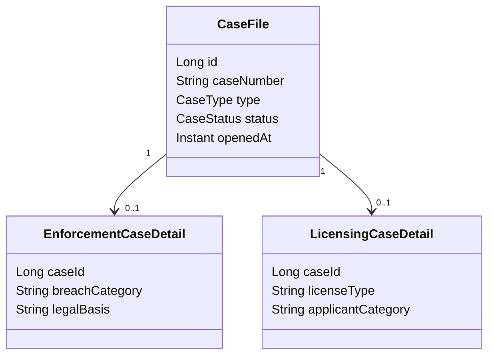

# Part 011 — Inheritance Mapping: Strategy, Query Shape, and Operational Cost

> Target bagian ini: kita bisa memilih inheritance mapping bukan berdasarkan “mana yang paling OOP”, tetapi berdasarkan bentuk query, constraint, index, lifecycle, locking, migration, dan biaya operasional database.

Inheritance di ORM sering terlihat sederhana:

```java
@Entity
@Inheritance(strategy = InheritanceType.SINGLE_TABLE)
abstract class Payment { ... }

@Entity
class CardPayment extends Payment { ... }

@Entity
class BankTransferPayment extends Payment { ... }
```

Namun dalam production, inheritance adalah salah satu mapping yang paling mudah menjadi mahal. Alasannya jelas:

> **Inheritance menyatukan polymorphism object model dengan storage model relational database. Keduanya tidak punya bentuk alami yang sama.**

Object model ingin mengatakan:

- `CardPayment is a Payment`
- `BankTransferPayment is a Payment`
- business code bisa menerima `Payment`
- query bisa polymorphic

Relational model ingin mengatakan:

- row ada di table tertentu
- constraint ada di column tertentu
- index bekerja pada table tertentu
- optimizer bekerja pada join, union, predicate, cardinality

Jadi keputusan inheritance mapping sebenarnya adalah keputusan tentang **bagaimana polymorphism dibayar oleh database**.

---

## 1. Kaufman Deconstruction: Skill yang Harus Dipecah

Untuk menguasai inheritance mapping, jangan mulai dari annotation. Pecah menjadi unit skill berikut:

| Skill unit | Pertanyaan yang harus bisa dijawab |
|---|---|
| Type hierarchy modeling | Apakah subclass benar-benar memiliki lifecycle dan identity yang sama? |
| Storage shape selection | Apakah semua subtype masuk satu table, beberapa table, atau table per subtype? |
| Query shape prediction | SQL apa yang muncul untuk root query, subtype query, association fetch, dan count? |
| Constraint modeling | Apakah subtype-specific field bisa diberi `NOT NULL`, FK, unique constraint? |
| Index design | Predicate mana yang harus di-index: discriminator, status, tenant, subtype columns? |
| Locking and update behavior | Row mana yang dikunci dan di-update saat root/subtype berubah? |
| Migration strategy | Bagaimana menambah subtype, memindah subtype, atau keluar dari inheritance? |
| Provider behavior | Mana portable JPA, mana Hibernate/EclipseLink-specific? |

Goal top engineer:

> **Saat melihat hierarchy entity, kita bisa menggambar table layout, memprediksi SQL, memperkirakan index, dan menyebut failure mode sebelum code dijalankan.**

---

## 2. Mental Model: Inheritance Bukan Reuse Tool

Inheritance di entity sebaiknya tidak dipakai hanya untuk reuse field.

Untuk reuse field, gunakan:

- `@MappedSuperclass`
- `@Embeddable`
- composition
- shared interface non-persistent
- base class non-entity tanpa polymorphic query

Gunakan entity inheritance hanya jika memang butuh minimal salah satu dari ini:

1. **Polymorphic association**

   ```java
   @ManyToOne(fetch = FetchType.LAZY)
   private Payment payment;
   ```

   `payment` bisa menunjuk subtype mana pun.

2. **Polymorphic query**

   ```jpql
   select p from Payment p where p.status = :status
   ```

   Query root harus mengembalikan semua subtype.

3. **Shared identity and lifecycle**

   Semua subtype benar-benar bagian dari konsep entity yang sama.

4. **Substitutability secara domain benar**

   Business operation terhadap root type valid untuk semua subtype.

Jika hanya ingin menghindari duplikasi column seperti `createdAt`, `updatedAt`, `tenantId`, inheritance entity terlalu mahal. Pakai `@MappedSuperclass` atau embeddable audit block.

---

## 3. Tiga Bentuk Utama Inheritance Mapping

Jakarta Persistence mendefinisikan tiga strategy:

```java
public enum InheritanceType {
    SINGLE_TABLE,
    JOINED,
    TABLE_PER_CLASS
}
```

Secara ringkas:

| Strategy | Storage shape | Query root | Constraint subtype | Portability |
|---|---|---|---|---|
| `SINGLE_TABLE` | semua subtype dalam satu table | simple, biasanya satu table scan/index lookup | lemah untuk `NOT NULL` subtype-specific | wajib didukung |
| `JOINED` | root table + table subtype | join root ke subtype | kuat, karena subtype column ada di table subtype | wajib didukung |
| `TABLE_PER_CLASS` | tiap concrete class punya table lengkap | union / multiple query | kuat per table, lemah untuk polymorphic query | optional menurut spec |

Default jika `@Inheritance` tidak ditentukan pada root entity adalah `SINGLE_TABLE`.

Diagram besar:

```mermaid
flowchart TB
    A[Entity Inheritance] --> B[SINGLE_TABLE]
    A --> C[JOINED]
    A --> D[TABLE_PER_CLASS]
    A --> E[@MappedSuperclass]

    B --> B1[One table]
    B --> B2[Discriminator]
    B --> B3[Nullable subtype columns]

    C --> C1[Root table]
    C --> C2[Subtype tables]
    C --> C3[Joins for subtype hydration]

    D --> D1[Concrete table per subtype]
    D --> D2[UNION for polymorphic query]
    D --> D3[Optional portability]

    E --> E1[No polymorphic entity]
    E --> E2[Column reuse only]
```

---

## 4. Example Domain: Payment Hierarchy

Kita akan pakai model ini sepanjang bagian:

```java
public enum PaymentStatus {
    INITIATED,
    AUTHORIZED,
    SETTLED,
    FAILED,
    CANCELLED
}
```

Root:

```java
@Entity
public abstract class Payment {
    @Id
    @GeneratedValue(strategy = GenerationType.SEQUENCE)
    private Long id;

    @Version
    private long version;

    @Column(nullable = false)
    private String externalReference;

    @Enumerated(EnumType.STRING)
    @Column(nullable = false)
    private PaymentStatus status;

    @Column(nullable = false)
    private BigDecimal amount;

    @Column(nullable = false, length = 3)
    private String currency;
}
```

Subtype:

```java
@Entity
public class CardPayment extends Payment {
    private String cardNetwork;
    private String maskedPan;
    private String authorizationCode;
}

@Entity
public class BankTransferPayment extends Payment {
    private String bankCode;
    private String accountNumberHash;
    private String settlementReference;
}
```

Pertanyaan utamanya:

> Bentuk table mana yang paling cocok untuk data ini?

Jawabannya tidak bisa dari Java class saja. Kita harus tahu:

- query utama apa?
- volume per subtype berapa?
- subtype bertambah sering atau jarang?
- field subtype wajib atau optional?
- apakah root query umum?
- apakah laporan banyak filter subtype-specific?
- apakah ada compliance/audit constraint?
- apakah zero-downtime migration penting?

---

## 5. `SINGLE_TABLE`: Satu Table untuk Seluruh Hierarchy

Mapping:

```java
@Entity
@Table(name = "payment")
@Inheritance(strategy = InheritanceType.SINGLE_TABLE)
@DiscriminatorColumn(name = "payment_type", discriminatorType = DiscriminatorType.STRING, length = 32)
public abstract class Payment {
    @Id
    private Long id;

    @Version
    private long version;

    @Column(nullable = false)
    private String externalReference;

    @Enumerated(EnumType.STRING)
    @Column(nullable = false)
    private PaymentStatus status;

    @Column(nullable = false)
    private BigDecimal amount;

    @Column(nullable = false, length = 3)
    private String currency;
}

@Entity
@DiscriminatorValue("CARD")
public class CardPayment extends Payment {
    private String cardNetwork;
    private String maskedPan;
    private String authorizationCode;
}

@Entity
@DiscriminatorValue("BANK_TRANSFER")
public class BankTransferPayment extends Payment {
    private String bankCode;
    private String accountNumberHash;
    private String settlementReference;
}
```

Table shape:

```sql
create table payment (
    id bigint not null primary key,
    version bigint not null,
    payment_type varchar(32) not null,
    external_reference varchar(255) not null,
    status varchar(32) not null,
    amount numeric(19,2) not null,
    currency varchar(3) not null,

    -- CardPayment columns
    card_network varchar(32),
    masked_pan varchar(32),
    authorization_code varchar(64),

    -- BankTransferPayment columns
    bank_code varchar(32),
    account_number_hash varchar(128),
    settlement_reference varchar(128)
);
```

### 5.1 SQL Shape

Query root:

```jpql
select p from Payment p where p.status = :status
```

Likely SQL:

```sql
select
    p.id,
    p.version,
    p.payment_type,
    p.external_reference,
    p.status,
    p.amount,
    p.currency,
    p.card_network,
    p.masked_pan,
    p.authorization_code,
    p.bank_code,
    p.account_number_hash,
    p.settlement_reference
from payment p
where p.status = ?
```

Query subtype:

```jpql
select c from CardPayment c where c.cardNetwork = :network
```

Likely SQL:

```sql
select
    p.*
from payment p
where p.payment_type = 'CARD'
  and p.card_network = ?
```

### 5.2 Strengths

`SINGLE_TABLE` sangat bagus saat:

- hierarchy tidak terlalu lebar
- field subtype tidak terlalu banyak
- root query sering
- polymorphic association sering
- subtype count rendah dan stabil
- read path ingin menghindari join
- data access banyak memakai root columns seperti `status`, `amount`, `created_at`, `tenant_id`

Keuntungan besar:

| Keuntungan | Penjelasan |
|---|---|
| Query root cepat | satu table, tidak perlu join/union |
| Insert sederhana | satu insert |
| Update root/subtype sederhana | satu update |
| Locking sederhana | satu row |
| Pagination polymorphic relatif aman | satu table order/filter |
| Cache key sederhana | satu entity table |

### 5.3 Costs

Biaya utamanya:

| Cost | Dampak |
|---|---|
| Banyak nullable column | subtype-specific column tidak berlaku untuk subtype lain |
| Constraint subtype sulit | `card_network not null` hanya untuk `payment_type='CARD'` butuh check constraint |
| Table melebar | row width meningkat, cache/page efficiency turun |
| Index banyak | tiap subtype butuh index partial/composite sendiri |
| Domain leakage | table menjadi union semua konsep subtype |
| Schema change risk | menambah subtype berarti alter table besar |

### 5.4 Constraint Pattern untuk Subtype Field

Masalah klasik:

> `CardPayment.authorizationCode` wajib untuk card payment, tapi tidak boleh wajib untuk bank transfer.

Di `SINGLE_TABLE`, `authorization_code` tidak bisa `NOT NULL` secara global.

Gunakan check constraint database:

```sql
alter table payment add constraint chk_card_payment_fields
check (
    payment_type <> 'CARD'
    or (
        card_network is not null
        and masked_pan is not null
    )
);
```

Untuk bank transfer:

```sql
alter table payment add constraint chk_bank_transfer_fields
check (
    payment_type <> 'BANK_TRANSFER'
    or (
        bank_code is not null
        and account_number_hash is not null
    )
);
```

Catatan penting:

- ORM annotation `nullable = false` pada subtype field bisa menghasilkan DDL yang tidak sesuai untuk `SINGLE_TABLE`.
- Jangan mengandalkan DDL auto-generation untuk rule subtype serius.
- Tuliskan constraint di migration tool seperti Flyway/Liquibase.

### 5.5 Index Pattern

Untuk query root:

```sql
create index idx_payment_status_created
on payment(status, id);
```

Untuk query subtype card:

```sql
create index idx_payment_card_network
on payment(payment_type, card_network)
where payment_type = 'CARD';
```

Jika database tidak mendukung partial index, gunakan composite index:

```sql
create index idx_payment_type_card_network
on payment(payment_type, card_network);
```

`payment_type` sering menjadi leading column untuk subtype query karena provider akan menambahkan discriminator predicate.

### 5.6 Kapan `SINGLE_TABLE` Salah

Hindari saat:

- subtype banyak dan terus bertambah
- field subtype sangat banyak
- field subtype punya constraint kuat
- subtype mempunyai foreign key unik yang berbeda-beda
- table akan sangat panas untuk semua subtype
- compliance/audit meminta separation jelas
- tiap subtype punya lifecycle operasional berbeda

Contoh buruk:

```txt
Case
├── CriminalCase: 90 fields
├── CivilCase: 70 fields
├── TaxCase: 120 fields
├── ImmigrationCase: 80 fields
├── LicensingCase: 60 fields
└── EnforcementCase: 150 fields
```

Satu table akan menjadi monster table dengan ratusan nullable column.

---

## 6. `JOINED`: Root Table + Subtype Table

Mapping:

```java
@Entity
@Table(name = "payment")
@Inheritance(strategy = InheritanceType.JOINED)
@DiscriminatorColumn(name = "payment_type", discriminatorType = DiscriminatorType.STRING, length = 32)
public abstract class Payment {
    @Id
    private Long id;

    @Version
    private long version;

    @Column(nullable = false)
    private String externalReference;

    @Enumerated(EnumType.STRING)
    @Column(nullable = false)
    private PaymentStatus status;

    @Column(nullable = false)
    private BigDecimal amount;

    @Column(nullable = false, length = 3)
    private String currency;
}

@Entity
@Table(name = "card_payment")
@DiscriminatorValue("CARD")
public class CardPayment extends Payment {
    @Column(nullable = false)
    private String cardNetwork;

    @Column(nullable = false)
    private String maskedPan;

    private String authorizationCode;
}

@Entity
@Table(name = "bank_transfer_payment")
@DiscriminatorValue("BANK_TRANSFER")
public class BankTransferPayment extends Payment {
    @Column(nullable = false)
    private String bankCode;

    @Column(nullable = false)
    private String accountNumberHash;

    private String settlementReference;
}
```

Table shape:

```sql
create table payment (
    id bigint not null primary key,
    version bigint not null,
    payment_type varchar(32),
    external_reference varchar(255) not null,
    status varchar(32) not null,
    amount numeric(19,2) not null,
    currency varchar(3) not null
);

create table card_payment (
    id bigint not null primary key references payment(id),
    card_network varchar(32) not null,
    masked_pan varchar(32) not null,
    authorization_code varchar(64)
);

create table bank_transfer_payment (
    id bigint not null primary key references payment(id),
    bank_code varchar(32) not null,
    account_number_hash varchar(128) not null,
    settlement_reference varchar(128)
);
```

### 6.1 SQL Shape

Insert card payment:

```sql
insert into payment (..., payment_type, status, amount, currency) values (...);
insert into card_payment (id, card_network, masked_pan, authorization_code) values (...);
```

Find by id root:

```java
Payment payment = entityManager.find(Payment.class, id);
```

Provider may generate SQL with joins to subclass tables or may use discriminator/secondary selects depending provider and fetch behavior.

Typical polymorphic root query shape:

```sql
select
    p.id,
    p.version,
    p.payment_type,
    p.external_reference,
    p.status,
    p.amount,
    p.currency,
    c.card_network,
    c.masked_pan,
    c.authorization_code,
    b.bank_code,
    b.account_number_hash,
    b.settlement_reference
from payment p
left join card_payment c on p.id = c.id
left join bank_transfer_payment b on p.id = b.id
where p.status = ?
```

Subtype query:

```sql
select
    p.id,
    p.version,
    p.external_reference,
    p.status,
    p.amount,
    p.currency,
    c.card_network,
    c.masked_pan,
    c.authorization_code
from card_payment c
join payment p on p.id = c.id
where c.card_network = ?
```

### 6.2 Strengths

`JOINED` bagus saat:

- root fields digunakan bersama
- subtype fields punya constraint kuat
- subtype tidak terlalu banyak
- normalized shape penting
- subtype-specific queries cukup sering
- data governance ingin separation lebih jelas
- row width root harus tetap kecil

Keuntungan:

| Keuntungan | Penjelasan |
|---|---|
| Constraint subtype kuat | subtype table bisa punya `NOT NULL`, FK, unique |
| Root table ramping | common fields saja |
| Model normalized | cocok dengan database discipline |
| Subtype table scalable | subtype-specific index jelas |
| Tambah subtype relatif bersih | create table baru, tidak melebar table root |

### 6.3 Costs

Biaya utamanya:

| Cost | Dampak |
|---|---|
| Insert dua statement | root + subtype |
| Query root mahal | join ke beberapa subtype table |
| Deep hierarchy mahal | join semakin banyak |
| Locking lebih kompleks | pessimistic lock bisa mengunci row tambahan |
| Delete ordering | subtype row harus dihapus sebelum/root sesuai FK cascade |
| Pagination root bisa berat | join + sort + filter |

### 6.4 Operational Warning: Deep Hierarchy

`JOINED` terlihat “relationally clean”, tetapi deep hierarchy bisa mahal.

```txt
Document
└── CaseDocument
    └── EvidenceDocument
        └── DigitalEvidenceDocument
            └── ForensicImageDocument
```

Find subtype terdalam bisa butuh join banyak table:

```sql
select ...
from document d
join case_document cd on cd.id = d.id
join evidence_document ed on ed.id = d.id
join digital_evidence_document ded on ded.id = d.id
join forensic_image_document fid on fid.id = d.id
where d.id = ?
```

Rule:

> Jika hierarchy lebih dari 2 level, tanyakan apakah composition lebih tepat.

### 6.5 Discriminator pada `JOINED`

Jakarta Persistence menyebut discriminator column biasanya digunakan untuk `SINGLE_TABLE` dan dapat juga dipakai pada `JOINED`. Dalam praktik, menentukan discriminator eksplisit sering membantu:

- query type lebih jelas
- migration lebih mudah
- debugging row root lebih mudah
- cache/type resolution lebih jelas

Namun jangan bergantung pada default discriminator value provider jika portability penting. Gunakan `@DiscriminatorValue` eksplisit.

---

## 7. `TABLE_PER_CLASS`: Table per Concrete Entity

Mapping:

```java
@Entity
@Inheritance(strategy = InheritanceType.TABLE_PER_CLASS)
public abstract class Payment {
    @Id
    private Long id;

    @Version
    private long version;

    private String externalReference;
    private PaymentStatus status;
    private BigDecimal amount;
    private String currency;
}

@Entity
@Table(name = "card_payment")
public class CardPayment extends Payment {
    private String cardNetwork;
    private String maskedPan;
}

@Entity
@Table(name = "bank_transfer_payment")
public class BankTransferPayment extends Payment {
    private String bankCode;
    private String accountNumberHash;
}
```

Table shape:

```sql
create table card_payment (
    id bigint not null primary key,
    version bigint not null,
    external_reference varchar(255),
    status varchar(32),
    amount numeric(19,2),
    currency varchar(3),
    card_network varchar(32),
    masked_pan varchar(32)
);

create table bank_transfer_payment (
    id bigint not null primary key,
    version bigint not null,
    external_reference varchar(255),
    status varchar(32),
    amount numeric(19,2),
    currency varchar(3),
    bank_code varchar(32),
    account_number_hash varchar(128)
);
```

### 7.1 SQL Shape

Subtype query is simple:

```sql
select *
from card_payment
where card_network = ?
```

Root query usually requires `UNION`:

```sql
select
    id, version, external_reference, status, amount, currency,
    card_network, masked_pan,
    null as bank_code, null as account_number_hash,
    'CARD' as clazz_
from card_payment
where status = ?
union all
select
    id, version, external_reference, status, amount, currency,
    null as card_network, null as masked_pan,
    bank_code, account_number_hash,
    'BANK_TRANSFER' as clazz_
from bank_transfer_payment
where status = ?
```

### 7.2 Strengths

`TABLE_PER_CLASS` cocok terbatas saat:

- root polymorphic query jarang
- subtype benar-benar independent secara storage
- table subtype harus memiliki full constraint sendiri
- lifecycle subtype hampir tidak saling bersinggungan
- common fields tidak terlalu banyak

### 7.3 Costs

| Cost | Dampak |
|---|---|
| Polymorphic query mahal | union/multiple selects |
| Global unique constraint sulit | `external_reference` unik lintas subtype sulit tanpa table terpisah/global index |
| ID generation harus global | tidak boleh tabrakan antar table untuk root identity |
| Pagination root sulit | union + order + limit bisa berat |
| Optional portability | Jakarta Persistence menyatakan support strategy ini optional |
| Association to root mahal | resolving subtype bisa butuh union/type resolution |

### 7.4 ID Generation Trap

Karena semua subtype adalah `Payment`, ID harus unik lintas semua table.

Hindari identity sequence per table yang bisa menghasilkan:

```txt
card_payment.id = 100
bank_transfer_payment.id = 100
```

Gunakan sequence global:

```java
@Id
@GeneratedValue(strategy = GenerationType.SEQUENCE, generator = "payment_seq")
@SequenceGenerator(name = "payment_seq", sequenceName = "payment_seq", allocationSize = 50)
private Long id;
```

### 7.5 Kapan Hampir Pasti Salah

Hindari `TABLE_PER_CLASS` jika:

- association ke root sering
- root query sering
- pagination root penting
- uniqueness lintas subtype penting
- reporting polymorphic penting
- ingin provider portability tinggi

Dalam enterprise system, `TABLE_PER_CLASS` sering terlihat menarik karena table bersih, tetapi menjadi mahal saat business mulai bertanya:

> “Tampilkan semua payment terakhir, apapun typenya.”

Saat itu query menjadi union multi-table.

---

## 8. `@MappedSuperclass`: Field Reuse Tanpa Entity Polymorphism

Mapping:

```java
@MappedSuperclass
public abstract class AuditedEntity {
    @Column(nullable = false, updatable = false)
    private Instant createdAt;

    @Column(nullable = false)
    private Instant updatedAt;

    @Version
    private long version;
}

@Entity
@Table(name = "case_file")
public class CaseFile extends AuditedEntity {
    @Id
    private Long id;

    private String caseNumber;
}

@Entity
@Table(name = "evidence_item")
public class EvidenceItem extends AuditedEntity {
    @Id
    private Long id;

    private String evidenceNumber;
}
```

`@MappedSuperclass` tidak punya table sendiri dan tidak bisa dipakai sebagai entity root query:

```jpql
-- Tidak valid sebagai entity query kalau AuditedEntity bukan entity
select a from AuditedEntity a
```

Gunakan ini saat:

- hanya butuh reuse mapping field
- tidak butuh polymorphic query
- tidak butuh association ke base type
- tidak butuh base entity identity

Ini adalah pilihan default untuk common technical fields.

### 8.1 Common Good Use Cases

- audit timestamps
- optimistic lock field
- tenant id
- soft delete marker, jika semua table punya pola sama
- common external reference
- createdBy/updatedBy

### 8.2 Bad Use Cases

Jangan gunakan `@MappedSuperclass` jika business membutuhkan:

```java
@ManyToOne
private AuditedEntity target;
```

atau:

```jpql
select x from AuditedEntity x where x.createdAt > :cutoff
```

Karena `AuditedEntity` bukan managed entity root.

---

## 9. Abstract Entity Root vs Mapped Superclass

Perbedaan penting:

| Feature | Abstract `@Entity` root | `@MappedSuperclass` |
|---|---|---|
| Managed entity type | ya | tidak |
| Bisa polymorphic query | ya | tidak |
| Bisa association to root | ya | tidak |
| Punya table tergantung strategy | ya | tidak langsung |
| Cocok untuk domain polymorphism | ya | tidak |
| Cocok untuk field reuse | kadang, tapi mahal | ya |

Rule sederhana:

> Jika base type muncul dalam business language dan query, pertimbangkan abstract entity. Jika base type hanya reuse field, gunakan mapped superclass.

---

## 10. `@DiscriminatorColumn` dan `@DiscriminatorValue`

Untuk `SINGLE_TABLE`, discriminator adalah wajib secara konsep. Untuk `JOINED`, discriminator sering berguna walaupun provider dapat memakai join/type resolution.

Gunakan value eksplisit:

```java
@DiscriminatorColumn(
    name = "payment_type",
    discriminatorType = DiscriminatorType.STRING,
    length = 32
)
```

```java
@DiscriminatorValue("CARD")
class CardPayment extends Payment { ... }
```

Hindari default value provider karena:

- bisa berubah jika entity name berubah
- refactoring class bisa memengaruhi default
- data lama menjadi sulit dimigrasi
- provider migration lebih sulit

### 10.1 String vs Integer Discriminator

| Type | Pros | Cons |
|---|---|---|
| String | readable, migration-friendly, debug-friendly | lebih besar |
| Integer | compact, index kecil | butuh lookup knowledge, kurang jelas di log/data |

Untuk enterprise maintainability, string discriminator sering lebih defensible kecuali volume ekstrem.

### 10.2 Discriminator sebagai Domain Field?

Jangan expose discriminator sebagai mutable domain field biasa.

Buruk:

```java
@Column(name = "payment_type")
private String paymentType;
```

Jika aplikasi bisa mengubah `payment_type`, object type dan row type bisa tidak sinkron.

Jika perlu read-only diagnostic:

```java
@Column(name = "payment_type", insertable = false, updatable = false)
private String paymentType;
```

Tetap gunakan dengan hati-hati.

---

## 11. Query Shape: Root Query, Subtype Query, Association Query

Inheritance harus dievaluasi dari query shape.

### 11.1 Root Query

```jpql
select p from Payment p
where p.status = :status
order by p.id desc
```

| Strategy | SQL shape | Risk |
|---|---|---|
| `SINGLE_TABLE` | one table | wide row |
| `JOINED` | root + subtype joins or secondary resolution | join cost |
| `TABLE_PER_CLASS` | union | pagination/sort cost |

### 11.2 Subtype Query

```jpql
select c from CardPayment c
where c.cardNetwork = :network
```

| Strategy | SQL shape | Risk |
|---|---|---|
| `SINGLE_TABLE` | table + discriminator predicate | nullable subtype columns, partial index needed |
| `JOINED` | subtype join root | join cost but good constraints |
| `TABLE_PER_CLASS` | one subtype table | simple |

### 11.3 Association to Root

```java
@Entity
class Refund {
    @ManyToOne(fetch = FetchType.LAZY)
    private Payment payment;
}
```

Loading `refund.payment`:

| Strategy | Potential behavior |
|---|---|
| `SINGLE_TABLE` | load payment row and discriminator |
| `JOINED` | load root row then resolve subtype via joins/discriminator/provider behavior |
| `TABLE_PER_CLASS` | type resolution may be more expensive |

### 11.4 Count Query

```jpql
select count(p) from Payment p where p.status = :status
```

`SINGLE_TABLE`:

```sql
select count(*) from payment where status = ?
```

`JOINED` may be able to count root table only if predicate is root-only. But if predicate references subtype field, join needed.

`TABLE_PER_CLASS` often needs sum/union across concrete tables.

---

## 12. Type Filtering: `TYPE()` and `TREAT()`

Jakarta Persistence supports type expressions for polymorphic queries.

Example: filter by subtype:

```jpql
select p
from Payment p
where type(p) = CardPayment
```

Example: access subtype field from root query:

```jpql
select p
from Payment p
where treat(p as CardPayment).cardNetwork = :network
```

Use cases:

- polymorphic screen with subtype filter
- reporting across root type
- subtype-specific predicate without separate repository

Caution:

- SQL shape can become provider-specific
- `TREAT` often introduces joins or discriminator predicates
- heavy use may indicate model/query boundary should be split

Better for high-throughput paths:

```jpql
select c from CardPayment c where c.cardNetwork = :network
```

instead of root + treat, unless polymorphism is genuinely needed.

---

## 13. Constraints and Integrity by Strategy

### 13.1 `SINGLE_TABLE`

Constraint for subtype required fields needs conditional check:

```sql
check (
  payment_type <> 'CARD'
  or card_network is not null
)
```

Unique subtype field:

```sql
create unique index ux_card_auth_code
on payment(authorization_code)
where payment_type = 'CARD' and authorization_code is not null;
```

If database does not support partial unique index, alternative is harder.

### 13.2 `JOINED`

Subtype field constraint simple:

```sql
alter table card_payment
alter column card_network set not null;

alter table card_payment
add constraint ux_card_auth_code unique (authorization_code);
```

Subtype FK simple:

```sql
alter table card_payment
add constraint fk_card_issuer
foreign key (issuer_id) references issuer(id);
```

### 13.3 `TABLE_PER_CLASS`

Subtype constraints simple per table. Global constraints difficult.

Example: `external_reference` must be unique across all payment types.

Options:

1. central reference table
2. application-level uniqueness with lock
3. database trigger
4. avoid `TABLE_PER_CLASS`

Central reference pattern:

```sql
create table payment_reference_registry (
    external_reference varchar(255) primary key,
    payment_type varchar(32) not null,
    payment_id bigint not null
);
```

This adds operational complexity.

---

## 14. Index Design by Strategy

### 14.1 `SINGLE_TABLE`

Common root query:

```sql
create index idx_payment_tenant_status_id
on payment(tenant_id, status, id desc);
```

Subtype query:

```sql
create index idx_payment_card_lookup
on payment(tenant_id, payment_type, card_network, id desc);
```

For PostgreSQL partial index:

```sql
create index idx_payment_card_network_partial
on payment(tenant_id, card_network, id desc)
where payment_type = 'CARD';
```

### 14.2 `JOINED`

Root query:

```sql
create index idx_payment_tenant_status_id
on payment(tenant_id, status, id desc);
```

Subtype query:

```sql
create index idx_card_payment_network
on card_payment(card_network, id);
```

But query may join root for tenant/status:

```sql
select ...
from card_payment c
join payment p on p.id = c.id
where p.tenant_id = ?
  and c.card_network = ?
```

Indexes:

```sql
create index idx_payment_tenant_id
on payment(tenant_id, id);

create index idx_card_payment_network_id
on card_payment(card_network, id);
```

### 14.3 `TABLE_PER_CLASS`

Repeat indexes per subtype:

```sql
create index idx_card_payment_tenant_status_id
on card_payment(tenant_id, status, id desc);

create index idx_bank_transfer_payment_tenant_status_id
on bank_transfer_payment(tenant_id, status, id desc);
```

Cost:

- duplicated index definitions
- index drift across subtype tables
- migration discipline harder

---

## 15. Locking and Versioning

### 15.1 Version Field Location

Usually version is on root:

```java
@Version
private long version;
```

In `SINGLE_TABLE`, version column in same row.

In `JOINED`, version is commonly in root table. Updating subtype may still update/check root version depending provider behavior.

In `TABLE_PER_CLASS`, version duplicated in concrete table.

### 15.2 Pessimistic Locking

For `JOINED`, pessimistic lock may need to lock rows corresponding to non-collection state across root/subclass tables. This can increase deadlock surface.

Example:

```java
Payment p = entityManager.find(
    Payment.class,
    id,
    LockModeType.PESSIMISTIC_WRITE
);
```

Potential cost:

- root row lock
- subtype row lock
- join query with `for update`
- database-specific lock syntax

Rule:

> If pessimistic locking is central to the workflow, test exact generated SQL per provider and database.

### 15.3 Deadlock Shape Example

Transaction A:

```txt
lock payment root row 10
then lock card_payment row 10
```

Transaction B:

```txt
lock card_payment row 10 through subtype query
then lock payment root row 10
```

If query paths lock in different order, deadlock risk increases. This is not only ORM issue; it is lock-ordering issue.

Mitigation:

- standardize access path
- lock root first consistently
- keep transactions short
- use optimistic locking where possible
- inspect database deadlock graph

---

## 16. Hibernate-Specific Considerations

Hibernate supports standard inheritance strategies and adds useful extensions.

### 16.1 `@DiscriminatorFormula`

Hibernate can derive discriminator from SQL expression:

```java
@DiscriminatorFormula(
    "case when authorization_code is not null then 'CARD' else 'BANK_TRANSFER' end"
)
```

Use only when legacy schema forces it. For new schema, prefer explicit discriminator column.

Risk:

- expression portability low
- index design harder
- migration harder
- debugging harder

### 16.2 `@Polymorphism`

Hibernate has controls for polymorphism behavior in advanced cases. Use sparingly. If you need this, document why hierarchy does not follow simple JPA model.

### 16.3 Embeddable Inheritance

Hibernate supports inheritance for embeddables using discriminator-based approach. This is not a core portable JPA assumption for all providers.

Good candidate:

```java
@Embeddable
abstract class NotificationTarget { ... }

@Embeddable
class EmailTarget extends NotificationTarget { ... }
```

But ask:

- is this truly embeddable value polymorphism?
- should it be JSON?
- should it be separate entity?
- should it be explicit composition with nullable fields?

### 16.4 Hibernate Query Plan Awareness

Hibernate's generated SQL may evolve between versions. For inheritance-heavy areas, keep query-count and SQL-shape tests.

Test example idea:

```java
@Test
void loadingCardPaymentByIdShouldNotJoinAllSubtypeTables() {
    // arrange fixture
    // execute entityManager.find(CardPayment.class, id)
    // assert statement count and inspected SQL shape
}
```

Do not freeze every whitespace of SQL. Assert critical characteristics:

- number of statements
- join count
- presence of discriminator predicate
- absence of unrelated subtype table

---

## 17. EclipseLink-Specific Considerations

EclipseLink has its own descriptor and class extraction model under the JPA facade.

Important concepts:

| Concept | Relevance |
|---|---|
| Descriptor | stores mapping metadata for entity/class |
| Inheritance policy | controls type resolution |
| Class extractor | can derive subclass from row when discriminator is not enough |
| Query keys/expressions | can affect inheritance queries |
| Weaving/indirection | affects lazy loading around inheritance associations |

### 17.1 Descriptor Customization

EclipseLink allows descriptor customizers. This can solve legacy inheritance schemas, but it also increases provider lock-in.

Pattern:

```java
@Customizer(PaymentDescriptorCustomizer.class)
@Entity
class Payment { ... }
```

Use cases:

- legacy discriminator rules
- advanced class extraction
- cache policy tuning per hierarchy

Risk:

- harder migration to Hibernate
- harder onboarding
- behavior not visible from standard annotations

### 17.2 EclipseLink Cache and Inheritance

If shared cache is enabled, inheritance hierarchy cache behavior must be tested for:

- root query returning subtype
- subtype update invalidating root read
- cache isolation by tenant
- descriptor cache policy

Do not assume second-level/shared cache behavior is identical between Hibernate and EclipseLink.

---

## 18. Performance Decision Matrix

| Situation | Recommended default |
|---|---|
| Small stable hierarchy, frequent polymorphic reads | `SINGLE_TABLE` |
| Strong subtype constraints, normalized schema, moderate root reads | `JOINED` |
| Rare root reads, subtype independence, no portability requirement | maybe `TABLE_PER_CLASS` |
| Only common fields | `@MappedSuperclass` |
| Complex subtype behavior with separate lifecycle | separate entities + composition |
| Many optional subtype fields | avoid `SINGLE_TABLE` |
| Deep hierarchy | avoid entity inheritance |
| High-write table with many subtype alterations | avoid very wide `SINGLE_TABLE` |
| Global uniqueness across all subtype | prefer `SINGLE_TABLE` or `JOINED` root table |
| Heavy reporting across all types | prefer `SINGLE_TABLE`, read model, or explicit reporting table |

---

## 19. Modeling Alternatives to Entity Inheritance

### 19.1 Composition with Type Field

```java
@Entity
class Payment {
    @Enumerated(EnumType.STRING)
    private PaymentType type;

    @Embedded
    private CardDetails cardDetails;

    @Embedded
    private BankTransferDetails bankTransferDetails;
}
```

This is basically manual `SINGLE_TABLE`, but with explicit composition.

Pros:

- simpler provider behavior
- no polymorphic proxy/type complexity
- easier DTO mapping

Cons:

- application must enforce type/details consistency
- many nullable fields still possible

### 19.2 Separate Entities with Shared Interface

```java
public interface PaymentLike {
    Money amount();
    PaymentStatus status();
}

@Entity
class CardPayment implements PaymentLike { ... }

@Entity
class BankTransferPayment implements PaymentLike { ... }
```

No JPA inheritance. Use separate repositories and compose read model.

Pros:

- clean table constraints
- independent lifecycle
- no polymorphic ORM surprises

Cons:

- no direct polymorphic JPA query
- association to common root harder
- requires application-level abstraction

### 19.3 Root Entity + Detail One-to-One

```java
@Entity
class Payment {
    @Id
    private Long id;

    @Enumerated(EnumType.STRING)
    private PaymentType type;

    @OneToOne(mappedBy = "payment", cascade = CascadeType.ALL, orphanRemoval = true)
    private CardPaymentDetail cardDetail;

    @OneToOne(mappedBy = "payment", cascade = CascadeType.ALL, orphanRemoval = true)
    private BankTransferDetail bankTransferDetail;
}
```

This resembles `JOINED`, but without entity inheritance. It can be more explicit and easier to control.

Pros:

- root table stable
- detail tables constrained
- no polymorphic class hierarchy
- easier type transition rules

Cons:

- application must enforce exactly one detail
- queries need explicit joins
- object model less “pure OOP”

### 19.4 JSON Detail Column

```java
@Entity
class Payment {
    @Enumerated(EnumType.STRING)
    private PaymentType type;

    @JdbcTypeCode(SqlTypes.JSON)
    private PaymentDetails details;
}
```

Good for semi-structured, rarely queried details.

Bad for:

- heavily filtered details
- strong relational constraints
- foreign keys inside detail
- operational reporting

---

## 20. Regulatory Case Management Example

Suppose:

```txt
RegulatoryCase
├── EnforcementCase
├── LicensingCase
├── SupervisionCase
└── ComplaintCase
```

Temptation:

```java
@Entity
@Inheritance(strategy = SINGLE_TABLE)
abstract class RegulatoryCase { ... }
```

Ask these questions first:

1. Are all case types processed by same lifecycle state machine?
2. Do they share same assignment/escalation model?
3. Are subtype-specific fields few or many?
4. Are subtype-specific fields used in search/reporting?
5. Are subtype-specific fields subject to legal constraints?
6. Will new case types be added by regulation changes?
7. Does access control differ by subtype?
8. Does audit retention differ by subtype?

Likely answer:

- root `CaseFile` entity for common lifecycle
- subtype-specific detail table or module-specific aggregate
- explicit `case_type`
- read models for cross-case dashboards

Possible architecture:



This often beats entity inheritance because lifecycle and reporting are explicit.

---

## 21. Migration Scenarios

### 21.1 Add New Subtype in `SINGLE_TABLE`

Steps:

1. add nullable columns
2. add discriminator value support in app
3. deploy code that can read old/new type
4. add check constraints where possible
5. backfill if needed
6. add indexes

Risk:

- alter large table may lock or rewrite depending database
- wide table grows
- constraints become more complex

### 21.2 Add New Subtype in `JOINED`

Steps:

1. create subtype table
2. add FK to root
3. deploy code with subtype entity
4. add indexes
5. update read paths

Risk:

- root queries may add another join depending provider/query
- migration cleaner than `SINGLE_TABLE`

### 21.3 Move from `SINGLE_TABLE` to `JOINED`

High-level pattern:

1. create subtype tables
2. dual-write subtype detail for new writes, or backfill in batches
3. verify row counts and checksums
4. deploy code using joined mapping only during controlled cutover
5. remove old subtype columns later

Danger:

- changing ORM inheritance strategy is not a small refactor
- entity identity and cache behavior may change
- queries must be regression-tested

### 21.4 Exit Inheritance to Composition

Pattern:

1. introduce root entity and detail entities alongside old hierarchy
2. create database views or compatibility read model if needed
3. migrate service layer from polymorphic entity behavior to explicit type dispatch
4. migrate data
5. remove inheritance mapping

This is a major model migration; do it only with tests and observability.

---

## 22. Testing Inheritance Mapping

Minimum tests:

### 22.1 Insert and Load Each Subtype

```java
@Test
void cardPaymentPersistsAndLoadsAsCardPayment() {
    CardPayment payment = new CardPayment(...);
    entityManager.persist(payment);
    entityManager.flush();
    entityManager.clear();

    Payment found = entityManager.find(Payment.class, payment.getId());

    assertThat(found).isInstanceOf(CardPayment.class);
}
```

### 22.2 Root Query Includes All Subtypes

```java
@Test
void paymentRootQueryReturnsAllConcreteTypes() {
    List<Payment> payments = entityManager
        .createQuery("select p from Payment p order by p.id", Payment.class)
        .getResultList();

    assertThat(payments)
        .extracting(p -> p.getClass().getSimpleName())
        .contains("CardPayment", "BankTransferPayment");
}
```

### 22.3 Subtype Query Does Not Return Other Type

```java
@Test
void cardPaymentQueryReturnsOnlyCards() {
    List<CardPayment> cards = entityManager
        .createQuery("select c from CardPayment c", CardPayment.class)
        .getResultList();

    assertThat(cards).allMatch(CardPayment.class::isInstance);
}
```

### 22.4 Constraint Test

For `SINGLE_TABLE`, test database constraint, not just Bean Validation:

```java
@Test
void cardPaymentRequiresCardNetworkAtDatabaseLevel() {
    CardPayment p = new CardPayment();
    p.setCardNetwork(null);

    assertThatThrownBy(() -> {
        entityManager.persist(p);
        entityManager.flush();
    }).isInstanceOf(PersistenceException.class);
}
```

### 22.5 SQL Shape Regression

Use SQL capture to assert:

- root query does not unexpectedly issue N queries
- subtype query does not join unrelated subtype tables if unacceptable
- count query remains cheap
- pagination query does not explode

---

## 23. Common Failure Modes

### 23.1 Entity Inheritance for Code Reuse

Symptom:

```java
@Entity
abstract class BaseEntity { ... }
```

Then dozens of unrelated entities extend it.

Problem:

- accidental polymorphic model
- unclear root semantics
- possible unintended inheritance mapping

Better:

```java
@MappedSuperclass
abstract class BaseEntity { ... }
```

### 23.2 `SINGLE_TABLE` with Too Many Subtypes

Symptom:

- table has 200 columns
- most columns nullable
- constraints are unreadable
- index count explodes

Better:

- `JOINED`
- root + detail composition
- separate aggregates

### 23.3 `JOINED` with Deep Hierarchy

Symptom:

- simple find generates huge join
- pessimistic lock deadlocks
- query plans unstable

Better:

- flatten hierarchy
- composition
- explicit detail tables

### 23.4 `TABLE_PER_CLASS` with Root Dashboard

Symptom:

- dashboard query uses union across many subtype tables
- pagination slow
- total count expensive

Better:

- shared root table
- read model
- materialized view

### 23.5 Mutable Discriminator

Symptom:

- row discriminator changed manually
- ORM loads wrong subtype
- ClassCastException or missing field semantics

Better:

- never update discriminator as business field
- model type transition explicitly as migration/workflow

### 23.6 Equals/HashCode Across Hierarchy

Danger:

```java
if (getClass() != o.getClass()) return false;
```

This can behave differently with proxies and inheritance.

General approach:

- use stable identifier equality carefully
- avoid business equality across mutable fields
- test proxy/subtype equality
- do not put transient entities in hash sets if ID assigned later

Detailed equality rules were covered in previous series; here the inheritance-specific warning is: subtype/proxy class checks can be dangerous.

---

## 24. Provider Migration Risk

Inheritance is one of the highest-risk areas when migrating provider.

Inventory:

| Item | Check |
|---|---|
| Strategy | same mapping supported? |
| Discriminator default | explicit values or provider-generated? |
| Query behavior | JPQL produces same result? |
| SQL shape | acceptable performance? |
| Cache behavior | root/subtype cache invalidation? |
| Lazy association to root | proxy/weaving behavior? |
| `TYPE`/`TREAT` | same semantics? |
| Custom discriminator formulas/extractors | provider lock-in? |

Migration principle:

> Make discriminator values explicit and write behavior tests before changing provider.

---

## 25. Decision Procedure

Use this procedure before choosing inheritance mapping:

```mermaid
flowchart TD
    A[Need common fields only?] -->|yes| B[@MappedSuperclass or Embeddable]
    A -->|no| C[Need polymorphic query or association?]
    C -->|no| D[Separate entities + shared interface/composition]
    C -->|yes| E[Are subtype fields few and weakly constrained?]
    E -->|yes| F[SINGLE_TABLE candidate]
    E -->|no| G[Are root queries common?]
    G -->|yes| H[JOINED or root+detail composition]
    G -->|no| I[Subtype-specific entities or TABLE_PER_CLASS only if justified]
    H --> J[Benchmark SQL shape]
    F --> J
    I --> J
```

Checklist:

1. Can I explain the generated table shape?
2. Can I predict root query SQL?
3. Can I enforce subtype required fields in database?
4. Can I index the top 5 queries?
5. Can I add a subtype without unacceptable migration risk?
6. Can I migrate provider later?
7. Can I test root/subtype/cache/locking behavior?
8. Can the team understand this after 12 months?

If any answer is “no”, simplify.

---

## 26. Practice Drills

### Drill 1 — Predict SQL

Given:

```java
@Entity
@Inheritance(strategy = InheritanceType.JOINED)
abstract class CaseEvent { ... }

@Entity
class AssignmentEvent extends CaseEvent { ... }

@Entity
class EscalationEvent extends CaseEvent { ... }
```

Predict SQL for:

```jpql
select e from CaseEvent e where e.caseId = :caseId
```

Then run and inspect:

- number of joins
- discriminator usage
- selected columns
- order by behavior

### Drill 2 — Constraint Design

Given `SINGLE_TABLE` hierarchy:

```txt
Notification
├── EmailNotification requires emailAddress
├── SmsNotification requires phoneNumber
└── WebhookNotification requires endpointUrl
```

Write database check constraints for each subtype.

### Drill 3 — Refactor Decision

Given hierarchy with 12 subtype entities, root dashboard, subtype-specific reporting, and strict subtype constraints.

Choose between:

- `SINGLE_TABLE`
- `JOINED`
- `TABLE_PER_CLASS`
- root + detail composition
- separate aggregates + read model

Defend using query shape and constraints.

---

## 27. Production Readiness Checklist

Before approving inheritance mapping:

- [ ] Explicit `@Inheritance` on root
- [ ] Explicit `@DiscriminatorColumn` where relevant
- [ ] Explicit `@DiscriminatorValue` for every subtype
- [ ] No entity inheritance used only for technical field reuse
- [ ] Root query SQL inspected
- [ ] Subtype query SQL inspected
- [ ] Count query inspected
- [ ] Pagination query inspected
- [ ] Database constraints cover subtype invariants
- [ ] Indexes match discriminator/root/subtype predicates
- [ ] Locking behavior tested if pessimistic locks are used
- [ ] Provider-specific extensions documented
- [ ] Migration path for adding subtype documented
- [ ] Cache behavior tested if shared/second-level cache is enabled
- [ ] Query-count regression tests added for critical flows

---

## 28. Key Takeaways

1. Entity inheritance is a storage/query decision, not just an OOP design decision.
2. `SINGLE_TABLE` optimizes polymorphic reads but weakens subtype constraints and can create very wide tables.
3. `JOINED` preserves normalized subtype constraints but pays with joins and more complex locking/query plans.
4. `TABLE_PER_CLASS` makes subtype tables clean but makes root polymorphism expensive and less portable.
5. `@MappedSuperclass` is the default for field reuse.
6. Explicit discriminator values are safer than provider defaults.
7. Inheritance strategy must be chosen from real query shapes, not class diagrams.
8. For enterprise systems, root + detail composition often beats deep entity inheritance.

---

## 29. References

- Jakarta Persistence 3.2 Specification — inheritance strategies, discriminator rules, `@Inheritance`, `@DiscriminatorColumn`, `@DiscriminatorValue`.
- Hibernate ORM User Guide — inheritance mapping, mapped superclass, discriminator behavior, Hibernate extensions.
- EclipseLink Documentation — descriptors, inheritance policy, class extraction, JPA extensions.
