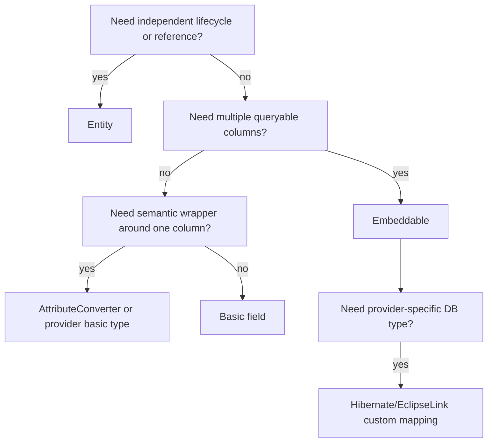
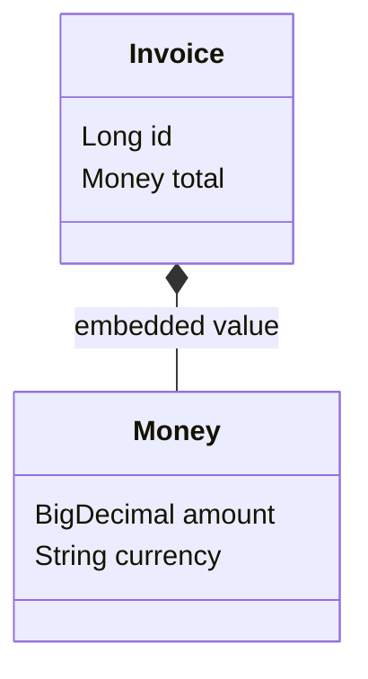

# Part 012 — Embeddables, Value Objects, JSON, Arrays, and Custom Types

> Target bagian ini: kita bisa memodelkan value object dan database-specific type secara eksplisit, tanpa menjadikan entity penuh sebagai default untuk semua hal dan tanpa menyembunyikan domain concept di primitive field yang lemah.

Dalam aplikasi enterprise, kualitas persistence model sering ditentukan oleh hal kecil:

```java
private String currency;
private BigDecimal amount;
private String status;
private String metadata;
```

Field seperti ini terlihat sederhana, tetapi sering menyembunyikan invariant penting:

- currency harus ISO code valid
- amount tidak boleh negatif pada konteks tertentu
- status harus stabil terhadap rename enum
- metadata JSON punya schema yang harus berevolusi
- range tanggal harus valid
- value harus immutable
- conversion harus deterministic

Part ini membahas cara mengubah primitive persistence menjadi model yang lebih kuat menggunakan:

- `@Embeddable`
- Java record embeddable
- `@AttributeOverride`
- `@AttributeConverter`
- enum mapping modern
- Hibernate custom type dan `@JdbcTypeCode`
- JSON/XML/array/struct mapping
- EclipseLink converters dan transformation mapping
- testing strategy untuk value mapping

Kalimat inti:

> **Value mapping adalah boundary antara semantic domain type dan physical database representation. Boundary ini harus eksplisit, testable, dan migration-aware.**

---

## 1. Kaufman Deconstruction: Skill Units

Untuk menguasai bagian ini, pecah skill menjadi unit berikut:

| Skill unit | Kemampuan |
|---|---|
| Value object modeling | membedakan entity, embeddable, converter-backed type, dan raw primitive |
| Column ownership | memahami bahwa embeddable tidak punya identity sendiri |
| Override mapping | memakai value object yang sama beberapa kali tanpa column conflict |
| Converter discipline | menulis conversion deterministic, null-safe, dan migration-safe |
| Provider type extension | tahu kapan perlu Hibernate/EclipseLink-specific mapping |
| Database type strategy | memilih relational columns, JSON, array, struct, atau text |
| Dirty checking awareness | memahami bagaimana mutable value memengaruhi dirty tracking |
| Queryability trade-off | tahu kapan value harus queryable/indexable |
| Testing | membuktikan round-trip, DDL, SQL binding, dan migration compatibility |

Goal:

> **Kita bisa melihat field primitive dan memutuskan apakah ia seharusnya tetap primitive, menjadi embeddable, menjadi converter-backed type, atau menjadi provider-specific database type.**

---

## 2. Taxonomy: Basic, Embeddable, Entity, Converter, Custom Type

| Kind | Identity | Stored where | Best for | Not for |
|---|---|---|---|---|
| Basic field | none | one column | simple scalar | semantic-rich domain concept |
| Embeddable | shares owner identity | owner table or collection table | multi-column value object | independent lifecycle |
| Entity | own identity | own table | lifecycle, reference, mutation history | simple value composition |
| AttributeConverter-backed type | none | usually one basic column | semantic scalar wrapper | multi-column value needing queryable parts |
| Provider custom type | none or composite | provider/database-specific | JSON, array, DB-native type, advanced binding | portability-first code |

Decision rule:



---

## 3. Embeddable Mental Model

An embeddable is not a child entity. It has no database identity by itself.

```java
@Embeddable
public class Money {
    @Column(name = "amount", nullable = false, precision = 19, scale = 2)
    private BigDecimal amount;

    @Column(name = "currency", nullable = false, length = 3)
    private String currency;

    protected Money() {
    }

    public Money(BigDecimal amount, String currency) {
        if (amount == null) throw new IllegalArgumentException("amount is required");
        if (currency == null || currency.length() != 3) throw new IllegalArgumentException("currency must be ISO-4217 code");
        this.amount = amount;
        this.currency = currency;
    }
}
```

Usage:

```java
@Entity
@Table(name = "invoice")
public class Invoice {
    @Id
    private Long id;

    @Embedded
    private Money total;
}
```

Table shape:

```sql
create table invoice (
    id bigint not null primary key,
    amount numeric(19,2) not null,
    currency varchar(3) not null
);
```

Mental model:



Database model:

```txt
invoice row
├── id
├── amount
└── currency
```

There is no `money` table unless `Money` is used in an element collection or explicitly mapped differently.

---

## 4. Embeddable vs Entity

Use embeddable if:

- value exists only as part of owner
- no independent lifecycle
- no independent identity
- replacement is acceptable
- equality is value-based
- data usually loaded with owner

Use entity if:

- value is referenced by multiple owners
- lifecycle independent
- audit/history independent
- access control independent
- large data loaded separately
- many rows/collection grows unbounded

Example: Address.

Embeddable address:

```java
@Embeddable
public class Address {
    private String line1;
    private String city;
    private String countryCode;
}

@Entity
class Customer {
    @Embedded
    private Address shippingAddress;
}
```

Entity address:

```java
@Entity
class Address {
    @Id
    private Long id;

    private String line1;
    private String city;
    private String countryCode;
}

@Entity
class Customer {
    @ManyToOne(fetch = FetchType.LAZY)
    private Address primaryAddress;
}
```

If address is a normalized postal reference reused by many customers, entity may make sense. If address is simply part of a customer snapshot, embeddable is simpler.

---

## 5. Reusing Same Embeddable Multiple Times

Problem:

```java
@Entity
class Shipment {
    @Embedded
    private Address origin;

    @Embedded
    private Address destination;
}
```

Default column names conflict:

```txt
line1, city, country_code
line1, city, country_code
```

Use `@AttributeOverride`:

```java
@Entity
@Table(name = "shipment")
public class Shipment {
    @Id
    private Long id;

    @Embedded
    @AttributeOverrides({
        @AttributeOverride(name = "line1", column = @Column(name = "origin_line1")),
        @AttributeOverride(name = "city", column = @Column(name = "origin_city")),
        @AttributeOverride(name = "countryCode", column = @Column(name = "origin_country_code", length = 2))
    })
    private Address origin;

    @Embedded
    @AttributeOverrides({
        @AttributeOverride(name = "line1", column = @Column(name = "destination_line1")),
        @AttributeOverride(name = "city", column = @Column(name = "destination_city")),
        @AttributeOverride(name = "countryCode", column = @Column(name = "destination_country_code", length = 2))
    })
    private Address destination;
}
```

Nested override:

```java
@Embeddable
class Address {
    private String line1;

    @Embedded
    private GeoPoint geoPoint;
}

@Embeddable
class GeoPoint {
    private BigDecimal latitude;
    private BigDecimal longitude;
}
```

Override nested attribute:

```java
@AttributeOverride(
    name = "geoPoint.latitude",
    column = @Column(name = "origin_latitude")
)
```

Rule:

> Reusable embeddables are good, but column names belong to the owning entity context.

---

## 6. Association Inside Embeddable

Embeddables may contain relationships in many cases.

Example:

```java
@Embeddable
public class ApprovalStamp {
    @ManyToOne(fetch = FetchType.LAZY)
    @JoinColumn(name = "approved_by_user_id")
    private User approvedBy;

    @Column(name = "approved_at")
    private Instant approvedAt;
}

@Entity
class CaseDecision {
    @Id
    private Long id;

    @Embedded
    private ApprovalStamp approval;
}
```

Table:

```sql
case_decision
├── id
├── approved_by_user_id
└── approved_at
```

Be careful:

- relationship belongs to owning entity table
- embeddable has no identity
- relationship lifecycle is not owned by embeddable independently
- lazy behavior depends on provider enhancement/weaving/proxy support

For `@EmbeddedId` and map keys, relationships inside embeddables have tighter restrictions. Keep IDs simple unless derived identity is intentionally designed.

---

## 7. Element Collection of Embeddables

Example:

```java
@Embeddable
public class PhoneNumber {
    @Column(name = "country_code", nullable = false)
    private String countryCode;

    @Column(name = "number", nullable = false)
    private String number;
}

@Entity
class ContactProfile {
    @Id
    private Long id;

    @ElementCollection
    @CollectionTable(
        name = "contact_profile_phone",
        joinColumns = @JoinColumn(name = "profile_id")
    )
    private Set<PhoneNumber> phoneNumbers = new HashSet<>();
}
```

Table:

```sql
create table contact_profile_phone (
    profile_id bigint not null references contact_profile(id),
    country_code varchar(10) not null,
    number varchar(32) not null
);
```

Use for small bounded value collections.

Avoid for:

- thousands of entries per owner
- entries requiring identity
- entries requiring independent audit
- entries updated individually by ID
- concurrent edits to collection entries

Element collection mutation often causes delete/insert or diff behavior depending collection type/provider. Test SQL.

---

## 8. Immutable Value Objects

Value objects should usually be immutable.

Classic class:

```java
@Embeddable
@Access(AccessType.FIELD)
public class DateRange {
    @Column(name = "valid_from", nullable = false)
    private LocalDate fromDate;

    @Column(name = "valid_to")
    private LocalDate toDate;

    protected DateRange() {
        // for provider
    }

    public DateRange(LocalDate fromDate, LocalDate toDate) {
        if (fromDate == null) throw new IllegalArgumentException("fromDate is required");
        if (toDate != null && toDate.isBefore(fromDate)) {
            throw new IllegalArgumentException("toDate must not be before fromDate");
        }
        this.fromDate = fromDate;
        this.toDate = toDate;
    }

    public LocalDate fromDate() { return fromDate; }
    public LocalDate toDate() { return toDate; }
}
```

Mutation pattern:

```java
caseAssignment.setValidity(new DateRange(newFrom, newTo));
```

Prefer replacement over in-place mutation:

```java
// Better
invoice.changeTotal(new Money(new BigDecimal("125.00"), "USD"));

// Riskier
invoice.getTotal().setAmount(new BigDecimal("125.00"));
```

Why?

- dirty checking clearer
- invariants enforced through constructor
- value equality simpler
- fewer accidental partial mutations

---

## 9. Java Record as Embeddable

Jakarta Persistence 3.2 allows embeddable classes to be Java record types.

Example:

```java
@Embeddable
public record GeoPoint(
    @Column(name = "latitude", precision = 10, scale = 7)
    BigDecimal latitude,

    @Column(name = "longitude", precision = 10, scale = 7)
    BigDecimal longitude
) {
    public GeoPoint {
        if (latitude == null || longitude == null) {
            throw new IllegalArgumentException("latitude and longitude are required");
        }
    }
}
```

Usage:

```java
@Entity
class InspectionSite {
    @Id
    private Long id;

    @Embedded
    private GeoPoint location;
}
```

Benefits:

- naturally immutable
- value equality generated
- compact representation
- constructor invariant built in

Cautions:

- provider/version support must be verified
- field/property access behavior differs from classic beans
- enhancement/weaving may have limitations depending provider/version
- not all older frameworks expect records

Production rule:

> Use record embeddables only after testing with the exact Hibernate/EclipseLink version, bytecode enhancement/weaving mode, and build/runtime environment.

---

## 10. AttributeConverter: Semantic Scalar Mapping

Use `AttributeConverter<X,Y>` when a domain type maps to one basic database representation.

Example: `CaseNumber`.

```java
public record CaseNumber(String value) {
    public CaseNumber {
        if (value == null || !value.matches("CASE-[0-9]{8}")) {
            throw new IllegalArgumentException("Invalid case number");
        }
    }
}
```

Converter:

```java
@Converter(autoApply = true)
public class CaseNumberConverter implements AttributeConverter<CaseNumber, String> {
    @Override
    public String convertToDatabaseColumn(CaseNumber attribute) {
        return attribute == null ? null : attribute.value();
    }

    @Override
    public CaseNumber convertToEntityAttribute(String dbData) {
        return dbData == null ? null : new CaseNumber(dbData);
    }
}
```

Entity:

```java
@Entity
class CaseFile {
    @Id
    private Long id;

    @Column(name = "case_number", nullable = false, unique = true, length = 32)
    private CaseNumber caseNumber;
}
```

### 10.1 Converter Design Rules

A converter must be:

- null-safe unless column is guaranteed non-null and provider never passes null
- deterministic
- side-effect free
- fast
- independent from request/user context
- compatible with historical database values
- explicit about invalid data handling

Bad converter:

```java
@Converter
class EncryptingConverter implements AttributeConverter<String, String> {
    public String convertToDatabaseColumn(String attribute) {
        return callRemoteKms(attribute); // bad boundary
    }
}
```

Why bad:

- flush now depends on network
- retry semantics unclear
- transaction duration increases
- failure mode hidden inside value conversion

Encryption needs careful architecture; do not hide remote calls in converters.

### 10.2 Auto-Apply Converter Risk

```java
@Converter(autoApply = true)
class StringTrimmingConverter implements AttributeConverter<String, String> { ... }
```

This is dangerous because it applies widely.

Use `autoApply = true` for narrow domain wrapper types:

```java
@Converter(autoApply = true)
class CaseNumberConverter implements AttributeConverter<CaseNumber, String> { ... }
```

Avoid auto-apply for broad types:

- `String`
- `BigDecimal`
- `Integer`
- `LocalDate`

Unless you fully control all mappings.

### 10.3 Converter Limitations

Attribute converters do not apply to all mapping kinds. In Jakarta Persistence, converters do not apply to ID, version, relationship, `@Enumerated`, or `@Temporal` attributes in the normal auto-apply sense.

Do not use converter if:

- value needs multiple columns
- database needs queryable internal fields
- database type requires special JDBC binding
- provider has a native type better suited

Example:

```java
record Money(BigDecimal amount, Currency currency) {}
```

Could be converter to string:

```txt
USD 10.00
```

But this destroys queryability:

```sql
where amount > 100 and currency = 'USD'
```

So Money should usually be embeddable, not converter-backed string.

---

## 11. Enum Mapping Beyond Basics

Basic enum mapping:

```java
@Enumerated(EnumType.STRING)
private PaymentStatus status;
```

Avoid `ORDINAL` for business enum unless you have a strong reason, because reordering enum constants changes meaning.

Jakarta Persistence 3.2 adds `@EnumeratedValue`, letting an enum expose stable database value.

Example:

```java
public enum EnforcementStage {
    INTAKE("INT"),
    INVESTIGATION("INV"),
    DECISION("DEC"),
    CLOSED("CLS");

    @EnumeratedValue
    private final String code;

    EnforcementStage(String code) {
        this.code = code;
    }
}
```

Usage:

```java
@Enumerated(EnumType.STRING)
@Column(name = "stage", length = 3, nullable = false)
private EnforcementStage stage;
```

This gives:

- stable compact code
- readable enough database value
- enum rename safety if code remains stable

Alternative: converter.

```java
@Converter(autoApply = false)
class EnforcementStageConverter implements AttributeConverter<EnforcementStage, String> { ... }
```

Choose converter when:

- mapping logic is more complex
- historical aliases are needed
- unknown values require special handling
- enum code comes from external standard

Choose `@EnumeratedValue` when mapping is direct and stable.

---

## 12. Hibernate Basic Type System: When Converter Is Not Enough

Hibernate has a rich type system that separates Java type handling and JDBC type handling.

Use provider-specific Hibernate mapping when:

- database type is not a simple standard basic column
- SQL binding/extraction must be customized
- JSON/ARRAY/XML/INET/RANGE/vendor-specific type is needed
- query functions/operators depend on dialect
- converter cannot express JDBC type correctly

Example JSON:

```java
@Entity
class CaseFile {
    @Id
    private Long id;

    @JdbcTypeCode(SqlTypes.JSON)
    @Column(name = "metadata")
    private CaseMetadata metadata;
}
```

Where:

```java
public record CaseMetadata(
    String sourceSystem,
    String riskCategory,
    Map<String, String> externalReferences
) {}
```

Hibernate JSON mapping uses `@JdbcTypeCode(SqlTypes.JSON)` on the persistent attribute. The actual database DDL/binding depends on dialect and JSON mapper configuration.

### 12.1 JSON Is Not a Free Lunch

JSON is good for:

- sparse attributes
- low-query metadata
- external payload snapshots
- flexible integration details
- audit payloads
- provider-specific enrichment

JSON is bad for:

- core transactional state
- frequently filtered fields
- foreign keys
- strong relational constraints
- cross-row joins
- high-cardinality indexed predicates without planned JSON indexes

Rule:

> If the application frequently filters, joins, validates, or aggregates a JSON field, it probably wants relational columns or a read model.

### 12.2 JSON Schema Governance

If JSON stores business-relevant data, define:

- JSON schema/version field
- compatibility rules
- migration strategy
- validation boundary
- index strategy
- observability for invalid payloads

Example:

```java
public record CaseMetadata(
    int schemaVersion,
    String sourceSystem,
    String riskCategory,
    Map<String, String> externalReferences
) {}
```

On read:

```java
if (metadata.schemaVersion() < CURRENT_SCHEMA_VERSION) {
    metadata = metadataMigrator.migrate(metadata);
}
```

Do not scatter migration logic inside random business services.

---

## 13. Hibernate Embeddable as JSON/XML Aggregate

Hibernate supports mapping an embeddable aggregate to JSON/XML by placing `@JdbcTypeCode` on the persistent attribute.

Example:

```java
@Embeddable
public class InvestigationContext {
    private String trigger;
    private String riskCategory;
    private Integer score;
}

@Entity
class CaseFile {
    @Id
    private Long id;

    @JdbcTypeCode(SqlTypes.JSON)
    @Column(name = "investigation_context")
    private InvestigationContext investigationContext;
}
```

This changes storage shape:

```txt
case_file
├── id
└── investigation_context json/jsonb/etc
```

Instead of:

```txt
case_file
├── id
├── trigger
├── risk_category
└── score
```

Decision:

| Need | Better shape |
|---|---|
| filter by score often | columns |
| display as payload only | JSON |
| enforce `score not null` in DB | columns or JSON check constraints if supported |
| store evolving integration details | JSON |
| join to lookup table | columns/FK |

---

## 14. Arrays and Basic Collections

Hibernate can map Java arrays/collections to SQL array where supported, or fallback/choose alternative representations depending dialect and configuration.

Example:

```java
@Entity
class SearchProfile {
    @Id
    private Long id;

    private String[] tags;
}
```

Potential database shape:

```sql
-- PostgreSQL-like
alter table search_profile add column tags text[];
```

But portability varies.

Use arrays for:

- small bounded scalar lists
- tags where DB has strong array support
- vector-like/scalar data with provider support

Avoid arrays for:

- unbounded collections
- elements needing identity
- elements needing FK
- elements frequently updated individually
- cross-database portability requirement

Alternative portable mapping:

```java
@ElementCollection
@CollectionTable(name = "search_profile_tag", joinColumns = @JoinColumn(name = "profile_id"))
@Column(name = "tag")
private Set<String> tags = new HashSet<>();
```

Trade-off:

| Shape | Pros | Cons |
|---|---|---|
| SQL array | compact, one row | provider/database-specific, update whole value |
| element collection | relational, queryable | join table, more rows, collection diff cost |
| JSON array | flexible | weak relational constraints |

---

## 15. Structs and Database Object Types

Some databases support structured/object types. Hibernate has support for struct-like mapping in dialect-specific contexts.

Use only when:

- database platform is fixed
- struct type is a deliberate database API
- performance/storage benefit is clear
- migration portability is not a goal

For most enterprise Java systems, embeddable-to-columns is easier to operate than DB object types.

---

## 16. EclipseLink Converters

EclipseLink supports standard `AttributeConverter` and also has provider-specific converter annotations, such as:

- `@Converter`
- `@TypeConverter`
- `@ObjectTypeConverter`
- `@StructConverter`
- `@Convert`

Example concept: fixed object-to-database mapping.

```java
@ObjectTypeConverter(
    name = "stageConverter",
    objectType = EnforcementStage.class,
    dataType = String.class,
    conversionValues = {
        @ConversionValue(objectValue = "INTAKE", dataValue = "I"),
        @ConversionValue(objectValue = "INVESTIGATION", dataValue = "V"),
        @ConversionValue(objectValue = "DECISION", dataValue = "D")
    }
)
@Convert("stageConverter")
private EnforcementStage stage;
```

This is EclipseLink-specific. Prefer standard Jakarta converter unless EclipseLink feature is clearly needed.

### 16.1 When EclipseLink Converter Extension Helps

- legacy database codes
- object type conversion with descriptor-level reuse
- database struct support
- transformation mapping impossible with standard converter

### 16.2 Cost

- provider lock-in
- migration to Hibernate harder
- mapping behavior less familiar to JPA-only developers
- must be documented in architecture decision record

---

## 17. EclipseLink Transformation Mapping

Transformation mapping is for specialized translation between object representation and database representation when normal mappings are inadequate.

Conceptual example:

```txt
Java value:
  GeoPoint(latitude, longitude)

Database representation:
  latitude_degrees
  latitude_minutes
  longitude_degrees
  longitude_minutes
```

A simple embeddable may be enough. Transformation mapping becomes relevant when read/write transformation is nontrivial or legacy schema forces unusual column derivation.

Rule:

> Use transformation mapping as an escape hatch for legacy schema or advanced representation, not as the default way to model value objects.

---

## 18. Money Mapping Case Study

### 18.1 Bad Primitive Model

```java
private BigDecimal amount;
private String currency;
```

Problems:

- no invariant boundary
- `currency` can be invalid
- amount/currency can be changed separately
- methods receive half a concept

### 18.2 Better Embeddable

```java
@Embeddable
public class Money {
    @Column(name = "amount", nullable = false, precision = 19, scale = 2)
    private BigDecimal amount;

    @Column(name = "currency", nullable = false, length = 3)
    private String currency;

    protected Money() {}

    public Money(BigDecimal amount, String currency) {
        if (amount == null) throw new IllegalArgumentException("amount required");
        if (currency == null || currency.length() != 3) throw new IllegalArgumentException("currency invalid");
        this.amount = amount.setScale(2, RoundingMode.UNNECESSARY);
        this.currency = currency;
    }

    public Money add(Money other) {
        requireSameCurrency(other);
        return new Money(this.amount.add(other.amount), this.currency);
    }

    private void requireSameCurrency(Money other) {
        if (!this.currency.equals(other.currency)) {
            throw new IllegalArgumentException("currency mismatch");
        }
    }
}
```

Usage with overrides:

```java
@Entity
class InvoiceLine {
    @Embedded
    @AttributeOverrides({
        @AttributeOverride(name = "amount", column = @Column(name = "unit_amount", precision = 19, scale = 2)),
        @AttributeOverride(name = "currency", column = @Column(name = "unit_currency", length = 3))
    })
    private Money unitPrice;

    @Embedded
    @AttributeOverrides({
        @AttributeOverride(name = "amount", column = @Column(name = "tax_amount", precision = 19, scale = 2)),
        @AttributeOverride(name = "currency", column = @Column(name = "tax_currency", length = 3))
    })
    private Money tax;
}
```

### 18.3 Database Constraint

```sql
alter table invoice_line add constraint chk_unit_currency_len
check (char_length(unit_currency) = 3);

alter table invoice_line add constraint chk_unit_amount_scale
check (unit_amount = round(unit_amount, 2));
```

Application invariant is not enough for critical financial/regulatory data.

---

## 19. Date Range / Effective Dating Case Study

Regulatory systems often need effective dating:

```java
@Embeddable
public class EffectivePeriod {
    @Column(name = "effective_from", nullable = false)
    private LocalDate from;

    @Column(name = "effective_to")
    private LocalDate to;

    protected EffectivePeriod() {}

    public EffectivePeriod(LocalDate from, LocalDate to) {
        if (from == null) throw new IllegalArgumentException("from required");
        if (to != null && to.isBefore(from)) throw new IllegalArgumentException("invalid period");
        this.from = from;
        this.to = to;
    }

    public boolean contains(LocalDate date) {
        return !date.isBefore(from) && (to == null || !date.isAfter(to));
    }
}
```

Query:

```jpql
select r
from RegulationRule r
where r.period.from <= :date
  and (r.period.to is null or r.period.to >= :date)
```

This works because fields are relational columns.

If period were stored as JSON/string, query becomes harder and less portable.

Index:

```sql
create index idx_rule_effective_period
on regulation_rule(effective_from, effective_to);
```

For PostgreSQL, range types could be more expressive, but that becomes provider/database-specific mapping.

---

## 20. Strongly Typed IDs

Domain code may want:

```java
public record CaseId(Long value) {}
```

Can this be used as entity ID?

Standard converters have limitations around ID attributes. Provider-specific support may be needed, or use `@EmbeddedId`/simple `Long` internally.

Pragmatic options:

### Option A — Simple ID in Entity, Strong Type at Boundary

```java
@Entity
class CaseFile {
    @Id
    private Long id;

    public CaseId caseId() {
        return new CaseId(id);
    }
}
```

Pros:

- simplest ORM compatibility
- least provider magic

Cons:

- entity internals still primitive

### Option B — Embedded ID

```java
@Embeddable
public record CaseId(Long value) implements Serializable {}

@Entity
class CaseFile {
    @EmbeddedId
    private CaseId id;
}
```

Pros:

- strong ID in persistence model

Cons:

- provider/version support must be verified
- more ceremony
- relationships may need careful mapping

### Option C — Provider Custom Basic Type

Hibernate custom type can map `CaseId` as `BIGINT` more naturally, but it is provider-specific.

Rule:

> Strongly typed IDs are valuable, but do not sacrifice persistence clarity blindly. Test repository, association, criteria query, serialization, and migration tooling.

---

## 21. Custom Type or Converter?

Use this decision table:

| Need | Use |
|---|---|
| one domain type to one standard basic column | `AttributeConverter` |
| one value object to multiple columns | `@Embeddable` |
| JSON/ARRAY/XML/native DB type | Hibernate `@JdbcTypeCode` or provider type |
| legacy one-column code mapping | converter or EclipseLink `@ObjectTypeConverter` |
| custom JDBC binding/extraction | provider custom type |
| queryable internal fields | columns/embeddable, not converter string |
| provider portability | standard JPA features first |
| database portability not needed and DB type is valuable | provider-specific type okay with ADR |

---

## 22. Dirty Checking and Mutable Values

Mutable value objects can create dirty checking ambiguity.

Example:

```java
invoice.getTotal().setAmount(new BigDecimal("100.00"));
```

Potential issue:

- provider snapshot detects change at flush, if snapshot comparison sees value changed
- enhanced dirty tracking may or may not catch internal mutation depending instrumentation/model
- mutable nested structures inside JSON may not be detected as expected

Safer pattern:

```java
invoice.changeTotal(invoice.getTotal().withAmount(new BigDecimal("100.00")));
```

For JSON maps:

```java
caseFile.getMetadata().externalReferences().put("x", "y");
```

This is dangerous if provider cannot detect mutation inside map/value reliably.

Better:

```java
CaseMetadata old = caseFile.getMetadata();
CaseMetadata updated = old.withExternalReference("x", "y");
caseFile.changeMetadata(updated);
```

Use immutable records/classes for JSON values where possible.

---

## 23. Queryability Trade-Off

Before choosing JSON/converter, ask:

| Question | If yes |
|---|---|
| Need `where field = ?` often? | column |
| Need join to reference table? | FK/entity/column |
| Need aggregate/reporting? | column/read model |
| Need DB constraint? | column or explicit DB constraint |
| Need full payload only? | JSON okay |
| Need flexible schema? | JSON okay with governance |
| Need cross-database portability? | standard columns/converter |

Bad example:

```java
@JdbcTypeCode(SqlTypes.JSON)
private CaseSearchData searchData;
```

Then query:

```sql
where search_data->>'riskCategory' = 'HIGH'
```

If this is core search, create a real column or read model:

```java
@Column(name = "risk_category", nullable = false)
private String riskCategory;
```

or:

```sql
create table case_search_projection (
    case_id bigint primary key,
    risk_category varchar(32) not null,
    assigned_team varchar(64) not null,
    opened_at timestamp not null
);
```

---

## 24. Schema Evolution for Value Types

### 24.1 Embeddable Column Evolution

Adding field:

```java
@Embeddable
class Money {
    private BigDecimal amount;
    private String currency;
    private Integer minorUnit; // new
}
```

Migration:

1. add nullable `minor_unit`
2. deploy code writing both old and new
3. backfill
4. add not-null/check constraint
5. deploy code assuming non-null

### 24.2 Converter Evolution

Old converter:

```txt
CASE-2026-0001
```

New format:

```txt
REG-CASE-2026-0001
```

Converter must read both during migration:

```java
public CaseNumber convertToEntityAttribute(String dbData) {
    if (dbData == null) return null;
    if (dbData.startsWith("CASE-")) return CaseNumber.fromLegacy(dbData);
    return new CaseNumber(dbData);
}
```

Do not deploy write-only new format until readers are compatible.

### 24.3 JSON Evolution

Add schema version:

```json
{
  "schemaVersion": 2,
  "sourceSystem": "PORTAL",
  "riskCategory": "HIGH"
}
```

Migration choices:

- lazy migrate on read
- batch migrate
- write new version only while read supports old
- projection table for queryable fields

Test old payloads forever if retained in audit.

---

## 25. Testing Value Mapping

### 25.1 Round-Trip Test

```java
@Test
void moneyRoundTrips() {
    Invoice invoice = new Invoice(new Money(new BigDecimal("10.50"), "USD"));

    entityManager.persist(invoice);
    entityManager.flush();
    entityManager.clear();

    Invoice found = entityManager.find(Invoice.class, invoice.getId());

    assertThat(found.total()).isEqualTo(new Money(new BigDecimal("10.50"), "USD"));
}
```

### 25.2 Converter Null Test

```java
@Test
void converterHandlesNulls() {
    CaseNumberConverter converter = new CaseNumberConverter();

    assertThat(converter.convertToDatabaseColumn(null)).isNull();
    assertThat(converter.convertToEntityAttribute(null)).isNull();
}
```

### 25.3 Invalid Historical Data Test

```java
@Test
void converterRejectsInvalidCaseNumber() {
    CaseNumberConverter converter = new CaseNumberConverter();

    assertThatThrownBy(() -> converter.convertToEntityAttribute("BAD"))
        .isInstanceOf(IllegalArgumentException.class);
}
```

But in real migration, throwing may not be acceptable. Sometimes you need:

- quarantine invalid row
- log metric
- map to `UnknownCaseNumber`
- fail startup validation

Choose consciously.

### 25.4 JSON Compatibility Test

```java
@Test
void readsVersion1Metadata() {
    String oldJson = """
        {
          "schemaVersion": 1,
          "sourceSystem": "LEGACY"
        }
        """;

    CaseMetadata metadata = mapper.readValue(oldJson, CaseMetadata.class);

    assertThat(metadata.sourceSystem()).isEqualTo("LEGACY");
}
```

### 25.5 SQL Binding Test

For provider-specific type, inspect actual column type and binding:

- PostgreSQL `jsonb` vs `text`
- array column vs join table
- enum code length
- numeric precision/scale

Use Testcontainers with target database, not H2-only.

---

## 26. Anti-Patterns

### 26.1 Primitive Obsession

```java
String amount;
String currency;
String status;
String dateRange;
```

Problem:

- no invariant boundary
- parsing scattered everywhere
- invalid states easy

Better:

- `Money`
- enum with stable code
- `EffectivePeriod`

### 26.2 JSON as Escape Hatch for Poor Modeling

```java
@JdbcTypeCode(SqlTypes.JSON)
private Map<String, Object> everything;
```

Problem:

- no schema
- no type safety
- query/index unclear
- migration painful

Better:

- explicit embeddable
- JSON with schema/version
- relational fields for queryable data

### 26.3 Converter Doing Business Logic

```java
convertToDatabaseColumn(value) {
    validateAgainstCurrentPolicy(value);
}
```

Problem:

- conversion should not depend on mutable business policy
- historical values may become unreadable
- flush can fail for policy reasons unrelated to persistence

Validation belongs at command/domain boundary. Converter should convert representation.

### 26.4 Mutable Embeddable Leaking Setters

```java
invoice.getTotal().setCurrency("JPY");
```

Problem:

- partial mutation
- dirty tracking ambiguity
- invariant bypass

Better:

```java
invoice.changeTotal(new Money(amount, currency));
```

### 26.5 Overusing Provider-Specific Types

Provider-specific types are powerful. They are not free.

Every use needs:

- reason
- fallback/migration plan
- test on exact provider/database
- documentation

---

## 27. Provider Comparison Matrix

| Capability | Jakarta Persistence | Hibernate | EclipseLink |
|---|---|---|---|
| Basic embeddable | standard | supported | supported |
| Record embeddable | standard in 3.2 | version-dependent support | version-dependent support |
| AttributeConverter | standard | supported | supported |
| Enum `@Enumerated` | standard | supported | supported |
| `@EnumeratedValue` | standard in 3.2 | support depends version | support depends version |
| JSON mapping | not general portable core mapping | `@JdbcTypeCode(SqlTypes.JSON)` | provider/database-specific approaches |
| SQL array mapping | not general portable core mapping | dialect/type support | provider/database-specific |
| Object/struct mapping | limited portability | dialect/type support | converter/struct support |
| Transformation mapping | no standard equivalent | custom type/event possibilities | provider-specific TransformationMapping |
| Embeddable inheritance | not a portable assumption | supported as extension | verify/provider-specific |

Rule:

> Use Jakarta Persistence features for stable core model. Use provider-specific features at deliberate boundaries where database capability justifies lock-in.

---

## 28. Architecture Pattern: Value Mapping Boundary

For high-value systems, create a package boundary:

```txt
com.company.case.domain.value
├── CaseNumber.java
├── Money.java
├── EffectivePeriod.java
├── RiskScore.java
└── ExternalReference.java

com.company.case.persistence.converter
├── CaseNumberConverter.java
├── RiskScoreConverter.java
└── ExternalReferenceConverter.java

com.company.case.persistence.type
├── CaseMetadataJsonMapping.java
└── HibernateTypeConfiguration.java
```

Keep provider-specific mappings out of domain package when possible.

Domain:

```java
public record RiskScore(int value) {
    public RiskScore {
        if (value < 0 || value > 100) throw new IllegalArgumentException("risk score out of range");
    }
}
```

Persistence converter:

```java
@Converter(autoApply = true)
public class RiskScoreConverter implements AttributeConverter<RiskScore, Integer> {
    public Integer convertToDatabaseColumn(RiskScore attribute) {
        return attribute == null ? null : attribute.value();
    }

    public RiskScore convertToEntityAttribute(Integer dbData) {
        return dbData == null ? null : new RiskScore(dbData);
    }
}
```

This keeps the domain type clean and persistence concern explicit.

---

## 29. Capstone Mini-Example: Enforcement Case Detail

We model regulatory enforcement case.

Requirements:

- case number is stable semantic scalar
- monetary penalty is amount + currency
- legal basis has jurisdiction + code + article
- risk metadata is flexible from external scoring engine
- effective period is queryable

Model:

```java
public record CaseNumber(String value) {
    public CaseNumber {
        if (value == null || value.isBlank()) throw new IllegalArgumentException("case number required");
    }
}
```

```java
@Embeddable
public class Money {
    @Column(name = "penalty_amount", precision = 19, scale = 2)
    private BigDecimal amount;

    @Column(name = "penalty_currency", length = 3)
    private String currency;

    protected Money() {}

    public Money(BigDecimal amount, String currency) {
        if (amount == null) throw new IllegalArgumentException("amount required");
        if (currency == null || currency.length() != 3) throw new IllegalArgumentException("currency invalid");
        this.amount = amount;
        this.currency = currency;
    }
}
```

```java
@Embeddable
public class LegalBasis {
    @Column(name = "legal_jurisdiction", nullable = false, length = 32)
    private String jurisdiction;

    @Column(name = "legal_code", nullable = false, length = 64)
    private String code;

    @Column(name = "legal_article", nullable = false, length = 64)
    private String article;
}
```

```java
public record RiskMetadata(
    int schemaVersion,
    String sourceSystem,
    String riskCategory,
    Map<String, String> factors
) {}
```

```java
@Entity
@Table(name = "enforcement_case")
public class EnforcementCase {
    @Id
    private Long id;

    @Column(name = "case_number", nullable = false, unique = true, length = 64)
    private CaseNumber caseNumber;

    @Embedded
    private Money proposedPenalty;

    @Embedded
    private LegalBasis legalBasis;

    @Embedded
    private EffectivePeriod effectivePeriod;

    @JdbcTypeCode(SqlTypes.JSON)
    @Column(name = "risk_metadata")
    private RiskMetadata riskMetadata;
}
```

Design explanation:

| Field | Mapping | Reason |
|---|---|---|
| `caseNumber` | converter-backed semantic scalar | one column, strong type |
| `proposedPenalty` | embeddable | amount/currency queryable and constrained |
| `legalBasis` | embeddable | multi-column legal reference |
| `effectivePeriod` | embeddable | queryable date range |
| `riskMetadata` | JSON | flexible external scoring payload |

Index:

```sql
create unique index ux_enforcement_case_case_number
on enforcement_case(case_number);

create index idx_enforcement_case_effective_period
on enforcement_case(effective_from, effective_to);

create index idx_enforcement_case_legal_basis
on enforcement_case(legal_jurisdiction, legal_code, legal_article);
```

JSON field index only if required by query workload.

---

## 30. Production Checklist

Before approving value/custom type mapping:

- [ ] Domain concept is not hidden as weak primitive without reason
- [ ] Embeddable has clear invariant boundary
- [ ] Embeddable reuse has explicit column overrides
- [ ] Value objects are immutable or mutation is controlled
- [ ] Attribute converters are null-safe and deterministic
- [ ] Auto-apply converters are used only for narrow domain types
- [ ] Enum database values are stable across refactoring
- [ ] JSON fields have schema/version strategy if business-relevant
- [ ] Queryable fields are relational columns or projected read model
- [ ] Provider-specific types have ADR/documentation
- [ ] Testcontainers test validates target database type behavior
- [ ] Round-trip tests exist for converters/custom types
- [ ] Migration tests cover old database values/payloads
- [ ] Dirty checking behavior is tested for mutable/nested values

---

## 31. Key Takeaways

1. Embeddables model multi-column value objects that share owner identity.
2. Attribute converters are best for one-column semantic scalar wrappers.
3. Entity is the wrong default for values without independent lifecycle.
4. JSON is useful for flexible payloads, not as a replacement for core relational state.
5. Arrays and native types can be excellent when database/provider lock-in is acceptable.
6. Mutable value objects complicate dirty checking; prefer replacement and immutability.
7. Stable enum codes matter more than enum names.
8. Provider-specific type mapping should be isolated, tested, and documented.
9. Queryability should drive storage shape.
10. Value mapping correctness is part of regulatory defensibility: invalid values should be impossible or detectable at the right boundary.

---

## 32. References

- Jakarta Persistence 3.2 Specification — embeddables, element collections, attribute converters, enum mappings, record embeddables.
- Hibernate ORM User Guide — embeddables, custom type system, JSON mapping, array mapping, embeddable inheritance, `@JdbcTypeCode`.
- EclipseLink Documentation — converters, object type converters, struct converters, transformation mapping, descriptor-level extensions.
