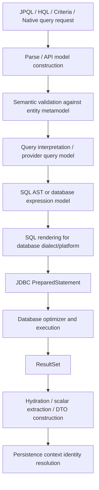
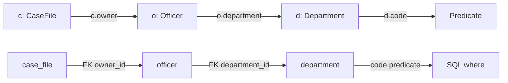
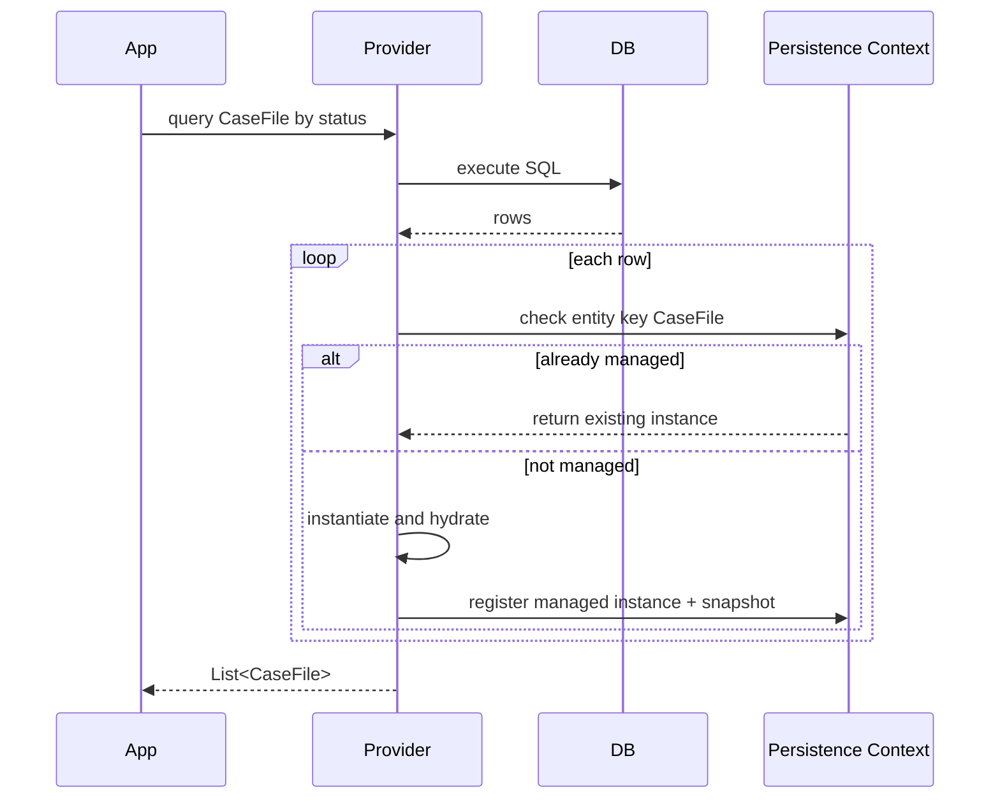

# Part 013 — Query Engine Internals: JPQL, HQL, Criteria, SQL Translation

> Target bagian ini: kita bisa membaca query ORM sebagai *program yang akan dikompilasi menjadi SQL*, bukan sekadar string yang “mirip SQL”. Kita ingin bisa memprediksi join, select list, parameter binding, aggregation behavior, bulk operation side effect, dan kapan harus turun ke native SQL.

ORM query engine adalah salah satu area paling sering disalahpahami. Banyak engineer menulis:

```java
entityManager.createQuery("""
    select c
    from CaseFile c
    where c.owner.department.code = :departmentCode
""", CaseFile.class)
.setParameter("departmentCode", "ENFORCEMENT")
.getResultList();
```

Lalu kaget ketika SQL yang muncul punya beberapa join, query lambat, atau result mengandung entity graph yang tidak sesuai ekspektasi.

Kalimat inti bagian ini:

> **JPQL/HQL/Criteria bukan SQL. Ia adalah query terhadap object model. Provider harus menerjemahkan object-path semantics menjadi relational SQL shape. Biaya utama sering muncul dari terjemahan implisit yang tidak kita sadari.**

---

## 1. Kaufman Deconstruction: Skill Units

Untuk menguasai query engine provider-level, pecah kemampuan menjadi unit berikut:

| Skill unit | Kemampuan yang harus dikuasai |
|---|---|
| Query language boundary | membedakan JPQL, HQL, Criteria, provider extensions, dan native SQL |
| Semantic model reasoning | memahami bahwa query ditulis terhadap entity model, bukan table model |
| Join prediction | memprediksi join eksplisit dan join implisit dari path expression |
| Select-list prediction | tahu kapan provider memilih entity columns, scalar columns, DTO columns, atau count |
| Parameter discipline | memahami named/positional parameter, binding type, enum binding, temporal binding |
| Aggregation correctness | memahami `group by`, `having`, aggregate projection, duplicate semantics |
| Bulk operation safety | tahu bahwa bulk update/delete tidak sinkron otomatis dengan persistence context |
| Query plan awareness | tahu ada parsing/compilation/cache cost di provider |
| Provider difference awareness | tahu area HQL Hibernate yang tidak portable ke EclipseLink JPQL |
| Native escape hatch | tahu kapan native SQL lebih benar daripada memaksa ORM query |

Latihan utama bukan “hafal syntax”, tetapi:

1. baca mapping,
2. baca query,
3. prediksi SQL shape,
4. prediksi jumlah rows,
5. prediksi jumlah objects yang dihydrate,
6. prediksi efek terhadap persistence context,
7. verifikasi dengan log SQL dan execution plan.

---

## 2. Mental Model: Query Compilation Pipeline

Secara konseptual, provider query engine bekerja seperti compiler kecil.



Yang penting:

- JPQL/HQL divalidasi terhadap **entity name dan attribute name**, bukan table/column langsung.
- Criteria membangun model query secara programmatic, tetapi tetap mengikuti semantic query yang sama.
- Provider menerjemahkan path expression menjadi join, join condition, alias, select list, discriminator, filter, tenant criteria, soft-delete predicate, dan dialect-specific SQL.
- Result entity tidak sekadar dibuat dari row. Ia harus melewati identity map persistence context.
- Query yang terlihat sederhana bisa menjadi berat karena hydration, duplicate row collapse, join explosion, atau cache interaction.

---

## 3. JPQL vs HQL vs Criteria vs Native SQL

### 3.1 JPQL

JPQL adalah bahasa query standar Jakarta Persistence. Ia portable secara prinsip, tetapi tidak menjamin semua provider menghasilkan SQL identik.

Contoh:

```java
var q = entityManager.createQuery("""
    select c
    from CaseFile c
    where c.status = :status
    order by c.createdAt desc
""", CaseFile.class);
```

JPQL cocok ketika:

- query berbasis entity model,
- portability penting,
- query tidak membutuhkan fitur SQL vendor yang kompleks,
- result dapat berupa entity, scalar, tuple, atau DTO sederhana,
- semantik object-path masih natural.

Keterbatasan praktis:

- fitur SQL modern tidak selalu tersedia secara portable,
- window function, CTE kompleks, lateral join, recursive query, optimizer hint spesifik vendor sering lebih natural di native SQL,
- provider punya behavior berbeda pada edge case.

### 3.2 HQL

HQL adalah query language Hibernate. HQL mencakup JPQL tetapi juga punya fitur tambahan Hibernate.

Gunakan HQL ketika:

- aplikasi memang memilih Hibernate sebagai provider strategis,
- fitur Hibernate memberi nilai nyata,
- provider portability bukan kebutuhan utama,
- tim mampu menjaga boundary provider-specific.

Contoh boundary yang sehat:

```java
public interface CaseReadModelQuery {
    List<CaseWorkQueueRow> findWorkQueue(CaseWorkQueueFilter filter);
}
```

Implementasi bisa Hibernate-specific, tetapi API domain tetap tidak bocor:

```java
final class HibernateCaseReadModelQuery implements CaseReadModelQuery {
    private final EntityManager em;

    @Override
    public List<CaseWorkQueueRow> findWorkQueue(CaseWorkQueueFilter filter) {
        return em.createQuery("""
            select new com.acme.casework.CaseWorkQueueRow(
                c.id,
                c.caseNumber,
                c.status,
                c.priority,
                owner.name
            )
            from CaseFile c
            join c.owner owner
            where c.status in :statuses
            order by c.priority desc, c.createdAt asc
        """, CaseWorkQueueRow.class)
        .setParameter("statuses", filter.statuses())
        .getResultList();
    }
}
```

### 3.3 Criteria API

Criteria bukan “lebih cepat” secara otomatis. Criteria adalah **query construction API**.

Gunakan Criteria ketika:

- query harus dinamis,
- filter opsional banyak,
- query builder perlu type-safety,
- kita ingin menghindari string concatenation,
- query shape tetap harus dibangun secara eksplisit.

Contoh:

```java
public List<CaseFile> search(CaseSearchRequest request) {
    CriteriaBuilder cb = em.getCriteriaBuilder();
    CriteriaQuery<CaseFile> cq = cb.createQuery(CaseFile.class);
    Root<CaseFile> root = cq.from(CaseFile.class);

    List<Predicate> predicates = new ArrayList<>();

    if (request.status() != null) {
        predicates.add(cb.equal(root.get(CaseFile_.status), request.status()));
    }

    if (request.ownerDepartmentCode() != null) {
        Join<CaseFile, Officer> owner = root.join(CaseFile_.owner);
        Join<Officer, Department> department = owner.join(Officer_.department);
        predicates.add(cb.equal(department.get(Department_.code), request.ownerDepartmentCode()));
    }

    cq.select(root)
      .where(predicates.toArray(Predicate[]::new))
      .orderBy(cb.desc(root.get(CaseFile_.createdAt)));

    return em.createQuery(cq).getResultList();
}
```

Kelebihan:

- join eksplisit lebih mudah dikontrol,
- dynamic predicate lebih aman,
- refactor attribute lebih mudah jika static metamodel dipakai.

Kekurangan:

- verbose,
- sulit dibaca untuk query kompleks,
- query business intent bisa tenggelam dalam API plumbing,
- tidak otomatis mencegah query buruk.

### 3.4 Native SQL

Native SQL adalah pilihan benar ketika relational shape lebih penting daripada object abstraction.

Gunakan native SQL untuk:

- reporting kompleks,
- window function,
- recursive query,
- CTE-heavy query,
- database-specific optimizer hint,
- lock clause spesifik vendor,
- bulk reconciliation,
- read model yang tidak cocok sebagai entity graph.

Rule praktis:

> **Jika query lebih mudah dijelaskan sebagai relational transformation daripada object navigation, native SQL kemungkinan lebih jujur.**

---

## 4. Entity Name, Attribute Name, Table Name, Column Name

JPQL/HQL memakai entity name dan attribute name.

```java
@Entity(name = "RegCase")
@Table(name = "case_file")
public class CaseFile {
    @Column(name = "case_no")
    private String caseNumber;
}
```

Query:

```java
select c
from RegCase c
where c.caseNumber = :caseNumber
```

Bukan:

```sql
select c
from case_file c
where c.case_no = :caseNumber
```

Ini terdengar basic, tetapi konsekuensinya advanced:

- rename table tidak selalu mengubah query JPQL,
- rename field Java mengubah query JPQL,
- embedded attribute path bisa menjadi banyak column,
- association path bisa menjadi join,
- provider metadata menentukan final SQL.

---

## 5. Path Expression: Sumber Join Implisit

Misal model:

```java
@Entity
class CaseFile {
    @ManyToOne(fetch = FetchType.LAZY)
    private Officer owner;
}

@Entity
class Officer {
    @ManyToOne(fetch = FetchType.LAZY)
    private Department department;
}

@Entity
class Department {
    private String code;
}
```

JPQL:

```java
select c
from CaseFile c
where c.owner.department.code = :code
```

Secara object model terlihat seperti property navigation. Secara relational model, provider perlu join ke `officer` dan `department`.

SQL shape konseptual:

```sql
select c.*
from case_file c
join officer o on c.owner_id = o.id
join department d on o.department_id = d.id
where d.code = ?
```

Mental model:



Path expression yang melewati association hampir selalu berarti join atau correlated access. Jangan menulis path panjang tanpa menghitung relational cost.

---

## 6. Explicit Join vs Implicit Join

### 6.1 Implicit join

```java
select c
from CaseFile c
where c.owner.department.code = :code
```

Kelebihan:

- ringkas,
- cocok untuk query sederhana.

Risiko:

- join tersembunyi,
- alias tidak bisa dipakai ulang secara eksplisit,
- sulit mengontrol join type,
- mudah menghasilkan SQL yang tidak disadari.

### 6.2 Explicit join

```java
select c
from CaseFile c
join c.owner owner
join owner.department department
where department.code = :code
```

Kelebihan:

- query shape lebih jujur,
- alias bisa dipakai ulang,
- join type terlihat,
- mudah dibaca saat review.

Rekomendasi enterprise:

> Untuk query production yang penting, lebih baik tulis join eksplisit. Query harus bisa direview sebagai relational operation, bukan hanya object navigation.

---

## 7. Join, Left Join, and Null Semantics

Inner join:

```java
select c
from CaseFile c
join c.assignedOfficer officer
where officer.active = true
```

Hanya case yang punya assigned officer dan officer aktif.

Left join:

```java
select c
from CaseFile c
left join c.assignedOfficer officer
where officer is null or officer.active = true
```

Case tanpa officer tetap masuk.

Pitfall umum:

```java
select c
from CaseFile c
left join c.assignedOfficer officer
where officer.active = true
```

Predicate di `where` terhadap joined entity dapat membuat left join efektif berubah seperti inner join, karena row dengan `officer is null` gagal predicate.

Dalam query bisnis seperti work queue, perbedaan ini penting:

- “case yang belum assigned” harus terlihat,
- “case yang assigned ke inactive officer” mungkin harus dieskalasi,
- “case yang assigned ke active officer” masuk queue normal.

Query harus merepresentasikan policy, bukan hanya lolos compile.

---

## 8. Select List: Entity, Scalar, DTO, Tuple

### 8.1 Entity selection

```java
select c
from CaseFile c
where c.status = :status
```

Efek:

- provider memilih column yang diperlukan untuk entity hydration,
- entity masuk persistence context,
- dirty checking berlaku,
- lazy association tetap lazy kecuali fetch plan berkata lain,
- object identity diselesaikan melalui persistence context.

Cocok untuk command-side mutation.

Tidak cocok untuk report besar.

### 8.2 Scalar selection

```java
select c.id, c.caseNumber, c.status
from CaseFile c
where c.status = :status
```

Result biasanya `Object[]` atau `Tuple`.

Cocok untuk:

- query ringan,
- ad-hoc read,
- aggregate result.

Risiko:

- raw `Object[]` rapuh,
- type mismatch mudah terlambat ketahuan.

### 8.3 DTO constructor projection

```java
select new com.acme.casework.CaseSummary(
    c.id,
    c.caseNumber,
    c.status,
    c.priority
)
from CaseFile c
where c.status = :status
```

Cocok untuk read model.

Kelebihan:

- tidak hydrate full entity,
- tidak masuk dirty checking sebagai entity,
- boundary output lebih jelas,
- lebih aman untuk API/report.

Kekurangan:

- constructor signature coupling,
- package class name di string query,
- refactor harus hati-hati.

### 8.4 Tuple

```java
CriteriaQuery<Tuple> cq = cb.createTupleQuery();
Root<CaseFile> root = cq.from(CaseFile.class);

cq.multiselect(
    root.get(CaseFile_.id).alias("id"),
    root.get(CaseFile_.caseNumber).alias("caseNumber"),
    root.get(CaseFile_.status).alias("status")
);
```

Tuple cocok saat result shape dinamis, tetapi untuk API stabil, DTO/record biasanya lebih jelas.

---

## 9. Entity Hydration and Persistence Context Identity Resolution

Query entity tidak menghasilkan object baru begitu saja.



Konsekuensi:

- Jika entity sudah managed, query result akan memakai instance yang sama.
- Database row terbaru tidak selalu overwrite state managed tanpa refresh/lock/provider-specific behavior.
- Query besar bisa membuat persistence context membesar.
- Read-only query perlu dirancang eksplisit jika ingin mengurangi overhead.

---

## 10. Parameter Binding: Safety and Type Semantics

Selalu gunakan parameter binding.

```java
em.createQuery("""
    select c
    from CaseFile c
    where c.caseNumber = :caseNumber
""", CaseFile.class)
.setParameter("caseNumber", caseNumber)
.getResultList();
```

Hindari string interpolation:

```java
// buruk
"where c.caseNumber = '" + caseNumber + "'"
```

Parameter binding penting untuk:

- SQL injection prevention,
- plan reuse,
- type conversion,
- enum mapping,
- temporal mapping,
- database-specific literal handling.

### 10.1 Collection parameter

```java
where c.status in :statuses
```

```java
query.setParameter("statuses", statuses);
```

Edge case:

- list kosong sering tidak portable,
- `in ()` tidak valid di banyak database,
- buat policy eksplisit.

Contoh:

```java
if (statuses.isEmpty()) {
    return List.of();
}
```

Atau jika business meaning-nya “no filter”, jangan pakai `in` sama sekali.

### 10.2 Enum parameter

Enum binding mengikuti mapping:

```java
@Enumerated(EnumType.STRING)
private CaseStatus status;
```

Query:

```java
where c.status = :status
```

Binding:

```java
.setParameter("status", CaseStatus.OPEN)
```

Jangan binding manual string kecuali memang query native dan mapping-nya jelas.

### 10.3 Temporal parameter

Untuk Java Time API, provider modern memahami banyak tipe temporal, tetapi database column type tetap penting:

- `LocalDate` untuk tanggal tanpa waktu,
- `Instant` untuk timestamp absolute,
- `OffsetDateTime` jika offset relevan,
- hindari semantik timezone implicit.

Query range harus half-open untuk interval waktu:

```java
where c.createdAt >= :from
  and c.createdAt < :to
```

Bukan:

```java
where c.createdAt between :from and :to
```

Untuk sistem enforcement/case management, half-open interval mengurangi bug boundary date.

---

## 11. Aggregation and Grouping

Contoh:

```java
select c.status, count(c)
from CaseFile c
group by c.status
```

SQL shape konseptual:

```sql
select c.status, count(*)
from case_file c
group by c.status
```

### 11.1 Group by entity attribute vs entity

Portable approach:

```java
select c.status, count(c.id)
from CaseFile c
group by c.status
```

Hindari group by entity penuh kecuali paham provider SQL expansion.

### 11.2 Aggregation with joins

```java
select d.code, count(c)
from CaseFile c
join c.owner o
join o.department d
group by d.code
```

Pertanyaan review:

- Apakah join menggandakan rows?
- Apakah count harus `count(c)` atau `count(distinct c.id)`?
- Apakah filter ditempatkan sebelum aggregation?
- Apakah null association harus masuk result?

### 11.3 Count and duplicates

Jika query join ke collection:

```java
select c.status, count(c)
from CaseFile c
join c.tasks t
group by c.status
```

`count(c)` menghitung row hasil join, bukan jumlah unique case, jika satu case punya banyak tasks.

Gunakan:

```java
select c.status, count(distinct c.id)
from CaseFile c
join c.tasks t
group by c.status
```

Kalau metric-nya “jumlah task per status case”, query awal mungkin benar. Kalau metric-nya “jumlah case yang punya task”, harus `distinct`.

---

## 12. Ordering and Pagination

Query pagination:

```java
var result = em.createQuery("""
    select c
    from CaseFile c
    where c.status = :status
    order by c.createdAt desc, c.id desc
""", CaseFile.class)
.setParameter("status", CaseStatus.OPEN)
.setFirstResult(page * size)
.setMaxResults(size)
.getResultList();
```

Rule penting:

> Pagination harus punya order yang deterministic.

Buruk:

```java
order by c.createdAt desc
```

Jika dua rows punya `createdAt` sama, urutan bisa berubah antar page.

Lebih baik:

```java
order by c.createdAt desc, c.id desc
```

Untuk volume besar, offset pagination bisa mahal. Keyset pagination sering lebih stabil:

```java
where (c.createdAt < :lastCreatedAt)
   or (c.createdAt = :lastCreatedAt and c.id < :lastId)
order by c.createdAt desc, c.id desc
```

ORM bisa mengekspresikan sebagian pola ini, tetapi untuk query kompleks, native SQL atau query DSL yang lebih kuat mungkin lebih tepat.

---

## 13. Bulk Update and Delete: The Dangerous Shortcut

Bulk operation tidak bekerja seperti memodifikasi managed entity satu per satu.

```java
int updated = em.createQuery("""
    update CaseFile c
    set c.status = :closed
    where c.retentionUntil < :today
      and c.status = :archivable
""")
.setParameter("closed", CaseStatus.CLOSED)
.setParameter("today", LocalDate.now())
.setParameter("archivable", CaseStatus.ARCHIVABLE)
.executeUpdate();
```

Efek:

- SQL langsung dieksekusi ke database,
- entity managed di persistence context tidak otomatis ikut berubah,
- lifecycle callback entity biasanya tidak berjalan seperti normal entity mutation,
- dirty checking tidak terjadi untuk setiap entity,
- second-level/shared cache bisa menjadi stale jika tidak ditangani,
- optimistic version handling harus dipahami.

Failure mode:

```java
CaseFile c = em.find(CaseFile.class, id); // status OPEN

em.createQuery("""
    update CaseFile c
    set c.status = :closed
    where c.id = :id
""")
.setParameter("closed", CaseStatus.CLOSED)
.setParameter("id", id)
.executeUpdate();

// c di memory masih OPEN
return c.getStatus();
```

Setelah bulk operation, pilih salah satu:

```java
em.clear();
```

atau:

```java
em.refresh(c);
```

atau desain transaction boundary agar bulk operation berjalan di boundary terpisah.

Production rule:

> **Bulk operation harus dianggap sebagai database operation, bukan entity operation.**

---

## 14. Query Hints: Contract, Hint, and Provider-Specific Lever

Jakarta Persistence menyediakan beberapa hint standar, dan provider menyediakan banyak hint tambahan.

Contoh umum:

```java
query.setHint("jakarta.persistence.query.timeout", 2_000);
```

Entity graph hint:

```java
query.setHint("jakarta.persistence.fetchgraph", graph);
```

Provider-specific hint harus dibatasi:

```java
query.setHint("org.hibernate.readOnly", true);
```

atau EclipseLink:

```java
query.setHint("eclipselink.read-only", "true");
```

Boundary pattern:

```java
final class QueryHints {
    static final String READ_ONLY = "org.hibernate.readOnly";

    private QueryHints() {}
}
```

Lebih baik lagi, sembunyikan di repository adapter provider-specific.

---

## 15. Hibernate Query Engine: Useful Mental Model

Hibernate modern memiliki pipeline query yang lebih structured dibanding sekadar string-to-SQL sederhana.

Konsep penting:

- HQL/JPQL di-parse menjadi semantic representation.
- Semantic model divalidasi terhadap mapping metamodel.
- Query diterjemahkan ke SQL AST.
- SQL AST dirender sesuai dialect.
- Query plan bisa dicache.
- Result assembly menghydrate entity/scalar/DTO sesuai projection.

Apa yang harus engineer tahu secara praktis:

1. HQL bukan SQL, walaupun mirip.
2. Hibernate dialect memengaruhi SQL final.
3. Fetch strategy dapat mengubah SQL shape.
4. Filters, tenant discriminator, soft-delete, inheritance discriminator dapat menambah predicate.
5. Query plan cache membantu repeated query shape, tetapi query string dinamis yang selalu berbeda bisa mengurangi manfaat.
6. Parameter binding lebih plan-cache-friendly daripada literal injection.

Review checklist untuk HQL:

- Apakah query pakai entity/attribute name?
- Apakah join eksplisit?
- Apakah projection sesuai use case?
- Apakah result entity benar-benar akan dimutasi?
- Apakah pagination deterministic?
- Apakah query terkena filter/tenant/soft-delete?
- Apakah bulk query butuh clear/refresh/cache eviction?

---

## 16. EclipseLink Query Engine: Useful Mental Model

EclipseLink memetakan query ke internal query/expression model dan SQL sesuai platform database.

Konsep praktis:

- JPQL diproses terhadap descriptor dan mapping metadata.
- Database platform memengaruhi SQL final.
- EclipseLink punya query hints dan expression framework.
- Indirection, fetch groups, batch fetch, dan cache dapat memengaruhi read behavior.
- Session/UnitOfWork dan shared cache memengaruhi identity resolution.

Review checklist untuk EclipseLink:

- Apakah descriptor/mapping sesuai query path?
- Apakah query menggunakan extension yang mengunci ke EclipseLink?
- Apakah weaving aktif jika lazy/fetch group bergantung pada weaving?
- Apakah cache hint sesuai consistency requirement?
- Apakah batch fetch lebih baik daripada join fetch untuk use case ini?
- Apakah query result harus maintain cache atau read-only?

---

## 17. Criteria API: Dynamic Query Without Losing Shape Discipline

Criteria sering dipakai untuk dynamic filter screen.

Buruk:

```java
if (filter.anything()) {
    // campur semua join dan predicate tanpa struktur
}
```

Lebih baik: pisahkan join registry.

```java
final class CaseCriteriaJoins {
    private final Root<CaseFile> root;
    private Join<CaseFile, Officer> owner;
    private Join<Officer, Department> ownerDepartment;

    CaseCriteriaJoins(Root<CaseFile> root) {
        this.root = root;
    }

    Join<CaseFile, Officer> owner() {
        if (owner == null) {
            owner = root.join(CaseFile_.owner, JoinType.INNER);
        }
        return owner;
    }

    Join<Officer, Department> ownerDepartment() {
        if (ownerDepartment == null) {
            ownerDepartment = owner().join(Officer_.department, JoinType.INNER);
        }
        return ownerDepartment;
    }
}
```

Lalu predicate builder:

```java
if (filter.ownerDepartmentCode() != null) {
    predicates.add(cb.equal(
        joins.ownerDepartment().get(Department_.code),
        filter.ownerDepartmentCode()
    ));
}
```

Manfaat:

- join tidak terduplikasi,
- query shape lebih predictable,
- dynamic filter tetap reviewable,
- Criteria tidak berubah menjadi spaghetti.

---

## 18. Query Shape as Engineering Artifact

Untuk query production penting, dokumentasikan query shape.

Contoh ringkas di komentar test, bukan di production code jika terlalu noisy:

```text
Case work queue query shape:
- root: case_file
- joins: owner, department
- filters: status, department code, due date
- order: priority desc, due_date asc, id asc
- projection: DTO, not entity
- expected SQL rows: one per case
- collection joins: none
- pagination: safe because no collection fetch join
```

Ini membantu code review dan incident debugging.

---

## 19. Query Smells

| Smell | Risiko | Koreksi |
|---|---|---|
| path expression panjang | join tersembunyi | join eksplisit |
| entity result untuk report | hydration mahal | DTO/native read model |
| `select distinct e` tanpa paham row duplicate | masking join explosion | audit join cardinality |
| pagination tanpa deterministic order | missing/duplicate rows antar page | order dengan tie-breaker unique |
| bulk update di transaction yang sama dengan managed entity | stale memory state | `clear`, `refresh`, boundary terpisah |
| string concatenation query | injection, plan cache buruk | parameter binding |
| Criteria builder tanpa join registry | duplicate joins, sulit review | join registry/specification pattern |
| provider hint tersebar | lock-in tak terkendali | encapsulate provider adapter |
| native query mengembalikan entity untuk report | hydration/cache side effect | scalar/DTO mapping |
| count query auto-generated dari query kompleks | count salah/mahal | tulis count query eksplisit |

---

## 20. SQL Prediction Drill

Model:

```java
@Entity
class CaseFile {
    @ManyToOne(fetch = FetchType.LAZY)
    Officer owner;

    @OneToMany(mappedBy = "caseFile")
    List<Task> tasks;

    CaseStatus status;
    Instant createdAt;
}
```

Query A:

```java
select c
from CaseFile c
where c.owner.department.code = :code
```

Prediksi:

- root `case_file`,
- join `officer`,
- join `department`,
- select columns for `CaseFile`,
- no task join,
- owner remains lazy unless already loaded or fetch strategy says otherwise.

Query B:

```java
select c.status, count(t)
from CaseFile c
join c.tasks t
group by c.status
```

Prediksi:

- join task,
- count tasks, not cases,
- result scalar rows,
- no entity hydration for `CaseFile`, unless provider needs something else for expression.

Query C:

```java
update CaseFile c
set c.status = :status
where c.createdAt < :cutoff
```

Prediksi:

- direct SQL update,
- persistence context stale risk,
- lifecycle callbacks not equivalent to entity mutation,
- cache invalidation concern.

---

## 21. When Native SQL Is the Better Design

Native SQL bukan kegagalan ORM. Ia adalah boundary yang benar jika relational model adalah pusat masalah.

Gunakan native SQL ketika:

- query butuh window function:

```sql
row_number() over (partition by department_id order by priority desc)
```

- query butuh recursive CTE:

```sql
with recursive escalation_chain as (...)
```

- query butuh materialized view,
- query adalah dashboard/report,
- query butuh optimizer hint vendor,
- query join banyak read-model table,
- query tidak akan memutasi entity.

Pattern sehat:

```java
public interface CaseDashboardReadModel {
    List<DepartmentBacklogRow> backlogByDepartment(LocalDate asOfDate);
}
```

Implementasi native SQL berada di adapter persistence. Domain service tidak peduli apakah datanya dari JPQL, Criteria, view, atau native SQL.

---

## 22. Provider Portability Decision

Gunakan matrix ini:

| Kebutuhan | JPQL portable | HQL/Hibernate-specific | EclipseLink-specific | Native SQL |
|---|---:|---:|---:|---:|
| CRUD query sederhana | tinggi | sedang | sedang | rendah |
| dynamic filter | sedang | sedang | sedang | rendah-sedang |
| provider-specific type | rendah | tinggi | tinggi | tinggi |
| complex reporting | rendah | sedang | sedang | tinggi |
| window function | rendah | sedang | rendah-sedang | tinggi |
| cross-provider portability | tinggi | rendah | rendah | sedang-rendah |
| SQL predictability penuh | sedang | sedang | sedang | tinggi |

Rule:

> Mulai dari JPQL/Criteria jika object semantics dominan. Turun ke provider extension atau native SQL jika requirement-nya memang relational/provider-specific.

---

## 23. Production Review Checklist

Sebelum merge query ORM penting, jawab:

1. Apakah query memilih entity karena akan dimutasi, atau seharusnya DTO?
2. Apakah semua join penting ditulis eksplisit?
3. Apakah ada path expression yang menyembunyikan join?
4. Apakah query join ke collection?
5. Jika ada pagination, apakah ada collection fetch/join yang merusak page?
6. Apakah order deterministic?
7. Apakah count query benar terhadap duplicate rows?
8. Apakah parameter binding aman dan typed?
9. Apakah empty collection parameter ditangani?
10. Apakah bulk operation membersihkan persistence context/cache?
11. Apakah query terkena tenant/soft-delete/filter?
12. Apakah SQL final sudah dilihat di log?
13. Apakah execution plan sudah dilihat untuk query berat?
14. Apakah index mendukung predicate dan ordering?
15. Apakah provider-specific feature dibatasi di adapter?

---

## 24. Mini Lab: Work Queue Query

Requirement:

- tampilkan open case,
- milik department tertentu,
- due date paling dekat lebih dulu,
- priority tinggi lebih dulu,
- hanya butuh summary row,
- harus pageable,
- tidak boleh hydrate tasks.

DTO:

```java
public record WorkQueueRow(
    Long caseId,
    String caseNumber,
    CasePriority priority,
    Instant dueAt,
    String ownerName
) {}
```

JPQL:

```java
public List<WorkQueueRow> findWorkQueue(String departmentCode, int page, int size) {
    return em.createQuery("""
        select new com.acme.casework.WorkQueueRow(
            c.id,
            c.caseNumber,
            c.priority,
            c.dueAt,
            owner.name
        )
        from CaseFile c
        join c.owner owner
        join owner.department department
        where c.status = :open
          and department.code = :departmentCode
        order by c.priority desc, c.dueAt asc, c.id asc
    """, WorkQueueRow.class)
    .setParameter("open", CaseStatus.OPEN)
    .setParameter("departmentCode", departmentCode)
    .setFirstResult(page * size)
    .setMaxResults(size)
    .getResultList();
}
```

Kenapa ini baik:

- projection DTO, bukan entity,
- join eksplisit,
- tidak join collection,
- pagination relatif aman,
- order deterministic karena `id` sebagai tie-breaker,
- query intent jelas.

Count query eksplisit:

```java
public long countWorkQueue(String departmentCode) {
    return em.createQuery("""
        select count(c.id)
        from CaseFile c
        join c.owner owner
        join owner.department department
        where c.status = :open
          and department.code = :departmentCode
    """, Long.class)
    .setParameter("open", CaseStatus.OPEN)
    .setParameter("departmentCode", departmentCode)
    .getSingleResult();
}
```

---

## 25. What Top Engineers Do Differently

Engineer biasa bertanya:

> “Query ini jalan atau tidak?”

Engineer kuat bertanya:

> “SQL shape apa yang dihasilkan, berapa cardinality-nya, apa efeknya pada persistence context, dan apakah shape itu sesuai use case?”

Checklist mental top engineer:

- Query language adalah compiler input.
- Path expression bisa menyembunyikan join.
- Projection menentukan hydration cost.
- Entity result membawa persistence context side effect.
- Bulk operation melewati entity lifecycle normal.
- Pagination butuh deterministic order.
- Count query harus sadar duplicate rows.
- Native SQL adalah alat valid, bukan dosa.
- Provider extension harus diisolasi.
- Query review harus melihat SQL, bukan hanya Java code.

---

## 26. Summary

Di part ini kita membangun mental model query engine:

- JPQL/HQL/Criteria bekerja terhadap entity model, bukan table model.
- Provider menerjemahkan object-path semantics menjadi SQL shape.
- Path expression dapat menciptakan join implisit.
- Projection menentukan apakah result menjadi managed entity, scalar, tuple, atau DTO.
- Bulk update/delete adalah database operation dan dapat membuat persistence context stale.
- Hibernate dan EclipseLink punya query engine dan extension masing-masing.
- Native SQL adalah pilihan benar untuk relational-heavy query.
- Query production harus direview melalui SQL shape, cardinality, hydration cost, cache effect, dan execution plan.

Part berikutnya masuk ke fetch planning tahap pertama: lazy loading, proxy, bytecode enhancement, EclipseLink weaving, dan boundary runtime yang sering menjadi sumber `LazyInitializationException`, serialization bug, serta hidden database access.

---

## References

- Hibernate ORM User Guide: https://docs.hibernate.org/stable/orm/userguide/html_single/
- Hibernate ORM Documentation: https://hibernate.org/orm/documentation/
- Jakarta Persistence 3.2 Specification: https://jakarta.ee/specifications/persistence/3.2/jakarta-persistence-spec-3.2
- Jakarta Persistence API: https://jakarta.ee/specifications/persistence/3.2/apidocs/
- EclipseLink Documentation: https://eclipse.dev/eclipselink/documentation/
