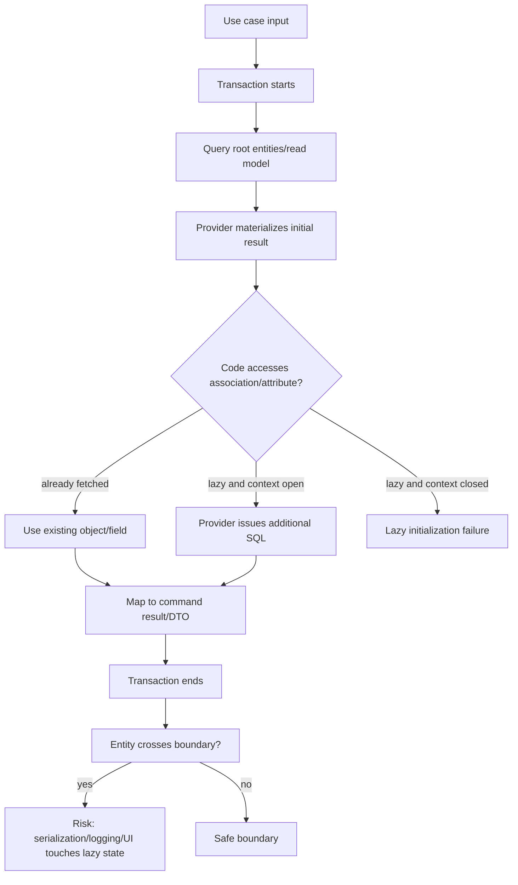
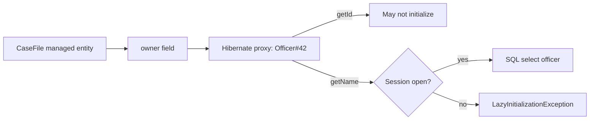
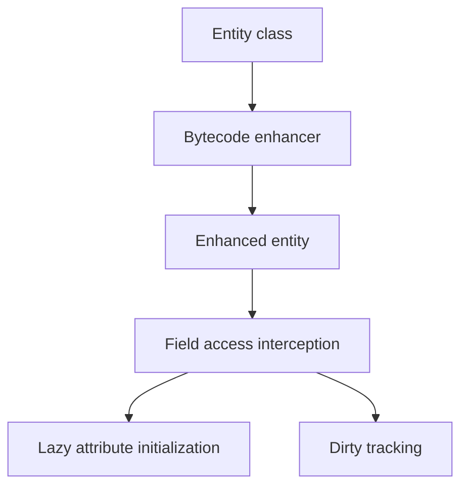
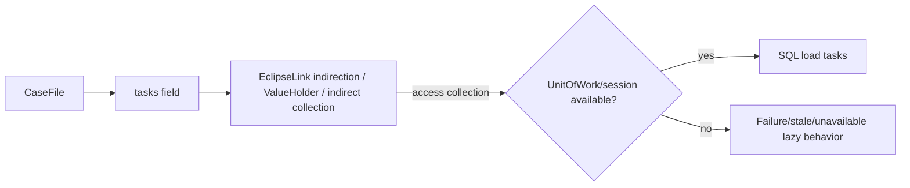
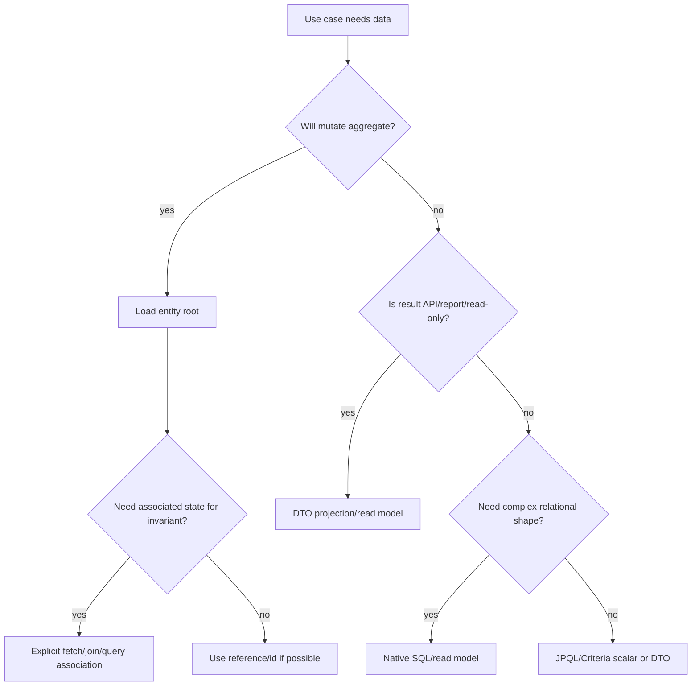

# Part 014 — Fetch Planning I: Lazy Loading, Proxies, Weaving, and Boundaries

> Target bagian ini: kita bisa mendesain boundary fetch secara eksplisit. Kita tidak ingin entity diam-diam melakukan query saat sudah keluar dari transaction, saat diserialisasi ke JSON, saat logger memanggil `toString`, atau saat UI mapper menyentuh property yang tidak direncanakan.

Fetch planning adalah seni mengendalikan **kapan data relational berubah menjadi object graph**.

Banyak bug ORM production bukan berasal dari mapping yang salah, tetapi dari fetch boundary yang kabur:

```java
CaseFile caseFile = repository.findById(id);
return mapper.toResponse(caseFile); // mapper menyentuh lazy association di luar transaction
```

Atau:

```java
log.info("Loaded case {}", caseFile); // toString menyentuh lazy collection
```

Atau:

```java
return caseFile; // JSON serializer berjalan melewati lazy graph
```

Kalimat inti:

> **Fetch strategy bukan detail performance saja. Fetch strategy adalah bagian dari contract antara transaction boundary, object graph, serialization boundary, dan database workload.**

---

## 1. Kaufman Deconstruction: Skill Units

| Skill unit | Kemampuan yang harus dikuasai |
|---|---|
| Fetch semantics | membedakan eager requirement, lazy hint, provider behavior |
| Proxy reasoning | tahu kapan object yang dipegang adalah proxy dan kapan ia terinisialisasi |
| Weaving/enhancement reasoning | paham bagaimana provider mengubah class/entity untuk lazy loading dan tracking |
| Boundary discipline | tahu kapan entity boleh keluar dari transaction dan kapan tidak |
| Failure prediction | bisa memprediksi lazy initialization failure dan hidden query |
| Serialization safety | mencegah JSON/logging/debugger memicu lazy graph |
| DTO boundary design | memilih kapan harus materialize read model eksplisit |
| Provider difference awareness | membedakan Hibernate proxy/enhancement dan EclipseLink weaving/indirection |

Latihan utama:

1. Ambil satu use case.
2. Tentukan data yang benar-benar dibutuhkan.
3. Tentukan transaction boundary.
4. Tentukan fetch boundary.
5. Jalankan query.
6. Pastikan jumlah SQL sesuai ekspektasi.
7. Pastikan tidak ada lazy access setelah boundary.

---

## 2. Fetch Planning Mental Model



Fetch planning bertujuan membuat `G` dan `H` tidak terjadi secara acak. Tambahan query boleh terjadi hanya jika disengaja, terukur, dan berada di boundary yang benar.

---

## 3. Jakarta Persistence Fetch Semantics

Jakarta Persistence mendefinisikan `FetchType.EAGER` dan `FetchType.LAZY`, tetapi semantiknya tidak simetris.

Secara praktis:

- `EAGER` adalah requirement bahwa provider harus fetch data eagerly.
- `LAZY` adalah hint bahwa provider boleh fetch saat pertama diakses, tetapi provider dapat melakukan eager fetch jika tidak mampu/ tidak memilih lazy untuk kasus tertentu.

Default penting:

```java
@ManyToOne // default EAGER menurut spec
private Officer owner;

@OneToMany(mappedBy = "caseFile") // default LAZY menurut spec
private List<Task> tasks;
```

Default ini sering tidak cocok untuk sistem enterprise besar.

Rekomendasi desain:

```java
@ManyToOne(fetch = FetchType.LAZY)
private Officer owner;

@OneToOne(fetch = FetchType.LAZY)
private CaseAssessment assessment;

@OneToMany(mappedBy = "caseFile", fetch = FetchType.LAZY)
private List<Task> tasks = new ArrayList<>();
```

Gunakan `LAZY` sebagai default mapping intent, lalu fetch secara eksplisit per use case.

Kenapa?

- to-one default `EAGER` dapat menghasilkan overfetching tersembunyi,
- `EAGER` sulit “dimatikan” pada query tertentu,
- fetch plan harus menjadi keputusan use case, bukan keputusan global mapping,
- entity yang dipakai banyak use case tidak boleh membawa semua data default.

---

## 4. Lazy Loading Is Not Free

Lazy loading terlihat seperti optimasi:

```java
CaseFile c = em.find(CaseFile.class, id);
// owner belum loaded
String ownerName = c.getOwner().getName(); // query tambahan mungkin terjadi
```

Tetapi lazy loading punya biaya:

- query tambahan,
- dependency pada persistence context yang masih open,
- runtime behavior tersembunyi di getter,
- sulit diprediksi saat mapping/logging/serialization,
- raw object graph tidak lagi murni object biasa.

Lazy loading adalah alat yang kuat jika:

- boundary transaction jelas,
- jumlah access terkontrol,
- query tambahan dapat diprediksi,
- test menghitung SQL count,
- entity tidak bocor ke layer yang tidak boleh menyentuh database.

Lazy loading berbahaya jika:

- entity dikirim langsung ke controller response,
- entity dipakai di template/UI rendering,
- entity disimpan di cache aplikasi luar persistence context,
- `toString`, `equals`, `hashCode` menyentuh association,
- mapper generic menyentuh semua property reflektif.

---

## 5. Hibernate Proxy Model

Hibernate lazily loads many to-one associations menggunakan proxy atau bytecode-enhanced behavior tergantung konfigurasi dan kasus.

Contoh:

```java
CaseFile c = em.find(CaseFile.class, id);
Officer owner = c.getOwner();
```

`owner` bisa jadi proxy yang merepresentasikan `Officer#id` tanpa memuat semua column officer.

Ketika dipanggil:

```java
owner.getName();
```

Hibernate butuh session/persistence context aktif untuk initialize proxy.

Jika session sudah closed:

```text
LazyInitializationException
```

Mental model proxy:



### 5.1 Proxy identity pitfall

Proxy dapat mengganggu code yang memakai exact class comparison.

Buruk:

```java
if (owner.getClass() == Officer.class) {
    // may fail for proxy subclass
}
```

Lebih baik:

```java
if (owner instanceof Officer) {
    // safer
}
```

Untuk `equals`, gunakan strategi yang proxy-aware dan identity-safe.

### 5.2 `getReference`

```java
Officer ref = em.getReference(Officer.class, officerId);
caseFile.assignTo(ref);
```

`getReference` dapat membuat reference tanpa immediate select. Cocok jika hanya butuh FK assignment dan tidak perlu membaca data officer.

Risiko:

- access property dapat trigger select,
- entity tidak ada bisa baru ketahuan saat access/flush,
- boundary harus jelas.

---

## 6. Hibernate Bytecode Enhancement

Hibernate dapat memakai bytecode enhancement untuk:

- lazy attribute loading,
- enhanced dirty tracking,
- bidirectional association management,
- internal performance optimization.

Lazy basic attribute contoh:

```java
@Basic(fetch = FetchType.LAZY)
@Lob
private String investigationNarrative;
```

Tanpa enhancement yang sesuai, lazy basic field sering tidak berjalan sesuai harapan. Dengan enhancement, provider dapat intercept field access.

Mental model:



Kapan enhancement penting:

- large LOB/text field,
- lazy basic attribute,
- high-volume dirty checking,
- association management optimization,
- mengurangi snapshot comparison cost.

Checklist:

- Apakah enhancement aktif di build?
- Apakah test environment juga memakai enhancement?
- Apakah behavior dev/prod sama?
- Apakah lazy field benar-benar tidak dipilih di SQL awal?
- Apakah access field memicu SQL sesuai ekspektasi?

---

## 7. EclipseLink Weaving and Indirection

EclipseLink memakai weaving untuk menambahkan behavior persistence ke entity class. Weaving dapat dynamic atau static tergantung environment.

Weaving mendukung:

- lazy loading,
- change tracking,
- fetch groups,
- internal optimization,
- indirection relationship.

Konsep indirection: relationship field dapat diwakili oleh wrapper/value holder yang menunda load sampai dibutuhkan.



Practical rule:

> Di EclipseLink, pastikan weaving aktif jika mapping mengandalkan lazy to-one, fetch group, atau change tracking tertentu.

Jika weaving tidak aktif, provider dapat fallback ke behavior berbeda. Bug yang muncul sering environment-specific: berjalan di app server, gagal di unit test; berjalan di prod, beda di local.

Checklist EclipseLink:

- `eclipselink.weaving` diset sesuai deployment?
- Static weaving diperlukan untuk environment tertentu?
- Test classpath memakai agent/weaving yang sama?
- Lazy to-one benar-benar lazy?
- Fetch group berjalan?
- Change tracking mode sesuai?

---

## 8. To-One Lazy Loading: The Most Important Default Override

To-one association (`@ManyToOne`, `@OneToOne`) default-nya sering eager. Dalam sistem besar, ini dapat menjadi sumber overfetching.

Contoh domain:

```java
@Entity
class CaseFile {
    @ManyToOne(fetch = FetchType.LAZY)
    private Officer owner;

    @ManyToOne(fetch = FetchType.LAZY)
    private Department jurisdiction;

    @OneToOne(fetch = FetchType.LAZY)
    private CaseAssessment assessment;
}
```

Jika semua default eager:

```java
select c from CaseFile c where c.status = :status
```

Provider harus memenuhi eager association. SQL bisa melebar atau memicu query tambahan.

Jika lazy:

- query root lebih kecil,
- use case memilih fetch yang dibutuhkan,
- DTO projection bisa menghindari entity graph,
- hidden overfetch berkurang.

Tetapi lazy to-one membutuhkan provider support yang benar:

- Hibernate proxy/enhancement,
- EclipseLink weaving/indirection,
- class tidak final dalam skenario proxy subclass tertentu,
- access terjadi dalam transaction/persistence context.

---

## 9. To-Many Lazy Loading: Collection Trap

To-many lazy collection terlihat aman:

```java
@OneToMany(mappedBy = "caseFile", fetch = FetchType.LAZY)
private List<Task> tasks = new ArrayList<>();
```

Tetapi access dalam loop dapat menjadi N+1:

```java
List<CaseFile> cases = findOpenCases();

for (CaseFile c : cases) {
    int taskCount = c.getTasks().size(); // query per case
}
```

Lazy collection bukan solusi N+1. Ia hanya menunda query.

Solusi tergantung use case:

- aggregate count query,
- DTO projection,
- batch fetch,
- subselect fetch,
- join fetch dengan hati-hati,
- separate query by IDs,
- read model table.

Part 015 akan membahas join fetch, batch fetch, subselect fetch, dan entity graph secara mendalam. Part ini fokus pada boundary lazy.

---

## 10. Lazy Initialization Failure Is a Boundary Bug

Contoh klasik:

```java
@Transactional
public CaseFile loadCase(Long id) {
    return em.find(CaseFile.class, id);
}

public CaseResponse handle(Long id) {
    CaseFile c = service.loadCase(id); // transaction selesai
    return mapper.toResponse(c);       // touches c.getOwner().getName()
}
```

Problem:

- entity keluar dari transaction,
- mapper menyentuh lazy association,
- provider tidak punya context untuk load.

Solusi buruk:

- menyalakan Open Session in View tanpa sadar konsekuensi,
- mengubah semua association jadi EAGER,
- memanggil getter acak di service untuk “initialize”,
- disable lazy loading.

Solusi sehat:

```java
@Transactional(readOnly = true)
public CaseResponse getCase(Long id) {
    CaseFile c = em.createQuery("""
        select c
        from CaseFile c
        join fetch c.owner owner
        where c.id = :id
    """, CaseFile.class)
    .setParameter("id", id)
    .getSingleResult();

    return new CaseResponse(
        c.getId(),
        c.getCaseNumber(),
        c.getOwner().getName()
    );
}
```

Atau langsung DTO projection:

```java
@Transactional(readOnly = true)
public CaseResponse getCase(Long id) {
    return em.createQuery("""
        select new com.acme.api.CaseResponse(
            c.id,
            c.caseNumber,
            owner.name
        )
        from CaseFile c
        join c.owner owner
        where c.id = :id
    """, CaseResponse.class)
    .setParameter("id", id)
    .getSingleResult();
}
```

Boundary aman:

> Build response inside transaction using explicit fetch/projection. Return DTO, not unmanaged entity graph.

---

## 11. Open Session in View: Why It Feels Convenient and Why It Hurts

Open Session in View keeps persistence context open until web view/response rendering finishes.

Manfaat:

- lazy loading masih bisa berjalan di controller/view,
- mengurangi `LazyInitializationException`,
- terasa cepat untuk development CRUD sederhana.

Biaya:

- query bisa terjadi saat serialization,
- database access bocor ke presentation layer,
- N+1 tersembunyi lebih sulit dideteksi,
- transaction/business boundary kabur,
- error bisa muncul setelah service method dianggap selesai,
- response shape dapat menentukan database workload tanpa review repository/service.

Dalam sistem enterprise, OSIV sering menunda masalah, bukan menyelesaikannya.

Rekomendasi:

- disable OSIV untuk service/API yang serius,
- buat fetch plan/projection eksplisit,
- test SQL count di service boundary,
- jangan return entity langsung dari controller.

---

## 12. Serialization Boundary

Entity bukan DTO. Entity punya:

- lazy proxy,
- persistence context coupling,
- bidirectional graph,
- collection wrapper,
- internal provider state,
- lifecycle semantics,
- security-sensitive fields.

Buruk:

```java
@GetMapping("/cases/{id}")
public CaseFile getCase(@PathVariable Long id) {
    return service.getCase(id);
}
```

Risiko:

- JSON serializer menyentuh lazy association,
- infinite recursion pada bidirectional association,
- N+1 during serialization,
- data leakage,
- provider-specific proxy serialization error,
- response contract berubah ketika entity berubah.

Lebih baik:

```java
@GetMapping("/cases/{id}")
public CaseResponse getCase(@PathVariable Long id) {
    return service.getCaseResponse(id);
}
```

`CaseResponse` adalah contract API. Entity adalah persistence/domain runtime object.

---

## 13. Logging, Debugger, `toString`, `equals`, and `hashCode`

Jangan masukkan association lazy ke `toString`.

Buruk:

```java
@Override
public String toString() {
    return "CaseFile{" +
        "id=" + id +
        ", owner=" + owner +
        ", tasks=" + tasks +
        '}';
}
```

Dampak:

- logging bisa trigger lazy loading,
- debugger view bisa trigger getter,
- `tasks.toString()` bisa load seluruh collection,
- production log line bisa menjadi database workload.

Lebih aman:

```java
@Override
public String toString() {
    return "CaseFile{id=" + id + ", caseNumber='" + caseNumber + "'}";
}
```

`equals` dan `hashCode` juga tidak boleh menyentuh lazy association.

Buruk:

```java
return Objects.equals(caseNumber, other.caseNumber)
    && Objects.equals(owner, other.owner)
    && Objects.equals(tasks, other.tasks);
```

Lebih aman: gunakan immutable business key yang benar-benar stabil, atau identifier strategy yang sadar lifecycle entity. Detail equals/hashCode sudah disentuh di seri core/persistence sebelumnya, tetapi di konteks fetch planning, prinsipnya jelas:

> Association access dalam `equals`, `hashCode`, dan `toString` adalah hidden fetch hazard.

---

## 14. DTO Boundary as Fetch Boundary

DTO bukan sekadar “object untuk response”. DTO adalah alat fetch planning.

```java
public record CaseHeaderResponse(
    Long id,
    String caseNumber,
    CaseStatus status,
    String ownerName,
    Instant dueAt
) {}
```

Query:

```java
select new com.acme.api.CaseHeaderResponse(
    c.id,
    c.caseNumber,
    c.status,
    owner.name,
    c.dueAt
)
from CaseFile c
join c.owner owner
where c.id = :id
```

Kelebihan:

- select list kecil,
- tidak hydrate entity penuh,
- tidak ada lazy proxy di response,
- tidak ada accidental serialization graph,
- SQL shape jelas,
- response contract explicit.

Gunakan entity result ketika:

- use case akan mengubah aggregate,
- invariant domain butuh entity behavior,
- lifecycle/cascade/orphan removal diperlukan,
- persistence context identity penting.

Gunakan DTO projection ketika:

- use case read-only,
- result adalah API response/report,
- hanya sebagian field dibutuhkan,
- graph besar tidak perlu dimuat,
- query cardinality besar.

---

## 15. Fetch Boundary Patterns

### 15.1 Command mutation boundary

```java
@Transactional
public void assignCase(Long caseId, Long officerId) {
    CaseFile c = em.find(CaseFile.class, caseId);
    Officer officerRef = em.getReference(Officer.class, officerId);

    c.assignTo(officerRef);
}
```

Fetch minimal. Tidak perlu load officer penuh jika hanya set FK dan invariant tidak butuh detail officer.

### 15.2 Command with invariant read

```java
@Transactional
public void assignCase(Long caseId, Long officerId) {
    CaseFile c = em.find(CaseFile.class, caseId);
    Officer officer = em.find(Officer.class, officerId);

    if (!officer.isAssignable()) {
        throw new OfficerNotAssignableException(officerId);
    }

    c.assignTo(officer);
}
```

Fetch officer penuh karena invariant membutuhkan state officer.

### 15.3 Read API boundary

```java
@Transactional(readOnly = true)
public CaseDetailResponse getCaseDetail(Long caseId) {
    return query.findCaseDetail(caseId);
}
```

Projection atau explicit fetch. Jangan return entity.

### 15.4 Batch processing boundary

```java
@Transactional
public void processBatch(List<Long> ids) {
    List<CaseFile> cases = em.createQuery("""
        select c
        from CaseFile c
        where c.id in :ids
    """, CaseFile.class)
    .setParameter("ids", ids)
    .getResultList();

    for (CaseFile c : cases) {
        c.markReviewed(clock.instant());
    }
}
```

Hindari access lazy collection di loop kecuali fetch plan sudah dirancang.

---

## 16. Provider Difference: Hibernate vs EclipseLink

| Area | Hibernate | EclipseLink |
|---|---|---|
| Lazy to-one | proxy dan/atau bytecode enhancement tergantung mapping/config | weaving/indirection sangat penting |
| Lazy basic field | perlu enhancement untuk behavior yang kuat | weaving/fetch group dapat relevan |
| Dirty tracking integration | snapshot atau enhanced dirty tracking | deferred/object/attribute change tracking dengan weaving support |
| Collection wrapper | Hibernate persistent collection wrappers | EclipseLink indirect collections/value holders |
| Closed context lazy access | sering muncul sebagai `LazyInitializationException` | lazy indirection juga bergantung pada active context/session behavior |
| Enhancement/weaving setup | build-time/runtime enhancement opsi tersedia | dynamic/static weaving property dan environment sangat penting |

Engineering consequence:

- Jangan hanya test dengan satu provider jika portability penting.
- Jangan asumsikan lazy behavior identik.
- Jangan mengandalkan provider extension tanpa boundary.
- Pastikan test environment sama dengan production dari sisi enhancement/weaving.

---

## 17. Lazy Basic Attributes and Large Columns

Misal:

```java
@Lob
@Basic(fetch = FetchType.LAZY)
private String fullNarrative;
```

Tujuan:

- list case tidak selalu mengambil narrative besar,
- detail endpoint bisa mengambilnya saat dibutuhkan.

Tapi lazy basic tidak selalu bekerja tanpa provider mechanism.

Testing wajib:

1. Jalankan query list.
2. Lihat SQL select list.
3. Pastikan column besar tidak dipilih.
4. Access field dalam transaction.
5. Pastikan ada SQL tambahan atau fetch sesuai desain.
6. Access field setelah transaction.
7. Pastikan failure/behavior dipahami.

Jika tidak bisa dijamin portable, opsi lain:

- pisahkan ke entity/table lain `CaseNarrative`,
- gunakan explicit detail query,
- gunakan read model,
- gunakan database column projection DTO.

Untuk sistem audit/evidence/case narrative, memisahkan large text/blob sering lebih predictable daripada bergantung pada lazy basic provider behavior.

---

## 18. Fetch Planning and Transaction Scope

Transaction scope yang terlalu kecil:

```java
CaseFile c = service.loadCase(id); // transaction ends
mapper.toResponse(c);             // lazy failure
```

Transaction scope yang terlalu besar:

```java
@Transactional
public Response handle() {
    // call external service
    // render complex response
    // lazy loading can happen anywhere
}
```

Lebih baik:

- transaction menutup persistence work,
- mapping ke DTO terjadi dalam transaction jika membutuhkan loaded state,
- external calls tidak dilakukan sambil memegang transaction database kecuali sangat perlu,
- output setelah transaction adalah DTO stabil.

Pattern:

```java
@Transactional(readOnly = true)
public CaseResponse loadResponse(Long id) {
    CaseFile c = query.findCaseWithRequiredFetch(id);
    return mapper.toResponse(c);
}
```

Atau:

```java
@Transactional(readOnly = true)
public CaseResponse loadResponse(Long id) {
    return query.findCaseResponseProjection(id);
}
```

---

## 19. Hidden Fetch Triggers

| Trigger | Kenapa berbahaya | Mitigasi |
|---|---|---|
| getter di mapper | query muncul di mapping layer | explicit fetch/projection |
| JSON serializer | traverse graph reflektif | DTO response |
| `toString` | logging memuat graph | only scalar/id fields |
| debugger watch | getter/property evaluation | hati-hati saat debug |
| `equals`/`hashCode` | collection/entity access | stable id/business key only |
| Bean validation custom validator | menyentuh association | validate explicit state only |
| domain event payload | membawa entity lazy | event DTO/snapshot |
| template rendering | view layer akses DB | disable OSIV, DTO view model |
| audit logger | serialize entity lama/baru | audit snapshot eksplisit |

---

## 20. Testing Fetch Boundaries

Test bukan hanya assert result. Test harus assert query behavior.

Contoh pseudo-test:

```java
@Test
void caseHeaderDoesNotLoadTasks() {
    statistics.clear();

    CaseHeaderResponse response = service.getCaseHeader(caseId);

    assertThat(response.caseNumber()).isEqualTo("CASE-2026-001");
    assertThat(statistics.getPrepareStatementCount()).isEqualTo(1);
}
```

Untuk Hibernate, statistik dapat membantu menghitung query/load/fetch. Untuk provider lain, gunakan SQL log capture, datasource proxy, atau integration test instrumentation.

Test boundary:

```java
@Test
void responseCanBeSerializedAfterTransaction() {
    CaseResponse response = service.getCaseResponse(caseId);

    assertThatCode(() -> objectMapper.writeValueAsString(response))
        .doesNotThrowAnyException();
}
```

Jangan hanya test entity serialization jika desainnya memang melarang entity keluar boundary. Lebih baik test bahwa service mengembalikan DTO.

---

## 21. Anti-Patterns

### 21.1 “Fix” lazy problem by making everything eager

```java
@OneToMany(fetch = FetchType.EAGER)
private List<Task> tasks;
```

Dampak:

- overfetching,
- join explosion,
- memory pressure,
- slow list endpoints,
- sulit mengontrol query per use case.

### 21.2 Return entity from API

```java
return caseFile;
```

Dampak:

- lazy failure,
- recursive graph,
- data leakage,
- API contract coupling ke persistence model.

### 21.3 Use OSIV as architecture

OSIV boleh ada di aplikasi sederhana, tetapi jangan jadikan pengganti fetch planning.

### 21.4 Initialize by random getter calls

```java
caseFile.getOwner().getName();
caseFile.getTasks().size();
```

Ini menyembunyikan fetch plan di side effect procedural. Lebih baik query/fetch plan eksplisit.

### 21.5 Generic mapper that walks everything

Mapper reflektif yang mencoba copy semua property sering memicu lazy graph. Mapping harus sadar use case.

---

## 22. Decision Tree: Entity, Fetch, DTO, or Native



Rule:

- Entity untuk mutation.
- DTO untuk read boundary.
- Fetch join/entity graph untuk controlled entity graph.
- Native SQL untuk relational-heavy read.
- Lazy loading hanya untuk controlled access inside persistence boundary.

---

## 23. Case Management Example

Requirement:

- endpoint `/cases/{id}/summary`,
- response butuh case number, status, owner name, department code,
- tidak butuh tasks, evidence, audit history,
- harus aman setelah transaction,
- tidak boleh tergantung lazy loading saat serialization.

DTO:

```java
public record CaseSummaryResponse(
    Long id,
    String caseNumber,
    CaseStatus status,
    String ownerName,
    String departmentCode
) {}
```

Query:

```java
@Transactional(readOnly = true)
public CaseSummaryResponse getSummary(Long id) {
    return em.createQuery("""
        select new com.acme.api.CaseSummaryResponse(
            c.id,
            c.caseNumber,
            c.status,
            owner.name,
            department.code
        )
        from CaseFile c
        join c.owner owner
        join owner.department department
        where c.id = :id
    """, CaseSummaryResponse.class)
    .setParameter("id", id)
    .getSingleResult();
}
```

Kenapa ini kuat:

- tidak return entity,
- no lazy proxy in response,
- SQL join eksplisit,
- select list minimal,
- transaction boundary jelas,
- response tidak bisa trigger query tambahan.

Requirement berbeda:

- command `assignOfficer(caseId, officerId)`,
- perlu cek officer active,
- perlu mutate case.

```java
@Transactional
public void assignOfficer(Long caseId, Long officerId) {
    CaseFile c = em.find(CaseFile.class, caseId);
    Officer officer = em.find(Officer.class, officerId);

    c.assignTo(officer, clock.instant());
}
```

Di sini entity memang tepat karena ada mutation dan invariant.

---

## 24. Provider-Specific Practical Recipes

### 24.1 Hibernate: detect accidental lazy fetch

Aktifkan SQL logging dan statistics di environment test.

Test target:

- list endpoint tidak fetch collection,
- detail endpoint hanya fetch association yang dibutuhkan,
- serialization DTO tidak melakukan query,
- N+1 regression terdeteksi.

### 24.2 Hibernate: avoid proxy class pitfalls

- Jangan gunakan `getClass()` exact comparison untuk business logic entity.
- Jangan final class/method jika proxy subclass dibutuhkan.
- Jangan access lazy association di constructor.
- Jangan letakkan association di `toString`.

### 24.3 EclipseLink: verify weaving

- Pastikan weaving aktif sesuai deployment.
- Jika dynamic weaving tidak tersedia, pertimbangkan static weaving.
- Test lazy to-one dan fetch group di environment yang sama dengan runtime.
- Jangan mengasumsikan behavior dari Hibernate berlaku di EclipseLink.

### 24.4 Cross-provider

Jika targetnya portability:

- tetap pakai mapping LAZY secara eksplisit,
- hindari provider extension di domain entity jika tidak perlu,
- tulis integration test terhadap dua provider untuk behavior penting,
- isolasi hint/extension di adapter.

---

## 25. Production Fetch Review Checklist

Untuk setiap endpoint/service:

1. Data apa yang benar-benar dibutuhkan?
2. Apakah use case mutating atau read-only?
3. Apakah entity keluar dari transaction?
4. Apakah response berupa DTO?
5. Apakah mapper menyentuh lazy association?
6. Apakah `toString`, logging, audit, JSON dapat menyentuh association?
7. Apakah to-one association default sudah `LAZY` jika memungkinkan?
8. Apakah lazy basic field benar-benar didukung provider config?
9. Apakah enhancement/weaving aktif di test dan prod?
10. Apakah query count sudah diuji?
11. Apakah SQL tambahan muncul hanya jika direncanakan?
12. Apakah OSIV dimatikan atau setidaknya disadari konsekuensinya?
13. Apakah read model seharusnya DTO/native daripada entity graph?
14. Apakah provider behavior Hibernate/EclipseLink sudah diuji jika portability penting?
15. Apakah cache/lazy interaction tidak membuat stale read tersembunyi?

---

## 26. What Top Engineers Do Differently

Engineer biasa bertanya:

> “Kenapa lazy loading error?”

Engineer kuat bertanya:

> “Boundary mana yang mengizinkan entity keluar tanpa fetch contract yang lengkap?”

Engineer biasa memperbaiki dengan:

```java
fetch = FetchType.EAGER
```

Engineer kuat memperbaiki dengan:

- response DTO,
- explicit query/fetch plan,
- transaction boundary jelas,
- provider enhancement/weaving verified,
- SQL count regression test,
- no entity serialization,
- no lazy association in logging/equality.

---

## 27. Summary

Di part ini kita membangun foundation fetch planning:

- `EAGER` dan `LAZY` punya semantik berbeda; lazy adalah hint, eager adalah requirement.
- Default to-one eager sering buruk untuk sistem enterprise.
- Hibernate memakai proxy dan/atau bytecode enhancement untuk lazy behavior.
- EclipseLink sangat bergantung pada weaving/indirection untuk banyak fitur lazy/change tracking/fetch group.
- Lazy loading adalah runtime database access tersembunyi di object access.
- Lazy initialization failure adalah boundary bug, bukan sekadar exception teknis.
- Entity tidak boleh menjadi response API.
- DTO projection adalah fetch boundary yang kuat.
- OSIV menyembunyikan masalah dan sering membuat database workload bocor ke presentation layer.
- Testing fetch boundary harus menghitung SQL/query behavior, bukan hanya assert data.

Part berikutnya akan membahas fetch planning tahap kedua: join fetch, batch fetch, subselect fetch, entity graph, fetch profile, cartesian explosion, N+1 taxonomy, dan pagination hazard.

---

## References

- Jakarta Persistence 3.2 Specification: https://jakarta.ee/specifications/persistence/3.2/jakarta-persistence-spec-3.2
- Jakarta Persistence `FetchType` API: https://jakarta.ee/specifications/persistence/3.2/apidocs/jakarta.persistence/jakarta/persistence/fetchtype
- Hibernate ORM User Guide: https://docs.hibernate.org/stable/orm/userguide/html_single/
- Hibernate ORM Documentation: https://hibernate.org/orm/documentation/
- EclipseLink Documentation: https://eclipse.dev/eclipselink/documentation/
- EclipseLink JPA Extensions Reference: https://eclipse.dev/eclipselink/documentation/4.0/jpa/extensions/jpa-extensions.html
