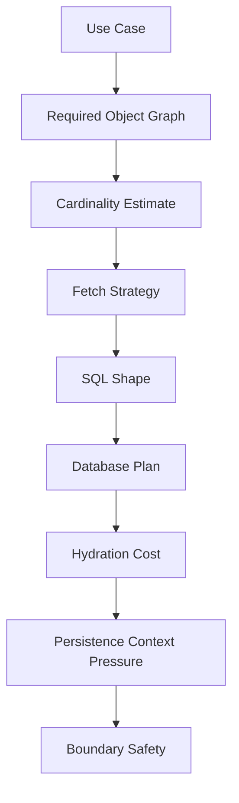
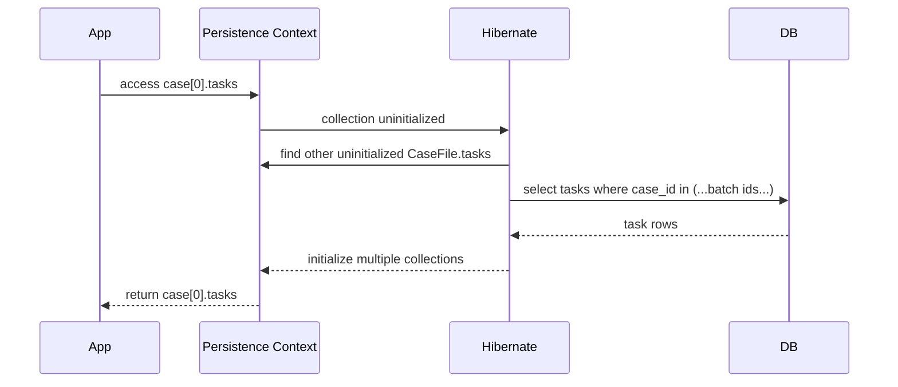
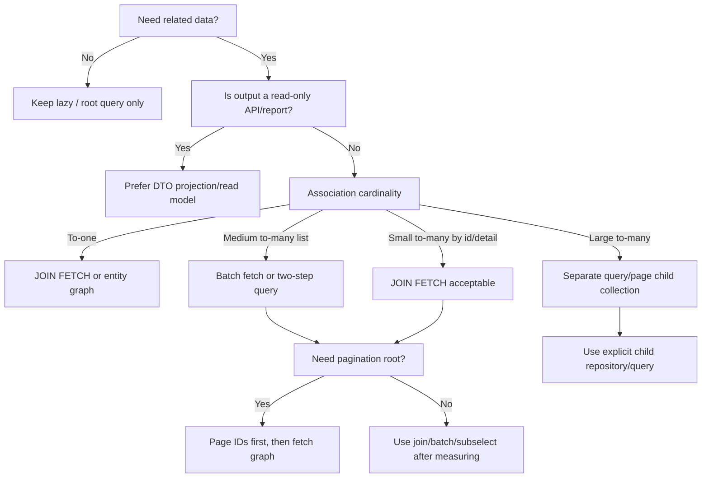

# Part 015 — Fetch Planning II: Join Fetch, Batch Fetch, Subselect, Entity Graphs

Part ini melanjutkan Part 014. Jika Part 014 menjelaskan *lazy boundary*, maka Part 015 menjawab pertanyaan yang lebih operasional:

> Untuk use case tertentu, data apa yang harus diambil sekarang, data apa yang boleh ditunda, dan strategi fetch apa yang paling murah secara round trip, row explosion, memory, dan correctness?

Di level engineer senior, fetch planning bukan sekadar “hilangkan N+1”. Fetch planning adalah desain query shape.

ORM tidak hanya menghasilkan SQL. ORM menghasilkan:

- jumlah statement SQL,
- jumlah row yang dikirim database,
- jumlah column yang dibaca,
- jumlah object yang dihidrasi,
- jumlah association yang diinisialisasi,
- jumlah collection wrapper yang dibuat,
- cache interaction,
- persistence context pressure,
- dan risiko semantic bug seperti pagination rusak, duplicate root, stale view, atau accidental lazy load.

Tujuan part ini: membuat kita mampu memilih antara `JOIN FETCH`, batch fetch, subselect fetch, entity graph, fetch profile, DTO projection, atau native query secara sadar.

---

## 1. Mental Model: Fetch Plan Adalah Kontrak Baca

Fetch plan adalah kontrak sementara antara use case dan persistence layer.

Ia menjawab:

1. Root entity apa yang sedang dibaca?
2. Association apa yang dibutuhkan sebelum keluar dari transaction boundary?
3. Apakah hasil akan dimutasi atau hanya dibaca?
4. Apakah hasil akan dipaginasi?
5. Berapa cardinality tiap association?
6. Apakah association bersifat to-one, to-many kecil, atau to-many besar?
7. Apakah data akan dipakai untuk business decision, response API, export, report, atau background job?

Fetch plan yang baik bukan yang mengambil paling banyak data. Fetch plan yang baik mengambil data yang benar, pada waktu yang benar, dengan shape yang stabil.



Prinsip awal:

> Fetch strategy adalah bagian dari API internal repository/service. Jangan biarkan ia menjadi efek samping dari annotation default.

---

## 2. N+1 Problem Taxonomy

N+1 bukan satu masalah. Ada beberapa bentuk.

### 2.1 To-One N+1

Contoh:

```java
List<CaseFile> cases = em.createQuery("""
    select c from CaseFile c
    where c.status = :status
    """, CaseFile.class)
    .setParameter("status", CaseStatus.OPEN)
    .getResultList();

for (CaseFile c : cases) {
    System.out.println(c.getAssignee().getDisplayName());
}
```

Kemungkinan SQL:

```sql
select * from case_file where status = ?;
select * from officer where id = ?;
select * from officer where id = ?;
select * from officer where id = ?;
-- repeated
```

Untuk to-one association, solusi sering relatif aman:

```java
select c
from CaseFile c
join fetch c.assignee
where c.status = :status
```

Karena setiap root row tetap biasanya menjadi satu row, selama join tidak melewati collection.

### 2.2 To-Many N+1

Contoh:

```java
List<CaseFile> cases = findOpenCases();

for (CaseFile c : cases) {
    for (Evidence e : c.getEvidenceItems()) {
        use(e);
    }
}
```

Kemungkinan SQL:

```sql
select * from case_file where status = ?;
select * from evidence where case_id = ?;
select * from evidence where case_id = ?;
select * from evidence where case_id = ?;
```

Solusinya tidak selalu `join fetch`. Jika jumlah evidence per case besar, `join fetch` dapat meledakkan row.

### 2.3 Nested N+1

```java
for (CaseFile c : cases) {
    for (Task t : c.getTasks()) {
        System.out.println(t.getAssignedOfficer().getName());
    }
}
```

Bentuk SQL:

```text
1 query cases
N query tasks per case
M query officer per task
```

Solusi harus bertingkat:

- fetch root + tasks dengan strategi yang tidak meledak,
- fetch to-one `assignedOfficer` dengan join atau batch,
- batasi graph sesuai use case.

### 2.4 Hidden N+1 in Serialization

Pola berbahaya:

```java
return caseRepository.findOpenCases();
```

Lalu serializer JSON memanggil getter lazy di luar kendali.

Masalahnya bukan hanya performa. Ini boundary leak:

- API shape dikendalikan entity mapping,
- lazy load terjadi di layer serialization,
- transaction boundary menjadi kabur,
- authorization/filtering bisa terlewati,
- response menjadi tidak stabil.

Untuk API response, DTO projection sering lebih defensible.

---

## 3. Strategy 1: JPQL `JOIN FETCH`

`JOIN FETCH` memerintahkan provider mengambil association bersama root entity dalam query yang sama.

Contoh to-one:

```java
List<CaseFile> cases = em.createQuery("""
    select c
    from CaseFile c
    join fetch c.assignee
    where c.status = :status
    """, CaseFile.class)
    .setParameter("status", CaseStatus.OPEN)
    .getResultList();
```

Kemungkinan SQL:

```sql
select
    c.id,
    c.status,
    c.assignee_id,
    o.id,
    o.display_name
from case_file c
join officer o on o.id = c.assignee_id
where c.status = ?;
```

### 3.1 Kapan `JOIN FETCH` Cocok?

Cocok untuk:

- association to-one yang hampir selalu dibutuhkan,
- to-many kecil dengan cardinality terkontrol,
- read use case yang membutuhkan graph pendek,
- query detail page by id,
- query tanpa pagination collection-heavy,
- menghindari lazy load setelah transaction boundary.

Contoh detail page:

```java
select c
from CaseFile c
join fetch c.assignee
left join fetch c.currentEscalation
where c.id = :id
```

Ini wajar karena root-nya satu.

### 3.2 Kapan `JOIN FETCH` Berbahaya?

Berbahaya untuk:

- multiple to-many collection,
- pagination root entity,
- association dengan cardinality besar,
- report/query list panjang,
- graph yang tidak stabil,
- API list endpoint yang harus punya latency predictable.

Contoh buruk:

```java
select c
from CaseFile c
left join fetch c.evidenceItems
left join fetch c.tasks
left join fetch c.notes
where c.status = :status
```

Jika:

- 100 case,
- rata-rata 20 evidence,
- rata-rata 15 task,
- rata-rata 10 note,

maka row join teoretis bisa mendekati:

```text
100 × 20 × 15 × 10 = 300,000 joined rows
```

Padahal root entity hanya 100.

Inilah *cartesian amplification*.

### 3.3 Duplicate Root dan `distinct`

Ketika `JOIN FETCH` collection, SQL menghasilkan beberapa row untuk root yang sama.

```java
select distinct c
from CaseFile c
left join fetch c.tasks
where c.status = :status
```

`distinct` di JPQL membantu deduplicate root entity secara semantic. Namun engineer harus tahu bahwa:

- SQL masih dapat membaca banyak row,
- provider tetap harus menghidrasi graph dari result set,
- database mungkin tetap melakukan sort/hash distinct,
- `distinct` bukan obat row explosion.

### 3.4 Pagination + Collection Fetch Join Hazard

Pola ini harus dicurigai:

```java
select c
from CaseFile c
left join fetch c.tasks
where c.status = :status
order by c.createdAt desc
```

lalu:

```java
query.setFirstResult(0);
query.setMaxResults(20);
```

Masalahnya: SQL-level row limit bekerja pada joined rows, bukan root entity semantic.

Jika satu case punya 50 task, maka 20 row pertama bisa hanya berasal dari satu case. Provider mungkin melakukan pagination in-memory atau memberi warning/error tergantung konfigurasi dan versi.

Solusi yang lebih aman:

1. Page root IDs dulu.
2. Fetch graph untuk IDs itu.

```java
List<Long> ids = em.createQuery("""
    select c.id
    from CaseFile c
    where c.status = :status
    order by c.createdAt desc
    """, Long.class)
    .setParameter("status", CaseStatus.OPEN)
    .setFirstResult(page * size)
    .setMaxResults(size)
    .getResultList();

List<CaseFile> cases = em.createQuery("""
    select distinct c
    from CaseFile c
    left join fetch c.tasks
    where c.id in :ids
    """, CaseFile.class)
    .setParameter("ids", ids)
    .getResultList();
```

Lalu urutan dikembalikan sesuai `ids` di memory atau menggunakan SQL ordering khusus.

---

## 4. Strategy 2: Hibernate Batch Fetching

Batch fetching mengurangi N+1 dengan mengambil beberapa lazy association/entity sekaligus ketika salah satu association diakses.

Contoh mapping:

```java
@Entity
class CaseFile {
    @ManyToOne(fetch = FetchType.LAZY)
    @BatchSize(size = 50)
    private Officer assignee;
}
```

Atau pada collection:

```java
@OneToMany(mappedBy = "caseFile")
@BatchSize(size = 25)
private Set<Task> tasks = new LinkedHashSet<>();
```

Jika ada 100 `CaseFile` managed dan kita mengakses `tasks` pada case pertama, Hibernate dapat mengambil tasks untuk batch beberapa case sekaligus:

```sql
select *
from task
where case_file_id in (?, ?, ?, ..., ?);
```

### 4.1 Mental Model Batch Fetch

Batch fetch tidak mengubah query root.

Ia bekerja saat lazy association/entity akan diinisialisasi.



### 4.2 Kapan Batch Fetch Cocok?

Cocok untuk:

- list screen dengan beberapa lazy association opsional,
- to-one association yang sering dipakai setelah root load,
- collection kecil-menengah,
- graph yang tidak selalu dibutuhkan,
- menghindari join row explosion,
- use case di mana lazy access tetap berada dalam transaction boundary.

Contoh:

```java
List<CaseFile> cases = findDashboardCases();

// Some branch needs assignee; some branch does not.
for (CaseFile c : cases) {
    if (requiresAssignee(c)) {
        use(c.getAssignee().getDisplayName());
    }
}
```

Batch fetch cocok karena tidak memaksa semua root query join officer sejak awal.

### 4.3 Batch Size Trade-off

Batch size terlalu kecil:

- masih banyak round trip.

Batch size terlalu besar:

- `IN` clause panjang,
- parameter pressure,
- query plan instability,
- memory spike,
- database-specific limit.

Rule of thumb awal:

```text
to-one:       32-100
to-many:      16-50
large graph:   8-25
```

Ini bukan angka universal. Ukur dengan data produksi atau synthetic dataset yang realistis.

### 4.4 Global vs Local Batch Size

Hibernate mendukung konfigurasi global batch fetch size dan annotation lokal. Strategi yang defensible:

- gunakan global kecil sebagai safety net,
- gunakan annotation/hint lokal untuk association penting,
- jangan menjadikan global batch size sebagai pengganti fetch plan.

---

## 5. Strategy 3: Hibernate Subselect Fetching

Subselect fetching memuat collection lazy untuk semua root yang berasal dari query sebelumnya menggunakan subselect asal.

Contoh:

```java
@OneToMany(mappedBy = "caseFile")
@Fetch(FetchMode.SUBSELECT)
private Set<Task> tasks = new LinkedHashSet<>();
```

Query root:

```sql
select c.*
from case_file c
where c.status = ?;
```

Saat salah satu `tasks` diakses, Hibernate dapat menjalankan query seperti:

```sql
select t.*
from task t
where t.case_file_id in (
    select c.id
    from case_file c
    where c.status = ?
);
```

### 5.1 Kapan Subselect Cocok?

Cocok untuk:

- root result set yang berasal dari satu query jelas,
- collection yang hampir pasti diakses untuk seluruh result,
- menghindari N collection queries,
- menghindari join row duplication pada root query.

Contoh batch processing:

```java
List<CaseFile> cases = findCasesForDailyReview();

for (CaseFile c : cases) {
    analyze(c.getTasks());
}
```

Jika semua collection akan diakses, subselect dapat lebih baik daripada N+1.

### 5.2 Risiko Subselect

Risiko:

- subselect dapat besar,
- root query kompleks ikut tertanam,
- pagination semantics harus dipahami,
- access satu collection dapat menginisialisasi banyak collection sekaligus,
- memory pressure jika root result besar,
- behavior lebih provider-specific.

Jangan gunakan subselect sebagai default untuk semua collection.

---

## 6. Strategy 4: EclipseLink Batch Fetching

EclipseLink punya konsep batch reading/fetching melalui annotation dan query hint.

Contoh annotation:

```java
@OneToMany(mappedBy = "caseFile")
@BatchFetch(BatchFetchType.IN)
private List<Task> tasks;
```

Contoh query hint:

```java
List<CaseFile> cases = em.createQuery("""
    select c
    from CaseFile c
    where c.status = :status
    """, CaseFile.class)
    .setParameter("status", CaseStatus.OPEN)
    .setHint("eclipselink.batch", "c.tasks")
    .setHint("eclipselink.batch.type", "IN")
    .getResultList();
```

Mode umum:

| Mode | Bentuk Umum | Cocok Untuk | Risiko |
|---|---:|---|---|
| `IN` | `where fk in (...)` | batch by IDs | parameter limit |
| `JOIN` | join tambahan | graph kecil | row duplication |
| `EXISTS` | subquery exists | beberapa DB/query shape | optimizer-specific |

### 6.1 EclipseLink `@JoinFetch`

EclipseLink juga menyediakan `@JoinFetch` / query hint join fetch provider-specific.

Contoh:

```java
@ManyToOne(fetch = FetchType.LAZY)
@JoinFetch(JoinFetchType.INNER)
private Officer assignee;
```

Namun ingat: annotation-level join fetch membuat fetch decision melekat pada mapping. Untuk use case yang berbeda-beda, query-level fetch plan sering lebih sehat.

---

## 7. Strategy 5: Entity Graphs

Entity graph adalah cara standar Jakarta Persistence untuk mendeskripsikan attribute graph yang perlu di-load.

### 7.1 Named Entity Graph

```java
@NamedEntityGraph(
    name = "CaseFile.detail",
    attributeNodes = {
        @NamedAttributeNode("assignee"),
        @NamedAttributeNode(value = "tasks", subgraph = "taskGraph")
    },
    subgraphs = {
        @NamedSubgraph(
            name = "taskGraph",
            attributeNodes = {
                @NamedAttributeNode("assignedOfficer")
            }
        )
    }
)
@Entity
class CaseFile {
    // ...
}
```

Usage:

```java
EntityGraph<?> graph = em.getEntityGraph("CaseFile.detail");

CaseFile c = em.find(
    CaseFile.class,
    caseId,
    Map.of("jakarta.persistence.fetchgraph", graph)
);
```

Atau pada query:

```java
List<CaseFile> cases = em.createQuery("""
    select c
    from CaseFile c
    where c.id in :ids
    """, CaseFile.class)
    .setParameter("ids", ids)
    .setHint("jakarta.persistence.fetchgraph", graph)
    .getResultList();
```

### 7.2 `fetchgraph` vs `loadgraph`

Secara praktis:

- `fetchgraph`: attribute di graph diperlakukan perlu di-fetch; attribute lain diperlakukan sesuai lazy intent yang lebih ketat.
- `loadgraph`: attribute di graph diperlakukan perlu di-fetch; attribute lain mengikuti mapping default.

Namun provider dapat berbeda dalam SQL shape yang dipilih. Entity graph mendefinisikan apa yang perlu tersedia, bukan selalu bagaimana SQL persisnya harus dibentuk.

### 7.3 Kapan Entity Graph Cocok?

Cocok untuk:

- variasi fetch plan per use case,
- menghindari annotation fetch yang terlalu global,
- `find` by id dengan graph tertentu,
- query yang ingin tetap portable,
- read service dengan beberapa view shape.

Contoh view:

```text
CaseFile.summary
- assignee
- currentStatus

CaseFile.detail
- assignee
- tasks.assignedOfficer
- currentEscalation

CaseFile.audit
- auditEntries
- auditEntries.actor
```

### 7.4 Kapan Entity Graph Tidak Cukup?

Entity graph tidak selalu cukup untuk:

- complex filter di association,
- aggregate/report query,
- precise SQL tuning,
- window function,
- database-specific projection,
- hard pagination with collection graph,
- large export.

Untuk kasus itu, DTO projection/native query/read model bisa lebih tepat.

---

## 8. Strategy 6: Hibernate Fetch Profiles

Hibernate fetch profile adalah fetch plan bernama provider-specific yang dapat diaktifkan pada session.

Contoh konseptual:

```java
@FetchProfile(
    name = "case-with-assignee",
    fetchOverrides = {
        @FetchProfile.FetchOverride(
            entity = CaseFile.class,
            association = "assignee",
            mode = FetchMode.JOIN
        )
    }
)
@Entity
class CaseFile {
    // ...
}
```

Pemakaian:

```java
Session session = em.unwrap(Session.class);
session.enableFetchProfile("case-with-assignee");

CaseFile c = session.find(CaseFile.class, caseId);
```

Gunakan fetch profile jika:

- team memang sudah menerima Hibernate sebagai provider target,
- ada fetch mode berulang yang sulit diekspresikan portable,
- fetch plan ingin reusable di beberapa repository.

Jangan gunakan fetch profile untuk menyembunyikan query shape yang semestinya eksplisit di service.

---

## 9. Decision Tree Fetch Strategy



### 9.1 Simple Rules

| Situation | Prefer | Avoid |
|---|---|---|
| Detail by ID, to-one graph | `JOIN FETCH`, entity graph | multiple lazy hits |
| Detail by ID, one small collection | `JOIN FETCH` acceptable | multiple collection fetches blindly |
| List page with to-one | join fetch to-one | eager mapping globally |
| List page with to-many | page IDs then fetch, batch fetch | collection fetch join with pagination |
| Report/export | DTO/native/read model | entity graph hydration |
| Optional association access | batch fetch | unconditional join fetch |
| Large child collection | separate paged child query | loading whole collection |
| Cross-provider portability | entity graph, JPQL fetch join | provider annotations everywhere |

---

## 10. Production Pattern: Two-Step Fetch for Stable Pagination

This is one of the most useful enterprise ORM patterns.

### 10.1 Step 1 — Page Root IDs

```java
List<Long> ids = em.createQuery("""
    select c.id
    from CaseFile c
    where c.status = :status
      and c.region = :region
    order by c.createdAt desc, c.id desc
    """, Long.class)
    .setParameter("status", CaseStatus.OPEN)
    .setParameter("region", region)
    .setFirstResult(page * size)
    .setMaxResults(size)
    .getResultList();
```

### 10.2 Step 2 — Fetch Required Graph

```java
List<CaseFile> rows = em.createQuery("""
    select distinct c
    from CaseFile c
    left join fetch c.assignee
    left join fetch c.currentEscalation
    where c.id in :ids
    """, CaseFile.class)
    .setParameter("ids", ids)
    .getResultList();
```

### 10.3 Step 3 — Restore Order

```java
Map<Long, Integer> order = new HashMap<>();
for (int i = 0; i < ids.size(); i++) {
    order.put(ids.get(i), i);
}

rows.sort(Comparator.comparingInt(c -> order.get(c.getId())));
```

This pattern gives:

- stable root pagination,
- controlled fetch graph,
- no collection pagination corruption,
- explicit query shape,
- easier count query.

---

## 11. Production Pattern: Split Root and Collection Loading

For large collections, do not force them into root graph.

Instead:

```java
CaseFile c = em.createQuery("""
    select c
    from CaseFile c
    join fetch c.assignee
    where c.id = :id
    """, CaseFile.class)
    .setParameter("id", caseId)
    .getSingleResult();

List<Task> tasks = em.createQuery("""
    select t
    from Task t
    join fetch t.assignedOfficer
    where t.caseFile.id = :caseId
    order by t.dueDate asc, t.id asc
    """, Task.class)
    .setParameter("caseId", caseId)
    .setFirstResult(0)
    .setMaxResults(50)
    .getResultList();
```

This is often superior for:

- task lists,
- comments,
- evidence items,
- audit entries,
- transaction history,
- case notes,
- messages.

Why?

Because the child collection has its own lifecycle, sort, filters, authorization rules, and pagination requirements.

---

## 12. Provider Comparison

| Capability | Hibernate ORM | EclipseLink | Notes |
|---|---|---|---|
| JPQL `JOIN FETCH` | Yes | Yes | Portable baseline |
| Entity graph | Yes | Yes | Standard API, provider SQL may differ |
| Batch fetch | `@BatchSize`, global batch size | `@BatchFetch`, query hints | Strong provider-specific tuning area |
| Subselect fetch | `@Fetch(FetchMode.SUBSELECT)` | Not same model | Hibernate-specific mental model |
| Fetch profile | Yes | Different mechanisms | Hibernate-specific |
| Fetch group | Different concept via entity graph/enhancement | Strong EclipseLink feature | EclipseLink has explicit FetchGroup support |
| Join fetch annotation | `@Fetch(FetchMode.JOIN)` but use carefully | `@JoinFetch` | Annotation-level fetch can over-globalize use-case decisions |
| Lazy to-one mechanics | Proxy/enhancement | Weaving/indirection | Runtime behavior differs |

---

## 13. Fetch Plan Review Checklist

Before approving ORM query code, ask:

1. What is the root entity count upper bound?
2. Which associations are to-one vs to-many?
3. Is any collection being fetch-joined with pagination?
4. Is `distinct` hiding row explosion?
5. Is this API read-only? If yes, why hydrate entities?
6. Does serializer touch lazy fields?
7. Are authorization filters applied before lazy child loading?
8. Does the code rely on Open Session in View?
9. Will this query run under realistic production cardinality?
10. Does the test assert query count or only returned data?
11. Is provider-specific fetch behavior isolated?
12. Is there a cheaper DTO/read-model alternative?

---

## 14. Practice Drill

Given this model:

```java
@Entity
class CaseFile {
    @ManyToOne(fetch = FetchType.LAZY)
    Officer assignee;

    @OneToMany(mappedBy = "caseFile")
    Set<Task> tasks;

    @OneToMany(mappedBy = "caseFile")
    Set<Evidence> evidenceItems;
}
```

And this use case:

> Show first 25 open cases, each with assignee name and number of open tasks. Evidence is not shown.

Bad approach:

```java
select distinct c
from CaseFile c
left join fetch c.assignee
left join fetch c.tasks
left join fetch c.evidenceItems
where c.status = 'OPEN'
```

Better approach:

```java
select new com.acme.CaseSummary(
    c.id,
    c.referenceNo,
    a.displayName,
    count(t.id)
)
from CaseFile c
join c.assignee a
left join c.tasks t with t.status = com.acme.TaskStatus.OPEN
where c.status = com.acme.CaseStatus.OPEN
group by c.id, c.referenceNo, a.displayName
order by c.createdAt desc, c.id desc
```

This use case does not need entity graph hydration. It needs a read projection.

---

## 15. Key Takeaways

- Fetch planning is query-shape engineering.
- `JOIN FETCH` is excellent for to-one and small bounded graphs, dangerous for large collections and pagination.
- Batch fetch reduces N+1 without changing root query shape.
- Subselect fetch can be powerful for controlled root result sets, but can create memory/query complexity.
- Entity graphs are useful for portable use-case-specific fetch plans, but they do not replace query design.
- Large collections should usually have their own paged query.
- DTO projection is often the best fetch plan for read-only screens.
- The best fetch plan is the one whose SQL, row count, hydration cost, and boundary behavior you can predict.

---

## References

- Hibernate ORM User Guide: https://docs.hibernate.org/stable/orm/userguide/html_single/
- Hibernate ORM Documentation: https://hibernate.org/orm/documentation/
- Jakarta Persistence 3.2 Specification: https://jakarta.ee/specifications/persistence/3.2/jakarta-persistence-spec-3.2
- Jakarta EE Tutorial, Entity Graphs: https://jakarta.ee/learn/docs/jakartaee-tutorial/current/persist/persistence-entitygraphs/persistence-entitygraphs.html
- EclipseLink Documentation: https://eclipse.dev/eclipselink/documentation/
- EclipseLink QueryHints API: https://eclipse.dev/eclipselink/api/2.6/org/eclipse/persistence/config/QueryHints.html
