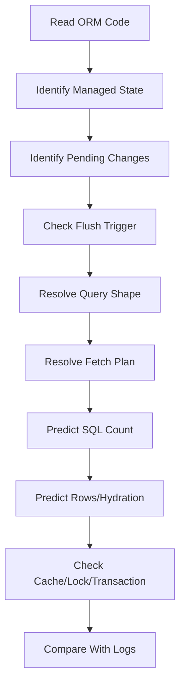

# Part 016 — SQL Prediction: Reading ORM Code and Predicting Database Interaction

Salah satu pembeda engineer ORM biasa dan engineer ORM level tinggi adalah kemampuan ini:

> Bisa memprediksi SQL, jumlah query, timing flush, hydration behavior, dan lazy access sebelum membuka log.

Jika kita baru tahu masalah setelah melihat log, kita masih reaktif. Jika kita bisa membaca kode dan memprediksi interaksi database, kita bisa mendesain repository/service yang stabil sejak awal.

Part ini adalah bridge antara teori fetch planning dan diagnostics production.

---

## 1. SQL Prediction Mindset

ORM code selalu mengandung beberapa sinyal.

Untuk memprediksi SQL, jangan mulai dari method repository. Mulai dari runtime state.

Pertanyaan dasar:

1. Entity mana yang sudah managed di persistence context?
2. Entity mana yang transient/detached/proxy?
3. Apakah ada pending insert/update/delete?
4. Apakah query akan memicu flush?
5. Mapping association-nya to-one atau to-many?
6. Fetch type-nya lazy/eager, dan apakah ada fetch plan override?
7. Identifier generator apa yang dipakai?
8. Apakah operation menyentuh owning side association?
9. Apakah collection diganti atau dimutasi incremental?
10. Apakah query bulk/native melewati persistence context?
11. Apakah second-level/shared cache aktif?
12. Apakah transaction masih terbuka saat lazy access terjadi?



Goal-nya bukan sekadar menebak query. Goal-nya membangun mental compiler.

---

## 2. Prediction Input #1: Mapping Metadata

Mulai dari mapping.

```java
@Entity
class CaseFile {
    @Id
    @GeneratedValue(strategy = GenerationType.SEQUENCE)
    Long id;

    @ManyToOne(fetch = FetchType.LAZY)
    Officer assignee;

    @OneToMany(mappedBy = "caseFile", cascade = CascadeType.ALL, orphanRemoval = true)
    Set<Task> tasks = new LinkedHashSet<>();
}

@Entity
class Task {
    @ManyToOne(fetch = FetchType.LAZY)
    @JoinColumn(name = "case_file_id", nullable = false)
    CaseFile caseFile;
}
```

Important facts:

- `Task.caseFile` adalah owning side karena punya `@JoinColumn`.
- `CaseFile.tasks` adalah inverse side karena `mappedBy`.
- Insert/update FK terjadi dari sisi `Task.caseFile`.
- `orphanRemoval = true` berarti child yang dilepas dari collection dapat dijadwalkan delete.
- `cascade = ALL` berarti lifecycle operation dari parent dapat menyebar ke child.
- `GenerationType.SEQUENCE` memungkinkan provider memperoleh ID sebelum insert; batching lebih mungkin dibanding `IDENTITY`.

Mapping adalah blueprint SQL.

---

## 3. Prediction Input #2: Persistence Context State

Contoh:

```java
CaseFile c1 = em.find(CaseFile.class, 10L);
CaseFile c2 = em.find(CaseFile.class, 10L);
```

Prediksi:

- Query pertama mungkin SQL `select` jika entity belum ada di persistence context/cache.
- Query kedua tidak perlu SQL karena identity map first-level cache.
- `c1 == c2` true dalam persistence context yang sama.

Kemungkinan SQL:

```sql
select c.* from case_file c where c.id = ?;
```

Bukan dua query.

### 3.1 `find` vs `getReference`

```java
CaseFile ref = em.getReference(CaseFile.class, 10L);
```

Prediksi:

- Provider dapat mengembalikan proxy/reference tanpa langsung select.
- SQL terjadi saat non-identifier attribute diakses.

```java
Long id = ref.getId();          // usually no select
String refNo = ref.getRefNo();  // may trigger select
```

Hibernate proxy dan EclipseLink indirection/weaving punya detail runtime berbeda, tapi mental model-nya sama: reference belum tentu row sudah dibaca.

---

## 4. Prediction Input #3: Flush Mode dan Query Trigger

Contoh:

```java
CaseFile c = em.find(CaseFile.class, id);
c.setStatus(CaseStatus.CLOSED);

List<CaseFile> openCases = em.createQuery("""
    select c
    from CaseFile c
    where c.status = :status
    """, CaseFile.class)
    .setParameter("status", CaseStatus.OPEN)
    .getResultList();
```

Prediksi dengan flush mode default `AUTO`:

- `find` melakukan select.
- `setStatus` tidak langsung update.
- Sebelum query berikutnya, provider dapat flush pending update agar query melihat state yang konsisten.
- Akan ada `update` sebelum `select openCases`, tergantung provider, flush mode, dan query space analysis.

Kemungkinan SQL:

```sql
select * from case_file where id = ?;
update case_file set status = ?, version = ? where id = ? and version = ?;
select * from case_file where status = ?;
```

Koreksi mental model:

> Update dapat terjadi sebelum commit. Flush bukan commit.

---

## 5. Prediction Drill #1: To-One Lazy Access

Code:

```java
List<CaseFile> cases = em.createQuery("""
    select c
    from CaseFile c
    where c.status = :status
    """, CaseFile.class)
    .setParameter("status", CaseStatus.OPEN)
    .getResultList();

for (CaseFile c : cases) {
    System.out.println(c.getAssignee().getDisplayName());
}
```

Mapping:

```java
@ManyToOne(fetch = FetchType.LAZY)
private Officer assignee;
```

Prediction without batch fetch:

```text
1 query for cases
up to N queries for officers, unless repeated officer IDs already in persistence context/cache
```

Possible SQL:

```sql
select c.* from case_file c where c.status = ?;
select o.* from officer o where o.id = ?;
select o.* from officer o where o.id = ?;
```

Prediction with `join fetch`:

```java
select c
from CaseFile c
join fetch c.assignee
where c.status = :status
```

Possible SQL:

```sql
select c.*, o.*
from case_file c
join officer o on o.id = c.assignee_id
where c.status = ?;
```

SQL count becomes 1.

But row count remains close to root count because this is to-one.

---

## 6. Prediction Drill #2: To-Many Lazy Collection

Code:

```java
List<CaseFile> cases = findOpenCases();

for (CaseFile c : cases) {
    int size = c.getTasks().size();
    System.out.println(size);
}
```

Prediction depends on provider and collection state.

Without batch/subselect:

```text
1 root query
N collection queries
```

Possible SQL:

```sql
select c.* from case_file c where c.status = ?;
select t.* from task t where t.case_file_id = ?;
select t.* from task t where t.case_file_id = ?;
```

With Hibernate `@BatchSize(size = 25)`:

```sql
select c.* from case_file c where c.status = ?;
select t.* from task t where t.case_file_id in (?, ?, ..., ?);
```

With Hibernate `@Fetch(FetchMode.SUBSELECT)`:

```sql
select c.* from case_file c where c.status = ?;
select t.*
from task t
where t.case_file_id in (
    select c.id from case_file c where c.status = ?
);
```

With `join fetch`:

```sql
select c.*, t.*
from case_file c
left join task t on t.case_file_id = c.id
where c.status = ?;
```

SQL count may be 1, but row count may explode.

---

## 7. Prediction Drill #3: Persist Parent + Children

Code:

```java
CaseFile c = new CaseFile("CASE-001");
Task t1 = new Task("Review evidence");
Task t2 = new Task("Notify party");

c.addTask(t1);
c.addTask(t2);

em.persist(c);
```

Helper:

```java
public void addTask(Task task) {
    tasks.add(task);
    task.setCaseFile(this);
}
```

Mapping:

```java
@OneToMany(mappedBy = "caseFile", cascade = CascadeType.ALL)
private Set<Task> tasks;

@ManyToOne(fetch = FetchType.LAZY)
@JoinColumn(name = "case_file_id", nullable = false)
private CaseFile caseFile;
```

Prediction:

- Cascade persist reaches tasks.
- Parent inserted first because children need FK.
- Children inserted after parent ID is known.
- If sequence/pooled sequence is used, batching is possible.
- If identity generator is used, parent insert may be immediate to obtain ID.

Possible SQL with sequence:

```sql
select next value for case_file_seq;
select next value for task_seq;
select next value for task_seq;
insert into case_file (..., id) values (..., ?);
insert into task (..., case_file_id, id) values (..., ?, ?);
insert into task (..., case_file_id, id) values (..., ?, ?);
```

Possible SQL with identity:

```sql
insert into case_file (...) values (...);
-- generated key returned
insert into task (..., case_file_id) values (..., ?);
insert into task (..., case_file_id) values (..., ?);
```

Design implication:

> Identifier strategy affects write batching and flush timing.

---

## 8. Prediction Drill #4: Association Mutation Owning vs Inverse Side

Buggy code:

```java
CaseFile c = em.find(CaseFile.class, caseId);
Task t = em.find(Task.class, taskId);

c.getTasks().add(t);
```

If `CaseFile.tasks` is inverse side, prediction:

- Collection in memory changes.
- Owning FK may not change because `t.setCaseFile(c)` was not called.
- SQL update may not occur as expected.
- In-memory graph and database row can diverge until reload.

Correct helper:

```java
c.addTask(t); // sets both sides
```

Expected SQL if task moves to case:

```sql
update task
set case_file_id = ?
where id = ?;
```

Rule:

> SQL follows the owning side. Domain helpers must maintain both sides.

---

## 9. Prediction Drill #5: Orphan Removal

Code:

```java
CaseFile c = em.find(CaseFile.class, caseId);
Task t = c.findTask(taskId);

c.removeTask(t);
```

Helper:

```java
public void removeTask(Task task) {
    tasks.remove(task);
    task.setCaseFile(null);
}
```

Mapping:

```java
@OneToMany(mappedBy = "caseFile", orphanRemoval = true)
private Set<Task> tasks;
```

Prediction:

- If collection is initialized and task is removed, provider detects orphan.
- SQL delete for child is scheduled.

Possible SQL:

```sql
select c.* from case_file c where c.id = ?;
select t.* from task t where t.case_file_id = ?;
delete from task where id = ?;
```

Potential surprise:

- If collection is huge, loading it just to remove one child is expensive.
- Alternative: delete child by explicit query/repository when aggregate rule permits.

---

## 10. Prediction Drill #6: Replacing a Collection

Dangerous code:

```java
caseFile.setTasks(newTasks);
```

If setter replaces provider-managed collection wrapper:

- Hibernate/EclipseLink may lose fine-grained tracking context or interpret many removals/additions.
- Orphan removal can delete rows unexpectedly.
- SQL can become delete-all + insert/update-many depending mapping.

Better:

```java
caseFile.syncTasks(newTasks);
```

Where `syncTasks` diffs by identity/business key:

```java
public void syncTasks(Collection<TaskDraft> drafts) {
    // remove missing
    // update existing
    // add new
    // preserve collection wrapper
}
```

Prediction principle:

> Mutating a managed collection incrementally gives ORM a better chance to generate minimal SQL.

---

## 11. Prediction Drill #7: Merge Detached Graph

Code:

```java
CaseFile detached = apiPayloadToEntity(payload);
CaseFile managed = em.merge(detached);
```

Prediction:

- `merge` does not reattach the same object instance.
- Provider copies detached state into a managed instance.
- It may select existing entity state first.
- For associations, provider may cascade merge depending mapping.
- Missing children in detached graph can be interpreted as removals if orphan removal/cascade is involved.
- SQL depends on dirty comparison after copy.

Possible SQL:

```sql
select c.* from case_file c where c.id = ?;
select t.* from task t where t.case_file_id = ?;
update case_file set ... where id = ? and version = ?;
update task set ... where id = ?;
delete from task where id = ?;
```

Risk:

> `merge` turns payload shape into persistence intent. That is dangerous for partial updates.

Safer pattern:

```java
CaseFile c = em.find(CaseFile.class, command.caseId());
c.changePriority(command.priority());
c.assignTo(officerRef);
```

This makes write intent explicit.

---

## 12. Prediction Drill #8: Bulk Update

Code:

```java
CaseFile c = em.find(CaseFile.class, id);

em.createQuery("""
    update CaseFile c
    set c.status = :closed
    where c.status = :open
    """)
    .setParameter("closed", CaseStatus.CLOSED)
    .setParameter("open", CaseStatus.OPEN)
    .executeUpdate();

System.out.println(c.getStatus());
```

Prediction:

- Bulk JPQL update executes directly in database.
- It bypasses normal dirty checking of managed entities.
- Managed `c` in persistence context may now be stale.
- First-level cache is not magically synchronized object-by-object.

Possible SQL:

```sql
select c.* from case_file c where c.id = ?;
update case_file set status = ? where status = ?;
```

After bulk update, use:

```java
em.clear();
```

or targeted refresh:

```java
em.refresh(c);
```

Use bulk operations in isolated transaction boundaries when possible.

---

## 13. Prediction Drill #9: Entity Graph

Code:

```java
EntityGraph<?> graph = em.getEntityGraph("CaseFile.detail");

CaseFile c = em.find(
    CaseFile.class,
    caseId,
    Map.of("jakarta.persistence.fetchgraph", graph)
);
```

Prediction:

- Provider should load attributes specified by graph.
- SQL shape is provider-dependent.
- It may use joins or secondary selects.
- Graph says what must be loaded, not always the exact SQL syntax.

Therefore, test graph behavior with:

- SQL count assertion,
- initialized association assertion,
- no lazy loading outside transaction,
- row count/hydration measurement.

---

## 14. Prediction Drill #10: Count Query with Join

Code:

```java
Long count = em.createQuery("""
    select count(c)
    from CaseFile c
    join c.tasks t
    where t.status = :status
    """, Long.class)
    .setParameter("status", TaskStatus.OPEN)
    .getSingleResult();
```

Prediction:

- This counts joined rows/root occurrences, not necessarily distinct cases.
- If one case has three open tasks, it contributes three.

Correct if counting cases:

```java
select count(distinct c.id)
from CaseFile c
join c.tasks t
where t.status = :status
```

This is not just ORM issue. It is relational semantics.

---

## 15. Hibernate SQL Visibility

For local diagnostics, typical logging categories include SQL statement logging and bind parameter logging. Exact logger names can vary by Hibernate major version and logging framework integration, so keep configuration version-aware.

Example Logback-style idea:

```xml
<logger name="org.hibernate.SQL" level="DEBUG"/>
<logger name="org.hibernate.orm.jdbc.bind" level="TRACE"/>
```

Useful Hibernate tools/concepts:

- SQL logging,
- formatted SQL,
- SQL comments,
- statistics,
- `StatementInspector`,
- interceptors/events,
- query plan cache observation,
- slow query logs at database side.

### 15.1 `StatementInspector`

Conceptual example:

```java
public final class SqlTaggingInspector implements StatementInspector {
    @Override
    public String inspect(String sql) {
        RequestContext ctx = RequestContext.currentOrNull();
        if (ctx == null) {
            return sql;
        }
        return "/* useCase=" + ctx.useCase() + " */ " + sql;
    }
}
```

Use cases:

- attach use-case name to SQL,
- correlate ORM query with request trace,
- block dangerous SQL in test,
- detect accidental cross-tenant query pattern.

Do not use it for fragile SQL rewriting unless there is no better extension point.

---

## 16. EclipseLink SQL Visibility

EclipseLink supports logging levels and categories through persistence properties and runtime configuration.

Typical properties:

```xml
<property name="eclipselink.logging.level" value="FINE"/>
<property name="eclipselink.logging.level.sql" value="FINE"/>
<property name="eclipselink.logging.parameters" value="true"/>
```

Useful EclipseLink concepts:

- SQL logging,
- query hints,
- session events,
- descriptor/session customizers,
- cache logging,
- profiler/session monitoring,
- batch fetch hints visibility.

Prediction workflow is the same:

1. read mapping,
2. read query,
3. identify provider hints,
4. predict SQL count,
5. verify logs,
6. inspect database execution plan.

---

## 17. Query Count Test Pattern

A serious ORM codebase should have query count regression tests for important use cases.

Conceptual test:

```java
@Test
void dashboardQueryShouldNotHaveNPlusOne() {
    sqlCounter.reset();

    List<CaseDashboardRow> rows = service.loadDashboard(region, PageRequest.of(0, 25));

    assertThat(rows).hasSize(25);
    assertThat(sqlCounter.count()).isLessThanOrEqualTo(3);
}
```

But query count alone is insufficient.

Also check:

- row count returned by database,
- object hydration count,
- collection fetch count,
- execution plan,
- latency under production-like cardinality,
- memory allocation.

A query count of 1 can still be worse than 3 if it performs cartesian amplification.

---

## 18. SQL Prediction Checklist

Before running a test, write down predictions:

```text
Use case:
Root query count:
Expected flush before query:
Expected insert count:
Expected update count:
Expected delete count:
Expected lazy loads:
Expected collection loads:
Expected cache hits/misses:
Expected row amplification:
Expected provider-specific behavior:
Boundary risk:
```

Example:

```text
Use case: case detail page
Root query count: 1
Expected flush before query: no, read-only transaction
Expected insert/update/delete: 0
Expected lazy loads: 0 outside service
Expected collection loads: tasks loaded separately, paged
Expected row amplification: bounded by 50 task rows
Boundary risk: serializer must use DTO only
```

This small habit changes how you design persistence code.

---

## 19. Common Prediction Failures

### 19.1 Assuming `LAZY` Means No SQL Ever

`LAZY` means not loaded immediately. Access can still trigger SQL.

### 19.2 Assuming `EAGER` Means Join

`EAGER` means data must be loaded. Provider may use join or secondary select.

### 19.3 Ignoring Flush Before Query

A read query can trigger writes first.

### 19.4 Counting Queries but Ignoring Rows

One monster join can be worse than several targeted queries.

### 19.5 Forgetting Persistence Context Cache

Repeated `find` by ID in same context may not query database.

### 19.6 Trusting H2 Behavior

H2 may hide locking, SQL dialect, execution plan, constraint timing, and batching differences.

### 19.7 Using `merge` as Patch

`merge` copies graph state. It is not a semantic patch command.

### 19.8 Replacing Managed Collections

Collection replacement can cause broad delete/insert behavior.

---

## 20. Worked Example: Case Dashboard

Requirement:

> Show 25 latest open cases with reference number, assignee name, current escalation level, and count of overdue tasks.

Bad entity approach:

```java
List<CaseFile> cases = em.createQuery("""
    select distinct c
    from CaseFile c
    left join fetch c.assignee
    left join fetch c.currentEscalation
    left join fetch c.tasks
    where c.status = :status
    order by c.createdAt desc
    """, CaseFile.class)
    .setParameter("status", CaseStatus.OPEN)
    .setMaxResults(25)
    .getResultList();
```

Prediction:

- Collection fetch join + pagination hazard.
- Row amplification by tasks.
- Hydrates entities when use case needs read model.
- May initialize large task collections.
- Count overdue tasks should be aggregate, not entity traversal.

Better projection:

```java
List<CaseDashboardRow> rows = em.createQuery("""
    select new com.acme.CaseDashboardRow(
        c.id,
        c.referenceNo,
        assignee.displayName,
        escalation.level,
        count(t.id)
    )
    from CaseFile c
    join c.assignee assignee
    left join c.currentEscalation escalation
    left join c.tasks t
        on t.status <> com.acme.TaskStatus.DONE
       and t.dueDate < :now
    where c.status = :status
    group by c.id, c.referenceNo, assignee.displayName, escalation.level, c.createdAt
    order by c.createdAt desc, c.id desc
    """, CaseDashboardRow.class)
    .setParameter("now", clock.instant())
    .setParameter("status", CaseStatus.OPEN)
    .setMaxResults(25)
    .getResultList();
```

Prediction:

- One aggregate query.
- No entity hydration except projection object.
- No lazy loading.
- No persistence context graph pressure.
- Pagination applies to aggregate rows.

Potential DB concern:

- Need index support on `case_file(status, created_at, id)`.
- Need task index on `(case_file_id, status, due_date)` or equivalent.

This is SQL prediction plus schema-awareness.

---

## 21. Worked Example: Command Handler

Requirement:

> Assign an open case to an officer and create one audit entry.

Code:

```java
@Transactional
public void assignCase(AssignCaseCommand command) {
    CaseFile c = em.find(CaseFile.class, command.caseId(), LockModeType.OPTIMISTIC);
    Officer officer = em.getReference(Officer.class, command.officerId());

    c.assignTo(officer);
    c.addAuditEntry(AuditEntry.assigned(command.actorId(), officer));
}
```

Prediction:

- `find` case: select case row.
- `getReference` officer: likely no select if only FK needed.
- `assignTo`: update `case_file.assignee_id`, maybe version.
- `addAuditEntry`: insert audit entry with FK to case.
- Flush at commit.

Possible SQL:

```sql
select c.* from case_file c where c.id = ?;
select next value for audit_entry_seq;
update case_file set assignee_id = ?, version = ? where id = ? and version = ?;
insert into audit_entry (..., case_file_id, id) values (..., ?, ?);
```

Potential surprise:

If `AuditEntry.assigned(..., officer)` accesses `officer.getDisplayName()` for message creation, then `getReference` may initialize officer:

```sql
select o.* from officer o where o.id = ?;
```

This is why command code should distinguish FK reference from data needed for business decision.

---

## 22. Prediction and Provider Difference

Same code can produce different SQL between Hibernate and EclipseLink because providers differ in:

- eager loading implementation,
- entity graph realization,
- batch fetch style,
- weaving/proxy mechanics,
- sequencing behavior,
- flush optimization,
- cache coordination,
- SQL aliasing,
- join ordering,
- optimistic lock column handling,
- DDL/type mapping.

Therefore, never assert exact SQL string across providers unless the test is provider-specific.

Better assertions:

- no N+1,
- association initialized before boundary,
- no unexpected update,
- row count bounded,
- generated SQL category/pattern acceptable,
- execution plan uses expected index.

---

## 23. Mini Lab

For each snippet below, predict SQL before running.

### Lab A

```java
CaseFile c = em.find(CaseFile.class, 1L);
em.find(CaseFile.class, 1L);
```

Expected: one select in same persistence context.

### Lab B

```java
CaseFile c = em.getReference(CaseFile.class, 1L);
c.getId();
c.getStatus();
```

Expected: no select for ID access, select on non-ID access, depending provider/proxy state.

### Lab C

```java
CaseFile c = em.find(CaseFile.class, 1L);
c.setPriority(Priority.HIGH);
em.createQuery("select count(c) from CaseFile c", Long.class).getSingleResult();
```

Expected: possible update before count query under auto flush.

### Lab D

```java
CaseFile c = em.find(CaseFile.class, 1L);
c.getTasks().removeIf(Task::isDraft);
```

Expected: collection load, then delete or FK-null updates depending orphan removal and mapping.

### Lab E

```java
em.createQuery("update CaseFile c set c.status = :s").executeUpdate();
```

Expected: direct SQL update, persistence context stale unless cleared/refreshed.

---

## 24. Key Takeaways

- SQL prediction starts from mapping, state, flush mode, and fetch plan.
- Persistence context can remove SQL through identity map or create surprise SQL through flush/lazy loading.
- `find`, `getReference`, `persist`, `merge`, collection mutation, and bulk query each have different database interaction patterns.
- Query count is not enough; row amplification and hydration cost matter.
- Hibernate and EclipseLink can implement the same Jakarta Persistence contract with different SQL shapes.
- The best ORM engineers treat SQL prediction as a design activity, not a debugging afterthought.

---

## References

- Hibernate ORM User Guide: https://docs.hibernate.org/stable/orm/userguide/html_single/
- Hibernate ORM Documentation: https://hibernate.org/orm/documentation/
- Hibernate `StatementInspector` Javadoc: https://docs.hibernate.org/orm/current/javadocs/org/hibernate/resource/jdbc/spi/StatementInspector.html
- Jakarta Persistence 3.2 Specification: https://jakarta.ee/specifications/persistence/3.2/jakarta-persistence-spec-3.2
- Jakarta Persistence EntityManager Javadoc: https://jakarta.ee/specifications/persistence/3.2/apidocs/jakarta.persistence/jakarta/persistence/entitymanager
- EclipseLink Documentation: https://eclipse.dev/eclipselink/documentation/
