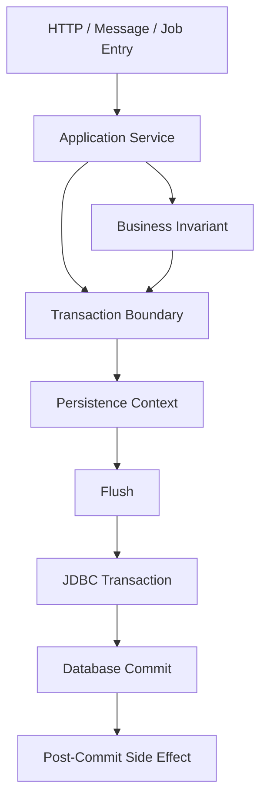
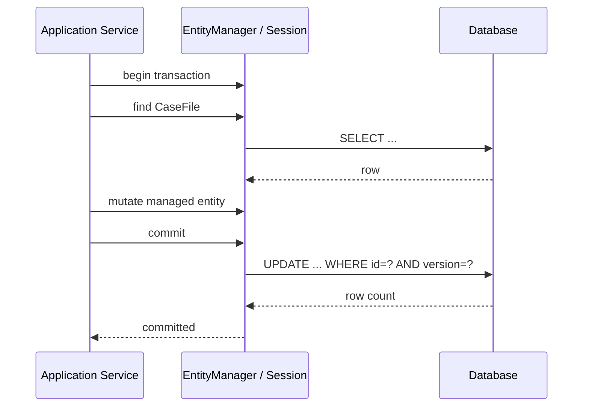
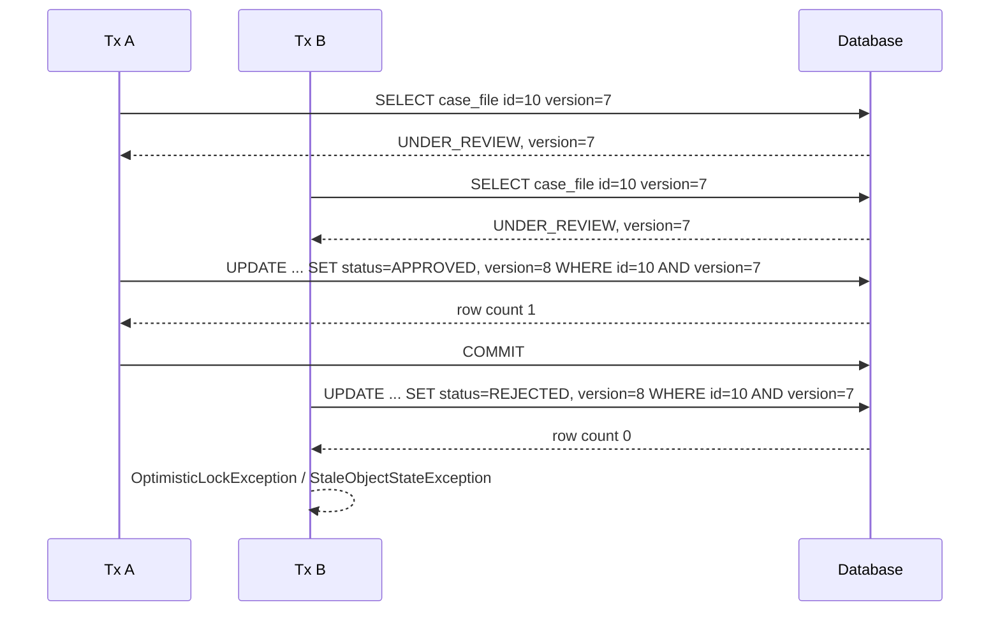
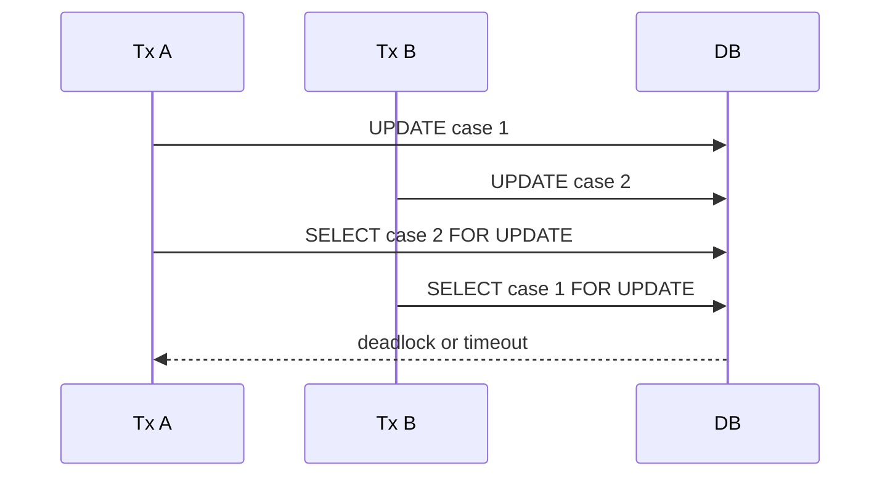
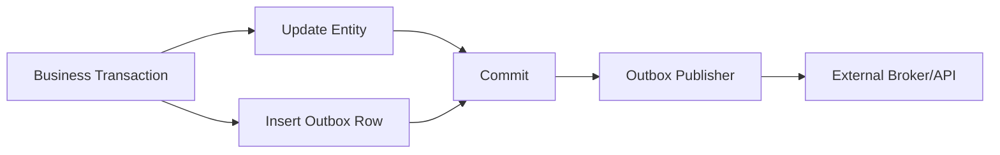

# Part 017 — Transaction Boundaries, Locking, Isolation, and Consistency

ORM tidak menciptakan konsistensi. ORM hanya mengorkestrasi state object, SQL, flush, cache, dan lock di dalam batas transaksi yang kita desain.

Jika transaction boundary salah, mapping yang benar tetap bisa menghasilkan:

- lost update,
- stale decision,
- duplicate business action,
- deadlock,
- phantom workflow transition,
- inconsistent audit trail,
- entity graph yang tampak benar di memory tetapi salah terhadap database.

Part ini membahas transaction dan locking bukan sebagai API hafalan, tetapi sebagai **consistency design tool** untuk sistem production.

---

## 1. Mental Model Utama

Ada empat lapisan yang sering tercampur:

1. **Persistence context boundary**  
   Batas object identity dan managed state.

2. **Database transaction boundary**  
   Batas atomicity, isolation, commit, rollback.

3. **Business consistency boundary**  
   Batas invariant domain yang harus benar setelah operation selesai.

4. **Workflow/process boundary**  
   Batas state transition jangka panjang yang mungkin melewati banyak transaction.

ORM transaction design yang sehat menyelaraskan keempatnya, tetapi tidak menganggap mereka selalu sama.



Rule praktis:

> Satu transaction harus cukup besar untuk menjaga invariant, tetapi cukup kecil untuk tidak menahan lock, connection, persistence context, dan user interaction terlalu lama.

---

## 2. Transaction Boundary Bukan Repository Boundary

Kesalahan umum adalah meletakkan transaction di setiap repository method.

```java
@Transactional
public CaseFile findCase(Long id) {
    return entityManager.find(CaseFile.class, id);
}

@Transactional
public void saveCase(CaseFile file) {
    entityManager.persist(file);
}
```

Model ini terlihat rapi, tetapi boundary-nya salah jika business operation membutuhkan beberapa read dan write atomik.

Contoh buruk:

```java
public void approveCase(Long caseId, String approver) {
    CaseFile file = repository.findCase(caseId);      // tx 1
    file.approve(approver);                           // detached mutation?
    repository.saveCase(file);                        // tx 2 / merge?
    auditRepository.saveApproval(file.id(), approver); // tx 3?
}
```

Masalahnya:

- read, state transition, dan audit tidak atomik;
- entity bisa detached di tengah;
- `merge` bisa menimpa perubahan concurrent;
- audit bisa sukses ketika state update gagal, atau sebaliknya;
- invariant tidak punya boundary yang jelas.

Model lebih sehat:

```java
@Transactional
public void approveCase(Long caseId, String approver) {
    CaseFile file = entityManager.find(CaseFile.class, caseId, LockModeType.OPTIMISTIC);

    file.approve(approver);

    AuditEntry audit = AuditEntry.caseApproved(file, approver);
    entityManager.persist(audit);
}
```

Repository boleh ada, tetapi transaction boundary biasanya milik **application service/use case**, bukan method CRUD kecil.

---

## 3. Persistence Context Boundary vs Transaction Boundary

Secara umum di server-side application, persistence context hidup selama transaction.

Namun, JPA/Jakarta Persistence membedakan:

- **transaction-scoped persistence context**: default di banyak aplikasi;
- **extended persistence context**: bisa hidup melewati beberapa transaction, umum di stateful interaction model tertentu.

Untuk sistem backend modern, transaction-scoped context biasanya lebih aman.



Extended context bisa berguna untuk wizard panjang, tetapi membawa risiko:

- stale object makin besar;
- memory retention;
- accidental flush;
- conflict detection terlambat;
- sulit diprediksi di concurrent system.

Untuk workflow panjang, lebih baik simpan state workflow di database secara eksplisit, bukan mempertahankan managed entity selama user berpikir.

---

## 4. Flush dan Commit dalam Transaction

`flush()` mengirim SQL ke database, tetapi belum commit.

```java
@Transactional
public void transition(Long id) {
    CaseFile file = entityManager.find(CaseFile.class, id);
    file.assignTo("investigator-1");

    entityManager.flush();

    // transaction masih bisa rollback
    validateExternalPolicy(file);
}
```

Setelah `flush()`:

- SQL sudah dieksekusi;
- constraint database bisa sudah diperiksa;
- lock database mungkin sudah diambil;
- rollback masih mungkin;
- data belum durable secara commit.

`flush()` berguna untuk:

- memaksa constraint violation muncul lebih awal;
- mendapatkan generated value tertentu;
- chunking batch write;
- membersihkan action queue sebelum query tertentu;
- debugging.

Tetapi `flush()` bukan alat untuk “menyimpan setengah transaksi”. Jika operation harus separuh commit, berarti perlu boundary transaction berbeda atau outbox/process model.

---

## 5. Rollback Semantics: Entity Memory Tidak Otomatis Kembali Waras

Setelah rollback, database kembali ke state sebelumnya, tetapi object Java yang sudah dimutasi tidak otomatis kembali seperti semula.

```java
CaseFile file = entityManager.find(CaseFile.class, id);
file.approve("alice");

try {
    transaction.commit();
} catch (RuntimeException ex) {
    transaction.rollback();
}

// file di memory masih bisa terlihat approved
```

Konsekuensi:

- jangan lanjut memakai managed object setelah rollback seolah-olah valid;
- discard persistence context setelah rollback;
- di Spring, transaction rollback biasanya membuat context tidak layak dipakai untuk operation lanjutan;
- jangan emit event berdasarkan object memory sebelum commit sukses.

Pattern aman:

```java
@Transactional
public void approve(Long id) {
    CaseFile file = entityManager.find(CaseFile.class, id);
    file.approve(currentUser());

    outbox.add(CaseApprovedEvent.from(file));
    // event dikirim oleh worker setelah commit, bukan langsung sebelum commit
}
```

---

## 6. Optimistic Locking: Default untuk Banyak Sistem Enterprise

Optimistic locking berasumsi conflict jarang, tetapi harus terdeteksi.

Mapping umum:

```java
@Entity
class CaseFile {
    @Id
    private Long id;

    @Version
    private long version;

    @Enumerated(EnumType.STRING)
    private CaseStatus status;

    public void approve() {
        if (status != CaseStatus.UNDER_REVIEW) {
            throw new IllegalStateException("Only under-review cases can be approved");
        }
        status = CaseStatus.APPROVED;
    }
}
```

Update tipikal:

```sql
update case_file
set status = ?, version = ?
where id = ? and version = ?
```

Jika row count `0`, provider mendeteksi optimistic conflict dan melempar exception.

Yang dijaga optimistic lock:

- dua transaksi tidak bisa diam-diam overwrite row version yang sama;
- lost update pada entity versioned bisa dicegah;
- conflict muncul saat flush/commit.

Yang tidak otomatis dijaga:

- invariant lintas banyak row jika hanya satu row yang versioned;
- phantom insert;
- aggregate constraint yang tidak melibatkan root version;
- external side effect;
- bulk update yang bypass version handling jika tidak dirancang eksplisit.

---

## 7. Optimistic Locking Timeline



Mental model:

> Version bukan hanya audit number. Version adalah compare-and-swap token untuk entity row.

---

## 8. `OPTIMISTIC` vs `OPTIMISTIC_FORCE_INCREMENT`

JPA lock modes penting:

```java
CaseFile file = entityManager.find(
    CaseFile.class,
    id,
    LockModeType.OPTIMISTIC
);
```

`OPTIMISTIC` memastikan version checked.

`OPTIMISTIC_FORCE_INCREMENT` meminta provider menaikkan version walaupun tidak ada field bisnis yang berubah.

```java
CaseFile file = entityManager.find(
    CaseFile.class,
    id,
    LockModeType.OPTIMISTIC_FORCE_INCREMENT
);

file.recordReadForDecision(userId);
```

Kapan force increment berguna?

- parent/root aggregate harus berubah version ketika child berubah;
- workflow transition ingin mengunci logical decision point;
- read decision harus menghalangi concurrent decision lain;
- kita ingin menandai “saya mengambil ownership decision” tanpa update field bisnis langsung.

Contoh aggregate child mutation:

```java
@Transactional
public void addEvidence(Long caseId, Evidence evidence) {
    CaseFile file = entityManager.find(
        CaseFile.class,
        caseId,
        LockModeType.OPTIMISTIC_FORCE_INCREMENT
    );

    file.addEvidence(evidence);
}
```

Tanpa force increment, perubahan child bisa tidak menaikkan version root tergantung mapping dan provider behavior.

---

## 9. Optimistic Locking untuk Aggregate, Bukan Hanya Row

Jika aggregate terdiri dari root dan child rows, pertanyaan pentingnya:

> Conflict token mana yang mewakili keseluruhan aggregate?

Contoh:

```text
case_file(id, status, version)
case_task(id, case_id, assignee, status)
case_note(id, case_id, body)
case_evidence(id, case_id, checksum)
```

Jika dua user mengubah child berbeda:

- user A menambahkan evidence;
- user B approve case;

Apakah harus conflict?

Jawabannya domain-specific.

Jika approval harus mempertimbangkan evidence terbaru, maka penambahan evidence harus membuat approval concurrent gagal/retry. Root version harus berubah.

Strategi:

1. Semua mutation penting pada child juga increment root version.
2. Gunakan `OPTIMISTIC_FORCE_INCREMENT` pada root.
3. Gunakan domain rule yang memvalidasi ulang sebelum transition.
4. Simpan aggregate-level `last_material_change_version` jika version entity tidak cukup ekspresif.

---

## 10. Pessimistic Locking: Tool untuk Hot Decision Point

Pessimistic locking mengambil lock database sehingga transaction lain dibatasi sampai lock dilepas.

```java
CaseFile file = entityManager.find(
    CaseFile.class,
    id,
    LockModeType.PESSIMISTIC_WRITE
);

file.assignTo(currentOfficer());
```

Use case yang masuk akal:

- claim work item dari queue;
- allocate limited resource;
- prevent duplicate transition pada hot row;
- enforce strict sequence number;
- short critical section.

Use case yang buruk:

- user membuka halaman edit selama 10 menit;
- long-running external API call sambil lock ditahan;
- batch job mengunci ribuan row tanpa chunking;
- mencoba mengganti desain invariant yang tidak jelas dengan lock.

Pessimistic lock harus pendek, eksplisit, dan terukur.

---

## 11. Lock Mode Praktis

Beberapa lock mode utama:

| Lock mode | Makna praktis | Typical use |
|---|---|---|
| `OPTIMISTIC` | Check version conflict | normal update flow |
| `OPTIMISTIC_FORCE_INCREMENT` | Check dan increment version | aggregate decision token |
| `PESSIMISTIC_READ` | shared/read lock jika database mendukung | prevent write during read decision |
| `PESSIMISTIC_WRITE` | exclusive/write lock | claim, allocate, transition hot row |
| `PESSIMISTIC_FORCE_INCREMENT` | write lock + version increment | strict lock + optimistic token update |
| `NONE` | no explicit lock | simple reads |

Provider menerjemahkan lock mode ke SQL/database behavior sesuai dialect/platform.

Contoh SQL yang mungkin terlihat:

```sql
select *
from case_file
where id = ?
for update
```

Atau varian database-specific seperti `FOR UPDATE NOWAIT`, `SKIP LOCKED`, lock timeout hint, dan sebagainya.

---

## 12. Lock Timeout dan Failure Handling

Pessimistic lock bisa menunggu. Jika tidak diatur, request bisa menggantung terlalu lama.

JPA lock timeout hint:

```java
Map<String, Object> hints = new HashMap<>();
hints.put("jakarta.persistence.lock.timeout", 1000); // milliseconds, provider/database dependent

CaseFile file = entityManager.find(
    CaseFile.class,
    id,
    LockModeType.PESSIMISTIC_WRITE,
    hints
);
```

Failure handling harus domain-aware:

```java
try {
    claimCase(caseId);
} catch (PessimisticLockException | LockTimeoutException ex) {
    throw new CaseCurrentlyBeingProcessedException(caseId);
}
```

Jangan treat lock timeout sebagai generic 500 jika business semantics-nya adalah “sedang diproses oleh worker lain”.

---

## 13. Isolation Level: Database Contract yang ORM Tidak Bisa Abaikan

Locking entity tidak sama dengan isolation level.

Isolation level mengontrol visibility fenomena seperti:

- dirty read;
- non-repeatable read;
- phantom read;
- serialization anomaly.

ORM tidak menghapus fenomena ini. ORM hanya menyimpan object di persistence context sehingga kadang anomaly tersembunyi di memory.

Contoh:

```java
@Transactional
public boolean canApprove(Long caseId) {
    CaseFile file = entityManager.find(CaseFile.class, caseId);
    long unresolvedTasks = countUnresolvedTasks(caseId);

    return file.status() == UNDER_REVIEW && unresolvedTasks == 0;
}
```

Jika isolation level memungkinkan phantom, task baru bisa muncul setelah count tetapi sebelum approval commit, kecuali ada constraint/lock/design yang mencegahnya.

Solusi bisa berupa:

- database constraint;
- pessimistic lock pada root;
- task insert juga mengunci root;
- serializable transaction untuk operation kecil;
- workflow rule yang retry;
- materialized counter dengan versioned root.

---

## 14. First-Level Cache dan Repeatable Read Semu

Persistence context menjamin identity map.

```java
CaseFile a = entityManager.find(CaseFile.class, 10L);
CaseFile b = entityManager.find(CaseFile.class, 10L);

assert a == b;
```

Jika database row berubah di transaction lain, `a` tidak otomatis berubah.

Ini menciptakan efek “repeatable object read” di persistence context, meskipun database isolation bukan repeatable read.

Konsekuensi:

- object bisa stale;
- query JPQL bisa mengambil row baru, tetapi entity yang sudah managed tetap instance lama;
- `refresh()` diperlukan jika kita ingin database state terbaru;
- `clear()` memaksa subsequent load membaca ulang.

```java
entityManager.refresh(file);
```

Gunakan `refresh()` dengan hati-hati. Refresh bukan solusi desain untuk concurrency; refresh adalah tool untuk boundary tertentu.

---

## 15. Query Flush Sebelum Lock

Jika flush mode `AUTO`, provider boleh flush sebelum query/lock query untuk menjaga query melihat perubahan pending.

```java
@Transactional
public void claimAndReassign(Long a, Long b) {
    CaseFile first = entityManager.find(CaseFile.class, a);
    first.markTouched();

    CaseFile second = entityManager.find(
        CaseFile.class,
        b,
        LockModeType.PESSIMISTIC_WRITE
    );
}
```

Sebelum lock `second`, provider mungkin flush update `first`.

Risiko:

- lock order menjadi tidak sesuai yang kita bayangkan;
- deadlock lebih mudah terjadi;
- constraint violation muncul sebelum titik kode yang kita anggap write;
- query count meningkat.

Mitigasi:

- buat lock acquisition order eksplisit;
- hindari mutation sebelum semua lock penting diambil;
- gunakan flush mode dengan sadar;
- pecah operation jika invariant berbeda;
- review generated SQL dalam concurrent scenario.

---

## 16. Deadlock: Bukan Sekadar Masalah Database

ORM bisa memicu deadlock karena urutan flush dan lock.

Scenario:

```text
Tx A:
1. update case 1
2. lock case 2

Tx B:
1. update case 2
2. lock case 1
```

Deadlock:



Prevention:

- global lock ordering by primary key;
- avoid mixed read/write order;
- use deterministic batch order;
- keep transaction short;
- reduce lock footprint;
- retry only when operation is idempotent and safe.

Retry bukan pengganti desain. Retry hanya masuk akal setelah kita tahu operation aman untuk diulang.

---

## 17. Hibernate Notes: Transaction and Locking

Hibernate ORM menyediakan dua surface:

- Jakarta Persistence API: `EntityManager`, `LockModeType`, `EntityTransaction`;
- Native API: `Session`, `Transaction`, Hibernate lock modes/options.

Prinsip yang tetap sama:

- `Session` adalah persistence context dan unit-of-work;
- dirty changes disinkronkan saat flush;
- versioned entity memakai optimistic check;
- pessimistic lock diterjemahkan ke database locking SQL sesuai dialect;
- `Session` tidak thread-safe;
- rollback harus membuat session/context dianggap tidak layak untuk lanjut business operation.

Contoh native-ish style:

```java
Session session = entityManager.unwrap(Session.class);

CaseFile file = session.byId(CaseFile.class)
    .with(LockOptions.UPGRADE)
    .load(id);
```

Gunakan native API ketika butuh fitur spesifik Hibernate, tetapi isolasi dari domain service agar lock-in terkendali.

---

## 18. EclipseLink Notes: UnitOfWork, Locking, and Refresh

EclipseLink melihat transaction work melalui UnitOfWork/session model.

Yang penting secara mental:

- perubahan object dikelola sebagai unit of work;
- shared cache dapat berinteraksi dengan locking/isolation;
- optimistic locking bisa dikonfigurasi melalui version field atau policy provider;
- pessimistic locking bisa diminta lewat JPA lock modes dan query hints;
- refresh/cache bypass sering diperlukan saat data bisa diubah di luar persistence context.

Contoh JPA style tetap portable:

```java
TypedQuery<CaseFile> query = entityManager.createQuery("""
    select c
    from CaseFile c
    where c.id = :id
    """, CaseFile.class);

query.setParameter("id", id);
query.setLockMode(LockModeType.PESSIMISTIC_WRITE);

CaseFile file = query.getSingleResult();
```

EclipseLink-specific hint sebaiknya dibungkus pada infrastructure layer, bukan tersebar di service/domain layer.

---

## 19. Read-Only Transactions

Read-only transaction bukan sekadar optimasi. Ia adalah sinyal intent.

Di Spring/Hibernate, read-only bisa mengurangi dirty checking behavior tertentu atau mengatur flush mode, tergantung konfigurasi.

Namun jangan bergantung buta pada read-only untuk mencegah mutation.

```java
@Transactional(readOnly = true)
public CaseSummary summary(Long id) {
    CaseFile file = entityManager.find(CaseFile.class, id);
    return CaseSummary.from(file);
}
```

Anti-pattern:

```java
@Transactional(readOnly = true)
public CaseFile loadForController(Long id) {
    return entityManager.find(CaseFile.class, id);
}
```

Jika entity keluar dari service dan dimutasi di layer lain, boundary menjadi kabur.

Read-only flow yang sehat:

- return DTO/projection;
- no entity mutation;
- no lazy access outside boundary;
- no side effect;
- explicit consistency requirement.

---

## 20. Transaction Boundary dalam Message Consumer dan Job

Message consumer sering lebih rumit dari HTTP request karena retry dan idempotency.

```java
@Transactional
public void handle(CaseApprovedMessage message) {
    if (processedMessageRepository.exists(message.id())) {
        return;
    }

    CaseFile file = entityManager.find(
        CaseFile.class,
        message.caseId(),
        LockModeType.OPTIMISTIC
    );

    file.markNotificationSent();
    processedMessageRepository.save(message.id());
}
```

Yang harus benar:

- message deduplication atomik dengan mutation;
- retry aman;
- optimistic conflict ditangani;
- external side effect tidak dikirim sebelum commit;
- consumer transaction tidak terlalu panjang.

Untuk outbound side effect, gunakan outbox.



---

## 21. Transaction Boundary dalam Workflow Panjang

Workflow seperti enforcement lifecycle, investigation, appeal, escalation, atau remediation tidak boleh dimodelkan sebagai satu database transaction panjang.

Model yang benar:

- setiap command adalah transaction pendek;
- setiap transition memvalidasi invariant saat itu;
- version/lock menjaga concurrent transition;
- process state disimpan eksplisit;
- side effects dikirim post-commit;
- compensation dibuat sebagai workflow step, bukan rollback database lama.

Contoh command:

```java
@Transactional
public void escalateCase(Long caseId, EscalationReason reason) {
    CaseFile file = entityManager.find(
        CaseFile.class,
        caseId,
        LockModeType.OPTIMISTIC_FORCE_INCREMENT
    );

    file.escalate(reason, clock.instant());
    entityManager.persist(AuditEntry.escalated(file, reason));
    outbox.persist(CaseEscalatedEvent.from(file));
}
```

---

## 22. Business Invariant Pattern

Jangan letakkan invariant penting hanya di UI atau controller.

```java
@Entity
class CaseFile {
    public void close() {
        if (status != CaseStatus.APPROVED) {
            throw new IllegalStateException("Only approved case can be closed");
        }
        status = CaseStatus.CLOSED;
    }
}
```

Tetapi entity method saja tidak cukup untuk invariant yang butuh query.

```java
@Transactional
public void closeCase(Long id) {
    CaseFile file = entityManager.find(
        CaseFile.class,
        id,
        LockModeType.OPTIMISTIC_FORCE_INCREMENT
    );

    long unresolvedTasks = taskRepository.countUnresolvedByCase(id);
    if (unresolvedTasks > 0) {
        throw new CannotCloseCaseWithOpenTasksException(id);
    }

    file.close();
}
```

Jika `task` bisa dibuat concurrent, pastikan task creation juga conflict dengan root close operation.

---

## 23. Constraint sebagai Last Line of Defense

ORM lock bukan pengganti database constraint.

Gunakan database untuk invariant yang bisa diekspresikan:

- unique constraint;
- foreign key;
- check constraint;
- exclusion constraint jika database mendukung;
- not-null;
- partial unique index;
- trigger hanya jika benar-benar perlu dan diobservasi.

Contoh duplicate active assignment:

```sql
create unique index uq_active_case_assignment
on case_assignment(case_id)
where status = 'ACTIVE';
```

Kemudian service tetap melakukan validasi domain, tetapi siap menangani constraint violation.

---

## 24. Exception Taxonomy untuk Locking

Exception ORM/database harus diterjemahkan menjadi error bisnis yang masuk akal.

| Technical condition | Possible business response |
|---|---|
| optimistic conflict | “Data changed, reload and retry” |
| pessimistic timeout | “Item is being processed” |
| deadlock victim | safe retry if command idempotent |
| unique constraint violation | duplicate business request / idempotent success |
| FK violation | invalid reference / concurrent delete |
| stale state | entity no longer available |

Jangan expose `OptimisticLockException` mentah ke API client.

```java
try {
    service.approve(command);
} catch (ObjectOptimisticLockingFailureException ex) {
    throw new Conflict409("Case was modified by another user. Reload and retry.");
}
```

---

## 25. `merge` dan Lost Update

Detached update via `merge` sering menjadi sumber lost update.

```java
@Transactional
public void updateFromDto(CaseDto dto) {
    CaseFile detached = mapper.toEntity(dto);
    entityManager.merge(detached);
}
```

Masalah:

- DTO mungkin tidak membawa semua field;
- mapper membuat object detached penuh;
- null bisa dianggap update;
- relationship bisa terhapus;
- version mungkin hilang/salah;
- conflict semantics tidak jelas.

Pattern lebih aman:

```java
@Transactional
public void updateTitle(Long id, String title, long expectedVersion) {
    CaseFile file = entityManager.find(CaseFile.class, id);

    if (file.version() != expectedVersion) {
        throw new VersionMismatchException();
    }

    file.rename(title);
}
```

Atau gunakan command object yang hanya mengekspresikan perubahan yang diizinkan.

---

## 26. Bulk Update dan Version Semantics

Bulk JPQL update bypass persistence context.

```java
int updated = entityManager.createQuery("""
    update CaseFile c
    set c.status = :expired
    where c.dueAt < :now
    and c.status = :open
    """)
    .setParameter("expired", CaseStatus.EXPIRED)
    .setParameter("open", CaseStatus.OPEN)
    .setParameter("now", now)
    .executeUpdate();
```

Risiko:

- managed entities stale;
- lifecycle callbacks tidak dipanggil seperti entity mutation normal;
- version increment bisa tidak terjadi kecuali query dirancang;
- cache invalidation perlu dipikirkan;
- audit tidak otomatis.

Setelah bulk update:

```java
entityManager.clear();
```

Untuk critical domain transition, jangan asal bulk update. Gunakan batch command per aggregate atau bulk update dengan audit/outbox/countermeasure eksplisit.

---

## 27. Locking dalam Query

```java
List<CaseFile> cases = entityManager.createQuery("""
    select c
    from CaseFile c
    where c.status = :status
    order by c.priority desc, c.createdAt asc
    """, CaseFile.class)
    .setParameter("status", CaseStatus.READY)
    .setMaxResults(10)
    .setLockMode(LockModeType.PESSIMISTIC_WRITE)
    .getResultList();
```

Masalah yang perlu dicek:

- apakah database mengizinkan lock dengan pagination/order;
- apakah provider lock semua joined rows atau hanya root;
- apakah query fetch join memperluas lock footprint;
- apakah index mendukung order/filter;
- apakah worker lain akan block atau skip.

Untuk queue claiming, native SQL dengan `SKIP LOCKED` bisa lebih tepat, tetapi itu database-specific.

---

## 28. Consistency Decision Matrix

| Situation | Preferred strategy |
|---|---|
| Rare conflict on normal edit | optimistic locking |
| Hot row claim/assignment | short pessimistic lock |
| Aggregate child affects root decision | root version increment |
| Unique business key | database unique constraint + graceful handling |
| External side effect | outbox after commit |
| Long workflow | multiple short transactions + explicit process state |
| High-volume expiry job | bulk update with clear/cache/audit strategy |
| Cross-row invariant | lock root / constraint / serializable small tx / materialized counter |
| Multi-service consistency | event/outbox/saga, not distributed entity transaction |

---

## 29. Checklist: Designing a Transactional Use Case

Sebelum menulis code, jawab:

1. Apa command bisnisnya?
2. Entity/aggregate apa yang menjadi consistency root?
3. Invariant apa yang harus benar saat commit?
4. Row mana yang bisa berubah concurrent?
5. Conflict harus dicegah, dideteksi, atau diterima?
6. Apakah optimistic version cukup?
7. Apakah perlu pessimistic lock pendek?
8. Apakah ada child mutation yang harus increment root version?
9. Apakah ada external side effect?
10. Apakah operation idempotent?
11. Apakah retry aman?
12. Apakah ada database constraint sebagai backstop?
13. Apakah bulk operation melewati persistence context?
14. Apakah cache perlu invalidation/refresh?
15. Apa error bisnis untuk conflict?

---

## 30. Example: Case Assignment Claim

Requirement:

- Beberapa officer bisa mengambil case dari queue.
- Satu case hanya boleh aktif dipegang satu officer.
- Claim harus cepat.
- Jika sudah diambil orang lain, request mendapat conflict/empty result.

Option A: Optimistic locking.

```java
@Transactional
public boolean claim(Long caseId, String officerId) {
    CaseFile file = entityManager.find(CaseFile.class, caseId, LockModeType.OPTIMISTIC);

    if (!file.canBeClaimed()) {
        return false;
    }

    file.claim(officerId);
    return true;
}
```

Cocok jika conflict tidak terlalu sering.

Option B: Pessimistic lock.

```java
@Transactional
public boolean claim(Long caseId, String officerId) {
    CaseFile file = entityManager.find(
        CaseFile.class,
        caseId,
        LockModeType.PESSIMISTIC_WRITE,
        Map.of("jakarta.persistence.lock.timeout", 500)
    );

    if (!file.canBeClaimed()) {
        return false;
    }

    file.claim(officerId);
    return true;
}
```

Cocok untuk hot item atau strict claim.

Option C: Database atomic update.

```sql
update case_file
set assignee = ?, status = 'CLAIMED', version = version + 1
where id = ?
and status = 'READY'
and assignee is null
```

Cocok untuk very hot queue. Tetapi audit, cache, and persistence context harus ditangani eksplisit.

---

## 31. Example: Approval with Material Checks

Requirement:

- Case hanya boleh approved jika tidak ada unresolved material issue.
- Evidence baru setelah approval check harus membuat approval gagal atau retry.

Design:

- root `CaseFile` memiliki version;
- evidence mutation melakukan `OPTIMISTIC_FORCE_INCREMENT` root;
- approval juga lock root optimistic force increment;
- count unresolved issue dilakukan dalam transaction;
- database constraint mendukung invariant yang bisa diekspresikan;
- outbox event dikirim post-commit.

```java
@Transactional
public void approve(Long caseId, long expectedVersion) {
    CaseFile file = entityManager.find(
        CaseFile.class,
        caseId,
        LockModeType.OPTIMISTIC_FORCE_INCREMENT
    );

    if (file.version() != expectedVersion) {
        throw new VersionMismatchException();
    }

    long unresolved = issueRepository.countUnresolvedMaterialIssues(caseId);
    if (unresolved > 0) {
        throw new CannotApproveException();
    }

    file.approve(currentUser(), clock.instant());
    entityManager.persist(AuditEntry.caseApproved(file));
    outbox.persist(CaseApprovedEvent.from(file));
}
```

---

## 32. Testing Locking Behavior

ORM locking tests harus memakai database nyata, bukan hanya in-memory assumption.

Test shape:

```java
@Test
void concurrentApprovalShouldFailOneTransaction() throws Exception {
    Long caseId = fixture.createUnderReviewCase();

    Future<?> a = executor.submit(() -> txTemplate.execute(status -> {
        service.approve(caseId);
        barrier.await();
        return null;
    }));

    Future<?> b = executor.submit(() -> txTemplate.execute(status -> {
        service.reject(caseId);
        barrier.await();
        return null;
    }));

    // assert one succeeds and one gets conflict
}
```

Yang perlu diuji:

- optimistic conflict muncul;
- lock timeout diterjemahkan benar;
- deadlock retry policy aman;
- version increment terjadi sesuai desain;
- bulk update tidak meninggalkan managed stale object;
- outbox hanya muncul jika commit sukses.

---

## 33. Observability untuk Transaction dan Locking

Minimal observability:

- SQL log dengan bind parameter di environment test/staging;
- transaction duration;
- lock wait duration;
- deadlock count;
- optimistic conflict count;
- pessimistic timeout count;
- retry count;
- rows affected untuk atomic update;
- flush count per request;
- connection pool wait time.

Log bisnis yang baik:

```text
case.approval.conflict caseId=123 expectedVersion=7 actualStateReloadRequired=true actor=alice
```

Jangan hanya log stack trace provider.

---

## 34. Provider-Neutral Rules of Thumb

1. Jangan buka transaction melewati user think time.
2. Jangan kirim external side effect sebelum commit.
3. Jangan update detached graph besar dengan `merge` tanpa version dan field-level intent.
4. Gunakan optimistic locking sebagai default conflict detector.
5. Gunakan pessimistic locking untuk short hot critical section.
6. Gunakan database constraint untuk invariant yang bisa dipaksa database.
7. Jangan percaya cache setelah bulk update tanpa invalidation/clear.
8. Jangan membuat workflow panjang sebagai satu database transaction.
9. Jangan biarkan repository method kecil menentukan consistency boundary.
10. Selalu terjemahkan conflict teknis menjadi respons bisnis yang jelas.

---

## 35. Kaufman Practice: Transaction Prediction Drill

Latihan 30 menit:

1. Ambil satu service method write.
2. Tulis transaction boundary-nya.
3. Tandai semua entity yang managed.
4. Prediksi flush SQL.
5. Tandai row yang bisa conflict.
6. Tentukan lock strategy.
7. Tulis failure mode:
   - optimistic conflict;
   - lock timeout;
   - deadlock;
   - constraint violation;
   - rollback after side effect.
8. Jalankan dua thread test.
9. Bandingkan prediksi dengan hasil.
10. Refactor boundary jika prediksi sulit dijelaskan.

Jika engineer tidak bisa menjelaskan transaction boundary, code itu belum production-ready.

---

## 36. Ringkasan

Transaction dan locking di ORM bukan dekorasi annotation. Mereka adalah mekanisme untuk menjaga invariant ketika object model, SQL, database isolation, dan user workflow bertemu.

Mental model utama:

- transaction boundary milik use case;
- persistence context bukan database isolation;
- flush bukan commit;
- optimistic lock mendeteksi conflict;
- pessimistic lock menahan critical section;
- database constraint tetap diperlukan;
- long workflow harus dipecah menjadi short transactions;
- side effect harus post-commit;
- provider-specific locking harus dibungkus agar tidak mencemari domain model.

Di Part 018, kita masuk ke caching: first-level cache, Hibernate second-level cache, EclipseLink shared cache, dan terutama bagaimana cache bisa memperbaiki performance tetapi merusak correctness jika tidak dipahami.

---

## Referensi Resmi

- Hibernate ORM User Guide 7.x — transactions, locking, persistence context, flushing, caching.
- Jakarta Persistence 3.2 Specification — lock modes, optimistic/pessimistic locking, entity manager semantics, cache modes.
- EclipseLink Documentation — UnitOfWork, locking, cache, query hints, session behavior.
