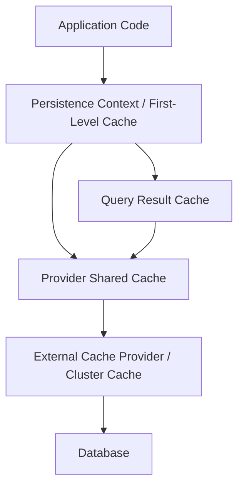
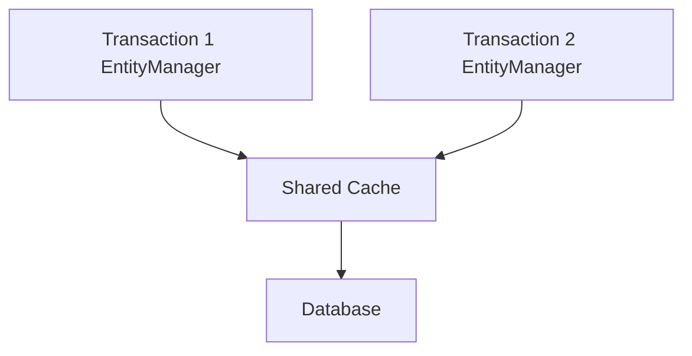

# Part 018 — Caching I: First-Level Cache, Shared Cache, and Correctness

Cache adalah salah satu area ORM yang paling sering disalahpahami.

Banyak engineer berpikir cache hanya fitur performance. Pada ORM, cache juga menyentuh:

- object identity,
- stale reads,
- transaction visibility,
- optimistic locking,
- query consistency,
- cluster invalidation,
- bulk update correctness,
- data changed outside ORM.

Rule utama:

> Cache yang cepat tetapi salah lebih buruk daripada query yang lambat tetapi benar.

Part ini membahas caching dari sisi correctness. Tuning detail production akan dilanjutkan di Part 019.

---

## 1. Cache Layers dalam ORM

Ada beberapa cache berbeda yang sering disebut “cache” seolah-olah sama.



Layer penting:

1. **First-level cache / persistence context**  
   Wajib, per `EntityManager`/`Session`, menjaga identity map.

2. **Second-level cache / shared cache**  
   Optional di Hibernate; built-in shared object cache di EclipseLink.

3. **Query cache**  
   Cache hasil query, biasanya menyimpan identifier/result set, bukan object domain penuh secara sederhana.

4. **Application cache**  
   Cache di luar ORM, misalnya Redis/manual local cache.

5. **Database buffer/cache**  
   Milik database, bukan ORM.

Jangan mencampur strategi antar layer.

---

## 2. First-Level Cache adalah Identity Map

Dalam satu persistence context:

```java
CaseFile a = entityManager.find(CaseFile.class, 10L);
CaseFile b = entityManager.find(CaseFile.class, 10L);

assert a == b;
```

Provider tidak membuat dua object managed berbeda untuk entity identity yang sama.

Manfaat:

- object identity stabil;
- dirty checking bisa membandingkan state;
- association bisa menunjuk object yang sama;
- repeated lookup by id tidak selalu hit database;
- write-behind bisa mengumpulkan perubahan.

Tetapi first-level cache juga berarti:

- object bisa stale terhadap database;
- query berikutnya bisa mengembalikan object lama jika identity sudah managed;
- memory bisa membengkak dalam batch besar;
- rollback tidak mengembalikan object Java ke state lama;
- bulk update bisa membuat persistence context tidak sinkron.

---

## 3. First-Level Cache Bukan Optimization Optional

First-level cache adalah bagian dari correctness model.

Contoh:

```java
@Transactional
public void reassign(Long caseId) {
    CaseFile file = entityManager.find(CaseFile.class, caseId);
    CaseTask task = entityManager.find(CaseTask.class, taskId);

    task.assignTo(file.currentOwner());
    file.recordAssignment(task);
}
```

Jika provider membuat dua instance berbeda untuk `CaseFile#10`, dirty checking dan relationship consistency akan kacau. Karena itu first-level cache wajib.

Hibernate menyebut ini persistence context/session identity. EclipseLink memiliki UnitOfWork/session-level identity handling.

---

## 4. Managed Entity Mengalahkan Database Row yang Baru Dibaca

Scenario:

```java
CaseFile file = entityManager.find(CaseFile.class, id);

// transaction lain update row yang sama

CaseFile again = entityManager.createQuery("""
    select c from CaseFile c where c.id = :id
    """, CaseFile.class)
    .setParameter("id", id)
    .getSingleResult();

assert file == again;
```

Walaupun query kedua hit database, provider harus menjaga identity map. Jika row yang sama sudah managed, hasil query mengarah ke instance managed yang sama.

Implikasi:

- query bukan selalu “fresh object”;
- persistence context adalah view lokal terhadap database;
- untuk fresh state, gunakan `refresh()` atau clear boundary;
- jangan campur long conversation dengan asumsi fresh read.

---

## 5. `refresh`, `clear`, `detach`: Cache Control Dasar

```java
entityManager.refresh(file);
```

`refresh()` membaca ulang state entity dari database dan menimpa state managed.

```java
entityManager.clear();
```

`clear()` melepas semua managed entity dari persistence context.

```java
entityManager.detach(file);
```

`detach()` melepas satu entity.

Gunakan dengan maksud jelas:

| Operation | Efek | Use case |
|---|---|---|
| `refresh` | reload entity state | butuh database latest untuk satu entity |
| `clear` | kosongkan context | setelah bulk update / batch chunk |
| `detach` | keluarkan entity tertentu | read-only response shaping / memory control |
| `contains` | cek managed atau tidak | debugging state |

Anti-pattern:

```java
entityManager.clear(); // supaya bug hilang
```

Jika clear membuat bug hilang, kemungkinan root cause-nya stale context atau boundary transaction salah.

---

## 6. First-Level Cache dalam Batch Processing

Batch job berbahaya jika persistence context terus membesar.

Buruk:

```java
@Transactional
public void importRows(List<Row> rows) {
    for (Row row : rows) {
        entityManager.persist(map(row));
    }
}
```

Jika `rows` berisi 500.000 item, persistence context menahan ratusan ribu managed objects.

Lebih sehat:

```java
@Transactional
public void importRows(List<Row> rows) {
    int i = 0;
    for (Row row : rows) {
        entityManager.persist(map(row));

        if (++i % 1000 == 0) {
            entityManager.flush();
            entityManager.clear();
        }
    }
}
```

`flush` mengirim SQL. `clear` melepas object agar memory terkendali.

Tetapi setelah clear, object lama detached. Jangan terus memakainya sebagai managed object.

---

## 7. Shared Cache / Second-Level Cache: Konsep

Shared cache hidup lebih lama dari persistence context.



Tujuannya:

- mengurangi database round trip untuk read-mostly entity;
- menjaga object/data representation yang sering dipakai;
- mempercepat reference data;
- mengurangi hydration cost.

Risikonya:

- stale data;
- invalidation salah;
- cache stampede;
- memory pressure;
- cluster inconsistency;
- cache berisi data yang berubah di luar ORM;
- query cache mengembalikan result set lama.

Second-level/shared cache harus dipakai selektif.

---

## 8. Hibernate Second-Level Cache Mental Model

Hibernate second-level cache bersifat optional. Kita perlu mengaktifkan dan mengonfigurasi cache provider/regions.

Entity bisa diberi cache strategy:

```java
@Entity
@Cacheable
@org.hibernate.annotations.Cache(
    usage = CacheConcurrencyStrategy.READ_WRITE,
    region = "case-reference-data"
)
class CaseCategory {
    @Id
    private Long id;

    private String code;
    private String label;
}
```

Mental model:

- first-level cache selalu dicek dulu;
- second-level cache bisa dipakai antar session;
- cache region mengelompokkan data;
- concurrency strategy menentukan safety/performance trade-off;
- entity versioning membantu read-write strategy;
- query cache adalah fitur terpisah dari entity cache.

Jangan aktifkan second-level cache global tanpa region design.

---

## 9. EclipseLink Shared Cache Mental Model

EclipseLink secara tradisional memiliki shared object cache/session cache yang kuat.

Konsep penting:

- cache menyimpan object berdasarkan identity;
- UnitOfWork bekerja dengan clone/working copy;
- shared cache dapat meningkatkan identity/performance;
- cache isolation/refresh/invalidation dapat dikonfigurasi;
- query hint bisa bypass/refresh cache;
- cache coordination dibutuhkan untuk multi-node consistency.

Contoh annotation provider-specific:

```java
@Entity
@org.eclipse.persistence.annotations.Cache(
    type = org.eclipse.persistence.annotations.CacheType.SOFT,
    size = 1000
)
class CaseCategory {
    @Id
    private Long id;
}
```

Portable JPA-level control tetap tersedia lewat `@Cacheable` dan persistence unit shared cache mode, tetapi provider behavior detail berbeda.

---

## 10. JPA/Jakarta Persistence Cache Controls

Jakarta Persistence menyediakan kontrol standar:

```java
@Cacheable(false)
@Entity
class CaseFile {
    @Id
    private Long id;
}
```

Shared cache mode pada persistence unit:

```xml
<persistence-unit name="case-management">
    <shared-cache-mode>ENABLE_SELECTIVE</shared-cache-mode>
</persistence-unit>
```

Mode umum:

| Mode | Makna praktis |
|---|---|
| `ALL` | semua entity cacheable kecuali opt-out |
| `NONE` | shared cache disabled untuk entity |
| `ENABLE_SELECTIVE` | hanya entity dengan `@Cacheable(true)` |
| `DISABLE_SELECTIVE` | semua kecuali `@Cacheable(false)` |
| `UNSPECIFIED` | provider default |

Untuk sistem enterprise, `ENABLE_SELECTIVE` sering lebih defensible daripada `ALL`.

---

## 11. Cache Retrieve Mode dan Store Mode

JPA menyediakan cache mode per operation/query.

```java
Map<String, Object> hints = Map.of(
    "jakarta.persistence.cache.retrieveMode", CacheRetrieveMode.BYPASS,
    "jakarta.persistence.cache.storeMode", CacheStoreMode.BYPASS
);

CaseFile file = entityManager.find(CaseFile.class, id, hints);
```

Retrieve mode:

- `USE`: boleh baca dari cache;
- `BYPASS`: jangan baca dari cache.

Store mode:

- `USE`: boleh simpan ke cache;
- `BYPASS`: jangan simpan;
- `REFRESH`: refresh cache dari database.

Use case:

| Need | Retrieve | Store |
|---|---|---|
| normal cached reference read | USE | USE |
| fresh read only | BYPASS | BYPASS atau REFRESH |
| repair stale cache | BYPASS | REFRESH |
| volatile entity | BYPASS | BYPASS |

---

## 12. Cache Correctness Question

Sebelum cache entity, jawab:

1. Siapa yang bisa mengubah table ini?
2. Apakah semua perubahan melewati ORM provider yang sama?
3. Apakah ada batch job/native SQL/stored procedure?
4. Apakah ada aplikasi lain menulis table yang sama?
5. Apakah cluster punya invalidation/coordination?
6. Apakah data read-mostly atau write-heavy?
7. Apakah stale read bisa diterima?
8. Berapa staleness budget?
9. Apakah entity punya version?
10. Apakah cache key mengandung tenant/security context?
11. Apakah query cache bisa invalid saat underlying table berubah?
12. Apakah data mengandung informasi sensitif?

Jika jawaban tidak jelas, jangan cache dulu.

---

## 13. Good Cache Candidate

Contoh bagus:

```java
@Entity
@Cacheable
class CountryCode {
    @Id
    private String code;

    private String name;
}
```

Karakteristik:

- small dataset;
- read-heavy;
- rarely changed;
- no user-specific visibility;
- no tenant-specific meaning, atau tenant key jelas;
- update lewat controlled admin path;
- stale read sementara bisa diterima atau invalidation jelas.

Contoh lain:

- currency metadata;
- static category;
- code table;
- regulatory reference data with versioned publication;
- product type definitions yang jarang berubah.

---

## 14. Bad Cache Candidate

Buruk:

```java
@Entity
@Cacheable
class CaseFile {
    @Id
    private Long id;

    @Version
    private long version;

    private CaseStatus status;
    private String assignee;
}
```

Untuk case management aktif, entity ini biasanya:

- sering berubah;
- punya workflow state penting;
- concurrent update;
- user/security-sensitive;
- audit-sensitive;
- stale read bisa menyebabkan keputusan salah.

Jangan cache hanya karena table sering dibaca. Jika sering dibaca sekaligus sering berubah, cache mungkin memperburuk correctness dan invalidation cost.

---

## 15. Stale Read Failure Mode

Scenario:

1. `CaseFile#10` status `UNDER_REVIEW` masuk shared cache.
2. Worker lain approve case via native SQL atau aplikasi lain.
3. Node A membaca dari shared cache dan melihat `UNDER_REVIEW`.
4. Node A menampilkan tombol approve.
5. User melakukan action berdasarkan state lama.

Jika optimistic locking ada, update mungkin gagal. Tetapi user experience dan workflow decision sudah salah.

Lebih buruk jika operation tidak versioned atau menggunakan bulk update tanpa check.

Cache correctness bukan hanya “apakah commit gagal”. Ia juga tentang keputusan yang dibuat berdasarkan data lama.

---

## 16. Cache dan Optimistic Locking

Versioned entity membantu cache read-write strategy.

```java
@Entity
@Cacheable
class CaseCategory {
    @Id
    private Long id;

    @Version
    private long version;
}
```

Jika cache punya version, provider/cache strategy bisa membedakan stale entry dalam beberapa scenario.

Tetapi version bukan magic:

- external writer harus update version sesuai aturan;
- bulk update harus memperhatikan version;
- query cache bisa tetap stale;
- multi-node invalidation tetap perlu;
- stale read sebelum write tetap mungkin.

Version adalah guardrail, bukan izin untuk cache semua entity.

---

## 17. Query Cache Bukan Entity Cache

Query cache menyimpan hasil query atau identifier/result metadata, tergantung provider.

Contoh Hibernate style:

```java
List<CaseCategory> categories = entityManager.createQuery("""
    select c from CaseCategory c order by c.code
    """, CaseCategory.class)
    .setHint("org.hibernate.cacheable", true)
    .getResultList();
```

Query cache cocok untuk:

- query reference data stabil;
- result set kecil;
- parameter set terbatas;
- invalidation jelas.

Buruk untuk:

- dashboard real-time;
- query dengan parameter sangat banyak;
- high-cardinality search;
- frequently changing table;
- user-specific authorization filter tanpa key design jelas.

Query cache yang salah sering lebih berbahaya daripada entity cache karena hasil list-nya bisa stale meskipun entity tertentu sudah diperbarui.

---

## 18. Cache dan Authorization Boundary

Cache key biasanya entity identity. Tetapi business visibility bisa bergantung pada user/tenant/role.

Contoh bahaya:

```java
@Entity
@Cacheable
class CaseDocument {
    @Id
    private Long id;

    private String securityClassification;
}
```

Jika object cache berisi document metadata yang tidak boleh dilihat semua user, pastikan:

- authorization tidak bergantung pada cache hit/miss;
- tenant/security filter diterapkan sebelum exposure;
- query cache tidak menyimpan result user A lalu dipakai user B;
- cache region dipisah atau disabled untuk sensitive data;
- DTO boundary melakukan access check.

ORM cache bukan security boundary.

---

## 19. Cache dan Multi-Tenancy

Multi-tenant cache harus mengandung tenant dimension.

Jika entity id `10` ada di tenant A dan tenant B, cache key harus membedakan:

```text
tenant=A, entity=CaseFile, id=10
tenant=B, entity=CaseFile, id=10
```

Risiko paling fatal:

- cross-tenant data leak;
- stale data dari tenant lain;
- query cache result bercampur;
- shared reference data yang sebenarnya tenant-specific dianggap global.

Rule:

> Jika tenant isolation tidak bisa dijelaskan sampai cache key level, disable shared/query cache untuk entity itu.

---

## 20. Cache dan Bulk Update

Bulk update melewati managed entity lifecycle dan bisa membuat cache stale.

```java
entityManager.createQuery("""
    update CaseFile c
    set c.status = :expired
    where c.dueAt < :now
    """)
    .setParameter("expired", CaseStatus.EXPIRED)
    .setParameter("now", now)
    .executeUpdate();
```

Setelah ini:

- first-level cache stale;
- second-level/shared cache mungkin stale;
- query cache mungkin stale;
- audit callbacks tidak berjalan seperti mutation normal.

Mitigasi:

```java
entityManager.clear();
entityManager.getEntityManagerFactory().getCache().evict(CaseFile.class);
```

Provider-specific eviction bisa lebih presisi, tetapi prinsipnya sama: bulk mutation harus disertai cache invalidation plan.

---

## 21. JPA Cache API

JPA menyediakan `Cache` dari `EntityManagerFactory`.

```java
Cache cache = entityManager.getEntityManagerFactory().getCache();

boolean contains = cache.contains(CaseCategory.class, id);
cache.evict(CaseCategory.class, id);
cache.evict(CaseCategory.class);
cache.evictAll();
```

Gunakan untuk:

- admin update reference data;
- bulk operation invalidation;
- test setup cleanup;
- operational repair.

Jangan jadikan `evictAll()` sebagai solusi rutin request path. Itu tanda cache design tidak matang.

---

## 22. Hibernate Cache Concurrency Strategies

Konsep umum Hibernate:

| Strategy | Use case umum | Catatan |
|---|---|---|
| `READ_ONLY` | immutable/reference data | paling aman dan murah |
| `NONSTRICT_READ_WRITE` | stale sementara acceptable | tidak untuk critical workflow |
| `READ_WRITE` | versioned, moderate updates | lebih aman, lebih mahal |
| `TRANSACTIONAL` | JTA/transactional cache provider | perlu setup spesifik |

Rule praktis:

- pilih `READ_ONLY` untuk data immutable;
- hindari cache write-heavy entity;
- jangan gunakan nonstrict untuk keputusan regulatori/financial penting;
- region harus diberi nama jelas;
- ukur hit ratio dan stale incident.

---

## 23. EclipseLink Cache Isolation

EclipseLink menyediakan konsep cache isolation dan cache type yang lebih native dalam provider.

Model mental:

- beberapa entity aman di shared cache;
- beberapa entity harus isolated/protected;
- beberapa query harus refresh/bypass;
- cache coordination diperlukan jika multi-node;
- descriptor/session customizer dapat mengatur lebih detail.

Contoh provider-specific idea:

```java
@org.eclipse.persistence.annotations.Cache(
    isolation = org.eclipse.persistence.config.CacheIsolationType.ISOLATED
)
@Entity
class CaseFile {
    @Id
    private Long id;
}
```

Gunakan fitur provider ini dengan boundary jelas. Jangan campur annotation provider-specific ke domain jika portability penting.

---

## 24. Cache Invalidation Patterns

Beberapa pattern:

### 24.1 TTL

Cache entry expired berdasarkan waktu.

Cocok untuk:

- data read-heavy;
- staleness acceptable;
- invalidation event sulit.

Tidak cocok untuk:

- state workflow critical;
- compliance decision;
- financial balance;
- access control.

### 24.2 Explicit Eviction

Admin update memanggil eviction.

```java
@Transactional
public void updateCategory(Long id, String label) {
    CaseCategory category = entityManager.find(CaseCategory.class, id);
    category.rename(label);

    entityManager.flush();
    entityManager.getEntityManagerFactory().getCache().evict(CaseCategory.class, id);
}
```

Hati-hati: eviction sebelum commit bisa menyebabkan node lain reload data yang belum commit/masih lama tergantung isolation.

### 24.3 Versioned Publish

Reference data dipublikasikan sebagai version baru, bukan overwrite langsung.

```text
regulation_code(code, version, effective_from, label)
```

Cache key mencakup version/effective date. Ini sering lebih cocok untuk regulatory systems.

### 24.4 Cluster Coordination

Node saling mengirim invalidation/update event.

Wajib dipikirkan jika aplikasi multi-node dan cache lokal per node.

---

## 25. Cache Stampede

Cache stampede terjadi ketika banyak request miss bersamaan lalu semua hit database.

Dalam ORM second-level cache, ini bisa terjadi pada reference data populer saat region cold/evicted.

Mitigasi:

- warm-up reference data;
- small TTL jitter jika external cache;
- region sizing benar;
- avoid evictAll;
- load hot reference data at deploy carefully;
- monitor miss storm.

Jangan menyelesaikan stampede dengan cache semua entity. Itu memperluas blast radius.

---

## 26. Cache Observability

Minimal metrics:

- hit count;
- miss count;
- put count;
- eviction count;
- hit ratio per region;
- memory usage per region;
- stale-read incidents;
- query cache hit/miss;
- invalidation latency;
- cache provider errors;
- database fallback spikes.

Hibernate memiliki statistics yang bisa menunjukkan cache hit/miss jika diaktifkan. EclipseLink juga memiliki logging/profiling/session monitoring terkait cache behavior.

Observability harus per region, bukan hanya global.

Global hit ratio 95% tidak berguna jika region `case-file` salah 1% dan menyebabkan approval salah.

---

## 27. Cache Region Naming

Nama region harus merefleksikan semantic.

Buruk:

```text
entities
common
cache1
```

Lebih baik:

```text
reference.country-code.read-only
reference.case-category.read-write
regulatory.rule-version.read-only
workflow.case-state.disabled
```

Region name adalah operational interface. Saat incident, engineer harus tahu region mana yang aman di-evict.

---

## 28. Cache for Regulatory Reference Data

Regulatory systems sering punya reference data yang cocok untuk cache, tetapi bukan selalu mutable sederhana.

Contoh:

```text
violation_type
penalty_matrix
jurisdiction_rule
effective_calendar
filing_requirement
```

Pertanyaan penting:

- apakah rule punya effective date?
- apakah historical decision harus memakai rule versi lama?
- apakah update langsung overwrite atau publish versi baru?
- apakah cache key mencakup effective date/version?
- apakah audit menyimpan rule version yang dipakai?

Pattern lebih aman:

```java
record RuleKey(String jurisdiction, String ruleCode, LocalDate effectiveDate) {}
```

Cache rule by version/effective date, bukan hanya by id yang bisa berubah makna.

---

## 29. Cache dan Immutability

Immutable data adalah cache candidate terbaik.

Hibernate memiliki provider-specific immutability support seperti `@Immutable`.

```java
@Entity
@org.hibernate.annotations.Immutable
@Cacheable
class PublishedRegulationRule {
    @Id
    private Long id;

    private String ruleCode;
    private LocalDate effectiveFrom;
}
```

Jika object benar-benar immutable:

- dirty checking bisa lebih murah;
- cache invalidation lebih sederhana;
- read-only strategy aman;
- historical correctness lebih kuat.

Tetapi immutable harus nyata secara domain dan database. Jangan pakai `@Immutable` untuk data yang “jarang berubah tapi kadang diupdate manual”.

---

## 30. Cache dan Native SQL

Native SQL tidak selalu diketahui provider secara penuh.

```java
entityManager.createNativeQuery("""
    update case_category
    set label = ?
    where id = ?
    """)
    .setParameter(1, label)
    .setParameter(2, id)
    .executeUpdate();
```

Jika entity/cache terkait tidak di-evict, cache bisa stale.

Rule:

> Setiap native SQL write harus punya cache invalidation note dalam code review.

Better:

```java
int updated = query.executeUpdate();
entityManager.clear();
entityManager.getEntityManagerFactory().getCache().evict(CaseCategory.class, id);
```

---

## 31. Cache dan External Writers

Jika table diubah oleh:

- data migration;
- ETL job;
- database trigger;
- stored procedure;
- admin console lain;
- another microservice;
- manual SQL operation;

maka ORM cache tidak otomatis tahu.

Pilihan:

1. Jangan cache table itu.
2. Semua writer publish invalidation event.
3. Gunakan TTL pendek dan accept staleness.
4. Gunakan versioned append-only model.
5. Schedule cache eviction setelah migration.
6. Gunakan database notification jika tersedia dan memang reliable.

Untuk critical domain state, option 1 sering paling sehat.

---

## 32. Testing Cache Correctness

Test cache bukan hanya “hit ratio naik”.

Test yang penting:

### 32.1 Same persistence context identity

```java
CaseFile a = em.find(CaseFile.class, id);
CaseFile b = em.find(CaseFile.class, id);
assertSame(a, b);
```

### 32.2 Clear then reload

```java
CaseCategory first = em.find(CaseCategory.class, id);
em.clear();
CaseCategory second = em.find(CaseCategory.class, id);
```

Cek SQL/cache metrics.

### 32.3 External update stale behavior

```java
CaseCategory cached = em.find(CaseCategory.class, id);
em.clear();

jdbc.update("update case_category set label=? where id=?", "New", id);

CaseCategory maybeStale = em.find(CaseCategory.class, id);
```

Apakah hasil sesuai expectation? Jika stale, apakah acceptable?

### 32.4 Bulk update invalidation

```java
bulkExpireCases();
em.clear();
em.getEntityManagerFactory().getCache().evict(CaseFile.class);
```

Pastikan subsequent read benar.

---

## 33. Cache Review Checklist

Untuk setiap entity yang ingin di-cache:

1. Entity ini read-only, read-mostly, atau write-heavy?
2. Stale read boleh berapa lama?
3. Apa konsekuensi stale read?
4. Siapa writer-nya?
5. Apakah semua writer lewat ORM?
6. Apakah entity versioned?
7. Apakah ada tenant/security dimension?
8. Apakah query cache akan dipakai?
9. Apakah ada bulk/native update?
10. Apa region name-nya?
11. Apa eviction strategy-nya?
12. Apa metric yang akan dilihat?
13. Bagaimana test stale behavior?
14. Siapa yang boleh evict region di production?
15. Apa runbook saat cache salah?

Jika checklist ini belum punya jawaban, cache belum siap.

---

## 34. Provider Comparison Snapshot

| Area | Hibernate | EclipseLink |
|---|---|---|
| First-level cache | Session/persistence context identity map | UnitOfWork/session identity behavior |
| Shared cache default | second-level cache optional/configured | shared object cache is a core provider concept |
| Standard control | `@Cacheable`, shared cache mode, retrieve/store mode | same JPA controls supported |
| Provider annotation | `@Cache`, cache concurrency strategy | `@Cache`, cache type/isolation/expiry options |
| Query cache | explicit provider feature | query/cache hints and cache usage controls |
| Multi-node concern | cache provider/invalidation strategy | cache coordination/session config |
| Best use | selective regions, reference data | strong shared-cache scenarios with explicit isolation |

Jangan pilih provider hanya karena cache fitur. Pilih berdasarkan correctness model yang bisa dikelola tim.

---

## 35. Anti-Patterns

### 35.1 Cache Everything

```xml
<shared-cache-mode>ALL</shared-cache-mode>
```

Berbahaya jika dilakukan tanpa classification entity.

### 35.2 Cache Workflow State

Workflow state aktif sering berubah dan decision-sensitive.

### 35.3 Query Cache untuk Search Page

Search parameter banyak, result sering berubah, authorization kompleks.

### 35.4 Native SQL tanpa Eviction

Cache stale hampir pasti terjadi.

### 35.5 Cache sebagai Security Filter

Cache tidak menggantikan authorization.

### 35.6 `evictAll()` sebagai Routine Fix

Jika sering butuh `evictAll()`, desain cache salah.

---

## 36. Kaufman Practice: Cache Classification Drill

Ambil 20 entity dari sistem nyata, lalu klasifikasikan:

| Entity | Change frequency | Stale impact | Cache? | Strategy | Notes |
|---|---:|---|---|---|---|
| CountryCode | low | low | yes | read-only | reference |
| CaseFile | high | high | no | disabled | workflow state |
| PenaltyMatrixVersion | low | high historical | yes | immutable by version | regulatory |
| UserPermission | medium | high security | usually no | external auth cache carefully | sensitive |

Untuk setiap entity yang “yes”, tulis:

- region name;
- invalidation trigger;
- stale budget;
- test case;
- operational runbook.

Goal latihan:

> Bukan membuat cache lebih banyak, tetapi membuat keputusan cache yang bisa dipertahankan saat incident.

---

## 37. Ringkasan

Caching di ORM harus dimulai dari correctness.

Yang harus diingat:

- first-level cache wajib dan menjaga identity map;
- first-level cache bisa membuat object stale terhadap database;
- shared/second-level cache harus selective;
- reference/immutable data adalah candidate terbaik;
- active workflow state biasanya candidate buruk;
- query cache berbeda dari entity cache;
- bulk/native update membutuhkan invalidation;
- tenant/security context harus masuk cache design;
- provider-specific cache fitur kuat, tetapi harus dibungkus dengan boundary arsitektur;
- observability per region wajib untuk production.

Di Part 019, kita lanjut ke caching production: region sizing, concurrency strategy, query cache governance, cluster invalidation, metrics, capacity planning, dan incident playbook.

---

## Referensi Resmi

- Hibernate ORM User Guide 7.x — second-level cache, query cache, cache regions, statistics.
- Jakarta Persistence 3.2 Specification — `@Cacheable`, shared cache mode, `CacheRetrieveMode`, `CacheStoreMode`, `EntityManagerFactory.getCache()`.
- EclipseLink Documentation — shared object cache, cache isolation, invalidation, query hints, cache coordination.
