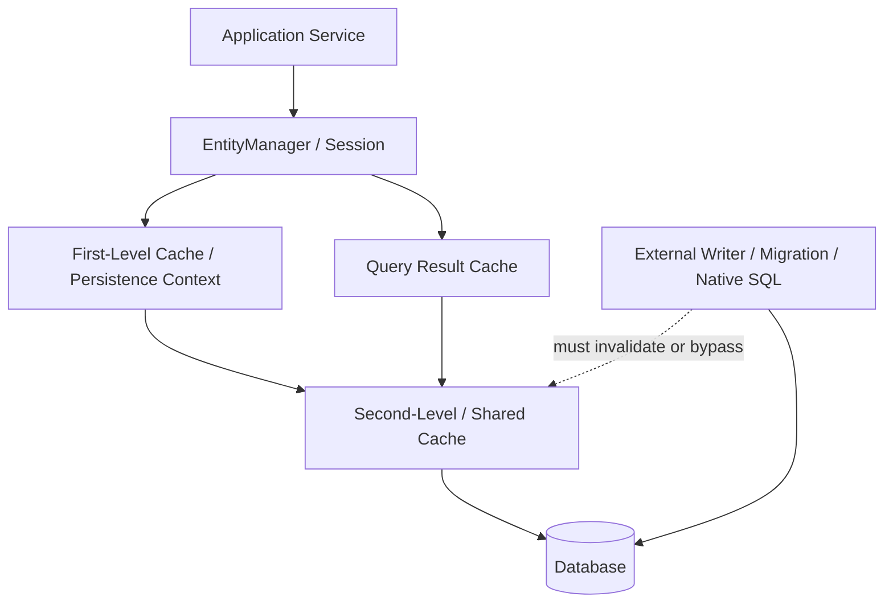
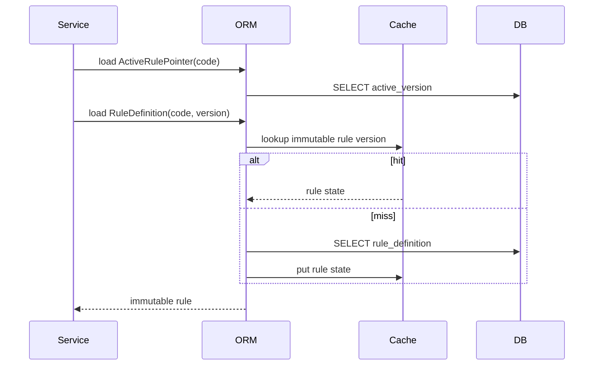

# Part 019 — Caching II: Production Cache Design and Tuning

> Goal: after this part, you should be able to design an ORM cache strategy that improves latency and throughput **without weakening correctness, tenant isolation, authorization semantics, or operational debuggability**.

Part 018 explained the correctness model of first-level cache, shared/second-level cache, and stale-read failure modes. This part goes deeper into production design: **what to cache, how to configure regions, how to choose consistency strategies, how to avoid cache-related incidents, and how to verify the cache under load**.

This is intentionally provider-level. We will not repeat generic caching theory or JPA basics. The focus is Hibernate ORM and EclipseLink behavior in enterprise systems.

---

## 1. Kaufman Skill Slice

Josh Kaufman's approach says: deconstruct the skill, learn just enough to self-correct, remove practice barriers, and run tight feedback loops. For ORM caching, the skill is not "turn on L2 cache". The skill is:

```txt
Given a domain model, workload, consistency requirement, deployment topology, and provider,
choose a cache policy that improves the target path while preserving invariants.
```

### 1.1 Subskills

| Subskill | What you must be able to do |
|---|---|
| Workload classification | Separate reference reads, hot mutable reads, transactional writes, reports, and bulk jobs. |
| Region design | Assign entities, collections, natural IDs, and query results to explicit cache regions. |
| Consistency reasoning | Know whether stale reads are tolerable, bounded, forbidden, or externally mitigated. |
| Provider semantics | Know how Hibernate and EclipseLink cache differently. |
| Invalidation reasoning | Predict what happens after ORM writes, native SQL, bulk JPQL, external writers, and migrations. |
| Cluster reasoning | Understand multi-node propagation delay, split brain, warmup, eviction, and rolling deploys. |
| Observability | Measure hit ratio, put count, eviction count, stale read symptoms, query count, and DB fallback. |
| Incident response | Disable, evict, bypass, or narrow cache use safely during production anomalies. |

### 1.2 Practice loop

For each cache candidate:

1. Write down the **business invariant**.
2. Write down the **mutation sources**.
3. Write down the **expected staleness tolerance**.
4. Choose provider setting and region strategy.
5. Write tests that prove:
   - first read loads from DB,
   - second read hits cache,
   - update invalidates/refreshes correctly,
   - external mutation is handled or explicitly unsupported,
   - bulk mutation does not leave managed/shared cache lying.
6. Load test before and after.
7. Keep or remove the cache based on measured effect.

---

## 2. Mental Model: ORM Cache Is a Derived Consistency Surface

A production ORM cache is not just a speed layer. It is a **derived state surface** that sits between application code and durable database truth.



The cache is safe only when every cached value has a defensible answer to these questions:

1. **Who can mutate the underlying row?**
2. **How will the cache know?**
3. **What happens if a stale value is served?**
4. **Does stale data violate business, security, tenant, regulatory, or financial invariants?**
5. **Can the cache be evicted without downtime?**
6. **Can the system operate correctly when the cache is cold or disabled?**

A cache that is required for correctness is usually a design smell. A cache may be required for throughput, but correctness must survive cache miss, cache restart, and cache eviction.

---

## 3. Cache Layer Taxonomy

| Layer | Scope | Main use | Main risk |
|---|---:|---|---|
| Persistence context / L1 | One `EntityManager` / `Session` | identity guarantee, write-behind, dirty checking | memory growth, stale object inside long transaction |
| Hibernate second-level cache | `SessionFactory` | reuse entity/collection state across sessions | stale values, invalid concurrency strategy, external writes |
| EclipseLink shared cache | `EntityManagerFactory` / session | shared object identity/cache across units of work | cache isolation errors, cluster coordination gaps |
| Query cache | query result identifiers / scalar results | avoid repeated query execution | invalidation complexity, parameter explosion |
| Natural ID cache | natural-key lookup | fast lookup by stable business key | mutable natural key bugs |
| External app cache | Redis/Memcached/etc. | aggregate/read-model acceleration | duplication, invalidation storm, authorization leakage |
| Database buffer cache | DB engine | page/index reuse | not application-controlled |

The top 1% engineer does not ask, "Should we enable cache?" They ask:

```txt
Which data, under which mutation model, in which region, with which consistency strategy,
for which measured bottleneck, with which rollback plan?
```

---

## 4. Candidate Classification

### 4.1 Best candidates

Cache candidates that usually work well:

| Candidate | Why it works |
|---|---|
| ISO country/currency/reference code tables | small, mostly immutable, globally reused |
| Product category metadata | read-heavy and infrequently changed |
| Regulatory rule definitions with versioning | immutable by version, safe to cache if effective-date is explicit |
| Tenant configuration snapshots | safe if region/key includes tenant and invalidation is explicit |
| Natural ID lookup for immutable keys | reduces repeated unique-key queries |
| Read-mostly lookup tables | measurable hit rate with low invalidation complexity |

### 4.2 Risky candidates

| Candidate | Why risky |
|---|---|
| Account balance | stale read may be financially wrong |
| Case status / enforcement status | stale read may route work incorrectly |
| Permissions / entitlement rows | stale read may expose data |
| Mutable workflow assignments | staleness creates operational errors |
| Large collections | collection cache invalidation and memory cost are often worse than query tuning |
| Query results with many parameter combinations | poor hit rate and high invalidation surface |
| Data updated by non-ORM writers | cache does not automatically know external writes |

### 4.3 Rule of thumb

```txt
Cache immutable-by-identity data first.
Cache read-mostly mutable data only after defining invalidation.
Do not cache high-value mutable state unless stale reads are explicitly acceptable.
```

---

## 5. Hibernate Second-Level Cache Design

Hibernate's second-level cache is tied to the `SessionFactory`. It stores entity state in a disassembled/dehydrated form, not as live managed entity instances. This distinction matters: loading from L2 still creates a managed entity instance in the current persistence context.

### 5.1 Important Hibernate cache settings

```properties
# Global second-level cache switch. Requires a RegionFactory/provider.
hibernate.cache.use_second_level_cache=true

# Query cache is intentionally separate and disabled by default.
hibernate.cache.use_query_cache=false

# Prefer explicit entity opt-in.
jakarta.persistence.sharedCache.mode=ENABLE_SELECTIVE

# Optional: group cache regions by deployment/application name.
hibernate.cache.region_prefix=case-platform-prod

# Optional: default strategy. Prefer per-entity @Cache instead.
hibernate.cache.default_cache_concurrency_strategy=read-write
```

Hibernate documentation recommends explicit cache mapping: entities are not part of the second-level cache unless shared cache mode and annotations/properties opt them in. Treat that as a design discipline, not merely a default.

### 5.2 Entity cache mapping

```java
@Entity
@Cacheable
@org.hibernate.annotations.Cache(
    usage = CacheConcurrencyStrategy.READ_ONLY,
    region = "reference.currency"
)
public class CurrencyCode {
    @Id
    private String code;

    private String displayName;

    private int numericCode;
}
```

Use explicit regions because production operations need surgical control:

```java
sessionFactory.getCache().evictEntityData(CurrencyCode.class);
sessionFactory.getCache().evictEntityData("reference.currency");
sessionFactory.getCache().evictAllRegions(); // last resort
```

### 5.3 Hibernate concurrency strategies

| Strategy | Best for | Risk profile |
|---|---|---|
| `READ_ONLY` | immutable reference data | safest and fastest; write attempts should be prevented by domain design |
| `READ_WRITE` | read-mostly data that can change | stronger consistency than nonstrict; more coordination overhead |
| `NONSTRICT_READ_WRITE` | rare writes where occasional stale reads are acceptable | stale reads possible; document business tolerance |
| `TRANSACTIONAL` | JTA / XA transactional cache setups | operationally heavier; provider-dependent |

Do not choose a strategy by vibe. Choose it by invariant.

```txt
If stale read breaks correctness -> READ_ONLY immutable or no L2 cache.
If stale read is tolerable for seconds/minutes -> NONSTRICT may be considered.
If mutable but important -> READ_WRITE, then test under concurrency.
If external writers exist -> usually no ORM cache unless explicit invalidation exists.
```

### 5.4 Entity inheritance caveat

Inheritance trees need consistent caching semantics. Even where subclass-level cacheability exists, a mixed cache strategy inside one hierarchy becomes hard to reason about. For enterprise systems, either cache the hierarchy as one conceptual policy or do not cache it.

### 5.5 Collection cache

Collection cache stores collection membership, not the complete object graph. For example, caching `Customer.orders` stores keys/collection state; entity rows still depend on entity cache or database loads.

```java
@OneToMany(mappedBy = "customer")
@org.hibernate.annotations.Cache(
    usage = CacheConcurrencyStrategy.READ_WRITE,
    region = "customer.orders"
)
private Set<Order> orders = new HashSet<>();
```

Collection cache is safe only when:

- collection size is bounded,
- membership changes are not high-frequency,
- both sides of bidirectional association are maintained correctly,
- eviction after external writes is handled,
- query alternative is worse.

Avoid caching large operational collections such as:

```txt
case.events
case.tasks
customer.transactions
account.ledgerEntries
user.notifications
```

Those are usually better represented as paginated queries, read models, or separate projections.

### 5.6 Natural ID cache

Natural ID cache helps when you repeatedly resolve stable business identifiers.

```java
@Entity
@Cacheable
@org.hibernate.annotations.Cache(
    usage = CacheConcurrencyStrategy.READ_WRITE,
    region = "customer.entity"
)
public class Customer {
    @Id
    private Long id;

    @NaturalId(mutable = false)
    private String customerNumber;
}
```

Good natural ID examples:

- ISO code
- immutable customer number
- immutable account number surrogate
- external system ID that never changes

Bad examples:

- email address if user can change it
- phone number
- username if rename is allowed
- legal name
- case title

Mutable natural IDs require much more care because cache entries must move from old key to new key.

---

## 6. Hibernate Query Cache Design

Hibernate query cache is often misunderstood. The query cache does not turn arbitrary queries into fully cached object graphs. It caches query result metadata such as identifiers/scalar result values, and entity loading still interacts with L2 cache or DB.

### 6.1 Enable deliberately

```properties
hibernate.cache.use_query_cache=true
```

Then opt in per query:

```java
List<CurrencyCode> currencies = entityManager
    .createQuery("select c from CurrencyCode c order by c.code", CurrencyCode.class)
    .setHint("org.hibernate.cacheable", true)
    .setHint("org.hibernate.cacheRegion", "query.reference.currency.all")
    .getResultList();
```

### 6.2 Query cache works best when

- result set is small or bounded,
- parameters have low cardinality,
- underlying tables change rarely,
- entities are also in L2 cache,
- result ordering is deterministic,
- invalidation frequency is low.

### 6.3 Query cache performs badly when

- every query uses unique parameters,
- result sets are huge,
- underlying tables change frequently,
- query depends on authorization/time/session state,
- pagination is deep and unstable,
- query shape changes frequently across deployments.

### 6.4 Query cache decision table

| Query | Cache? | Reason |
|---|---:|---|
| `select c from CurrencyCode c order by c.code` | yes | small, stable, global |
| `select r from Rule r where r.version = :v` | maybe | safe if rules immutable by version |
| `select t from Task t where t.assignee = :me and t.status = 'OPEN'` | usually no | user-specific and mutable |
| `select tx from Transaction tx where account = :id order by postedAt desc` | no | high mutation, large result, correctness-sensitive |
| dashboard count query | maybe | prefer materialized read model or metric table if high traffic |

---

## 7. EclipseLink Shared Cache Design

EclipseLink has a strong shared-cache model. Its shared cache is controlled by descriptors, annotations, and persistence properties. Compared with Hibernate, EclipseLink's terminology often emphasizes `Session`, `UnitOfWork`, descriptor cache, identity maps, and cache coordination.

### 7.1 Shared cache default

EclipseLink's `eclipselink.cache.shared` property controls whether an entity's cache is shared/non-isolated. The documented default is `true` for shared entity cache behavior unless configured otherwise. Therefore, with EclipseLink, a production review must explicitly decide what should **not** be shared.

```xml
<property name="eclipselink.cache.shared.default" value="false"/>
<property name="eclipselink.cache.shared.CurrencyCode" value="true"/>
```

This opt-in style is usually safer for regulated or tenant-sensitive systems.

### 7.2 EclipseLink `@Cache`

```java
@Entity
@Cacheable(true)
@org.eclipse.persistence.annotations.Cache(
    type = CacheType.FULL,
    size = 1000,
    expiry = 3600000
)
public class CurrencyCode {
    @Id
    private String code;
}
```

Important levers include:

- cache type / identity map behavior,
- size,
- expiry,
- isolation,
- coordination,
- invalidation policy.

### 7.3 Cache isolation

For high-sensitivity data, prefer isolation:

```xml
<property name="eclipselink.cache.shared.CaseAssignment" value="false"/>
<property name="eclipselink.cache.shared.UserPermission" value="false"/>
```

Use shared cache only where a stale value cannot break access, routing, financial, or regulatory correctness.

### 7.4 Cache coordination

In clusters, EclipseLink supports cache coordination properties such as:

```xml
<property name="eclipselink.cache.coordination" value="true"/>
<property name="eclipselink.cache.coordination.protocol" value="rmi"/>
<property name="eclipselink.cache.coordination.propagate-asynchronously" value="false"/>
```

The key question is not whether coordination exists. The key question is whether the propagation semantics are strong enough for the business invariant.

| Mode | Trade-off |
|---|---|
| asynchronous propagation | lower request latency, possible propagation delay |
| synchronous propagation | stronger post-commit visibility, higher latency/failure coupling |
| no coordination | safe only for immutable data or single-node deployments |

For most mutable business entities in multi-node systems, shared cache without coordination is a correctness risk.

---

## 8. Region Design

A cache region is an operational boundary. A good region name tells you what it contains and how safe it is to evict.

### 8.1 Naming convention

```txt
reference.currency
reference.country
regulatory.rule.v1
tenant.config
customer.natural-id
query.reference.currency.all
query.regulatory.rule.by-effective-date
```

Avoid vague region names:

```txt
entity
default
main
cache1
misc
```

### 8.2 Region design principles

1. **Separate immutable from mutable.**
2. **Separate high-cardinality from low-cardinality.**
3. **Separate tenant-sensitive data.**
4. **Separate query cache from entity cache.**
5. **Separate operationally risky regions.**
6. **Prefer many understandable regions over one giant default region.**

### 8.3 Example region plan

| Region | Contents | Strategy | Eviction impact |
|---|---|---|---|
| `reference.currency` | currency codes | read-only | low risk |
| `reference.country` | country codes | read-only | low risk |
| `regulatory.rule.versioned` | immutable rule version rows | read-only | medium; rules may reload |
| `tenant.config` | tenant config snapshot | read-write or no cache | tenant-specific risk |
| `customer.natural-id` | immutable customer number lookup | read-write | medium |
| `query.reference.currency.all` | all currency query result | query cache | low risk |
| `case.assignment` | current assignment | no cache | correctness-sensitive |
| `user.permission` | authorization rows | no cache or very explicit external cache | security-sensitive |

---

## 9. Consistency Patterns

### 9.1 Immutable-by-version pattern

Instead of caching mutable policy rows, version them.

```txt
RuleDefinition(id=123, code="KYC-RISK", version=7, effectiveFrom=2026-01-01, immutable=true)
```

Mutation creates a new row/version instead of updating the existing row. The cache can be `READ_ONLY` because row identity is immutable.

Good for:

- regulatory rules,
- pricing tables by version,
- validation policy snapshots,
- workflow definitions,
- risk scoring definitions.

### 9.2 Active pointer pattern

Use a small mutable pointer to select an immutable version.

```txt
RulePointer(code="KYC-RISK", activeVersion=7)  // mutable, maybe not cached
RuleDefinition(code="KYC-RISK", version=7)     // immutable, cached
```

This limits mutation to a tiny row while allowing heavy rule definitions to be cached safely.

### 9.3 Explicit eviction pattern

When a domain command mutates cached data, evict the affected region/key as part of the same application-level operation.

```java
@Transactional
public void changeTenantConfig(TenantId tenantId, TenantConfigCommand command) {
    TenantConfig config = repository.getForUpdate(tenantId);
    config.apply(command);

    entityManager.flush();

    entityManager
        .getEntityManagerFactory()
        .getCache()
        .evict(TenantConfig.class, tenantId.value());
}
```

Prefer targeted eviction over region-wide eviction, but do not be afraid of region eviction for reference data updates. Correctness beats a warm cache.

### 9.4 Cache bypass pattern

For correctness-critical reads, bypass shared cache.

```java
Map<String, Object> hints = Map.of(
    "jakarta.persistence.cache.retrieveMode", CacheRetrieveMode.BYPASS,
    "jakarta.persistence.cache.storeMode", CacheStoreMode.BYPASS
);

CaseAssignment assignment = entityManager.find(CaseAssignment.class, id, hints);
```

Use this for:

- permission checks,
- workflow locks,
- financial state,
- manual incident verification,
- post-bulk-mutation reconciliation.

---

## 10. Multi-Tenant Cache Safety

Caching and multi-tenancy are a dangerous combination if keys or regions do not encode tenant identity.

### 10.1 Tenant invariant

```txt
A cache lookup for tenant A must never return state created under tenant B.
```

This invariant must hold under:

- normal read,
- query cache,
- natural ID cache,
- collection cache,
- external cache,
- rolling deploy,
- tenant migration,
- region eviction,
- cache warmup.

### 10.2 Tenant-safe key design

Bad external cache key:

```txt
case:123
```

Good external cache key:

```txt
tenant:t-001:case:123
```

For ORM provider caches, verify provider behavior for multi-tenancy mode and cache key factory/region behavior. Do not assume tenant isolation without tests.

### 10.3 Test for leakage

```java
@Test
void secondLevelCacheMustNotLeakAcrossTenants() {
    TenantId a = TenantId.of("A");
    TenantId b = TenantId.of("B");

    createCase(a, 100L, "Case A");
    createCase(b, 100L, "Case B");

    CaseRecord caseA = withTenant(a, () -> findCase(100L));
    CaseRecord caseB = withTenant(b, () -> findCase(100L));

    assertThat(caseA.title()).isEqualTo("Case A");
    assertThat(caseB.title()).isEqualTo("Case B");
}
```

If your data model uses tenant discriminator columns instead of schema/database separation, test every cache mechanism more aggressively.

---

## 11. Authorization Boundary Safety

The ORM cache does not know your authorization policy unless you encode it in the query/model boundary. Caching entities that contain sensitive fields can expose stale or unauthorized data if later layers assume "already loaded means allowed".

### 11.1 Bad pattern

```java
CaseRecord record = entityManager.find(CaseRecord.class, id);
return mapper.toDto(record); // authorization check happens elsewhere or not at all
```

If the record is loaded from cache, you may miss expected database-level filters, row-level security, or current assignment checks.

### 11.2 Safer pattern

```java
CaseSummary summary = entityManager.createQuery("""
    select new com.acme.CaseSummary(c.id, c.referenceNo, c.status)
    from CaseRecord c
    join c.assignments a
    where c.id = :id
      and a.userId = :userId
      and a.active = true
""", CaseSummary.class)
.setParameter("id", id)
.setParameter("userId", currentUser.id())
.getSingleResult();
```

For access-controlled data, prefer query-level authorization, DTO projection, database row-level security, or a dedicated read model. Do not rely on entity cache to enforce security.

---

## 12. Bulk Mutation and Cache Invalidation

Bulk JPQL and native SQL bypass normal entity dirty checking and lifecycle events. They also create cache hazards.

### 12.1 Problem

```java
entityManager.createQuery("""
    update CaseRecord c
       set c.status = :closed
     where c.status = :pending
       and c.deadline < :now
""")
.setParameter("closed", CaseStatus.CLOSED)
.setParameter("pending", CaseStatus.PENDING)
.setParameter("now", clock.instant())
.executeUpdate();
```

This updates rows directly. Managed entities already loaded in the persistence context are not automatically rewritten to match the database result. Shared cache invalidation behavior may also require provider-specific handling.

### 12.2 Safe sequence

```java
@Transactional
public int closeExpiredCases(Instant now) {
    entityManager.flush();
    entityManager.clear();

    int updated = entityManager.createQuery("""
        update CaseRecord c
           set c.status = :closed,
               c.closedAt = :now
         where c.status = :pending
           and c.deadline < :now
    """)
    .setParameter("closed", CaseStatus.CLOSED)
    .setParameter("pending", CaseStatus.PENDING)
    .setParameter("now", now)
    .executeUpdate();

    entityManager.clear();
    entityManager.getEntityManagerFactory().getCache().evict(CaseRecord.class);

    return updated;
}
```

For Hibernate-specific systems, also consider evicting affected collection/query cache regions. For EclipseLink, explicitly invalidate/clear relevant shared cache descriptors when necessary.

### 12.3 Native SQL hazard

```java
entityManager.createNativeQuery("update case_record set status='CLOSED' where ...")
    .executeUpdate();
```

The provider may not know which entity/table regions are affected. Treat native SQL as a manual invalidation boundary.

---

## 13. Rolling Deploys and Cache Compatibility

A production cache survives longer than a single request. During rolling deployment, two app versions may read/write the same cache region.

### 13.1 Compatibility risks

| Change | Risk |
|---|---|
| add nullable column | usually safe |
| add non-null field with default | may be safe if cache value reconstruction handles it |
| rename field/column | old cache entries may fail or produce wrong state |
| change enum encoding | high risk |
| change custom type serialization | high risk |
| change entity inheritance shape | high risk |
| change tenant keying | critical risk |

### 13.2 Safe deployment pattern

1. Deploy schema backward-compatible change.
2. Deploy code that can read old and new shape.
3. Evict impacted regions.
4. Warm important regions if needed.
5. Deploy cleanup code later.

For high-risk mapping changes, include cache eviction as part of release runbook.

---

## 14. Warmup Strategy

A cold cache should degrade performance, not correctness.

### 14.1 Good warmup targets

- reference tables,
- rule definitions,
- tenant configuration,
- immutable metadata,
- small query result sets.

### 14.2 Bad warmup targets

- massive operational tables,
- user-specific dashboards,
- large collections,
- search result pages,
- high-cardinality query variants.

### 14.3 Warmup example

```java
@Component
class ReferenceCacheWarmup {
    @Transactional(readOnly = true)
    public void warmup() {
        entityManager.createQuery("select c from CurrencyCode c", CurrencyCode.class)
            .setHint("org.hibernate.cacheable", true)
            .getResultList();
    }
}
```

Warmup must be idempotent and safe to skip. Never make startup availability depend on preloading a remote cache unless you intentionally accept that coupling.

---

## 15. Observability

You cannot tune what you cannot observe.

### 15.1 Minimum metrics

| Metric | Why it matters |
|---|---|
| entity cache hit/miss/put count | basic effectiveness |
| collection cache hit/miss/put count | detects collection cache value or harm |
| query cache hit/miss/put count | detects parameter explosion |
| eviction count | instability or memory pressure |
| region size | capacity planning |
| DB query count per request | validates reduction |
| flush count | bulk/caching side effects |
| stale-read incident count | correctness signal |
| cache backend latency | remote cache can become bottleneck |

### 15.2 Hibernate statistics

```properties
hibernate.generate_statistics=true
```

Use in lower environments and selectively in production depending on overhead and platform. Expose via metrics, logs, or administrative endpoints.

```java
Statistics statistics = sessionFactory.getStatistics();
long hits = statistics.getSecondLevelCacheHitCount();
long misses = statistics.getSecondLevelCacheMissCount();
long puts = statistics.getSecondLevelCachePutCount();
```

A high hit ratio is not automatically good. A cache with 99% hit ratio on a cheap table may be useless. A cache with 40% hit ratio on a very expensive, safe query may be valuable.

### 15.3 EclipseLink logging/profiling

Use EclipseLink logging and session/profiler tooling to inspect SQL, cache hits, descriptor behavior, and UnitOfWork interactions. For production, route these signals to metrics rather than relying only on verbose logs.

---

## 16. Cache Tuning Methodology

### 16.1 Baseline first

Before caching, capture:

- endpoint p50/p95/p99 latency,
- SQL count,
- rows returned,
- DB CPU/IO,
- connection pool wait,
- object allocation,
- GC pressure,
- lock wait/deadlock events.

### 16.2 Change one variable

Do not enable entity cache, query cache, collection cache, and external Redis cache all at once. You will not know which one helped or broke correctness.

### 16.3 Benchmark scenarios

| Scenario | Purpose |
|---|---|
| cold cache | startup and failover behavior |
| warm cache | normal benefit |
| write-heavy | invalidation overhead |
| mixed read/write | realistic contention |
| bulk job during reads | stale/eviction behavior |
| rolling deploy | serialization/region compatibility |
| cache backend outage | fallback behavior |

### 16.4 Acceptance criteria

A cache change should have explicit acceptance criteria:

```txt
- p95 latency for GET /reference/rules improves by >= 30%
- DB query count reduced from 8 to <= 2
- no stale active-rule version after update command
- cache eviction runbook tested
- tenant isolation test passes with L2/query cache enabled
- service works when cache provider is unavailable, or failure mode is intentional
```

---

## 17. Common Production Failure Modes

### 17.1 Query cache memory blow-up

Cause:

```txt
Caching high-cardinality queries: userId + filters + time range + page number.
```

Symptom:

- poor hit ratio,
- high put count,
- cache evictions,
- memory pressure,
- no DB relief.

Fix:

- remove query cache,
- use read model/materialized view,
- cache only low-cardinality reference queries,
- add parameter normalization only if semantically valid.

### 17.2 Stale authorization

Cause:

```txt
Permission entity cached, permission revoked, user still sees old permission.
```

Fix:

- do not cache permissions, or
- use immediate explicit eviction, or
- use short-lived external authz decision cache with auditable invalidation, or
- force permission checks to hit current source of truth.

### 17.3 Bulk update leaves stale entity cache

Cause:

```txt
Bulk JPQL/native SQL updates rows behind ORM cache.
```

Fix:

- flush and clear persistence context,
- evict affected regions,
- avoid cached entities for bulk-mutated tables,
- use versioned immutable model.

### 17.4 Cluster node disagreement

Cause:

```txt
Node A updates cached entity; Node B serves old value due to missing/slow coordination.
```

Fix:

- enable coordination,
- use synchronous propagation if invariant requires,
- reduce cache to immutable data,
- externalize cache with suitable consistency guarantees,
- test propagation delay.

### 17.5 Collection cache lies after owning-side-only update

Cause:

```txt
Bidirectional association not maintained on both sides; cached inverse collection remains stale.
```

Fix:

- enforce helper methods,
- avoid collection cache,
- enable provider safeguards if appropriate,
- test association mutation SQL and cache eviction.

---

## 18. Decision Matrix

| Data type | Hibernate strategy | EclipseLink strategy | Notes |
|---|---|---|---|
| immutable reference | `@Cacheable` + `READ_ONLY` | shared cache enabled / read-only by convention | best candidate |
| versioned rule definition | `READ_ONLY` by version | shared cache with immutable version rows | active pointer may remain uncached |
| tenant config | `READ_WRITE` or no cache | shared only with explicit tenant-safe design | eviction mandatory after change |
| permissions | usually no cache | usually isolated/no shared cache | security correctness dominates |
| operational case status | usually no L2 | usually no shared cache | query/index/read model instead |
| large child collection | avoid collection cache | avoid shared collection-style assumptions | paginate |
| natural immutable lookup | natural-id cache | descriptor/shared cache lookup strategy | test mutation assumptions |
| dashboard query | usually no query cache | prefer read model | high cardinality risk |

---

## 19. Production Runbook

### 19.1 Before enabling

```txt
[ ] Candidate data is classified.
[ ] Mutation sources are listed.
[ ] Staleness tolerance is documented.
[ ] Region names are explicit.
[ ] Tenant and authorization safety reviewed.
[ ] Bulk/native writers are accounted for.
[ ] Cache metrics are visible.
[ ] Eviction endpoint/tool exists.
[ ] Rolling deploy behavior tested.
[ ] Cache-disabled fallback tested.
```

### 19.2 During incident

```txt
1. Identify region and entity/query involved.
2. Bypass cache for verification read.
3. Compare DB truth vs cached result.
4. Evict targeted entity/region.
5. Disable query cache or region if incident repeats.
6. Check recent bulk/native operations and deployments.
7. Add regression test for the exact stale path.
```

### 19.3 Emergency Hibernate eviction

```java
SessionFactory sf = entityManagerFactory.unwrap(SessionFactory.class);
sf.getCache().evictEntityData(CaseRecord.class);
sf.getCache().evictCollectionData(CaseRecord.class.getName() + ".tasks");
sf.getCache().evictQueryRegions();
```

### 19.4 Emergency Jakarta Persistence eviction

```java
Cache cache = entityManagerFactory.getCache();
cache.evict(CaseRecord.class);
cache.evictAll(); // last resort
```

---

## 20. Design Review Checklist

Use this in architecture review.

```txt
1. What exact latency/throughput problem is this cache solving?
2. Why database indexing/query tuning is insufficient or less appropriate?
3. Which entity/query/collection regions are enabled?
4. Are cached entities immutable, read-mostly, or mutable?
5. What is the stale-read consequence?
6. Are there external writers, native SQL, ETL jobs, or migrations?
7. What invalidates cache after those writes?
8. Does tenant ID participate in cache isolation?
9. Does authorization depend on cached state?
10. How is cache warmed?
11. How is cache evicted?
12. What metrics prove cache is valuable?
13. What tests prove cache is correct?
14. Can the system survive cache outage or cold start?
15. How does rolling deployment handle cache schema/serialization changes?
```

---

## 21. Mini Case Study: Regulatory Rule Cache

### 21.1 Bad model

```java
@Entity
public class RuleDefinition {
    @Id Long id;
    String code;
    String expression;
    boolean active;
}
```

Problem: updating `expression` changes the meaning of an already-used rule. Caching this row can make two nodes apply different logic during propagation delay.

### 21.2 Better model

```java
@Entity
@Cacheable
@org.hibernate.annotations.Cache(
    usage = CacheConcurrencyStrategy.READ_ONLY,
    region = "regulatory.rule.definition"
)
public class RuleDefinition {
    @EmbeddedId RuleVersionId id;
    String expression;
    Instant effectiveFrom;
    Instant effectiveTo;
}

@Entity
public class ActiveRulePointer {
    @Id String ruleCode;
    int activeVersion;
}
```

Now `RuleDefinition` is immutable and safely cacheable. `ActiveRulePointer` is small and can remain uncached or be evicted explicitly on change.

### 21.3 Runtime flow



This is the kind of design that makes ORM caching safe: mutable selection is separated from immutable payload.

---

## 22. Summary

Production ORM cache design is not about maximum hit ratio. It is about **controlled reuse of database state under explicit invariants**.

Key conclusions:

- Prefer opt-in caching.
- Cache immutable/versioned data first.
- Treat query cache as a specialized tool, not a default optimization.
- Avoid caching permissions, operational status, large collections, and high-cardinality queries unless there is a strong, tested reason.
- Explicitly design regions, invalidation, tenant safety, and observability.
- Bulk/native writes are cache boundaries.
- Cache changes require performance tests and correctness tests.
- A cache that cannot be evicted safely is not production-ready.

---

## 23. Practice Tasks

1. Pick five entities from your current system and classify each as:
   - immutable,
   - read-mostly,
   - mutable correctness-sensitive,
   - security-sensitive,
   - large/operational.
2. Propose cache strategy for each.
3. Write one stale-read failure scenario for each cached candidate.
4. Write a targeted eviction runbook.
5. Enable provider metrics and prove whether the cache improves p95 latency.
6. Add a test proving tenant isolation with cache enabled.
7. Add a test proving bulk update does not leave stale results visible.

---

## 24. References

- Hibernate ORM User Guide 7.4.x — Caching and batch-processing sections.
- Jakarta Persistence 3.2 Specification — shared cache, cache retrieve/store modes, bulk update/delete semantics.
- EclipseLink documentation — JPA extensions, shared cache, cache coordination, descriptor cache behavior.
