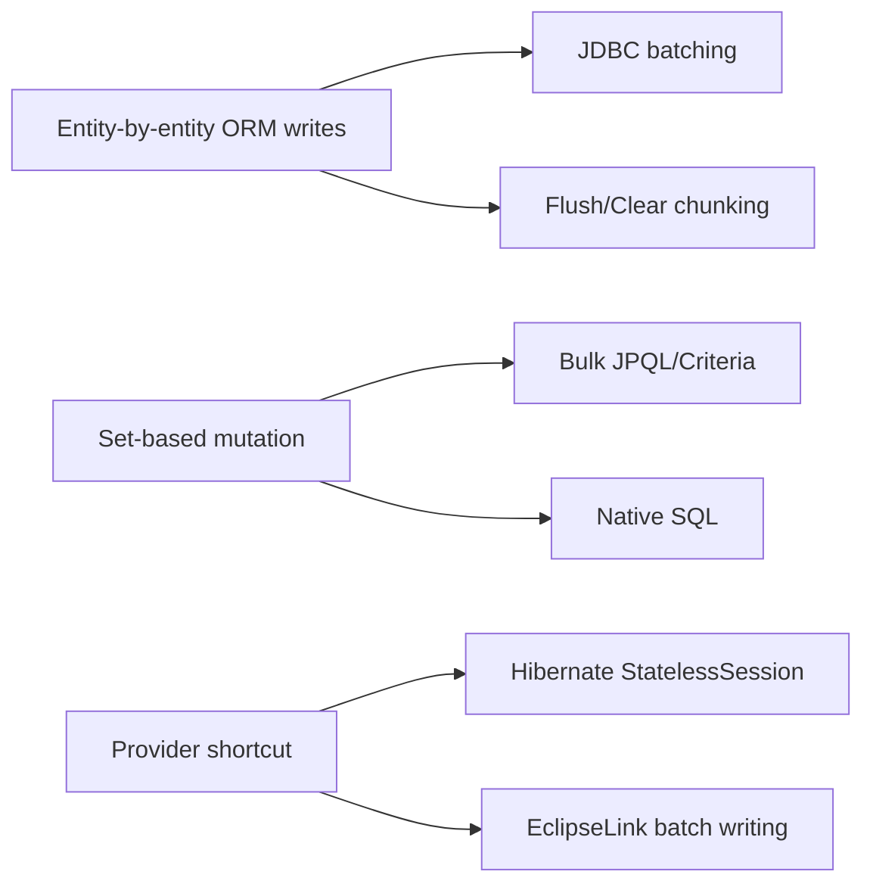
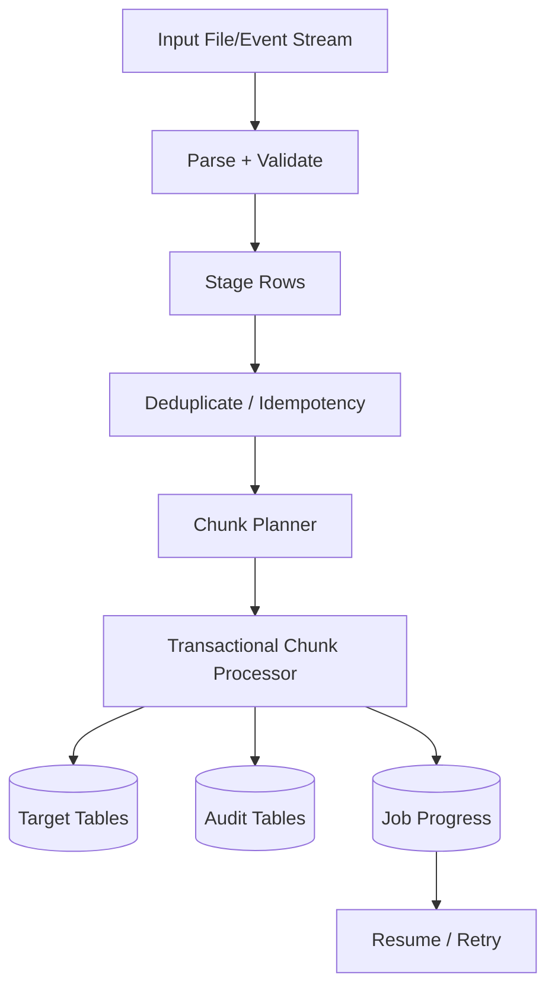
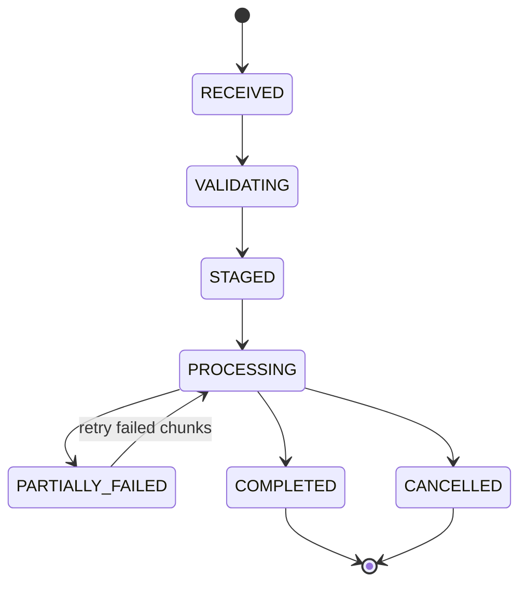

# Part 020 — Batching, Bulk Operations, and High-Volume Write Paths

> Goal: after this part, you should be able to design high-volume ORM write paths without accidentally creating memory pressure, broken optimistic locking, stale persistence contexts, deadlocks, poor batch utilization, or unbounded transaction risk.

This part covers three different mechanisms that are often mixed up:

1. **JDBC batching through ORM** — many entity operations become fewer database round trips.
2. **Flush/clear chunking** — keep persistence context size bounded during large work.
3. **Bulk operations** — direct set-based update/delete that bypass normal entity lifecycle semantics.

These are not interchangeable.

---

## 1. Kaufman Skill Slice

The target skill is:

```txt
Given a high-volume write workload, choose the write mechanism that minimizes round trips,
keeps memory bounded, preserves required invariants, and makes failure/retry behavior explicit.
```

### 1.1 Subskills

| Subskill | What you must be able to do |
|---|---|
| Workload classification | Distinguish insert stream, update stream, reconciliation, migration, archival, and cleanup. |
| Batch shape reasoning | Know when SQL statements can be batched and when they cannot. |
| Persistence context control | Use flush/clear/detach/chunking intentionally. |
| Identifier strategy reasoning | Know why identity generation can prevent insert batching. |
| Bulk semantics | Know what lifecycle, optimistic locking, persistence context sync, and cache behavior are bypassed. |
| Failure recovery | Design idempotent chunks and resume markers. |
| Lock/deadlock control | Order writes and keep transactions bounded. |
| Provider tuning | Use Hibernate batching/stateless session and EclipseLink batch writing appropriately. |

---

## 2. Three Write Paths



### 2.1 Entity writes

Use entity writes when you need:

- entity lifecycle callbacks,
- cascades,
- dirty checking,
- optimistic locking,
- domain invariants in aggregate methods,
- provider-managed relationships,
- audit listeners,
- per-row validation.

### 2.2 Bulk writes

Use bulk writes when you need:

- set-based update/delete,
- very large row counts,
- simple predicate-based change,
- no per-row domain logic,
- explicit manual version/cache handling.

### 2.3 Native writes

Use native SQL when you need:

- database-specific features,
- `MERGE` / `UPSERT`,
- window functions in mutation logic,
- partition operations,
- temporary tables,
- vendor-specific bulk loading.

The deeper rule:

```txt
Entity writes preserve ORM semantics.
Bulk/native writes preserve database efficiency.
You must choose which semantic surface matters for the use case.
```

---

## 3. JDBC Batching with Hibernate

Hibernate can batch SQL statements that share the same prepared-statement shape. Batching reduces network round trips between application and database.

### 3.1 Basic configuration

```properties
hibernate.jdbc.batch_size=50
hibernate.order_inserts=true
hibernate.order_updates=true
hibernate.jdbc.batch_versioned_data=true
```

Recommended starting batch sizes are usually in the `10..50` range, then benchmark. Larger is not automatically better: the database driver, transaction log, lock duration, memory, and flush size matter.

### 3.2 Per-session batch size

```java
Session session = entityManager.unwrap(Session.class);
session.setJdbcBatchSize(25);
```

This is useful when one job needs a different batch profile from normal request traffic.

### 3.3 What can batch?

Good batching shape:

```sql
insert into case_event (case_id, event_type, created_at, id) values (?, ?, ?, ?)
insert into case_event (case_id, event_type, created_at, id) values (?, ?, ?, ?)
insert into case_event (case_id, event_type, created_at, id) values (?, ?, ?, ?)
```

Poor batching shape:

```sql
insert into case_record (...) values (...)
insert into case_event (...) values (...)
update case_record set ... where id=?
insert into case_party (...) values (...)
```

The more statement shapes are interleaved, the less effective batching becomes. `hibernate.order_inserts` and `hibernate.order_updates` can improve grouping, but ordering has CPU and possible lock-order implications. Benchmark and deadlock-test.

---

## 4. Identifier Generation and Batching

Identifier strategy determines whether Hibernate can batch inserts effectively.

### 4.1 Identity generation problem

With identity columns, the database generates the ID during insert. ORM often needs the generated ID immediately to maintain entity identity and relationships. Hibernate documentation states that insert batching is disabled transparently at JDBC level when using an identity identifier generator.

```java
@Id
@GeneratedValue(strategy = GenerationType.IDENTITY)
private Long id;
```

This is simple but bad for high-volume insert batching.

### 4.2 Sequence strategy

Sequence-based IDs can be allocated before insert, so insert statements can batch.

```java
@Id
@GeneratedValue(strategy = GenerationType.SEQUENCE, generator = "case_event_seq")
@SequenceGenerator(
    name = "case_event_seq",
    sequenceName = "case_event_seq",
    allocationSize = 50
)
private Long id;
```

### 4.3 Pooled allocation

`allocationSize` reduces sequence round trips by allocating blocks of IDs. Align it with expected batch size and database sequence increment strategy.

```txt
batch_size = 50
allocationSize = 50 or 100
```

Do not blindly set `allocationSize=1` in high-volume systems unless you accept sequence round-trip overhead.

### 4.4 UUID trade-off

UUIDs allow ID assignment before insert and can batch, but random UUIDs may hurt index locality. Time-ordered UUID variants can improve write locality where supported by your platform and database design.

---

## 5. Persistence Context Memory Pressure

The classic ORM batch failure is not SQL speed. It is persistence context growth.

```java
@Transactional
public void importEvents(List<EventDto> events) {
    for (EventDto dto : events) {
        entityManager.persist(mapper.toEntity(dto));
    }
}
```

If `events` has 500,000 rows, the persistence context may hold hundreds of thousands of managed entities and snapshots until transaction end.

### 5.1 Chunked flush/clear

```java
@Transactional
public void importEvents(Stream<EventDto> stream) {
    final int chunkSize = 50;
    AtomicInteger counter = new AtomicInteger();

    stream.forEach(dto -> {
        entityManager.persist(mapper.toEntity(dto));

        if (counter.incrementAndGet() % chunkSize == 0) {
            entityManager.flush();
            entityManager.clear();
        }
    });
}
```

`flush()` sends pending SQL. `clear()` detaches managed entities and releases persistence-context memory.

### 5.2 Chunk transaction vs one giant transaction

The previous example still uses one transaction if the method is one `@Transactional` boundary. For very large imports, prefer separate transactions per chunk.

```java
public void importFile(Path file) {
    for (List<EventDto> chunk : readChunks(file, 500)) {
        transactionTemplate.executeWithoutResult(tx -> importChunk(chunk));
    }
}

void importChunk(List<EventDto> chunk) {
    for (EventDto dto : chunk) {
        entityManager.persist(mapper.toEntity(dto));
    }
    entityManager.flush();
    entityManager.clear();
}
```

Benefits:

- bounded lock duration,
- bounded rollback size,
- easier retry,
- lower transaction log pressure,
- lower connection hold time.

Trade-off:

- partial progress is possible,
- idempotency and resume markers are required,
- cross-chunk invariants need separate design.

---

## 6. Designing Idempotent Chunks

High-volume jobs fail. Production design must assume:

- process crash,
- database deadlock,
- timeout,
- duplicate input,
- partial commit,
- downstream outage,
- operator cancellation.

### 6.1 Idempotency key

```java
@Entity
@Table(
    name = "imported_event",
    uniqueConstraints = @UniqueConstraint(name = "uk_import_source_row", columnNames = {"source_file", "row_no"})
)
public class ImportedEvent {
    @Id
    @GeneratedValue(strategy = GenerationType.SEQUENCE)
    private Long id;

    private String sourceFile;
    private long rowNo;
}
```

This makes re-processing safe: duplicate rows violate a known unique key and can be skipped or reconciled.

### 6.2 Resume marker

```txt
import_job(id, file_name, status, last_committed_row, started_at, finished_at)
```

Do not rely only on logs. The database should contain enough state to resume or explain job progress.

### 6.3 Chunk invariant

A chunk should be:

```txt
small enough to retry cheaply,
large enough to amortize overhead,
ordered enough to avoid deadlocks,
idempotent enough to survive replay.
```

---

## 7. Update Batching

Update batching requires repeated updates with same statement shape.

```java
@Transactional
public void expireCases(List<Long> ids, Instant now) {
    int i = 0;
    for (Long id : ids) {
        CaseRecord c = entityManager.find(CaseRecord.class, id);
        c.expire(now);

        if (++i % 50 == 0) {
            entityManager.flush();
            entityManager.clear();
        }
    }
}
```

This preserves entity logic and optimistic locking but still uses row-by-row entity loading.

### 7.1 When this is appropriate

- aggregate method must run,
- validation per row matters,
- lifecycle/audit callbacks matter,
- optimistic lock conflict must be detected per row,
- only a moderate number of rows are touched.

### 7.2 When it is not appropriate

- millions of rows,
- simple set-based status change,
- no need to load entity state,
- job can be represented as SQL predicate,
- optimistic version handling is manual and understood.

---

## 8. Bulk JPQL Update/Delete

Bulk JPQL maps directly to database update/delete operations. This is efficient but bypasses normal managed-entity synchronization.

### 8.1 Bulk update example

```java
@Transactional
public int closeExpiredCases(Instant now) {
    entityManager.flush();
    entityManager.clear();

    int count = entityManager.createQuery("""
        update CaseRecord c
           set c.status = :closed,
               c.closedAt = :now,
               c.version = c.version + 1
         where c.status = :pending
           and c.deadline < :now
    """)
    .setParameter("closed", CaseStatus.CLOSED)
    .setParameter("pending", CaseStatus.PENDING)
    .setParameter("now", now)
    .executeUpdate();

    entityManager.clear();
    entityManager.getEntityManagerFactory().getCache().evict(CaseRecord.class);

    return count;
}
```

Notice the manual version increment. Jakarta Persistence states that bulk updates bypass optimistic locking checks; portable applications must manually update/validate version columns if desired.

### 8.2 Bulk delete example

```java
@Transactional
public int purgeOldOutboxRows(Instant before) {
    entityManager.flush();
    entityManager.clear();

    int deleted = entityManager.createQuery("""
        delete from OutboxMessage m
         where m.status = :published
           and m.publishedAt < :before
    """)
    .setParameter("published", OutboxStatus.PUBLISHED)
    .setParameter("before", before)
    .executeUpdate();

    entityManager.clear();
    entityManager.getEntityManagerFactory().getCache().evict(OutboxMessage.class);

    return deleted;
}
```

### 8.3 Bulk operation checklist

```txt
[ ] Flush pending entity changes before bulk operation.
[ ] Clear persistence context before bulk operation if stale managed entities exist.
[ ] Manually handle version column if optimistic semantics matter.
[ ] Evict affected entity/collection/query cache regions.
[ ] Do not expect entity callbacks/listeners to run per row.
[ ] Do not expect cascades/orphan removal to execute per row.
[ ] Verify row count and audit requirement.
[ ] Prefer running in dedicated transaction.
```

---

## 9. CriteriaUpdate and CriteriaDelete

Criteria bulk operations are useful when predicates are dynamic but still set-based.

```java
CriteriaBuilder cb = entityManager.getCriteriaBuilder();
CriteriaUpdate<CaseRecord> update = cb.createCriteriaUpdate(CaseRecord.class);
Root<CaseRecord> root = update.from(CaseRecord.class);

update.set(root.get("status"), CaseStatus.CLOSED);
update.set(root.get("closedAt"), now);
update.where(
    cb.equal(root.get("status"), CaseStatus.PENDING),
    cb.lessThan(root.get("deadline"), now)
);

int updated = entityManager.createQuery(update).executeUpdate();
```

Same semantics apply:

- direct database operation,
- no synchronized persistence context,
- no automatic optimistic checks,
- manual cache handling required.

---

## 10. Native SQL for High-Volume Paths

Native SQL is appropriate when ORM query language cannot express the best database algorithm.

### 10.1 Upsert example

PostgreSQL-style:

```java
entityManager.createNativeQuery("""
    insert into case_counter(case_id, event_count, updated_at)
    values (:caseId, :delta, :now)
    on conflict (case_id)
    do update set
        event_count = case_counter.event_count + excluded.event_count,
        updated_at = excluded.updated_at
""")
.setParameter("caseId", caseId)
.setParameter("delta", delta)
.setParameter("now", now)
.executeUpdate();
```

This is not portable JPQL, but it may be the correct production solution.

### 10.2 Temporary table pattern

```txt
1. Load IDs into temporary/staging table.
2. Run set-based update joining target table to staging table.
3. Insert audit rows from staging table + affected rows.
4. Clear/evict ORM persistence context/cache.
5. Mark job chunk committed.
```

This pattern is often better than loading millions of entities.

### 10.3 Native SQL rule

```txt
The more native SQL you use, the more explicit your cache, version, audit, and portability obligations become.
```

---

## 11. Hibernate StatelessSession

`StatelessSession` is a Hibernate-specific tool for command-style, high-volume work. It does not use a normal first-level persistence context and does not perform automatic dirty checking like a stateful `Session`.

### 11.1 Use case

```java
try (StatelessSession session = sessionFactory.openStatelessSession()) {
    Transaction tx = session.beginTransaction();

    for (ImportedEvent event : events) {
        session.insert(event);
    }

    tx.commit();
}
```

### 11.2 Semantics

`StatelessSession` operations act closer to direct row operations:

- no persistence context identity map,
- no automatic dirty checking,
- no write-behind in the same sense as stateful session,
- entities returned by queries are immediately detached,
- fewer memory costs,
- less ORM lifecycle behavior.

This is useful only when you understand what you are giving up.

### 11.3 Good candidates

- ETL import rows,
- append-only event tables,
- bulk archival writes,
- generated snapshot rows,
- controlled migration jobs.

### 11.4 Bad candidates

- rich aggregates with cascades,
- logic-heavy lifecycle callbacks,
- authorization-sensitive mutation,
- workflows requiring managed identity semantics,
- updates requiring fine-grained dirty checking.

---

## 12. EclipseLink Batch Writing

EclipseLink supports JDBC batch writing through provider properties.

```xml
<property name="eclipselink.jdbc.batch-writing" value="JDBC"/>
<property name="eclipselink.jdbc.batch-writing.size" value="100"/>
```

EclipseLink also documents database/driver limitations: not all JDBC drivers or databases support batch writing equally.

### 12.1 Batch-writing modes

Depending on platform/provider configuration, EclipseLink may support modes such as JDBC/parameterized or platform-specific batch writing. Choose based on your database and driver.

### 12.2 Operational discipline

The same principles apply:

- benchmark driver behavior,
- keep transaction size bounded,
- clear UnitOfWork/persistence context appropriately,
- watch lock duration,
- handle cache invalidation after bulk/native operations,
- verify generated SQL and batch behavior.

---

## 13. Ordering and Deadlocks

Batching increases throughput, but also changes lock acquisition patterns.

### 13.1 Deadlock example

Transaction A:

```txt
update account set ... where id = 1
update account set ... where id = 2
```

Transaction B:

```txt
update account set ... where id = 2
update account set ... where id = 1
```

Deadlock risk is high.

### 13.2 Stable ordering

Always process IDs in stable order when possible:

```java
List<Long> orderedIds = ids.stream()
    .sorted()
    .toList();
```

Batch and bulk jobs should define order explicitly. Random input order from files, queues, maps, or parallel streams is a common deadlock source.

### 13.3 Hibernate ordered updates

`hibernate.order_updates=true` can improve batching and reduce deadlocks by ordering updates by entity type and identifier. But this has overhead and may change lock timing. Benchmark with realistic concurrency.

---

## 14. Parallelism

More threads do not automatically mean faster writes.

### 14.1 Bottlenecks

High-volume write bottlenecks may be:

- database transaction log,
- index maintenance,
- FK checks,
- lock contention,
- connection pool,
- CPU in entity mapping,
- JVM allocation/GC,
- network round trips,
- cache invalidation overhead.

### 14.2 Partitioned parallelism

Safe parallelism requires partitioning by a key that avoids overlapping locks.

Good partition keys:

- tenant ID,
- account shard,
- case ID range,
- hash bucket,
- date partition.

Bad partitioning:

```txt
Thread 1 processes random rows.
Thread 2 processes random rows.
Thread 3 processes random rows.
```

### 14.3 Connection pool math

If your pool has 20 connections and a batch job uses 16, online traffic may starve. Jobs need admission control.

```txt
maxPoolSize = 30
reservedForOnlineTraffic = 20
maxBatchJobConnections = 5..8
```

Do not let batch jobs consume the entire transactional capacity of the service.

---

## 15. Audit and Lifecycle Semantics

### 15.1 Entity writes preserve callbacks

```java
@PreUpdate
void auditUpdate() {
    this.updatedAt = Instant.now();
}
```

Entity updates invoke provider lifecycle behavior. Bulk JPQL/native SQL does not invoke this per row.

### 15.2 Bulk audit strategy

If bulk operation must be audited, write audit rows explicitly.

```java
entityManager.createNativeQuery("""
    insert into case_audit(case_id, action, created_at)
    select c.id, 'AUTO_CLOSED', :now
      from case_record c
     where c.status = 'PENDING'
       and c.deadline < :now
""")
.setParameter("now", now)
.executeUpdate();

entityManager.createNativeQuery("""
    update case_record
       set status = 'CLOSED', closed_at = :now, version = version + 1
     where status = 'PENDING'
       and deadline < :now
""")
.setParameter("now", now)
.executeUpdate();
```

Order matters: if the update changes the predicate, insert audit rows first or use a staging table.

---

## 16. High-Volume Insert Patterns

### 16.1 Entity insert with batching

Use when you need ORM lifecycle and relationships.

```java
for (int i = 0; i < rows.size(); i++) {
    entityManager.persist(toEntity(rows.get(i)));
    if (i % batchSize == 0) {
        entityManager.flush();
        entityManager.clear();
    }
}
```

### 16.2 Stateless insert

Use when rows are simple and lifecycle semantics are not needed.

```java
try (StatelessSession ss = sessionFactory.openStatelessSession()) {
    Transaction tx = ss.beginTransaction();
    for (EventSnapshot row : rows) {
        ss.insert(row);
    }
    tx.commit();
}
```

### 16.3 Native bulk load

Use when the database provides a better loader.

Examples:

- PostgreSQL `COPY`,
- SQL Server bulk copy,
- Oracle SQL*Loader/external tables,
- MySQL `LOAD DATA`,
- staging table + `insert into select`.

ORM is not always the correct ingestion tool.

---

## 17. High-Volume Update Patterns

### 17.1 Entity update

Use when per-row logic matters.

```java
CaseRecord c = entityManager.find(CaseRecord.class, id, LockModeType.OPTIMISTIC);
c.close(command);
```

### 17.2 Bulk JPQL update

Use when predicate is simple and business rule is set-based.

```java
update CaseRecord c
   set c.status = :closed,
       c.version = c.version + 1
 where c.status = :pending
   and c.deadline < :now
```

### 17.3 Native update with staging

Use when update depends on many input rows.

```sql
update case_record c
   set status = s.new_status,
       version = c.version + 1
  from staging_case_status s
 where c.id = s.case_id
```

---

## 18. High-Volume Delete and Archival Patterns

### 18.1 Avoid deleting huge sets in one transaction

```sql
delete from outbox_message where published_at < ?
```

For millions of rows, this can create lock/log pressure. Prefer chunking by ID or partition.

### 18.2 Chunked delete

```java
while (true) {
    List<Long> ids = entityManager.createQuery("""
        select m.id
          from OutboxMessage m
         where m.status = :published
           and m.publishedAt < :before
         order by m.id
    """, Long.class)
    .setParameter("published", OutboxStatus.PUBLISHED)
    .setParameter("before", before)
    .setMaxResults(1000)
    .getResultList();

    if (ids.isEmpty()) break;

    transactionTemplate.executeWithoutResult(tx -> {
        entityManager.createQuery("""
            delete from OutboxMessage m
             where m.id in :ids
        """)
        .setParameter("ids", ids)
        .executeUpdate();
    });
}
```

### 18.3 Partition drop/archive

For very large time-series data, database partitioning is often better than ORM deletes.

```txt
1. Partition outbox/events by month.
2. Stop writes to old partition.
3. Archive partition.
4. Drop/detach partition.
```

---

## 19. Persistence Context Synchronization Rules

### 19.1 Before bulk

Flush and clear when pending managed changes could conflict with bulk operation.

```java
entityManager.flush();
entityManager.clear();
```

### 19.2 After bulk

Clear again because the persistence context may contain stale entities.

```java
entityManager.clear();
```

### 19.3 Cache eviction

Evict affected entity and query cache regions.

```java
entityManager.getEntityManagerFactory().getCache().evict(CaseRecord.class);
```

For Hibernate:

```java
SessionFactory sf = entityManagerFactory.unwrap(SessionFactory.class);
sf.getCache().evictEntityData(CaseRecord.class);
sf.getCache().evictQueryRegions();
```

For EclipseLink, use provider APIs or descriptor/session invalidation patterns where shared cache is enabled.

---

## 20. Import/Reconciliation Architecture

A production-grade import job should not be a single repository method with a loop.



### 20.1 Recommended tables

```txt
import_job
import_job_chunk
import_stage_row
import_error
import_audit
```

### 20.2 Job states



### 20.3 Why staging helps

- separates parsing from mutation,
- supports validation reports,
- enables set-based SQL,
- improves idempotency,
- makes retries auditable,
- avoids loading entire file into persistence context.

---

## 21. Reconciliation Pattern

Reconciliation is not the same as import. It compares expected state with actual state and repairs deltas.

### 21.1 Flow

```txt
1. Snapshot external state into staging table.
2. Compare staging vs internal tables using SQL joins.
3. Generate delta rows.
4. Apply deltas in ordered chunks.
5. Write audit/reconciliation report.
6. Evict affected cache regions.
```

### 21.2 Avoid entity-by-entity compare

Bad:

```java
for (ExternalCase ext : externalCases) {
    CaseRecord local = repository.findByExternalId(ext.id());
    compareAndUpdate(local, ext);
}
```

This creates N queries and large persistence-context pressure.

Better:

```sql
insert into case_delta(case_id, old_status, new_status)
select c.id, c.status, s.status
  from case_record c
  join staging_case s on s.external_id = c.external_id
 where c.status <> s.status
```

Then process deltas using either bulk update or controlled entity updates if domain logic is required.

---

## 22. Observability for Write Paths

### 22.1 Metrics

| Metric | Why |
|---|---|
| rows processed/sec | throughput |
| chunk duration | transaction sizing |
| flush duration | ORM pressure |
| batch execution count | batching effectiveness |
| SQL statement count | detects disabled batching |
| persistence context size proxy | memory risk |
| deadlock/retry count | lock ordering risk |
| DB log write rate | transaction log bottleneck |
| connection wait time | pool starvation |
| GC allocation rate | entity hydration/mapping pressure |
| failed row count | data quality |

### 22.2 Logs

For each job/chunk log:

```txt
jobId
chunkId
rowStart
rowEnd
attempt
rowsInserted
rowsUpdated
rowsSkipped
rowsFailed
durationMs
flushMs
commitMs
retryReason
```

Do not log every row on success. Log aggregate metrics and error samples.

---

## 23. Testing High-Volume ORM Paths

### 23.1 Test categories

| Test | Purpose |
|---|---|
| SQL count test | prove batching/query shape |
| memory test | detect persistence context growth |
| retry test | prove idempotency |
| deadlock simulation | validate ordering/retry |
| optimistic lock test | verify entity vs bulk semantics |
| cache stale test | ensure eviction after bulk/native writes |
| partial failure test | prove resume marker correctness |
| production-size test | uncover driver/database behavior |

### 23.2 Avoid H2 false confidence

Batching, identity generation, sequence allocation, lock behavior, query plans, and native SQL differ significantly across databases. Use Testcontainers or a real integration database matching production.

### 23.3 Example: detect disabled batching

```java
Statistics stats = sessionFactory.getStatistics();
stats.clear();

importEvents(1000);

long prepared = stats.getPrepareStatementCount();
assertThat(prepared).isLessThan(1000);
```

This is not perfect, but it catches obvious regressions where batching silently disappears.

---

## 24. Provider Comparison

| Concern | Hibernate | EclipseLink |
|---|---|---|
| JDBC batching switch | `hibernate.jdbc.batch_size` | `eclipselink.jdbc.batch-writing`, size property |
| Insert batching and identity | identity generator disables Hibernate insert batching | database/driver/provider behavior must be tested |
| Per-session batch size | supported through Hibernate `Session` | provider/session configuration approach |
| Stateless row operations | `StatelessSession` | use EclipseLink batch writing/native/session APIs depending case |
| Bulk JPQL | supported | supported |
| Criteria bulk | supported via Jakarta Persistence | supported via Jakarta Persistence |
| Persistence context sync after bulk | not synchronized by spec | not synchronized by spec |
| Cache after bulk/native | manual/provider-aware eviction | manual/provider-aware invalidation |
| Best diagnostic | Hibernate statistics + SQL logs | EclipseLink logging/profiling/session monitoring |

---

## 25. Anti-Patterns

### 25.1 One giant transaction

```txt
Import 5 million rows in one @Transactional method.
```

Failure modes:

- memory pressure,
- connection starvation,
- huge rollback,
- transaction log growth,
- lock duration,
- timeout.

### 25.2 Identity IDs for high-volume inserts

```java
@GeneratedValue(strategy = GenerationType.IDENTITY)
```

Simple but often prevents insert batching in Hibernate. Prefer sequence/pooled IDs for high-throughput insert paths when database supports them.

### 25.3 Bulk update without version handling

```java
update CaseRecord c set c.status = :closed where ...
```

If optimistic locking matters, manually update version or design conflict detection differently.

### 25.4 Bulk update without clearing persistence context

```java
CaseRecord c = entityManager.find(CaseRecord.class, id);
bulkCloseCases();
assert c.getStatus() == CLOSED; // false; managed object may be stale
```

Clear after bulk operations.

### 25.5 Entity loop for set operation

```java
for every expired row:
    load entity
    update field
```

If the rule is set-based and lifecycle logic is not needed, this wastes database and JVM resources.

### 25.6 Parallel stream with shared EntityManager

`EntityManager` is not a parallel mutation primitive. Use explicit partitioning and transaction boundaries.

---

## 26. Decision Framework

### 26.1 Insert workload

```txt
Need callbacks/cascade/domain logic?
  yes -> entity persist + JDBC batching + flush/clear chunks
  no  -> stateless session or native bulk loader

Need generated IDs before insert?
  yes -> sequence/UUID preferred for batching
  no  -> database bulk loader may be best
```

### 26.2 Update workload

```txt
Is update predicate set-based and simple?
  yes -> bulk JPQL/native SQL
  no  -> entity update chunks

Does optimistic locking matter?
  yes -> entity update or manual version strategy
  no  -> bulk update is simpler

Do callbacks/audit listeners matter?
  yes -> entity update or explicit audit SQL
  no  -> bulk update acceptable
```

### 26.3 Delete workload

```txt
Small aggregate delete with cascades?
  -> entity remove

Large cleanup by predicate?
  -> bulk delete in chunks or partition drop

Need archive before delete?
  -> insert archive rows first, then delete/update marker
```

---

## 27. Production Checklist

```txt
[ ] Batch size is configured and benchmarked.
[ ] Identifier strategy supports batching where required.
[ ] Flush/clear chunking is implemented.
[ ] Transaction size is bounded.
[ ] Input processing is idempotent.
[ ] Retry/resume marker exists.
[ ] Write ordering is deterministic.
[ ] Connection pool impact is capped.
[ ] Bulk operations manually handle version if required.
[ ] Bulk/native operations clear persistence context.
[ ] Bulk/native operations evict affected caches.
[ ] Metrics expose rows/sec, chunk duration, SQL count, failures.
[ ] Tests run against production-like database.
[ ] Runbook covers cancellation, retry, and partial failure.
```

---

## 28. Mini Case Study: Case Expiration Job

### 28.1 Problem

Every night, close enforcement cases whose deadline has passed and status remains `PENDING_REVIEW`.

### 28.2 Bad solution

```java
List<CaseRecord> cases = repository.findExpiredCases(now);
for (CaseRecord c : cases) {
    c.closeAutomatically(now);
}
```

Problems:

- loads all expired cases,
- memory pressure,
- large persistence context,
- one huge transaction,
- possible N+1 via callbacks/relationships,
- slow rollback.

### 28.3 Better set-based solution

```java
@Transactional
public int expireCases(Instant now) {
    entityManager.flush();
    entityManager.clear();

    entityManager.createNativeQuery("""
        insert into case_audit(case_id, action, created_at)
        select id, 'AUTO_EXPIRED', :now
          from case_record
         where status = 'PENDING_REVIEW'
           and deadline < :now
    """)
    .setParameter("now", now)
    .executeUpdate();

    int updated = entityManager.createQuery("""
        update CaseRecord c
           set c.status = :expired,
               c.closedAt = :now,
               c.version = c.version + 1
         where c.status = :pending
           and c.deadline < :now
    """)
    .setParameter("expired", CaseStatus.EXPIRED)
    .setParameter("pending", CaseStatus.PENDING_REVIEW)
    .setParameter("now", now)
    .executeUpdate();

    entityManager.clear();
    entityManager.getEntityManagerFactory().getCache().evict(CaseRecord.class);

    return updated;
}
```

### 28.4 If per-case domain logic is required

Use chunked entity updates:

```java
while (true) {
    List<Long> ids = findNextExpiredCaseIds(now, 500);
    if (ids.isEmpty()) break;

    transactionTemplate.executeWithoutResult(tx -> {
        for (Long id : ids) {
            CaseRecord c = entityManager.find(CaseRecord.class, id, LockModeType.OPTIMISTIC);
            c.closeAutomatically(now);
        }
        entityManager.flush();
        entityManager.clear();
    });
}
```

This is slower but preserves aggregate behavior.

---

## 29. Summary

High-volume ORM work is about choosing the right semantic tool:

- Use entity writes when lifecycle, aggregate invariants, cascades, and optimistic locking matter.
- Use JDBC batching to reduce round trips for repeated entity operations.
- Use flush/clear and transaction chunking to control memory and rollback risk.
- Use sequence/pooled/assigned IDs when insert batching matters.
- Use bulk JPQL/Criteria/native SQL for set-based mutations, but manually handle persistence context, cache, version, audit, and callbacks.
- Use Hibernate `StatelessSession` for provider-specific row-style operations when normal session semantics are unnecessary.
- Use EclipseLink batch writing and provider/session tuning where appropriate.
- Test on the real database engine because batching and locking behavior are driver/database-specific.

The senior-level mental model is simple but strict:

```txt
Batching improves transport efficiency.
Chunking controls memory and transaction risk.
Bulk operations change semantic boundaries.
Never optimize write volume by accidentally deleting correctness semantics you still need.
```

---

## 30. Practice Tasks

1. Build a 100k-row import using entity persist with Hibernate batching.
2. Measure SQL statement count and memory usage with and without `flush()/clear()`.
3. Change ID strategy from identity to sequence and compare batching behavior.
4. Implement a bulk update that manually increments version.
5. Prove that managed entities are stale after bulk update unless `clear()` is called.
6. Add L2/shared cache eviction after bulk update.
7. Re-implement the import using Hibernate `StatelessSession` and compare semantics.
8. Configure EclipseLink batch writing and compare generated SQL/driver behavior.
9. Simulate chunk failure and prove idempotent retry.
10. Run two parallel chunks with overlapping IDs and observe lock/deadlock behavior.

---

## 31. References

- Hibernate ORM User Guide 7.4.x — JDBC batching, session batching, stateless session, HQL/JPQL bulk DML.
- Jakarta Persistence 3.2 Specification — flush behavior, bulk update/delete, CriteriaUpdate, CriteriaDelete, cache interaction implications.
- EclipseLink documentation — JDBC batch writing and batch-writing size properties.
