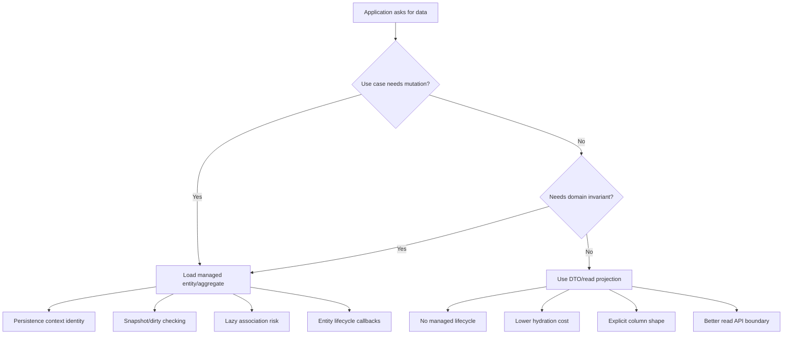
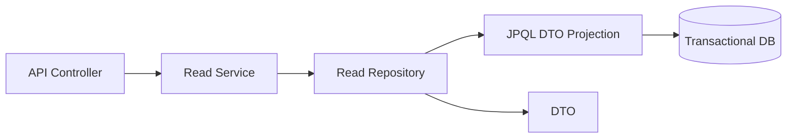
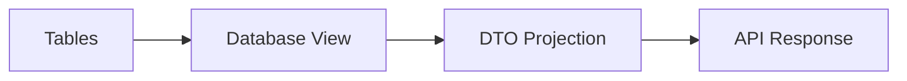
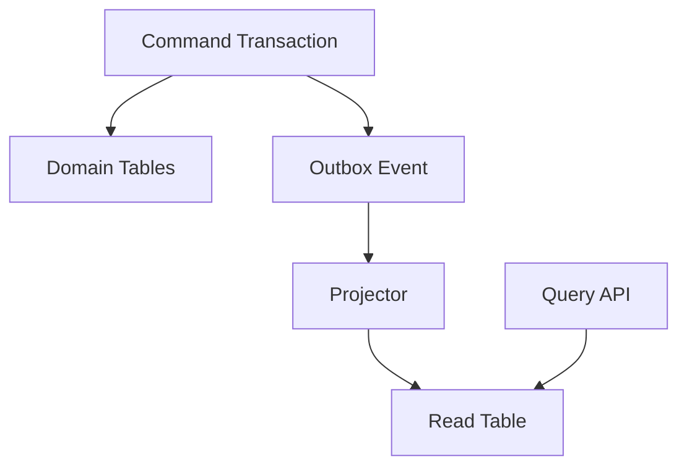

# Part 021 — Read Models, DTO Projections, and Query Shape Engineering

> Goal part ini: membentuk kemampuan untuk memutuskan kapan harus mengambil entity, kapan harus memakai DTO projection, kapan harus membuat read model, dan bagaimana mendesain query shape sebagai contract teknis yang eksplisit.

Part sebelumnya sudah membahas fetch planning dan SQL prediction. Sekarang kita naik satu level: bukan hanya “bagaimana menghindari N+1”, tetapi **bagaimana mendesain bentuk data baca supaya ORM tidak melakukan pekerjaan yang tidak perlu**.

Di sistem production, banyak masalah performa ORM bukan disebabkan oleh Hibernate atau EclipseLink yang “lambat”. Sering kali penyebabnya adalah query yang salah bentuk:

- endpoint list mengambil entity penuh padahal hanya butuh 8 kolom;
- report menghidrasi ribuan aggregate padahal hasil akhirnya flat table;
- export CSV memakai graph entity lalu trigger lazy loading;
- dashboard memakai query transactional model yang tidak cocok untuk analytics;
- pagination dilakukan setelah join fetch collection yang memperbesar row cardinality;
- read-only use case tetap masuk persistence context sehingga dirty checking dan memory pressure naik.

Mental model utama:

```txt
Read path bukan selalu domain path.
Read path adalah kontrak bentuk data, biaya SQL, biaya hydration, dan boundary consistency.
```

---

## 1. Kaufman Deconstruction: Skill Kecil yang Harus Dikuasai

Untuk top 1% engineering, “pakai DTO” terlalu dangkal. Skill sebenarnya terdiri dari beberapa sub-skill:

1. **Membedakan command model dan query model**
   - command model: entity, invariant, lifecycle, transaction;
   - query model: shape data, projection, sorting, filtering, pagination, latency.

2. **Membaca query sebagai execution contract**
   - tabel apa yang disentuh;
   - join apa yang terjadi;
   - berapa row yang mungkin kembali;
   - apakah object graph dihidrasi;
   - apakah persistence context bertambah;
   - apakah cache ikut terlibat.

3. **Memilih projection strategy**
   - scalar;
   - tuple;
   - constructor expression;
   - record DTO;
   - provider-specific transformer;
   - native SQL mapping;
   - view/materialized view;
   - denormalized read table.

4. **Mengendalikan query cardinality**
   - row count;
   - column count;
   - duplicate parent row;
   - collection join explosion;
   - page stability.

5. **Mendesain read model yang aman secara evolusi**
   - compatible dengan API;
   - tidak bocor entity internal;
   - tidak merusak transaction boundary;
   - mudah diobservasi.

---

## 2. Mental Model: Entity Query vs DTO Query

Entity query dan DTO query bukan dua cara berbeda untuk “ambil data”. Mereka adalah dua kontrak runtime yang berbeda.



### Entity query

Entity query cocok ketika hasil query akan diperlakukan sebagai **managed domain object**.

Karakteristik:

- entity masuk persistence context;
- identity dijaga per persistence context;
- dirty checking aktif;
- lazy association bisa terpicu;
- lifecycle callback dan provider behavior berlaku;
- perubahan pada managed entity bisa diflush.

Contoh:

```java
Order order = em.find(Order.class, orderId);
order.approve(actor, clock.instant());
```

Ini use case command. Load entity memang masuk akal karena kita perlu invariant dan mutation.

### DTO query

DTO query cocok ketika hasil query adalah **data baca final**, bukan object yang akan dimutasi.

Karakteristik:

- tidak managed;
- tidak ada dirty checking;
- tidak ada lazy loading;
- kolom eksplisit;
- cocok untuk API response, dashboard, export, search result, report;
- lebih mudah dijadikan contract stabil.

Contoh:

```java
public record OrderListItem(
    UUID id,
    String orderNumber,
    String customerName,
    OrderStatus status,
    Instant submittedAt
) {}
```

```java
List<OrderListItem> rows = em.createQuery("""
    select new com.acme.order.read.OrderListItem(
        o.id,
        o.orderNumber,
        c.name,
        o.status,
        o.submittedAt
    )
    from Order o
    join o.customer c
    where o.status in :statuses
    order by o.submittedAt desc
    """, OrderListItem.class)
    .setParameter("statuses", statuses)
    .setMaxResults(50)
    .getResultList();
```

Invariant:

```txt
Jika data hanya dibaca dan dikembalikan keluar boundary, jangan default ke entity.
```

---

## 3. Cost Model: Apa yang Sebenarnya Dibayar?

Read path yang buruk biasanya membayar biaya yang tidak terlihat.

| Cost | Entity Query | DTO Projection |
|---|---:|---:|
| SQL round trip | Ada | Ada |
| Kolom yang dipilih | Sering lebih banyak | Eksplisit |
| Object hydration | Entity + proxy + collection wrapper | DTO sederhana |
| Persistence context memory | Bertambah | Tidak bertambah sebagai entity managed |
| Dirty checking | Ada | Tidak ada |
| Lazy loading risk | Ada | Tidak ada |
| Cache interaction | Bisa first-level/second-level | Biasanya tidak entity cache |
| API boundary leakage | Tinggi jika entity diekspos | Rendah |
| Mutation support | Ada | Tidak ada |

Entity query bukan salah. Yang salah adalah memakai entity query untuk use case yang bukan domain mutation.

### Rule of thumb

```txt
Use command-side entity loading when you need behavior.
Use read-side projection when you need information.
```

---

## 4. Query Shape sebagai Contract

Query shape terdiri dari:

1. **column shape** — kolom apa yang keluar;
2. **row shape** — satu row mewakili apa;
3. **join shape** — relasi apa yang dilibatkan;
4. **cardinality shape** — 1:1, 1:N, duplicate parent risk;
5. **ordering shape** — urutan stabil atau tidak;
6. **pagination shape** — offset, keyset, cursor, window;
7. **consistency shape** — transaksi, isolation, snapshot;
8. **materialization shape** — entity, DTO, tuple, scalar;
9. **evolution shape** — apakah bisa berubah tanpa merusak client.

Contoh shape yang buruk:

```java
List<CaseFile> cases = em.createQuery("""
    select c
    from CaseFile c
    left join fetch c.parties
    left join fetch c.tasks
    left join fetch c.evidenceItems
    where c.status = :status
    order by c.createdAt desc
    """, CaseFile.class)
    .setMaxResults(20)
    .getResultList();
```

Masalah:

- endpoint list menghidrasi aggregate penuh;
- multiple collection fetch join berpotensi cartesian explosion;
- pagination pada row hasil join tidak selalu sama dengan pagination parent;
- response mungkin tetap butuh subset kecil;
- persistence context penuh entity yang tidak akan dimutasi.

Shape yang lebih sehat:

```java
public record CaseQueueItem(
    UUID caseId,
    String caseNumber,
    CaseStatus status,
    String primaryPartyName,
    long openTaskCount,
    Instant lastActivityAt
) {}
```

```java
List<CaseQueueItem> items = em.createQuery("""
    select new com.acme.caseapp.read.CaseQueueItem(
        c.id,
        c.caseNumber,
        c.status,
        p.displayName,
        count(t.id),
        c.lastActivityAt
    )
    from CaseFile c
    join c.primaryParty p
    left join c.tasks t on t.status <> com.acme.caseapp.TaskStatus.CLOSED
    where c.status = :status
    group by c.id, c.caseNumber, c.status, p.displayName, c.lastActivityAt
    order by c.lastActivityAt desc, c.id desc
    """, CaseQueueItem.class)
    .setParameter("status", CaseStatus.OPEN)
    .setMaxResults(20)
    .getResultList();
```

Di sini row shape jelas: satu row adalah satu item antrean kasus, bukan object graph.

---

## 5. Projection Taxonomy

### 5.1 Scalar projection

Paling sederhana: ambil satu atau beberapa nilai primitif.

```java
List<String> caseNumbers = em.createQuery("""
    select c.caseNumber
    from CaseFile c
    where c.status = :status
    order by c.caseNumber
    """, String.class)
    .setParameter("status", CaseStatus.OPEN)
    .getResultList();
```

Cocok untuk:

- autocomplete;
- existence checking;
- list ID;
- small lookup;
- metric count.

Hindari scalar projection kalau semantik row mulai kompleks. Begitu ada 3–5 kolom dan dipakai lintas boundary, gunakan DTO/record.

---

### 5.2 `Object[]` projection

```java
List<Object[]> rows = em.createQuery("""
    select c.id, c.caseNumber, c.status
    from CaseFile c
    where c.status = :status
    """).getResultList();
```

Ini valid, tetapi rapuh:

```java
for (Object[] row : rows) {
    UUID id = (UUID) row[0];
    String number = (String) row[1];
    CaseStatus status = (CaseStatus) row[2];
}
```

Masalah:

- index-based access;
- refactor sulit;
- type safety lemah;
- mudah tertukar saat query berubah.

Gunakan hanya untuk eksplorasi, internal adapter singkat, atau query yang langsung di-map ke type aman.

---

### 5.3 Tuple projection

Jakarta Persistence menyediakan `Tuple` untuk alias-based access.

```java
List<Tuple> rows = em.createQuery("""
    select c.id as id,
           c.caseNumber as caseNumber,
           c.status as status
    from CaseFile c
    where c.status = :status
    """, Tuple.class)
    .setParameter("status", CaseStatus.OPEN)
    .getResultList();

for (Tuple row : rows) {
    UUID id = row.get("id", UUID.class);
    String caseNumber = row.get("caseNumber", String.class);
    CaseStatus status = row.get("status", CaseStatus.class);
}
```

Lebih baik dari `Object[]`, tetapi tetap bukan public contract yang ideal. Tuple cocok untuk:

- dynamic query builder;
- internal query composition;
- admin/reporting layer yang shape-nya berubah runtime;
- adapter sebelum mapping ke DTO.

---

### 5.4 Constructor expression

Ini standar JPQL.

```java
public record CaseSummary(
    UUID id,
    String caseNumber,
    CaseStatus status,
    Instant submittedAt
) {}
```

```java
List<CaseSummary> rows = em.createQuery("""
    select new com.acme.caseapp.read.CaseSummary(
        c.id,
        c.caseNumber,
        c.status,
        c.submittedAt
    )
    from CaseFile c
    where c.status = :status
    order by c.submittedAt desc
    """, CaseSummary.class)
    .setParameter("status", CaseStatus.SUBMITTED)
    .getResultList();
```

Kelebihan:

- portable;
- type target eksplisit;
- tidak managed;
- cocok untuk read APIs;
- kompatibel dengan Java records selama constructor cocok.

Kekurangan:

- fully qualified class name membuat query panjang;
- perubahan constructor memecahkan query;
- nested object graph DTO tidak nyaman;
- mapping native query butuh teknik lain.

Baeldung-style practical rule:

```txt
Constructor expression adalah default projection portable untuk read endpoint yang stabil.
```

---

### 5.5 Record DTO

Record cocok untuk projection karena:

- immutable by default;
- semantic field name jelas;
- equals/hashCode/toString otomatis;
- constructor canonical cocok dengan JPQL constructor expression.

```java
public record OfficerWorkload(
    UUID officerId,
    String officerName,
    long openCases,
    long overdueCases
) {}
```

```java
List<OfficerWorkload> rows = em.createQuery("""
    select new com.acme.caseapp.read.OfficerWorkload(
        o.id,
        o.fullName,
        count(c.id),
        sum(case when c.dueAt < current_timestamp then 1 else 0 end)
    )
    from Officer o
    left join o.assignedCases c
    group by o.id, o.fullName
    order by count(c.id) desc
    """, OfficerWorkload.class)
    .getResultList();
```

Caveat:

- JPQL function support berbeda antar provider/dialect;
- `sum(case when ...)` harus diuji terhadap database target;
- numeric result type bisa `Long`, `BigInteger`, atau provider/dialect-specific pada native query.

---

### 5.6 Criteria DTO projection

Criteria API lebih verbose, tetapi berguna untuk query dinamis.

```java
CriteriaBuilder cb = em.getCriteriaBuilder();
CriteriaQuery<CaseSummary> cq = cb.createQuery(CaseSummary.class);
Root<CaseFile> c = cq.from(CaseFile.class);

cq.select(cb.construct(
    CaseSummary.class,
    c.get("id"),
    c.get("caseNumber"),
    c.get("status"),
    c.get("submittedAt")
));

cq.where(c.get("status").in(statuses));
cq.orderBy(cb.desc(c.get("submittedAt")));

List<CaseSummary> rows = em.createQuery(cq).getResultList();
```

Use case:

- search screen dengan banyak optional filter;
- query builder internal;
- reusable predicate composition;
- type-safe-ish query generation.

Masalah:

- string field path tetap rapuh kecuali memakai metamodel;
- query sulit dibaca dibanding JPQL;
- debugging SQL tetap wajib.

---

## 6. Hibernate-Specific Projection Options

Hibernate mendukung standar JPQL constructor expression dan juga fitur HQL tambahan. Jangan gunakan fitur provider-specific tanpa alasan jelas, tetapi pahami karena sering berguna pada read path kompleks.

### 6.1 HQL dynamic instantiation

Hibernate HQL mendukung variasi instantiation seperti list/map pada beberapa versi dan mode. Untuk production code, constructor DTO/record tetap lebih mudah dijaga.

Default aman:

```java
List<CaseSummary> rows = session.createQuery("""
    select new com.acme.caseapp.read.CaseSummary(
        c.id, c.caseNumber, c.status, c.submittedAt
    )
    from CaseFile c
    """, CaseSummary.class).list();
```

### 6.2 Result transformer / tuple transformer

Untuk mapping hasil query yang tidak cocok constructor expression, Hibernate menyediakan mekanisme transformer pada API Hibernate.

Contoh konseptual:

```java
List<CaseSummary> rows = session.createQuery("""
    select c.id as id,
           c.caseNumber as caseNumber,
           c.status as status,
           c.submittedAt as submittedAt
    from CaseFile c
    """, Object[].class)
    .setTupleTransformer((tuple, aliases) -> new CaseSummary(
        (UUID) tuple[indexOf(aliases, "id")],
        (String) tuple[indexOf(aliases, "caseNumber")],
        (CaseStatus) tuple[indexOf(aliases, "status")],
        (Instant) tuple[indexOf(aliases, "submittedAt")]
    ))
    .getResultList();
```

Kapan layak:

- query native kompleks;
- DTO nested;
- hasil aggregation butuh post-processing ringan;
- ingin menjaga JPQL tetap readable.

Risiko:

- provider lock-in;
- alias mismatch;
- type mismatch runtime;
- migration ke EclipseLink tidak portable.

Encapsulation pattern:

```txt
Provider-specific projection code harus berada di adapter repository/read gateway,
bukan menyebar di service layer.
```

---

## 7. EclipseLink-Specific Read Options

EclipseLink punya beberapa fitur provider-level yang relevan pada read path.

### 7.1 Report-style query

EclipseLink historically menyediakan `ReportQuery` untuk query report/projection. Dalam aplikasi Jakarta Persistence modern, banyak tim tetap memakai JPQL constructor expression atau native query supaya portable. Namun `ReportQuery` berguna jika aplikasi memang EclipseLink-first dan butuh kontrol descriptor/platform lebih dalam.

Prinsip:

```txt
EclipseLink ReportQuery cocok untuk read adapter internal.
Jangan jadikan ReportQuery sebagai public architectural dependency tanpa ADR.
```

### 7.2 Fetch group

Fetch group memungkinkan subset attribute dibaca dari entity. Ini terlihat seperti solusi projection, tetapi hati-hati: hasilnya tetap entity/partial entity semantics, bukan DTO biasa.

Masalah umum partial entity:

- developer mengira semua field loaded;
- akses field yang tidak loaded bisa memicu load tambahan atau error tergantung mode;
- object tampak seperti domain entity padahal hanya sebagian;
- mutation pada partial object bisa berbahaya jika tidak dipahami.

Default recommendation:

```txt
Untuk API/read-only endpoint, pilih DTO projection.
Gunakan fetch group untuk optimization provider-specific yang benar-benar dipahami dan dites.
```

---

## 8. Native SQL Projection

Native SQL tidak tabu. Dalam read model, native SQL sering lebih jujur dan lebih efisien.

Gunakan native SQL ketika:

- butuh window function;
- butuh CTE kompleks;
- butuh database-specific operator;
- butuh JSON aggregation;
- butuh lateral join;
- butuh full-text search;
- butuh query plan yang sulit dicapai JPQL;
- report jauh dari domain entity graph.

Contoh PostgreSQL-style native SQL:

```java
String sql = """
    select
        c.id,
        c.case_number,
        c.status,
        p.display_name as primary_party_name,
        count(t.id) filter (where t.status <> 'CLOSED') as open_task_count,
        max(a.created_at) as last_activity_at
    from case_file c
    join party p on p.id = c.primary_party_id
    left join task t on t.case_id = c.id
    left join case_activity a on a.case_id = c.id
    where c.tenant_id = :tenantId
      and c.status = :status
    group by c.id, c.case_number, c.status, p.display_name
    order by last_activity_at desc nulls last, c.id desc
    limit :limit
    """;
```

Mapping options:

1. Manual row mapping from `Object[]`.
2. `@SqlResultSetMapping`.
3. Hibernate transformer.
4. Provider-specific mapping API.
5. Dedicated SQL mapper for read side.

Manual row mapping yang aman:

```java
@SuppressWarnings("unchecked")
List<Object[]> rows = em.createNativeQuery(sql)
    .setParameter("tenantId", tenantId)
    .setParameter("status", status.name())
    .setParameter("limit", limit)
    .getResultList();

List<CaseQueueItem> items = rows.stream()
    .map(row -> new CaseQueueItem(
        (UUID) row[0],
        (String) row[1],
        CaseStatus.valueOf((String) row[2]),
        (String) row[3],
        ((Number) row[4]).longValue(),
        toInstant(row[5])
    ))
    .toList();
```

Checklist:

- cast numeric via `Number`, bukan asumsi `Long`;
- timestamp conversion dites per driver;
- enum storage harus eksplisit;
- limit/offset parameter support berbeda antar database;
- native query tidak otomatis portable;
- native bulk/read query bisa bypass cache expectations.

---

## 9. Interface Projection: Spring Data Convenience, Bukan JPA Core

Spring Data JPA mendukung interface-based projections. Ini berguna, tetapi jangan campuradukkan dengan Jakarta Persistence core.

Contoh Spring Data style:

```java
public interface CaseSummaryView {
    UUID getId();
    String getCaseNumber();
    CaseStatus getStatus();
}
```

```java
interface CaseRepository extends JpaRepository<CaseFile, UUID> {
    List<CaseSummaryView> findByStatus(CaseStatus status);
}
```

Kelebihan:

- cepat untuk aplikasi Spring;
- sedikit boilerplate;
- cocok untuk CRUD-ish read use case.

Risiko:

- framework-specific;
- nested projection bisa menghasilkan join yang tidak selalu jelas;
- derived query bisa menyembunyikan query shape;
- debugging SQL tetap wajib.

Architectural rule:

```txt
Interface projection boleh untuk read sederhana.
Untuk read path penting, tulis query eksplisit dan review SQL-nya.
```

---

## 10. Read Model Patterns

### 10.1 Direct DTO projection

Pattern paling umum.



Cocok ketika:

- query masih dekat dengan normalized transactional schema;
- latency acceptable;
- join tidak terlalu berat;
- data freshness harus real-time atau near-real-time;
- shape API stabil.

---

### 10.2 Database view



Cocok ketika:

- query logic ingin didekatkan ke database;
- banyak consumer memakai shape sama;
- DBA/analytics team ingin visibility;
- logic join kompleks tetapi tetap read-only.

Caveat:

- view bisa menyembunyikan cost;
- versioning view perlu migration discipline;
- optimizer behavior harus dicek;
- ORM mapping ke view jangan diperlakukan sebagai mutable entity kecuali memang designed.

---

### 10.3 Materialized view

Cocok ketika:

- aggregation mahal;
- data boleh stale sesuai SLA;
- dashboard/report butuh latency rendah;
- refresh strategy jelas.

Pertanyaan design:

- refresh on schedule atau event-driven?
- stale tolerance berapa detik/menit?
- bagaimana invalidation?
- apakah refresh blocking?
- bagaimana rollback jika refresh gagal?

---

### 10.4 Denormalized read table



Cocok untuk:

- dashboard high traffic;
- search page kompleks;
- cross-aggregate query;
- query yang tidak cocok dengan normalized write schema;
- microservice read model;
- regulatory case queue dengan SLA tinggi.

Contoh read table:

```sql
create table case_queue_read_model (
    tenant_id uuid not null,
    case_id uuid not null,
    case_number varchar(64) not null,
    status varchar(32) not null,
    primary_party_name varchar(255) not null,
    assigned_officer_name varchar(255),
    open_task_count bigint not null,
    overdue_task_count bigint not null,
    last_activity_at timestamp with time zone,
    due_at timestamp with time zone,
    risk_score integer,
    primary key (tenant_id, case_id)
);
```

Kelebihan:

- query cepat dan sederhana;
- API shape jelas;
- bisa diindex sesuai UI;
- tidak memaksa aggregate write model ikut kebutuhan report.

Trade-off:

- eventual consistency;
- projector failure;
- rebuild process;
- duplicate data;
- governance schema lebih berat.

---

## 11. Designing Query APIs

Read repository sebaiknya tidak hanya expose `List<Entity>`.

Buruk:

```java
interface CaseRepository {
    List<CaseFile> findOpenCases();
}
```

Lebih baik:

```java
interface CaseQueueReadRepository {
    PageSlice<CaseQueueItem> findQueue(CaseQueueFilter filter, PageCursor cursor);
}
```

Filter object:

```java
public record CaseQueueFilter(
    UUID tenantId,
    Set<CaseStatus> statuses,
    UUID assignedOfficerId,
    Instant submittedFrom,
    Instant submittedTo,
    Boolean overdueOnly,
    String searchText
) {}
```

Cursor object:

```java
public record PageCursor(
    Instant lastActivityBefore,
    UUID idBefore,
    int limit
) {}
```

Result object:

```java
public record PageSlice<T>(
    List<T> items,
    String nextCursor,
    boolean hasMore
) {}
```

Manfaat:

- query shape menjadi explicit API;
- pagination strategy tidak bocor ke controller;
- filtering tervalidasi;
- tenant boundary wajib di filter;
- dapat dites dengan query count dan execution plan.

---

## 12. Pagination: Offset vs Keyset

Offset pagination mudah, tetapi mahal pada dataset besar.

```java
query.setFirstResult(page * size);
query.setMaxResults(size);
```

Masalah:

- database tetap harus melewati row sebelumnya;
- page tidak stabil jika data berubah;
- offset besar lambat;
- duplicate/missing row mungkin terjadi saat concurrent insert/update.

Keyset/cursor pagination lebih stabil untuk feed/queue.

```sql
where (c.last_activity_at, c.id) < (:lastActivityAt, :lastId)
order by c.last_activity_at desc, c.id desc
limit :limit
```

JPQL portable support untuk tuple comparison bisa terbatas. Bentuk portable:

```java
where c.lastActivityAt < :lastActivityAt
   or (c.lastActivityAt = :lastActivityAt and c.id < :lastId)
order by c.lastActivityAt desc, c.id desc
```

Invariant:

```txt
Ordering pagination harus deterministic.
Selalu tambahkan tie-breaker unik seperti id.
```

---

## 13. Aggregation and Grouping: DTO, Not Entity

Report aggregation hampir selalu DTO/read model.

Buruk:

```java
List<Officer> officers = em.createQuery("""
    select distinct o
    from Officer o
    left join fetch o.assignedCases c
    """, Officer.class).getResultList();

// lalu count di Java
```

Lebih baik:

```java
public record OfficerCaseStats(
    UUID officerId,
    String officerName,
    long assignedCases,
    long overdueCases
) {}
```

```java
List<OfficerCaseStats> stats = em.createQuery("""
    select new com.acme.caseapp.read.OfficerCaseStats(
        o.id,
        o.fullName,
        count(c.id),
        sum(case when c.dueAt < current_timestamp and c.status <> com.acme.caseapp.CaseStatus.CLOSED then 1 else 0 end)
    )
    from Officer o
    left join o.assignedCases c
    group by o.id, o.fullName
    """, OfficerCaseStats.class).getResultList();
```

Caveat:

- `sum(case ...)` result type harus dites;
- enum literal syntax provider-specific bisa berbeda;
- current timestamp dievaluasi di database;
- timezone assumption harus jelas.

---

## 14. Nested DTOs: Jangan Memaksa JPQL Menjadi Object Mapper

JPQL constructor expression cocok untuk flat DTO. Untuk nested DTO kompleks, pilihan terbaik tergantung shape.

### Option A — multiple queries with assembly

```java
List<CaseHeader> headers = findCaseHeaders(filter);
Map<UUID, List<TaskPreview>> tasksByCase = findTaskPreviews(headers.stream()
    .map(CaseHeader::caseId)
    .toList());

List<CaseCard> cards = headers.stream()
    .map(h -> new CaseCard(h, tasksByCase.getOrDefault(h.caseId(), List.of())))
    .toList();
```

Ini bukan N+1 jika query kedua memakai `where case_id in (...)`.

Cocok ketika:

- parent page kecil;
- child preview terbatas;
- ingin menghindari cartesian explosion;
- nested DTO tidak perlu managed entity.

### Option B — native SQL JSON aggregation

Database seperti PostgreSQL bisa mengaggregate nested JSON.

Kelebihan:

- satu round trip;
- shape cocok untuk API;
- database melakukan aggregation.

Trade-off:

- database-specific;
- type conversion lebih manual;
- testing lebih penting;
- portability rendah.

### Option C — read model table

Cocok jika nested shape sering dipakai dan mahal dihitung runtime.

---

## 15. Avoid Partial Entity as DTO

Anti-pattern:

```java
List<CaseFile> cases = em.createQuery("""
    select c
    from CaseFile c
    where c.status = :status
    """, CaseFile.class)
    .setHint("some.provider.fetch.only", "id,caseNumber,status")
    .getResultList();
```

Lalu entity partial ini dikembalikan ke API.

Masalah:

- object terlihat seperti full entity;
- lazy/unfetched field bisa meledak di serialization;
- developer berikutnya tidak tahu field mana loaded;
- accidental mutation bisa terjadi;
- semantics provider-specific.

Rule:

```txt
Partial entity is an optimization technique, not an API/read model contract.
```

---

## 16. Read-Only Query Hints

Untuk entity read yang tetap perlu entity tetapi tidak akan dimutasi, gunakan read-only optimization dengan hati-hati.

Hibernate example:

```java
List<CaseFile> cases = session.createQuery("""
    from CaseFile c
    where c.status = :status
    """, CaseFile.class)
    .setParameter("status", CaseStatus.ARCHIVED)
    .setReadOnly(true)
    .getResultList();
```

JPA hint style dapat dipakai dengan provider-specific hint.

EclipseLink memiliki query hints untuk read-only/cache/fetch-group behavior. Namun nama hint dan behavior adalah provider-specific, sehingga harus diisolasi.

Pattern:

```java
public final class OrmHints {
    private OrmHints() {}

    public static void readOnly(Query query) {
        query.setHint("org.hibernate.readOnly", true);
        // or EclipseLink-specific variant in another adapter
    }
}
```

Better pattern:

```txt
Kalau benar-benar read-only dan shape kecil, gunakan DTO projection dulu.
Read-only entity hint adalah optimization kedua, bukan default read architecture.
```

---

## 17. Query Shape Review Checklist

Gunakan checklist ini untuk setiap endpoint list/search/report.

### Functional shape

- Satu row mewakili apa?
- Apakah endpoint butuh domain behavior atau hanya data?
- Apakah hasil akan dimutasi dalam transaksi yang sama?
- Apakah response shape stabil?
- Apakah tenant/security filter wajib?

### SQL shape

- Berapa tabel yang di-join?
- Apakah join menyebabkan duplicate parent?
- Apakah ada collection join?
- Apakah `distinct` menyembunyikan masalah cardinality?
- Apakah filter memakai index?
- Apakah order by deterministic?
- Apakah pagination terjadi di database?

### ORM shape

- Apakah entity masuk persistence context?
- Apakah dirty checking diperlukan?
- Apakah lazy loading mungkin terjadi setelah method return?
- Apakah second-level cache relevan?
- Apakah query cache justru menambah risiko stale data?

### Operational shape

- Apakah query count dites?
- Apakah execution plan direview?
- Apakah P95/P99 latency diamati?
- Apakah ada fallback saat report berat?
- Apakah result size dibatasi?

---

## 18. Case Study: Regulatory Case Queue

Kita punya sistem case management dengan kebutuhan:

- officer melihat queue kasus terbuka;
- filter tenant, status, assigned officer, overdue;
- tampilkan case number, primary party, risk score, SLA due date, open task count;
- pagination stabil;
- tidak perlu edit dari endpoint list;
- endpoint dipanggil sering.

### Bad design

```java
List<CaseFile> cases = em.createQuery("""
    select distinct c
    from CaseFile c
    left join fetch c.parties
    left join fetch c.tasks
    left join fetch c.riskAssessment
    where c.tenantId = :tenantId
      and c.status in :statuses
    order by c.lastActivityAt desc
    """, CaseFile.class)
    .setParameter("tenantId", tenantId)
    .setParameter("statuses", statuses)
    .setMaxResults(50)
    .getResultList();
```

Failure modes:

- collection fetch join + pagination;
- duplicate row;
- large hydration;
- tasks collection bisa besar;
- parties mungkin banyak;
- persistence context penuh;
- JSON serialization risk.

### Better JPQL projection

```java
public record CaseQueueItem(
    UUID caseId,
    String caseNumber,
    String primaryPartyName,
    CaseStatus status,
    int riskScore,
    long openTaskCount,
    Instant dueAt,
    Instant lastActivityAt
) {}
```

```java
List<CaseQueueItem> items = em.createQuery("""
    select new com.acme.caseapp.read.CaseQueueItem(
        c.id,
        c.caseNumber,
        pp.displayName,
        c.status,
        ra.score,
        count(t.id),
        c.dueAt,
        c.lastActivityAt
    )
    from CaseFile c
    join c.primaryParty pp
    left join c.riskAssessment ra
    left join c.tasks t on t.status <> com.acme.caseapp.TaskStatus.CLOSED
    where c.tenantId = :tenantId
      and c.status in :statuses
      and (:officerId is null or c.assignedOfficer.id = :officerId)
      and (:overdueOnly = false or c.dueAt < current_timestamp)
    group by c.id, c.caseNumber, pp.displayName, c.status, ra.score, c.dueAt, c.lastActivityAt
    order by c.lastActivityAt desc, c.id desc
    """, CaseQueueItem.class)
    .setParameter("tenantId", tenantId)
    .setParameter("statuses", statuses)
    .setParameter("officerId", officerId)
    .setParameter("overdueOnly", overdueOnly)
    .setMaxResults(limit)
    .getResultList();
```

### Best for high-traffic queue

Create read model table updated by event projector:

```sql
create index idx_case_queue_tenant_status_activity
on case_queue_read_model (tenant_id, status, last_activity_at desc, case_id desc);

create index idx_case_queue_tenant_officer_status_due
on case_queue_read_model (tenant_id, assigned_officer_id, status, due_at);
```

Query:

```java
List<CaseQueueItem> items = readJdbc.query("""
    select case_id,
           case_number,
           primary_party_name,
           status,
           risk_score,
           open_task_count,
           due_at,
           last_activity_at
    from case_queue_read_model
    where tenant_id = ?
      and status = any (?)
      and (? is null or assigned_officer_id = ?)
      and (? = false or due_at < now())
      and (
          ? is null
          or last_activity_at < ?
          or (last_activity_at = ? and case_id < ?)
      )
    order by last_activity_at desc, case_id desc
    limit ?
    """, mapper, args);
```

This is not “less ORM”. This is better architecture: ORM remains excellent for command-side aggregate persistence; read table handles high-traffic query shape.

---

## 19. Testing Read Models

Test read path bukan hanya “result benar”. Test harus membuktikan shape.

### 19.1 Query count test

```java
@Test
void queueQuery_usesSingleSqlStatement() {
    statistics.clear();

    queueReadRepository.findQueue(filter, cursor);

    assertThat(statistics.getPrepareStatementCount()).isEqualTo(1);
}
```

### 19.2 No managed entity test

```java
@Test
void queueProjection_doesNotHydrateCaseEntities() {
    queueReadRepository.findQueue(filter, cursor);

    assertThat(entityManager.getEntityManagerFactory()
        .getPersistenceUnitUtil()
        .isLoaded(new Object()))
        .isNotNull(); // illustrative only
}
```

Practical approach:

- inspect Hibernate statistics entity load count;
- inspect SQL logs;
- assert DTO type;
- verify no lazy load after service returns.

### 19.3 Execution plan regression

Use Testcontainers with target database. H2 is not enough for query-shape performance because:

- optimizer differs;
- functions differ;
- index behavior differs;
- pagination plan differs;
- JSON/window function support differs.

---

## 20. Common Failure Modes

### 20.1 “DTO projection fixed performance” but query still scans huge table

Projection reduces hydration cost, not necessarily database scan cost.

Fix:

- inspect execution plan;
- add index;
- reduce filter cardinality;
- denormalize read model;
- partition by tenant/status/time if needed.

### 20.2 “We used DTO but still have N+1”

DTO query can still cause extra queries if DTO construction calls entity methods or post-processing accesses managed relationships.

Fix:

- keep DTO constructor pure;
- do not pass entity into DTO;
- pass scalar values;
- assemble nested DTOs with bounded batch query.

Bad:

```java
new CaseDto(caseFile) // constructor calls caseFile.getTasks().size()
```

Good:

```java
new CaseDto(caseId, caseNumber, openTaskCount)
```

### 20.3 Interface projection hides query shape

Spring Data derived queries are convenient but can hide joins. For critical read path, use explicit query.

### 20.4 `distinct` used as duct tape

`distinct` may remove duplicates at object/result level but does not remove database work. If duplicate parent rows come from collection join, review query shape.

### 20.5 Read model becomes second write model without governance

Denormalized read tables need:

- owner;
- schema migration strategy;
- rebuild job;
- reconciliation check;
- event versioning;
- freshness metric;
- backfill process.

---

## 21. Decision Matrix

| Use case | Recommended shape |
|---|---|
| Command mutation on aggregate | Entity load |
| Simple detail page, mostly read, no mutation | DTO projection or entity if already command boundary |
| List/search endpoint | DTO projection |
| Dashboard aggregation | DTO/native SQL/materialized view |
| High-traffic queue | Denormalized read table |
| Export millions of rows | Streaming native/DTO, not entity graph |
| Admin dynamic filter | Criteria Tuple/DTO or query builder |
| Cross-aggregate reporting | Read model/view/native SQL |
| Provider-specific performance issue | Encapsulated provider extension |

---

## 22. Senior Engineer Heuristics

1. **Do not use entity as default read API.**
2. **A DTO is not an anemic domain object; it is a read contract.**
3. **Projection fixes hydration, not bad indexing.**
4. **Fetch join is not a reporting tool.**
5. **Pagination requires deterministic ordering.**
6. **Read model is architecture, not premature optimization, when query shape differs from write model.**
7. **Native SQL is acceptable when it is isolated, tested, and owned.**
8. **Never expose entity graph to serialization boundary by accident.**
9. **Query shape must be reviewed like API contract.**
10. **If the result will not be modified, question every managed entity load.**

---

## 23. Practice Drills

### Drill 1 — Convert entity list to DTO projection

Given this query:

```java
select c
from CaseFile c
left join fetch c.tasks
where c.status = :status
order by c.createdAt desc
```

Task:

- define DTO for list screen;
- rewrite query with constructor expression;
- predict SQL;
- compare statement count;
- inspect row count.

### Drill 2 — Identify query shape risk

Given requirements:

- case list shows 25 rows;
- each row shows party count and open task count;
- filter by tenant and status;
- sort by last activity.

Task:

- design JPQL projection;
- design indexes;
- decide whether read table is needed;
- explain threshold where read table becomes justified.

### Drill 3 — Native SQL justification

Pick a report using window function.

Task:

- write native query;
- map to record DTO;
- document portability cost;
- write regression test with target database.

---

## 24. Summary

Read model engineering is where ORM maturity becomes visible. Junior code often loads entity graphs and lets serialization decide what gets read. Senior code treats read path as explicit shape:

```txt
Use entity for behavior.
Use projection for information.
Use read model when query shape no longer matches write model.
```

Hibernate and EclipseLink can both serve these patterns well, but the architectural discipline is provider-independent: define the read contract, control the SQL, minimize hydration, preserve tenant/security boundaries, and test the query shape.

---

## References

- Jakarta Persistence 3.2 Specification — Query Language, Criteria API, constructor expressions, native query mapping.
- Hibernate ORM User Guide 7.4 — HQL/JPQL, projections, query execution, result transformation, native queries.
- EclipseLink Documentation — JPQL, query hints, report/query support, fetch groups, read-only and cache-related query behavior.
- Spring Data JPA Reference — Interface and DTO projections as framework-level convenience on top of Jakarta Persistence.
