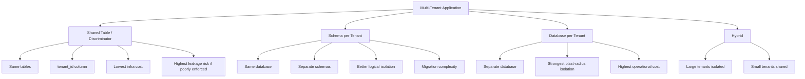
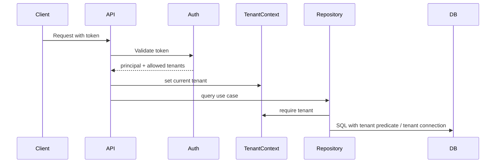
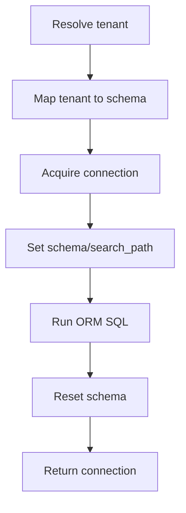
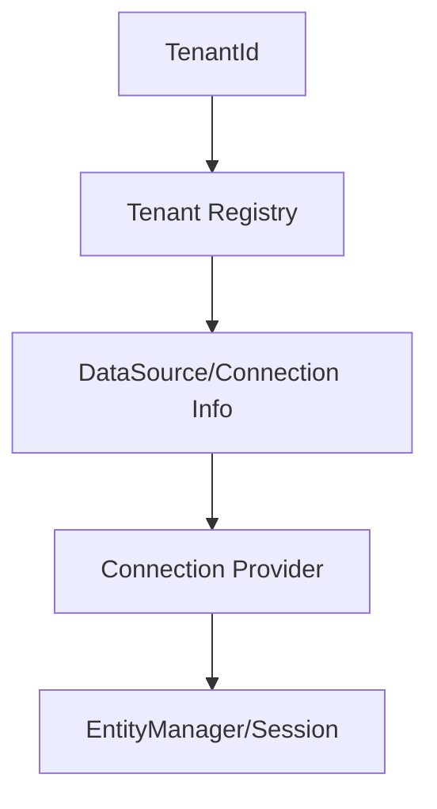
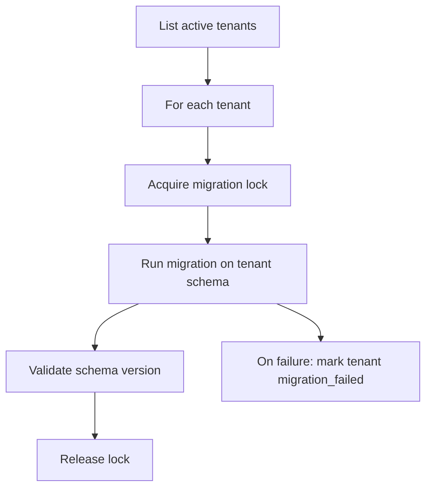
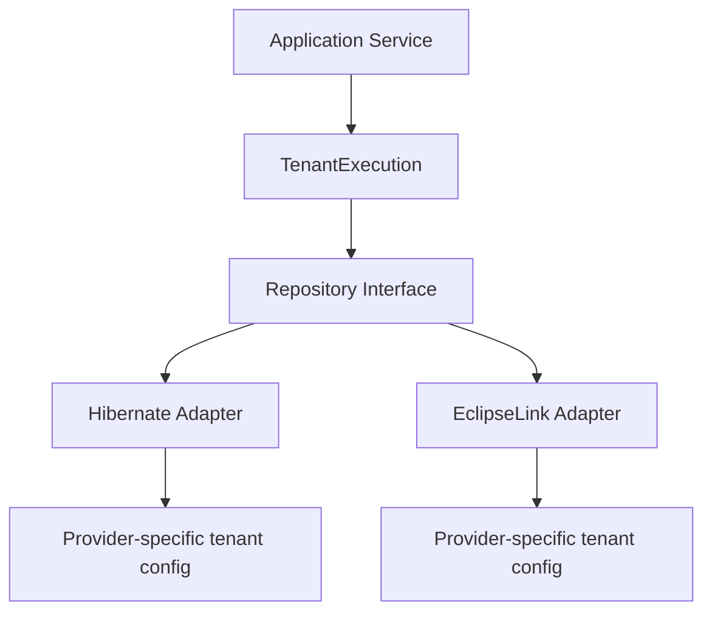

# Part 022 — Multi-Tenancy, Schema Separation, and Provider Support

> Goal part ini: membentuk mental model multi-tenancy yang defensible, memahami trade-off discriminator/schema/database tenancy, dan memakai Hibernate/EclipseLink support tanpa menciptakan risiko cross-tenant data leakage.

Multi-tenancy bukan sekadar menambahkan `tenant_id` di semua tabel. Multi-tenancy adalah **isolation model**. Ia menyentuh:

- security;
- schema design;
- connection routing;
- cache isolation;
- query filters;
- migration;
- backup/restore;
- observability;
- incident blast radius;
- legal/regulatory boundary;
- performance fairness.

Dalam sistem enterprise, bug multi-tenancy bukan “bug data biasa”. Cross-tenant leakage adalah incident severity tinggi.

Mental model utama:

```txt
Tenant boundary is a security and correctness boundary, not a convenience filter.
```

---

## 1. Kaufman Deconstruction: Skill Kecil yang Harus Dikuasai

Untuk menguasai multi-tenancy ORM, pecah skill menjadi unit berikut:

1. **Memilih isolation model**
   - shared table/discriminator;
   - schema-per-tenant;
   - database-per-tenant;
   - hybrid.

2. **Menentukan tenant resolution**
   - dari auth token;
   - dari request context;
   - dari job context;
   - dari message metadata;
   - dari admin impersonation boundary.

3. **Mendesain tenant enforcement**
   - database constraint;
   - ORM provider feature;
   - repository guard;
   - row-level security;
   - service-level authorization.

4. **Mengisolasi cache**
   - first-level cache;
   - second-level/shared cache;
   - query cache;
   - application cache;
   - distributed cache.

5. **Mengelola schema lifecycle**
   - migration all tenants;
   - onboard tenant;
   - offboard tenant;
   - backup per tenant;
   - restore per tenant.

6. **Menguji negative case**
   - tenant A tidak bisa baca tenant B;
   - tenant context wajib;
   - background job tidak lupa tenant;
   - bulk query tidak bypass boundary;
   - cache key tidak bocor.

---

## 2. Multi-Tenancy Model Taxonomy



---

## 3. Model 1: Shared Table / Discriminator Tenancy

Semua tenant berbagi tabel yang sama. Setiap tenant-owned row punya discriminator, biasanya `tenant_id`.

```sql
create table case_file (
    tenant_id uuid not null,
    id uuid not null,
    case_number varchar(64) not null,
    status varchar(32) not null,
    created_at timestamp with time zone not null,
    primary key (tenant_id, id)
);
```

### Kelebihan

- biaya infrastruktur rendah;
- mudah aggregate analytics lintas tenant jika memang allowed;
- migration satu schema;
- connection pool sederhana;
- cocok untuk SaaS kecil-menengah dengan banyak tenant kecil.

### Kekurangan

- risiko cross-tenant leakage paling tinggi;
- setiap query wajib tenant predicate;
- index harus tenant-aware;
- noisy neighbor lebih terasa;
- backup/restore per tenant lebih sulit;
- per-tenant customization terbatas;
- cache harus tenant-aware.

### Invariant utama

```txt
Pada shared-table tenancy, setiap query tenant-owned data wajib membawa tenant predicate.
```

Tetapi itu belum cukup. Tenant predicate harus enforced pada lebih dari satu layer.

---

## 4. Shared Table Design Rules

### 4.1 Tenant ID bagian dari key design

Untuk data tenant-owned, primary key idealnya memasukkan `tenant_id`.

```sql
primary key (tenant_id, id)
```

Foreign key juga tenant-aware:

```sql
alter table task
add constraint fk_task_case
foreign key (tenant_id, case_id)
references case_file (tenant_id, id);
```

Ini mencegah task tenant A menunjuk case tenant B.

Buruk:

```sql
foreign key (case_id) references case_file(id)
```

Jika `id` global UUID, ini mungkin tetap “jalan”, tetapi database tidak membantu memvalidasi tenant boundary.

### 4.2 Unique constraints tenant-aware

```sql
create unique index uq_case_number_per_tenant
on case_file (tenant_id, case_number);
```

Jangan membuat case number global unique kecuali memang business requirement.

### 4.3 Index tenant prefix

Filter umum:

```sql
where tenant_id = ? and status = ? order by created_at desc
```

Index:

```sql
create index idx_case_queue
on case_file (tenant_id, status, created_at desc, id desc);
```

Tenant prefix membantu database membatasi working set.

### 4.4 Avoid nullable tenant_id

Tenant-owned table tidak boleh `tenant_id null`.

```sql
tenant_id uuid not null
```

Untuk global reference data, pisahkan tabel global dan jangan campur semantics.

---

## 5. Tenant Resolution

Tenant harus datang dari boundary yang dipercaya, bukan parameter bebas dari client.



Tenant context sources:

- authenticated principal;
- selected organization in UI, validated against principal;
- service-to-service token claim;
- message header signed/trusted;
- scheduled job configuration;
- admin operation with explicit audit trail.

Anti-pattern:

```java
@GetMapping("/cases")
List<CaseDto> find(@RequestParam UUID tenantId) {
    return service.findCases(tenantId);
}
```

Lebih aman:

```java
@GetMapping("/cases")
List<CaseDto> find(Authentication authentication) {
    TenantId tenantId = tenantResolver.resolve(authentication);
    return service.findCases(tenantId);
}
```

Jika UI memilih tenant, pilihan itu harus divalidasi:

```java
TenantId tenantId = tenantSelection.resolveAndAuthorize(principal, requestedTenantId);
```

---

## 6. Tenant Context Implementation

### 6.1 ThreadLocal context

Banyak aplikasi servlet memakai `ThreadLocal`.

```java
public final class TenantContext {
    private static final ThreadLocal<TenantId> CURRENT = new ThreadLocal<>();

    public static void set(TenantId tenantId) {
        CURRENT.set(Objects.requireNonNull(tenantId));
    }

    public static TenantId require() {
        TenantId tenantId = CURRENT.get();
        if (tenantId == null) {
            throw new MissingTenantException();
        }
        return tenantId;
    }

    public static void clear() {
        CURRENT.remove();
    }
}
```

Filter:

```java
try {
    TenantContext.set(resolvedTenantId);
    chain.doFilter(request, response);
} finally {
    TenantContext.clear();
}
```

Risiko:

- lupa clear menyebabkan context leak antar request;
- async/reactive execution tidak otomatis membawa context;
- background job perlu explicit context;
- virtual thread/thread pool behavior harus dipahami.

### 6.2 Explicit parameter

Lebih eksplisit dan testable:

```java
caseReadRepository.findQueue(tenantId, filter, cursor);
```

Untuk domain service enterprise, explicit `tenantId` sering lebih defensible daripada hidden `ThreadLocal`.

Practical hybrid:

- boundary layer resolve tenant;
- service method menerima `TenantId` eksplisit;
- low-level provider integration boleh membaca tenant context jika memang dibutuhkan oleh Hibernate/EclipseLink.

---

## 7. Hibernate Multi-Tenancy Support

Hibernate ORM mendokumentasikan beberapa pendekatan multi-tenancy:

- separate database;
- separate schema;
- partitioned/discriminator data;
- `@TenantId`;
- `MultiTenantConnectionProvider`;
- `CurrentTenantIdentifierResolver`;
- tenant-aware caching.

### 7.1 Hibernate discriminator tenancy with `@TenantId`

Konsep: entity memiliki field tenant yang diperlakukan sebagai tenant discriminator.

```java
@Entity
@Table(name = "case_file")
public class CaseFile {

    @Id
    private UUID id;

    @TenantId
    @Column(name = "tenant_id", nullable = false, updatable = false)
    private UUID tenantId;

    @Column(name = "case_number", nullable = false)
    private String caseNumber;

    @Enumerated(EnumType.STRING)
    private CaseStatus status;
}
```

Provider akan memakai tenant identifier yang aktif untuk operasi terkait entity tenant-aware. Namun tetap jangan mengandalkan ORM saja untuk security.

Tambahkan database-level design:

- composite primary key atau unique key tenant-aware;
- FK tenant-aware;
- index tenant-aware;
- not-null tenant column;
- optional row-level security jika database mendukung.

### 7.2 Hibernate schema/database tenancy

Untuk schema/database separation, Hibernate perlu tahu tenant saat membuka connection.

Komponen konseptual:

```java
public final class CurrentTenantResolver
        implements CurrentTenantIdentifierResolver<String> {

    @Override
    public String resolveCurrentTenantIdentifier() {
        return TenantContext.require().value();
    }

    @Override
    public boolean validateExistingCurrentSessions() {
        return true;
    }
}
```

Connection provider:

```java
public final class SchemaTenantConnectionProvider
        implements MultiTenantConnectionProvider<String> {

    @Override
    public Connection getConnection(String tenantIdentifier) throws SQLException {
        Connection connection = dataSource.getConnection();
        connection.createStatement().execute("set schema '" + sanitize(tenantIdentifier) + "'");
        return connection;
    }

    @Override
    public void releaseConnection(String tenantIdentifier, Connection connection) throws SQLException {
        try {
            connection.createStatement().execute("set schema 'public'");
        } finally {
            connection.close();
        }
    }
}
```

Important:

- never string-concatenate unsanitized schema names;
- reset schema before returning connection to pool;
- schema switching syntax is database-specific;
- migration must provision every tenant schema;
- connection pool behavior must be tested.

### 7.3 Hibernate session-level tenant

Hibernate can open sessions with tenant identifier.

```java
try (Session session = sessionFactory
        .withOptions()
        .tenantIdentifier(tenantId.value())
        .openSession()) {
    // tenant-scoped work
}
```

Dalam framework seperti Spring, biasanya tenant resolver/provider diintegrasikan di configuration agar service code tidak membuka session manual.

---

## 8. EclipseLink Multi-Tenancy Support

EclipseLink memiliki fitur multi-tenancy provider-specific yang kuat, terutama dengan annotation seperti:

- `@Multitenant`;
- `@TenantDiscriminatorColumn`;
- `@TenantDiscriminatorColumns`;
- `@TenantTableDiscriminator`;
- context property untuk tenant.

### 8.1 EclipseLink single-table discriminator tenancy

```java
@Entity
@Table(name = "CASE_FILE")
@Multitenant(SINGLE_TABLE)
@TenantDiscriminatorColumn(
    name = "TENANT_ID",
    contextProperty = "tenant.id"
)
public class CaseFile {

    @Id
    private UUID id;

    @Column(name = "CASE_NUMBER", nullable = false)
    private String caseNumber;
}
```

Tenant property saat membuat EntityManager:

```java
Map<String, Object> properties = new HashMap<>();
properties.put("tenant.id", tenantId.value().toString());

EntityManager em = emf.createEntityManager(properties);
```

EclipseLink dapat memakai context property untuk membatasi query dan mengisi discriminator saat persist.

### 8.2 EclipseLink table-per-tenant / schema discriminator

EclipseLink mendukung table-per-tenant dengan `@TenantTableDiscriminator`, termasuk mode seperti prefix, suffix, atau schema.

Konsep:

```java
@Entity
@Table(name = "CASE_FILE")
@Multitenant(TABLE_PER_TENANT)
@TenantTableDiscriminator(
    type = TenantTableDiscriminatorType.SCHEMA,
    contextProperty = "tenant.id"
)
public class CaseFile {
    @Id
    private UUID id;
}
```

Ini berarti tenant context mempengaruhi table/schema yang diakses.

Operational caveats:

- schema harus diprovision;
- migration harus jalan untuk semua schema;
- query plan/cache behavior harus diuji;
- naming convention schema tenant harus aman;
- tenant context harus tersedia sebelum EntityManager dipakai.

---

## 9. Provider Comparison Matrix

| Concern | Hibernate | EclipseLink |
|---|---|---|
| Spec baseline | Jakarta Persistence provider | Jakarta Persistence provider/reference lineage |
| Discriminator tenancy | `@TenantId` and tenant identifier support | `@Multitenant(SINGLE_TABLE)` + tenant discriminator column |
| Schema/database tenancy | `MultiTenantConnectionProvider`, tenant resolver/session options | table-per-tenant/schema discriminator and session/custom platform options |
| Tenant context | `CurrentTenantIdentifierResolver` or session tenant id | context properties on EM/EMF/session |
| Cache isolation | tenant-aware cache considerations documented | shared cache scope must be configured carefully with multitenant metadata |
| Portability | Provider-specific | Provider-specific |
| Best use | Hibernate-first stack, Spring/Hibernate integration, rich ORM ecosystem | EclipseLink-first stack, descriptor/weaving/custom mapping leverage |

Key point:

```txt
Jakarta Persistence does not give you a complete portable multi-tenancy abstraction.
Provider features are useful but must be isolated behind architecture boundaries.
```

---

## 10. Cache Isolation in Multi-Tenant Systems

Cache is one of the easiest places to leak tenant data.

### 10.1 First-level cache

Persistence context is scoped to EntityManager/Session. If a persistence context is reused across tenants, you have a serious bug.

Rule:

```txt
One persistence context must never serve multiple tenant contexts.
```

Avoid:

- long-lived EntityManager shared across requests;
- manually cached EntityManager;
- tenant switch within same Session;
- background process reusing context across tenants.

### 10.2 Second-level/shared cache

Cache key must include tenant identity or provider must isolate by tenant.

Risk scenario:

1. Tenant A loads `CaseFile(id=123)`.
2. Entity cached by ID only.
3. Tenant B requests `CaseFile(id=123)`.
4. Cache returns tenant A object.

Even if UUID collision is unlikely, never rely on probability as isolation model.

Mitigations:

- include tenant in primary key or cache key;
- disable shared cache for tenant-owned entities unless provider isolation proven;
- use tenant-aware cache regions;
- test cache hit across tenants;
- avoid query cache for tenant-sensitive dynamic queries unless tenant keying is verified.

### 10.3 Application cache

Dangerous example:

```java
@Cacheable("caseSummary")
public CaseSummary getCase(UUID caseId) { ... }
```

Better:

```java
@Cacheable(cacheNames = "caseSummary", key = "#tenantId + ':' + #caseId")
public CaseSummary getCase(TenantId tenantId, UUID caseId) { ... }
```

### 10.4 HTTP/CDN cache

Tenant-specific response must include appropriate private cache headers. Do not cache tenant data publicly unless response is cryptographically/authorization scoped.

---

## 11. Query Enforcement Strategies

### 11.1 Repository-level tenant predicate

```java
List<CaseQueueItem> findQueue(TenantId tenantId, CaseQueueFilter filter) {
    return em.createQuery("""
        select new com.acme.caseapp.read.CaseQueueItem(...)
        from CaseFile c
        where c.tenantId = :tenantId
          and c.status in :statuses
        """, CaseQueueItem.class)
        .setParameter("tenantId", tenantId.value())
        .setParameter("statuses", filter.statuses())
        .getResultList();
}
```

Kelebihan:

- explicit;
- easy to review;
- works with DTO/native query;
- no provider magic.

Kekurangan:

- developer bisa lupa;
- duplicated predicate;
- bulk/native queries perlu discipline.

### 11.2 Provider-level tenant feature

Hibernate/EclipseLink dapat membantu otomatisasi. Kelebihan:

- mengurangi lupa predicate;
- tenant insert dapat otomatis;
- provider aware of tenant.

Kekurangan:

- provider-specific;
- native SQL/bulk operation masih perlu perhatian;
- cache behavior harus dipahami;
- migration sulit jika pindah provider.

### 11.3 Database Row-Level Security

Jika database mendukung row-level security, ini bisa menjadi lapisan defense yang kuat.

Pattern:

- app set session variable tenant id;
- database policy memfilter row;
- ORM tetap mengirim query normal;
- database menolak/batasi akses.

Trade-off:

- database-specific;
- testing lebih kompleks;
- connection pool harus reset session variable;
- debugging query perlu memahami policy;
- migration/operations perlu DBA discipline.

### 11.4 Defense in depth

Untuk data sensitif:

```txt
Auth tenant check
+ service/repository tenant parameter
+ ORM tenant support/filter
+ database tenant-aware FK/index
+ optional RLS
+ tenant-aware cache key
+ audit log
```

Jangan hanya mengandalkan satu layer.

---

## 12. Schema-per-Tenant Design

Schema-per-tenant berarti setiap tenant punya schema sendiri dalam database yang sama.

```txt
tenant_a.case_file
tenant_a.task
tenant_b.case_file
tenant_b.task
```

### Kelebihan

- isolation lebih kuat daripada shared table;
- backup/restore schema lebih mungkin;
- tenant-specific migration lebih fleksibel;
- query tidak perlu `tenant_id` pada semua tabel jika schema sudah scoped;
- noisy neighbor masih berbagi database tetapi data lebih terpisah.

### Kekurangan

- migration N schema;
- schema provisioning;
- connection schema switching;
- metadata/query plan cache behavior;
- operational tooling lebih kompleks;
- terlalu banyak schema bisa membebani database catalog.

### Runtime pattern



Critical invariant:

```txt
Every connection returned to the pool must be reset to a safe default state.
```

If not, tenant A request can accidentally run on tenant B schema.

---

## 13. Database-per-Tenant Design

Database-per-tenant gives strongest operational isolation.

### Kelebihan

- best blast-radius isolation;
- backup/restore per tenant simpler;
- custom scaling per tenant;
- easier tenant-level deletion/export;
- noisy neighbor isolation better;
- different database versions/configs possible if governed.

### Kekurangan

- high operational cost;
- many connection pools or routing complexity;
- migration fan-out;
- monitoring fan-out;
- cross-tenant analytics harder;
- onboarding slower;
- resource utilization less efficient.

### Runtime pattern



Tenant registry must be highly reliable and secured. It maps tenant ID to database location.

---

## 14. Hybrid Tenancy

Real enterprise SaaS often becomes hybrid:

- small tenants share table/database;
- large tenants get dedicated schema/database;
- regulated tenants get isolated database;
- internal/system tenant may use separate infrastructure;
- archival data may move to cheaper storage.

Hybrid model requires a routing abstraction:

```java
public sealed interface TenantPlacement {
    record SharedTable(String cluster) implements TenantPlacement {}
    record Schema(String cluster, String schema) implements TenantPlacement {}
    record Database(String jdbcUrl, String usernameSecretRef) implements TenantPlacement {}
}
```

Repository should not know placement details. It should receive a tenant context and let infrastructure route.

---

## 15. Tenant-Aware Entity Modeling

### 15.1 Explicit tenant value type

```java
public record TenantId(UUID value) {
    public TenantId {
        Objects.requireNonNull(value);
    }
}
```

Avoid raw `UUID` everywhere when tenant boundary is important.

### 15.2 Mapped tenant field

For shared-table model:

```java
@Embeddable
public record TenantScopedId(
    @Column(name = "tenant_id") UUID tenantId,
    @Column(name = "id") UUID id
) implements Serializable {}
```

```java
@Entity
public class CaseFile {
    @EmbeddedId
    private TenantScopedId id;
}
```

Composite ID increases mapping complexity but makes tenant boundary explicit.

Alternative:

```java
@Id
private UUID id;

@Column(name = "tenant_id", nullable = false, updatable = false)
private UUID tenantId;
```

Then enforce tenant-aware unique/FK constraints at database layer.

### 15.3 Global reference data

Not all tables are tenant-owned.

Examples:

- country codes;
- currency codes;
- regulatory rule templates, if truly global;
- product catalog, if shared.

Do not force tenant ID into global reference data unless business semantics require tenant-specific customization.

---

## 16. Multi-Tenant Associations

Bad association risk:

```java
@ManyToOne
@JoinColumn(name = "case_id")
private CaseFile caseFile;
```

In shared-table model, this join is not tenant-safe unless `case_id` is globally unique and database constraints are carefully designed.

Tenant-aware join:

```java
@ManyToOne(fetch = FetchType.LAZY)
@JoinColumns({
    @JoinColumn(name = "tenant_id", referencedColumnName = "tenant_id", insertable = false, updatable = false),
    @JoinColumn(name = "case_id", referencedColumnName = "id", insertable = false, updatable = false)
})
private CaseFile caseFile;
```

Caveat:

- composite joins increase mapping complexity;
- update/insert column ownership must be precise;
- provider SQL must be tested;
- equals/hashCode must account for ID strategy.

Architectural alternative:

```java
private UUID caseId;
```

Use ID reference for large-scale boundary and repository lookup with tenant predicate.

---

## 17. Bulk Operations in Multi-Tenant Systems

Bulk update/delete is dangerous because it can bypass normal entity lifecycle and provider-level expectations.

Bad:

```java
em.createQuery("""
    update Task t
    set t.status = :expired
    where t.dueAt < :now
    """)
.setParameter("expired", TaskStatus.EXPIRED)
.setParameter("now", now)
.executeUpdate();
```

This updates all tenants.

Good:

```java
em.createQuery("""
    update Task t
    set t.status = :expired
    where t.tenantId = :tenantId
      and t.dueAt < :now
    """)
.setParameter("tenantId", tenantId.value())
.setParameter("expired", TaskStatus.EXPIRED)
.setParameter("now", now)
.executeUpdate();
```

Better for batch job:

```txt
For each tenant:
  set tenant context
  execute tenant-scoped bulk operation
  clear persistence context
  evict relevant cache region
  record audit summary
```

Never run tenant-owned bulk operation without explicit tenant scope unless it is a deliberately global maintenance job with approval.

---

## 18. Background Jobs and Messaging

HTTP request path usually has auth context. Background jobs often do not. That is why tenant leakage frequently happens there.

### Message payload

```java
public record CaseEscalationRequested(
    UUID tenantId,
    UUID caseId,
    Instant requestedAt
) {}
```

Consumer:

```java
void handle(CaseEscalationRequested event) {
    TenantId tenantId = new TenantId(event.tenantId());
    tenantExecution.runInTenant(tenantId, () -> {
        CaseFile caseFile = caseRepository.get(tenantId, event.caseId());
        caseFile.escalate(clock.instant());
    });
}
```

### Scheduled job

Bad:

```java
expireOverdueTasks(); // for all tenants implicitly
```

Better:

```java
for (TenantId tenantId : tenantRegistry.activeTenants()) {
    tenantExecution.runInTenant(tenantId, () -> expireOverdueTasks(tenantId));
}
```

Add:

- per-tenant metrics;
- per-tenant failure isolation;
- resumable cursor;
- rate limit;
- audit record.

---

## 19. Tenant Registry

Tenant registry is the system of record for tenant placement and status.

Example schema:

```sql
create table tenant_registry (
    tenant_id uuid primary key,
    status varchar(32) not null,
    placement_type varchar(32) not null,
    cluster_id varchar(64) not null,
    schema_name varchar(128),
    database_ref varchar(256),
    created_at timestamp with time zone not null,
    suspended_at timestamp with time zone
);
```

Status examples:

- `PROVISIONING`;
- `ACTIVE`;
- `SUSPENDED`;
- `MIGRATING`;
- `DELETING`;
- `DELETED`.

Tenant resolver must reject inactive/suspended tenants unless operation is explicitly allowed.

---

## 20. Migration Strategy

### 20.1 Shared table

One migration per database/schema.

Concern:

- large table migration can affect all tenants;
- backfill needs tenant-aware batching;
- index creation may lock or consume resources globally.

Pattern:

```txt
Add nullable column
Deploy code writing both old/new
Backfill by tenant chunks
Add constraint after validation
Remove old path later
```

### 20.2 Schema-per-tenant

Migration must run for every tenant schema.

Need:

- migration registry per tenant;
- resumable migration;
- failure isolation;
- tenant status during migration;
- schema drift detection;
- throttling.

Pseudo-flow:



### 20.3 Database-per-tenant

Similar to schema-per-tenant but includes connection credentials, cluster availability, backups, and version compatibility.

---

## 21. Tenant Isolation Testing

### 21.1 Negative read test

```java
@Test
void tenantACannotReadTenantBCase() {
    TenantId tenantA = tenants.create();
    TenantId tenantB = tenants.create();

    UUID caseB = tenantExecution.callInTenant(tenantB,
        () -> caseFactory.createCase().id());

    tenantExecution.runInTenant(tenantA, () -> {
        assertThatThrownBy(() -> caseRepository.getRequired(tenantA, caseB))
            .isInstanceOf(NotFoundException.class);
    });
}
```

Return `NotFound`, not `Forbidden`, if exposing existence would leak cross-tenant information.

### 21.2 Negative write test

```java
@Test
void tenantACannotAttachTaskToTenantBCase() {
    TenantId tenantA = tenants.create();
    TenantId tenantB = tenants.create();

    UUID caseB = tenantExecution.callInTenant(tenantB,
        () -> caseFactory.createCase().id());

    tenantExecution.runInTenant(tenantA, () -> {
        assertThatThrownBy(() -> taskService.createTask(tenantA, caseB, "Review"))
            .isInstanceOf(NotFoundException.class);
    });
}
```

### 21.3 Cache leakage test

```java
@Test
void secondLevelCacheDoesNotLeakAcrossTenants() {
    UUID sameBusinessId = UUID.randomUUID();

    tenantExecution.runInTenant(tenantA, () -> createCaseWithId(sameBusinessId, "A-001"));
    tenantExecution.runInTenant(tenantB, () -> createCaseWithId(sameBusinessId, "B-001"));

    tenantExecution.runInTenant(tenantA, () -> {
        assertThat(caseRepository.get(tenantA, sameBusinessId).caseNumber()).isEqualTo("A-001");
    });

    tenantExecution.runInTenant(tenantB, () -> {
        assertThat(caseRepository.get(tenantB, sameBusinessId).caseNumber()).isEqualTo("B-001");
    });
}
```

Even if production IDs are globally unique, tests like this force cache key correctness.

### 21.4 Missing tenant test

```java
@Test
void repositoryRequiresTenant() {
    TenantContext.clear();

    assertThatThrownBy(() -> caseRepository.findQueue(filterWithoutTenant))
        .isInstanceOf(MissingTenantException.class);
}
```

### 21.5 Bulk operation test

Seed two tenants, run bulk job for one tenant, assert the other tenant unchanged.

---

## 22. Observability

Multi-tenant system needs tenant-aware observability, but avoid leaking tenant IDs into places where they become sensitive.

Metrics:

- query latency by placement/cluster;
- migration duration per tenant group;
- job success/failure per tenant;
- cache hit/miss by tenant class, not necessarily raw tenant ID;
- throttling/noisy neighbor signals;
- connection pool usage per placement.

Logs:

```txt
tenant_hash=abc123 placement=shared-eu-1 operation=find_case_queue duration_ms=42 rows=50
```

Avoid:

- logging raw tenant secrets;
- logging tenant data in SQL parameter logs in lower environments copied to external tools;
- high-cardinality metrics explosion from raw tenant labels.

Tracing:

- include tenant hash or tenant category;
- include placement;
- include schema/database routing decision;
- include job tenant iteration info.

Audit:

- actor;
- tenant;
- operation;
- target object;
- before/after where required;
- source request/job/message;
- admin impersonation reason.

---

## 23. Security Failure Modes

### 23.1 Trusting request tenant ID

Client-provided tenant ID must be authorized. Never assume route parameter is safe.

### 23.2 Missing tenant predicate in native query

Native SQL bypasses ORM tenant conveniences unless provider/database integration applies. Review native query manually.

### 23.3 Query cache not tenant-keyed

Always prove tenant-aware query cache behavior before enabling query cache on tenant-owned data.

### 23.4 Reusing EntityManager across tenants

EntityManager is not a tenant-switching object. Create/use a persistence context within one tenant scope.

### 23.5 Background job global update

Jobs need explicit tenant iteration or explicitly approved global operation.

### 23.6 Schema not reset on pooled connection

If schema/search path remains set, next request may hit wrong tenant.

### 23.7 Admin tooling bypass

Internal admin endpoints often become leakage source. Require tenant scope, audit, and authorization even for internal tools.

---

## 24. Performance Fairness

Shared tenancy creates noisy-neighbor problems.

Mitigation options:

- tenant-prefixed indexes;
- per-tenant query limits;
- request throttling;
- background job rate limiting;
- partition large tenant out to dedicated placement;
- query timeout;
- read model per heavy tenant;
- archive old data by tenant/time;
- avoid unbounded cross-tenant admin queries.

For large shared tables, index strategy often starts with tenant:

```sql
create index idx_task_tenant_status_due
on task (tenant_id, status, due_at, id);
```

But not every index should blindly start with tenant. Use actual query workload and execution plans.

---

## 25. Choosing a Model

### Decision matrix

| Criterion | Shared table | Schema per tenant | Database per tenant |
|---|---:|---:|---:|
| Infra cost | Low | Medium | High |
| Operational isolation | Low-medium | Medium-high | High |
| Leakage risk if app bug | High | Medium | Lower |
| Migration complexity | Low-medium | High | High |
| Backup per tenant | Hard | Medium | Easier |
| Cross-tenant analytics | Easy | Medium | Hard |
| Tenant customization | Low | Medium | High |
| Noisy neighbor isolation | Low | Medium | High |
| Number of small tenants | Excellent | Good until catalog overhead | Costly |
| Regulated large tenant | Often insufficient | Sometimes | Strong fit |

### Heuristic

```txt
Start with shared table only if tenant isolation is enforced by design, not convention.
Move heavy/regulatory tenants to schema/database isolation when blast radius or performance fairness demands it.
```

---

## 26. Architecture Pattern: Tenant Execution Boundary

Centralize tenant-scoped execution.

```java
public interface TenantExecution {
    <T> T callInTenant(TenantId tenantId, Supplier<T> action);
    void runInTenant(TenantId tenantId, Runnable action);
}
```

Implementation responsibilities:

- set tenant context;
- validate tenant status;
- configure provider/session if needed;
- set logging/tracing context;
- clear context;
- prevent nested incompatible tenant switch;
- record metrics.

Example:

```java
public final class DefaultTenantExecution implements TenantExecution {

    @Override
    public <T> T callInTenant(TenantId tenantId, Supplier<T> action) {
        TenantId previous = TenantContext.currentOrNull();
        if (previous != null && !previous.equals(tenantId)) {
            throw new IllegalStateException("Cannot switch tenant inside active tenant scope");
        }

        try {
            TenantContext.set(tenantId);
            MDC.put("tenant", tenantId.safeHash());
            return action.get();
        } finally {
            MDC.remove("tenant");
            TenantContext.clear();
        }
    }
}
```

---

## 27. Repository Contract

Bad:

```java
Optional<CaseFile> findById(UUID id);
```

Good:

```java
Optional<CaseFile> findById(TenantId tenantId, UUID id);
```

Bad:

```java
void deleteCase(UUID id);
```

Good:

```java
void deleteCase(TenantId tenantId, UUID id);
```

For schema/database tenancy, tenant may not appear in SQL predicate, but it should still appear in application contract. This preserves security semantics and supports future migration/hybrid placement.

---

## 28. Multi-Tenant Read Models

Read model table must also be tenant-aware.

```sql
create table case_queue_read_model (
    tenant_id uuid not null,
    case_id uuid not null,
    case_number varchar(64) not null,
    status varchar(32) not null,
    assigned_officer_id uuid,
    last_activity_at timestamp with time zone,
    primary key (tenant_id, case_id)
);
```

Projector must process tenant context from event:

```java
void project(CaseUpdated event) {
    tenantExecution.runInTenant(event.tenantId(), () -> {
        readModelRepository.upsert(event.tenantId(), toRow(event));
    });
}
```

Failure mode:

```txt
Event contains caseId but not tenantId.
Projector looks up case by id globally.
Wrong tenant row is updated or leaked.
```

Event contract for tenant-owned data should include tenant ID unless transport/topic is already tenant-isolated and enforced.

---

## 29. Admin and Cross-Tenant Operations

Some operations are intentionally cross-tenant:

- platform admin dashboard;
- billing aggregation;
- fraud detection;
- system-wide migration;
- global compliance report.

Do not implement these by “temporarily disabling tenant filter” casually.

Pattern:

```java
public interface PlatformAdminQueryService {
    List<TenantHealthSummary> summarizeTenantHealth(AdminActor actor, PlatformQuery query);
}
```

Controls:

- explicit permission;
- audit reason;
- result minimization;
- tenant allowlist/filter;
- rate limit;
- separate read replica if heavy;
- do not expose raw tenant records unless necessary.

---

## 30. Provider Lock-In Strategy

Because multi-tenancy is not fully portable across providers, isolate provider-specific configuration.

Recommended layering:



Keep these out of domain/application layer:

- `@TenantId` if you need provider portability;
- EclipseLink `@Multitenant` if domain module must be provider-neutral;
- provider query hints;
- connection provider implementation;
- session customizers.

Sometimes provider annotation in entity is acceptable. But write an ADR:

- why provider-specific feature is used;
- alternatives considered;
- migration cost;
- test coverage;
- cache/isolation proof.

---

## 31. Production Readiness Checklist

### Tenant model

- [ ] Tenant isolation model selected and documented.
- [ ] Tenant placement registry exists if schema/database/hybrid.
- [ ] Tenant status lifecycle modeled.
- [ ] Onboarding/offboarding process defined.

### Data model

- [ ] Tenant-owned tables identifiable.
- [ ] `tenant_id` not nullable for shared-table tenant-owned data.
- [ ] Unique constraints tenant-aware.
- [ ] Foreign keys tenant-aware where applicable.
- [ ] Indexes match tenant query workload.

### Runtime

- [ ] Tenant resolved from trusted/authenticated context.
- [ ] Tenant context cleared after execution.
- [ ] Background jobs carry tenant explicitly.
- [ ] Message events include tenant ID.
- [ ] Bulk operations tenant-scoped.

### Provider

- [ ] Hibernate/EclipseLink tenant feature configured and tested.
- [ ] Native queries reviewed for tenant boundary.
- [ ] Cache isolation proven.
- [ ] EntityManager/Session not reused across tenants.
- [ ] Connection schema/database reset verified.

### Security

- [ ] Negative cross-tenant tests exist.
- [ ] Admin cross-tenant operations audited.
- [ ] NotFound vs Forbidden behavior decided.
- [ ] Logs/metrics avoid sensitive tenant leakage.

### Operations

- [ ] Migration strategy supports tenant model.
- [ ] Per-tenant restore/export considered.
- [ ] Noisy neighbor mitigation exists.
- [ ] Tenant-level observability exists.
- [ ] Runbook for tenant leakage incident exists.

---

## 32. Practice Drills

### Drill 1 — Tenant-aware FK design

Given:

```sql
case_file(id primary key, tenant_id, case_number)
task(id primary key, case_id, tenant_id)
```

Task:

- redesign primary keys/unique keys/FKs;
- ensure task cannot reference case from another tenant;
- design indexes for open task queue.

### Drill 2 — Cache leakage test

Implement a test where two tenants have same business ID. Enable second-level/shared cache. Prove tenant B never receives tenant A object.

### Drill 3 — Schema-per-tenant connection reset

Create integration test:

1. tenant A creates row;
2. tenant B creates row;
3. run alternating requests on same pool;
4. assert schema switching is correct;
5. intentionally remove reset and observe failure.

### Drill 4 — Bulk job hardening

Given an overdue task expiration job, rewrite it to:

- iterate tenants;
- apply per-tenant limit;
- clear persistence context;
- evict relevant cache;
- record audit summary.

---

## 33. Summary

Multi-tenancy is not an ORM checkbox. Hibernate and EclipseLink provide useful mechanisms, but correctness comes from architecture:

```txt
Resolve tenant from trusted context.
Make tenant boundary explicit in service/repository contracts.
Enforce tenant at ORM and database layers.
Isolate cache by tenant.
Test negative cross-tenant cases.
Treat bulk/native/admin paths as high risk.
```

Provider features reduce repetition, but they do not replace security design. A production-grade multi-tenant ORM system is built with defense in depth: application authorization, provider support, database constraints, cache isolation, migration discipline, and tenant-aware observability.

---

## References

- Hibernate ORM User Guide 7.4 — Multitenancy, `@TenantId`, `MultiTenantConnectionProvider`, `CurrentTenantIdentifierResolver`, caching.
- EclipseLink Documentation — `@Multitenant`, `@TenantDiscriminatorColumn`, `@TenantTableDiscriminator`, context properties, table-per-tenant and single-table multi-tenancy.
- Jakarta Persistence 3.2 Specification — provider model, persistence unit, query/native query behavior, schema generation properties.
- OWASP-style multi-tenant security principles: defense in depth, authorization boundary, least privilege, auditability.
