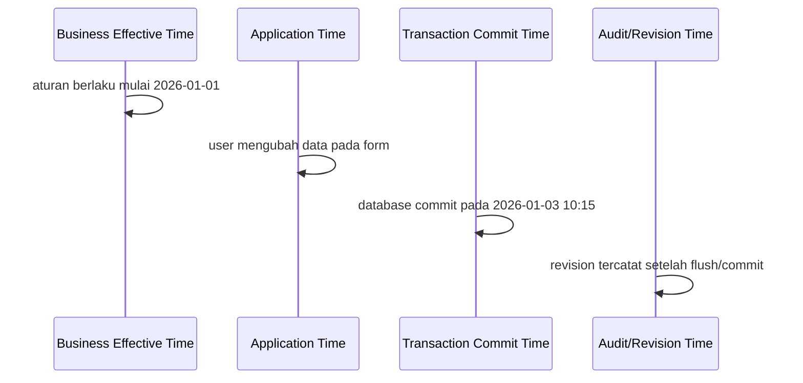
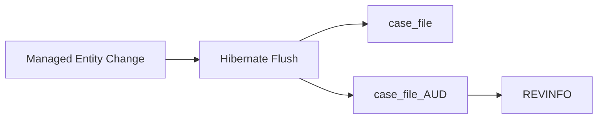
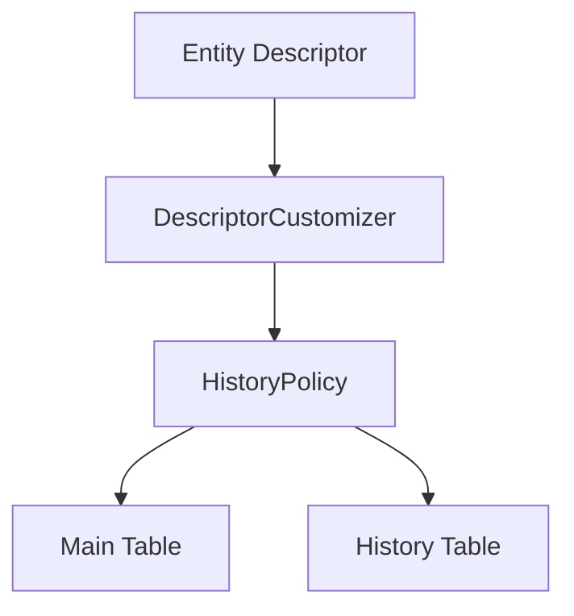
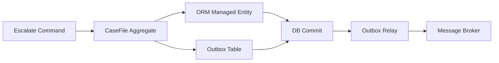
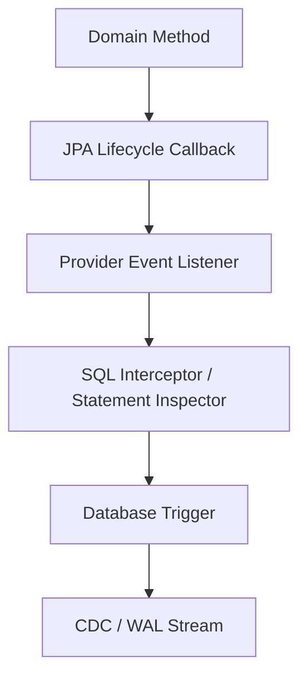

# Part 023 — Auditing, Temporal Models, Soft Delete, and Lifecycle Hooks

> Target part ini: kamu tidak hanya tahu cara menaruh `createdAt`, `updatedAt`, atau `deleted = true`. Kamu harus bisa membedakan **audit**, **history**, **temporal validity**, **soft delete**, dan **lifecycle hooks** sebagai mekanisme yang berbeda, dengan risiko correctness yang berbeda.

ORM sering terlihat nyaman sampai sistem butuh menjawab pertanyaan seperti:

- siapa mengubah data ini?
- kapan status kasus berubah?
- data apa yang berlaku pada tanggal tertentu?
- mengapa record “hilang” dari query?
- apakah soft-deleted row masih boleh ikut unique constraint?
- apakah audit tetap tercatat jika update dilakukan via bulk query?
- apakah listener aman melakukan side effect?

Di sistem enterprise, terutama sistem regulasi, enforcement, banking, telecom, healthcare, dan case management, jawaban terhadap pertanyaan ini bukan fitur kosmetik. Ini bagian dari **defensibility**.

---

## 1. Kaufman Skill Slice

Kita pecah skill ini menjadi beberapa unit yang bisa dilatih secara sengaja.

| Skill Unit | Yang Harus Dikuasai | Bukti Penguasaan |
|---|---|---|
| Audit metadata | `createdAt`, `updatedAt`, `createdBy`, `updatedBy` | Bisa menjamin field terisi konsisten untuk insert/update normal |
| Change history | riwayat perubahan per entity | Bisa menanyakan “nilai sebelum/sesudah” dan “revision mana yang mengubah apa” |
| Temporal validity | data berlaku dalam interval waktu | Bisa query state as-of business date, bukan hanya transaction date |
| Soft delete | row disembunyikan tanpa dihapus fisik | Bisa menjelaskan efek terhadap query, FK, unique constraint, cache, dan restore |
| Lifecycle hooks | callback entity/listener/provider event | Bisa membedakan hook yang aman dan hook yang berbahaya |
| Provider extension | Hibernate Envers/SoftDelete vs EclipseLink HistoryPolicy/AdditionalCriteria | Bisa memilih provider feature tanpa mencemari domain model secara liar |
| Failure modeling | bulk update, native SQL, cache, async jobs | Bisa memprediksi area yang bypass audit/soft delete |

Prinsip Kaufman di sini: jangan mulai dari API. Mulai dari **decision map**. Ketika requirement datang, kamu harus tahu requirement itu masuk kategori apa.

---

## 2. Empat Konsep yang Sering Tercampur

Banyak codebase mencampur audit, temporal, soft delete, dan lifecycle hook dalam satu `BaseEntity`. Ini biasanya terlihat rapi pada awalnya, lalu menjadi sumber bug saat requirement berkembang.

### 2.1 Audit metadata

Audit metadata adalah informasi operasional tentang row/entity.

Contoh:

```java
@MappedSuperclass
public abstract class AuditableEntity {
    @Column(nullable = false, updatable = false)
    private Instant createdAt;

    @Column(nullable = false)
    private Instant updatedAt;

    @Column(nullable = false, updatable = false, length = 100)
    private String createdBy;

    @Column(nullable = false, length = 100)
    private String updatedBy;
}
```

Audit metadata menjawab:

- kapan row dibuat?
- kapan terakhir diubah?
- oleh siapa?

Audit metadata **tidak** cukup untuk menjawab:

- apa nilai sebelumnya?
- field apa saja yang berubah?
- bagaimana state entity pada 3 bulan lalu?
- kenapa perubahan dilakukan?

### 2.2 Change history

Change history menyimpan versi lama atau delta perubahan.

Model umum:

```txt
case_file
case_file_audit
revision_info
```

Change history menjawab:

- revision ke berapa yang mengubah entity?
- user/process mana yang melakukan perubahan?
- nilai lama dan nilai baru apa?
- kapan perubahan terjadi menurut waktu sistem?

Hibernate Envers berada di kategori ini. EclipseLink bisa memakai HistoryPolicy atau desain audit table sendiri.

### 2.3 Temporal validity

Temporal validity bukan sekadar audit. Temporal validity menjawab **kapan suatu fakta berlaku secara bisnis**.

Contoh:

```txt
customer_risk_profile
- customer_id
- risk_level
- valid_from
- valid_to
- recorded_at
```

Pertanyaan temporal:

> Risk profile customer pada tanggal 2025-12-01 apa?

Itu berbeda dari:

> Kapan row terakhir diupdate?

Temporal model biasanya butuh interval, overlap rule, correction rule, dan query as-of.

### 2.4 Soft delete

Soft delete menyimpan row tetapi membuatnya tidak terlihat oleh query normal.

Contoh:

```txt
case_note
- id
- case_id
- body
- deleted
- deleted_at
- deleted_by
```

Soft delete menjawab:

- row ini masih ada secara fisik?
- apakah row ini aktif secara aplikasi?
- apakah boleh dipulihkan?

Soft delete **bukan** audit history. Soft delete hanya state visibility. Kalau kamu perlu tahu kenapa dan apa konteks penghapusan, kamu tetap butuh audit/event.

---

## 3. Mental Model: Empat Timeline

Untuk sistem yang serius, pikirkan empat timeline berbeda.



Empat timeline:

| Timeline | Makna | Contoh Field |
|---|---|---|
| Business effective time | kapan fakta berlaku di dunia bisnis | `validFrom`, `validTo`, `effectiveDate` |
| Application time | kapan aplikasi menerima/memproses perintah | request timestamp, command timestamp |
| Transaction time | kapan database menerima commit | DB transaction commit timestamp |
| Audit/revision time | kapan versi perubahan dicatat | `revisionTimestamp` |

Kesalahan umum: memakai `updatedAt` sebagai semua timeline sekaligus.

Itu lemah. `updatedAt` menjelaskan kapan row berubah, bukan kapan aturan berlaku.

---

## 4. Lifecycle Callback Jakarta Persistence

Jakarta Persistence menyediakan callback standar seperti:

- `@PrePersist`
- `@PostPersist`
- `@PreUpdate`
- `@PostUpdate`
- `@PreRemove`
- `@PostRemove`
- `@PostLoad`

Contoh sederhana:

```java
@MappedSuperclass
public abstract class AuditableEntity {
    private Instant createdAt;
    private Instant updatedAt;

    @PrePersist
    protected void onCreate() {
        Instant now = Instant.now();
        this.createdAt = now;
        this.updatedAt = now;
    }

    @PreUpdate
    protected void onUpdate() {
        this.updatedAt = Instant.now();
    }
}
```

Ini cukup untuk metadata teknis sederhana, tetapi ada batas penting.

### 4.1 Callback bukan domain event bus

Callback berjalan sebagai bagian dari lifecycle persistence. Jangan menganggapnya sebagai tempat aman untuk:

- mengirim email;
- publish message ke Kafka;
- memanggil service remote;
- membuat transaksi baru;
- mengubah aggregate lain secara kompleks;
- melakukan query besar;
- menjalankan authorization logic mahal.

Callback sebaiknya deterministik, lokal, cepat, dan idempotent.

### 4.2 Callback tidak selalu terjadi untuk bulk operation

Bulk JPQL/Criteria update/delete dan native SQL dapat melewati lifecycle entity karena provider tidak menghydrate entity satu per satu.

Contoh berbahaya:

```java
entityManager.createQuery("""
    update CaseFile c
       set c.status = :closed
     where c.status = :open
""")
.setParameter("closed", CaseStatus.CLOSED)
.setParameter("open", CaseStatus.OPEN)
.executeUpdate();
```

Efek:

- entity callback seperti `@PreUpdate` tidak dipanggil per row;
- first-level cache tidak otomatis sinkron;
- audit entity-level bisa tidak terjadi;
- optimistic locking bisa tidak berjalan seperti update managed entity biasa;
- second-level cache/query cache perlu strategi invalidation.

Rule: jika update harus audited per entity, jangan pakai bulk operation tanpa mekanisme audit eksplisit.

---

## 5. Entity Listener Pattern

Daripada menaruh semua logic audit di entity base class, gunakan listener untuk memisahkan persistence concern.

```java
@Entity
@EntityListeners(AuditListener.class)
@Table(name = "case_file")
public class CaseFile {
    @Id
    private UUID id;

    private String title;

    @Embedded
    private AuditMetadata audit;
}
```

```java
public class AuditListener {

    @PrePersist
    public void prePersist(Object entity) {
        if (entity instanceof HasAuditMetadata auditable) {
            Instant now = Instant.now();
            String actor = CurrentActor.getRequired();
            auditable.audit().markCreated(now, actor);
        }
    }

    @PreUpdate
    public void preUpdate(Object entity) {
        if (entity instanceof HasAuditMetadata auditable) {
            auditable.audit().markUpdated(Instant.now(), CurrentActor.getRequired());
        }
    }
}
```

Interface kecil:

```java
public interface HasAuditMetadata {
    AuditMetadata audit();
}
```

Value object audit:

```java
@Embeddable
public class AuditMetadata {
    @Column(name = "created_at", nullable = false, updatable = false)
    private Instant createdAt;

    @Column(name = "created_by", nullable = false, updatable = false)
    private String createdBy;

    @Column(name = "updated_at", nullable = false)
    private Instant updatedAt;

    @Column(name = "updated_by", nullable = false)
    private String updatedBy;

    public void markCreated(Instant now, String actor) {
        this.createdAt = now;
        this.createdBy = actor;
        this.updatedAt = now;
        this.updatedBy = actor;
    }

    public void markUpdated(Instant now, String actor) {
        this.updatedAt = now;
        this.updatedBy = actor;
    }
}
```

Catatan desain:

- Jangan inject service besar langsung ke listener portabel kecuali framework kamu mendukungnya dengan jelas.
- Jangan menyimpan request context dalam static global tanpa cleanup.
- Gunakan request-scoped/security context yang jelas.
- Pastikan job async punya actor seperti `SYSTEM_RECONCILIATION_JOB`, bukan `null`.

---

## 6. Actor Propagation

Audit tanpa actor propagation sering palsu.

Di sistem nyata, perubahan bisa datang dari:

- user UI;
- API client;
- scheduler;
- message consumer;
- migration job;
- reconciliation job;
- admin tool;
- retry worker;
- data repair script.

Model actor minimal:

```java
public record AuditActor(
    String actorId,
    String actorType,
    String channel,
    String correlationId,
    String reason
) {}
```

Contoh actor:

```txt
actorId       = "u-9281"
actorType     = "HUMAN_USER"
channel       = "BACKOFFICE_UI"
correlationId = "req-20260630-00031"
reason        = "manual case escalation"
```

Untuk job:

```txt
actorId       = "job-risk-recompute"
actorType     = "SYSTEM_JOB"
channel       = "SCHEDULER"
correlationId = "batch-20260630-risk"
reason        = "nightly risk score recomputation"
```

Rule: audit field `updatedBy = system` tanpa reason/correlation ID biasanya tidak cukup untuk incident analysis.

---

## 7. Hibernate Envers: Change History Provider

Hibernate Envers adalah modul audit Hibernate untuk menyimpan histori perubahan entity. Pola dasarnya:

```java
@Entity
@Audited
@Table(name = "case_file")
public class CaseFile {
    @Id
    private UUID id;

    private String caseNumber;

    @Enumerated(EnumType.STRING)
    private CaseStatus status;
}
```

Secara konseptual, Envers menyimpan:

- tabel entity utama;
- tabel audit per entity;
- tabel revision metadata.

Model mental:



### 7.1 Kapan Envers cocok

Envers cocok ketika:

- histori perubahan entity perlu queryable;
- kamu ingin integrasi erat dengan Hibernate;
- audit mostly mengikuti lifecycle ORM;
- kamu butuh revision model;
- kamu menerima dependency provider-specific.

### 7.2 Kapan Envers tidak cukup

Envers tidak otomatis menyelesaikan:

- domain event dengan semantic reason;
- audit untuk native SQL/manual DB changes;
- temporal validity kompleks;
- audit lintas microservice;
- change approval workflow;
- legal evidence chain;
- cryptographic integrity;
- bulk updates yang tidak melewati lifecycle normal.

Untuk sistem yang butuh defensibility tinggi, Envers bisa menjadi layer change history, tetapi sering perlu dikombinasikan dengan domain event/outbox.

### 7.3 Custom revision entity

Untuk memasukkan actor/correlation, gunakan revision metadata.

Contoh konseptual:

```java
@Entity
@Table(name = "audit_revision")
public class AuditRevision {
    @Id
    @GeneratedValue
    private Long id;

    private Instant revisionTime;
    private String actorId;
    private String actorType;
    private String correlationId;
    private String reason;
}
```

Secara desain, revision metadata harus menjawab:

- siapa;
- kapan;
- lewat channel apa;
- dalam request/job mana;
- mengapa perubahan dilakukan.

---

## 8. EclipseLink HistoryPolicy: Historical State Provider

EclipseLink memiliki extension level descriptor untuk history tracking melalui `HistoryPolicy`. Ini bukan annotation Jakarta Persistence standar. Biasanya dikonfigurasi melalui `DescriptorCustomizer`.

Model konseptual:



Contoh bentuk customizer konseptual:

```java
public class CaseFileHistoryCustomizer implements DescriptorCustomizer {
    @Override
    public void customize(ClassDescriptor descriptor) {
        HistoryPolicy policy = new HistoryPolicy();
        policy.addHistoryTableName("case_file", "case_file_hist");
        policy.addStartFieldName("valid_from");
        policy.addEndFieldName("valid_to");
        descriptor.setHistoryPolicy(policy);
    }
}
```

Entity:

```java
@Entity
@Customizer(CaseFileHistoryCustomizer.class)
@Table(name = "case_file")
public class CaseFile {
    @Id
    private UUID id;

    private String caseNumber;
    private String status;
}
```

### 8.1 Kapan pendekatan ini cocok

Cocok ketika:

- kamu sudah memakai EclipseLink sebagai provider utama;
- kamu butuh historical table behavior yang dekat dengan descriptor;
- kamu punya kontrol schema yang kuat;
- kamu siap menerima provider lock-in;
- kamu butuh point-in-time style query lewat EclipseLink mechanisms.

### 8.2 Risiko

Risiko utama:

- customizer code lebih rendah level daripada annotation JPA biasa;
- portability rendah;
- tim perlu memahami EclipseLink descriptor/session model;
- testing harus membuktikan query historical dan current state benar;
- bulk/native path tetap harus diaudit eksplisit.

---

## 9. Soft Delete: Visibility State, Bukan Deletion Sebenarnya

Soft delete adalah kompromi. Ia mempertahankan row, tetapi mengubah semantic visibility.

Contoh domain:

```java
@Entity
@Table(name = "case_note")
public class CaseNote {
    @Id
    private UUID id;

    @ManyToOne(fetch = FetchType.LAZY)
    private CaseFile caseFile;

    @Column(nullable = false)
    private String body;

    @Column(nullable = false)
    private boolean deleted;

    private Instant deletedAt;
    private String deletedBy;
}
```

Tapi jika hanya menaruh field `deleted`, query normal harus selalu ingat:

```java
select n from CaseNote n where n.caseFile.id = :caseId and n.deleted = false
```

Manusia akan lupa. Maka provider-level filter bisa membantu.

---

## 10. Hibernate Soft Delete

Hibernate menyediakan dukungan soft delete provider-level melalui annotation `@SoftDelete`.

Contoh sederhana:

```java
@Entity
@SoftDelete
@Table(name = "case_note")
public class CaseNote {
    @Id
    private UUID id;

    private String body;
}
```

Konsepnya:

- delete entity diterjemahkan menjadi update indicator;
- query normal menambahkan restriction untuk menyembunyikan deleted row;
- behavior ini provider-specific Hibernate.

### 10.1 Keuntungan

- Lebih konsisten daripada manual `deleted = false` di setiap query.
- Mengurangi lupa filter.
- Terintegrasi dengan operasi ORM.
- Lebih jelas daripada hack lama berbasis custom SQL delete + where clause.

### 10.2 Batas penting

Soft delete tetap perlu desain untuk:

- unique constraint;
- FK dari child ke parent;
- restore behavior;
- audit reason;
- admin query yang harus melihat deleted rows;
- retention/purge policy;
- cache invalidation;
- native SQL;
- reporting query;
- database index.

Contoh masalah unique constraint:

```txt
users
- id
- email
- deleted
```

Jika `email` unique global, user soft-deleted tetap mengunci email tersebut.

Solusi bisa berupa:

- partial unique index pada `deleted = false` jika database mendukung;
- unique key `(email, deleted)` dengan konsekuensi tertentu;
- `deleted_at` dan functional/partial index;
- larangan reuse identifier bisnis;
- purge policy.

Tidak ada solusi universal. Pilih berdasarkan business rule.

---

## 11. EclipseLink Soft Delete dengan Additional Criteria

EclipseLink tidak seharusnya diperlakukan seolah punya fitur identik Hibernate `@SoftDelete`. Pendekatan umum provider-level adalah memakai `@AdditionalCriteria` atau descriptor-level customization untuk menambahkan visibility predicate.

Contoh konseptual:

```java
@Entity
@AdditionalCriteria("this.deleted = false")
@Table(name = "case_note")
public class CaseNote {
    @Id
    private UUID id;

    private String body;

    @Column(nullable = false)
    private boolean deleted;
}
```

Dengan model seperti ini, soft delete operation tetap perlu kamu desain.

```java
public void softDelete(CaseNote note, AuditActor actor) {
    note.markDeleted(actor.actorId(), Instant.now());
}
```

```java
public void markDeleted(String actorId, Instant now) {
    this.deleted = true;
    this.deletedAt = now;
    this.deletedBy = actorId;
}
```

### 11.1 Yang harus diuji

- Apakah normal query menyembunyikan row deleted?
- Apakah relation traversal juga konsisten?
- Apakah query admin bisa melihat deleted row jika diperlukan?
- Apakah cache menyimpan object lama?
- Apakah native SQL/reporting mengikuti rule?
- Apakah bulk update/delete melewati rule?

Additional criteria membantu visibility, tetapi bukan audit trail lengkap.

---

## 12. Soft Delete Decision Matrix

| Requirement | Physical Delete | Soft Delete | Archive Table | Audit Table |
|---|---:|---:|---:|---:|
| Data benar-benar harus hilang | Baik | Buruk | Sedang | Buruk |
| Bisa restore | Buruk | Baik | Sedang | Sedang |
| Query normal sederhana | Baik | Sedang | Baik | Baik |
| Unique constraint sederhana | Baik | Sulit | Baik | Baik |
| Retention compliance | Baik jika purge | Perlu purge | Baik | Perlu purge |
| Audit perubahan | Tidak | Tidak cukup | Tidak cukup | Baik |
| FK historical reference | Buruk jika hard delete | Baik | Sedang | Baik |

Rule praktis:

- Gunakan hard delete untuk data ephemeral, cache-like, atau temporary.
- Gunakan soft delete untuk data yang perlu restore atau masih direferensikan.
- Gunakan archive table untuk memindahkan data dingin dari hot path.
- Gunakan audit/history untuk menjawab perubahan, bukan visibility.

---

## 13. Temporal Validity Pattern

Temporal validity memodelkan masa berlaku fakta.

```java
@Entity
@Table(name = "case_assignment")
public class CaseAssignment {
    @Id
    private UUID id;

    @Column(nullable = false)
    private UUID caseId;

    @Column(nullable = false)
    private UUID officerId;

    @Column(nullable = false)
    private Instant validFrom;

    private Instant validTo;

    @Version
    private long version;
}
```

Query as-of:

```java
select a
from CaseAssignment a
where a.caseId = :caseId
  and a.validFrom <= :asOf
  and (a.validTo is null or a.validTo > :asOf)
```

### 13.1 Invariant temporal

Untuk satu case, officer assignment aktif tidak boleh overlap.

```txt
For same case_id:
[valid_from, valid_to) intervals must not overlap for active assignment role.
```

Di PostgreSQL, ini bisa diekspresikan dengan exclusion constraint. Di database lain, bisa butuh locking atau validation transaction.

### 13.2 Half-open interval

Gunakan interval `[validFrom, validTo)`:

- inclusive start;
- exclusive end.

Alasannya:

- tidak ada overlap pada boundary;
- mudah menutup versi lama dan membuka versi baru pada timestamp yang sama;
- query lebih stabil.

Contoh:

```txt
A: 2026-01-01T00:00:00Z <= t < 2026-02-01T00:00:00Z
B: 2026-02-01T00:00:00Z <= t < null
```

Tidak ada gap, tidak ada overlap.

---

## 14. Effective Dating vs Audit History

Contoh:

```txt
case_status_history
- case_id
- status
- valid_from
- valid_to
- changed_by
- change_reason
```

Ini bisa terlihat seperti audit, tetapi sebenarnya domain temporal event.

Perbedaannya:

| Aspek | Effective Dating | Audit History |
|---|---|---|
| Fokus | fakta bisnis berlaku kapan | row berubah kapan |
| Query utama | as-of business time | revision/transaction time |
| Bisa backdate? | Bisa, jika business rule mengizinkan | Biasanya tidak |
| Boleh koreksi masa lalu? | Tergantung domain | Audit justru mencatat koreksi |
| Digunakan oleh business logic? | Ya | Biasanya tidak langsung |

Di sistem regulasi, effective dating sering lebih penting daripada `updatedAt`.

---

## 15. Lifecycle Hooks vs Domain Events

Lifecycle hook adalah reaksi terhadap operasi persistence. Domain event adalah fakta bisnis yang terjadi.

Contoh buruk:

```java
@PreUpdate
void preUpdate() {
    if (this.status == CaseStatus.ESCALATED) {
        kafka.send("case-escalated", ...); // jangan begini
    }
}
```

Masalah:

- event bisa terkirim sebelum commit;
- rollback membuat event palsu;
- listener sulit diuji;
- retry bisa double publish;
- persistence layer tahu messaging layer;
- perubahan status tidak selalu berarti transisi bisnis valid.

Pola lebih baik:

```java
public void escalate(EscalationReason reason, AuditActor actor) {
    if (!status.canEscalate()) {
        throw new IllegalStateException("Case cannot be escalated from " + status);
    }

    this.status = CaseStatus.ESCALATED;
    this.escalatedAt = Instant.now();
    this.escalatedBy = actor.actorId();

    this.domainEvents.add(new CaseEscalated(id, reason, actor.correlationId()));
}
```

Lalu simpan event via outbox dalam transaksi yang sama.



Lifecycle hook boleh mengisi metadata. Domain event harus datang dari domain transition.

---

## 16. Audit untuk Bulk Operation

Jika bulk operation dibutuhkan, jangan berharap entity lifecycle menyelamatkan audit.

Pola aman:

1. Tentukan target rows ke staging table.
2. Catat operation audit header.
3. Jalankan bulk update.
4. Catat affected row count.
5. Simpan snapshot/delta jika perlu.
6. Evict/clear persistence context dan cache terkait.

Contoh tabel audit bulk:

```sql
create table bulk_operation_audit (
    id uuid primary key,
    operation_name varchar(100) not null,
    actor_id varchar(100) not null,
    correlation_id varchar(100) not null,
    reason varchar(500) not null,
    started_at timestamp not null,
    completed_at timestamp,
    affected_rows bigint,
    status varchar(30) not null
);
```

Jika perlu per-row history, gunakan staging:

```sql
create table bulk_case_status_change_item (
    operation_id uuid not null,
    case_id uuid not null,
    old_status varchar(50) not null,
    new_status varchar(50) not null,
    primary key (operation_id, case_id)
);
```

Ini lebih eksplisit dan defensible daripada berharap callback dipanggil.

---

## 17. Audit, Soft Delete, dan Cache

Soft delete mengubah visibility. Cache menyimpan object atau query result. Kombinasi ini rawan.

Scenario:

```txt
1. CaseNote id=10 dibaca dan masuk second-level cache.
2. Admin melakukan soft delete via native SQL.
3. Query normal masih mendapatkan object dari cache atau query cache lama.
4. User melihat note yang seharusnya sudah tersembunyi.
```

Mitigasi:

- jangan cache entity yang visibility-nya berubah sering;
- evict region setelah bulk/native soft delete;
- hindari query cache untuk query dengan visibility/security predicate;
- gunakan provider operation normal jika ingin cache aware;
- tambahkan test cache + soft delete;
- monitor stale-read incident.

---

## 18. Audit dan Authorization Boundary

Soft delete bukan security control.

Jika data deleted tidak boleh dilihat oleh user biasa, authorization tetap harus ada. Visibility predicate hanya membantu query shape.

Layer yang harus berbeda:

| Layer | Tanggung Jawab |
|---|---|
| Authorization | siapa boleh melihat/mengubah |
| Soft delete predicate | row aktif atau tidak |
| Audit | siapa melakukan perubahan |
| Retention | kapan data boleh dipurge |
| Legal hold | kapan data tidak boleh dipurge |

Jangan mengandalkan `deleted = false` sebagai satu-satunya pagar akses.

---

## 19. Regulatory Case Management Example

Misal sistem case management punya entity:

- `CaseFile`
- `CaseParty`
- `CaseNote`
- `EvidenceDocument`
- `EnforcementAction`
- `CaseAssignment`

Desain audit/temporal/soft delete yang defensible:

| Entity | Audit Metadata | Change History | Temporal | Soft Delete | Catatan |
|---|---:|---:|---:|---:|---|
| CaseFile | Ya | Ya | Status history | Tidak/terbatas | core record biasanya tidak dihapus |
| CaseParty | Ya | Ya | role validity | Soft remove optional | pihak bisa berhenti relevan |
| CaseNote | Ya | Optional | Tidak | Ya | note bisa disembunyikan, tapi audit deletion wajib |
| EvidenceDocument | Ya | Ya | custody history | Sangat hati-hati | deletion bisa melanggar chain-of-custody |
| EnforcementAction | Ya | Ya | effective date | Tidak | aksi legal harus immutable-ish |
| CaseAssignment | Ya | Optional | Ya | Tidak | gunakan valid interval |

Prinsip:

- data legal/regulatory utama jarang benar-benar “delete”;
- soft delete harus menyimpan reason;
- evidence lebih dekat ke immutable record + correction event;
- assignment/status lebih cocok temporal history;
- audit trail harus queryable untuk review.

---

## 20. Provider Hook Depth

Ada beberapa level hook.



| Level | Cocok Untuk | Risiko |
|---|---|---|
| Domain method | invariant bisnis, domain event | butuh discipline agar semua mutation lewat method |
| JPA callback | audit metadata sederhana | tidak cocok untuk side effect kompleks |
| Provider event | advanced provider integration | lock-in tinggi |
| SQL interceptor | observability, policy guard terbatas | tidak tahu domain intent penuh |
| DB trigger | audit DB-side, legacy integration | logic tersebar, sulit test di Java |
| CDC/WAL | external audit/analytics stream | eventual consistency |

Top engineer tidak fanatik pada satu level. Ia memilih level yang sesuai failure mode.

---

## 21. Hibernate Provider Hooks

Hibernate punya beberapa extension point yang relevan:

- entity listener standar JPA;
- Hibernate event system;
- interceptor;
- statement inspector;
- Envers;
- custom type/value generation;
- filters/soft delete.

Contoh conceptual event listener:

```java
public class AuditPreUpdateListener implements PreUpdateEventListener {
    @Override
    public boolean onPreUpdate(PreUpdateEvent event) {
        Object entity = event.getEntity();
        // inspect entity, state arrays, property names
        return false; // false = do not veto
    }
}
```

Gunakan provider event listener hanya jika:

- callback JPA tidak cukup;
- kamu perlu akses state internal Hibernate;
- kamu siap testing provider-specific;
- behavior-nya penting dan terisolasi.

---

## 22. EclipseLink Provider Hooks

EclipseLink punya mekanisme seperti:

- JPA lifecycle callback;
- descriptor event listener;
- session event listener;
- descriptor customizer;
- session customizer;
- HistoryPolicy;
- AdditionalCriteria.

Contoh descriptor customization berguna untuk:

- history policy;
- additional mappings;
- advanced converter;
- event listener descriptor-level;
- cache/fetch behavior specific.

Rule: jika kamu memakai descriptor/session customizer, dokumentasikan sebagai Architecture Decision Record. Ini bukan mapping biasa.

---

## 23. Database Trigger: Kapan Masuk Akal

Database trigger bisa berguna jika:

- banyak aplikasi menulis ke tabel yang sama;
- audit harus menangkap perubahan di luar ORM;
- legacy DB adalah system of record;
- compliance membutuhkan DB-side audit;
- native SQL/manual SQL tidak boleh bypass audit.

Namun trigger punya biaya:

- logic tersebar dari application code;
- lebih sulit unit test;
- migration harus hati-hati;
- ORM tidak selalu tahu side effect trigger;
- generated columns/trigger-populated columns butuh refresh strategy.

Jika trigger mengisi field yang dibaca aplikasi setelah flush, pastikan provider melakukan refresh atau mapping generated column benar.

---

## 24. Immutable Audit Event Pattern

Untuk sistem yang butuh audit defensibility tinggi, gunakan immutable audit event selain metadata.

```java
@Entity
@Table(name = "case_audit_event")
public class CaseAuditEvent {
    @Id
    private UUID id;

    @Column(nullable = false)
    private UUID caseId;

    @Column(nullable = false)
    private String eventType;

    @Column(nullable = false)
    private Instant occurredAt;

    @Column(nullable = false)
    private String actorId;

    @Column(nullable = false)
    private String correlationId;

    @Column(columnDefinition = "jsonb")
    private String payloadJson;
}
```

Rule:

- append-only;
- tidak update event lama;
- correction dibuat sebagai event baru;
- include correlation ID;
- include reason;
- include relevant before/after snapshot jika dibutuhkan;
- protect with DB permissions.

Ini tidak menggantikan ORM audit provider, tetapi melengkapi semantic audit.

---

## 25. Soft Delete Restore Semantics

Restore tidak sesederhana `deleted = false`.

Checklist restore:

- Apakah parent masih aktif?
- Apakah child yang ikut soft-deleted harus restore juga?
- Apakah unique key masih tersedia?
- Apakah authorization mengizinkan restore?
- Apakah restore perlu approval?
- Apakah audit event restore dicatat?
- Apakah `deletedAt/deletedBy/deletedReason` disimpan atau dihapus?
- Apakah external index/search juga restore?
- Apakah cache di-evict?

Contoh method:

```java
public void restore(AuditActor actor) {
    if (!this.deleted) {
        return;
    }
    if (!canBeRestored()) {
        throw new IllegalStateException("Case note cannot be restored");
    }
    this.deleted = false;
    this.restoredAt = Instant.now();
    this.restoredBy = actor.actorId();
}
```

Simpan deletion metadata walaupun restore dilakukan jika audit perlu lengkap.

---

## 26. Retention dan Purge

Soft delete tanpa purge policy berubah menjadi data graveyard.

Purge policy harus menjawab:

- data jenis apa boleh dipurge?
- kapan boleh dipurge?
- apakah ada legal hold?
- siapa boleh approve purge?
- apakah audit event tetap disimpan?
- apakah child rows ikut dipurge?
- apakah backup juga punya retention?
- bagaimana membuktikan purge dilakukan?

Purge job harus idempotent.

```txt
PENDING_PURGE -> PURGING -> PURGED
              -> FAILED_RETRYABLE
              -> FAILED_PERMANENT
```

Gunakan batch/chunk, audit header, affected count, dan retry safe boundary.

---

## 27. Testing Strategy

Test minimal untuk area ini:

### 27.1 Audit metadata test

- insert mengisi `createdAt`, `createdBy`, `updatedAt`, `updatedBy`;
- update mengubah hanya updated fields;
- created fields tidak berubah;
- async job punya actor;
- rollback tidak meninggalkan audit event eksternal palsu.

### 27.2 Change history test

- update menghasilkan revision;
- delete/soft delete tercatat;
- relation change tercatat jika required;
- custom revision metadata terisi;
- query revision mengembalikan state benar.

### 27.3 Soft delete test

- delete normal menyembunyikan row;
- admin query bisa melihat row jika requirement ada;
- unique constraint behavior benar;
- relationship traversal tidak bocor;
- cache tidak mengembalikan deleted row;
- native query/reporting memiliki policy jelas.

### 27.4 Temporal test

- as-of query boundary benar;
- interval tidak overlap;
- correction masa lalu sesuai rule;
- timezone/clock handling stabil;
- concurrent close/open interval aman.

### 27.5 Bulk operation test

- bulk update tidak diam-diam dianggap audited;
- audit header tersimpan;
- affected rows benar;
- persistence context di-clear;
- cache di-evict.

---

## 28. Failure Modes

| Failure | Penyebab | Deteksi | Mitigasi |
|---|---|---|---|
| Audit actor null | job/request context tidak diset | NOT NULL violation / audit scan | mandatory actor context |
| UpdatedAt tidak berubah | bulk update bypass callback | query sample | explicit bulk audit |
| Event terkirim padahal rollback | publish di callback | incident race | outbox after commit relay |
| Deleted row masih terlihat | cache/native query bypass | integration test | cache eviction, query policy |
| Unique key terkunci oleh deleted row | soft delete + unique index global | failed restore/create | partial/compound index strategy |
| Temporal overlap | concurrent update | invariant check | DB constraint or locking |
| Audit table meledak | no retention/partition | storage alert | partition/purge/archive |
| History tidak lengkap | native SQL/manual DB update | reconciliation | trigger/CDC/controlled write path |
| Provider migration sulit | extension tersebar | migration inventory | encapsulate provider feature |

---

## 29. Production Checklist

Sebelum merger desain audit/soft delete/temporal:

- Apakah requirement sebenarnya audit, temporal, soft delete, atau retention?
- Apakah lifecycle normal ORM cukup, atau ada bulk/native writer?
- Apakah actor dan correlation ID wajib?
- Apakah audit event harus append-only?
- Apakah restore didukung?
- Apakah deleted row boleh ikut unique constraint?
- Apakah cache aman?
- Apakah query admin/reporting punya visibility rule berbeda?
- Apakah provider-specific extension terisolasi?
- Apakah migration path tersedia jika provider diganti?
- Apakah purge policy jelas?
- Apakah test membuktikan failure mode utama?

---

## 30. Latihan 20 Jam

### Latihan A — Predict lifecycle callback

Buat entity dengan `@PrePersist`, `@PreUpdate`, `@PreRemove`. Jalankan:

1. `persist` entity baru;
2. update managed entity;
3. `merge` detached entity;
4. JPQL bulk update;
5. native update;
6. remove entity.

Catat callback mana yang berjalan dan SQL apa yang keluar.

### Latihan B — Soft delete correctness

Implementasikan soft delete untuk `CaseNote`.

Uji:

- normal query;
- relation traversal;
- admin query;
- unique constraint;
- cache;
- restore;
- native SQL.

### Latihan C — Temporal assignment

Implementasikan `CaseAssignment` dengan interval `[validFrom, validTo)`.

Uji:

- as-of query;
- close current assignment;
- open new assignment;
- overlap prevention;
- concurrent update.

### Latihan D — Audit bulk close

Buat bulk operation untuk menutup 10.000 case.

Requirement:

- audit header;
- affected count;
- old/new status snapshot;
- clear persistence context;
- evict cache;
- retry idempotent.

---

## 31. Ringkasan

- Audit metadata, change history, temporal validity, dan soft delete adalah konsep berbeda.
- Lifecycle callback cocok untuk metadata lokal, bukan side effect besar.
- Hibernate Envers cocok untuk change history provider-level; Hibernate `@SoftDelete` membantu soft delete provider-level.
- EclipseLink punya extension seperti HistoryPolicy, AdditionalCriteria, descriptor/session customization, tetapi portability rendah.
- Bulk/native operations dapat bypass lifecycle dan audit entity-level.
- Soft delete harus didesain bersama unique constraint, cache, restore, retention, dan authorization.
- Temporal modeling membutuhkan interval invariant, bukan hanya `updatedAt`.
- Domain event harus lahir dari domain transition, bukan sekadar `@PreUpdate`.
- Untuk sistem defensible, audit harus punya actor, correlation ID, reason, dan strategi failure mode.

Part berikutnya akan membandingkan extension Hibernate dan EclipseLink secara eksplisit dalam matriks keputusan: kapan memakai extension provider, kapan tetap portable, dan bagaimana mengisolasi lock-in.

---

## Referensi Resmi dan Lanjutan

- Jakarta Persistence 3.2 Specification — lifecycle callback, entity listeners, persistence semantics.
- Hibernate ORM User Guide 7.4.x — Hibernate events, soft delete, filters, Envers integration, caching, query behavior.
- Hibernate Envers Documentation — audited entities and revision model.
- EclipseLink JPA Extensions Reference — AdditionalCriteria, Customizer, Multitenant, Converter, BatchFetch, query hints.
- EclipseLink HistoryPolicy API and examples — descriptor-level historical data support.
