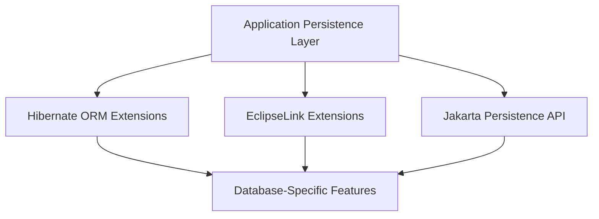
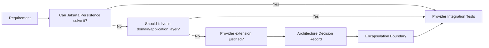
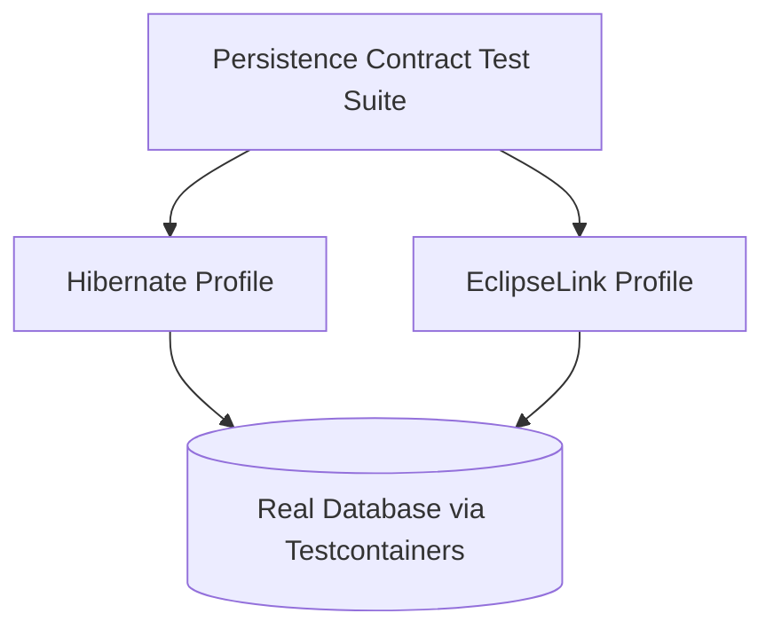

# Part 024 — Provider Extension Matrix: Hibernate vs EclipseLink

> Target part ini: kamu bisa memutuskan kapan harus tetap pada Jakarta Persistence portable API, kapan memakai extension Hibernate, kapan memakai extension EclipseLink, dan bagaimana mengisolasi lock-in agar tidak menjadi utang arsitektur tersembunyi.

Provider extension bukan dosa. Yang berbahaya adalah memakai provider extension tanpa sadar bahwa kamu baru saja mengubah portability, testing surface, migration cost, dan operational behavior.

Top engineer tidak bertanya:

> “Annotation mana yang paling cepat?”

Ia bertanya:

> “Invariant apa yang ingin dijaga, failure mode apa yang ingin dicegah, dan apakah provider extension ini adalah tempat yang tepat?”

---

## 1. Mental Model: Spec Core vs Provider Extension

Jakarta Persistence memberi contract umum:

- entity mapping;
- persistence context;
- transaction integration;
- JPQL/Criteria;
- lifecycle callback;
- locking;
- cache abstraction;
- entity graph;
- schema generation baseline.

Hibernate dan EclipseLink mengimplementasikan contract itu, lalu menambah fitur.



Portability berada di lapisan `Spec`. Power feature berada di lapisan provider dan database.

Trade-off-nya:

| Pilihan | Keuntungan | Biaya |
|---|---|---|
| Pure Jakarta Persistence | portable, mudah dipahami lintas provider | kadang kurang ekspresif/performa |
| Provider extension | lebih kuat, lebih dekat runtime provider | lock-in, test matrix lebih besar |
| Native SQL/database feature | kontrol penuh, performa tinggi | portability rendah, ORM context sync risk |
| Application-level pattern | jelas secara domain | lebih banyak code dan discipline |

---

## 2. Rule of Thumb

Gunakan Jakarta Persistence standar jika:

- behavior cukup diekspresikan oleh spec;
- tim butuh provider portability;
- mapping sederhana;
- performa cukup;
- failure mode tidak memerlukan provider hook.

Gunakan provider extension jika:

- spec tidak punya fitur setara;
- extension mengurangi bug secara signifikan;
- performa/observability/correctness butuh provider-level control;
- kamu bisa mengisolasi extension;
- kamu punya test yang mengunci behavior.

Jangan gunakan provider extension jika:

- hanya karena “lebih keren”;
- belum paham generated SQL-nya;
- tidak ada test integration;
- extension tersebar di semua entity tanpa ADR;
- requirement sebenarnya domain-level, bukan persistence-level.

---

## 3. Extension Governance Model

Di codebase besar, provider extension harus dikelola seperti contract arsitektur.



Setiap extension penting harus punya:

- alasan;
- alternative considered;
- failure modes;
- migration impact;
- testing strategy;
- owner;
- rollback strategy.

---

## 4. Matrix Ringkas

| Capability | Jakarta Persistence | Hibernate | EclipseLink | Catatan Arsitektur |
|---|---|---|---|---|
| Static mapping | Ya | Sangat kuat | Sangat kuat | portable dulu |
| Formula/computed read | Terbatas | `@Formula` | transformation/read transformer | provider-specific SQL risk |
| Soft delete | Tidak standar penuh | `@SoftDelete`, filter/custom SQL legacy | `@AdditionalCriteria` + custom behavior | visibility bukan audit |
| Dynamic filter | Tidak setara | `@Filter`, `@FilterDef` | AdditionalCriteria/session properties | hati-hati cache/security |
| Batch fetch | entity graph/fetch join terbatas | `@BatchSize`, `@Fetch`, fetch profile | `@BatchFetch`, query hints | test SQL count |
| Custom type | converter standar | type system, `@JdbcTypeCode`, custom type | converters, transformation mapping | database-specific |
| JSON/array | tidak portable penuh | strong provider support | converter/custom mapping | DB dialect penting |
| Natural ID | Tidak standar khusus | `@NaturalId` | tidak identik | cache/lookup semantics |
| Multi-tenancy | sebagian pattern manual | `@TenantId`, resolver, connection provider | `@Multitenant`, discriminator/table-per-tenant | security-critical |
| History/audit | callback standar | Envers/provider audit | HistoryPolicy/customizer | bulk path tetap risk |
| Event hooks | lifecycle callback | event system, interceptor | descriptor/session events | lock-in tinggi |
| SQL inspection | logging standar tidak cukup | `StatementInspector` | logging/session profiler | observability |
| Cache tuning | shared cache abstraction | regions/concurrency strategies | shared cache/coordination | correctness-sensitive |
| Weaving/enhancement | tidak detail | bytecode enhancement | weaving/indirection | build/runtime complexity |

---

## 5. Mapping Extension: Formula dan Computed Values

### 5.1 Hibernate `@Formula`

`@Formula` memetakan ekspresi SQL sebagai property read-only.

```java
@Entity
@Table(name = "account")
public class Account {
    @Id
    private Long id;

    @Column(nullable = false)
    private BigDecimal credit;

    @Column(nullable = false)
    private BigDecimal debit;

    @Formula("credit - debit")
    private BigDecimal balance;
}
```

Kapan cocok:

- nilai computed sederhana;
- read-only;
- query utama selalu butuh nilai tersebut;
- ekspresi SQL stabil;
- portability bukan prioritas utama.

Risiko:

- SQL formula native bisa tidak portable;
- indexing tidak otomatis;
- formula kompleks bisa membuat query berat;
- property tidak dapat di-update;
- logic bisnis bisa tersebar ke SQL string.

Alternatif:

- generated column database;
- view/read model;
- DTO projection;
- application calculation;
- materialized view.

### 5.2 EclipseLink Transformation Mapping

EclipseLink punya extension untuk transformation mapping/read-write transformer. Ini berguna saat satu attribute object dibentuk dari beberapa column atau transformasi database custom.

Contoh konseptual:

```java
@Entity
public class MoneyRecord {
    @Id
    private UUID id;

    @Column(name = "amount")
    private BigDecimal amount;

    @Column(name = "currency")
    private String currency;

    // mapping advanced bisa dilakukan melalui EclipseLink transformer/customizer
}
```

Kapan cocok:

- mapping value object tidak pas dengan `AttributeConverter` standar;
- butuh transformasi multi-column;
- tim siap memakai EclipseLink mapping extension.

Rule: untuk value object sederhana satu column, mulai dari `AttributeConverter`. Naik ke provider transformer hanya jika converter standar tidak cukup.

---

## 6. Custom Type dan Converter Matrix

| Kebutuhan | Jakarta Persistence | Hibernate | EclipseLink |
|---|---|---|---|
| Single column value object | `AttributeConverter` | `AttributeConverter`, type system | `AttributeConverter`, `@Converter` |
| Enum custom code | `@EnumeratedValue` / converter | converter/custom type | ObjectTypeConverter/TypeConverter |
| JSON column | tidak portable penuh | `@JdbcTypeCode(SqlTypes.JSON)` | converter/custom mapping |
| Array/range DB type | tidak portable penuh | custom JDBC/type support | converter/customizer |
| Multi-column value | embeddable | embeddable/custom type | transformation mapping |
| Database-specific binding | terbatas | `JdbcType`, `JavaType`, custom type | converter/platform customization |

### 6.1 Decision rule

Pilih paling sederhana yang menjaga invariant:

```txt
primitive column
  -> AttributeConverter
    -> Embeddable
      -> provider custom type/converter
        -> native SQL / DB-specific object
```

Jangan langsung memakai custom type provider hanya karena bisa. Custom type memperluas surface testing:

- bind parameter;
- read result;
- dirty checking;
- equality;
- null handling;
- schema generation;
- query literal;
- migration.

---

## 7. Dynamic Visibility: Filter, Additional Criteria, Tenant Predicate

Dynamic visibility adalah predicate yang ditambahkan ke query karena konteks runtime.

Contoh requirement:

- hanya data tenant aktif;
- hanya row `deleted = false`;
- hanya case yang boleh dilihat unit kerja user;
- hanya data effective pada `asOfDate`;
- hanya records dengan security label tertentu.

### 7.1 Hibernate Filter

Hibernate filter memungkinkan predicate dinamis diaktifkan pada session.

Contoh konseptual:

```java
@Entity
@FilterDef(
    name = "activeTenant",
    parameters = @ParamDef(name = "tenantId", type = String.class)
)
@Filter(name = "activeTenant", condition = "tenant_id = :tenantId")
@Table(name = "case_file")
public class CaseFile {
    @Id
    private UUID id;

    @Column(name = "tenant_id", nullable = false)
    private String tenantId;
}
```

Aktivasi:

```java
Session session = entityManager.unwrap(Session.class);
session.enableFilter("activeTenant")
       .setParameter("tenantId", currentTenantId);
```

Kapan cocok:

- predicate dinamis provider-level;
- query normal harus otomatis dibatasi;
- konteks tersedia per session/request;
- tim memahami cache interaction.

Risiko:

- lupa enable filter;
- cache/query cache bisa membingungkan jika tidak dikonfigurasi benar;
- native SQL tidak otomatis aman;
- filter bukan pengganti authorization;
- debugging query jadi lebih sulit.

### 7.2 EclipseLink AdditionalCriteria

EclipseLink `@AdditionalCriteria` menambahkan criteria tambahan ke entity/mapped superclass.

Contoh:

```java
@Entity
@AdditionalCriteria("this.tenantId = :tenant_id")
@Table(name = "case_file")
public class CaseFile {
    @Id
    private UUID id;

    @Column(name = "tenant_id", nullable = false)
    private String tenantId;
}
```

Tenant/context property perlu dipasang pada EntityManager/session sesuai mekanisme EclipseLink.

Kapan cocok:

- EclipseLink adalah provider utama;
- predicate visibility ingin dekat mapping descriptor;
- kamu butuh criteria otomatis;
- migration portability bukan prioritas.

Risiko:

- behavior tidak identik Hibernate filter;
- query admin/bypass harus didesain;
- native SQL/reporting tetap tidak otomatis;
- test harus membuktikan predicate masuk semua path yang relevan.

---

## 8. Soft Delete Matrix

| Aspek | Hibernate `@SoftDelete` | Hibernate Filter/Legacy Custom SQL | EclipseLink AdditionalCriteria Pattern | Application-level Flag |
|---|---|---|---|---|
| Convenience | Tinggi | Sedang | Sedang | Rendah |
| Provider integration | Tinggi | Sedang | Sedang | Rendah |
| Portability | Rendah | Rendah | Rendah | Tinggi |
| Query consistency | Baik untuk ORM path | Tergantung setup | Tergantung setup | Bergantung discipline |
| Admin see deleted | Perlu desain | Filter bisa disable | Perlu desain | Mudah secara eksplisit |
| Native SQL safety | Tidak otomatis | Tidak otomatis | Tidak otomatis | Tidak otomatis |
| Audit reason | Perlu tambahan | Perlu tambahan | Perlu tambahan | Perlu tambahan |
| Unique constraint | Tetap perlu desain DB | Tetap perlu desain DB | Tetap perlu desain DB | Tetap perlu desain DB |

Soft delete bukan sekadar annotation. Annotation hanya mengeksekusi visibility strategy.

---

## 9. Fetch Extension Matrix

| Capability | Hibernate | EclipseLink | Catatan |
|---|---|---|---|
| Batch fetch by size | `@BatchSize`, global default batch fetch size | `@BatchFetch` | efektif untuk N+1 tanpa join explosion |
| Fetch mode provider | `@Fetch(FetchMode.JOIN/SUBSELECT/SELECT)` | query hints / join fetch / batch fetch | SQL shape harus diuji |
| Fetch profile | `@FetchProfile` | fetch group/query hints | berguna untuk use-case-specific loading |
| Lazy basic attribute | bytecode enhancement | weaving/fetch groups | butuh build/runtime setup |
| Entity graph | Jakarta standard + provider behavior | Jakarta standard + provider behavior | portable tapi behavior detail bisa beda |
| Pagination with associations | perlu hati-hati | perlu hati-hati | DTO/two-step query sering lebih aman |

### 9.1 Hibernate example: batch size

```java
@Entity
public class CaseFile {
    @OneToMany(mappedBy = "caseFile")
    @BatchSize(size = 50)
    private Set<CaseNote> notes = new HashSet<>();
}
```

### 9.2 EclipseLink example: batch fetch

```java
@Entity
public class CaseFile {
    @OneToMany(mappedBy = "caseFile")
    @BatchFetch(BatchFetchType.IN)
    private List<CaseNote> notes = new ArrayList<>();
}
```

Rule: fetch extension harus dibuktikan dengan SQL count dan row count, bukan feeling.

---

## 10. Cache Extension Matrix

| Kebutuhan | Hibernate | EclipseLink | Catatan |
|---|---|---|---|
| Entity second-level cache | region + concurrency strategy | shared object cache | default semantics berbeda |
| Query cache | explicit query cache | query results cache policy | correctness-sensitive |
| Natural key lookup | `@NaturalId`, natural id cache | manual/query/cache approach | Hibernate lebih first-class |
| Read-only reference data | `@Immutable`, read-only cache region | `@ReadOnly`, cache policy | cocok untuk stable dictionary |
| Cache coordination | provider/cache-provider specific | cache coordination support | multi-node correctness |
| Tenant isolation | region/tenant-aware strategy | tenant/cache isolation strategy | security-critical |

Cache extension harus selalu punya invalidation story.

Checklist:

- Siapa writer-nya?
- Apakah writer selalu ORM?
- Apakah ada native SQL?
- Apakah ada bulk update?
- Apakah ada multi-node deployment?
- Apakah query cache mengandung tenant/security predicate?
- Apakah stale read acceptable?

Jika jawaban tidak jelas, jangan cache dulu.

---

## 11. Multi-Tenancy Matrix

| Model | Hibernate | EclipseLink | Catatan |
|---|---|---|---|
| Shared table discriminator | `@TenantId`/filter strategy | `@Multitenant` + discriminator column | paling rawan leakage jika predicate gagal |
| Schema per tenant | MultiTenantConnectionProvider/schema switching | session/login/custom platform strategy | migration kompleks |
| Database per tenant | connection provider resolver | session/data source routing | isolasi kuat, ops mahal |
| Cache isolation | tenant-aware keys/regions | shared cache isolation config | wajib diuji |
| Tenant context | CurrentTenantIdentifierResolver | EM/session property | jangan nullable |

### 11.1 Security invariant

Multi-tenancy bukan performance concern. Ini security boundary.

Invariant minimal:

```txt
No query, association traversal, cache lookup, bulk operation, native SQL, job, or report may access tenant data without explicit tenant context or approved cross-tenant mode.
```

Test harus mencoba membocorkan data lintas tenant, bukan hanya happy path.

---

## 12. Audit/History Extension Matrix

| Kebutuhan | Hibernate | EclipseLink | Alternatif |
|---|---|---|---|
| Entity revision history | Envers | HistoryPolicy/custom history | audit table manual |
| Audit metadata | JPA callback/listener | JPA callback/listener | DB trigger |
| Provider event audit | Hibernate events | descriptor/session events | outbox/domain event |
| Historical query | Envers audit query | historical session/policy | temporal table/manual query |
| Semantic domain audit | outbox/domain event | outbox/domain event | event store |

Rule:

- Gunakan provider audit untuk perubahan persistence.
- Gunakan domain events untuk fakta bisnis.
- Gunakan temporal model untuk fakta berlaku dalam waktu bisnis.
- Gunakan DB trigger/CDC jika semua writer harus tercakup, termasuk non-ORM.

---

## 13. Event and Interception Matrix

| Level | Hibernate | EclipseLink | Cocok Untuk |
|---|---|---|---|
| JPA callback | `@PrePersist`, etc. | `@PrePersist`, etc. | metadata lokal |
| Entity listener | `@EntityListeners` | `@EntityListeners` | reusable callback |
| Provider entity event | event listener system | descriptor event listener | advanced audit/rule |
| Session event | session events/interceptor | session event listener | diagnostics/session lifecycle |
| SQL inspection | `StatementInspector` | logging/profiler/session hooks | observability/policy check |
| Boot customization | Integrator/service contributor | session/descriptor customizer | framework integration |

Provider event extension harus dijaga di modul infrastruktur.

Struktur paket yang lebih sehat:

```txt
com.acme.case.domain
com.acme.case.application
com.acme.case.persistence.jpa
com.acme.case.persistence.hibernate
com.acme.case.persistence.eclipselink
com.acme.case.persistence.test
```

Jangan biarkan annotation provider-specific menyebar tanpa kontrol ke domain core jika domain model dimaksudkan portable.

---

## 14. Query Extension Matrix

| Capability | Hibernate/HQL | EclipseLink JPQL Extensions | Alternatif |
|---|---|---|---|
| Advanced function | function support/dialect | `FUNCTION`, `OPERATOR`, provider ops | native SQL |
| CTE/window support | tergantung HQL/provider/database | provider extensions/native | native SQL/read model |
| Set operations | provider support varies | extensions such as UNION/INTERSECT/EXCEPT in EclipseLink docs | native SQL |
| Entity-specific SQL | `@Subselect`, native query, formula | descriptor query customization | database view |
| Query hints | Hibernate hints | EclipseLink hints | standard hints if sufficient |

Rule: jika query sudah sangat database-specific, jangan memaksanya tampak portable. Gunakan native SQL/read model dengan boundary jelas.

---

## 15. SQL Customization Matrix

| Requirement | Hibernate | EclipseLink | Risiko |
|---|---|---|---|
| Custom insert/update/delete SQL | custom SQL annotations/features | descriptor/query customization | provider sync, generated columns |
| Computed column read | `@Formula`, generated mapping | transformation/read transformer | portability |
| Column transform read/write | `@ColumnTransformer` | converters/transformers | dirty checking, DB-specific syntax |
| Database generated values | generated annotations / refresh | generated fields/returning support | stale entity if not refreshed |
| Native named query | standard + provider mapping | standard + provider mapping | persistence context sync |

Jika custom SQL mengubah lebih dari satu table, pertimbangkan:

- stored procedure;
- explicit repository native SQL;
- database view/materialized view;
- outbox/reconciliation;
- not mapping it as ordinary entity mutation.

---

## 16. Weaving and Enhancement Matrix

| Capability | Hibernate | EclipseLink | Catatan |
|---|---|---|---|
| Lazy association | proxy/enhancement | indirection/weaving | default mechanics berbeda |
| Lazy basic fields | bytecode enhancement | weaving/fetch group | setup-sensitive |
| Dirty tracking optimization | enhancement | attribute/object/deferred change tracking | test bytecode setup |
| Association management | enhancement support | weaving/indirection | build/runtime impacts |
| Runtime instrumentation | possible | common in EclipseLink weaving | container/classloader matters |

Operational implication:

- CI build harus menjalankan enhancement/weaving sesuai production;
- test tanpa enhancement bisa memberi confidence palsu;
- native image/modular runtime/classloader perlu perhatian khusus;
- troubleshooting lazy loading harus tahu mekanisme provider.

---

## 17. Provider Lock-In Score

Gunakan skor sederhana:

| Score | Makna | Contoh |
|---:|---|---|
| 1 | Hampir portable | `@Entity`, `@OneToMany`, JPQL sederhana |
| 2 | Portable dengan caveat | entity graph, lock modes, shared cache hint |
| 3 | Provider-specific tapi isolated | repository native query, one entity `@Formula` |
| 4 | Provider-specific menyebar | filters di banyak entity, custom type global |
| 5 | Provider architecture dependency | Hibernate event system, EclipseLink descriptor/session customizers luas |

Target bukan selalu score 1. Targetnya adalah **score sadar**.

Untuk score 4-5, wajib ada:

- ADR;
- integration tests;
- migration notes;
- owner;
- monitoring;
- rollback/migration plan.

---

## 18. Encapsulation Patterns

### 18.1 Provider-specific adapter module

```txt
case-domain
case-application
case-persistence-api
case-persistence-jpa-common
case-persistence-hibernate
case-persistence-eclipselink
```

Domain/application tidak tahu `org.hibernate.*` atau `org.eclipse.persistence.*`.

### 18.2 Annotation isolation

Jika entity harus memakai annotation provider-specific, setidaknya isolasi:

- entity package;
- mapping documentation;
- tests per provider;
- code ownership;
- migration inventory.

### 18.3 Repository boundary

Expose intent, bukan provider mechanism.

Buruk:

```java
List<CaseFile> findWithHibernateFilterEnabled(...);
```

Lebih baik:

```java
List<CaseFile> findVisibleCasesForOfficer(OfficerScope scope);
```

Implementasi boleh memakai filter/provider extension, tetapi application layer membaca business intent.

---

## 19. Provider Extension ADR Template

Gunakan template ringkas berikut.

```md
# ADR: Use Hibernate @SoftDelete for CaseNote

## Context
CaseNote must be hidden from normal user queries but restorable by supervisors.

## Decision
Use Hibernate @SoftDelete on CaseNote and add deletion metadata fields.

## Alternatives
- Application-level deleted=false predicate
- Hibernate filter
- Physical delete + audit table
- Archive table

## Consequences
- Hibernate-specific mapping
- Native SQL/reporting must apply explicit predicate
- Unique constraints require partial index
- Admin restore requires separate repository path
- Cache for CaseNote disabled

## Tests
- normal query hides deleted notes
- admin query can retrieve deleted notes
- restore path checks unique constraints
- native report query policy test
- cache stale-read regression test
```

ADR seperti ini mencegah extension menjadi keputusan diam-diam.

---

## 20. Hibernate Extension Clusters

### 20.1 Mapping cluster

- `@Formula`
- `@ColumnTransformer`
- generated value annotations
- `@Immutable`
- `@NaturalId`
- `@SoftDelete`
- custom type annotations

Gunakan untuk mapping yang benar-benar tidak cukup dengan spec.

### 20.2 Fetch cluster

- `@BatchSize`
- `@Fetch`
- `@FetchProfile`
- bytecode enhancement

Gunakan untuk mengontrol query shape.

### 20.3 Visibility cluster

- `@FilterDef`
- `@Filter`
- `@SoftDelete`
- tenant support

Gunakan dengan cache/security tests.

### 20.4 Runtime cluster

- event listener;
- interceptor;
- `StatementInspector`;
- integrator;
- service registry customization.

Gunakan untuk framework-level integration, bukan domain logic sehari-hari.

---

## 21. EclipseLink Extension Clusters

### 21.1 Mapping cluster

- `@Converter`
- `@TypeConverter`
- `@ObjectTypeConverter`
- `@StructConverter`
- transformation mapping;
- descriptor customizer.

### 21.2 Fetch cluster

- `@BatchFetch`
- join fetch hints;
- fetch groups;
- indirection/weaving.

### 21.3 Visibility/multitenancy cluster

- `@AdditionalCriteria`
- `@Multitenant`
- tenant discriminator column(s)
- session/context properties.

### 21.4 Runtime cluster

- descriptor event listener;
- session event listener;
- session customizer;
- descriptor customizer;
- profiler/logging.

EclipseLink power banyak berada di descriptor/session model. Ini kuat, tetapi lebih dekat ke provider internals.

---

## 22. Migration Risk: Hibernate ke EclipseLink

Migrasi dari Hibernate ke EclipseLink biasanya sulit jika codebase memakai:

- HQL-specific syntax;
- `@Formula`;
- `@Filter`;
- `@SoftDelete`;
- `@NaturalId`;
- custom Hibernate types;
- Hibernate event system;
- Hibernate-specific cache annotations;
- reliance pada proxy behavior tertentu;
- `Session` API langsung.

Mitigasi:

- inventory annotation `org.hibernate.*`;
- inventory unwrap ke `Session`;
- SQL count tests;
- fetch behavior tests;
- cache behavior tests;
- query compatibility tests;
- replace provider-specific feature dengan adapter/domain pattern jika perlu.

---

## 23. Migration Risk: EclipseLink ke Hibernate

Migrasi dari EclipseLink ke Hibernate biasanya sulit jika codebase memakai:

- `@AdditionalCriteria`;
- `@Multitenant` EclipseLink;
- `@BatchFetch`;
- `@Customizer`;
- descriptor/session customizers;
- HistoryPolicy;
- EclipseLink converters;
- weaving/fetch group assumptions;
- EclipseLink query hints;
- direct `org.eclipse.persistence.*` API.

Mitigasi:

- inventory annotation `org.eclipse.persistence.*`;
- mapping equivalence matrix;
- replace descriptor customization dengan Hibernate events/types jika tetap migrate;
- run generated SQL regression;
- validate lazy loading and change tracking differences.

---

## 24. Dual Provider Compatibility Strategy

Jika portability benar-benar requirement, jangan hanya klaim “JPA portable”. Buktikan dengan dual-provider tests.



Test yang harus sama hasilnya:

- mapping bootstrap;
- insert/update/delete;
- optimistic lock;
- lazy loading boundary;
- fetch plan expected count;
- JPQL query semantics;
- pagination;
- cache disabled/enabled behavior;
- lifecycle callback;
- transaction rollback;
- schema validation.

Jika extension provider dipakai, test harus sadar profile:

```txt
PortableBehaviorTest      -> Hibernate + EclipseLink
HibernateExtensionTest    -> Hibernate only
EclipseLinkExtensionTest  -> EclipseLink only
```

---

## 25. Choosing Hibernate vs EclipseLink Extensions

### 25.1 Pilih Hibernate extension ketika

- platform utama sudah Hibernate/Spring Boot default;
- butuh Envers;
- butuh `@SoftDelete` provider-level;
- butuh custom type/JDBC type yang matang;
- butuh Hibernate statistics/event/StatementInspector;
- tim terbiasa membaca Hibernate SQL/fetch/caching behavior;
- library ecosystem banyak mengasumsikan Hibernate.

### 25.2 Pilih EclipseLink extension ketika

- platform/container sudah menstandarkan EclipseLink;
- butuh descriptor/session-level customization;
- butuh EclipseLink weaving/fetch groups/indirection model;
- butuh EclipseLink multitenancy annotations;
- butuh HistoryPolicy/historical session style;
- organisasi punya expertise EclipseLink/TopLink lineage;
- aplikasi memakai EclipseLink features lintas relational/XML/advanced mapping.

### 25.3 Jangan memilih berdasarkan dogma

Keputusan provider harus berdasarkan:

- existing platform;
- team expertise;
- required features;
- production observability;
- migration cost;
- ecosystem support;
- operational failure modes;
- long-term maintenance.

---

## 26. Case Study: Case Visibility Predicate

Requirement:

> Officer hanya boleh melihat case dari unitnya, bukan deleted, dan hanya tenant aktif.

Tiga pilihan desain:

### Option A — Application-level predicate

```java
select c
from CaseFile c
where c.tenantId = :tenantId
  and c.deleted = false
  and c.unitId in :allowedUnitIds
```

Keuntungan:

- eksplisit;
- portable;
- mudah review;
- query admin bisa berbeda.

Biaya:

- mudah lupa di query baru;
- predicate tersebar;
- repository discipline tinggi.

### Option B — Provider filter/additional criteria

Keuntungan:

- visibility otomatis untuk ORM path;
- mengurangi lupa predicate;
- cocok untuk tenant/soft delete yang universal.

Biaya:

- native SQL tidak otomatis;
- debugging lebih sulit;
- cache/security harus diuji;
- migration cost naik.

### Option C — Database row-level security

Keuntungan:

- enforcement dekat data;
- menangkap non-ORM writer/reader;
- security boundary kuat.

Biaya:

- application/debug complexity;
- DB-specific;
- connection/session variable management;
- testing lebih kompleks.

Rekomendasi realistis:

- tenant predicate: provider/database-level bisa justified;
- soft delete: provider-level bisa justified;
- officer authorization: sering lebih baik application/service-level atau DB RLS, tergantung criticality;
- semua harus dilengkapi test negative.

---

## 27. Case Study: Computed Risk Score

Requirement:

> Case memiliki risk score yang dihitung dari banyak faktor dan sering dipakai sorting/filtering.

Pilihan:

| Pilihan | Cocok Jika | Hindari Jika |
|---|---|---|
| Java computed getter | hanya display ringan | perlu filter/sort DB |
| Hibernate `@Formula` | SQL sederhana, read-only | query kompleks/portability penting |
| DB generated column | ekspresi DB stabil | butuh cross-DB portability |
| Materialized read model | query berat dan sering | data harus real-time kuat |
| Separate risk table | score dihitung async | consistency harus immediate |

Top engineer tidak langsung memakai `@Formula`. Ia melihat access pattern.

Jika risk score dipakai untuk sorting 1 juta row, formula per query bisa mahal. Read model/materialized column mungkin lebih benar.

---

## 28. Case Study: Money Type

Requirement:

> Money harus memiliki amount dan currency, tidak boleh currency kosong, dan equality harus value-based.

Pilihan:

### Embeddable portable

```java
@Embeddable
public class Money {
    @Column(name = "amount", nullable = false, precision = 19, scale = 4)
    private BigDecimal amount;

    @Column(name = "currency", nullable = false, length = 3)
    private String currency;
}
```

Ini portable dan jelas.

### Converter single column

Simpan sebagai string/json tunggal:

```txt
"100.00|USD"
```

Biasanya buruk untuk query/reporting.

### Provider custom type

Cocok jika database punya native composite type atau kebutuhan binding khusus.

Rule: untuk Money, embeddable biasanya pilihan terbaik. Provider custom type hanya jika ada alasan DB-specific kuat.

---

## 29. Extension Review Checklist

Sebelum approve provider extension, tanya:

1. Requirement apa yang tidak bisa dipenuhi spec?
2. Apakah domain/application-level pattern lebih tepat?
3. Apakah generated SQL sudah diprediksi?
4. Apakah behavior diuji dengan database asli?
5. Apakah cache interaction aman?
6. Apakah native/bulk path ikut aman?
7. Apakah annotation tersebar atau terisolasi?
8. Apakah migration cost diterima?
9. Apakah ada ADR?
10. Apakah tim bisa debug production issue-nya?

---

## 30. Anti-Patterns

### 30.1 Provider annotation sprawl

Entity penuh annotation provider-specific tanpa rationale.

```java
@Entity
@Filter(...)
@BatchSize(...)
@Formula(...)
@SoftDelete
@Cache(...)
public class EverythingEntity { }
```

Masalah:

- sulit migrate;
- behavior tidak jelas;
- tests kurang;
- mapping menjadi policy dumping ground.

### 30.2 Hiding authorization in ORM filter only

Filter membantu, tetapi authorization harus punya model eksplisit.

### 30.3 Formula for business-critical heavy calculation

`@Formula` tampak cepat, tetapi bisa membuat semua query berat.

### 30.4 Custom type without equality/dirty checking tests

Custom type salah bisa menyebabkan:

- update tidak terdeteksi;
- update selalu terjadi;
- null handling rusak;
- query parameter binding gagal.

### 30.5 Assuming EclipseLink and Hibernate hints equivalent

Nama konsep bisa mirip, tetapi behavior detail berbeda. Selalu test provider target.

---

## 31. Practical Inventory Script Ideas

Di codebase besar, buat inventory provider lock-in.

Cari import:

```txt
org.hibernate.
org.eclipse.persistence.
```

Cari annotation:

```txt
@Formula
@Filter
@FilterDef
@SoftDelete
@NaturalId
@BatchSize
@Fetch
@FetchProfile
@AdditionalCriteria
@Multitenant
@BatchFetch
@Customizer
@Converter
@ObjectTypeConverter
@TypeConverter
```

Cari unwrap:

```txt
unwrap(Session.class)
unwrap(UnitOfWork.class)
```

Cari query hints:

```txt
org.hibernate.
eclipselink.
jakarta.persistence.query.
```

Hasil inventory dikelompokkan:

| Extension | Count | Module | Business Critical? | Test Coverage | Migration Risk |
|---|---:|---|---:|---:|---:|
| `@Formula` | 12 | reporting | medium | low | high |
| `@SoftDelete` | 4 | notes | high | medium | medium |
| `@BatchFetch` | 9 | case-read | medium | high | medium |

Ini membuat lock-in terlihat dan bisa dikelola.

---

## 32. Testing Provider Extensions

Minimal test pattern:

```java
@Test
void visibleCaseQuery_appliesTenantAndSoftDeletePredicate() {
    // given tenants A and B, active and deleted rows
    // when querying as tenant A
    // then only tenant A active rows are returned
    // and SQL count remains bounded
}
```

Test provider extension harus memeriksa:

- result correctness;
- generated SQL shape;
- query count;
- cache behavior;
- bulk/native bypass behavior;
- disabled/admin mode if needed;
- transaction rollback;
- migration/schema compatibility.

Untuk extension fetch, jangan hanya assert data. Assert query count.

Untuk extension soft delete, jangan hanya assert delete. Assert normal read, relation traversal, admin read, unique constraint, and restore.

---

## 33. Documentation Pattern in Entity

Jika memakai annotation provider-specific, beri komentar singkat yang menjelaskan decision, bukan tutorial.

```java
@Entity
@SoftDelete // ADR-014: CaseNote must be restorable; normal queries hide deleted notes.
@Table(name = "case_note")
public class CaseNote { }
```

Atau:

```java
@Entity
@Formula("credit - debit") // ADR-021: read-only display balance; not used for ledger correctness.
public class AccountSnapshot { }
```

Komentar ini membantu reviewer memahami bahwa extension bukan accidental.

---

## 34. Production Readiness Rubric

| Area | Green | Yellow | Red |
|---|---|---|---|
| Rationale | ADR jelas | komentar tersebar | tidak ada alasan |
| Tests | DB asli + SQL behavior | happy path saja | tidak ada integration test |
| Cache | invalidation jelas | cache disabled sebagian | tidak dipikirkan |
| Native/Bulk | bypass documented | manual convention | tidak tahu |
| Migration | inventory ada | sebagian diketahui | lock-in tidak diketahui |
| Observability | metrics/logging ada | SQL log manual | blind |
| Team Knowledge | runbook ada | hanya senior tertentu tahu | tribal knowledge |

Jangan merge extension score tinggi dengan readiness merah.

---

## 35. Latihan 20 Jam

### Latihan A — Extension inventory

Ambil project Hibernate/EclipseLink. Buat inventory semua provider-specific import/annotation/hint. Kelompokkan berdasarkan risk score.

### Latihan B — Replace extension

Pilih satu extension dan desain alternatif portable.

Contoh:

- `@Formula` → DTO projection;
- `@Filter` → repository predicate;
- `@BatchSize` → query-specific entity graph;
- `@AdditionalCriteria` → explicit application query.

Bandingkan SQL, maintainability, dan risk.

### Latihan C — Provider-specific test

Buat satu test yang gagal jika extension tidak bekerja.

Contoh:

- soft delete row tidak muncul pada normal query;
- batch fetch menjaga query count;
- custom converter round-trip benar;
- additional criteria menerapkan tenant predicate.

### Latihan D — ADR writing

Tulis ADR untuk satu extension provider yang benar-benar kamu butuhkan.

Pastikan mencakup:

- context;
- decision;
- alternatives;
- consequences;
- tests;
- rollback.

---

## 36. Ringkasan

- Jakarta Persistence memberi portability; provider extension memberi power.
- Hibernate kuat di ecosystem, Envers, soft delete, type system, fetch tuning, statistics, dan event infrastructure.
- EclipseLink kuat di descriptor/session customization, weaving, batch fetch, additional criteria, multitenancy, converters, dan historical/session model.
- Provider extension harus diperlakukan sebagai keputusan arsitektur, bukan sekadar annotation nyaman.
- Setiap extension penting butuh ADR, test, observability, dan migration inventory.
- Filter/criteria/soft delete bukan pengganti authorization.
- Custom type/converter harus diuji untuk binding, round-trip, equality, dirty checking, dan null handling.
- Fetch extension harus dibuktikan dengan SQL count dan row count.
- Cache extension harus punya invalidation story.
- Tujuan bukan menghindari lock-in sepenuhnya, tetapi membuat lock-in **sadar, terisolasi, dan teruji**.

Part berikutnya akan masuk ke Hibernate secara lebih dalam: `Session`, `ActionQueue`, type system, event model, service registry, dan extension point internal yang layak diketahui oleh engineer senior.

---

## Referensi Resmi dan Lanjutan

- Jakarta Persistence 3.2 Specification — baseline portable ORM contract.
- Hibernate ORM User Guide 7.4.x — provider features such as formula, soft delete, filters, custom types, fetch tuning, cache, events, and statistics.
- Hibernate Envers Documentation — audited entities and revision model.
- EclipseLink JPA Extensions Reference — AdditionalCriteria, BatchFetch, Converter, Multitenant, Customizer, query hints, and extension annotations.
- EclipseLink API Documentation — DescriptorCustomizer, HistoryPolicy, SessionEventListener, descriptor/session-level APIs.
